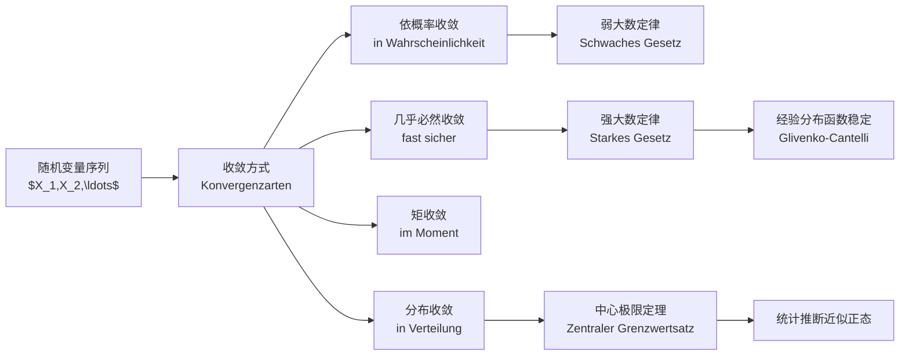
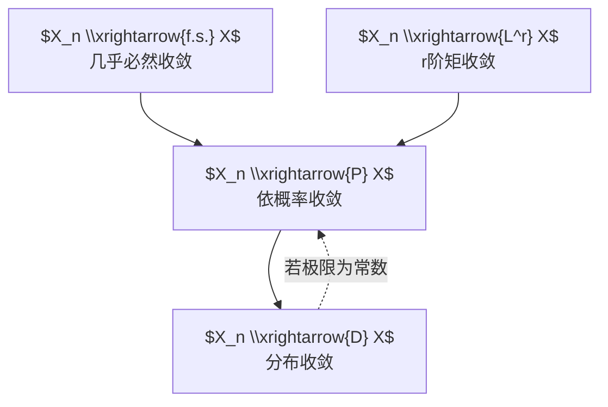

# 第五章：收敛（Konvergenz）学霸笔记

> 来源：`分章节讲义-下学期/05_Konvergenz.pdf`  
> 对应原讲义页码：S. 601-705  
> 核心主线：**随机变量序列如何趋近极限？样本均值为什么稳定？为什么正态分布会到处出现？**

---

## 0. 本章学习地图

> [!tip] 一句话抓住第五章
> 本章不是在问“一个数列是否收敛”，而是在问：  
> 一串随机变量、分布函数、样本均值、经验分布函数，在样本量 $n\to\infty$ 时，会以什么意义接近某个极限？

---

## 1. 为什么需要“多种收敛”？

在普通数学分析里，我们说数列 $a_n$ 收敛到 $a$，意思通常很直接：

$$a_n\to a.$$

但随机变量不是一个单纯数字，而是一个函数：

$$X_n:\Omega\to\mathbb R.$$

也就是说，每个 $\omega\in\Omega$ 都对应一条数列：

$$X_1(\omega),X_2(\omega),\ldots$$

于是问题来了：

> [!question] 同样说 $X_n\to X$，到底要多强？
> - 是对几乎每个 $\omega$，路径都收敛？
> - 还是允许少数路径不收敛，只要概率上越来越接近？
> - 还是只要求分布形状越来越像？
> - 还是要求平均误差越来越小？

这就是本章的核心：**不同收敛方式代表不同强度的“接近”。**

---

## 2. 收敛方式总览

| 中文 | 德文关键词 | 英文 | 符号 | 直觉强度 |
|---|---|---|---|---|
| 几乎必然收敛 | fast sichere Konvergenz | almost sure convergence | $X_n\xrightarrow{f.s.}X$ | 很强 |
| 依概率收敛 | Konvergenz in Wahrscheinlichkeit | convergence in probability | $X_n\xrightarrow{P}X$ | 中等 |
| $r$ 阶矩收敛 | Konvergenz im $r$-ten Moment | convergence in $r$-th moment | $X_n\xrightarrow{L^r}X$ | 通常强于依概率 |
| 分布收敛 | Konvergenz in Verteilung | convergence in distribution | $X_n\xrightarrow{D}X$ | 最弱 |

> [!important] 强弱关系
> 一般有：
>
> $$X_n\xrightarrow{f.s.}X \Longrightarrow X_n\xrightarrow{P}X \Longrightarrow X_n\xrightarrow{D}X.$$
>
> 以及：
>
> $$X_n\xrightarrow{L^r}X \Longrightarrow X_n\xrightarrow{P}X.$$
>
> 反方向通常不成立。

---

## 3. 几乎必然收敛（fast sichere Konvergenz）

### 3.1 通俗理解

几乎必然收敛就是：

> 除了一个概率为 0 的坏集合以外，每一条随机路径最终都真的收敛。

你可以把 $\omega$ 想成一个“世界线”。几乎必然收敛要求：对几乎所有世界线，$X_n(\omega)$ 都像普通数列一样收敛到 $X(\omega)$。

### 3.2 数学定义

随机变量序列 $(X_n)$ 几乎必然收敛到 $X$，若

$$P\left(\left\{\omega:\lim_{n\to\infty}X_n(\omega)=X(\omega)\right\}\right)=1.$$

记作：

$$X_n\xrightarrow{f.s.}X.$$

也常写作：

$$X_n\xrightarrow{a.s.}X.$$

其中：

- 德文：fast sicher
- 英文：almost surely
- 中文：几乎必然

### 3.3 学霸理解

几乎必然收敛本质上是：

> 先固定 $\omega$，再让 $n\to\infty$。

这和普通函数列的逐点收敛很像。区别是：允许在一个概率为 0 的集合上失败。

> [!warning] 易错点
> “概率为 1”不等于“每一个 $\omega$ 都成立”。  
> 概率论里允许一些极端路径存在，只要这些路径组成的集合概率为 0。

---

## 4. 依概率收敛（Konvergenz in Wahrscheinlichkeit）

### 4.1 通俗理解

依概率收敛不要求每条路径都稳定。它只要求：

> $X_n$ 偏离 $X$ 超过任意固定误差 $\varepsilon$ 的概率，随着 $n$ 增大趋向 0。

换句话说，$X_n$ 可能偶尔乱跳，但乱跳的概率越来越小。

### 4.2 数学定义

对任意 $\varepsilon>0$，若

$$P(|X_n-X|>\varepsilon)\to0,\qquad n\to\infty,$$

则称 $X_n$ 依概率收敛到 $X$，记作：

$$X_n\xrightarrow{P}X.$$

### 4.3 和几乎必然收敛的区别

| 对比 | 几乎必然收敛 | 依概率收敛 |
|---|---|---|
| 看什么 | 每条路径最终是否收敛 | 偏离概率是否趋近 0 |
| 固定谁 | 固定 $\omega$ 看数列 | 固定 $\varepsilon$ 看概率 |
| 强度 | 更强 | 较弱 |
| 典型定理 | 强大数定律 | 弱大数定律 |

> [!note] 记忆法
> **几乎必然收敛**像“每个人最后都稳定下来”。  
> **依概率收敛**像“越来越少的人还在偏离”。

---

## 5. $r$ 阶矩收敛（Konvergenz im $r$-ten Moment）

### 5.1 通俗理解

矩收敛关心的是平均误差：

> $X_n$ 和 $X$ 的距离不只是概率上小，而是平均意义下也小。

如果误差的 $r$ 次方期望趋向 0，就叫 $r$ 阶矩收敛。

### 5.2 数学定义

若

$$E(|X_n-X|^r)\to0,\qquad r\ge1,$$

则称 $X_n$ 在 $r$ 阶矩意义下收敛到 $X$：

$$X_n\xrightarrow{L^r}X.$$

常见情况：

- $r=1$：一阶矩收敛，平均绝对误差趋向 0。
- $r=2$：均方收敛（Konvergenz im quadratischen Mittel），均方误差趋向 0。

### 5.3 为什么矩收敛推出依概率收敛？

用 Markov 不等式：

$$P(|X_n-X|>\varepsilon)
\le \frac{E(|X_n-X|^r)}{\varepsilon^r}.$$

如果右边趋向 0，那么左边也趋向 0。

所以：

$$X_n\xrightarrow{L^r}X\Longrightarrow X_n\xrightarrow{P}X.$$

> [!important] 考试高频
> 看到“均方误差趋于 0”“$E(|X_n-X|^r)\to0$”，立刻想到：  
> 可以推出依概率收敛。

---

## 6. 分布收敛（Konvergenz in Verteilung）

### 6.1 通俗理解

分布收敛最弱。它不要求 $X_n(\omega)$ 和 $X(\omega)$ 在同一个样本点上接近，甚至不要求它们定义在同一个概率空间上。

它只关心：

> $X_n$ 的分布形状是否越来越像 $X$ 的分布形状。

### 6.2 数学定义

设 $F_n$ 是 $X_n$ 的分布函数，$F$ 是 $X$ 的分布函数。若对所有 $F$ 的连续点 $x$，

$$F_n(x)\to F(x),$$

则称

$$X_n\xrightarrow{D}X.$$

### 6.3 为什么只要求在连续点？

分布函数可能有跳跃点。跳跃点对应离散概率质量。极限过程在跳跃点附近可能出现左右不一致，因此定义只要求在极限分布函数 $F$ 的连续点上收敛。

> [!warning] 易错点
> 分布收敛不是说 $F_n(x)$ 对所有 $x$ 都收敛到 $F(x)$，而是对 $F$ 的连续点。

### 6.4 特殊重要结论

如果极限 $X$ 是常数 $c$，则：

$$X_n\xrightarrow{D}c \Longleftrightarrow X_n\xrightarrow{P}c.$$

也就是说，**当极限是常数时，分布收敛和依概率收敛等价**。

---

## 7. 收敛方式关系图

> [!danger] 不要乱反推
> - 分布收敛一般不能推出依概率收敛。
> - 依概率收敛一般不能推出几乎必然收敛。
> - 依概率收敛一般不能推出矩收敛。

---

## 8. 大数定律：样本均值为什么稳定？

### 8.1 核心问题

设 $X_1,X_2,\ldots$ 是独立同分布随机变量（unabhängig und identisch verteilt, iid），共同期望为 $\mu$。

样本均值：

$$\bar X_n=\frac1n\sum_{i=1}^n X_i.$$

大数定律回答：

> 当 $n$ 越来越大，$\bar X_n$ 会不会接近真实期望 $\mu$？

---

## 9. 弱大数定律（Schwaches Gesetz der großen Zahlen）

### 9.1 通俗理解

弱大数定律说：

> 样本均值偏离真实均值超过 $\varepsilon$ 的概率，会趋向 0。

也就是：

$$\bar X_n\xrightarrow{P}\mu.$$

### 9.2 常见版本

若 $X_1,\ldots,X_n$ 独立同分布，且

$$E(X_i)=\mu,\qquad Var(X_i)=\sigma^2<\infty,$$

则

$$\bar X_n\xrightarrow{P}\mu.$$

### 9.3 证明直觉

先算期望：

$$E(\bar X_n)=\mu.$$

再算方差：

$$Var(\bar X_n)=Var\left(\frac1n\sum_{i=1}^n X_i\right)
=\frac{1}{n^2}\cdot n\sigma^2
=\frac{\sigma^2}{n}.$$

当 $n\to\infty$：

$$Var(\bar X_n)\to0.$$

用 Chebyshev 不等式：

$$P(|\bar X_n-\mu|>\varepsilon)
\le \frac{Var(\bar X_n)}{\varepsilon^2}
=\frac{\sigma^2}{n\varepsilon^2}\to0.$$

所以：

$$\bar X_n\xrightarrow{P}\mu.$$

> [!tip] 学霸记忆
> 弱大数定律 = **均值会稳定，但用的是“概率意义”稳定**。

---

## 10. 强大数定律（Starkes Gesetz der großen Zahlen）

### 10.1 通俗理解

强大数定律比弱大数定律更强：

> 几乎每一条样本路径上，样本均值都会真的收敛到 $\mu$。

即：

$$\bar X_n\xrightarrow{f.s.}\mu.$$

### 10.2 Kolmogorov 强大数定律常见表述

若 $X_1,X_2,\ldots$ 独立同分布，且

$$E(|X_1|)<\infty,$$

则

$$\frac1n\sum_{i=1}^n X_i\xrightarrow{f.s.}E(X_1).$$

### 10.3 强弱对比

| 定理 | 收敛结论 | 直觉 |
|---|---|---|
| 弱大数定律 | $\bar X_n\xrightarrow{P}\mu$ | 偏离概率越来越小 |
| 强大数定律 | $\bar X_n\xrightarrow{f.s.}\mu$ | 几乎每条路径最终收敛 |

> [!important] 考试句型
> “Nach dem schwachen Gesetz der großen Zahlen konvergiert das Stichprobenmittel in Wahrscheinlichkeit gegen den Erwartungswert.”  
> 根据弱大数定律，样本均值依概率收敛到期望。

---

## 11. iid：独立同分布为什么重要？

独立同分布（unabhängig und identisch verteilt, iid）包含两层：

1. **独立（unabhängig）**：不同观测之间没有概率依赖。
2. **同分布（identisch verteilt）**：每个 $X_i$ 的分布相同。

为什么重要？

- 同分布保证每个观测来自同一个机制。
- 独立保证信息不会重复绑定在一起。
- 大数定律和中心极限定理的经典版本都依赖 iid 或类似条件。

> [!warning] 易错点
> 独立和同分布是两件事。  
> 可以独立但不同分布，也可以同分布但不独立。

---

## 12. 中心极限定理：为什么正态分布无处不在？

### 12.1 先区分大数定律和中心极限定理

| 问题 | 大数定律 | 中心极限定理 |
|---|---|---|
| 关心什么 | $\bar X_n$ 是否接近 $\mu$ | $\bar X_n$ 的误差长什么样 |
| 结论 | $\bar X_n\to\mu$ | 标准化误差趋向正态 |
| 收敛类型 | 依概率或几乎必然 | 分布收敛 |
| 关键词 | 稳定 | 近似正态 |

大数定律告诉你：

$$\bar X_n\approx\mu.$$

中心极限定理告诉你：

$$\bar X_n-\mu \text{ 的波动近似正态。}$$

### 12.2 数学表述

设 $X_1,X_2,\ldots$ iid，且

$$E(X_i)=\mu,\qquad Var(X_i)=\sigma^2<\infty.$$

则

$$\frac{\sqrt n(\bar X_n-\mu)}{\sigma}
=\frac{\sum_{i=1}^n X_i-n\mu}{\sqrt n\sigma}
\xrightarrow{D}N(0,1).$$

这就是 Lindeberg-Levy 版本的中心极限定理。

### 12.3 通俗解释

很多随机误差相加后，即使每个误差本身不是正态，只要它们独立、同分布、方差有限，总和经过标准化后也会越来越像正态分布。

> [!tip] 这就是统计推断的基础
> 置信区间、假设检验、回归系数近似正态，背后常常都靠中心极限定理或它的推广。

---

## 13. 标准化到底在做什么？

中心极限定理中最重要的是这个表达式：

$$Z_n=\frac{\sqrt n(\bar X_n-\mu)}{\sigma}.$$

逐层拆开：

| 部分 | 意义 |
|---|---|
| $\bar X_n-\mu$ | 样本均值误差 |
| $\sqrt n$ | 放大误差，因为误差本身约为 $1/\sqrt n$ |
| $\sigma$ | 标准化单位 |
| $Z_n$ | 变成可比较的标准尺度 |

如果不用 $\sqrt n$ 放大，$\bar X_n-\mu$ 会直接趋近 0，看不到误差形状。  
中心极限定理的高明之处是：**把正在缩小的误差放大到稳定尺度，再看极限分布。**

---

## 14. Slutsky 定理（Satz von Slutsky）

### 14.1 通俗理解

Slutsky 定理用于处理统计量里的“估计参数替换”。

比如 CLT 里有 $\sigma$，但现实中 $\sigma$ 往往未知。我们用样本标准差 $S_n$ 替代它，只要

$$S_n\xrightarrow{P}\sigma,$$

那么替换后通常不破坏极限分布。

### 14.2 常用形式

若

$$X_n\xrightarrow{D}X,\qquad A_n\xrightarrow{P}a,\qquad B_n\xrightarrow{P}b,$$

则：

$$A_n+B_nX_n\xrightarrow{D}a+bX.$$

尤其是当 $A_n\to0$、$B_n\to1$ 时：

$$B_nX_n+A_n\xrightarrow{D}X.$$

> [!important] 统计推断意义
> Slutsky 定理说明：  
> 在渐近分布中，可以用一致估计量替代未知常数。

---

## 15. Berry-Esseen：CLT 收敛有多快？

中心极限定理只说：

$$Z_n\xrightarrow{D}N(0,1).$$

但它没有告诉你有限样本 $n=30$、$n=100$ 时近似有多好。

Berry-Esseen 定理给出误差上界。粗略理解：

> 如果三阶绝对矩有限，那么正态近似误差大约是 $O(1/\sqrt n)$。

也就是说：

$$\sup_x |P(Z_n\le x)-\Phi(x)| \le \frac{C\cdot E(|X-\mu|^3)}{\sigma^3\sqrt n}.$$

> [!note] 直觉
> 样本量越大，正态近似越好；  
> 分布尾部越重、偏斜越强，近似通常越慢。

---

## 16. 经验分布函数与 Glivenko-Cantelli 定理

### 16.1 经验分布函数

给定样本 $X_1,\ldots,X_n$，经验分布函数为：

$$\hat F_n(x)=\frac1n\sum_{i=1}^n I(X_i\le x).$$

它表示：

> 样本中有多少比例不超过 $x$。

### 16.2 对固定 $x$ 的理解

对某个固定 $x$，指示变量

$$I(X_i\le x)$$

是 Bernoulli 随机变量，其期望为：

$$E[I(X_i\le x)]=P(X_i\le x)=F(x).$$

所以：

$$\hat F_n(x)=\frac1n\sum_{i=1}^n I(X_i\le x).$$

这就是 Bernoulli 变量的样本均值。由强大数定律：

$$\hat F_n(x)\xrightarrow{f.s.}F(x).$$

### 16.3 Glivenko-Cantelli 定理

更强的是，经验分布函数不仅逐点收敛，而且一致收敛：

$$\sup_x|\hat F_n(x)-F(x)|\xrightarrow{f.s.}0.$$

这就是统计学基本定理之一。

> [!tip] 通俗理解
> 样本越来越大时，整条经验分布函数曲线会贴近真实分布函数曲线。

---

## 17. 本章核心公式卡片

> [!summary] 必背公式
>
> **依概率收敛**
> $$X_n\xrightarrow{P}X\iff P(|X_n-X|>\varepsilon)\to0,\quad \forall\varepsilon>0.$$
>
> **矩收敛**
> $$X_n\xrightarrow{L^r}X\iff E(|X_n-X|^r)\to0.$$
>
> **分布收敛**
> $$X_n\xrightarrow{D}X\iff F_n(x)\to F(x)\quad\text{在 }F\text{ 的连续点}.$$
>
> **弱大数定律**
> $$\bar X_n\xrightarrow{P}\mu.$$
>
> **强大数定律**
> $$\bar X_n\xrightarrow{f.s.}\mu.$$
>
> **中心极限定理**
> $$\frac{\sqrt n(\bar X_n-\mu)}{\sigma}\xrightarrow{D}N(0,1).$$
>
> **经验分布函数**
> $$\hat F_n(x)=\frac1n\sum_{i=1}^n I(X_i\le x).$$

---

## 18. 易错点总表

| 易错点 | 错误理解 | 正确理解 |
|---|---|---|
| $X_n\xrightarrow{D}X$ | $X_n$ 和 $X$ 数值接近 | 只是分布函数接近 |
| $X_n\xrightarrow{P}X$ | 每条路径都收敛 | 偏离概率趋向 0 |
| $X_n\xrightarrow{f.s.}X$ | 绝对每个样本点都收敛 | 除概率 0 集合外都收敛 |
| 大数定律 | 样本均值等于期望 | 样本均值在极限中接近期望 |
| CLT | 原变量变正态 | 标准化后的和/均值误差趋于正态 |
| 分布收敛 | 所有点都要求 $F_n(x)\to F(x)$ | 只要求 $F$ 的连续点 |
| Slutsky | 可以随便替换 | 替换量必须依概率收敛到常数 |

---

## 19. 德文关键词表

| Deutsch | 中文 | 复习提示 |
|---|---|---|
| die Konvergenz | 收敛 | 总主题 |
| die Zufallsvariable | 随机变量 | 可测函数 |
| die Folge von Zufallsvariablen | 随机变量序列 | $X_1,X_2,\ldots$ |
| fast sichere Konvergenz | 几乎必然收敛 | 路径层面，概率 1 |
| Konvergenz in Wahrscheinlichkeit | 依概率收敛 | 偏离概率趋 0 |
| Konvergenz im Moment | 矩收敛 | 平均误差趋 0 |
| Konvergenz in Verteilung | 分布收敛 | 分布函数趋近 |
| das Gesetz der großen Zahlen | 大数定律 | 样本均值稳定 |
| schwaches Gesetz der großen Zahlen | 弱大数定律 | 依概率收敛 |
| starkes Gesetz der großen Zahlen | 强大数定律 | 几乎必然收敛 |
| unabhängig und identisch verteilt | 独立同分布 | iid/u.i.v. |
| der Erwartungswert | 期望 | $\mu$ |
| die Varianz | 方差 | $\sigma^2$ |
| der Zentrale Grenzwertsatz | 中心极限定理 | CLT/ZGWS |
| die Verteilungsfunktion | 分布函数 | $F(x)=P(X\le x)$ |
| die empirische Verteilungsfunktion | 经验分布函数 | $\hat F_n$ |
| der Satz von Slutsky | Slutsky 定理 | 渐近替换工具 |
| der Satz von Glivenko-Cantelli | Glivenko-Cantelli 定理 | 经验分布一致收敛 |
| die Standardisierung | 标准化 | 减均值除标准差 |
| die Grenzverteilung | 极限分布 | 渐近分布 |

---

## 20. 关键德文句型

- **Die Folge $(X_n)$ konvergiert fast sicher gegen $X$.**  
  序列 $(X_n)$ 几乎必然收敛到 $X$。

- **Für jedes $\varepsilon>0$ gilt $P(|X_n-X|>\varepsilon)\to0$.**  
  对每个 $\varepsilon>0$，偏离概率趋向 0。

- **Nach dem schwachen Gesetz der großen Zahlen gilt $\bar X_n\xrightarrow{P}\mu$.**  
  根据弱大数定律，样本均值依概率收敛到 $\mu$。

- **Der zentrale Grenzwertsatz liefert die asymptotische Normalverteilung des standardisierten Stichprobenmittels.**  
  中心极限定理给出标准化样本均值的渐近正态分布。

- **Die empirische Verteilungsfunktion konvergiert fast sicher gegen die wahre Verteilungsfunktion.**  
  经验分布函数几乎必然收敛到真实分布函数。

---

## 21. 最后复习：五分钟闭卷默写

> [!check] 你应该能不看笔记回答这些问题

1. 写出依概率收敛的定义。
2. 写出几乎必然收敛和依概率收敛的区别。
3. 写出 $L^r$ 收敛为什么推出依概率收敛。
4. 写出弱大数定律和强大数定律的结论。
5. 写出中心极限定理的标准化形式。
6. 解释为什么 CLT 不是说 $X_i$ 本身变成正态。
7. 写出经验分布函数 $\hat F_n(x)$。
8. 解释 Glivenko-Cantelli 定理的直觉。

---

## 22. 全面补充：逐页审计后必须补上的定理与工具

> [!important] 为什么有这一节？
> 第五章 PPT 有 105 页。前面主笔记已经覆盖了主线逻辑，但为了更全面复习，这里把 PPT 中出现、但容易在“主线版笔记”里被压缩掉的定理、例子和补充版本集中补齐。

### 22.1 收敛关系相关定理：Satz 14.4, 14.6, 14.7, 14.8

#### Satz 14.4：几乎必然收敛推出依概率收敛

若

$$X_n\xrightarrow{f.s.}X,$$

则

$$X_n\xrightarrow{P}X.$$

通俗理解：如果几乎每条路径最后都贴近 $X$，那么“偏离超过 $\varepsilon$ 的路径集合”的概率当然会越来越小。

> [!note] 记忆
> 路径层面稳定 $\Rightarrow$ 概率层面稳定。

#### Satz 14.6：高阶矩收敛推出低阶矩收敛

如果 $s>r\ge1$，且

$$X_n\xrightarrow{L^s}X,$$

则

$$X_n\xrightarrow{L^r}X.$$

直觉：高阶矩对大误差惩罚更重。如果更严格的高阶误差都趋于 0，那么低阶误差也会趋于 0。

#### Satz 14.7：矩收敛推出依概率收敛

若

$$X_n\xrightarrow{L^r}X,$$

则

$$X_n\xrightarrow{P}X.$$

证明核心是 Markov 不等式：

$$P(|X_n-X|>\varepsilon)\le\frac{E(|X_n-X|^r)}{\varepsilon^r}.$$

#### Satz 14.8：由几乎必然收敛得到可控的概率表述

这部分 PPT 的重点是：几乎必然收敛可以通过“尾部偏离事件”的概率来刻画。直觉上，若从某个 $n$ 之后还会反复偏离 $\varepsilon$ 的概率趋于 0，那么路径层面的坏行为会消失。

常见表达是：

$$P\left(\bigcup_{k\ge n}\{|X_k-X|>\varepsilon\}\right)\to0.$$

这比单独看 $P(|X_n-X|>\varepsilon)$ 更强，因为它控制的是“从 $n$ 以后是否还会出现偏离”。

---

### 22.2 Borel-Cantelli 引理（Borel-Cantelli-Lemma）

PPT 中出现了 Satz 14.9：Borel-Cantelli-Lemma I。

设 $(A_n)$ 是事件序列。如果

$$\sum_{n=1}^{\infty}P(A_n)<\infty,$$

则

$$P(A_n\ \text{unendlich oft})=0.$$

也就是说，如果事件发生概率的总和有限，那么这些事件只会发生有限多次，几乎不可能无限反复发生。

> [!tip] 通俗理解
> 如果每次出错的概率加起来都有限，那么“无限次出错”的概率为 0。

在收敛问题里常令：

$$A_n=\{|X_n-X|>\varepsilon\}.$$

如果能证明

$$\sum_n P(|X_n-X|>\varepsilon)<\infty,$$

就能推出偏离事件只发生有限多次，从而帮助证明几乎必然收敛。

---

### 22.3 Bernoulli 定理与 Khinchine 大数定律

#### Bernoulli 定理（Theorem von Bernoulli）

Bernoulli 定理是大数定律最经典的起点。若

$$X_i\sim Bernoulli(p),\quad iid,$$

则样本比例

$$\bar X_n=\frac1n\sum_{i=1}^n X_i$$

依概率收敛到真实成功概率：

$$\bar X_n\xrightarrow{P}p.$$

通俗解释：重复投硬币时，正面频率会越来越接近真实正面概率。

#### Khinchine 大数定律（Satz von Khinchine）

PPT 强调：弱大数定律不一定需要有限方差。Khinchine 版本说明，在 iid 且期望存在的条件下，样本均值仍可依概率收敛到期望：

$$\bar X_n\xrightarrow{P}\mu.$$

> [!important] 和基础弱大数定律的区别
> 基础版常要求 $Var(X_i)<\infty$，这样可用 Chebyshev 不等式简单证明。  
> Khinchine 版本更强：核心要求是期望存在，不强制有限方差。

---

### 22.4 一般大数定律：Etemadi、Kolmogorov、Cantelli

PPT 后半部分列出了一些更一般的大数定律，它们的作用是告诉你：大数定律不只有“iid + 有限方差”一种版本。

#### Etemadi 强大数定律

若随机变量序列同分布、两两独立，并且

$$E(|X_n|)<\infty,$$

则满足强大数定律。

重点：这里不要求完全相互独立，只要求两两独立。

#### Kolmogorov 第一定律

这是处理非同分布独立随机变量的大数定律版本。核心思想是：如果独立变量的方差增长被控制住，那么平均偏差仍会趋于 0。

常见条件长得像：

$$\sum_{n=1}^{\infty}\frac{Var(X_n)}{n^2}<\infty.$$

这类条件用于保证波动不会累积得太快。

#### Cantelli 定理

Cantelli 版本也是处理一般随机变量序列的大数律工具。复习时不必把所有技术条件死背，但要知道它属于：

> 用更一般条件保证样本平均或中心化平均收敛的大数定律。

---

### 22.5 多元强大数定律（Multivariates starkes Gesetz）

如果 $X_i$ 是 $p$ 维随机向量：

$$X_i=(X_{i1},\ldots,X_{ip})^\top,$$

那么样本均值也是向量：

$$\bar X_n=\frac1n\sum_{i=1}^n X_i.$$

多元强大数定律说，在合适条件下：

$$\bar X_n\xrightarrow{f.s.}\mu=E(X_1).$$

这其实就是每个坐标分别使用强大数定律：

$$\bar X_{n,j}\xrightarrow{f.s.}\mu_j,\qquad j=1,\ldots,p.$$

> [!tip] 记忆
> 多元大数定律 = 向量的每个坐标都满足大数定律。

---

### 22.6 de Moivre-Laplace 定理

de Moivre-Laplace 是二项分布的中心极限定理特例。

若

$$X_n\sim Bin(n,p),$$

则

$$\frac{X_n-np}{\sqrt{np(1-p)}}\xrightarrow{D}N(0,1).$$

通俗解释：当 $n$ 很大时，二项分布可以用正态分布近似。

常用近似：

$$Bin(n,p)\approx N(np,np(1-p)).$$

> [!warning] 连续性修正
> 用连续正态近似离散二项分布时，实际计算概率常加连续性修正，例如 $P(X\le k)$ 近似为 $P(Y\le k+0.5)$。

---

### 22.7 Landau 符号（Landau-Symbole）

PPT 中 Definition 15.6 介绍了 Landau 符号，用来描述收敛速度。

常见符号：

| 符号 | 读法 | 含义 |
|---|---|---|
| $a_n=O(b_n)$ | big O | $a_n$ 至多和 $b_n$ 同阶 |
| $a_n=o(b_n)$ | small o | $a_n$ 比 $b_n$ 小得多 |

数学上：

$$a_n=O(b_n)$$

表示存在常数 $C$ 和 $n_0$，使得 $n\ge n_0$ 时：

$$|a_n|\le C|b_n|.$$

而

$$a_n=o(b_n)$$

表示：

$$\frac{a_n}{b_n}\to0.$$

在 CLT 里，常见误差速度是：

$$O(n^{-1/2}).$$

这表示误差大约随 $1/\sqrt n$ 下降。

---

### 22.8 Berry-Esseen 的更精确理解

前面已经写了 Berry-Esseen 的直觉，这里补全它的考试意义：

中心极限定理只说极限成立：

$$Z_n\xrightarrow{D}N(0,1).$$

Berry-Esseen 进一步回答：

> 有限样本下，$Z_n$ 的分布函数和标准正态分布函数最多差多少？

它给出形如：

$$\sup_x |F_n(x)-\Phi(x)|\le \frac{C E(|X-\mu|^3)}{\sigma^3\sqrt n}.$$

其中：

- $E(|X-\mu|^3)$ 是三阶绝对中心矩；
- $\sigma^3$ 用来标准化尺度；
- $1/\sqrt n$ 是收敛速度；
- $C$ 是一个通用常数。

> [!important] 学霸理解
> CLT 是“会收敛”，Berry-Esseen 是“收敛多快”。

---

### 22.9 Cramér-Wold 与多元中心极限定理

PPT 后面还提到多元极限定理。多元 CLT 的核心是：

若 $X_i$ 是 $k$ 维 iid 随机向量，均值为 $\mu$，协方差矩阵为 $\Sigma$，则

$$\sqrt n(\bar X_n-\mu)\xrightarrow{D}N_k(0,\Sigma).$$

这里的 $N_k(0,\Sigma)$ 是 $k$ 维正态分布。

#### Cramér-Wold 思想

要证明向量收敛，可以看所有线性组合：

$$a^\top X_n.$$

如果对所有向量 $a$，

$$a^\top X_n\xrightarrow{D}a^\top X,$$

那么可以推出向量本身分布收敛：

$$X_n\xrightarrow{D}X.$$

> [!tip] 直觉
> 看一个多维物体是否收敛，可以看它在所有方向上的投影是否收敛。

---

### 22.10 多元 Glivenko-Cantelli / 多元统计学基本定理

一维经验分布函数：

$$\hat F_n(x)=\frac1n\sum_{i=1}^n I(X_i\le x).$$

多元时，$x\in\mathbb R^k$，定义：

$$\hat F_n(x)=\frac1n\sum_{i=1}^n I(X_i\le x),
$$

其中 $X_i\le x$ 表示每个坐标都不超过对应坐标：

$$X_{ij}\le x_j,\qquad j=1,\ldots,k.$$

多元版本同样说明：经验分布函数会趋近真实分布函数。对固定 $x$，仍然可以把

$$I(X_i\le x)$$

看成 Bernoulli 变量，然后使用大数定律。

---

### 22.11 本章 PPT 覆盖清单

| PPT 内容 | 笔记覆盖位置 |
|---|---|
| Konvergenzarten | 第 2-7 节 |
| fast sichere Konvergenz | 第 3 节 |
| Konvergenz in Wahrscheinlichkeit | 第 4 节 |
| Konvergenz im Moment | 第 5 节 |
| Konvergenz in Verteilung | 第 6 节 |
| 收敛方式关系 | 第 7 节、第 22.1 节 |
| Borel-Cantelli | 第 22.2 节 |
| iid 定义 | 第 11 节 |
| Schwaches Gesetz der großen Zahlen | 第 9 节 |
| Starkes Gesetz der großen Zahlen | 第 10 节 |
| Bernoulli/Khinchine | 第 22.3 节 |
| Etemadi/Kolmogorov/Cantelli | 第 22.4 节 |
| Multivariates starkes Gesetz | 第 22.5 节 |
| Verteilungskonvergenz | 第 6 节 |
| Satz von Slutsky | 第 14 节 |
| Zentraler Grenzwertsatz | 第 12-13 节 |
| de Moivre-Laplace | 第 22.6 节 |
| Landau-Symbole | 第 22.7 节 |
| Berry-Esseen | 第 15 节、第 22.8 节 |
| Glivenko-Cantelli | 第 16 节 |
| Multivariater ZGWS | 第 22.9 节 |
| Multivariater Hauptsatz der Statistik | 第 22.10 节 |

---

## 23. 最后复习：五分钟闭卷默写

> [!check] 你应该能不看笔记回答这些问题

1. 写出依概率收敛的定义。
2. 写出几乎必然收敛和依概率收敛的区别。
3. 写出 $L^r$ 收敛为什么推出依概率收敛。
4. 写出弱大数定律和强大数定律的结论。
5. 写出中心极限定理的标准化形式。
6. 解释为什么 CLT 不是说 $X_i$ 本身变成正态。
7. 写出经验分布函数 $\hat F_n(x)$。
8. 解释 Glivenko-Cantelli 定理的直觉。
9. Borel-Cantelli 引理如何帮助证明几乎必然收敛？
10. de Moivre-Laplace 定理和 CLT 是什么关系？
11. Landau 符号 $O(\cdot)$ 和 $o(\cdot)$ 区别是什么？
12. Slutsky 定理为什么允许用估计量替换未知参数？

---

## 24. 本章一句话总结

> 大数定律告诉我们“平均值会稳定”，中心极限定理告诉我们“稳定过程中的误差长得像正态”，经验分布函数定理告诉我们“样本分布会贴近真实分布”。这些都建立在不同层次的收敛概念之上。
