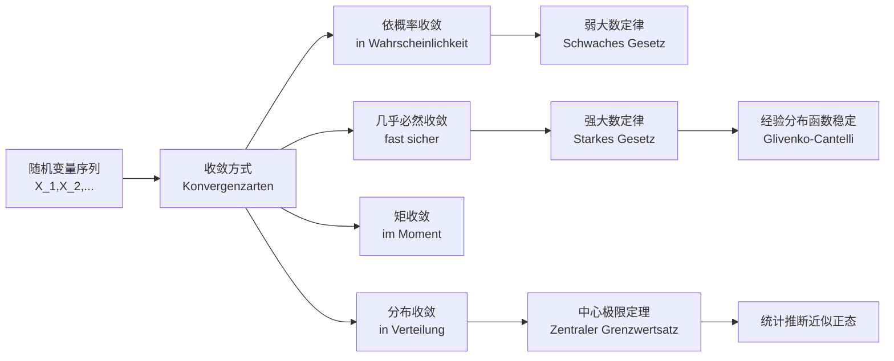
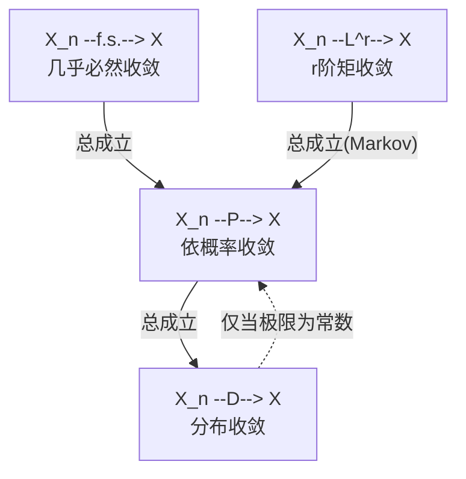

> 来源：`分章节讲义-下学期/05_Konvergenz.pdf`
> 对应原讲义页码：S. 601–705
> 核心主线：**随机变量序列如何趋近极限？样本均值为什么稳定？为什么正态分布会到处出现？**

---

这部分内容的核心目标是回答一个问题：**随机变量序列 Xn "收敛"到底是什么意思？** 因为随机变量不是普通的数，所以"收敛"有好几种定义方式，它们的强弱不同、适用场景也不同。

这部分内容的思维线是：**先定义四种收敛（地基）→ 再建立它们的强弱关系（框架）→ 最后用这套语言陈述大数定律和中心极限定理（顶层应用）**。周边定理都是围绕这条主线提供证明工具或补充细节的。

**第一层是定义四种收敛方式。** 按照从强到弱的顺序，依次是：

- 几乎必然收敛（盯着每条路径看，几乎每条都收敛）
- r 阶矩收敛（平均误差的某种度量趋于零）
- 依概率收敛（偏离超过任意小量的概率趋于零）
- 分布收敛（分布函数逐点收敛）

这四个定义是整篇内容的"**地基**"。

**第二层是建立它们之间的蕴含关系。** 核心结论是一条"**强推弱**"的链条：几乎必然收敛能推出依概率收敛，r 阶矩收敛也能推出依概率收敛（用 Markov 不等式），依概率收敛能推出分布收敛。反过来一般不成立，文中用"探照灯"这个反例说明依概率推不出几乎必然。这条链条是理解后续定理强弱的关键。

**第三层是应用：大数定律和中心极限定理。** 有了收敛的定义之后，就可以问：样本均值 $\bar{X}_n$​ 会不会收敛到总体均值 $\mu$？弱大数定律说依概率收敛，强大数定律说几乎必然收敛，后者更强。中心极限定理则换了一个问题：样本均值和真值之间的误差，标准化之后服从什么分布？答案是分布收敛到标准正态。这两个定理是概率论最核心的结论，而它们的陈述方式（"依概率收敛""几乎必然收敛""分布收敛"）正是前面定义的收敛类型。

文中还穿插了几个辅助工具，都是为了支撑主线或补充细节：

- **Chebyshev** 不等式和 **Markov** 不等式用来证明弱大数定律和矩收敛推依概率收敛

	- **Markov**：随机变量 **非负**（X ≥ 0，比如收入、身高、等待时间都不会是负数）， 并且知道它的**均值**，就能给出"取值过大"的概率上限。这是概率论中最基础、最朴素的**尾部估计**
		- $P(X ≥ a) \leq \frac{E(X)}{a}, a > 0$
		- **X 大于等于阈值 a** 的概率，不会超过 **均值 ÷ a**。 阈值 a 越大，这个上限就越小——符合直觉：极端大的值总是"稀少"的
		- 当 a < E[X] 时，上限 E[X]/a > 1，等于"概率不超过 100%"——这是一句废话。 所以马尔可夫不等式只在 **a 较大**（尤其 a > E[X]）时才有意义。
		- **由 Markov 可以推导出 Chebyshev**
	- **Chebyshev** ：它给出了任意随机变量**在其期望值附近取值的概率下界**。对于任意随机变量 X， 有 E(X) = $u$, Var(X) = $\sigma^2$，对于任意 k > 0：
		- 对于任意实数 k > 0，有：$P(|X - \mu| ≥ k\sigma) \leq \frac{1}{k^2}$
		- 也就是说，落在距离均值 **k 个标准差以外**的概率，不会超过 **1/k²**。 反过来，落在 **[μ−kσ, μ+kσ]** 区间内的概率至少是 **1 − 1/k²**
		- 它"很松"却很有用，这是因为切比雪夫不等式要对 **所有可能的分布**都成立，所以它给的是最坏情况下的保证，难免"宽松"		
		
- **Slutsky** 定理解决一个实际问题：CLT 里的未知参数可以用依概率收敛的估计量替换

	- 定理的核心就是**收敛过程**
	- 在统计推断里我们经常遇到这样的局面：一部分量**依分布收敛**到某个随机分布（如标准正态）， 而另一部分量**依概率收敛**到一个确定的常数（如真实方差的估计）。 斯卢茨基定理告诉我们：这两类收敛**可以放心地组合在一起**。
	- $X_{n} \to X, Y_{n} \to c, X_{n} + Y_{n} \to X + c, X_{n}Y_{n}  \to cX, \frac{X_{n}}{Y_n} \to \frac{X}{c}$

- **Berry-Esseen** 定理回答**收敛速度**的问题

	- **中心极限定理(CLT)告诉我们**：标准化后的样本和会**收敛到**标准正态分布。 但它只说了"最终会像"，却没说 "**在 n 多大时已经足够像**"**
	- 贝里-埃森定理补上了这块拼图——它给出了 **实际分布** 与 **正态分布** 之间偏差的**明确上界**， 并指出这个偏差以 $\frac{1}{\sqrt{n}}$ 的速度消失。

- **大数定理和中心极限定理**：

	- **大数定律 (LLN) 比喻 "靶心在哪"，中心极限定理 (CLT) 比喻 "弹着点如何散布在靶心周围"**。大数定律和中心极限定理是天生一对，描述同一件事的**两个层次**

	-  一句话串起来：**大数定律保证你瞄得准**（均值奔向真值）， **中心极限定理告诉你准到什么程度、误差如何分布**。二者共同支撑起几乎所有统计估计与抽样调查的合理性。

	- **中心极限定理（CLT）**：中心极限定理是整个概率统计的**"皇冠明珠"**。它说的是一件近乎神奇的事情： 无论你从什么形状的分布里抽样——均匀的、偏斜的、双峰的、甚至古怪的——只要你把足够多个独立样本**加起来（或取平均）**， 它们的分布都会自动趋向同一种形状：**正态分布（钟形曲线）**。
	
	- **大数定理（LLN）**：
	
		- 大数定律是概率论最古老、最直觉的定理，它给了"用频率估计概率""用样本均值估计真实均值"这件事一个**严格的保证**： 只要独立重复地观测同一个随机现象，把结果**平均**起来，这个平均值就会**稳稳地收敛到真实期望**
		- 大数定律其实有两种，区别在于"收敛"这个词的数学含义有多强
			- **弱大数定理（WLLN）**：依概率收敛，对每个固定的大 n ，"偏离太远"的**概率**极小（**但仍可能偶尔发生**）
			- **强大数定理（SLLN）**：几乎必然收敛，几乎对每一条样本轨迹，平均值最终**真的落到 μ 并永远留在那里**
			- 通俗比喻：弱大数定律说"**某一刻拍快照**，跑偏的概率几乎为零"； 强大数定律说"**看整条录像**，这条曲线注定会收敛到 μ 不再离开"。

- **经验分布**：真实分布函数  F 通常是未知的——我们看不到那条理论曲线，手里只有一把**观测数据**。经验分布函数就是用这些数据"现场拼出来"的一条阶梯曲线，作为对 F  的**估计**。

	- 它的定义朴素到极致:在点  处的取值，就是**落在 x 左侧（含 x）的样本所占的比例**。

- Glivenko-Cantelli 大数定律告诉我们样本**均值**会收敛到真值。格利文科–坎泰利定理把这件事推到极致： 它断言由样本"画"出来的**整条经验分布函数**会**均匀地**收敛到真实的分布函数 。 正因为它保证了"**用样本能逼近整个分布**",才被称作**统计学基本定理**。

## 0. 本章学习地图

> [!tip] 一句话抓住第五章
> 本章不是在问“一个数列是否收敛”，而是在问：
> 一串随机变量、分布函数、样本均值、经验分布函数，在样本量 $n\to\infty$ 时，会以什么意义接近某个极限？

---

## 0.5 贯穿全章的一个画面：全班一起改坏习惯 🎓

在钻进任何定义之前，先把这张图刻进脑子。后面**每一种收敛**都会回到这个场景做对照。

> [!tip] 主场景：一个超大班级，每周点名记录“犯错程度”
> 想象一个超大的班级，每个学生就是一条“世界线” $\omega$。每周点一次名，记录每个学生“这周犯错的程度” $X_n(\omega)$。我们希望随着周数 $n\to\infty$，大家都不再犯错（极限是 0）。
>
> 四种收敛，其实是用**四种不同的验收标准**问同一句话：“大家真的改好了吗？”
>
> | 收敛方式 | 验收方式 | 关注点 |
> |---|---|---|
> | **几乎必然收敛** | 盯着每个学生看一辈子 | 几乎每个人到某周后**彻底金盆洗手，再也不犯** |
> | **依概率收敛** | 每周拍合照，数“还在犯错的人占比” | 比例越来越小，**但允许永远有少数人犯错，只要每次换一批人** |
> | **矩收敛** | 算“全班犯错程度的平均（或平方平均）” | 平均误差越来越小 |
> | **分布收敛** | 只看“全班犯错程度的直方图形状” | 形状越来越像目标形状，不关心是谁、是不是同一批人 |
>
> 由此一眼看出强弱：**盯个人（最严） → 数比例 → 算平均 → 只看形状（最松）。**

---

## 1. 为什么需要“多种收敛”？

在普通数学分析里，数列 $a_n$ 收敛到 $a$ 的意思很直接：

$$
a_n\to a.
$$

但随机变量不是一个数字，而是一个函数：

$$
X_n:\Omega\to\mathbb R.
$$

每个 $\omega\in\Omega$（每条世界线）都对应一整条数列：

$$
X_1(\omega),X_2(\omega),\ldots
$$

于是“$X_n\to X$”这句话突然变得模糊：

> [!question] 同样说 $X_n\to X$，到底要多强？
> - 是对几乎每个 $\omega$，整条路径都收敛？（盯个人）
> - 还是允许少数路径乱跳，只要乱跳的概率越来越小？（数比例）
> - 还是只要求平均误差越来越小？（算平均）
> - 还是只要求分布形状越来越像？（看形状）

这就是本章的核心：**不同收敛方式 = 不同强度的“接近”。**

---

## 2. 收敛方式总览

| 中文 | 德文关键词 | 英文 | 符号 | 直觉强度 |
|---|---|---|---|---|
| 几乎必然收敛 | fast sichere Konvergenz | almost sure convergence | $X_n\xrightarrow{f.s.}X$ | 很强 |
| 依概率收敛 | Konvergenz in Wahrscheinlichkeit | convergence in probability | $X_n\xrightarrow{P}X$ | 中等 |
| $r$ 阶矩收敛 | Konvergenz im $r$-ten Moment | convergence in $r$-th moment | $X_n\xrightarrow{L^r}X$ | 通常强于依概率 |
| 分布收敛 | Konvergenz in Verteilung | convergence in distribution | $X_n\xrightarrow{D}X$ | 最弱 |

> [!important] 强弱关系（本章最重要的一张关系链）
> $$
> X_n\xrightarrow{f.s.}X \;\Longrightarrow\; X_n\xrightarrow{P}X \;\Longrightarrow\; X_n\xrightarrow{D}X.
> $$
> 以及：
> $$
> X_n\xrightarrow{L^r}X \;\Longrightarrow\; X_n\xrightarrow{P}X.
> $$
> **反方向通常不成立**（后面每个反方向都配了反例）。

---

## 3. 几乎必然收敛（fast sichere Konvergenz）

### 3.1 回到主场景

> 几乎必然收敛 = **盯着每一个学生看一辈子，几乎每个人到某周之后就彻底改好，再也不犯。**

允许有“极少数死不悔改的人”存在，但这些人组成的集合**概率必须为 0**。

### 3.2 数学定义

随机变量序列 $(X_n)$ 几乎必然收敛到 $X$，若

$$
P\left(\left\{\omega:\lim_{n\to\infty}X_n(\omega)=X(\omega)\right\}\right)=1.
$$

记作 $X_n\xrightarrow{f.s.}X$，也写作 $X_n\xrightarrow{a.s.}X$。

- 德文：fast sicher
- 英文：almost surely
- 中文：几乎必然

### 3.3 学霸理解

> 先固定 $\omega$，再让 $n\to\infty$。

这和普通函数列的逐点收敛几乎一样，区别只是：**允许在一个概率为 0 的集合上失败。**

> [!warning] 易错点
> “概率为 1”不等于“每一个 $\omega$ 都成立”。概率论里允许极端路径存在，只要这些路径组成的集合概率为 0。

> [!check] 一句话验收口诀
> 看到“**几乎每条路径**”“**概率为 1 的集合上收敛**” → 几乎必然收敛。

**举例：**

- U 服从区间 【0，1】上的均匀分布
- 定义**随机变量序列** $X_n(w) = w^n,w \in [0,1]$
- 例如 w = 0.5，序列 $X_1,X_2,...,X_{10} = 0.5, 0.25,0.125,...,0.000977$
- 同理，带入 w = 0.1   w = 0.9, 这个随机变量序列都收敛到0，只是速度不一样
- w = 1，序列不收敛
- 分析随机变量收敛行为，对于任意 w 在 【0，1），即  0 ≤ w < 1，所以 $lim_{n \to \infty}X_n(w) = lim_{n \to \infty}w^n = 0$
- 序列在除了点 w = 1 之外的所有点都收敛到0，例外集合 {1} 的概率 为 P({0}) = 1，
- **因此，Xn 几乎必然收敛到0**

---

## 4. 依概率收敛（Konvergenz in Wahrscheinlichkeit）

### 4.1 回到主场景

> 依概率收敛 = **每周拍一张合照，数“这周还在犯错的人占比”，这个比例越来越小。**

关键陷阱：**它不在乎犯错的是不是同一批人**。哪怕每周都有人犯错、只是换了批人，只要每次的占比趋于 0，就算依概率收敛。

### 4.2 数学定义

对任意 $\varepsilon>0$，若

$$
P(|X_n-X|>\varepsilon)\to0,\qquad n\to\infty,
$$

则称 $X_n$ 依概率收敛到 $X$，记作 $X_n\xrightarrow{P}X$。

**举例：**

- 随机变量 Xn, 有两个取值，Xn = 1（概率为 1/n），Xn = 0（概率为 1 - 1/n）
- n = 1，P(Xn = 1) = 1, P(Xn = 0) = 0
- n = 2，P(Xn = 1) = 1/2, P(Xn = 0) = 1/2
- n = 3，P(Xn = 1) = 1/3, P(Xn = 0) = 2/3
- n = 4，P(Xn = 1) = 1/4, P(Xn = 0) = 3/4
- ... ...
- 也就是说Xn偶尔等于1，但是等于1的概率越来越小
- 当 X = 0（收敛值），0 < ε <1 的时候，P(|Xn - 0| > ε) 实际就是 P{Xn = 1|}，n趋近于无穷，概率为0
- 所以这个就是依概率收敛
- Xn是**随机变量**——它不是一个确定的数，而是会随机取不同的值。所以"距离“ |Xn - X| 本身也是随机得，有时大、有时小。
- 这就麻烦了：我们没法简单说"**距离最终小于 ε**"，因为即使 n 很大，Xn 仍可能偶尔取到一个离 X 很远的值
- **那怎么办？** 既然"距离"是随机的，我们就退一步，不要求"距离一定小"，而是要求"**距离大的可能性越来越小**"。
- |Xn - X| > ε 就是 ”坏事情“
- 依概率收敛得意思也可以表达为：**这个坏事件发生的概率，会不会随着 n 增大而趋于 0？**
- 如果对任意小的 ε "偏离超过 ε 的概率都趋于 0，我们就说 Xn **依概率收敛**到 **X**

### 4.3 和几乎必然收敛的区别

| 对比         | 几乎必然收敛            | 依概率收敛                    |
| ---------- | ----------------- | ------------------------ |
| 看什么        | 每条路径最终是否收敛        | 每个时间切片的偏离比例              |
| 固定谁        | 固定 $\omega$ 看整条人生 | 固定 $\varepsilon$ 看某一周的概率 |
| 是否在意“同一批人” | 在意（要每个人都改好）       | 不在意（只看占比）                |
| 强度         | 更强                | 较弱                       |
| 典型定理       | 强大数定律             | 弱大数定律                    |

### 4.4 经典反例：为什么“依概率”推不出“几乎必然” 🔦

> [!example] 环形跑道上的探照灯（Wandernde Lichtkegel）
> 想象一条周长为 1 的环形跑道，你站在某个固定位置不动。一束探照灯第 $n$ 次扫过来时照亮一段弧，弧越来越短（长度趋于 0），但这束灯**一圈一圈不停地绕**。
>
> 设 $X_n=1$ 表示“第 $n$ 次你被照到”，否则 $X_n=0$。
>
> - **它依概率收敛到 0**：被照到的概率 = 弧长 $\to 0$。
> - **它却不几乎必然收敛**：因为灯永远在绕圈，每一点都会被**无限次**重新照到，所以 $X_n(\omega)$ 永远在 0 和 1 之间反复横跳，根本不收敛。
>
> 用班级故事说：**“每周犯错的人很少（依概率成立），但因为犯错的人一直在轮换，没有任何一个人真正彻底改好（几乎必然不成立）。”**
>
> 这就是两者的本质区别：**依概率只看“每个时间切片”，几乎必然要看“每个人的整条人生轨迹”。**

> [!check] 一句话验收口诀
> 看到 $P(|X_n-X|>\varepsilon)\to 0$ → 依概率收敛。

---

## 5. $r$ 阶矩收敛（Konvergenz im $r$-ten Moment）

### 5.1 回到主场景

> 矩收敛 = **不数人头，而是算“全班犯错程度的平均”（或平方平均），平均误差越来越小。**

### 5.2 数学定义

若

$$
E(|X_n-X|^r)\to0,\qquad r\ge1,
$$

则称 $X_n$ 在 $r$ 阶矩意义下收敛到 $X$，记作 $X_n\xrightarrow{L^r}X$。

常见情况：

- $r=1$：平均绝对误差趋于 0。
- $r=2$：**均方收敛**（Konvergenz im quadratischen Mittel），均方误差趋于 0。

### 5.3 为什么高阶矩“更严格”：罚款的比喻 💸

> [!note] 把误差想成“超速”
> - 一阶矩 $E|X_n-X|$：**线性罚款**，超 10 罚 10。
> - 二阶矩 $E|X_n-X|^2$：**平方罚款**，超 10 罚 100，超 20 罚 400。
>
> 平方惩罚对“偶尔的大偏离”惩罚极重。所以如果连“平方罚款的总账”都能压到 0，那“线性罚款的总账”早被压下去了。
>
> 这就是 $s>r\ge 1$ 时 $L^s\Rightarrow L^r$ 的直觉：**越狠的考核都过了关，温和的考核当然过。**

### 5.4 为什么矩收敛推出依概率收敛？

用 **Markov 不等式**：

$$
P(|X_n-X|>\varepsilon)\le \frac{E(|X_n-X|^r)}{\varepsilon^r}.
$$

右边趋于 0，左边自然趋于 0。所以

$$
X_n\xrightarrow{L^r}X\;\Longrightarrow\; X_n\xrightarrow{P}X.
$$

> [!important] 考试高频
> 看到“均方误差趋于 0”“$E(|X_n-X|^r)\to0$”，立刻想到：
> 可以推出依概率收敛。

> [!check] 一句话验收口诀
> 看到 $E|X_n-X|^r\to 0$ → 矩收敛 → 立刻联想“能推依概率”。

---

## 6. 分布收敛（Konvergenz in Verteilung）

### 6.1 回到主场景

> 分布收敛 = **连具体是谁、是不是同一批人都不关心，只看“全班犯错程度的直方图形状”是否越来越像目标形状。**

它甚至不要求 $X_n$ 和 $X$ 定义在同一个概率空间上——这是最松的一种。

### 6.2 数学定义

设 $F_n$ 是 $X_n$ 的分布函数，$F$ 是 $X$ 的分布函数。若对所有 $F$ 的**连续点** $x$，

$$
F_n(x)\to F(x),
$$

则称 $X_n\xrightarrow{D}X$。

举例：

- 111

### 6.3 为什么只要求在连续点？

分布函数可能有跳跃点（对应离散概率质量）。极限过程在跳跃点附近可能左右不一致，因此定义只要求在极限分布函数 $F$ 的连续点上收敛。

> [!warning] 易错点
> 分布收敛不是说 $F_n(x)$ 对**所有** $x$ 收敛到 $F(x)$，而是对 $F$ 的**连续点**。

### 6.4 特殊重要结论：极限是常数时

如果极限 $X$ 是常数 $c$，则

$$
X_n\xrightarrow{D}c \;\Longleftrightarrow\; X_n\xrightarrow{P}c.
$$

**当极限是常数时，分布收敛和依概率收敛等价。**

> [!check] 一句话验收口诀
> 看到 $F_n(x)\to F(x)$（在连续点） → 分布收敛。

---

## 7. 收敛方式关系图（带反例标注）

> [!danger] 不要乱反推（每条都挂着反例）
> - **分布收敛 ⇏ 依概率收敛**：形状像不代表落点近（除非极限是常数）。
> - **依概率收敛 ⇏ 几乎必然收敛**：见 **🔦 探照灯例子**（第 4.4 节）——比例趋 0，但没人真正改好。
> - **依概率收敛 ⇏ 矩收敛**：可能偶尔出现“概率极小但数值极大”的偏离，把平均误差顶起来（罚款被一次超级超速拉爆）。

---

## 8. 大数定律与中心极限定理：一个“飞镖”画面讲清两件事 🎯

第 8–13 节全部围绕同一个场景。先把这张图建好，后面所有公式都是它的精确化。

> [!tip] 主场景：蒙眼掷飞镖
> 你蒙着眼朝靶心（真值 $\mu$）扔飞镖，每一镖落点是一个随机变量 $X_i$。样本均值 $\bar X_n=\frac1n\sum_{i=1}^n X_i$ 就是“前 $n$ 镖的平均落点”。
>
> - **大数定律（LLN）** 关心**平均落点的位置**：镖扔得越多，平均落点 $\bar X_n$ 越贴近靶心 $\mu$。→ “瞄得准”
> - **中心极限定理（CLT）** 关心**平均落点周围的抖动**：平均落点不会精确压在靶心，它在靶心附近抖，这个抖动呈**钟形（正态）**，幅度约为 $1/\sqrt n$。→ “抖成什么形状、抖多大”
>
> 一句话：**LLN 告诉你“瞄得准”，CLT 告诉你“抖成什么样”。**

设 $X_1,X_2,\ldots$ 独立同分布（iid），共同期望 $\mu$。大数定律回答：**当 $n\to\infty$，$\bar X_n$ 会不会接近真实期望 $\mu$？**

---

## 9. 弱大数定律（Schwaches Gesetz der großen Zahlen）

### 9.1 直觉

> 平均落点偏离靶心超过 $\varepsilon$ 的概率，会趋于 0。也就是 $\bar X_n\xrightarrow{P}\mu$。

### 9.2 常见版本

若 $X_1,\ldots,X_n$ iid，且 $E(X_i)=\mu$、$Var(X_i)=\sigma^2<\infty$，则

$$
\bar X_n\xrightarrow{P}\mu.
$$

### 9.3 证明直觉（三步）

**第一步**，均值不偏：

$$
E(\bar X_n)=\mu.
$$

**第二步**，方差被 $n$ 摊薄：

$$
Var(\bar X_n)=\frac{1}{n^2}\cdot n\sigma^2=\frac{\sigma^2}{n}\to0.
$$

（直觉：镖越多，平均落点越被“钉死”在靶心附近，抖动越小。）

**第三步**，用 **Chebyshev 不等式**把“方差小”翻译成“偏离概率小”：

$$
P(|\bar X_n-\mu|>\varepsilon)\le \frac{Var(\bar X_n)}{\varepsilon^2}=\frac{\sigma^2}{n\varepsilon^2}\to0.
$$

故 $\bar X_n\xrightarrow{P}\mu$。

> [!tip] 学霸记忆
> 弱大数定律 = **均值会稳定，用的是“概率意义”稳定**。

---

## 10. 强大数定律（Starkes Gesetz der großen Zahlen）

### 10.1 直觉

比弱大数定律更狠：

> **几乎每一条样本路径上**，平均落点都会真的收敛到靶心 $\mu$。即 $\bar X_n\xrightarrow{f.s.}\mu$。

### 10.2 Kolmogorov 强大数定律

若 $X_1,X_2,\ldots$ iid，且 $E(|X_1|)<\infty$，则

$$
\frac1n\sum_{i=1}^n X_i\xrightarrow{f.s.}E(X_1).
$$

### 10.3 强弱对比

| 定理 | 收敛结论 | 飞镖直觉 |
|---|---|---|
| 弱大数定律 | $\bar X_n\xrightarrow{P}\mu$ | 每一刻“偏离很多”的概率越来越小 |
| 强大数定律 | $\bar X_n\xrightarrow{f.s.}\mu$ | 你这一局游戏，平均落点最终一定收住 |

> [!important] 考试句型
> "Nach dem schwachen Gesetz der großen Zahlen konvergiert das Stichprobenmittel in Wahrscheinlichkeit gegen den Erwartungswert."
> 根据弱大数定律，样本均值依概率收敛到期望。

---

## 11. iid：独立同分布为什么重要？

独立同分布（unabhängig und identisch verteilt, iid）包含两层：

1. **独立（unabhängig）**：不同观测之间没有概率依赖。
2. **同分布（identisch verteilt）**：每个 $X_i$ 分布相同。

为什么重要？

- 同分布保证每镖来自**同一个机制**（同一个人、同样姿势在扔）。
- 独立保证信息不重复绑定（这一镖结果不被上一镖牵着走）。
- 大数定律和中心极限定理的经典版本都依赖 iid 或类似条件。

> [!warning] 易错点
> 独立和同分布是**两件事**：可以独立但不同分布，也可以同分布但不独立。

---

## 12. 中心极限定理（ZGWS）：为什么正态分布无处不在？

### 12.1 先把 LLN 和 CLT 摆在一起

| 问题 | 大数定律 | 中心极限定理 |
|---|---|---|
| 关心什么 | $\bar X_n$ 是否接近 $\mu$ | $\bar X_n$ 的误差**长什么样** |
| 结论 | $\bar X_n\to\mu$ | 标准化误差趋于正态 |
| 收敛类型 | 依概率 / 几乎必然 | 分布收敛 |
| 飞镖语言 | 瞄得准 | 抖成钟形 |

### 12.2 数学表述（Lindeberg-Lévy）

设 $X_1,X_2,\ldots$ iid，$E(X_i)=\mu$，$Var(X_i)=\sigma^2<\infty$，则

$$
\frac{\sqrt n(\bar X_n-\mu)}{\sigma}
=\frac{\sum_{i=1}^n X_i-n\mu}{\sqrt n\,\sigma}
\xrightarrow{D}N(0,1).
$$

### 12.3 看得见的 CLT：高尔顿板 🟡

> [!example] 高尔顿板（Galton-Brett）
> 一颗小球从顶上落下，经过一排排钉子，每碰一个钉子就随机往左或往右弹一下（每次弹跳 = 一个独立的小随机量）。无数小球落到底部，会自动堆成一座**漂亮的钟形山**。
>
> 每个小球的最终落点 = 很多次“左右小弹跳”的**总和**。CLT 的精髓正在于此：**只要把大量独立、同分布、方差有限的小随机量加起来，不管单个弹跳本身是什么形状，总和标准化后都会逼近正态。**
>
> 这就是为什么测量误差、身高、噪声……到处都是钟形曲线。

> [!tip] 这就是统计推断的基础
> 置信区间、假设检验、回归系数近似正态，背后常常都靠中心极限定理或它的推广。

---

## 13. 标准化到底在做什么？给正在消失的误差装显微镜 🔬

CLT 里最关键的表达式：

$$
Z_n=\frac{\sqrt n(\bar X_n-\mu)}{\sigma}.
$$

逐层拆开：

| 部分 | 意义 |
|---|---|
| $\bar X_n-\mu$ | 平均落点的误差 |
| $\sqrt n$ | 放大误差（误差本身约为 $1/\sqrt n$） |
| $\sigma$ | 化成标准尺度 |
| $Z_n$ | 变成可比较的、稳定的标尺 |

> [!note] $\sqrt n$ 在干嘛：显微镜比喻
> 误差 $\bar X_n-\mu$ 正以 $1/\sqrt n$ 的速度缩向 0。你不放大，就只看到它“塌缩成一个点”，看不出形状。乘上 $\sqrt n$ 恰好**抵消这个缩小速度**，把误差定格在稳定尺度上，我们才看得清它的极限长相是正态。
>
> **就像给一个正在远去缩小的物体配一台放大倍率刚好同步的显微镜，让它在画面里大小不变，你才能看清它的轮廓。**

---

## 14. Slutsky 定理（Satz von Slutsky）

### 14.1 直觉：粗量杯也能做出好菜 🍲

> [!note] 做菜比喻
> 做菜时你没有精密量杯，只有一个“越来越准的粗量杯”。只要这个量杯**依概率收敛到真实刻度**，最后菜的味道（极限分布）就不变。
>
> 这正是现实统计中的处境：CLT 里有个未知的 $\sigma$，我们用样本标准差 $S_n$ 替掉它。只要 $S_n\xrightarrow{P}\sigma$，渐近结果照样成立。

### 14.2 常用形式

若

$$
X_n\xrightarrow{D}X,\qquad A_n\xrightarrow{P}a,\qquad B_n\xrightarrow{P}b,
$$

则

$$
A_n+B_nX_n\xrightarrow{D}a+bX.
$$

特别地，当 $A_n\xrightarrow{P}0$、$B_n\xrightarrow{P}1$ 时：

$$
B_nX_n+A_n\xrightarrow{D}X.
$$

> [!important] 统计推断意义
> 在渐近分布中，可以用一致估计量替代未知常数。

> [!warning] 易错点
> Slutsky 不是“随便替换”。被替换的量必须**依概率收敛到一个常数**（粗量杯必须越来越准）。

---

## 15. Berry-Esseen：CLT 收敛有多快？

CLT 只说极限成立：

$$
Z_n\xrightarrow{D}N(0,1).
$$

但它**没说** $n=30$、$n=100$ 时近似有多好。Berry-Esseen 补上这块：

$$
\sup_x |P(Z_n\le x)-\Phi(x)| \le \frac{C\cdot E(|X-\mu|^3)}{\sigma^3\sqrt n}.
$$

各部分含义：

- $E(|X-\mu|^3)$：三阶绝对中心矩（衡量分布有多“偏、多重尾”）；
- $\sigma^3$：标准化尺度；
- $1/\sqrt n$：收敛速度；
- $C$：一个通用常数。

> [!important] 学霸理解
> **CLT 是“会收敛”，Berry-Esseen 是“收敛多快”。**

> [!note] 直觉
> 样本量越大，正态近似越好；分布尾部越重、偏斜越强，近似通常越慢。

---

## 16. 经验分布函数与 Glivenko-Cantelli 定理

### 16.1 经验分布函数（empirische Verteilungsfunktion）

给定样本 $X_1,\ldots,X_n$：

$$
\hat F_n(x)=\frac1n\sum_{i=1}^n I(X_i\le x).
$$

含义：**样本中有多少比例不超过 $x$。**

### 16.2 对固定 $x$ 的理解

对固定 $x$，指示变量 $I(X_i\le x)$ 是 Bernoulli 随机变量，期望为

$$
E[I(X_i\le x)]=P(X_i\le x)=F(x).
$$

所以 $\hat F_n(x)$ 就是一堆 Bernoulli 变量的样本均值。由**强大数定律**：

$$
\hat F_n(x)\xrightarrow{f.s.}F(x).
$$

### 16.3 Glivenko-Cantelli 定理（统计学基本定理）

更强的是：不只是逐点收敛，而是**一致收敛**：

$$
\sup_x|\hat F_n(x)-F(x)|\xrightarrow{f.s.}0.
$$

> [!tip] 直觉：民意调查 📊
> 像做民意调查。样本越大，**整条样本累积曲线**（不只是某一点、而是处处）贴合真实人口曲线。这就是“靠样本就能还原真相”这件事的理论靠山。

---

## 17. 本章核心公式卡片

> [!summary] 必背公式
>
> **依概率收敛**
> $$X_n\xrightarrow{P}X\iff P(|X_n-X|>\varepsilon)\to0,\quad \forall\varepsilon>0.$$
>
> **矩收敛**
> $$X_n\xrightarrow{L^r}X\iff E(|X_n-X|^r)\to0.$$
>
> **分布收敛**
> $$X_n\xrightarrow{D}X\iff F_n(x)\to F(x)\ \text{在 }F\text{ 的连续点}.$$
>
> **弱大数定律**
> $$\bar X_n\xrightarrow{P}\mu.$$
>
> **强大数定律**
> $$\bar X_n\xrightarrow{f.s.}\mu.$$
>
> **中心极限定理**
> $$\frac{\sqrt n(\bar X_n-\mu)}{\sigma}\xrightarrow{D}N(0,1).$$
>
> **经验分布函数 + Glivenko-Cantelli**
> $$\hat F_n(x)=\frac1n\sum_{i=1}^n I(X_i\le x),\qquad \sup_x|\hat F_n(x)-F(x)|\xrightarrow{f.s.}0.$$

---

## 18. 易错点总表

| 易错点 | 错误理解 | 正确理解 | 对应画面 |
|---|---|---|---|
| $X_n\xrightarrow{D}X$ | 数值接近 | 只是分布形状接近 | 看直方图形状 |
| $X_n\xrightarrow{P}X$ | 每条路径都收敛 | 偏离比例趋 0，可换批人 | 🔦 探照灯 |
| $X_n\xrightarrow{f.s.}X$ | 每个样本点都收敛 | 除概率 0 集合外都收敛 | 盯每个人一辈子 |
| 大数定律 | 样本均值等于期望 | 极限中接近期望 | 🎯 瞄得准 |
| CLT | 原变量变正态 | 标准化后的均值误差趋正态 | 🟡 高尔顿板 |
| 分布收敛 | 所有点 $F_n\to F$ | 只要 $F$ 的连续点 | — |
| Slutsky | 随便替换 | 替换量须依概率收敛到常数 | 🍲 粗量杯 |

---

## 19. 德文关键词表

| Deutsch | 中文 | 复习提示 |
|---|---|---|
| die Konvergenz | 收敛 | 总主题 |
| die Zufallsvariable | 随机变量 | 可测函数 |
| die Folge von Zufallsvariablen | 随机变量序列 | $X_1,X_2,\ldots$ |
| fast sichere Konvergenz | 几乎必然收敛 | 路径层面，概率 1 |
| Konvergenz in Wahrscheinlichkeit | 依概率收敛 | 偏离概率趋 0 |
| Konvergenz im Moment | 矩收敛 | 平均误差趋 0 |
| Konvergenz in Verteilung | 分布收敛 | 分布函数趋近 |
| das Gesetz der großen Zahlen | 大数定律 | 样本均值稳定 |
| schwaches Gesetz der großen Zahlen | 弱大数定律 | 依概率收敛 |
| starkes Gesetz der großen Zahlen | 强大数定律 | 几乎必然收敛 |
| unabhängig und identisch verteilt | 独立同分布 | iid / u.i.v. |
| der Erwartungswert | 期望 | $\mu$ |
| die Varianz | 方差 | $\sigma^2$ |
| der Zentrale Grenzwertsatz | 中心极限定理 | CLT / ZGWS |
| die Verteilungsfunktion | 分布函数 | $F(x)=P(X\le x)$ |
| die empirische Verteilungsfunktion | 经验分布函数 | $\hat F_n$ |
| der Satz von Slutsky | Slutsky 定理 | 渐近替换工具 |
| der Satz von Glivenko-Cantelli | Glivenko-Cantelli 定理 | 经验分布一致收敛 |
| die Standardisierung | 标准化 | 减均值除标准差 |
| die Grenzverteilung | 极限分布 | 渐近分布 |
| das Borel-Cantelli-Lemma | Borel-Cantelli 引理 | 概率和有限 ⇒ 有限次 |
| die Landau-Symbole | Landau 符号 | 描述收敛速度 |

---

## 20. 关键德文句型

- **Die Folge $(X_n)$ konvergiert fast sicher gegen $X$.**
  序列 $(X_n)$ 几乎必然收敛到 $X$。
- **Für jedes $\varepsilon>0$ gilt $P(|X_n-X|>\varepsilon)\to0$.**
  对每个 $\varepsilon>0$，偏离概率趋向 0。
- **Nach dem schwachen Gesetz der großen Zahlen gilt $\bar X_n\xrightarrow{P}\mu$.**
  根据弱大数定律，样本均值依概率收敛到 $\mu$。
- **Der zentrale Grenzwertsatz liefert die asymptotische Normalverteilung des standardisierten Stichprobenmittels.**
  中心极限定理给出标准化样本均值的渐近正态分布。
- **Die empirische Verteilungsfunktion konvergiert fast sicher gegen die wahre Verteilungsfunktion.**
  经验分布函数几乎必然收敛到真实分布函数。

---

## 21. 全面补充：逐页审计后必须补上的定理与工具

> [!important] 为什么有这一节？
> 第五章 PPT 有 105 页。前面主笔记覆盖了主线逻辑，这里把 PPT 中出现、但容易被主线压缩掉的定理集中补齐。**每个抽象定理都配了一句生活类比**，方便快速记忆。

### 21.1 收敛关系相关定理：Satz 14.4, 14.6, 14.7, 14.8

**Satz 14.4（几乎必然 ⇒ 依概率）**

$$
X_n\xrightarrow{f.s.}X\;\Longrightarrow\;X_n\xrightarrow{P}X.
$$

直觉：几乎每条路径最后都贴近 $X$，那“偏离超过 $\varepsilon$ 的人”的比例当然越来越小。**路径层面稳定 ⇒ 概率层面稳定。**

**Satz 14.6（高阶矩 ⇒ 低阶矩）**：$s>r\ge1$ 时，$X_n\xrightarrow{L^s}X\Rightarrow X_n\xrightarrow{L^r}X$。直觉见 💸 罚款比喻（第 5.3 节）。

**Satz 14.7（矩 ⇒ 依概率）**：核心是 Markov 不等式

$$
P(|X_n-X|>\varepsilon)\le\frac{E(|X_n-X|^r)}{\varepsilon^r}.
$$

**Satz 14.8（用尾部事件刻画几乎必然收敛）**：几乎必然收敛可以用“从某个 $n$ 之后还会反复偏离”的概率刻画：

$$
P\left(\bigcup_{k\ge n}\{|X_k-X|>\varepsilon\}\right)\to0.
$$

这比单看 $P(|X_n-X|>\varepsilon)$ 更强，因为它控制的是“从 $n$ 以后是否还会出现偏离”——正好对应“盯一个人后半生还会不会再犯”。

### 21.2 Borel-Cantelli 引理（Satz 14.9）

设 $(A_n)$ 是事件序列。若

$$
\sum_{n=1}^{\infty}P(A_n)<\infty,
$$

则

$$
P(A_n\ \text{unendlich oft})=0.
$$

> [!tip] 通俗理解
> **如果你犯错的概率逐年递减，且把每年的犯错概率全加起来还是有限的**（比如第 $n$ 年只有 $1/n^2$ 的概率犯错），那么“犯错无限多次”几乎不可能发生——你**终将彻底洗白**。

在收敛问题里常令 $A_n=\{|X_n-X|>\varepsilon\}$。若能证明 $\sum_n P(|X_n-X|>\varepsilon)<\infty$，就得到偏离只发生有限多次，从而帮证几乎必然收敛。

> [!note] 对照探照灯例子
> 探照灯里弧长 $\sim 1/n$，$\sum 1/n=\infty$（发散），所以 Borel-Cantelli 不适用，被照到无限多次——这正解释了它为什么**不**几乎必然收敛。两个例子合起来记，印象极深。

### 21.3 Bernoulli 定理与 Khinchine 大数定律

**Bernoulli 定理**：若 $X_i\sim Bernoulli(p)$ iid，则样本比例

$$
\bar X_n\xrightarrow{P}p.
$$

通俗：重复投硬币，正面频率越来越接近真实正面概率。这是大数定律最经典的起点。

**Khinchine 大数定律**：弱大数定律**不一定需要有限方差**。在 iid 且期望存在的条件下：

$$
\bar X_n\xrightarrow{P}\mu.
$$

> [!important] 和基础版的区别
> 基础版要求 $Var(X_i)<\infty$（好用 Chebyshev 简单证）。Khinchine 版更强：核心只要**期望存在**，不强制有限方差。

### 21.4 一般大数定律：Etemadi、Kolmogorov、Cantelli

大数定律不只有“iid + 有限方差”一种版本。

- **Etemadi 强大数定律**：同分布、**两两独立**、$E(|X_n|)<\infty$，即满足强大数定律。重点：不要求完全相互独立，只要两两独立。
- **Kolmogorov 第一定律**：处理**非同分布**的独立变量。只要方差增长被控制，如 $\sum_{n=1}^{\infty}\frac{Var(X_n)}{n^2}<\infty$，平均偏差仍趋于 0。
- **Cantelli 定理**：同属“用更一般条件保证（中心化）平均收敛”的大数律工具。复习时知道它属于这一类即可，不必死背技术条件。

### 21.5 多元强大数定律（Multivariates starkes Gesetz）

若 $X_i=(X_{i1},\ldots,X_{ip})^\top$ 是 $p$ 维随机向量，则

$$
\bar X_n\xrightarrow{f.s.}\mu=E(X_1),
$$

本质就是每个坐标分别用强大数定律：$\bar X_{n,j}\xrightarrow{f.s.}\mu_j$。

> [!tip] 记忆
> 多元大数定律 = **向量的每个坐标都满足大数定律**。

### 21.6 de Moivre-Laplace 定理

二项分布的 CLT 特例。若 $X_n\sim Bin(n,p)$，则

$$
\frac{X_n-np}{\sqrt{np(1-p)}}\xrightarrow{D}N(0,1),
$$

即 $Bin(n,p)\approx N(np,np(1-p))$。

> [!note] 一句话生活版
> 它就是 CLT 在“抛硬币”这个最简单情形下的特例——抛得够多，正面次数的分布就从锯齿状的二项，长成光滑的钟形正态。

> [!warning] 连续性修正（Stetigkeitskorrektur）
> 用连续正态近似离散二项时，常加修正：$P(X\le k)\approx P(Y\le k+0.5)$。

### 21.7 Landau 符号（Definition 15.6）

| 符号 | 读法 | 含义 |
|---|---|---|
| $a_n=O(b_n)$ | big O | $a_n$ 至多和 $b_n$ 同阶 |
| $a_n=o(b_n)$ | small o | $a_n$ 比 $b_n$ 小得多 |

数学上：$a_n=O(b_n)$ 表示存在 $C,n_0$，使 $n\ge n_0$ 时 $|a_n|\le C|b_n|$；$a_n=o(b_n)$ 表示 $\frac{a_n}{b_n}\to0$。

> [!tip] 生活版
> $O$ 是“花的钱不超过预算的某个倍数”，$o$ 是“花的钱相对预算可以忽略不计”。CLT 里常见误差速度 $O(n^{-1/2})$，即误差大约随 $1/\sqrt n$ 下降。

### 21.8 Berry-Esseen 的考试意义

CLT 说“会收敛”，Berry-Esseen 回答“**有限样本下，$Z_n$ 的分布函数和标准正态最多差多少**”：

$$
\sup_x |F_n(x)-\Phi(x)|\le \frac{C\,E(|X-\mu|^3)}{\sigma^3\sqrt n}.
$$

详见第 15 节。

### 21.9 Cramér-Wold 与多元中心极限定理

多元 CLT：若 $X_i$ 是 $k$ 维 iid 随机向量，均值 $\mu$，协方差矩阵 $\Sigma$，则

$$
\sqrt n(\bar X_n-\mu)\xrightarrow{D}N_k(0,\Sigma).
$$

**Cramér-Wold 思想**：要证向量收敛，看所有线性组合 $a^\top X_n$。若对所有 $a$，$a^\top X_n\xrightarrow{D}a^\top X$，则 $X_n\xrightarrow{D}X$。

> [!tip] 直觉：看影子 🔦
> 想知道一个多维物体是否收敛，就看它**在所有方向上的影子（投影）**是否都收敛。所有影子都稳了，物体本身就稳了。

### 21.10 多元 Glivenko-Cantelli

多元时 $x\in\mathbb R^k$：

$$
\hat F_n(x)=\frac1n\sum_{i=1}^n I(X_i\le x),
$$

其中 $X_i\le x$ 表示**每个坐标**都不超过对应坐标 $X_{ij}\le x_j$。对固定 $x$，$I(X_i\le x)$ 仍是 Bernoulli 变量，用大数定律即得收敛。结论同样是：经验分布函数会趋近真实分布函数。

### 21.11 本章 PPT 覆盖清单

| PPT 内容 | 笔记位置 |
|---|---|
| Konvergenzarten | 第 2–7 节 |
| fast sichere Konvergenz | 第 3 节 |
| Konvergenz in Wahrscheinlichkeit | 第 4 节 |
| Konvergenz im Moment | 第 5 节 |
| Konvergenz in Verteilung | 第 6 节 |
| 收敛方式关系 | 第 7 节、第 21.1 节 |
| Borel-Cantelli | 第 21.2 节 |
| iid 定义 | 第 11 节 |
| Schwaches Gesetz | 第 9 节 |
| Starkes Gesetz | 第 10 节 |
| Bernoulli / Khinchine | 第 21.3 节 |
| Etemadi / Kolmogorov / Cantelli | 第 21.4 节 |
| Multivariates starkes Gesetz | 第 21.5 节 |
| Satz von Slutsky | 第 14 节 |
| Zentraler Grenzwertsatz | 第 12–13 节 |
| de Moivre-Laplace | 第 21.6 节 |
| Landau-Symbole | 第 21.7 节 |
| Berry-Esseen | 第 15、21.8 节 |
| Glivenko-Cantelli | 第 16 节 |
| Multivariater ZGWS / Cramér-Wold | 第 21.9 节 |
| Multivariater Hauptsatz | 第 21.10 节 |

---

## 22. 最后复习：闭卷默写清单（合并版）

> [!check] 你应该能不看笔记回答这些问题
>
> **基础四收敛 + 两大定律**
> 1. 写出依概率收敛的定义。
> 2. 用探照灯例子说明几乎必然收敛和依概率收敛的区别。
> 3. 写出 $L^r$ 收敛为什么推出依概率收敛（并说出用的不等式）。
> 4. 写出弱大数定律和强大数定律的结论及各自收敛类型。
> 5. 写出中心极限定理的标准化形式。
> 6. 解释为什么 CLT 不是说 $X_i$ 本身变成正态（用高尔顿板）。
> 7. 写出经验分布函数 $\hat F_n(x)$。
> 8. 解释 Glivenko-Cantelli 定理的直觉（民意调查）。
>
> **补充定理**
> 9. Borel-Cantelli 引理如何帮助证明几乎必然收敛？它为什么对探照灯例子不适用？
> 10. de Moivre-Laplace 定理和 CLT 是什么关系？
> 11. Landau 符号 $O(\cdot)$ 和 $o(\cdot)$ 的区别。
> 12. Slutsky 定理为什么允许用估计量替换未知参数（粗量杯）？
> 13. $\sqrt n$ 在 CLT 中起什么作用（显微镜）？

---

## 23. 本章一句话总结

> 大数定律告诉我们“平均值会稳定（瞄得准）”，中心极限定理告诉我们“稳定过程中的误差长得像正态（抖成钟形）”，经验分布函数定理告诉我们“样本分布会贴近真实分布（民调还原真相）”。这些都建立在不同层次（盯个人 → 数比例 → 算平均 → 看形状）的收敛概念之上。

