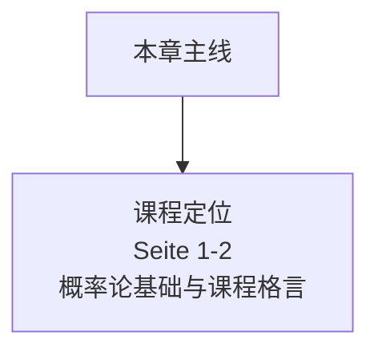

# 下学期第 00 章：前置页

> 来源：`分章节讲义-下学期/00_前置页.pdf`  
> 原讲义页码：S. 1-2  
> 图片目录：`assets/`  
> 核心主线：下学期课程的总入口：主题是“统计学的概率论基础”，也就是把上学期的经验统计语言提升到严格的概率空间、随机变量和极限定理语言。

## 章节知识树

## 学习路径

下学期课程的总入口：主题是“统计学的概率论基础”，也就是把上学期的经验统计语言提升到严格的概率空间、随机变量和极限定理语言。

1. **课程定位：** 概率论基础与课程格言（Seite 1-2）。

## 模块地图

| 模块 | 页码 | 核心问题 |
| --- | --- | --- |
| 课程定位 | Seite 1-2 | 概率论基础与课程格言 |

## 考试优先级

1. 知道本课程是 Statistik II / Wahrscheinlichkeitstheoretische Grundlagen der Statistik。
2. 理解下学期会用更严格的数学语言重建概率、随机变量和极限定理。

## 模块零：课程入口（Seite 1-2）

这两页不是知识点密集页，但很重要：它告诉你下学期不再只是描述数据，而是要用概率论解释统计推断为什么可靠。Novalis 那句“偶然也有规律”就是全课主线。

### Seite 1 - Statistik II für Statistiker:

本页放在“模块零：课程入口”中，核心是理解 概率（Wahrscheinlichkeit）。直觉上先抓住标题里的对象：Statistik II für Statistiker:。然后看它是定义、例子、定理还是证明；定义页要记条件，例子页要看随机机制，证明页要看用了哪些闭包性或极限定理。

关键词：

- 概率（Wahrscheinlichkeit）

本页需要抓住的德语线索：

- `Statistik II für Statistiker:`
- `Wahrscheinlichkeitstheoretische Grundlagen`
- `der Statistik`

### Seite 2 - Auch der Zufall ist nicht unergründlich, er hat seine Regelmäßigkeiten.

本页放在“模块零：课程入口”中，主要作用是推进 Seite 1-2 这一段的概念链。先把标题“Auch der Zufall ist nicht unergründlich, er hat seine Regelmäßigkeiten.”和前后页联系起来，再区分它是在给定义、展示例子、证明性质，还是做章节过渡。

本页需要抓住的德语线索：

- `Auch der Zufall ist nicht unergründlich, er hat seine Regelmäßigkeiten.`
- `Novalis, alias Friedrich Freiherr von Hardenberg`

## 本章逻辑梳理

- **课程定位（Seite 1-2）：** 概率论基础与课程格言。

复习时不要按页码硬背。先确认本页属于哪个模块，再问它是在定义对象、说明性质、给例子、证明定理，还是提醒适用边界。

## 关键考核点

1. 知道本课程是 Statistik II / Wahrscheinlichkeitstheoretische Grundlagen der Statistik。
2. 理解下学期会用更严格的数学语言重建概率、随机变量和极限定理。

## 本章公式清单

### 课程语言

| 序号 | 公式 | 使用场景 | 注意事项 |
| ---: | --- | --- | --- |
| 1 | $Zufall \to Regelmäßigkeit$ | 理解课程主题。 | 不是公式，而是概率论的思想入口。 |

## 章节自测

- [ ] 本课程只处理描述性统计，不涉及概率论基础。
- [x] 下学期的核心是用概率论给统计推断打基础。

## 德语词汇表

| 德语 | 中文 | 使用场景 |
| --- | --- | --- |
| Wahrscheinlichkeitstheorie | 概率论 | 下学期主线 |
| Regelmäßigkeit | 规律性 | 随机现象中的结构 |

## C1 德语句式

| 序号 | 德语句式 | 中文翻译 | 适用场景 |
| ---: | --- | --- | --- |
| 1 | Auch der Zufall ist nicht unergründlich, er hat seine Regelmäßigkeiten. | 偶然并非不可理解，它也有自己的规律性。 | 课程主题句。 |
