# 下学期第 01 章：导论（Einführung）

> 来源：`分章节讲义-下学期/01_Einführung.pdf`  
> 原讲义页码：S. 3-24  
> 图片目录：`assets/`  
> 核心主线：导论先把统计学、随机学和概率解释放在同一张地图上：现实数据来自随机生成机制，概率论描述机制，推断统计再从数据倒推机制。

## 章节知识树

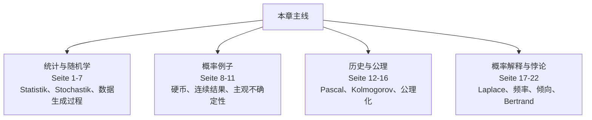

## 学习路径

导论先把统计学、随机学和概率解释放在同一张地图上：现实数据来自随机生成机制，概率论描述机制，推断统计再从数据倒推机制。

1. **统计与随机学：** Statistik、Stochastik、数据生成过程（Seite 1-7）。
2. **概率例子：** 硬币、连续结果、主观不确定性（Seite 8-11）。
3. **历史与公理：** Pascal、Kolmogorov、公理化（Seite 12-16）。
4. **概率解释与悖论：** Laplace、频率、倾向、Bertrand（Seite 17-22）。

## 模块地图

| 模块 | 页码 | 核心问题 |
| --- | --- | --- |
| 统计与随机学 | Seite 1-7 | Statistik、Stochastik、数据生成过程 |
| 概率例子 | Seite 8-11 | 硬币、连续结果、主观不确定性 |
| 历史与公理 | Seite 12-16 | Pascal、Kolmogorov、公理化 |
| 概率解释与悖论 | Seite 17-22 | Laplace、频率、倾向、Bertrand |

## 考试优先级

1. 会区分 Statistik、Stochastik、Wahrscheinlichkeitstheorie 和 Inferenzstatistik。
2. 会解释 datengenerierender Prozess 的方向：模型生成数据，统计从数据学习模型。
3. 会说出 Kolmogorov 公理的三条基本要求。
4. 会用 Bertrand 悖论说明概率模型必须明确随机机制。

## 模块零：统计和随机学的关系（Seite 1-7）

开头先回答“我们为什么要学概率论”。统计学关心数据，随机学关心随机机制。若把数据看成随机机制的产物，就自然需要概率论来描述机制，再用推断统计从数据反推机制。

### Seite 1 - 导论（Einführung）

本页放在“模块零：统计和随机学的关系”中，核心是理解 概率（Wahrscheinlichkeit）。直觉上先抓住标题里的对象：导论（Einführung）。然后看它是定义、例子、定理还是证明；定义页要记条件，例子页要看随机机制，证明页要看用了哪些闭包性或极限定理。

关键词：

- 概率（Wahrscheinlichkeit）

本页需要抓住的德语线索：

- `Kapitel 1`
- `Einführung`
- `1. Einführung`

### Seite 2 - 什么是统计学？（Was ist Statistik?）

本页放在“模块零：统计和随机学的关系”中，主要作用是推进 Seite 1-7 这一段的概念链。先把标题“什么是统计学？（Was ist Statistik?）”和前后页联系起来，再区分它是在给定义、展示例子、证明性质，还是做章节过渡。

本页需要抓住的德语线索：

- `Was ist Statistik?`
- `Statistik ist die Wissenschaft von der Erhebung, Auswertung,`
- `Darstellung und Interpretation von Daten.`

### Seite 3 - 随机学/随机数学（Stochastik）

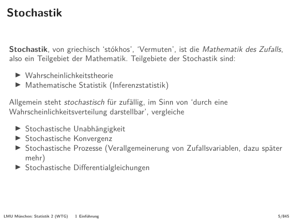

本页放在“模块零：统计和随机学的关系”中，核心是理解 概率（Wahrscheinlichkeit）、随机变量（Zufallsvariable）、独立性（Unabhängigkeit）、收敛（Konvergenz）。直觉上先抓住标题里的对象：随机学/随机数学（Stochastik）。然后看它是定义、例子、定理还是证明；定义页要记条件，例子页要看随机机制，证明页要看用了哪些闭包性或极限定理。

关键词：

- 概率（Wahrscheinlichkeit）
- 随机变量（Zufallsvariable）
- 独立性（Unabhängigkeit）
- 收敛（Konvergenz）

本页需要抓住的德语线索：

- `Stochastik`
- `Stochastik, von griechisch ‘stókhos’, ‘Vermuten’, ist die Mathematik des Zufalls,`
- `also ein Teilgebiet der Mathematik. Teilgebiete der Stochastik sind:`

### Seite 4 - Standorte von Leihrädern in Köln am 9. April 2025,

本页放在“模块零：统计和随机学的关系”中，主要作用是推进 Seite 1-7 这一段的概念链。先把标题“Standorte von Leihrädern in Köln am 9. April 2025,”和前后页联系起来，再区分它是在给定义、展示例子、证明性质，还是做章节过渡。

本页需要抓住的德语线索：

- `Standorte von Leihrädern in Köln am 9. April 2025,`
- `22:18 Uhr I`

### Seite 5 - Standorte von Leihrädern in Köln am 9. April 2025,

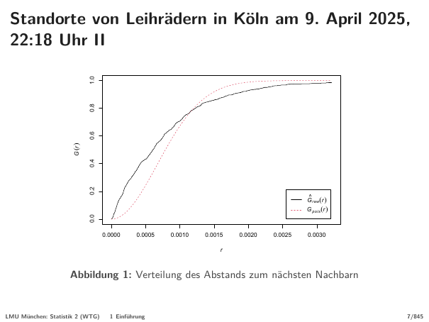

本页放在“模块零：统计和随机学的关系”中，主要作用是推进 Seite 1-7 这一段的概念链。先把标题“Standorte von Leihrädern in Köln am 9. April 2025,”和前后页联系起来，再区分它是在给定义、展示例子、证明性质，还是做章节过渡。

本页需要抓住的德语线索：

- `Standorte von Leihrädern in Köln am 9. April 2025,`
- `22:18 Uhr II`
- `0.0000 0.0005 0.0010 0.0015 0.0020 0.0025 0.0030`

### Seite 6 - Standorte von Leihrädern in Köln am 9. April 2025,

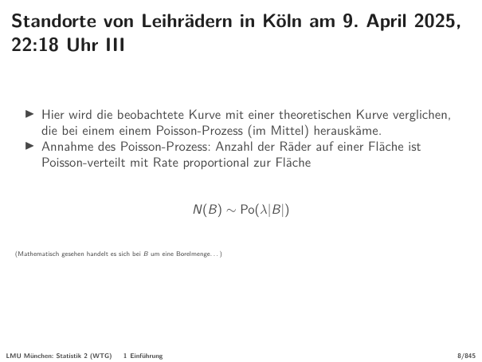

本页放在“模块零：统计和随机学的关系”中，核心是理解 Poisson 分布（Poisson）。直觉上先抓住标题里的对象：Standorte von Leihrädern in Köln am 9. April 2025,。然后看它是定义、例子、定理还是证明；定义页要记条件，例子页要看随机机制，证明页要看用了哪些闭包性或极限定理。

关键词：

- Poisson 分布（Poisson）

本页需要抓住的德语线索：

- `Standorte von Leihrädern in Köln am 9. April 2025,`
- `22:18 Uhr III`
- `Hier wird die beobachtete Kurve mit einer theoretischen Kurve verglichen,`

### Seite 7 - Datengenerierender Prozeß

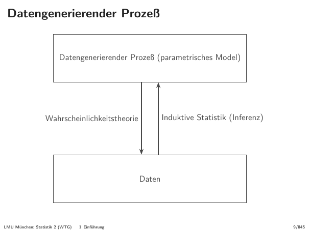

本页放在“模块零：统计和随机学的关系”中，核心是理解 概率（Wahrscheinlichkeit）。直觉上先抓住标题里的对象：Datengenerierender Prozeß。然后看它是定义、例子、定理还是证明；定义页要记条件，例子页要看随机机制，证明页要看用了哪些闭包性或极限定理。

关键词：

- 概率（Wahrscheinlichkeit）

本页需要抓住的德语线索：

- `Datengenerierender Prozeß`
- `Datengenerierender Prozeß (parametrisches Model)`
- `Wahrscheinlichkeitstheorie Induktive Statistik (Inferenz)`

## 模块一：从硬币到主观概率（Seite 8-11）

硬币例子故意从离散结果走到连续位置，再走到“要不要带伞”的不确定判断。这样安排是为了说明：概率不只是数格子，也可以描述连续不确定性和个人信息状态。

### Seite 8 - Münzwurf I

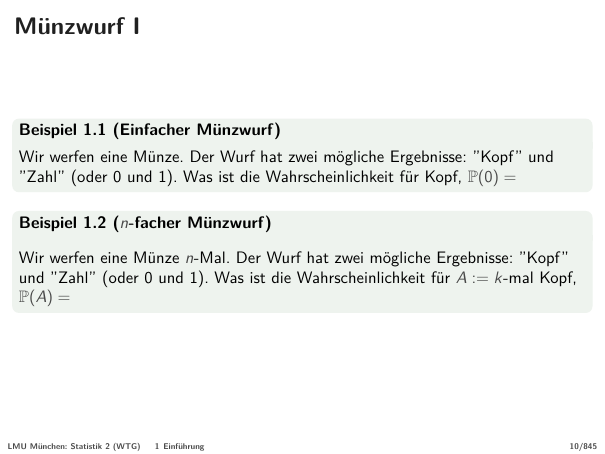

本页放在“模块一：从硬币到主观概率”中，核心是理解 概率（Wahrscheinlichkeit）、结果（Ergebnis）。直觉上先抓住标题里的对象：Münzwurf I。然后看它是定义、例子、定理还是证明；定义页要记条件，例子页要看随机机制，证明页要看用了哪些闭包性或极限定理。

关键词：

- 概率（Wahrscheinlichkeit）
- 结果（Ergebnis）

本页需要抓住的德语线索：

- `Beispiel 1.1 (Einfacher Münzwurf)`
- `”Zahl” (oder 0 und 1). Was ist die Wahrscheinlichkeit für Kopf, P(0) =`
- `Beispiel 1.2 (n-facher Münzwurf)`
- `und ”Zahl” (oder 0 und 1). Was ist die Wahrscheinlichkeit für A := k-mal Kopf,`
- `P(A) =`

### Seite 9 - Münzwurf II

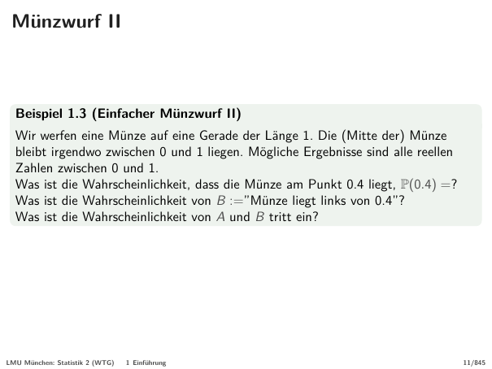

本页放在“模块一：从硬币到主观概率”中，核心是理解 概率（Wahrscheinlichkeit）、结果（Ergebnis）。直觉上先抓住标题里的对象：Münzwurf II。然后看它是定义、例子、定理还是证明；定义页要记条件，例子页要看随机机制，证明页要看用了哪些闭包性或极限定理。

关键词：

- 概率（Wahrscheinlichkeit）
- 结果（Ergebnis）

本页需要抓住的德语线索：

- `Beispiel 1.3 (Einfacher Münzwurf II)`
- `Was ist die Wahrscheinlichkeit, dass die Münze am Punkt 0.4 liegt, P(0.4) =?`
- `Was ist die Wahrscheinlichkeit von B :=”Münze liegt links von 0.4”?`

### Seite 10 - Münzwurf III

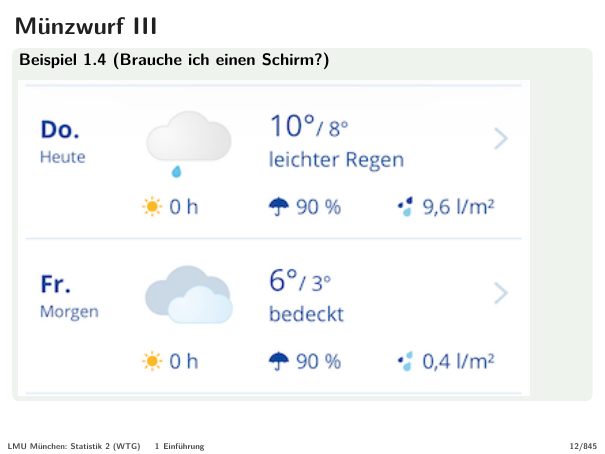

本页可识别的嵌入图片裁切：

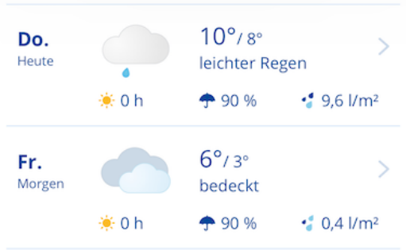

本页放在“模块一：从硬币到主观概率”中，主要作用是推进 Seite 8-11 这一段的概念链。先把标题“Münzwurf III”和前后页联系起来，再区分它是在给定义、展示例子、证明性质，还是做章节过渡。

本页需要抓住的德语线索：

- `Beispiel 1.4 (Brauche ich einen Schirm?)`

### Seite 11 - Münzwurf IV

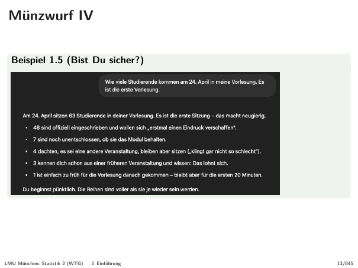

本页可识别的嵌入图片裁切：

本页放在“模块一：从硬币到主观概率”中，主要作用是推进 Seite 8-11 这一段的概念链。先把标题“Münzwurf IV”和前后页联系起来，再区分它是在给定义、展示例子、证明性质，还是做章节过渡。

本页需要抓住的德语线索：

- `Beispiel 1.5 (Bist Du sicher?)`

## 模块二：概率论为什么需要公理化（Seite 12-16）

历史部分从赌博问题走到 Kolmogorov。直觉概率有用，但遇到复杂空间会变得含糊；公理化让概率成为可以稳定推理的数学对象。

### Seite 12 - 导论（Einführung）

本页放在“模块二：概率论为什么需要公理化”中，核心是理解 概率（Wahrscheinlichkeit）。直觉上先抓住标题里的对象：导论（Einführung）。然后看它是定义、例子、定理还是证明；定义页要记条件，例子页要看随机机制，证明页要看用了哪些闭包性或极限定理。

关键词：

- 概率（Wahrscheinlichkeit）

本页需要抓住的德语线索：

- `1. Einführung`
- `1.1 Geschichte`
- `1.2 Wahrscheinlichkeit`

### Seite 13 - 历史（Geschichte）

本页放在“模块二：概率论为什么需要公理化”中，核心是理解 概率（Wahrscheinlichkeit）。直觉上先抓住标题里的对象：历史（Geschichte）。然后看它是定义、例子、定理还是证明；定义页要记条件，例子页要看随机机制，证明页要看用了哪些闭包性或极限定理。

关键词：

- 概率（Wahrscheinlichkeit）

本页需要抓住的德语线索：

- `Geschichte I`
- `Historische Wurzeln`
- `Philosophie (/Theologie) des Unsicheren`

### Seite 14 - 历史（Geschichte）

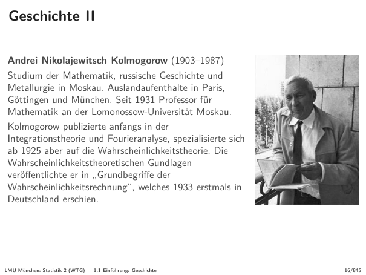

本页可识别的嵌入图片裁切：

本页放在“模块二：概率论为什么需要公理化”中，核心是理解 概率（Wahrscheinlichkeit）。直觉上先抓住标题里的对象：历史（Geschichte）。然后看它是定义、例子、定理还是证明；定义页要记条件，例子页要看随机机制，证明页要看用了哪些闭包性或极限定理。

关键词：

- 概率（Wahrscheinlichkeit）

本页需要抓住的德语线索：

- `Geschichte II`
- `Andrei Nikolajewitsch Kolmogorow (1903–1987)`
- `Studium der Mathematik, russische Geschichte und`

### Seite 15 - 历史（Geschichte）

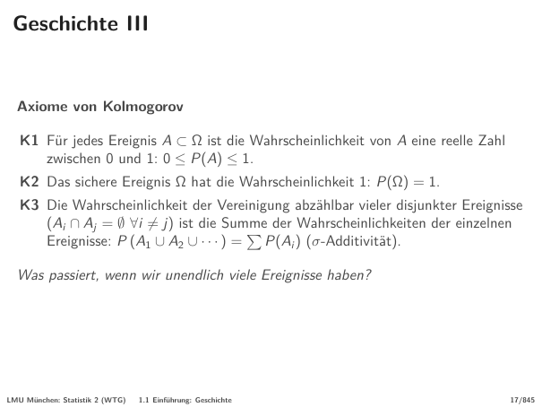

本页放在“模块二：概率论为什么需要公理化”中，核心是理解 概率（Wahrscheinlichkeit）、事件（Ereignis）。直觉上先抓住标题里的对象：历史（Geschichte）。然后看它是定义、例子、定理还是证明；定义页要记条件，例子页要看随机机制，证明页要看用了哪些闭包性或极限定理。

关键词：

- 概率（Wahrscheinlichkeit）
- 事件（Ereignis）

本页需要抓住的德语线索：

- `K1 Für jedes Ereignis A ⊂ Ω ist die Wahrscheinlichkeit von A eine reelle Zahl`
- `zwischen 0 und 1: 0 ≤ P(A) ≤ 1.`
- `K2 Das sichere Ereignis Ω hat die Wahrscheinlichkeit 1: P(Ω) = 1.`
- `(A ∩ A = ∅ ∀i ̸= j) ist die Summe der Wahrscheinlichkeiten der einzelnen`
- `Ereignisse: P (A ∪ A ∪ · · · ) = P(A ) (σ-Additivität).`

### Seite 16 - 导论（Einführung）

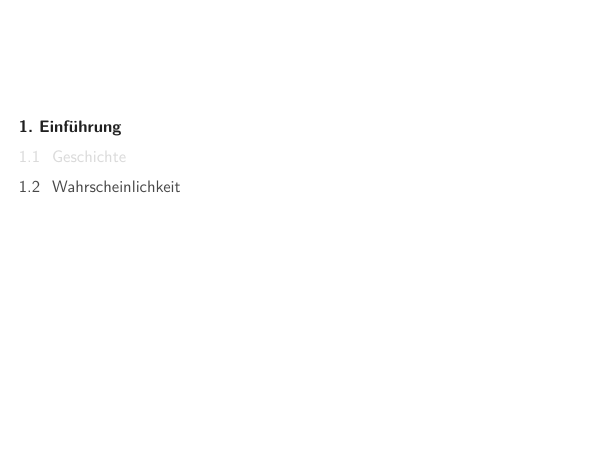

本页放在“模块二：概率论为什么需要公理化”中，核心是理解 概率（Wahrscheinlichkeit）。直觉上先抓住标题里的对象：导论（Einführung）。然后看它是定义、例子、定理还是证明；定义页要记条件，例子页要看随机机制，证明页要看用了哪些闭包性或极限定理。

关键词：

- 概率（Wahrscheinlichkeit）

本页需要抓住的德语线索：

- `1. Einführung`
- `1.1 Geschichte`
- `1.2 Wahrscheinlichkeit`

## 模块三：概率解释和 Bertrand 悖论（Seite 17-22）

不同随机化方式会给同一个几何问题不同答案。Bertrand 悖论的重点不是算错了，而是提醒你：概率模型必须说明随机机制，否则“随机选一个”没有唯一含义。

### Seite 17 - 概率解释（Wahrscheinlichkeitsauffassungen）

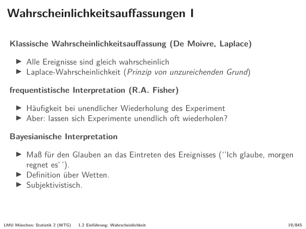

本页放在“模块三：概率解释和 Bertrand 悖论”中，核心是理解 概率（Wahrscheinlichkeit）、事件（Ereignis）、测度（Maß）。直觉上先抓住标题里的对象：概率解释（Wahrscheinlichkeitsauffassungen）。然后看它是定义、例子、定理还是证明；定义页要记条件，例子页要看随机机制，证明页要看用了哪些闭包性或极限定理。

关键词：

- 概率（Wahrscheinlichkeit）
- 事件（Ereignis）
- 测度（Maß）

本页需要抓住的德语线索：

- `Definition über Wetten.`

### Seite 18 - 概率解释（Wahrscheinlichkeitsauffassungen）

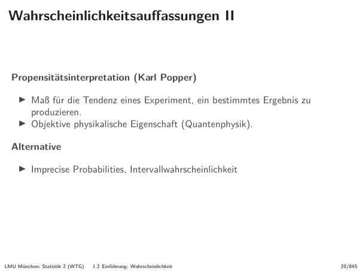

本页放在“模块三：概率解释和 Bertrand 悖论”中，核心是理解 概率（Wahrscheinlichkeit）、结果（Ergebnis）、测度（Maß）。直觉上先抓住标题里的对象：概率解释（Wahrscheinlichkeitsauffassungen）。然后看它是定义、例子、定理还是证明；定义页要记条件，例子页要看随机机制，证明页要看用了哪些闭包性或极限定理。

关键词：

- 概率（Wahrscheinlichkeit）
- 结果（Ergebnis）
- 测度（Maß）

本页需要抓住的德语线索：

- `Wahrscheinlichkeitsauffassungen II`
- `Propensitätsinterpretation (Karl Popper)`
- `Maß für die Tendenz eines Experiment, ein bestimmtes Ergebnis zu`

### Seite 19 - 概率沟通（Kommunikation von Wahrscheinlichkeiten）

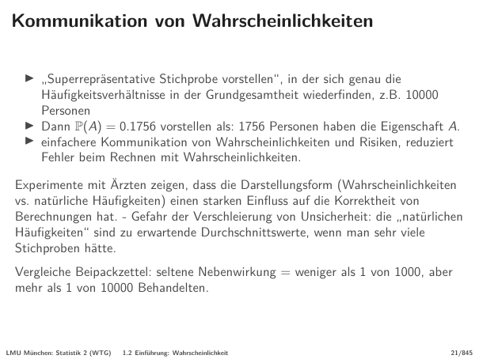

本页放在“模块三：概率解释和 Bertrand 悖论”中，核心是理解 概率（Wahrscheinlichkeit）。直觉上先抓住标题里的对象：概率沟通（Kommunikation von Wahrscheinlichkeiten）。然后看它是定义、例子、定理还是证明；定义页要记条件，例子页要看随机机制，证明页要看用了哪些闭包性或极限定理。

关键词：

- 概率（Wahrscheinlichkeit）

本页需要抓住的德语线索：

- `Dann P(A) = 0.1756 vorstellen als: 1756 Personen haben die Eigenschaft A.`
- `Vergleiche Beipackzettel: seltene Nebenwirkung = weniger als 1 von 1000, aber`

### Seite 20 - Bertrand 悖论（Bertrand-Paradoxon）

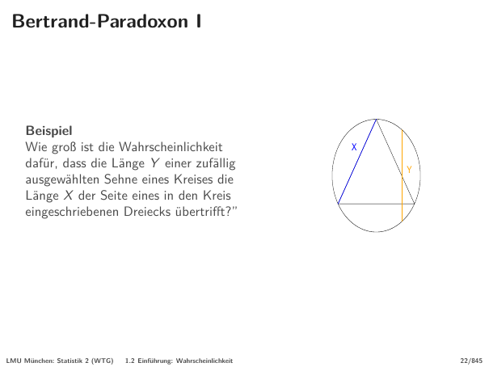

本页放在“模块三：概率解释和 Bertrand 悖论”中，核心是理解 概率（Wahrscheinlichkeit）。直觉上先抓住标题里的对象：Bertrand 悖论（Bertrand-Paradoxon）。然后看它是定义、例子、定理还是证明；定义页要记条件，例子页要看随机机制，证明页要看用了哪些闭包性或极限定理。

关键词：

- 概率（Wahrscheinlichkeit）

本页需要抓住的德语线索：

- `Beispiel`

### Seite 21 - Bertrand 悖论（Bertrand-Paradoxon）

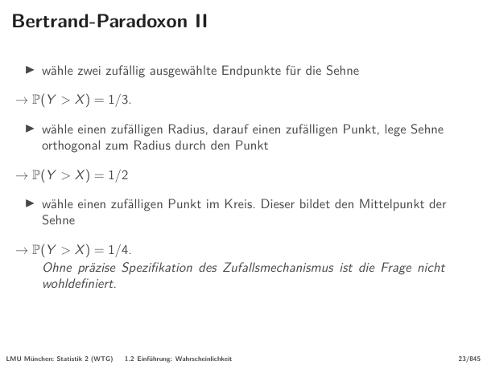

本页放在“模块三：概率解释和 Bertrand 悖论”中，主要作用是推进 Seite 17-22 这一段的概念链。先把标题“Bertrand 悖论（Bertrand-Paradoxon）”和前后页联系起来，再区分它是在给定义、展示例子、证明性质，还是做章节过渡。

本页需要抓住的德语线索：

- `→ P(Y > X ) = 1/3.`
- `→ P(Y > X ) = 1/2`
- `→ P(Y > X ) = 1/4.`

### Seite 22 - Gliederung

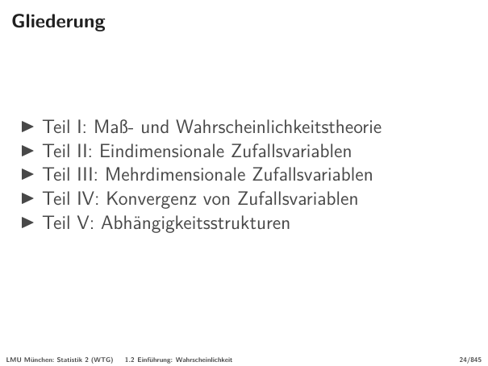

本页放在“模块三：概率解释和 Bertrand 悖论”中，核心是理解 概率（Wahrscheinlichkeit）、测度（Maß）、随机变量（Zufallsvariable）、收敛（Konvergenz）。直觉上先抓住标题里的对象：Gliederung。然后看它是定义、例子、定理还是证明；定义页要记条件，例子页要看随机机制，证明页要看用了哪些闭包性或极限定理。

关键词：

- 概率（Wahrscheinlichkeit）
- 测度（Maß）
- 随机变量（Zufallsvariable）
- 收敛（Konvergenz）

本页需要抓住的德语线索：

- `Gliederung`
- `Teil I: Maß- und Wahrscheinlichkeitstheorie`
- `Teil II: Eindimensionale Zufallsvariablen`

## 本章逻辑梳理

- **统计与随机学（Seite 1-7）：** Statistik、Stochastik、数据生成过程。
- **概率例子（Seite 8-11）：** 硬币、连续结果、主观不确定性。
- **历史与公理（Seite 12-16）：** Pascal、Kolmogorov、公理化。
- **概率解释与悖论（Seite 17-22）：** Laplace、频率、倾向、Bertrand。

复习时不要按页码硬背。先确认本页属于哪个模块，再问它是在定义对象、说明性质、给例子、证明定理，还是提醒适用边界。

## 关键考核点

1. 会区分 Statistik、Stochastik、Wahrscheinlichkeitstheorie 和 Inferenzstatistik。
2. 会解释 datengenerierender Prozess 的方向：模型生成数据，统计从数据学习模型。
3. 会说出 Kolmogorov 公理的三条基本要求。
4. 会用 Bertrand 悖论说明概率模型必须明确随机机制。

## 本章公式清单

### 概率公理

| 序号 | 公式 | 使用场景 | 注意事项 |
| ---: | --- | --- | --- |
| 1 | $0\le P(A)\le 1$ | 概率合法性。 | 任何事件概率都在 0 和 1 之间。 |
| 2 | $P(\Omega)=1$ | 样本空间必然发生。 | 总概率为 1。 |
| 3 | $P\left(\bigcup_i A_i\right)=\sum_i P(A_i)$ | 可列互斥事件的可加性。 | 要求事件两两不交。 |

### 模型方向

| 序号 | 公式 | 使用场景 | 注意事项 |
| ---: | --- | --- | --- |
| 4 | $Modell \to Daten$ | 概率论从模型推出数据行为。 | 这是演绎方向。 |
| 5 | $Daten \to Modell$ | 推断统计从数据学习模型。 | 这是归纳方向。 |

## 章节自测

- [x] Bertrand 悖论说明“随机选择”必须定义清楚。
- [ ] Kolmogorov 公理只适用于有限样本空间。
- [x] 推断统计的方向通常是从数据到模型。

## 德语词汇表

| 德语 | 中文 | 使用场景 |
| --- | --- | --- |
| Stochastik | 随机学 | 数学化研究随机现象 |
| datengenerierender Prozess | 数据生成过程 | 模型到数据的方向 |
| Inferenz | 推断 | 数据到模型的方向 |
| Axiom | 公理 | 概率论基础规则 |
| Wahrscheinlichkeitsauffassung | 概率解释 | 概率的含义 |

## C1 德语句式

|  序号 | 德语句式                                                                                                                                                     | 中文翻译                          | 适用场景            |
| --: | -------------------------------------------------------------------------------------------------------------------------------------------------------- | ----------------------------- | --------------- |
|   1 | Die Wahrscheinlichkeitstheorie beschreibt den datengenerierenden Prozess, während die Inferenz aus beobachteten Daten auf diesen Prozess zurückschließt. | 概率论描述数据生成过程，而推断统计从观测数据反推这个过程。 | 说明概率论与推断的关系。    |
|   2 | Ohne eine präzise Festlegung des Zufallsmechanismus ist eine Wahrscheinlichkeitsaussage nicht eindeutig interpretierbar.                                 | 如果不精确定义随机机制，概率陈述就不能被唯一解释。     | 解释 Bertrand 悖论。 |
|     |                                                                                                                                                          |                               |                 |
