# 下学期第 02 章：测度与概率论（Maß- und Wahrscheinlichkeitstheorie）

> 来源：`分章节讲义-下学期/02_Maß- und Wahrscheinlichkeitstheorie.pdf`  
> 原讲义页码：S. 25-185  
> 图片目录：`assets/`  
> 核心主线：本部分把概率从直觉比例升级为测度：先定义结果、事件和 σ-代数，再定义概率测度，最后用可测映射严格定义随机变量。

## 章节知识树

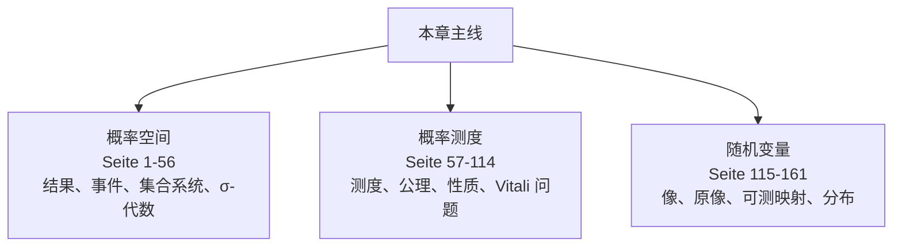
```mermaid
flowchart TD
  A["本章主线"]
  A --> M1["概率空间<br/>Seite 1-56<br/>结果、事件、集合系统、σ-代数"]
  A --> M2["概率测度<br/>Seite 57-114<br/>测度、公理、性质、Vitali 问题"]
  A --> M3["随机变量<br/>Seite 115-161<br/>像、原像、可测映射、分布"]
```

## 学习路径

本部分把概率从直觉比例升级为测度：先定义结果、事件和 σ-代数，再定义概率测度，最后用可测映射严格定义随机变量。

1. **概率空间：** 结果、事件、集合系统、σ-代数（Seite 1-56）。
2. **概率测度：** 测度、公理、性质、Vitali 问题（Seite 57-114）。
3. **随机变量：** 像、原像、可测映射、分布（Seite 115-161）。

## 模块地图

| 模块 | 页码 | 核心问题 |
| --- | --- | --- |
| 概率空间 | Seite 1-56 | 结果、事件、集合系统、σ-代数 |
| 概率测度 | Seite 57-114 | 测度、公理、性质、Vitali 问题 |
| 随机变量 | Seite 115-161 | 像、原像、可测映射、分布 |

## 考试优先级

1. 会区分 Ergebnis、Ereignis、Grundraum、Mengensystem 和 σ-Algebra。
2. 会说明为什么连续空间不能直接用全部幂集当事件系统。
3. 会写出概率测度的三条核心性质。
4. 会解释随机变量的可测性为什么重要。

## 模块零：为什么要从集合开始（Seite 1-56）

概率要“测量事件”，但事件本身是结果的集合。有限空间里可以直接用所有子集；连续空间里不是所有集合都能合理赋概率，所以必须先规定哪些事件可测，也就是 σ-代数。

### Seite 1 - 概率（Wahrscheinlichkeit）

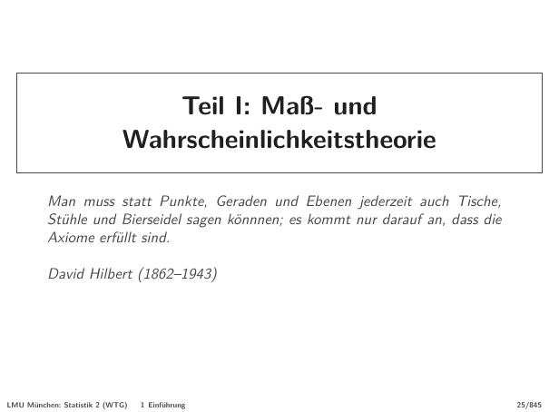

本页放在“模块零：为什么要从集合开始”中，核心是理解 概率（Wahrscheinlichkeit）、测度（Maß）。直觉上先抓住标题里的对象：概率（Wahrscheinlichkeit）。然后看它是定义、例子、定理还是证明；定义页要记条件，例子页要看随机机制，证明页要看用了哪些闭包性或极限定理。

关键词：

- 概率（Wahrscheinlichkeit）
- 测度（Maß）

本页需要抓住的德语线索：

- `Teil I: Maß- und`
- `Wahrscheinlichkeitstheorie`
- `Man muss statt Punkte, Geraden und Ebenen jederzeit auch Tische,`

### Seite 2 - 概率空间（Wahrscheinlichkeitsräume）

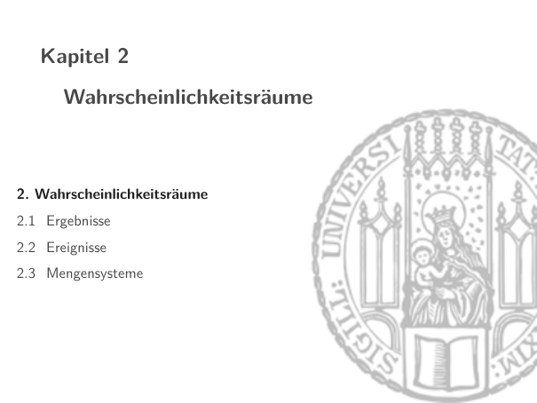

本页可识别的嵌入图片裁切：

本页放在“模块零：为什么要从集合开始”中，核心是理解 概率（Wahrscheinlichkeit）、结果（Ergebnis）、事件（Ereignis）、集合（Menge）。直觉上先抓住标题里的对象：概率空间（Wahrscheinlichkeitsräume）。然后看它是定义、例子、定理还是证明；定义页要记条件，例子页要看随机机制，证明页要看用了哪些闭包性或极限定理。

关键词：

- 概率（Wahrscheinlichkeit）
- 结果（Ergebnis）
- 事件（Ereignis）
- 集合（Menge）
- 集合系统（Mengensystem）

本页需要抓住的德语线索：

- `Kapitel 2`
- `Wahrscheinlichkeitsräume`
- `2. Wahrscheinlichkeitsräume`

### Seite 3 - Ziel des Kapitels

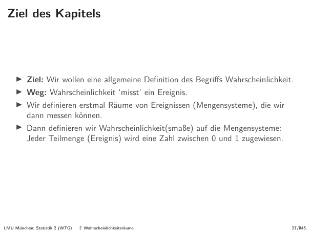

本页放在“模块零：为什么要从集合开始”中，核心是理解 概率（Wahrscheinlichkeit）、事件（Ereignis）、集合（Menge）、集合系统（Mengensystem）。直觉上先抓住标题里的对象：Ziel des Kapitels。然后看它是定义、例子、定理还是证明；定义页要记条件，例子页要看随机机制，证明页要看用了哪些闭包性或极限定理。

关键词：

- 概率（Wahrscheinlichkeit）
- 事件（Ereignis）
- 集合（Menge）
- 集合系统（Mengensystem）

本页需要抓住的德语线索：

- `Ziel des Kapitels`
- `Ziel: Wir wollen eine allgemeine Definition des Begriffs Wahrscheinlichkeit.`

### Seite 4 - 概率空间（Wahrscheinlichkeitsräume）

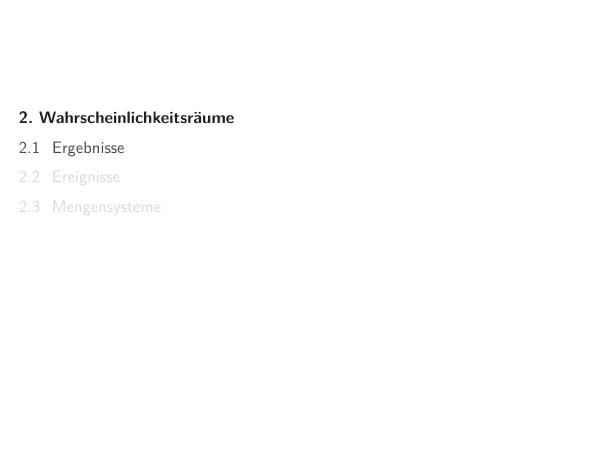

本页放在“模块零：为什么要从集合开始”中，核心是理解 概率（Wahrscheinlichkeit）、结果（Ergebnis）、事件（Ereignis）、集合（Menge）。直觉上先抓住标题里的对象：概率空间（Wahrscheinlichkeitsräume）。然后看它是定义、例子、定理还是证明；定义页要记条件，例子页要看随机机制，证明页要看用了哪些闭包性或极限定理。

关键词：

- 概率（Wahrscheinlichkeit）
- 结果（Ergebnis）
- 事件（Ereignis）
- 集合（Menge）
- 集合系统（Mengensystem）

本页需要抓住的德语线索：

- `2. Wahrscheinlichkeitsräume`
- `2.1 Ergebnisse`
- `2.2 Ereignisse`

### Seite 5 - 结果（Ergebnisse）

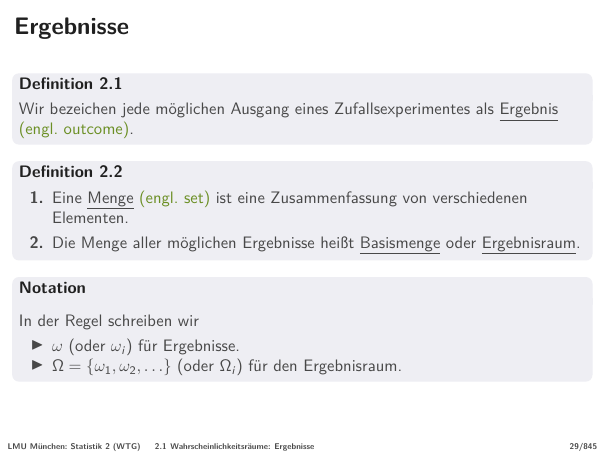

本页放在“模块零：为什么要从集合开始”中，核心是理解 结果（Ergebnis）、集合（Menge）。直觉上先抓住标题里的对象：结果（Ergebnisse）。然后看它是定义、例子、定理还是证明；定义页要记条件，例子页要看随机机制，证明页要看用了哪些闭包性或极限定理。

关键词：

- 结果（Ergebnis）
- 集合（Menge）

本页需要抓住的德语线索：

- `Definition 2.1`
- `Definition 2.2`
- `Ω = {ω , ω , . . .} (oder Ω ) für den Ergebnisraum.`

### Seite 6 - Beispiele

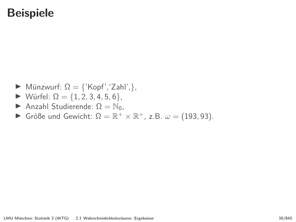

本页放在“模块零：为什么要从集合开始”中，主要作用是推进 Seite 1-56 这一段的概念链。先把标题“Beispiele”和前后页联系起来，再区分它是在给定义、展示例子、证明性质，还是做章节过渡。

本页需要抓住的德语线索：

- `Beispiele`
- `Münzwurf: Ω = {’Kopf’,‘Zahl’,},`
- `Würfel: Ω = {1, 2, 3, 4, 5, 6},`
- `Anzahl Studierende: Ω = N ,`
- `Größe und Gewicht: Ω = R+ × R+, z.B. ω = (193, 93).`

### Seite 7 - 概率空间（Wahrscheinlichkeitsräume）

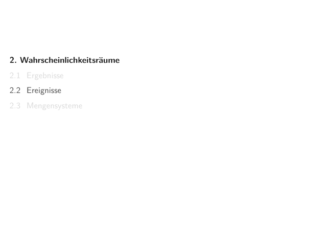

本页放在“模块零：为什么要从集合开始”中，核心是理解 概率（Wahrscheinlichkeit）、结果（Ergebnis）、事件（Ereignis）、集合（Menge）。直觉上先抓住标题里的对象：概率空间（Wahrscheinlichkeitsräume）。然后看它是定义、例子、定理还是证明；定义页要记条件，例子页要看随机机制，证明页要看用了哪些闭包性或极限定理。

关键词：

- 概率（Wahrscheinlichkeit）
- 结果（Ergebnis）
- 事件（Ereignis）
- 集合（Menge）
- 集合系统（Mengensystem）

本页需要抓住的德语线索：

- `2. Wahrscheinlichkeitsräume`
- `2.1 Ergebnisse`
- `2.2 Ereignisse`

### Seite 8 - 事件（Ereignisse）

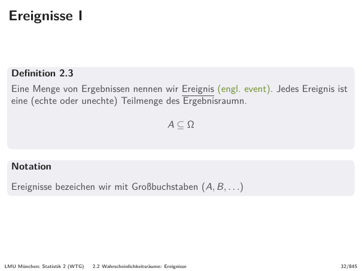

本页放在“模块零：为什么要从集合开始”中，核心是理解 结果（Ergebnis）、事件（Ereignis）、集合（Menge）。直觉上先抓住标题里的对象：事件（Ereignisse）。然后看它是定义、例子、定理还是证明；定义页要记条件，例子页要看随机机制，证明页要看用了哪些闭包性或极限定理。

关键词：

- 结果（Ergebnis）
- 事件（Ereignis）
- 集合（Menge）

本页需要抓住的德语线索：

- `Definition 2.3`

### Seite 9 - 事件（Ereignisse）

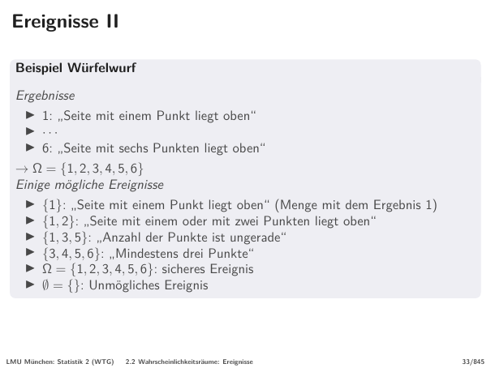

本页放在“模块零：为什么要从集合开始”中，核心是理解 结果（Ergebnis）、事件（Ereignis）、集合（Menge）。直觉上先抓住标题里的对象：事件（Ereignisse）。然后看它是定义、例子、定理还是证明；定义页要记条件，例子页要看随机机制，证明页要看用了哪些闭包性或极限定理。

关键词：

- 结果（Ergebnis）
- 事件（Ereignis）
- 集合（Menge）

本页需要抓住的德语线索：

- `Beispiel Würfelwurf`
- `→ Ω = {1, 2, 3, 4, 5, 6}`
- `Ω = {1, 2, 3, 4, 5, 6}: sicheres Ereignis`
- `∅ = {}: Unmögliches Ereignis`

### Seite 10 - 事件（Ereignisse）

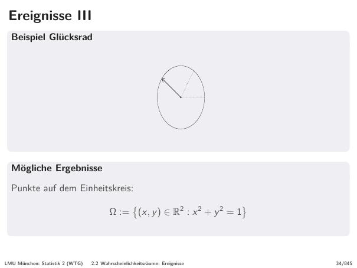

本页放在“模块零：为什么要从集合开始”中，核心是理解 结果（Ergebnis）、事件（Ereignis）。直觉上先抓住标题里的对象：事件（Ereignisse）。然后看它是定义、例子、定理还是证明；定义页要记条件，例子页要看随机机制，证明页要看用了哪些闭包性或极限定理。

关键词：

- 结果（Ergebnis）
- 事件（Ereignis）

本页需要抓住的德语线索：

- `Beispiel Glücksrad`
- `Ω := (cid:8) (x , y ) ∈ R2 : x 2 + y 2 = 1 (cid:9)`

### Seite 11 - 事件（Ereignisse）

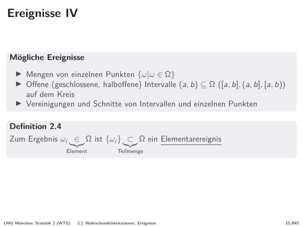

本页放在“模块零：为什么要从集合开始”中，核心是理解 结果（Ergebnis）、事件（Ereignis）、集合（Menge）。直觉上先抓住标题里的对象：事件（Ereignisse）。然后看它是定义、例子、定理还是证明；定义页要记条件，例子页要看随机机制，证明页要看用了哪些闭包性或极限定理。

关键词：

- 结果（Ergebnis）
- 事件（Ereignis）
- 集合（Menge）

本页需要抓住的德语线索：

- `Mengen von einzelnen Punkten {ω|ω ∈ Ω}`
- `Definition 2.4`
- `Zum Ergebnis ω ∈ Ω ist {ω } ⊂ Ω ein Elementarereignis`

### Seite 12 - 集合运算（Mengenoperationen）

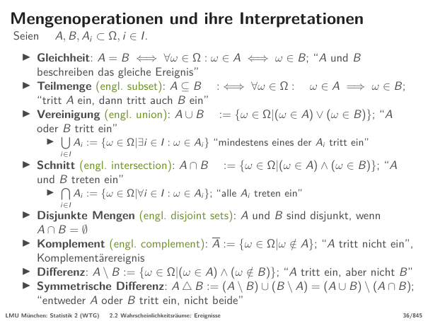

本页放在“模块零：为什么要从集合开始”中，核心是理解 事件（Ereignis）、集合（Menge）。直觉上先抓住标题里的对象：集合运算（Mengenoperationen）。然后看它是定义、例子、定理还是证明；定义页要记条件，例子页要看随机机制，证明页要看用了哪些闭包性或极限定理。

关键词：

- 事件（Ereignis）
- 集合（Menge）

本页需要抓住的德语线索：

- `Seien A, B, A ⊂ Ω, i ∈ I.`
- `Gleichheit: A = B ⇐⇒ ∀ω ∈ Ω : ω ∈ A ⇐⇒ ω ∈ B; “A und B`
- `Teilmenge (engl. subset): A ⊆ B : ⇐⇒ ∀ω ∈ Ω : ω ∈ A =⇒ ω ∈ B;`
- `Vereinigung (engl. union): A ∪ B := {ω ∈ Ω|(ω ∈ A) ∨ (ω ∈ B)}; “A`
- `A := {ω ∈ Ω|∃i ∈ I : ω ∈ A } “mindestens eines der A tritt ein”`

### Seite 13 - Gesetzmäßigkeiten

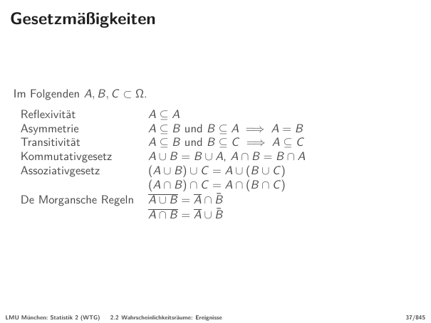

本页放在“模块零：为什么要从集合开始”中，主要作用是推进 Seite 1-56 这一段的概念链。先把标题“Gesetzmäßigkeiten”和前后页联系起来，再区分它是在给定义、展示例子、证明性质，还是做章节过渡。

本页需要抓住的德语线索：

- `Im Folgenden A, B, C ⊂ Ω.`
- `Asymmetrie A ⊆ B und B ⊆ A =⇒ A = B`
- `Transitivität A ⊆ B und B ⊆ C =⇒ A ⊆ C`
- `Kommutativgesetz A ∪ B = B ∪ A, A ∩ B = B ∩ A`
- `Assoziativgesetz (A ∪ B) ∪ C = A ∪ (B ∪ C )`

### Seite 14 - 集合（Menge）

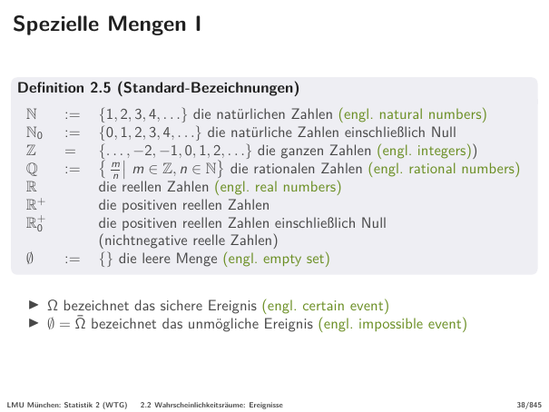

本页放在“模块零：为什么要从集合开始”中，核心是理解 集合（Menge）。直觉上先抓住标题里的对象：集合（Menge）。然后看它是定义、例子、定理还是证明；定义页要记条件，例子页要看随机机制，证明页要看用了哪些闭包性或极限定理。

关键词：

- 集合（Menge）

本页需要抓住的德语线索：

- `Definition 2.5 (Standard-Bezeichnungen)`
- `N := {1, 2, 3, 4, . . .} die natürlichen Zahlen (engl. natural numbers)`
- `N := {0, 1, 2, 3, 4, . . .} die natürliche Zahlen einschließlich Null`
- `Z = {. . . , −2, −1, 0, 1, 2, . . .} die ganzen Zahlen (engl. integers))`
- `Q := (cid:8) m (cid:12) (cid:12) m ∈ Z, n ∈ N(cid:9) die rationalen Zahlen (engl. rational numbers)`

### Seite 15 - 集合（Menge）

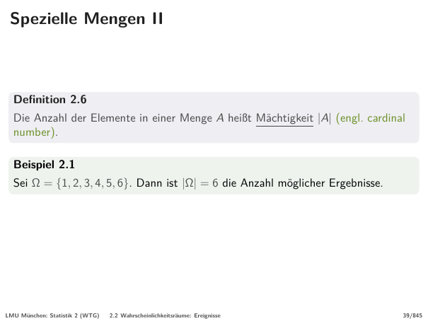

本页放在“模块零：为什么要从集合开始”中，核心是理解 结果（Ergebnis）、集合（Menge）。直觉上先抓住标题里的对象：集合（Menge）。然后看它是定义、例子、定理还是证明；定义页要记条件，例子页要看随机机制，证明页要看用了哪些闭包性或极限定理。

关键词：

- 结果（Ergebnis）
- 集合（Menge）

本页需要抓住的德语线索：

- `Definition 2.6`
- `Beispiel 2.1`
- `Sei Ω = {1, 2, 3, 4, 5, 6}. Dann ist |Ω| = 6 die Anzahl möglicher Ergebnisse.`

### Seite 16 - 集合（Menge）

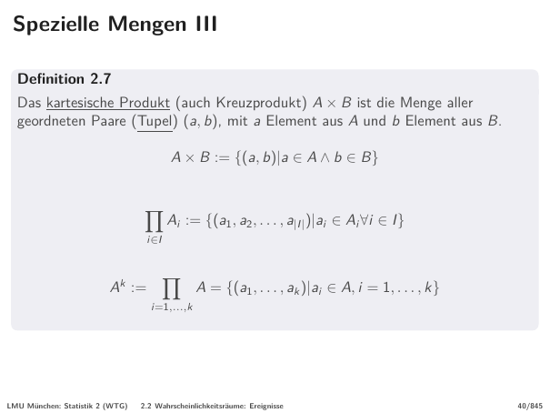

本页放在“模块零：为什么要从集合开始”中，核心是理解 集合（Menge）。直觉上先抓住标题里的对象：集合（Menge）。然后看它是定义、例子、定理还是证明；定义页要记条件，例子页要看随机机制，证明页要看用了哪些闭包性或极限定理。

关键词：

- 集合（Menge）

本页需要抓住的德语线索：

- `Definition 2.7`
- `A × B := {(a, b)|a ∈ A ∧ b ∈ B}`
- `A := {(a , a , . . . , a )|a ∈ A ∀i ∈ I}`
- `i∈I`
- `Ak := A = {(a , . . . , a )|a ∈ A, i = 1, . . . , k}`

### Seite 17 - 集合（Menge）

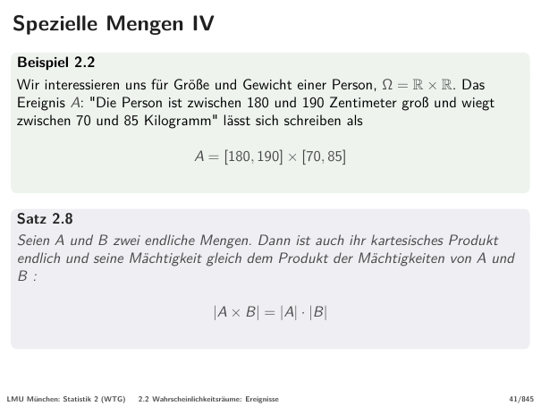

本页放在“模块零：为什么要从集合开始”中，核心是理解 事件（Ereignis）、集合（Menge）。直觉上先抓住标题里的对象：集合（Menge）。然后看它是定义、例子、定理还是证明；定义页要记条件，例子页要看随机机制，证明页要看用了哪些闭包性或极限定理。

关键词：

- 事件（Ereignis）
- 集合（Menge）

本页需要抓住的德语线索：

- `Beispiel 2.2`
- `Wir interessieren uns für Größe und Gewicht einer Person, Ω = R × R. Das`
- `A = [180, 190] × [70, 85]`
- `Satz 2.8`
- `|A × B| = |A| · |B|`

### Seite 18 - 集合（Menge）

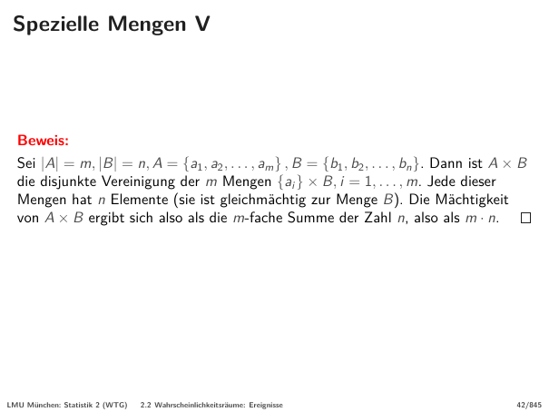

本页放在“模块零：为什么要从集合开始”中，核心是理解 集合（Menge）。直觉上先抓住标题里的对象：集合（Menge）。然后看它是定义、例子、定理还是证明；定义页要记条件，例子页要看随机机制，证明页要看用了哪些闭包性或极限定理。

关键词：

- 集合（Menge）

本页需要抓住的德语线索：

- `Sei |A| = m, |B| = n, A = {a , a , . . . , a } , B = {b , b , . . . , b }. Dann ist A × B`
- `die disjunkte Vereinigung der m Mengen {a } × B, i = 1, . . . , m. Jede dieser`

### Seite 19 - Cantor I

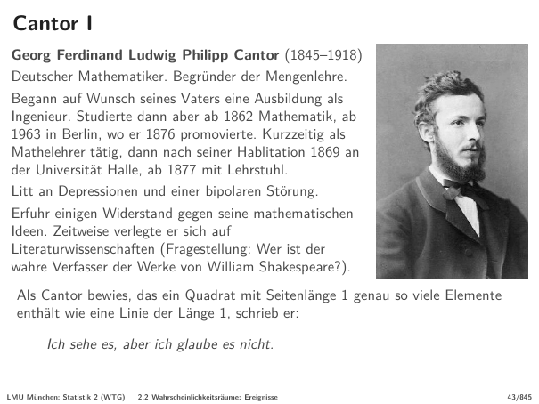

本页可识别的嵌入图片裁切：

本页放在“模块零：为什么要从集合开始”中，核心是理解 集合（Menge）。直觉上先抓住标题里的对象：Cantor I。然后看它是定义、例子、定理还是证明；定义页要记条件，例子页要看随机机制，证明页要看用了哪些闭包性或极限定理。

关键词：

- 集合（Menge）

本页需要抓住的德语线索：

- `Ideen. Zeitweise verlegte er sich auf`

### Seite 20 - Cantor II

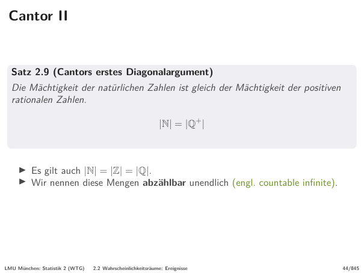

本页放在“模块零：为什么要从集合开始”中，核心是理解 集合（Menge）。直觉上先抓住标题里的对象：Cantor II。然后看它是定义、例子、定理还是证明；定义页要记条件，例子页要看随机机制，证明页要看用了哪些闭包性或极限定理。

关键词：

- 集合（Menge）

本页需要抓住的德语线索：

- `Satz 2.9 (Cantors erstes Diagonalargument)`
- `|N| = |Q+|`
- `Es gilt auch |N| = |Z| = |Q|.`

### Seite 21 - Cantor III

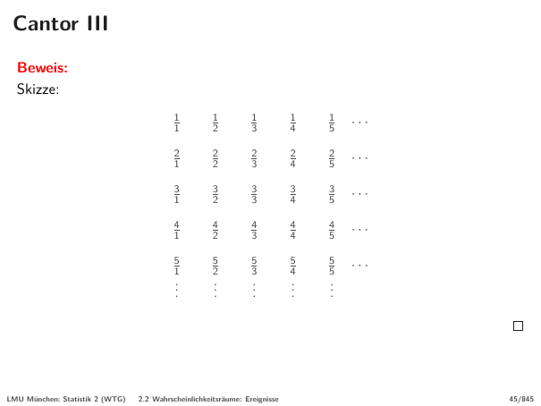

本页放在“模块零：为什么要从集合开始”中，主要作用是推进 Seite 1-56 这一段的概念链。先把标题“Cantor III”和前后页联系起来，再区分它是在给定义、展示例子、证明性质，还是做章节过渡。

本页需要抓住的德语线索：

- `Cantor III`
- `Beweis:`
- `Skizze:`

### Seite 22 - Cantor IV

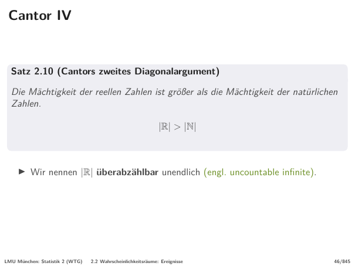

本页放在“模块零：为什么要从集合开始”中，主要作用是推进 Seite 1-56 这一段的概念链。先把标题“Cantor IV”和前后页联系起来，再区分它是在给定义、展示例子、证明性质，还是做章节过渡。

本页需要抓住的德语线索：

- `Satz 2.10 (Cantors zweites Diagonalargument)`

### Seite 23 - Cantor V

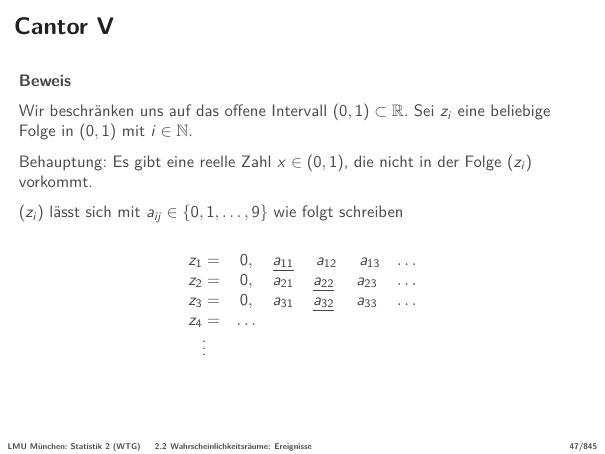

本页放在“模块零：为什么要从集合开始”中，主要作用是推进 Seite 1-56 这一段的概念链。先把标题“Cantor V”和前后页联系起来，再区分它是在给定义、展示例子、证明性质，还是做章节过渡。

本页需要抓住的德语线索：

- `Wir beschränken uns auf das offene Intervall (0, 1) ⊂ R. Sei z eine beliebige`
- `Folge in (0, 1) mit i ∈ N.`
- `Behauptung: Es gibt eine reelle Zahl x ∈ (0, 1), die nicht in der Folge (z )`
- `(z ) lässt sich mit a ∈ {0, 1, . . . , 9} wie folgt schreiben`
- `z = 0, a a a . . .`

### Seite 24 - Cantor VI

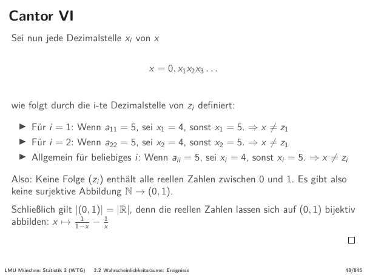

本页放在“模块零：为什么要从集合开始”中，主要作用是推进 Seite 1-56 这一段的概念链。先把标题“Cantor VI”和前后页联系起来，再区分它是在给定义、展示例子、证明性质，还是做章节过渡。

本页需要抓住的德语线索：

- `x = 0, x x x . . .`
- `Für i = 1: Wenn a = 5, sei x = 4, sonst x = 5. ⇒ x ̸= z`
- `Für i = 2: Wenn a = 5, sei x = 4, sonst x = 5. ⇒ x ̸= z`
- `Allgemein für beliebiges i: Wenn a = 5, sei x = 4, sonst x = 5. ⇒ x ̸= z`
- `keine surjektive Abbildung N → (0, 1).`

### Seite 25 - Cantor VII

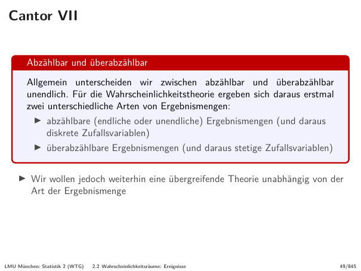

本页放在“模块零：为什么要从集合开始”中，核心是理解 概率（Wahrscheinlichkeit）、结果（Ergebnis）、随机变量（Zufallsvariable）。直觉上先抓住标题里的对象：Cantor VII。然后看它是定义、例子、定理还是证明；定义页要记条件，例子页要看随机机制，证明页要看用了哪些闭包性或极限定理。

关键词：

- 概率（Wahrscheinlichkeit）
- 结果（Ergebnis）
- 随机变量（Zufallsvariable）

本页需要抓住的德语线索：

- `Cantor VII`
- `Abzählbar und überabzählbar`
- `Allgemein unterscheiden wir zwischen abzählbar und überabzählbar`

### Seite 26 - Cantor VIII

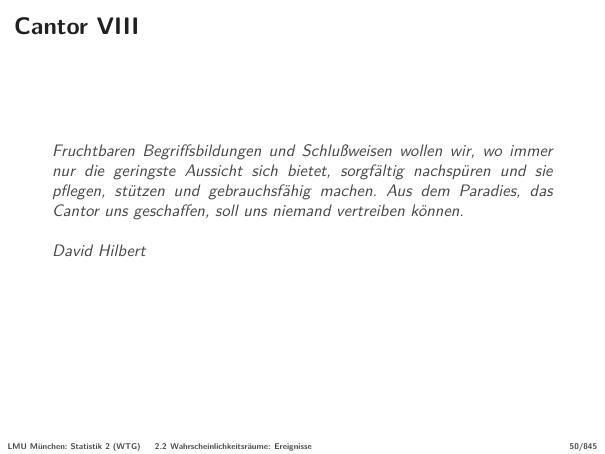

本页放在“模块零：为什么要从集合开始”中，主要作用是推进 Seite 1-56 这一段的概念链。先把标题“Cantor VIII”和前后页联系起来，再区分它是在给定义、展示例子、证明性质，还是做章节过渡。

本页需要抓住的德语线索：

- `Cantor VIII`
- `Fruchtbaren Begriffsbildungen und Schlußweisen wollen wir, wo immer`
- `nur die geringste Aussicht sich bietet, sorgfältig nachspüren und sie`

### Seite 27 - 概率空间（Wahrscheinlichkeitsräume）

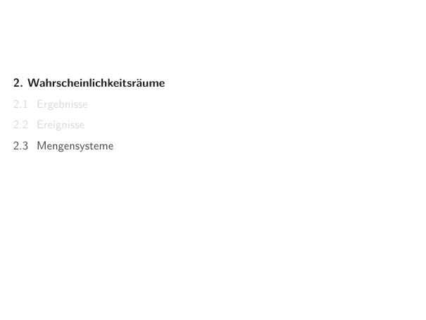

本页放在“模块零：为什么要从集合开始”中，核心是理解 概率（Wahrscheinlichkeit）、结果（Ergebnis）、事件（Ereignis）、集合（Menge）。直觉上先抓住标题里的对象：概率空间（Wahrscheinlichkeitsräume）。然后看它是定义、例子、定理还是证明；定义页要记条件，例子页要看随机机制，证明页要看用了哪些闭包性或极限定理。

关键词：

- 概率（Wahrscheinlichkeit）
- 结果（Ergebnis）
- 事件（Ereignis）
- 集合（Menge）
- 集合系统（Mengensystem）

本页需要抓住的德语线索：

- `2. Wahrscheinlichkeitsräume`
- `2.1 Ergebnisse`
- `2.2 Ereignisse`

### Seite 28 - 集合系统（Mengensysteme）

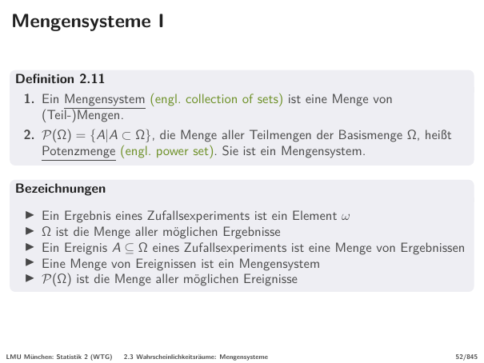

本页放在“模块零：为什么要从集合开始”中，核心是理解 结果（Ergebnis）、事件（Ereignis）、集合（Menge）、集合系统（Mengensystem）。直觉上先抓住标题里的对象：集合系统（Mengensysteme）。然后看它是定义、例子、定理还是证明；定义页要记条件，例子页要看随机机制，证明页要看用了哪些闭包性或极限定理。

关键词：

- 结果（Ergebnis）
- 事件（Ereignis）
- 集合（Menge）
- 集合系统（Mengensystem）

本页需要抓住的德语线索：

- `Definition 2.11`
- `2. P(Ω) = {A|A ⊂ Ω}, die Menge aller Teilmengen der Basismenge Ω, heißt`
- `P(Ω) ist die Menge aller möglichen Ereignisse`

### Seite 29 - 集合系统（Mengensysteme）

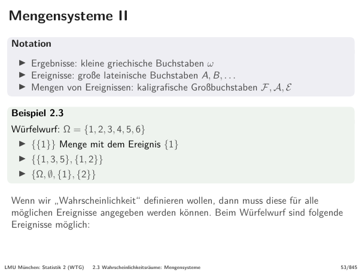

本页放在“模块零：为什么要从集合开始”中，核心是理解 概率（Wahrscheinlichkeit）、结果（Ergebnis）、事件（Ereignis）、集合（Menge）。直觉上先抓住标题里的对象：集合系统（Mengensysteme）。然后看它是定义、例子、定理还是证明；定义页要记条件，例子页要看随机机制，证明页要看用了哪些闭包性或极限定理。

关键词：

- 概率（Wahrscheinlichkeit）
- 结果（Ergebnis）
- 事件（Ereignis）
- 集合（Menge）
- 集合系统（Mengensystem）

本页需要抓住的德语线索：

- `Beispiel 2.3`
- `Würfelwurf: Ω = {1, 2, 3, 4, 5, 6}`

### Seite 30 - 集合系统（Mengensysteme）

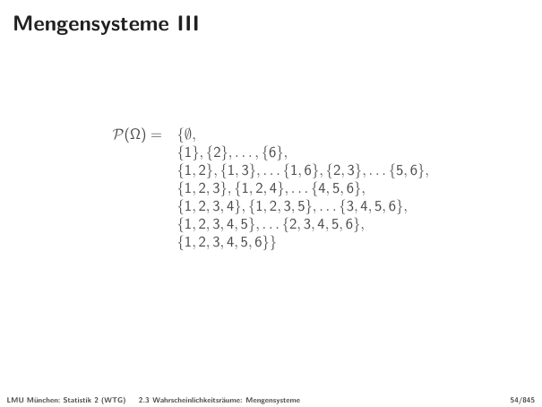

本页放在“模块零：为什么要从集合开始”中，核心是理解 集合（Menge）、集合系统（Mengensystem）。直觉上先抓住标题里的对象：集合系统（Mengensysteme）。然后看它是定义、例子、定理还是证明；定义页要记条件，例子页要看随机机制，证明页要看用了哪些闭包性或极限定理。

关键词：

- 集合（Menge）
- 集合系统（Mengensystem）

本页需要抓住的德语线索：

- `P(Ω) = {∅,`

### Seite 31 - 集合系统（Mengensysteme）

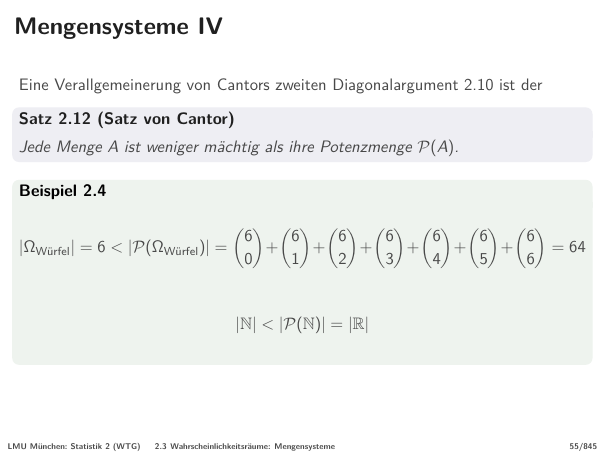

本页放在“模块零：为什么要从集合开始”中，核心是理解 集合（Menge）、集合系统（Mengensystem）。直觉上先抓住标题里的对象：集合系统（Mengensysteme）。然后看它是定义、例子、定理还是证明；定义页要记条件，例子页要看随机机制，证明页要看用了哪些闭包性或极限定理。

关键词：

- 集合（Menge）
- 集合系统（Mengensystem）

本页需要抓住的德语线索：

- `Satz 2.12 (Satz von Cantor)`
- `Jede Menge A ist weniger mächtig als ihre Potenzmenge P(A).`
- `Beispiel 2.4`
- `|Ω | = 6 < |P(Ω )| = + + + + + + = 64`
- `|N| < |P(N)| = |R|`

### Seite 32 - Beispiel Glücksrad I

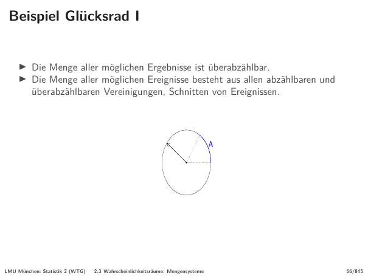

本页放在“模块零：为什么要从集合开始”中，核心是理解 结果（Ergebnis）、事件（Ereignis）、集合（Menge）。直觉上先抓住标题里的对象：Beispiel Glücksrad I。然后看它是定义、例子、定理还是证明；定义页要记条件，例子页要看随机机制，证明页要看用了哪些闭包性或极限定理。

关键词：

- 结果（Ergebnis）
- 事件（Ereignis）
- 集合（Menge）

本页需要抓住的德语线索：

- `Beispiel Glücksrad I`

### Seite 33 - Beispiel Glücksrad II

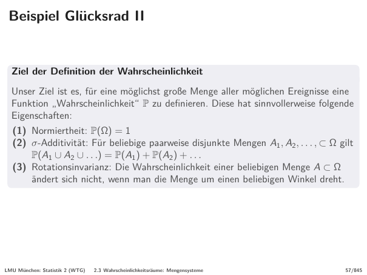

本页放在“模块零：为什么要从集合开始”中，核心是理解 概率（Wahrscheinlichkeit）、事件（Ereignis）、集合（Menge）。直觉上先抓住标题里的对象：Beispiel Glücksrad II。然后看它是定义、例子、定理还是证明；定义页要记条件，例子页要看随机机制，证明页要看用了哪些闭包性或极限定理。

关键词：

- 概率（Wahrscheinlichkeit）
- 事件（Ereignis）
- 集合（Menge）

本页需要抓住的德语线索：

- `Beispiel Glücksrad II`
- `Ziel der Definition der Wahrscheinlichkeit`
- `Unser Ziel ist es, für eine möglichst große Menge aller möglichen Ereignisse eine`
- `(1) Normiertheit: P(Ω) = 1`
- `(2) σ-Additivität: Für beliebige paarweise disjunkte Mengen A , A , . . . , ⊂ Ω gilt`

### Seite 34 - Satz von Vitali I

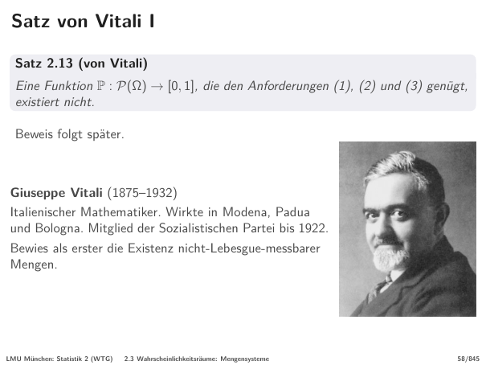

本页可识别的嵌入图片裁切：

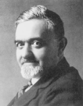

本页放在“模块零：为什么要从集合开始”中，核心是理解 集合（Menge）、可测（messbar）。直觉上先抓住标题里的对象：Satz von Vitali I。然后看它是定义、例子、定理还是证明；定义页要记条件，例子页要看随机机制，证明页要看用了哪些闭包性或极限定理。

关键词：

- 集合（Menge）
- 可测（messbar）

本页需要抓住的德语线索：

- `Satz von Vitali I`
- `Satz 2.13 (von Vitali)`
- `Eine Funktion P : P(Ω) → [0, 1], die den Anforderungen (1), (2) und (3) genügt,`

### Seite 35 - Satz von Vitali II

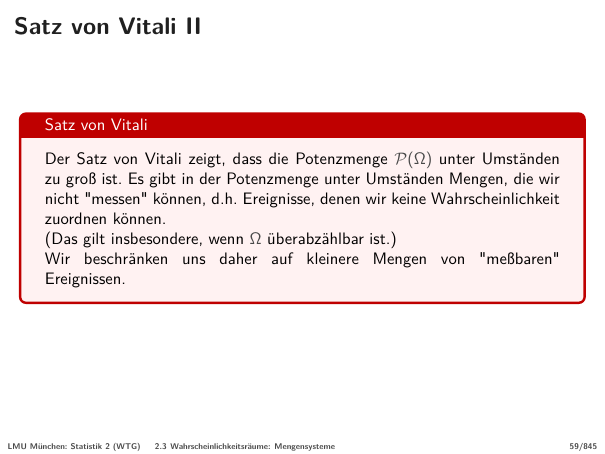

本页放在“模块零：为什么要从集合开始”中，核心是理解 概率（Wahrscheinlichkeit）、事件（Ereignis）、集合（Menge）。直觉上先抓住标题里的对象：Satz von Vitali II。然后看它是定义、例子、定理还是证明；定义页要记条件，例子页要看随机机制，证明页要看用了哪些闭包性或极限定理。

关键词：

- 概率（Wahrscheinlichkeit）
- 事件（Ereignis）
- 集合（Menge）

本页需要抓住的德语线索：

- `Satz von Vitali II`
- `Satz von Vitali`
- `Der Satz von Vitali zeigt, dass die Potenzmenge P(Ω) unter Umständen`

### Seite 36 - σ-代数（σ-Algebra）

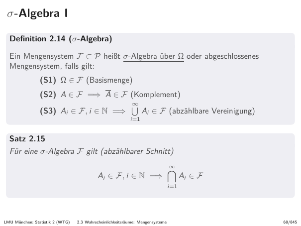

本页放在“模块零：为什么要从集合开始”中，核心是理解 集合（Menge）、集合系统（Mengensystem）、σ-代数（σ-Algebra）。直觉上先抓住标题里的对象：σ-代数（σ-Algebra）。然后看它是定义、例子、定理还是证明；定义页要记条件，例子页要看随机机制，证明页要看用了哪些闭包性或极限定理。

关键词：

- 集合（Menge）
- 集合系统（Mengensystem）
- σ-代数（σ-Algebra）

本页需要抓住的德语线索：

- `Definition 2.14 (σ-Algebra)`
- `Ein Mengensystem F ⊂ P heißt σ-Algebra über Ω oder abgeschlossenes`
- `(S1) Ω ∈ F (Basismenge)`
- `(S2) A ∈ F =⇒ A ∈ F (Komplement)`
- `(S3) A ∈ F, i ∈ N =⇒ S A ∈ F (abzählbare Vereinigung)`

### Seite 37 - σ-代数（σ-Algebra）

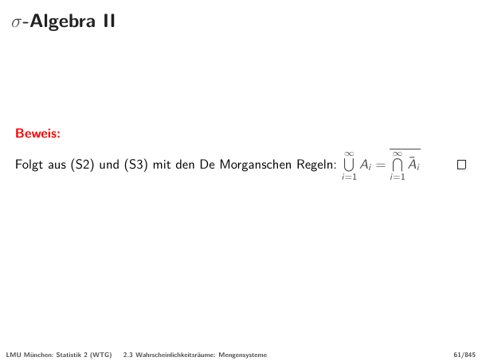

本页放在“模块零：为什么要从集合开始”中，核心是理解 σ-代数（σ-Algebra）。直觉上先抓住标题里的对象：σ-代数（σ-Algebra）。然后看它是定义、例子、定理还是证明；定义页要记条件，例子页要看随机机制，证明页要看用了哪些闭包性或极限定理。

关键词：

- σ-代数（σ-Algebra）

本页需要抓住的德语线索：

- `Folgt aus (S2) und (S3) mit den De Morganschen Regeln: S A = T A¯`
- `i=1 i=1`

### Seite 38 - Beispiele I

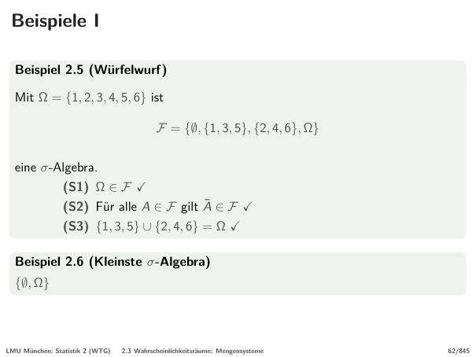

本页放在“模块零：为什么要从集合开始”中，核心是理解 σ-代数（σ-Algebra）。直觉上先抓住标题里的对象：Beispiele I。然后看它是定义、例子、定理还是证明；定义页要记条件，例子页要看随机机制，证明页要看用了哪些闭包性或极限定理。

关键词：

- σ-代数（σ-Algebra）

本页需要抓住的德语线索：

- `Beispiele I`
- `Beispiel 2.5 (Würfelwurf)`
- `Mit Ω = {1, 2, 3, 4, 5, 6} ist`
- `F = {∅, {1, 3, 5}, {2, 4, 6}, Ω}`
- `(S1) Ω ∈ F ✓`

### Seite 39 - Beispiele II

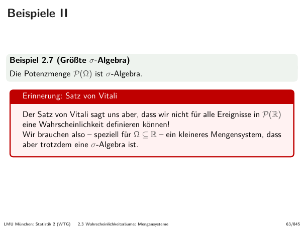

本页放在“模块零：为什么要从集合开始”中，核心是理解 概率（Wahrscheinlichkeit）、事件（Ereignis）、集合（Menge）、集合系统（Mengensystem）。直觉上先抓住标题里的对象：Beispiele II。然后看它是定义、例子、定理还是证明；定义页要记条件，例子页要看随机机制，证明页要看用了哪些闭包性或极限定理。

关键词：

- 概率（Wahrscheinlichkeit）
- 事件（Ereignis）
- 集合（Menge）
- 集合系统（Mengensystem）
- σ-代数（σ-Algebra）

本页需要抓住的德语线索：

- `Beispiele II`
- `Beispiel 2.7 (Größte σ-Algebra)`
- `Die Potenzmenge P(Ω) ist σ-Algebra.`
- `Erinnerung: Satz von Vitali`
- `Der Satz von Vitali sagt uns aber, dass wir nicht für alle Ereignisse in P(R)`

### Seite 40 - σ-代数（σ-Algebra）

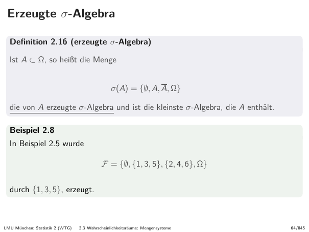

本页放在“模块零：为什么要从集合开始”中，核心是理解 集合（Menge）、σ-代数（σ-Algebra）。直觉上先抓住标题里的对象：σ-代数（σ-Algebra）。然后看它是定义、例子、定理还是证明；定义页要记条件，例子页要看随机机制，证明页要看用了哪些闭包性或极限定理。

关键词：

- 集合（Menge）
- σ-代数（σ-Algebra）

本页需要抓住的德语线索：

- `Definition 2.16 (erzeugte σ-Algebra)`
- `Ist A ⊂ Ω, so heißt die Menge`
- `σ(A) = {∅, A, A, Ω}`
- `Beispiel 2.8`
- `In Beispiel 2.5 wurde`

### Seite 41 - Schnitt von σ-Algebren I

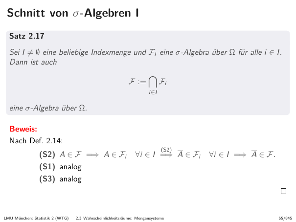

本页放在“模块零：为什么要从集合开始”中，核心是理解 σ-代数（σ-Algebra）。直觉上先抓住标题里的对象：Schnitt von σ-Algebren I。然后看它是定义、例子、定理还是证明；定义页要记条件，例子页要看随机机制，证明页要看用了哪些闭包性或极限定理。

关键词：

- σ-代数（σ-Algebra）

本页需要抓住的德语线索：

- `Satz 2.17`
- `Sei I ̸= ∅ eine beliebige Indexmenge und F eine σ-Algebra über Ω für alle i ∈ I.`
- `F := F`
- `i∈I`
- `(S2) A ∈ F =⇒ A ∈ F ∀i ∈ I =⇒ A ∈ F ∀i ∈ I =⇒ A ∈ F.`

### Seite 42 - Schnitt von σ-Algebren II

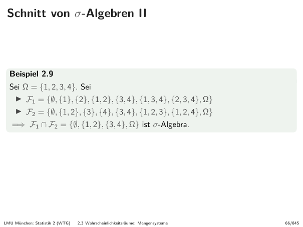

本页放在“模块零：为什么要从集合开始”中，核心是理解 σ-代数（σ-Algebra）。直觉上先抓住标题里的对象：Schnitt von σ-Algebren II。然后看它是定义、例子、定理还是证明；定义页要记条件，例子页要看随机机制，证明页要看用了哪些闭包性或极限定理。

关键词：

- σ-代数（σ-Algebra）

本页需要抓住的德语线索：

- `Beispiel 2.9`
- `Sei Ω = {1, 2, 3, 4}. Sei`
- `F = {∅, {1}, {2}, {1, 2}, {3, 4}, {1, 3, 4}, {2, 3, 4}, Ω}`
- `F = {∅, {1, 2}, {3}, {4}, {3, 4}, {1, 2, 3}, {1, 2, 4}, Ω}`
- `=⇒ F ∩ F = {∅, {1, 2}, {3, 4}, Ω} ist σ-Algebra.`

### Seite 43 - Erzeuger I

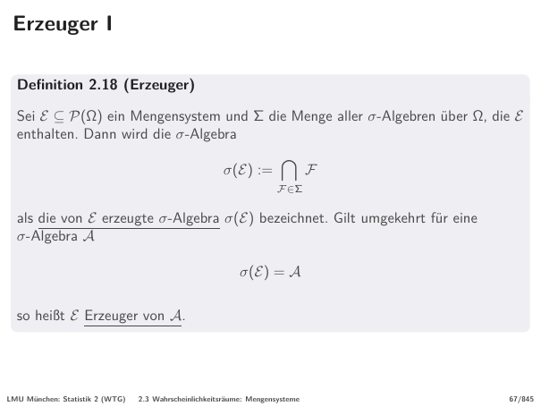

本页放在“模块零：为什么要从集合开始”中，核心是理解 集合（Menge）、集合系统（Mengensystem）、σ-代数（σ-Algebra）。直觉上先抓住标题里的对象：Erzeuger I。然后看它是定义、例子、定理还是证明；定义页要记条件，例子页要看随机机制，证明页要看用了哪些闭包性或极限定理。

关键词：

- 集合（Menge）
- 集合系统（Mengensystem）
- σ-代数（σ-Algebra）

本页需要抓住的德语线索：

- `Definition 2.18 (Erzeuger)`
- `Sei E ⊆ P(Ω) ein Mengensystem und Σ die Menge aller σ-Algebren über Ω, die E`
- `σ(E) := F`
- `F∈Σ`
- `σ(E) = A`

### Seite 44 - Erzeuger II

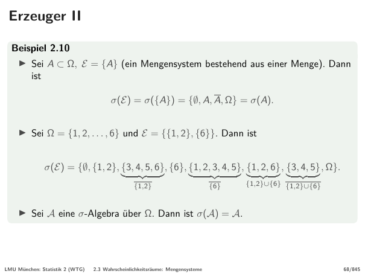

本页放在“模块零：为什么要从集合开始”中，核心是理解 集合（Menge）、集合系统（Mengensystem）、σ-代数（σ-Algebra）。直觉上先抓住标题里的对象：Erzeuger II。然后看它是定义、例子、定理还是证明；定义页要记条件，例子页要看随机机制，证明页要看用了哪些闭包性或极限定理。

关键词：

- 集合（Menge）
- 集合系统（Mengensystem）
- σ-代数（σ-Algebra）

本页需要抓住的德语线索：

- `Beispiel 2.10`
- `Sei A ⊂ Ω, E = {A} (ein Mengensystem bestehend aus einer Menge). Dann`
- `σ(E) = σ({A}) = {∅, A, A, Ω} = σ(A).`
- `Sei Ω = {1, 2, . . . , 6} und E = {{1, 2}, {6}}. Dann ist`
- `σ(E) = {∅, {1, 2}, {3, 4, 5, 6}, {6}, {1, 2, 3, 4, 5}, {1, 2, 6}, {3, 4, 5}, Ω}.`

### Seite 45 - σ-代数（σ-Algebra）

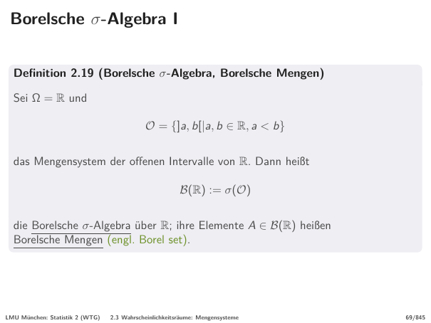

本页放在“模块零：为什么要从集合开始”中，核心是理解 集合（Menge）、集合系统（Mengensystem）、σ-代数（σ-Algebra）。直觉上先抓住标题里的对象：σ-代数（σ-Algebra）。然后看它是定义、例子、定理还是证明；定义页要记条件，例子页要看随机机制，证明页要看用了哪些闭包性或极限定理。

关键词：

- 集合（Menge）
- 集合系统（Mengensystem）
- σ-代数（σ-Algebra）

本页需要抓住的德语线索：

- `Definition 2.19 (Borelsche σ-Algebra, Borelsche Mengen)`
- `Sei Ω = R und`
- `O = {]a, b[|a, b ∈ R, a < b}`
- `B(R) := σ(O)`
- `die Borelsche σ-Algebra über R; ihre Elemente A ∈ B(R) heißen`

### Seite 46 - σ-代数（σ-Algebra）

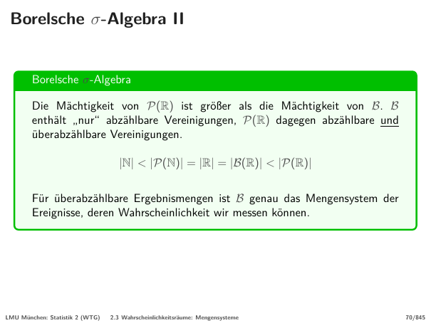

本页放在“模块零：为什么要从集合开始”中，核心是理解 概率（Wahrscheinlichkeit）、结果（Ergebnis）、事件（Ereignis）、集合（Menge）。直觉上先抓住标题里的对象：σ-代数（σ-Algebra）。然后看它是定义、例子、定理还是证明；定义页要记条件，例子页要看随机机制，证明页要看用了哪些闭包性或极限定理。

关键词：

- 概率（Wahrscheinlichkeit）
- 结果（Ergebnis）
- 事件（Ereignis）
- 集合（Menge）
- 集合系统（Mengensystem）
- σ-代数（σ-Algebra）

本页需要抓住的德语线索：

- `Die Mächtigkeit von P(R) ist größer als die Mächtigkeit von B. B`
- `enthält „nur“ abzählbare Vereinigungen, P(R) dagegen abzählbare und`
- `|N| < |P(N)| = |R| = |B(R)| < |P(R)|`

### Seite 47 - σ-代数（σ-Algebra）

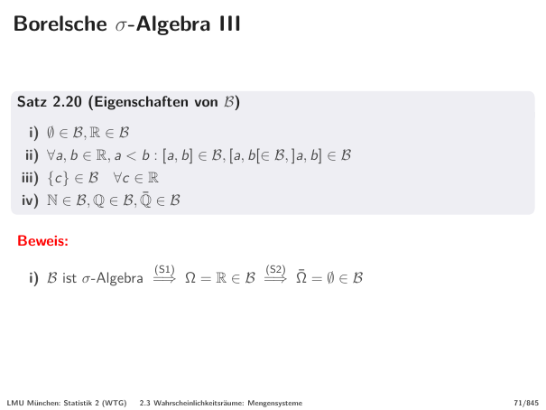

本页放在“模块零：为什么要从集合开始”中，核心是理解 σ-代数（σ-Algebra）。直觉上先抓住标题里的对象：σ-代数（σ-Algebra）。然后看它是定义、例子、定理还是证明；定义页要记条件，例子页要看随机机制，证明页要看用了哪些闭包性或极限定理。

关键词：

- σ-代数（σ-Algebra）

本页需要抓住的德语线索：

- `Satz 2.20 (Eigenschaften von B)`
- `i) ∅ ∈ B, R ∈ B`
- `ii) ∀a, b ∈ R, a < b : [a, b] ∈ B, [a, b[∈ B, ]a, b] ∈ B`
- `iii) {c} ∈ B ∀c ∈ R`
- `iv) N ∈ B, Q ∈ B, Q¯ ∈ B`

### Seite 48 - σ-代数（σ-Algebra）

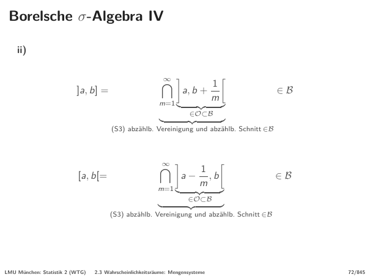

本页放在“模块零：为什么要从集合开始”中，核心是理解 σ-代数（σ-Algebra）。直觉上先抓住标题里的对象：σ-代数（σ-Algebra）。然后看它是定义、例子、定理还是证明；定义页要记条件，例子页要看随机机制，证明页要看用了哪些闭包性或极限定理。

关键词：

- σ-代数（σ-Algebra）

本页需要抓住的德语线索：

- `]a, b] = a, b + ∈ B`
- `m=1`
- `∈O⊂B`
- `(S3) abzählb. Vereinigung und abzählb. Schnitt ∈B`
- `[a, b[= a − , b ∈ B`

### Seite 49 - σ-代数（σ-Algebra）

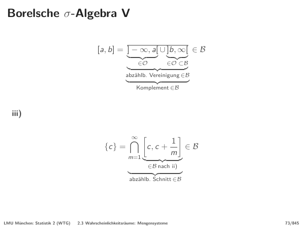

本页放在“模块零：为什么要从集合开始”中，核心是理解 σ-代数（σ-Algebra）。直觉上先抓住标题里的对象：σ-代数（σ-Algebra）。然后看它是定义、例子、定理还是证明；定义页要记条件，例子页要看随机机制，证明页要看用了哪些闭包性或极限定理。

关键词：

- σ-代数（σ-Algebra）

本页需要抓住的德语线索：

- `[a, b] = ] − ∞, a[ ∪ ]b, ∞[ ∈ B`
- `∈O ∈O ⊂B`
- `abzählb. Vereinigung ∈B`
- `Komplement ∈B`
- `{c} = c, c + ∈ B`

### Seite 50 - σ-代数（σ-Algebra）

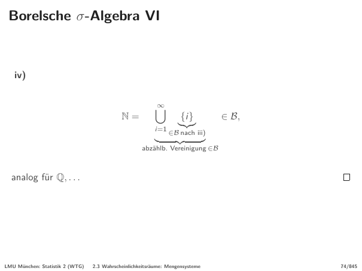

本页放在“模块零：为什么要从集合开始”中，核心是理解 σ-代数（σ-Algebra）。直觉上先抓住标题里的对象：σ-代数（σ-Algebra）。然后看它是定义、例子、定理还是证明；定义页要记条件，例子页要看随机机制，证明页要看用了哪些闭包性或极限定理。

关键词：

- σ-代数（σ-Algebra）

本页需要抓住的德语线索：

- `N = {i} ∈ B,`
- `i=1`
- `∈B nach iii)`
- `abzählb. Vereinigung ∈B`

### Seite 51 - σ-代数（σ-Algebra）

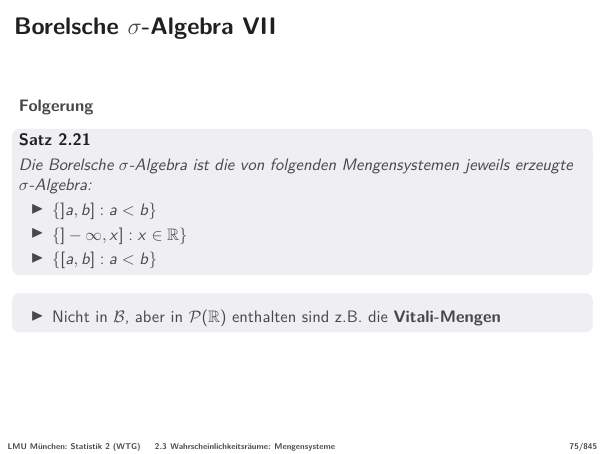

本页放在“模块零：为什么要从集合开始”中，核心是理解 集合（Menge）、集合系统（Mengensystem）、σ-代数（σ-Algebra）。直觉上先抓住标题里的对象：σ-代数（σ-Algebra）。然后看它是定义、例子、定理还是证明；定义页要记条件，例子页要看随机机制，证明页要看用了哪些闭包性或极限定理。

关键词：

- 集合（Menge）
- 集合系统（Mengensystem）
- σ-代数（σ-Algebra）

本页需要抓住的德语线索：

- `Satz 2.21`
- `{] − ∞, x ] : x ∈ R}`
- `Nicht in B, aber in P(R) enthalten sind z.B. die Vitali-Mengen`

### Seite 52 - σ-代数（σ-Algebra）

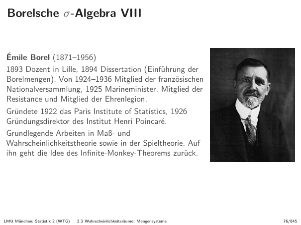

本页可识别的嵌入图片裁切：

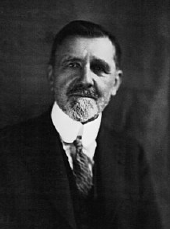

本页放在“模块零：为什么要从集合开始”中，核心是理解 概率（Wahrscheinlichkeit）、σ-代数（σ-Algebra）、测度（Maß）。直觉上先抓住标题里的对象：σ-代数（σ-Algebra）。然后看它是定义、例子、定理还是证明；定义页要记条件，例子页要看随机机制，证明页要看用了哪些闭包性或极限定理。

关键词：

- 概率（Wahrscheinlichkeit）
- σ-代数（σ-Algebra）
- 测度（Maß）

本页需要抓住的德语线索：

- `ihn geht die Idee des Infinite-Monkey-Theorems zurück.`

### Seite 53 - σ-代数（σ-Algebra）

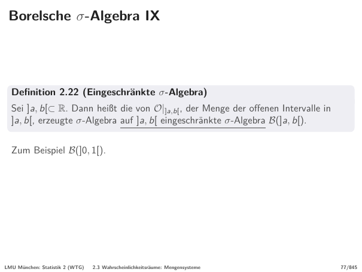

本页放在“模块零：为什么要从集合开始”中，核心是理解 集合（Menge）、σ-代数（σ-Algebra）。直觉上先抓住标题里的对象：σ-代数（σ-Algebra）。然后看它是定义、例子、定理还是证明；定义页要记条件，例子页要看随机机制，证明页要看用了哪些闭包性或极限定理。

关键词：

- 集合（Menge）
- σ-代数（σ-Algebra）

本页需要抓住的德语线索：

- `Definition 2.22 (Eingeschränkte σ-Algebra)`
- `Sei ]a, b[⊂ R. Dann heißt die von O| , der Menge der offenen Intervalle in`
- `Zum Beispiel B(]0, 1[).`

### Seite 54 - σ-代数（σ-Algebra）

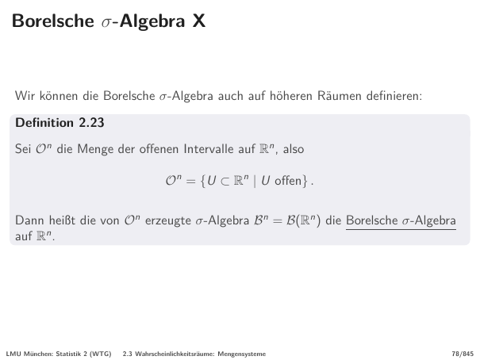

本页放在“模块零：为什么要从集合开始”中，核心是理解 集合（Menge）、σ-代数（σ-Algebra）。直觉上先抓住标题里的对象：σ-代数（σ-Algebra）。然后看它是定义、例子、定理还是证明；定义页要记条件，例子页要看随机机制，证明页要看用了哪些闭包性或极限定理。

关键词：

- 集合（Menge）
- σ-代数（σ-Algebra）

本页需要抓住的德语线索：

- `Definition 2.23`
- `On = {U ⊂ Rn | U offen} .`
- `Dann heißt die von On erzeugte σ-Algebra Bn = B(Rn) die Borelsche σ-Algebra`

### Seite 55 - σ-代数（σ-Algebra）

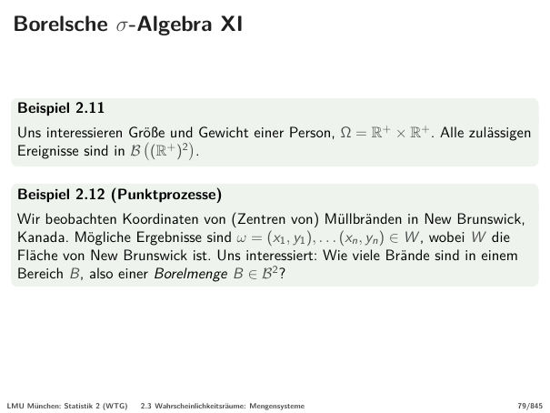

本页放在“模块零：为什么要从集合开始”中，核心是理解 结果（Ergebnis）、事件（Ereignis）、σ-代数（σ-Algebra）。直觉上先抓住标题里的对象：σ-代数（σ-Algebra）。然后看它是定义、例子、定理还是证明；定义页要记条件，例子页要看随机机制，证明页要看用了哪些闭包性或极限定理。

关键词：

- 结果（Ergebnis）
- 事件（Ereignis）
- σ-代数（σ-Algebra）

本页需要抓住的德语线索：

- `Beispiel 2.11`
- `Uns interessieren Größe und Gewicht einer Person, Ω = R+ × R+. Alle zulässigen`
- `Beispiel 2.12 (Punktprozesse)`
- `Kanada. Mögliche Ergebnisse sind ω = (x , y ), . . . (x , y ) ∈ W , wobei W die`
- `Bereich B, also einer Borelmenge B ∈ B2?`

### Seite 56 - σ-代数（σ-Algebra）

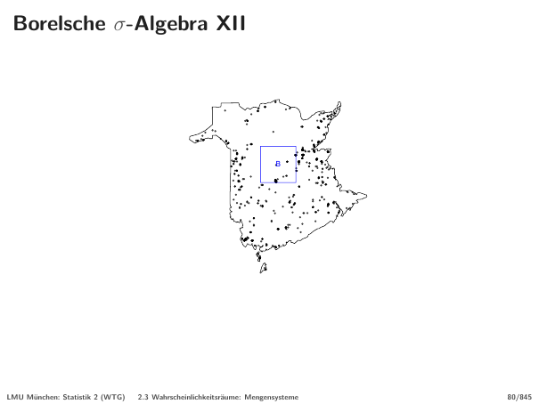

本页放在“模块零：为什么要从集合开始”中，核心是理解 σ-代数（σ-Algebra）。直觉上先抓住标题里的对象：σ-代数（σ-Algebra）。然后看它是定义、例子、定理还是证明；定义页要记条件，例子页要看随机机制，证明页要看用了哪些闭包性或极限定理。

关键词：

- σ-代数（σ-Algebra）

本页需要抓住的德语线索：

- `Borelsche σ-Algebra XII`
- `B`

## 模块一：概率测度把事件变成数字（Seite 57-114）

有了可测事件系统，下一步才是给事件分配 0 到 1 的数。测度论语言看起来抽象，但大白话就是：哪些集合能量、怎么量、量出来必须满足哪些一致性规则。

### Seite 57 - 概率测度（Wahrscheinlichkeitsmaß）

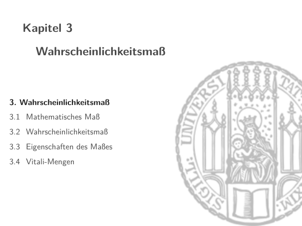

本页可识别的嵌入图片裁切：

本页放在“模块一：概率测度把事件变成数字”中，核心是理解 概率（Wahrscheinlichkeit）、概率测度（Wahrscheinlichkeitsmaß）、集合（Menge）、测度（Maß）。直觉上先抓住标题里的对象：概率测度（Wahrscheinlichkeitsmaß）。然后看它是定义、例子、定理还是证明；定义页要记条件，例子页要看随机机制，证明页要看用了哪些闭包性或极限定理。

关键词：

- 概率（Wahrscheinlichkeit）
- 概率测度（Wahrscheinlichkeitsmaß）
- 集合（Menge）
- 测度（Maß）

本页需要抓住的德语线索：

- `Kapitel 3`
- `Wahrscheinlichkeitsmaß`
- `3. Wahrscheinlichkeitsmaß`

### Seite 58 - Ziele des Kapitels I

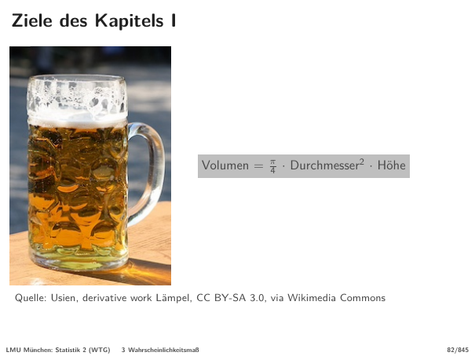

本页可识别的嵌入图片裁切：

本页放在“模块一：概率测度把事件变成数字”中，主要作用是推进 Seite 57-114 这一段的概念链。先把标题“Ziele des Kapitels I”和前后页联系起来，再区分它是在给定义、展示例子、证明性质，还是做章节过渡。

本页需要抓住的德语线索：

- `Ziele des Kapitels I`
- `Volumen = π · Durchmesser2 · Höhe`

### Seite 59 - Ziele des Kapitels II

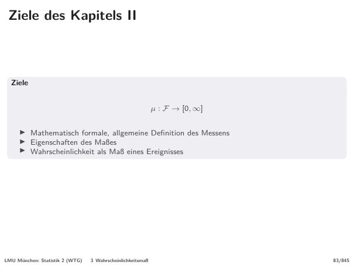

本页放在“模块一：概率测度把事件变成数字”中，核心是理解 概率（Wahrscheinlichkeit）、事件（Ereignis）、测度（Maß）。直觉上先抓住标题里的对象：Ziele des Kapitels II。然后看它是定义、例子、定理还是证明；定义页要记条件，例子页要看随机机制，证明页要看用了哪些闭包性或极限定理。

关键词：

- 概率（Wahrscheinlichkeit）
- 事件（Ereignis）
- 测度（Maß）

本页需要抓住的德语线索：

- `Ziele des Kapitels II`
- `Ziele`
- `µ : F → [0, ∞]`
- `Mathematisch formale, allgemeine Definition des Messens`

### Seite 60 - 概率测度（Wahrscheinlichkeitsmaß）

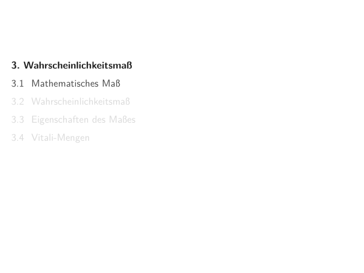

本页放在“模块一：概率测度把事件变成数字”中，核心是理解 概率（Wahrscheinlichkeit）、概率测度（Wahrscheinlichkeitsmaß）、集合（Menge）、测度（Maß）。直觉上先抓住标题里的对象：概率测度（Wahrscheinlichkeitsmaß）。然后看它是定义、例子、定理还是证明；定义页要记条件，例子页要看随机机制，证明页要看用了哪些闭包性或极限定理。

关键词：

- 概率（Wahrscheinlichkeit）
- 概率测度（Wahrscheinlichkeitsmaß）
- 集合（Menge）
- 测度（Maß）

本页需要抓住的德语线索：

- `3. Wahrscheinlichkeitsmaß`
- `3.1 Mathematisches Maß`
- `3.2 Wahrscheinlichkeitsmaß`

### Seite 61 - Meßbarkeit

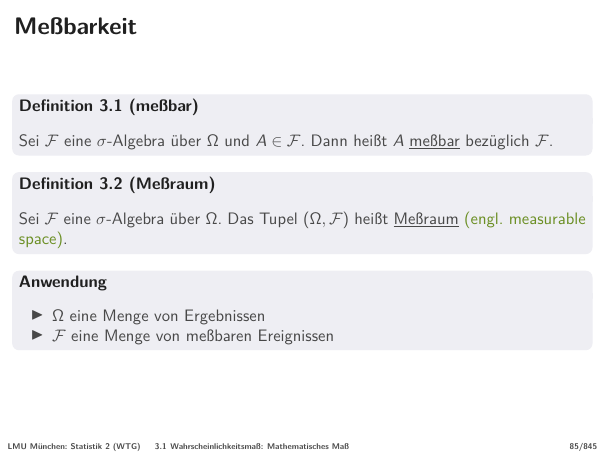

本页放在“模块一：概率测度把事件变成数字”中，核心是理解 结果（Ergebnis）、事件（Ereignis）、集合（Menge）、σ-代数（σ-Algebra）。直觉上先抓住标题里的对象：Meßbarkeit。然后看它是定义、例子、定理还是证明；定义页要记条件，例子页要看随机机制，证明页要看用了哪些闭包性或极限定理。

关键词：

- 结果（Ergebnis）
- 事件（Ereignis）
- 集合（Menge）
- σ-代数（σ-Algebra）

本页需要抓住的德语线索：

- `Definition 3.1 (meßbar)`
- `Sei F eine σ-Algebra über Ω und A ∈ F. Dann heißt A meßbar bezüglich F.`
- `Definition 3.2 (Meßraum)`

### Seite 62 - 测度（Maß）

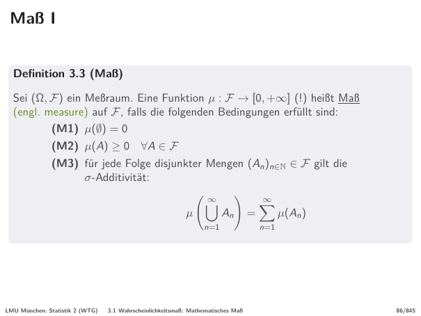

本页放在“模块一：概率测度把事件变成数字”中，核心是理解 集合（Menge）、测度（Maß）。直觉上先抓住标题里的对象：测度（Maß）。然后看它是定义、例子、定理还是证明；定义页要记条件，例子页要看随机机制，证明页要看用了哪些闭包性或极限定理。

关键词：

- 集合（Menge）
- 测度（Maß）

本页需要抓住的德语线索：

- `Definition 3.3 (Maß)`
- `Sei (Ω, F) ein Meßraum. Eine Funktion µ : F → [0, +∞] (!) heißt Maß`
- `(M1) µ(∅) = 0`
- `(M2) µ(A) ≥ 0 ∀A ∈ F`
- `(M3) für jede Folge disjunkter Mengen (A n ) n∈N ∈ F gilt die`

### Seite 63 - 测度（Maß）

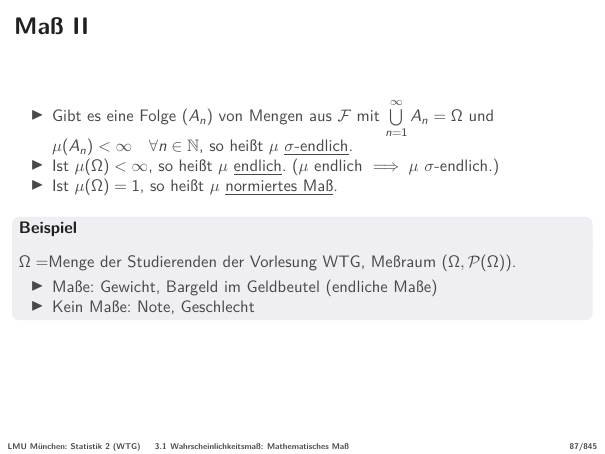

本页放在“模块一：概率测度把事件变成数字”中，核心是理解 集合（Menge）、测度（Maß）。直觉上先抓住标题里的对象：测度（Maß）。然后看它是定义、例子、定理还是证明；定义页要记条件，例子页要看随机机制，证明页要看用了哪些闭包性或极限定理。

关键词：

- 集合（Menge）
- 测度（Maß）

本页需要抓住的德语线索：

- `Gibt es eine Folge (A ) von Mengen aus F mit A = Ω und`
- `n=1`
- `µ(A ) < ∞ ∀n ∈ N, so heißt µ σ-endlich.`
- `Ist µ(Ω) < ∞, so heißt µ endlich. (µ endlich =⇒ µ σ-endlich.)`
- `Ist µ(Ω) = 1, so heißt µ normiertes Maß.`

### Seite 64 - 测度（Maß）

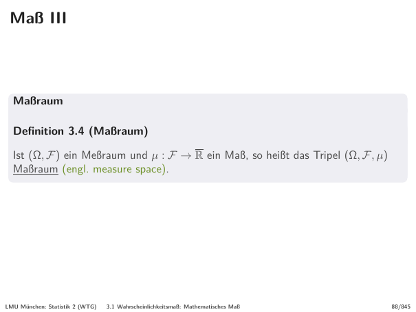

本页放在“模块一：概率测度把事件变成数字”中，核心是理解 测度（Maß）。直觉上先抓住标题里的对象：测度（Maß）。然后看它是定义、例子、定理还是证明；定义页要记条件，例子页要看随机机制，证明页要看用了哪些闭包性或极限定理。

关键词：

- 测度（Maß）

本页需要抓住的德语线索：

- `Definition 3.4 (Maßraum)`
- `Ist (Ω, F) ein Meßraum und µ : F → R ein Maß, so heißt das Tripel (Ω, F, µ)`

### Seite 65 - Zählmaß I

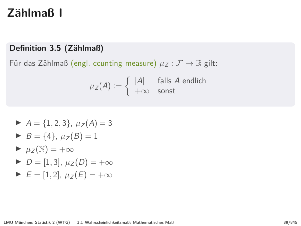

本页放在“模块一：概率测度把事件变成数字”中，主要作用是推进 Seite 57-114 这一段的概念链。先把标题“Zählmaß I”和前后页联系起来，再区分它是在给定义、展示例子、证明性质，还是做章节过渡。

本页需要抓住的德语线索：

- `Definition 3.5 (Zählmaß)`
- `Für das Zählmaß (engl. counting measure) µ : F → R gilt:`
- `µ (A) :=`
- `A = {1, 2, 3}, µ (A) = 3`
- `B = {4}, µ (B) = 1`

### Seite 66 - Zählmaß II

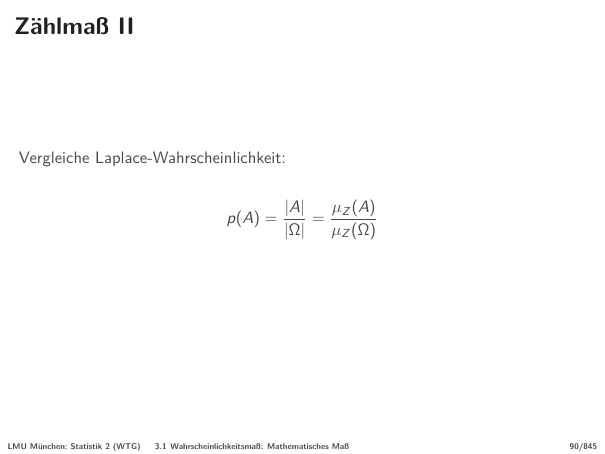

本页放在“模块一：概率测度把事件变成数字”中，核心是理解 概率（Wahrscheinlichkeit）。直觉上先抓住标题里的对象：Zählmaß II。然后看它是定义、例子、定理还是证明；定义页要记条件，例子页要看随机机制，证明页要看用了哪些闭包性或极限定理。

关键词：

- 概率（Wahrscheinlichkeit）

本页需要抓住的德语线索：

- `p(A) = = Z`

### Seite 67 - Zählmaß III

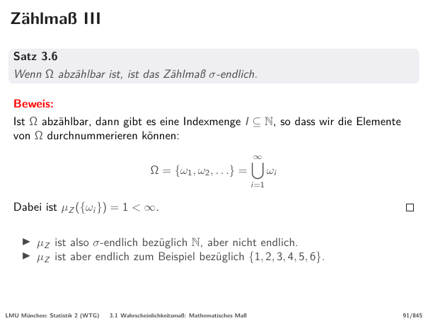

本页放在“模块一：概率测度把事件变成数字”中，主要作用是推进 Seite 57-114 这一段的概念链。先把标题“Zählmaß III”和前后页联系起来，再区分它是在给定义、展示例子、证明性质，还是做章节过渡。

本页需要抓住的德语线索：

- `Satz 3.6`
- `Ω = {ω , ω , . . .} = ω`
- `i=1`
- `Dabei ist µ ({ω }) = 1 < ∞.`
- `µ ist aber endlich zum Beispiel bezüglich {1, 2, 3, 4, 5, 6}.`

### Seite 68 - Zählmaß IV

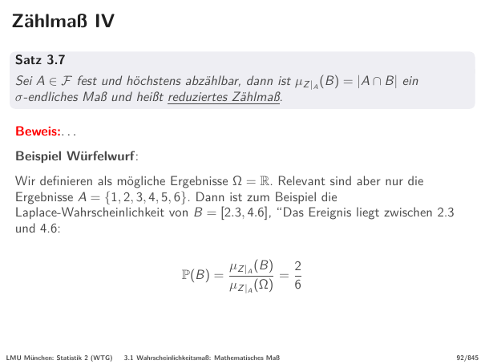

本页放在“模块一：概率测度把事件变成数字”中，核心是理解 概率（Wahrscheinlichkeit）、结果（Ergebnis）、事件（Ereignis）、测度（Maß）。直觉上先抓住标题里的对象：Zählmaß IV。然后看它是定义、例子、定理还是证明；定义页要记条件，例子页要看随机机制，证明页要看用了哪些闭包性或极限定理。

关键词：

- 概率（Wahrscheinlichkeit）
- 结果（Ergebnis）
- 事件（Ereignis）
- 测度（Maß）

本页需要抓住的德语线索：

- `Satz 3.7`
- `Sei A ∈ F fest und höchstens abzählbar, dann ist µ (B) = |A ∩ B| ein`
- `Beispiel Würfelwurf:`
- `Wir definieren als mögliche Ergebnisse Ω = R. Relevant sind aber nur die`
- `Ergebnisse A = {1, 2, 3, 4, 5, 6}. Dann ist zum Beispiel die`

### Seite 69 - 测度（Maß）

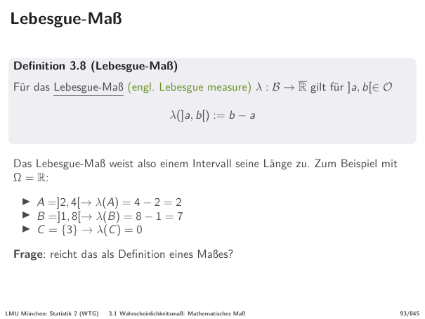

本页放在“模块一：概率测度把事件变成数字”中，核心是理解 测度（Maß）。直觉上先抓住标题里的对象：测度（Maß）。然后看它是定义、例子、定理还是证明；定义页要记条件，例子页要看随机机制，证明页要看用了哪些闭包性或极限定理。

关键词：

- 测度（Maß）

本页需要抓住的德语线索：

- `Definition 3.8 (Lebesgue-Maß)`
- `Für das Lebesgue-Maß (engl. Lebesgue measure) λ : B → R gilt für ]a, b[∈ O`
- `λ(]a, b[) := b − a`
- `Das Lebesgue-Maß weist also einem Intervall seine Länge zu. Zum Beispiel mit`
- `Ω = R:`

### Seite 70 - Masseindeutigkeitssatz I

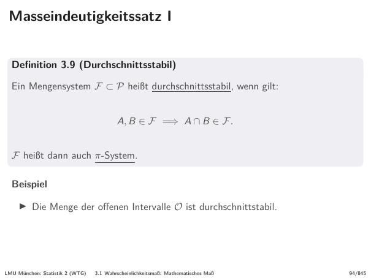

本页放在“模块一：概率测度把事件变成数字”中，核心是理解 集合（Menge）、集合系统（Mengensystem）。直觉上先抓住标题里的对象：Masseindeutigkeitssatz I。然后看它是定义、例子、定理还是证明；定义页要记条件，例子页要看随机机制，证明页要看用了哪些闭包性或极限定理。

关键词：

- 集合（Menge）
- 集合系统（Mengensystem）

本页需要抓住的德语线索：

- `Definition 3.9 (Durchschnittsstabil)`
- `Ein Mengensystem F ⊂ P heißt durchschnittsstabil, wenn gilt:`
- `A, B ∈ F =⇒ A ∩ B ∈ F.`
- `Beispiel`

### Seite 71 - Masseindeutigkeitssatz II

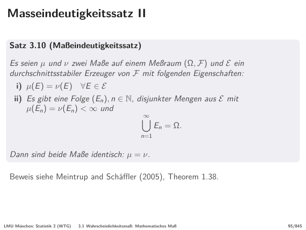

本页放在“模块一：概率测度把事件变成数字”中，核心是理解 集合（Menge）、测度（Maß）。直觉上先抓住标题里的对象：Masseindeutigkeitssatz II。然后看它是定义、例子、定理还是证明；定义页要记条件，例子页要看随机机制，证明页要看用了哪些闭包性或极限定理。

关键词：

- 集合（Menge）
- 测度（Maß）

本页需要抓住的德语线索：

- `Satz 3.10 (Maßeindeutigkeitssatz)`
- `i) µ(E ) = ν(E ) ∀E ∈ E`
- `ii) Es gibt eine Folge (E ), n ∈ N, disjunkter Mengen aus E mit`
- `µ(E ) = ν(E ) < ∞ und`
- `E = Ω.`

### Seite 72 - Masseindeutigkeitssatz III

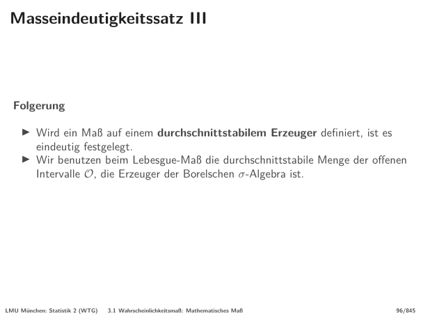

本页放在“模块一：概率测度把事件变成数字”中，核心是理解 集合（Menge）、σ-代数（σ-Algebra）、测度（Maß）。直觉上先抓住标题里的对象：Masseindeutigkeitssatz III。然后看它是定义、例子、定理还是证明；定义页要记条件，例子页要看随机机制，证明页要看用了哪些闭包性或极限定理。

关键词：

- 集合（Menge）
- σ-代数（σ-Algebra）
- 测度（Maß）

本页需要抓住的德语线索：

- `Masseindeutigkeitssatz III`
- `Folgerung`
- `Wird ein Maß auf einem durchschnittstabilem Erzeuger definiert, ist es`

### Seite 73 - 测度（Maß）

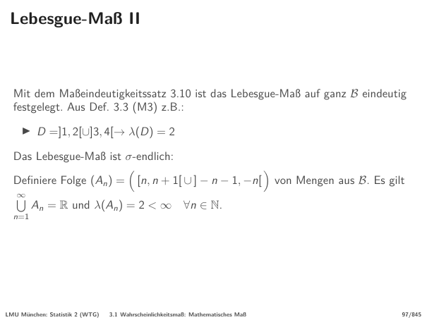

本页放在“模块一：概率测度把事件变成数字”中，核心是理解 集合（Menge）、测度（Maß）。直觉上先抓住标题里的对象：测度（Maß）。然后看它是定义、例子、定理还是证明；定义页要记条件，例子页要看随机机制，证明页要看用了哪些闭包性或极限定理。

关键词：

- 集合（Menge）
- 测度（Maß）

本页需要抓住的德语线索：

- `D =]1, 2[∪]3, 4[→ λ(D) = 2`
- `Definiere Folge (A ) = [n, n + 1[ ∪ ] − n − 1, −n[ von Mengen aus B. Es gilt`
- `S A = R und λ(A ) = 2 < ∞ ∀n ∈ N.`
- `n=1`

### Seite 74 - 测度（Maß）

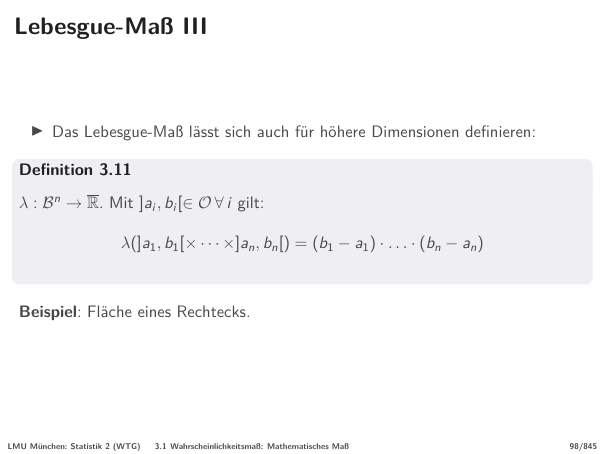

本页放在“模块一：概率测度把事件变成数字”中，核心是理解 测度（Maß）。直觉上先抓住标题里的对象：测度（Maß）。然后看它是定义、例子、定理还是证明；定义页要记条件，例子页要看随机机制，证明页要看用了哪些闭包性或极限定理。

关键词：

- 测度（Maß）

本页需要抓住的德语线索：

- `Definition 3.11`
- `λ : Bn → R. Mit ]a , b [∈ O ∀ i gilt:`
- `λ(]a , b [× · · · ×]a , b [) = (b − a ) · . . . · (b − a )`
- `Beispiel: Fläche eines Rechtecks.`

### Seite 75 - 测度（Maß）

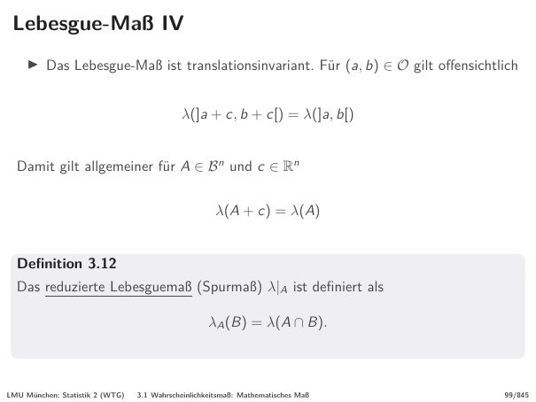

本页放在“模块一：概率测度把事件变成数字”中，核心是理解 测度（Maß）。直觉上先抓住标题里的对象：测度（Maß）。然后看它是定义、例子、定理还是证明；定义页要记条件，例子页要看随机机制，证明页要看用了哪些闭包性或极限定理。

关键词：

- 测度（Maß）

本页需要抓住的德语线索：

- `Das Lebesgue-Maß ist translationsinvariant. Für (a, b) ∈ O gilt offensichtlich`
- `λ(]a + c, b + c[) = λ(]a, b[)`
- `Damit gilt allgemeiner für A ∈ Bn und c ∈ Rn`
- `λ(A + c) = λ(A)`
- `Definition 3.12`

### Seite 76 - Indikatorfunktion I

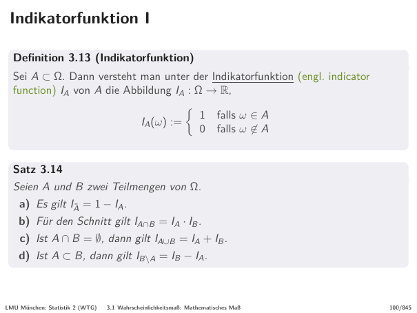

本页放在“模块一：概率测度把事件变成数字”中，主要作用是推进 Seite 57-114 这一段的概念链。先把标题“Indikatorfunktion I”和前后页联系起来，再区分它是在给定义、展示例子、证明性质，还是做章节过渡。

本页需要抓住的德语线索：

- `Definition 3.13 (Indikatorfunktion)`
- `Sei A ⊂ Ω. Dann versteht man unter der Indikatorfunktion (engl. indicator`
- `function) I von A die Abbildung I : Ω → R,`
- `1 falls ω ∈ A`
- `I (ω) :=`

### Seite 77 - Indikatorfunktion II

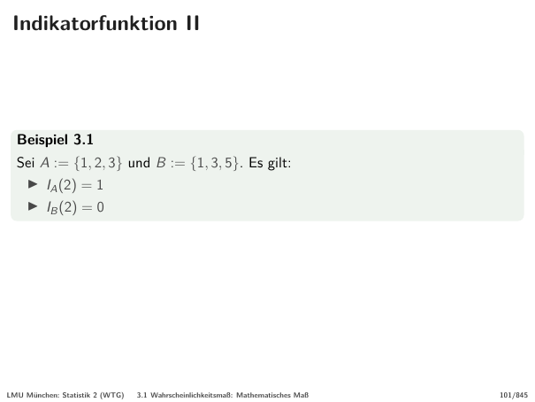

本页放在“模块一：概率测度把事件变成数字”中，主要作用是推进 Seite 57-114 这一段的概念链。先把标题“Indikatorfunktion II”和前后页联系起来，再区分它是在给定义、展示例子、证明性质，还是做章节过渡。

本页需要抓住的德语线索：

- `Beispiel 3.1`
- `Sei A := {1, 2, 3} und B := {1, 3, 5}. Es gilt:`
- `I (2) = 1`
- `I (2) = 0`

### Seite 78 - 测度（Maß）

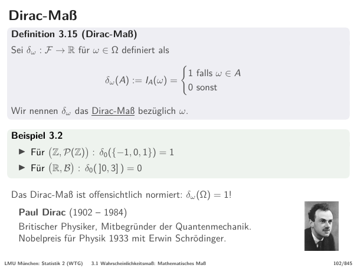

本页可识别的嵌入图片裁切：

本页放在“模块一：概率测度把事件变成数字”中，核心是理解 测度（Maß）。直觉上先抓住标题里的对象：测度（Maß）。然后看它是定义、例子、定理还是证明；定义页要记条件，例子页要看随机机制，证明页要看用了哪些闭包性或极限定理。

关键词：

- 测度（Maß）

本页需要抓住的德语线索：

- `Definition 3.15 (Dirac-Maß)`
- `Sei δ : F → R für ω ∈ Ω definiert als`
- `1 falls ω ∈ A`
- `δ (A) := I (ω) =`
- `Beispiel 3.2`

### Seite 79 - 测度（Maß）

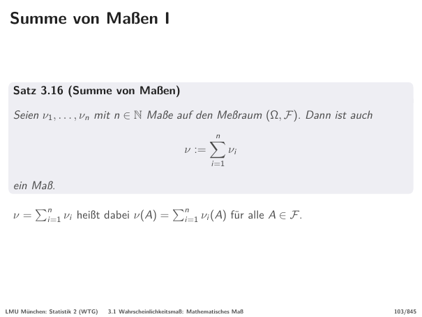

本页放在“模块一：概率测度把事件变成数字”中，核心是理解 测度（Maß）。直觉上先抓住标题里的对象：测度（Maß）。然后看它是定义、例子、定理还是证明；定义页要记条件，例子页要看随机机制，证明页要看用了哪些闭包性或极限定理。

关键词：

- 测度（Maß）

本页需要抓住的德语线索：

- `Satz 3.16 (Summe von Maßen)`
- `Seien ν , . . . , ν mit n ∈ N Maße auf den Meßraum (Ω, F). Dann ist auch`
- `ν := ν`
- `i=1`
- `ν =`

### Seite 80 - 测度（Maß）

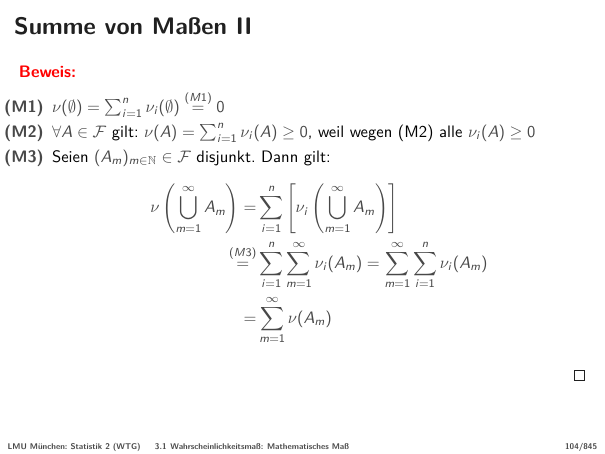

本页放在“模块一：概率测度把事件变成数字”中，核心是理解 测度（Maß）。直觉上先抓住标题里的对象：测度（Maß）。然后看它是定义、例子、定理还是证明；定义页要记条件，例子页要看随机机制，证明页要看用了哪些闭包性或极限定理。

关键词：

- 测度（Maß）

本页需要抓住的德语线索：

- `(M1) ν(∅) =`
- `=`
- `i=1 i`
- `(M2) ∀A ∈ F gilt: ν(A) =`
- `ν (A) ≥ 0, weil wegen (M2) alle ν (A) ≥ 0`

### Seite 81 - 测度（Maß）

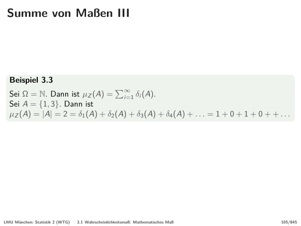

本页放在“模块一：概率测度把事件变成数字”中，核心是理解 测度（Maß）。直觉上先抓住标题里的对象：测度（Maß）。然后看它是定义、例子、定理还是证明；定义页要记条件，例子页要看随机机制，证明页要看用了哪些闭包性或极限定理。

关键词：

- 测度（Maß）

本页需要抓住的德语线索：

- `Beispiel 3.3`
- `Sei Ω = N. Dann ist µ (A) = P∞ δ (A).`
- `Z i=1 i`
- `Sei A = {1, 3}. Dann ist`
- `µ (A) = |A| = 2 = δ (A) + δ (A) + δ (A) + δ (A) + . . . = 1 + 0 + 1 + 0 + + . . .`

### Seite 82 - 概率测度（Wahrscheinlichkeitsmaß）

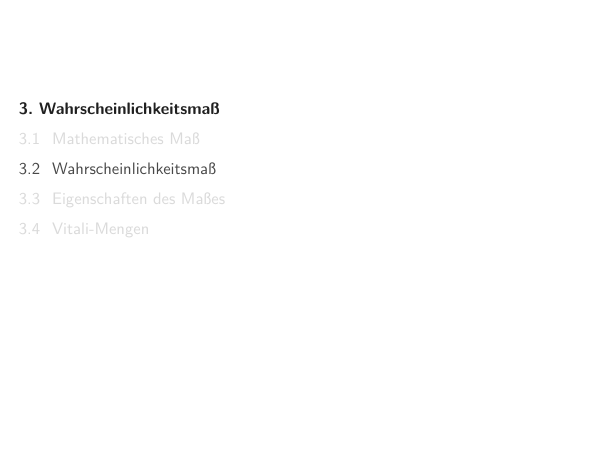

本页放在“模块一：概率测度把事件变成数字”中，核心是理解 概率（Wahrscheinlichkeit）、概率测度（Wahrscheinlichkeitsmaß）、集合（Menge）、测度（Maß）。直觉上先抓住标题里的对象：概率测度（Wahrscheinlichkeitsmaß）。然后看它是定义、例子、定理还是证明；定义页要记条件，例子页要看随机机制，证明页要看用了哪些闭包性或极限定理。

关键词：

- 概率（Wahrscheinlichkeit）
- 概率测度（Wahrscheinlichkeitsmaß）
- 集合（Menge）
- 测度（Maß）

本页需要抓住的德语线索：

- `3. Wahrscheinlichkeitsmaß`
- `3.1 Mathematisches Maß`
- `3.2 Wahrscheinlichkeitsmaß`

### Seite 83 - 概率（Wahrscheinlichkeit）

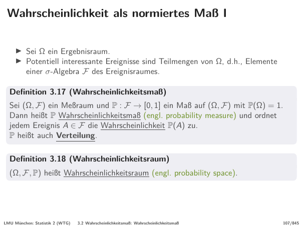

本页放在“模块一：概率测度把事件变成数字”中，核心是理解 概率（Wahrscheinlichkeit）、概率测度（Wahrscheinlichkeitsmaß）、概率空间（Wahrscheinlichkeitsraum）、结果（Ergebnis）。直觉上先抓住标题里的对象：概率（Wahrscheinlichkeit）。然后看它是定义、例子、定理还是证明；定义页要记条件，例子页要看随机机制，证明页要看用了哪些闭包性或极限定理。

关键词：

- 概率（Wahrscheinlichkeit）
- 概率测度（Wahrscheinlichkeitsmaß）
- 概率空间（Wahrscheinlichkeitsraum）
- 结果（Ergebnis）
- 事件（Ereignis）
- σ-代数（σ-Algebra）
- 测度（Maß）
- 分布（Verteilung）

本页需要抓住的德语线索：

- `Definition 3.17 (Wahrscheinlichkeitsmaß)`
- `Sei (Ω, F) ein Meßraum und P : F → [0, 1] ein Maß auf (Ω, F) mit P(Ω) = 1.`
- `jedem Ereignis A ∈ F die Wahrscheinlichkeit P(A) zu.`
- `Definition 3.18 (Wahrscheinlichkeitsraum)`

### Seite 84 - Beispiel Würfelwurf I

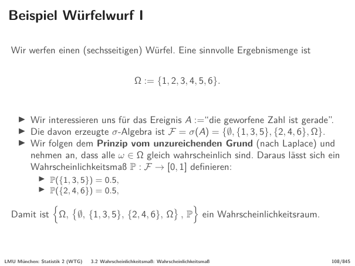

本页放在“模块一：概率测度把事件变成数字”中，核心是理解 概率（Wahrscheinlichkeit）、概率测度（Wahrscheinlichkeitsmaß）、概率空间（Wahrscheinlichkeitsraum）、结果（Ergebnis）。直觉上先抓住标题里的对象：Beispiel Würfelwurf I。然后看它是定义、例子、定理还是证明；定义页要记条件，例子页要看随机机制，证明页要看用了哪些闭包性或极限定理。

关键词：

- 概率（Wahrscheinlichkeit）
- 概率测度（Wahrscheinlichkeitsmaß）
- 概率空间（Wahrscheinlichkeitsraum）
- 结果（Ergebnis）
- 事件（Ereignis）
- σ-代数（σ-Algebra）
- 依概率（in Wahrscheinlichkeit）

本页需要抓住的德语线索：

- `Beispiel Würfelwurf I`
- `Ω := {1, 2, 3, 4, 5, 6}.`
- `Wir interessieren uns für das Ereignis A :=“die geworfene Zahl ist gerade”.`
- `Die davon erzeugte σ-Algebra ist F = σ(A) = {∅, {1, 3, 5}, {2, 4, 6}, Ω}.`
- `nehmen an, dass alle ω ∈ Ω gleich wahrscheinlich sind. Daraus lässt sich ein`

### Seite 85 - Beispiel Würfelwurf II

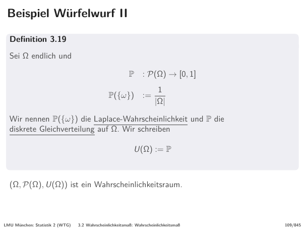

本页放在“模块一：概率测度把事件变成数字”中，核心是理解 概率（Wahrscheinlichkeit）、概率空间（Wahrscheinlichkeitsraum）、依概率（in Wahrscheinlichkeit）。直觉上先抓住标题里的对象：Beispiel Würfelwurf II。然后看它是定义、例子、定理还是证明；定义页要记条件，例子页要看随机机制，证明页要看用了哪些闭包性或极限定理。

关键词：

- 概率（Wahrscheinlichkeit）
- 概率空间（Wahrscheinlichkeitsraum）
- 依概率（in Wahrscheinlichkeit）

本页需要抓住的德语线索：

- `Beispiel Würfelwurf II`
- `Definition 3.19`
- `P : P(Ω) → [0, 1]`
- `P({ω}) :=`
- `Wir nennen P({ω}) die Laplace-Wahrscheinlichkeit und P die`

### Seite 86 - Beispiel Würfelwurf III

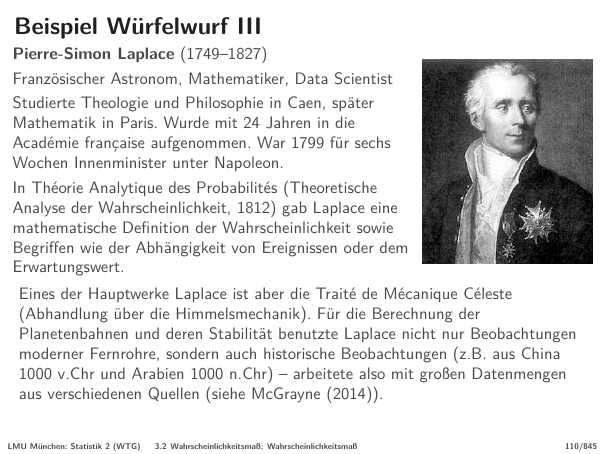

本页可识别的嵌入图片裁切：

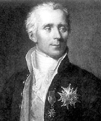

本页放在“模块一：概率测度把事件变成数字”中，核心是理解 概率（Wahrscheinlichkeit）、事件（Ereignis）、期望（Erwartungswert）。直觉上先抓住标题里的对象：Beispiel Würfelwurf III。然后看它是定义、例子、定理还是证明；定义页要记条件，例子页要看随机机制，证明页要看用了哪些闭包性或极限定理。

关键词：

- 概率（Wahrscheinlichkeit）
- 事件（Ereignis）
- 期望（Erwartungswert）

本页需要抓住的德语线索：

- `Beispiel Würfelwurf III`
- `mathematische Definition der Wahrscheinlichkeit sowie`

### Seite 87 - Stetige Gleichverteilung I

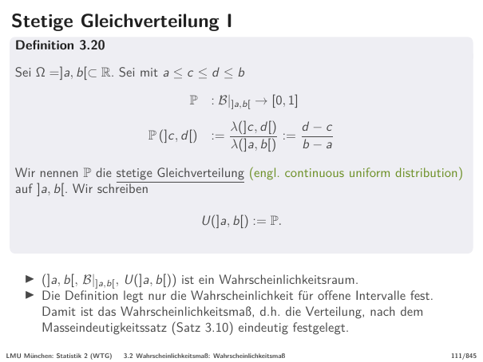

本页放在“模块一：概率测度把事件变成数字”中，核心是理解 概率（Wahrscheinlichkeit）、概率空间（Wahrscheinlichkeitsraum）、依概率（in Wahrscheinlichkeit）。直觉上先抓住标题里的对象：Stetige Gleichverteilung I。然后看它是定义、例子、定理还是证明；定义页要记条件，例子页要看随机机制，证明页要看用了哪些闭包性或极限定理。

关键词：

- 概率（Wahrscheinlichkeit）
- 概率空间（Wahrscheinlichkeitsraum）
- 依概率（in Wahrscheinlichkeit）

本页需要抓住的德语线索：

- `Definition 3.20`
- `Sei Ω =]a, b[⊂ R. Sei mit a ≤ c ≤ d ≤ b`
- `P : B| → [0, 1]`
- `P (]c, d[) := :=`
- `U(]a, b[) := P.`

### Seite 88 - Stetige Gleichverteilung II

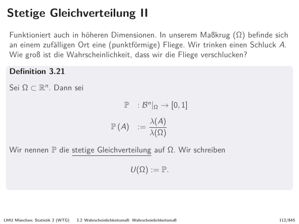

本页放在“模块一：概率测度把事件变成数字”中，核心是理解 概率（Wahrscheinlichkeit）、测度（Maß）。直觉上先抓住标题里的对象：Stetige Gleichverteilung II。然后看它是定义、例子、定理还是证明；定义页要记条件，例子页要看随机机制，证明页要看用了哪些闭包性或极限定理。

关键词：

- 概率（Wahrscheinlichkeit）
- 测度（Maß）

本页需要抓住的德语线索：

- `Definition 3.21`
- `Sei Ω ⊂ Rn. Dann sei`
- `P : Bn| → [0, 1]`
- `P (A) :=`
- `U(Ω) := P.`

### Seite 89 - 分布（Verteilung）

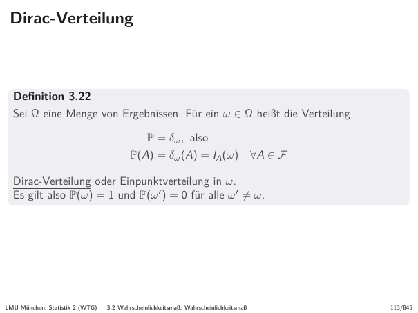

本页放在“模块一：概率测度把事件变成数字”中，核心是理解 结果（Ergebnis）、集合（Menge）、分布（Verteilung）。直觉上先抓住标题里的对象：分布（Verteilung）。然后看它是定义、例子、定理还是证明；定义页要记条件，例子页要看随机机制，证明页要看用了哪些闭包性或极限定理。

关键词：

- 结果（Ergebnis）
- 集合（Menge）
- 分布（Verteilung）

本页需要抓住的德语线索：

- `Definition 3.22`
- `Sei Ω eine Menge von Ergebnissen. Für ein ω ∈ Ω heißt die Verteilung`
- `P = δ , also`
- `P(A) = δ (A) = I (ω) ∀A ∈ F`
- `Es gilt also P(ω) = 1 und P(ω′) = 0 für alle ω′ ̸= ω.`

### Seite 90 - Fast sicher I

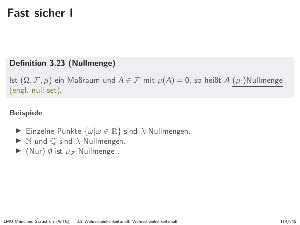

本页放在“模块一：概率测度把事件变成数字”中，核心是理解 测度（Maß）。直觉上先抓住标题里的对象：Fast sicher I。然后看它是定义、例子、定理还是证明；定义页要记条件，例子页要看随机机制，证明页要看用了哪些闭包性或极限定理。

关键词：

- 测度（Maß）

本页需要抓住的德语线索：

- `Definition 3.23 (Nullmenge)`
- `Ist (Ω, F, µ) ein Maßraum und A ∈ F mit µ(A) = 0, so heißt A (µ-)Nullmenge`
- `Beispiele`
- `Einzelne Punkte {ω|ω ∈ R} sind λ-Nullmengen.`

### Seite 91 - Fast sicher II

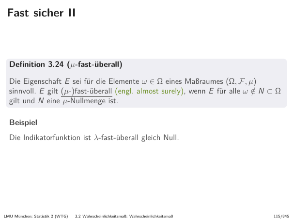

本页放在“模块一：概率测度把事件变成数字”中，核心是理解 测度（Maß）。直觉上先抓住标题里的对象：Fast sicher II。然后看它是定义、例子、定理还是证明；定义页要记条件，例子页要看随机机制，证明页要看用了哪些闭包性或极限定理。

关键词：

- 测度（Maß）

本页需要抓住的德语线索：

- `Definition 3.24 (µ-fast-überall)`
- `Die Eigenschaft E sei für die Elemente ω ∈ Ω eines Maßraumes (Ω, F, µ)`
- `sinnvoll. E gilt (µ-)fast-überall (engl. almost surely), wenn E für alle ω ∈/ N ⊂ Ω`
- `Beispiel`

### Seite 92 - Fast sicher III

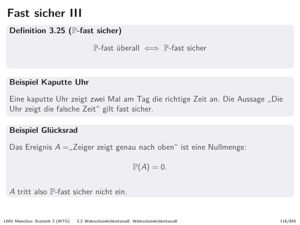

本页放在“模块一：概率测度把事件变成数字”中，核心是理解 事件（Ereignis）、几乎必然（fast sicher）。直觉上先抓住标题里的对象：Fast sicher III。然后看它是定义、例子、定理还是证明；定义页要记条件，例子页要看随机机制，证明页要看用了哪些闭包性或极限定理。

关键词：

- 事件（Ereignis）
- 几乎必然（fast sicher）

本页需要抓住的德语线索：

- `Definition 3.25 (P-fast sicher)`
- `Beispiel Kaputte Uhr`
- `Beispiel Glücksrad`
- `Das Ereignis A =„Zeiger zeigt genau nach oben“ ist eine Nullmenge:`
- `P(A) = 0.`

### Seite 93 - 概率（Wahrscheinlichkeit）

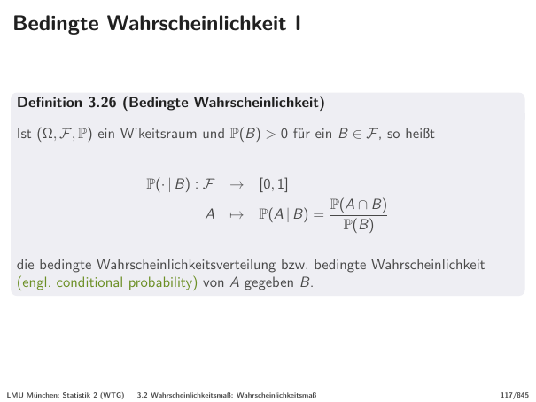

本页放在“模块一：概率测度把事件变成数字”中，核心是理解 概率（Wahrscheinlichkeit）。直觉上先抓住标题里的对象：概率（Wahrscheinlichkeit）。然后看它是定义、例子、定理还是证明；定义页要记条件，例子页要看随机机制，证明页要看用了哪些闭包性或极限定理。

关键词：

- 概率（Wahrscheinlichkeit）

本页需要抓住的德语线索：

- `Definition 3.26 (Bedingte Wahrscheinlichkeit)`
- `Ist (Ω, F, P) ein W’keitsraum und P(B) > 0 für ein B ∈ F, so heißt`
- `P(· | B) : F → [0, 1]`
- `P(A ∩ B)`
- `A 7→ P(A | B) =`

### Seite 94 - 概率（Wahrscheinlichkeit）

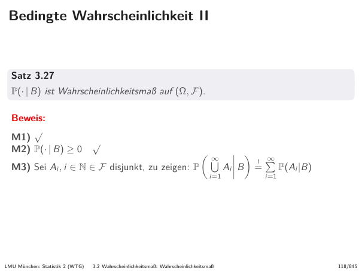

本页放在“模块一：概率测度把事件变成数字”中，核心是理解 概率（Wahrscheinlichkeit）、概率测度（Wahrscheinlichkeitsmaß）。直觉上先抓住标题里的对象：概率（Wahrscheinlichkeit）。然后看它是定义、例子、定理还是证明；定义页要记条件，例子页要看随机机制，证明页要看用了哪些闭包性或极限定理。

关键词：

- 概率（Wahrscheinlichkeit）
- 概率测度（Wahrscheinlichkeitsmaß）

本页需要抓住的德语线索：

- `Satz 3.27`
- `P(· | B) ist Wahrscheinlichkeitsmaß auf (Ω, F).`
- `M2) P(· | B) ≥ 0`
- `M3) Sei A i , i ∈ N ∈ F disjunkt, zu zeigen: P (cid:18) S ∞ A i (cid:12) (cid:12) (cid:12) B (cid:19) = ! P ∞ P(A i |B)`
- `i=1 i=1`

### Seite 95 - 概率（Wahrscheinlichkeit）

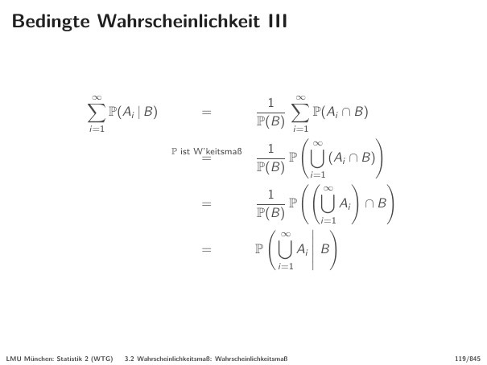

本页放在“模块一：概率测度把事件变成数字”中，核心是理解 概率（Wahrscheinlichkeit）。直觉上先抓住标题里的对象：概率（Wahrscheinlichkeit）。然后看它是定义、例子、定理还是证明；定义页要记条件，例子页要看随机机制，证明页要看用了哪些闭包性或极限定理。

关键词：

- 概率（Wahrscheinlichkeit）

本页需要抓住的德语线索：

- `P(A | B) = P(A ∩ B)`
- `i P(B) i`
- `i=1 i=1`
- `P ist W = ’keitsmaß 1 P [ (A ∩ B)`
- `P(B) i`

### Seite 96 - 概率（Wahrscheinlichkeit）

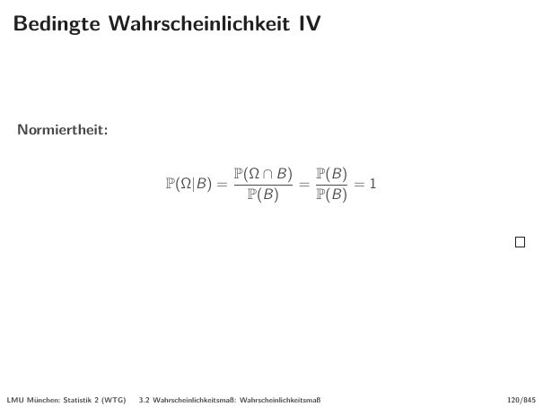

本页放在“模块一：概率测度把事件变成数字”中，核心是理解 概率（Wahrscheinlichkeit）。直觉上先抓住标题里的对象：概率（Wahrscheinlichkeit）。然后看它是定义、例子、定理还是证明；定义页要记条件，例子页要看随机机制，证明页要看用了哪些闭包性或极限定理。

关键词：

- 概率（Wahrscheinlichkeit）

本页需要抓住的德语线索：

- `P(Ω ∩ B) P(B)`
- `P(Ω|B) = = = 1`
- `P(B) P(B)`

### Seite 97 - 概率（Wahrscheinlichkeit）

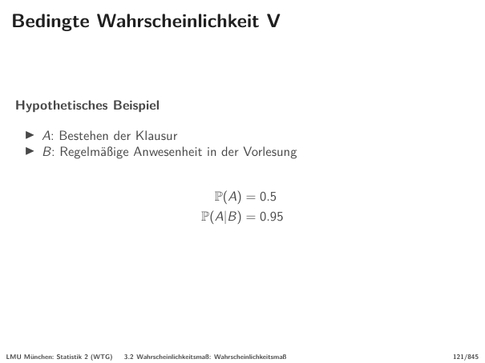

本页放在“模块一：概率测度把事件变成数字”中，核心是理解 概率（Wahrscheinlichkeit）。直觉上先抓住标题里的对象：概率（Wahrscheinlichkeit）。然后看它是定义、例子、定理还是证明；定义页要记条件，例子页要看随机机制，证明页要看用了哪些闭包性或极限定理。

关键词：

- 概率（Wahrscheinlichkeit）

本页需要抓住的德语线索：

- `Hypothetisches Beispiel`
- `P(A) = 0.5`
- `P(A|B) = 0.95`

### Seite 98 - 概率测度（Wahrscheinlichkeitsmaß）

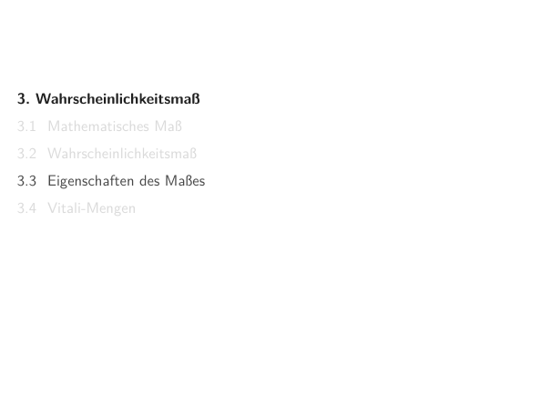

本页放在“模块一：概率测度把事件变成数字”中，核心是理解 概率（Wahrscheinlichkeit）、概率测度（Wahrscheinlichkeitsmaß）、集合（Menge）、测度（Maß）。直觉上先抓住标题里的对象：概率测度（Wahrscheinlichkeitsmaß）。然后看它是定义、例子、定理还是证明；定义页要记条件，例子页要看随机机制，证明页要看用了哪些闭包性或极限定理。

关键词：

- 概率（Wahrscheinlichkeit）
- 概率测度（Wahrscheinlichkeitsmaß）
- 集合（Menge）
- 测度（Maß）

本页需要抓住的德语线索：

- `3. Wahrscheinlichkeitsmaß`
- `3.1 Mathematisches Maß`
- `3.2 Wahrscheinlichkeitsmaß`

### Seite 99 - Folgen I

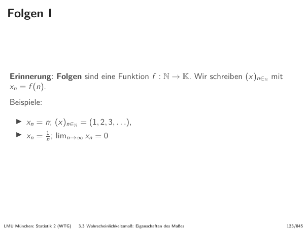

本页放在“模块一：概率测度把事件变成数字”中，主要作用是推进 Seite 57-114 这一段的概念链。先把标题“Folgen I”和前后页联系起来，再区分它是在给定义、展示例子、证明性质，还是做章节过渡。

本页需要抓住的德语线索：

- `Erinnerung: Folgen sind eine Funktion f : N → K. Wir schreiben (x ) mit`
- `n∈N`
- `x = f (n).`
- `Beispiele:`
- `x = n; (x ) = (1, 2, 3, . . .),`

### Seite 100 - Folgen II

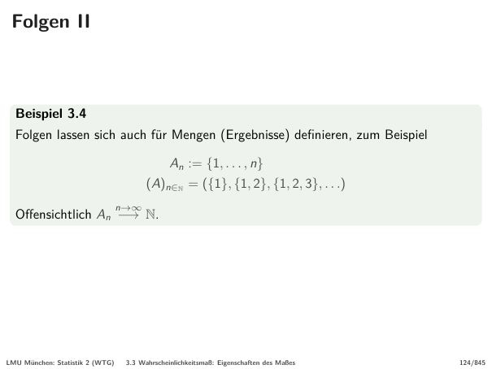

本页放在“模块一：概率测度把事件变成数字”中，核心是理解 结果（Ergebnis）、集合（Menge）。直觉上先抓住标题里的对象：Folgen II。然后看它是定义、例子、定理还是证明；定义页要记条件，例子页要看随机机制，证明页要看用了哪些闭包性或极限定理。

关键词：

- 结果（Ergebnis）
- 集合（Menge）

本页需要抓住的德语线索：

- `Beispiel 3.4`
- `Folgen lassen sich auch für Mengen (Ergebnisse) definieren, zum Beispiel`
- `A := {1, . . . , n}`
- `(A) = ({1}, {1, 2}, {1, 2, 3}, . . .)`
- `n∈N`

### Seite 101 - Folgen III

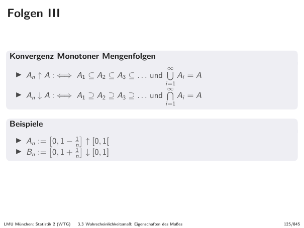

本页放在“模块一：概率测度把事件变成数字”中，核心是理解 集合（Menge）、收敛（Konvergenz）。直觉上先抓住标题里的对象：Folgen III。然后看它是定义、例子、定理还是证明；定义页要记条件，例子页要看随机机制，证明页要看用了哪些闭包性或极限定理。

关键词：

- 集合（Menge）
- 收敛（Konvergenz）

本页需要抓住的德语线索：

- `A ↑ A : ⇐⇒ A ⊆ A ⊆ A ⊆ . . . und A = A`
- `i=1`
- `A ↓ A : ⇐⇒ A ⊇ A ⊇ A ⊇ . . . und A = A`
- `i=1`
- `Beispiele`

### Seite 102 - 测度性质（Eigenschaften des Maßes）

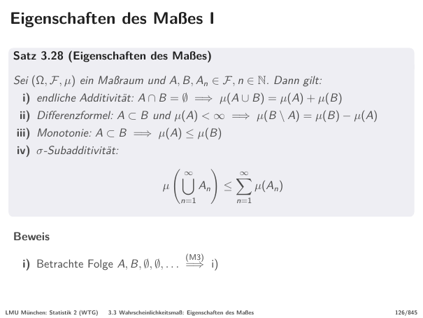

本页放在“模块一：概率测度把事件变成数字”中，核心是理解 测度（Maß）。直觉上先抓住标题里的对象：测度性质（Eigenschaften des Maßes）。然后看它是定义、例子、定理还是证明；定义页要记条件，例子页要看随机机制，证明页要看用了哪些闭包性或极限定理。

关键词：

- 测度（Maß）

本页需要抓住的德语线索：

- `Satz 3.28 (Eigenschaften des Maßes)`
- `Sei (Ω, F, µ) ein Maßraum und A, B, A ∈ F, n ∈ N. Dann gilt:`
- `i) endliche Additivität: A ∩ B = ∅ =⇒ µ(A ∪ B) = µ(A) + µ(B)`
- `ii) Differenzformel: A ⊂ B und µ(A) < ∞ =⇒ µ(B \ A) = µ(B) − µ(A)`
- `iii) Monotonie: A ⊂ B =⇒ µ(A) ≤ µ(B)`

### Seite 103 - 测度性质（Eigenschaften des Maßes）

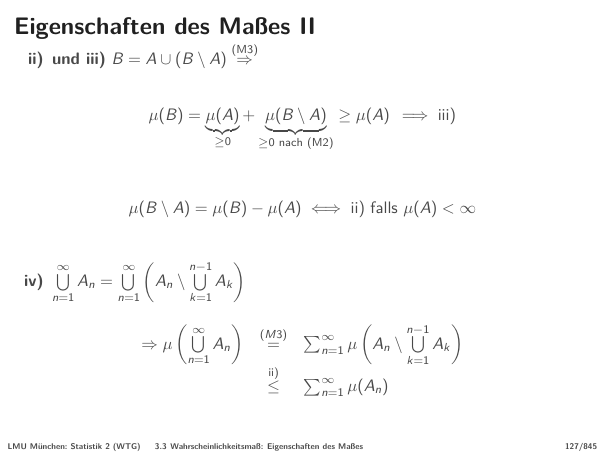

本页放在“模块一：概率测度把事件变成数字”中，核心是理解 测度（Maß）。直觉上先抓住标题里的对象：测度性质（Eigenschaften des Maßes）。然后看它是定义、例子、定理还是证明；定义页要记条件，例子页要看随机机制，证明页要看用了哪些闭包性或极限定理。

关键词：

- 测度（Maß）

本页需要抓住的德语线索：

- `ii) und iii) B = A ∪ (B \ A) ⇒`
- `µ(B) = µ(A) + µ(B \ A) ≥ µ(A) =⇒ iii)`
- `≥0 ≥0 nach (M2)`
- `µ(B \ A) = µ(B) − µ(A) ⇐⇒ ii) falls µ(A) < ∞`
- `iv) A = A \ A`

### Seite 104 - 概率（Wahrscheinlichkeit）

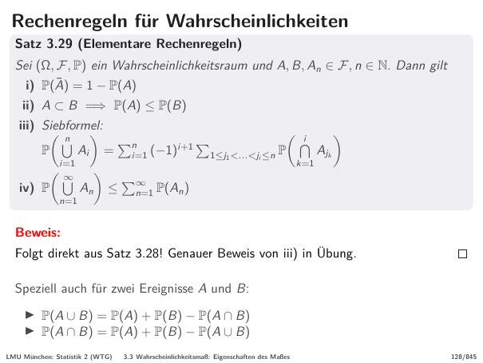

本页放在“模块一：概率测度把事件变成数字”中，核心是理解 概率（Wahrscheinlichkeit）、概率空间（Wahrscheinlichkeitsraum）、依概率（in Wahrscheinlichkeit）。直觉上先抓住标题里的对象：概率（Wahrscheinlichkeit）。然后看它是定义、例子、定理还是证明；定义页要记条件，例子页要看随机机制，证明页要看用了哪些闭包性或极限定理。

关键词：

- 概率（Wahrscheinlichkeit）
- 概率空间（Wahrscheinlichkeitsraum）
- 依概率（in Wahrscheinlichkeit）

本页需要抓住的德语线索：

- `Satz 3.29 (Elementare Rechenregeln)`
- `Sei (Ω, F, P) ein Wahrscheinlichkeitsraum und A, B, A ∈ F, n ∈ N. Dann gilt`
- `i) P(A¯) = 1 − P(A)`
- `ii) A ⊂ B =⇒ P(A) ≤ P(B)`
- `P S A = Pn (−1)i+1 P P T A`

### Seite 105 - 测度（Maß）

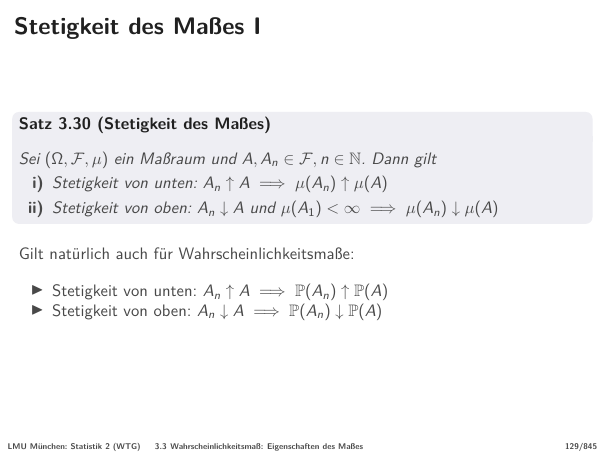

本页放在“模块一：概率测度把事件变成数字”中，核心是理解 概率（Wahrscheinlichkeit）、概率测度（Wahrscheinlichkeitsmaß）、测度（Maß）。直觉上先抓住标题里的对象：测度（Maß）。然后看它是定义、例子、定理还是证明；定义页要记条件，例子页要看随机机制，证明页要看用了哪些闭包性或极限定理。

关键词：

- 概率（Wahrscheinlichkeit）
- 概率测度（Wahrscheinlichkeitsmaß）
- 测度（Maß）

本页需要抓住的德语线索：

- `Satz 3.30 (Stetigkeit des Maßes)`
- `Sei (Ω, F, µ) ein Maßraum und A, A ∈ F, n ∈ N. Dann gilt`
- `i) Stetigkeit von unten: A ↑ A =⇒ µ(A ) ↑ µ(A)`
- `ii) Stetigkeit von oben: A ↓ A und µ(A ) < ∞ =⇒ µ(A ) ↓ µ(A)`
- `Stetigkeit von unten: A ↑ A =⇒ P(A ) ↑ P(A)`

### Seite 106 - 测度（Maß）

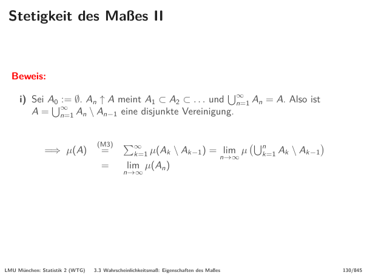

本页放在“模块一：概率测度把事件变成数字”中，核心是理解 测度（Maß）。直觉上先抓住标题里的对象：测度（Maß）。然后看它是定义、例子、定理还是证明；定义页要记条件，例子页要看随机机制，证明页要看用了哪些闭包性或极限定理。

关键词：

- 测度（Maß）

本页需要抓住的德语线索：

- `i) Sei A := ∅. A ↑ A meint A ⊂ A ⊂ . . . und`
- `A = A. Also ist`
- `0 n 1 2 n=1 n`
- `A =`
- `n=1 n n−1`

### Seite 107 - 测度（Maß）

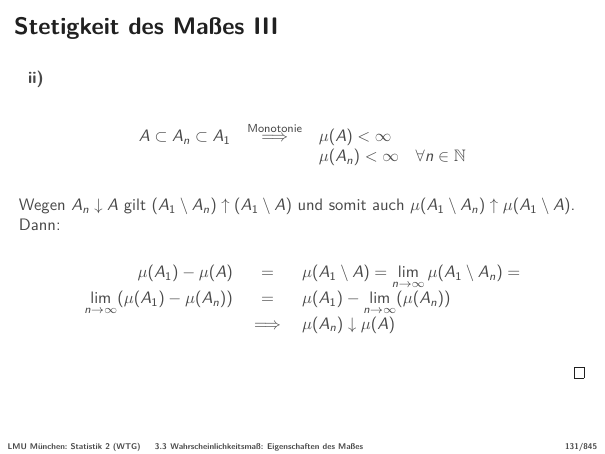

本页放在“模块一：概率测度把事件变成数字”中，核心是理解 测度（Maß）。直觉上先抓住标题里的对象：测度（Maß）。然后看它是定义、例子、定理还是证明；定义页要记条件，例子页要看随机机制，证明页要看用了哪些闭包性或极限定理。

关键词：

- 测度（Maß）

本页需要抓住的德语线索：

- `A ⊂ A ⊂ A =⇒ µ(A) < ∞`
- `µ(A ) < ∞ ∀n ∈ N`
- `µ(A ) − µ(A) = µ(A \ A) = lim µ(A \ A ) =`
- `n→∞`
- `lim (µ(A ) − µ(A )) = µ(A ) − lim (µ(A ))`

### Seite 108 - 测度（Maß）

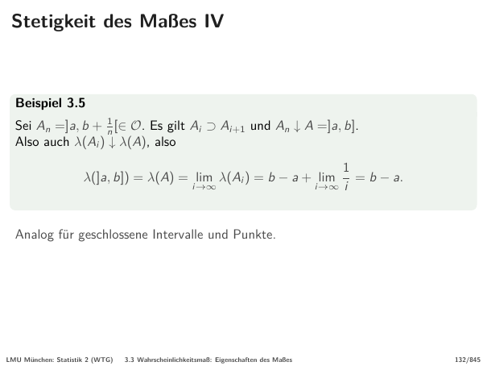

本页放在“模块一：概率测度把事件变成数字”中，核心是理解 测度（Maß）。直觉上先抓住标题里的对象：测度（Maß）。然后看它是定义、例子、定理还是证明；定义页要记条件，例子页要看随机机制，证明页要看用了哪些闭包性或极限定理。

关键词：

- 测度（Maß）

本页需要抓住的德语线索：

- `Beispiel 3.5`
- `Sei A =]a, b + 1 [∈ O. Es gilt A ⊃ A und A ↓ A =]a, b].`
- `λ(]a, b]) = λ(A) = lim λ(A ) = b − a + lim = b − a.`
- `i→∞ i i→∞ i`

### Seite 109 - 概率测度（Wahrscheinlichkeitsmaß）

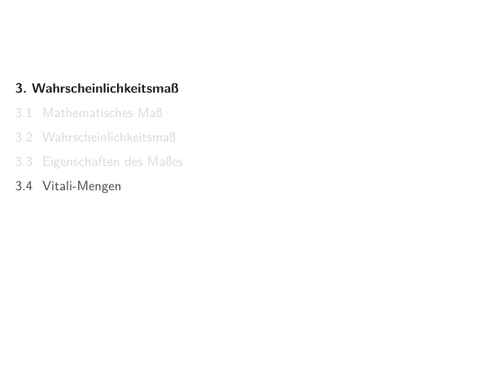

本页放在“模块一：概率测度把事件变成数字”中，核心是理解 概率（Wahrscheinlichkeit）、概率测度（Wahrscheinlichkeitsmaß）、集合（Menge）、测度（Maß）。直觉上先抓住标题里的对象：概率测度（Wahrscheinlichkeitsmaß）。然后看它是定义、例子、定理还是证明；定义页要记条件，例子页要看随机机制，证明页要看用了哪些闭包性或极限定理。

关键词：

- 概率（Wahrscheinlichkeit）
- 概率测度（Wahrscheinlichkeitsmaß）
- 集合（Menge）
- 测度（Maß）

本页需要抓住的德语线索：

- `3. Wahrscheinlichkeitsmaß`
- `3.1 Mathematisches Maß`
- `3.2 Wahrscheinlichkeitsmaß`

### Seite 110 - Gaußklammer

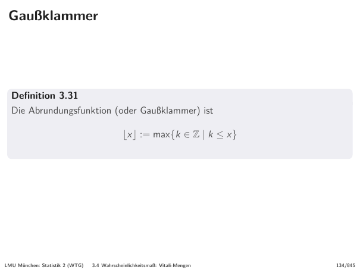

本页放在“模块一：概率测度把事件变成数字”中，主要作用是推进 Seite 57-114 这一段的概念链。先把标题“Gaußklammer”和前后页联系起来，再区分它是在给定义、展示例子、证明性质，还是做章节过渡。

本页需要抓住的德语线索：

- `Definition 3.31`
- `⌊x ⌋ := max{k ∈ Z | k ≤ x }`

### Seite 111 - 集合（Menge）

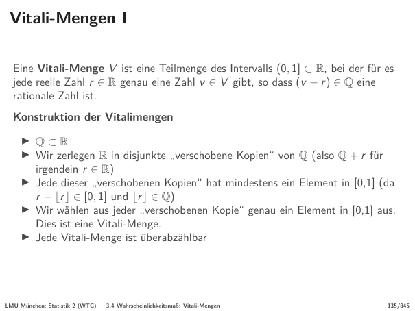

本页放在“模块一：概率测度把事件变成数字”中，核心是理解 集合（Menge）。直觉上先抓住标题里的对象：集合（Menge）。然后看它是定义、例子、定理还是证明；定义页要记条件，例子页要看随机机制，证明页要看用了哪些闭包性或极限定理。

关键词：

- 集合（Menge）

本页需要抓住的德语线索：

- `Eine Vitali-Menge V ist eine Teilmenge des Intervalls (0, 1] ⊂ R, bei der für es`
- `jede reelle Zahl r ∈ R genau eine Zahl v ∈ V gibt, so dass (v − r ) ∈ Q eine`
- `Q ⊂ R`
- `irgendein r ∈ R)`
- `r − ⌊r ⌋ ∈ [0, 1] und ⌊r ⌋ ∈ Q)`

### Seite 112 - 集合（Menge）

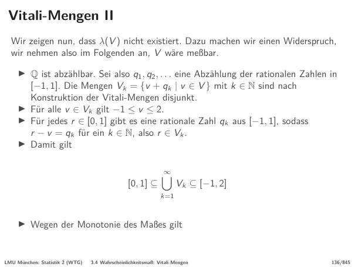

本页放在“模块一：概率测度把事件变成数字”中，核心是理解 集合（Menge）。直觉上先抓住标题里的对象：集合（Menge）。然后看它是定义、例子、定理还是证明；定义页要记条件，例子页要看随机机制，证明页要看用了哪些闭包性或极限定理。

关键词：

- 集合（Menge）

本页需要抓住的德语线索：

- `[−1, 1]. Die Mengen V = {v + q | v ∈ V } mit k ∈ N sind nach`
- `Für alle v ∈ V gilt −1 ≤ v ≤ 2.`
- `Für jedes r ∈ [0, 1] gibt es eine rationale Zahl q aus [−1, 1], sodass`
- `r − v = q für ein k ∈ N, also r ∈ V .`
- `k=1`

### Seite 113 - 集合（Menge）

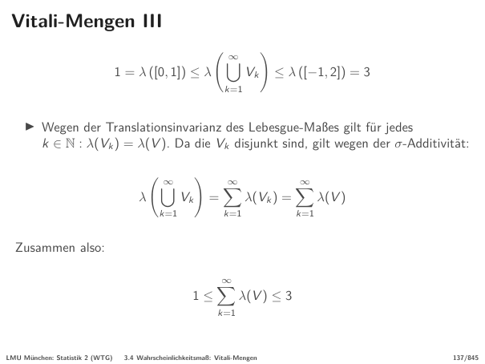

本页放在“模块一：概率测度把事件变成数字”中，核心是理解 集合（Menge）、测度（Maß）。直觉上先抓住标题里的对象：集合（Menge）。然后看它是定义、例子、定理还是证明；定义页要记条件，例子页要看随机机制，证明页要看用了哪些闭包性或极限定理。

关键词：

- 集合（Menge）
- 测度（Maß）

本页需要抓住的德语线索：

- `1 = λ ([0, 1]) ≤ λ V ≤ λ ([−1, 2]) = 3`
- `k=1`
- `k ∈ N : λ(V ) = λ(V ). Da die V disjunkt sind, gilt wegen der σ-Additivität:`
- `λ V = λ(V ) = λ(V )`
- `k=1 k=1 k=1`

### Seite 114 - 集合（Menge）

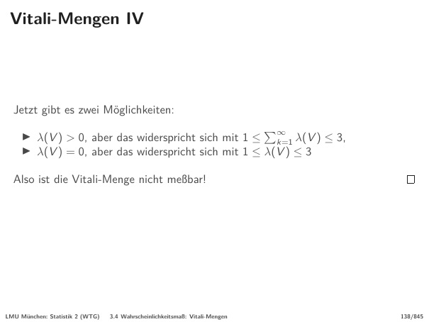

本页放在“模块一：概率测度把事件变成数字”中，核心是理解 集合（Menge）。直觉上先抓住标题里的对象：集合（Menge）。然后看它是定义、例子、定理还是证明；定义页要记条件，例子页要看随机机制，证明页要看用了哪些闭包性或极限定理。

关键词：

- 集合（Menge）

本页需要抓住的德语线索：

- `λ(V ) > 0, aber das widerspricht sich mit 1 ≤`
- `λ(V ) ≤ 3,`
- `k=1`
- `λ(V ) = 0, aber das widerspricht sich mit 1 ≤ λ(V ) ≤ 3`

## 模块二：随机变量其实是可测映射（Seite 115-161）

随机变量不是“随机的数”这么简单，而是从基础空间到数值空间的可测函数。可测性的作用是保证你问的事件比如 $X\le x$ 仍然能被概率测度衡量。

### Seite 115 - 随机变量（Zufallsvariablen）

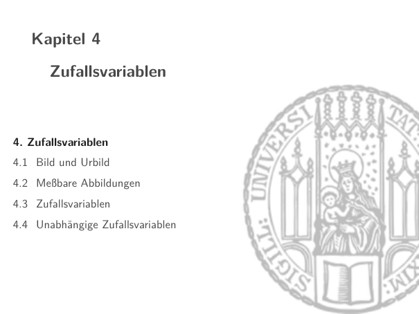

本页可识别的嵌入图片裁切：

本页放在“模块二：随机变量其实是可测映射”中，核心是理解 随机变量（Zufallsvariable）。直觉上先抓住标题里的对象：随机变量（Zufallsvariablen）。然后看它是定义、例子、定理还是证明；定义页要记条件，例子页要看随机机制，证明页要看用了哪些闭包性或极限定理。

关键词：

- 随机变量（Zufallsvariable）

本页需要抓住的德语线索：

- `Kapitel 4`
- `Zufallsvariablen`
- `4. Zufallsvariablen`

### Seite 116 - Ziele des Kapitels

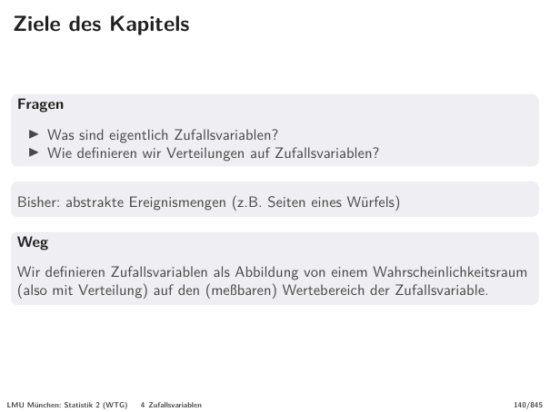

本页放在“模块二：随机变量其实是可测映射”中，核心是理解 概率（Wahrscheinlichkeit）、概率空间（Wahrscheinlichkeitsraum）、事件（Ereignis）、随机变量（Zufallsvariable）。直觉上先抓住标题里的对象：Ziele des Kapitels。然后看它是定义、例子、定理还是证明；定义页要记条件，例子页要看随机机制，证明页要看用了哪些闭包性或极限定理。

关键词：

- 概率（Wahrscheinlichkeit）
- 概率空间（Wahrscheinlichkeitsraum）
- 事件（Ereignis）
- 随机变量（Zufallsvariable）
- 分布（Verteilung）

本页需要抓住的德语线索：

- `Ziele des Kapitels`

### Seite 117 - 随机变量（Zufallsvariablen）

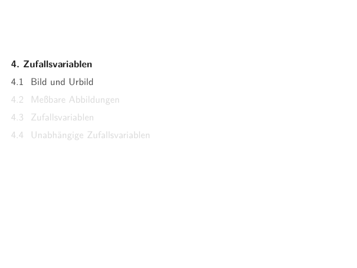

本页放在“模块二：随机变量其实是可测映射”中，核心是理解 随机变量（Zufallsvariable）。直觉上先抓住标题里的对象：随机变量（Zufallsvariablen）。然后看它是定义、例子、定理还是证明；定义页要记条件，例子页要看随机机制，证明页要看用了哪些闭包性或极限定理。

关键词：

- 随机变量（Zufallsvariable）

本页需要抓住的德语线索：

- `4. Zufallsvariablen`
- `4.1 Bild und Urbild`
- `4.2 Meßbare Abbildungen`

### Seite 118 - Abbildung und Bild

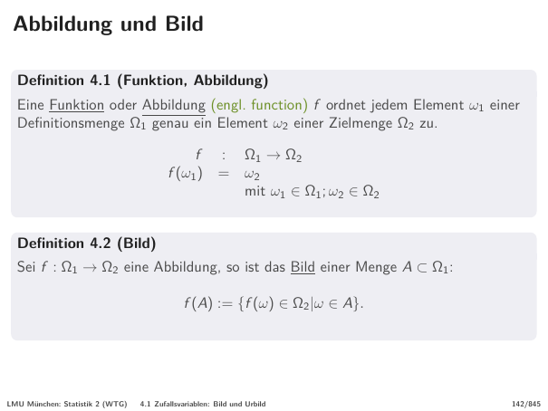

本页放在“模块二：随机变量其实是可测映射”中，主要作用是推进 Seite 115-161 这一段的概念链。先把标题“Abbildung und Bild”和前后页联系起来，再区分它是在给定义、展示例子、证明性质，还是做章节过渡。

本页需要抓住的德语线索：

- `Definition 4.1 (Funktion, Abbildung)`
- `Definitionsmenge Ω genau ein Element ω einer Zielmenge Ω zu.`
- `f : Ω → Ω`
- `f (ω ) = ω`
- `mit ω ∈ Ω ; ω ∈ Ω`

### Seite 119 - Urbild I

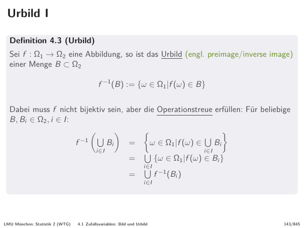

本页放在“模块二：随机变量其实是可测映射”中，核心是理解 集合（Menge）。直觉上先抓住标题里的对象：Urbild I。然后看它是定义、例子、定理还是证明；定义页要记条件，例子页要看随机机制，证明页要看用了哪些闭包性或极限定理。

关键词：

- 集合（Menge）

本页需要抓住的德语线索：

- `Definition 4.3 (Urbild)`
- `Sei f : Ω → Ω eine Abbildung, so ist das Urbild (engl. preimage/inverse image)`
- `einer Menge B ⊂ Ω`
- `f −1(B) := {ω ∈ Ω |f (ω) ∈ B}`
- `B, B ∈ Ω , i ∈ I:`

### Seite 120 - Urbild II

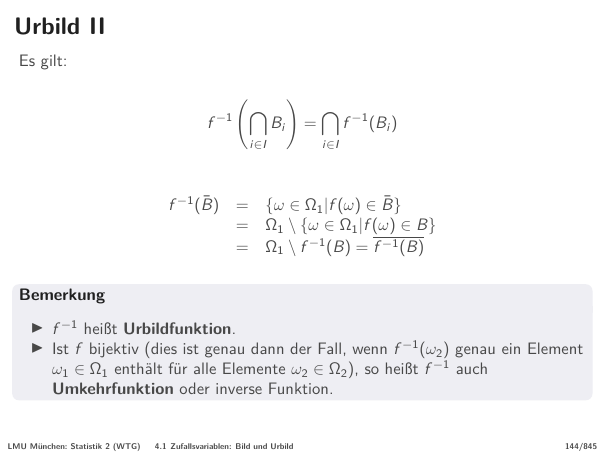

本页放在“模块二：随机变量其实是可测映射”中，主要作用是推进 Seite 115-161 这一段的概念链。先把标题“Urbild II”和前后页联系起来，再区分它是在给定义、展示例子、证明性质，还是做章节过渡。

本页需要抓住的德语线索：

- `Es gilt:`
- `f −1 B = f −1(B )`
- `i∈I i∈I`
- `f −1(B¯ ) = {ω ∈ Ω |f (ω) ∈ B¯ }`
- `= Ω \ {ω ∈ Ω |f (ω) ∈ B}`

### Seite 121 - Beispiel Zweifacher Würfelwurf

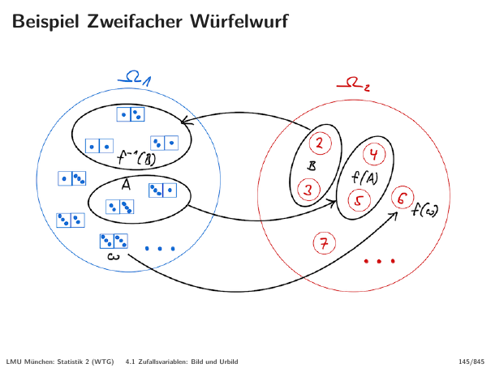

本页可识别的嵌入图片裁切：

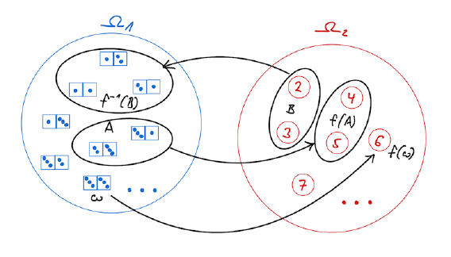

本页放在“模块二：随机变量其实是可测映射”中，主要作用是推进 Seite 115-161 这一段的概念链。先把标题“Beispiel Zweifacher Würfelwurf”和前后页联系起来，再区分它是在给定义、展示例子、证明性质，还是做章节过渡。

本页需要抓住的德语线索：

- `Beispiel Zweifacher Würfelwurf`

### Seite 122 - 集合（Menge）

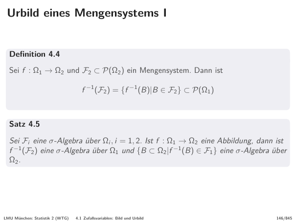

本页放在“模块二：随机变量其实是可测映射”中，核心是理解 集合（Menge）、集合系统（Mengensystem）、σ-代数（σ-Algebra）。直觉上先抓住标题里的对象：集合（Menge）。然后看它是定义、例子、定理还是证明；定义页要记条件，例子页要看随机机制，证明页要看用了哪些闭包性或极限定理。

关键词：

- 集合（Menge）
- 集合系统（Mengensystem）
- σ-代数（σ-Algebra）

本页需要抓住的德语线索：

- `Definition 4.4`
- `Sei f : Ω → Ω und F ⊂ P(Ω ) ein Mengensystem. Dann ist`
- `f −1(F ) = {f −1(B)|B ∈ F } ⊂ P(Ω )`
- `Satz 4.5`
- `Sei F eine σ-Algebra über Ω , i = 1, 2. Ist f : Ω → Ω eine Abbildung, dann ist`

### Seite 123 - 集合（Menge）

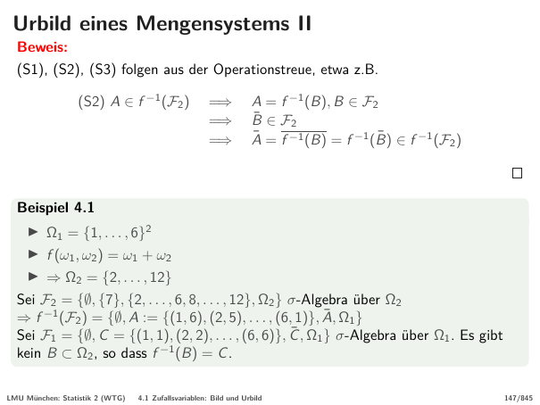

本页放在“模块二：随机变量其实是可测映射”中，核心是理解 集合（Menge）、集合系统（Mengensystem）。直觉上先抓住标题里的对象：集合（Menge）。然后看它是定义、例子、定理还是证明；定义页要记条件，例子页要看随机机制，证明页要看用了哪些闭包性或极限定理。

关键词：

- 集合（Menge）
- 集合系统（Mengensystem）

本页需要抓住的德语线索：

- `(S2) A ∈ f −1(F ) =⇒ A = f −1(B), B ∈ F`
- `=⇒ B¯ ∈ F`
- `=⇒ A¯ = f −1(B) = f −1(B¯ ) ∈ f −1(F )`
- `Beispiel 4.1`
- `Ω = {1, . . . , 6}2`

### Seite 124 - 随机变量（Zufallsvariablen）

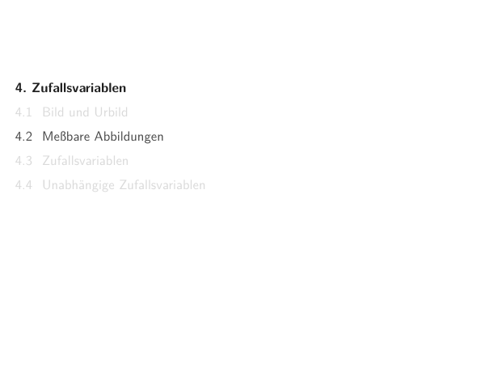

本页放在“模块二：随机变量其实是可测映射”中，核心是理解 随机变量（Zufallsvariable）。直觉上先抓住标题里的对象：随机变量（Zufallsvariablen）。然后看它是定义、例子、定理还是证明；定义页要记条件，例子页要看随机机制，证明页要看用了哪些闭包性或极限定理。

关键词：

- 随机变量（Zufallsvariable）

本页需要抓住的德语线索：

- `4. Zufallsvariablen`
- `4.1 Bild und Urbild`
- `4.2 Meßbare Abbildungen`

### Seite 125 - 可测映射（Meßbare Abbildungen）

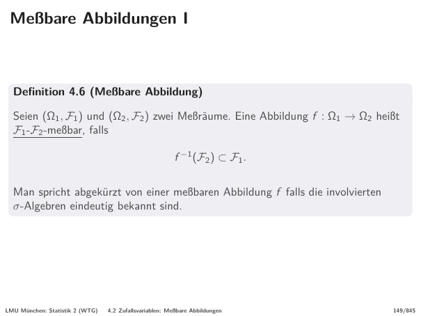

本页放在“模块二：随机变量其实是可测映射”中，主要作用是推进 Seite 115-161 这一段的概念链。先把标题“可测映射（Meßbare Abbildungen）”和前后页联系起来，再区分它是在给定义、展示例子、证明性质，还是做章节过渡。

本页需要抓住的德语线索：

- `Definition 4.6 (Meßbare Abbildung)`
- `Seien (Ω , F ) und (Ω , F ) zwei Meßräume. Eine Abbildung f : Ω → Ω heißt`
- `f −1(F ) ⊂ F .`

### Seite 126 - 可测映射（Meßbare Abbildungen）

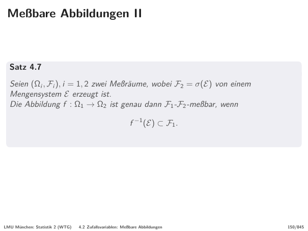

本页放在“模块二：随机变量其实是可测映射”中，核心是理解 集合（Menge）、集合系统（Mengensystem）。直觉上先抓住标题里的对象：可测映射（Meßbare Abbildungen）。然后看它是定义、例子、定理还是证明；定义页要记条件，例子页要看随机机制，证明页要看用了哪些闭包性或极限定理。

关键词：

- 集合（Menge）
- 集合系统（Mengensystem）

本页需要抓住的德语线索：

- `Satz 4.7`
- `Seien (Ω , F ), i = 1, 2 zwei Meßräume, wobei F = σ(E) von einem`
- `Die Abbildung f : Ω → Ω ist genau dann F -F -meßbar, wenn`
- `f −1(E) ⊂ F .`

### Seite 127 - 可测映射（Meßbare Abbildungen）

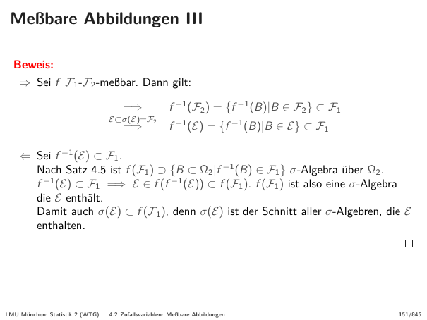

本页放在“模块二：随机变量其实是可测映射”中，主要作用是推进 Seite 115-161 这一段的概念链。先把标题“可测映射（Meßbare Abbildungen）”和前后页联系起来，再区分它是在给定义、展示例子、证明性质，还是做章节过渡。

本页需要抓住的德语线索：

- `=⇒ f −1(F ) = {f −1(B)|B ∈ F } ⊂ F`
- `E⊂σ`
- `=`
- `E)=F2`
- `f −1(E) = {f −1(B)|B ∈ E} ⊂ F`

### Seite 128 - 可测映射（Meßbare Abbildungen）

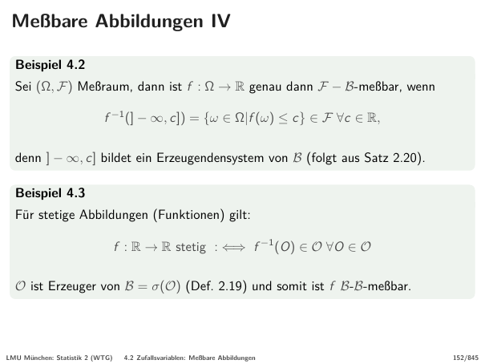

本页放在“模块二：随机变量其实是可测映射”中，主要作用是推进 Seite 115-161 这一段的概念链。先把标题“可测映射（Meßbare Abbildungen）”和前后页联系起来，再区分它是在给定义、展示例子、证明性质，还是做章节过渡。

本页需要抓住的德语线索：

- `Beispiel 4.2`
- `Sei (Ω, F) Meßraum, dann ist f : Ω → R genau dann F − B-meßbar, wenn`
- `f −1(] − ∞, c]) = {ω ∈ Ω|f (ω) ≤ c} ∈ F ∀c ∈ R,`
- `denn ] − ∞, c] bildet ein Erzeugendensystem von B (folgt aus Satz 2.20).`
- `Beispiel 4.3`

### Seite 129 - 可测映射（Meßbare Abbildungen）

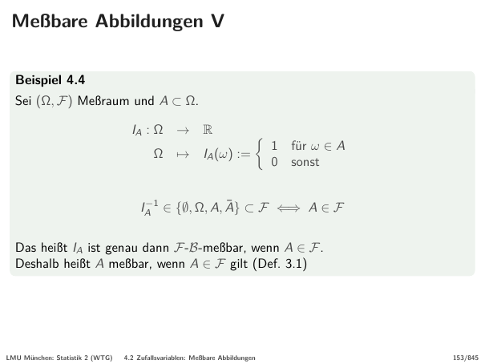

本页放在“模块二：随机变量其实是可测映射”中，主要作用是推进 Seite 115-161 这一段的概念链。先把标题“可测映射（Meßbare Abbildungen）”和前后页联系起来，再区分它是在给定义、展示例子、证明性质，还是做章节过渡。

本页需要抓住的德语线索：

- `Beispiel 4.4`
- `Sei (Ω, F) Meßraum und A ⊂ Ω.`
- `I : Ω → R`
- `1 für ω ∈ A`
- `Ω 7→ I (ω) :=`

### Seite 130 - 可测映射（Meßbare Abbildungen）

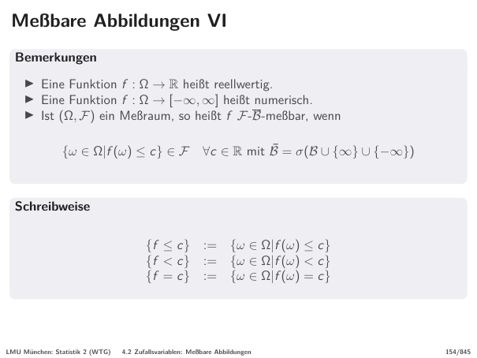

本页放在“模块二：随机变量其实是可测映射”中，主要作用是推进 Seite 115-161 这一段的概念链。先把标题“可测映射（Meßbare Abbildungen）”和前后页联系起来，再区分它是在给定义、展示例子、证明性质，还是做章节过渡。

本页需要抓住的德语线索：

- `Eine Funktion f : Ω → R heißt reellwertig.`
- `Eine Funktion f : Ω → [−∞, ∞] heißt numerisch.`
- `{ω ∈ Ω|f (ω) ≤ c} ∈ F ∀c ∈ R mit B¯ = σ(B ∪ {∞} ∪ {−∞})`
- `{f ≤ c} := {ω ∈ Ω|f (ω) ≤ c}`
- `{f < c} := {ω ∈ Ω|f (ω) < c}`

### Seite 131 - 随机变量（Zufallsvariablen）

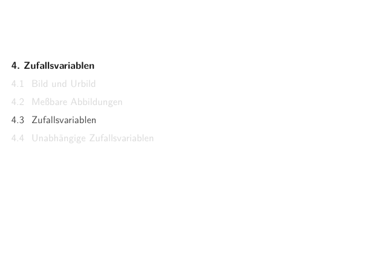

本页放在“模块二：随机变量其实是可测映射”中，核心是理解 随机变量（Zufallsvariable）。直觉上先抓住标题里的对象：随机变量（Zufallsvariablen）。然后看它是定义、例子、定理还是证明；定义页要记条件，例子页要看随机机制，证明页要看用了哪些闭包性或极限定理。

关键词：

- 随机变量（Zufallsvariable）

本页需要抓住的德语线索：

- `4. Zufallsvariablen`
- `4.1 Bild und Urbild`
- `4.2 Meßbare Abbildungen`

### Seite 132 - 随机变量（Zufallsvariable）

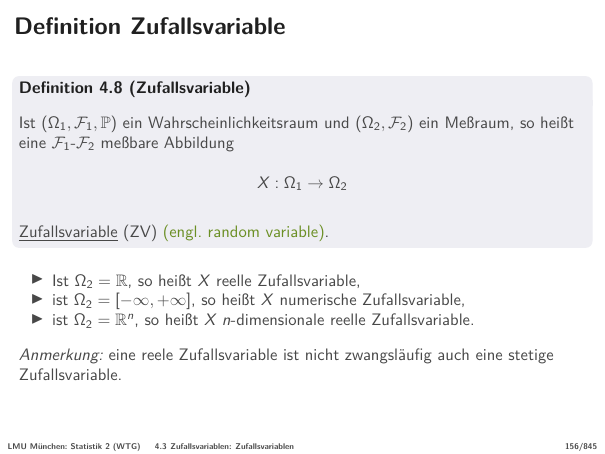

本页放在“模块二：随机变量其实是可测映射”中，核心是理解 概率（Wahrscheinlichkeit）、概率空间（Wahrscheinlichkeitsraum）、随机变量（Zufallsvariable）、依概率（in Wahrscheinlichkeit）。直觉上先抓住标题里的对象：随机变量（Zufallsvariable）。然后看它是定义、例子、定理还是证明；定义页要记条件，例子页要看随机机制，证明页要看用了哪些闭包性或极限定理。

关键词：

- 概率（Wahrscheinlichkeit）
- 概率空间（Wahrscheinlichkeitsraum）
- 随机变量（Zufallsvariable）
- 依概率（in Wahrscheinlichkeit）

本页需要抓住的德语线索：

- `Definition Zufallsvariable`
- `Definition 4.8 (Zufallsvariable)`
- `X : Ω → Ω`
- `Ist Ω = R, so heißt X reelle Zufallsvariable,`
- `ist Ω = [−∞, +∞], so heißt X numerische Zufallsvariable,`

### Seite 133 - Bildmaß

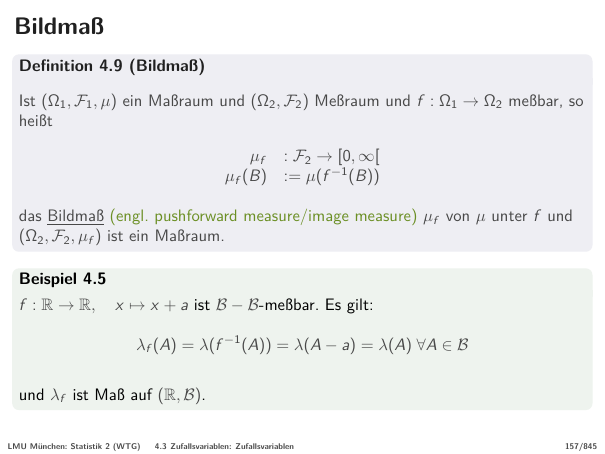

本页放在“模块二：随机变量其实是可测映射”中，核心是理解 测度（Maß）。直觉上先抓住标题里的对象：Bildmaß。然后看它是定义、例子、定理还是证明；定义页要记条件，例子页要看随机机制，证明页要看用了哪些闭包性或极限定理。

关键词：

- 测度（Maß）

本页需要抓住的德语线索：

- `Definition 4.9 (Bildmaß)`
- `Ist (Ω , F , µ) ein Maßraum und (Ω , F ) Meßraum und f : Ω → Ω meßbar, so`
- `µ : F → [0, ∞[`
- `µ (B) := µ(f −1(B))`
- `Beispiel 4.5`

### Seite 134 - 随机变量（Zufallsvariablen）

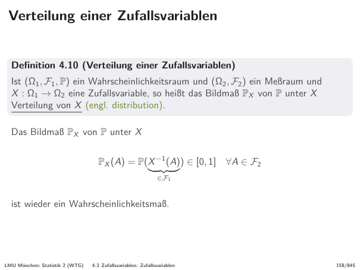

本页放在“模块二：随机变量其实是可测映射”中，核心是理解 概率（Wahrscheinlichkeit）、概率空间（Wahrscheinlichkeitsraum）、随机变量（Zufallsvariable）、分布（Verteilung）。直觉上先抓住标题里的对象：随机变量（Zufallsvariablen）。然后看它是定义、例子、定理还是证明；定义页要记条件，例子页要看随机机制，证明页要看用了哪些闭包性或极限定理。

关键词：

- 概率（Wahrscheinlichkeit）
- 概率空间（Wahrscheinlichkeitsraum）
- 随机变量（Zufallsvariable）
- 分布（Verteilung）
- 依概率（in Wahrscheinlichkeit）

本页需要抓住的德语线索：

- `Definition 4.10 (Verteilung einer Zufallsvariablen)`
- `X : Ω → Ω eine Zufallsvariable, so heißt das Bildmaß P von P unter X`
- `P (A) = P(X −1(A)) ∈ [0, 1] ∀A ∈ F`
- `∈F1`

### Seite 135 - Glücksrad I

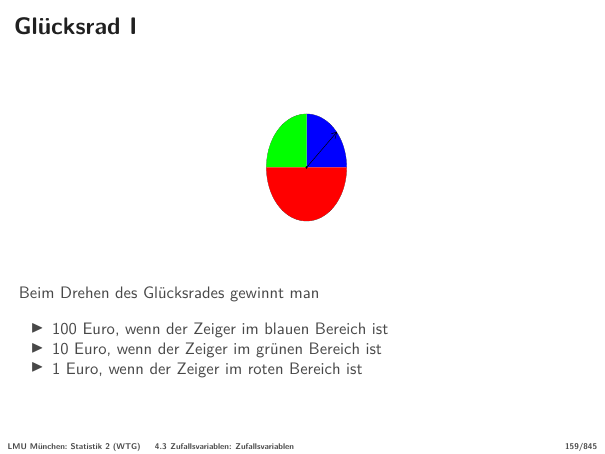

本页放在“模块二：随机变量其实是可测映射”中，主要作用是推进 Seite 115-161 这一段的概念链。先把标题“Glücksrad I”和前后页联系起来，再区分它是在给定义、展示例子、证明性质，还是做章节过渡。

本页需要抓住的德语线索：

- `Glücksrad I`
- `Beim Drehen des Glücksrades gewinnt man`
- `100 Euro, wenn der Zeiger im blauen Bereich ist`

### Seite 136 - Glücksrad II

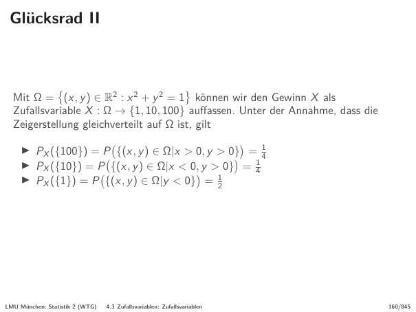

本页放在“模块二：随机变量其实是可测映射”中，核心是理解 随机变量（Zufallsvariable）。直觉上先抓住标题里的对象：Glücksrad II。然后看它是定义、例子、定理还是证明；定义页要记条件，例子页要看随机机制，证明页要看用了哪些闭包性或极限定理。

关键词：

- 随机变量（Zufallsvariable）

本页需要抓住的德语线索：

- `Mit Ω = (cid:8) (x , y ) ∈ R2 : x 2 + y 2 = 1 (cid:9) können wir den Gewinn X als`
- `Zufallsvariable X : Ω → {1, 10, 100} auffassen. Unter der Annahme, dass die`
- `P ({100}) = P (cid:0) {(x , y ) ∈ Ω|x > 0, y > 0} (cid:1) = 1`
- `P ({10}) = P (cid:0) {(x , y ) ∈ Ω|x < 0, y > 0} (cid:1) = 1`
- `P ({1}) = P (cid:0) {(x , y ) ∈ Ω|y < 0} (cid:1) = 1`

### Seite 137 - 二项分布（Binomialverteilung）

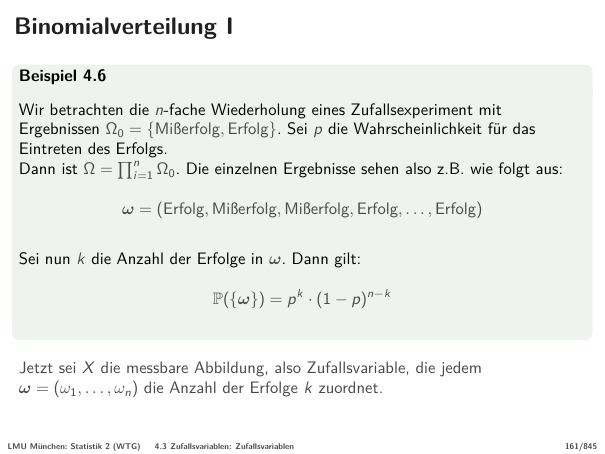

本页放在“模块二：随机变量其实是可测映射”中，核心是理解 概率（Wahrscheinlichkeit）、结果（Ergebnis）、二项分布（Binomialverteilung）。直觉上先抓住标题里的对象：二项分布（Binomialverteilung）。然后看它是定义、例子、定理还是证明；定义页要记条件，例子页要看随机机制，证明页要看用了哪些闭包性或极限定理。

关键词：

- 概率（Wahrscheinlichkeit）
- 结果（Ergebnis）
- 二项分布（Binomialverteilung）

本页需要抓住的德语线索：

- `Beispiel 4.6`
- `Ergebnissen Ω = {Mißerfolg, Erfolg}. Sei p die Wahrscheinlichkeit für das`
- `Dann ist Ω =`
- `i=1 0`
- `ω = (Erfolg, Mißerfolg, Mißerfolg, Erfolg, . . . , Erfolg)`

### Seite 138 - 二项分布（Binomialverteilung）

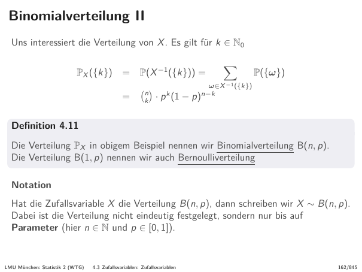

本页放在“模块二：随机变量其实是可测映射”中，核心是理解 分布（Verteilung）、二项分布（Binomialverteilung）。直觉上先抓住标题里的对象：二项分布（Binomialverteilung）。然后看它是定义、例子、定理还是证明；定义页要记条件，例子页要看随机机制，证明页要看用了哪些闭包性或极限定理。

关键词：

- 分布（Verteilung）
- 二项分布（Binomialverteilung）

本页需要抓住的德语线索：

- `Uns interessiert die Verteilung von X . Es gilt für k ∈ N`
- `P ({k}) = P(X −1({k})) = P({ω})`
- `ω∈X−1({k})`
- `= (cid:0)n(cid:1) · pk (1 − p)n−k`
- `Definition 4.11`

### Seite 139 - 二项分布（Binomialverteilung）

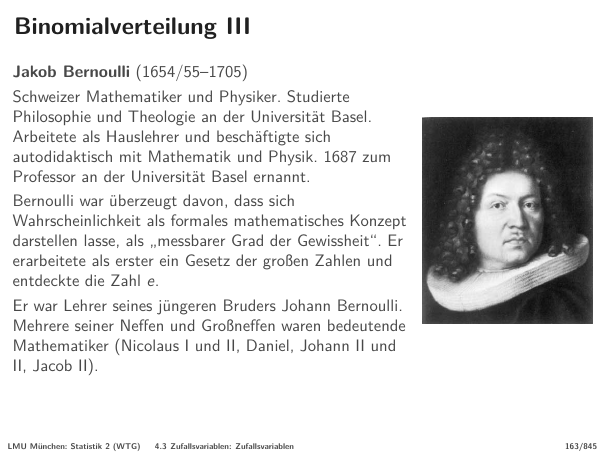

本页可识别的嵌入图片裁切：

本页放在“模块二：随机变量其实是可测映射”中，核心是理解 概率（Wahrscheinlichkeit）、可测（messbar）、二项分布（Binomialverteilung）。直觉上先抓住标题里的对象：二项分布（Binomialverteilung）。然后看它是定义、例子、定理还是证明；定义页要记条件，例子页要看随机机制，证明页要看用了哪些闭包性或极限定理。

关键词：

- 概率（Wahrscheinlichkeit）
- 可测（messbar）
- 二项分布（Binomialverteilung）

本页需要抓住的德语线索：

- `Binomialverteilung III`
- `Jakob Bernoulli (1654/55–1705)`
- `Schweizer Mathematiker und Physiker. Studierte`

### Seite 140 - 随机变量（Zufallsvariablen）

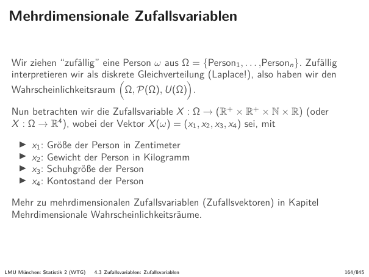

本页放在“模块二：随机变量其实是可测映射”中，核心是理解 概率（Wahrscheinlichkeit）、概率空间（Wahrscheinlichkeitsraum）、随机变量（Zufallsvariable）。直觉上先抓住标题里的对象：随机变量（Zufallsvariablen）。然后看它是定义、例子、定理还是证明；定义页要记条件，例子页要看随机机制，证明页要看用了哪些闭包性或极限定理。

关键词：

- 概率（Wahrscheinlichkeit）
- 概率空间（Wahrscheinlichkeitsraum）
- 随机变量（Zufallsvariable）

本页需要抓住的德语线索：

- `Wir ziehen “zufällig” eine Person ω aus Ω = {Person , . . . ,Person }. Zufällig`
- `Wahrscheinlichkeitsraum Ω, P(Ω), U(Ω) .`
- `Nun betrachten wir die Zufallsvariable X : Ω → (R+ × R+ × N × R) (oder`
- `X : Ω → R4), wobei der Vektor X (ω) = (x , x , x , x ) sei, mit`

### Seite 141 - Schreibweisen

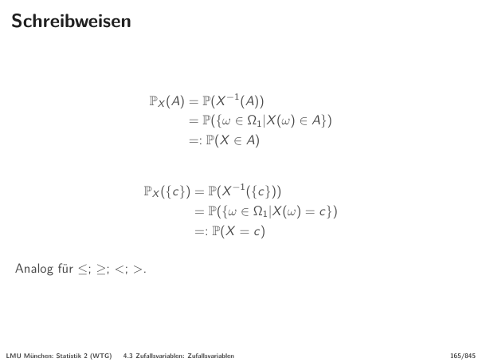

本页放在“模块二：随机变量其实是可测映射”中，主要作用是推进 Seite 115-161 这一段的概念链。先把标题“Schreibweisen”和前后页联系起来，再区分它是在给定义、展示例子、证明性质，还是做章节过渡。

本页需要抓住的德语线索：

- `P (A) = P(X −1(A))`
- `= P({ω ∈ Ω |X (ω) ∈ A})`
- `=: P(X ∈ A)`
- `P ({c}) = P(X −1({c}))`
- `= P({ω ∈ Ω |X (ω) = c})`

### Seite 142 - Meßbarkeit der Komposition I

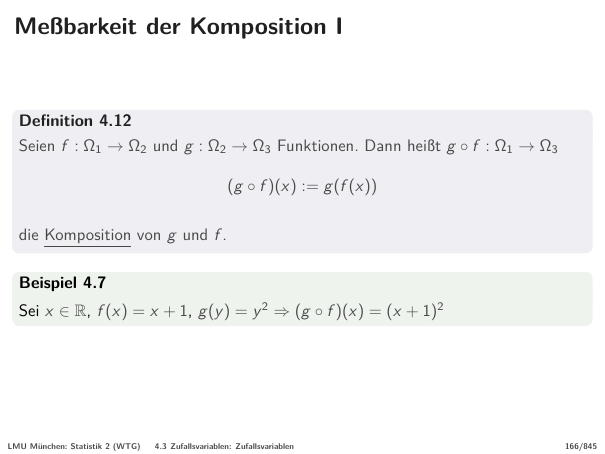

本页放在“模块二：随机变量其实是可测映射”中，主要作用是推进 Seite 115-161 这一段的概念链。先把标题“Meßbarkeit der Komposition I”和前后页联系起来，再区分它是在给定义、展示例子、证明性质，还是做章节过渡。

本页需要抓住的德语线索：

- `Definition 4.12`
- `Seien f : Ω → Ω und g : Ω → Ω Funktionen. Dann heißt g ◦ f : Ω → Ω`
- `(g ◦ f )(x ) := g(f (x ))`
- `Beispiel 4.7`
- `Sei x ∈ R, f (x ) = x + 1, g(y ) = y 2 ⇒ (g ◦ f )(x ) = (x + 1)2`

### Seite 143 - Meßbarkeit der Komposition II

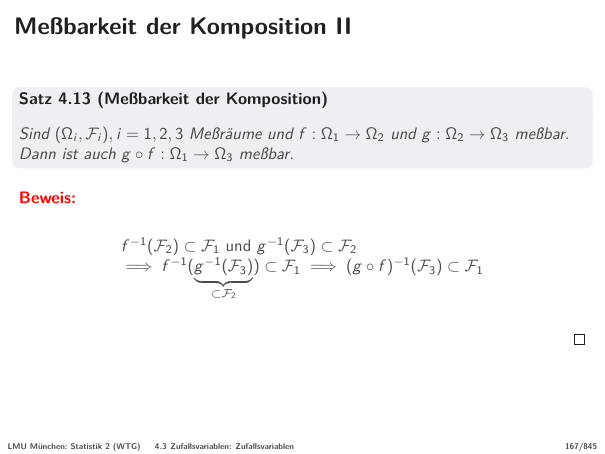

本页放在“模块二：随机变量其实是可测映射”中，主要作用是推进 Seite 115-161 这一段的概念链。先把标题“Meßbarkeit der Komposition II”和前后页联系起来，再区分它是在给定义、展示例子、证明性质，还是做章节过渡。

本页需要抓住的德语线索：

- `Satz 4.13 (Meßbarkeit der Komposition)`
- `Sind (Ω , F ), i = 1, 2, 3 Meßräume und f : Ω → Ω und g : Ω → Ω meßbar.`
- `Dann ist auch g ◦ f : Ω → Ω meßbar.`
- `f −1(F ) ⊂ F und g−1(F ) ⊂ F`
- `=⇒ f −1(g−1(F )) ⊂ F =⇒ (g ◦ f )−1(F ) ⊂ F`

### Seite 144 - Meßbarkeit der Komposition III

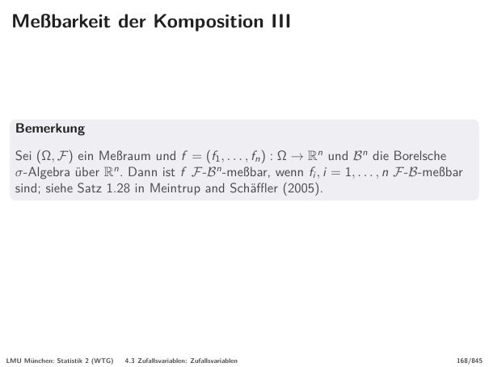

本页放在“模块二：随机变量其实是可测映射”中，核心是理解 σ-代数（σ-Algebra）。直觉上先抓住标题里的对象：Meßbarkeit der Komposition III。然后看它是定义、例子、定理还是证明；定义页要记条件，例子页要看随机机制，证明页要看用了哪些闭包性或极限定理。

关键词：

- σ-代数（σ-Algebra）

本页需要抓住的德语线索：

- `Sei (Ω, F) ein Meßraum und f = (f , . . . , f ) : Ω → Rn und Bn die Borelsche`
- `σ-Algebra über Rn. Dann ist f F-Bn-meßbar, wenn f , i = 1, . . . , n F-B-meßbar`
- `sind; siehe Satz 1.28 in Meintrup and Schäffler (2005).`

### Seite 145 - 随机变量（Zufallsvariablen）

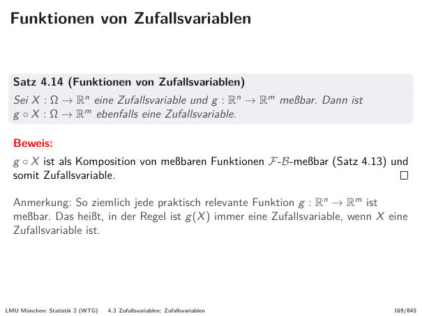

本页放在“模块二：随机变量其实是可测映射”中，核心是理解 随机变量（Zufallsvariable）。直觉上先抓住标题里的对象：随机变量（Zufallsvariablen）。然后看它是定义、例子、定理还是证明；定义页要记条件，例子页要看随机机制，证明页要看用了哪些闭包性或极限定理。

关键词：

- 随机变量（Zufallsvariable）

本页需要抓住的德语线索：

- `Satz 4.14 (Funktionen von Zufallsvariablen)`
- `Sei X : Ω → Rn eine Zufallsvariable und g : Rn → Rm meßbar. Dann ist`
- `g ◦ X : Ω → Rm ebenfalls eine Zufallsvariable.`
- `g ◦ X ist als Komposition von meßbaren Funktionen F-B-meßbar (Satz 4.13) und`
- `Anmerkung: So ziemlich jede praktisch relevante Funktion g : Rn → Rm ist`

### Seite 146 - Messbare Verknüpfungen I

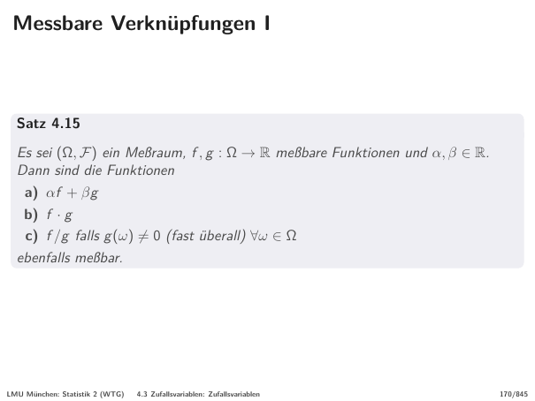

本页放在“模块二：随机变量其实是可测映射”中，主要作用是推进 Seite 115-161 这一段的概念链。先把标题“Messbare Verknüpfungen I”和前后页联系起来，再区分它是在给定义、展示例子、证明性质，还是做章节过渡。

本页需要抓住的德语线索：

- `Satz 4.15`
- `Es sei (Ω, F) ein Meßraum, f , g : Ω → R meßbare Funktionen und α, β ∈ R.`
- `c) f /g falls g(ω) ̸= 0 (fast überall) ∀ω ∈ Ω`

### Seite 147 - Messbare Verknüpfungen II

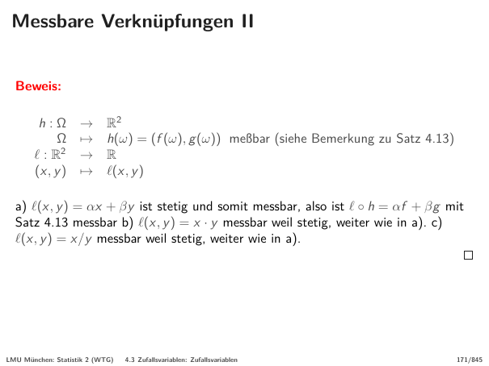

本页放在“模块二：随机变量其实是可测映射”中，核心是理解 可测（messbar）。直觉上先抓住标题里的对象：Messbare Verknüpfungen II。然后看它是定义、例子、定理还是证明；定义页要记条件，例子页要看随机机制，证明页要看用了哪些闭包性或极限定理。

关键词：

- 可测（messbar）

本页需要抓住的德语线索：

- `h : Ω → R2`
- `Ω 7→ h(ω) = (f (ω), g(ω)) meßbar (siehe Bemerkung zu Satz 4.13)`
- `ℓ : R2 → R`
- `(x , y ) 7→ ℓ(x , y )`
- `a) ℓ(x , y ) = αx + βy ist stetig und somit messbar, also ist ℓ ◦ h = αf + βg mit`

### Seite 148 - Messbare Verknüpfungen III

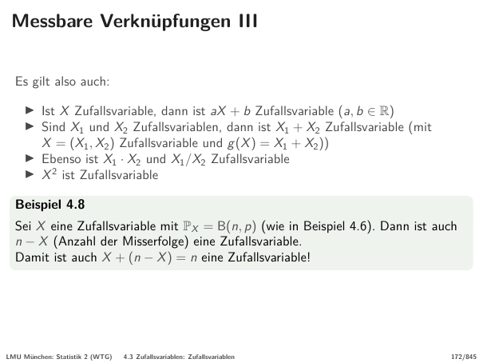

本页放在“模块二：随机变量其实是可测映射”中，核心是理解 随机变量（Zufallsvariable）。直觉上先抓住标题里的对象：Messbare Verknüpfungen III。然后看它是定义、例子、定理还是证明；定义页要记条件，例子页要看随机机制，证明页要看用了哪些闭包性或极限定理。

关键词：

- 随机变量（Zufallsvariable）

本页需要抓住的德语线索：

- `Es gilt also auch:`
- `Ist X Zufallsvariable, dann ist aX + b Zufallsvariable (a, b ∈ R)`
- `X = (X , X ) Zufallsvariable und g(X ) = X + X ))`
- `Beispiel 4.8`
- `Sei X eine Zufallsvariable mit P = B(n, p) (wie in Beispiel 4.6). Dann ist auch`

### Seite 149 - Messbare Verknüpfungen IV

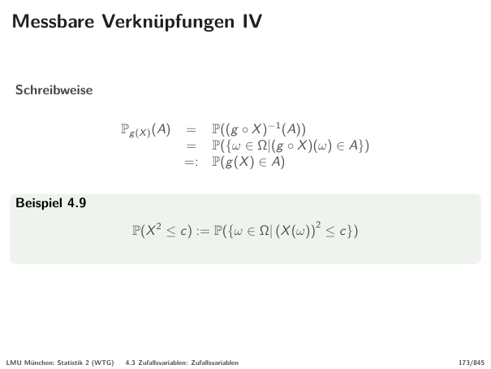

本页放在“模块二：随机变量其实是可测映射”中，主要作用是推进 Seite 115-161 这一段的概念链。先把标题“Messbare Verknüpfungen IV”和前后页联系起来，再区分它是在给定义、展示例子、证明性质，还是做章节过渡。

本页需要抓住的德语线索：

- `P (A) = P((g ◦ X )−1(A))`
- `= P({ω ∈ Ω|(g ◦ X )(ω) ∈ A})`
- `=: P(g(X ) ∈ A)`
- `Beispiel 4.9`
- `P(X 2 ≤ c) := P({ω ∈ Ω| (X (ω))2 ≤ c})`

### Seite 150 - 随机变量（Zufallsvariablen）

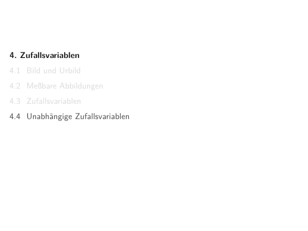

本页放在“模块二：随机变量其实是可测映射”中，核心是理解 随机变量（Zufallsvariable）。直觉上先抓住标题里的对象：随机变量（Zufallsvariablen）。然后看它是定义、例子、定理还是证明；定义页要记条件，例子页要看随机机制，证明页要看用了哪些闭包性或极限定理。

关键词：

- 随机变量（Zufallsvariable）

本页需要抓住的德语线索：

- `4. Zufallsvariablen`
- `4.1 Bild und Urbild`
- `4.2 Meßbare Abbildungen`

### Seite 151 - 事件（Ereignisse）

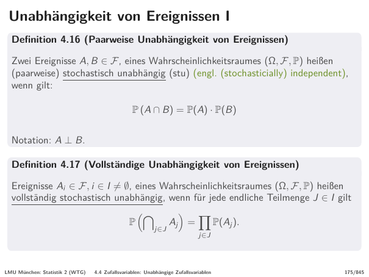

本页放在“模块二：随机变量其实是可测映射”中，核心是理解 概率（Wahrscheinlichkeit）、概率空间（Wahrscheinlichkeitsraum）、事件（Ereignis）、独立性（Unabhängigkeit）。直觉上先抓住标题里的对象：事件（Ereignisse）。然后看它是定义、例子、定理还是证明；定义页要记条件，例子页要看随机机制，证明页要看用了哪些闭包性或极限定理。

关键词：

- 概率（Wahrscheinlichkeit）
- 概率空间（Wahrscheinlichkeitsraum）
- 事件（Ereignis）
- 独立性（Unabhängigkeit）

本页需要抓住的德语线索：

- `Definition 4.16 (Paarweise Unabhängigkeit von Ereignissen)`
- `Zwei Ereignisse A, B ∈ F, eines Wahrscheinlichkeitsraumes (Ω, F, P) heißen`
- `P (A ∩ B) = P(A) · P(B)`
- `Definition 4.17 (Vollständige Unabhängigkeit von Ereignissen)`
- `Ereignisse A ∈ F, i ∈ I ̸= ∅, eines Wahrscheinlichkeitsraumes (Ω, F, P) heißen`

### Seite 152 - 事件（Ereignisse）

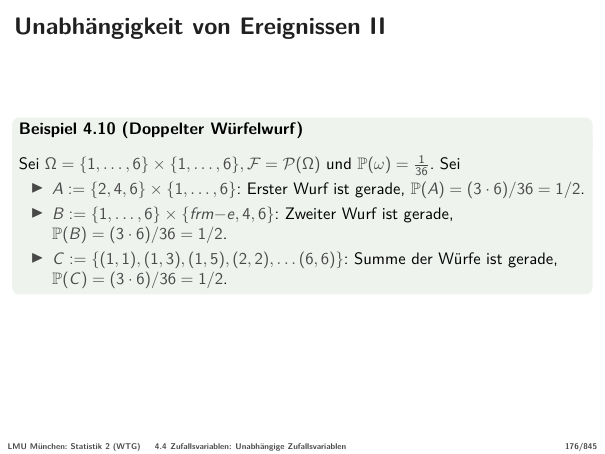

本页放在“模块二：随机变量其实是可测映射”中，核心是理解 事件（Ereignis）、独立性（Unabhängigkeit）。直觉上先抓住标题里的对象：事件（Ereignisse）。然后看它是定义、例子、定理还是证明；定义页要记条件，例子页要看随机机制，证明页要看用了哪些闭包性或极限定理。

关键词：

- 事件（Ereignis）
- 独立性（Unabhängigkeit）

本页需要抓住的德语线索：

- `Beispiel 4.10 (Doppelter Würfelwurf)`
- `Sei Ω = {1, . . . , 6} × {1, . . . , 6}, F = P(Ω) und P(ω) = 1 . Sei`
- `A := {2, 4, 6} × {1, . . . , 6}: Erster Wurf ist gerade, P(A) = (3 · 6)/36 = 1/2.`
- `B := {1, . . . , 6} × {frm−e, 4, 6}: Zweiter Wurf ist gerade,`
- `P(B) = (3 · 6)/36 = 1/2.`

### Seite 153 - 事件（Ereignisse）

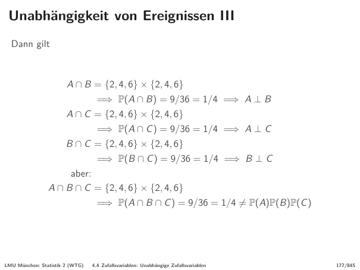

本页放在“模块二：随机变量其实是可测映射”中，核心是理解 事件（Ereignis）、独立性（Unabhängigkeit）。直觉上先抓住标题里的对象：事件（Ereignisse）。然后看它是定义、例子、定理还是证明；定义页要记条件，例子页要看随机机制，证明页要看用了哪些闭包性或极限定理。

关键词：

- 事件（Ereignis）
- 独立性（Unabhängigkeit）

本页需要抓住的德语线索：

- `A ∩ B = {2, 4, 6} × {2, 4, 6}`
- `=⇒ P(A ∩ B) = 9/36 = 1/4 =⇒ A ⊥ B`
- `A ∩ C = {2, 4, 6} × {2, 4, 6}`
- `=⇒ P(A ∩ C ) = 9/36 = 1/4 =⇒ A ⊥ C`
- `B ∩ C = {2, 4, 6} × {2, 4, 6}`

### Seite 154 - 事件（Ereignisse）

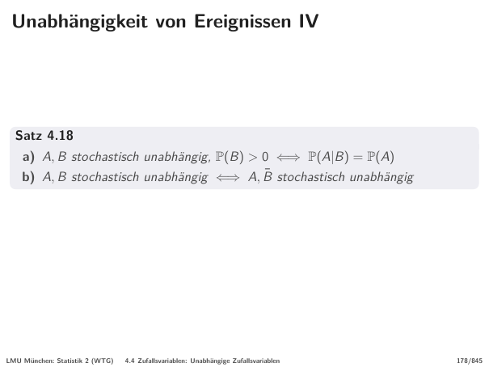

本页放在“模块二：随机变量其实是可测映射”中，核心是理解 事件（Ereignis）、独立性（Unabhängigkeit）。直觉上先抓住标题里的对象：事件（Ereignisse）。然后看它是定义、例子、定理还是证明；定义页要记条件，例子页要看随机机制，证明页要看用了哪些闭包性或极限定理。

关键词：

- 事件（Ereignis）
- 独立性（Unabhängigkeit）

本页需要抓住的德语线索：

- `Satz 4.18`
- `a) A, B stochastisch unabhängig, P(B) > 0 ⇐⇒ P(A|B) = P(A)`

### Seite 155 - 事件（Ereignisse）

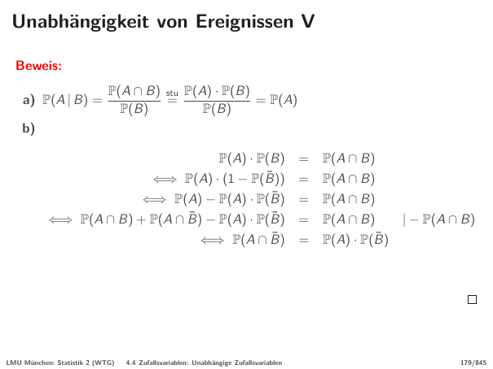

本页放在“模块二：随机变量其实是可测映射”中，核心是理解 事件（Ereignis）、独立性（Unabhängigkeit）。直觉上先抓住标题里的对象：事件（Ereignisse）。然后看它是定义、例子、定理还是证明；定义页要记条件，例子页要看随机机制，证明页要看用了哪些闭包性或极限定理。

关键词：

- 事件（Ereignis）
- 独立性（Unabhängigkeit）

本页需要抓住的德语线索：

- `P(A ∩ B) P(A) · P(B)`
- `a) P(A | B) = s = tu = P(A)`
- `P(B) P(B)`
- `P(A) · P(B) = P(A ∩ B)`
- `⇐⇒ P(A) · (1 − P(B¯ )) = P(A ∩ B)`

### Seite 156 - 集合系统（Mengensysteme）

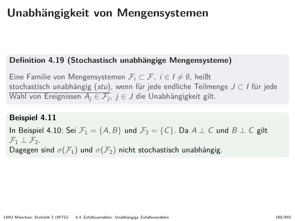

本页放在“模块二：随机变量其实是可测映射”中，核心是理解 事件（Ereignis）、集合（Menge）、集合系统（Mengensystem）、独立性（Unabhängigkeit）。直觉上先抓住标题里的对象：集合系统（Mengensysteme）。然后看它是定义、例子、定理还是证明；定义页要记条件，例子页要看随机机制，证明页要看用了哪些闭包性或极限定理。

关键词：

- 事件（Ereignis）
- 集合（Menge）
- 集合系统（Mengensystem）
- 独立性（Unabhängigkeit）

本页需要抓住的德语线索：

- `Definition 4.19 (Stochastisch unabhängige Mengensysteme)`
- `Eine Familie von Mengensystemen F ⊂ F, i ∈ I ̸= ∅, heißt`
- `stochastisch unabhängig (stu), wenn für jede endliche Teilmenge J ⊂ I für jede`
- `Wahl von Ereignissen A ∈ F , j ∈ J die Unabhängigkeit gilt.`
- `Beispiel 4.11`

### Seite 157 - 随机变量（Zufallsvariablen）

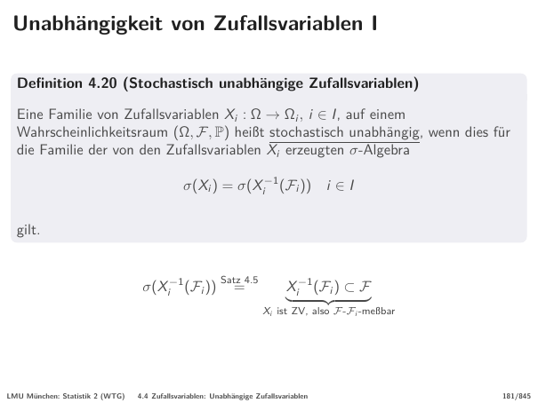

本页放在“模块二：随机变量其实是可测映射”中，核心是理解 概率（Wahrscheinlichkeit）、概率空间（Wahrscheinlichkeitsraum）、σ-代数（σ-Algebra）、随机变量（Zufallsvariable）。直觉上先抓住标题里的对象：随机变量（Zufallsvariablen）。然后看它是定义、例子、定理还是证明；定义页要记条件，例子页要看随机机制，证明页要看用了哪些闭包性或极限定理。

关键词：

- 概率（Wahrscheinlichkeit）
- 概率空间（Wahrscheinlichkeitsraum）
- σ-代数（σ-Algebra）
- 随机变量（Zufallsvariable）
- 独立性（Unabhängigkeit）

本页需要抓住的德语线索：

- `Definition 4.20 (Stochastisch unabhängige Zufallsvariablen)`
- `Eine Familie von Zufallsvariablen X : Ω → Ω , i ∈ I, auf einem`
- `σ(X ) = σ(X −1(F )) i ∈ I`
- `σ(X −1(F )) Sat = z 4.5 X −1(F ) ⊂ F`

### Seite 158 - 随机变量（Zufallsvariablen）

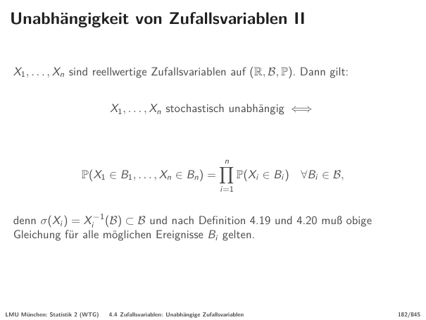

本页放在“模块二：随机变量其实是可测映射”中，核心是理解 随机变量（Zufallsvariable）、独立性（Unabhängigkeit）。直觉上先抓住标题里的对象：随机变量（Zufallsvariablen）。然后看它是定义、例子、定理还是证明；定义页要记条件，例子页要看随机机制，证明页要看用了哪些闭包性或极限定理。

关键词：

- 随机变量（Zufallsvariable）
- 独立性（Unabhängigkeit）

本页需要抓住的德语线索：

- `P(X ∈ B , . . . , X ∈ B ) = P(X ∈ B ) ∀B ∈ B,`
- `i=1`
- `denn σ(X ) = X −1(B) ⊂ B und nach Definition 4.19 und 4.20 muß obige`

### Seite 159 - 随机变量（Zufallsvariablen）

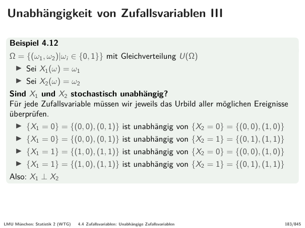

本页放在“模块二：随机变量其实是可测映射”中，核心是理解 事件（Ereignis）、随机变量（Zufallsvariable）、独立性（Unabhängigkeit）。直觉上先抓住标题里的对象：随机变量（Zufallsvariablen）。然后看它是定义、例子、定理还是证明；定义页要记条件，例子页要看随机机制，证明页要看用了哪些闭包性或极限定理。

关键词：

- 事件（Ereignis）
- 随机变量（Zufallsvariable）
- 独立性（Unabhängigkeit）

本页需要抓住的德语线索：

- `Beispiel 4.12`
- `Ω = {(ω , ω )|ω ∈ {0, 1}} mit Gleichverteilung U(Ω)`
- `Sei X (ω) = ω`
- `Sei X (ω) = ω`
- `{X = 0} = {(0, 0), (0, 1)} ist unabhängig von {X = 0} = {(0, 0), (1, 0)}`

### Seite 160 - 随机变量（Zufallsvariablen）

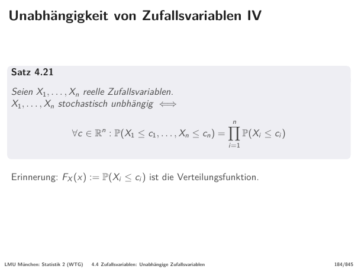

本页放在“模块二：随机变量其实是可测映射”中，核心是理解 随机变量（Zufallsvariable）、分布（Verteilung）、分布函数（Verteilungsfunktion）、独立性（Unabhängigkeit）。直觉上先抓住标题里的对象：随机变量（Zufallsvariablen）。然后看它是定义、例子、定理还是证明；定义页要记条件，例子页要看随机机制，证明页要看用了哪些闭包性或极限定理。

关键词：

- 随机变量（Zufallsvariable）
- 分布（Verteilung）
- 分布函数（Verteilungsfunktion）
- 独立性（Unabhängigkeit）

本页需要抓住的德语线索：

- `Satz 4.21`
- `∀c ∈ Rn : P(X ≤ c , . . . , X ≤ c ) = P(X ≤ c )`
- `i=1`
- `Erinnerung: F (x ) := P(X ≤ c ) ist die Verteilungsfunktion.`

### Seite 161 - 随机变量（Zufallsvariablen）

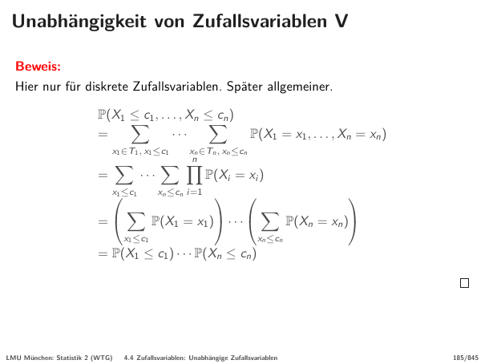

本页放在“模块二：随机变量其实是可测映射”中，核心是理解 随机变量（Zufallsvariable）、独立性（Unabhängigkeit）。直觉上先抓住标题里的对象：随机变量（Zufallsvariablen）。然后看它是定义、例子、定理还是证明；定义页要记条件，例子页要看随机机制，证明页要看用了哪些闭包性或极限定理。

关键词：

- 随机变量（Zufallsvariable）
- 独立性（Unabhängigkeit）

本页需要抓住的德语线索：

- `P(X ≤ c , . . . , X ≤ c )`
- `= · · · P(X = x , . . . , X = x )`
- `x1∈T1, x1≤c1 xn∈Tn, xn≤cn`
- `= · · · P(X = x )`
- `x1≤c1 xn≤cn i=1`

## 本章逻辑梳理

- **概率空间（Seite 1-56）：** 结果、事件、集合系统、σ-代数。
- **概率测度（Seite 57-114）：** 测度、公理、性质、Vitali 问题。
- **随机变量（Seite 115-161）：** 像、原像、可测映射、分布。

复习时不要按页码硬背。先确认本页属于哪个模块，再问它是在定义对象、说明性质、给例子、证明定理，还是提醒适用边界。

## 关键考核点

1. 会区分 Ergebnis、Ereignis、Grundraum、Mengensystem 和 σ-Algebra。
2. 会说明为什么连续空间不能直接用全部幂集当事件系统。
3. 会写出概率测度的三条核心性质。
4. 会解释随机变量的可测性为什么重要。

## 本章公式清单

### 集合与 σ-代数

| 序号 | 公式 | 使用场景 | 注意事项 |
| ---: | --- | --- | --- |
| 1 | $A\subseteq\Omega$ | 事件是样本空间的子集。 | 事件不是单个结果，而是一组结果。 |
| 2 | $\mathcal F\subseteq \mathcal P(\Omega)$ | 事件系统。 | 只对 $\mathcal F$ 中的集合定义概率。 |
| 3 | $\Omega\in\mathcal F,\ A\in\mathcal F\Rightarrow A^c\in\mathcal F,\ A_i\in\mathcal F\Rightarrow \bigcup_i A_i\in\mathcal F$ | σ-代数定义。 | 封闭性是为了稳定做事件运算。 |

### 概率测度

| 序号 | 公式 | 使用场景 | 注意事项 |
| ---: | --- | --- | --- |
| 4 | $P:(\Omega,\mathcal F)\to[0,1]$ | 概率测度。 | 严格说是 $P:\mathcal F\to[0,1]$。 |
| 5 | $P(\Omega)=1$ | 规范化。 | 全空间概率为 1。 |
| 6 | $P\left(\bigcup_i A_i\right)=\sum_iP(A_i)$ | 可列可加性。 | 要求 $A_i$ 两两不交。 |
| 7 | $P(A^c)=1-P(A)$ | 补事件概率。 | 由公理推出。 |

### 随机变量

| 序号 | 公式 | 使用场景 | 注意事项 |
| ---: | --- | --- | --- |
| 8 | $X:(\Omega,\mathcal F)\to(\mathbb R,\mathcal B)$ | 随机变量作为可测映射。 | 核心是原像可测。 |
| 9 | $X^{-1}(B)=\{\omega:X(\omega)\in B\}\in\mathcal F$ | 可测性条件。 | 保证 $P(X\in B)$ 有意义。 |
| 10 | $P_X(B)=P(X^{-1}(B))$ | 随机变量诱导的分布。 | 分布是像测度（Bildmaß）。 |

## 章节自测

- [x] σ-代数必须对补集和可列并封闭。
- [x] 随机变量的分布是由随机变量和原概率测度诱导出来的。
- [ ] 在连续空间中，通常可以无条件给所有子集赋概率。

## 德语词汇表

| 德语 | 中文 | 使用场景 |
| --- | --- | --- |
| Ergebnis | 结果 | 随机试验的单个可能输出 |
| Ereignis | 事件 | 结果的集合 |
| Potenzmenge | 幂集 | 所有子集的集合 |
| Mengensystem | 集合系统 | 可讨论事件的集合族 |
| σ-Algebra | σ-代数 | 可测事件系统 |
| Maß | 测度 | 给集合分配大小 |
| Vitali-Menge | Vitali 集 | 不可测集合警示 |
| Bildmaß | 像测度/诱导分布 | 随机变量推出分布 |

## C1 德语句式

| 序号 | 德语句式 | 中文翻译 | 适用场景 |
| ---: | --- | --- | --- |
| 1 | Eine σ-Algebra legt fest, welche Teilmengen des Grundraums als Ereignisse messbar sind. | σ-代数规定样本空间的哪些子集可以作为可测事件。 | 解释事件系统。 |
| 2 | Die Messbarkeit einer Zufallsvariablen garantiert, dass Aussagen der Form X in B wieder Ereignisse im ursprünglichen Wahrscheinlichkeitsraum sind. | 随机变量的可测性保证 $X\in B$ 这类陈述仍然是原概率空间中的事件。 | 解释可测性。 |
| 3 | Das Bildmaß überträgt ein Wahrscheinlichkeitsmaß vom Grundraum auf den Wertebereich der Zufallsvariablen. | 像测度把基础空间上的概率测度转移到随机变量的取值空间上。 | 解释分布。 |
