# 下学期第 03 章：一维分布及其性质

> 来源：`分章节讲义-下学期/03_Eindimensionale Verteilungen und ihre Eigenschaften.pdf`  
> 原讲义页码：S. 186-427  
> 图片目录：`assets/`  
> 核心主线：本部分围绕一维随机变量：用分布函数唯一描述分布，用 Lebesgue 积分定义期望，用密度、矩、分位数和生成函数刻画分布性质。

## 章节知识树

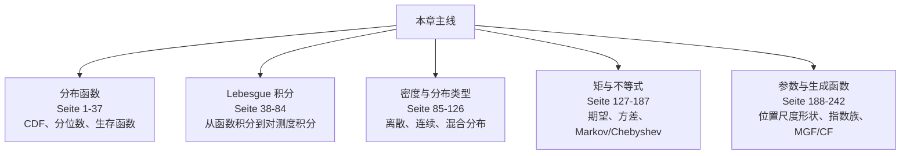
```mermaid
flowchart TD
  A["本章主线"]
  A --> M1["分布函数<br/>Seite 1-37<br/>CDF、分位数、生存函数"]
  A --> M2["Lebesgue 积分<br/>Seite 38-84<br/>从函数积分到对测度积分"]
  A --> M3["密度与分布类型<br/>Seite 85-126<br/>离散、连续、混合分布"]
  A --> M4["矩与不等式<br/>Seite 127-187<br/>期望、方差、Markov/Chebyshev"]
  A --> M5["参数与生成函数<br/>Seite 188-242<br/>位置尺度形状、指数族、MGF/CF"]
```

## 学习路径

本部分围绕一维随机变量：用分布函数唯一描述分布，用 Lebesgue 积分定义期望，用密度、矩、分位数和生成函数刻画分布性质。

1. **分布函数：** CDF、分位数、生存函数（Seite 1-37）。
2. **Lebesgue 积分：** 从函数积分到对测度积分（Seite 38-84）。
3. **密度与分布类型：** 离散、连续、混合分布（Seite 85-126）。
4. **矩与不等式：** 期望、方差、Markov/Chebyshev（Seite 127-187）。
5. **参数与生成函数：** 位置尺度形状、指数族、MGF/CF（Seite 188-242）。

## 模块地图

| 模块 | 页码 | 核心问题 |
| --- | --- | --- |
| 分布函数 | Seite 1-37 | CDF、分位数、生存函数 |
| Lebesgue 积分 | Seite 38-84 | 从函数积分到对测度积分 |
| 密度与分布类型 | Seite 85-126 | 离散、连续、混合分布 |
| 矩与不等式 | Seite 127-187 | 期望、方差、Markov/Chebyshev |
| 参数与生成函数 | Seite 188-242 | 位置尺度形状、指数族、MGF/CF |

## 考试优先级

1. 会用分布函数定义和计算概率区间。
2. 会解释 Lebesgue 积分相对 Riemann 积分的思想差异。
3. 会区分密度函数、概率质量函数和分布函数。
4. 会使用期望、方差、矩母函数、特征函数的定义和场景。

## 模块零：先用分布函数抓住一维分布（Seite 1-37）

一维分布最稳的入口是 $F(x)=P(X\le x)$。不管离散还是连续，分布函数都能描述累计概率；分位数、生存函数、反函数模拟都从这里长出来。

### Seite 1 - 分布（Verteilung）

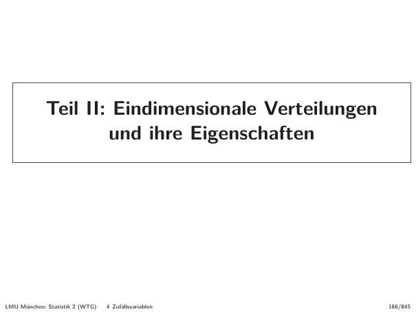

本页放在“模块零：先用分布函数抓住一维分布”中，核心是理解 分布（Verteilung）。直觉上先抓住标题里的对象：分布（Verteilung）。然后看它是定义、例子、定理还是证明；定义页要记条件，例子页要看随机机制，证明页要看用了哪些闭包性或极限定理。

关键词：

- 分布（Verteilung）

本页需要抓住的德语线索：

- `Teil II: Eindimensionale Verteilungen`
- `und ihre Eigenschaften`

### Seite 2 - 分布函数（Verteilungsfunktion）

本页放在“模块零：先用分布函数抓住一维分布”中，核心是理解 分布（Verteilung）、分布函数（Verteilungsfunktion）。直觉上先抓住标题里的对象：分布函数（Verteilungsfunktion）。然后看它是定义、例子、定理还是证明；定义页要记条件，例子页要看随机机制，证明页要看用了哪些闭包性或极限定理。

关键词：

- 分布（Verteilung）
- 分布函数（Verteilungsfunktion）

本页需要抓住的德语线索：

- `5.1 Definition und Beispiele`

### Seite 3 - Lernziele

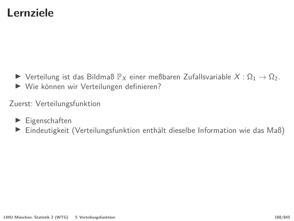

本页放在“模块零：先用分布函数抓住一维分布”中，核心是理解 测度（Maß）、随机变量（Zufallsvariable）、分布（Verteilung）、分布函数（Verteilungsfunktion）。直觉上先抓住标题里的对象：Lernziele。然后看它是定义、例子、定理还是证明；定义页要记条件，例子页要看随机机制，证明页要看用了哪些闭包性或极限定理。

关键词：

- 测度（Maß）
- 随机变量（Zufallsvariable）
- 分布（Verteilung）
- 分布函数（Verteilungsfunktion）

本页需要抓住的德语线索：

- `Verteilung ist das Bildmaß P einer meßbaren Zufallsvariable X : Ω → Ω .`

### Seite 4 - 分布函数（Verteilungsfunktion）

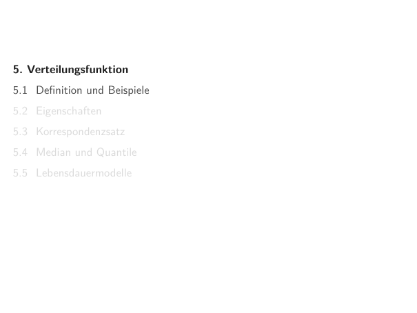

本页放在“模块零：先用分布函数抓住一维分布”中，核心是理解 分布（Verteilung）、分布函数（Verteilungsfunktion）。直觉上先抓住标题里的对象：分布函数（Verteilungsfunktion）。然后看它是定义、例子、定理还是证明；定义页要记条件，例子页要看随机机制，证明页要看用了哪些闭包性或极限定理。

关键词：

- 分布（Verteilung）
- 分布函数（Verteilungsfunktion）

本页需要抓住的德语线索：

- `5.1 Definition und Beispiele`

### Seite 5 - 分布函数（Verteilungsfunktion）

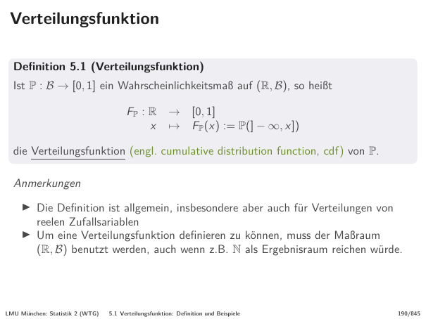

本页放在“模块零：先用分布函数抓住一维分布”中，核心是理解 概率（Wahrscheinlichkeit）、概率测度（Wahrscheinlichkeitsmaß）、结果（Ergebnis）、测度（Maß）。直觉上先抓住标题里的对象：分布函数（Verteilungsfunktion）。然后看它是定义、例子、定理还是证明；定义页要记条件，例子页要看随机机制，证明页要看用了哪些闭包性或极限定理。

关键词：

- 概率（Wahrscheinlichkeit）
- 概率测度（Wahrscheinlichkeitsmaß）
- 结果（Ergebnis）
- 测度（Maß）
- 分布（Verteilung）
- 分布函数（Verteilungsfunktion）
- 依概率（in Wahrscheinlichkeit）

本页需要抓住的德语线索：

- `Definition 5.1 (Verteilungsfunktion)`
- `Ist P : B → [0, 1] ein Wahrscheinlichkeitsmaß auf (R, B), so heißt`
- `FP : R → [0, 1]`
- `x 7→ FP(x ) := P(] − ∞, x ])`
- `Die Definition ist allgemein, insbesondere aber auch für Verteilungen von`

### Seite 6 - Beispiele I

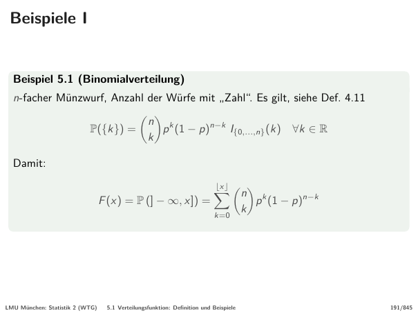

本页放在“模块零：先用分布函数抓住一维分布”中，核心是理解 二项分布（Binomialverteilung）。直觉上先抓住标题里的对象：Beispiele I。然后看它是定义、例子、定理还是证明；定义页要记条件，例子页要看随机机制，证明页要看用了哪些闭包性或极限定理。

关键词：

- 二项分布（Binomialverteilung）

本页需要抓住的德语线索：

- `Beispiele I`
- `Beispiel 5.1 (Binomialverteilung)`
- `n-facher Münzwurf, Anzahl der Würfe mit „Zahl“. Es gilt, siehe Def. 4.11`
- `P({k}) = pk (1 − p)n−k I (k) ∀k ∈ R`
- `F (x ) = P (] − ∞, x ]) = pk (1 − p)n−k`

### Seite 7 - Beispiele II

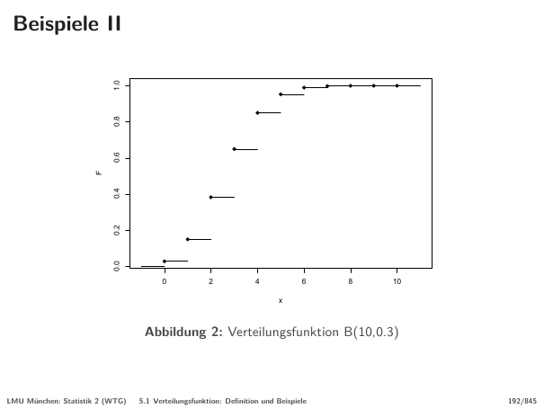

本页放在“模块零：先用分布函数抓住一维分布”中，核心是理解 分布（Verteilung）、分布函数（Verteilungsfunktion）。直觉上先抓住标题里的对象：Beispiele II。然后看它是定义、例子、定理还是证明；定义页要记条件，例子页要看随机机制，证明页要看用了哪些闭包性或极限定理。

关键词：

- 分布（Verteilung）
- 分布函数（Verteilungsfunktion）

本页需要抓住的德语线索：

- `Beispiele II`

### Seite 8 - Beispiele III

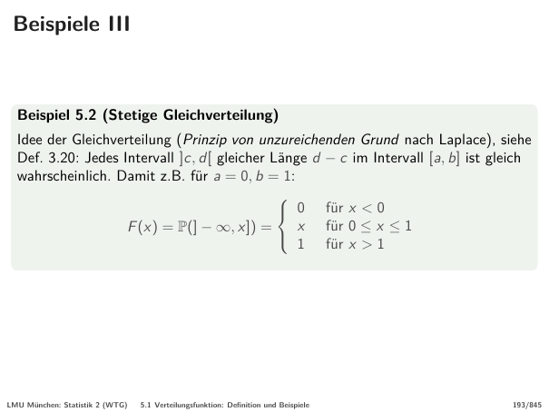

本页放在“模块零：先用分布函数抓住一维分布”中，主要作用是推进 Seite 1-37 这一段的概念链。先把标题“Beispiele III”和前后页联系起来，再区分它是在给定义、展示例子、证明性质，还是做章节过渡。

本页需要抓住的德语线索：

- `Beispiele III`
- `Beispiel 5.2 (Stetige Gleichverteilung)`
- `Idee der Gleichverteilung (Prinzip von unzureichenden Grund nach Laplace), siehe`
- `wahrscheinlich. Damit z.B. für a = 0, b = 1:`
- `F (x ) = P(] − ∞, x ]) = x für 0 ≤ x ≤ 1`

### Seite 9 - Beispiele IV

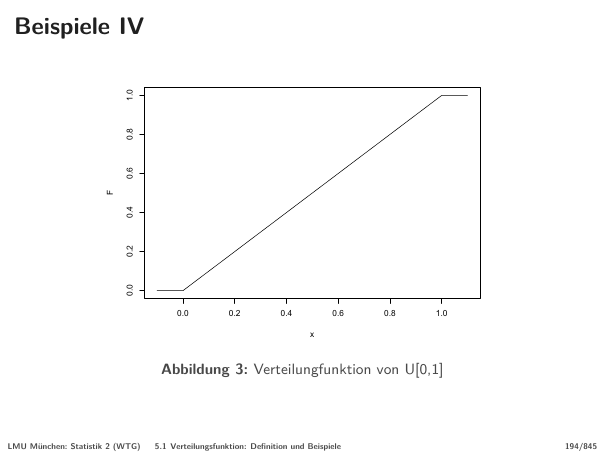

本页放在“模块零：先用分布函数抓住一维分布”中，核心是理解 分布（Verteilung）。直觉上先抓住标题里的对象：Beispiele IV。然后看它是定义、例子、定理还是证明；定义页要记条件，例子页要看随机机制，证明页要看用了哪些闭包性或极限定理。

关键词：

- 分布（Verteilung）

本页需要抓住的德语线索：

- `Beispiele IV`

### Seite 10 - Benfordsches Gesetz I

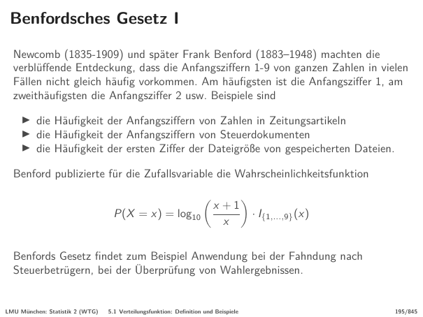

本页放在“模块零：先用分布函数抓住一维分布”中，核心是理解 概率（Wahrscheinlichkeit）、随机变量（Zufallsvariable）。直觉上先抓住标题里的对象：Benfordsches Gesetz I。然后看它是定义、例子、定理还是证明；定义页要记条件，例子页要看随机机制，证明页要看用了哪些闭包性或极限定理。

关键词：

- 概率（Wahrscheinlichkeit）
- 随机变量（Zufallsvariable）

本页需要抓住的德语线索：

- `zweithäufigsten die Anfangsziffer 2 usw. Beispiele sind`
- `P(X = x ) = log · I (x )`
- `Benfords Gesetz findet zum Beispiel Anwendung bei der Fahndung nach`

### Seite 11 - Benfordsches Gesetz II

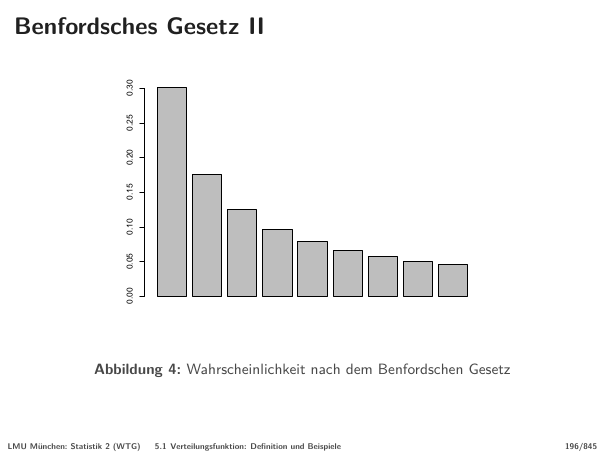

本页放在“模块零：先用分布函数抓住一维分布”中，核心是理解 概率（Wahrscheinlichkeit）。直觉上先抓住标题里的对象：Benfordsches Gesetz II。然后看它是定义、例子、定理还是证明；定义页要记条件，例子页要看随机机制，证明页要看用了哪些闭包性或极限定理。

关键词：

- 概率（Wahrscheinlichkeit）

本页需要抓住的德语线索：

- `Benfordsches Gesetz II`
- `03.0`
- `52.0`

### Seite 12 - Benfordsches Gesetz III

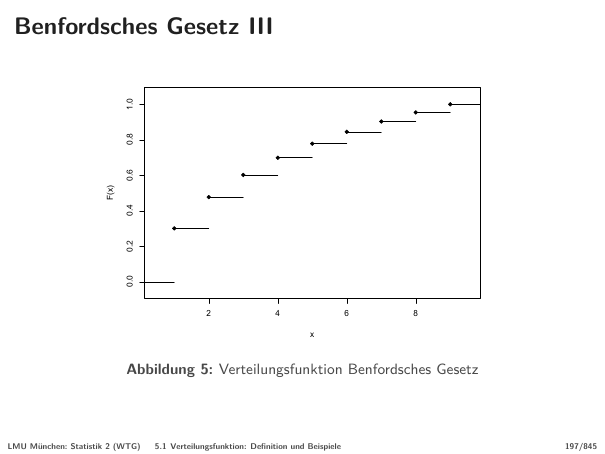

本页放在“模块零：先用分布函数抓住一维分布”中，核心是理解 分布（Verteilung）、分布函数（Verteilungsfunktion）。直觉上先抓住标题里的对象：Benfordsches Gesetz III。然后看它是定义、例子、定理还是证明；定义页要记条件，例子页要看随机机制，证明页要看用了哪些闭包性或极限定理。

关键词：

- 分布（Verteilung）
- 分布函数（Verteilungsfunktion）

本页需要抓住的德语线索：

- `Benfordsches Gesetz III`
- `2 4 6 8`
- `0.1`

### Seite 13 - 分布函数（Verteilungsfunktion）

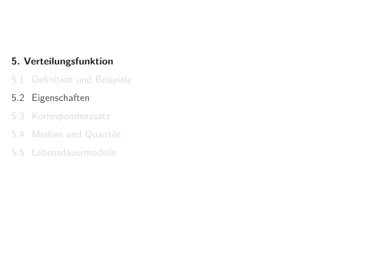

本页放在“模块零：先用分布函数抓住一维分布”中，核心是理解 分布（Verteilung）、分布函数（Verteilungsfunktion）。直觉上先抓住标题里的对象：分布函数（Verteilungsfunktion）。然后看它是定义、例子、定理还是证明；定义页要记条件，例子页要看随机机制，证明页要看用了哪些闭包性或极限定理。

关键词：

- 分布（Verteilung）
- 分布函数（Verteilungsfunktion）

本页需要抓住的德语线索：

- `5.1 Definition und Beispiele`

### Seite 14 - 分布函数（Verteilungsfunktion）

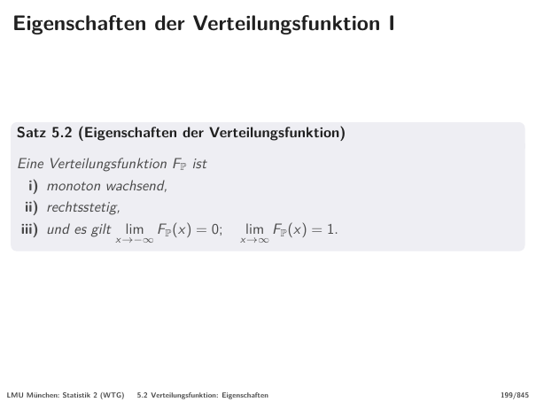

本页放在“模块零：先用分布函数抓住一维分布”中，核心是理解 分布（Verteilung）、分布函数（Verteilungsfunktion）。直觉上先抓住标题里的对象：分布函数（Verteilungsfunktion）。然后看它是定义、例子、定理还是证明；定义页要记条件，例子页要看随机机制，证明页要看用了哪些闭包性或极限定理。

关键词：

- 分布（Verteilung）
- 分布函数（Verteilungsfunktion）

本页需要抓住的德语线索：

- `Satz 5.2 (Eigenschaften der Verteilungsfunktion)`
- `iii) und es gilt lim FP(x ) = 0; lim FP(x ) = 1.`
- `x→−∞ x→∞`

### Seite 15 - 分布函数（Verteilungsfunktion）

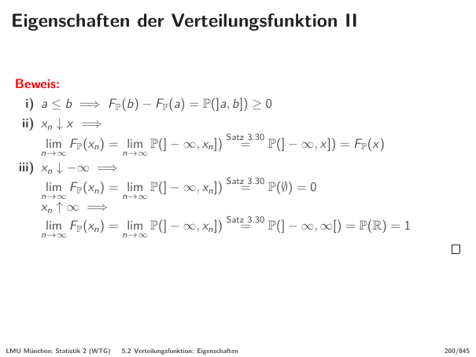

本页放在“模块零：先用分布函数抓住一维分布”中，核心是理解 分布（Verteilung）、分布函数（Verteilungsfunktion）。直觉上先抓住标题里的对象：分布函数（Verteilungsfunktion）。然后看它是定义、例子、定理还是证明；定义页要记条件，例子页要看随机机制，证明页要看用了哪些闭包性或极限定理。

关键词：

- 分布（Verteilung）
- 分布函数（Verteilungsfunktion）

本页需要抓住的德语线索：

- `i) a ≤ b =⇒ FP(b) − FP(a) = P(]a, b]) ≥ 0`
- `ii) x ↓ x =⇒`
- `) = lim P(] − ∞, x`
- `]) Satz = 3.30 P(] − ∞, x ]) = FP(x )`
- `n→∞ n→∞`

### Seite 16 - 分布函数（Verteilungsfunktion）

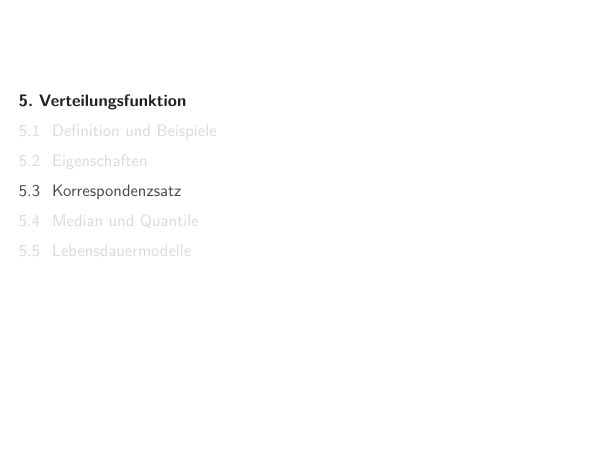

本页放在“模块零：先用分布函数抓住一维分布”中，核心是理解 分布（Verteilung）、分布函数（Verteilungsfunktion）。直觉上先抓住标题里的对象：分布函数（Verteilungsfunktion）。然后看它是定义、例子、定理还是证明；定义页要记条件，例子页要看随机机制，证明页要看用了哪些闭包性或极限定理。

关键词：

- 分布（Verteilung）
- 分布函数（Verteilungsfunktion）

本页需要抓住的德语线索：

- `5.1 Definition und Beispiele`

### Seite 17 - 分布函数（Verteilungsfunktion）

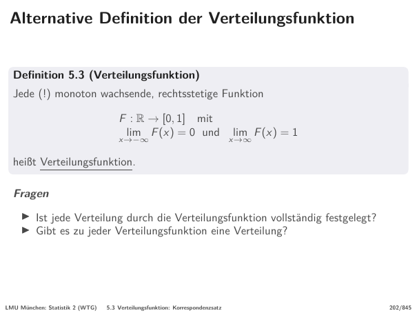

本页放在“模块零：先用分布函数抓住一维分布”中，核心是理解 分布（Verteilung）、分布函数（Verteilungsfunktion）。直觉上先抓住标题里的对象：分布函数（Verteilungsfunktion）。然后看它是定义、例子、定理还是证明；定义页要记条件，例子页要看随机机制，证明页要看用了哪些闭包性或极限定理。

关键词：

- 分布（Verteilung）
- 分布函数（Verteilungsfunktion）

本页需要抓住的德语线索：

- `Alternative Definition der Verteilungsfunktion`
- `Definition 5.3 (Verteilungsfunktion)`
- `F : R → [0, 1] mit`
- `lim F (x ) = 0 und lim F (x ) = 1`
- `x→−∞ x→∞`

### Seite 18 - Korrespondenzsatz I

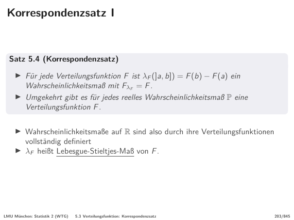

本页放在“模块零：先用分布函数抓住一维分布”中，核心是理解 概率（Wahrscheinlichkeit）、概率测度（Wahrscheinlichkeitsmaß）、测度（Maß）、分布（Verteilung）。直觉上先抓住标题里的对象：Korrespondenzsatz I。然后看它是定义、例子、定理还是证明；定义页要记条件，例子页要看随机机制，证明页要看用了哪些闭包性或极限定理。

关键词：

- 概率（Wahrscheinlichkeit）
- 概率测度（Wahrscheinlichkeitsmaß）
- 测度（Maß）
- 分布（Verteilung）
- 分布函数（Verteilungsfunktion）

本页需要抓住的德语线索：

- `Satz 5.4 (Korrespondenzsatz)`
- `Für jede Verteilungsfunktion F ist λ (]a, b]) = F (b) − F (a) ein`
- `Wahrscheinlichkeitsmaß mit F = F .`

### Seite 19 - Korrespondenzsatz II

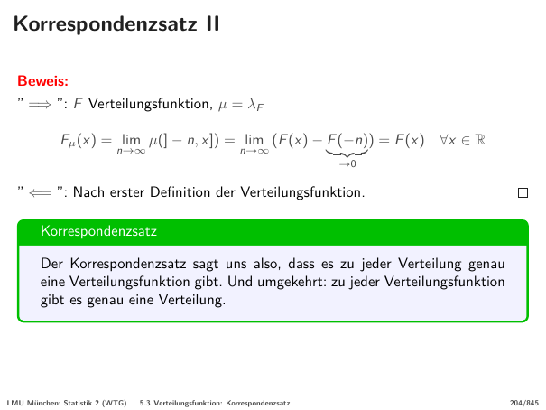

本页放在“模块零：先用分布函数抓住一维分布”中，核心是理解 分布（Verteilung）、分布函数（Verteilungsfunktion）。直觉上先抓住标题里的对象：Korrespondenzsatz II。然后看它是定义、例子、定理还是证明；定义页要记条件，例子页要看随机机制，证明页要看用了哪些闭包性或极限定理。

关键词：

- 分布（Verteilung）
- 分布函数（Verteilungsfunktion）

本页需要抓住的德语线索：

- `” =⇒ ”: F Verteilungsfunktion, µ = λ`
- `F (x ) = lim µ(] − n, x ]) = lim (F (x ) − F (−n)) = F (x ) ∀x ∈ R`
- `n→∞ n→∞ | {z }`
- `→0`
- `” ⇐= ”: Nach erster Definition der Verteilungsfunktion.`

### Seite 20 - 分布函数（Verteilungsfunktion）

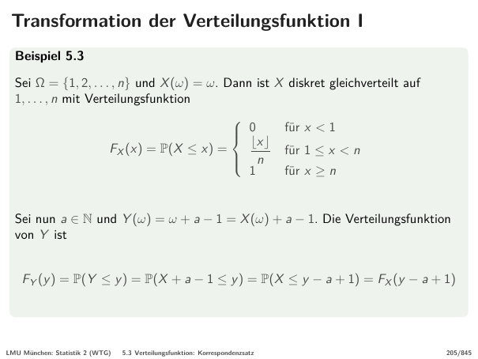

本页放在“模块零：先用分布函数抓住一维分布”中，核心是理解 分布（Verteilung）、分布函数（Verteilungsfunktion）。直觉上先抓住标题里的对象：分布函数（Verteilungsfunktion）。然后看它是定义、例子、定理还是证明；定义页要记条件，例子页要看随机机制，证明页要看用了哪些闭包性或极限定理。

关键词：

- 分布（Verteilung）
- 分布函数（Verteilungsfunktion）

本页需要抓住的德语线索：

- `Beispiel 5.3`
- `Sei Ω = {1, 2, . . . , n} und X (ω) = ω. Dann ist X diskret gleichverteilt auf`
- `F X (x ) = P(X ≤ x ) = für 1 ≤ x < n`
- `für x ≥ n`
- `Sei nun a ∈ N und Y (ω) = ω + a − 1 = X (ω) + a − 1. Die Verteilungsfunktion`

### Seite 21 - 分布函数（Verteilungsfunktion）

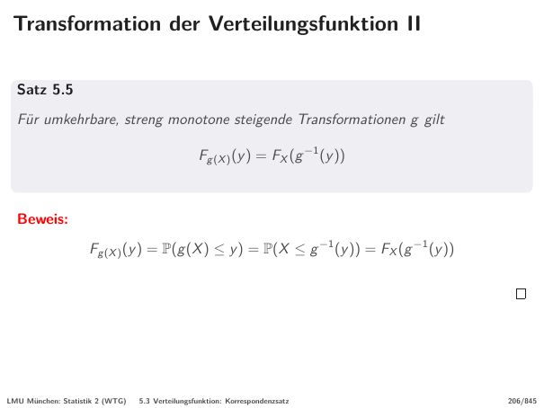

本页放在“模块零：先用分布函数抓住一维分布”中，核心是理解 分布（Verteilung）、分布函数（Verteilungsfunktion）。直觉上先抓住标题里的对象：分布函数（Verteilungsfunktion）。然后看它是定义、例子、定理还是证明；定义页要记条件，例子页要看随机机制，证明页要看用了哪些闭包性或极限定理。

关键词：

- 分布（Verteilung）
- 分布函数（Verteilungsfunktion）

本页需要抓住的德语线索：

- `Satz 5.5`
- `F (y ) = F (g−1(y ))`
- `F (y ) = P(g(X ) ≤ y ) = P(X ≤ g−1(y )) = F (g−1(y ))`

### Seite 22 - 分布函数（Verteilungsfunktion）

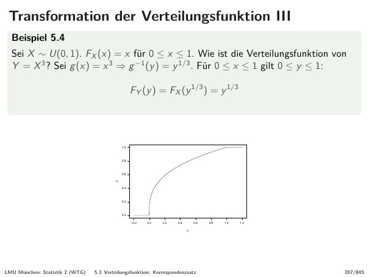

本页放在“模块零：先用分布函数抓住一维分布”中，核心是理解 分布（Verteilung）、分布函数（Verteilungsfunktion）。直觉上先抓住标题里的对象：分布函数（Verteilungsfunktion）。然后看它是定义、例子、定理还是证明；定义页要记条件，例子页要看随机机制，证明页要看用了哪些闭包性或极限定理。

关键词：

- 分布（Verteilung）
- 分布函数（Verteilungsfunktion）

本页需要抓住的德语线索：

- `Beispiel 5.4`
- `Sei X ∼ U(0, 1). F (x ) = x für 0 ≤ x ≤ 1. Wie ist die Verteilungsfunktion von`
- `Y = X 3? Sei g(x ) = x 3 ⇒ g−1(y ) = y 1/3. Für 0 ≤ x ≤ 1 gilt 0 ≤ y ≤ 1:`
- `F (y ) = F (y 1/3) = y 1/3`

### Seite 23 - 分布函数（Verteilungsfunktion）

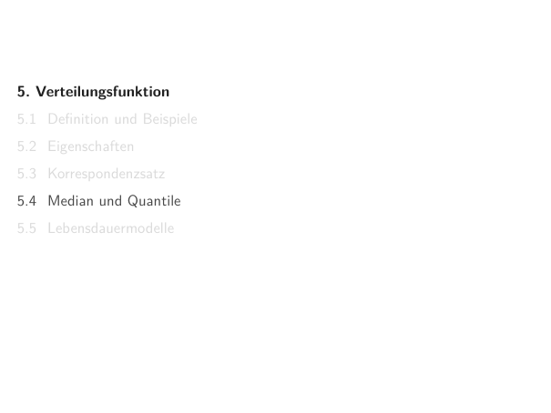

本页放在“模块零：先用分布函数抓住一维分布”中，核心是理解 分布（Verteilung）、分布函数（Verteilungsfunktion）。直觉上先抓住标题里的对象：分布函数（Verteilungsfunktion）。然后看它是定义、例子、定理还是证明；定义页要记条件，例子页要看随机机制，证明页要看用了哪些闭包性或极限定理。

关键词：

- 分布（Verteilung）
- 分布函数（Verteilungsfunktion）

本页需要抓住的德语线索：

- `5.1 Definition und Beispiele`

### Seite 24 - 中位数（Median）

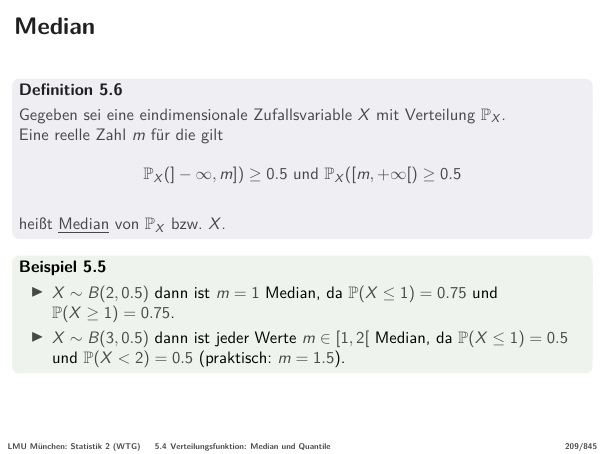

本页放在“模块零：先用分布函数抓住一维分布”中，核心是理解 随机变量（Zufallsvariable）、分布（Verteilung）。直觉上先抓住标题里的对象：中位数（Median）。然后看它是定义、例子、定理还是证明；定义页要记条件，例子页要看随机机制，证明页要看用了哪些闭包性或极限定理。

关键词：

- 随机变量（Zufallsvariable）
- 分布（Verteilung）

本页需要抓住的德语线索：

- `Definition 5.6`
- `P (] − ∞, m]) ≥ 0.5 und P ([m, +∞[) ≥ 0.5`
- `Beispiel 5.5`
- `X ∼ B(2, 0.5) dann ist m = 1 Median, da P(X ≤ 1) = 0.75 und`
- `P(X ≥ 1) = 0.75.`

### Seite 25 - 分位数（Quantile）

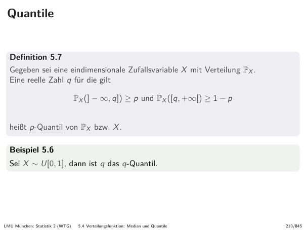

本页放在“模块零：先用分布函数抓住一维分布”中，核心是理解 随机变量（Zufallsvariable）、分布（Verteilung）。直觉上先抓住标题里的对象：分位数（Quantile）。然后看它是定义、例子、定理还是证明；定义页要记条件，例子页要看随机机制，证明页要看用了哪些闭包性或极限定理。

关键词：

- 随机变量（Zufallsvariable）
- 分布（Verteilung）

本页需要抓住的德语线索：

- `Definition 5.7`
- `P (] − ∞, q]) ≥ p und P ([q, +∞[) ≥ 1 − p`
- `Beispiel 5.6`

### Seite 26 - Quantilsfunktion I

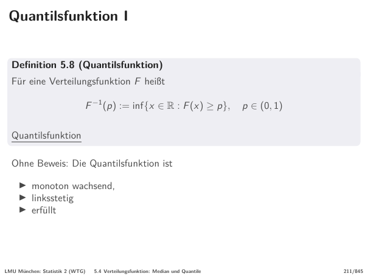

本页放在“模块零：先用分布函数抓住一维分布”中，核心是理解 分布（Verteilung）、分布函数（Verteilungsfunktion）。直觉上先抓住标题里的对象：Quantilsfunktion I。然后看它是定义、例子、定理还是证明；定义页要记条件，例子页要看随机机制，证明页要看用了哪些闭包性或极限定理。

关键词：

- 分布（Verteilung）
- 分布函数（Verteilungsfunktion）

本页需要抓住的德语线索：

- `Definition 5.8 (Quantilsfunktion)`
- `F −1(p) := inf{x ∈ R : F (x ) ≥ p}, p ∈ (0, 1)`

### Seite 27 - Quantilsfunktion II

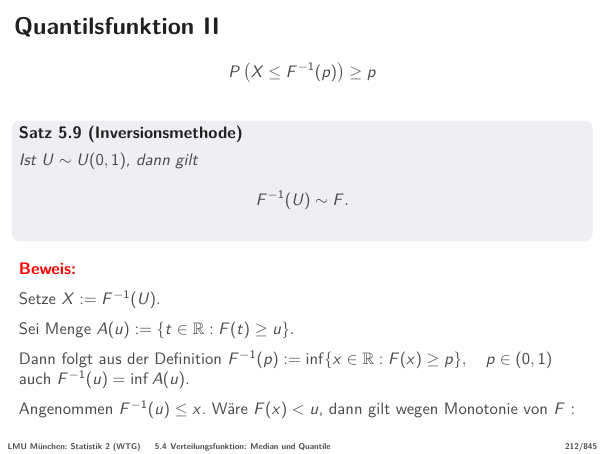

本页放在“模块零：先用分布函数抓住一维分布”中，核心是理解 集合（Menge）。直觉上先抓住标题里的对象：Quantilsfunktion II。然后看它是定义、例子、定理还是证明；定义页要记条件，例子页要看随机机制，证明页要看用了哪些闭包性或极限定理。

关键词：

- 集合（Menge）

本页需要抓住的德语线索：

- `P (cid:0) X ≤ F −1(p) (cid:1) ≥ p`
- `Satz 5.9 (Inversionsmethode)`
- `Setze X := F −1(U).`
- `Sei Menge A(u) := {t ∈ R : F (t) ≥ u}.`
- `Dann folgt aus der Definition F −1(p) := inf{x ∈ R : F (x ) ≥ p}, p ∈ (0, 1)`

### Seite 28 - Quantilsfunktion III

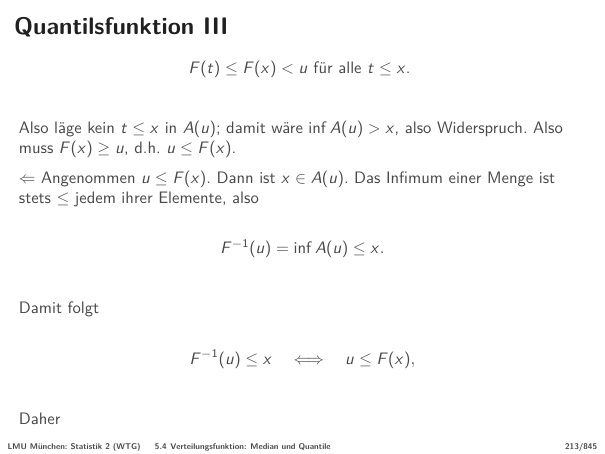

本页放在“模块零：先用分布函数抓住一维分布”中，核心是理解 集合（Menge）。直觉上先抓住标题里的对象：Quantilsfunktion III。然后看它是定义、例子、定理还是证明；定义页要记条件，例子页要看随机机制，证明页要看用了哪些闭包性或极限定理。

关键词：

- 集合（Menge）

本页需要抓住的德语线索：

- `F (t) ≤ F (x ) < u für alle t ≤ x .`
- `Also läge kein t ≤ x in A(u); damit wäre inf A(u) > x , also Widerspruch. Also`
- `muss F (x ) ≥ u, d.h. u ≤ F (x ).`
- `⇐ Angenommen u ≤ F (x ). Dann ist x ∈ A(u). Das Infimum einer Menge ist`
- `stets ≤ jedem ihrer Elemente, also`

### Seite 29 - Quantilsfunktion IV

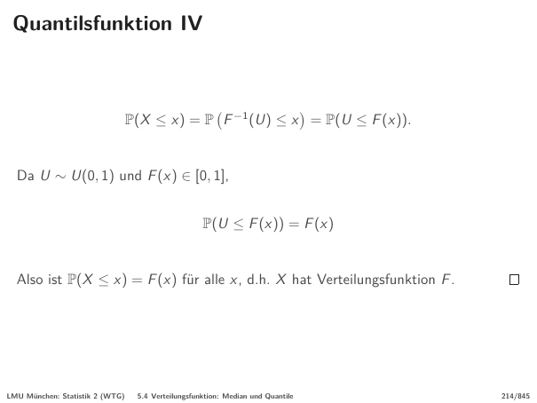

本页放在“模块零：先用分布函数抓住一维分布”中，核心是理解 分布（Verteilung）、分布函数（Verteilungsfunktion）。直觉上先抓住标题里的对象：Quantilsfunktion IV。然后看它是定义、例子、定理还是证明；定义页要记条件，例子页要看随机机制，证明页要看用了哪些闭包性或极限定理。

关键词：

- 分布（Verteilung）
- 分布函数（Verteilungsfunktion）

本页需要抓住的德语线索：

- `P(X ≤ x ) = P (cid:0) F −1(U) ≤ x (cid:1) = P(U ≤ F (x )).`
- `Da U ∼ U(0, 1) und F (x ) ∈ [0, 1],`
- `P(U ≤ F (x )) = F (x )`
- `Also ist P(X ≤ x ) = F (x ) für alle x , d.h. X hat Verteilungsfunktion F .`

### Seite 30 - 分布函数（Verteilungsfunktion）

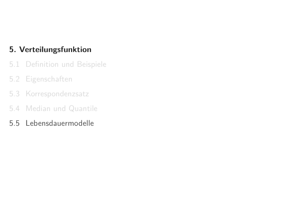

本页放在“模块零：先用分布函数抓住一维分布”中，核心是理解 分布（Verteilung）、分布函数（Verteilungsfunktion）。直觉上先抓住标题里的对象：分布函数（Verteilungsfunktion）。然后看它是定义、例子、定理还是证明；定义页要记条件，例子页要看随机机制，证明页要看用了哪些闭包性或极限定理。

关键词：

- 分布（Verteilung）
- 分布函数（Verteilungsfunktion）

本页需要抓住的德语线索：

- `5.1 Definition und Beispiele`

### Seite 31 - 指数分布（Exponentialverteilung）

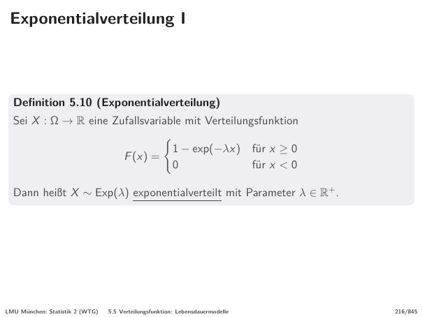

本页放在“模块零：先用分布函数抓住一维分布”中，核心是理解 随机变量（Zufallsvariable）、分布（Verteilung）、分布函数（Verteilungsfunktion）、指数分布（Exponentialverteilung）。直觉上先抓住标题里的对象：指数分布（Exponentialverteilung）。然后看它是定义、例子、定理还是证明；定义页要记条件，例子页要看随机机制，证明页要看用了哪些闭包性或极限定理。

关键词：

- 随机变量（Zufallsvariable）
- 分布（Verteilung）
- 分布函数（Verteilungsfunktion）
- 指数分布（Exponentialverteilung）

本页需要抓住的德语线索：

- `Definition 5.10 (Exponentialverteilung)`
- `Sei X : Ω → R eine Zufallsvariable mit Verteilungsfunktion`
- `1 − exp(−λx ) für x ≥ 0`
- `F (x ) =`
- `Dann heißt X ∼ Exp(λ) exponentialverteilt mit Parameter λ ∈ R+.`

### Seite 32 - 指数分布（Exponentialverteilung）

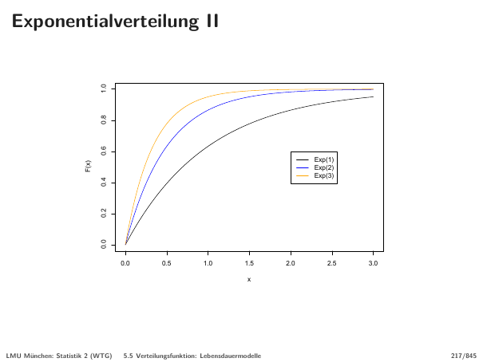

本页放在“模块零：先用分布函数抓住一维分布”中，核心是理解 指数分布（Exponentialverteilung）。直觉上先抓住标题里的对象：指数分布（Exponentialverteilung）。然后看它是定义、例子、定理还是证明；定义页要记条件，例子页要看随机机制，证明页要看用了哪些闭包性或极限定理。

关键词：

- 指数分布（Exponentialverteilung）

本页需要抓住的德语线索：

- `Exponentialverteilung II`
- `0.0 0.5 1.0 1.5 2.0 2.5 3.0`
- `0.1`

### Seite 33 - 指数分布（Exponentialverteilung）

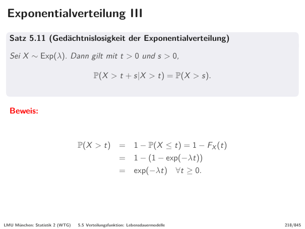

本页放在“模块零：先用分布函数抓住一维分布”中，核心是理解 指数分布（Exponentialverteilung）。直觉上先抓住标题里的对象：指数分布（Exponentialverteilung）。然后看它是定义、例子、定理还是证明；定义页要记条件，例子页要看随机机制，证明页要看用了哪些闭包性或极限定理。

关键词：

- 指数分布（Exponentialverteilung）

本页需要抓住的德语线索：

- `Satz 5.11 (Gedächtnislosigkeit der Exponentialverteilung)`
- `P(X > t + s|X > t) = P(X > s).`
- `P(X > t) = 1 − P(X ≤ t) = 1 − F (t)`
- `= 1 − (1 − exp(−λt))`
- `= exp(−λt) ∀t ≥ 0.`

### Seite 34 - 指数分布（Exponentialverteilung）

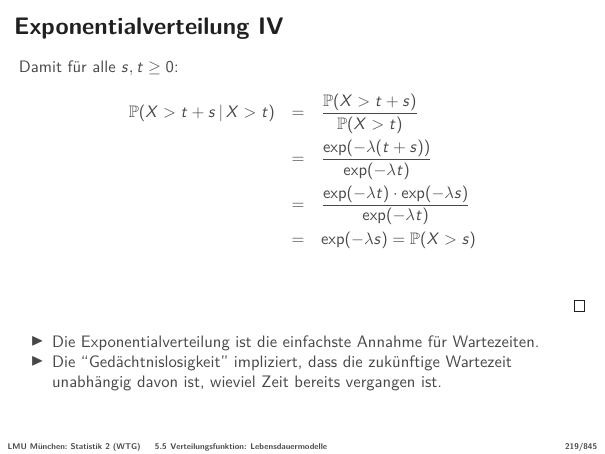

本页放在“模块零：先用分布函数抓住一维分布”中，核心是理解 指数分布（Exponentialverteilung）。直觉上先抓住标题里的对象：指数分布（Exponentialverteilung）。然后看它是定义、例子、定理还是证明；定义页要记条件，例子页要看随机机制，证明页要看用了哪些闭包性或极限定理。

关键词：

- 指数分布（Exponentialverteilung）

本页需要抓住的德语线索：

- `Damit für alle s, t ≥ 0:`
- `P(X > t + s)`
- `P(X > t + s | X > t) =`
- `P(X > t)`
- `=`

### Seite 35 - Lebensdauern I

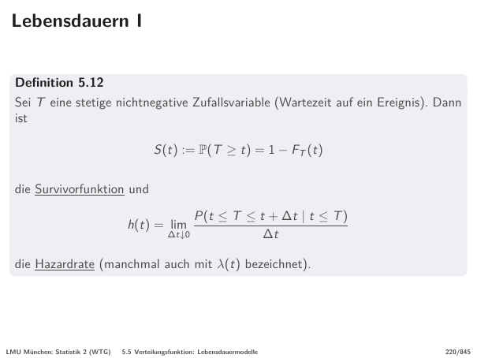

本页放在“模块零：先用分布函数抓住一维分布”中，核心是理解 事件（Ereignis）、随机变量（Zufallsvariable）。直觉上先抓住标题里的对象：Lebensdauern I。然后看它是定义、例子、定理还是证明；定义页要记条件，例子页要看随机机制，证明页要看用了哪些闭包性或极限定理。

关键词：

- 事件（Ereignis）
- 随机变量（Zufallsvariable）

本页需要抓住的德语线索：

- `Definition 5.12`
- `S(t) := P(T ≥ t) = 1 − F (t)`
- `P(t ≤ T ≤ t + ∆t | t ≤ T )`
- `h(t) = lim`

### Seite 36 - Lebensdauern II

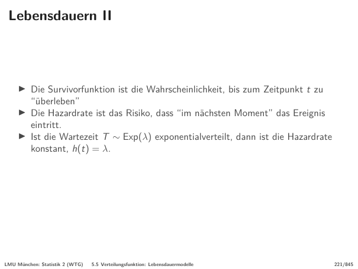

本页放在“模块零：先用分布函数抓住一维分布”中，核心是理解 概率（Wahrscheinlichkeit）、事件（Ereignis）。直觉上先抓住标题里的对象：Lebensdauern II。然后看它是定义、例子、定理还是证明；定义页要记条件，例子页要看随机机制，证明页要看用了哪些闭包性或极限定理。

关键词：

- 概率（Wahrscheinlichkeit）
- 事件（Ereignis）

本页需要抓住的德语线索：

- `konstant, h(t) = λ.`

### Seite 37 - Lebensdauern III

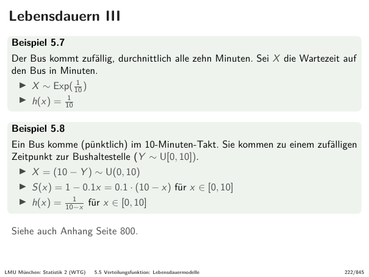

本页放在“模块零：先用分布函数抓住一维分布”中，主要作用是推进 Seite 1-37 这一段的概念链。先把标题“Lebensdauern III”和前后页联系起来，再区分它是在给定义、展示例子、证明性质，还是做章节过渡。

本页需要抓住的德语线索：

- `Beispiel 5.7`
- `h(x ) = 1`
- `Beispiel 5.8`
- `X = (10 − Y ) ∼ U(0, 10)`
- `S(x ) = 1 − 0.1x = 0.1 · (10 − x ) für x ∈ [0, 10]`

## 模块一：Lebesgue 积分让期望可统一定义（Seite 38-84）

Riemann 积分按横轴切，Lebesgue 积分按函数值切。这个抽象是为了在概率论中统一处理离散、连续和更一般的随机变量期望。

### Seite 38 - Lebesgue 积分（Lebesgue-Integral）

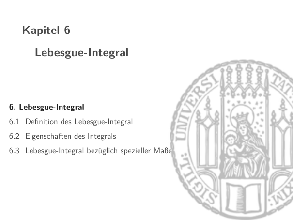

本页可识别的嵌入图片裁切：

本页放在“模块一：Lebesgue 积分让期望可统一定义”中，核心是理解 测度（Maß）、Lebesgue 积分（Lebesgue-Integral）。直觉上先抓住标题里的对象：Lebesgue 积分（Lebesgue-Integral）。然后看它是定义、例子、定理还是证明；定义页要记条件，例子页要看随机机制，证明页要看用了哪些闭包性或极限定理。

关键词：

- 测度（Maß）
- Lebesgue 积分（Lebesgue-Integral）

本页需要抓住的德语线索：

- `6.1 Definition des Lebesgue-Integral`

### Seite 39 - Lebesgue 积分（Lebesgue-Integral）

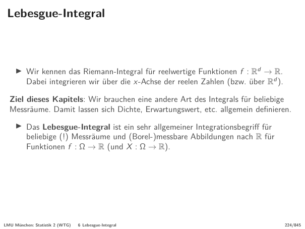

本页放在“模块一：Lebesgue 积分让期望可统一定义”中，核心是理解 可测（messbar）、密度（Dichte）、Lebesgue 积分（Lebesgue-Integral）、期望（Erwartungswert）。直觉上先抓住标题里的对象：Lebesgue 积分（Lebesgue-Integral）。然后看它是定义、例子、定理还是证明；定义页要记条件，例子页要看随机机制，证明页要看用了哪些闭包性或极限定理。

关键词：

- 可测（messbar）
- 密度（Dichte）
- Lebesgue 积分（Lebesgue-Integral）
- 期望（Erwartungswert）

本页需要抓住的德语线索：

- `Wir kennen das Riemann-Integral für reelwertige Funktionen f : Rd → R.`
- `Ziel dieses Kapitels: Wir brauchen eine andere Art des Integrals für beliebige`
- `Funktionen f : Ω → R (und X : Ω → R).`

### Seite 40 - Wiederholung: Idee des Riemann-Integrals I

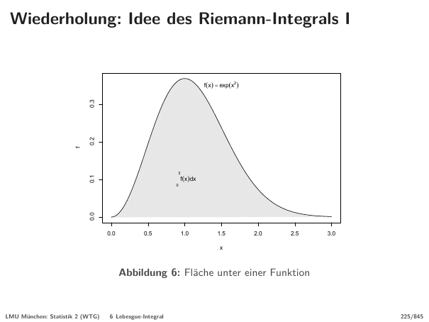

本页放在“模块一：Lebesgue 积分让期望可统一定义”中，主要作用是推进 Seite 38-84 这一段的概念链。先把标题“Wiederholung: Idee des Riemann-Integrals I”和前后页联系起来，再区分它是在给定义、展示例子、证明性质，还是做章节过渡。

本页需要抓住的德语线索：

- `Wiederholung: Idee des Riemann-Integrals I`
- `f(x) = exp(x2)`

### Seite 41 - Wiederholung: Idee des Riemann-Integrals II

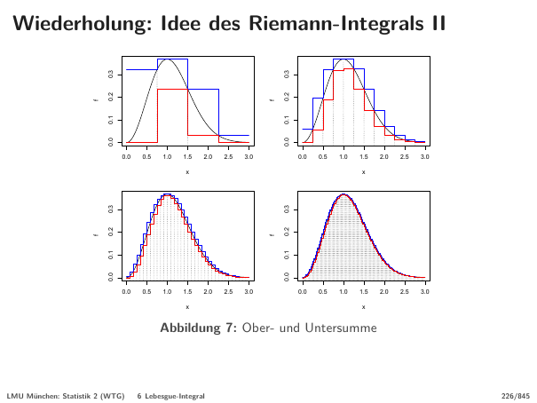

本页放在“模块一：Lebesgue 积分让期望可统一定义”中，主要作用是推进 Seite 38-84 这一段的概念链。先把标题“Wiederholung: Idee des Riemann-Integrals II”和前后页联系起来，再区分它是在给定义、展示例子、证明性质，还是做章节过渡。

本页需要抓住的德语线索：

- `Wiederholung: Idee des Riemann-Integrals II`

### Seite 42 - Wiederholung: Idee des Riemann-Integrals III

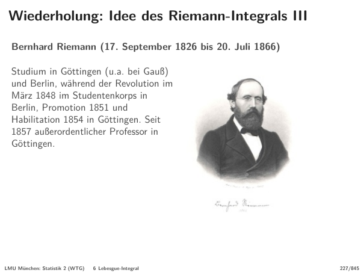

本页可识别的嵌入图片裁切：

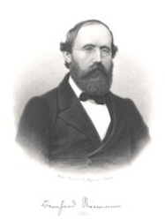

本页放在“模块一：Lebesgue 积分让期望可统一定义”中，主要作用是推进 Seite 38-84 这一段的概念链。先把标题“Wiederholung: Idee des Riemann-Integrals III”和前后页联系起来，再区分它是在给定义、展示例子、证明性质，还是做章节过渡。

本页需要抓住的德语线索：

- `Wiederholung: Idee des Riemann-Integrals III`

### Seite 43 - Lebesgue 积分（Lebesgue-Integral）

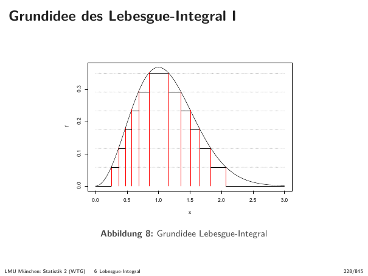

本页放在“模块一：Lebesgue 积分让期望可统一定义”中，核心是理解 Lebesgue 积分（Lebesgue-Integral）。直觉上先抓住标题里的对象：Lebesgue 积分（Lebesgue-Integral）。然后看它是定义、例子、定理还是证明；定义页要记条件，例子页要看随机机制，证明页要看用了哪些闭包性或极限定理。

关键词：

- Lebesgue 积分（Lebesgue-Integral）

本页需要抓住的德语线索：

- `Grundidee des Lebesgue-Integral I`
- `0.0 0.5 1.0 1.5 2.0 2.5 3.0`
- `3.0`

### Seite 44 - Lebesgue 积分（Lebesgue-Integral）

本页放在“模块一：Lebesgue 积分让期望可统一定义”中，核心是理解 Lebesgue 积分（Lebesgue-Integral）。直觉上先抓住标题里的对象：Lebesgue 积分（Lebesgue-Integral）。然后看它是定义、例子、定理还是证明；定义页要记条件，例子页要看随机机制，证明页要看用了哪些闭包性或极限定理。

关键词：

- Lebesgue 积分（Lebesgue-Integral）

本页需要抓住的德语线索：

- `Grundidee des Lebesgue-Integral II`
- `Henri Léon Lebesgue (28. Juni 1875 bis 26. Juli 1941)`
- `1899–1902 Gymnasiallehrer in Nancy,`

### Seite 45 - Lebesgue 积分（Lebesgue-Integral）

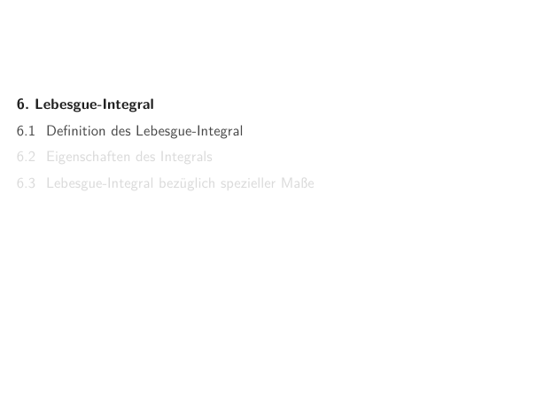

本页放在“模块一：Lebesgue 积分让期望可统一定义”中，核心是理解 测度（Maß）、Lebesgue 积分（Lebesgue-Integral）。直觉上先抓住标题里的对象：Lebesgue 积分（Lebesgue-Integral）。然后看它是定义、例子、定理还是证明；定义页要记条件，例子页要看随机机制，证明页要看用了哪些闭包性或极限定理。

关键词：

- 测度（Maß）
- Lebesgue 积分（Lebesgue-Integral）

本页需要抓住的德语线索：

- `6.1 Definition des Lebesgue-Integral`

### Seite 46 - Lebesgue 积分（Lebesgue-Integral）

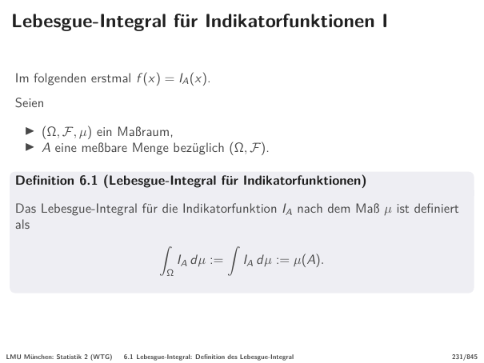

本页放在“模块一：Lebesgue 积分让期望可统一定义”中，核心是理解 集合（Menge）、测度（Maß）、Lebesgue 积分（Lebesgue-Integral）。直觉上先抓住标题里的对象：Lebesgue 积分（Lebesgue-Integral）。然后看它是定义、例子、定理还是证明；定义页要记条件，例子页要看随机机制，证明页要看用了哪些闭包性或极限定理。

关键词：

- 集合（Menge）
- 测度（Maß）
- Lebesgue 积分（Lebesgue-Integral）

本页需要抓住的德语线索：

- `Im folgenden erstmal f (x ) = I (x ).`
- `Definition 6.1 (Lebesgue-Integral für Indikatorfunktionen)`
- `I dµ := I dµ := µ(A).`

### Seite 47 - Lebesgue 积分（Lebesgue-Integral）

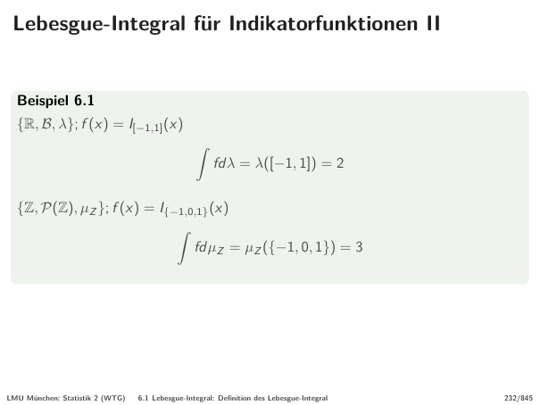

本页放在“模块一：Lebesgue 积分让期望可统一定义”中，核心是理解 Lebesgue 积分（Lebesgue-Integral）。直觉上先抓住标题里的对象：Lebesgue 积分（Lebesgue-Integral）。然后看它是定义、例子、定理还是证明；定义页要记条件，例子页要看随机机制，证明页要看用了哪些闭包性或极限定理。

关键词：

- Lebesgue 积分（Lebesgue-Integral）

本页需要抓住的德语线索：

- `Beispiel 6.1`
- `{R, B, λ}; f (x ) = I (x )`
- `fdλ = λ([−1, 1]) = 2`
- `{Z, P(Z), µ }; f (x ) = I (x )`
- `fdµ = µ ({−1, 0, 1}) = 3`

### Seite 48 - Lebesgue 积分（Lebesgue-Integral）

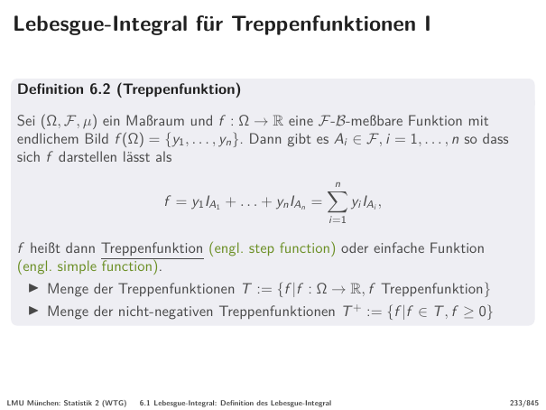

本页放在“模块一：Lebesgue 积分让期望可统一定义”中，核心是理解 测度（Maß）、Lebesgue 积分（Lebesgue-Integral）。直觉上先抓住标题里的对象：Lebesgue 积分（Lebesgue-Integral）。然后看它是定义、例子、定理还是证明；定义页要记条件，例子页要看随机机制，证明页要看用了哪些闭包性或极限定理。

关键词：

- 测度（Maß）
- Lebesgue 积分（Lebesgue-Integral）

本页需要抓住的德语线索：

- `Definition 6.2 (Treppenfunktion)`
- `Sei (Ω, F, µ) ein Maßraum und f : Ω → R eine F-B-meßbare Funktion mit`
- `endlichem Bild f (Ω) = {y , . . . , y }. Dann gibt es A ∈ F, i = 1, . . . , n so dass`
- `f = y I + . . . + y I = y I ,`
- `i=1`

### Seite 49 - Lebesgue 积分（Lebesgue-Integral）

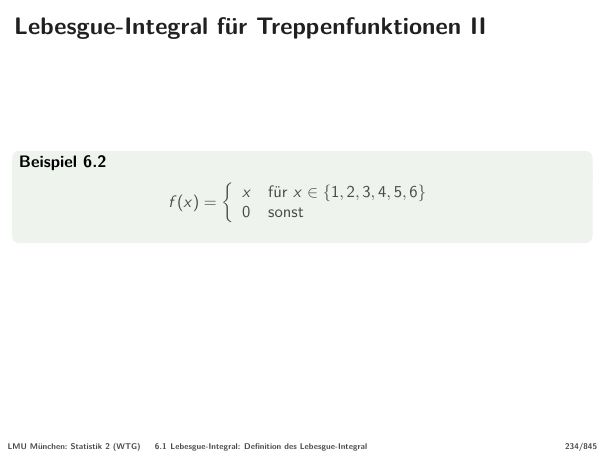

本页放在“模块一：Lebesgue 积分让期望可统一定义”中，核心是理解 Lebesgue 积分（Lebesgue-Integral）。直觉上先抓住标题里的对象：Lebesgue 积分（Lebesgue-Integral）。然后看它是定义、例子、定理还是证明；定义页要记条件，例子页要看随机机制，证明页要看用了哪些闭包性或极限定理。

关键词：

- Lebesgue 积分（Lebesgue-Integral）

本页需要抓住的德语线索：

- `Beispiel 6.2`
- `x für x ∈ {1, 2, 3, 4, 5, 6}`
- `f (x ) =`

### Seite 50 - Lebesgue 积分（Lebesgue-Integral）

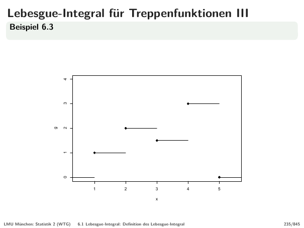

本页放在“模块一：Lebesgue 积分让期望可统一定义”中，核心是理解 Lebesgue 积分（Lebesgue-Integral）。直觉上先抓住标题里的对象：Lebesgue 积分（Lebesgue-Integral）。然后看它是定义、例子、定理还是证明；定义页要记条件，例子页要看随机机制，证明页要看用了哪些闭包性或极限定理。

关键词：

- Lebesgue 积分（Lebesgue-Integral）

本页需要抓住的德语线索：

- `Beispiel 6.3`

### Seite 51 - Lebesgue 积分（Lebesgue-Integral）

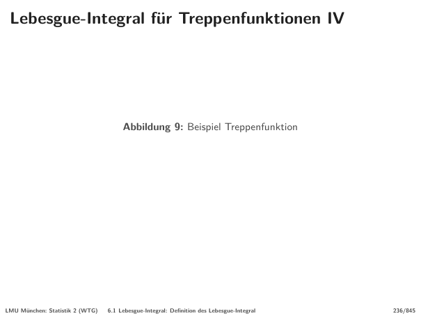

本页放在“模块一：Lebesgue 积分让期望可统一定义”中，核心是理解 Lebesgue 积分（Lebesgue-Integral）。直觉上先抓住标题里的对象：Lebesgue 积分（Lebesgue-Integral）。然后看它是定义、例子、定理还是证明；定义页要记条件，例子页要看随机机制，证明页要看用了哪些闭包性或极限定理。

关键词：

- Lebesgue 积分（Lebesgue-Integral）

本页需要抓住的德语线索：

- `Abbildung 9: Beispiel Treppenfunktion`

### Seite 52 - Lebesgue 积分（Lebesgue-Integral）

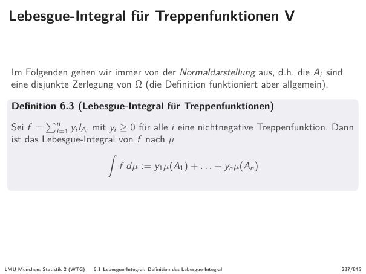

本页放在“模块一：Lebesgue 积分让期望可统一定义”中，核心是理解 Lebesgue 积分（Lebesgue-Integral）。直觉上先抓住标题里的对象：Lebesgue 积分（Lebesgue-Integral）。然后看它是定义、例子、定理还是证明；定义页要记条件，例子页要看随机机制，证明页要看用了哪些闭包性或极限定理。

关键词：

- Lebesgue 积分（Lebesgue-Integral）

本页需要抓住的德语线索：

- `eine disjunkte Zerlegung von Ω (die Definition funktioniert aber allgemein).`
- `Definition 6.3 (Lebesgue-Integral für Treppenfunktionen)`
- `Sei f =`
- `y I mit y ≥ 0 für alle i eine nichtnegative Treppenfunktion. Dann`
- `i=1 i Ai i`

### Seite 53 - Lebesgue 积分（Lebesgue-Integral）

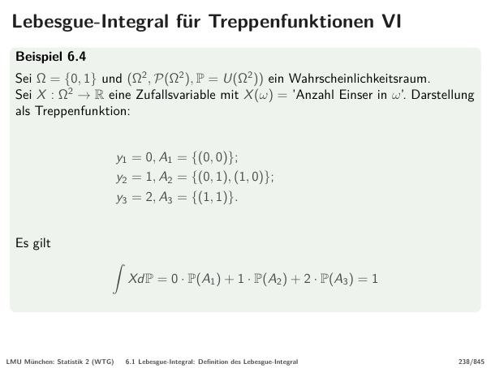

本页放在“模块一：Lebesgue 积分让期望可统一定义”中，核心是理解 概率（Wahrscheinlichkeit）、概率空间（Wahrscheinlichkeitsraum）、随机变量（Zufallsvariable）、Lebesgue 积分（Lebesgue-Integral）。直觉上先抓住标题里的对象：Lebesgue 积分（Lebesgue-Integral）。然后看它是定义、例子、定理还是证明；定义页要记条件，例子页要看随机机制，证明页要看用了哪些闭包性或极限定理。

关键词：

- 概率（Wahrscheinlichkeit）
- 概率空间（Wahrscheinlichkeitsraum）
- 随机变量（Zufallsvariable）
- Lebesgue 积分（Lebesgue-Integral）
- 依概率（in Wahrscheinlichkeit）

本页需要抓住的德语线索：

- `Beispiel 6.4`
- `Sei Ω = {0, 1} und (Ω2, P(Ω2), P = U(Ω2)) ein Wahrscheinlichkeitsraum.`
- `Sei X : Ω2 → R eine Zufallsvariable mit X (ω) = ’Anzahl Einser in ω’. Darstellung`
- `y = 0, A = {(0, 0)};`
- `y = 1, A = {(0, 1), (1, 0)};`

### Seite 54 - Lebesgue 积分（Lebesgue-Integral）

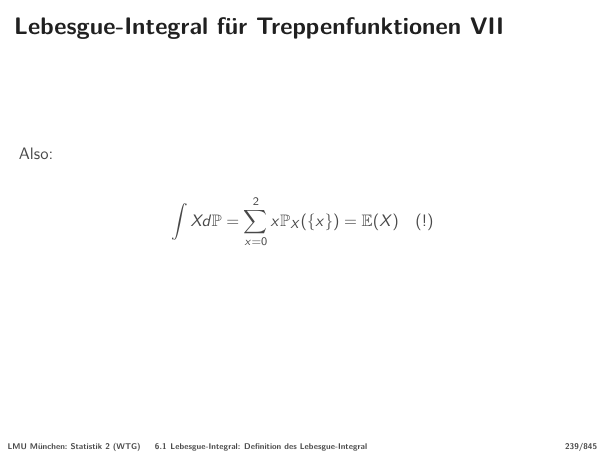

本页放在“模块一：Lebesgue 积分让期望可统一定义”中，核心是理解 Lebesgue 积分（Lebesgue-Integral）。直觉上先抓住标题里的对象：Lebesgue 积分（Lebesgue-Integral）。然后看它是定义、例子、定理还是证明；定义页要记条件，例子页要看随机机制，证明页要看用了哪些闭包性或极限定理。

关键词：

- Lebesgue 积分（Lebesgue-Integral）

本页需要抓住的德语线索：

- `XdP = x P ({x }) = E(X ) (!)`
- `x=0`

### Seite 55 - Lebesgue 积分（Lebesgue-Integral）

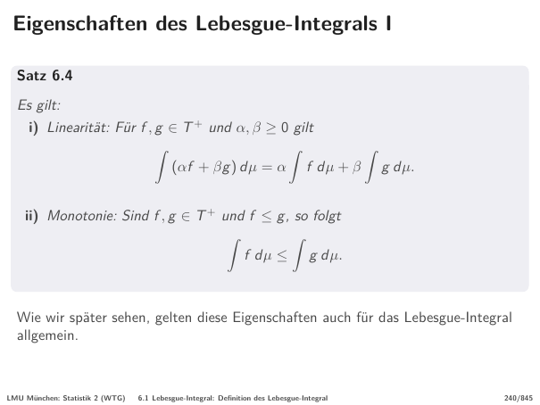

本页放在“模块一：Lebesgue 积分让期望可统一定义”中，核心是理解 Lebesgue 积分（Lebesgue-Integral）。直觉上先抓住标题里的对象：Lebesgue 积分（Lebesgue-Integral）。然后看它是定义、例子、定理还是证明；定义页要记条件，例子页要看随机机制，证明页要看用了哪些闭包性或极限定理。

关键词：

- Lebesgue 积分（Lebesgue-Integral）

本页需要抓住的德语线索：

- `Satz 6.4`
- `Es gilt:`
- `i) Linearität: Für f , g ∈ T + und α, β ≥ 0 gilt`
- `(αf + βg) dµ = α f dµ + β g dµ.`
- `ii) Monotonie: Sind f , g ∈ T + und f ≤ g, so folgt`

### Seite 56 - Lebesgue 积分（Lebesgue-Integral）

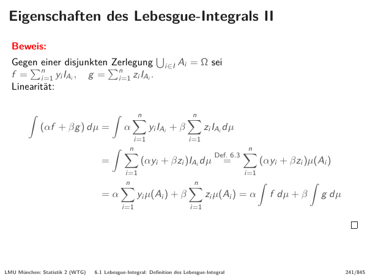

本页放在“模块一：Lebesgue 积分让期望可统一定义”中，核心是理解 Lebesgue 积分（Lebesgue-Integral）。直觉上先抓住标题里的对象：Lebesgue 积分（Lebesgue-Integral）。然后看它是定义、例子、定理还是证明；定义页要记条件，例子页要看随机机制，证明页要看用了哪些闭包性或极限定理。

关键词：

- Lebesgue 积分（Lebesgue-Integral）

本页需要抓住的德语线索：

- `Gegen einer disjunkten Zerlegung A = Ω sei`
- `i∈I i`
- `f =`
- `y I , g =`
- `i=1 i Ai i=1 i Ai`

### Seite 57 - Lebesgue 积分（Lebesgue-Integral）

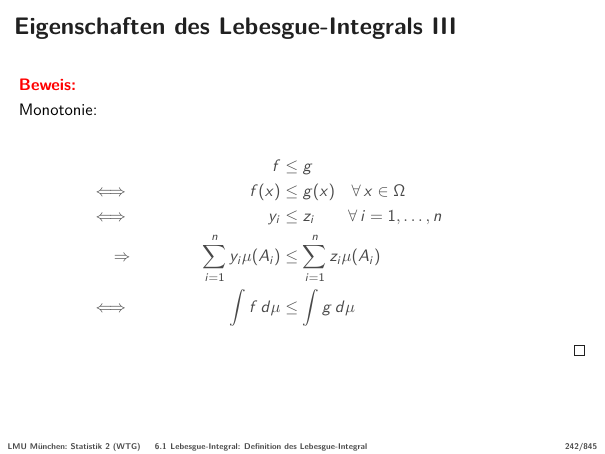

本页放在“模块一：Lebesgue 积分让期望可统一定义”中，核心是理解 Lebesgue 积分（Lebesgue-Integral）。直觉上先抓住标题里的对象：Lebesgue 积分（Lebesgue-Integral）。然后看它是定义、例子、定理还是证明；定义页要记条件，例子页要看随机机制，证明页要看用了哪些闭包性或极限定理。

关键词：

- Lebesgue 积分（Lebesgue-Integral）

本页需要抓住的德语线索：

- `f ≤ g`
- `⇐⇒ f (x ) ≤ g(x ) ∀ x ∈ Ω`
- `⇐⇒ y ≤ z ∀ i = 1, . . . , n`
- `⇒ y µ(A ) ≤ z µ(A )`
- `i=1 i=1`

### Seite 58 - Lebesgue 积分（Lebesgue-Integral）

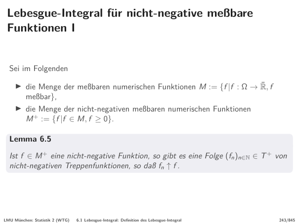

本页放在“模块一：Lebesgue 积分让期望可统一定义”中，核心是理解 集合（Menge）、Lebesgue 积分（Lebesgue-Integral）。直觉上先抓住标题里的对象：Lebesgue 积分（Lebesgue-Integral）。然后看它是定义、例子、定理还是证明；定义页要记条件，例子页要看随机机制，证明页要看用了哪些闭包性或极限定理。

关键词：

- 集合（Menge）
- Lebesgue 积分（Lebesgue-Integral）

本页需要抓住的德语线索：

- `die Menge der meßbaren numerischen Funktionen M := {f |f : Ω → R¯ , f`
- `M+ := {f |f ∈ M, f ≥ 0}.`
- `Lemma 6.5`
- `Ist f ∈ M+ eine nicht-negative Funktion, so gibt es eine Folge (f n ) n∈N ∈ T + von`

### Seite 59 - Lebesgue 积分（Lebesgue-Integral）

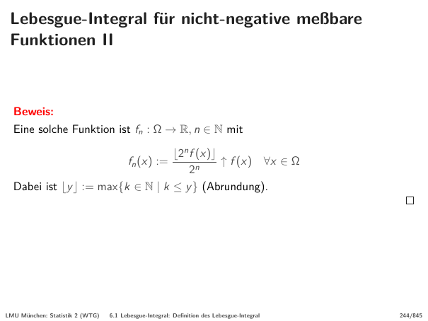

本页放在“模块一：Lebesgue 积分让期望可统一定义”中，核心是理解 Lebesgue 积分（Lebesgue-Integral）。直觉上先抓住标题里的对象：Lebesgue 积分（Lebesgue-Integral）。然后看它是定义、例子、定理还是证明；定义页要记条件，例子页要看随机机制，证明页要看用了哪些闭包性或极限定理。

关键词：

- Lebesgue 积分（Lebesgue-Integral）

本页需要抓住的德语线索：

- `Eine solche Funktion ist f : Ω → R, n ∈ N mit`
- `f (x ) := ↑ f (x ) ∀x ∈ Ω`
- `Dabei ist ⌊y ⌋ := max{k ∈ N | k ≤ y } (Abrundung).`

### Seite 60 - Lebesgue 积分（Lebesgue-Integral）

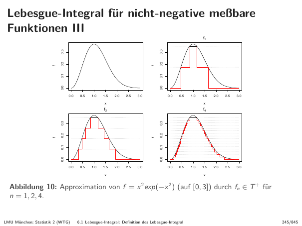

本页放在“模块一：Lebesgue 积分让期望可统一定义”中，核心是理解 Lebesgue 积分（Lebesgue-Integral）。直觉上先抓住标题里的对象：Lebesgue 积分（Lebesgue-Integral）。然后看它是定义、例子、定理还是证明；定义页要记条件，例子页要看随机机制，证明页要看用了哪些闭包性或极限定理。

关键词：

- Lebesgue 积分（Lebesgue-Integral）

本页需要抓住的德语线索：

- `Abbildung 10: Approximation von f = x2exp(−x2) (auf [0, 3]) durch f ∈ T + für`
- `n = 1, 2, 4.`

### Seite 61 - Lebesgue 积分（Lebesgue-Integral）

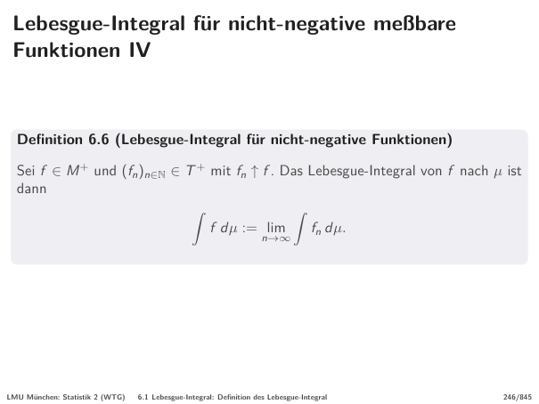

本页放在“模块一：Lebesgue 积分让期望可统一定义”中，核心是理解 Lebesgue 积分（Lebesgue-Integral）。直觉上先抓住标题里的对象：Lebesgue 积分（Lebesgue-Integral）。然后看它是定义、例子、定理还是证明；定义页要记条件，例子页要看随机机制，证明页要看用了哪些闭包性或极限定理。

关键词：

- Lebesgue 积分（Lebesgue-Integral）

本页需要抓住的德语线索：

- `Definition 6.6 (Lebesgue-Integral für nicht-negative Funktionen)`
- `Sei f ∈ M+ und (f n ) n∈N ∈ T + mit f n ↑ f . Das Lebesgue-Integral von f nach µ ist`
- `f dµ := lim f dµ.`
- `n→∞`

### Seite 62 - Lebesgue 积分（Lebesgue-Integral）

本页放在“模块一：Lebesgue 积分让期望可统一定义”中，核心是理解 Lebesgue 积分（Lebesgue-Integral）。直觉上先抓住标题里的对象：Lebesgue 积分（Lebesgue-Integral）。然后看它是定义、例子、定理还是证明；定义页要记条件，例子页要看随机机制，证明页要看用了哪些闭包性或极限定理。

关键词：

- Lebesgue 积分（Lebesgue-Integral）

本页需要抓住的德语线索：

- `Jetzt allgemein f : Ω → R¯ meßbar. Wir können f in einen Positivteil f + und`
- `f +(x ) := max(f (x ), 0),`
- `f −(x ) := max(−f (x ), 0),`
- `f = f + − f − .`
- `∈M+ ∈M+`

### Seite 63 - Lebesgue 积分（Lebesgue-Integral）

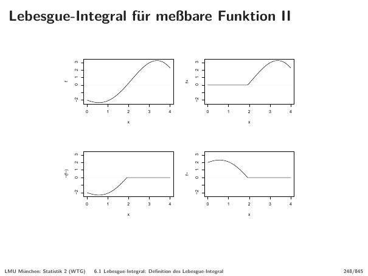

本页放在“模块一：Lebesgue 积分让期望可统一定义”中，核心是理解 Lebesgue 积分（Lebesgue-Integral）。直觉上先抓住标题里的对象：Lebesgue 积分（Lebesgue-Integral）。然后看它是定义、例子、定理还是证明；定义页要记条件，例子页要看随机机制，证明页要看用了哪些闭包性或极限定理。

关键词：

- Lebesgue 积分（Lebesgue-Integral）

本页需要抓住的德语线索：

- `Lebesgue-Integral für meßbare Funktion II`
- `0 1 2 3 4`
- `3`

### Seite 64 - Lebesgue 积分（Lebesgue-Integral）

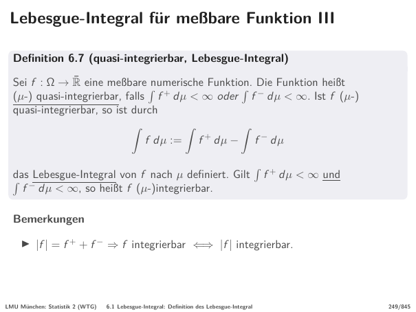

本页放在“模块一：Lebesgue 积分让期望可统一定义”中，核心是理解 Lebesgue 积分（Lebesgue-Integral）。直觉上先抓住标题里的对象：Lebesgue 积分（Lebesgue-Integral）。然后看它是定义、例子、定理还是证明；定义页要记条件，例子页要看随机机制，证明页要看用了哪些闭包性或极限定理。

关键词：

- Lebesgue 积分（Lebesgue-Integral）

本页需要抓住的德语线索：

- `Definition 6.7 (quasi-integrierbar, Lebesgue-Integral)`
- `Sei f : Ω → R¯ eine meßbare numerische Funktion. Die Funktion heißt`
- `f dµ := f + dµ − f − dµ`
- `|f | = f + + f − ⇒ f integrierbar ⇐⇒ |f | integrierbar.`

### Seite 65 - Lebesgue 积分（Lebesgue-Integral）

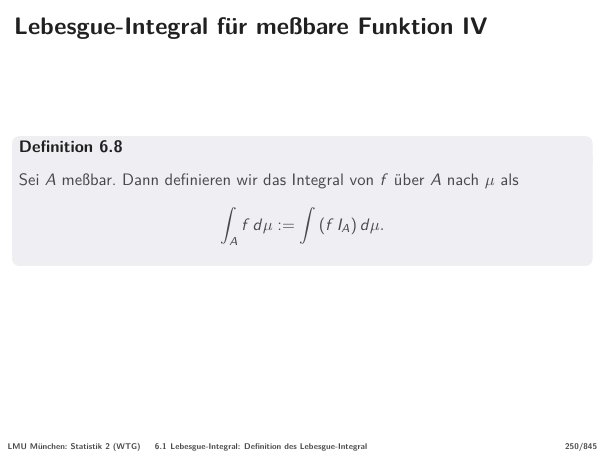

本页放在“模块一：Lebesgue 积分让期望可统一定义”中，核心是理解 Lebesgue 积分（Lebesgue-Integral）。直觉上先抓住标题里的对象：Lebesgue 积分（Lebesgue-Integral）。然后看它是定义、例子、定理还是证明；定义页要记条件，例子页要看随机机制，证明页要看用了哪些闭包性或极限定理。

关键词：

- Lebesgue 积分（Lebesgue-Integral）

本页需要抓住的德语线索：

- `Definition 6.8`
- `f dµ := (f I ) dµ.`

### Seite 66 - Lebesgue 积分（Lebesgue-Integral）

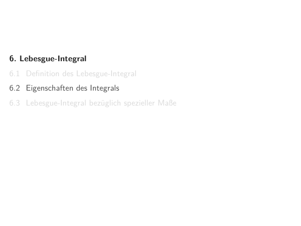

本页放在“模块一：Lebesgue 积分让期望可统一定义”中，核心是理解 测度（Maß）、Lebesgue 积分（Lebesgue-Integral）。直觉上先抓住标题里的对象：Lebesgue 积分（Lebesgue-Integral）。然后看它是定义、例子、定理还是证明；定义页要记条件，例子页要看随机机制，证明页要看用了哪些闭包性或极限定理。

关键词：

- 测度（Maß）
- Lebesgue 积分（Lebesgue-Integral）

本页需要抓住的德语线索：

- `6.1 Definition des Lebesgue-Integral`

### Seite 67 - Eigenschaften des Integrals I

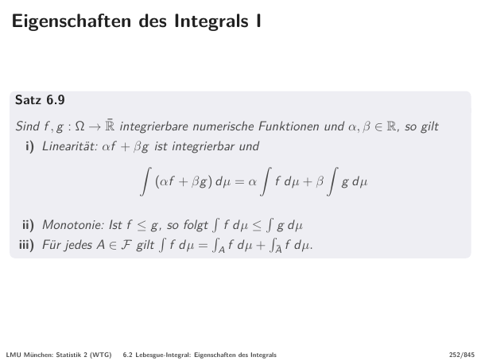

本页放在“模块一：Lebesgue 积分让期望可统一定义”中，主要作用是推进 Seite 38-84 这一段的概念链。先把标题“Eigenschaften des Integrals I”和前后页联系起来，再区分它是在给定义、展示例子、证明性质，还是做章节过渡。

本页需要抓住的德语线索：

- `Satz 6.9`
- `Sind f , g : Ω → R¯ integrierbare numerische Funktionen und α, β ∈ R, so gilt`
- `(αf + βg) dµ = α f dµ + β g dµ`
- `ii) Monotonie: Ist f ≤ g, so folgt f dµ ≤ g dµ`
- `iii) Für jedes A ∈ F gilt f dµ = f dµ + f dµ.`

### Seite 68 - Eigenschaften des Integrals II

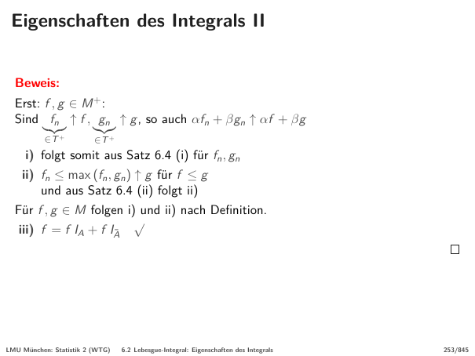

本页放在“模块一：Lebesgue 积分让期望可统一定义”中，主要作用是推进 Seite 38-84 这一段的概念链。先把标题“Eigenschaften des Integrals II”和前后页联系起来，再区分它是在给定义、展示例子、证明性质，还是做章节过渡。

本页需要抓住的德语线索：

- `Erst: f , g ∈ M+:`
- `∈T+ ∈T+`
- `i) folgt somit aus Satz 6.4 (i) für f , g`
- `ii) f ≤ max (f , g ) ↑ g für f ≤ g`
- `und aus Satz 6.4 (ii) folgt ii)`

### Seite 69 - 收敛（Konvergenz）

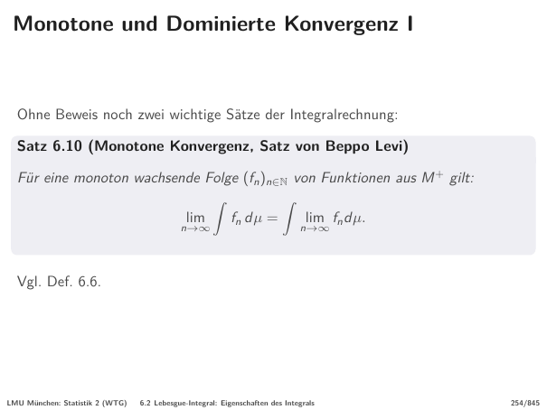

本页放在“模块一：Lebesgue 积分让期望可统一定义”中，核心是理解 收敛（Konvergenz）。直觉上先抓住标题里的对象：收敛（Konvergenz）。然后看它是定义、例子、定理还是证明；定义页要记条件，例子页要看随机机制，证明页要看用了哪些闭包性或极限定理。

关键词：

- 收敛（Konvergenz）

本页需要抓住的德语线索：

- `Satz 6.10 (Monotone Konvergenz, Satz von Beppo Levi)`
- `Für eine monoton wachsende Folge (f n ) n∈N von Funktionen aus M+ gilt:`
- `lim f dµ = lim f dµ.`
- `n→∞ n→∞`

### Seite 70 - 收敛（Konvergenz）

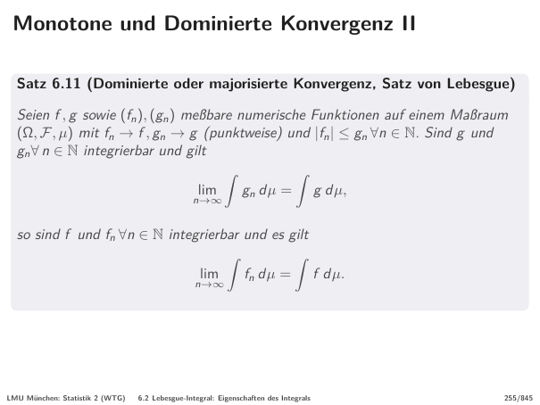

本页放在“模块一：Lebesgue 积分让期望可统一定义”中，核心是理解 测度（Maß）、收敛（Konvergenz）。直觉上先抓住标题里的对象：收敛（Konvergenz）。然后看它是定义、例子、定理还是证明；定义页要记条件，例子页要看随机机制，证明页要看用了哪些闭包性或极限定理。

关键词：

- 测度（Maß）
- 收敛（Konvergenz）

本页需要抓住的德语线索：

- `Satz 6.11 (Dominierte oder majorisierte Konvergenz, Satz von Lebesgue)`
- `(Ω, F, µ) mit f → f , g → g (punktweise) und |f | ≤ g ∀n ∈ N. Sind g und`
- `g ∀ n ∈ N integrierbar und gilt`
- `lim g dµ = g dµ,`
- `n→∞`

### Seite 71 - Integral über Nullmengen I

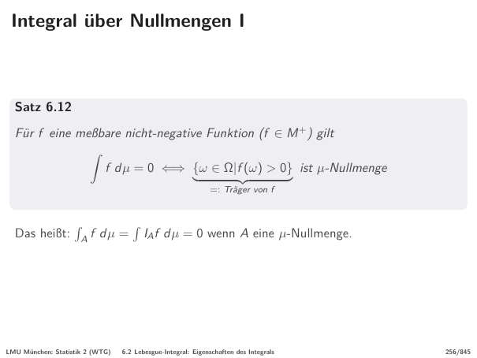

本页放在“模块一：Lebesgue 积分让期望可统一定义”中，主要作用是推进 Seite 38-84 这一段的概念链。先把标题“Integral über Nullmengen I”和前后页联系起来，再区分它是在给定义、展示例子、证明性质，还是做章节过渡。

本页需要抓住的德语线索：

- `Satz 6.12`
- `Für f eine meßbare nicht-negative Funktion (f ∈ M+) gilt`
- `f dµ = 0 ⇐⇒ {ω ∈ Ω|f (ω) > 0} ist µ-Nullmenge`
- `=: Träger von f`
- `Das heißt: f dµ = I f dµ = 0 wenn A eine µ-Nullmenge.`

### Seite 72 - Integral über Nullmengen II

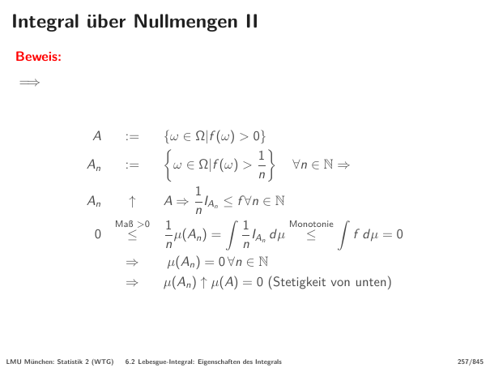

本页放在“模块一：Lebesgue 积分让期望可统一定义”中，核心是理解 测度（Maß）。直觉上先抓住标题里的对象：Integral über Nullmengen II。然后看它是定义、例子、定理还是证明；定义页要记条件，例子页要看随机机制，证明页要看用了哪些闭包性或极限定理。

关键词：

- 测度（Maß）

本页需要抓住的德语线索：

- `=⇒`
- `A := {ω ∈ Ω|f (ω) > 0}`
- `A := ω ∈ Ω|f (ω) > ∀n ∈ N ⇒`
- `A ↑ A ⇒ I ≤ f ∀n ∈ N`
- `0 ≤ µ(A ) = I dµ ≤ f dµ = 0`

### Seite 73 - Integral über Nullmengen III

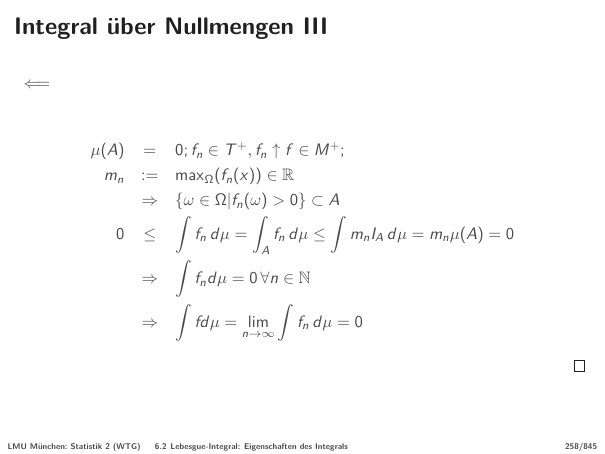

本页放在“模块一：Lebesgue 积分让期望可统一定义”中，主要作用是推进 Seite 38-84 这一段的概念链。先把标题“Integral über Nullmengen III”和前后页联系起来，再区分它是在给定义、展示例子、证明性质，还是做章节过渡。

本页需要抓住的德语线索：

- `⇐=`
- `µ(A) = 0; f ∈ T +, f ↑ f ∈ M+;`
- `m := max (f (x )) ∈ R`
- `⇒ {ω ∈ Ω|f (ω) > 0} ⊂ A`
- `0 ≤ f dµ = f dµ ≤ m I dµ = m µ(A) = 0`

### Seite 74 - Lebesgue 积分（Lebesgue-Integral）

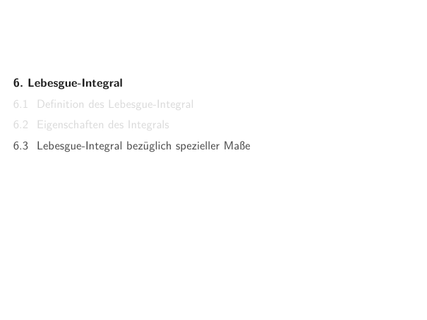

本页放在“模块一：Lebesgue 积分让期望可统一定义”中，核心是理解 测度（Maß）、Lebesgue 积分（Lebesgue-Integral）。直觉上先抓住标题里的对象：Lebesgue 积分（Lebesgue-Integral）。然后看它是定义、例子、定理还是证明；定义页要记条件，例子页要看随机机制，证明页要看用了哪些闭包性或极限定理。

关键词：

- 测度（Maß）
- Lebesgue 积分（Lebesgue-Integral）

本页需要抓住的德语线索：

- `6.1 Definition des Lebesgue-Integral`

### Seite 75 - Lebesgue 积分（Lebesgue-Integral）

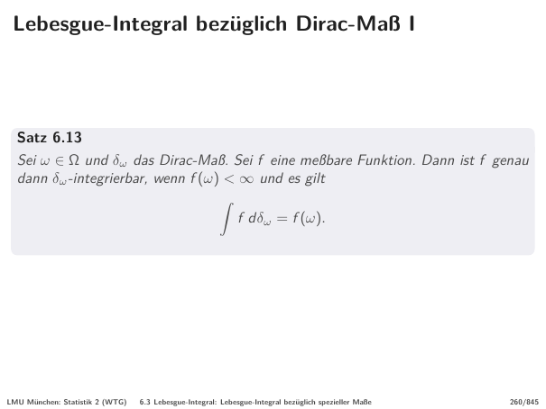

本页放在“模块一：Lebesgue 积分让期望可统一定义”中，核心是理解 测度（Maß）、Lebesgue 积分（Lebesgue-Integral）。直觉上先抓住标题里的对象：Lebesgue 积分（Lebesgue-Integral）。然后看它是定义、例子、定理还是证明；定义页要记条件，例子页要看随机机制，证明页要看用了哪些闭包性或极限定理。

关键词：

- 测度（Maß）
- Lebesgue 积分（Lebesgue-Integral）

本页需要抓住的德语线索：

- `Satz 6.13`
- `Sei ω ∈ Ω und δ das Dirac-Maß. Sei f eine meßbare Funktion. Dann ist f genau`
- `f dδ = f (ω).`

### Seite 76 - Lebesgue 积分（Lebesgue-Integral）

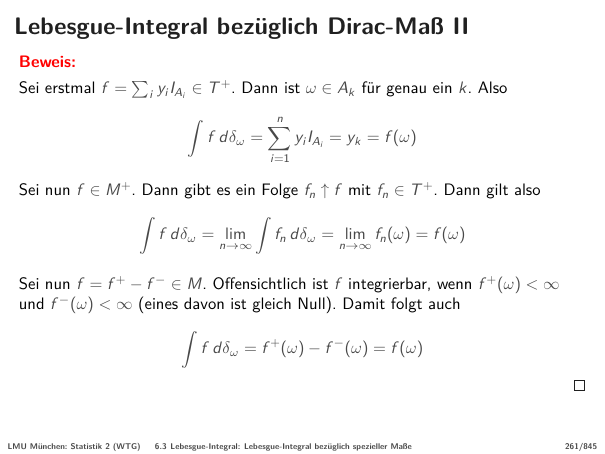

本页放在“模块一：Lebesgue 积分让期望可统一定义”中，核心是理解 测度（Maß）、Lebesgue 积分（Lebesgue-Integral）。直觉上先抓住标题里的对象：Lebesgue 积分（Lebesgue-Integral）。然后看它是定义、例子、定理还是证明；定义页要记条件，例子页要看随机机制，证明页要看用了哪些闭包性或极限定理。

关键词：

- 测度（Maß）
- Lebesgue 积分（Lebesgue-Integral）

本页需要抓住的德语线索：

- `Sei erstmal f = P y I ∈ T +. Dann ist ω ∈ A für genau ein k. Also`
- `f dδ = y I = y = f (ω)`
- `i=1`
- `Sei nun f ∈ M+. Dann gibt es ein Folge f ↑ f mit f ∈ T +. Dann gilt also`
- `f dδ = lim f dδ = lim f (ω) = f (ω)`

### Seite 77 - Lebesgue 积分（Lebesgue-Integral）

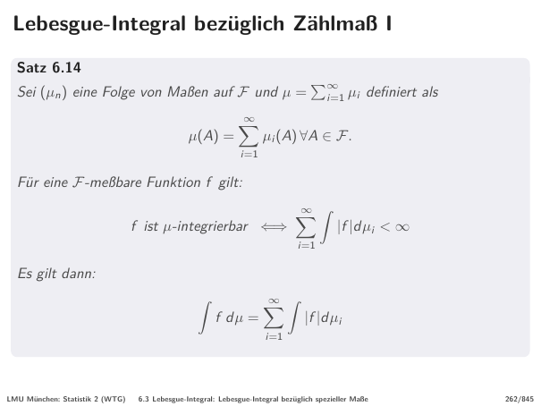

本页放在“模块一：Lebesgue 积分让期望可统一定义”中，核心是理解 测度（Maß）、Lebesgue 积分（Lebesgue-Integral）。直觉上先抓住标题里的对象：Lebesgue 积分（Lebesgue-Integral）。然后看它是定义、例子、定理还是证明；定义页要记条件，例子页要看随机机制，证明页要看用了哪些闭包性或极限定理。

关键词：

- 测度（Maß）
- Lebesgue 积分（Lebesgue-Integral）

本页需要抓住的德语线索：

- `Satz 6.14`
- `Sei (µ ) eine Folge von Maßen auf F und µ =`
- `n i=1 i`
- `µ(A) = µ (A) ∀A ∈ F.`
- `i=1`

### Seite 78 - Lebesgue 积分（Lebesgue-Integral）

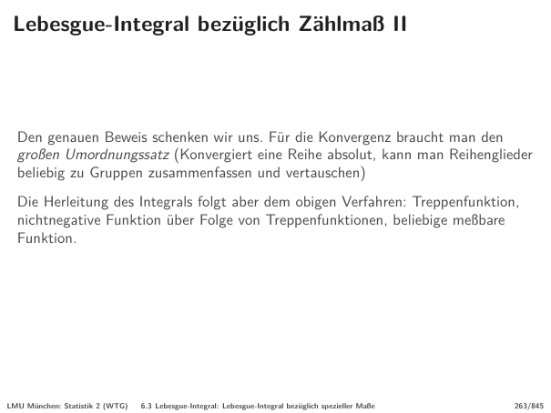

本页放在“模块一：Lebesgue 积分让期望可统一定义”中，核心是理解 Lebesgue 积分（Lebesgue-Integral）、收敛（Konvergenz）。直觉上先抓住标题里的对象：Lebesgue 积分（Lebesgue-Integral）。然后看它是定义、例子、定理还是证明；定义页要记条件，例子页要看随机机制，证明页要看用了哪些闭包性或极限定理。

关键词：

- Lebesgue 积分（Lebesgue-Integral）
- 收敛（Konvergenz）

本页需要抓住的德语线索：

- `Lebesgue-Integral bezüglich Zählmaß II`
- `Den genauen Beweis schenken wir uns. Für die Konvergenz braucht man den`
- `großen Umordnungssatz (Konvergiert eine Reihe absolut, kann man Reihenglieder`

### Seite 79 - Lebesgue 积分（Lebesgue-Integral）

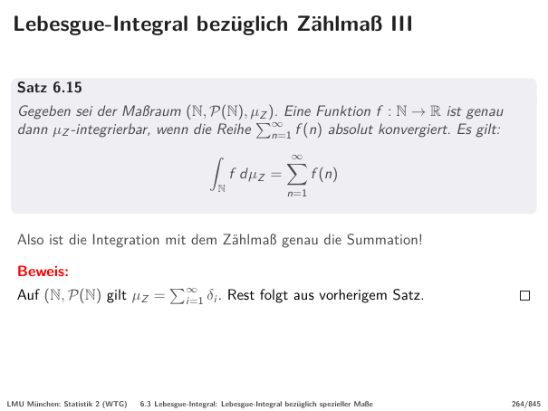

本页放在“模块一：Lebesgue 积分让期望可统一定义”中，核心是理解 测度（Maß）、Lebesgue 积分（Lebesgue-Integral）。直觉上先抓住标题里的对象：Lebesgue 积分（Lebesgue-Integral）。然后看它是定义、例子、定理还是证明；定义页要记条件，例子页要看随机机制，证明页要看用了哪些闭包性或极限定理。

关键词：

- 测度（Maß）
- Lebesgue 积分（Lebesgue-Integral）

本页需要抓住的德语线索：

- `Satz 6.15`
- `Gegeben sei der Maßraum (N, P(N), µ ). Eine Funktion f : N → R ist genau`
- `f (n) absolut konvergiert. Es gilt:`
- `Z n=1`
- `f dµ = f (n)`

### Seite 80 - Lebesgue 积分（Lebesgue-Integral）

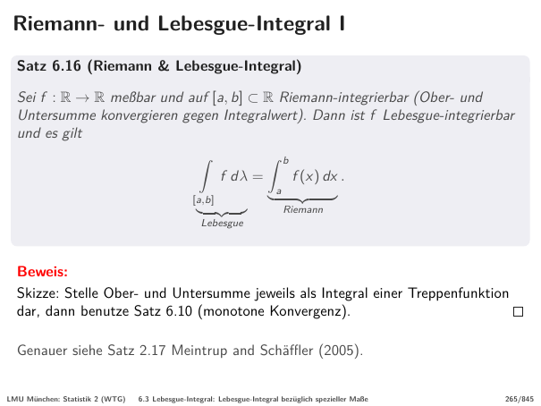

本页放在“模块一：Lebesgue 积分让期望可统一定义”中，核心是理解 Lebesgue 积分（Lebesgue-Integral）。直觉上先抓住标题里的对象：Lebesgue 积分（Lebesgue-Integral）。然后看它是定义、例子、定理还是证明；定义页要记条件，例子页要看随机机制，证明页要看用了哪些闭包性或极限定理。

关键词：

- Lebesgue 积分（Lebesgue-Integral）

本页需要抓住的德语线索：

- `Satz 6.16 (Riemann & Lebesgue-Integral)`
- `Sei f : R → R meßbar und auf [a, b] ⊂ R Riemann-integrierbar (Ober- und`
- `f dλ = f (x ) dx .`
- `dar, dann benutze Satz 6.10 (monotone Konvergenz).`
- `Genauer siehe Satz 2.17 Meintrup and Schäffler (2005).`

### Seite 81 - Lebesgue 积分（Lebesgue-Integral）

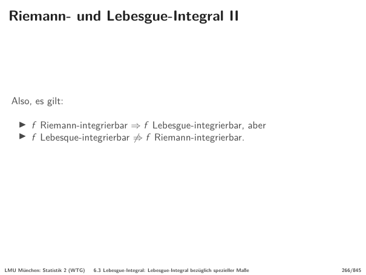

本页放在“模块一：Lebesgue 积分让期望可统一定义”中，核心是理解 Lebesgue 积分（Lebesgue-Integral）。直觉上先抓住标题里的对象：Lebesgue 积分（Lebesgue-Integral）。然后看它是定义、例子、定理还是证明；定义页要记条件，例子页要看随机机制，证明页要看用了哪些闭包性或极限定理。

关键词：

- Lebesgue 积分（Lebesgue-Integral）

本页需要抓住的德语线索：

- `Riemann- und Lebesgue-Integral II`
- `Also, es gilt:`
- `f Riemann-integrierbar ⇒ f Lebesgue-integrierbar, aber`

### Seite 82 - Lebesgue 积分（Lebesgue-Integral）

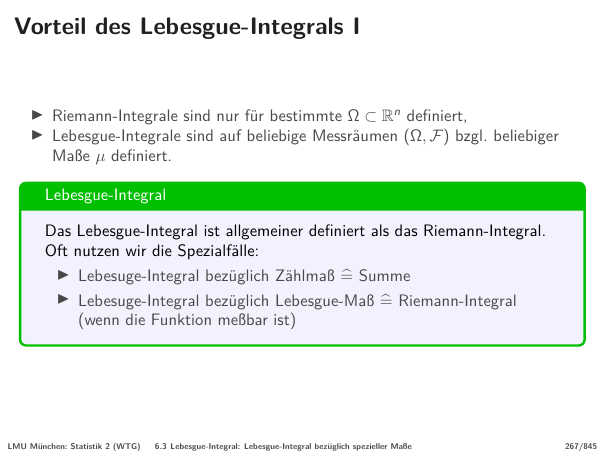

本页放在“模块一：Lebesgue 积分让期望可统一定义”中，核心是理解 测度（Maß）、Lebesgue 积分（Lebesgue-Integral）。直觉上先抓住标题里的对象：Lebesgue 积分（Lebesgue-Integral）。然后看它是定义、例子、定理还是证明；定义页要记条件，例子页要看随机机制，证明页要看用了哪些闭包性或极限定理。

关键词：

- 测度（Maß）
- Lebesgue 积分（Lebesgue-Integral）

本页需要抓住的德语线索：

- `Riemann-Integrale sind nur für bestimmte Ω ⊂ Rn definiert,`
- `Lebesuge-Integral bezüglich Zählmaß = Summe`
- `Lebesuge-Integral bezüglich Lebesgue-Maß = Riemann-Integral`

### Seite 83 - Lebesgue 积分（Lebesgue-Integral）

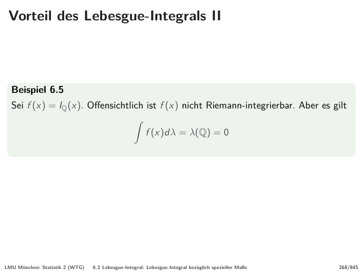

本页放在“模块一：Lebesgue 积分让期望可统一定义”中，核心是理解 Lebesgue 积分（Lebesgue-Integral）。直觉上先抓住标题里的对象：Lebesgue 积分（Lebesgue-Integral）。然后看它是定义、例子、定理还是证明；定义页要记条件，例子页要看随机机制，证明页要看用了哪些闭包性或极限定理。

关键词：

- Lebesgue 积分（Lebesgue-Integral）

本页需要抓住的德语线索：

- `Beispiel 6.5`
- `Sei f (x ) = IQ(x ). Offensichtlich ist f (x ) nicht Riemann-integrierbar. Aber es gilt`
- `f (x )dλ = λ(Q) = 0`

### Seite 84 - 页面内容

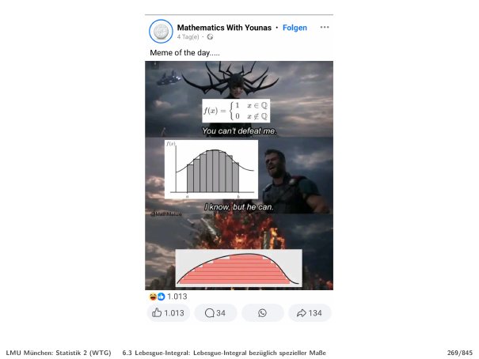

本页可识别的嵌入图片裁切：

本页放在“模块一：Lebesgue 积分让期望可统一定义”中，主要作用是推进 Seite 38-84 这一段的概念链。先把标题“页面内容”和前后页联系起来，再区分它是在给定义、展示例子、证明性质，还是做章节过渡。

本页需要抓住的德语线索：

## 模块二：密度是相对于某个测度的表示（Seite 85-126）

密度不是概率本身，而是把概率测度相对于参考测度写成函数。离散密度相对于计数测度，连续密度相对于 Lebesgue 测度，混合分布提醒你两种直觉可能同时出现。

### Seite 85 - 密度（Dichte）

本页放在“模块二：密度是相对于某个测度的表示”中，核心是理解 测度（Maß）、分布（Verteilung）、密度（Dichte）。直觉上先抓住标题里的对象：密度（Dichte）。然后看它是定义、例子、定理还是证明；定义页要记条件，例子页要看随机机制，证明页要看用了哪些闭包性或极限定理。

关键词：

- 测度（Maß）
- 分布（Verteilung）
- 密度（Dichte）

本页需要抓住的德语线索：

- `Kapitel 7`
- `Dichte`
- `7. Dichte`

### Seite 86 - Ziele des Kapitels

本页放在“模块二：密度是相对于某个测度的表示”中，核心是理解 概率（Wahrscheinlichkeit）、概率测度（Wahrscheinlichkeitsmaß）、集合（Menge）、集合系统（Mengensystem）。直觉上先抓住标题里的对象：Ziele des Kapitels。然后看它是定义、例子、定理还是证明；定义页要记条件，例子页要看随机机制，证明页要看用了哪些闭包性或极限定理。

关键词：

- 概率（Wahrscheinlichkeit）
- 概率测度（Wahrscheinlichkeitsmaß）
- 集合（Menge）
- 集合系统（Mengensystem）
- σ-代数（σ-Algebra）
- 测度（Maß）
- 分布（Verteilung）
- 密度（Dichte）

本页需要抓住的德语线索：

- `Ziele des Kapitels`
- `Maß ist Funktion auf einer σ-Algebra F ⊆ P(Ω), also einem (komplizierten)`

### Seite 87 - 密度（Dichte）

本页放在“模块二：密度是相对于某个测度的表示”中，核心是理解 测度（Maß）、分布（Verteilung）、密度（Dichte）。直觉上先抓住标题里的对象：密度（Dichte）。然后看它是定义、例子、定理还是证明；定义页要记条件，例子页要看随机机制，证明页要看用了哪些闭包性或极限定理。

关键词：

- 测度（Maß）
- 分布（Verteilung）
- 密度（Dichte）

本页需要抓住的德语线索：

- `7. Dichte`
- `7.1 Dichte eines Maßes`
- `7.2 Arten von Verteilungen`

### Seite 88 - 密度（Dichte）

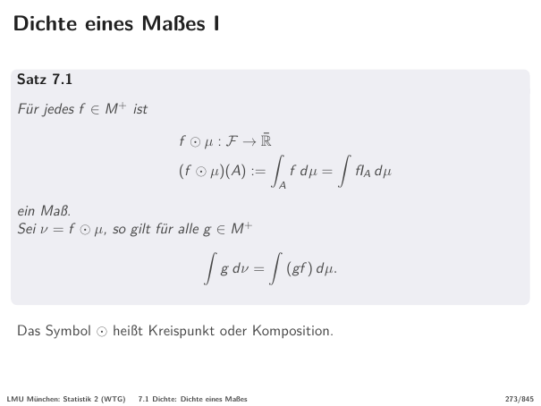

本页放在“模块二：密度是相对于某个测度的表示”中，核心是理解 测度（Maß）、密度（Dichte）。直觉上先抓住标题里的对象：密度（Dichte）。然后看它是定义、例子、定理还是证明；定义页要记条件，例子页要看随机机制，证明页要看用了哪些闭包性或极限定理。

关键词：

- 测度（Maß）
- 密度（Dichte）

本页需要抓住的德语线索：

- `Satz 7.1`
- `Für jedes f ∈ M+ ist`
- `f ⊙ µ : F → R¯`
- `(f ⊙ µ)(A) := f dµ = fI dµ`
- `Sei ν = f ⊙ µ, so gilt für alle g ∈ M+`

### Seite 89 - 密度（Dichte）

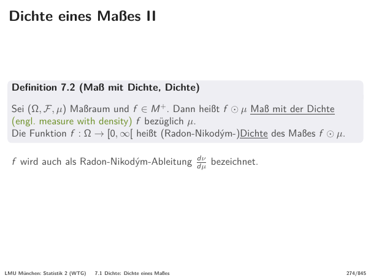

本页放在“模块二：密度是相对于某个测度的表示”中，核心是理解 测度（Maß）、密度（Dichte）。直觉上先抓住标题里的对象：密度（Dichte）。然后看它是定义、例子、定理还是证明；定义页要记条件，例子页要看随机机制，证明页要看用了哪些闭包性或极限定理。

关键词：

- 测度（Maß）
- 密度（Dichte）

本页需要抓住的德语线索：

- `Definition 7.2 (Maß mit Dichte, Dichte)`
- `Sei (Ω, F, µ) Maßraum und f ∈ M+. Dann heißt f ⊙ µ Maß mit der Dichte`
- `Die Funktion f : Ω → [0, ∞[ heißt (Radon-Nikodým-)Dichte des Maßes f ⊙ µ.`

### Seite 90 - 密度（Dichte）

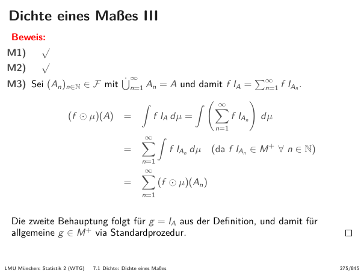

本页放在“模块二：密度是相对于某个测度的表示”中，核心是理解 测度（Maß）、密度（Dichte）。直觉上先抓住标题里的对象：密度（Dichte）。然后看它是定义、例子、定理还是证明；定义页要记条件，例子页要看随机机制，证明页要看用了哪些闭包性或极限定理。

关键词：

- 测度（Maß）
- 密度（Dichte）

本页需要抓住的德语线索：

- `M3) Sei (A n ) n∈N ∈ F mit`
- `n=1 A n = A und damit f I A =`
- `n=1 f I An .`
- `(f ⊙ µ)(A) = f I dµ = f I dµ`
- `n=1`

### Seite 91 - 密度（Dichte）

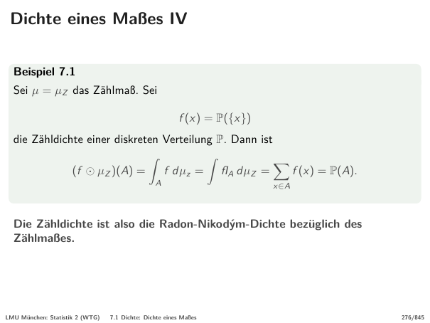

本页放在“模块二：密度是相对于某个测度的表示”中，核心是理解 测度（Maß）、分布（Verteilung）、密度（Dichte）。直觉上先抓住标题里的对象：密度（Dichte）。然后看它是定义、例子、定理还是证明；定义页要记条件，例子页要看随机机制，证明页要看用了哪些闭包性或极限定理。

关键词：

- 测度（Maß）
- 分布（Verteilung）
- 密度（Dichte）

本页需要抓住的德语线索：

- `Beispiel 7.1`
- `Sei µ = µ das Zählmaß. Sei`
- `f (x ) = P({x })`
- `(f ⊙ µ )(A) = f dµ = fI dµ = f (x ) = P(A).`
- `A x∈A`

### Seite 92 - 密度（Dichte）

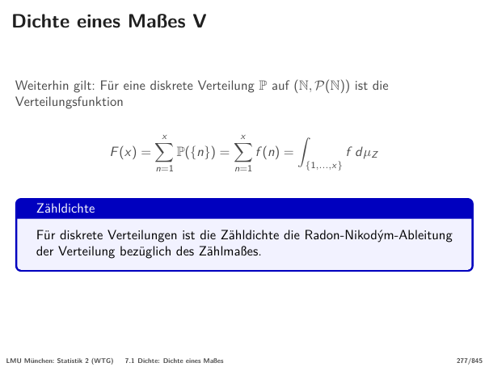

本页放在“模块二：密度是相对于某个测度的表示”中，核心是理解 测度（Maß）、分布（Verteilung）、分布函数（Verteilungsfunktion）、密度（Dichte）。直觉上先抓住标题里的对象：密度（Dichte）。然后看它是定义、例子、定理还是证明；定义页要记条件，例子页要看随机机制，证明页要看用了哪些闭包性或极限定理。

关键词：

- 测度（Maß）
- 分布（Verteilung）
- 分布函数（Verteilungsfunktion）
- 密度（Dichte）

本页需要抓住的德语线索：

- `Weiterhin gilt: Für eine diskrete Verteilung P auf (N, P(N)) ist die`
- `F (x ) = P({n}) = f (n) = f dµ`
- `n=1 n=1 {1,...,x}`

### Seite 93 - 测度（Maß）

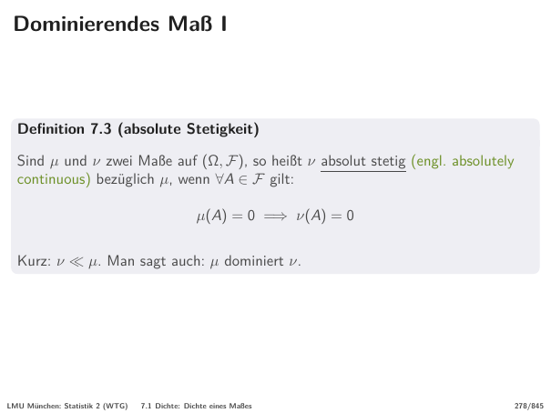

本页放在“模块二：密度是相对于某个测度的表示”中，核心是理解 测度（Maß）。直觉上先抓住标题里的对象：测度（Maß）。然后看它是定义、例子、定理还是证明；定义页要记条件，例子页要看随机机制，证明页要看用了哪些闭包性或极限定理。

关键词：

- 测度（Maß）

本页需要抓住的德语线索：

- `Definition 7.3 (absolute Stetigkeit)`
- `continuous) bezüglich µ, wenn ∀A ∈ F gilt:`
- `µ(A) = 0 =⇒ ν(A) = 0`

### Seite 94 - 测度（Maß）

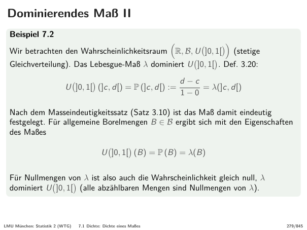

本页放在“模块二：密度是相对于某个测度的表示”中，核心是理解 概率（Wahrscheinlichkeit）、概率空间（Wahrscheinlichkeitsraum）、测度（Maß）。直觉上先抓住标题里的对象：测度（Maß）。然后看它是定义、例子、定理还是证明；定义页要记条件，例子页要看随机机制，证明页要看用了哪些闭包性或极限定理。

关键词：

- 概率（Wahrscheinlichkeit）
- 概率空间（Wahrscheinlichkeitsraum）
- 测度（Maß）

本页需要抓住的德语线索：

- `Beispiel 7.2`
- `U (cid:0) ]0, 1[ (cid:1) (]c, d[) = P (]c, d[) := d − c = λ(]c, d[)`
- `Nach dem Masseindeutigkeitssatz (Satz 3.10) ist das Maß damit eindeutig`
- `festgelegt. Für allgemeine Borelmengen B ∈ B ergibt sich mit den Eigenschaften`
- `U (cid:0) ]0, 1[ (cid:1) (B) = P (B) = λ(B)`

### Seite 95 - Satz von Radon-Nikodým I

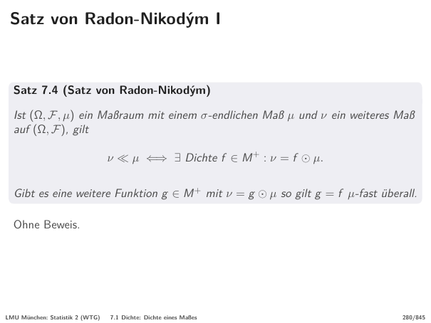

本页放在“模块二：密度是相对于某个测度的表示”中，核心是理解 测度（Maß）、密度（Dichte）。直觉上先抓住标题里的对象：Satz von Radon-Nikodým I。然后看它是定义、例子、定理还是证明；定义页要记条件，例子页要看随机机制，证明页要看用了哪些闭包性或极限定理。

关键词：

- 测度（Maß）
- 密度（Dichte）

本页需要抓住的德语线索：

- `Satz von Radon-Nikodým I`
- `Satz 7.4 (Satz von Radon-Nikodým)`
- `ν ≪ µ ⇐⇒ ∃ Dichte f ∈ M+ : ν = f ⊙ µ.`
- `Gibt es eine weitere Funktion g ∈ M+ mit ν = g ⊙ µ so gilt g = f µ-fast überall.`

### Seite 96 - Satz von Radon-Nikodým II

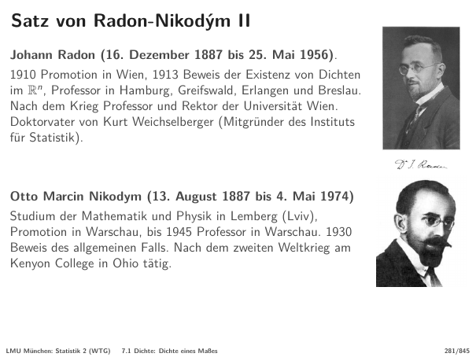

本页可识别的嵌入图片裁切：

本页放在“模块二：密度是相对于某个测度的表示”中，核心是理解 密度（Dichte）。直觉上先抓住标题里的对象：Satz von Radon-Nikodým II。然后看它是定义、例子、定理还是证明；定义页要记条件，例子页要看随机机制，证明页要看用了哪些闭包性或极限定理。

关键词：

- 密度（Dichte）

本页需要抓住的德语线索：

- `Satz von Radon-Nikodým II`

### Seite 97 - Satz von Radon-Nikodým III

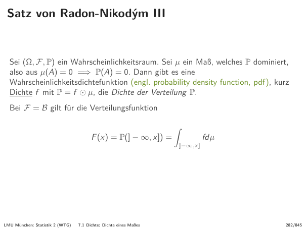

本页放在“模块二：密度是相对于某个测度的表示”中，核心是理解 概率（Wahrscheinlichkeit）、概率空间（Wahrscheinlichkeitsraum）、测度（Maß）、分布（Verteilung）。直觉上先抓住标题里的对象：Satz von Radon-Nikodým III。然后看它是定义、例子、定理还是证明；定义页要记条件，例子页要看随机机制，证明页要看用了哪些闭包性或极限定理。

关键词：

- 概率（Wahrscheinlichkeit）
- 概率空间（Wahrscheinlichkeitsraum）
- 测度（Maß）
- 分布（Verteilung）
- 分布函数（Verteilungsfunktion）
- 密度（Dichte）
- 依概率（in Wahrscheinlichkeit）

本页需要抓住的德语线索：

- `Satz von Radon-Nikodým III`
- `also aus µ(A) = 0 =⇒ P(A) = 0. Dann gibt es eine`
- `Dichte f mit P = f ⊙ µ, die Dichte der Verteilung P.`
- `Bei F = B gilt für die Verteilungsfunktion`
- `F (x ) = P(] − ∞, x ]) = fdµ`

### Seite 98 - 密度（Dichte）

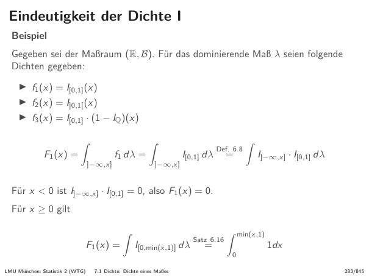

本页放在“模块二：密度是相对于某个测度的表示”中，核心是理解 测度（Maß）、密度（Dichte）。直觉上先抓住标题里的对象：密度（Dichte）。然后看它是定义、例子、定理还是证明；定义页要记条件，例子页要看随机机制，证明页要看用了哪些闭包性或极限定理。

关键词：

- 测度（Maß）
- 密度（Dichte）

本页需要抓住的德语线索：

- `Beispiel`
- `f (x ) = I (x )`
- `f (x ) = I (x )`
- `(x ) = I`
- `F (x ) = f dλ = I dλ = I · I dλ`

### Seite 99 - 密度（Dichte）

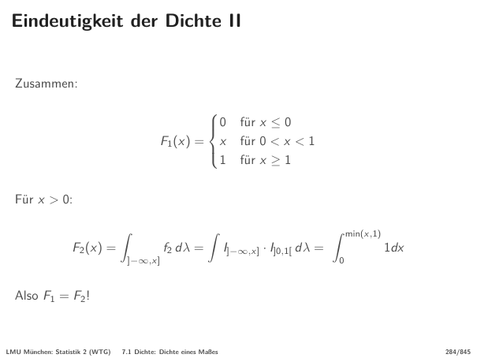

本页放在“模块二：密度是相对于某个测度的表示”中，核心是理解 密度（Dichte）。直觉上先抓住标题里的对象：密度（Dichte）。然后看它是定义、例子、定理还是证明；定义页要记条件，例子页要看随机机制，证明页要看用了哪些闭包性或极限定理。

关键词：

- 密度（Dichte）

本页需要抓住的德语线索：

- `0 für x ≤ 0`
- `F (x ) = x für 0 < x < 1`
- `für x ≥ 1`
- `F (x ) = f dλ = I · I dλ = 1dx`
- `Also F = F !`

### Seite 100 - 密度（Dichte）

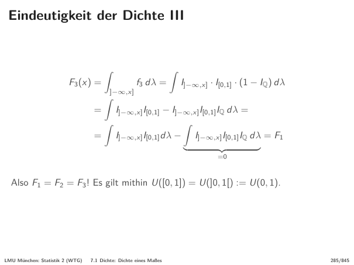

本页放在“模块二：密度是相对于某个测度的表示”中，核心是理解 密度（Dichte）。直觉上先抓住标题里的对象：密度（Dichte）。然后看它是定义、例子、定理还是证明；定义页要记条件，例子页要看随机机制，证明页要看用了哪些闭包性或极限定理。

关键词：

- 密度（Dichte）

本页需要抓住的德语线索：

- `(x ) = f`
- `dλ = I`
- `= I`
- `IQ dλ =`
- `= I`

### Seite 101 - 密度（Dichte）

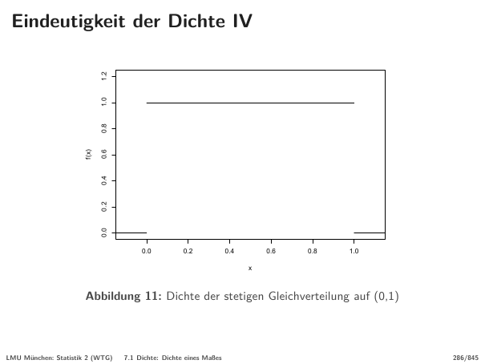

本页放在“模块二：密度是相对于某个测度的表示”中，核心是理解 密度（Dichte）。直觉上先抓住标题里的对象：密度（Dichte）。然后看它是定义、例子、定理还是证明；定义页要记条件，例子页要看随机机制，证明页要看用了哪些闭包性或极限定理。

关键词：

- 密度（Dichte）

本页需要抓住的德语线索：

- `Eindeutigkeit der Dichte IV`
- `0.0 0.2 0.4 0.6 0.8 1.0`
- `2.1`

### Seite 102 - 密度（Dichte）

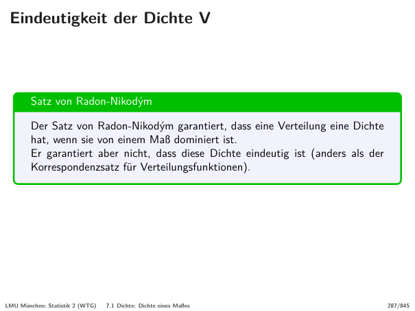

本页放在“模块二：密度是相对于某个测度的表示”中，核心是理解 测度（Maß）、分布（Verteilung）、分布函数（Verteilungsfunktion）、密度（Dichte）。直觉上先抓住标题里的对象：密度（Dichte）。然后看它是定义、例子、定理还是证明；定义页要记条件，例子页要看随机机制，证明页要看用了哪些闭包性或极限定理。

关键词：

- 测度（Maß）
- 分布（Verteilung）
- 分布函数（Verteilungsfunktion）
- 密度（Dichte）

本页需要抓住的德语线索：

- `Satz von Radon-Nikodým`
- `Der Satz von Radon-Nikodým garantiert, dass eine Verteilung eine Dichte`

### Seite 103 - 正态分布（Normalverteilung）

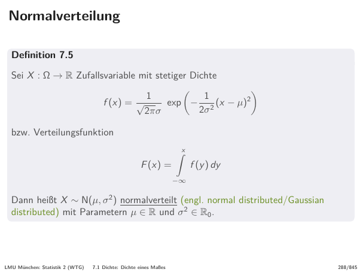

本页放在“模块二：密度是相对于某个测度的表示”中，核心是理解 随机变量（Zufallsvariable）、分布（Verteilung）、分布函数（Verteilungsfunktion）、密度（Dichte）。直觉上先抓住标题里的对象：正态分布（Normalverteilung）。然后看它是定义、例子、定理还是证明；定义页要记条件，例子页要看随机机制，证明页要看用了哪些闭包性或极限定理。

关键词：

- 随机变量（Zufallsvariable）
- 分布（Verteilung）
- 分布函数（Verteilungsfunktion）
- 密度（Dichte）
- 正态分布（Normalverteilung）

本页需要抓住的德语线索：

- `Definition 7.5`
- `Sei X : Ω → R Zufallsvariable mit stetiger Dichte`
- `f (x ) = √ exp − (x − µ)2`
- `F (x ) = f (y ) dy`
- `distributed) mit Parametern µ ∈ R und σ2 ∈ R .`

### Seite 104 - Träger

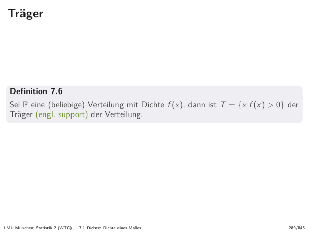

本页放在“模块二：密度是相对于某个测度的表示”中，核心是理解 分布（Verteilung）、密度（Dichte）。直觉上先抓住标题里的对象：Träger。然后看它是定义、例子、定理还是证明；定义页要记条件，例子页要看随机机制，证明页要看用了哪些闭包性或极限定理。

关键词：

- 分布（Verteilung）
- 密度（Dichte）

本页需要抓住的德语线索：

- `Definition 7.6`
- `Sei P eine (beliebige) Verteilung mit Dichte f (x ), dann ist T = {x |f (x ) > 0} der`

### Seite 105 - 密度（Dichte）

本页放在“模块二：密度是相对于某个测度的表示”中，核心是理解 测度（Maß）、分布（Verteilung）、密度（Dichte）。直觉上先抓住标题里的对象：密度（Dichte）。然后看它是定义、例子、定理还是证明；定义页要记条件，例子页要看随机机制，证明页要看用了哪些闭包性或极限定理。

关键词：

- 测度（Maß）
- 分布（Verteilung）
- 密度（Dichte）

本页需要抓住的德语线索：

- `7. Dichte`
- `7.1 Dichte eines Maßes`
- `7.2 Arten von Verteilungen`

### Seite 106 - 离散分布（Diskrete Verteilungen）

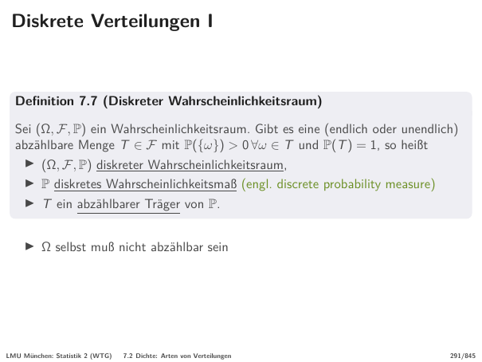

本页放在“模块二：密度是相对于某个测度的表示”中，核心是理解 概率（Wahrscheinlichkeit）、概率测度（Wahrscheinlichkeitsmaß）、概率空间（Wahrscheinlichkeitsraum）、集合（Menge）。直觉上先抓住标题里的对象：离散分布（Diskrete Verteilungen）。然后看它是定义、例子、定理还是证明；定义页要记条件，例子页要看随机机制，证明页要看用了哪些闭包性或极限定理。

关键词：

- 概率（Wahrscheinlichkeit）
- 概率测度（Wahrscheinlichkeitsmaß）
- 概率空间（Wahrscheinlichkeitsraum）
- 集合（Menge）
- 分布（Verteilung）
- 依概率（in Wahrscheinlichkeit）

本页需要抓住的德语线索：

- `Definition 7.7 (Diskreter Wahrscheinlichkeitsraum)`
- `abzählbare Menge T ∈ F mit P({ω}) > 0 ∀ω ∈ T und P(T ) = 1, so heißt`

### Seite 107 - 离散分布（Diskrete Verteilungen）

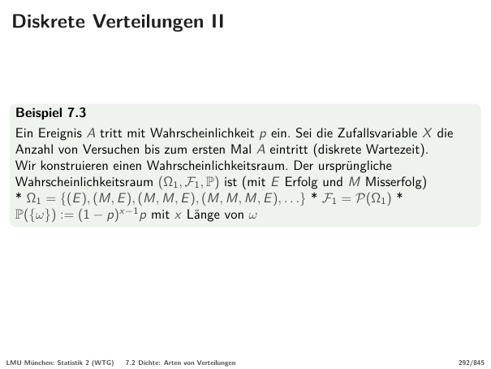

本页放在“模块二：密度是相对于某个测度的表示”中，核心是理解 概率（Wahrscheinlichkeit）、概率空间（Wahrscheinlichkeitsraum）、事件（Ereignis）、随机变量（Zufallsvariable）。直觉上先抓住标题里的对象：离散分布（Diskrete Verteilungen）。然后看它是定义、例子、定理还是证明；定义页要记条件，例子页要看随机机制，证明页要看用了哪些闭包性或极限定理。

关键词：

- 概率（Wahrscheinlichkeit）
- 概率空间（Wahrscheinlichkeitsraum）
- 事件（Ereignis）
- 随机变量（Zufallsvariable）
- 分布（Verteilung）

本页需要抓住的德语线索：

- `Beispiel 7.3`
- `* Ω = {(E ), (M, E ), (M, M, E ), (M, M, M, E ), . . .} * F = P(Ω ) *`
- `P({ω}) := (1 − p)x−1p mit x Länge von ω`

### Seite 108 - 离散分布（Diskrete Verteilungen）

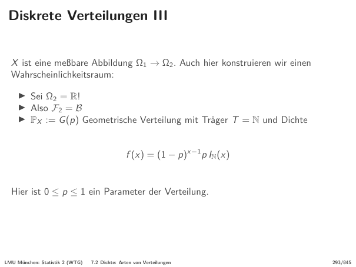

本页放在“模块二：密度是相对于某个测度的表示”中，核心是理解 概率（Wahrscheinlichkeit）、概率空间（Wahrscheinlichkeitsraum）、分布（Verteilung）、密度（Dichte）。直觉上先抓住标题里的对象：离散分布（Diskrete Verteilungen）。然后看它是定义、例子、定理还是证明；定义页要记条件，例子页要看随机机制，证明页要看用了哪些闭包性或极限定理。

关键词：

- 概率（Wahrscheinlichkeit）
- 概率空间（Wahrscheinlichkeitsraum）
- 分布（Verteilung）
- 密度（Dichte）

本页需要抓住的德语线索：

- `X ist eine meßbare Abbildung Ω → Ω . Auch hier konstruieren wir einen`
- `Sei Ω = R!`
- `Also F = B`
- `P := G(p) Geometrische Verteilung mit Träger T = N und Dichte`
- `f (x ) = (1 − p)x−1p IN(x )`

### Seite 109 - 离散分布（Diskrete Verteilungen）

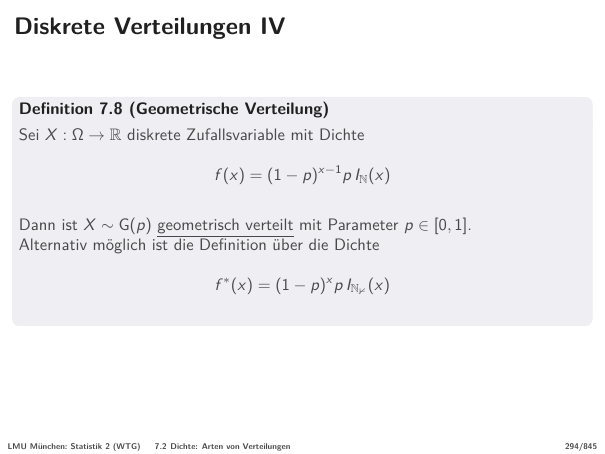

本页放在“模块二：密度是相对于某个测度的表示”中，核心是理解 随机变量（Zufallsvariable）、分布（Verteilung）、密度（Dichte）。直觉上先抓住标题里的对象：离散分布（Diskrete Verteilungen）。然后看它是定义、例子、定理还是证明；定义页要记条件，例子页要看随机机制，证明页要看用了哪些闭包性或极限定理。

关键词：

- 随机变量（Zufallsvariable）
- 分布（Verteilung）
- 密度（Dichte）

本页需要抓住的德语线索：

- `Definition 7.8 (Geometrische Verteilung)`
- `Sei X : Ω → R diskrete Zufallsvariable mit Dichte`
- `f (x ) = (1 − p)x−1p IN(x )`
- `Dann ist X ∼ G(p) geometrisch verteilt mit Parameter p ∈ [0, 1].`
- `Alternativ möglich ist die Definition über die Dichte`

### Seite 110 - 连续分布（Stetige Verteilungen）

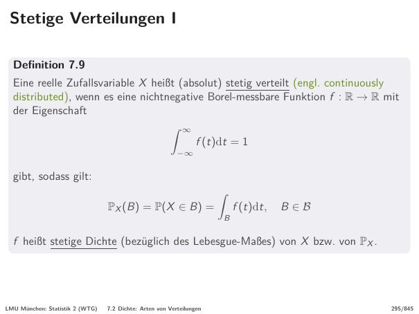

本页放在“模块二：密度是相对于某个测度的表示”中，核心是理解 可测（messbar）、随机变量（Zufallsvariable）、分布（Verteilung）。直觉上先抓住标题里的对象：连续分布（Stetige Verteilungen）。然后看它是定义、例子、定理还是证明；定义页要记条件，例子页要看随机机制，证明页要看用了哪些闭包性或极限定理。

关键词：

- 可测（messbar）
- 随机变量（Zufallsvariable）
- 分布（Verteilung）

本页需要抓住的德语线索：

- `Definition 7.9`
- `distributed), wenn es eine nichtnegative Borel-messbare Funktion f : R → R mit`
- `f (t)dt = 1`
- `P (B) = P(X ∈ B) = f (t)dt, B ∈ B`

### Seite 111 - 连续分布（Stetige Verteilungen）

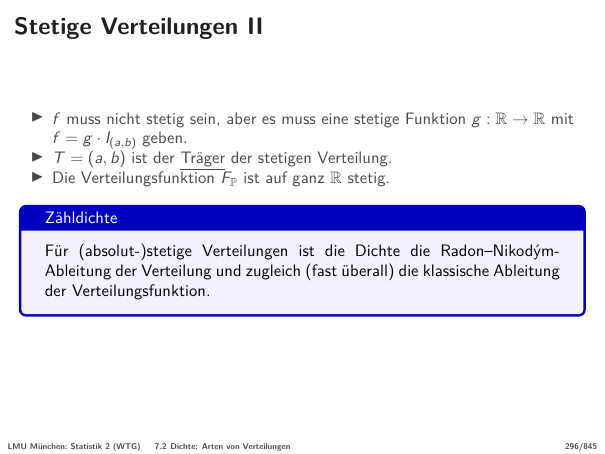

本页放在“模块二：密度是相对于某个测度的表示”中，核心是理解 分布（Verteilung）、分布函数（Verteilungsfunktion）、密度（Dichte）。直觉上先抓住标题里的对象：连续分布（Stetige Verteilungen）。然后看它是定义、例子、定理还是证明；定义页要记条件，例子页要看随机机制，证明页要看用了哪些闭包性或极限定理。

关键词：

- 分布（Verteilung）
- 分布函数（Verteilungsfunktion）
- 密度（Dichte）

本页需要抓住的德语线索：

- `f muss nicht stetig sein, aber es muss eine stetige Funktion g : R → R mit`
- `f = g · I geben.`
- `T = (a, b) ist der Träger der stetigen Verteilung.`

### Seite 112 - 连续分布（Stetige Verteilungen）

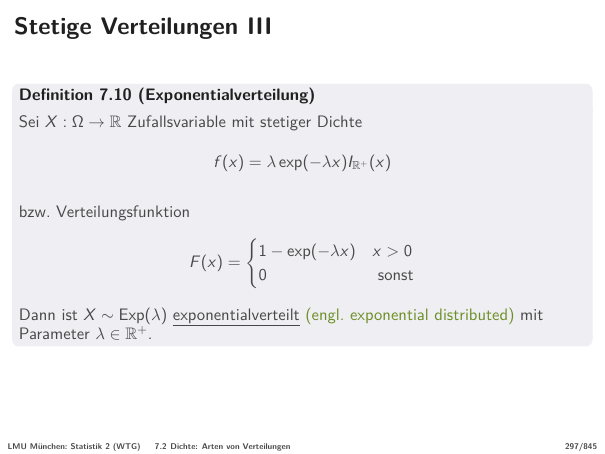

本页放在“模块二：密度是相对于某个测度的表示”中，核心是理解 随机变量（Zufallsvariable）、分布（Verteilung）、分布函数（Verteilungsfunktion）、密度（Dichte）。直觉上先抓住标题里的对象：连续分布（Stetige Verteilungen）。然后看它是定义、例子、定理还是证明；定义页要记条件，例子页要看随机机制，证明页要看用了哪些闭包性或极限定理。

关键词：

- 随机变量（Zufallsvariable）
- 分布（Verteilung）
- 分布函数（Verteilungsfunktion）
- 密度（Dichte）
- 指数分布（Exponentialverteilung）

本页需要抓住的德语线索：

- `Definition 7.10 (Exponentialverteilung)`
- `Sei X : Ω → R Zufallsvariable mit stetiger Dichte`
- `f (x ) = λ exp(−λx )IR+ (x )`
- `F (x ) =`
- `Parameter λ ∈ R+.`

### Seite 113 - 连续分布（Stetige Verteilungen）

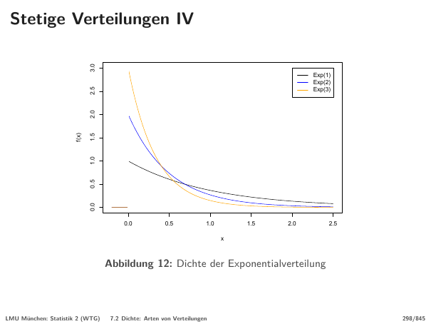

本页放在“模块二：密度是相对于某个测度的表示”中，核心是理解 分布（Verteilung）。直觉上先抓住标题里的对象：连续分布（Stetige Verteilungen）。然后看它是定义、例子、定理还是证明；定义页要记条件，例子页要看随机机制，证明页要看用了哪些闭包性或极限定理。

关键词：

- 分布（Verteilung）

本页需要抓住的德语线索：

- `Stetige Verteilungen IV`
- `0.0 0.5 1.0 1.5 2.0 2.5`
- `0.3`

### Seite 114 - 连续分布（Stetige Verteilungen）

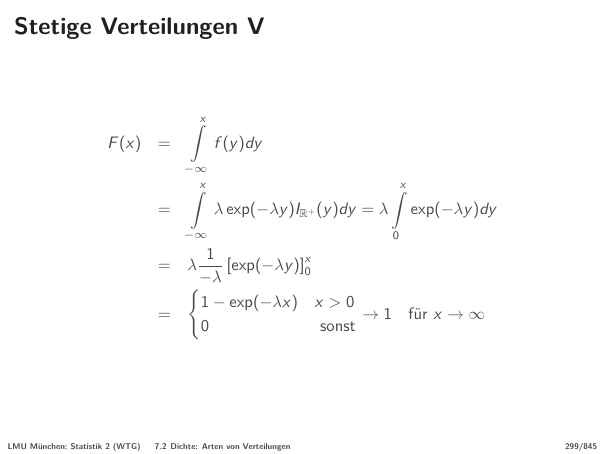

本页放在“模块二：密度是相对于某个测度的表示”中，核心是理解 分布（Verteilung）。直觉上先抓住标题里的对象：连续分布（Stetige Verteilungen）。然后看它是定义、例子、定理还是证明；定义页要记条件，例子页要看随机机制，证明页要看用了哪些闭包性或极限定理。

关键词：

- 分布（Verteilung）

本页需要抓住的德语线索：

- `F (x ) = f (y )dy`
- `= λ exp(−λy )IR+ (y )dy = λ exp(−λy )dy`
- `= λ [exp(−λy )]x`
- `= → 1 für x → ∞`

### Seite 115 - 连续分布（Stetige Verteilungen）

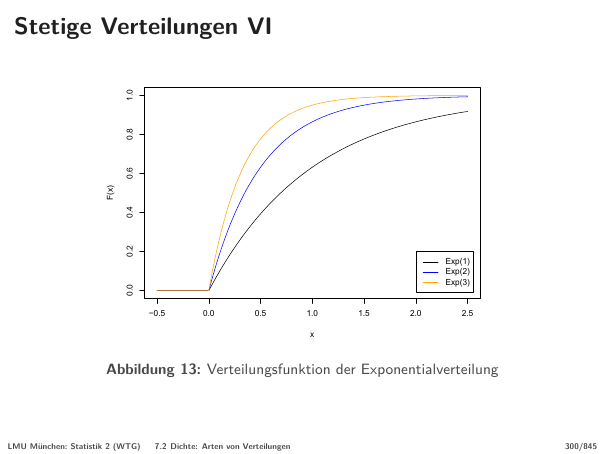

本页放在“模块二：密度是相对于某个测度的表示”中，核心是理解 分布（Verteilung）。直觉上先抓住标题里的对象：连续分布（Stetige Verteilungen）。然后看它是定义、例子、定理还是证明；定义页要记条件，例子页要看随机机制，证明页要看用了哪些闭包性或极限定理。

关键词：

- 分布（Verteilung）

本页需要抓住的德语线索：

- `Stetige Verteilungen VI`
- `−0.5 0.0 0.5 1.0 1.5 2.0 2.5`
- `0.1`

### Seite 116 - 分布（Verteilung）

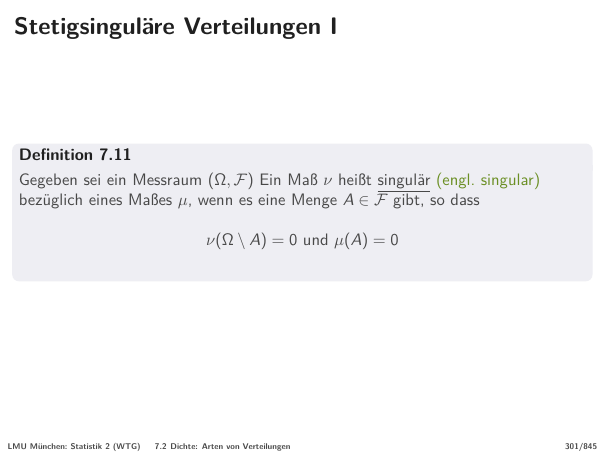

本页放在“模块二：密度是相对于某个测度的表示”中，核心是理解 集合（Menge）、测度（Maß）、分布（Verteilung）。直觉上先抓住标题里的对象：分布（Verteilung）。然后看它是定义、例子、定理还是证明；定义页要记条件，例子页要看随机机制，证明页要看用了哪些闭包性或极限定理。

关键词：

- 集合（Menge）
- 测度（Maß）
- 分布（Verteilung）

本页需要抓住的德语线索：

- `Definition 7.11`
- `bezüglich eines Maßes µ, wenn es eine Menge A ∈ F gibt, so dass`
- `ν(Ω \ A) = 0 und µ(A) = 0`

### Seite 117 - 分布（Verteilung）

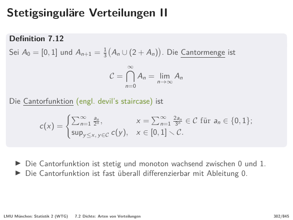

本页放在“模块二：密度是相对于某个测度的表示”中，核心是理解 分布（Verteilung）。直觉上先抓住标题里的对象：分布（Verteilung）。然后看它是定义、例子、定理还是证明；定义页要记条件，例子页要看随机机制，证明页要看用了哪些闭包性或极限定理。

关键词：

- 分布（Verteilung）

本页需要抓住的德语线索：

- `Definition 7.12`
- `Sei A = [0, 1] und A = 1 (cid:0) A ∪ (2 + A ) (cid:1) . Die Cantormenge ist`
- `C = A = lim A`
- `n→∞`
- `n=0`

### Seite 118 - 分布（Verteilung）

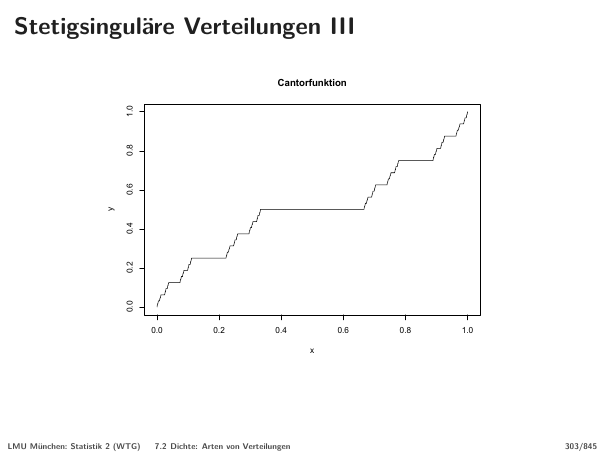

本页放在“模块二：密度是相对于某个测度的表示”中，核心是理解 分布（Verteilung）。直觉上先抓住标题里的对象：分布（Verteilung）。然后看它是定义、例子、定理还是证明；定义页要记条件，例子页要看随机机制，证明页要看用了哪些闭包性或极限定理。

关键词：

- 分布（Verteilung）

本页需要抓住的德语线索：

- `Stetigsinguläre Verteilungen III`
- `0.0 0.2 0.4 0.6 0.8 1.0`
- `0.1`

### Seite 119 - 分布（Verteilung）

本页放在“模块二：密度是相对于某个测度的表示”中，核心是理解 随机变量（Zufallsvariable）、分布（Verteilung）、分布函数（Verteilungsfunktion）。直觉上先抓住标题里的对象：分布（Verteilung）。然后看它是定义、例子、定理还是证明；定义页要记条件，例子页要看随机机制，证明页要看用了哪些闭包性或极限定理。

关键词：

- 随机变量（Zufallsvariable）
- 分布（Verteilung）
- 分布函数（Verteilungsfunktion）

本页需要抓住的德语线索：

- `Definition 7.13`

### Seite 120 - 分布（Verteilung）

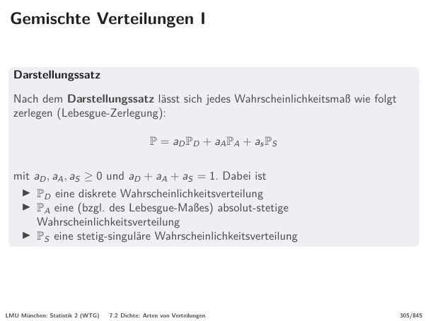

本页放在“模块二：密度是相对于某个测度的表示”中，核心是理解 概率（Wahrscheinlichkeit）、概率测度（Wahrscheinlichkeitsmaß）、测度（Maß）、分布（Verteilung）。直觉上先抓住标题里的对象：分布（Verteilung）。然后看它是定义、例子、定理还是证明；定义页要记条件，例子页要看随机机制，证明页要看用了哪些闭包性或极限定理。

关键词：

- 概率（Wahrscheinlichkeit）
- 概率测度（Wahrscheinlichkeitsmaß）
- 测度（Maß）
- 分布（Verteilung）

本页需要抓住的德语线索：

- `P = a P + a P + a P`
- `mit a , a , a ≥ 0 und a + a + a = 1. Dabei ist`

### Seite 121 - 分布（Verteilung）

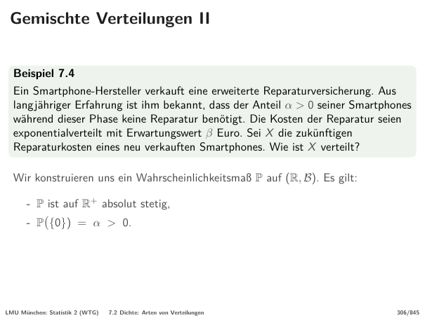

本页放在“模块二：密度是相对于某个测度的表示”中，核心是理解 概率（Wahrscheinlichkeit）、概率测度（Wahrscheinlichkeitsmaß）、分布（Verteilung）、期望（Erwartungswert）。直觉上先抓住标题里的对象：分布（Verteilung）。然后看它是定义、例子、定理还是证明；定义页要记条件，例子页要看随机机制，证明页要看用了哪些闭包性或极限定理。

关键词：

- 概率（Wahrscheinlichkeit）
- 概率测度（Wahrscheinlichkeitsmaß）
- 分布（Verteilung）
- 期望（Erwartungswert）
- 依概率（in Wahrscheinlichkeit）

本页需要抓住的德语线索：

- `Beispiel 7.4`
- `Wir konstruieren uns ein Wahrscheinlichkeitsmaß P auf (R, B). Es gilt:`
- `P(cid:0)`
- `{0}) = α > 0.`

### Seite 122 - 分布（Verteilung）

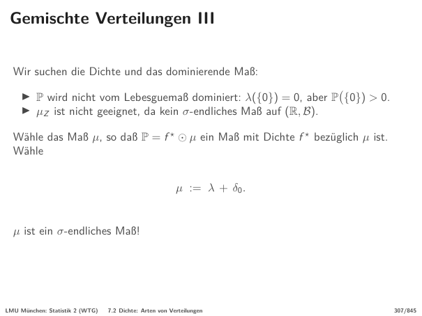

本页放在“模块二：密度是相对于某个测度的表示”中，核心是理解 测度（Maß）、分布（Verteilung）、密度（Dichte）。直觉上先抓住标题里的对象：分布（Verteilung）。然后看它是定义、例子、定理还是证明；定义页要记条件，例子页要看随机机制，证明页要看用了哪些闭包性或极限定理。

关键词：

- 测度（Maß）
- 分布（Verteilung）
- 密度（Dichte）

本页需要抓住的德语线索：

- `P wird nicht vom Lebesguemaß dominiert: λ({0}) = 0, aber P(cid:0) {0}) > 0.`
- `Wähle das Maß µ, so daß P = f ⋆ ⊙ µ ein Maß mit Dichte f ⋆ bezüglich µ ist.`
- `µ := λ + δ .`

### Seite 123 - 分布（Verteilung）

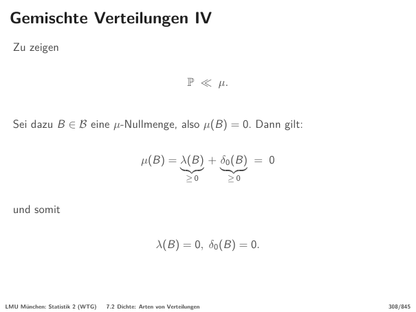

本页放在“模块二：密度是相对于某个测度的表示”中，核心是理解 分布（Verteilung）。直觉上先抓住标题里的对象：分布（Verteilung）。然后看它是定义、例子、定理还是证明；定义页要记条件，例子页要看随机机制，证明页要看用了哪些闭包性或极限定理。

关键词：

- 分布（Verteilung）

本页需要抓住的德语线索：

- `Sei dazu B ∈ B eine µ-Nullmenge, also µ(B) = 0. Dann gilt:`
- `µ(B) = λ(B) + δ (B) = 0`
- `≥ 0 ≥ 0`
- `λ(B) = 0, δ (B) = 0.`

### Seite 124 - 分布（Verteilung）

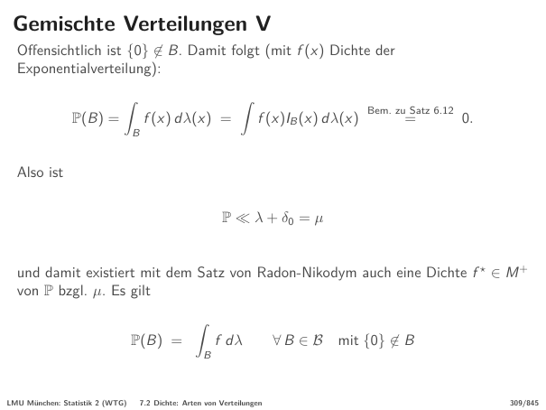

本页放在“模块二：密度是相对于某个测度的表示”中，核心是理解 分布（Verteilung）、密度（Dichte）、指数分布（Exponentialverteilung）。直觉上先抓住标题里的对象：分布（Verteilung）。然后看它是定义、例子、定理还是证明；定义页要记条件，例子页要看随机机制，证明页要看用了哪些闭包性或极限定理。

关键词：

- 分布（Verteilung）
- 密度（Dichte）
- 指数分布（Exponentialverteilung）

本页需要抓住的德语线索：

- `Offensichtlich ist {0} ̸∈ B. Damit folgt (mit f (x ) Dichte der`
- `P(B) = f (x ) dλ(x ) = f (x )I (x ) dλ(x ) Bem. zu = Satz 6.12 0.`
- `P ≪ λ + δ = µ`
- `und damit existiert mit dem Satz von Radon-Nikodym auch eine Dichte f ⋆ ∈ M+`
- `von P bzgl. µ. Es gilt`

### Seite 125 - 分布（Verteilung）

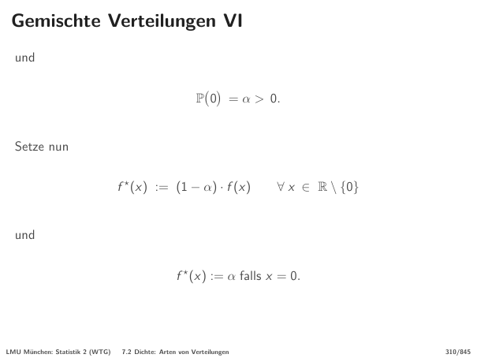

本页放在“模块二：密度是相对于某个测度的表示”中，核心是理解 分布（Verteilung）。直觉上先抓住标题里的对象：分布（Verteilung）。然后看它是定义、例子、定理还是证明；定义页要记条件，例子页要看随机机制，证明页要看用了哪些闭包性或极限定理。

关键词：

- 分布（Verteilung）

本页需要抓住的德语线索：

- `P(cid:0)`
- `= α > 0.`
- `f ⋆(x ) := (1 − α) · f (x ) ∀ x ∈ R \ {0}`
- `f ⋆(x ) := α falls x = 0.`

### Seite 126 - 分布（Verteilung）

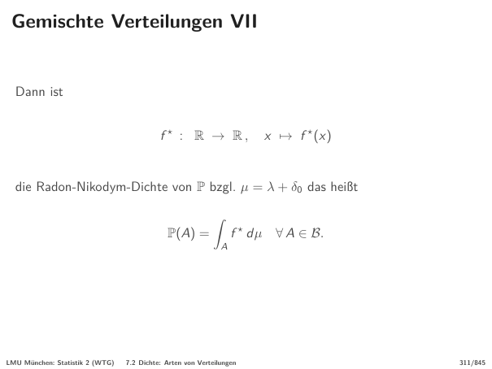

本页放在“模块二：密度是相对于某个测度的表示”中，核心是理解 分布（Verteilung）、密度（Dichte）。直觉上先抓住标题里的对象：分布（Verteilung）。然后看它是定义、例子、定理还是证明；定义页要记条件，例子页要看随机机制，证明页要看用了哪些闭包性或极限定理。

关键词：

- 分布（Verteilung）
- 密度（Dichte）

本页需要抓住的德语线索：

- `f ⋆ : R → R , x 7→ f ⋆(x )`
- `die Radon-Nikodym-Dichte von P bzgl. µ = λ + δ das heißt`
- `P(A) = f ⋆ dµ ∀ A ∈ B.`

## 模块三：矩把分布压缩成可计算特征（Seite 127-187）

期望、方差、高阶矩和重要不等式让你不用知道完整分布也能控制随机变量。Markov、Chebyshev、Jensen 这类不等式是极限定理的基础工具。

### Seite 127 - 矩（Momente）

本页放在“模块三：矩把分布压缩成可计算特征”中，核心是理解 期望（Erwartungswert）。直觉上先抓住标题里的对象：矩（Momente）。然后看它是定义、例子、定理还是证明；定义页要记条件，例子页要看随机机制，证明页要看用了哪些闭包性或极限定理。

关键词：

- 期望（Erwartungswert）

本页需要抓住的德语线索：

- `Kapitel 8`
- `Momente`
- `8. Momente`

### Seite 128 - 矩（Momente）

本页放在“模块三：矩把分布压缩成可计算特征”中，核心是理解 概率（Wahrscheinlichkeit）。直觉上先抓住标题里的对象：矩（Momente）。然后看它是定义、例子、定理还是证明；定义页要记条件，例子页要看随机机制，证明页要看用了哪些闭包性或极限定理。

关键词：

- 概率（Wahrscheinlichkeit）

本页需要抓住的德语线索：

- `Momente`
- `Da lernt man Dreisatz und Wahrscheinlichkeitsrechnung und steht`
- `trotzdem grübelnd vor dem Backofen, welche der vier Schienen nun die`

### Seite 129 - Ziele des Kapitels

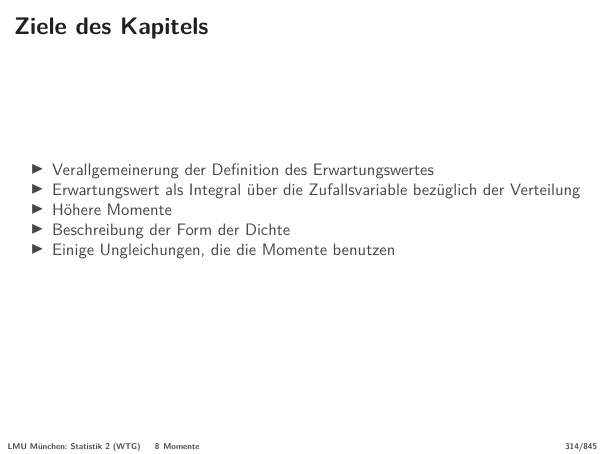

本页放在“模块三：矩把分布压缩成可计算特征”中，核心是理解 随机变量（Zufallsvariable）、分布（Verteilung）、密度（Dichte）、期望（Erwartungswert）。直觉上先抓住标题里的对象：Ziele des Kapitels。然后看它是定义、例子、定理还是证明；定义页要记条件，例子页要看随机机制，证明页要看用了哪些闭包性或极限定理。

关键词：

- 随机变量（Zufallsvariable）
- 分布（Verteilung）
- 密度（Dichte）
- 期望（Erwartungswert）

本页需要抓住的德语线索：

- `Ziele des Kapitels`
- `Verallgemeinerung der Definition des Erwartungswertes`

### Seite 130 - 矩（Momente）

本页放在“模块三：矩把分布压缩成可计算特征”中，核心是理解 期望（Erwartungswert）。直觉上先抓住标题里的对象：矩（Momente）。然后看它是定义、例子、定理还是证明；定义页要记条件，例子页要看随机机制，证明页要看用了哪些闭包性或极限定理。

关键词：

- 期望（Erwartungswert）

本页需要抓住的德语线索：

- `8. Momente`
- `8.1 Erwartungswert`
- `8.2 Momente`

### Seite 131 - 期望（Erwartungswert）

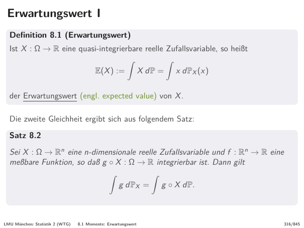

本页放在“模块三：矩把分布压缩成可计算特征”中，核心是理解 随机变量（Zufallsvariable）、期望（Erwartungswert）。直觉上先抓住标题里的对象：期望（Erwartungswert）。然后看它是定义、例子、定理还是证明；定义页要记条件，例子页要看随机机制，证明页要看用了哪些闭包性或极限定理。

关键词：

- 随机变量（Zufallsvariable）
- 期望（Erwartungswert）

本页需要抓住的德语线索：

- `Definition 8.1 (Erwartungswert)`
- `Ist X : Ω → R eine quasi-integrierbare reelle Zufallsvariable, so heißt`
- `E(X ) := X dP = x dP (x )`
- `Die zweite Gleichheit ergibt sich aus folgendem Satz:`
- `Satz 8.2`

### Seite 132 - 期望（Erwartungswert）

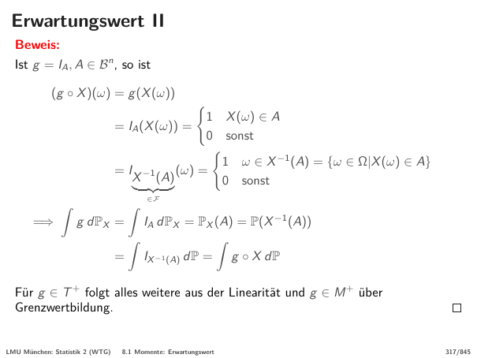

本页放在“模块三：矩把分布压缩成可计算特征”中，核心是理解 期望（Erwartungswert）。直觉上先抓住标题里的对象：期望（Erwartungswert）。然后看它是定义、例子、定理还是证明；定义页要记条件，例子页要看随机机制，证明页要看用了哪些闭包性或极限定理。

关键词：

- 期望（Erwartungswert）

本页需要抓住的德语线索：

- `Ist g = I , A ∈ Bn, so ist`
- `(g ◦ X )(ω) = g(X (ω))`
- `1 X (ω) ∈ A`
- `= I (X (ω)) =`
- `1 ω ∈ X −1(A) = {ω ∈ Ω|X (ω) ∈ A}`

### Seite 133 - 期望（Erwartungswert）

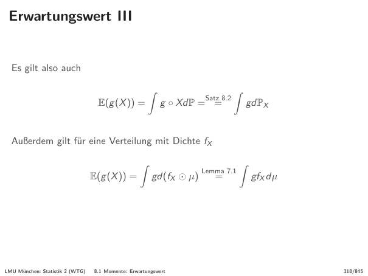

本页放在“模块三：矩把分布压缩成可计算特征”中，核心是理解 分布（Verteilung）、密度（Dichte）、期望（Erwartungswert）。直觉上先抓住标题里的对象：期望（Erwartungswert）。然后看它是定义、例子、定理还是证明；定义页要记条件，例子页要看随机机制，证明页要看用了哪些闭包性或极限定理。

关键词：

- 分布（Verteilung）
- 密度（Dichte）
- 期望（Erwartungswert）

本页需要抓住的德语线索：

- `Es gilt also auch`
- `E(g(X )) = g ◦ XdP = Sat = z 8.2 gdP`
- `E(g(X )) = gd(f ⊙ µ) Lemm = a 7.1 gf dµ`

### Seite 134 - 期望（Erwartungswert）

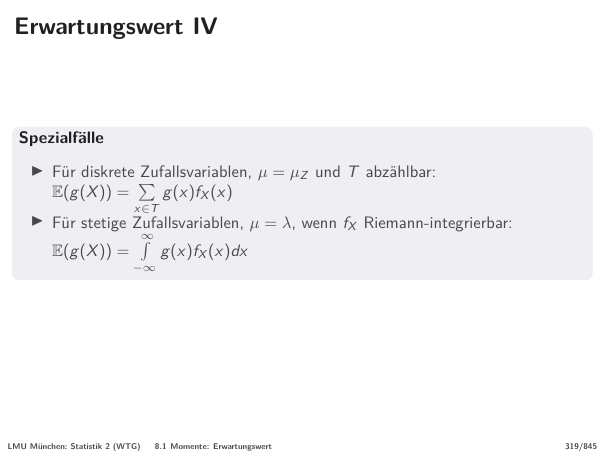

本页放在“模块三：矩把分布压缩成可计算特征”中，核心是理解 随机变量（Zufallsvariable）、期望（Erwartungswert）。直觉上先抓住标题里的对象：期望（Erwartungswert）。然后看它是定义、例子、定理还是证明；定义页要记条件，例子页要看随机机制，证明页要看用了哪些闭包性或极限定理。

关键词：

- 随机变量（Zufallsvariable）
- 期望（Erwartungswert）

本页需要抓住的德语线索：

- `Für diskrete Zufallsvariablen, µ = µ und T abzählbar:`
- `E(g(X )) = P g(x )f (x )`
- `x∈T`
- `Für stetige Zufallsvariablen, µ = λ, wenn f Riemann-integrierbar:`
- `E(g(X )) = R g(x )f (x )dx`

### Seite 135 - 期望（Erwartungswert）

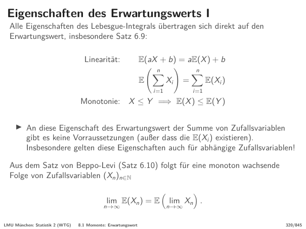

本页放在“模块三：矩把分布压缩成可计算特征”中，核心是理解 随机变量（Zufallsvariable）、Lebesgue 积分（Lebesgue-Integral）、期望（Erwartungswert）。直觉上先抓住标题里的对象：期望（Erwartungswert）。然后看它是定义、例子、定理还是证明；定义页要记条件，例子页要看随机机制，证明页要看用了哪些闭包性或极限定理。

关键词：

- 随机变量（Zufallsvariable）
- Lebesgue 积分（Lebesgue-Integral）
- 期望（Erwartungswert）

本页需要抓住的德语线索：

- `Erwartungswert, insbesondere Satz 6.9:`
- `Linearität: E(aX + b) = aE(X ) + b`
- `E X = E(X )`
- `i=1 i=1`
- `Monotonie: X ≤ Y =⇒ E(X ) ≤ E(Y )`

### Seite 136 - Beispiele I

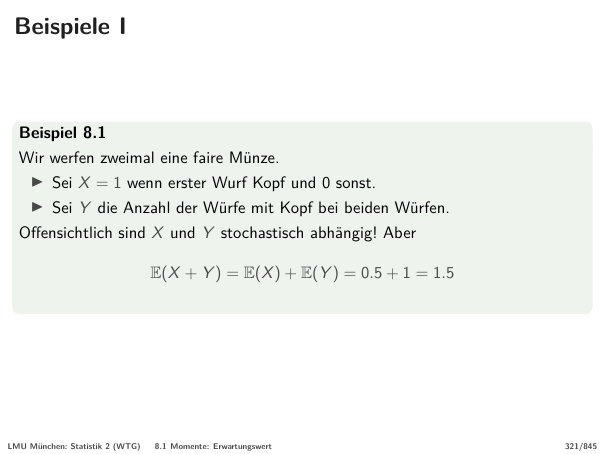

本页放在“模块三：矩把分布压缩成可计算特征”中，主要作用是推进 Seite 127-187 这一段的概念链。先把标题“Beispiele I”和前后页联系起来，再区分它是在给定义、展示例子、证明性质，还是做章节过渡。

本页需要抓住的德语线索：

- `Beispiele I`
- `Beispiel 8.1`
- `Sei X = 1 wenn erster Wurf Kopf und 0 sonst.`
- `E(X + Y ) = E(X ) + E(Y ) = 0.5 + 1 = 1.5`

### Seite 137 - Beispiele II

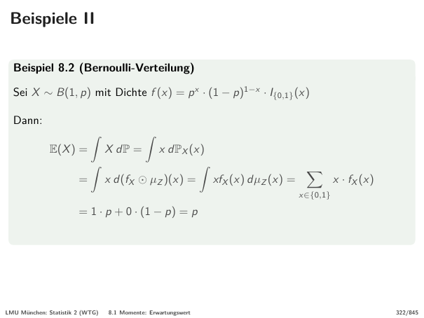

本页放在“模块三：矩把分布压缩成可计算特征”中，核心是理解 分布（Verteilung）、密度（Dichte）。直觉上先抓住标题里的对象：Beispiele II。然后看它是定义、例子、定理还是证明；定义页要记条件，例子页要看随机机制，证明页要看用了哪些闭包性或极限定理。

关键词：

- 分布（Verteilung）
- 密度（Dichte）

本页需要抓住的德语线索：

- `Beispiele II`
- `Beispiel 8.2 (Bernoulli-Verteilung)`
- `Sei X ∼ B(1, p) mit Dichte f (x ) = px · (1 − p)1−x · I (x )`
- `E(X ) = X dP = x dP (x )`
- `= x d(f ⊙ µ )(x ) = xf (x ) dµ (x ) = x · f (x )`

### Seite 138 - Beispiele III

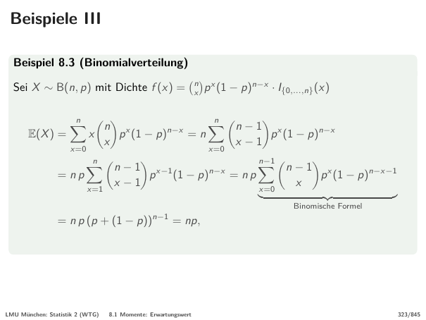

本页放在“模块三：矩把分布压缩成可计算特征”中，核心是理解 密度（Dichte）、二项分布（Binomialverteilung）。直觉上先抓住标题里的对象：Beispiele III。然后看它是定义、例子、定理还是证明；定义页要记条件，例子页要看随机机制，证明页要看用了哪些闭包性或极限定理。

关键词：

- 密度（Dichte）
- 二项分布（Binomialverteilung）

本页需要抓住的德语线索：

- `Beispiele III`
- `Beispiel 8.3 (Binomialverteilung)`
- `Sei X ∼ B(n, p) mit Dichte f (x ) = (cid:0)n(cid:1) px (1 − p)n−x · I (x )`
- `E(X ) = x px (1 − p)n−x = n px (1 − p)n−x`
- `x=0 x=0`

### Seite 139 - Beispiele IV

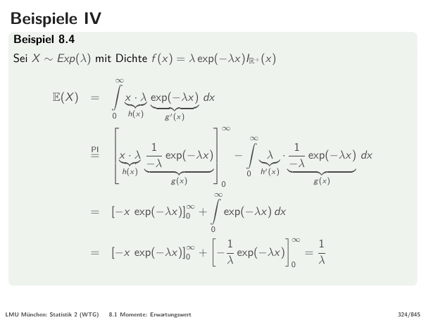

本页放在“模块三：矩把分布压缩成可计算特征”中，核心是理解 密度（Dichte）。直觉上先抓住标题里的对象：Beispiele IV。然后看它是定义、例子、定理还是证明；定义页要记条件，例子页要看随机机制，证明页要看用了哪些闭包性或极限定理。

关键词：

- 密度（Dichte）

本页需要抓住的德语线索：

- `Beispiele IV`
- `Beispiel 8.4`
- `Sei X ∼ Exp(λ) mit Dichte f (x ) = λ exp(−λx )IR+ (x )`
- `E(X ) = x · λ exp(−λx ) dx`
- `= x · λ exp(−λx ) − λ · exp(−λx ) dx`

### Seite 140 - Sankt-Petersburg-Paradoxon I

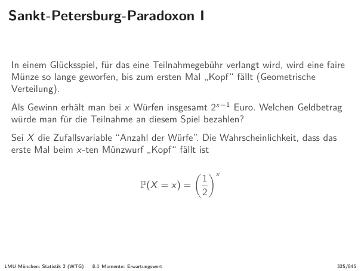

本页放在“模块三：矩把分布压缩成可计算特征”中，核心是理解 概率（Wahrscheinlichkeit）、随机变量（Zufallsvariable）、分布（Verteilung）。直觉上先抓住标题里的对象：Sankt-Petersburg-Paradoxon I。然后看它是定义、例子、定理还是证明；定义页要记条件，例子页要看随机机制，证明页要看用了哪些闭包性或极限定理。

关键词：

- 概率（Wahrscheinlichkeit）
- 随机变量（Zufallsvariable）
- 分布（Verteilung）

本页需要抓住的德语线索：

- `P(X = x ) =`

### Seite 141 - Sankt-Petersburg-Paradoxon II

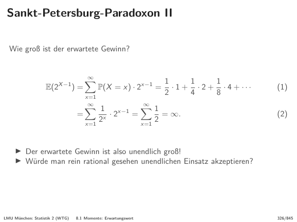

本页放在“模块三：矩把分布压缩成可计算特征”中，主要作用是推进 Seite 127-187 这一段的概念链。先把标题“Sankt-Petersburg-Paradoxon II”和前后页联系起来，再区分它是在给定义、展示例子、证明性质，还是做章节过渡。

本页需要抓住的德语线索：

- `E(2X−1) = P(X = x ) · 2x−1 = · 1 + · 2 + · 4 + · · · (1)`
- `x=1`
- `= · 2x−1 = = ∞. (2)`
- `x=1 x=1`

### Seite 142 - 期望（Erwartungswert）

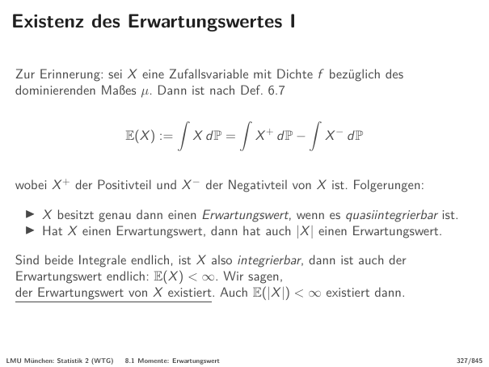

本页放在“模块三：矩把分布压缩成可计算特征”中，核心是理解 测度（Maß）、随机变量（Zufallsvariable）、密度（Dichte）、期望（Erwartungswert）。直觉上先抓住标题里的对象：期望（Erwartungswert）。然后看它是定义、例子、定理还是证明；定义页要记条件，例子页要看随机机制，证明页要看用了哪些闭包性或极限定理。

关键词：

- 测度（Maß）
- 随机变量（Zufallsvariable）
- 密度（Dichte）
- 期望（Erwartungswert）

本页需要抓住的德语线索：

- `E(X ) := X dP = X + dP − X − dP`
- `Erwartungswert endlich: E(X ) < ∞. Wir sagen,`
- `der Erwartungswert von X existiert. Auch E(|X |) < ∞ existiert dann.`

### Seite 143 - 期望（Erwartungswert）

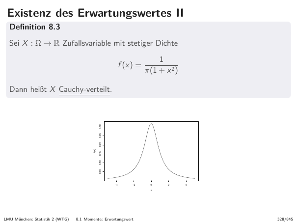

本页放在“模块三：矩把分布压缩成可计算特征”中，核心是理解 随机变量（Zufallsvariable）、密度（Dichte）、期望（Erwartungswert）、Cauchy 分布（Cauchy）。直觉上先抓住标题里的对象：期望（Erwartungswert）。然后看它是定义、例子、定理还是证明；定义页要记条件，例子页要看随机机制，证明页要看用了哪些闭包性或极限定理。

关键词：

- 随机变量（Zufallsvariable）
- 密度（Dichte）
- 期望（Erwartungswert）
- Cauchy 分布（Cauchy）

本页需要抓住的德语线索：

- `Definition 8.3`
- `Sei X : Ω → R Zufallsvariable mit stetiger Dichte`
- `f (x ) =`

### Seite 144 - 期望（Erwartungswert）

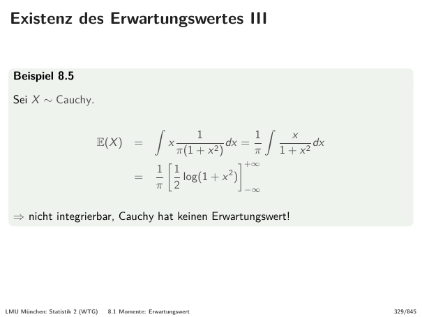

本页放在“模块三：矩把分布压缩成可计算特征”中，核心是理解 期望（Erwartungswert）、Cauchy 分布（Cauchy）。直觉上先抓住标题里的对象：期望（Erwartungswert）。然后看它是定义、例子、定理还是证明；定义页要记条件，例子页要看随机机制，证明页要看用了哪些闭包性或极限定理。

关键词：

- 期望（Erwartungswert）
- Cauchy 分布（Cauchy）

本页需要抓住的德语线索：

- `Beispiel 8.5`
- `E(X ) = x dx = dx`
- `= log(1 + x 2)`

### Seite 145 - 矩（Momente）

本页放在“模块三：矩把分布压缩成可计算特征”中，核心是理解 期望（Erwartungswert）。直觉上先抓住标题里的对象：矩（Momente）。然后看它是定义、例子、定理还是证明；定义页要记条件，例子页要看随机机制，证明页要看用了哪些闭包性或极限定理。

关键词：

- 期望（Erwartungswert）

本页需要抓住的德语线索：

- `8. Momente`
- `8.1 Erwartungswert`
- `8.2 Momente`

### Seite 146 - 矩（Momente）

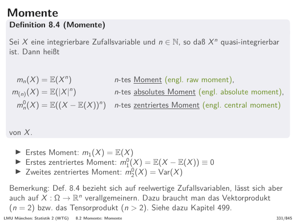

本页放在“模块三：矩把分布压缩成可计算特征”中，核心是理解 随机变量（Zufallsvariable）。直觉上先抓住标题里的对象：矩（Momente）。然后看它是定义、例子、定理还是证明；定义页要记条件，例子页要看随机机制，证明页要看用了哪些闭包性或极限定理。

关键词：

- 随机变量（Zufallsvariable）

本页需要抓住的德语线索：

- `Definition 8.4 (Momente)`
- `Sei X eine integrierbare Zufallsvariable und n ∈ N, so daß X n quasi-integrierbar`
- `m (X ) = E(X n) n-tes Moment (engl. raw moment),`
- `m (X ) = E(|X |n) n-tes absolutes Moment (engl. absolute moment),`
- `m0(X ) = E((X − E(X ))n) n-tes zentriertes Moment (engl. central moment)`

### Seite 147 - 方差（Varianz）

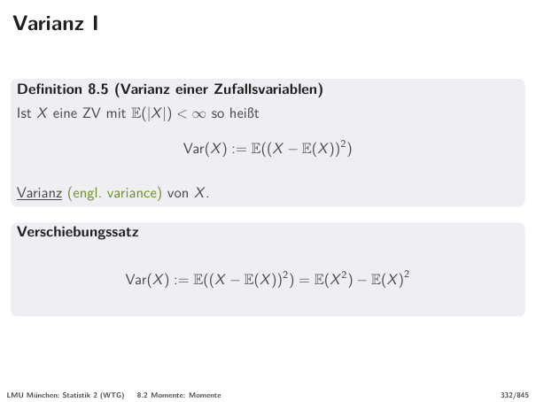

本页放在“模块三：矩把分布压缩成可计算特征”中，核心是理解 随机变量（Zufallsvariable）、方差（Varianz）。直觉上先抓住标题里的对象：方差（Varianz）。然后看它是定义、例子、定理还是证明；定义页要记条件，例子页要看随机机制，证明页要看用了哪些闭包性或极限定理。

关键词：

- 随机变量（Zufallsvariable）
- 方差（Varianz）

本页需要抓住的德语线索：

- `Definition 8.5 (Varianz einer Zufallsvariablen)`
- `Ist X eine ZV mit E(|X |) < ∞ so heißt`
- `Var(X ) := E((X − E(X ))2)`
- `Var(X ) := E((X − E(X ))2) = E(X 2) − E(X )2`

### Seite 148 - 方差（Varianz）

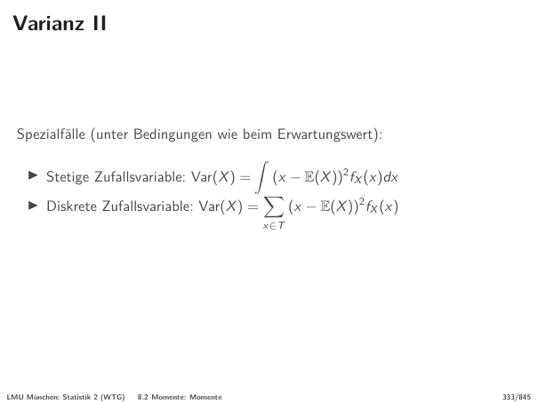

本页放在“模块三：矩把分布压缩成可计算特征”中，核心是理解 随机变量（Zufallsvariable）、期望（Erwartungswert）、方差（Varianz）。直觉上先抓住标题里的对象：方差（Varianz）。然后看它是定义、例子、定理还是证明；定义页要记条件，例子页要看随机机制，证明页要看用了哪些闭包性或极限定理。

关键词：

- 随机变量（Zufallsvariable）
- 期望（Erwartungswert）
- 方差（Varianz）

本页需要抓住的德语线索：

- `Stetige Zufallsvariable: Var(X ) = (x − E(X ))2f (x )dx`
- `Diskrete Zufallsvariable: Var(X ) = X (x − E(X ))2f (x )`
- `x∈T`

### Seite 149 - 方差（Varianz）

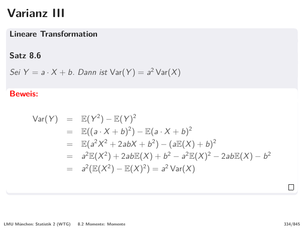

本页放在“模块三：矩把分布压缩成可计算特征”中，核心是理解 方差（Varianz）。直觉上先抓住标题里的对象：方差（Varianz）。然后看它是定义、例子、定理还是证明；定义页要记条件，例子页要看随机机制，证明页要看用了哪些闭包性或极限定理。

关键词：

- 方差（Varianz）

本页需要抓住的德语线索：

- `Satz 8.6`
- `Sei Y = a · X + b. Dann ist Var(Y ) = a2 Var(X )`
- `Var(Y ) = E(Y 2) − E(Y )2`
- `= E((a · X + b)2) − E(a · X + b)2`
- `= E(a2X 2 + 2abX + b2) − (aE(X ) + b)2`

### Seite 150 - 方差（Varianz）

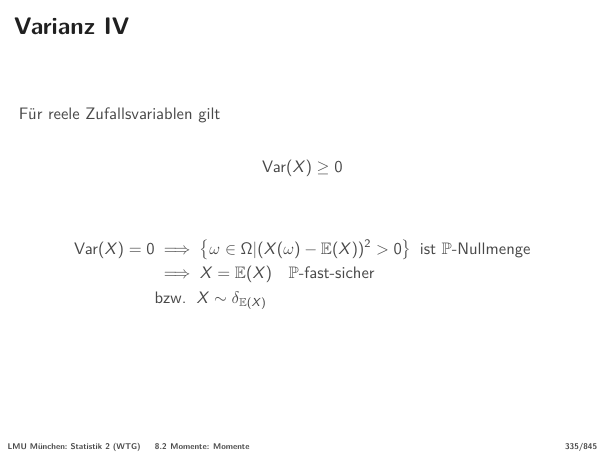

本页放在“模块三：矩把分布压缩成可计算特征”中，核心是理解 随机变量（Zufallsvariable）、方差（Varianz）。直觉上先抓住标题里的对象：方差（Varianz）。然后看它是定义、例子、定理还是证明；定义页要记条件，例子页要看随机机制，证明页要看用了哪些闭包性或极限定理。

关键词：

- 随机变量（Zufallsvariable）
- 方差（Varianz）

本页需要抓住的德语线索：

- `Var(X ) ≥ 0`
- `Var(X ) = 0 =⇒ (cid:8) ω ∈ Ω|(X (ω) − E(X ))2 > 0 (cid:9) ist P-Nullmenge`
- `=⇒ X = E(X ) P-fast-sicher`

### Seite 151 - 方差（Varianz）

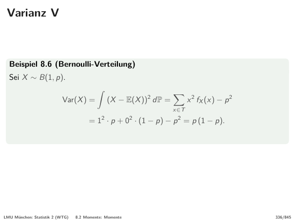

本页放在“模块三：矩把分布压缩成可计算特征”中，核心是理解 分布（Verteilung）、方差（Varianz）。直觉上先抓住标题里的对象：方差（Varianz）。然后看它是定义、例子、定理还是证明；定义页要记条件，例子页要看随机机制，证明页要看用了哪些闭包性或极限定理。

关键词：

- 分布（Verteilung）
- 方差（Varianz）

本页需要抓住的德语线索：

- `Beispiel 8.6 (Bernoulli-Verteilung)`
- `Var(X ) = (X − E(X ))2 dP = x 2 f (x ) − p2`
- `x∈T`
- `= 12 · p + 02 · (1 − p) − p2 = p (1 − p).`

### Seite 152 - 方差（Varianz）

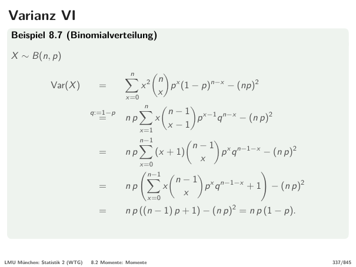

本页放在“模块三：矩把分布压缩成可计算特征”中，核心是理解 方差（Varianz）、二项分布（Binomialverteilung）。直觉上先抓住标题里的对象：方差（Varianz）。然后看它是定义、例子、定理还是证明；定义页要记条件，例子页要看随机机制，证明页要看用了哪些闭包性或极限定理。

关键词：

- 方差（Varianz）
- 二项分布（Binomialverteilung）

本页需要抓住的德语线索：

- `Beispiel 8.7 (Binomialverteilung)`
- `Var(X ) = x 2 px (1 − p)n−x − (np)2`
- `x=0`
- `q:= = 1−p n p X x n − 1 px−1qn−x − (n p)2`
- `x=1`

### Seite 153 - 方差（Varianz）

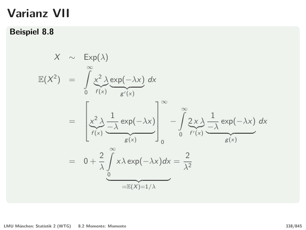

本页放在“模块三：矩把分布压缩成可计算特征”中，核心是理解 方差（Varianz）。直觉上先抓住标题里的对象：方差（Varianz）。然后看它是定义、例子、定理还是证明；定义页要记条件，例子页要看随机机制，证明页要看用了哪些闭包性或极限定理。

关键词：

- 方差（Varianz）

本页需要抓住的德语线索：

- `Beispiel 8.8`
- `E(X 2) = x 2 λ exp(−λx ) dx`
- `=  x 2 λ 1 exp(−λx )   − Z 2 x λ 1 exp(−λx ) dx`
- `= 0 + x λ exp(−λx )dx =`
- `=E(X)=1/λ`

### Seite 154 - 方差（Varianz）

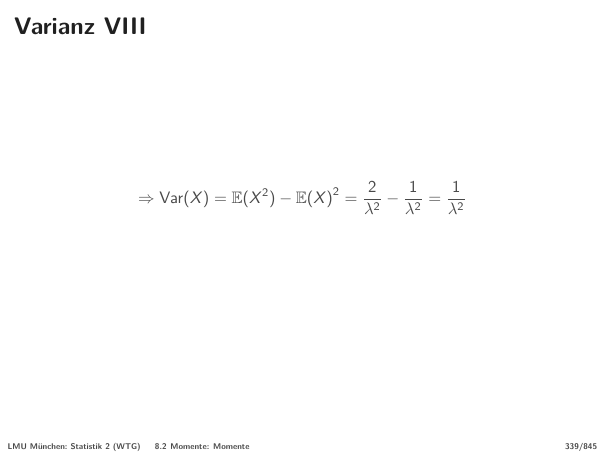

本页放在“模块三：矩把分布压缩成可计算特征”中，核心是理解 方差（Varianz）。直觉上先抓住标题里的对象：方差（Varianz）。然后看它是定义、例子、定理还是证明；定义页要记条件，例子页要看随机机制，证明页要看用了哪些闭包性或极限定理。

关键词：

- 方差（Varianz）

本页需要抓住的德语线索：

- `⇒ Var(X ) = E(X 2) − E(X )2 = − =`

### Seite 155 - 方差（Varianz）

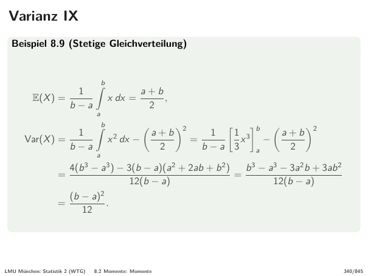

本页放在“模块三：矩把分布压缩成可计算特征”中，核心是理解 方差（Varianz）。直觉上先抓住标题里的对象：方差（Varianz）。然后看它是定义、例子、定理还是证明；定义页要记条件，例子页要看随机机制，证明页要看用了哪些闭包性或极限定理。

关键词：

- 方差（Varianz）

本页需要抓住的德语线索：

- `Beispiel 8.9 (Stetige Gleichverteilung)`
- `E(X ) = x dx = ,`
- `Var(X ) = x 2 dx − = x 3 −`
- `= =`
- `= .`

### Seite 156 - Schiefe I

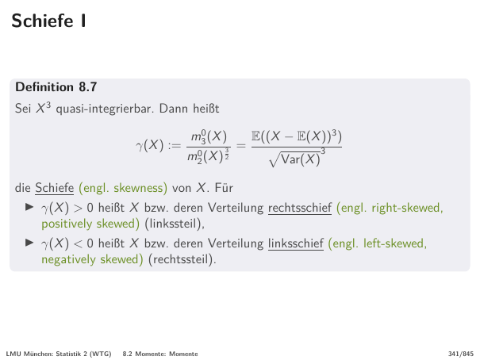

本页放在“模块三：矩把分布压缩成可计算特征”中，核心是理解 分布（Verteilung）。直觉上先抓住标题里的对象：Schiefe I。然后看它是定义、例子、定理还是证明；定义页要记条件，例子页要看随机机制，证明页要看用了哪些闭包性或极限定理。

关键词：

- 分布（Verteilung）

本页需要抓住的德语线索：

- `Definition 8.7`
- `m0(X ) E((X − E(X ))3)`
- `γ(X ) := 3 =`
- `m 2 0(X ) 3 2 p Var(X ) 3`

### Seite 157 - Schiefe II

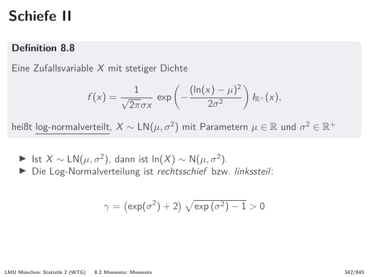

本页放在“模块三：矩把分布压缩成可计算特征”中，核心是理解 随机变量（Zufallsvariable）、密度（Dichte）、正态分布（Normalverteilung）。直觉上先抓住标题里的对象：Schiefe II。然后看它是定义、例子、定理还是证明；定义页要记条件，例子页要看随机机制，证明页要看用了哪些闭包性或极限定理。

关键词：

- 随机变量（Zufallsvariable）
- 密度（Dichte）
- 正态分布（Normalverteilung）

本页需要抓住的德语线索：

- `Definition 8.8`
- `f (x ) = √`
- `heißt log-normalverteilt, X ∼ LN(µ, σ2) mit Parametern µ ∈ R und σ2 ∈ R+`
- `γ = (cid:0) exp(σ2) + 2 (cid:1) p exp (σ2) − 1 > 0`

### Seite 158 - Schiefe III

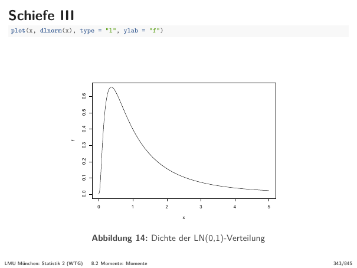

本页放在“模块三：矩把分布压缩成可计算特征”中，主要作用是推进 Seite 127-187 这一段的概念链。先把标题“Schiefe III”和前后页联系起来，再区分它是在给定义、展示例子、证明性质，还是做章节过渡。

本页需要抓住的德语线索：

- `plot(x, dlnorm(x), type = "l", ylab = "f")`

### Seite 159 - Wölbung I

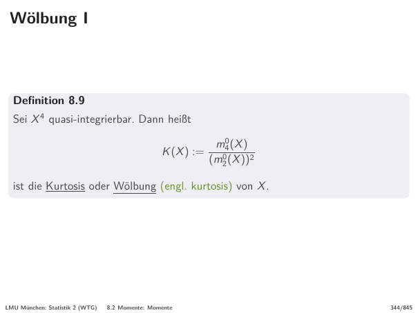

本页放在“模块三：矩把分布压缩成可计算特征”中，主要作用是推进 Seite 127-187 这一段的概念链。先把标题“Wölbung I”和前后页联系起来，再区分它是在给定义、展示例子、证明性质，还是做章节过渡。

本页需要抓住的德语线索：

- `Definition 8.9`
- `K (X ) := 4`

### Seite 160 - Wölbung II

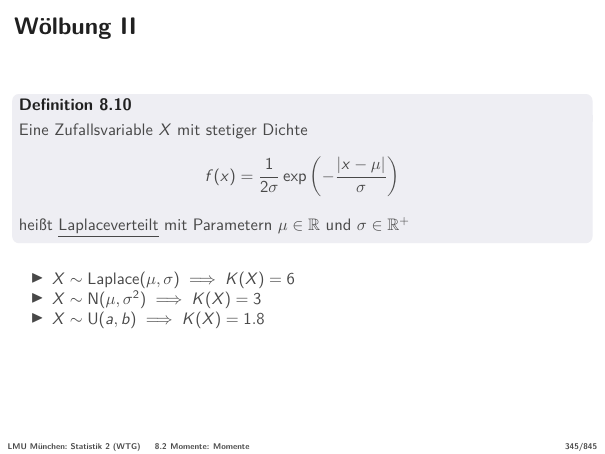

本页放在“模块三：矩把分布压缩成可计算特征”中，核心是理解 随机变量（Zufallsvariable）、密度（Dichte）。直觉上先抓住标题里的对象：Wölbung II。然后看它是定义、例子、定理还是证明；定义页要记条件，例子页要看随机机制，证明页要看用了哪些闭包性或极限定理。

关键词：

- 随机变量（Zufallsvariable）
- 密度（Dichte）

本页需要抓住的德语线索：

- `Definition 8.10`
- `f (x ) = exp −`
- `heißt Laplaceverteilt mit Parametern µ ∈ R und σ ∈ R+`
- `X ∼ Laplace(µ, σ) =⇒ K (X ) = 6`
- `X ∼ N(µ, σ2) =⇒ K (X ) = 3`

### Seite 161 - Wölbung III

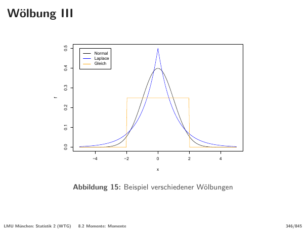

本页放在“模块三：矩把分布压缩成可计算特征”中，主要作用是推进 Seite 127-187 这一段的概念链。先把标题“Wölbung III”和前后页联系起来，再区分它是在给定义、展示例子、证明性质，还是做章节过渡。

本页需要抓住的德语线索：

- `Abbildung 15: Beispiel verschiedener Wölbungen`

### Seite 162 - 分布（Verteilung）

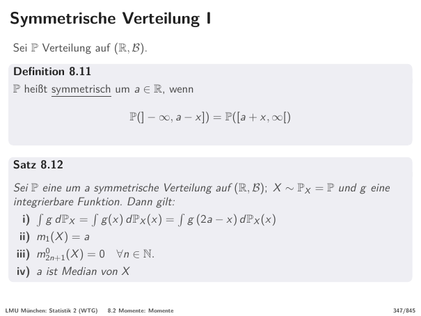

本页放在“模块三：矩把分布压缩成可计算特征”中，核心是理解 分布（Verteilung）。直觉上先抓住标题里的对象：分布（Verteilung）。然后看它是定义、例子、定理还是证明；定义页要记条件，例子页要看随机机制，证明页要看用了哪些闭包性或极限定理。

关键词：

- 分布（Verteilung）

本页需要抓住的德语线索：

- `Definition 8.11`
- `P heißt symmetrisch um a ∈ R, wenn`
- `P(] − ∞, a − x ]) = P([a + x , ∞[)`
- `Satz 8.12`
- `Sei P eine um a symmetrische Verteilung auf (R, B); X ∼ P = P und g eine`

### Seite 163 - 分布（Verteilung）

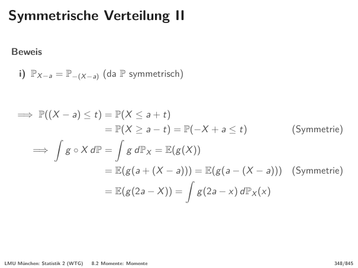

本页放在“模块三：矩把分布压缩成可计算特征”中，核心是理解 分布（Verteilung）。直觉上先抓住标题里的对象：分布（Verteilung）。然后看它是定义、例子、定理还是证明；定义页要记条件，例子页要看随机机制，证明页要看用了哪些闭包性或极限定理。

关键词：

- 分布（Verteilung）

本页需要抓住的德语线索：

- `i) P = P (da P symmetrisch)`
- `=⇒ P((X − a) ≤ t) = P(X ≤ a + t)`
- `= P(X ≥ a − t) = P(−X + a ≤ t) (Symmetrie)`
- `=⇒ g ◦ X dP = g dP = E(g(X ))`
- `= E(g(a + (X − a))) = E(g(a − (X − a))) (Symmetrie)`

### Seite 164 - 分布（Verteilung）

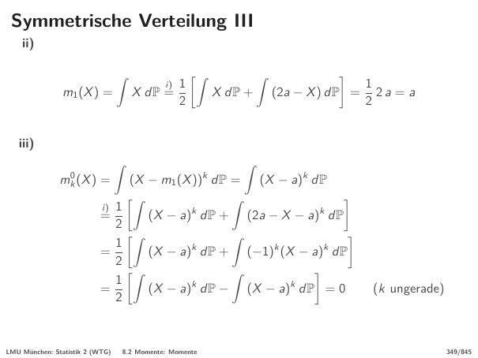

本页放在“模块三：矩把分布压缩成可计算特征”中，核心是理解 分布（Verteilung）。直觉上先抓住标题里的对象：分布（Verteilung）。然后看它是定义、例子、定理还是证明；定义页要记条件，例子页要看随机机制，证明页要看用了哪些闭包性或极限定理。

关键词：

- 分布（Verteilung）

本页需要抓住的德语线索：

- `m (X ) = Z X dP = i) 1 (cid:20)Z X dP + Z (2a − X ) dP (cid:21) = 1 2 a = a`
- `m0(X ) = (X − m (X ))k dP = (X − a)k dP`
- `= i) 1 (cid:20)Z (X − a)k dP + Z (2a − X − a)k dP (cid:21)`
- `= (X − a)k dP + (−1)k (X − a)k dP`
- `= (X − a)k dP − (X − a)k dP = 0 (k ungerade)`

### Seite 165 - 分布（Verteilung）

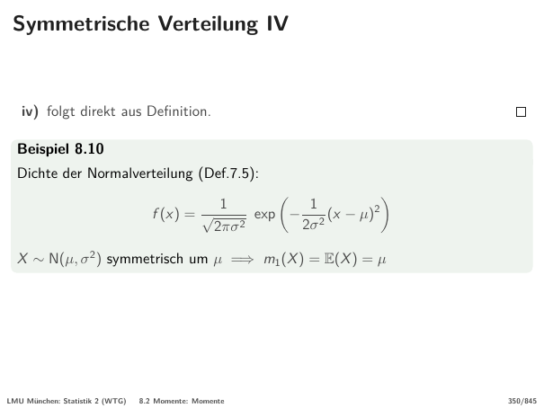

本页放在“模块三：矩把分布压缩成可计算特征”中，核心是理解 分布（Verteilung）、密度（Dichte）、正态分布（Normalverteilung）。直觉上先抓住标题里的对象：分布（Verteilung）。然后看它是定义、例子、定理还是证明；定义页要记条件，例子页要看随机机制，证明页要看用了哪些闭包性或极限定理。

关键词：

- 分布（Verteilung）
- 密度（Dichte）
- 正态分布（Normalverteilung）

本页需要抓住的德语线索：

- `iv) folgt direkt aus Definition.`
- `Beispiel 8.10`
- `f (x ) = √ exp − (x − µ)2`
- `X ∼ N(µ, σ2) symmetrisch um µ =⇒ m (X ) = E(X ) = µ`

### Seite 166 - 分布（Verteilung）

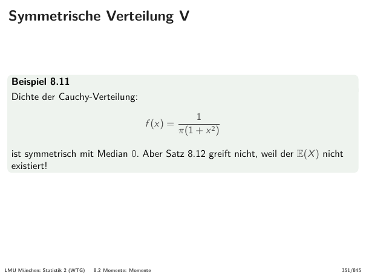

本页放在“模块三：矩把分布压缩成可计算特征”中，核心是理解 分布（Verteilung）、密度（Dichte）、Cauchy 分布（Cauchy）。直觉上先抓住标题里的对象：分布（Verteilung）。然后看它是定义、例子、定理还是证明；定义页要记条件，例子页要看随机机制，证明页要看用了哪些闭包性或极限定理。

关键词：

- 分布（Verteilung）
- 密度（Dichte）
- Cauchy 分布（Cauchy）

本页需要抓住的德语线索：

- `Beispiel 8.11`
- `f (x ) =`
- `ist symmetrisch mit Median 0. Aber Satz 8.12 greift nicht, weil der E(X ) nicht`

### Seite 167 - 矩（Momente）

本页放在“模块三：矩把分布压缩成可计算特征”中，核心是理解 期望（Erwartungswert）。直觉上先抓住标题里的对象：矩（Momente）。然后看它是定义、例子、定理还是证明；定义页要记条件，例子页要看随机机制，证明页要看用了哪些闭包性或极限定理。

关键词：

- 期望（Erwartungswert）

本页需要抓住的德语线索：

- `8. Momente`
- `8.1 Erwartungswert`
- `8.2 Momente`

### Seite 168 - 不等式（Ungleichungen）

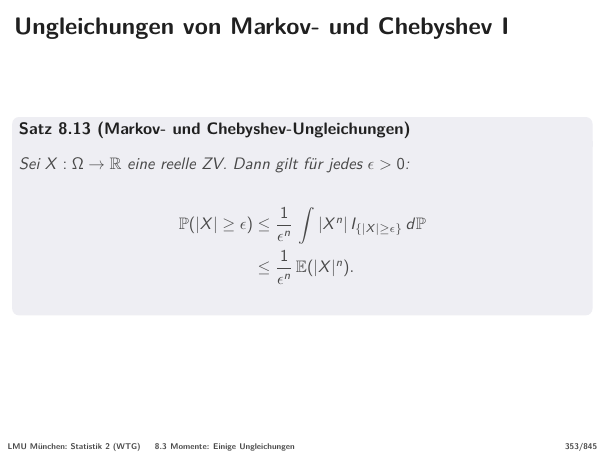

本页放在“模块三：矩把分布压缩成可计算特征”中，主要作用是推进 Seite 127-187 这一段的概念链。先把标题“不等式（Ungleichungen）”和前后页联系起来，再区分它是在给定义、展示例子、证明性质，还是做章节过渡。

本页需要抓住的德语线索：

- `Satz 8.13 (Markov- und Chebyshev-Ungleichungen)`
- `Sei X : Ω → R eine reelle ZV. Dann gilt für jedes ϵ > 0:`
- `P(|X | ≥ ϵ) ≤ |X n| I dP`
- `ϵn {|X|≥ϵ}`
- `≤ E(|X |n).`

### Seite 169 - 不等式（Ungleichungen）

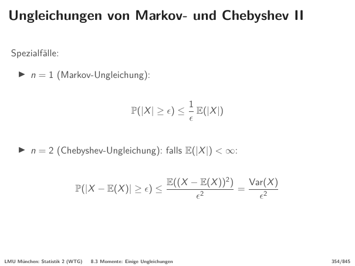

本页放在“模块三：矩把分布压缩成可计算特征”中，主要作用是推进 Seite 127-187 这一段的概念链。先把标题“不等式（Ungleichungen）”和前后页联系起来，再区分它是在给定义、展示例子、证明性质，还是做章节过渡。

本页需要抓住的德语线索：

- `n = 1 (Markov-Ungleichung):`
- `P(|X | ≥ ϵ) ≤ E(|X |)`
- `n = 2 (Chebyshev-Ungleichung): falls E(|X |) < ∞:`
- `E((X − E(X ))2) Var(X )`
- `P(|X − E(X )| ≥ ϵ) ≤ =`

### Seite 170 - 不等式（Ungleichungen）

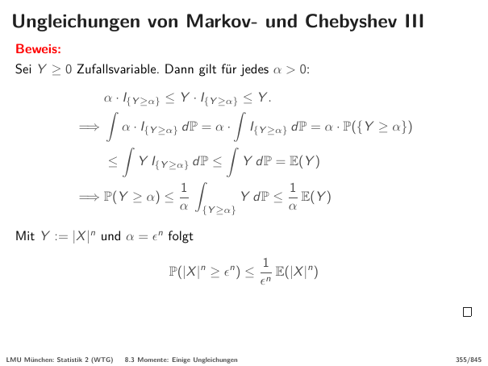

本页放在“模块三：矩把分布压缩成可计算特征”中，核心是理解 随机变量（Zufallsvariable）。直觉上先抓住标题里的对象：不等式（Ungleichungen）。然后看它是定义、例子、定理还是证明；定义页要记条件，例子页要看随机机制，证明页要看用了哪些闭包性或极限定理。

关键词：

- 随机变量（Zufallsvariable）

本页需要抓住的德语线索：

- `Sei Y ≥ 0 Zufallsvariable. Dann gilt für jedes α > 0:`
- `α · I ≤ Y · I ≤ Y .`
- `{Y ≥α} {Y ≥α}`
- `=⇒ α · I dP = α · I dP = α · P({Y ≥ α})`
- `{Y ≥α} {Y ≥α}`

### Seite 171 - Ungleichung von Jensen I

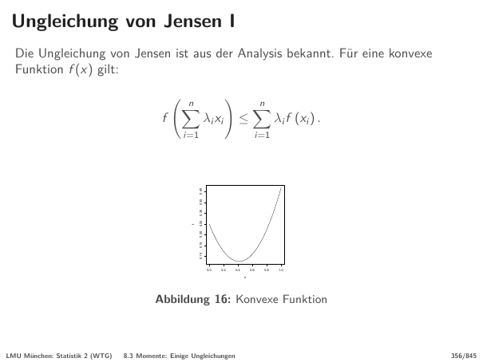

本页放在“模块三：矩把分布压缩成可计算特征”中，主要作用是推进 Seite 127-187 这一段的概念链。先把标题“Ungleichung von Jensen I”和前后页联系起来，再区分它是在给定义、展示例子、证明性质，还是做章节过渡。

本页需要抓住的德语线索：

- `f λ x ≤ λ f (x ) .`
- `i=1 i=1`

### Seite 172 - Ungleichung von Jensen II

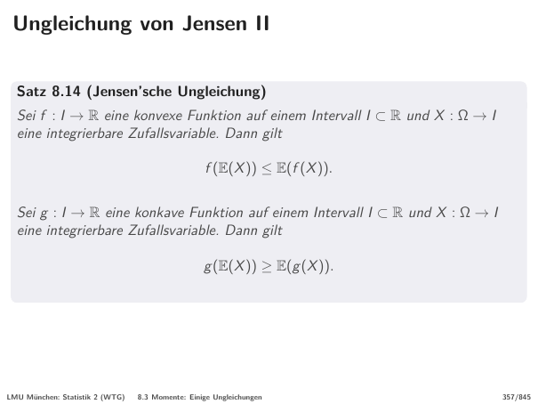

本页放在“模块三：矩把分布压缩成可计算特征”中，核心是理解 随机变量（Zufallsvariable）。直觉上先抓住标题里的对象：Ungleichung von Jensen II。然后看它是定义、例子、定理还是证明；定义页要记条件，例子页要看随机机制，证明页要看用了哪些闭包性或极限定理。

关键词：

- 随机变量（Zufallsvariable）

本页需要抓住的德语线索：

- `Satz 8.14 (Jensen’sche Ungleichung)`
- `Sei f : I → R eine konvexe Funktion auf einem Intervall I ⊂ R und X : Ω → I`
- `f (E(X )) ≤ E(f (X )).`
- `Sei g : I → R eine konkave Funktion auf einem Intervall I ⊂ R und X : Ω → I`
- `g(E(X )) ≥ E(g(X )).`

### Seite 173 - Ungleichung von Jensen III

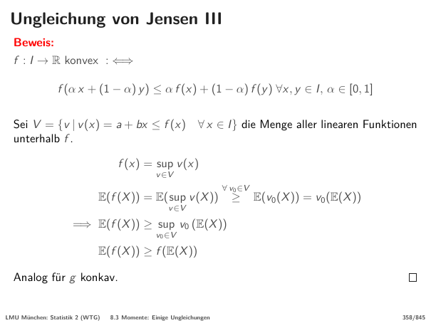

本页放在“模块三：矩把分布压缩成可计算特征”中，核心是理解 集合（Menge）。直觉上先抓住标题里的对象：Ungleichung von Jensen III。然后看它是定义、例子、定理还是证明；定义页要记条件，例子页要看随机机制，证明页要看用了哪些闭包性或极限定理。

关键词：

- 集合（Menge）

本页需要抓住的德语线索：

- `f : I → R konvex : ⇐⇒`
- `f (α x + (1 − α) y ) ≤ α f (x ) + (1 − α) f (y ) ∀x , y ∈ I, α ∈ [0, 1]`
- `Sei V = {v | v (x ) = a + bx ≤ f (x ) ∀ x ∈ I} die Menge aller linearen Funktionen`
- `f (x ) = sup v (x )`
- `v∈V`

### Seite 174 - Ungleichung von Jensen IV

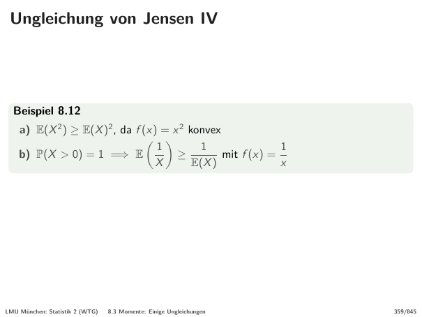

本页放在“模块三：矩把分布压缩成可计算特征”中，主要作用是推进 Seite 127-187 这一段的概念链。先把标题“Ungleichung von Jensen IV”和前后页联系起来，再区分它是在给定义、展示例子、证明性质，还是做章节过渡。

本页需要抓住的德语线索：

- `Beispiel 8.12`
- `a) E(X 2) ≥ E(X )2, da f (x ) = x 2 konvex`
- `b) P(X > 0) = 1 =⇒ E ≥ mit f (x ) =`
- `X E(X ) x`

### Seite 175 - 矩（Momente）

本页放在“模块三：矩把分布压缩成可计算特征”中，核心是理解 期望（Erwartungswert）。直觉上先抓住标题里的对象：矩（Momente）。然后看它是定义、例子、定理还是证明；定义页要记条件，例子页要看随机机制，证明页要看用了哪些闭包性或极限定理。

关键词：

- 期望（Erwartungswert）

本页需要抓住的德语线索：

- `8. Momente`
- `8.1 Erwartungswert`
- `8.2 Momente`

### Seite 176 - Normen I

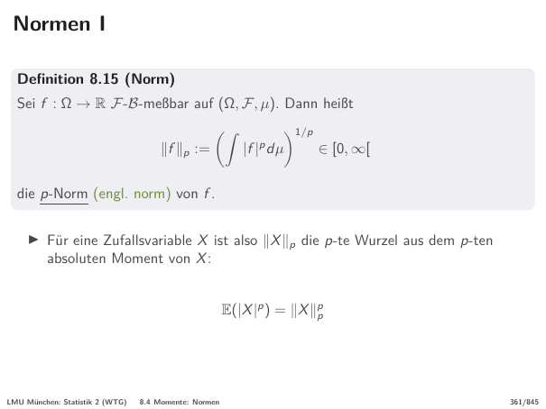

本页放在“模块三：矩把分布压缩成可计算特征”中，核心是理解 随机变量（Zufallsvariable）。直觉上先抓住标题里的对象：Normen I。然后看它是定义、例子、定理还是证明；定义页要记条件，例子页要看随机机制，证明页要看用了哪些闭包性或极限定理。

关键词：

- 随机变量（Zufallsvariable）

本页需要抓住的德语线索：

- `Definition 8.15 (Norm)`
- `Sei f : Ω → R F-B-meßbar auf (Ω, F, µ). Dann heißt`
- `∥f ∥ := |f |pdµ ∈ [0, ∞[`
- `E(|X |p) = ∥X ∥p`

### Seite 177 - Normen II

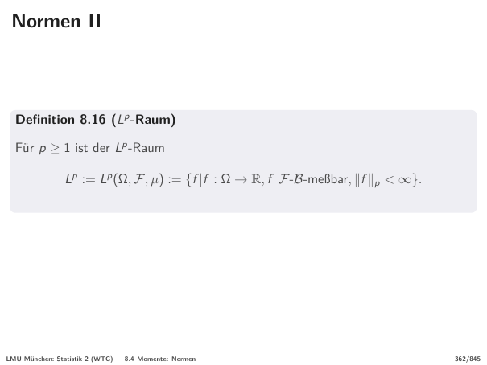

本页放在“模块三：矩把分布压缩成可计算特征”中，主要作用是推进 Seite 127-187 这一段的概念链。先把标题“Normen II”和前后页联系起来，再区分它是在给定义、展示例子、证明性质，还是做章节过渡。

本页需要抓住的德语线索：

- `Definition 8.16 (Lp-Raum)`
- `Für p ≥ 1 ist der Lp-Raum`
- `Lp := Lp(Ω, F, µ) := {f |f : Ω → R, f F-B-meßbar, ∥f ∥ < ∞}.`

### Seite 178 - Normen III

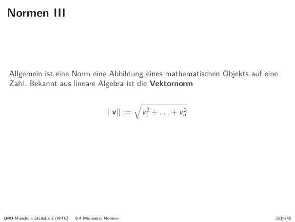

本页放在“模块三：矩把分布压缩成可计算特征”中，主要作用是推进 Seite 127-187 这一段的概念链。先把标题“Normen III”和前后页联系起来，再区分它是在给定义、展示例子、证明性质，还是做章节过渡。

本页需要抓住的德语线索：

- `||v|| := v 2 + . . . + v 2`

### Seite 179 - Ungleichung von Hölder I

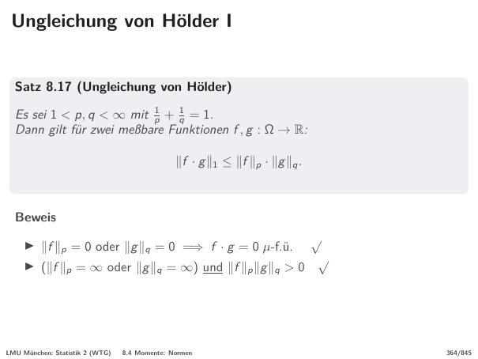

本页放在“模块三：矩把分布压缩成可计算特征”中，主要作用是推进 Seite 127-187 这一段的概念链。先把标题“Ungleichung von Hölder I”和前后页联系起来，再区分它是在给定义、展示例子、证明性质，还是做章节过渡。

本页需要抓住的德语线索：

- `Satz 8.17 (Ungleichung von Hölder)`
- `Es sei 1 < p, q < ∞ mit 1 + 1 = 1.`
- `Dann gilt für zwei meßbare Funktionen f , g : Ω → R:`
- `∥f · g∥ ≤ ∥f ∥ · ∥g∥ .`
- `∥f ∥ = 0 oder ∥g∥ = 0 =⇒ f · g = 0 µ-f.ü.`

### Seite 180 - Ungleichung von Hölder II

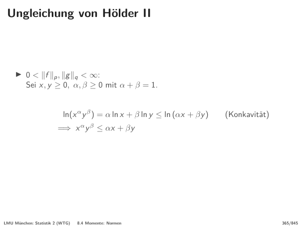

本页放在“模块三：矩把分布压缩成可计算特征”中，主要作用是推进 Seite 127-187 这一段的概念链。先把标题“Ungleichung von Hölder II”和前后页联系起来，再区分它是在给定义、展示例子、证明性质，还是做章节过渡。

本页需要抓住的德语线索：

- `Sei x , y ≥ 0, α, β ≥ 0 mit α + β = 1.`
- `ln(x αy β) = α ln x + β ln y ≤ ln (αx + βy ) (Konkavität)`
- `=⇒ x αy β ≤ αx + βy`

### Seite 181 - Ungleichung von Hölder III

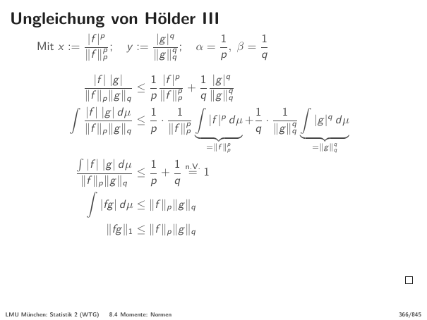

本页放在“模块三：矩把分布压缩成可计算特征”中，主要作用是推进 Seite 127-187 这一段的概念链。先把标题“Ungleichung von Hölder III”和前后页联系起来，再区分它是在给定义、展示例子、证明性质，还是做章节过渡。

本页需要抓住的德语线索：

- `Mit x := ; y := ; α = , β =`
- `≤ +`
- `≤ · |f |p dµ + · |g|q dµ`
- `=∥f ∥p p =∥g∥q q`
- `≤ + = 1`

### Seite 182 - Ungleichung von Hölder IV

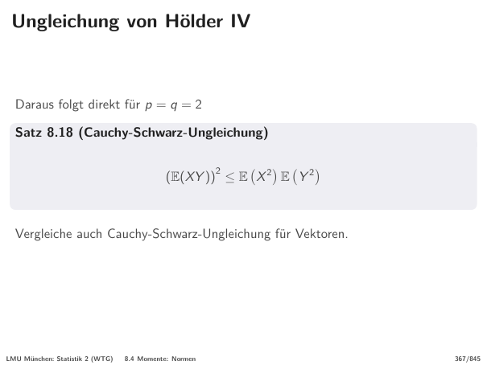

本页放在“模块三：矩把分布压缩成可计算特征”中，核心是理解 Cauchy 分布（Cauchy）。直觉上先抓住标题里的对象：Ungleichung von Hölder IV。然后看它是定义、例子、定理还是证明；定义页要记条件，例子页要看随机机制，证明页要看用了哪些闭包性或极限定理。

关键词：

- Cauchy 分布（Cauchy）

本页需要抓住的德语线索：

- `Daraus folgt direkt für p = q = 2`
- `Satz 8.18 (Cauchy-Schwarz-Ungleichung)`
- `(E(XY ))2 ≤ E (cid:0) X 2(cid:1) E (cid:0) Y 2(cid:1)`

### Seite 183 - Ungleichung von Hölder V

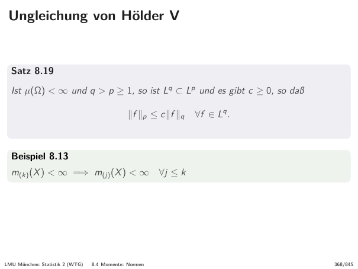

本页放在“模块三：矩把分布压缩成可计算特征”中，主要作用是推进 Seite 127-187 这一段的概念链。先把标题“Ungleichung von Hölder V”和前后页联系起来，再区分它是在给定义、展示例子、证明性质，还是做章节过渡。

本页需要抓住的德语线索：

- `Satz 8.19`
- `Ist µ(Ω) < ∞ und q > p ≥ 1, so ist Lq ⊂ Lp und es gibt c ≥ 0, so daß`
- `∥f ∥ ≤ c∥f ∥ ∀f ∈ Lq.`
- `Beispiel 8.13`
- `m (X ) < ∞ =⇒ m (X ) < ∞ ∀j ≤ k`

### Seite 184 - Ungleichung von Hölder VI

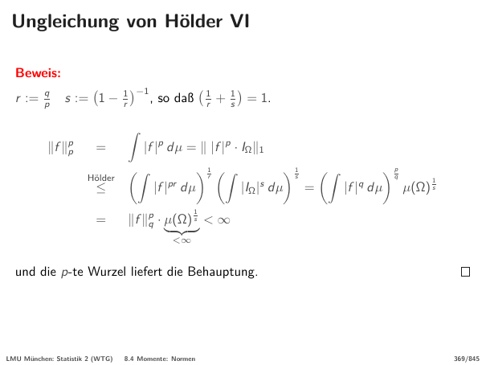

本页放在“模块三：矩把分布压缩成可计算特征”中，主要作用是推进 Seite 127-187 这一段的概念链。先把标题“Ungleichung von Hölder VI”和前后页联系起来，再区分它是在给定义、展示例子、证明性质，还是做章节过渡。

本页需要抓住的德语线索：

- `r := q s := (cid:0) 1 − 1 (cid:1)−1 , so daß (cid:0) 1 + 1 (cid:1) = 1.`
- `∥f ∥p = |f |p dµ = ∥ |f |p · I ∥`
- `Hö ≤ lder |f |pr dµ r |I Ω |s dµ s = |f |q dµ q µ(Ω) 1 s`
- `= ∥f ∥p q · µ(Ω) 1 s < ∞`

### Seite 185 - Ungleichung von Minkowski I

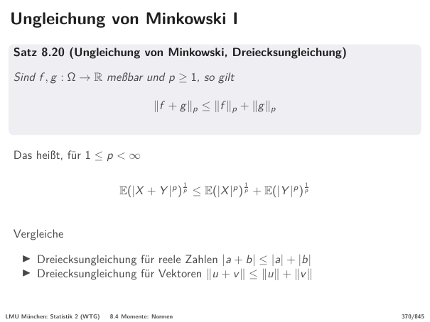

本页放在“模块三：矩把分布压缩成可计算特征”中，主要作用是推进 Seite 127-187 这一段的概念链。先把标题“Ungleichung von Minkowski I”和前后页联系起来，再区分它是在给定义、展示例子、证明性质，还是做章节过渡。

本页需要抓住的德语线索：

- `Satz 8.20 (Ungleichung von Minkowski, Dreiecksungleichung)`
- `Sind f , g : Ω → R meßbar und p ≥ 1, so gilt`
- `∥f + g∥ ≤ ∥f ∥ + ∥g∥`
- `Das heißt, für 1 ≤ p < ∞`
- `E(|X + Y |p) p 1 ≤ E(|X |p) p 1 + E(|Y |p) p 1`

### Seite 186 - Ungleichung von Minkowski II

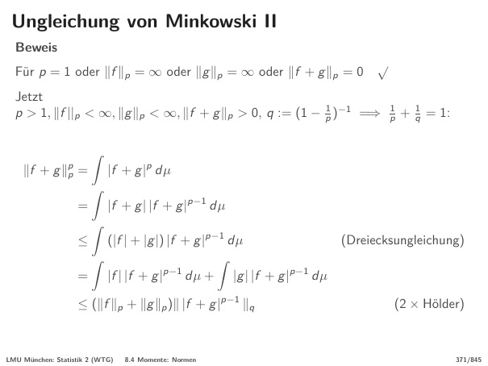

本页放在“模块三：矩把分布压缩成可计算特征”中，主要作用是推进 Seite 127-187 这一段的概念链。先把标题“Ungleichung von Minkowski II”和前后页联系起来，再区分它是在给定义、展示例子、证明性质，还是做章节过渡。

本页需要抓住的德语线索：

- `Für p = 1 oder ∥f ∥ = ∞ oder ∥g∥ = ∞ oder ∥f + g∥ = 0`
- `p > 1, ∥f || < ∞, ∥g∥ < ∞, ∥f + g∥ > 0, q := (1 − 1 )−1 =⇒ 1 + 1 = 1:`
- `∥f + g∥p = |f + g|p dµ`
- `= |f + g| |f + g|p−1 dµ`
- `≤ (|f | + |g|) |f + g|p−1 dµ (Dreiecksungleichung)`

### Seite 187 - Ungleichung von Minkowski III

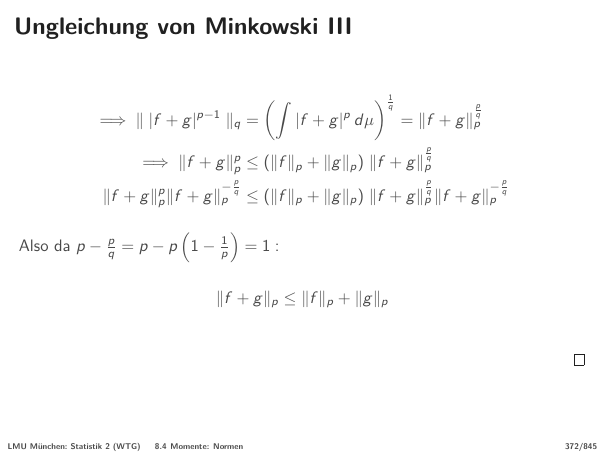

本页放在“模块三：矩把分布压缩成可计算特征”中，主要作用是推进 Seite 127-187 这一段的概念链。先把标题“Ungleichung von Minkowski III”和前后页联系起来，再区分它是在给定义、展示例子、证明性质，还是做章节过渡。

本页需要抓住的德语线索：

- `=⇒ ∥ |f + g|p−1 ∥ = |f + g|p dµ = ∥f + g∥ q`
- `=⇒ ∥f + g∥p ≤ (∥f ∥ + ∥g∥ ) ∥f + g∥ q`
- `∥f + g∥p∥f + g∥ − p q ≤ (∥f ∥ + ∥g∥ ) ∥f + g∥ p q ∥f + g∥ − p q`
- `Also da p − p = p − p 1 − 1 = 1 :`
- `∥f + g∥ ≤ ∥f ∥ + ∥g∥`

## 模块四：参数和生成函数提供更高层描述（Seite 188-242）

位置、尺度、形状参数描述分布族如何移动和变形；矩母函数和特征函数则把分布编码成函数，方便证明唯一性、求矩和处理和的分布。

### Seite 188 - 分布（Verteilung）

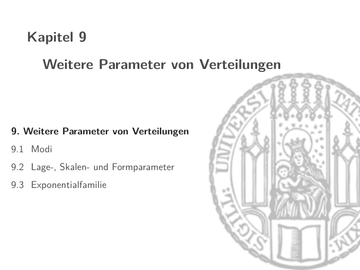

本页可识别的嵌入图片裁切：

本页放在“模块四：参数和生成函数提供更高层描述”中，核心是理解 分布（Verteilung）。直觉上先抓住标题里的对象：分布（Verteilung）。然后看它是定义、例子、定理还是证明；定义页要记条件，例子页要看随机机制，证明页要看用了哪些闭包性或极限定理。

关键词：

- 分布（Verteilung）

本页需要抓住的德语线索：

- `Kapitel 9`
- `Weitere Parameter von Verteilungen`
- `9. Weitere Parameter von Verteilungen`

### Seite 189 - 分布（Verteilung）

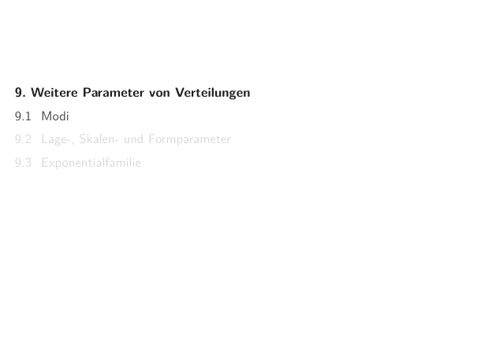

本页放在“模块四：参数和生成函数提供更高层描述”中，核心是理解 分布（Verteilung）。直觉上先抓住标题里的对象：分布（Verteilung）。然后看它是定义、例子、定理还是证明；定义页要记条件，例子页要看随机机制，证明页要看用了哪些闭包性或极限定理。

关键词：

- 分布（Verteilung）

本页需要抓住的德语线索：

- `9. Weitere Parameter von Verteilungen`
- `9.1 Modi`
- `9.2 Lage-, Skalen- und Formparameter`

### Seite 190 - Modus I

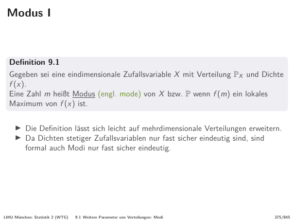

本页放在“模块四：参数和生成函数提供更高层描述”中，核心是理解 随机变量（Zufallsvariable）、分布（Verteilung）、密度（Dichte）、几乎必然（fast sicher）。直觉上先抓住标题里的对象：Modus I。然后看它是定义、例子、定理还是证明；定义页要记条件，例子页要看随机机制，证明页要看用了哪些闭包性或极限定理。

关键词：

- 随机变量（Zufallsvariable）
- 分布（Verteilung）
- 密度（Dichte）
- 几乎必然（fast sicher）

本页需要抓住的德语线索：

- `Definition 9.1`
- `Die Definition lässt sich leicht auf mehrdimensionale Verteilungen erweitern.`

### Seite 191 - Modus II

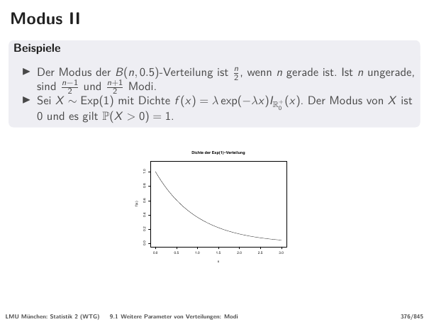

本页放在“模块四：参数和生成函数提供更高层描述”中，核心是理解 分布（Verteilung）、密度（Dichte）。直觉上先抓住标题里的对象：Modus II。然后看它是定义、例子、定理还是证明；定义页要记条件，例子页要看随机机制，证明页要看用了哪些闭包性或极限定理。

关键词：

- 分布（Verteilung）
- 密度（Dichte）

本页需要抓住的德语线索：

- `Beispiele`
- `Sei X ∼ Exp(1) mit Dichte f (x ) = λ exp(−λx )I (x ). Der Modus von X ist`
- `0 und es gilt P(X > 0) = 1. 0`

### Seite 192 - Modus III

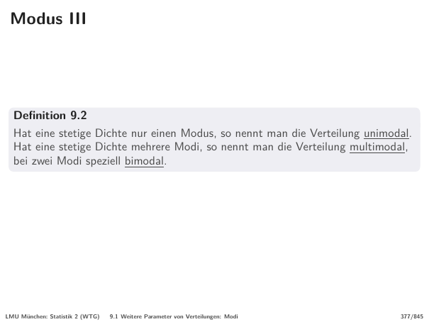

本页放在“模块四：参数和生成函数提供更高层描述”中，核心是理解 分布（Verteilung）、密度（Dichte）。直觉上先抓住标题里的对象：Modus III。然后看它是定义、例子、定理还是证明；定义页要记条件，例子页要看随机机制，证明页要看用了哪些闭包性或极限定理。

关键词：

- 分布（Verteilung）
- 密度（Dichte）

本页需要抓住的德语线索：

- `Definition 9.2`

### Seite 193 - Mischverteilung I

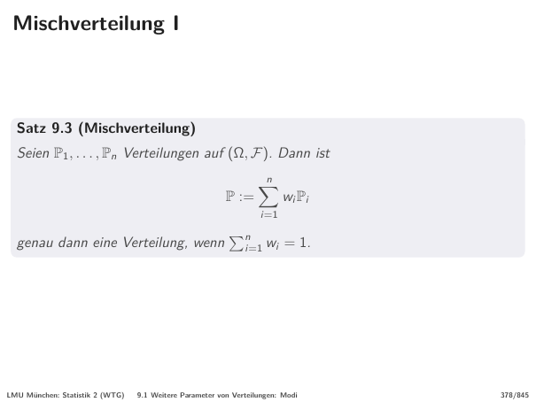

本页放在“模块四：参数和生成函数提供更高层描述”中，核心是理解 分布（Verteilung）。直觉上先抓住标题里的对象：Mischverteilung I。然后看它是定义、例子、定理还是证明；定义页要记条件，例子页要看随机机制，证明页要看用了哪些闭包性或极限定理。

关键词：

- 分布（Verteilung）

本页需要抓住的德语线索：

- `Satz 9.3 (Mischverteilung)`
- `P := w P`
- `i=1`
- `w = 1.`
- `i=1 i`

### Seite 194 - Mischverteilung II

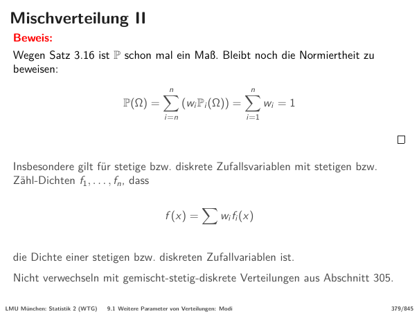

本页放在“模块四：参数和生成函数提供更高层描述”中，核心是理解 测度（Maß）、随机变量（Zufallsvariable）、密度（Dichte）。直觉上先抓住标题里的对象：Mischverteilung II。然后看它是定义、例子、定理还是证明；定义页要记条件，例子页要看随机机制，证明页要看用了哪些闭包性或极限定理。

关键词：

- 测度（Maß）
- 随机变量（Zufallsvariable）
- 密度（Dichte）

本页需要抓住的德语线索：

- `Wegen Satz 3.16 ist P schon mal ein Maß. Bleibt noch die Normiertheit zu`
- `P(Ω) = (w P (Ω)) = w = 1`
- `i=n i=1`
- `f (x ) = w f (x )`

### Seite 195 - Mischverteilung III

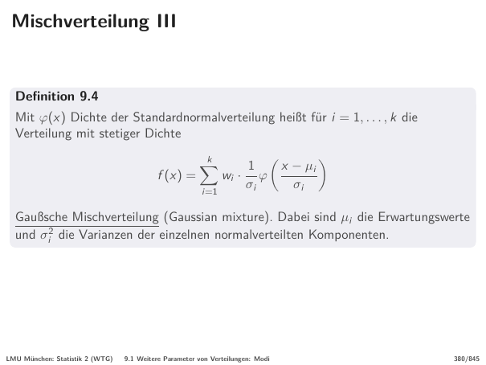

本页放在“模块四：参数和生成函数提供更高层描述”中，核心是理解 分布（Verteilung）、密度（Dichte）、期望（Erwartungswert）、方差（Varianz）。直觉上先抓住标题里的对象：Mischverteilung III。然后看它是定义、例子、定理还是证明；定义页要记条件，例子页要看随机机制，证明页要看用了哪些闭包性或极限定理。

关键词：

- 分布（Verteilung）
- 密度（Dichte）
- 期望（Erwartungswert）
- 方差（Varianz）

本页需要抓住的德语线索：

- `Definition 9.4`
- `Mit φ(x ) Dichte der Standardnormalverteilung heißt für i = 1, . . . , k die`
- `f (x ) = X w · 1 φ x − µ i`
- `i=1`

### Seite 196 - Mischverteilung IV

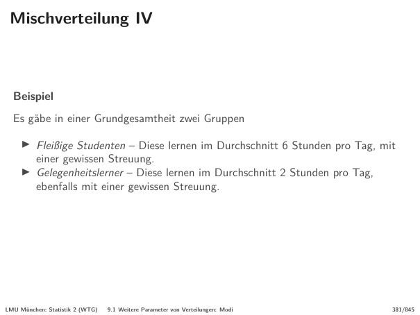

本页放在“模块四：参数和生成函数提供更高层描述”中，主要作用是推进 Seite 188-242 这一段的概念链。先把标题“Mischverteilung IV”和前后页联系起来，再区分它是在给定义、展示例子、证明性质，还是做章节过渡。

本页需要抓住的德语线索：

- `Beispiel`

### Seite 197 - Mischverteilung V

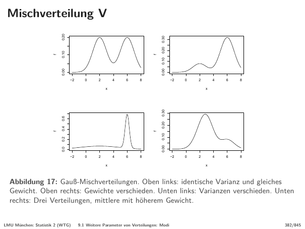

本页放在“模块四：参数和生成函数提供更高层描述”中，主要作用是推进 Seite 188-242 这一段的概念链。先把标题“Mischverteilung V”和前后页联系起来，再区分它是在给定义、展示例子、证明性质，还是做章节过渡。

本页需要抓住的德语线索：

- `Mischverteilung V`
- `−2 0 2 4 6 8`
- `02.0`

### Seite 198 - Poisson 分布（Poisson）

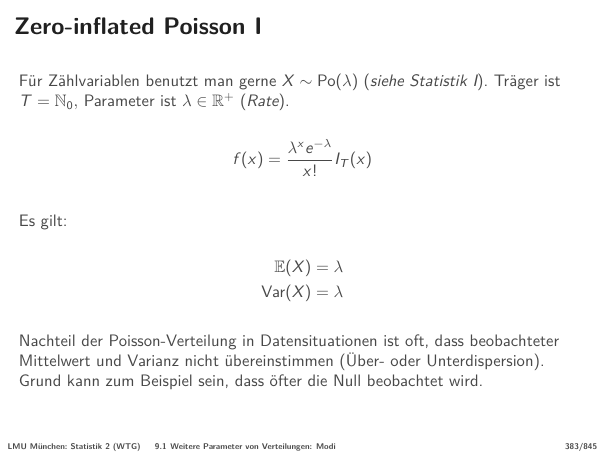

本页放在“模块四：参数和生成函数提供更高层描述”中，核心是理解 分布（Verteilung）、方差（Varianz）、Poisson 分布（Poisson）。直觉上先抓住标题里的对象：Poisson 分布（Poisson）。然后看它是定义、例子、定理还是证明；定义页要记条件，例子页要看随机机制，证明页要看用了哪些闭包性或极限定理。

关键词：

- 分布（Verteilung）
- 方差（Varianz）
- Poisson 分布（Poisson）

本页需要抓住的德语线索：

- `T = N , Parameter ist λ ∈ R+ (Rate).`
- `f (x ) = I (x )`
- `Es gilt:`
- `E(X ) = λ`
- `Var(X ) = λ`

### Seite 199 - Poisson 分布（Poisson）

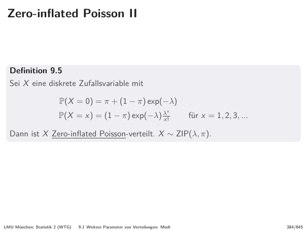

本页放在“模块四：参数和生成函数提供更高层描述”中，核心是理解 随机变量（Zufallsvariable）、Poisson 分布（Poisson）。直觉上先抓住标题里的对象：Poisson 分布（Poisson）。然后看它是定义、例子、定理还是证明；定义页要记条件，例子页要看随机机制，证明页要看用了哪些闭包性或极限定理。

关键词：

- 随机变量（Zufallsvariable）
- Poisson 分布（Poisson）

本页需要抓住的德语线索：

- `Definition 9.5`
- `P(X = 0) = π + (1 − π) exp(−λ)`
- `P(X = x ) = (1 − π) exp(−λ) λx für x = 1, 2, 3, ...`

### Seite 200 - Poisson 分布（Poisson）

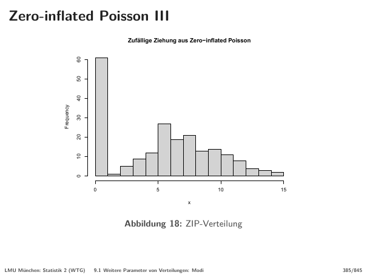

本页放在“模块四：参数和生成函数提供更高层描述”中，核心是理解 Poisson 分布（Poisson）。直觉上先抓住标题里的对象：Poisson 分布（Poisson）。然后看它是定义、例子、定理还是证明；定义页要记条件，例子页要看随机机制，证明页要看用了哪些闭包性或极限定理。

关键词：

- Poisson 分布（Poisson）

本页需要抓住的德语线索：

- `Zero-inflated Poisson III`
- `Zufällige Ziehung aus Zero−inflated Poisson`
- `x`

### Seite 201 - 分布（Verteilung）

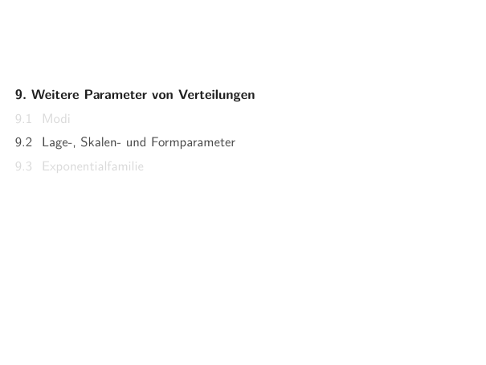

本页放在“模块四：参数和生成函数提供更高层描述”中，核心是理解 分布（Verteilung）。直觉上先抓住标题里的对象：分布（Verteilung）。然后看它是定义、例子、定理还是证明；定义页要记条件，例子页要看随机机制，证明页要看用了哪些闭包性或极限定理。

关键词：

- 分布（Verteilung）

本页需要抓住的德语线索：

- `9. Weitere Parameter von Verteilungen`
- `9.1 Modi`
- `9.2 Lage-, Skalen- und Formparameter`

### Seite 202 - Lageparameter I

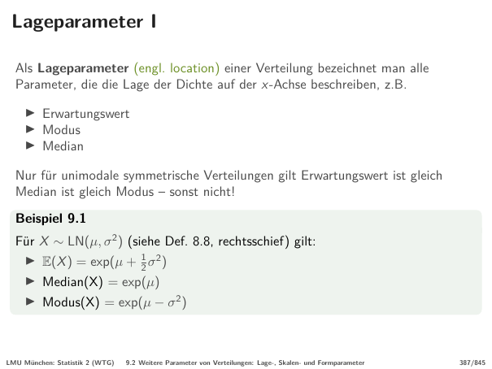

本页放在“模块四：参数和生成函数提供更高层描述”中，核心是理解 分布（Verteilung）、密度（Dichte）、期望（Erwartungswert）。直觉上先抓住标题里的对象：Lageparameter I。然后看它是定义、例子、定理还是证明；定义页要记条件，例子页要看随机机制，证明页要看用了哪些闭包性或极限定理。

关键词：

- 分布（Verteilung）
- 密度（Dichte）
- 期望（Erwartungswert）

本页需要抓住的德语线索：

- `Beispiel 9.1`
- `E(X ) = exp(µ + 1 σ2)`
- `Median(X) = exp(µ)`
- `Modus(X) = exp(µ − σ2)`

### Seite 203 - Lageparameter II

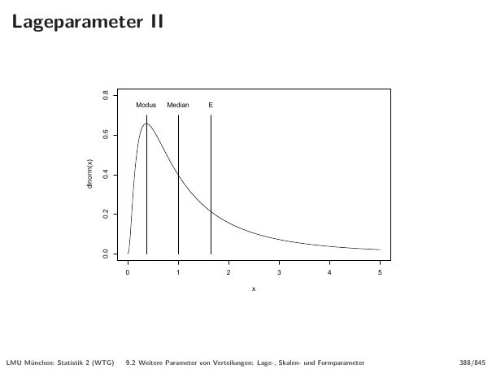

本页放在“模块四：参数和生成函数提供更高层描述”中，主要作用是推进 Seite 188-242 这一段的概念链。先把标题“Lageparameter II”和前后页联系起来，再区分它是在给定义、展示例子、证明性质，还是做章节过渡。

本页需要抓住的德语线索：

- `Lageparameter II`
- `0 1 2 3 4 5`
- `8.0`

### Seite 204 - Lageparameter III

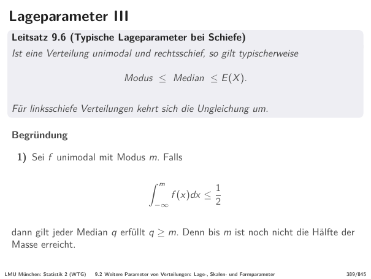

本页放在“模块四：参数和生成函数提供更高层描述”中，核心是理解 分布（Verteilung）。直觉上先抓住标题里的对象：Lageparameter III。然后看它是定义、例子、定理还是证明；定义页要记条件，例子页要看随机机制，证明页要看用了哪些闭包性或极限定理。

关键词：

- 分布（Verteilung）

本页需要抓住的德语线索：

- `Modus ≤ Median ≤ E (X ).`
- `f (x )dx ≤`
- `dann gilt jeder Median q erfüllt q ≥ m. Denn bis m ist noch nicht die Hälfte der`

### Seite 205 - Lageparameter IV

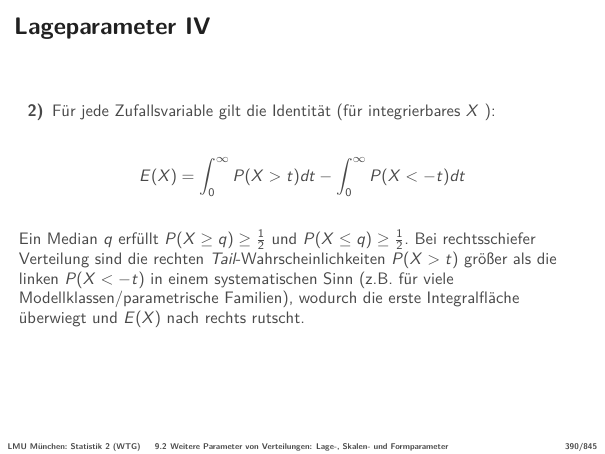

本页放在“模块四：参数和生成函数提供更高层描述”中，核心是理解 概率（Wahrscheinlichkeit）、随机变量（Zufallsvariable）、分布（Verteilung）。直觉上先抓住标题里的对象：Lageparameter IV。然后看它是定义、例子、定理还是证明；定义页要记条件，例子页要看随机机制，证明页要看用了哪些闭包性或极限定理。

关键词：

- 概率（Wahrscheinlichkeit）
- 随机变量（Zufallsvariable）
- 分布（Verteilung）

本页需要抓住的德语线索：

- `E (X ) = P(X > t)dt − P(X < −t)dt`
- `Ein Median q erfüllt P(X ≥ q) ≥ 1 und P(X ≤ q) ≥ 1 . Bei rechtsschiefer`
- `Verteilung sind die rechten Tail-Wahrscheinlichkeiten P(X > t) größer als die`
- `linken P(X < −t) in einem systematischen Sinn (z.B. für viele`

### Seite 206 - Lageparameter V

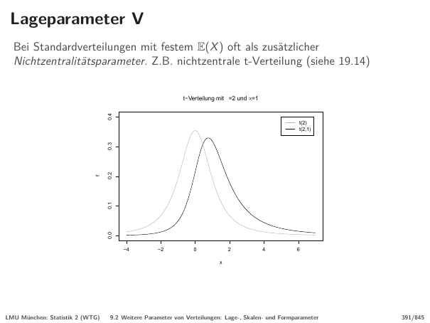

本页放在“模块四：参数和生成函数提供更高层描述”中，核心是理解 分布（Verteilung）。直觉上先抓住标题里的对象：Lageparameter V。然后看它是定义、例子、定理还是证明；定义页要记条件，例子页要看随机机制，证明页要看用了哪些闭包性或极限定理。

关键词：

- 分布（Verteilung）

本页需要抓住的德语线索：

- `Bei Standardverteilungen mit festem E(X ) oft als zusätzlicher`
- `t−Verteilung mit n =2 und m =1`

### Seite 207 - Skalen- und Formparameter I

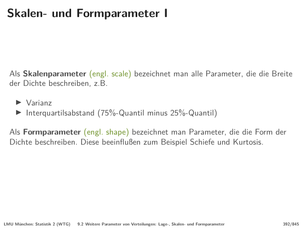

本页放在“模块四：参数和生成函数提供更高层描述”中，核心是理解 密度（Dichte）、方差（Varianz）。直觉上先抓住标题里的对象：Skalen- und Formparameter I。然后看它是定义、例子、定理还是证明；定义页要记条件，例子页要看随机机制，证明页要看用了哪些闭包性或极限定理。

关键词：

- 密度（Dichte）
- 方差（Varianz）

本页需要抓住的德语线索：

- `Dichte beschreiben. Diese beeinflußen zum Beispiel Schiefe und Kurtosis.`

### Seite 208 - Skalen- und Formparameter II

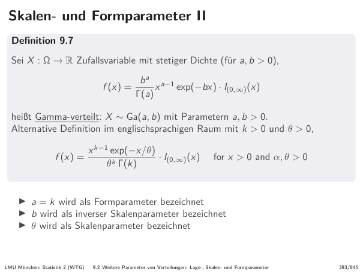

本页放在“模块四：参数和生成函数提供更高层描述”中，核心是理解 随机变量（Zufallsvariable）、密度（Dichte）、Gamma 分布（Gamma）。直觉上先抓住标题里的对象：Skalen- und Formparameter II。然后看它是定义、例子、定理还是证明；定义页要记条件，例子页要看随机机制，证明页要看用了哪些闭包性或极限定理。

关键词：

- 随机变量（Zufallsvariable）
- 密度（Dichte）
- Gamma 分布（Gamma）

本页需要抓住的德语线索：

- `Definition 9.7`
- `Sei X : Ω → R Zufallsvariable mit stetiger Dichte (für a, b > 0),`
- `f (x ) = x a−1 exp(−bx ) · I (x )`
- `Alternative Definition im englischsprachigen Raum mit k > 0 und θ > 0,`
- `f (x ) = · I (x ) for x > 0 and α, θ > 0`

### Seite 209 - Skalen- und Formparameter III

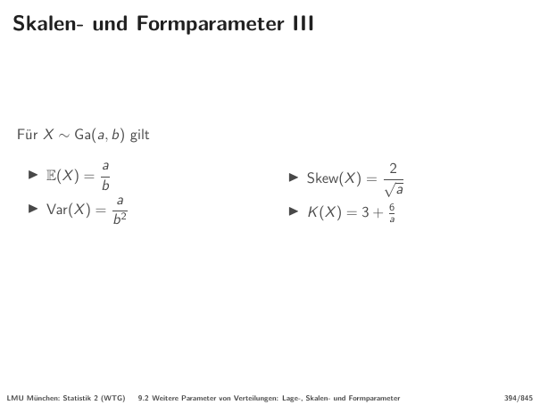

本页放在“模块四：参数和生成函数提供更高层描述”中，主要作用是推进 Seite 188-242 这一段的概念链。先把标题“Skalen- und Formparameter III”和前后页联系起来，再区分它是在给定义、展示例子、证明性质，还是做章节过渡。

本页需要抓住的德语线索：

- `E(X ) = a  Skew(X ) = √ 2`
- `Var(X ) =  K (X ) = 3 + 6`

### Seite 210 - Skalen- und Formparameter IV

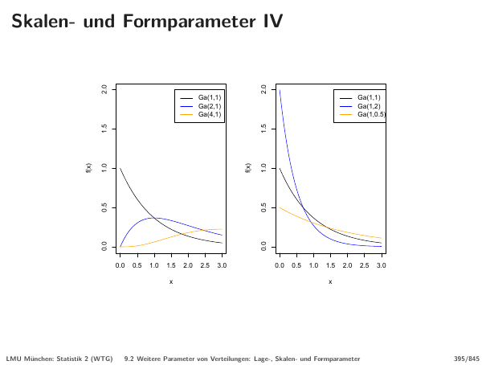

本页放在“模块四：参数和生成函数提供更高层描述”中，主要作用是推进 Seite 188-242 这一段的概念链。先把标题“Skalen- und Formparameter IV”和前后页联系起来，再区分它是在给定义、展示例子、证明性质，还是做章节过渡。

本页需要抓住的德语线索：

- `Skalen- und Formparameter IV`
- `0.0 0.5 1.0 1.5 2.0 2.5 3.0`
- `0.2`

### Seite 211 - Tails I

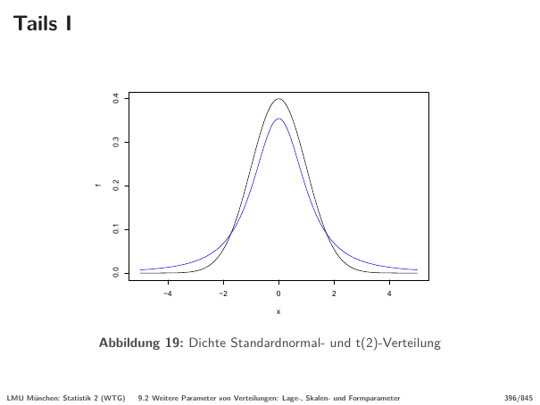

本页放在“模块四：参数和生成函数提供更高层描述”中，核心是理解 分布（Verteilung）、密度（Dichte）。直觉上先抓住标题里的对象：Tails I。然后看它是定义、例子、定理还是证明；定义页要记条件，例子页要看随机机制，证明页要看用了哪些闭包性或极限定理。

关键词：

- 分布（Verteilung）
- 密度（Dichte）

本页需要抓住的德语线索：

- `Tails I`
- `−4 −2 0 2 4`
- `4.0`

### Seite 212 - Tails II

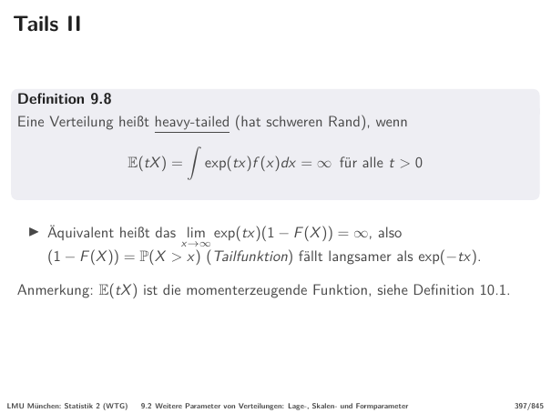

本页放在“模块四：参数和生成函数提供更高层描述”中，核心是理解 分布（Verteilung）。直觉上先抓住标题里的对象：Tails II。然后看它是定义、例子、定理还是证明；定义页要记条件，例子页要看随机机制，证明页要看用了哪些闭包性或极限定理。

关键词：

- 分布（Verteilung）

本页需要抓住的德语线索：

- `Definition 9.8`
- `E(tX ) = exp(tx )f (x )dx = ∞ für alle t > 0`
- `Äquivalent heißt das lim exp(tx )(1 − F (X )) = ∞, also`
- `x→∞`
- `(1 − F (X )) = P(X > x ) (Tailfunktion) fällt langsamer als exp(−tx ).`

### Seite 213 - Tails III

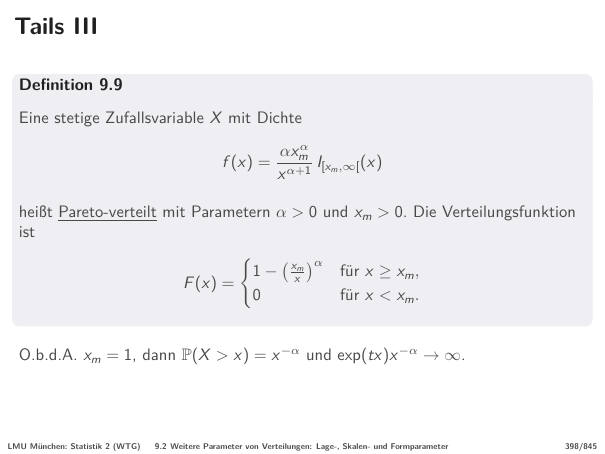

本页放在“模块四：参数和生成函数提供更高层描述”中，核心是理解 随机变量（Zufallsvariable）、分布（Verteilung）、分布函数（Verteilungsfunktion）、密度（Dichte）。直觉上先抓住标题里的对象：Tails III。然后看它是定义、例子、定理还是证明；定义页要记条件，例子页要看随机机制，证明页要看用了哪些闭包性或极限定理。

关键词：

- 随机变量（Zufallsvariable）
- 分布（Verteilung）
- 分布函数（Verteilungsfunktion）
- 密度（Dichte）

本页需要抓住的德语线索：

- `Definition 9.9`
- `f (x ) = m I (x )`
- `F (x ) = ( 1 − (cid:0) x x m (cid:1)α für x ≥ x m ,`
- `O.b.d.A. x = 1, dann P(X > x ) = x −α und exp(tx )x −α → ∞.`

### Seite 214 - Tails IV

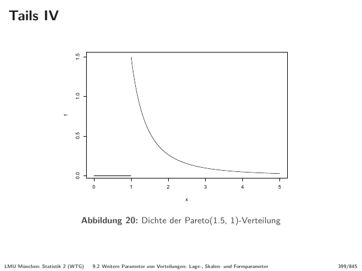

本页放在“模块四：参数和生成函数提供更高层描述”中，核心是理解 分布（Verteilung）、密度（Dichte）。直觉上先抓住标题里的对象：Tails IV。然后看它是定义、例子、定理还是证明；定义页要记条件，例子页要看随机机制，证明页要看用了哪些闭包性或极限定理。

关键词：

- 分布（Verteilung）
- 密度（Dichte）

本页需要抓住的德语线索：

- `Tails IV`
- `0 1 2 3 4 5`
- `5.1`

### Seite 215 - Tails V

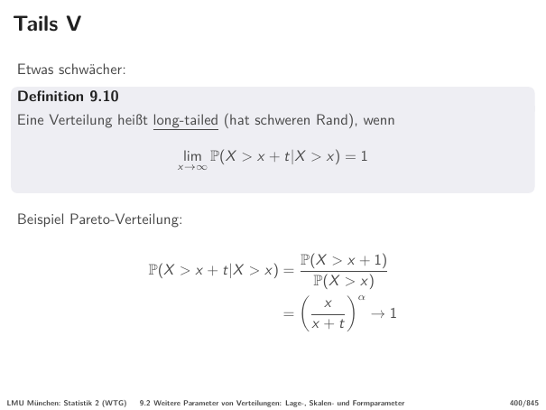

本页放在“模块四：参数和生成函数提供更高层描述”中，核心是理解 分布（Verteilung）。直觉上先抓住标题里的对象：Tails V。然后看它是定义、例子、定理还是证明；定义页要记条件，例子页要看随机机制，证明页要看用了哪些闭包性或极限定理。

关键词：

- 分布（Verteilung）

本页需要抓住的德语线索：

- `Definition 9.10`
- `lim P(X > x + t|X > x ) = 1`
- `x→∞`
- `Beispiel Pareto-Verteilung:`
- `P(X > x + 1)`

### Seite 216 - 分布（Verteilung）

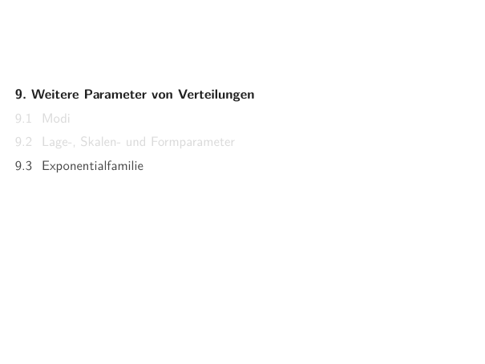

本页放在“模块四：参数和生成函数提供更高层描述”中，核心是理解 分布（Verteilung）。直觉上先抓住标题里的对象：分布（Verteilung）。然后看它是定义、例子、定理还是证明；定义页要记条件，例子页要看随机机制，证明页要看用了哪些闭包性或极限定理。

关键词：

- 分布（Verteilung）

本页需要抓住的德语线索：

- `9. Weitere Parameter von Verteilungen`
- `9.1 Modi`
- `9.2 Lage-, Skalen- und Formparameter`

### Seite 217 - Exponentialfamilie

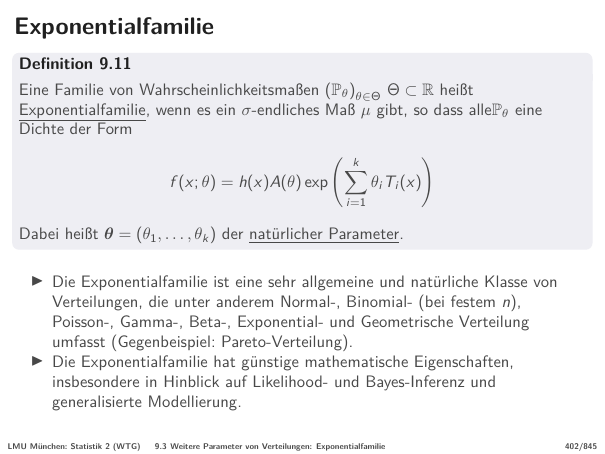

本页放在“模块四：参数和生成函数提供更高层描述”中，核心是理解 概率（Wahrscheinlichkeit）、概率测度（Wahrscheinlichkeitsmaß）、测度（Maß）、密度（Dichte）。直觉上先抓住标题里的对象：Exponentialfamilie。然后看它是定义、例子、定理还是证明；定义页要记条件，例子页要看随机机制，证明页要看用了哪些闭包性或极限定理。

关键词：

- 概率（Wahrscheinlichkeit）
- 概率测度（Wahrscheinlichkeitsmaß）
- 测度（Maß）
- 密度（Dichte）

本页需要抓住的德语线索：

- `Definition 9.11`
- `Eine Familie von Wahrscheinlichkeitsmaßen (P ) Θ ⊂ R heißt`
- `θ θ∈Θ`
- `f (x ; θ) = h(x )A(θ) exp θ T (x )`
- `i=1`

### Seite 218 - 生成函数（Erzeugende Funktionen）

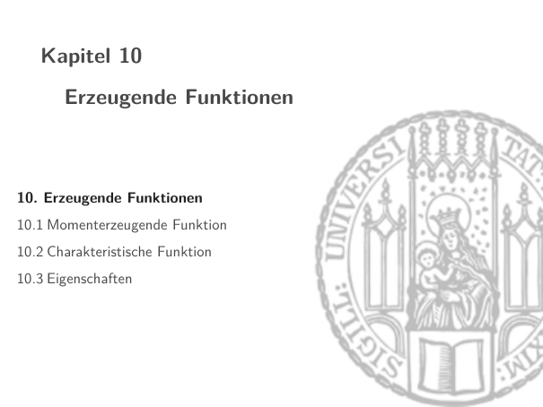

本页可识别的嵌入图片裁切：

本页放在“模块四：参数和生成函数提供更高层描述”中，主要作用是推进 Seite 188-242 这一段的概念链。先把标题“生成函数（Erzeugende Funktionen）”和前后页联系起来，再区分它是在给定义、展示例子、证明性质，还是做章节过渡。

本页需要抓住的德语线索：

- `Kapitel 10`
- `Erzeugende Funktionen`
- `10. Erzeugende Funktionen`

### Seite 219 - 生成函数（Erzeugende Funktionen）

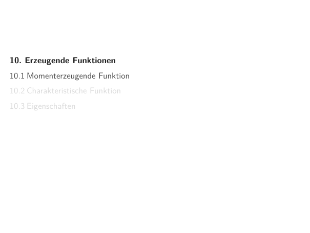

本页放在“模块四：参数和生成函数提供更高层描述”中，主要作用是推进 Seite 188-242 这一段的概念链。先把标题“生成函数（Erzeugende Funktionen）”和前后页联系起来，再区分它是在给定义、展示例子、证明性质，还是做章节过渡。

本页需要抓住的德语线索：

- `10. Erzeugende Funktionen`
- `10.1 Momenterzeugende Funktion`
- `10.2 Charakteristische Funktion`

### Seite 220 - 矩（Momente）

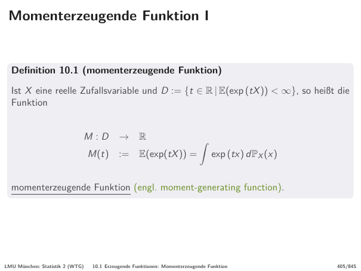

本页放在“模块四：参数和生成函数提供更高层描述”中，核心是理解 随机变量（Zufallsvariable）。直觉上先抓住标题里的对象：矩（Momente）。然后看它是定义、例子、定理还是证明；定义页要记条件，例子页要看随机机制，证明页要看用了哪些闭包性或极限定理。

关键词：

- 随机变量（Zufallsvariable）

本页需要抓住的德语线索：

- `Definition 10.1 (momenterzeugende Funktion)`
- `Ist X eine reelle Zufallsvariable und D := {t ∈ R | E(exp (tX )) < ∞}, so heißt die`
- `M : D → R`
- `M(t) := E(exp(tX )) = exp (tx ) dP (x )`

### Seite 221 - 矩（Momente）

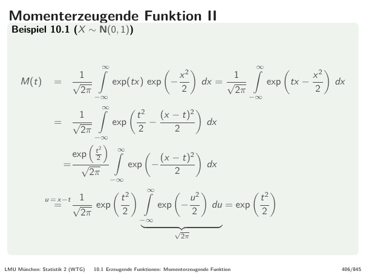

本页放在“模块四：参数和生成函数提供更高层描述”中，主要作用是推进 Seite 188-242 这一段的概念链。先把标题“矩（Momente）”和前后页联系起来，再区分它是在给定义、展示例子、证明性质，还是做章节过渡。

本页需要抓住的德语线索：

- `Beispiel 10.1 (X ∼ N(0, 1))`
- `M(t) = √ exp(tx ) exp − dx = √ exp tx − dx`
- `= √ exp − dx`
- `= √ exp − dx`
- `u = x−t`

### Seite 222 - 矩（Momente）

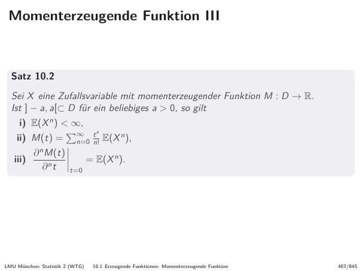

本页放在“模块四：参数和生成函数提供更高层描述”中，核心是理解 随机变量（Zufallsvariable）。直觉上先抓住标题里的对象：矩（Momente）。然后看它是定义、例子、定理还是证明；定义页要记条件，例子页要看随机机制，证明页要看用了哪些闭包性或极限定理。

关键词：

- 随机变量（Zufallsvariable）

本页需要抓住的德语线索：

- `Satz 10.2`
- `Sei X eine Zufallsvariable mit momenterzeugender Funktion M : D → R.`
- `Ist ] − a, a[⊂ D für ein beliebiges a > 0, so gilt`
- `i) E(X n) < ∞,`
- `ii) M(t) = P∞ tn E(X n),`

### Seite 223 - 矩（Momente）

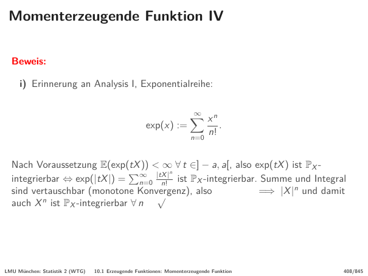

本页放在“模块四：参数和生成函数提供更高层描述”中，核心是理解 收敛（Konvergenz）。直觉上先抓住标题里的对象：矩（Momente）。然后看它是定义、例子、定理还是证明；定义页要记条件，例子页要看随机机制，证明页要看用了哪些闭包性或极限定理。

关键词：

- 收敛（Konvergenz）

本页需要抓住的德语线索：

- `exp(x ) := .`
- `n=0`
- `Nach Voraussetzung E(exp(tX )) < ∞ ∀ t ∈] − a, a[, also exp(tX ) ist P -`
- `integrierbar ⇔ exp(|tX |) = P∞ |tX|n ist P -integrierbar. Summe und Integral`
- `n=0 n! X`

### Seite 224 - 矩（Momente）

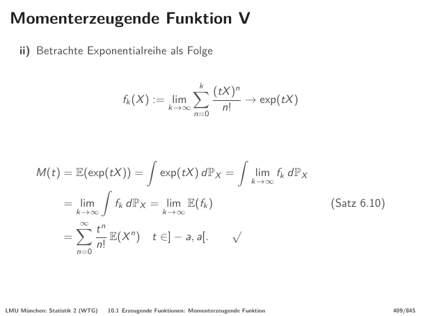

本页放在“模块四：参数和生成函数提供更高层描述”中，主要作用是推进 Seite 188-242 这一段的概念链。先把标题“矩（Momente）”和前后页联系起来，再区分它是在给定义、展示例子、证明性质，还是做章节过渡。

本页需要抓住的德语线索：

- `f (X ) := lim → exp(tX )`
- `k k→∞ n!`
- `n=0`
- `M(t) = E(exp(tX )) = exp(tX ) dP = lim f dP`
- `k→∞`

### Seite 225 - 矩（Momente）

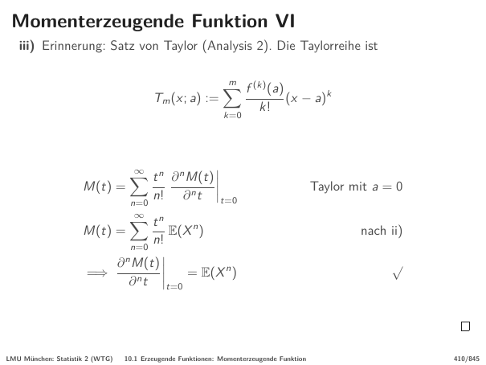

本页放在“模块四：参数和生成函数提供更高层描述”中，主要作用是推进 Seite 188-242 这一段的概念链。先把标题“矩（Momente）”和前后页联系起来，再区分它是在给定义、展示例子、证明性质，还是做章节过渡。

本页需要抓住的德语线索：

- `iii) Erinnerung: Satz von Taylor (Analysis 2). Die Taylorreihe ist`
- `T (x ; a) := (x − a)k`
- `k=0`
- `M(t) = (cid:12) Taylor mit a = 0`
- `n=0 t=0`

### Seite 226 - 矩（Momente）

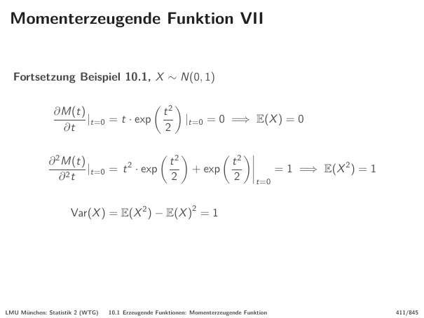

本页放在“模块四：参数和生成函数提供更高层描述”中，主要作用是推进 Seite 188-242 这一段的概念链。先把标题“矩（Momente）”和前后页联系起来，再区分它是在给定义、展示例子、证明性质，还是做章节过渡。

本页需要抓住的德语线索：

- `Fortsetzung Beispiel 10.1, X ∼ N(0, 1)`
- `| = t · exp | = 0 =⇒ E(X ) = 0`
- `∂t t=0 2 t=0`
- `∂2 ∂ M 2t (t) | t=0 = t2 · exp (cid:18) t 2 2 (cid:19) + exp (cid:18) t 2 2 (cid:19)(cid:12) (cid:12) (cid:12) (cid:12) = 1 =⇒ E(X 2) = 1`
- `t=0`

### Seite 227 - 生成函数（Erzeugende Funktionen）

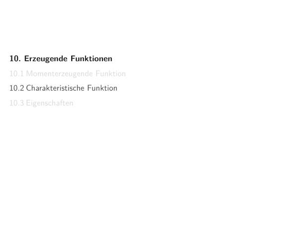

本页放在“模块四：参数和生成函数提供更高层描述”中，主要作用是推进 Seite 188-242 这一段的概念链。先把标题“生成函数（Erzeugende Funktionen）”和前后页联系起来，再区分它是在给定义、展示例子、证明性质，还是做章节过渡。

本页需要抓住的德语线索：

- `10. Erzeugende Funktionen`
- `10.1 Momenterzeugende Funktion`
- `10.2 Charakteristische Funktion`

### Seite 228 - Charakteristische Funktion I

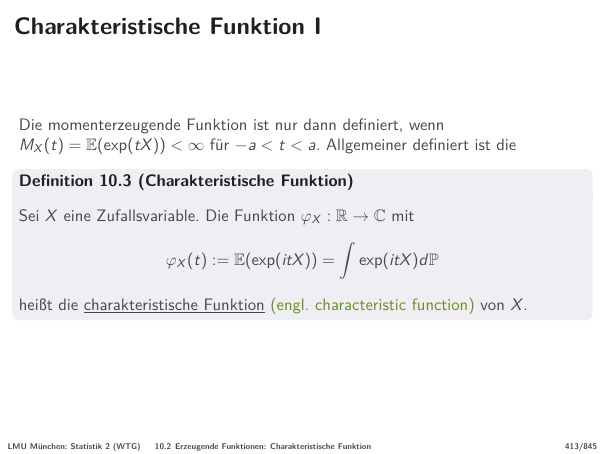

本页放在“模块四：参数和生成函数提供更高层描述”中，核心是理解 随机变量（Zufallsvariable）。直觉上先抓住标题里的对象：Charakteristische Funktion I。然后看它是定义、例子、定理还是证明；定义页要记条件，例子页要看随机机制，证明页要看用了哪些闭包性或极限定理。

关键词：

- 随机变量（Zufallsvariable）

本页需要抓住的德语线索：

- `M (t) = E(exp(tX )) < ∞ für −a < t < a. Allgemeiner definiert ist die`
- `Definition 10.3 (Charakteristische Funktion)`
- `Sei X eine Zufallsvariable. Die Funktion φ : R → C mit`
- `φ (t) := E(exp(itX )) = exp(itX )dP`

### Seite 229 - Fourier-Transformation I

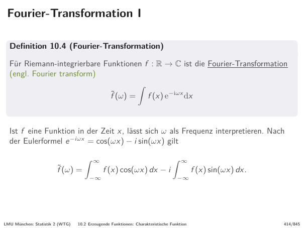

本页放在“模块四：参数和生成函数提供更高层描述”中，主要作用是推进 Seite 188-242 这一段的概念链。先把标题“Fourier-Transformation I”和前后页联系起来，再区分它是在给定义、展示例子、证明性质，还是做章节过渡。

本页需要抓住的德语线索：

- `Definition 10.4 (Fourier-Transformation)`
- `Für Riemann-integrierbare Funktionen f : R → C ist die Fourier-Transformation`
- `f˜(ω) = f (x ) e−iωx dx`
- `der Eulerformel e−iωx = cos(ωx ) − i sin(ωx ) gilt`
- `f˜(ω) = f (x ) cos(ωx ) dx − i f (x ) sin(ωx ) dx .`

### Seite 230 - Fourier-Transformation II

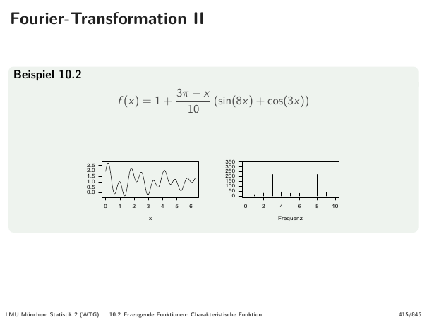

本页放在“模块四：参数和生成函数提供更高层描述”中，主要作用是推进 Seite 188-242 这一段的概念链。先把标题“Fourier-Transformation II”和前后页联系起来，再区分它是在给定义、展示例子、证明性质，还是做章节过渡。

本页需要抓住的德语线索：

- `Beispiel 10.2`
- `f (x ) = 1 + (sin(8x ) + cos(3x ))`

### Seite 231 - Charakteristische Funktion II

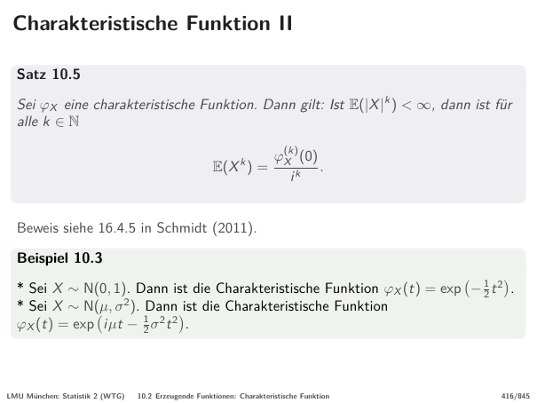

本页放在“模块四：参数和生成函数提供更高层描述”中，主要作用是推进 Seite 188-242 这一段的概念链。先把标题“Charakteristische Funktion II”和前后页联系起来，再区分它是在给定义、展示例子、证明性质，还是做章节过渡。

本页需要抓住的德语线索：

- `Satz 10.5`
- `Sei φ eine charakteristische Funktion. Dann gilt: Ist E(|X |k ) < ∞, dann ist für`
- `alle k ∈ N`
- `E(X k ) = X .`
- `Beispiel 10.3`

### Seite 232 - 生成函数（Erzeugende Funktionen）

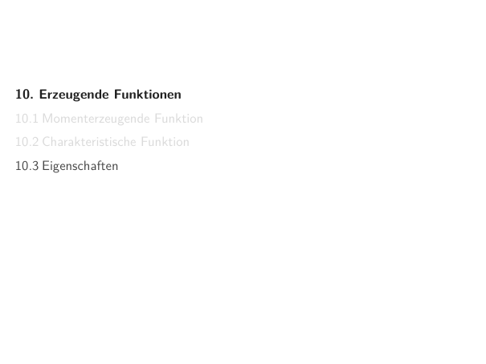

本页放在“模块四：参数和生成函数提供更高层描述”中，主要作用是推进 Seite 188-242 这一段的概念链。先把标题“生成函数（Erzeugende Funktionen）”和前后页联系起来，再区分它是在给定义、展示例子、证明性质，还是做章节过渡。

本页需要抓住的德语线索：

- `10. Erzeugende Funktionen`
- `10.1 Momenterzeugende Funktion`
- `10.2 Charakteristische Funktion`

### Seite 233 - Zusammenhänge

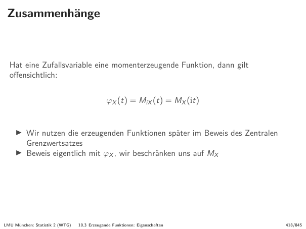

本页放在“模块四：参数和生成函数提供更高层描述”中，核心是理解 随机变量（Zufallsvariable）、极限定理（Grenzwertsatz）。直觉上先抓住标题里的对象：Zusammenhänge。然后看它是定义、例子、定理还是证明；定义页要记条件，例子页要看随机机制，证明页要看用了哪些闭包性或极限定理。

关键词：

- 随机变量（Zufallsvariable）
- 极限定理（Grenzwertsatz）

本页需要抓住的德语线索：

- `φ (t) = M (t) = M (it)`

### Seite 234 - Eindeutigkeit I

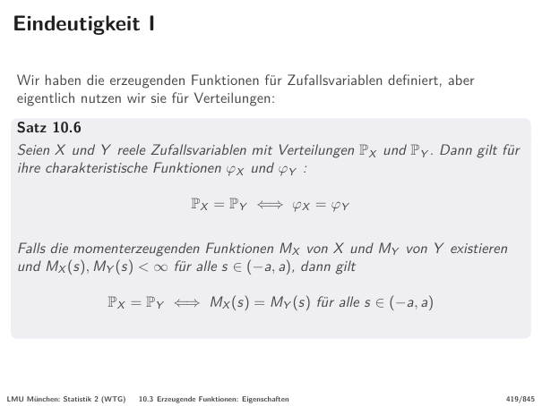

本页放在“模块四：参数和生成函数提供更高层描述”中，核心是理解 随机变量（Zufallsvariable）、分布（Verteilung）。直觉上先抓住标题里的对象：Eindeutigkeit I。然后看它是定义、例子、定理还是证明；定义页要记条件，例子页要看随机机制，证明页要看用了哪些闭包性或极限定理。

关键词：

- 随机变量（Zufallsvariable）
- 分布（Verteilung）

本页需要抓住的德语线索：

- `Satz 10.6`
- `P = P ⇐⇒ φ = φ`
- `und M (s), M (s) < ∞ für alle s ∈ (−a, a), dann gilt`
- `P = P ⇐⇒ M (s) = M (s) für alle s ∈ (−a, a)`

### Seite 235 - Eindeutigkeit II

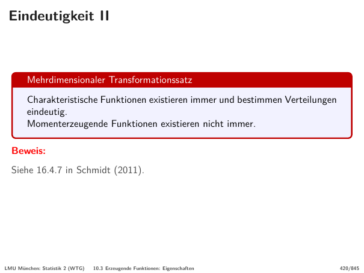

本页放在“模块四：参数和生成函数提供更高层描述”中，核心是理解 分布（Verteilung）。直觉上先抓住标题里的对象：Eindeutigkeit II。然后看它是定义、例子、定理还是证明；定义页要记条件，例子页要看随机机制，证明页要看用了哪些闭包性或极限定理。

关键词：

- 分布（Verteilung）

本页需要抓住的德语线索：

- `Eindeutigkeit II`
- `Mehrdimensionaler Transformationssatz`
- `Charakteristische Funktionen existieren immer und bestimmen Verteilungen`

### Seite 236 - Linearität

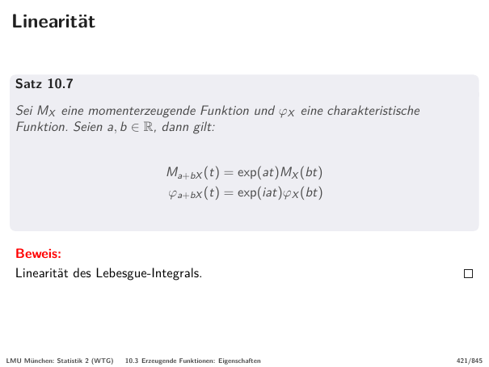

本页放在“模块四：参数和生成函数提供更高层描述”中，核心是理解 Lebesgue 积分（Lebesgue-Integral）。直觉上先抓住标题里的对象：Linearität。然后看它是定义、例子、定理还是证明；定义页要记条件，例子页要看随机机制，证明页要看用了哪些闭包性或极限定理。

关键词：

- Lebesgue 积分（Lebesgue-Integral）

本页需要抓住的德语线索：

- `Satz 10.7`
- `Funktion. Seien a, b ∈ R, dann gilt:`
- `M (t) = exp(at)M (bt)`
- `φ (t) = exp(iat)φ (bt)`

### Seite 237 - 独立性（Unabhängigkeit）

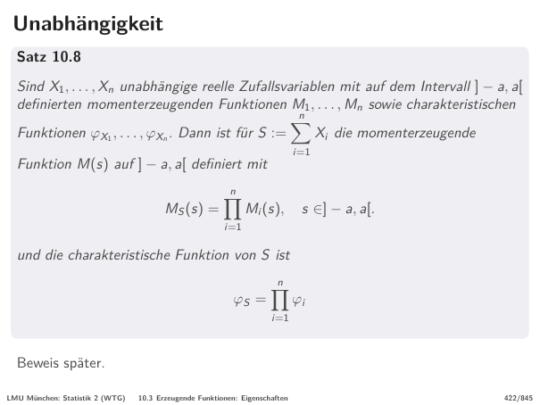

本页放在“模块四：参数和生成函数提供更高层描述”中，核心是理解 随机变量（Zufallsvariable）、独立性（Unabhängigkeit）。直觉上先抓住标题里的对象：独立性（Unabhängigkeit）。然后看它是定义、例子、定理还是证明；定义页要记条件，例子页要看随机机制，证明页要看用了哪些闭包性或极限定理。

关键词：

- 随机变量（Zufallsvariable）
- 独立性（Unabhängigkeit）

本页需要抓住的德语线索：

- `Satz 10.8`
- `Funktionen φ , . . . , φ . Dann ist für S := X die momenterzeugende`
- `i=1`
- `M (s) = M (s), s ∈] − a, a[.`
- `i=1`

### Seite 238 - 密度（Dichte）

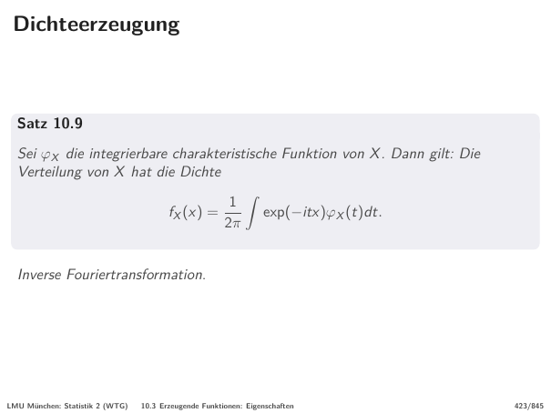

本页放在“模块四：参数和生成函数提供更高层描述”中，核心是理解 分布（Verteilung）、密度（Dichte）。直觉上先抓住标题里的对象：密度（Dichte）。然后看它是定义、例子、定理还是证明；定义页要记条件，例子页要看随机机制，证明页要看用了哪些闭包性或极限定理。

关键词：

- 分布（Verteilung）
- 密度（Dichte）

本页需要抓住的德语线索：

- `Satz 10.9`
- `f (x ) = exp(−itx )φ (t)dt.`

### Seite 239 - 分布（Verteilung）

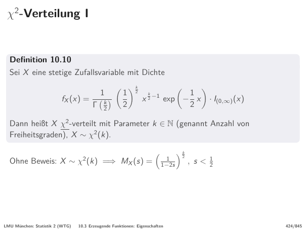

本页放在“模块四：参数和生成函数提供更高层描述”中，核心是理解 随机变量（Zufallsvariable）、分布（Verteilung）、密度（Dichte）。直觉上先抓住标题里的对象：分布（Verteilung）。然后看它是定义、例子、定理还是证明；定义页要记条件，例子页要看随机机制，证明页要看用了哪些闭包性或极限定理。

关键词：

- 随机变量（Zufallsvariable）
- 分布（Verteilung）
- 密度（Dichte）

本页需要抓住的德语线索：

- `Definition 10.10`
- `f X (x ) = Γ (cid:0) 1 k (cid:1) 1 2 2 x k 2 −1 exp − 1 2 x · I (0,∞) (x )`
- `Dann heißt X χ2-verteilt mit Parameter k ∈ N (genannt Anzahl von`
- `Ohne Beweis: X ∼ χ2(k) =⇒ M (s) = 1 2 , s < 1`

### Seite 240 - 分布（Verteilung）

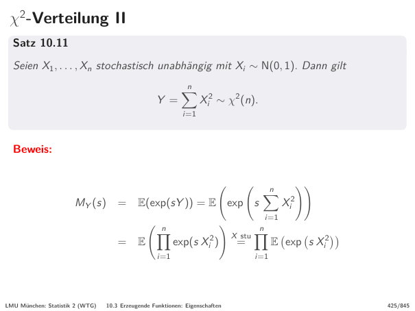

本页放在“模块四：参数和生成函数提供更高层描述”中，核心是理解 分布（Verteilung）。直觉上先抓住标题里的对象：分布（Verteilung）。然后看它是定义、例子、定理还是证明；定义页要记条件，例子页要看随机机制，证明页要看用了哪些闭包性或极限定理。

关键词：

- 分布（Verteilung）

本页需要抓住的德语线索：

- `Satz 10.11`
- `Y = X 2 ∼ χ2(n).`
- `i=1`
- `M (s) = E(exp(sY )) = E exp s X 2`
- `i=1`

### Seite 241 - 分布（Verteilung）

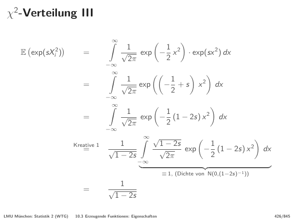

本页放在“模块四：参数和生成函数提供更高层描述”中，核心是理解 分布（Verteilung）。直觉上先抓住标题里的对象：分布（Verteilung）。然后看它是定义、例子、定理还是证明；定义页要记条件，例子页要看随机机制，证明页要看用了哪些闭包性或极限定理。

关键词：

- 分布（Verteilung）

本页需要抓住的德语线索：

- `E (cid:0) exp(sX 2) (cid:1) = Z √ 1 exp (cid:18) − 1 x 2 (cid:19) · exp(sx 2) dx`
- `= √ exp − + s x 2 dx`
- `= √ exp − (1 − 2s) x 2 dx`
- `Krea = tive 1 √ √ exp − (1 − 2s) x 2 dx`
- `= √`

### Seite 242 - 分布（Verteilung）

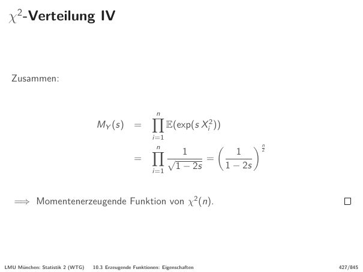

本页放在“模块四：参数和生成函数提供更高层描述”中，核心是理解 分布（Verteilung）。直觉上先抓住标题里的对象：分布（Verteilung）。然后看它是定义、例子、定理还是证明；定义页要记条件，例子页要看随机机制，证明页要看用了哪些闭包性或极限定理。

关键词：

- 分布（Verteilung）

本页需要抓住的德语线索：

- `M (s) = E(exp(s X 2))`
- `i=1`
- `= √ =`
- `i=1`
- `=⇒ Momentenerzeugende Funktion von χ2(n).`

## 本章逻辑梳理

- **分布函数（Seite 1-37）：** CDF、分位数、生存函数。
- **Lebesgue 积分（Seite 38-84）：** 从函数积分到对测度积分。
- **密度与分布类型（Seite 85-126）：** 离散、连续、混合分布。
- **矩与不等式（Seite 127-187）：** 期望、方差、Markov/Chebyshev。
- **参数与生成函数（Seite 188-242）：** 位置尺度形状、指数族、MGF/CF。

复习时不要按页码硬背。先确认本页属于哪个模块，再问它是在定义对象、说明性质、给例子、证明定理，还是提醒适用边界。

## 关键考核点

1. 会用分布函数定义和计算概率区间。
2. 会解释 Lebesgue 积分相对 Riemann 积分的思想差异。
3. 会区分密度函数、概率质量函数和分布函数。
4. 会使用期望、方差、矩母函数、特征函数的定义和场景。

## 本章公式清单

### 分布函数

| 序号 | 公式 | 使用场景 | 注意事项 |
| ---: | --- | --- | --- |
| 1 | $F_X(x)=P(X\le x)$ | 定义一维分布函数。 | 单调、右连续，极限为 0 和 1。 |
| 2 | $P(a<X\le b)=F(b)-F(a)$ | 用 CDF 算区间概率。 | 注意边界约定。 |
| 3 | $F^{-1}(p)=\inf\{x:F(x)\ge p\}$ | 分位数函数。 | 适合有跳跃的分布。 |
| 4 | $S(t)=P(T\ge t)=1-F_T(t)$ | 生存函数。 | 寿命模型核心。 |

### 积分、密度与矩

| 序号 | 公式 | 使用场景 | 注意事项 |
| ---: | --- | --- | --- |
| 5 | $E(X)=\int X\,dP$ | 期望的测度论定义。 | 统一离散和连续情形。 |
| 6 | $P_X(B)=\int_B f\,d\mu$ | 密度表示。 | 必须说明相对于哪个测度。 |
| 7 | $Var(X)=E(X^2)-E(X)^2$ | 方差计算公式。 | 要求二阶矩存在。 |
| 8 | $M_X(t)=E(e^{tX})$ | 矩母函数。 | 存在时可求矩并识别分布。 |
| 9 | $\varphi_X(t)=E(e^{itX})$ | 特征函数。 | 总是存在，常用于收敛证明。 |

## 章节自测

- [x] 分布函数右连续且单调不减。
- [ ] 密度值本身一定小于等于 1。
- [x] 特征函数总是存在。

## 德语词汇表

| 德语 | 中文 | 使用场景 |
| --- | --- | --- |
| Verteilungsfunktion | 分布函数 | 一维分布核心 |
| rechtsstetig | 右连续 | CDF 性质 |
| Quantilsfunktion | 分位数函数 | 反函数法 |
| Lebesgue-Integral | Lebesgue 积分 | 期望定义 |
| Dichte | 密度 | 测度的函数表示 |
| Moment | 矩 | 分布特征 |
| momenterzeugende Funktion | 矩母函数 | 生成矩 |
| charakteristische Funktion | 特征函数 | 分布编码 |

## C1 德语句式

| 序号 | 德语句式 | 中文翻译 | 适用场景 |
| ---: | --- | --- | --- |
| 1 | Die Verteilungsfunktion enthält dieselbe Information wie das zugehörige Wahrscheinlichkeitsmaß auf der reellen Borel-σ-Algebra. | 在实数 Borel σ-代数上，分布函数包含与对应概率测度相同的信息。 | 解释 Korrespondenzsatz。 |
| 2 | Eine Dichte ist immer relativ zu einem Referenzmaß zu verstehen. | 密度总是相对于某个参考测度来理解。 | 防止把密度当概率。 |
| 3 | Momenten- und charakteristische Funktionen kodieren Verteilungen in Form von Erwartungswerten transformierter Zufallsvariablen. | 矩母函数和特征函数把分布编码为变换后随机变量的期望。 | 解释生成函数。 |
