# 下学期第 04 章：多维随机变量

> 来源：`分章节讲义-下学期/04_Mehrdimensionale Zufallsvariablen.pdf`  
> 原讲义页码：S. 428-600  
> 图片目录：`assets/`  
> 核心主线：本部分把一维随机变量扩展为随机向量：联合分布、边际分布、变换、卷积、独立性、协方差、条件分布和多元正态共同构成多变量概率语言。

## 章节知识树

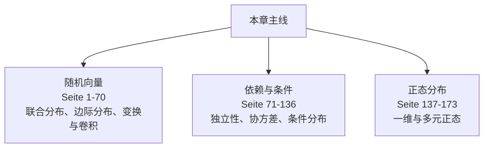
```mermaid
flowchart TD
  A["本章主线"]
  A --> M1["随机向量<br/>Seite 1-70<br/>联合分布、边际分布、变换与卷积"]
  A --> M2["依赖与条件<br/>Seite 71-136<br/>独立性、协方差、条件分布"]
  A --> M3["正态分布<br/>Seite 137-173<br/>一维与多元正态"]
```

## 学习路径

本部分把一维随机变量扩展为随机向量：联合分布、边际分布、变换、卷积、独立性、协方差、条件分布和多元正态共同构成多变量概率语言。

1. **随机向量：** 联合分布、边际分布、变换与卷积（Seite 1-70）。
2. **依赖与条件：** 独立性、协方差、条件分布（Seite 71-136）。
3. **正态分布：** 一维与多元正态（Seite 137-173）。

## 模块地图

| 模块 | 页码 | 核心问题 |
| --- | --- | --- |
| 随机向量 | Seite 1-70 | 联合分布、边际分布、变换与卷积 |
| 依赖与条件 | Seite 71-136 | 独立性、协方差、条件分布 |
| 正态分布 | Seite 137-173 | 一维与多元正态 |

## 考试优先级

1. 会从联合分布推出边际分布。
2. 会判断独立性是否等价于联合分布分解。
3. 会计算协方差并解释线性依赖。
4. 会说明多元正态由均值向量和协方差矩阵刻画。

## 模块零：随机向量让多个变量进入同一个空间（Seite 1-70）

一个变量只能描述单个随机量，多维随机变量描述它们如何一起变化。联合分布保留关系，边际分布只看单个变量，变换和卷积则处理随机向量经过函数后的新分布。

### Seite 1 - 随机变量（Zufallsvariablen）

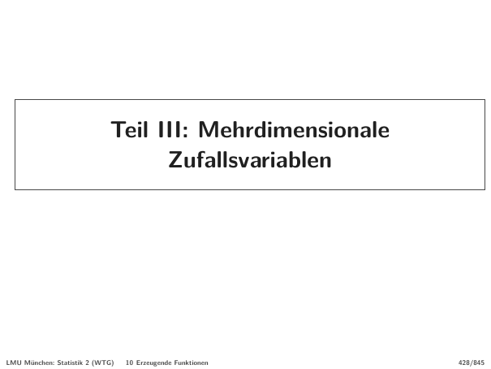

本页放在“模块零：随机向量让多个变量进入同一个空间”中，核心是理解 随机变量（Zufallsvariable）。直觉上先抓住标题里的对象：随机变量（Zufallsvariablen）。然后看它是定义、例子、定理还是证明；定义页要记条件，例子页要看随机机制，证明页要看用了哪些闭包性或极限定理。

关键词：

- 随机变量（Zufallsvariable）

本页需要抓住的德语线索：

- `Teil III: Mehrdimensionale`
- `Zufallsvariablen`

### Seite 2 - 随机向量（Zufallsvektoren）

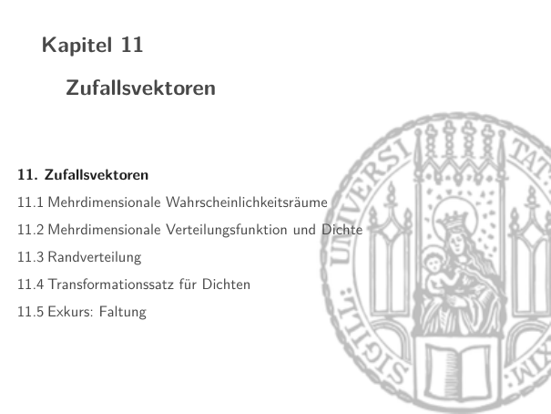

本页可识别的嵌入图片裁切：

本页放在“模块零：随机向量让多个变量进入同一个空间”中，核心是理解 概率（Wahrscheinlichkeit）、分布（Verteilung）、分布函数（Verteilungsfunktion）、密度（Dichte）。直觉上先抓住标题里的对象：随机向量（Zufallsvektoren）。然后看它是定义、例子、定理还是证明；定义页要记条件，例子页要看随机机制，证明页要看用了哪些闭包性或极限定理。

关键词：

- 概率（Wahrscheinlichkeit）
- 分布（Verteilung）
- 分布函数（Verteilungsfunktion）
- 密度（Dichte）

本页需要抓住的德语线索：

- `Kapitel 11`
- `Zufallsvektoren`
- `11. Zufallsvektoren`

### Seite 3 - 可测（messbar）

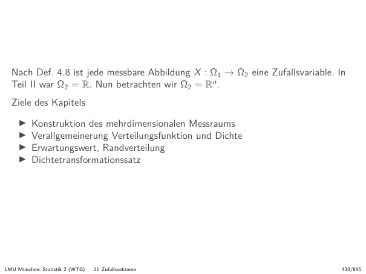

本页放在“模块零：随机向量让多个变量进入同一个空间”中，核心是理解 可测（messbar）、随机变量（Zufallsvariable）、分布（Verteilung）、分布函数（Verteilungsfunktion）。直觉上先抓住标题里的对象：可测（messbar）。然后看它是定义、例子、定理还是证明；定义页要记条件，例子页要看随机机制，证明页要看用了哪些闭包性或极限定理。

关键词：

- 可测（messbar）
- 随机变量（Zufallsvariable）
- 分布（Verteilung）
- 分布函数（Verteilungsfunktion）
- 密度（Dichte）
- 期望（Erwartungswert）

本页需要抓住的德语线索：

- `Nach Def. 4.8 ist jede messbare Abbildung X : Ω → Ω eine Zufallsvariable. In`
- `Teil II war Ω = R. Nun betrachten wir Ω = Rn.`
- `Ziele des Kapitels`

### Seite 4 - n-facher Münzwurf

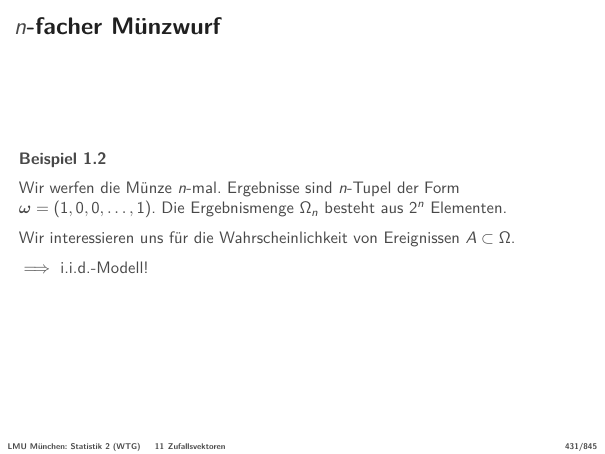

本页放在“模块零：随机向量让多个变量进入同一个空间”中，核心是理解 概率（Wahrscheinlichkeit）、结果（Ergebnis）、事件（Ereignis）。直觉上先抓住标题里的对象：n-facher Münzwurf。然后看它是定义、例子、定理还是证明；定义页要记条件，例子页要看随机机制，证明页要看用了哪些闭包性或极限定理。

关键词：

- 概率（Wahrscheinlichkeit）
- 结果（Ergebnis）
- 事件（Ereignis）

本页需要抓住的德语线索：

- `Beispiel 1.2`
- `ω = (1, 0, 0, . . . , 1). Die Ergebnismenge Ω besteht aus 2n Elementen.`
- `Wir interessieren uns für die Wahrscheinlichkeit von Ereignissen A ⊂ Ω.`
- `=⇒ i.i.d.-Modell!`

### Seite 5 - Umfrage

本页放在“模块零：随机向量让多个变量进入同一个空间”中，主要作用是推进 Seite 1-70 这一段的概念链。先把标题“Umfrage”和前后页联系起来，再区分它是在给定义、展示例子、证明性质，还是做章节过渡。

本页需要抓住的德语线索：

- `Umfrage`
- `Wir fragen n Personen: “Welche Partei wollen Sie wählen?”`
- `Wir fragen eine Person nach Parteipräferenz, Schulabschluss, Einkommen,`

### Seite 6 - Temperaturen

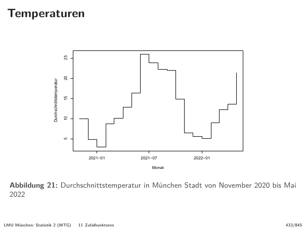

本页放在“模块零：随机向量让多个变量进入同一个空间”中，主要作用是推进 Seite 1-70 这一段的概念链。先把标题“Temperaturen”和前后页联系起来，再区分它是在给定义、展示例子、证明性质，还是做章节过渡。

本页需要抓住的德语线索：

- `Temperaturen`
- `2021−01 2021−07 2022−01`
- `52`

### Seite 7 - 随机向量（Zufallsvektoren）

本页放在“模块零：随机向量让多个变量进入同一个空间”中，核心是理解 概率（Wahrscheinlichkeit）、分布（Verteilung）、分布函数（Verteilungsfunktion）、密度（Dichte）。直觉上先抓住标题里的对象：随机向量（Zufallsvektoren）。然后看它是定义、例子、定理还是证明；定义页要记条件，例子页要看随机机制，证明页要看用了哪些闭包性或极限定理。

关键词：

- 概率（Wahrscheinlichkeit）
- 分布（Verteilung）
- 分布函数（Verteilungsfunktion）
- 密度（Dichte）

本页需要抓住的德语线索：

- `11. Zufallsvektoren`
- `11.1 Mehrdimensionale Wahrscheinlichkeitsräume`
- `11.2 Mehrdimensionale Verteilungsfunktion und Dichte`

### Seite 8 - Kartesisches Produkt I

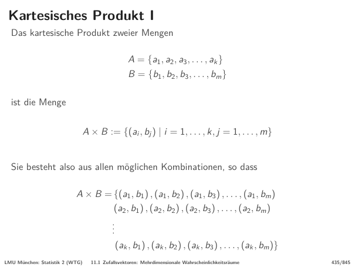

本页放在“模块零：随机向量让多个变量进入同一个空间”中，核心是理解 集合（Menge）。直觉上先抓住标题里的对象：Kartesisches Produkt I。然后看它是定义、例子、定理还是证明；定义页要记条件，例子页要看随机机制，证明页要看用了哪些闭包性或极限定理。

关键词：

- 集合（Menge）

本页需要抓住的德语线索：

- `A = {a , a , a , . . . , a }`
- `B = {b , b , b , . . . , b }`
- `A × B := {(a , b ) | i = 1, . . . , k, j = 1, . . . , m}`
- `A × B = {(a , b ) , (a , b ) , (a , b ) , . . . , (a , b )`

### Seite 9 - Kartesisches Produkt II

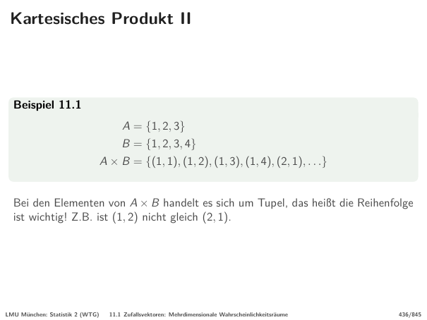

本页放在“模块零：随机向量让多个变量进入同一个空间”中，主要作用是推进 Seite 1-70 这一段的概念链。先把标题“Kartesisches Produkt II”和前后页联系起来，再区分它是在给定义、展示例子、证明性质，还是做章节过渡。

本页需要抓住的德语线索：

- `Beispiel 11.1`
- `A = {1, 2, 3}`
- `B = {1, 2, 3, 4}`
- `A × B = {(1, 1), (1, 2), (1, 3), (1, 4), (2, 1), . . .}`

### Seite 10 - Kartesisches Produkt III

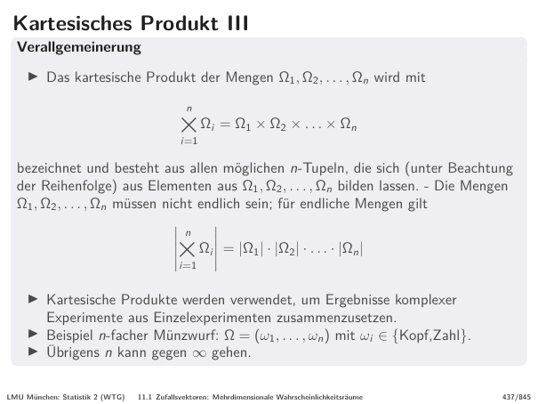

本页放在“模块零：随机向量让多个变量进入同一个空间”中，核心是理解 集合（Menge）。直觉上先抓住标题里的对象：Kartesisches Produkt III。然后看它是定义、例子、定理还是证明；定义页要记条件，例子页要看随机机制，证明页要看用了哪些闭包性或极限定理。

关键词：

- 集合（Menge）

本页需要抓住的德语线索：

- `Ω = Ω × Ω × . . . × Ω`
- `i=1`
- `(cid:12) Ω (cid:12) = |Ω | · |Ω | · . . . · |Ω |`
- `(cid:12)i=1 (cid:12)`
- `Beispiel n-facher Münzwurf: Ω = (ω , . . . , ω ) mit ω ∈ {Kopf,Zahl}.`

### Seite 11 - σ-代数（σ-Algebra）

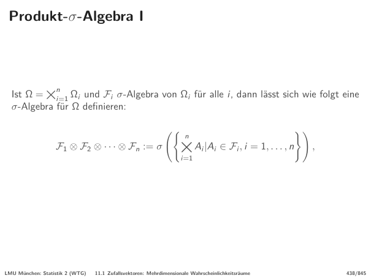

本页放在“模块零：随机向量让多个变量进入同一个空间”中，核心是理解 σ-代数（σ-Algebra）。直觉上先抓住标题里的对象：σ-代数（σ-Algebra）。然后看它是定义、例子、定理还是证明；定义页要记条件，例子页要看随机机制，证明页要看用了哪些闭包性或极限定理。

关键词：

- σ-代数（σ-Algebra）

本页需要抓住的德语线索：

- `Ist Ω = Ω und F σ-Algebra von Ω für alle i, dann lässt sich wie folgt eine`
- `i=1 i i i`
- `F ⊗ F ⊗ · · · ⊗ F := σ A |A ∈ F , i = 1, . . . , n ,`
- `i=1`

### Seite 12 - σ-代数（σ-Algebra）

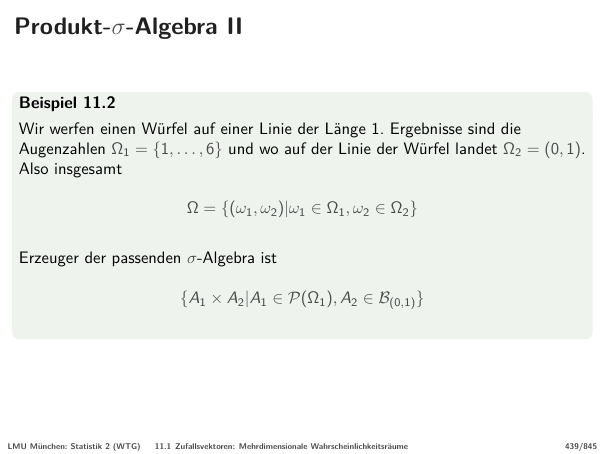

本页放在“模块零：随机向量让多个变量进入同一个空间”中，核心是理解 结果（Ergebnis）、σ-代数（σ-Algebra）。直觉上先抓住标题里的对象：σ-代数（σ-Algebra）。然后看它是定义、例子、定理还是证明；定义页要记条件，例子页要看随机机制，证明页要看用了哪些闭包性或极限定理。

关键词：

- 结果（Ergebnis）
- σ-代数（σ-Algebra）

本页需要抓住的德语线索：

- `Beispiel 11.2`
- `Augenzahlen Ω = {1, . . . , 6} und wo auf der Linie der Würfel landet Ω = (0, 1).`
- `Ω = {(ω , ω )|ω ∈ Ω , ω ∈ Ω }`
- `{A × A |A ∈ P(Ω ), A ∈ B }`

### Seite 13 - σ-代数（σ-Algebra）

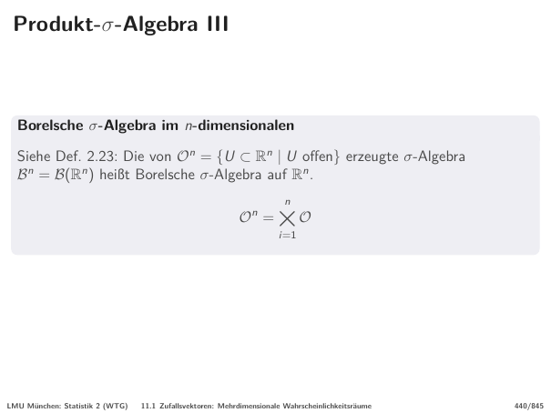

本页放在“模块零：随机向量让多个变量进入同一个空间”中，核心是理解 σ-代数（σ-Algebra）。直觉上先抓住标题里的对象：σ-代数（σ-Algebra）。然后看它是定义、例子、定理还是证明；定义页要记条件，例子页要看随机机制，证明页要看用了哪些闭包性或极限定理。

关键词：

- σ-代数（σ-Algebra）

本页需要抓住的德语线索：

- `Siehe Def. 2.23: Die von On = {U ⊂ Rn | U offen} erzeugte σ-Algebra`
- `Bn = B(Rn) heißt Borelsche σ-Algebra auf Rn.`
- `On = O`
- `i=1`

### Seite 14 - Produktmaß I

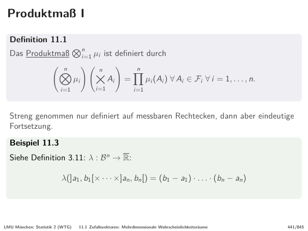

本页放在“模块零：随机向量让多个变量进入同一个空间”中，核心是理解 可测（messbar）。直觉上先抓住标题里的对象：Produktmaß I。然后看它是定义、例子、定理还是证明；定义页要记条件，例子页要看随机机制，证明页要看用了哪些闭包性或极限定理。

关键词：

- 可测（messbar）

本页需要抓住的德语线索：

- `Definition 11.1`
- `i=1 i`
- `µ A = µ (A ) ∀ A ∈ F ∀ i = 1, . . . , n.`
- `i=1 i=1 i=1`
- `Beispiel 11.3`

### Seite 15 - Produktmaßraum I

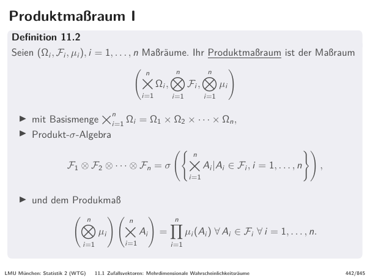

本页放在“模块零：随机向量让多个变量进入同一个空间”中，核心是理解 测度（Maß）。直觉上先抓住标题里的对象：Produktmaßraum I。然后看它是定义、例子、定理还是证明；定义页要记条件，例子页要看随机机制，证明页要看用了哪些闭包性或极限定理。

关键词：

- 测度（Maß）

本页需要抓住的德语线索：

- `Definition 11.2`
- `Seien (Ω , F , µ ), i = 1, . . . , n Maßräume. Ihr Produktmaßraum ist der Maßraum`
- `i=1 i=1 i=1`
- `mit Basismenge Ω = Ω × Ω × · · · × Ω ,`
- `i=1 i 1 2 n`

### Seite 16 - 随机变量（Zufallsvariable）

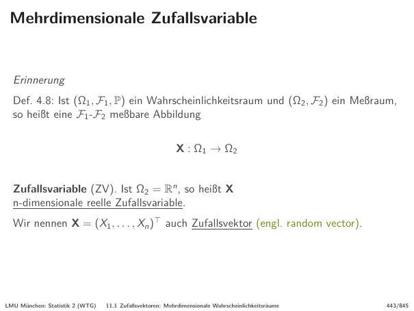

本页放在“模块零：随机向量让多个变量进入同一个空间”中，核心是理解 概率（Wahrscheinlichkeit）、概率空间（Wahrscheinlichkeitsraum）、随机变量（Zufallsvariable）、依概率（in Wahrscheinlichkeit）。直觉上先抓住标题里的对象：随机变量（Zufallsvariable）。然后看它是定义、例子、定理还是证明；定义页要记条件，例子页要看随机机制，证明页要看用了哪些闭包性或极限定理。

关键词：

- 概率（Wahrscheinlichkeit）
- 概率空间（Wahrscheinlichkeitsraum）
- 随机变量（Zufallsvariable）
- 依概率（in Wahrscheinlichkeit）

本页需要抓住的德语线索：

- `X : Ω → Ω`
- `Zufallsvariable (ZV). Ist Ω = Rn, so heißt X`
- `Wir nennen X = (X , . . . , X )⊤ auch Zufallsvektor (engl. random vector).`

### Seite 17 - 随机向量（Zufallsvektoren）

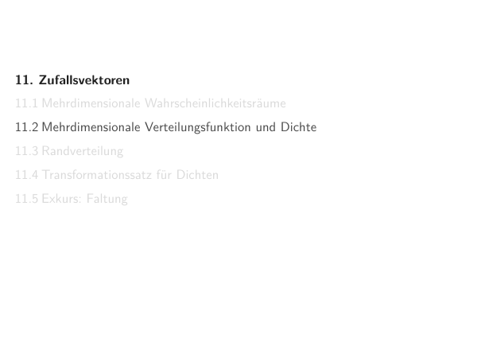

本页放在“模块零：随机向量让多个变量进入同一个空间”中，核心是理解 概率（Wahrscheinlichkeit）、分布（Verteilung）、分布函数（Verteilungsfunktion）、密度（Dichte）。直觉上先抓住标题里的对象：随机向量（Zufallsvektoren）。然后看它是定义、例子、定理还是证明；定义页要记条件，例子页要看随机机制，证明页要看用了哪些闭包性或极限定理。

关键词：

- 概率（Wahrscheinlichkeit）
- 分布（Verteilung）
- 分布函数（Verteilungsfunktion）
- 密度（Dichte）

本页需要抓住的德语线索：

- `11. Zufallsvektoren`
- `11.1 Mehrdimensionale Wahrscheinlichkeitsräume`
- `11.2 Mehrdimensionale Verteilungsfunktion und Dichte`

### Seite 18 - 分布函数（Verteilungsfunktion）

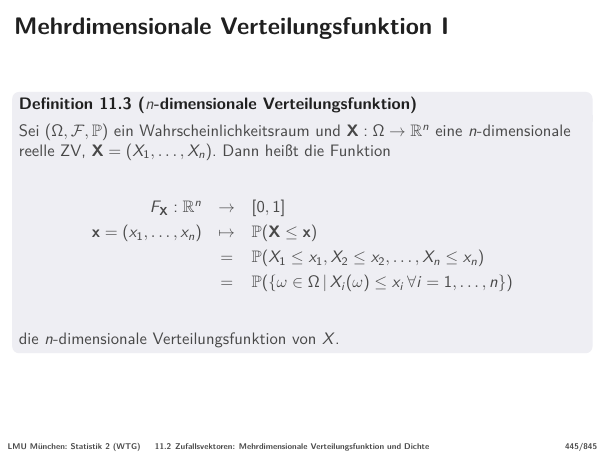

本页放在“模块零：随机向量让多个变量进入同一个空间”中，核心是理解 概率（Wahrscheinlichkeit）、概率空间（Wahrscheinlichkeitsraum）、分布（Verteilung）、分布函数（Verteilungsfunktion）。直觉上先抓住标题里的对象：分布函数（Verteilungsfunktion）。然后看它是定义、例子、定理还是证明；定义页要记条件，例子页要看随机机制，证明页要看用了哪些闭包性或极限定理。

关键词：

- 概率（Wahrscheinlichkeit）
- 概率空间（Wahrscheinlichkeitsraum）
- 分布（Verteilung）
- 分布函数（Verteilungsfunktion）
- 依概率（in Wahrscheinlichkeit）

本页需要抓住的德语线索：

- `Definition 11.3 (n-dimensionale Verteilungsfunktion)`
- `Sei (Ω, F, P) ein Wahrscheinlichkeitsraum und X : Ω → Rn eine n-dimensionale`
- `reelle ZV, X = (X , . . . , X ). Dann heißt die Funktion`
- `F : Rn → [0, 1]`
- `x = (x , . . . , x ) 7→ P(X ≤ x)`

### Seite 19 - 分布函数（Verteilungsfunktion）

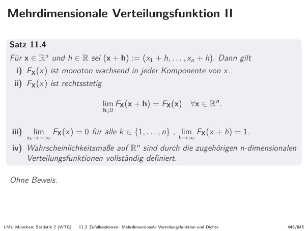

本页放在“模块零：随机向量让多个变量进入同一个空间”中，核心是理解 分布（Verteilung）、分布函数（Verteilungsfunktion）。直觉上先抓住标题里的对象：分布函数（Verteilungsfunktion）。然后看它是定义、例子、定理还是证明；定义页要记条件，例子页要看随机机制，证明页要看用了哪些闭包性或极限定理。

关键词：

- 分布（Verteilung）
- 分布函数（Verteilungsfunktion）

本页需要抓住的德语线索：

- `Satz 11.4`
- `Für x ∈ Rn und h ∈ R sei (x + h) := (x + h, . . . , x + h). Dann gilt`
- `lim F (x + h) = F (x) ∀x ∈ Rn.`
- `iii) lim F (x ) = 0 für alle k ∈ {1, . . . , n} , lim F (x + h) = 1.`
- `xk→−∞ h→∞`

### Seite 20 - 分布函数（Verteilungsfunktion）

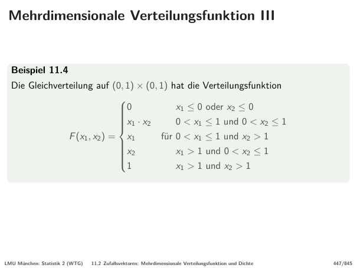

本页放在“模块零：随机向量让多个变量进入同一个空间”中，核心是理解 分布（Verteilung）、分布函数（Verteilungsfunktion）。直觉上先抓住标题里的对象：分布函数（Verteilungsfunktion）。然后看它是定义、例子、定理还是证明；定义页要记条件，例子页要看随机机制，证明页要看用了哪些闭包性或极限定理。

关键词：

- 分布（Verteilung）
- 分布函数（Verteilungsfunktion）

本页需要抓住的德语线索：

- `Beispiel 11.4`
- `0 x ≤ 0 oder x ≤ 0`
- `≤ 1 un`
- `≤ 1`
- `F (x , x ) = x für 0 < x ≤ 1 und x > 1`

### Seite 21 - 分布函数（Verteilungsfunktion）

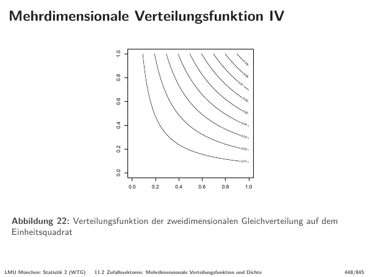

本页放在“模块零：随机向量让多个变量进入同一个空间”中，核心是理解 分布（Verteilung）、分布函数（Verteilungsfunktion）。直觉上先抓住标题里的对象：分布函数（Verteilungsfunktion）。然后看它是定义、例子、定理还是证明；定义页要记条件，例子页要看随机机制，证明页要看用了哪些闭包性或极限定理。

关键词：

- 分布（Verteilung）
- 分布函数（Verteilungsfunktion）

本页需要抓住的德语线索：

- `Mehrdimensionale Verteilungsfunktion IV`
- `0.09`
- `0.08`

### Seite 22 - 分布函数（Verteilungsfunktion）

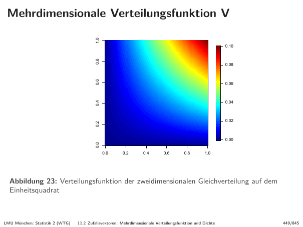

本页放在“模块零：随机向量让多个变量进入同一个空间”中，核心是理解 分布（Verteilung）、分布函数（Verteilungsfunktion）。直觉上先抓住标题里的对象：分布函数（Verteilungsfunktion）。然后看它是定义、例子、定理还是证明；定义页要记条件，例子页要看随机机制，证明页要看用了哪些闭包性或极限定理。

关键词：

- 分布（Verteilung）
- 分布函数（Verteilungsfunktion）

本页需要抓住的德语线索：

- `Mehrdimensionale Verteilungsfunktion V`
- `0.0 0.2 0.4 0.6 0.8 1.0`
- `0.1`

### Seite 23 - Satz von Fubini I

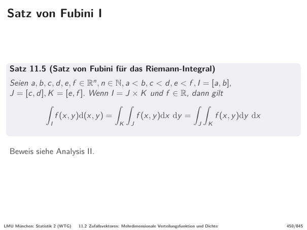

本页放在“模块零：随机向量让多个变量进入同一个空间”中，主要作用是推进 Seite 1-70 这一段的概念链。先把标题“Satz von Fubini I”和前后页联系起来，再区分它是在给定义、展示例子、证明性质，还是做章节过渡。

本页需要抓住的德语线索：

- `Satz von Fubini I`
- `Satz 11.5 (Satz von Fubini für das Riemann-Integral)`
- `Seien a, b, c, d, e, f ∈ Rn, n ∈ N, a < b, c < d, e < f , I = [a, b],`
- `J = [c, d], K = [e, f ]. Wenn I = J × K und f ∈ R, dann gilt`
- `f (x , y )d(x , y ) = f (x , y )dx dy = f (x , y )dy dx`

### Seite 24 - Satz von Fubini II

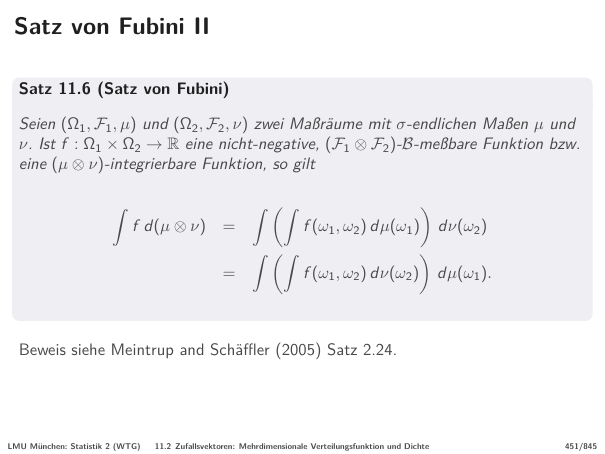

本页放在“模块零：随机向量让多个变量进入同一个空间”中，核心是理解 测度（Maß）。直觉上先抓住标题里的对象：Satz von Fubini II。然后看它是定义、例子、定理还是证明；定义页要记条件，例子页要看随机机制，证明页要看用了哪些闭包性或极限定理。

关键词：

- 测度（Maß）

本页需要抓住的德语线索：

- `Satz von Fubini II`
- `Satz 11.6 (Satz von Fubini)`
- `ν. Ist f : Ω × Ω → R eine nicht-negative, (F ⊗ F )-B-meßbare Funktion bzw.`
- `f d(µ ⊗ ν) = f (ω , ω ) dµ(ω ) dν(ω )`
- `= f (ω , ω ) dν(ω ) dµ(ω ).`

### Seite 25 - Satz von Fubini III

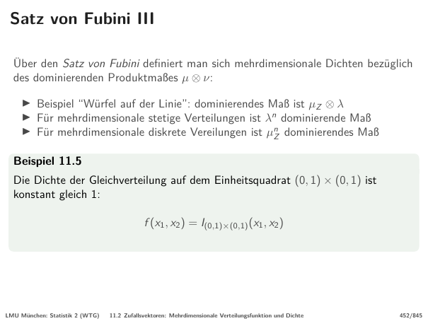

本页放在“模块零：随机向量让多个变量进入同一个空间”中，核心是理解 测度（Maß）、分布（Verteilung）、密度（Dichte）。直觉上先抓住标题里的对象：Satz von Fubini III。然后看它是定义、例子、定理还是证明；定义页要记条件，例子页要看随机机制，证明页要看用了哪些闭包性或极限定理。

关键词：

- 测度（Maß）
- 分布（Verteilung）
- 密度（Dichte）

本页需要抓住的德语线索：

- `Satz von Fubini III`
- `Über den Satz von Fubini definiert man sich mehrdimensionale Dichten bezüglich`
- `Beispiel “Würfel auf der Linie”: dominierendes Maß ist µ ⊗ λ`
- `Beispiel 11.5`
- `f (x , x ) = I (x , x )`

### Seite 26 - Multinomialverteilung I

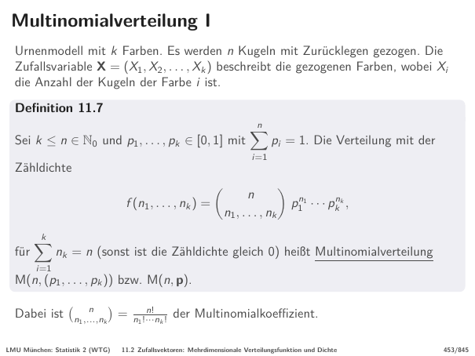

本页放在“模块零：随机向量让多个变量进入同一个空间”中，核心是理解 随机变量（Zufallsvariable）、分布（Verteilung）、 urn 模型/抽球模型（Urnenmodell）。直觉上先抓住标题里的对象：Multinomialverteilung I。然后看它是定义、例子、定理还是证明；定义页要记条件，例子页要看随机机制，证明页要看用了哪些闭包性或极限定理。

关键词：

- 随机变量（Zufallsvariable）
- 分布（Verteilung）
-  urn 模型/抽球模型（Urnenmodell）

本页需要抓住的德语线索：

- `Zufallsvariable X = (X , X , . . . , X ) beschreibt die gezogenen Farben, wobei X`
- `Definition 11.7`
- `Sei k ≤ n ∈ N und p , . . . , p ∈ [0, 1] mit p = 1. Die Verteilung mit der`
- `i=1`
- `f (n , . . . , n ) = pn1 · · · pnk ,`

### Seite 27 - Multinomialverteilung II

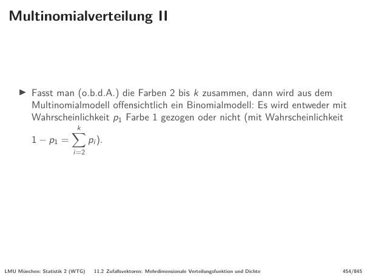

本页放在“模块零：随机向量让多个变量进入同一个空间”中，核心是理解 概率（Wahrscheinlichkeit）。直觉上先抓住标题里的对象：Multinomialverteilung II。然后看它是定义、例子、定理还是证明；定义页要记条件，例子页要看随机机制，证明页要看用了哪些闭包性或极限定理。

关键词：

- 概率（Wahrscheinlichkeit）

本页需要抓住的德语线索：

- `1 − p = p ).`
- `i=2`

### Seite 28 - 分布（Verteilung）

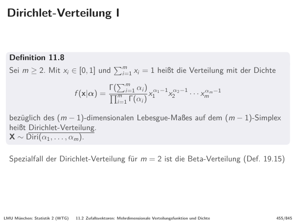

本页放在“模块零：随机向量让多个变量进入同一个空间”中，核心是理解 分布（Verteilung）、密度（Dichte）。直觉上先抓住标题里的对象：分布（Verteilung）。然后看它是定义、例子、定理还是证明；定义页要记条件，例子页要看随机机制，证明页要看用了哪些闭包性或极限定理。

关键词：

- 分布（Verteilung）
- 密度（Dichte）

本页需要抓住的德语线索：

- `Definition 11.8`
- `Sei m ≥ 2. Mit x ∈ [0, 1] und`
- `x = 1 heißt die Verteilung mit der Dichte`
- `i i=1 i`
- `f (x|α) =`

### Seite 29 - 分布（Verteilung）

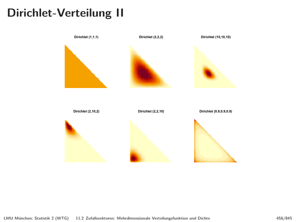

本页放在“模块零：随机向量让多个变量进入同一个空间”中，核心是理解 分布（Verteilung）。直觉上先抓住标题里的对象：分布（Verteilung）。然后看它是定义、例子、定理还是证明；定义页要记条件，例子页要看随机机制，证明页要看用了哪些闭包性或极限定理。

关键词：

- 分布（Verteilung）

本页需要抓住的德语线索：

- `Dirichlet-Verteilung II`
- `Dirichlet (1,1,1) Dirichlet (2,2,2) Dirichlet (10,10,10)`
- `Dirichlet (2,10,2) Dirichlet (2,2,10) Dirichlet (0.9,0.9,0.9)`

### Seite 30 - 随机向量（Zufallsvektoren）

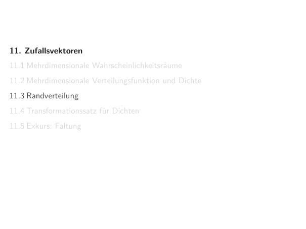

本页放在“模块零：随机向量让多个变量进入同一个空间”中，核心是理解 概率（Wahrscheinlichkeit）、分布（Verteilung）、分布函数（Verteilungsfunktion）、密度（Dichte）。直觉上先抓住标题里的对象：随机向量（Zufallsvektoren）。然后看它是定义、例子、定理还是证明；定义页要记条件，例子页要看随机机制，证明页要看用了哪些闭包性或极限定理。

关键词：

- 概率（Wahrscheinlichkeit）
- 分布（Verteilung）
- 分布函数（Verteilungsfunktion）
- 密度（Dichte）

本页需要抓住的德语线索：

- `11. Zufallsvektoren`
- `11.1 Mehrdimensionale Wahrscheinlichkeitsräume`
- `11.2 Mehrdimensionale Verteilungsfunktion und Dichte`

### Seite 31 - 边际分布（Randverteilung）

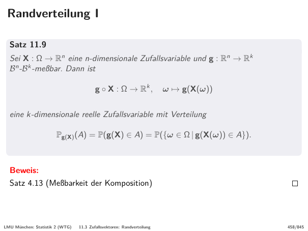

本页放在“模块零：随机向量让多个变量进入同一个空间”中，核心是理解 随机变量（Zufallsvariable）、分布（Verteilung）。直觉上先抓住标题里的对象：边际分布（Randverteilung）。然后看它是定义、例子、定理还是证明；定义页要记条件，例子页要看随机机制，证明页要看用了哪些闭包性或极限定理。

关键词：

- 随机变量（Zufallsvariable）
- 分布（Verteilung）

本页需要抓住的德语线索：

- `Satz 11.9`
- `Sei X : Ω → Rn eine n-dimensionale Zufallsvariable und g : Rn → Rk`
- `g ◦ X : Ω → Rk , ω 7→ g(X(ω))`
- `P (A) = P(g(X) ∈ A) = P({ω ∈ Ω | g(X(ω)) ∈ A}).`
- `Satz 4.13 (Meßbarkeit der Komposition)`

### Seite 32 - 边际分布（Randverteilung）

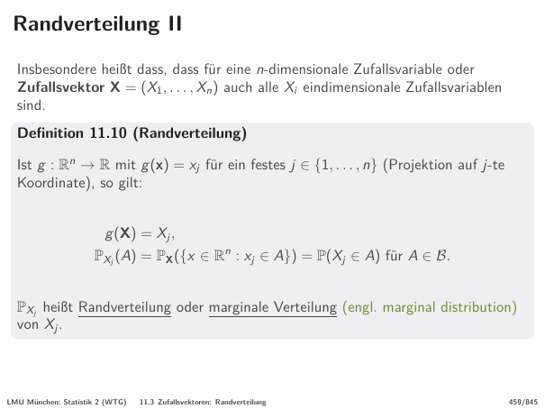

本页放在“模块零：随机向量让多个变量进入同一个空间”中，核心是理解 随机变量（Zufallsvariable）。直觉上先抓住标题里的对象：边际分布（Randverteilung）。然后看它是定义、例子、定理还是证明；定义页要记条件，例子页要看随机机制，证明页要看用了哪些闭包性或极限定理。

关键词：

- 随机变量（Zufallsvariable）

本页需要抓住的德语线索：

- `Zufallsvektor X = (X , . . . , X ) auch alle X eindimensionale Zufallsvariablen`
- `Definition 11.10 (Randverteilung)`
- `Ist g : Rn → R mit g(x) = x für ein festes j ∈ {1, . . . , n} (Projektion auf j-te`
- `g(X) = X ,`
- `P (A) = P ({x ∈ Rn : x ∈ A}) = P(X ∈ A) für A ∈ B.`

### Seite 33 - 边际分布（Randverteilung）

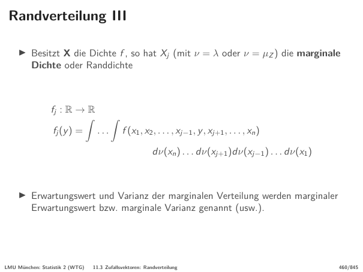

本页放在“模块零：随机向量让多个变量进入同一个空间”中，核心是理解 分布（Verteilung）、密度（Dichte）、期望（Erwartungswert）、方差（Varianz）。直觉上先抓住标题里的对象：边际分布（Randverteilung）。然后看它是定义、例子、定理还是证明；定义页要记条件，例子页要看随机机制，证明页要看用了哪些闭包性或极限定理。

关键词：

- 分布（Verteilung）
- 密度（Dichte）
- 期望（Erwartungswert）
- 方差（Varianz）

本页需要抓住的德语线索：

- `Besitzt X die Dichte f , so hat X (mit ν = λ oder ν = µ ) die marginale`
- `f : R → R`
- `f (y ) = . . . f (x , x , . . . , x , y , x , . . . , x )`

### Seite 34 - 边际分布（Randverteilung）

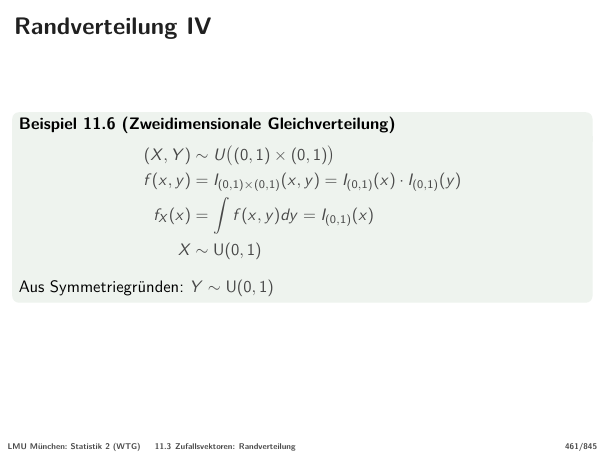

本页放在“模块零：随机向量让多个变量进入同一个空间”中，主要作用是推进 Seite 1-70 这一段的概念链。先把标题“边际分布（Randverteilung）”和前后页联系起来，再区分它是在给定义、展示例子、证明性质，还是做章节过渡。

本页需要抓住的德语线索：

- `Beispiel 11.6 (Zweidimensionale Gleichverteilung)`
- `f (x , y ) = I (x , y ) = I (x ) · I (y )`
- `f (x ) = f (x , y )dy = I (x )`

### Seite 35 - 期望（Erwartungswert）

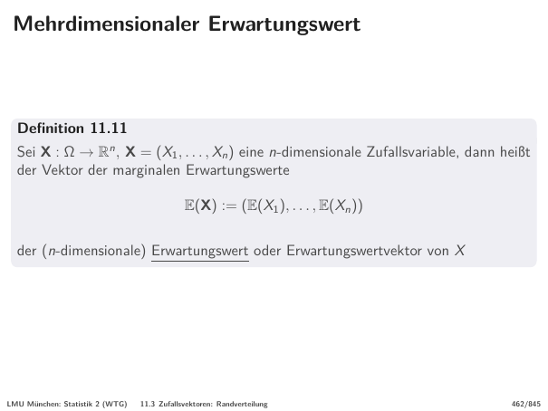

本页放在“模块零：随机向量让多个变量进入同一个空间”中，核心是理解 随机变量（Zufallsvariable）、期望（Erwartungswert）。直觉上先抓住标题里的对象：期望（Erwartungswert）。然后看它是定义、例子、定理还是证明；定义页要记条件，例子页要看随机机制，证明页要看用了哪些闭包性或极限定理。

关键词：

- 随机变量（Zufallsvariable）
- 期望（Erwartungswert）

本页需要抓住的德语线索：

- `Definition 11.11`
- `Sei X : Ω → Rn, X = (X , . . . , X ) eine n-dimensionale Zufallsvariable, dann heißt`
- `E(X) := (E(X ), . . . , E(X ))`

### Seite 36 - Multinomialverteilung I

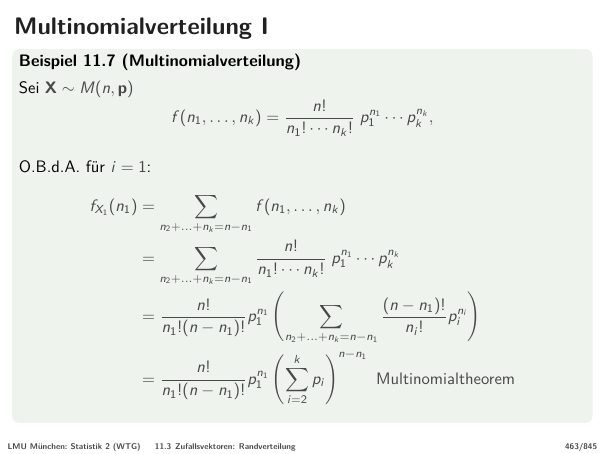

本页放在“模块零：随机向量让多个变量进入同一个空间”中，主要作用是推进 Seite 1-70 这一段的概念链。先把标题“Multinomialverteilung I”和前后页联系起来，再区分它是在给定义、展示例子、证明性质，还是做章节过渡。

本页需要抓住的德语线索：

- `Beispiel 11.7 (Multinomialverteilung)`
- `f (n , . . . , n ) = pn1 · · · pnk ,`
- `O.B.d.A. für i = 1:`
- `f (n ) = f (n , . . . , n )`
- `n2+...+nk=n−n1`

### Seite 37 - Multinomialverteilung II

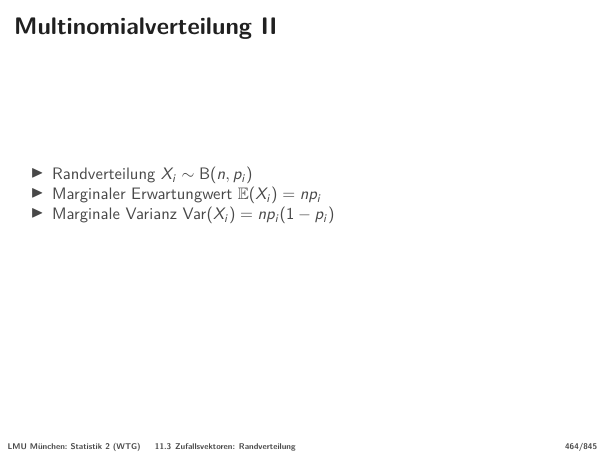

本页放在“模块零：随机向量让多个变量进入同一个空间”中，核心是理解 方差（Varianz）。直觉上先抓住标题里的对象：Multinomialverteilung II。然后看它是定义、例子、定理还是证明；定义页要记条件，例子页要看随机机制，证明页要看用了哪些闭包性或极限定理。

关键词：

- 方差（Varianz）

本页需要抓住的德语线索：

- `Marginaler Erwartungwert E(X ) = np`
- `Marginale Varianz Var(X ) = np (1 − p )`

### Seite 38 - 正态分布（Normalverteilung）

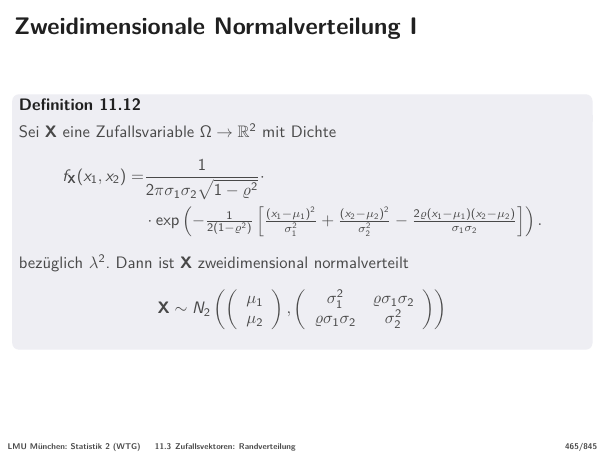

本页放在“模块零：随机向量让多个变量进入同一个空间”中，核心是理解 随机变量（Zufallsvariable）、密度（Dichte）、正态分布（Normalverteilung）。直觉上先抓住标题里的对象：正态分布（Normalverteilung）。然后看它是定义、例子、定理还是证明；定义页要记条件，例子页要看随机机制，证明页要看用了哪些闭包性或极限定理。

关键词：

- 随机变量（Zufallsvariable）
- 密度（Dichte）
- 正态分布（Normalverteilung）

本页需要抓住的德语线索：

- `Definition 11.12`
- `Sei X eine Zufallsvariable Ω → R2 mit Dichte`
- `f (x , x ) = ·`

### Seite 39 - 正态分布（Normalverteilung）

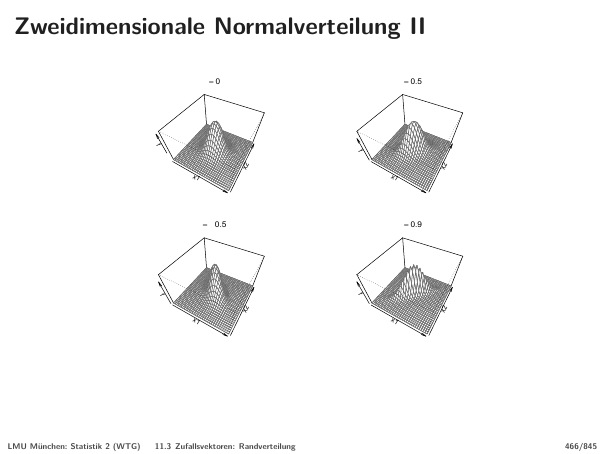

本页放在“模块零：随机向量让多个变量进入同一个空间”中，核心是理解 正态分布（Normalverteilung）。直觉上先抓住标题里的对象：正态分布（Normalverteilung）。然后看它是定义、例子、定理还是证明；定义页要记条件，例子页要看随机机制，证明页要看用了哪些闭包性或极限定理。

关键词：

- 正态分布（Normalverteilung）

本页需要抓住的德语线索：

- `r = 0 r = 0.5`
- `r = - 0.5 r = 0.9`

### Seite 40 - 正态分布（Normalverteilung）

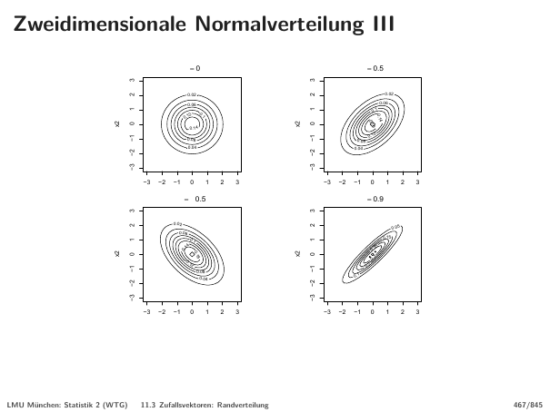

本页放在“模块零：随机向量让多个变量进入同一个空间”中，核心是理解 正态分布（Normalverteilung）。直觉上先抓住标题里的对象：正态分布（Normalverteilung）。然后看它是定义、例子、定理还是证明；定义页要记条件，例子页要看随机机制，证明页要看用了哪些闭包性或极限定理。

关键词：

- 正态分布（Normalverteilung）

本页需要抓住的德语线索：

- `r = 0`
- `r = 0.5`
- `r = - 0.5`
- `r = 0.9`

### Seite 41 - 正态分布（Normalverteilung）

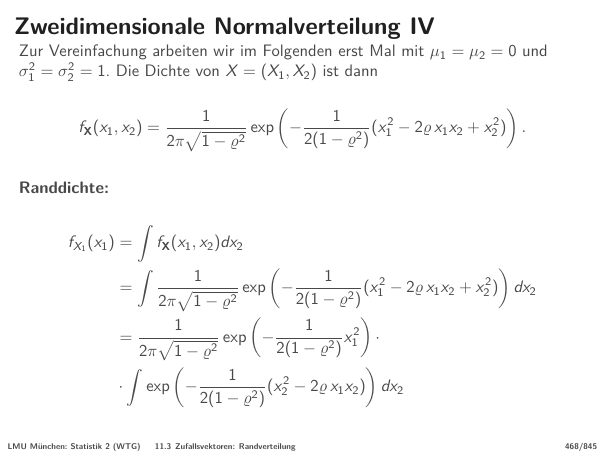

本页放在“模块零：随机向量让多个变量进入同一个空间”中，核心是理解 密度（Dichte）、正态分布（Normalverteilung）。直觉上先抓住标题里的对象：正态分布（Normalverteilung）。然后看它是定义、例子、定理还是证明；定义页要记条件，例子页要看随机机制，证明页要看用了哪些闭包性或极限定理。

关键词：

- 密度（Dichte）
- 正态分布（Normalverteilung）

本页需要抓住的德语线索：

- `Zur Vereinfachung arbeiten wir im Folgenden erst Mal mit µ = µ = 0 und`
- `σ2 = σ2 = 1. Die Dichte von X = (X , X ) ist dann`
- `f (x , x ) = exp − (x 2 − 2ϱ x x + x 2) .`
- `f (x ) = f (x , x )dx`
- `= exp − (x 2 − 2ϱ x x + x 2) dx`

### Seite 42 - 正态分布（Normalverteilung）

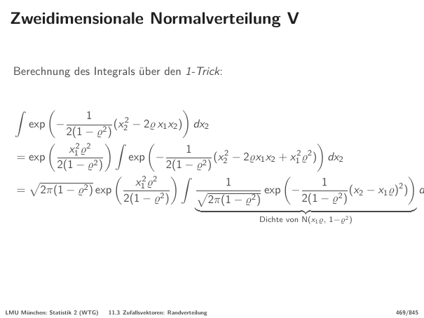

本页放在“模块零：随机向量让多个变量进入同一个空间”中，核心是理解 正态分布（Normalverteilung）。直觉上先抓住标题里的对象：正态分布（Normalverteilung）。然后看它是定义、例子、定理还是证明；定义页要记条件，例子页要看随机机制，证明页要看用了哪些闭包性或极限定理。

关键词：

- 正态分布（Normalverteilung）

本页需要抓住的德语线索：

- `= exp 1 exp − (x 2 − 2ϱx x + x 2ϱ2) dx`
- `= 2π(1 − ϱ2) exp 1 exp − (x − x ϱ)2) dx`

### Seite 43 - 正态分布（Normalverteilung）

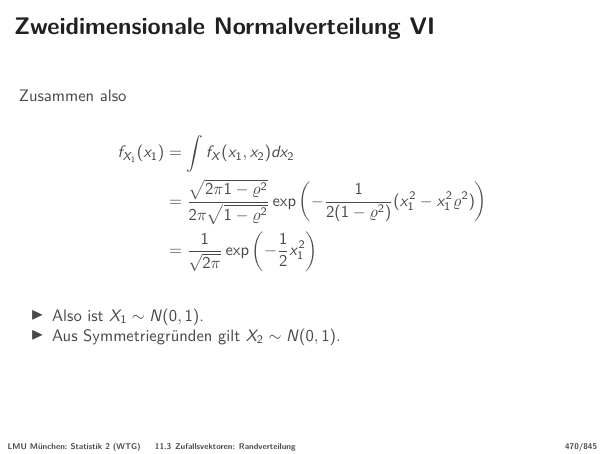

本页放在“模块零：随机向量让多个变量进入同一个空间”中，核心是理解 正态分布（Normalverteilung）。直觉上先抓住标题里的对象：正态分布（Normalverteilung）。然后看它是定义、例子、定理还是证明；定义页要记条件，例子页要看随机机制，证明页要看用了哪些闭包性或极限定理。

关键词：

- 正态分布（Normalverteilung）

本页需要抓住的德语线索：

- `f (x ) = f (x , x )dx`
- `= exp − (x 2 − x 2ϱ2)`
- `= √ exp − x 2`

### Seite 44 - 正态分布（Normalverteilung）

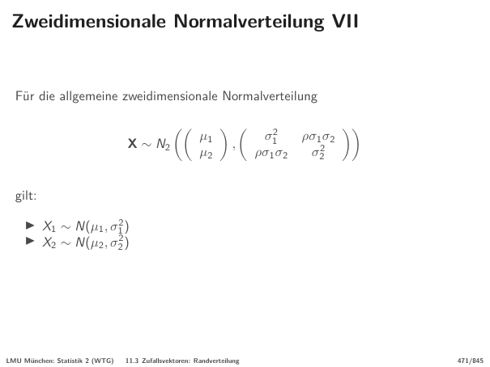

本页放在“模块零：随机向量让多个变量进入同一个空间”中，核心是理解 正态分布（Normalverteilung）。直觉上先抓住标题里的对象：正态分布（Normalverteilung）。然后看它是定义、例子、定理还是证明；定义页要记条件，例子页要看随机机制，证明页要看用了哪些闭包性或极限定理。

关键词：

- 正态分布（Normalverteilung）

本页需要抓住的德语线索：

- `Zweidimensionale Normalverteilung VII`
- `Für die allgemeine zweidimensionale Normalverteilung`
- `(cid:18)(cid:18) µ (cid:19) (cid:18) σ2 ρσ σ (cid:19)(cid:19)`

### Seite 45 - 随机向量（Zufallsvektoren）

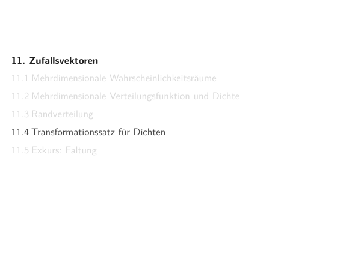

本页放在“模块零：随机向量让多个变量进入同一个空间”中，核心是理解 概率（Wahrscheinlichkeit）、分布（Verteilung）、分布函数（Verteilungsfunktion）、密度（Dichte）。直觉上先抓住标题里的对象：随机向量（Zufallsvektoren）。然后看它是定义、例子、定理还是证明；定义页要记条件，例子页要看随机机制，证明页要看用了哪些闭包性或极限定理。

关键词：

- 概率（Wahrscheinlichkeit）
- 分布（Verteilung）
- 分布函数（Verteilungsfunktion）
- 密度（Dichte）

本页需要抓住的德语线索：

- `11. Zufallsvektoren`
- `11.1 Mehrdimensionale Wahrscheinlichkeitsräume`
- `11.2 Mehrdimensionale Verteilungsfunktion und Dichte`

### Seite 46 - 密度（Dichte）

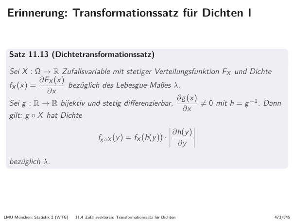

本页放在“模块零：随机向量让多个变量进入同一个空间”中，核心是理解 测度（Maß）、随机变量（Zufallsvariable）、分布（Verteilung）、分布函数（Verteilungsfunktion）。直觉上先抓住标题里的对象：密度（Dichte）。然后看它是定义、例子、定理还是证明；定义页要记条件，例子页要看随机机制，证明页要看用了哪些闭包性或极限定理。

关键词：

- 测度（Maß）
- 随机变量（Zufallsvariable）
- 分布（Verteilung）
- 分布函数（Verteilungsfunktion）
- 密度（Dichte）

本页需要抓住的德语线索：

- `Satz 11.13 (Dichtetransformationssatz)`
- `Sei X : Ω → R Zufallsvariable mit stetiger Verteilungsfunktion F und Dichte`
- `f (x ) = X bezüglich des Lebesgue-Maßes λ.`
- `Sei g : R → R bijektiv und stetig differenzierbar, ̸= 0 mit h = g−1. Dann`
- `f g◦X (y ) = f X (h(y )) · (cid:12) (cid:12) ∂y (cid:12) (cid:12)`

### Seite 47 - 密度（Dichte）

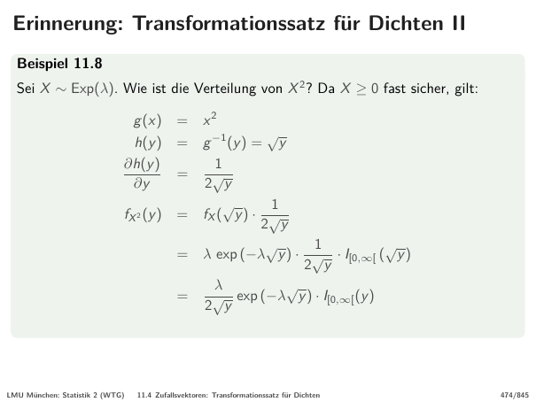

本页放在“模块零：随机向量让多个变量进入同一个空间”中，核心是理解 分布（Verteilung）、密度（Dichte）、几乎必然（fast sicher）。直觉上先抓住标题里的对象：密度（Dichte）。然后看它是定义、例子、定理还是证明；定义页要记条件，例子页要看随机机制，证明页要看用了哪些闭包性或极限定理。

关键词：

- 分布（Verteilung）
- 密度（Dichte）
- 几乎必然（fast sicher）

本页需要抓住的德语线索：

- `Beispiel 11.8`
- `Sei X ∼ Exp(λ). Wie ist die Verteilung von X 2? Da X ≥ 0 fast sicher, gilt:`
- `g(x ) = x 2`
- `h(y ) = g−1(y ) = y`
- `= √`

### Seite 48 - 密度（Dichte）

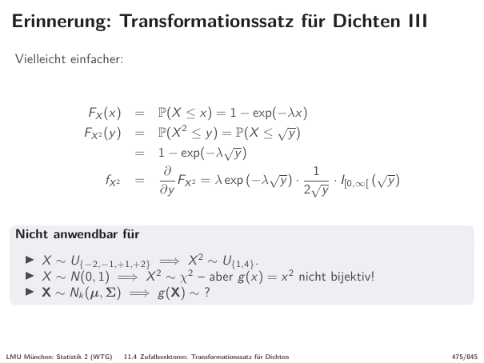

本页放在“模块零：随机向量让多个变量进入同一个空间”中，核心是理解 密度（Dichte）。直觉上先抓住标题里的对象：密度（Dichte）。然后看它是定义、例子、定理还是证明；定义页要记条件，例子页要看随机机制，证明页要看用了哪些闭包性或极限定理。

关键词：

- 密度（Dichte）

本页需要抓住的德语线索：

- `F (x ) = P(X ≤ x ) = 1 − exp(−λx )`
- `F (y ) = P(X 2 ≤ y ) = P(X ≤ y )`
- `= 1 − exp(−λ y )`
- `f = F = λ exp (−λ y ) · √ · I ( y )`
- `X ∼ U =⇒ X 2 ∼ U .`

### Seite 49 - 变换定理（Transformationssatz）

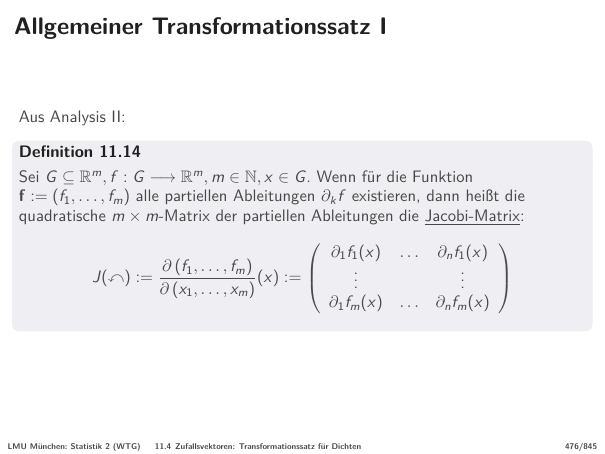

本页放在“模块零：随机向量让多个变量进入同一个空间”中，主要作用是推进 Seite 1-70 这一段的概念链。先把标题“变换定理（Transformationssatz）”和前后页联系起来，再区分它是在给定义、展示例子、证明性质，还是做章节过渡。

本页需要抓住的德语线索：

- `Definition 11.14`
- `Sei G ⊆ Rm, f : G −→ Rm, m ∈ N, x ∈ G. Wenn für die Funktion`
- `f := (f , . . . , f ) alle partiellen Ableitungen ∂ f existieren, dann heißt die`
- `J(↶) := ∂ (f 1 , . . . , f m ) (x ) :=  . . . . `

### Seite 50 - 变换定理（Transformationssatz）

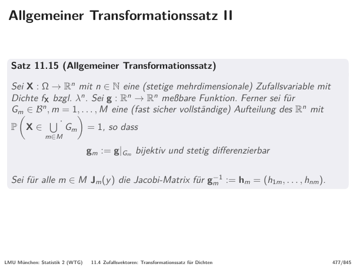

本页放在“模块零：随机向量让多个变量进入同一个空间”中，核心是理解 随机变量（Zufallsvariable）、密度（Dichte）、几乎必然（fast sicher）。直觉上先抓住标题里的对象：变换定理（Transformationssatz）。然后看它是定义、例子、定理还是证明；定义页要记条件，例子页要看随机机制，证明页要看用了哪些闭包性或极限定理。

关键词：

- 随机变量（Zufallsvariable）
- 密度（Dichte）
- 几乎必然（fast sicher）

本页需要抓住的德语线索：

- `Satz 11.15 (Allgemeiner Transformationssatz)`
- `Sei X : Ω → Rn mit n ∈ N eine (stetige mehrdimensionale) Zufallsvariable mit`
- `Dichte f bzgl. λn. Sei g : Rn → Rn meßbare Funktion. Ferner sei für`
- `G ∈ Bn, m = 1, . . . , M eine (fast sicher vollständige) Aufteilung des Rn mit`
- `P X ∈ S ˙ G = 1, so dass`

### Seite 51 - 变换定理（Transformationssatz）

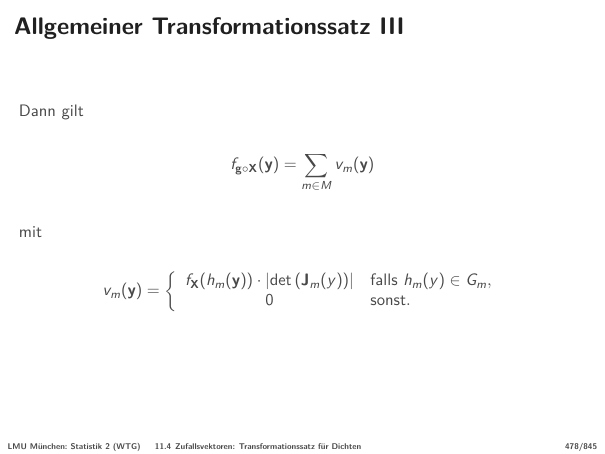

本页放在“模块零：随机向量让多个变量进入同一个空间”中，主要作用是推进 Seite 1-70 这一段的概念链。先把标题“变换定理（Transformationssatz）”和前后页联系起来，再区分它是在给定义、展示例子、证明性质，还是做章节过渡。

本页需要抓住的德语线索：

- `f (y) = v (y)`
- `m∈M`
- `f (h (y)) · |det (J (y ))| falls h (y ) ∈ G ,`
- `v (y) = X m m m m`

### Seite 52 - 变换定理（Transformationssatz）

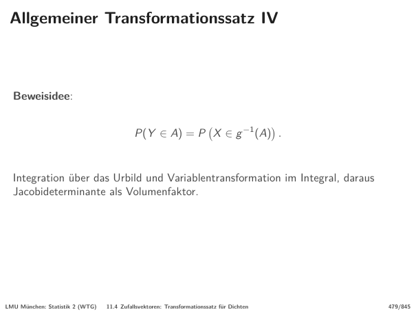

本页放在“模块零：随机向量让多个变量进入同一个空间”中，主要作用是推进 Seite 1-70 这一段的概念链。先把标题“变换定理（Transformationssatz）”和前后页联系起来，再区分它是在给定义、展示例子、证明性质，还是做章节过渡。

本页需要抓住的德语线索：

- `P(Y ∈ A) = P (cid:0) X ∈ g−1(A) (cid:1) .`

### Seite 53 - Beispiel eindimensionale, nicht bijektive

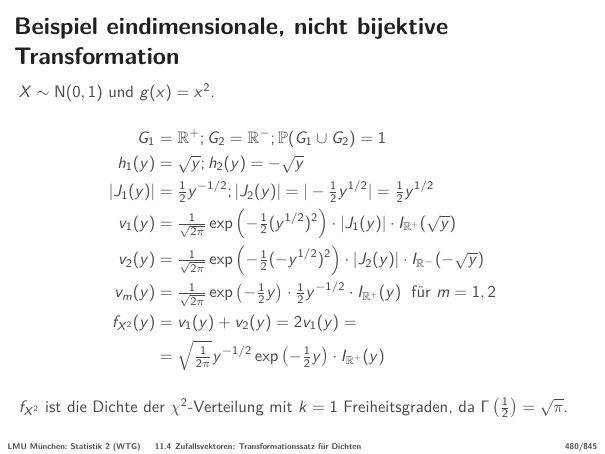

本页放在“模块零：随机向量让多个变量进入同一个空间”中，主要作用是推进 Seite 1-70 这一段的概念链。先把标题“Beispiel eindimensionale, nicht bijektive”和前后页联系起来，再区分它是在给定义、展示例子、证明性质，还是做章节过渡。

本页需要抓住的德语线索：

- `Beispiel eindimensionale, nicht bijektive`
- `X ∼ N(0, 1) und g(x ) = x 2.`
- `G = R+; G = R−; P(G ∪ G ) = 1`
- `h (y ) = y ; h (y ) = − y`
- `|J (y )| = 1 y −1/2; |J (y )| = | − 1 y 1/2| = 1 y 1/2`

### Seite 54 - Beispiel mehrdimensionale Transformation I

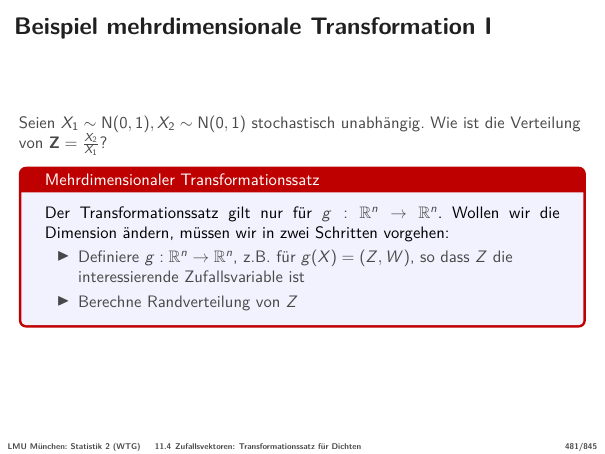

本页放在“模块零：随机向量让多个变量进入同一个空间”中，核心是理解 随机变量（Zufallsvariable）、分布（Verteilung）。直觉上先抓住标题里的对象：Beispiel mehrdimensionale Transformation I。然后看它是定义、例子、定理还是证明；定义页要记条件，例子页要看随机机制，证明页要看用了哪些闭包性或极限定理。

关键词：

- 随机变量（Zufallsvariable）
- 分布（Verteilung）

本页需要抓住的德语线索：

- `Beispiel mehrdimensionale Transformation I`
- `von Z = X2 ?`
- `Der Transformationssatz gilt nur für g : Rn → Rn. Wollen wir die`
- `Definiere g : Rn → Rn, z.B. für g(X ) = (Z , W ), so dass Z die`

### Seite 55 - Beispiel mehrdimensionale Transformation II

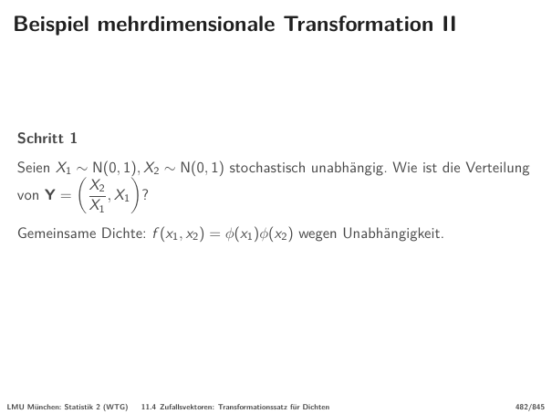

本页放在“模块零：随机向量让多个变量进入同一个空间”中，核心是理解 分布（Verteilung）、密度（Dichte）、独立性（Unabhängigkeit）。直觉上先抓住标题里的对象：Beispiel mehrdimensionale Transformation II。然后看它是定义、例子、定理还是证明；定义页要记条件，例子页要看随机机制，证明页要看用了哪些闭包性或极限定理。

关键词：

- 分布（Verteilung）
- 密度（Dichte）
- 独立性（Unabhängigkeit）

本页需要抓住的德语线索：

- `Beispiel mehrdimensionale Transformation II`
- `von Y = 2 , X ?`
- `Gemeinsame Dichte: f (x , x ) = ϕ(x )ϕ(x ) wegen Unabhängigkeit.`

### Seite 56 - Beispiel mehrdimensionale Transformation III

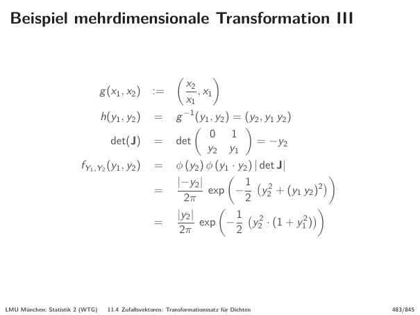

本页放在“模块零：随机向量让多个变量进入同一个空间”中，主要作用是推进 Seite 1-70 这一段的概念链。先把标题“Beispiel mehrdimensionale Transformation III”和前后页联系起来，再区分它是在给定义、展示例子、证明性质，还是做章节过渡。

本页需要抓住的德语线索：

- `Beispiel mehrdimensionale Transformation III`
- `g(x , x ) := 2 , x`
- `h(y , y ) = g−1(y , y ) = (y , y y )`
- `det(J) = det = −y`
- `f (y , y ) = ϕ (y ) ϕ (y · y ) | det J|`

### Seite 57 - Beispiel mehrdimensionale Transformation IV

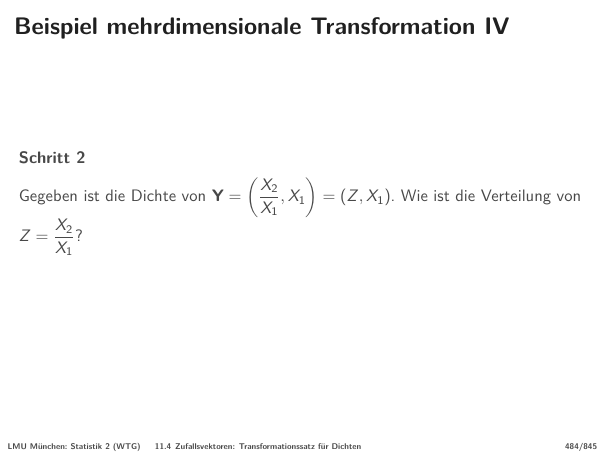

本页放在“模块零：随机向量让多个变量进入同一个空间”中，核心是理解 分布（Verteilung）、密度（Dichte）。直觉上先抓住标题里的对象：Beispiel mehrdimensionale Transformation IV。然后看它是定义、例子、定理还是证明；定义页要记条件，例子页要看随机机制，证明页要看用了哪些闭包性或极限定理。

关键词：

- 分布（Verteilung）
- 密度（Dichte）

本页需要抓住的德语线索：

- `Beispiel mehrdimensionale Transformation IV`
- `Gegeben ist die Dichte von Y = 2 , X = (Z , X ). Wie ist die Verteilung von`
- `Z = 2 ?`

### Seite 58 - Beispiel mehrdimensionale Transformation V

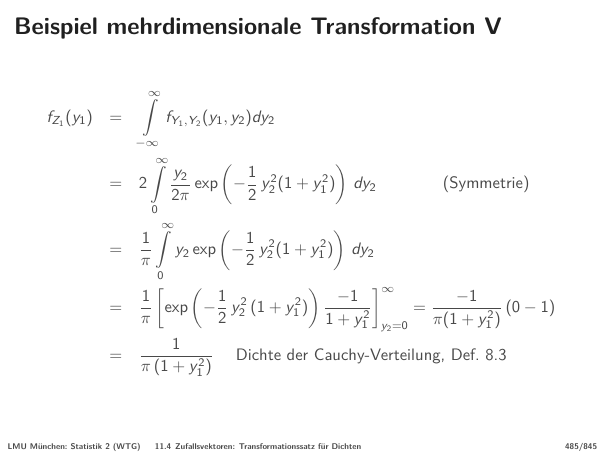

本页放在“模块零：随机向量让多个变量进入同一个空间”中，主要作用是推进 Seite 1-70 这一段的概念链。先把标题“Beispiel mehrdimensionale Transformation V”和前后页联系起来，再区分它是在给定义、展示例子、证明性质，还是做章节过渡。

本页需要抓住的德语线索：

- `Beispiel mehrdimensionale Transformation V`
- `f (y ) = f (y , y )dy`
- `= 2 2 exp − y 2(1 + y 2) dy (Symmetrie)`
- `= y exp − y 2(1 + y 2) dy`
- `= exp − y 2 (1 + y 2) = (0 − 1)`

### Seite 59 - Faltung I

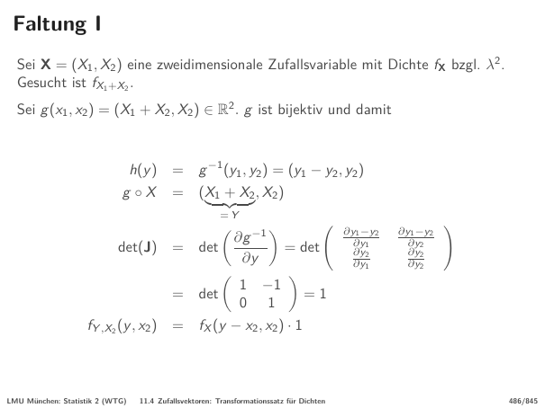

本页放在“模块零：随机向量让多个变量进入同一个空间”中，核心是理解 随机变量（Zufallsvariable）、密度（Dichte）。直觉上先抓住标题里的对象：Faltung I。然后看它是定义、例子、定理还是证明；定义页要记条件，例子页要看随机机制，证明页要看用了哪些闭包性或极限定理。

关键词：

- 随机变量（Zufallsvariable）
- 密度（Dichte）

本页需要抓住的德语线索：

- `Sei X = (X , X ) eine zweidimensionale Zufallsvariable mit Dichte f bzgl. λ2.`
- `Sei g(x , x ) = (X + X , X ) ∈ R2. g ist bijektiv und damit`
- `h(y ) = g−1(y , y ) = (y − y , y )`
- `g ◦ X = (X + X , X )`
- `= Y`

### Seite 60 - Faltung II

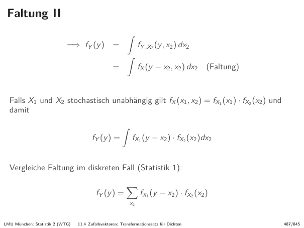

本页放在“模块零：随机向量让多个变量进入同一个空间”中，主要作用是推进 Seite 1-70 这一段的概念链。先把标题“Faltung II”和前后页联系起来，再区分它是在给定义、展示例子、证明性质，还是做章节过渡。

本页需要抓住的德语线索：

- `=⇒ f (y ) = f (y , x ) dx`
- `= f (y − x , x ) dx (Faltung)`
- `Falls X und X stochastisch unabhängig gilt f (x , x ) = f (x ) · f (x ) und`
- `f (y ) = f (y − x ) · f (x )dx`
- `f (y ) = f (y − x ) · f (x )`

### Seite 61 - Beispiel Faltung I

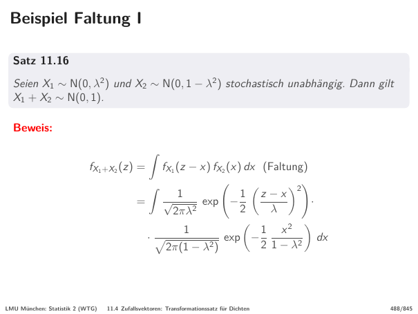

本页放在“模块零：随机向量让多个变量进入同一个空间”中，主要作用是推进 Seite 1-70 这一段的概念链。先把标题“Beispiel Faltung I”和前后页联系起来，再区分它是在给定义、展示例子、证明性质，还是做章节过渡。

本页需要抓住的德语线索：

- `Beispiel Faltung I`
- `Satz 11.16`
- `f (z) = f (z − x ) f (x ) dx (Faltung)`
- `= √ exp − ·`

### Seite 62 - Beispiel Faltung II

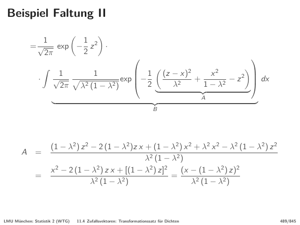

本页放在“模块零：随机向量让多个变量进入同一个空间”中，主要作用是推进 Seite 1-70 这一段的概念链。先把标题“Beispiel Faltung II”和前后页联系起来，再区分它是在给定义、展示例子、证明性质，还是做章节过渡。

本页需要抓住的德语线索：

- `Beispiel Faltung II`
- `= √ exp − z2 ·`
- `A =`
- `= =`

### Seite 63 - Beispiel Faltung III

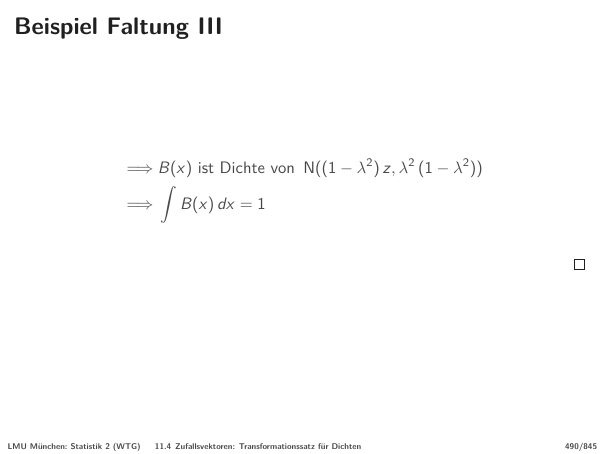

本页放在“模块零：随机向量让多个变量进入同一个空间”中，核心是理解 密度（Dichte）。直觉上先抓住标题里的对象：Beispiel Faltung III。然后看它是定义、例子、定理还是证明；定义页要记条件，例子页要看随机机制，证明页要看用了哪些闭包性或极限定理。

关键词：

- 密度（Dichte）

本页需要抓住的德语线索：

- `Beispiel Faltung III`
- `=⇒ B(x ) ist Dichte von N((1 − λ2) z, λ2 (1 − λ2))`
- `=⇒ B(x ) dx = 1`

### Seite 64 - 随机向量（Zufallsvektoren）

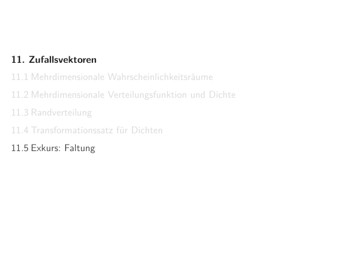

本页放在“模块零：随机向量让多个变量进入同一个空间”中，核心是理解 概率（Wahrscheinlichkeit）、分布（Verteilung）、分布函数（Verteilungsfunktion）、密度（Dichte）。直觉上先抓住标题里的对象：随机向量（Zufallsvektoren）。然后看它是定义、例子、定理还是证明；定义页要记条件，例子页要看随机机制，证明页要看用了哪些闭包性或极限定理。

关键词：

- 概率（Wahrscheinlichkeit）
- 分布（Verteilung）
- 分布函数（Verteilungsfunktion）
- 密度（Dichte）

本页需要抓住的德语线索：

- `11. Zufallsvektoren`
- `11.1 Mehrdimensionale Wahrscheinlichkeitsräume`
- `11.2 Mehrdimensionale Verteilungsfunktion und Dichte`

### Seite 65 - Faltung I

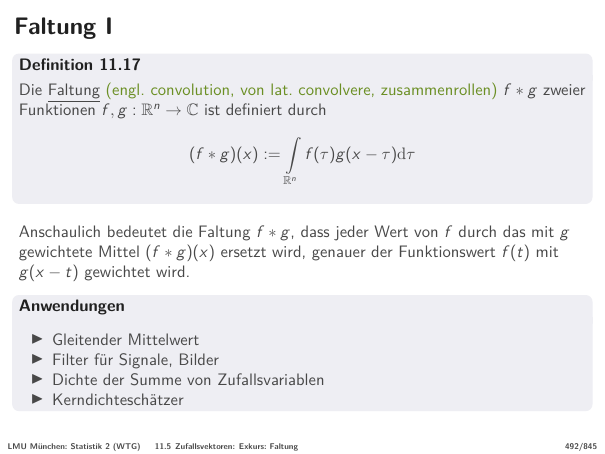

本页放在“模块零：随机向量让多个变量进入同一个空间”中，主要作用是推进 Seite 1-70 这一段的概念链。先把标题“Faltung I”和前后页联系起来，再区分它是在给定义、展示例子、证明性质，还是做章节过渡。

本页需要抓住的德语线索：

- `Definition 11.17`
- `Funktionen f , g : Rn → C ist definiert durch`
- `(f ∗ g)(x ) := f (τ )g(x − τ )dτ`

### Seite 66 - Beispiele I

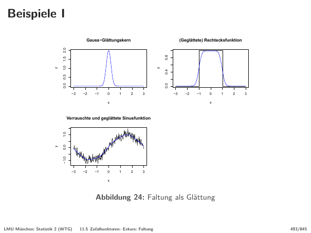

本页放在“模块零：随机向量让多个变量进入同一个空间”中，主要作用是推进 Seite 1-70 这一段的概念链。先把标题“Beispiele I”和前后页联系起来，再区分它是在给定义、展示例子、证明性质，还是做章节过渡。

本页需要抓住的德语线索：

- `Beispiele I`

### Seite 67 - Beispiele II

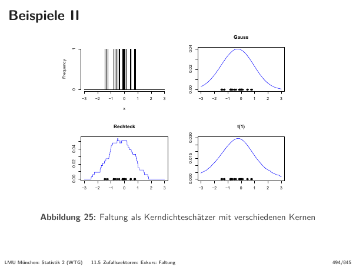

本页放在“模块零：随机向量让多个变量进入同一个空间”中，主要作用是推进 Seite 1-70 这一段的概念链。先把标题“Beispiele II”和前后页联系起来，再区分它是在给定义、展示例子、证明性质，还是做章节过渡。

本页需要抓住的德语线索：

- `Beispiele II`

### Seite 68 - Fourier-Transformation der Faltung I

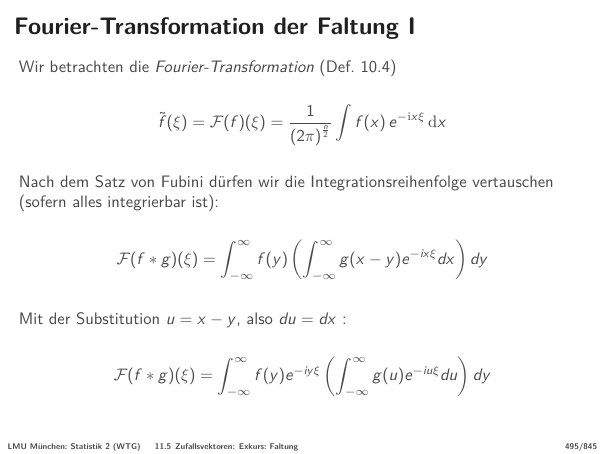

本页放在“模块零：随机向量让多个变量进入同一个空间”中，主要作用是推进 Seite 1-70 这一段的概念链。先把标题“Fourier-Transformation der Faltung I”和前后页联系起来，再区分它是在给定义、展示例子、证明性质，还是做章节过渡。

本页需要抓住的德语线索：

- `f˜(ξ) = F(f )(ξ) = f (x ) e−ixξ dx`
- `Nach dem Satz von Fubini dürfen wir die Integrationsreihenfolge vertauschen`
- `F(f ∗ g)(ξ) = f (y ) g(x − y )e−ixξdx dy`
- `Mit der Substitution u = x − y , also du = dx :`
- `F(f ∗ g)(ξ) = f (y )e−iyξ g(u)e−iuξdu dy`

### Seite 69 - Fourier-Transformation der Faltung II

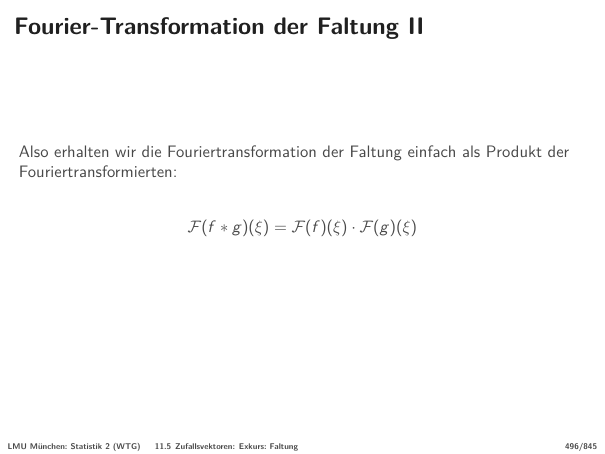

本页放在“模块零：随机向量让多个变量进入同一个空间”中，主要作用是推进 Seite 1-70 这一段的概念链。先把标题“Fourier-Transformation der Faltung II”和前后页联系起来，再区分它是在给定义、展示例子、证明性质，还是做章节过渡。

本页需要抓住的德语线索：

- `F(f ∗ g)(ξ) = F(f )(ξ) · F(g)(ξ)`

### Seite 70 - Fourier-Transformation der Faltung III

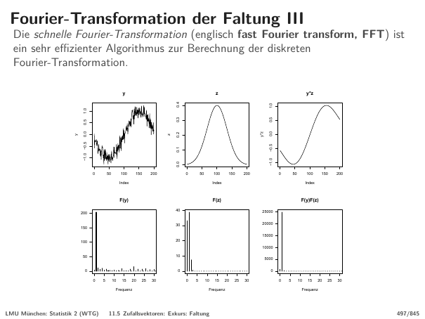

本页放在“模块零：随机向量让多个变量进入同一个空间”中，主要作用是推进 Seite 1-70 这一段的概念链。先把标题“Fourier-Transformation der Faltung III”和前后页联系起来，再区分它是在给定义、展示例子、证明性质，还是做章节过渡。

本页需要抓住的德语线索：

- `Fourier-Transformation der Faltung III`
- `Die schnelle Fourier-Transformation (englisch fast Fourier transform, FFT) ist`
- `ein sehr effizienter Algorithmus zur Berechnung der diskreten`

## 模块一：独立、协方差和条件分布描述依赖结构（Seite 71-136）

多变量真正关心的是关系：变量是否独立？是否线性同变？知道一个变量后另一个变量的分布是否改变？这部分就是把关系从直觉变成数学语言。

### Seite 71 - 依赖性（Abhängigkeit）

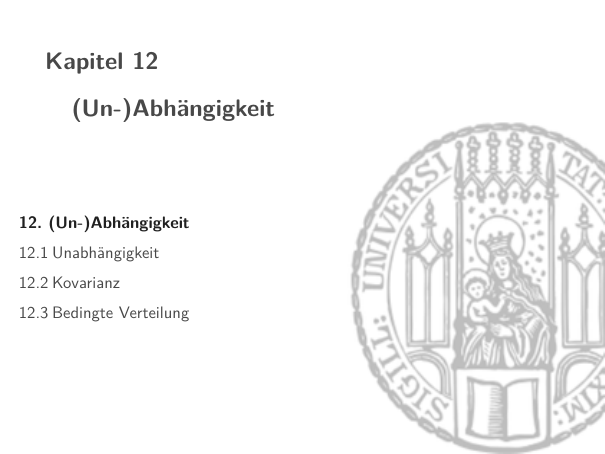

本页可识别的嵌入图片裁切：

本页放在“模块一：独立、协方差和条件分布描述依赖结构”中，核心是理解 分布（Verteilung）、协方差（Kovarianz）、独立性（Unabhängigkeit）。直觉上先抓住标题里的对象：依赖性（Abhängigkeit）。然后看它是定义、例子、定理还是证明；定义页要记条件，例子页要看随机机制，证明页要看用了哪些闭包性或极限定理。

关键词：

- 分布（Verteilung）
- 协方差（Kovarianz）
- 独立性（Unabhängigkeit）

本页需要抓住的德语线索：

- `Kapitel 12`
- `(Un-)Abhängigkeit`
- `12. (Un-)Abhängigkeit`

### Seite 72 - 依赖性（Abhängigkeit）

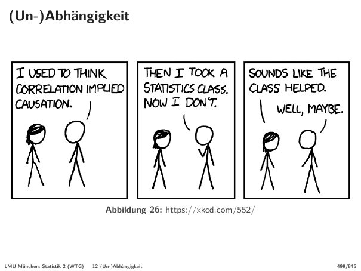

本页可识别的嵌入图片裁切：

本页放在“模块一：独立、协方差和条件分布描述依赖结构”中，主要作用是推进 Seite 71-136 这一段的概念链。先把标题“依赖性（Abhängigkeit）”和前后页联系起来，再区分它是在给定义、展示例子、证明性质，还是做章节过渡。

本页需要抓住的德语线索：

- `(Un-)Abhängigkeit`
- `Abbildung 26: https://xkcd.com/552/`

### Seite 73 - 依赖性（Abhängigkeit）

本页放在“模块一：独立、协方差和条件分布描述依赖结构”中，核心是理解 分布（Verteilung）、协方差（Kovarianz）、独立性（Unabhängigkeit）。直觉上先抓住标题里的对象：依赖性（Abhängigkeit）。然后看它是定义、例子、定理还是证明；定义页要记条件，例子页要看随机机制，证明页要看用了哪些闭包性或极限定理。

关键词：

- 分布（Verteilung）
- 协方差（Kovarianz）
- 独立性（Unabhängigkeit）

本页需要抓住的德语线索：

- `12. (Un-)Abhängigkeit`
- `12.1 Unabhängigkeit`
- `12.2 Kovarianz`

### Seite 74 - 分布函数（Verteilungsfunktion）

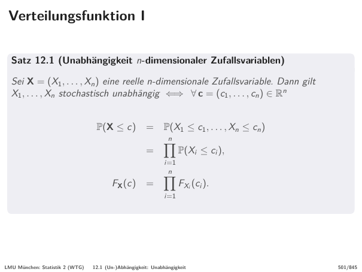

本页放在“模块一：独立、协方差和条件分布描述依赖结构”中，核心是理解 随机变量（Zufallsvariable）、分布（Verteilung）、分布函数（Verteilungsfunktion）、独立性（Unabhängigkeit）。直觉上先抓住标题里的对象：分布函数（Verteilungsfunktion）。然后看它是定义、例子、定理还是证明；定义页要记条件，例子页要看随机机制，证明页要看用了哪些闭包性或极限定理。

关键词：

- 随机变量（Zufallsvariable）
- 分布（Verteilung）
- 分布函数（Verteilungsfunktion）
- 独立性（Unabhängigkeit）

本页需要抓住的德语线索：

- `Satz 12.1 (Unabhängigkeit n-dimensionaler Zufallsvariablen)`
- `Sei X = (X , . . . , X ) eine reelle n-dimensionale Zufallsvariable. Dann gilt`
- `X , . . . , X stochastisch unabhängig ⇐⇒ ∀ c = (c , . . . , c ) ∈ Rn`
- `P(X ≤ c) = P(X ≤ c , . . . , X ≤ c )`
- `= P(X ≤ c ),`

### Seite 75 - 分布函数（Verteilungsfunktion）

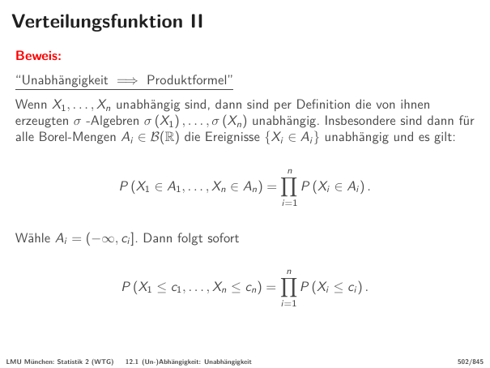

本页放在“模块一：独立、协方差和条件分布描述依赖结构”中，核心是理解 事件（Ereignis）、集合（Menge）、分布（Verteilung）、分布函数（Verteilungsfunktion）。直觉上先抓住标题里的对象：分布函数（Verteilungsfunktion）。然后看它是定义、例子、定理还是证明；定义页要记条件，例子页要看随机机制，证明页要看用了哪些闭包性或极限定理。

关键词：

- 事件（Ereignis）
- 集合（Menge）
- 分布（Verteilung）
- 分布函数（Verteilungsfunktion）
- 独立性（Unabhängigkeit）

本页需要抓住的德语线索：

- `“Unabhängigkeit =⇒ Produktformel”`
- `Wenn X , . . . , X unabhängig sind, dann sind per Definition die von ihnen`
- `alle Borel-Mengen A ∈ B(R) die Ereignisse {X ∈ A } unabhängig und es gilt:`
- `P (X ∈ A , . . . , X ∈ A ) = P (X ∈ A ) .`
- `i=1`

### Seite 76 - 分布函数（Verteilungsfunktion）

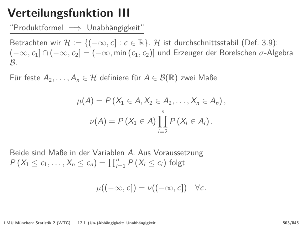

本页放在“模块一：独立、协方差和条件分布描述依赖结构”中，核心是理解 σ-代数（σ-Algebra）、测度（Maß）、分布（Verteilung）、分布函数（Verteilungsfunktion）。直觉上先抓住标题里的对象：分布函数（Verteilungsfunktion）。然后看它是定义、例子、定理还是证明；定义页要记条件，例子页要看随机机制，证明页要看用了哪些闭包性或极限定理。

关键词：

- σ-代数（σ-Algebra）
- 测度（Maß）
- 分布（Verteilung）
- 分布函数（Verteilungsfunktion）
- 独立性（Unabhängigkeit）

本页需要抓住的德语线索：

- `“Produktformel =⇒ Unabhängigkeit”`
- `Betrachten wir H := {(−∞, c] : c ∈ R}. H ist durchschnittsstabil (Def. 3.9):`
- `(−∞, c ] ∩ (−∞, c ] = (−∞, min (c , c )] und Erzeuger der Borelschen σ-Algebra`
- `Für feste A , . . . , A ∈ H definiere für A ∈ B(R) zwei Maße`
- `µ(A) = P (X ∈ A, X ∈ A , . . . , X ∈ A ) ,`

### Seite 77 - 分布函数（Verteilungsfunktion）

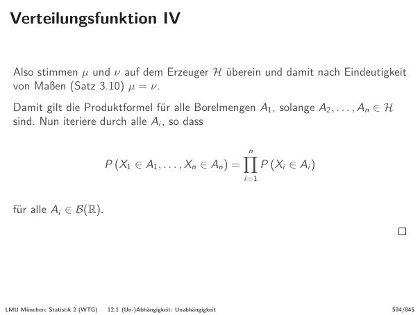

本页放在“模块一：独立、协方差和条件分布描述依赖结构”中，核心是理解 测度（Maß）、分布（Verteilung）、分布函数（Verteilungsfunktion）。直觉上先抓住标题里的对象：分布函数（Verteilungsfunktion）。然后看它是定义、例子、定理还是证明；定义页要记条件，例子页要看随机机制，证明页要看用了哪些闭包性或极限定理。

关键词：

- 测度（Maß）
- 分布（Verteilung）
- 分布函数（Verteilungsfunktion）

本页需要抓住的德语线索：

- `von Maßen (Satz 3.10) µ = ν.`
- `Damit gilt die Produktformel für alle Borelmengen A , solange A , . . . , A ∈ H`
- `P (X ∈ A , . . . , X ∈ A ) = P (X ∈ A )`
- `i=1`
- `für alle A ∈ B(R).`

### Seite 78 - 随机变量（Zufallsvariablen）

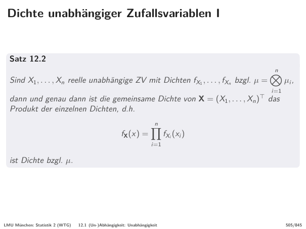

本页放在“模块一：独立、协方差和条件分布描述依赖结构”中，核心是理解 随机变量（Zufallsvariable）、密度（Dichte）。直觉上先抓住标题里的对象：随机变量（Zufallsvariablen）。然后看它是定义、例子、定理还是证明；定义页要记条件，例子页要看随机机制，证明页要看用了哪些闭包性或极限定理。

关键词：

- 随机变量（Zufallsvariable）
- 密度（Dichte）

本页需要抓住的德语线索：

- `Satz 12.2`
- `Sind X , . . . , X reelle unabhängige ZV mit Dichten f , . . . , f bzgl. µ = µ ,`
- `i=1`
- `dann und genau dann ist die gemeinsame Dichte von X = (X , . . . , X )⊤ das`
- `f (x ) = f (x )`

### Seite 79 - 随机变量（Zufallsvariablen）

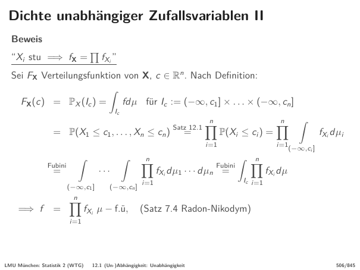

本页放在“模块一：独立、协方差和条件分布描述依赖结构”中，核心是理解 随机变量（Zufallsvariable）、分布（Verteilung）、分布函数（Verteilungsfunktion）、密度（Dichte）。直觉上先抓住标题里的对象：随机变量（Zufallsvariablen）。然后看它是定义、例子、定理还是证明；定义页要记条件，例子页要看随机机制，证明页要看用了哪些闭包性或极限定理。

关键词：

- 随机变量（Zufallsvariable）
- 分布（Verteilung）
- 分布函数（Verteilungsfunktion）
- 密度（Dichte）

本页需要抓住的德语线索：

- `“X stu =⇒ f = f ”`
- `Sei F Verteilungsfunktion von X, c ∈ Rn. Nach Definition:`
- `F (c) = P (I ) = fdµ für I := (−∞, c ] × . . . × (−∞, c ]`
- `= P(X ≤ c , . . . , X ≤ c ) Satz = 12.1 Y P(X ≤ c ) = Y f dµ`
- `i=1 i=1`

### Seite 80 - 随机变量（Zufallsvariablen）

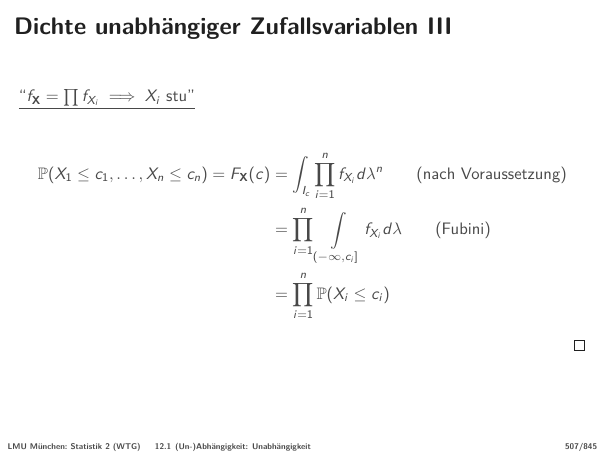

本页放在“模块一：独立、协方差和条件分布描述依赖结构”中，核心是理解 随机变量（Zufallsvariable）、密度（Dichte）。直觉上先抓住标题里的对象：随机变量（Zufallsvariablen）。然后看它是定义、例子、定理还是证明；定义页要记条件，例子页要看随机机制，证明页要看用了哪些闭包性或极限定理。

关键词：

- 随机变量（Zufallsvariable）
- 密度（Dichte）

本页需要抓住的德语线索：

- `“f = f =⇒ X stu”`
- `P(X ≤ c , . . . , X ≤ c ) = F (c) = f dλn (nach Voraussetzung)`
- `Ic i=1`
- `= f dλ (Fubini)`
- `i=1`

### Seite 81 - 随机变量（Zufallsvariablen）

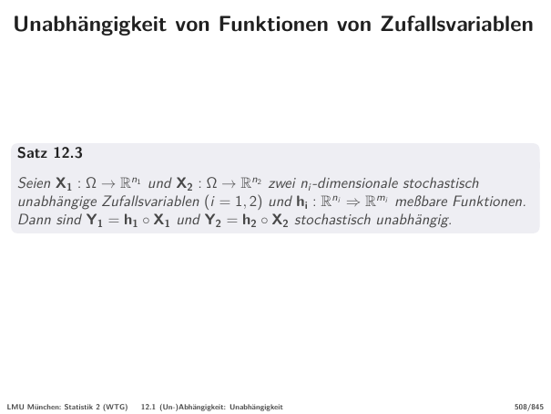

本页放在“模块一：独立、协方差和条件分布描述依赖结构”中，核心是理解 随机变量（Zufallsvariable）、独立性（Unabhängigkeit）。直觉上先抓住标题里的对象：随机变量（Zufallsvariablen）。然后看它是定义、例子、定理还是证明；定义页要记条件，例子页要看随机机制，证明页要看用了哪些闭包性或极限定理。

关键词：

- 随机变量（Zufallsvariable）
- 独立性（Unabhängigkeit）

本页需要抓住的德语线索：

- `Satz 12.3`
- `: Ω → Rn1 und X`
- `: Ω → Rn2 zwei n`
- `unabhängige Zufallsvariablen (i = 1, 2) und h`
- `Dann sind Y = h ◦ X und Y = h ◦ X stochastisch unabhängig.`

### Seite 82 - 期望（Erwartungswert）

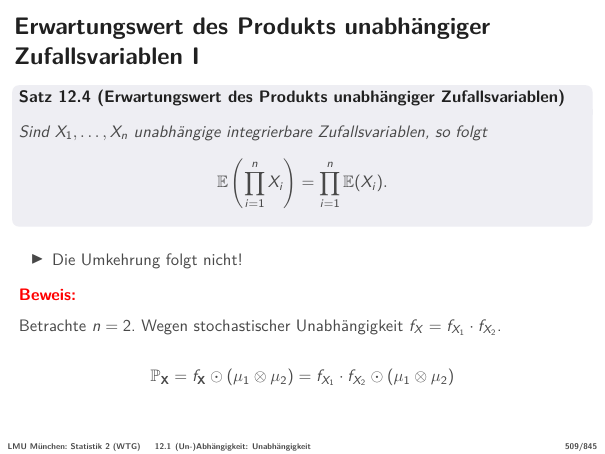

本页放在“模块一：独立、协方差和条件分布描述依赖结构”中，核心是理解 随机变量（Zufallsvariable）、期望（Erwartungswert）。直觉上先抓住标题里的对象：期望（Erwartungswert）。然后看它是定义、例子、定理还是证明；定义页要记条件，例子页要看随机机制，证明页要看用了哪些闭包性或极限定理。

关键词：

- 随机变量（Zufallsvariable）
- 期望（Erwartungswert）

本页需要抓住的德语线索：

- `Satz 12.4 (Erwartungswert des Produkts unabhängiger Zufallsvariablen)`
- `E X = E(X ).`
- `i=1 i=1`
- `Betrachte n = 2. Wegen stochastischer Unabhängigkeit f = f · f .`
- `P = f ⊙ (µ ⊗ µ ) = f · f ⊙ (µ ⊗ µ )`

### Seite 83 - 期望（Erwartungswert）

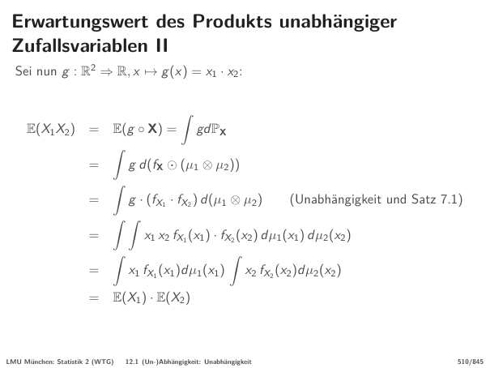

本页放在“模块一：独立、协方差和条件分布描述依赖结构”中，核心是理解 随机变量（Zufallsvariable）、期望（Erwartungswert）、独立性（Unabhängigkeit）。直觉上先抓住标题里的对象：期望（Erwartungswert）。然后看它是定义、例子、定理还是证明；定义页要记条件，例子页要看随机机制，证明页要看用了哪些闭包性或极限定理。

关键词：

- 随机变量（Zufallsvariable）
- 期望（Erwartungswert）
- 独立性（Unabhängigkeit）

本页需要抓住的德语线索：

- `Sei nun g : R2 ⇒ R, x 7→ g(x ) = x · x :`
- `E(X X ) = E(g ◦ X) = gdP`
- `= g d(f ⊙ (µ ⊗ µ ))`
- `= g · (f · f ) d(µ ⊗ µ ) (Unabhängigkeit und Satz 7.1)`
- `= x x f (x ) · f (x ) dµ (x ) dµ (x )`

### Seite 84 - 期望（Erwartungswert）

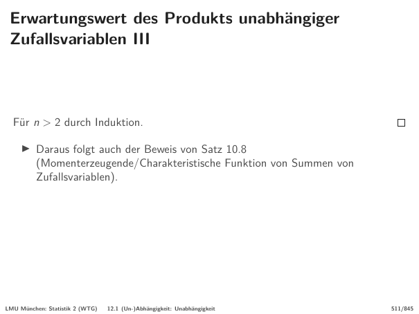

本页放在“模块一：独立、协方差和条件分布描述依赖结构”中，核心是理解 随机变量（Zufallsvariable）、期望（Erwartungswert）。直觉上先抓住标题里的对象：期望（Erwartungswert）。然后看它是定义、例子、定理还是证明；定义页要记条件，例子页要看随机机制，证明页要看用了哪些闭包性或极限定理。

关键词：

- 随机变量（Zufallsvariable）
- 期望（Erwartungswert）

本页需要抓住的德语线索：

- `Daraus folgt auch der Beweis von Satz 10.8`

### Seite 85 - 依赖性（Abhängigkeit）

本页放在“模块一：独立、协方差和条件分布描述依赖结构”中，核心是理解 分布（Verteilung）、协方差（Kovarianz）、独立性（Unabhängigkeit）。直觉上先抓住标题里的对象：依赖性（Abhängigkeit）。然后看它是定义、例子、定理还是证明；定义页要记条件，例子页要看随机机制，证明页要看用了哪些闭包性或极限定理。

关键词：

- 分布（Verteilung）
- 协方差（Kovarianz）
- 独立性（Unabhängigkeit）

本页需要抓住的德语线索：

- `12. (Un-)Abhängigkeit`
- `12.1 Unabhängigkeit`
- `12.2 Kovarianz`

### Seite 86 - 协方差（Kovarianz）

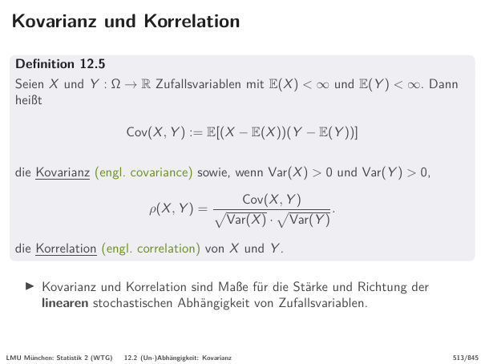

本页放在“模块一：独立、协方差和条件分布描述依赖结构”中，核心是理解 测度（Maß）、随机变量（Zufallsvariable）、协方差（Kovarianz）。直觉上先抓住标题里的对象：协方差（Kovarianz）。然后看它是定义、例子、定理还是证明；定义页要记条件，例子页要看随机机制，证明页要看用了哪些闭包性或极限定理。

关键词：

- 测度（Maß）
- 随机变量（Zufallsvariable）
- 协方差（Kovarianz）

本页需要抓住的德语线索：

- `Definition 12.5`
- `Seien X und Y : Ω → R Zufallsvariablen mit E(X ) < ∞ und E(Y ) < ∞. Dann`
- `Cov(X , Y ) := E[(X − E(X ))(Y − E(Y ))]`
- `die Kovarianz (engl. covariance) sowie, wenn Var(X ) > 0 und Var(Y ) > 0,`
- `ρ(X , Y ) = .`

### Seite 87 - 协方差（Kovarianz）

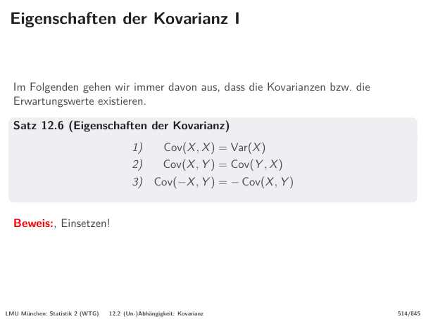

本页放在“模块一：独立、协方差和条件分布描述依赖结构”中，核心是理解 期望（Erwartungswert）、协方差（Kovarianz）。直觉上先抓住标题里的对象：协方差（Kovarianz）。然后看它是定义、例子、定理还是证明；定义页要记条件，例子页要看随机机制，证明页要看用了哪些闭包性或极限定理。

关键词：

- 期望（Erwartungswert）
- 协方差（Kovarianz）

本页需要抓住的德语线索：

- `Satz 12.6 (Eigenschaften der Kovarianz)`
- `1) Cov(X , X ) = Var(X )`
- `2) Cov(X , Y ) = Cov(Y , X )`
- `3) Cov(−X , Y ) = − Cov(X , Y )`

### Seite 88 - 协方差（Kovarianz）

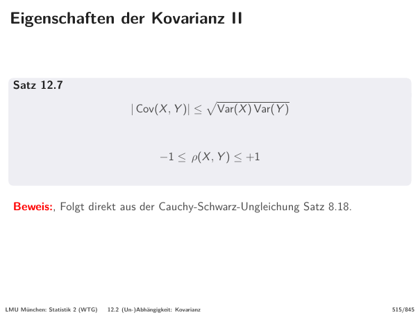

本页放在“模块一：独立、协方差和条件分布描述依赖结构”中，核心是理解 协方差（Kovarianz）、Cauchy 分布（Cauchy）。直觉上先抓住标题里的对象：协方差（Kovarianz）。然后看它是定义、例子、定理还是证明；定义页要记条件，例子页要看随机机制，证明页要看用了哪些闭包性或极限定理。

关键词：

- 协方差（Kovarianz）
- Cauchy 分布（Cauchy）

本页需要抓住的德语线索：

- `Satz 12.7`
- `| Cov(X , Y )| ≤ Var(X ) Var(Y )`
- `−1 ≤ ρ(X , Y ) ≤ +1`
- `Beweis:, Folgt direkt aus der Cauchy-Schwarz-Ungleichung Satz 8.18.`

### Seite 89 - 协方差（Kovarianz）

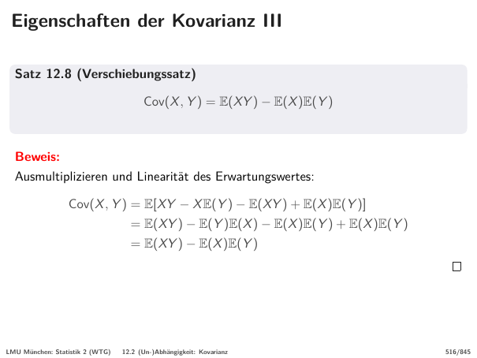

本页放在“模块一：独立、协方差和条件分布描述依赖结构”中，核心是理解 期望（Erwartungswert）、协方差（Kovarianz）。直觉上先抓住标题里的对象：协方差（Kovarianz）。然后看它是定义、例子、定理还是证明；定义页要记条件，例子页要看随机机制，证明页要看用了哪些闭包性或极限定理。

关键词：

- 期望（Erwartungswert）
- 协方差（Kovarianz）

本页需要抓住的德语线索：

- `Satz 12.8 (Verschiebungssatz)`
- `Cov(X , Y ) = E(XY ) − E(X )E(Y )`
- `Cov(X , Y ) = E[XY − X E(Y ) − E(XY ) + E(X )E(Y )]`
- `= E(XY ) − E(Y )E(X ) − E(X )E(Y ) + E(X )E(Y )`
- `= E(XY ) − E(X )E(Y )`

### Seite 90 - 协方差（Kovarianz）

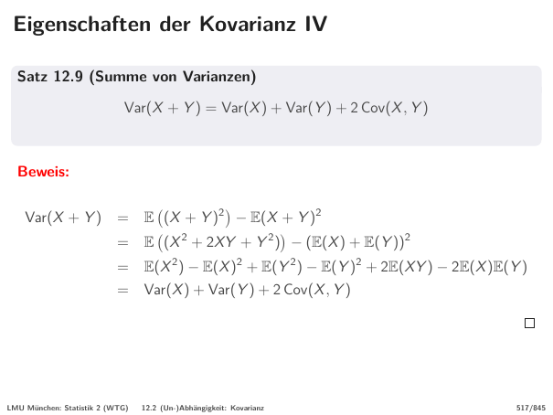

本页放在“模块一：独立、协方差和条件分布描述依赖结构”中，核心是理解 方差（Varianz）、协方差（Kovarianz）。直觉上先抓住标题里的对象：协方差（Kovarianz）。然后看它是定义、例子、定理还是证明；定义页要记条件，例子页要看随机机制，证明页要看用了哪些闭包性或极限定理。

关键词：

- 方差（Varianz）
- 协方差（Kovarianz）

本页需要抓住的德语线索：

- `Satz 12.9 (Summe von Varianzen)`
- `Var(X + Y ) = Var(X ) + Var(Y ) + 2 Cov(X , Y )`
- `Var(X + Y ) = E (cid:0) (X + Y )2(cid:1) − E(X + Y )2`
- `= E (cid:0) (X 2 + 2XY + Y 2) (cid:1) − (E(X ) + E(Y ))2`
- `= E(X 2) − E(X )2 + E(Y 2) − E(Y )2 + 2E(XY ) − 2E(X )E(Y )`

### Seite 91 - 协方差（Kovarianz）

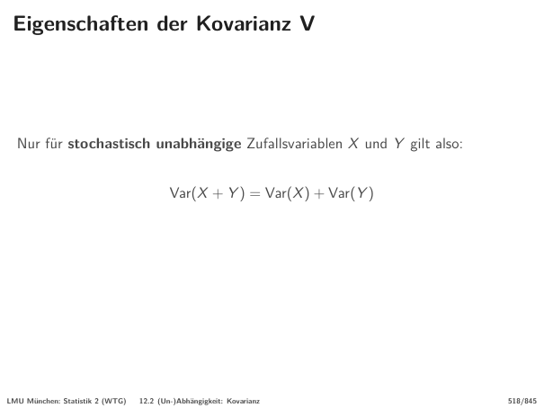

本页放在“模块一：独立、协方差和条件分布描述依赖结构”中，核心是理解 随机变量（Zufallsvariable）、协方差（Kovarianz）。直觉上先抓住标题里的对象：协方差（Kovarianz）。然后看它是定义、例子、定理还是证明；定义页要记条件，例子页要看随机机制，证明页要看用了哪些闭包性或极限定理。

关键词：

- 随机变量（Zufallsvariable）
- 协方差（Kovarianz）

本页需要抓住的德语线索：

- `Var(X + Y ) = Var(X ) + Var(Y )`

### Seite 92 - 协方差（Kovarianz）

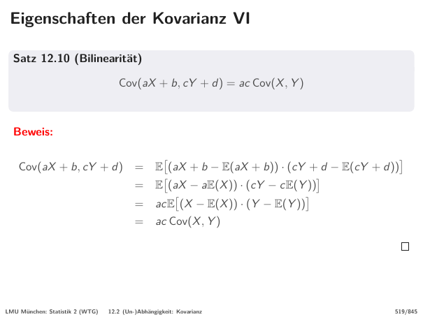

本页放在“模块一：独立、协方差和条件分布描述依赖结构”中，核心是理解 协方差（Kovarianz）。直觉上先抓住标题里的对象：协方差（Kovarianz）。然后看它是定义、例子、定理还是证明；定义页要记条件，例子页要看随机机制，证明页要看用了哪些闭包性或极限定理。

关键词：

- 协方差（Kovarianz）

本页需要抓住的德语线索：

- `Satz 12.10 (Bilinearität)`
- `Cov(aX + b, cY + d) = ac Cov(X , Y )`
- `Cov(aX + b, cY + d) = E(cid:2) (aX + b − E(aX + b)) · (cY + d − E(cY + d)) (cid:3)`
- `= E(cid:2) (aX − aE(X )) · (cY − cE(Y )) (cid:3)`
- `= acE(cid:2) (X − E(X )) · (Y − E(Y )) (cid:3)`

### Seite 93 - 协方差（Kovarianz）

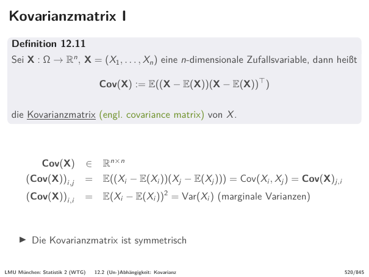

本页放在“模块一：独立、协方差和条件分布描述依赖结构”中，核心是理解 随机变量（Zufallsvariable）、方差（Varianz）、协方差（Kovarianz）。直觉上先抓住标题里的对象：协方差（Kovarianz）。然后看它是定义、例子、定理还是证明；定义页要记条件，例子页要看随机机制，证明页要看用了哪些闭包性或极限定理。

关键词：

- 随机变量（Zufallsvariable）
- 方差（Varianz）
- 协方差（Kovarianz）

本页需要抓住的德语线索：

- `Definition 12.11`
- `Sei X : Ω → Rn, X = (X , . . . , X ) eine n-dimensionale Zufallsvariable, dann heißt`
- `Cov(X) := E((X − E(X))(X − E(X))⊤)`
- `Cov(X) ∈ Rn×n`
- `(Cov(X)) = E((X − E(X ))(X − E(X ))) = Cov(X , X ) = Cov(X)`

### Seite 94 - 协方差（Kovarianz）

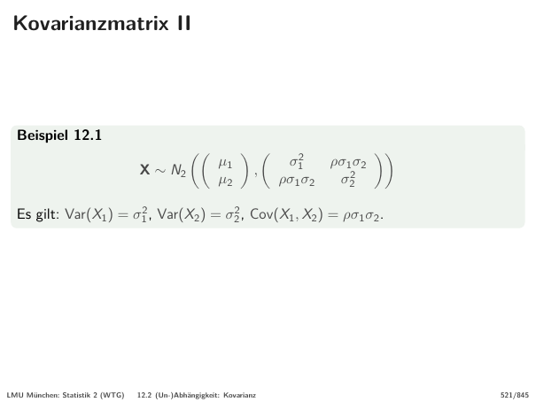

本页放在“模块一：独立、协方差和条件分布描述依赖结构”中，核心是理解 协方差（Kovarianz）。直觉上先抓住标题里的对象：协方差（Kovarianz）。然后看它是定义、例子、定理还是证明；定义页要记条件，例子页要看随机机制，证明页要看用了哪些闭包性或极限定理。

关键词：

- 协方差（Kovarianz）

本页需要抓住的德语线索：

- `Beispiel 12.1`
- `Es gilt: Var(X ) = σ2, Var(X ) = σ2, Cov(X , X ) = ρσ σ .`

### Seite 95 - 协方差（Kovarianz）

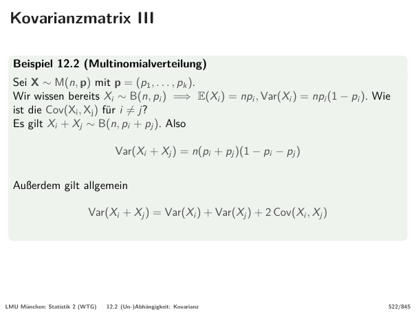

本页放在“模块一：独立、协方差和条件分布描述依赖结构”中，核心是理解 协方差（Kovarianz）。直觉上先抓住标题里的对象：协方差（Kovarianz）。然后看它是定义、例子、定理还是证明；定义页要记条件，例子页要看随机机制，证明页要看用了哪些闭包性或极限定理。

关键词：

- 协方差（Kovarianz）

本页需要抓住的德语线索：

- `Beispiel 12.2 (Multinomialverteilung)`
- `Sei X ∼ M(n, p) mit p = (p , . . . , p ).`
- `Wir wissen bereits X ∼ B(n, p ) =⇒ E(X ) = np , Var(X ) = np (1 − p ). Wie`
- `ist die Cov(X , X ) für i ̸= j?`
- `Es gilt X + X ∼ B(n, p + p ). Also`

### Seite 96 - 协方差（Kovarianz）

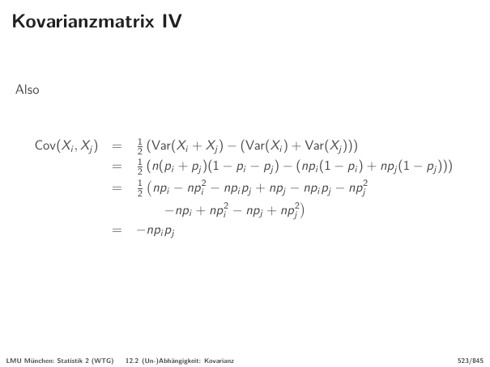

本页放在“模块一：独立、协方差和条件分布描述依赖结构”中，核心是理解 协方差（Kovarianz）。直觉上先抓住标题里的对象：协方差（Kovarianz）。然后看它是定义、例子、定理还是证明；定义页要记条件，例子页要看随机机制，证明页要看用了哪些闭包性或极限定理。

关键词：

- 协方差（Kovarianz）

本页需要抓住的德语线索：

- `Cov(X , X ) = 1 (Var(X + X ) − (Var(X ) + Var(X )))`
- `= 1 (n(p + p )(1 − p − p ) − (np (1 − p ) + np (1 − p )))`
- `= 1 (cid:0) np − np2 − np p + np − np p − np2`
- `= −np p`

### Seite 97 - 协方差（Kovarianz）

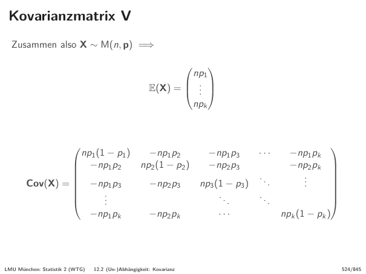

本页放在“模块一：独立、协方差和条件分布描述依赖结构”中，核心是理解 协方差（Kovarianz）。直觉上先抓住标题里的对象：协方差（Kovarianz）。然后看它是定义、例子、定理还是证明；定义页要记条件，例子页要看随机机制，证明页要看用了哪些闭包性或极限定理。

关键词：

- 协方差（Kovarianz）

本页需要抓住的德语线索：

- `Zusammen also X ∼ M(n, p) =⇒`
- `E(X) =  . . `
- `Cov(X) =    −np 1 p 3 −np 2 p 3 np 3 (1 − p 3 ) . . . . . .   `

### Seite 98 - Korrelationsmatrix I

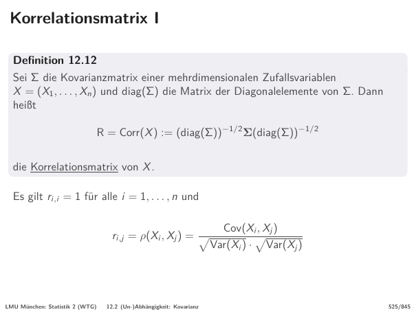

本页放在“模块一：独立、协方差和条件分布描述依赖结构”中，核心是理解 随机变量（Zufallsvariable）、协方差（Kovarianz）。直觉上先抓住标题里的对象：Korrelationsmatrix I。然后看它是定义、例子、定理还是证明；定义页要记条件，例子页要看随机机制，证明页要看用了哪些闭包性或极限定理。

关键词：

- 随机变量（Zufallsvariable）
- 协方差（Kovarianz）

本页需要抓住的德语线索：

- `Definition 12.12`
- `X = (X , . . . , X ) und diag(Σ) die Matrix der Diagonalelemente von Σ. Dann`
- `R = Corr(X ) := (diag(Σ))−1/2Σ(diag(Σ))−1/2`
- `Es gilt r = 1 für alle i = 1, . . . , n und`
- `r = ρ(X , X ) = i j`

### Seite 99 - Korrelationsmatrix II

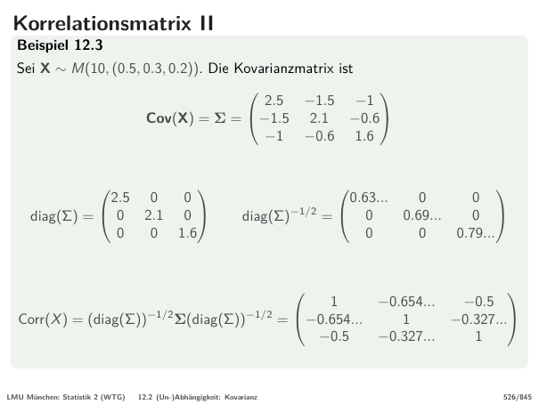

本页放在“模块一：独立、协方差和条件分布描述依赖结构”中，核心是理解 协方差（Kovarianz）。直觉上先抓住标题里的对象：Korrelationsmatrix II。然后看它是定义、例子、定理还是证明；定义页要记条件，例子页要看随机机制，证明页要看用了哪些闭包性或极限定理。

关键词：

- 协方差（Kovarianz）

本页需要抓住的德语线索：

- `Beispiel 12.3`
- `Cov(X) = Σ = −1.5 2.1 −0.6`
- `diag(Σ) =  0 2.1 0  diag(Σ)−1/2 =  0 0.69... 0 `
- `Corr(X ) = (diag(Σ))−1/2Σ(diag(Σ))−1/2 = −0.654... 1 −0.327...`

### Seite 100 - Eigenschaften I

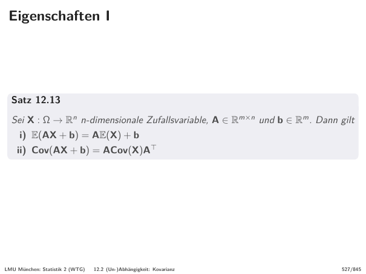

本页放在“模块一：独立、协方差和条件分布描述依赖结构”中，核心是理解 随机变量（Zufallsvariable）。直觉上先抓住标题里的对象：Eigenschaften I。然后看它是定义、例子、定理还是证明；定义页要记条件，例子页要看随机机制，证明页要看用了哪些闭包性或极限定理。

关键词：

- 随机变量（Zufallsvariable）

本页需要抓住的德语线索：

- `Satz 12.13`
- `Sei X : Ω → Rn n-dimensionale Zufallsvariable, A ∈ Rm×n und b ∈ Rm. Dann gilt`
- `i) E(AX + b) = AE(X) + b`
- `ii) Cov(AX + b) = ACov(X)A⊤`

### Seite 101 - Eigenschaften II

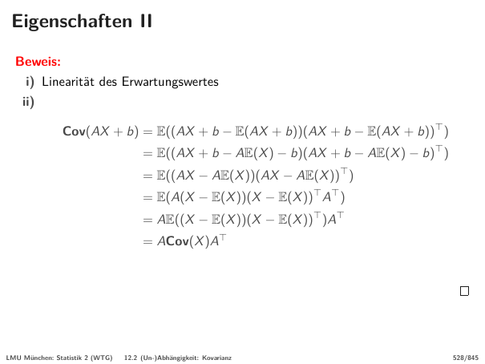

本页放在“模块一：独立、协方差和条件分布描述依赖结构”中，核心是理解 期望（Erwartungswert）。直觉上先抓住标题里的对象：Eigenschaften II。然后看它是定义、例子、定理还是证明；定义页要记条件，例子页要看随机机制，证明页要看用了哪些闭包性或极限定理。

关键词：

- 期望（Erwartungswert）

本页需要抓住的德语线索：

- `Cov(AX + b) = E((AX + b − E(AX + b))(AX + b − E(AX + b))⊤)`
- `= E((AX + b − AE(X ) − b)(AX + b − AE(X ) − b)⊤)`
- `= E((AX − AE(X ))(AX − AE(X ))⊤)`
- `= E(A(X − E(X ))(X − E(X ))⊤A⊤)`
- `= AE((X − E(X ))(X − E(X ))⊤)A⊤`

### Seite 102 - Eigenschaften III

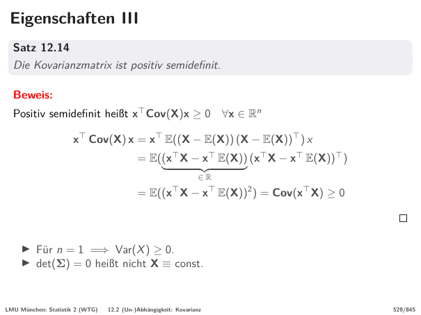

本页放在“模块一：独立、协方差和条件分布描述依赖结构”中，核心是理解 协方差（Kovarianz）。直觉上先抓住标题里的对象：Eigenschaften III。然后看它是定义、例子、定理还是证明；定义页要记条件，例子页要看随机机制，证明页要看用了哪些闭包性或极限定理。

关键词：

- 协方差（Kovarianz）

本页需要抓住的德语线索：

- `Satz 12.14`
- `Positiv semidefinit heißt x⊤Cov(X)x ≥ 0 ∀x ∈ Rn`
- `x⊤ Cov(X) x = x⊤ E((X − E(X)) (X − E(X))⊤) x`
- `= E((x⊤X − x⊤ E(X)) (x⊤X − x⊤ E(X))⊤)`
- `∈ R`

### Seite 103 - Eigenschaften IV

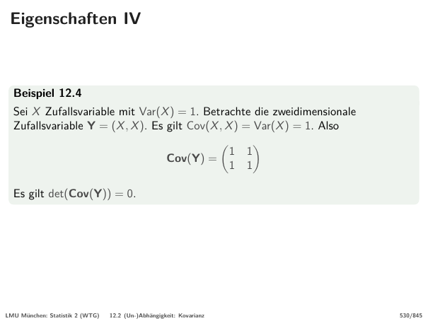

本页放在“模块一：独立、协方差和条件分布描述依赖结构”中，核心是理解 随机变量（Zufallsvariable）。直觉上先抓住标题里的对象：Eigenschaften IV。然后看它是定义、例子、定理还是证明；定义页要记条件，例子页要看随机机制，证明页要看用了哪些闭包性或极限定理。

关键词：

- 随机变量（Zufallsvariable）

本页需要抓住的德语线索：

- `Beispiel 12.4`
- `Sei X Zufallsvariable mit Var(X ) = 1. Betrachte die zweidimensionale`
- `Zufallsvariable Y = (X , X ). Es gilt Cov(X , X ) = Var(X ) = 1. Also`
- `Cov(Y) =`
- `Es gilt det(Cov(Y)) = 0.`

### Seite 104 - Standardisierung I

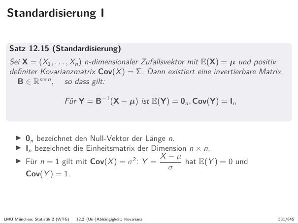

本页放在“模块一：独立、协方差和条件分布描述依赖结构”中，核心是理解 协方差（Kovarianz）。直觉上先抓住标题里的对象：Standardisierung I。然后看它是定义、例子、定理还是证明；定义页要记条件，例子页要看随机机制，证明页要看用了哪些闭包性或极限定理。

关键词：

- 协方差（Kovarianz）

本页需要抓住的德语线索：

- `Satz 12.15 (Standardisierung)`
- `Sei X = (X , . . . , X ) n-dimensionaler Zufallsvektor mit E(X) = µ und positiv`
- `definiter Kovarianzmatrix Cov(X ) = Σ. Dann existiert eine invertierbare Matrix`
- `B ∈ Rn×n, so dass gilt:`
- `Für Y = B−1(X − µ) ist E(Y) = 0 , Cov(Y) = I`

### Seite 105 - Standardisierung II

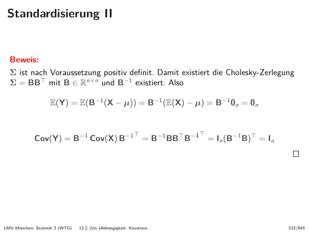

本页放在“模块一：独立、协方差和条件分布描述依赖结构”中，主要作用是推进 Seite 71-136 这一段的概念链。先把标题“Standardisierung II”和前后页联系起来，再区分它是在给定义、展示例子、证明性质，还是做章节过渡。

本页需要抓住的德语线索：

- `Σ = BB⊤ mit B ∈ Rn×n und B−1 existiert. Also`
- `E(Y) = E(B−1(X − µ)) = B−1(E(X) − µ) = B−10 = 0`
- `Cov(Y) = B−1 Cov(X) B−1⊤ = B−1BB⊤B−1⊤ = I (B−1B)⊤ = I`

### Seite 106 - 依赖性（Abhängigkeit）

本页放在“模块一：独立、协方差和条件分布描述依赖结构”中，核心是理解 分布（Verteilung）、协方差（Kovarianz）、独立性（Unabhängigkeit）。直觉上先抓住标题里的对象：依赖性（Abhängigkeit）。然后看它是定义、例子、定理还是证明；定义页要记条件，例子页要看随机机制，证明页要看用了哪些闭包性或极限定理。

关键词：

- 分布（Verteilung）
- 协方差（Kovarianz）
- 独立性（Unabhängigkeit）

本页需要抓住的德语线索：

- `12. (Un-)Abhängigkeit`
- `12.1 Unabhängigkeit`
- `12.2 Kovarianz`

### Seite 107 - 概率（Wahrscheinlichkeit）

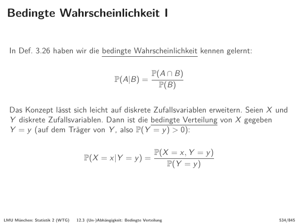

本页放在“模块一：独立、协方差和条件分布描述依赖结构”中，核心是理解 概率（Wahrscheinlichkeit）、随机变量（Zufallsvariable）、分布（Verteilung）、条件分布（bedingte Verteilung）。直觉上先抓住标题里的对象：概率（Wahrscheinlichkeit）。然后看它是定义、例子、定理还是证明；定义页要记条件，例子页要看随机机制，证明页要看用了哪些闭包性或极限定理。

关键词：

- 概率（Wahrscheinlichkeit）
- 随机变量（Zufallsvariable）
- 分布（Verteilung）
- 条件分布（bedingte Verteilung）

本页需要抓住的德语线索：

- `P(A ∩ B)`
- `P(A|B) =`
- `P(B)`
- `Y = y (auf dem Träger von Y , also P(Y = y ) > 0):`
- `P(X = x , Y = y )`

### Seite 108 - 概率（Wahrscheinlichkeit）

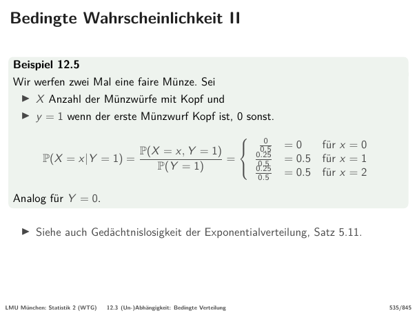

本页放在“模块一：独立、协方差和条件分布描述依赖结构”中，核心是理解 概率（Wahrscheinlichkeit）。直觉上先抓住标题里的对象：概率（Wahrscheinlichkeit）。然后看它是定义、例子、定理还是证明；定义页要记条件，例子页要看随机机制，证明页要看用了哪些闭包性或极限定理。

关键词：

- 概率（Wahrscheinlichkeit）

本页需要抓住的德语线索：

- `Beispiel 12.5`
- `y = 1 wenn der erste Münzwurf Kopf ist, 0 sonst.`
- ` 0 = 0 für x = 0`
- `P(X = x , Y = 1)  0.5`
- `P(X = x |Y = 1) = = 0.25 = 0.5 für x = 1`

### Seite 109 - 条件分布（Bedingte Verteilung）

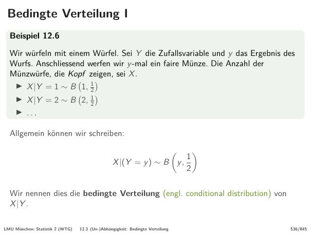

本页放在“模块一：独立、协方差和条件分布描述依赖结构”中，核心是理解 结果（Ergebnis）、随机变量（Zufallsvariable）、分布（Verteilung）。直觉上先抓住标题里的对象：条件分布（Bedingte Verteilung）。然后看它是定义、例子、定理还是证明；定义页要记条件，例子页要看随机机制，证明页要看用了哪些闭包性或极限定理。

关键词：

- 结果（Ergebnis）
- 随机变量（Zufallsvariable）
- 分布（Verteilung）

本页需要抓住的德语线索：

- `Beispiel 12.6`
- `X |Y = 1 ∼ B (cid:0) 1, 1 (cid:1)`
- `X |Y = 2 ∼ B (cid:0) 2, 1 (cid:1)`
- `X |(Y = y ) ∼ B y ,`

### Seite 110 - 条件分布（Bedingte Verteilung）

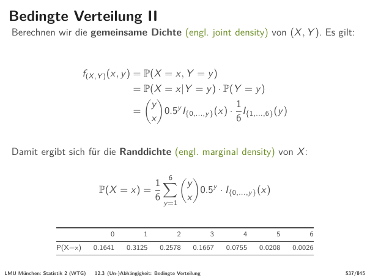

本页放在“模块一：独立、协方差和条件分布描述依赖结构”中，核心是理解 分布（Verteilung）、密度（Dichte）。直觉上先抓住标题里的对象：条件分布（Bedingte Verteilung）。然后看它是定义、例子、定理还是证明；定义页要记条件，例子页要看随机机制，证明页要看用了哪些闭包性或极限定理。

关键词：

- 分布（Verteilung）
- 密度（Dichte）

本页需要抓住的德语线索：

- `Berechnen wir die gemeinsame Dichte (engl. joint density) von (X , Y ). Es gilt:`
- `f (x , y ) = P(X = x , Y = y )`
- `= P(X = x |Y = y ) · P(Y = y )`
- `= 0.5y I (x ) · I (y )`
- `P(X = x ) = 0.5y · I (x )`

### Seite 111 - 密度（Dichte）

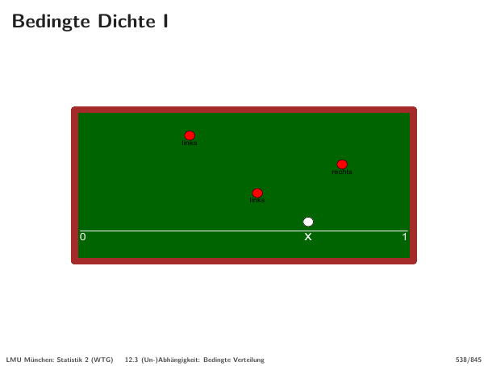

本页放在“模块一：独立、协方差和条件分布描述依赖结构”中，核心是理解 密度（Dichte）。直觉上先抓住标题里的对象：密度（Dichte）。然后看它是定义、例子、定理还是证明；定义页要记条件，例子页要看随机机制，证明页要看用了哪些闭包性或极限定理。

关键词：

- 密度（Dichte）

本页需要抓住的德语线索：

- `Bedingte Dichte I`
- `links`
- `rechts`

### Seite 112 - 密度（Dichte）

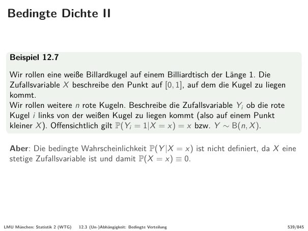

本页放在“模块一：独立、协方差和条件分布描述依赖结构”中，核心是理解 概率（Wahrscheinlichkeit）、随机变量（Zufallsvariable）、密度（Dichte）。直觉上先抓住标题里的对象：密度（Dichte）。然后看它是定义、例子、定理还是证明；定义页要记条件，例子页要看随机机制，证明页要看用了哪些闭包性或极限定理。

关键词：

- 概率（Wahrscheinlichkeit）
- 随机变量（Zufallsvariable）
- 密度（Dichte）

本页需要抓住的德语线索：

- `Beispiel 12.7`
- `kleiner X ). Offensichtlich gilt P(Y = 1|X = x ) = x bzw. Y ∼ B(n, X ).`
- `Aber: Die bedingte Wahrscheinlichkeit P(Y |X = x ) ist nicht definiert, da X eine`
- `stetige Zufallsvariable ist und damit P(X = x ) ≡ 0.`

### Seite 113 - 密度（Dichte）

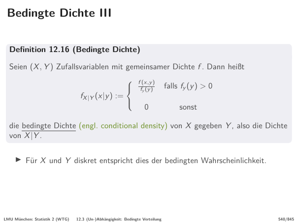

本页放在“模块一：独立、协方差和条件分布描述依赖结构”中，核心是理解 概率（Wahrscheinlichkeit）、随机变量（Zufallsvariable）、密度（Dichte）。直觉上先抓住标题里的对象：密度（Dichte）。然后看它是定义、例子、定理还是证明；定义页要记条件，例子页要看随机机制，证明页要看用了哪些闭包性或极限定理。

关键词：

- 概率（Wahrscheinlichkeit）
- 随机变量（Zufallsvariable）
- 密度（Dichte）

本页需要抓住的德语线索：

- `Definition 12.16 (Bedingte Dichte)`
- `f (x |y ) :=`

### Seite 114 - 密度（Dichte）

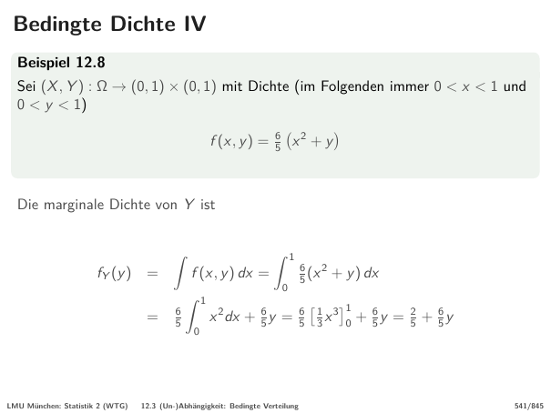

本页放在“模块一：独立、协方差和条件分布描述依赖结构”中，核心是理解 密度（Dichte）。直觉上先抓住标题里的对象：密度（Dichte）。然后看它是定义、例子、定理还是证明；定义页要记条件，例子页要看随机机制，证明页要看用了哪些闭包性或极限定理。

关键词：

- 密度（Dichte）

本页需要抓住的德语线索：

- `Beispiel 12.8`
- `Sei (X , Y ) : Ω → (0, 1) × (0, 1) mit Dichte (im Folgenden immer 0 < x < 1 und`
- `f (x , y ) = 6 (cid:0) x 2 + y (cid:1)`
- `f (y ) = f (x , y ) dx = 6 (x 2 + y ) dx`
- `= 6 x 2dx + 6 y = 6 (cid:2) 1 x 3(cid:3)1 + 6 y = 2 + 6 y`

### Seite 115 - 密度（Dichte）

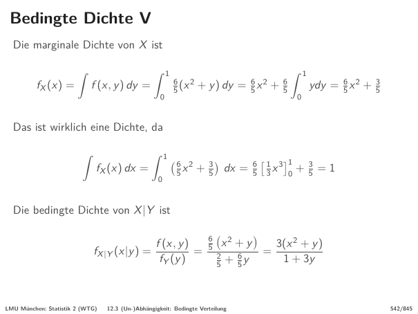

本页放在“模块一：独立、协方差和条件分布描述依赖结构”中，核心是理解 密度（Dichte）。直觉上先抓住标题里的对象：密度（Dichte）。然后看它是定义、例子、定理还是证明；定义页要记条件，例子页要看随机机制，证明页要看用了哪些闭包性或极限定理。

关键词：

- 密度（Dichte）

本页需要抓住的德语线索：

- `f (x ) = f (x , y ) dy = 6 (x 2 + y ) dy = 6 x 2 + 6 ydy = 6 x 2 + 3`
- `f (x ) dx = (cid:0) 6 x 2 + 3 (cid:1) dx = 6 (cid:2) 1 x 3(cid:3)1 + 3 = 1`
- `f (x |y ) = = 5 =`

### Seite 116 - 密度（Dichte）

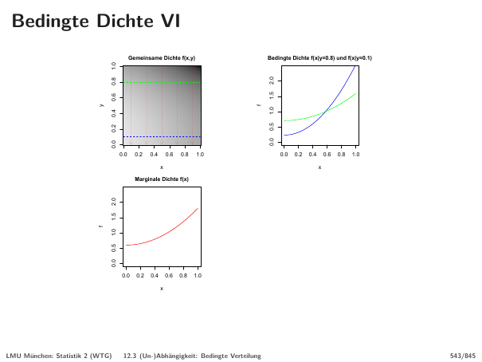

本页放在“模块一：独立、协方差和条件分布描述依赖结构”中，核心是理解 密度（Dichte）。直觉上先抓住标题里的对象：密度（Dichte）。然后看它是定义、例子、定理还是证明；定义页要记条件，例子页要看随机机制，证明页要看用了哪些闭包性或极限定理。

关键词：

- 密度（Dichte）

本页需要抓住的德语线索：

- `Bedingte Dichte f(x|y=0.8) und f(x|y=0.1)`

### Seite 117 - Satz von Bayes I

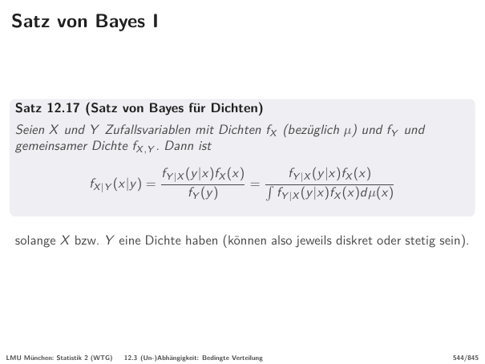

本页放在“模块一：独立、协方差和条件分布描述依赖结构”中，核心是理解 随机变量（Zufallsvariable）、密度（Dichte）。直觉上先抓住标题里的对象：Satz von Bayes I。然后看它是定义、例子、定理还是证明；定义页要记条件，例子页要看随机机制，证明页要看用了哪些闭包性或极限定理。

关键词：

- 随机变量（Zufallsvariable）
- 密度（Dichte）

本页需要抓住的德语线索：

- `Satz von Bayes I`
- `Satz 12.17 (Satz von Bayes für Dichten)`
- `f X|Y (x |y ) = f (y ) = R f (y |x )f (x )dµ(x )`

### Seite 118 - Satz von Bayes II

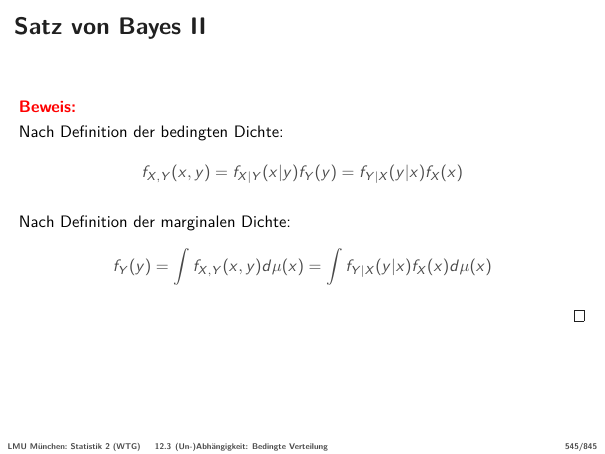

本页放在“模块一：独立、协方差和条件分布描述依赖结构”中，核心是理解 密度（Dichte）。直觉上先抓住标题里的对象：Satz von Bayes II。然后看它是定义、例子、定理还是证明；定义页要记条件，例子页要看随机机制，证明页要看用了哪些闭包性或极限定理。

关键词：

- 密度（Dichte）

本页需要抓住的德语线索：

- `Satz von Bayes II`
- `Nach Definition der bedingten Dichte:`
- `f (x , y ) = f (x |y )f (y ) = f (y |x )f (x )`
- `Nach Definition der marginalen Dichte:`
- `f (y ) = f (x , y )dµ(x ) = f (y |x )f (x )dµ(x )`

### Seite 119 - Satz von Bayes III

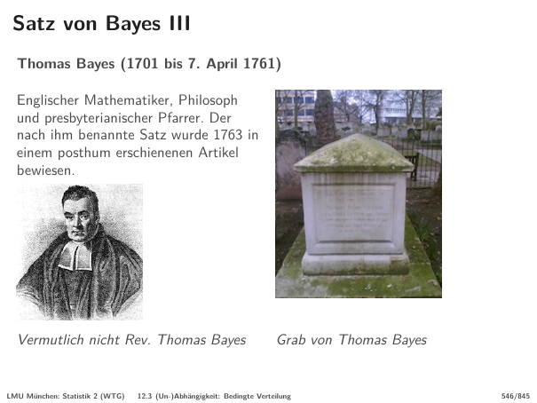

本页可识别的嵌入图片裁切：

本页放在“模块一：独立、协方差和条件分布描述依赖结构”中，主要作用是推进 Seite 71-136 这一段的概念链。先把标题“Satz von Bayes III”和前后页联系起来，再区分它是在给定义、展示例子、证明性质，还是做章节过渡。

本页需要抓住的德语线索：

- `Satz von Bayes III`
- `nach ihm benannte Satz wurde 1763 in`

### Seite 120 - Satz von Bayes IV

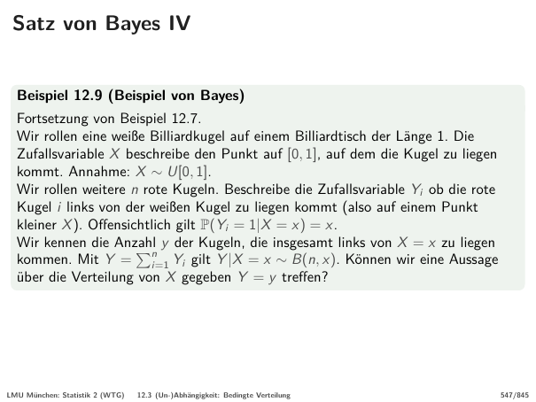

本页放在“模块一：独立、协方差和条件分布描述依赖结构”中，核心是理解 随机变量（Zufallsvariable）。直觉上先抓住标题里的对象：Satz von Bayes IV。然后看它是定义、例子、定理还是证明；定义页要记条件，例子页要看随机机制，证明页要看用了哪些闭包性或极限定理。

关键词：

- 随机变量（Zufallsvariable）

本页需要抓住的德语线索：

- `Satz von Bayes IV`
- `Beispiel 12.9 (Beispiel von Bayes)`
- `Fortsetzung von Beispiel 12.7.`
- `kleiner X ). Offensichtlich gilt P(Y = 1|X = x ) = x .`
- `Wir kennen die Anzahl y der Kugeln, die insgesamt links von X = x zu liegen`

### Seite 121 - Satz von Bayes V

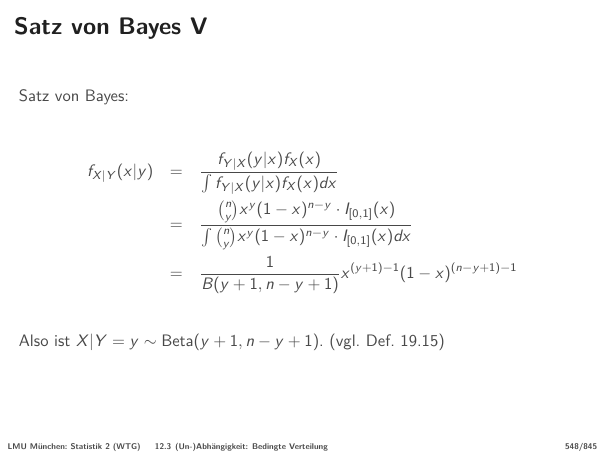

本页放在“模块一：独立、协方差和条件分布描述依赖结构”中，主要作用是推进 Seite 71-136 这一段的概念链。先把标题“Satz von Bayes V”和前后页联系起来，再区分它是在给定义、展示例子、证明性质，还是做章节过渡。

本页需要抓住的德语线索：

- `Satz von Bayes V`
- `Satz von Bayes:`
- `f X|Y (x |y ) = R f (y |x )f (x )dx`
- `= y [0,1]`
- `= x (y+1)−1(1 − x )(n−y+1)−1`

### Seite 122 - Satz von Bayes VI

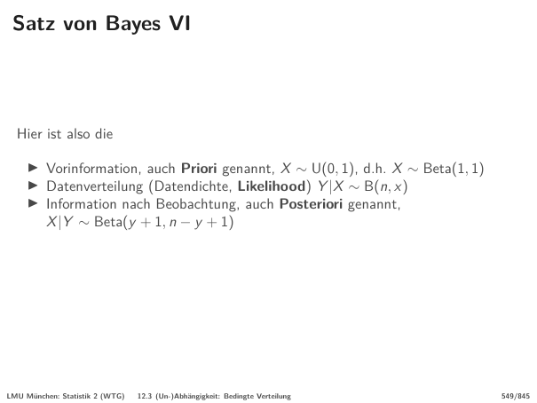

本页放在“模块一：独立、协方差和条件分布描述依赖结构”中，核心是理解 Beta 分布（Beta）。直觉上先抓住标题里的对象：Satz von Bayes VI。然后看它是定义、例子、定理还是证明；定义页要记条件，例子页要看随机机制，证明页要看用了哪些闭包性或极限定理。

关键词：

- Beta 分布（Beta）

本页需要抓住的德语线索：

- `Satz von Bayes VI`

### Seite 123 - 期望（Erwartungswert）

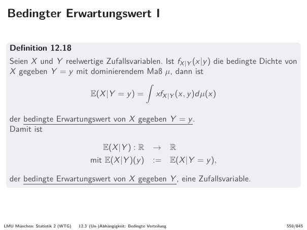

本页放在“模块一：独立、协方差和条件分布描述依赖结构”中，核心是理解 测度（Maß）、随机变量（Zufallsvariable）、密度（Dichte）、期望（Erwartungswert）。直觉上先抓住标题里的对象：期望（Erwartungswert）。然后看它是定义、例子、定理还是证明；定义页要记条件，例子页要看随机机制，证明页要看用了哪些闭包性或极限定理。

关键词：

- 测度（Maß）
- 随机变量（Zufallsvariable）
- 密度（Dichte）
- 期望（Erwartungswert）

本页需要抓住的德语线索：

- `Definition 12.18`
- `X gegeben Y = y mit dominierendem Maß µ, dann ist`
- `E(X |Y = y ) = xf (x , y )dµ(x )`
- `der bedingte Erwartungswert von X gegeben Y = y .`
- `E(X |Y ) : R → R`

### Seite 124 - 期望（Erwartungswert）

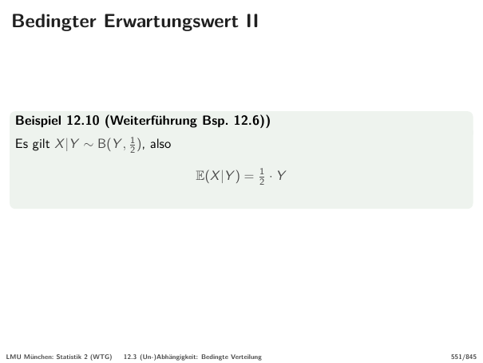

本页放在“模块一：独立、协方差和条件分布描述依赖结构”中，核心是理解 期望（Erwartungswert）。直觉上先抓住标题里的对象：期望（Erwartungswert）。然后看它是定义、例子、定理还是证明；定义页要记条件，例子页要看随机机制，证明页要看用了哪些闭包性或极限定理。

关键词：

- 期望（Erwartungswert）

本页需要抓住的德语线索：

- `Beispiel 12.10 (Weiterführung Bsp. 12.6))`
- `Es gilt X |Y ∼ B(Y , 1 ), also`
- `E(X |Y ) = 1 · Y`

### Seite 125 - 期望（Erwartungswert）

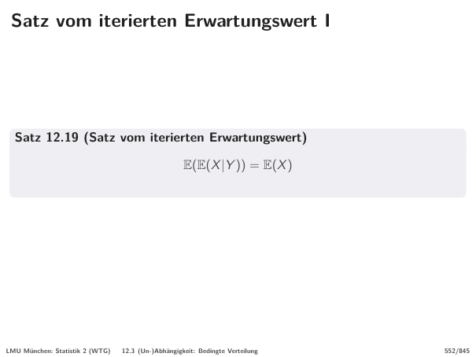

本页放在“模块一：独立、协方差和条件分布描述依赖结构”中，核心是理解 期望（Erwartungswert）。直觉上先抓住标题里的对象：期望（Erwartungswert）。然后看它是定义、例子、定理还是证明；定义页要记条件，例子页要看随机机制，证明页要看用了哪些闭包性或极限定理。

关键词：

- 期望（Erwartungswert）

本页需要抓住的德语线索：

- `Satz vom iterierten Erwartungswert I`
- `Satz 12.19 (Satz vom iterierten Erwartungswert)`
- `E(E(X |Y )) = E(X )`

### Seite 126 - 期望（Erwartungswert）

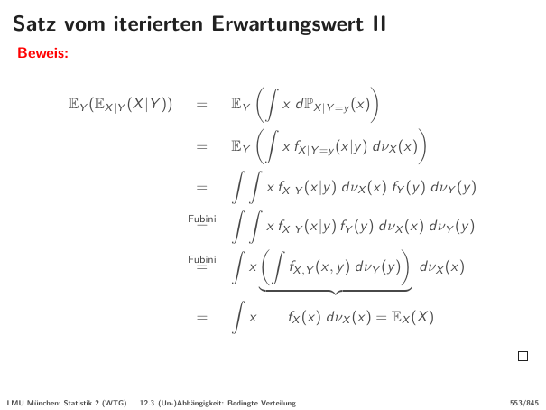

本页放在“模块一：独立、协方差和条件分布描述依赖结构”中，核心是理解 期望（Erwartungswert）。直觉上先抓住标题里的对象：期望（Erwartungswert）。然后看它是定义、例子、定理还是证明；定义页要记条件，例子页要看随机机制，证明页要看用了哪些闭包性或极限定理。

关键词：

- 期望（Erwartungswert）

本页需要抓住的德语线索：

- `Satz vom iterierten Erwartungswert II`
- `E (E (X |Y )) = E x dP (x )`
- `Y X|Y Y X|Y =y`
- `= E x f (x |y ) dν (x )`
- `Y X|Y =y X`

### Seite 127 - 期望（Erwartungswert）

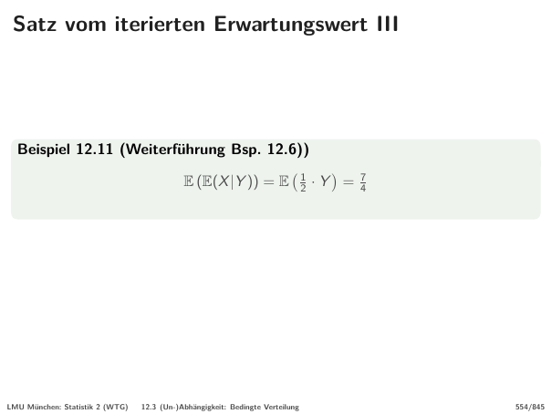

本页放在“模块一：独立、协方差和条件分布描述依赖结构”中，核心是理解 期望（Erwartungswert）。直觉上先抓住标题里的对象：期望（Erwartungswert）。然后看它是定义、例子、定理还是证明；定义页要记条件，例子页要看随机机制，证明页要看用了哪些闭包性或极限定理。

关键词：

- 期望（Erwartungswert）

本页需要抓住的德语线索：

- `Satz vom iterierten Erwartungswert III`
- `Beispiel 12.11 (Weiterführung Bsp. 12.6))`
- `E (E(X |Y )) = E (cid:0) 1 · Y (cid:1) = 7`

### Seite 128 - 方差（Varianz）

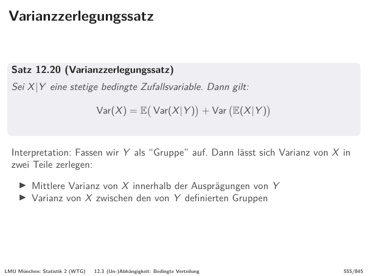

本页放在“模块一：独立、协方差和条件分布描述依赖结构”中，核心是理解 随机变量（Zufallsvariable）、方差（Varianz）。直觉上先抓住标题里的对象：方差（Varianz）。然后看它是定义、例子、定理还是证明；定义页要记条件，例子页要看随机机制，证明页要看用了哪些闭包性或极限定理。

关键词：

- 随机变量（Zufallsvariable）
- 方差（Varianz）

本页需要抓住的德语线索：

- `Satz 12.20 (Varianzzerlegungssatz)`
- `Var(X ) =`
- `E(cid:0)`
- `Var(X |Y )`
- `(cid:0)E(X`

### Seite 129 - Beispiel I

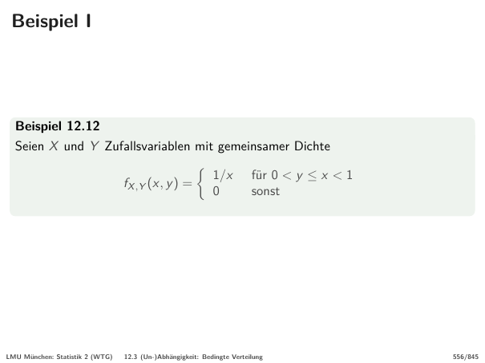

本页放在“模块一：独立、协方差和条件分布描述依赖结构”中，核心是理解 随机变量（Zufallsvariable）、密度（Dichte）。直觉上先抓住标题里的对象：Beispiel I。然后看它是定义、例子、定理还是证明；定义页要记条件，例子页要看随机机制，证明页要看用了哪些闭包性或极限定理。

关键词：

- 随机变量（Zufallsvariable）
- 密度（Dichte）

本页需要抓住的德语线索：

- `Beispiel I`
- `Beispiel 12.12`
- `1/x für 0 < y ≤ x < 1`
- `f (x , y ) =`

### Seite 130 - Beispiel II

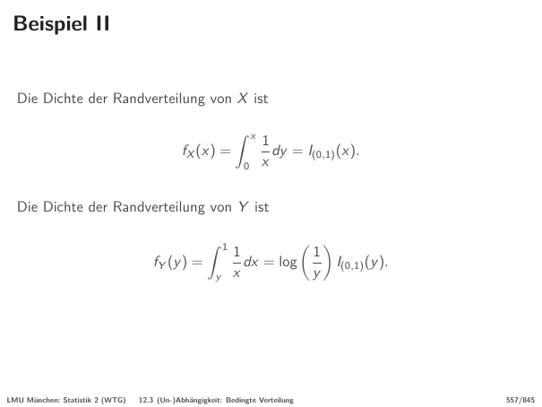

本页放在“模块一：独立、协方差和条件分布描述依赖结构”中，核心是理解 密度（Dichte）。直觉上先抓住标题里的对象：Beispiel II。然后看它是定义、例子、定理还是证明；定义页要记条件，例子页要看随机机制，证明页要看用了哪些闭包性或极限定理。

关键词：

- 密度（Dichte）

本页需要抓住的德语线索：

- `Beispiel II`
- `f (x ) = dy = I (x ).`
- `f (y ) = dx = log I (y ).`

### Seite 131 - Beispiel III

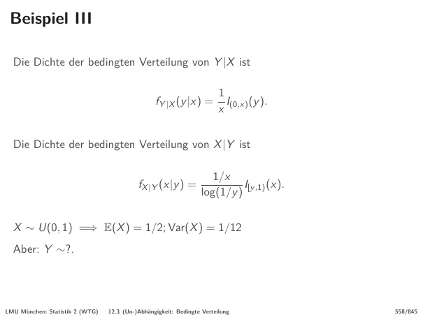

本页放在“模块一：独立、协方差和条件分布描述依赖结构”中，核心是理解 分布（Verteilung）、密度（Dichte）。直觉上先抓住标题里的对象：Beispiel III。然后看它是定义、例子、定理还是证明；定义页要记条件，例子页要看随机机制，证明页要看用了哪些闭包性或极限定理。

关键词：

- 分布（Verteilung）
- 密度（Dichte）

本页需要抓住的德语线索：

- `Beispiel III`
- `f (y |x ) = I (y ).`
- `f (x |y ) = I (x ).`
- `X ∼ U(0, 1) =⇒ E(X ) = 1/2; Var(X ) = 1/12`

### Seite 132 - Beispiel IV

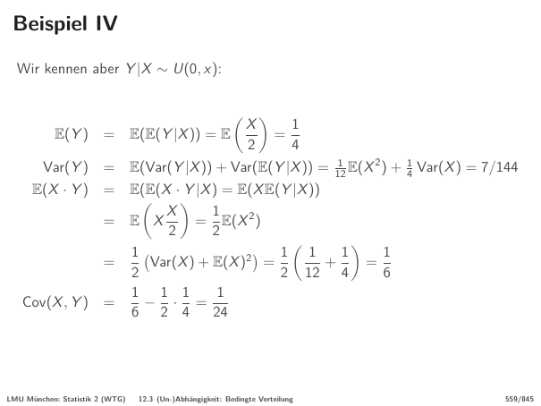

本页放在“模块一：独立、协方差和条件分布描述依赖结构”中，主要作用是推进 Seite 71-136 这一段的概念链。先把标题“Beispiel IV”和前后页联系起来，再区分它是在给定义、展示例子、证明性质，还是做章节过渡。

本页需要抓住的德语线索：

- `Beispiel IV`
- `E(Y ) = E(E(Y |X )) = E =`
- `Var(Y ) = E(Var(Y |X )) + Var(E(Y |X )) = 1 E(X 2) + 1 Var(X ) = 7/144`
- `E(X · Y ) = E(E(X · Y |X ) = E(X E(Y |X ))`
- `= E X = E(X 2)`

### Seite 133 - 独立性（Unabhängigkeit）

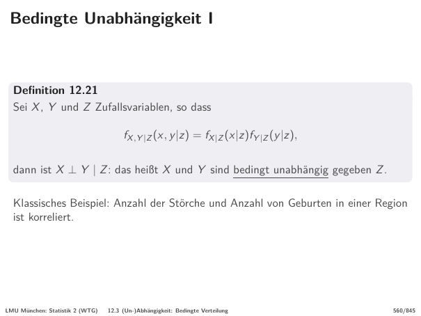

本页放在“模块一：独立、协方差和条件分布描述依赖结构”中，核心是理解 随机变量（Zufallsvariable）、独立性（Unabhängigkeit）。直觉上先抓住标题里的对象：独立性（Unabhängigkeit）。然后看它是定义、例子、定理还是证明；定义页要记条件，例子页要看随机机制，证明页要看用了哪些闭包性或极限定理。

关键词：

- 随机变量（Zufallsvariable）
- 独立性（Unabhängigkeit）

本页需要抓住的德语线索：

- `Definition 12.21`
- `f (x , y |z) = f (x |z)f (y |z),`
- `Klassisches Beispiel: Anzahl der Störche und Anzahl von Geburten in einer Region`

### Seite 134 - 独立性（Unabhängigkeit）

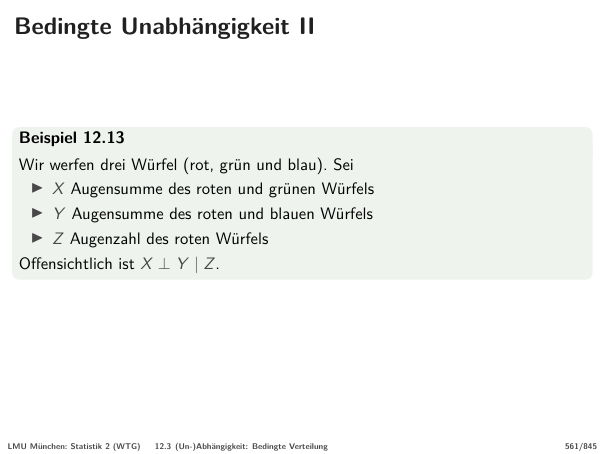

本页放在“模块一：独立、协方差和条件分布描述依赖结构”中，核心是理解 独立性（Unabhängigkeit）。直觉上先抓住标题里的对象：独立性（Unabhängigkeit）。然后看它是定义、例子、定理还是证明；定义页要记条件，例子页要看随机机制，证明页要看用了哪些闭包性或极限定理。

关键词：

- 独立性（Unabhängigkeit）

本页需要抓住的德语线索：

- `Beispiel 12.13`

### Seite 135 - 独立性（Unabhängigkeit）

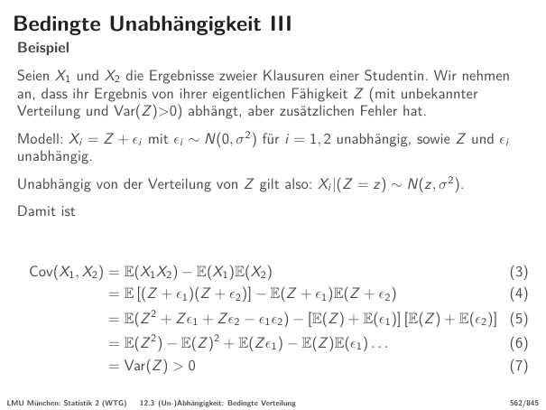

本页放在“模块一：独立、协方差和条件分布描述依赖结构”中，核心是理解 结果（Ergebnis）、分布（Verteilung）、独立性（Unabhängigkeit）。直觉上先抓住标题里的对象：独立性（Unabhängigkeit）。然后看它是定义、例子、定理还是证明；定义页要记条件，例子页要看随机机制，证明页要看用了哪些闭包性或极限定理。

关键词：

- 结果（Ergebnis）
- 分布（Verteilung）
- 独立性（Unabhängigkeit）

本页需要抓住的德语线索：

- `Beispiel`
- `Verteilung und Var(Z )>0) abhängt, aber zusätzlichen Fehler hat.`
- `Modell: X = Z + ϵ mit ϵ ∼ N(0, σ2) für i = 1, 2 unabhängig, sowie Z und ϵ`
- `Unabhängig von der Verteilung von Z gilt also: X |(Z = z) ∼ N(z, σ2).`
- `Cov(X , X ) = E(X X ) − E(X )E(X ) (3)`

### Seite 136 - 独立性（Unabhängigkeit）

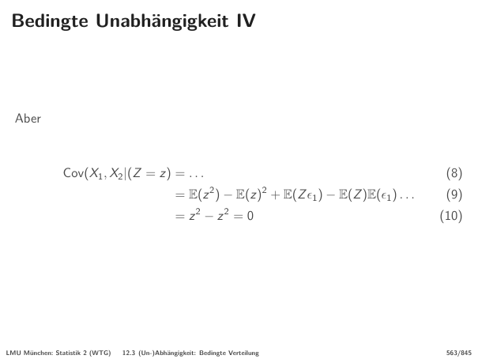

本页放在“模块一：独立、协方差和条件分布描述依赖结构”中，核心是理解 独立性（Unabhängigkeit）。直觉上先抓住标题里的对象：独立性（Unabhängigkeit）。然后看它是定义、例子、定理还是证明；定义页要记条件，例子页要看随机机制，证明页要看用了哪些闭包性或极限定理。

关键词：

- 独立性（Unabhängigkeit）

本页需要抓住的德语线索：

- `Cov(X , X |(Z = z) = . . . (8)`
- `= E(z2) − E(z)2 + E(Z ϵ ) − E(Z )E(ϵ ) . . . (9)`
- `= z2 − z2 = 0 (10)`

## 模块二：正态分布是多维概率的标准模型（Seite 137-173）

正态分布不只是钟形曲线。多元正态用均值向量和协方差矩阵描述整体结构，并且在线性变换、条件分布和极限定理中表现特别稳定。

### Seite 137 - 正态分布（Normalverteilung）

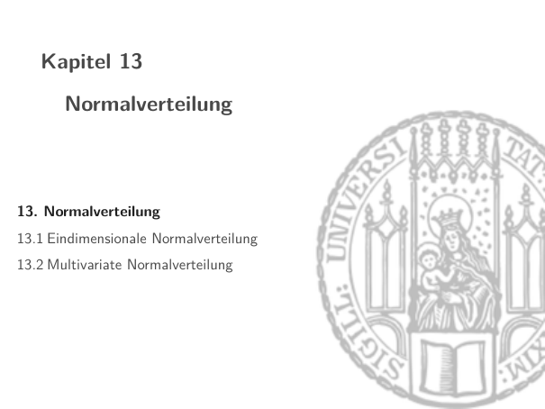

本页可识别的嵌入图片裁切：

本页放在“模块二：正态分布是多维概率的标准模型”中，核心是理解 正态分布（Normalverteilung）。直觉上先抓住标题里的对象：正态分布（Normalverteilung）。然后看它是定义、例子、定理还是证明；定义页要记条件，例子页要看随机机制，证明页要看用了哪些闭包性或极限定理。

关键词：

- 正态分布（Normalverteilung）

本页需要抓住的德语线索：

- `Kapitel 13`
- `Normalverteilung`
- `13. Normalverteilung`

### Seite 138 - 正态分布（Normalverteilung）

本页可识别的嵌入图片裁切：

本页放在“模块二：正态分布是多维概率的标准模型”中，核心是理解 正态分布（Normalverteilung）。直觉上先抓住标题里的对象：正态分布（Normalverteilung）。然后看它是定义、例子、定理还是证明；定义页要记条件，例子页要看随机机制，证明页要看用了哪些闭包性或极限定理。

关键词：

- 正态分布（Normalverteilung）

本页需要抓住的德语线索：

- `Normalverteilung`

### Seite 139 - 正态分布（Normalverteilung）

本页放在“模块二：正态分布是多维概率的标准模型”中，核心是理解 正态分布（Normalverteilung）。直觉上先抓住标题里的对象：正态分布（Normalverteilung）。然后看它是定义、例子、定理还是证明；定义页要记条件，例子页要看随机机制，证明页要看用了哪些闭包性或极限定理。

关键词：

- 正态分布（Normalverteilung）

本页需要抓住的德语线索：

- `13. Normalverteilung`
- `13.1 Eindimensionale Normalverteilung`
- `13.2 Multivariate Normalverteilung`

### Seite 140 - 正态分布（Normalverteilung）

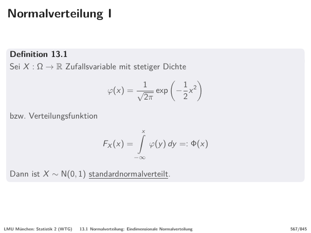

本页放在“模块二：正态分布是多维概率的标准模型”中，核心是理解 随机变量（Zufallsvariable）、分布（Verteilung）、分布函数（Verteilungsfunktion）、密度（Dichte）。直觉上先抓住标题里的对象：正态分布（Normalverteilung）。然后看它是定义、例子、定理还是证明；定义页要记条件，例子页要看随机机制，证明页要看用了哪些闭包性或极限定理。

关键词：

- 随机变量（Zufallsvariable）
- 分布（Verteilung）
- 分布函数（Verteilungsfunktion）
- 密度（Dichte）
- 正态分布（Normalverteilung）

本页需要抓住的德语线索：

- `Definition 13.1`
- `Sei X : Ω → R Zufallsvariable mit stetiger Dichte`
- `φ(x ) = √ exp − x 2`
- `F (x ) = φ(y ) dy =: Φ(x )`

### Seite 141 - 正态分布（Normalverteilung）

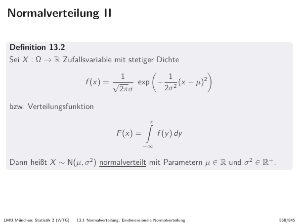

本页放在“模块二：正态分布是多维概率的标准模型”中，核心是理解 随机变量（Zufallsvariable）、分布（Verteilung）、分布函数（Verteilungsfunktion）、密度（Dichte）。直觉上先抓住标题里的对象：正态分布（Normalverteilung）。然后看它是定义、例子、定理还是证明；定义页要记条件，例子页要看随机机制，证明页要看用了哪些闭包性或极限定理。

关键词：

- 随机变量（Zufallsvariable）
- 分布（Verteilung）
- 分布函数（Verteilungsfunktion）
- 密度（Dichte）
- 正态分布（Normalverteilung）

本页需要抓住的德语线索：

- `Definition 13.2`
- `Sei X : Ω → R Zufallsvariable mit stetiger Dichte`
- `f (x ) = √ exp − (x − µ)2`
- `F (x ) = f (y ) dy`
- `Dann heißt X ∼ N(µ, σ2) normalverteilt mit Parametern µ ∈ R und σ2 ∈ R+.`

### Seite 142 - 正态分布（Normalverteilung）

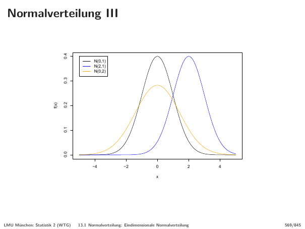

本页放在“模块二：正态分布是多维概率的标准模型”中，核心是理解 正态分布（Normalverteilung）。直觉上先抓住标题里的对象：正态分布（Normalverteilung）。然后看它是定义、例子、定理还是证明；定义页要记条件，例子页要看随机机制，证明页要看用了哪些闭包性或极限定理。

关键词：

- 正态分布（Normalverteilung）

本页需要抓住的德语线索：

- `Normalverteilung III`
- `−4 −2 0 2 4`
- `4.0`

### Seite 143 - 正态分布（Normalverteilung）

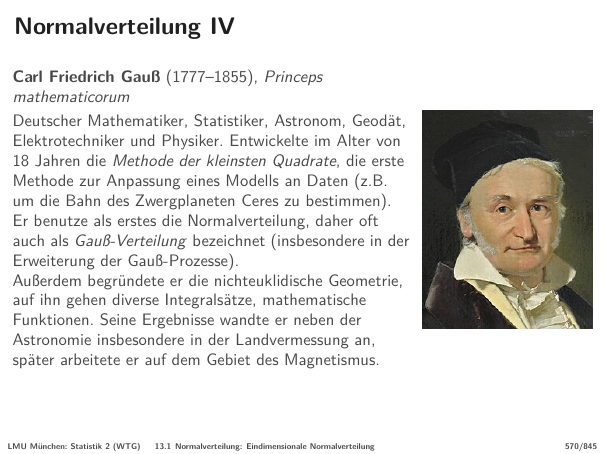

本页可识别的嵌入图片裁切：

本页放在“模块二：正态分布是多维概率的标准模型”中，核心是理解 分布（Verteilung）、正态分布（Normalverteilung）。直觉上先抓住标题里的对象：正态分布（Normalverteilung）。然后看它是定义、例子、定理还是证明；定义页要记条件，例子页要看随机机制，证明页要看用了哪些闭包性或极限定理。

关键词：

- 分布（Verteilung）
- 正态分布（Normalverteilung）

本页需要抓住的德语线索：

- `Normalverteilung IV`
- `Carl Friedrich Gauß (1777–1855), Princeps`
- `mathematicorum`

### Seite 144 - 正态分布（Normalverteilung）

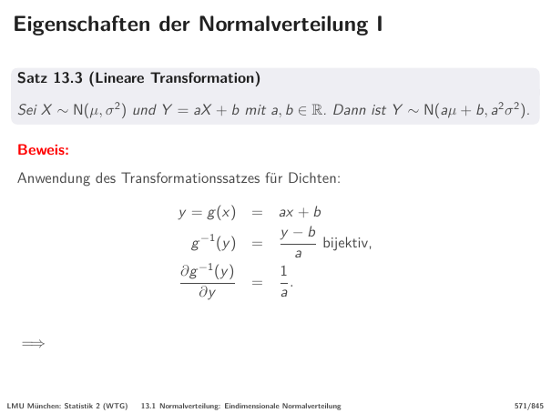

本页放在“模块二：正态分布是多维概率的标准模型”中，核心是理解 密度（Dichte）、正态分布（Normalverteilung）。直觉上先抓住标题里的对象：正态分布（Normalverteilung）。然后看它是定义、例子、定理还是证明；定义页要记条件，例子页要看随机机制，证明页要看用了哪些闭包性或极限定理。

关键词：

- 密度（Dichte）
- 正态分布（Normalverteilung）

本页需要抓住的德语线索：

- `Satz 13.3 (Lineare Transformation)`
- `Sei X ∼ N(µ, σ2) und Y = aX + b mit a, b ∈ R. Dann ist Y ∼ N(aµ + b, a2σ2).`
- `y = g(x ) = ax + b`
- `g−1(y ) = bijektiv,`
- `= .`

### Seite 145 - 正态分布（Normalverteilung）

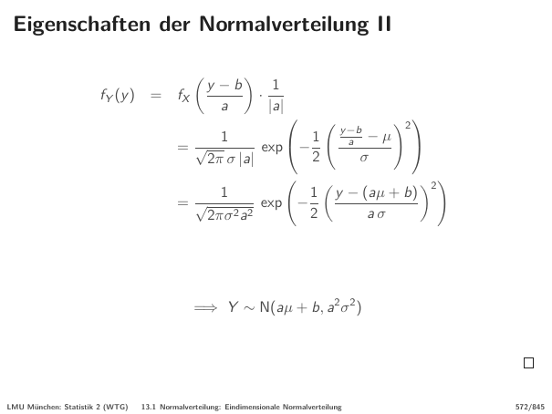

本页放在“模块二：正态分布是多维概率的标准模型”中，核心是理解 正态分布（Normalverteilung）。直觉上先抓住标题里的对象：正态分布（Normalverteilung）。然后看它是定义、例子、定理还是证明；定义页要记条件，例子页要看随机机制，证明页要看用了哪些闭包性或极限定理。

关键词：

- 正态分布（Normalverteilung）

本页需要抓住的德语线索：

- `f (y ) = f ·`
- `= √ exp − a `
- `= √ exp −`
- `=⇒ Y ∼ N(aµ + b, a2σ2)`

### Seite 146 - 正态分布（Normalverteilung）

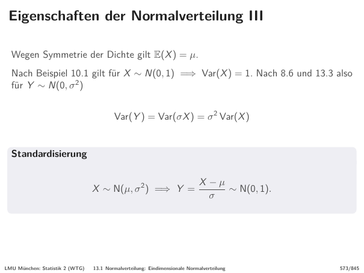

本页放在“模块二：正态分布是多维概率的标准模型”中，核心是理解 密度（Dichte）、正态分布（Normalverteilung）。直觉上先抓住标题里的对象：正态分布（Normalverteilung）。然后看它是定义、例子、定理还是证明；定义页要记条件，例子页要看随机机制，证明页要看用了哪些闭包性或极限定理。

关键词：

- 密度（Dichte）
- 正态分布（Normalverteilung）

本页需要抓住的德语线索：

- `Wegen Symmetrie der Dichte gilt E(X ) = µ.`
- `Nach Beispiel 10.1 gilt für X ∼ N(0, 1) =⇒ Var(X ) = 1. Nach 8.6 und 13.3 also`
- `Var(Y ) = Var(σX ) = σ2 Var(X )`
- `X ∼ N(µ, σ2) =⇒ Y = ∼ N(0, 1).`

### Seite 147 - 独立性（Unabhängigkeit）

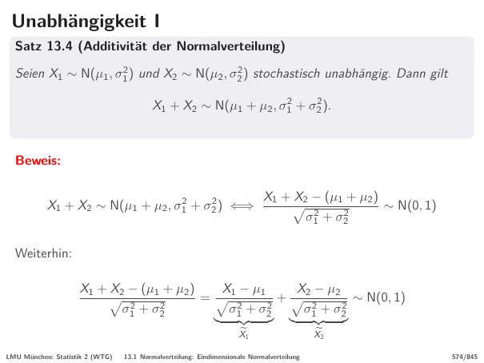

本页放在“模块二：正态分布是多维概率的标准模型”中，核心是理解 独立性（Unabhängigkeit）、正态分布（Normalverteilung）。直觉上先抓住标题里的对象：独立性（Unabhängigkeit）。然后看它是定义、例子、定理还是证明；定义页要记条件，例子页要看随机机制，证明页要看用了哪些闭包性或极限定理。

关键词：

- 独立性（Unabhängigkeit）
- 正态分布（Normalverteilung）

本页需要抓住的德语线索：

- `Satz 13.4 (Additivität der Normalverteilung)`
- `1 2 1 2 = 1 1 + 2 2 ∼ N(0, 1)`

### Seite 148 - 独立性（Unabhängigkeit）

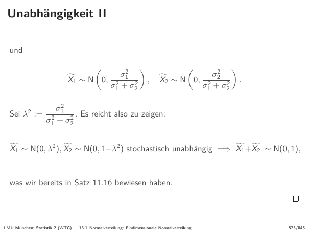

本页放在“模块二：正态分布是多维概率的标准模型”中，核心是理解 独立性（Unabhängigkeit）。直觉上先抓住标题里的对象：独立性（Unabhängigkeit）。然后看它是定义、例子、定理还是证明；定义页要记条件，例子页要看随机机制，证明页要看用了哪些闭包性或极限定理。

关键词：

- 独立性（Unabhängigkeit）

本页需要抓住的德语线索：

- `Sei λ2 := 1 . Es reicht also zu zeigen:`
- `Xf1 ∼ N(0, λ2), Xf2 ∼ N(0, 1−λ2) stochastisch unabhängig =⇒ Xf1 +Xf2 ∼ N(0, 1),`
- `was wir bereits in Satz 11.16 bewiesen haben.`

### Seite 149 - 独立性（Unabhängigkeit）

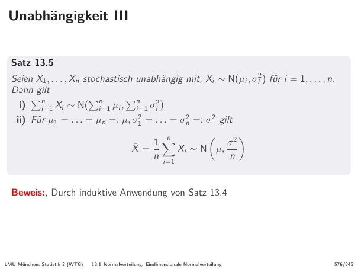

本页放在“模块二：正态分布是多维概率的标准模型”中，核心是理解 独立性（Unabhängigkeit）。直觉上先抓住标题里的对象：独立性（Unabhängigkeit）。然后看它是定义、例子、定理还是证明；定义页要记条件，例子页要看随机机制，证明页要看用了哪些闭包性或极限定理。

关键词：

- 独立性（Unabhängigkeit）

本页需要抓住的德语线索：

- `Satz 13.5`
- `Seien X , . . . , X stochastisch unabhängig mit, X ∼ N(µ , σ2) für i = 1, . . . , n.`
- `i=1 i i=1 i i=1 i`
- `ii) Für µ = . . . = µ =: µ, σ2 = . . . = σ2 =: σ2 gilt`
- `X¯ = 1 X n X ∼ N (cid:18) µ, σ2 (cid:19)`

### Seite 150 - 独立性（Unabhängigkeit）

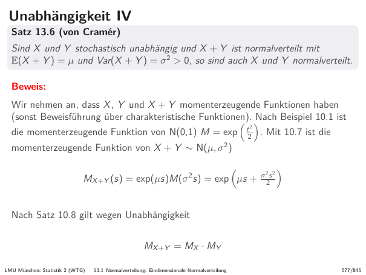

本页放在“模块二：正态分布是多维概率的标准模型”中，核心是理解 独立性（Unabhängigkeit）。直觉上先抓住标题里的对象：独立性（Unabhängigkeit）。然后看它是定义、例子、定理还是证明；定义页要记条件，例子页要看随机机制，证明页要看用了哪些闭包性或极限定理。

关键词：

- 独立性（Unabhängigkeit）

本页需要抓住的德语线索：

- `Satz 13.6 (von Cramér)`
- `E(X + Y ) = µ und Var(X + Y ) = σ2 > 0, so sind auch X und Y normalverteilt.`
- `(sonst Beweisführung über charakteristische Funktionen). Nach Beispiel 10.1 ist`
- `die momenterzeugende Funktion von N(0,1) M = exp t2 . Mit 10.7 ist die`
- `M (s) = exp(µs)M(σ2s) = exp µs + σ2s2`

### Seite 151 - 独立性（Unabhängigkeit）

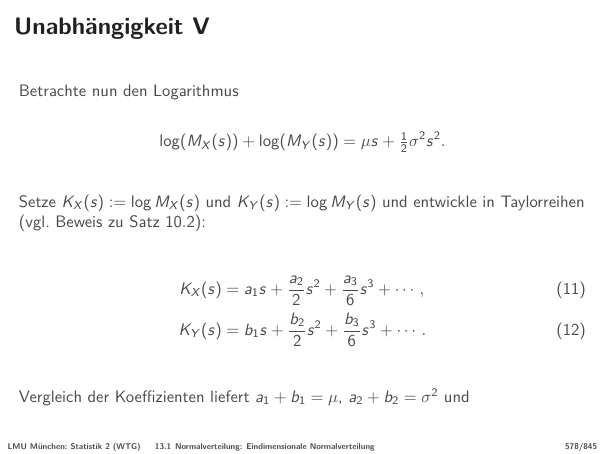

本页放在“模块二：正态分布是多维概率的标准模型”中，核心是理解 独立性（Unabhängigkeit）。直觉上先抓住标题里的对象：独立性（Unabhängigkeit）。然后看它是定义、例子、定理还是证明；定义页要记条件，例子页要看随机机制，证明页要看用了哪些闭包性或极限定理。

关键词：

- 独立性（Unabhängigkeit）

本页需要抓住的德语线索：

- `log(M (s)) + log(M (s)) = µs + 1 σ2s2.`
- `Setze K (s) := log M (s) und K (s) := log M (s) und entwickle in Taylorreihen`
- `(vgl. Beweis zu Satz 10.2):`
- `K (s) = a s + 2 s2 + 3 s3 + · · · , (11)`
- `K (s) = b s + 2 s2 + 3 s3 + · · · . (12)`

### Seite 152 - 独立性（Unabhängigkeit）

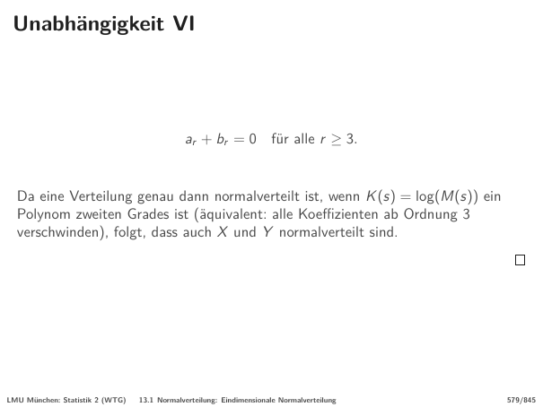

本页放在“模块二：正态分布是多维概率的标准模型”中，核心是理解 分布（Verteilung）、独立性（Unabhängigkeit）。直觉上先抓住标题里的对象：独立性（Unabhängigkeit）。然后看它是定义、例子、定理还是证明；定义页要记条件，例子页要看随机机制，证明页要看用了哪些闭包性或极限定理。

关键词：

- 分布（Verteilung）
- 独立性（Unabhängigkeit）

本页需要抓住的德语线索：

- `a + b = 0 für alle r ≥ 3.`
- `Da eine Verteilung genau dann normalverteilt ist, wenn K (s) = log(M(s)) ein`

### Seite 153 - 正态分布（Normalverteilung）

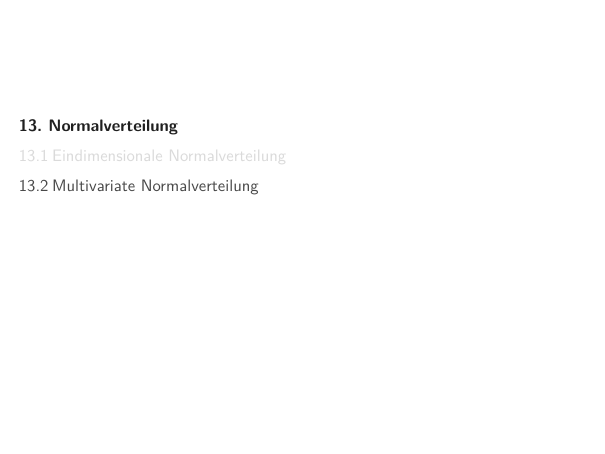

本页放在“模块二：正态分布是多维概率的标准模型”中，核心是理解 正态分布（Normalverteilung）。直觉上先抓住标题里的对象：正态分布（Normalverteilung）。然后看它是定义、例子、定理还是证明；定义页要记条件，例子页要看随机机制，证明页要看用了哪些闭包性或极限定理。

关键词：

- 正态分布（Normalverteilung）

本页需要抓住的德语线索：

- `13. Normalverteilung`
- `13.1 Eindimensionale Normalverteilung`
- `13.2 Multivariate Normalverteilung`

### Seite 154 - Multivariate Standardnormalverteilung I

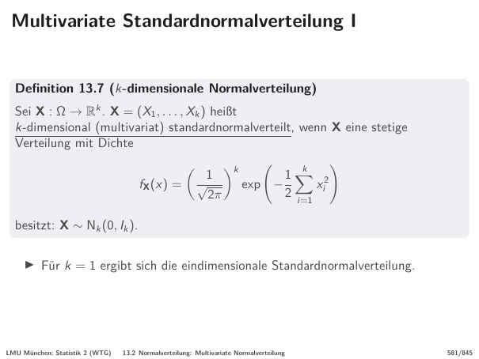

本页放在“模块二：正态分布是多维概率的标准模型”中，核心是理解 分布（Verteilung）、密度（Dichte）、正态分布（Normalverteilung）。直觉上先抓住标题里的对象：Multivariate Standardnormalverteilung I。然后看它是定义、例子、定理还是证明；定义页要记条件，例子页要看随机机制，证明页要看用了哪些闭包性或极限定理。

关键词：

- 分布（Verteilung）
- 密度（Dichte）
- 正态分布（Normalverteilung）

本页需要抓住的德语线索：

- `Definition 13.7 (k-dimensionale Normalverteilung)`
- `Sei X : Ω → Rk . X = (X , . . . , X ) heißt`
- `f (x ) = √ exp − x 2`
- `i=1`
- `Für k = 1 ergibt sich die eindimensionale Standardnormalverteilung.`

### Seite 155 - Multivariate Standardnormalverteilung II

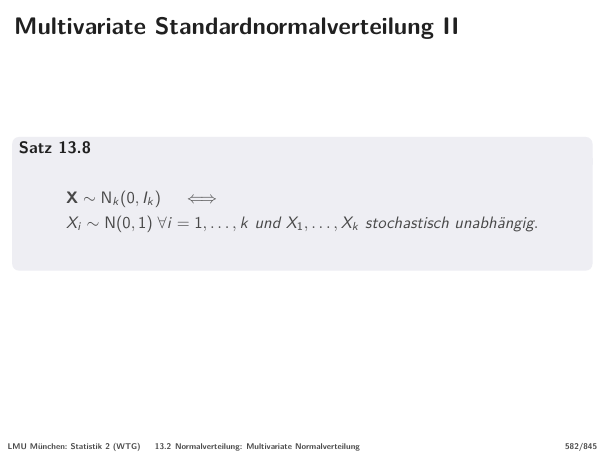

本页放在“模块二：正态分布是多维概率的标准模型”中，主要作用是推进 Seite 137-173 这一段的概念链。先把标题“Multivariate Standardnormalverteilung II”和前后页联系起来，再区分它是在给定义、展示例子、证明性质，还是做章节过渡。

本页需要抓住的德语线索：

- `Satz 13.8`
- `X ∼ N(0, 1) ∀i = 1, . . . , k und X , . . . , X stochastisch unabhängig.`

### Seite 156 - Multivariate Standardnormalverteilung III

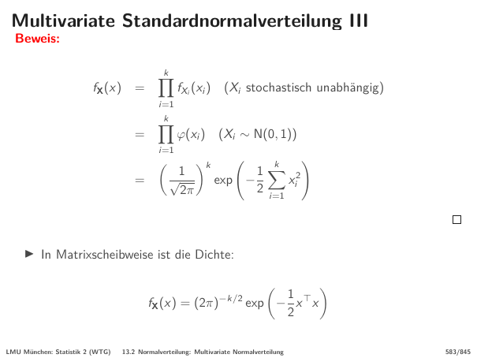

本页放在“模块二：正态分布是多维概率的标准模型”中，主要作用是推进 Seite 137-173 这一段的概念链。先把标题“Multivariate Standardnormalverteilung III”和前后页联系起来，再区分它是在给定义、展示例子、证明性质，还是做章节过渡。

本页需要抓住的德语线索：

- `f (x ) = f (x ) (X stochastisch unabhängig)`
- `i=1`
- `= φ(x ) (X ∼ N(0, 1))`
- `i=1`
- `= √ exp − x 2`

### Seite 157 - 正态分布（Normalverteilung）

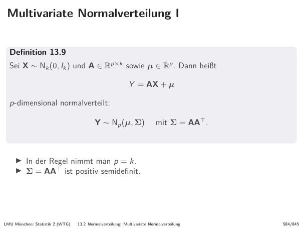

本页放在“模块二：正态分布是多维概率的标准模型”中，核心是理解 正态分布（Normalverteilung）。直觉上先抓住标题里的对象：正态分布（Normalverteilung）。然后看它是定义、例子、定理还是证明；定义页要记条件，例子页要看随机机制，证明页要看用了哪些闭包性或极限定理。

关键词：

- 正态分布（Normalverteilung）

本页需要抓住的德语线索：

- `Definition 13.9`
- `Sei X ∼ N (0, I ) und A ∈ Rp×k sowie µ ∈ Rp. Dann heißt`
- `Y = AX + µ`
- `Y ∼ N (µ, Σ) mit Σ = AA⊤.`
- `In der Regel nimmt man p = k.`

### Seite 158 - 正态分布（Normalverteilung）

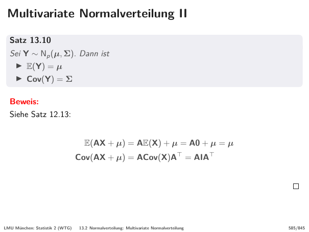

本页放在“模块二：正态分布是多维概率的标准模型”中，核心是理解 正态分布（Normalverteilung）。直觉上先抓住标题里的对象：正态分布（Normalverteilung）。然后看它是定义、例子、定理还是证明；定义页要记条件，例子页要看随机机制，证明页要看用了哪些闭包性或极限定理。

关键词：

- 正态分布（Normalverteilung）

本页需要抓住的德语线索：

- `Satz 13.10`
- `E(Y) = µ`
- `Cov(Y) = Σ`
- `Siehe Satz 12.13:`
- `E(AX + µ) = AE(X) + µ = A0 + µ = µ`

### Seite 159 - 正态分布（Normalverteilung）

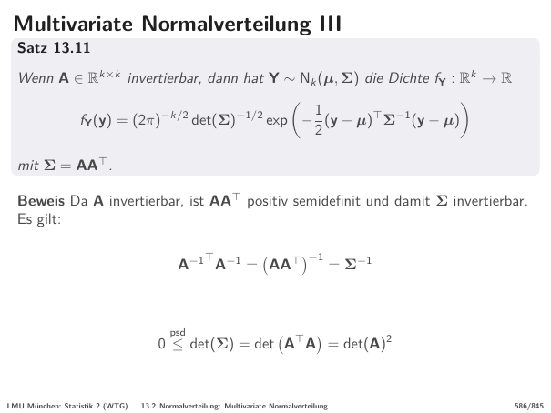

本页放在“模块二：正态分布是多维概率的标准模型”中，核心是理解 密度（Dichte）、正态分布（Normalverteilung）。直觉上先抓住标题里的对象：正态分布（Normalverteilung）。然后看它是定义、例子、定理还是证明；定义页要记条件，例子页要看随机机制，证明页要看用了哪些闭包性或极限定理。

关键词：

- 密度（Dichte）
- 正态分布（Normalverteilung）

本页需要抓住的德语线索：

- `Satz 13.11`
- `Wenn A ∈ Rk×k invertierbar, dann hat Y ∼ N (µ, Σ) die Dichte f : Rk → R`
- `f (y) = (2π)−k/2 det(Σ)−1/2 exp − (y − µ)⊤Σ−1(y − µ)`
- `mit Σ = AA⊤.`
- `Es gilt:`

### Seite 160 - 正态分布（Normalverteilung）

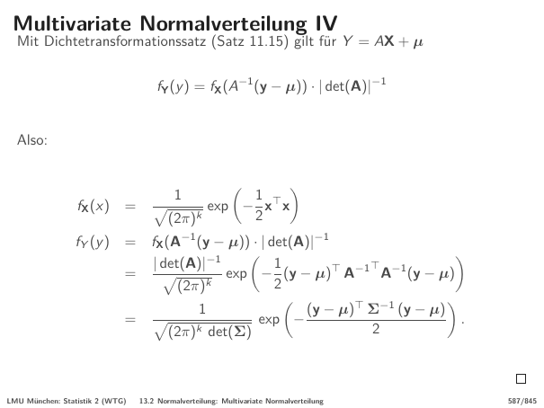

本页放在“模块二：正态分布是多维概率的标准模型”中，核心是理解 密度（Dichte）、正态分布（Normalverteilung）。直觉上先抓住标题里的对象：正态分布（Normalverteilung）。然后看它是定义、例子、定理还是证明；定义页要记条件，例子页要看随机机制，证明页要看用了哪些闭包性或极限定理。

关键词：

- 密度（Dichte）
- 正态分布（Normalverteilung）

本页需要抓住的德语线索：

- `Mit Dichtetransformationssatz (Satz 11.15) gilt für Y = AX + µ`
- `f (y ) = f (A−1(y − µ)) · | det(A)|−1`
- `f (x ) = exp − x⊤x`
- `f (y ) = f (A−1(y − µ)) · | det(A)|−1`
- `= | det(A)|−1 exp (cid:18) − 1 (y − µ)⊤ A−1⊤ A−1(y − µ) (cid:19)`

### Seite 161 - Degenerierter Fall I

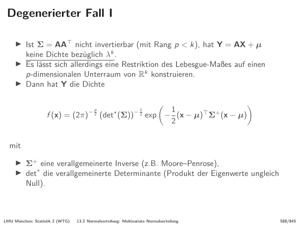

本页放在“模块二：正态分布是多维概率的标准模型”中，核心是理解 测度（Maß）、密度（Dichte）。直觉上先抓住标题里的对象：Degenerierter Fall I。然后看它是定义、例子、定理还是证明；定义页要记条件，例子页要看随机机制，证明页要看用了哪些闭包性或极限定理。

关键词：

- 测度（Maß）
- 密度（Dichte）

本页需要抓住的德语线索：

- `Ist Σ = AA⊤ nicht invertierbar (mit Rang p < k), hat Y = AX + µ`
- `f (x) = (2π)− p 2 (det∗(Σ))− 2 1 exp − 1 (x − µ)⊤Σ+(x − µ)`

### Seite 162 - Degenerierter Fall II

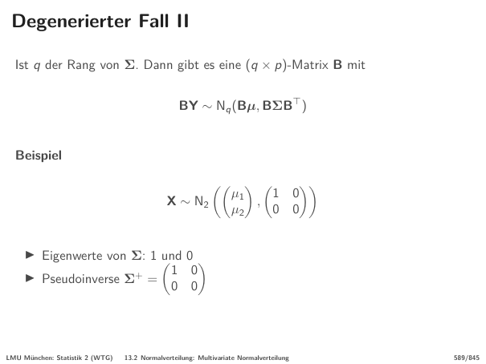

本页放在“模块二：正态分布是多维概率的标准模型”中，主要作用是推进 Seite 137-173 这一段的概念链。先把标题“Degenerierter Fall II”和前后页联系起来，再区分它是在给定义、展示例子、证明性质，还是做章节过渡。

本页需要抓住的德语线索：

- `Beispiel`
- `Pseudoinverse Σ+ = 1 0`

### Seite 163 - Degenerierter Fall III

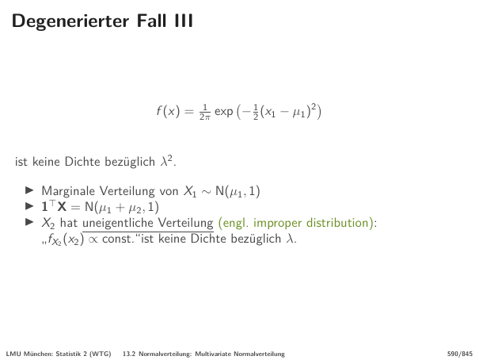

本页放在“模块二：正态分布是多维概率的标准模型”中，核心是理解 分布（Verteilung）、密度（Dichte）。直觉上先抓住标题里的对象：Degenerierter Fall III。然后看它是定义、例子、定理还是证明；定义页要记条件，例子页要看随机机制，证明页要看用了哪些闭包性或极限定理。

关键词：

- 分布（Verteilung）
- 密度（Dichte）

本页需要抓住的德语线索：

- `f (x ) = 1 exp (cid:0) − 1 (x − µ )2(cid:1)`
- `1⊤X = N(µ + µ , 1)`

### Seite 164 - 正态分布（Normalverteilung）

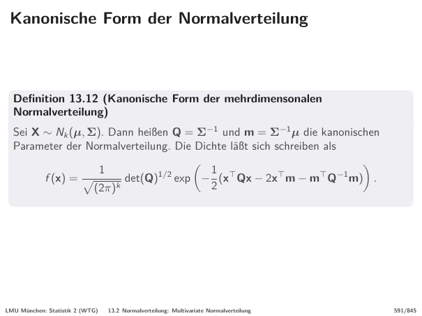

本页放在“模块二：正态分布是多维概率的标准模型”中，核心是理解 密度（Dichte）、正态分布（Normalverteilung）。直觉上先抓住标题里的对象：正态分布（Normalverteilung）。然后看它是定义、例子、定理还是证明；定义页要记条件，例子页要看随机机制，证明页要看用了哪些闭包性或极限定理。

关键词：

- 密度（Dichte）
- 正态分布（Normalverteilung）

本页需要抓住的德语线索：

- `Definition 13.12 (Kanonische Form der mehrdimensonalen`
- `Sei X ∼ N (µ, Σ). Dann heißen Q = Σ−1 und m = Σ−1µ die kanonischen`
- `f (x) = det(Q)1/2 exp − (x⊤Qx − 2x⊤m − m⊤Q−1m) .`

### Seite 165 - Lineare Transformation

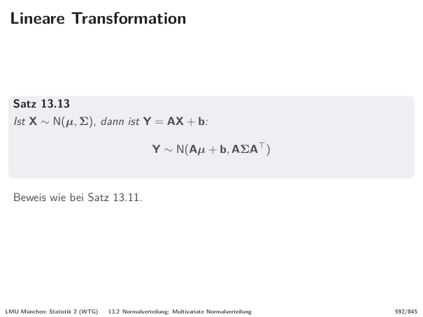

本页放在“模块二：正态分布是多维概率的标准模型”中，主要作用是推进 Seite 137-173 这一段的概念链。先把标题“Lineare Transformation”和前后页联系起来，再区分它是在给定义、展示例子、证明性质，还是做章节过渡。

本页需要抓住的德语线索：

- `Satz 13.13`
- `Ist X ∼ N(µ, Σ), dann ist Y = AX + b:`
- `Beweis wie bei Satz 13.11.`

### Seite 166 - 分布（Verteilung）

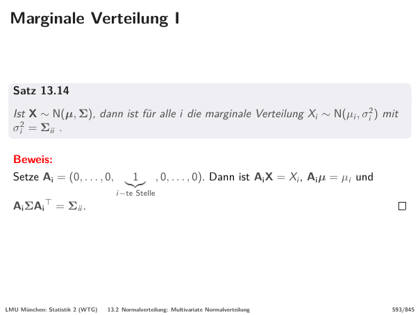

本页放在“模块二：正态分布是多维概率的标准模型”中，核心是理解 分布（Verteilung）。直觉上先抓住标题里的对象：分布（Verteilung）。然后看它是定义、例子、定理还是证明；定义页要记条件，例子页要看随机机制，证明页要看用了哪些闭包性或极限定理。

关键词：

- 分布（Verteilung）

本页需要抓住的德语线索：

- `Satz 13.14`
- `σ2 = Σ .`
- `Setze A = (0, . . . , 0, 1 , 0, . . . , 0). Dann ist A X = X , A µ = µ und`
- `A ΣA ⊤ = Σ .`

### Seite 167 - 分布（Verteilung）

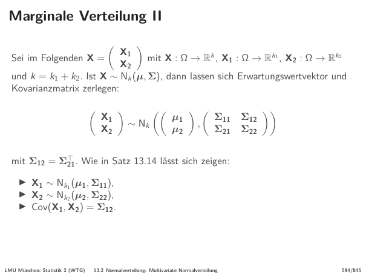

本页放在“模块二：正态分布是多维概率的标准模型”中，核心是理解 分布（Verteilung）、期望（Erwartungswert）。直觉上先抓住标题里的对象：分布（Verteilung）。然后看它是定义、例子、定理还是证明；定义页要记条件，例子页要看随机机制，证明页要看用了哪些闭包性或极限定理。

关键词：

- 分布（Verteilung）
- 期望（Erwartungswert）

本页需要抓住的德语线索：

- `Sei im Folgenden X =`
- `1 mit X : Ω → Rk , X`
- `: Ω → Rk1, X`
- `: Ω → Rk2`
- `und k = k + k . Ist X ∼ N (µ, Σ), dann lassen sich Erwartungswertvektor und`

### Seite 168 - 分布（Verteilung）

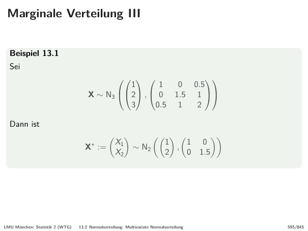

本页放在“模块二：正态分布是多维概率的标准模型”中，核心是理解 分布（Verteilung）。直觉上先抓住标题里的对象：分布（Verteilung）。然后看它是定义、例子、定理还是证明；定义页要记条件，例子页要看随机机制，证明页要看用了哪些闭包性或极限定理。

关键词：

- 分布（Verteilung）

本页需要抓住的德语线索：

- `Beispiel 13.1`
- `X∗ := 1 ∼ N ,`

### Seite 169 - 条件分布（Bedingte Verteilung）

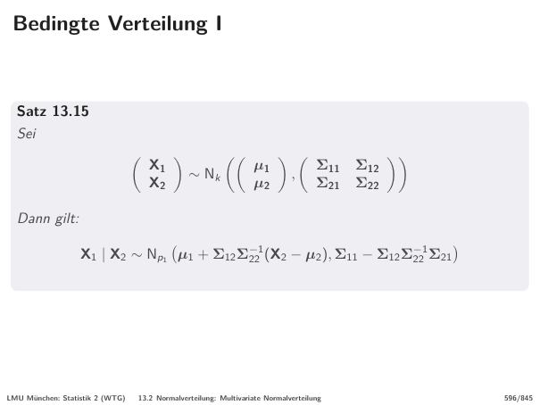

本页放在“模块二：正态分布是多维概率的标准模型”中，核心是理解 分布（Verteilung）。直觉上先抓住标题里的对象：条件分布（Bedingte Verteilung）。然后看它是定义、例子、定理还是证明；定义页要记条件，例子页要看随机机制，证明页要看用了哪些闭包性或极限定理。

关键词：

- 分布（Verteilung）

本页需要抓住的德语线索：

- `Satz 13.15`

### Seite 170 - 条件分布（Bedingte Verteilung）

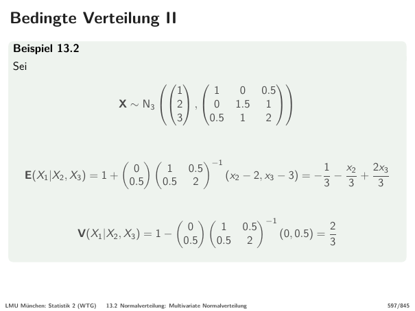

本页放在“模块二：正态分布是多维概率的标准模型”中，核心是理解 分布（Verteilung）。直觉上先抓住标题里的对象：条件分布（Bedingte Verteilung）。然后看它是定义、例子、定理还是证明；定义页要记条件，例子页要看随机机制，证明页要看用了哪些闭包性或极限定理。

关键词：

- 分布（Verteilung）

本页需要抓住的德语线索：

- `Beispiel 13.2`
- `E(X |X , X ) = 1 + (x − 2, x − 3) = − − 2 + 3`
- `V(X |X , X ) = 1 − (0, 0.5) =`

### Seite 171 - 条件分布（Bedingte Verteilung）

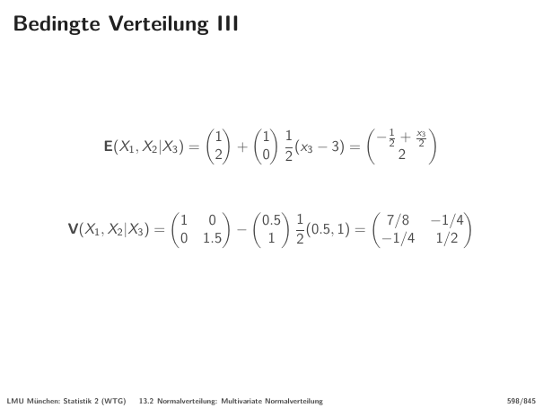

本页放在“模块二：正态分布是多维概率的标准模型”中，核心是理解 分布（Verteilung）。直觉上先抓住标题里的对象：条件分布（Bedingte Verteilung）。然后看它是定义、例子、定理还是证明；定义页要记条件，例子页要看随机机制，证明页要看用了哪些闭包性或极限定理。

关键词：

- 分布（Verteilung）

本页需要抓住的德语线索：

- `E(X , X |X ) = + (x − 3) = 2 2`
- `V(X , X |X ) = − (0.5, 1) =`

### Seite 172 - 条件分布（Bedingte Verteilung）

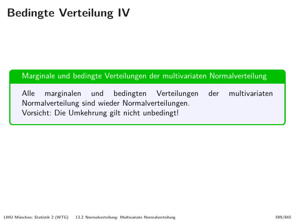

本页放在“模块二：正态分布是多维概率的标准模型”中，核心是理解 分布（Verteilung）、条件分布（bedingte Verteilung）、正态分布（Normalverteilung）。直觉上先抓住标题里的对象：条件分布（Bedingte Verteilung）。然后看它是定义、例子、定理还是证明；定义页要记条件，例子页要看随机机制，证明页要看用了哪些闭包性或极限定理。

关键词：

- 分布（Verteilung）
- 条件分布（bedingte Verteilung）
- 正态分布（Normalverteilung）

本页需要抓住的德语线索：

- `Bedingte Verteilung IV`
- `Marginale und bedingte Verteilungen der multivariaten Normalverteilung`
- `Alle marginalen und bedingten Verteilungen der multivariaten`

### Seite 173 - 条件分布（Bedingte Verteilung）

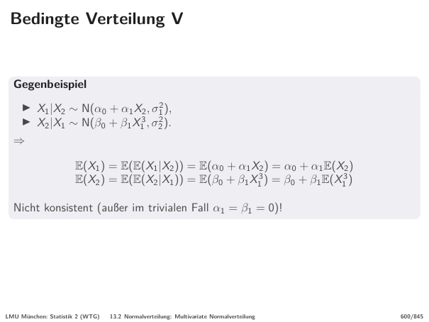

本页放在“模块二：正态分布是多维概率的标准模型”中，核心是理解 分布（Verteilung）。直觉上先抓住标题里的对象：条件分布（Bedingte Verteilung）。然后看它是定义、例子、定理还是证明；定义页要记条件，例子页要看随机机制，证明页要看用了哪些闭包性或极限定理。

关键词：

- 分布（Verteilung）

本页需要抓住的德语线索：

- `E(X ) = E(E(X |X )) = E(α + α X ) = α + α E(X )`
- `E(X ) = E(E(X |X )) = E(β + β X 3) = β + β E(X 3)`
- `Nicht konsistent (außer im trivialen Fall α = β = 0)!`

## 本章逻辑梳理

- **随机向量（Seite 1-70）：** 联合分布、边际分布、变换与卷积。
- **依赖与条件（Seite 71-136）：** 独立性、协方差、条件分布。
- **正态分布（Seite 137-173）：** 一维与多元正态。

复习时不要按页码硬背。先确认本页属于哪个模块，再问它是在定义对象、说明性质、给例子、证明定理，还是提醒适用边界。

## 关键考核点

1. 会从联合分布推出边际分布。
2. 会判断独立性是否等价于联合分布分解。
3. 会计算协方差并解释线性依赖。
4. 会说明多元正态由均值向量和协方差矩阵刻画。

## 本章公式清单

### 联合与边际

| 序号 | 公式 | 使用场景 | 注意事项 |
| ---: | --- | --- | --- |
| 1 | $F_{X,Y}(x,y)=P(X\le x,Y\le y)$ | 联合分布函数。 | 同时限制两个变量。 |
| 2 | $f_X(x)=\int f_{X,Y}(x,y)\,dy$ | 由联合密度求边际密度。 | 对不关心的变量积分。 |
| 3 | $f_Y(y)=f_X(g^{-1}(y))\left\lvert \det J_{g^{-1}}(y)\right\rvert$ | 密度变换。 | 多维情形必须乘 Jacobian 行列式绝对值。 |

### 依赖与正态

| 序号 | 公式 | 使用场景 | 注意事项 |
| ---: | --- | --- | --- |
| 4 | $X\perp Y\Leftrightarrow f_{X,Y}=f_Xf_Y$ | 独立性。 | 联合结构可以拆开。 |
| 5 | $Cov(X,Y)=E[(X-E X)(Y-E Y)]$ | 协方差。 | 只刻画线性共同变化。 |
| 6 | $\rho(X,Y)=\frac{Cov(X,Y)}{\sqrt{Var(X)Var(Y)}}$ | 相关系数。 | 无量纲，范围 $[-1,1]$。 |
| 7 | $\mathbf X\sim N_k(\mu,\Sigma)$ | 多元正态。 | $\mu$ 是均值向量，$\Sigma$ 是协方差矩阵。 |

## 章节自测

- [x] 边际分布通常不能唯一决定联合分布。
- [x] 独立变量的协方差一定为 0。
- [ ] 协方差为 0 总能推出独立。

## 德语词汇表

| 德语 | 中文 | 使用场景 |
| --- | --- | --- |
| Zufallsvektor | 随机向量 | 多个随机变量 |
| gemeinsame Verteilung | 联合分布 | 整体概率结构 |
| Randverteilung | 边际分布 | 单变量分布 |
| Faltung | 卷积 | 和的分布 |
| Kovarianz | 协方差 | 线性共同变化 |
| bedingte Verteilung | 条件分布 | 给定信息后的分布 |
| multivariate Normalverteilung | 多元正态分布 | 均值向量与协方差矩阵 |

## C1 德语句式

| 序号 | 德语句式 | 中文翻译 | 适用场景 |
| ---: | --- | --- | --- |
| 1 | Randverteilungen lassen sich aus der gemeinsamen Verteilung gewinnen, enthalten aber im Allgemeinen nicht die gesamte Abhängigkeitsstruktur. | 边际分布可以由联合分布得到，但通常不包含全部依赖结构。 | 解释联合比分布更强。 |
| 2 | Unabhängigkeit ist eine Aussage über die Faktorisierung der gemeinsamen Verteilung. | 独立性是关于联合分布能否分解的陈述。 | 定义独立。 |
