# 下学期第 05 章：收敛（Konvergenz）

> 来源：`分章节讲义-下学期/05_Konvergenz.pdf`  
> 原讲义页码：S. 601-705  
> 图片目录：`assets/`  
> 核心主线：本部分回答随机变量序列到底以什么意义收敛：几乎必然、依概率、矩收敛、依分布，以及大数定律和中心极限定理如何建立统计推断的可靠性。

## 章节知识树

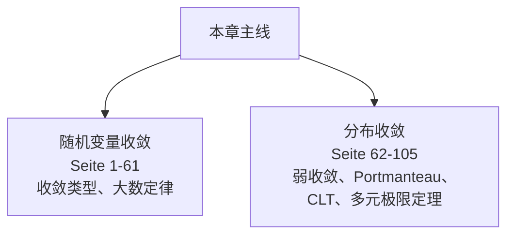
```mermaid
flowchart TD
  A["本章主线"]
  A --> M1["随机变量收敛<br/>Seite 1-61<br/>收敛类型、大数定律"]
  A --> M2["分布收敛<br/>Seite 62-105<br/>弱收敛、Portmanteau、CLT、多元极限定理"]
```

## 学习路径

本部分回答随机变量序列到底以什么意义收敛：几乎必然、依概率、矩收敛、依分布，以及大数定律和中心极限定理如何建立统计推断的可靠性。

1. **随机变量收敛：** 收敛类型、大数定律（Seite 1-61）。
2. **分布收敛：** 弱收敛、Portmanteau、CLT、多元极限定理（Seite 62-105）。

## 模块地图

| 模块 | 页码 | 核心问题 |
| --- | --- | --- |
| 随机变量收敛 | Seite 1-61 | 收敛类型、大数定律 |
| 分布收敛 | Seite 62-105 | 弱收敛、Portmanteau、CLT、多元极限定理 |

## 考试优先级

1. 会比较几乎必然收敛、依概率收敛、矩收敛和依分布收敛的强弱。
2. 会说明弱大数定律和强大数定律的差别。
3. 会写出中心极限定理的标准化形式。
4. 会解释为什么分布收敛比依概率收敛弱。

## 模块零：随机变量序列到底怎么收敛（Seite 1-61）

普通数列收敛只有一种距离感，随机变量收敛却有多种强弱层次。几乎必然看每个样本点，依概率看偏离概率，矩收敛看期望距离；这些差异决定极限定理能推出什么。

### Seite 1 - 收敛（Konvergenz）

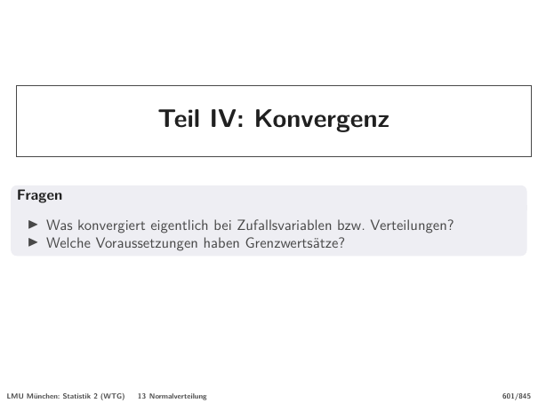

本页放在“模块零：随机变量序列到底怎么收敛”中，核心是理解 随机变量（Zufallsvariable）、分布（Verteilung）、收敛（Konvergenz）。直觉上先抓住标题里的对象：收敛（Konvergenz）。然后看它是定义、例子、定理还是证明；定义页要记条件，例子页要看随机机制，证明页要看用了哪些闭包性或极限定理。

关键词：

- 随机变量（Zufallsvariable）
- 分布（Verteilung）
- 收敛（Konvergenz）

本页需要抓住的德语线索：

- `Teil IV: Konvergenz`
- `Fragen`
- `Was konvergiert eigentlich bei Zufallsvariablen bzw. Verteilungen?`

### Seite 2 - 随机变量（Zufallsvariablen）

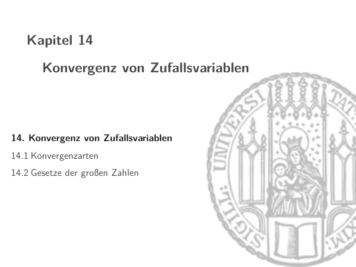

本页可识别的嵌入图片裁切：

本页放在“模块零：随机变量序列到底怎么收敛”中，核心是理解 随机变量（Zufallsvariable）、收敛（Konvergenz）。直觉上先抓住标题里的对象：随机变量（Zufallsvariablen）。然后看它是定义、例子、定理还是证明；定义页要记条件，例子页要看随机机制，证明页要看用了哪些闭包性或极限定理。

关键词：

- 随机变量（Zufallsvariable）
- 收敛（Konvergenz）

本页需要抓住的德语线索：

- `Kapitel 14`
- `Konvergenz von Zufallsvariablen`
- `14. Konvergenz von Zufallsvariablen`

### Seite 3 - Ziel

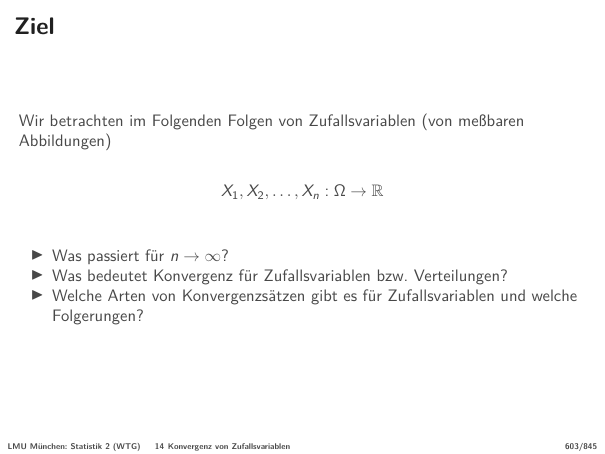

本页放在“模块零：随机变量序列到底怎么收敛”中，核心是理解 随机变量（Zufallsvariable）、分布（Verteilung）、收敛（Konvergenz）。直觉上先抓住标题里的对象：Ziel。然后看它是定义、例子、定理还是证明；定义页要记条件，例子页要看随机机制，证明页要看用了哪些闭包性或极限定理。

关键词：

- 随机变量（Zufallsvariable）
- 分布（Verteilung）
- 收敛（Konvergenz）

本页需要抓住的德语线索：

- `Ziel`
- `X , X , . . . , X : Ω → R`
- `Was passiert für n → ∞?`

### Seite 4 - Beispiele I

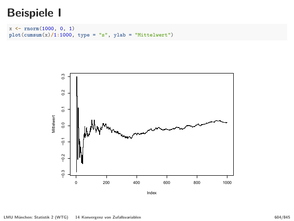

本页放在“模块零：随机变量序列到底怎么收敛”中，主要作用是推进 Seite 1-61 这一段的概念链。先把标题“Beispiele I”和前后页联系起来，再区分它是在给定义、展示例子、证明性质，还是做章节过渡。

本页需要抓住的德语线索：

- `Beispiele I`
- `plot(cumsum(x)/1:1000, type = "s", ylab = "Mittelwert")`

### Seite 5 - Beispiele II

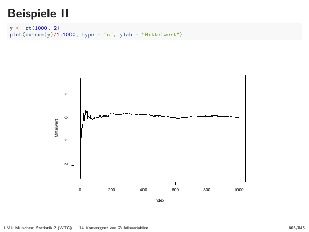

本页放在“模块零：随机变量序列到底怎么收敛”中，主要作用是推进 Seite 1-61 这一段的概念链。先把标题“Beispiele II”和前后页联系起来，再区分它是在给定义、展示例子、证明性质，还是做章节过渡。

本页需要抓住的德语线索：

- `Beispiele II`
- `plot(cumsum(y)/1:1000, type = "s", ylab = "Mittelwert")`

### Seite 6 - Beispiele III

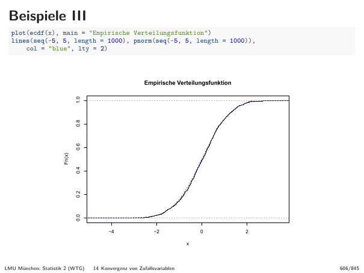

本页放在“模块零：随机变量序列到底怎么收敛”中，核心是理解 分布（Verteilung）、分布函数（Verteilungsfunktion）。直觉上先抓住标题里的对象：Beispiele III。然后看它是定义、例子、定理还是证明；定义页要记条件，例子页要看随机机制，证明页要看用了哪些闭包性或极限定理。

关键词：

- 分布（Verteilung）
- 分布函数（Verteilungsfunktion）

本页需要抓住的德语线索：

- `Beispiele III`
- `plot(ecdf(x), main = "Empirische Verteilungsfunktion")`
- `lines(seq(-5, 5, length = 1000), pnorm(seq(-5, 5, length = 1000)),`
- `col = "blue", lty = 2)`

### Seite 7 - Beispiele IV

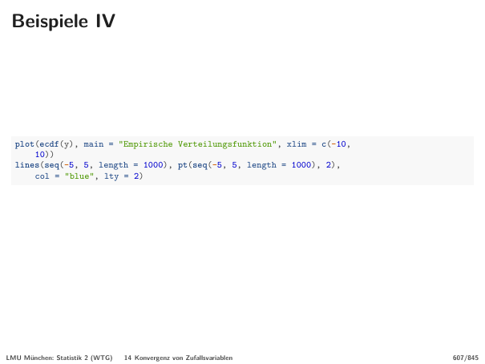

本页放在“模块零：随机变量序列到底怎么收敛”中，核心是理解 分布（Verteilung）、分布函数（Verteilungsfunktion）。直觉上先抓住标题里的对象：Beispiele IV。然后看它是定义、例子、定理还是证明；定义页要记条件，例子页要看随机机制，证明页要看用了哪些闭包性或极限定理。

关键词：

- 分布（Verteilung）
- 分布函数（Verteilungsfunktion）

本页需要抓住的德语线索：

- `Beispiele IV`
- `plot(ecdf(y), main = "Empirische Verteilungsfunktion", xlim = c(-10,`
- `lines(seq(-5, 5, length = 1000), pt(seq(-5, 5, length = 1000), 2),`
- `col = "blue", lty = 2)`

### Seite 8 - Beispiele V

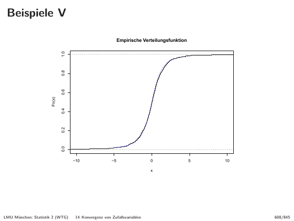

本页放在“模块零：随机变量序列到底怎么收敛”中，核心是理解 分布（Verteilung）、分布函数（Verteilungsfunktion）。直觉上先抓住标题里的对象：Beispiele V。然后看它是定义、例子、定理还是证明；定义页要记条件，例子页要看随机机制，证明页要看用了哪些闭包性或极限定理。

关键词：

- 分布（Verteilung）
- 分布函数（Verteilungsfunktion）

本页需要抓住的德语线索：

- `Beispiele V`

### Seite 9 - Beispiele VI

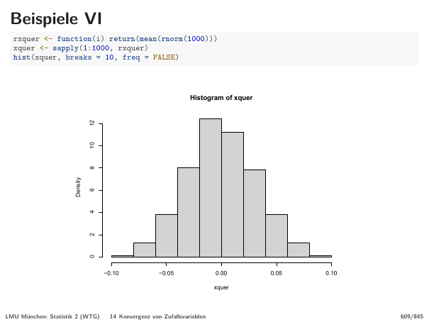

本页放在“模块零：随机变量序列到底怎么收敛”中，主要作用是推进 Seite 1-61 这一段的概念链。先把标题“Beispiele VI”和前后页联系起来，再区分它是在给定义、展示例子、证明性质，还是做章节过渡。

本页需要抓住的德语线索：

- `Beispiele VI`
- `hist(xquer, breaks = 10, freq = FALSE)`

### Seite 10 - Beispiele VII

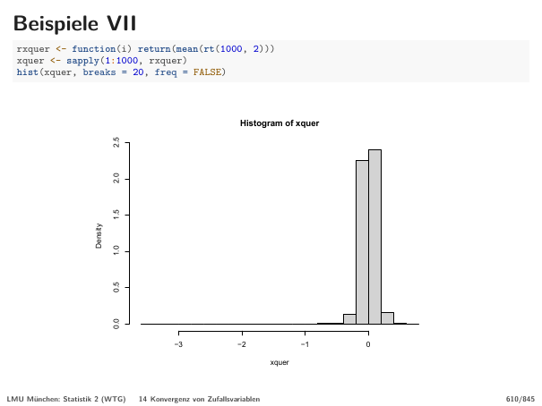

本页放在“模块零：随机变量序列到底怎么收敛”中，主要作用是推进 Seite 1-61 这一段的概念链。先把标题“Beispiele VII”和前后页联系起来，再区分它是在给定义、展示例子、证明性质，还是做章节过渡。

本页需要抓住的德语线索：

- `Beispiele VII`
- `hist(xquer, breaks = 20, freq = FALSE)`

### Seite 11 - Beispiele VIII

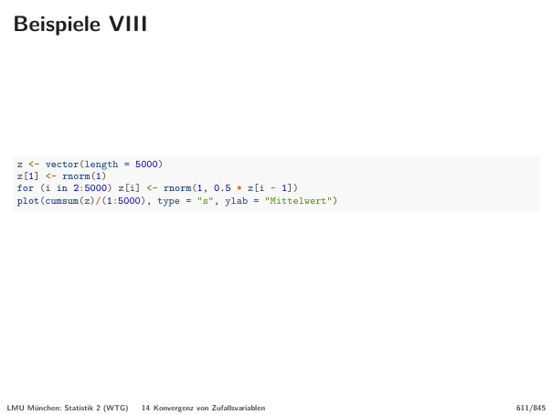

本页放在“模块零：随机变量序列到底怎么收敛”中，主要作用是推进 Seite 1-61 这一段的概念链。先把标题“Beispiele VIII”和前后页联系起来，再区分它是在给定义、展示例子、证明性质，还是做章节过渡。

本页需要抓住的德语线索：

- `Beispiele VIII`
- `z <- vector(length = 5000)`
- `plot(cumsum(z)/(1:5000), type = "s", ylab = "Mittelwert")`

### Seite 12 - Beispiele IX

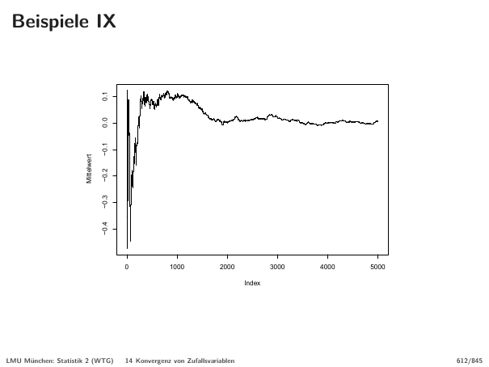

本页放在“模块零：随机变量序列到底怎么收敛”中，主要作用是推进 Seite 1-61 这一段的概念链。先把标题“Beispiele IX”和前后页联系起来，再区分它是在给定义、展示例子、证明性质，还是做章节过渡。

本页需要抓住的德语线索：

- `Beispiele IX`

### Seite 13 - 随机变量（Zufallsvariablen）

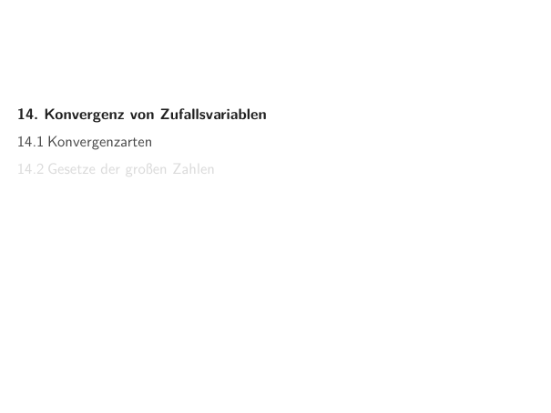

本页放在“模块零：随机变量序列到底怎么收敛”中，核心是理解 随机变量（Zufallsvariable）、收敛（Konvergenz）。直觉上先抓住标题里的对象：随机变量（Zufallsvariablen）。然后看它是定义、例子、定理还是证明；定义页要记条件，例子页要看随机机制，证明页要看用了哪些闭包性或极限定理。

关键词：

- 随机变量（Zufallsvariable）
- 收敛（Konvergenz）

本页需要抓住的德语线索：

- `14. Konvergenz von Zufallsvariablen`
- `14.1 Konvergenzarten`
- `14.2 Gesetze der großen Zahlen`

### Seite 14 - 收敛类型（Konvergenzarten）

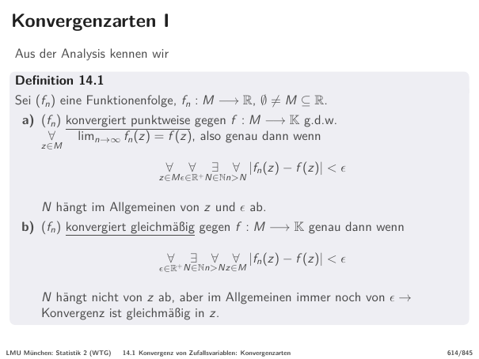

本页放在“模块零：随机变量序列到底怎么收敛”中，核心是理解 收敛（Konvergenz）。直觉上先抓住标题里的对象：收敛类型（Konvergenzarten）。然后看它是定义、例子、定理还是证明；定义页要记条件，例子页要看随机机制，证明页要看用了哪些闭包性或极限定理。

关键词：

- 收敛（Konvergenz）

本页需要抓住的德语线索：

- `Definition 14.1`
- `Sei (f ) eine Funktionenfolge, f : M −→ R, ∅ ̸= M ⊆ R.`
- `a) (f ) konvergiert punktweise gegen f : M −→ K g.d.w.`
- `∀ lim f (z) = f (z), also genau dann wenn`
- `n→∞ n`

### Seite 15 - 收敛类型（Konvergenzarten）

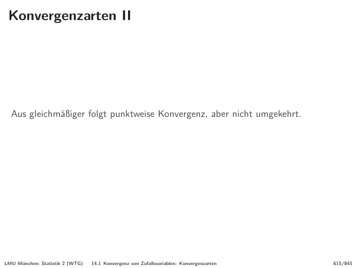

本页放在“模块零：随机变量序列到底怎么收敛”中，核心是理解 收敛（Konvergenz）。直觉上先抓住标题里的对象：收敛类型（Konvergenzarten）。然后看它是定义、例子、定理还是证明；定义页要记条件，例子页要看随机机制，证明页要看用了哪些闭包性或极限定理。

关键词：

- 收敛（Konvergenz）

本页需要抓住的德语线索：

- `Konvergenzarten II`
- `Aus gleichmäßiger folgt punktweise Konvergenz, aber nicht umgekehrt.`

### Seite 16 - 收敛类型（Konvergenzarten）

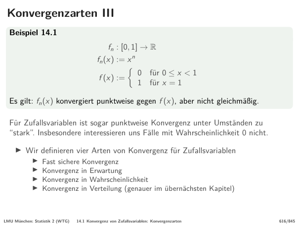

本页放在“模块零：随机变量序列到底怎么收敛”中，核心是理解 收敛（Konvergenz）。直觉上先抓住标题里的对象：收敛类型（Konvergenzarten）。然后看它是定义、例子、定理还是证明；定义页要记条件，例子页要看随机机制，证明页要看用了哪些闭包性或极限定理。

关键词：

- 收敛（Konvergenz）

本页需要抓住的德语线索：

- `Beispiel 14.1`
- `f : [0, 1] → R`
- `f (x ) := x n`
- `0 für 0 ≤ x < 1`
- `f (x ) :=`

### Seite 17 - 收敛（Konvergenz）

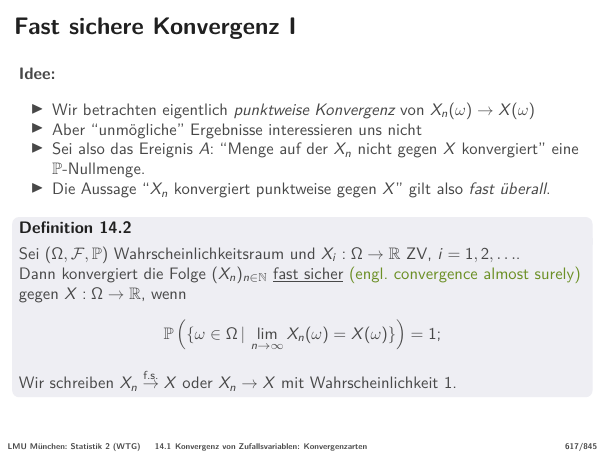

本页放在“模块零：随机变量序列到底怎么收敛”中，核心是理解 概率（Wahrscheinlichkeit）、概率空间（Wahrscheinlichkeitsraum）、结果（Ergebnis）、事件（Ereignis）。直觉上先抓住标题里的对象：收敛（Konvergenz）。然后看它是定义、例子、定理还是证明；定义页要记条件，例子页要看随机机制，证明页要看用了哪些闭包性或极限定理。

关键词：

- 概率（Wahrscheinlichkeit）
- 概率空间（Wahrscheinlichkeitsraum）
- 结果（Ergebnis）
- 事件（Ereignis）
- 集合（Menge）
- 收敛（Konvergenz）

本页需要抓住的德语线索：

- `Idee:`
- `Wir betrachten eigentlich punktweise Konvergenz von X (ω) → X (ω)`
- `Definition 14.2`
- `Sei (Ω, F, P) Wahrscheinlichkeitsraum und X : Ω → R ZV, i = 1, 2, . . ..`
- `Dann konvergiert die Folge (X n ) n∈N fast sicher (engl. convergence almost surely)`

### Seite 18 - 收敛（Konvergenz）

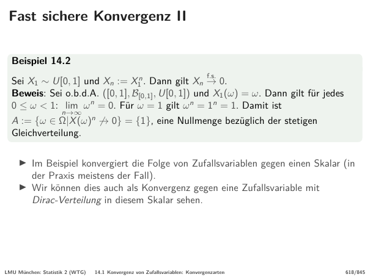

本页放在“模块零：随机变量序列到底怎么收敛”中，核心是理解 随机变量（Zufallsvariable）、收敛（Konvergenz）。直觉上先抓住标题里的对象：收敛（Konvergenz）。然后看它是定义、例子、定理还是证明；定义页要记条件，例子页要看随机机制，证明页要看用了哪些闭包性或极限定理。

关键词：

- 随机变量（Zufallsvariable）
- 收敛（Konvergenz）

本页需要抓住的德语线索：

- `Beispiel 14.2`
- `Sei X ∼ U[0, 1] und X := X n. Dann gilt X → f.s. 0.`
- `Beweis: Sei o.b.d.A. ([0, 1], B , U[0, 1]) und X (ω) = ω. Dann gilt für jedes`
- `0 ≤ ω < 1: lim ωn = 0. Für ω = 1 gilt ωn = 1n = 1. Damit ist`
- `n→∞`

### Seite 19 - 概率（Wahrscheinlichkeit）

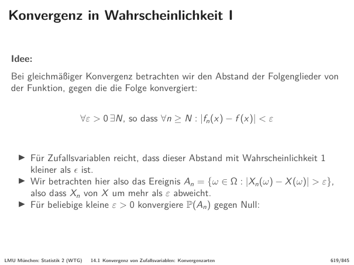

本页放在“模块零：随机变量序列到底怎么收敛”中，核心是理解 概率（Wahrscheinlichkeit）、事件（Ereignis）、随机变量（Zufallsvariable）、收敛（Konvergenz）。直觉上先抓住标题里的对象：概率（Wahrscheinlichkeit）。然后看它是定义、例子、定理还是证明；定义页要记条件，例子页要看随机机制，证明页要看用了哪些闭包性或极限定理。

关键词：

- 概率（Wahrscheinlichkeit）
- 事件（Ereignis）
- 随机变量（Zufallsvariable）
- 收敛（Konvergenz）
- 依概率（in Wahrscheinlichkeit）

本页需要抓住的德语线索：

- `Idee:`
- `∀ε > 0 ∃N, so dass ∀n ≥ N : |f (x ) − f (x )| < ε`
- `Wir betrachten hier also das Ereignis A = {ω ∈ Ω : |X (ω) − X (ω)| > ε},`
- `Für beliebige kleine ε > 0 konvergiere P(A ) gegen Null:`

### Seite 20 - 概率（Wahrscheinlichkeit）

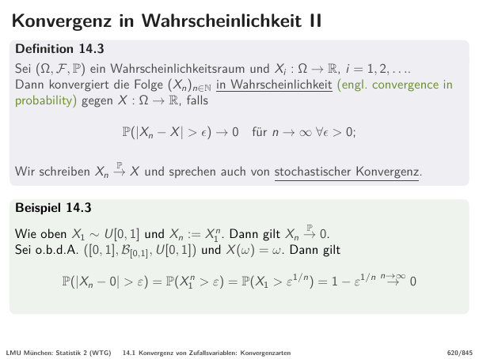

本页放在“模块零：随机变量序列到底怎么收敛”中，核心是理解 概率（Wahrscheinlichkeit）、概率空间（Wahrscheinlichkeitsraum）、收敛（Konvergenz）、依概率（in Wahrscheinlichkeit）。直觉上先抓住标题里的对象：概率（Wahrscheinlichkeit）。然后看它是定义、例子、定理还是证明；定义页要记条件，例子页要看随机机制，证明页要看用了哪些闭包性或极限定理。

关键词：

- 概率（Wahrscheinlichkeit）
- 概率空间（Wahrscheinlichkeitsraum）
- 收敛（Konvergenz）
- 依概率（in Wahrscheinlichkeit）

本页需要抓住的德语线索：

- `Definition 14.3`
- `Sei (Ω, F, P) ein Wahrscheinlichkeitsraum und X : Ω → R, i = 1, 2, . . ..`
- `Dann konvergiert die Folge (X n ) n∈N in Wahrscheinlichkeit (engl. convergence in`
- `probability) gegen X : Ω → R, falls`
- `P(|X − X | > ϵ) → 0 für n → ∞ ∀ϵ > 0;`

### Seite 21 - 概率（Wahrscheinlichkeit）

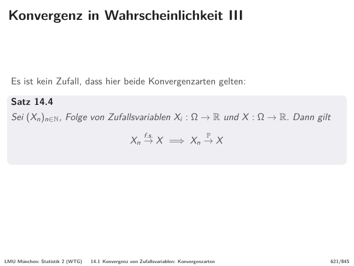

本页放在“模块零：随机变量序列到底怎么收敛”中，核心是理解 概率（Wahrscheinlichkeit）、随机变量（Zufallsvariable）、收敛（Konvergenz）、依概率（in Wahrscheinlichkeit）。直觉上先抓住标题里的对象：概率（Wahrscheinlichkeit）。然后看它是定义、例子、定理还是证明；定义页要记条件，例子页要看随机机制，证明页要看用了哪些闭包性或极限定理。

关键词：

- 概率（Wahrscheinlichkeit）
- 随机变量（Zufallsvariable）
- 收敛（Konvergenz）
- 依概率（in Wahrscheinlichkeit）

本页需要抓住的德语线索：

- `Satz 14.4`
- `) n∈N, Folge von Zufallsvariablen X`
- `: Ω → R und X : Ω → R. Dann gilt`
- `X → X =⇒ X → X`

### Seite 22 - 概率（Wahrscheinlichkeit）

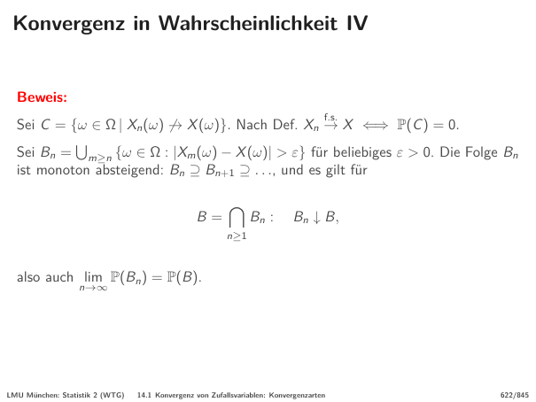

本页放在“模块零：随机变量序列到底怎么收敛”中，核心是理解 概率（Wahrscheinlichkeit）、收敛（Konvergenz）、依概率（in Wahrscheinlichkeit）。直觉上先抓住标题里的对象：概率（Wahrscheinlichkeit）。然后看它是定义、例子、定理还是证明；定义页要记条件，例子页要看随机机制，证明页要看用了哪些闭包性或极限定理。

关键词：

- 概率（Wahrscheinlichkeit）
- 收敛（Konvergenz）
- 依概率（in Wahrscheinlichkeit）

本页需要抓住的德语线索：

- `Sei C = {ω ∈ Ω | X (ω) ̸→ X (ω)}. Nach Def. X → f.s. X ⇐⇒ P(C ) = 0.`
- `Sei B = {ω ∈ Ω : |X (ω) − X (ω)| > ε} für beliebiges ε > 0. Die Folge B`
- `n m≥n m n`
- `B = B : B ↓ B,`
- `n≥1`

### Seite 23 - 概率（Wahrscheinlichkeit）

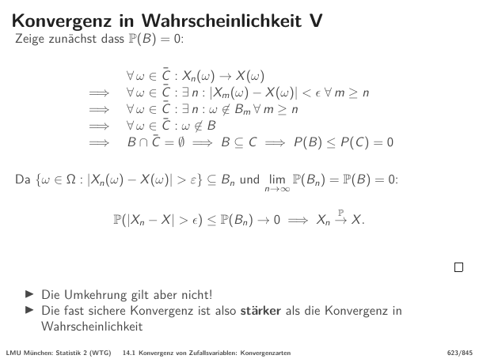

本页放在“模块零：随机变量序列到底怎么收敛”中，核心是理解 概率（Wahrscheinlichkeit）、收敛（Konvergenz）、依概率（in Wahrscheinlichkeit）。直觉上先抓住标题里的对象：概率（Wahrscheinlichkeit）。然后看它是定义、例子、定理还是证明；定义页要记条件，例子页要看随机机制，证明页要看用了哪些闭包性或极限定理。

关键词：

- 概率（Wahrscheinlichkeit）
- 收敛（Konvergenz）
- 依概率（in Wahrscheinlichkeit）

本页需要抓住的德语线索：

- `Zeige zunächst dass P(B) = 0:`
- `∀ ω ∈ C¯ : X (ω) → X (ω)`
- `=⇒ ∀ ω ∈ C¯ : ∃ n : |X (ω) − X (ω)| < ϵ ∀ m ≥ n`
- `=⇒ ∀ ω ∈ C¯ : ∃ n : ω ̸∈ B ∀ m ≥ n`
- `=⇒ ∀ ω ∈ C¯ : ω ̸∈ B`

### Seite 24 - 概率（Wahrscheinlichkeit）

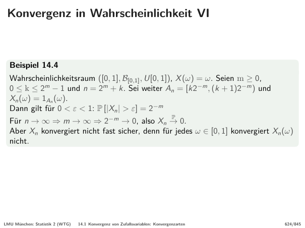

本页放在“模块零：随机变量序列到底怎么收敛”中，核心是理解 概率（Wahrscheinlichkeit）、概率空间（Wahrscheinlichkeitsraum）、收敛（Konvergenz）、依概率（in Wahrscheinlichkeit）。直觉上先抓住标题里的对象：概率（Wahrscheinlichkeit）。然后看它是定义、例子、定理还是证明；定义页要记条件，例子页要看随机机制，证明页要看用了哪些闭包性或极限定理。

关键词：

- 概率（Wahrscheinlichkeit）
- 概率空间（Wahrscheinlichkeitsraum）
- 收敛（Konvergenz）
- 依概率（in Wahrscheinlichkeit）

本页需要抓住的德语线索：

- `Beispiel 14.4`
- `Wahrscheinlichkeitsraum ([0, 1], B , U[0, 1]), X (ω) = ω. Seien m ≥ 0,`
- `0 ≤ k ≤ 2m − 1 und n = 2m + k. Sei weiter A = [k2−m, (k + 1)2−m) und`
- `X (ω) = 1 (ω).`
- `Dann gilt für 0 < ε < 1: P [|X | > ε] = 2−m`

### Seite 25 - 收敛（Konvergenz）

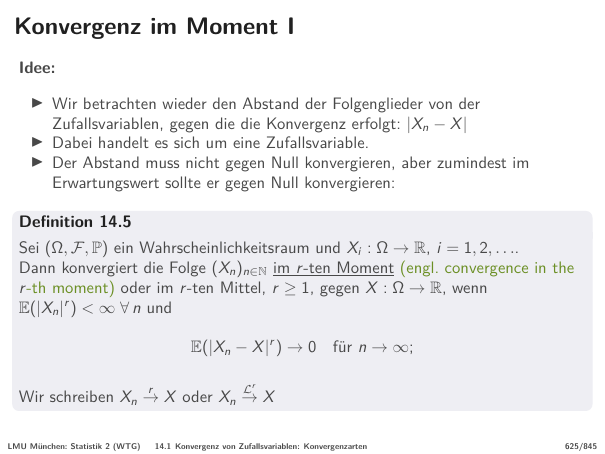

本页放在“模块零：随机变量序列到底怎么收敛”中，核心是理解 概率（Wahrscheinlichkeit）、概率空间（Wahrscheinlichkeitsraum）、随机变量（Zufallsvariable）、期望（Erwartungswert）。直觉上先抓住标题里的对象：收敛（Konvergenz）。然后看它是定义、例子、定理还是证明；定义页要记条件，例子页要看随机机制，证明页要看用了哪些闭包性或极限定理。

关键词：

- 概率（Wahrscheinlichkeit）
- 概率空间（Wahrscheinlichkeitsraum）
- 随机变量（Zufallsvariable）
- 期望（Erwartungswert）
- 收敛（Konvergenz）
- 依概率（in Wahrscheinlichkeit）

本页需要抓住的德语线索：

- `Idee:`
- `Definition 14.5`
- `Sei (Ω, F, P) ein Wahrscheinlichkeitsraum und X : Ω → R, i = 1, 2, . . ..`
- `Dann konvergiert die Folge (X n ) n∈N im r -ten Moment (engl. convergence in the`
- `r -th moment) oder im r -ten Mittel, r ≥ 1, gegen X : Ω → R, wenn`

### Seite 26 - 收敛（Konvergenz）

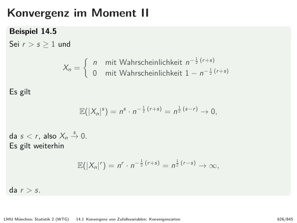

本页放在“模块零：随机变量序列到底怎么收敛”中，核心是理解 概率（Wahrscheinlichkeit）、收敛（Konvergenz）。直觉上先抓住标题里的对象：收敛（Konvergenz）。然后看它是定义、例子、定理还是证明；定义页要记条件，例子页要看随机机制，证明页要看用了哪些闭包性或极限定理。

关键词：

- 概率（Wahrscheinlichkeit）
- 收敛（Konvergenz）

本页需要抓住的德语线索：

- `Beispiel 14.5`
- `Sei r > s ≥ 1 und`
- `X =`
- `Es gilt`
- `E(|X n |s ) = ns · n− 1 2 (r+s) = n 1 2 (s−r) → 0,`

### Seite 27 - 收敛（Konvergenz）

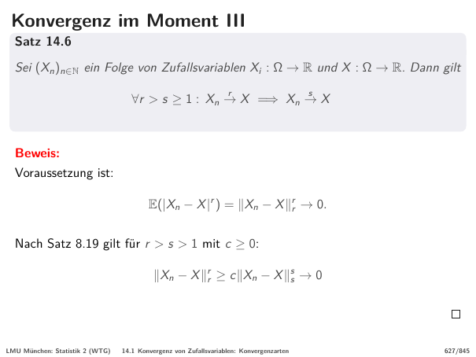

本页放在“模块零：随机变量序列到底怎么收敛”中，核心是理解 随机变量（Zufallsvariable）、收敛（Konvergenz）。直觉上先抓住标题里的对象：收敛（Konvergenz）。然后看它是定义、例子、定理还是证明；定义页要记条件，例子页要看随机机制，证明页要看用了哪些闭包性或极限定理。

关键词：

- 随机变量（Zufallsvariable）
- 收敛（Konvergenz）

本页需要抓住的德语线索：

- `Satz 14.6`
- `Sei (X n ) n∈N ein Folge von Zufallsvariablen X i : Ω → R und X : Ω → R. Dann gilt`
- `∀r > s ≥ 1 : X → X =⇒ X → X`
- `E(|X − X |r ) = ∥X − X ∥r → 0.`
- `Nach Satz 8.19 gilt für r > s > 1 mit c ≥ 0:`

### Seite 28 - 收敛（Konvergenz）

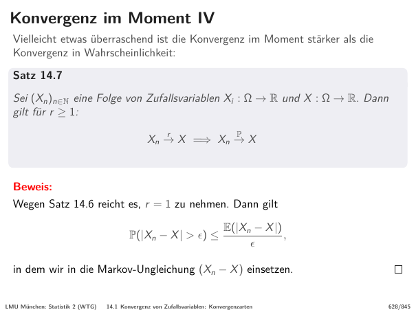

本页放在“模块零：随机变量序列到底怎么收敛”中，核心是理解 概率（Wahrscheinlichkeit）、随机变量（Zufallsvariable）、收敛（Konvergenz）、依概率（in Wahrscheinlichkeit）。直觉上先抓住标题里的对象：收敛（Konvergenz）。然后看它是定义、例子、定理还是证明；定义页要记条件，例子页要看随机机制，证明页要看用了哪些闭包性或极限定理。

关键词：

- 概率（Wahrscheinlichkeit）
- 随机变量（Zufallsvariable）
- 收敛（Konvergenz）
- 依概率（in Wahrscheinlichkeit）

本页需要抓住的德语线索：

- `Satz 14.7`
- `Sei (X n ) n∈N eine Folge von Zufallsvariablen X i : Ω → R und X : Ω → R. Dann`
- `gilt für r ≥ 1:`
- `X → X =⇒ X → X`
- `Wegen Satz 14.6 reicht es, r = 1 zu nehmen. Dann gilt`

### Seite 29 - Zusammenhänge im Überblick I

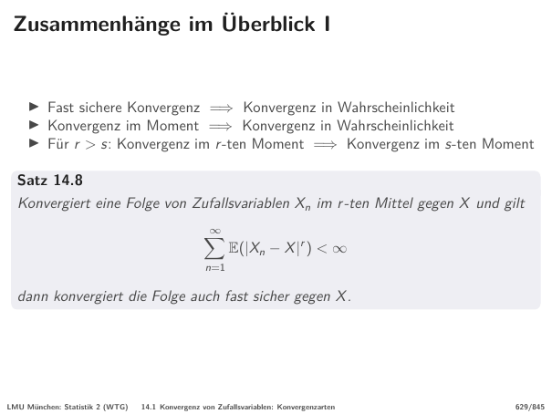

本页放在“模块零：随机变量序列到底怎么收敛”中，核心是理解 概率（Wahrscheinlichkeit）、随机变量（Zufallsvariable）、收敛（Konvergenz）、依概率（in Wahrscheinlichkeit）。直觉上先抓住标题里的对象：Zusammenhänge im Überblick I。然后看它是定义、例子、定理还是证明；定义页要记条件，例子页要看随机机制，证明页要看用了哪些闭包性或极限定理。

关键词：

- 概率（Wahrscheinlichkeit）
- 随机变量（Zufallsvariable）
- 收敛（Konvergenz）
- 依概率（in Wahrscheinlichkeit）

本页需要抓住的德语线索：

- `Fast sichere Konvergenz =⇒ Konvergenz in Wahrscheinlichkeit`
- `Konvergenz im Moment =⇒ Konvergenz in Wahrscheinlichkeit`
- `Für r > s: Konvergenz im r -ten Moment =⇒ Konvergenz im s-ten Moment`
- `Satz 14.8`
- `E(|X − X |r ) < ∞`

### Seite 30 - Zusammenhänge im Überblick II

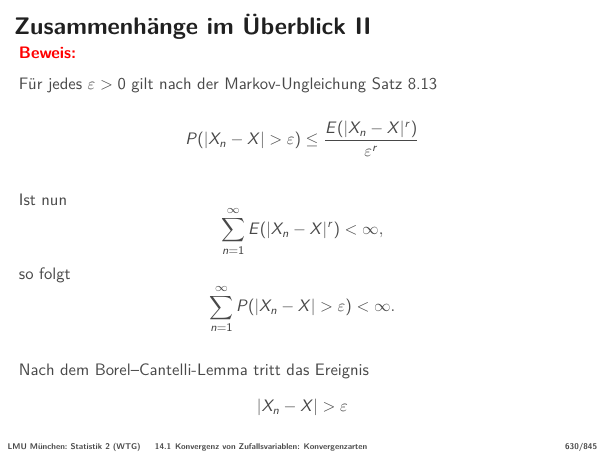

本页放在“模块零：随机变量序列到底怎么收敛”中，主要作用是推进 Seite 1-61 这一段的概念链。先把标题“Zusammenhänge im Überblick II”和前后页联系起来，再区分它是在给定义、展示例子、证明性质，还是做章节过渡。

本页需要抓住的德语线索：

- `Für jedes ε > 0 gilt nach der Markov-Ungleichung Satz 8.13`
- `P(|X − X | > ε) ≤ n`
- `n=1`
- `P(|X − X | > ε) < ∞.`
- `n=1`

### Seite 31 - Zusammenhänge im Überblick III

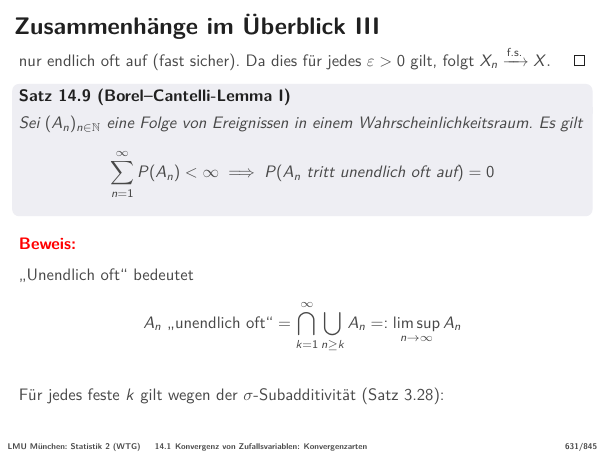

本页放在“模块零：随机变量序列到底怎么收敛”中，核心是理解 概率（Wahrscheinlichkeit）、概率空间（Wahrscheinlichkeitsraum）、事件（Ereignis）、几乎必然（fast sicher）。直觉上先抓住标题里的对象：Zusammenhänge im Überblick III。然后看它是定义、例子、定理还是证明；定义页要记条件，例子页要看随机机制，证明页要看用了哪些闭包性或极限定理。

关键词：

- 概率（Wahrscheinlichkeit）
- 概率空间（Wahrscheinlichkeitsraum）
- 事件（Ereignis）
- 几乎必然（fast sicher）

本页需要抓住的德语线索：

- `nur endlich oft auf (fast sicher). Da dies für jedes ε > 0 gilt, folgt X −−→ X .`
- `Satz 14.9 (Borel–Cantelli-Lemma I)`
- `Sei (A n ) n∈N eine Folge von Ereignissen in einem Wahrscheinlichkeitsraum. Es gilt`
- `P(A ) < ∞ =⇒ P(A tritt unendlich oft auf) = 0`
- `n=1`

### Seite 32 - Zusammenhänge im Überblick IV

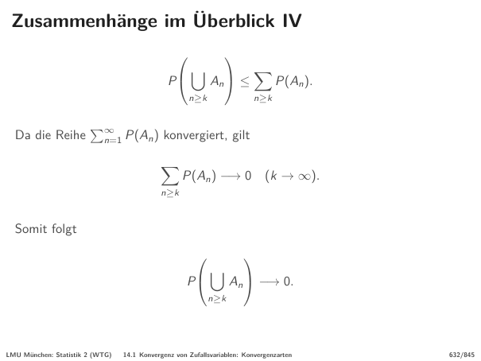

本页放在“模块零：随机变量序列到底怎么收敛”中，主要作用是推进 Seite 1-61 这一段的概念链。先把标题“Zusammenhänge im Überblick IV”和前后页联系起来，再区分它是在给定义、展示例子、证明性质，还是做章节过渡。

本页需要抓住的德语线索：

- `P A n ≤ P(A n ).`
- `n≥k n≥k`
- `P(A ) konvergiert, gilt`
- `n=1 n`
- `P(A ) −→ 0 (k → ∞).`

### Seite 33 - Zusammenhänge im Überblick V

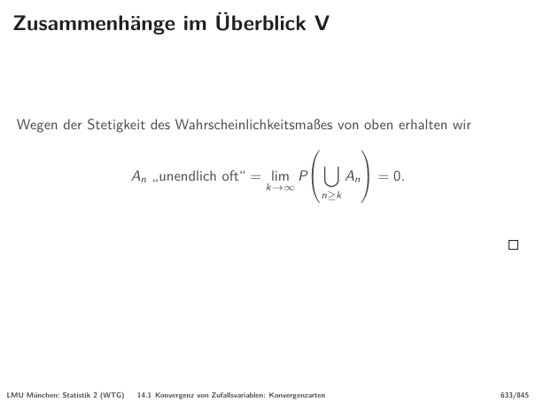

本页放在“模块零：随机变量序列到底怎么收敛”中，核心是理解 概率（Wahrscheinlichkeit）、概率测度（Wahrscheinlichkeitsmaß）。直觉上先抓住标题里的对象：Zusammenhänge im Überblick V。然后看它是定义、例子、定理还是证明；定义页要记条件，例子页要看随机机制，证明页要看用了哪些闭包性或极限定理。

关键词：

- 概率（Wahrscheinlichkeit）
- 概率测度（Wahrscheinlichkeitsmaß）

本页需要抓住的德语线索：

- `A n „unendlich oft“ = lim P A n = 0.`
- `k→∞`
- `n≥k`

### Seite 34 - 随机变量（Zufallsvariablen）

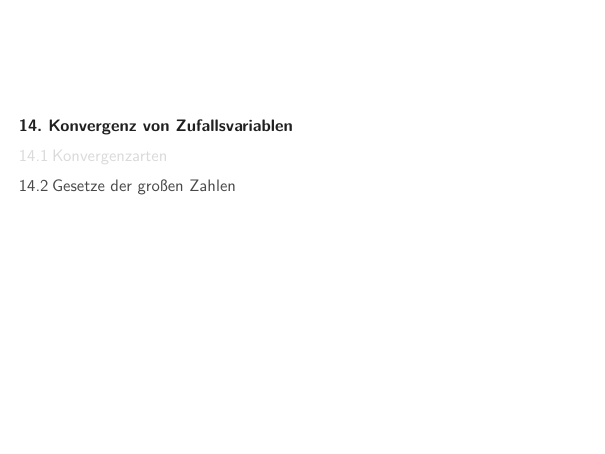

本页放在“模块零：随机变量序列到底怎么收敛”中，核心是理解 随机变量（Zufallsvariable）、收敛（Konvergenz）。直觉上先抓住标题里的对象：随机变量（Zufallsvariablen）。然后看它是定义、例子、定理还是证明；定义页要记条件，例子页要看随机机制，证明页要看用了哪些闭包性或极限定理。

关键词：

- 随机变量（Zufallsvariable）
- 收敛（Konvergenz）

本页需要抓住的德语线索：

- `14. Konvergenz von Zufallsvariablen`
- `14.1 Konvergenzarten`
- `14.2 Gesetze der großen Zahlen`

### Seite 35 - Unabhängig und identisch verteilt I

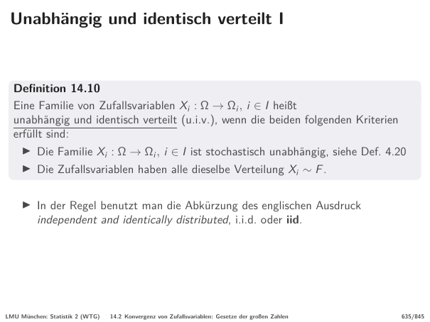

本页放在“模块零：随机变量序列到底怎么收敛”中，核心是理解 随机变量（Zufallsvariable）、分布（Verteilung）。直觉上先抓住标题里的对象：Unabhängig und identisch verteilt I。然后看它是定义、例子、定理还是证明；定义页要记条件，例子页要看随机机制，证明页要看用了哪些闭包性或极限定理。

关键词：

- 随机变量（Zufallsvariable）
- 分布（Verteilung）

本页需要抓住的德语线索：

- `Definition 14.10`
- `Eine Familie von Zufallsvariablen X : Ω → Ω , i ∈ I heißt`
- `Die Familie X : Ω → Ω , i ∈ I ist stochastisch unabhängig, siehe Def. 4.20`

### Seite 36 - Unabhängig und identisch verteilt II

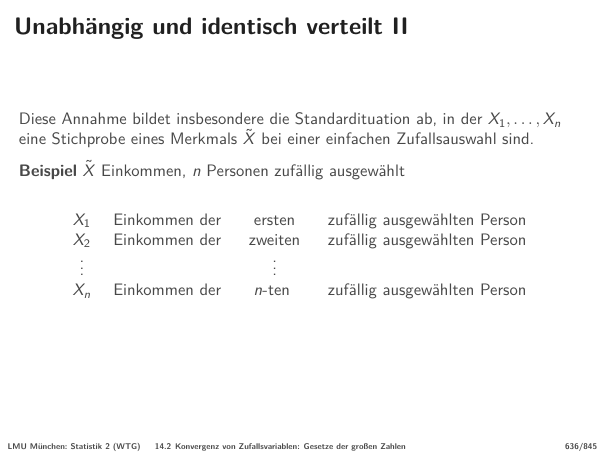

本页放在“模块零：随机变量序列到底怎么收敛”中，主要作用是推进 Seite 1-61 这一段的概念链。先把标题“Unabhängig und identisch verteilt II”和前后页联系起来，再区分它是在给定义、展示例子、证明性质，还是做章节过渡。

本页需要抓住的德语线索：

- `Beispiel X˜ Einkommen, n Personen zufällig ausgewählt`

### Seite 37 - Schwaches Gesetz der großen Zahlen I

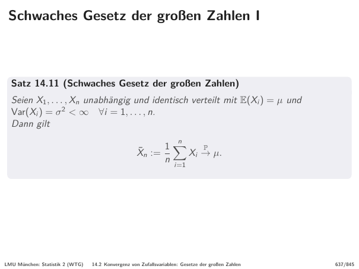

本页放在“模块零：随机变量序列到底怎么收敛”中，主要作用是推进 Seite 1-61 这一段的概念链。先把标题“Schwaches Gesetz der großen Zahlen I”和前后页联系起来，再区分它是在给定义、展示例子、证明性质，还是做章节过渡。

本页需要抓住的德语线索：

- `Satz 14.11 (Schwaches Gesetz der großen Zahlen)`
- `Seien X , . . . , X unabhängig und identisch verteilt mit E(X ) = µ und`
- `Var(X ) = σ2 < ∞ ∀i = 1, . . . , n.`
- `X¯ := 1 X X → P µ.`
- `i=1`

### Seite 38 - Schwaches Gesetz der großen Zahlen II

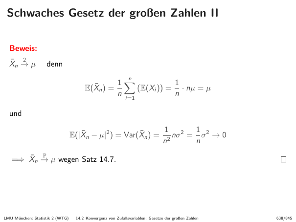

本页放在“模块零：随机变量序列到底怎么收敛”中，主要作用是推进 Seite 1-61 这一段的概念链。先把标题“Schwaches Gesetz der großen Zahlen II”和前后页联系起来，再区分它是在给定义、展示例子、证明性质，还是做章节过渡。

本页需要抓住的德语线索：

- `X¯ → 2 µ denn`
- `E(X¯ ) = 1 X (E(X )) = 1 · nµ = µ`
- `i=1`
- `E(|X¯ − µ|2) = Var(X¯ ) = nσ2 = σ2 → 0`
- `=⇒ X¯ → P µ wegen Satz 14.7.`

### Seite 39 - Schwaches Gesetz der großen Zahlen III

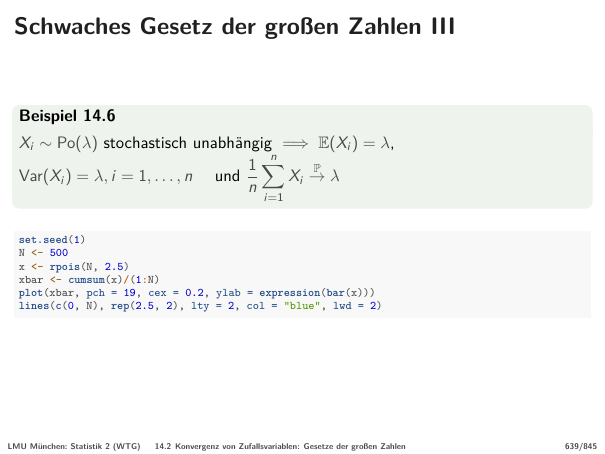

本页放在“模块零：随机变量序列到底怎么收敛”中，主要作用是推进 Seite 1-61 这一段的概念链。先把标题“Schwaches Gesetz der großen Zahlen III”和前后页联系起来，再区分它是在给定义、展示例子、证明性质，还是做章节过渡。

本页需要抓住的德语线索：

- `Beispiel 14.6`
- `X ∼ Po(λ) stochastisch unabhängig =⇒ E(X ) = λ,`
- `Var(X ) = λ, i = 1, . . . , n und X → λ`
- `i=1`
- `plot(xbar, pch = 19, cex = 0.2, ylab = expression(bar(x)))`

### Seite 40 - Schwaches Gesetz der großen Zahlen IV

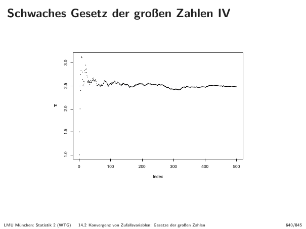

本页放在“模块零：随机变量序列到底怎么收敛”中，主要作用是推进 Seite 1-61 这一段的概念链。先把标题“Schwaches Gesetz der großen Zahlen IV”和前后页联系起来，再区分它是在给定义、展示例子、证明性质，还是做章节过渡。

本页需要抓住的德语线索：

- `Schwaches Gesetz der großen Zahlen IV`
- `0 100 200 300 400 500`
- `0.3`

### Seite 41 - Theorem von Bernoulli I

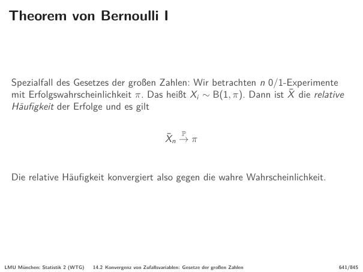

本页放在“模块零：随机变量序列到底怎么收敛”中，核心是理解 概率（Wahrscheinlichkeit）。直觉上先抓住标题里的对象：Theorem von Bernoulli I。然后看它是定义、例子、定理还是证明；定义页要记条件，例子页要看随机机制，证明页要看用了哪些闭包性或极限定理。

关键词：

- 概率（Wahrscheinlichkeit）

本页需要抓住的德语线索：

- `X¯ → P π`

### Seite 42 - Theorem von Bernoulli II

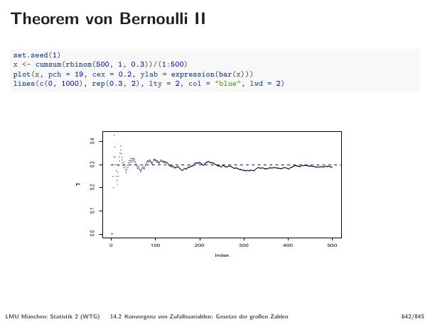

本页放在“模块零：随机变量序列到底怎么收敛”中，主要作用是推进 Seite 1-61 这一段的概念链。先把标题“Theorem von Bernoulli II”和前后页联系起来，再区分它是在给定义、展示例子、证明性质，还是做章节过渡。

本页需要抓住的德语线索：

- `plot(x, pch = 19, cex = 0.2, ylab = expression(bar(x)))`
- `lines(c(0, 1000), rep(0.3, 2), lty = 2, col = "blue", lwd = 2)`

### Seite 43 - Frequentismus

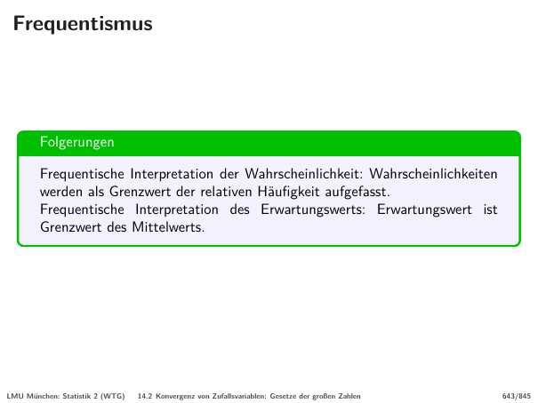

本页放在“模块零：随机变量序列到底怎么收敛”中，核心是理解 概率（Wahrscheinlichkeit）、期望（Erwartungswert）。直觉上先抓住标题里的对象：Frequentismus。然后看它是定义、例子、定理还是证明；定义页要记条件，例子页要看随机机制，证明页要看用了哪些闭包性或极限定理。

关键词：

- 概率（Wahrscheinlichkeit）
- 期望（Erwartungswert）

本页需要抓住的德语线索：

- `Frequentismus`
- `Folgerungen`
- `Frequentische Interpretation der Wahrscheinlichkeit: Wahrscheinlichkeiten`

### Seite 44 - Satz von Khinchine I

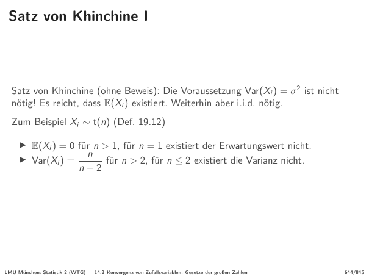

本页放在“模块零：随机变量序列到底怎么收敛”中，核心是理解 期望（Erwartungswert）、方差（Varianz）。直觉上先抓住标题里的对象：Satz von Khinchine I。然后看它是定义、例子、定理还是证明；定义页要记条件，例子页要看随机机制，证明页要看用了哪些闭包性或极限定理。

关键词：

- 期望（Erwartungswert）
- 方差（Varianz）

本页需要抓住的德语线索：

- `Satz von Khinchine I`
- `Satz von Khinchine (ohne Beweis): Die Voraussetzung Var(X ) = σ2 ist nicht`
- `nötig! Es reicht, dass E(X ) existiert. Weiterhin aber i.i.d. nötig.`
- `Zum Beispiel X ∼ t(n) (Def. 19.12)`
- `E(X ) = 0 für n > 1, für n = 1 existiert der Erwartungswert nicht.`

### Seite 45 - Satz von Khinchine II

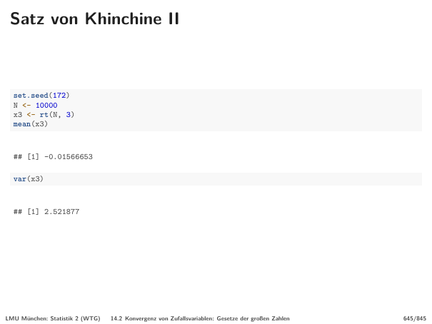

本页放在“模块零：随机变量序列到底怎么收敛”中，主要作用是推进 Seite 1-61 这一段的概念链。先把标题“Satz von Khinchine II”和前后页联系起来，再区分它是在给定义、展示例子、证明性质，还是做章节过渡。

本页需要抓住的德语线索：

- `Satz von Khinchine II`

### Seite 46 - Satz von Khinchine III

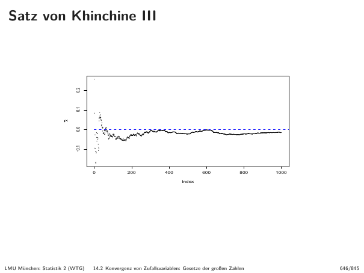

本页放在“模块零：随机变量序列到底怎么收敛”中，主要作用是推进 Seite 1-61 这一段的概念链。先把标题“Satz von Khinchine III”和前后页联系起来，再区分它是在给定义、展示例子、证明性质，还是做章节过渡。

本页需要抓住的德语线索：

- `Satz von Khinchine III`

### Seite 47 - Satz von Khinchine IV

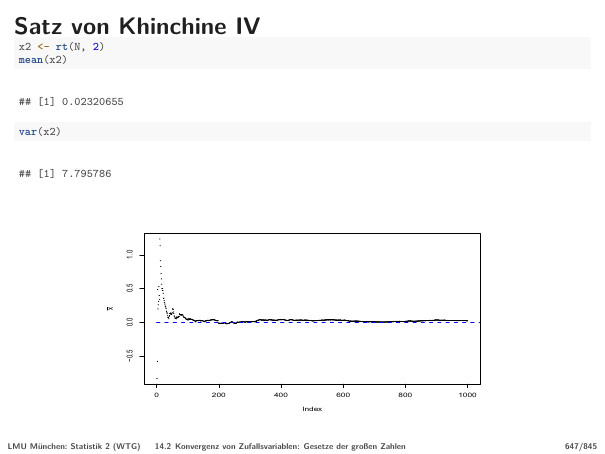

本页放在“模块零：随机变量序列到底怎么收敛”中，主要作用是推进 Seite 1-61 这一段的概念链。先把标题“Satz von Khinchine IV”和前后页联系起来，再区分它是在给定义、展示例子、证明性质，还是做章节过渡。

本页需要抓住的德语线索：

- `Satz von Khinchine IV`

### Seite 48 - Gegenbeispiel I

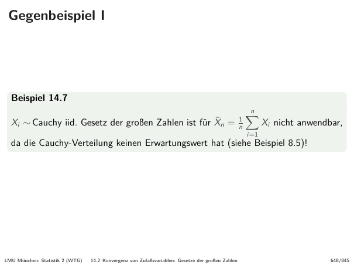

本页放在“模块零：随机变量序列到底怎么收敛”中，核心是理解 分布（Verteilung）、期望（Erwartungswert）、Cauchy 分布（Cauchy）。直觉上先抓住标题里的对象：Gegenbeispiel I。然后看它是定义、例子、定理还是证明；定义页要记条件，例子页要看随机机制，证明页要看用了哪些闭包性或极限定理。

关键词：

- 分布（Verteilung）
- 期望（Erwartungswert）
- Cauchy 分布（Cauchy）

本页需要抓住的德语线索：

- `Beispiel 14.7`
- `X ∼ Cauchy iid. Gesetz der großen Zahlen ist für X¯ = 1 X X nicht anwendbar,`
- `i=1`
- `da die Cauchy-Verteilung keinen Erwartungswert hat (siehe Beispiel 8.5)!`

### Seite 49 - Gegenbeispiel II

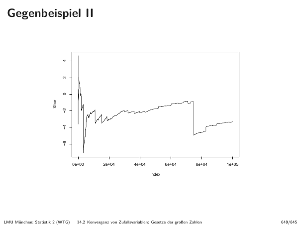

本页放在“模块零：随机变量序列到底怎么收敛”中，主要作用是推进 Seite 1-61 这一段的概念链。先把标题“Gegenbeispiel II”和前后页联系起来，再区分它是在给定义、展示例子、证明性质，还是做章节过渡。

本页需要抓住的德语线索：

- `Gegenbeispiel II`
- `0e+00 2e+04 4e+04 6e+04 8e+04 1e+05`
- `4`

### Seite 50 - Starkes Gesetz der großen Zahlen I

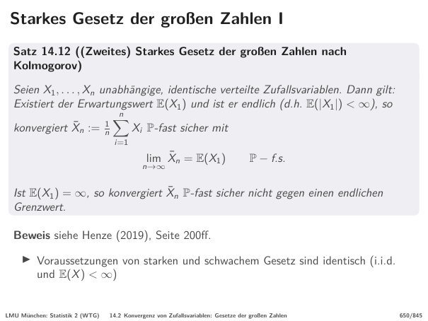

本页放在“模块零：随机变量序列到底怎么收敛”中，核心是理解 随机变量（Zufallsvariable）、期望（Erwartungswert）、几乎必然（fast sicher）。直觉上先抓住标题里的对象：Starkes Gesetz der großen Zahlen I。然后看它是定义、例子、定理还是证明；定义页要记条件，例子页要看随机机制，证明页要看用了哪些闭包性或极限定理。

关键词：

- 随机变量（Zufallsvariable）
- 期望（Erwartungswert）
- 几乎必然（fast sicher）

本页需要抓住的德语线索：

- `Satz 14.12 ((Zweites) Starkes Gesetz der großen Zahlen nach`
- `Existiert der Erwartungswert E(X ) und ist er endlich (d.h. E(|X |) < ∞), so`
- `konvergiert X¯ := 1 X X P-fast sicher mit`
- `i=1`
- `lim X¯ = E(X ) P − f.s.`

### Seite 51 - Monte-Carlo-Verfahren I

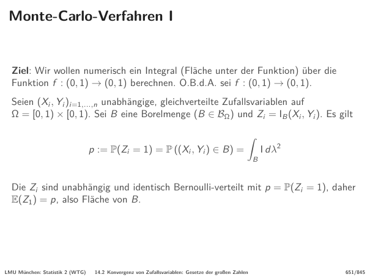

本页放在“模块零：随机变量序列到底怎么收敛”中，核心是理解 随机变量（Zufallsvariable）。直觉上先抓住标题里的对象：Monte-Carlo-Verfahren I。然后看它是定义、例子、定理还是证明；定义页要记条件，例子页要看随机机制，证明页要看用了哪些闭包性或极限定理。

关键词：

- 随机变量（Zufallsvariable）

本页需要抓住的德语线索：

- `Ziel: Wir wollen numerisch ein Integral (Fläche unter der Funktion) über die`
- `Funktion f : (0, 1) → (0, 1) berechnen. O.B.d.A. sei f : (0, 1) → (0, 1).`
- `i i i=1,...,n`
- `Ω = [0, 1) × [0, 1). Sei B eine Borelmenge (B ∈ B ) und Z = I (X , Y ). Es gilt`
- `p := P(Z = 1) = P ((X , Y ) ∈ B) = I dλ2`

### Seite 52 - Monte-Carlo-Verfahren II

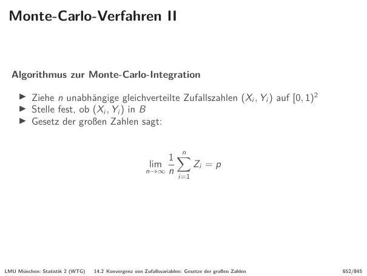

本页放在“模块零：随机变量序列到底怎么收敛”中，主要作用是推进 Seite 1-61 这一段的概念链。先把标题“Monte-Carlo-Verfahren II”和前后页联系起来，再区分它是在给定义、展示例子、证明性质，还是做章节过渡。

本页需要抓住的德语线索：

- `lim Z = p`
- `n→∞ n i`
- `i=1`

### Seite 53 - Monte-Carlo-Verfahren III

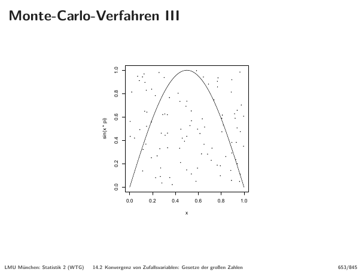

本页放在“模块零：随机变量序列到底怎么收敛”中，主要作用是推进 Seite 1-61 这一段的概念链。先把标题“Monte-Carlo-Verfahren III”和前后页联系起来，再区分它是在给定义、展示例子、证明性质，还是做章节过渡。

本页需要抓住的德语线索：

- `Monte-Carlo-Verfahren III`
- `0.0 0.2 0.4 0.6 0.8 1.0`
- `0.1`

### Seite 54 - Monte-Carlo-Verfahren IV

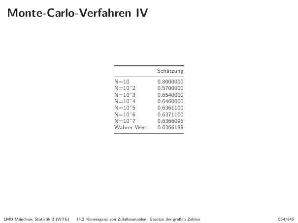

本页放在“模块零：随机变量序列到底怎么收敛”中，主要作用是推进 Seite 1-61 这一段的概念链。先把标题“Monte-Carlo-Verfahren IV”和前后页联系起来，再区分它是在给定义、展示例子、证明性质，还是做章节过渡。

本页需要抓住的德语线索：

- `N=10 0.8000000`
- `N=10ˆ2 0.5700000`
- `N=10ˆ3 0.6540000`
- `N=10ˆ4 0.6460000`
- `N=10ˆ5 0.6361100`

### Seite 55 - 大数定律（Gesetze der großen Zahlen）

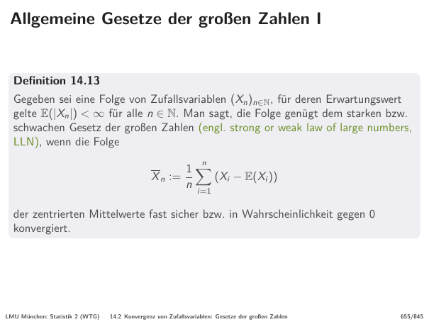

本页放在“模块零：随机变量序列到底怎么收敛”中，核心是理解 随机变量（Zufallsvariable）、期望（Erwartungswert）。直觉上先抓住标题里的对象：大数定律（Gesetze der großen Zahlen）。然后看它是定义、例子、定理还是证明；定义页要记条件，例子页要看随机机制，证明页要看用了哪些闭包性或极限定理。

关键词：

- 随机变量（Zufallsvariable）
- 期望（Erwartungswert）

本页需要抓住的德语线索：

- `Definition 14.13`
- `) n∈N, für deren Erwartungswert`
- `gelte E(|X |) < ∞ für alle n ∈ N. Man sagt, die Folge genügt dem starken bzw.`
- `X := (X − E(X ))`
- `i=1`

### Seite 56 - 大数定律（Gesetze der großen Zahlen）

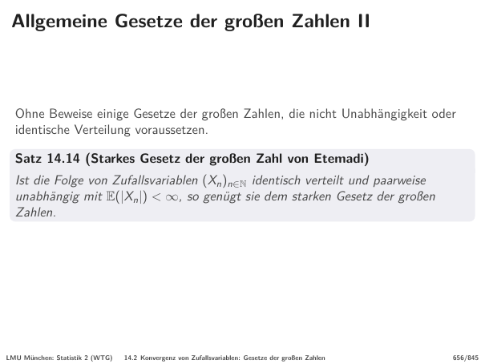

本页放在“模块零：随机变量序列到底怎么收敛”中，核心是理解 随机变量（Zufallsvariable）、分布（Verteilung）、独立性（Unabhängigkeit）。直觉上先抓住标题里的对象：大数定律（Gesetze der großen Zahlen）。然后看它是定义、例子、定理还是证明；定义页要记条件，例子页要看随机机制，证明页要看用了哪些闭包性或极限定理。

关键词：

- 随机变量（Zufallsvariable）
- 分布（Verteilung）
- 独立性（Unabhängigkeit）

本页需要抓住的德语线索：

- `Satz 14.14 (Starkes Gesetz der großen Zahl von Etemadi)`
- `Ist die Folge von Zufallsvariablen (X n ) n∈N identisch verteilt und paarweise`
- `unabhängig mit E(|X |) < ∞, so genügt sie dem starken Gesetz der großen`

### Seite 57 - 大数定律（Gesetze der großen Zahlen）

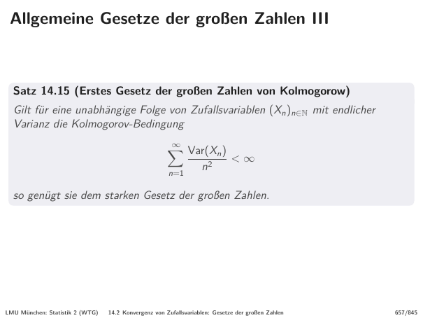

本页放在“模块零：随机变量序列到底怎么收敛”中，核心是理解 随机变量（Zufallsvariable）、方差（Varianz）。直觉上先抓住标题里的对象：大数定律（Gesetze der großen Zahlen）。然后看它是定义、例子、定理还是证明；定义页要记条件，例子页要看随机机制，证明页要看用了哪些闭包性或极限定理。

关键词：

- 随机变量（Zufallsvariable）
- 方差（Varianz）

本页需要抓住的德语线索：

- `Satz 14.15 (Erstes Gesetz der großen Zahlen von Kolmogorow)`
- `Gilt für eine unabhängige Folge von Zufallsvariablen (X n ) n∈N mit endlicher`
- `X Var(X n ) < ∞`
- `n=1`

### Seite 58 - 大数定律（Gesetze der großen Zahlen）

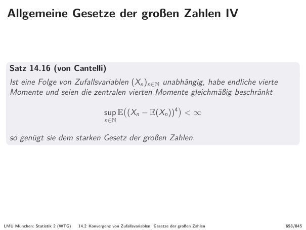

本页放在“模块零：随机变量序列到底怎么收敛”中，核心是理解 随机变量（Zufallsvariable）。直觉上先抓住标题里的对象：大数定律（Gesetze der großen Zahlen）。然后看它是定义、例子、定理还是证明；定义页要记条件，例子页要看随机机制，证明页要看用了哪些闭包性或极限定理。

关键词：

- 随机变量（Zufallsvariable）

本页需要抓住的德语线索：

- `Satz 14.16 (von Cantelli)`
- `Ist eine Folge von Zufallsvariablen (X n ) n∈N unabhängig, habe endliche vierte`
- `sup E(cid:0) (X − E(X ))4(cid:1) < ∞`
- `n∈N`

### Seite 59 - 大数定律（Gesetze der großen Zahlen）

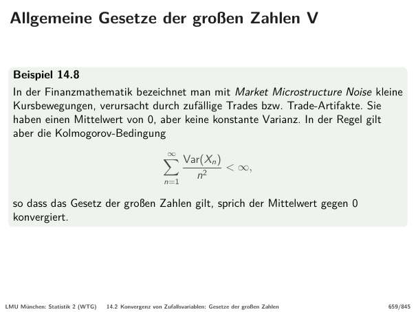

本页放在“模块零：随机变量序列到底怎么收敛”中，核心是理解 方差（Varianz）。直觉上先抓住标题里的对象：大数定律（Gesetze der großen Zahlen）。然后看它是定义、例子、定理还是证明；定义页要记条件，例子页要看随机机制，证明页要看用了哪些闭包性或极限定理。

关键词：

- 方差（Varianz）

本页需要抓住的德语线索：

- `Beispiel 14.8`
- `X Var(X n ) < ∞,`
- `n=1`

### Seite 60 - 大数定律（Gesetze der großen Zahlen）

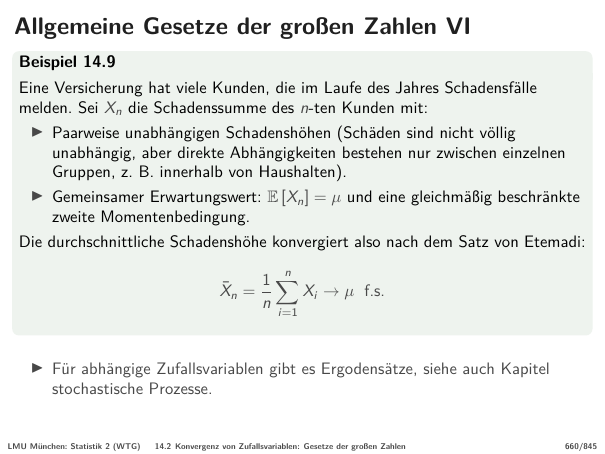

本页放在“模块零：随机变量序列到底怎么收敛”中，核心是理解 期望（Erwartungswert）。直觉上先抓住标题里的对象：大数定律（Gesetze der großen Zahlen）。然后看它是定义、例子、定理还是证明；定义页要记条件，例子页要看随机机制，证明页要看用了哪些闭包性或极限定理。

关键词：

- 期望（Erwartungswert）

本页需要抓住的德语线索：

- `Beispiel 14.9`
- `Gemeinsamer Erwartungswert: E [X ] = µ und eine gleichmäßig beschränkte`
- `Die durchschnittliche Schadenshöhe konvergiert also nach dem Satz von Etemadi:`
- `X¯ = 1 X X → µ f.s.`
- `i=1`

### Seite 61 - Multivariates Gesetz der großen Zahlen

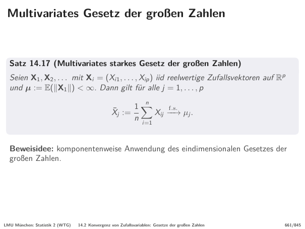

本页放在“模块零：随机变量序列到底怎么收敛”中，主要作用是推进 Seite 1-61 这一段的概念链。先把标题“Multivariates Gesetz der großen Zahlen”和前后页联系起来，再区分它是在给定义、展示例子、证明性质，还是做章节过渡。

本页需要抓住的德语线索：

- `Satz 14.17 (Multivariates starkes Gesetz der großen Zahlen)`
- `Seien X , X , . . . mit X = (X , . . . , X ) iid reelwertige Zufallsvektoren auf Rp`
- `und µ := E(∥X ∥) < ∞. Dann gilt für alle j = 1, . . . , p`
- `X¯ := 1 X X − f − . → s. µ .`
- `i=1`

## 模块一：分布收敛关注分布形状的极限（Seite 62-105）

有时候随机变量本身不需要靠近某个变量，只要它们的分布越来越像目标分布。中心极限定理就是典型：标准化样本和的分布趋近正态。

### Seite 62 - 分布收敛（Verteilungskonvergenz）

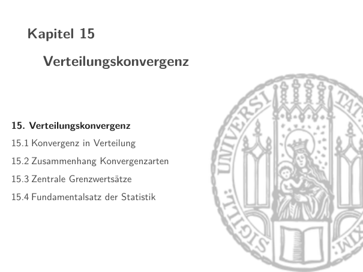

本页可识别的嵌入图片裁切：

本页放在“模块一：分布收敛关注分布形状的极限”中，核心是理解 分布（Verteilung）、收敛（Konvergenz）、依分布（in Verteilung）。直觉上先抓住标题里的对象：分布收敛（Verteilungskonvergenz）。然后看它是定义、例子、定理还是证明；定义页要记条件，例子页要看随机机制，证明页要看用了哪些闭包性或极限定理。

关键词：

- 分布（Verteilung）
- 收敛（Konvergenz）
- 依分布（in Verteilung）

本页需要抓住的德语线索：

- `Kapitel 15`
- `Verteilungskonvergenz`
- `15. Verteilungskonvergenz`

### Seite 63 - 分布收敛（Verteilungskonvergenz）

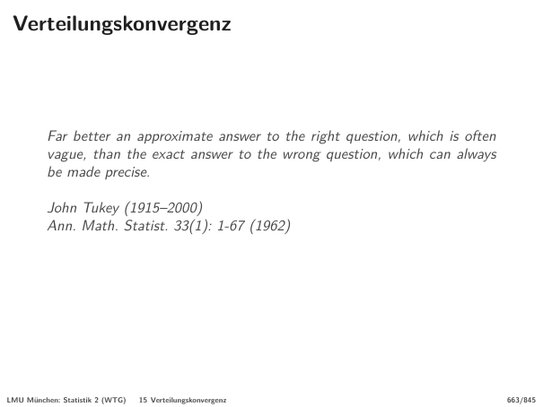

本页放在“模块一：分布收敛关注分布形状的极限”中，核心是理解 分布（Verteilung）。直觉上先抓住标题里的对象：分布收敛（Verteilungskonvergenz）。然后看它是定义、例子、定理还是证明；定义页要记条件，例子页要看随机机制，证明页要看用了哪些闭包性或极限定理。

关键词：

- 分布（Verteilung）

本页需要抓住的德语线索：

- `Verteilungskonvergenz`
- `Far better an approximate answer to the right question, which is often`
- `vague, than the exact answer to the wrong question, which can always`

### Seite 64 - 分布收敛（Verteilungskonvergenz）

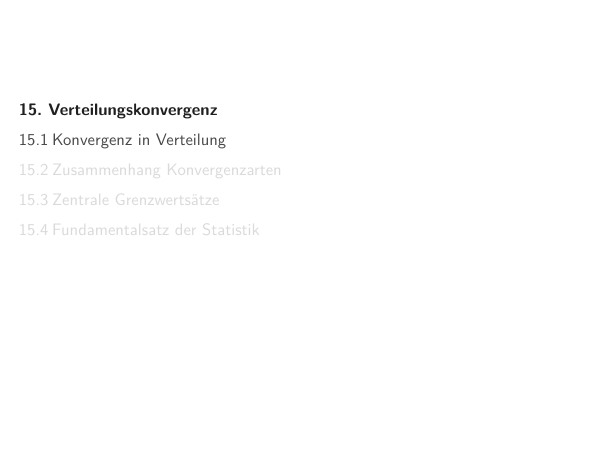

本页放在“模块一：分布收敛关注分布形状的极限”中，核心是理解 分布（Verteilung）、收敛（Konvergenz）、依分布（in Verteilung）。直觉上先抓住标题里的对象：分布收敛（Verteilungskonvergenz）。然后看它是定义、例子、定理还是证明；定义页要记条件，例子页要看随机机制，证明页要看用了哪些闭包性或极限定理。

关键词：

- 分布（Verteilung）
- 收敛（Konvergenz）
- 依分布（in Verteilung）

本页需要抓住的德语线索：

- `15. Verteilungskonvergenz`
- `15.1 Konvergenz in Verteilung`
- `15.2 Zusammenhang Konvergenzarten`

### Seite 65 - 分布（Verteilung）

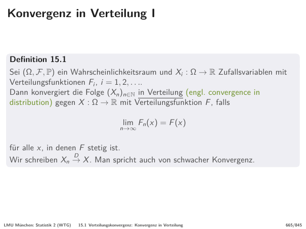

本页放在“模块一：分布收敛关注分布形状的极限”中，核心是理解 概率（Wahrscheinlichkeit）、概率空间（Wahrscheinlichkeitsraum）、随机变量（Zufallsvariable）、分布（Verteilung）。直觉上先抓住标题里的对象：分布（Verteilung）。然后看它是定义、例子、定理还是证明；定义页要记条件，例子页要看随机机制，证明页要看用了哪些闭包性或极限定理。

关键词：

- 概率（Wahrscheinlichkeit）
- 概率空间（Wahrscheinlichkeitsraum）
- 随机变量（Zufallsvariable）
- 分布（Verteilung）
- 分布函数（Verteilungsfunktion）
- 收敛（Konvergenz）
- 依概率（in Wahrscheinlichkeit）
- 依分布（in Verteilung）

本页需要抓住的德语线索：

- `Definition 15.1`
- `Sei (Ω, F, P) ein Wahrscheinlichkeitsraum und X : Ω → R Zufallsvariablen mit`
- `Verteilungsfunktionen F , i = 1, 2, . . ..`
- `Dann konvergiert die Folge (X n ) n∈N in Verteilung (engl. convergence in`
- `distribution) gegen X : Ω → R mit Verteilungsfunktion F , falls`

### Seite 66 - 分布（Verteilung）

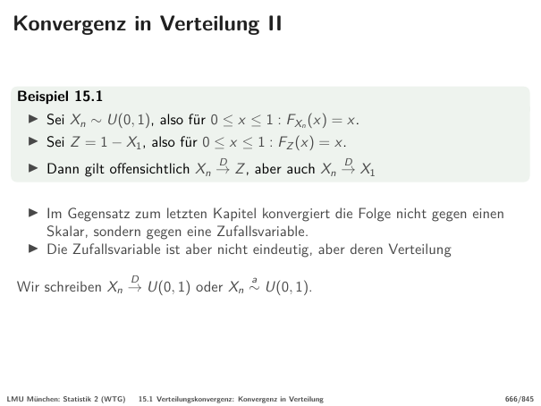

本页放在“模块一：分布收敛关注分布形状的极限”中，核心是理解 随机变量（Zufallsvariable）、分布（Verteilung）、收敛（Konvergenz）、依分布（in Verteilung）。直觉上先抓住标题里的对象：分布（Verteilung）。然后看它是定义、例子、定理还是证明；定义页要记条件，例子页要看随机机制，证明页要看用了哪些闭包性或极限定理。

关键词：

- 随机变量（Zufallsvariable）
- 分布（Verteilung）
- 收敛（Konvergenz）
- 依分布（in Verteilung）

本页需要抓住的德语线索：

- `Beispiel 15.1`
- `Sei X ∼ U(0, 1), also für 0 ≤ x ≤ 1 : F (x ) = x .`
- `Sei Z = 1 − X , also für 0 ≤ x ≤ 1 : F (x ) = x .`
- `Dann gilt offensichtlich X → Z , aber auch X → X`
- `Wir schreiben X → U(0, 1) oder X ∼ U(0, 1).`

### Seite 67 - Poisson 分布（Poisson）

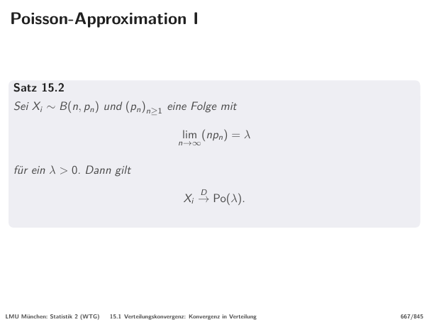

本页放在“模块一：分布收敛关注分布形状的极限”中，核心是理解 Poisson 分布（Poisson）。直觉上先抓住标题里的对象：Poisson 分布（Poisson）。然后看它是定义、例子、定理还是证明；定义页要记条件，例子页要看随机机制，证明页要看用了哪些闭包性或极限定理。

关键词：

- Poisson 分布（Poisson）

本页需要抓住的德语线索：

- `Satz 15.2`
- `i n n n≥1`
- `lim (np ) = λ`
- `n→∞`
- `X → Po(λ).`

### Seite 68 - Poisson 分布（Poisson）

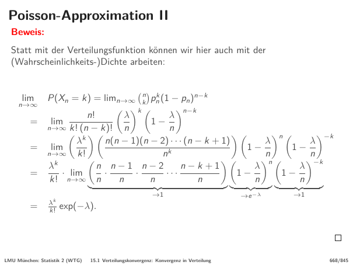

本页放在“模块一：分布收敛关注分布形状的极限”中，核心是理解 概率（Wahrscheinlichkeit）、分布（Verteilung）、分布函数（Verteilungsfunktion）、密度（Dichte）。直觉上先抓住标题里的对象：Poisson 分布（Poisson）。然后看它是定义、例子、定理还是证明；定义页要记条件，例子页要看随机机制，证明页要看用了哪些闭包性或极限定理。

关键词：

- 概率（Wahrscheinlichkeit）
- 分布（Verteilung）
- 分布函数（Verteilungsfunktion）
- 密度（Dichte）
- Poisson 分布（Poisson）

本页需要抓住的德语线索：

- `lim P(X = k) = lim (cid:0)n(cid:1) pk (1 − p )n−k`
- `n→∞ n n→∞ k n n`
- `= lim 1 −`
- `n→∞ k! (n − k)! n n`
- `= lim 1 − 1 −`

### Seite 69 - Poisson 分布（Poisson）

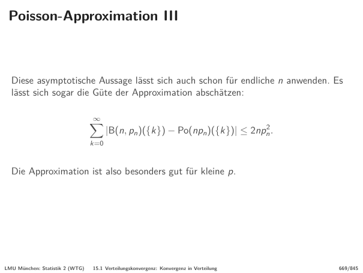

本页放在“模块一：分布收敛关注分布形状的极限”中，核心是理解 Poisson 分布（Poisson）。直觉上先抓住标题里的对象：Poisson 分布（Poisson）。然后看它是定义、例子、定理还是证明；定义页要记条件，例子页要看随机机制，证明页要看用了哪些闭包性或极限定理。

关键词：

- Poisson 分布（Poisson）

本页需要抓住的德语线索：

- `|B(n, p )({k}) − Po(np )({k})| ≤ 2np2.`
- `k=0`

### Seite 70 - Poisson 分布（Poisson）

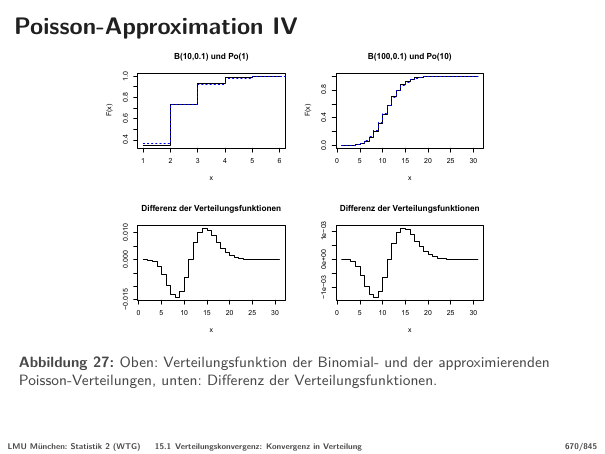

本页放在“模块一：分布收敛关注分布形状的极限”中，核心是理解 Poisson 分布（Poisson）。直觉上先抓住标题里的对象：Poisson 分布（Poisson）。然后看它是定义、例子、定理还是证明；定义页要记条件，例子页要看随机机制，证明页要看用了哪些闭包性或极限定理。

关键词：

- Poisson 分布（Poisson）

本页需要抓住的德语线索：

- `Poisson-Approximation IV`
- `1 2 3 4 5 6`
- `0.1`

### Seite 71 - 分布收敛（Verteilungskonvergenz）

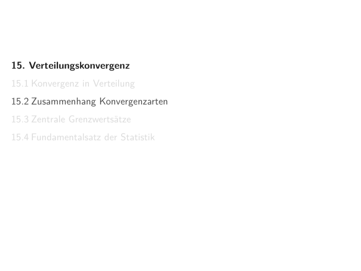

本页放在“模块一：分布收敛关注分布形状的极限”中，核心是理解 分布（Verteilung）、收敛（Konvergenz）、依分布（in Verteilung）。直觉上先抓住标题里的对象：分布收敛（Verteilungskonvergenz）。然后看它是定义、例子、定理还是证明；定义页要记条件，例子页要看随机机制，证明页要看用了哪些闭包性或极限定理。

关键词：

- 分布（Verteilung）
- 收敛（Konvergenz）
- 依分布（in Verteilung）

本页需要抓住的德语线索：

- `15. Verteilungskonvergenz`
- `15.1 Konvergenz in Verteilung`
- `15.2 Zusammenhang Konvergenzarten`

### Seite 72 - 收敛类型（Konvergenzarten）

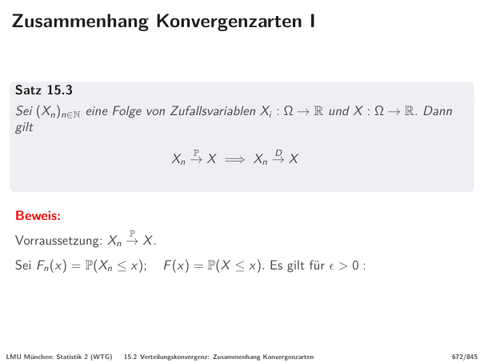

本页放在“模块一：分布收敛关注分布形状的极限”中，核心是理解 随机变量（Zufallsvariable）、收敛（Konvergenz）。直觉上先抓住标题里的对象：收敛类型（Konvergenzarten）。然后看它是定义、例子、定理还是证明；定义页要记条件，例子页要看随机机制，证明页要看用了哪些闭包性或极限定理。

关键词：

- 随机变量（Zufallsvariable）
- 收敛（Konvergenz）

本页需要抓住的德语线索：

- `Satz 15.3`
- `Sei (X n ) n∈N eine Folge von Zufallsvariablen X i : Ω → R und X : Ω → R. Dann`
- `X → X =⇒ X → X`
- `Vorraussetzung: X → X .`
- `Sei F (x ) = P(X ≤ x ); F (x ) = P(X ≤ x ). Es gilt für ϵ > 0 :`

### Seite 73 - 收敛类型（Konvergenzarten）

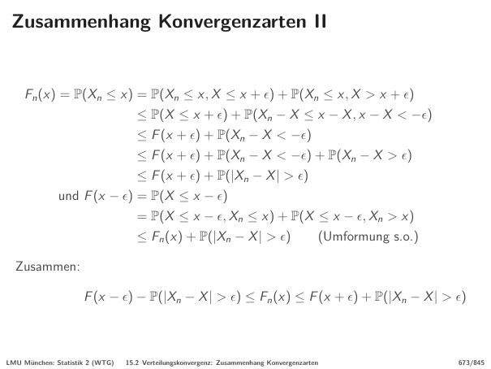

本页放在“模块一：分布收敛关注分布形状的极限”中，核心是理解 收敛（Konvergenz）。直觉上先抓住标题里的对象：收敛类型（Konvergenzarten）。然后看它是定义、例子、定理还是证明；定义页要记条件，例子页要看随机机制，证明页要看用了哪些闭包性或极限定理。

关键词：

- 收敛（Konvergenz）

本页需要抓住的德语线索：

- `F (x ) = P(X ≤ x ) = P(X ≤ x , X ≤ x + ϵ) + P(X ≤ x , X > x + ϵ)`
- `≤ P(X ≤ x + ϵ) + P(X − X ≤ x − X , x − X < −ϵ)`
- `≤ F (x + ϵ) + P(X − X < −ϵ)`
- `≤ F (x + ϵ) + P(X − X < −ϵ) + P(X − X > ϵ)`
- `≤ F (x + ϵ) + P(|X − X | > ϵ)`

### Seite 74 - 收敛类型（Konvergenzarten）

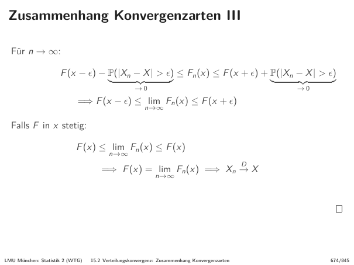

本页放在“模块一：分布收敛关注分布形状的极限”中，核心是理解 收敛（Konvergenz）。直觉上先抓住标题里的对象：收敛类型（Konvergenzarten）。然后看它是定义、例子、定理还是证明；定义页要记条件，例子页要看随机机制，证明页要看用了哪些闭包性或极限定理。

关键词：

- 收敛（Konvergenz）

本页需要抓住的德语线索：

- `Für n → ∞:`
- `F (x − ϵ) − P(|X − X | > ϵ) ≤ F (x ) ≤ F (x + ϵ) + P(|X − X | > ϵ)`
- `→ 0 → 0`
- `=⇒ F (x − ϵ) ≤ lim F (x ) ≤ F (x + ϵ)`
- `n→∞`

### Seite 75 - 收敛类型（Konvergenzarten）

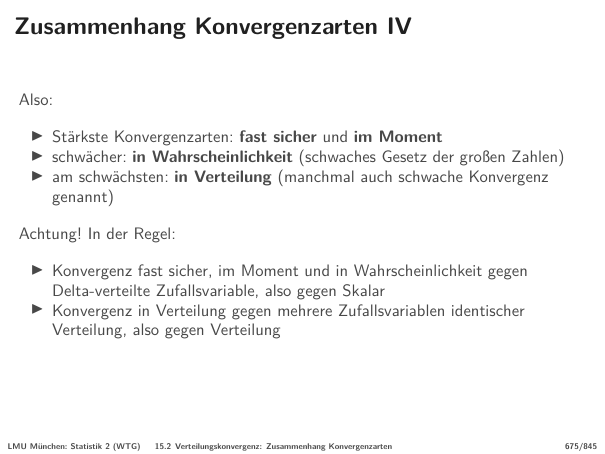

本页放在“模块一：分布收敛关注分布形状的极限”中，核心是理解 概率（Wahrscheinlichkeit）、随机变量（Zufallsvariable）、分布（Verteilung）、收敛（Konvergenz）。直觉上先抓住标题里的对象：收敛类型（Konvergenzarten）。然后看它是定义、例子、定理还是证明；定义页要记条件，例子页要看随机机制，证明页要看用了哪些闭包性或极限定理。

关键词：

- 概率（Wahrscheinlichkeit）
- 随机变量（Zufallsvariable）
- 分布（Verteilung）
- 收敛（Konvergenz）
- 几乎必然（fast sicher）
- 依概率（in Wahrscheinlichkeit）
- 依分布（in Verteilung）

本页需要抓住的德语线索：

- `Zusammenhang Konvergenzarten IV`
- `Also:`
- `Stärkste Konvergenzarten: fast sicher und im Moment`

### Seite 76 - Satz von Slutsky I

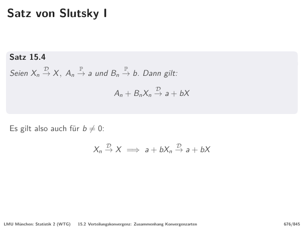

本页放在“模块一：分布收敛关注分布形状的极限”中，主要作用是推进 Seite 62-105 这一段的概念链。先把标题“Satz von Slutsky I”和前后页联系起来，再区分它是在给定义、展示例子、证明性质，还是做章节过渡。

本页需要抓住的德语线索：

- `Satz von Slutsky I`
- `Satz 15.4`
- `Seien X → X , A → a und B → b. Dann gilt:`
- `A + B X → a + bX`
- `Es gilt also auch für b ̸= 0:`

### Seite 77 - Satz von Slutsky II

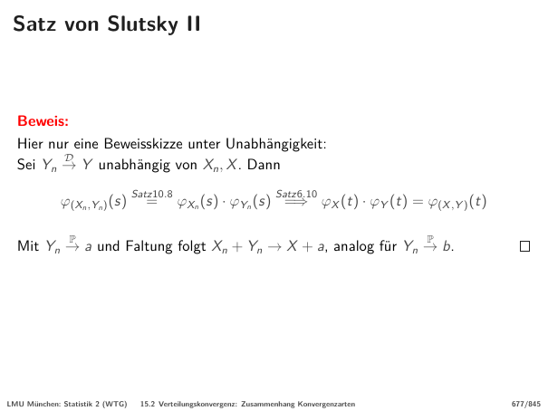

本页放在“模块一：分布收敛关注分布形状的极限”中，核心是理解 独立性（Unabhängigkeit）。直觉上先抓住标题里的对象：Satz von Slutsky II。然后看它是定义、例子、定理还是证明；定义页要记条件，例子页要看随机机制，证明页要看用了哪些闭包性或极限定理。

关键词：

- 独立性（Unabhängigkeit）

本页需要抓住的德语线索：

- `Satz von Slutsky II`
- `Sei Y → Y unabhängig von X , X . Dann`
- `Satz10.8 Satz6.10`
- `φ (s) = φ (s) · φ (s) =⇒ φ (t) · φ (t) = φ (t)`
- `Mit Y → a und Faltung folgt X + Y → X + a, analog für Y → b.`

### Seite 78 - Satz von Slutsky III

本页可识别的嵌入图片裁切：

本页放在“模块一：分布收敛关注分布形状的极限”中，主要作用是推进 Seite 62-105 这一段的概念链。先把标题“Satz von Slutsky III”和前后页联系起来，再区分它是在给定义、展示例子、证明性质，还是做章节过渡。

本页需要抓住的德语线索：

- `Satz von Slutsky III`

### Seite 79 - 分布收敛（Verteilungskonvergenz）

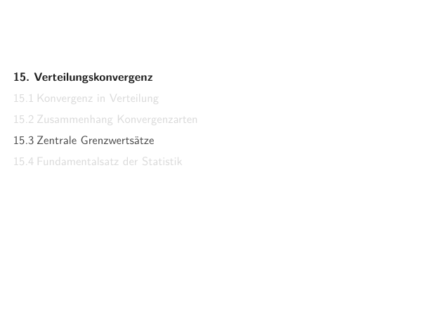

本页放在“模块一：分布收敛关注分布形状的极限”中，核心是理解 分布（Verteilung）、收敛（Konvergenz）、依分布（in Verteilung）。直觉上先抓住标题里的对象：分布收敛（Verteilungskonvergenz）。然后看它是定义、例子、定理还是证明；定义页要记条件，例子页要看随机机制，证明页要看用了哪些闭包性或极限定理。

关键词：

- 分布（Verteilung）
- 收敛（Konvergenz）
- 依分布（in Verteilung）

本页需要抓住的德语线索：

- `15. Verteilungskonvergenz`
- `15.1 Konvergenz in Verteilung`
- `15.2 Zusammenhang Konvergenzarten`

### Seite 80 - 极限定理（Grenzwertsatz）

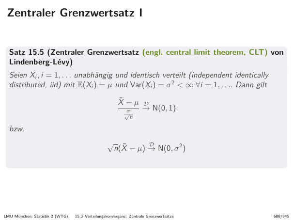

本页放在“模块一：分布收敛关注分布形状的极限”中，核心是理解 极限定理（Grenzwertsatz）。直觉上先抓住标题里的对象：极限定理（Grenzwertsatz）。然后看它是定义、例子、定理还是证明；定义页要记条件，例子页要看随机机制，证明页要看用了哪些闭包性或极限定理。

关键词：

- 极限定理（Grenzwertsatz）

本页需要抓住的德语线索：

- `Satz 15.5 (Zentraler Grenzwertsatz (engl. central limit theorem, CLT) von`
- `Seien X , i = 1, . . . unabhängig und identisch verteilt (independent identically`
- `distributed, iid) mit E(X ) = µ und Var(X ) = σ2 < ∞ ∀i = 1, . . .. Dann gilt`
- `→ N(0, 1)`
- `n(X¯ − µ) → D N(0, σ2)`

### Seite 81 - 极限定理（Grenzwertsatz）

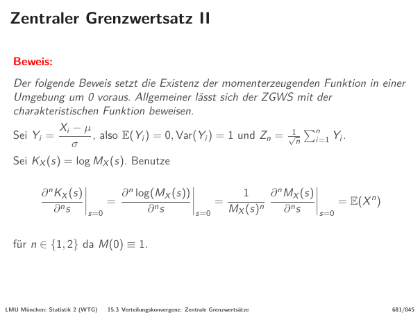

本页放在“模块一：分布收敛关注分布形状的极限”中，核心是理解 极限定理（Grenzwertsatz）。直觉上先抓住标题里的对象：极限定理（Grenzwertsatz）。然后看它是定义、例子、定理还是证明；定义页要记条件，例子页要看随机机制，证明页要看用了哪些闭包性或极限定理。

关键词：

- 极限定理（Grenzwertsatz）

本页需要抓住的德语线索：

- `= i`
- `, also E(Y`
- `) = 0, Var(Y`
- `) = 1 und Z`
- `= √1`

### Seite 82 - 极限定理（Grenzwertsatz）

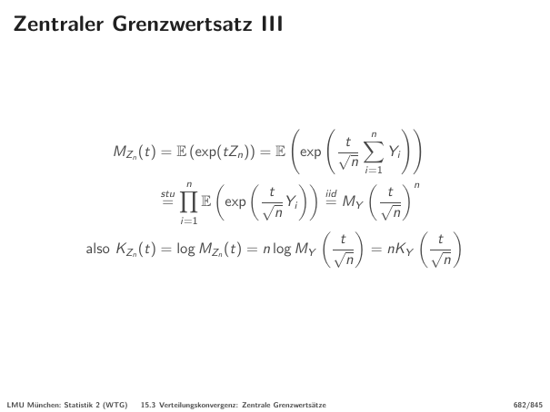

本页放在“模块一：分布收敛关注分布形状的极限”中，核心是理解 极限定理（Grenzwertsatz）。直觉上先抓住标题里的对象：极限定理（Grenzwertsatz）。然后看它是定义、例子、定理还是证明；定义页要记条件，例子页要看随机机制，证明页要看用了哪些闭包性或极限定理。

关键词：

- 极限定理（Grenzwertsatz）

本页需要抓住的德语线索：

- `M (t) = E (exp(tZ )) = E exp √ Y`
- `i=1`
- `s = tu Y`
- `i = id M`
- `i=1`

### Seite 83 - 极限定理（Grenzwertsatz）

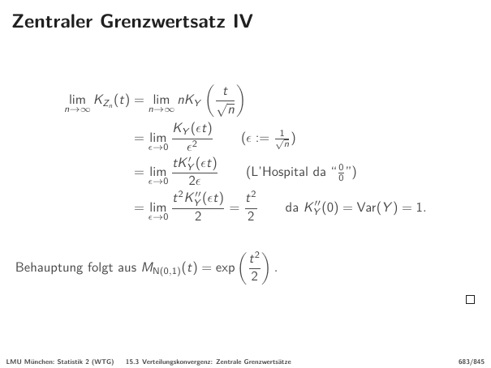

本页放在“模块一：分布收敛关注分布形状的极限”中，核心是理解 极限定理（Grenzwertsatz）。直觉上先抓住标题里的对象：极限定理（Grenzwertsatz）。然后看它是定义、例子、定理还是证明；定义页要记条件，例子页要看随机机制，证明页要看用了哪些闭包性或极限定理。

关键词：

- 极限定理（Grenzwertsatz）

本页需要抓住的德语线索：

- `lim K (t) = lim nK √`
- `n→∞`
- `n→∞`
- `= lim Y (ϵ := √1 )`
- `ϵ→0 ϵ2 n`

### Seite 84 - Beispiele I

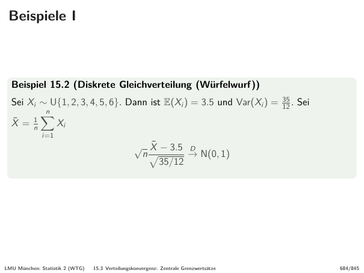

本页放在“模块一：分布收敛关注分布形状的极限”中，主要作用是推进 Seite 62-105 这一段的概念链。先把标题“Beispiele I”和前后页联系起来，再区分它是在给定义、展示例子、证明性质，还是做章节过渡。

本页需要抓住的德语线索：

- `Beispiele I`
- `Beispiel 15.2 (Diskrete Gleichverteilung (Würfelwurf))`
- `Sei X ∼ U{1, 2, 3, 4, 5, 6}. Dann ist E(X ) = 3.5 und Var(X ) = 35 . Sei`
- `X¯ = 1 X X`
- `i=1`

### Seite 85 - Beispiele II

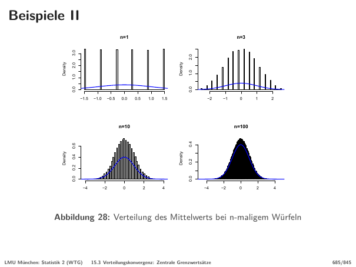

本页放在“模块一：分布收敛关注分布形状的极限”中，主要作用是推进 Seite 62-105 这一段的概念链。先把标题“Beispiele II”和前后页联系起来，再区分它是在给定义、展示例子、证明性质，还是做章节过渡。

本页需要抓住的德语线索：

- `Beispiele II`
- `n=1`
- `n=3`
- `n=10`
- `n=100`

### Seite 86 - Beispiele III

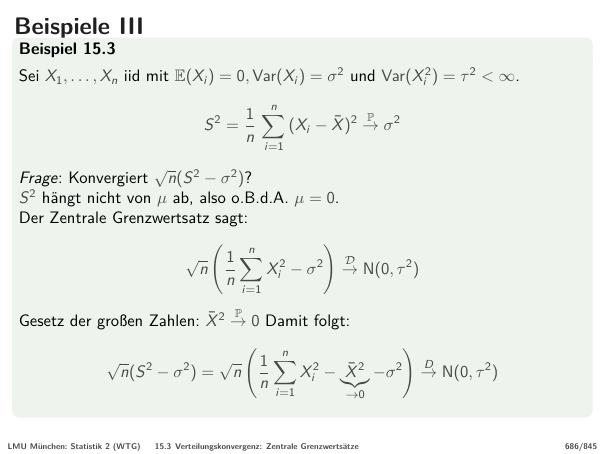

本页放在“模块一：分布收敛关注分布形状的极限”中，核心是理解 极限定理（Grenzwertsatz）。直觉上先抓住标题里的对象：Beispiele III。然后看它是定义、例子、定理还是证明；定义页要记条件，例子页要看随机机制，证明页要看用了哪些闭包性或极限定理。

关键词：

- 极限定理（Grenzwertsatz）

本页需要抓住的德语线索：

- `Beispiele III`
- `Beispiel 15.3`
- `Sei X , . . . , X iid mit E(X ) = 0, Var(X ) = σ2 und Var(X 2) = τ 2 < ∞.`
- `S2 = 1 X (X − X¯ )2 → P σ2`
- `i=1`

### Seite 87 - Asymptotik und Approximation I

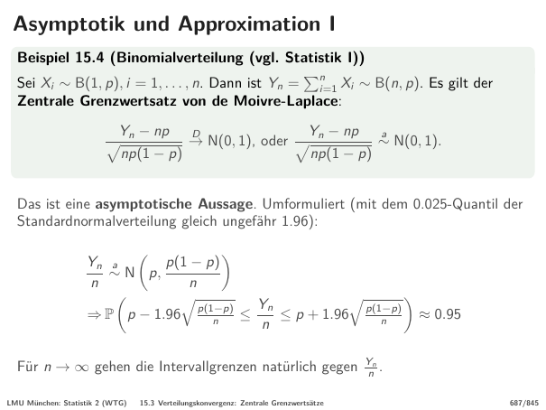

本页放在“模块一：分布收敛关注分布形状的极限”中，核心是理解 极限定理（Grenzwertsatz）、二项分布（Binomialverteilung）。直觉上先抓住标题里的对象：Asymptotik und Approximation I。然后看它是定义、例子、定理还是证明；定义页要记条件，例子页要看随机机制，证明页要看用了哪些闭包性或极限定理。

关键词：

- 极限定理（Grenzwertsatz）
- 二项分布（Binomialverteilung）

本页需要抓住的德语线索：

- `Beispiel 15.4 (Binomialverteilung (vgl. Statistik I))`
- `Sei X ∼ B(1, p), i = 1, . . . , n. Dann ist Y =`
- `X ∼ B(n, p). Es gilt der`
- `i n i=1 i`
- `n → D N(0, 1), oder n ∼ a N(0, 1).`

### Seite 88 - Asymptotik und Approximation II

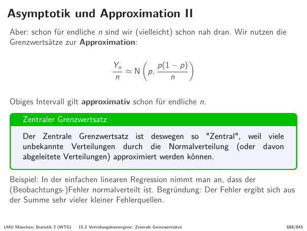

本页放在“模块一：分布收敛关注分布形状的极限”中，核心是理解 分布（Verteilung）、正态分布（Normalverteilung）、极限定理（Grenzwertsatz）。直觉上先抓住标题里的对象：Asymptotik und Approximation II。然后看它是定义、例子、定理还是证明；定义页要记条件，例子页要看随机机制，证明页要看用了哪些闭包性或极限定理。

关键词：

- 分布（Verteilung）
- 正态分布（Normalverteilung）
- 极限定理（Grenzwertsatz）

本页需要抓住的德语线索：

- `Beispiel: In der einfachen linearen Regression nimmt man an, dass der`

### Seite 89 - 收敛（Konvergenz）

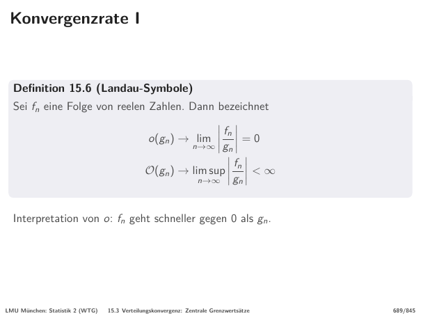

本页放在“模块一：分布收敛关注分布形状的极限”中，核心是理解 收敛（Konvergenz）。直觉上先抓住标题里的对象：收敛（Konvergenz）。然后看它是定义、例子、定理还是证明；定义页要记条件，例子页要看随机机制，证明页要看用了哪些闭包性或极限定理。

关键词：

- 收敛（Konvergenz）

本页需要抓住的德语线索：

- `Definition 15.6 (Landau-Symbole)`
- `o(g n ) → n l → im ∞ (cid:12) (cid:12) (cid:12) g f n n (cid:12) (cid:12) (cid:12) = 0`
- `O(g n ) → li n m → s ∞ up (cid:12) (cid:12) (cid:12) g f n n (cid:12) (cid:12) (cid:12) < ∞`

### Seite 90 - 收敛（Konvergenz）

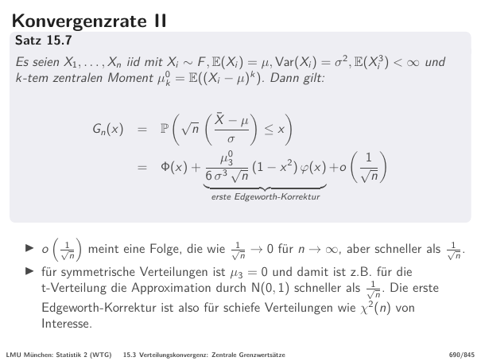

本页放在“模块一：分布收敛关注分布形状的极限”中，核心是理解 收敛（Konvergenz）。直觉上先抓住标题里的对象：收敛（Konvergenz）。然后看它是定义、例子、定理还是证明；定义页要记条件，例子页要看随机机制，证明页要看用了哪些闭包性或极限定理。

关键词：

- 收敛（Konvergenz）

本页需要抓住的德语线索：

- `Satz 15.7`
- `Es seien X , . . . , X iid mit X ∼ F , E(X ) = µ, Var(X ) = σ2, E(X 3) < ∞ und`
- `k-tem zentralen Moment µ0 = E((X − µ)k ). Dann gilt:`
- `G (x ) = P n ≤ x`
- `= Φ(x ) + 3√ (1 − x 2) φ(x ) +o √`

### Seite 91 - 收敛（Konvergenz）

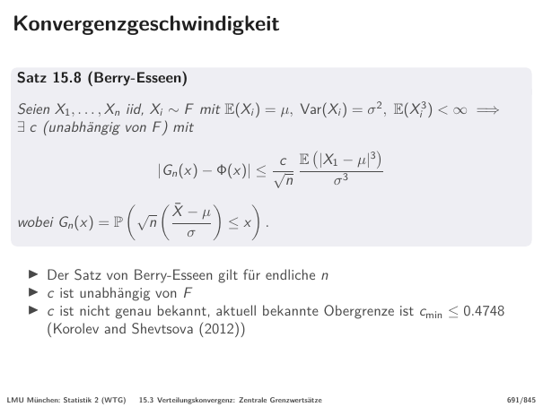

本页放在“模块一：分布收敛关注分布形状的极限”中，核心是理解 收敛（Konvergenz）。直觉上先抓住标题里的对象：收敛（Konvergenz）。然后看它是定义、例子、定理还是证明；定义页要记条件，例子页要看随机机制，证明页要看用了哪些闭包性或极限定理。

关键词：

- 收敛（Konvergenz）

本页需要抓住的德语线索：

- `Satz 15.8 (Berry-Esseen)`
- `Seien X , . . . , X iid, X ∼ F mit E(X ) = µ, Var(X ) = σ2, E(X 3) < ∞ =⇒`
- `|G (x ) − Φ(x )| ≤ √`
- `wobei G (x ) = P n ≤ x .`
- `Der Satz von Berry-Esseen gilt für endliche n`

### Seite 92 - Gegenbeispiel I

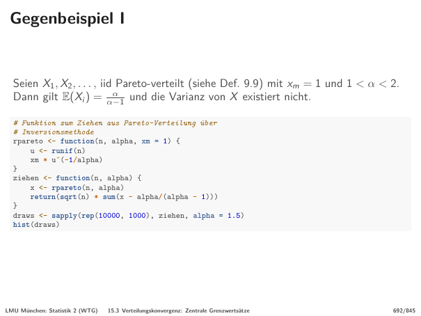

本页放在“模块一：分布收敛关注分布形状的极限”中，核心是理解 分布（Verteilung）、方差（Varianz）。直觉上先抓住标题里的对象：Gegenbeispiel I。然后看它是定义、例子、定理还是证明；定义页要记条件，例子页要看随机机制，证明页要看用了哪些闭包性或极限定理。

关键词：

- 分布（Verteilung）
- 方差（Varianz）

本页需要抓住的德语线索：

- `Seien X , X , . . . , iid Pareto-verteilt (siehe Def. 9.9) mit x = 1 und 1 < α < 2.`
- `Dann gilt E(X ) = α und die Varianz von X existiert nicht.`
- `rpareto <- function(n, alpha, xm = 1) {`
- `draws <- sapply(rep(10000, 1000), ziehen, alpha = 1.5)`

### Seite 93 - Gegenbeispiel II

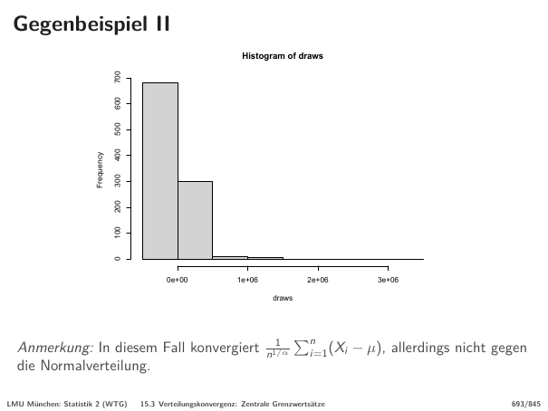

本页放在“模块一：分布收敛关注分布形状的极限”中，主要作用是推进 Seite 62-105 这一段的概念链。先把标题“Gegenbeispiel II”和前后页联系起来，再区分它是在给定义、展示例子、证明性质，还是做章节过渡。

本页需要抓住的德语线索：

- `n1/α i=1 i`

### Seite 94 - 分布收敛（Verteilungskonvergenz）

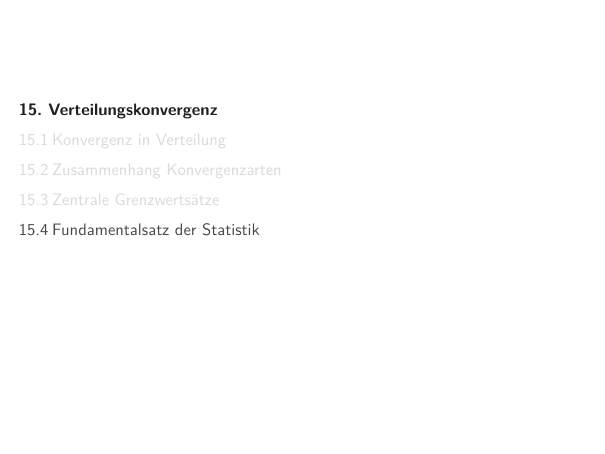

本页放在“模块一：分布收敛关注分布形状的极限”中，核心是理解 分布（Verteilung）、收敛（Konvergenz）、依分布（in Verteilung）。直觉上先抓住标题里的对象：分布收敛（Verteilungskonvergenz）。然后看它是定义、例子、定理还是证明；定义页要记条件，例子页要看随机机制，证明页要看用了哪些闭包性或极限定理。

关键词：

- 分布（Verteilung）
- 收敛（Konvergenz）
- 依分布（in Verteilung）

本页需要抓住的德语线索：

- `15. Verteilungskonvergenz`
- `15.1 Konvergenz in Verteilung`
- `15.2 Zusammenhang Konvergenzarten`

### Seite 95 - Fundamentalsatz der Statistik I

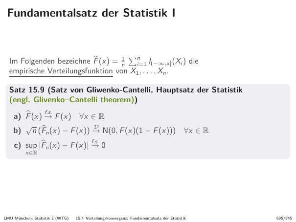

本页放在“模块一：分布收敛关注分布形状的极限”中，核心是理解 分布（Verteilung）、分布函数（Verteilungsfunktion）。直觉上先抓住标题里的对象：Fundamentalsatz der Statistik I。然后看它是定义、例子、定理还是证明；定义页要记条件，例子页要看随机机制，证明页要看用了哪些闭包性或极限定理。

关键词：

- 分布（Verteilung）
- 分布函数（Verteilungsfunktion）

本页需要抓住的德语线索：

- `Im Folgenden bezeichne Fb(x ) =`
- `i=1`
- `Satz 15.9 (Satz von Gliwenko-Cantelli, Hauptsatz der Statistik`
- `a) Fb(x ) → f.s. F (x ) ∀x ∈ R`
- `b) n (Fbn (x ) − F (x )) → D N(0, F (x )(1 − F (x ))) ∀x ∈ R`

### Seite 96 - Fundamentalsatz der Statistik II

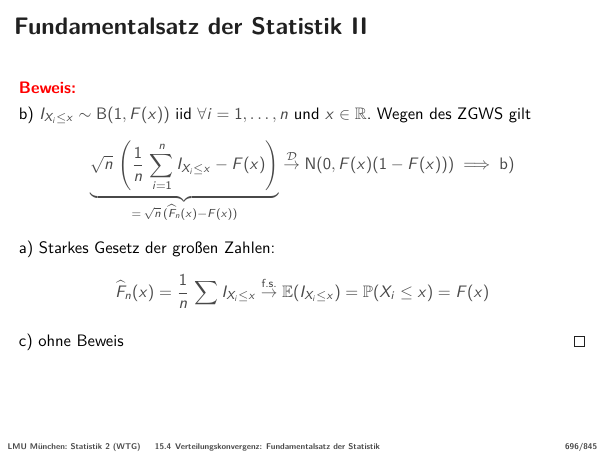

本页放在“模块一：分布收敛关注分布形状的极限”中，主要作用是推进 Seite 62-105 这一段的概念链。先把标题“Fundamentalsatz der Statistik II”和前后页联系起来，再区分它是在给定义、展示例子、证明性质，还是做章节过渡。

本页需要抓住的德语线索：

- `b) I ∼ B(1, F (x )) iid ∀i = 1, . . . , n und x ∈ R. Wegen des ZGWS gilt`
- `Xi≤x`
- `n I − F (x ) → N(0, F (x )(1 − F (x ))) =⇒ b)`
- `n Xi≤x`
- `i=1`

### Seite 97 - Fundamentalsatz der Statistik III

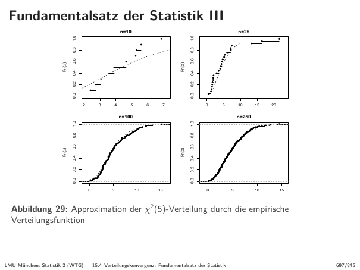

本页放在“模块一：分布收敛关注分布形状的极限”中，主要作用是推进 Seite 62-105 这一段的概念链。先把标题“Fundamentalsatz der Statistik III”和前后页联系起来，再区分它是在给定义、展示例子、证明性质，还是做章节过渡。

本页需要抓住的德语线索：

- `n=10`
- `n=25`
- `n=100`
- `n=250`

### Seite 98 - Fundamentalsatz der Statistik IV

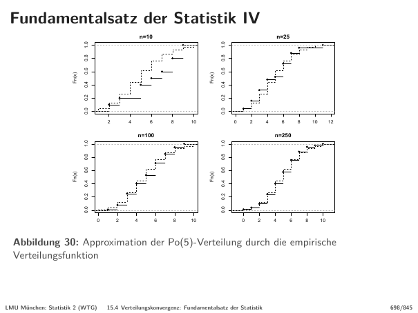

本页放在“模块一：分布收敛关注分布形状的极限”中，主要作用是推进 Seite 62-105 这一段的概念链。先把标题“Fundamentalsatz der Statistik IV”和前后页联系起来，再区分它是在给定义、展示例子、证明性质，还是做章节过渡。

本页需要抓住的德语线索：

- `n=10`
- `n=25`
- `n=100`
- `n=250`

### Seite 99 - Fundamentalsatz der Statistik V

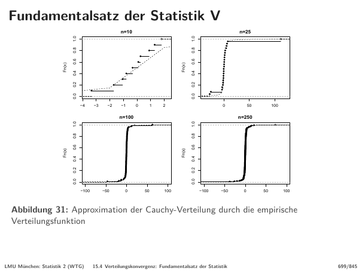

本页放在“模块一：分布收敛关注分布形状的极限”中，主要作用是推进 Seite 62-105 这一段的概念链。先把标题“Fundamentalsatz der Statistik V”和前后页联系起来，再区分它是在给定义、展示例子、证明性质，还是做章节过渡。

本页需要抓住的德语线索：

- `n=10`
- `n=25`
- `n=100`
- `n=250`

### Seite 100 - Fundamentalsatz der Statistik VI

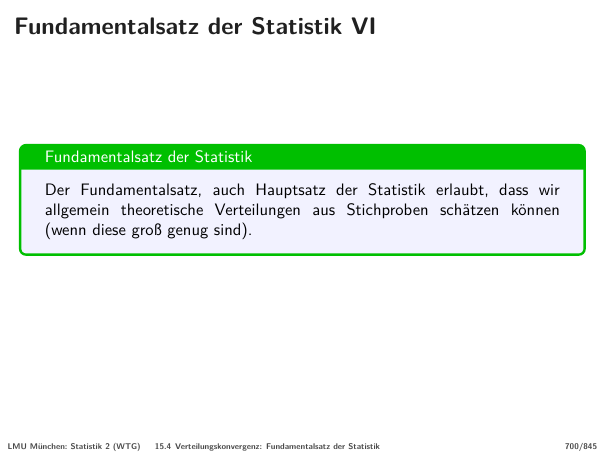

本页放在“模块一：分布收敛关注分布形状的极限”中，核心是理解 分布（Verteilung）。直觉上先抓住标题里的对象：Fundamentalsatz der Statistik VI。然后看它是定义、例子、定理还是证明；定义页要记条件，例子页要看随机机制，证明页要看用了哪些闭包性或极限定理。

关键词：

- 分布（Verteilung）

本页需要抓住的德语线索：

- `Fundamentalsatz der Statistik VI`
- `Fundamentalsatz der Statistik`
- `Der Fundamentalsatz, auch Hauptsatz der Statistik erlaubt, dass wir`

### Seite 101 - Multivariate Grenzwertsätze I

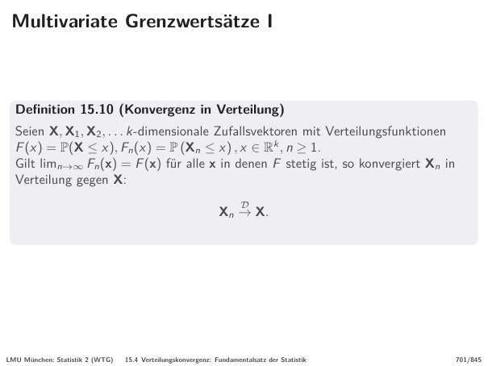

本页放在“模块一：分布收敛关注分布形状的极限”中，核心是理解 分布（Verteilung）、分布函数（Verteilungsfunktion）、收敛（Konvergenz）、依分布（in Verteilung）。直觉上先抓住标题里的对象：Multivariate Grenzwertsätze I。然后看它是定义、例子、定理还是证明；定义页要记条件，例子页要看随机机制，证明页要看用了哪些闭包性或极限定理。

关键词：

- 分布（Verteilung）
- 分布函数（Verteilungsfunktion）
- 收敛（Konvergenz）
- 依分布（in Verteilung）

本页需要抓住的德语线索：

- `Definition 15.10 (Konvergenz in Verteilung)`
- `F (x ) = P(X ≤ x ), F (x ) = P (X ≤ x ) , x ∈ Rk , n ≥ 1.`
- `Gilt lim F (x) = F (x) für alle x in denen F stetig ist, so konvergiert X in`
- `n→∞ n n`
- `X → X.`

### Seite 102 - Multivariate Grenzwertsätze II

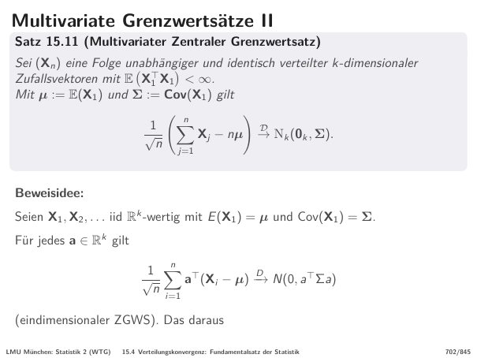

本页放在“模块一：分布收敛关注分布形状的极限”中，核心是理解 极限定理（Grenzwertsatz）。直觉上先抓住标题里的对象：Multivariate Grenzwertsätze II。然后看它是定义、例子、定理还是证明；定义页要记条件，例子页要看随机机制，证明页要看用了哪些闭包性或极限定理。

关键词：

- 极限定理（Grenzwertsatz）

本页需要抓住的德语线索：

- `Satz 15.11 (Multivariater Zentraler Grenzwertsatz)`
- `Mit µ := E(X ) und Σ := Cov(X ) gilt`
- `√ 1 X X − nµ → D N (0 , Σ).`
- `j=1`
- `Seien X , X , . . . iid Rk -wertig mit E (X ) = µ und Cov(X ) = Σ.`

### Seite 103 - Multivariate Grenzwertsätze III

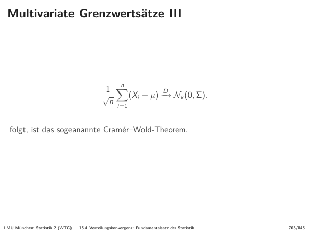

本页放在“模块一：分布收敛关注分布形状的极限”中，主要作用是推进 Seite 62-105 这一段的概念链。先把标题“Multivariate Grenzwertsätze III”和前后页联系起来，再区分它是在给定义、展示例子、证明性质，还是做章节过渡。

本页需要抓住的德语线索：

- `√ 1 X (X − µ) −→ D N (0, Σ).`
- `i=1`

### Seite 104 - Multivariate Grenzwertsätze IV

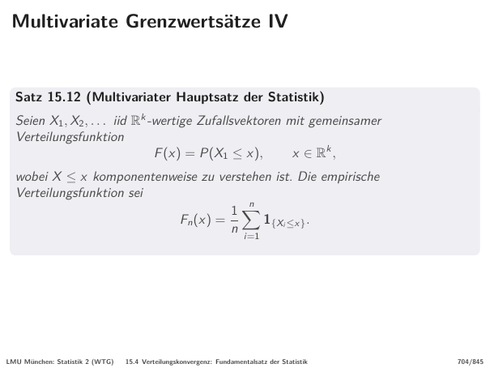

本页放在“模块一：分布收敛关注分布形状的极限”中，核心是理解 分布（Verteilung）、分布函数（Verteilungsfunktion）。直觉上先抓住标题里的对象：Multivariate Grenzwertsätze IV。然后看它是定义、例子、定理还是证明；定义页要记条件，例子页要看随机机制，证明页要看用了哪些闭包性或极限定理。

关键词：

- 分布（Verteilung）
- 分布函数（Verteilungsfunktion）

本页需要抓住的德语线索：

- `Satz 15.12 (Multivariater Hauptsatz der Statistik)`
- `F (x ) = P(X ≤ x ), x ∈ Rk ,`
- `wobei X ≤ x komponentenweise zu verstehen ist. Die empirische`
- `F (x ) = 1 .`
- `n n {Xi≤x}`

### Seite 105 - Multivariate Grenzwertsätze V

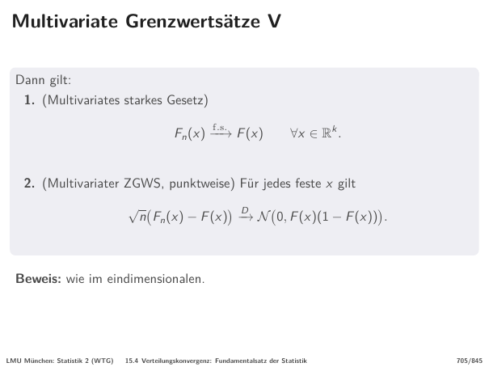

本页放在“模块一：分布收敛关注分布形状的极限”中，主要作用是推进 Seite 62-105 这一段的概念链。先把标题“Multivariate Grenzwertsätze V”和前后页联系起来，再区分它是在给定义、展示例子、证明性质，还是做章节过渡。

本页需要抓住的德语线索：

- `F (x ) − f − . → s. F (x ) ∀x ∈ Rk .`
- `n F (x ) − F (x ) −→ N 0, F (x )(1 − F (x )) .`

## 本章逻辑梳理

- **随机变量收敛（Seite 1-61）：** 收敛类型、大数定律。
- **分布收敛（Seite 62-105）：** 弱收敛、Portmanteau、CLT、多元极限定理。

复习时不要按页码硬背。先确认本页属于哪个模块，再问它是在定义对象、说明性质、给例子、证明定理，还是提醒适用边界。

## 关键考核点

1. 会比较几乎必然收敛、依概率收敛、矩收敛和依分布收敛的强弱。
2. 会说明弱大数定律和强大数定律的差别。
3. 会写出中心极限定理的标准化形式。
4. 会解释为什么分布收敛比依概率收敛弱。

## 本章公式清单

### 收敛类型

| 序号 | 公式 | 使用场景 | 注意事项 |
| ---: | --- | --- | --- |
| 1 | $X_n\to X\ f.s.$ | 几乎必然收敛。 | 除零概率集合外逐点收敛。 |
| 2 | $P(\lvert X_n-X\rvert>\varepsilon)\to0$ | 依概率收敛。 | 偏离超过阈值的概率趋于 0。 |
| 3 | $E(\lvert X_n-X\rvert^r)\to0$ | $r$ 阶矩收敛。 | 通常强于依概率收敛。 |
| 4 | $X_n\xrightarrow{d}X$ | 依分布收敛。 | 分布函数在连续点收敛。 |

### 极限定理

| 序号 | 公式 | 使用场景 | 注意事项 |
| ---: | --- | --- | --- |
| 5 | $\bar X_n\xrightarrow{P}\mu$ | 弱大数定律。 | 样本均值依概率靠近期望。 |
| 6 | $\bar X_n\to\mu\ f.s.$ | 强大数定律。 | 几乎必然收敛。 |
| 7 | $\frac{\sqrt n(\bar X_n-\mu)}{\sigma}\xrightarrow{d}N(0,1)$ | 中心极限定理。 | 标准化后依分布趋于标准正态。 |

## 章节自测

- [ ] 依概率收敛一定推出几乎必然收敛。
- [x] 矩收敛通常可推出依概率收敛。
- [x] 中心极限定理的结论是依分布收敛。

## 德语词汇表

| 德语 | 中文 | 使用场景 |
| --- | --- | --- |
| fast sichere Konvergenz | 几乎必然收敛 | 强收敛概念 |
| Konvergenz in Wahrscheinlichkeit | 依概率收敛 | 偏离概率趋零 |
| Konvergenz im Moment | 矩收敛 | 期望距离趋零 |
| Konvergenz in Verteilung | 依分布收敛 | 分布形状趋近 |
| Gesetz der großen Zahlen | 大数定律 | 均值稳定 |
| zentraler Grenzwertsatz | 中心极限定理 | 正态近似 |

## C1 德语句式

| 序号 | 德语句式 | 中文翻译 | 适用场景 |
| ---: | --- | --- | --- |
| 1 | Fast sichere Konvergenz impliziert Konvergenz in Wahrscheinlichkeit, aber nicht notwendigerweise umgekehrt. | 几乎必然收敛推出依概率收敛，但反过来不一定成立。 | 比较收敛强弱。 |
| 2 | Der zentrale Grenzwertsatz beschreibt die asymptotische Verteilung standardisierter Summen unabhängiger Zufallsvariablen. | 中心极限定理描述独立随机变量和的标准化形式的渐近分布。 | 解释 CLT。 |
