# 下学期第 06 章：依赖结构（Abhängigkeitsstrukturen）

> 来源：`分章节讲义-下学期/06_Abhängigkeitsstrukturen.pdf`  
> 原讲义页码：S. 706-758  
> 图片目录：`assets/`  
> 核心主线：本部分从随机过程和 Markov 链进入动态依赖，再用 Copula 把边际分布和依赖结构分离开来。

## 章节知识树

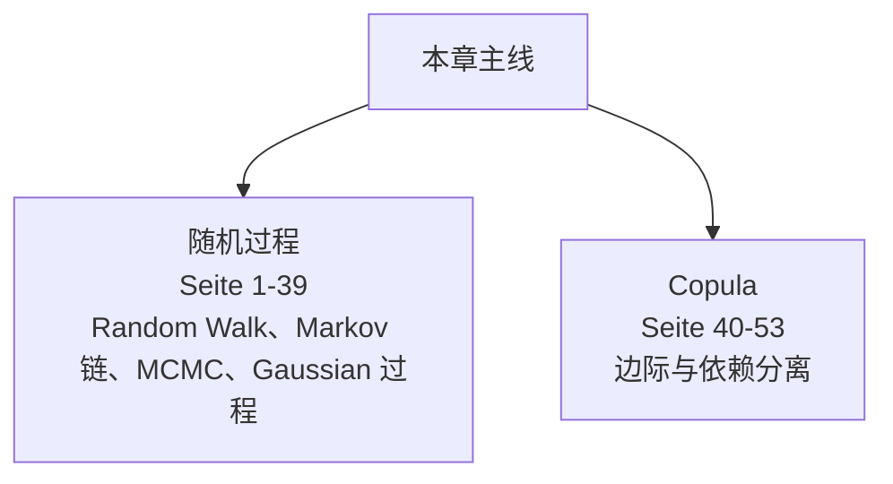
```mermaid
flowchart TD
  A["本章主线"]
  A --> M1["随机过程<br/>Seite 1-39<br/>Random Walk、Markov 链、MCMC、Gaussian 过程"]
  A --> M2["Copula<br/>Seite 40-53<br/>边际与依赖分离"]
```

## 学习路径

本部分从随机过程和 Markov 链进入动态依赖，再用 Copula 把边际分布和依赖结构分离开来。

1. **随机过程：** Random Walk、Markov 链、MCMC、Gaussian 过程（Seite 1-39）。
2. **Copula：** 边际与依赖分离（Seite 40-53）。

## 模块地图

| 模块 | 页码 | 核心问题 |
| --- | --- | --- |
| 随机过程 | Seite 1-39 | Random Walk、Markov 链、MCMC、Gaussian 过程 |
| Copula | Seite 40-53 | 边际与依赖分离 |

## 考试优先级

1. 会定义简单随机游走和 Markov 性。
2. 会用转移矩阵计算有限状态 Markov 链分布。
3. 会解释平稳分布的方程 $\pi=\pi P$。
4. 会说明 Copula 如何连接联合分布与边际分布。

## 模块零：从随机变量到随机过程（Seite 1-39）

如果随机变量是一张照片，随机过程就是一段影片。Random Walk 和 Markov 链描述随时间演化的随机系统，核心问题是未来如何依赖现在和过去。

### Seite 1 - 依赖性（Abhängigkeit）

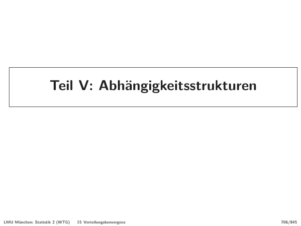

本页放在“模块零：从随机变量到随机过程”中，主要作用是推进 Seite 1-39 这一段的概念链。先把标题“依赖性（Abhängigkeit）”和前后页联系起来，再区分它是在给定义、展示例子、证明性质，还是做章节过渡。

本页需要抓住的德语线索：

- `Teil V: Abhängigkeitsstrukturen`

### Seite 2 - 随机过程（Stochastische Prozesse）

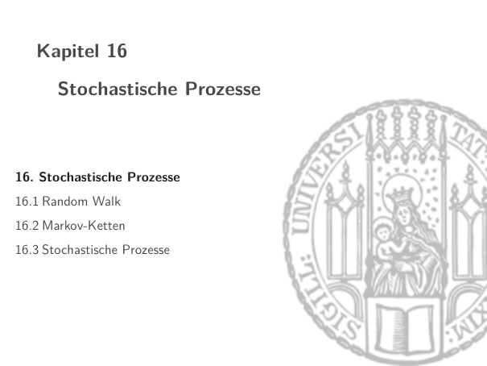

本页可识别的嵌入图片裁切：

本页放在“模块零：从随机变量到随机过程”中，核心是理解 随机游走（Random Walk）、Markov 链（Markov-Kette）。直觉上先抓住标题里的对象：随机过程（Stochastische Prozesse）。然后看它是定义、例子、定理还是证明；定义页要记条件，例子页要看随机机制，证明页要看用了哪些闭包性或极限定理。

关键词：

- 随机游走（Random Walk）
- Markov 链（Markov-Kette）

本页需要抓住的德语线索：

- `Kapitel 16`
- `Stochastische Prozesse`
- `16. Stochastische Prozesse`

### Seite 3 - 随机过程（Stochastische Prozesse）

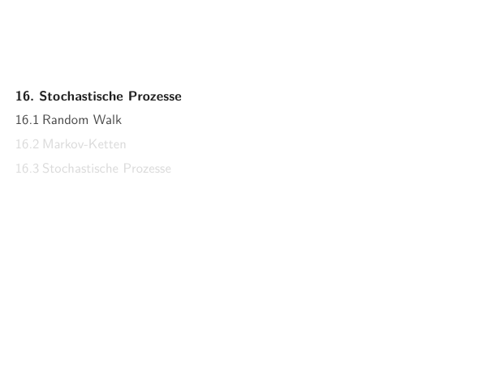

本页放在“模块零：从随机变量到随机过程”中，核心是理解 随机游走（Random Walk）、Markov 链（Markov-Kette）。直觉上先抓住标题里的对象：随机过程（Stochastische Prozesse）。然后看它是定义、例子、定理还是证明；定义页要记条件，例子页要看随机机制，证明页要看用了哪些闭包性或极限定理。

关键词：

- 随机游走（Random Walk）
- Markov 链（Markov-Kette）

本页需要抓住的德语线索：

- `16. Stochastische Prozesse`
- `16.1 Random Walk`
- `16.2 Markov-Ketten`

### Seite 4 - 随机游走（Random Walk）

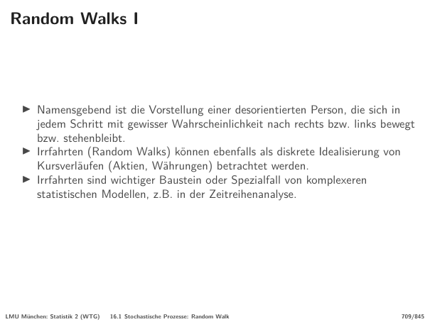

本页放在“模块零：从随机变量到随机过程”中，核心是理解 概率（Wahrscheinlichkeit）、随机游走（Random Walk）。直觉上先抓住标题里的对象：随机游走（Random Walk）。然后看它是定义、例子、定理还是证明；定义页要记条件，例子页要看随机机制，证明页要看用了哪些闭包性或极限定理。

关键词：

- 概率（Wahrscheinlichkeit）
- 随机游走（Random Walk）

本页需要抓住的德语线索：

- `Random Walks I`
- `Namensgebend ist die Vorstellung einer desorientierten Person, die sich in`
- `jedem Schritt mit gewisser Wahrscheinlichkeit nach rechts bzw. links bewegt`

### Seite 5 - Diskrete einfache Irrfahrt auf der Geraden

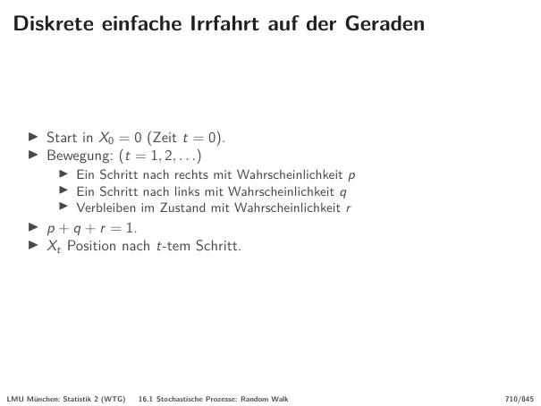

本页放在“模块零：从随机变量到随机过程”中，核心是理解 概率（Wahrscheinlichkeit）。直觉上先抓住标题里的对象：Diskrete einfache Irrfahrt auf der Geraden。然后看它是定义、例子、定理还是证明；定义页要记条件，例子页要看随机机制，证明页要看用了哪些闭包性或极限定理。

关键词：

- 概率（Wahrscheinlichkeit）

本页需要抓住的德语线索：

- `Start in X = 0 (Zeit t = 0).`
- `Bewegung: (t = 1, 2, . . .)`
- `p + q + r = 1.`

### Seite 6 - Simulation I

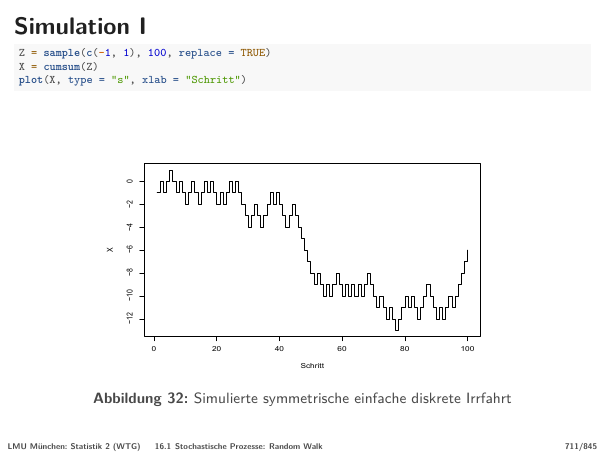

本页放在“模块零：从随机变量到随机过程”中，主要作用是推进 Seite 1-39 这一段的概念链。先把标题“Simulation I”和前后页联系起来，再区分它是在给定义、展示例子、证明性质，还是做章节过渡。

本页需要抓住的德语线索：

- `Z = sample(c(-1, 1), 100, replace = TRUE)`
- `X = cumsum(Z)`
- `plot(X, type = "s", xlab = "Schritt")`

### Seite 7 - Simulation II

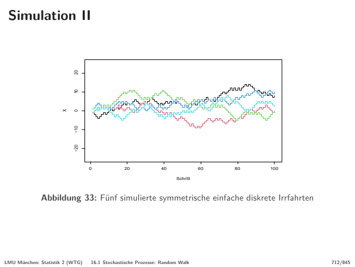

本页放在“模块零：从随机变量到随机过程”中，主要作用是推进 Seite 1-39 这一段的概念链。先把标题“Simulation II”和前后页联系起来，再区分它是在给定义、展示例子、证明性质，还是做章节过渡。

本页需要抓住的德语线索：

- `Simulation II`
- `0 20 40 60 80 100`
- `02`

### Seite 8 - Definitionen

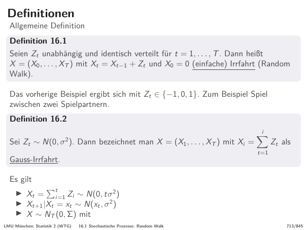

本页放在“模块零：从随机变量到随机过程”中，主要作用是推进 Seite 1-39 这一段的概念链。先把标题“Definitionen”和前后页联系起来，再区分它是在给定义、展示例子、证明性质，还是做章节过渡。

本页需要抓住的德语线索：

- `Definitionen`
- `Allgemeine Definition`
- `Definition 16.1`
- `Seien Z unabhängig und identisch verteilt für t = 1, . . . , T . Dann heißt`
- `X = (X , . . . , X ) mit X = X + Z und X = 0 (einfache) Irrfahrt (Random`

### Seite 9 - 随机过程（Stochastische Prozesse）

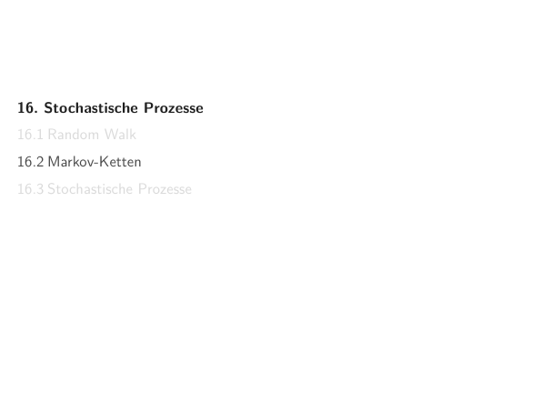

本页放在“模块零：从随机变量到随机过程”中，核心是理解 随机游走（Random Walk）、Markov 链（Markov-Kette）。直觉上先抓住标题里的对象：随机过程（Stochastische Prozesse）。然后看它是定义、例子、定理还是证明；定义页要记条件，例子页要看随机机制，证明页要看用了哪些闭包性或极限定理。

关键词：

- 随机游走（Random Walk）
- Markov 链（Markov-Kette）

本页需要抓住的德语线索：

- `16. Stochastische Prozesse`
- `16.1 Random Walk`
- `16.2 Markov-Ketten`

### Seite 10 - Markov-Eigenschaft

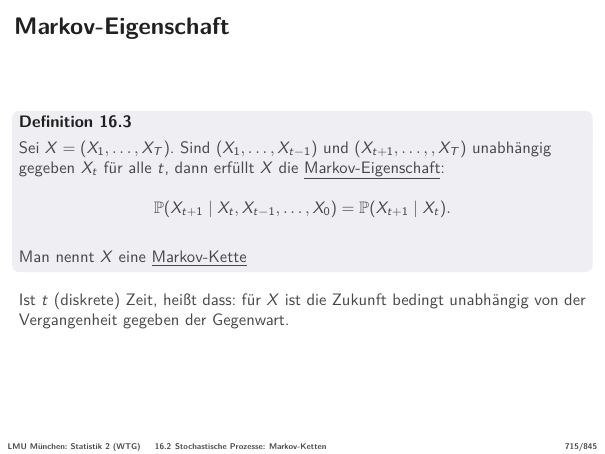

本页放在“模块零：从随机变量到随机过程”中，核心是理解 Markov 链（Markov-Kette）。直觉上先抓住标题里的对象：Markov-Eigenschaft。然后看它是定义、例子、定理还是证明；定义页要记条件，例子页要看随机机制，证明页要看用了哪些闭包性或极限定理。

关键词：

- Markov 链（Markov-Kette）

本页需要抓住的德语线索：

- `Definition 16.3`
- `Sei X = (X , . . . , X ). Sind (X , . . . , X ) und (X , . . . , , X ) unabhängig`
- `P(X | X , X , . . . , X ) = P(X | X ).`

### Seite 11 - Andrei Andrejewitsch Markow

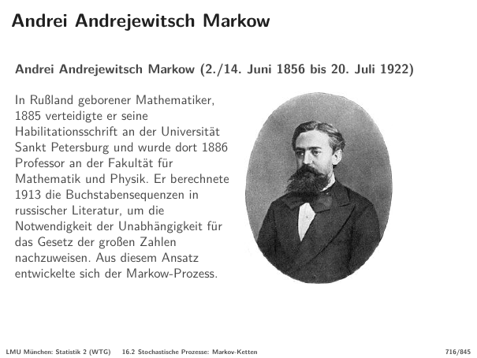

本页可识别的嵌入图片裁切：

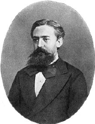

本页放在“模块零：从随机变量到随机过程”中，核心是理解 独立性（Unabhängigkeit）。直觉上先抓住标题里的对象：Andrei Andrejewitsch Markow。然后看它是定义、例子、定理还是证明；定义页要记条件，例子页要看随机机制，证明页要看用了哪些闭包性或极限定理。

关键词：

- 独立性（Unabhängigkeit）

本页需要抓住的德语线索：

- `Andrei Andrejewitsch Markow`
- `Andrei Andrejewitsch Markow (2./14. Juni 1856 bis 20. Juli 1922)`
- `In Rußland geborener Mathematiker,`

### Seite 12 - Beispiel Diskrete Markovkette I

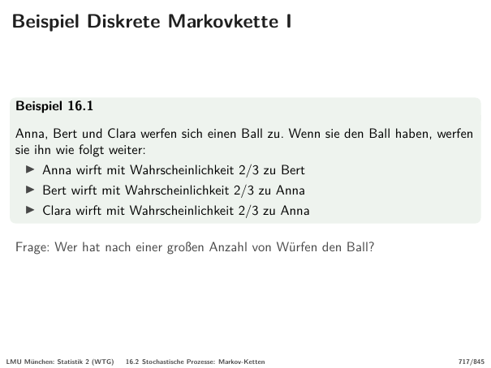

本页放在“模块零：从随机变量到随机过程”中，核心是理解 概率（Wahrscheinlichkeit）。直觉上先抓住标题里的对象：Beispiel Diskrete Markovkette I。然后看它是定义、例子、定理还是证明；定义页要记条件，例子页要看随机机制，证明页要看用了哪些闭包性或极限定理。

关键词：

- 概率（Wahrscheinlichkeit）

本页需要抓住的德语线索：

- `Beispiel Diskrete Markovkette I`
- `Beispiel 16.1`

### Seite 13 - Beispiel Diskrete Markovkette II

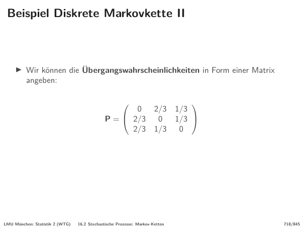

本页放在“模块零：从随机变量到随机过程”中，主要作用是推进 Seite 1-39 这一段的概念链。先把标题“Beispiel Diskrete Markovkette II”和前后页联系起来，再区分它是在给定义、展示例子、证明性质，还是做章节过渡。

本页需要抓住的德语线索：

- `Beispiel Diskrete Markovkette II`
- `P =  2/3 0 1/3 `

### Seite 14 - Beispiel Diskrete Markovkette III

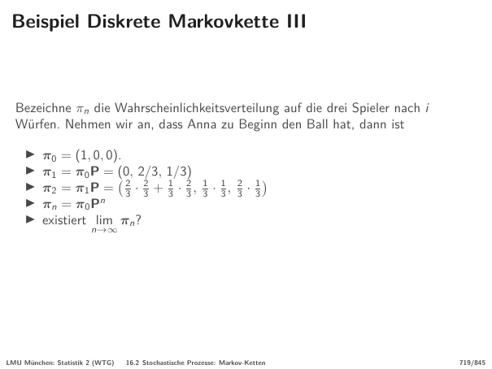

本页放在“模块零：从随机变量到随机过程”中，核心是理解 概率（Wahrscheinlichkeit）。直觉上先抓住标题里的对象：Beispiel Diskrete Markovkette III。然后看它是定义、例子、定理还是证明；定义页要记条件，例子页要看随机机制，证明页要看用了哪些闭包性或极限定理。

关键词：

- 概率（Wahrscheinlichkeit）

本页需要抓住的德语线索：

- `Beispiel Diskrete Markovkette III`
- `π = (1, 0, 0).`
- `π = π P = (0, 2/3, 1/3)`
- `π = π P = (cid:0) 2 · 2 + 1 · 2 , 1 · 1 , 2 · 1 (cid:1)`
- `π 2 = π 1 Pn 3 3 3 3 3 3 3 3`

### Seite 15 - Beispiel Diskrete Markovkette IV

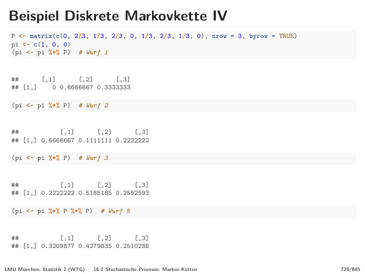

本页放在“模块零：从随机变量到随机过程”中，主要作用是推进 Seite 1-39 这一段的概念链。先把标题“Beispiel Diskrete Markovkette IV”和前后页联系起来，再区分它是在给定义、展示例子、证明性质，还是做章节过渡。

本页需要抓住的德语线索：

- `Beispiel Diskrete Markovkette IV`
- `P <- matrix(c(0, 2/3, 1/3, 2/3, 0, 1/3, 2/3, 1/3, 0), nrow = 3, byrow = TRUE)`

### Seite 16 - Beispiel Diskrete Markovkette V

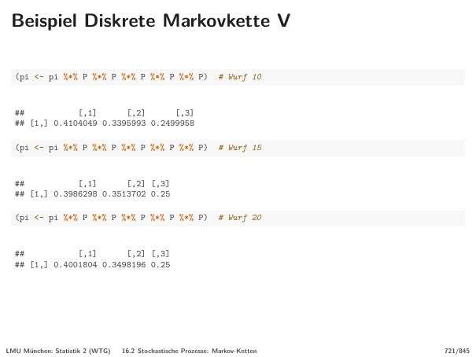

本页放在“模块零：从随机变量到随机过程”中，主要作用是推进 Seite 1-39 这一段的概念链。先把标题“Beispiel Diskrete Markovkette V”和前后页联系起来，再区分它是在给定义、展示例子、证明性质，还是做章节过渡。

本页需要抓住的德语线索：

- `Beispiel Diskrete Markovkette V`

### Seite 17 - 平稳分布（Stationäre Verteilung）

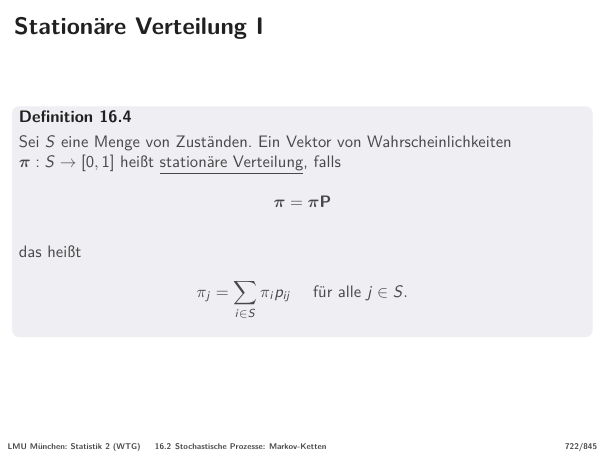

本页放在“模块零：从随机变量到随机过程”中，核心是理解 概率（Wahrscheinlichkeit）、集合（Menge）、分布（Verteilung）、平稳分布（stationäre Verteilung）。直觉上先抓住标题里的对象：平稳分布（Stationäre Verteilung）。然后看它是定义、例子、定理还是证明；定义页要记条件，例子页要看随机机制，证明页要看用了哪些闭包性或极限定理。

关键词：

- 概率（Wahrscheinlichkeit）
- 集合（Menge）
- 分布（Verteilung）
- 平稳分布（stationäre Verteilung）

本页需要抓住的德语线索：

- `Definition 16.4`
- `π : S → [0, 1] heißt stationäre Verteilung, falls`
- `π = πP`
- `π = π p für alle j ∈ S.`
- `i∈S`

### Seite 18 - 平稳分布（Stationäre Verteilung）

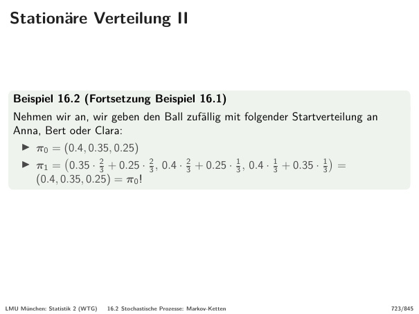

本页放在“模块零：从随机变量到随机过程”中，核心是理解 分布（Verteilung）。直觉上先抓住标题里的对象：平稳分布（Stationäre Verteilung）。然后看它是定义、例子、定理还是证明；定义页要记条件，例子页要看随机机制，证明页要看用了哪些闭包性或极限定理。

关键词：

- 分布（Verteilung）

本页需要抓住的德语线索：

- `Beispiel 16.2 (Fortsetzung Beispiel 16.1)`
- `π = (0.4, 0.35, 0.25)`
- `π = (cid:0) 0.35 · 2 + 0.25 · 2 , 0.4 · 2 + 0.25 · 1 , 0.4 · 1 + 0.35 · 1 (cid:1) =`
- `(0.4, 0.35, 0.25) = π !`

### Seite 19 - 平稳分布（Stationäre Verteilung）

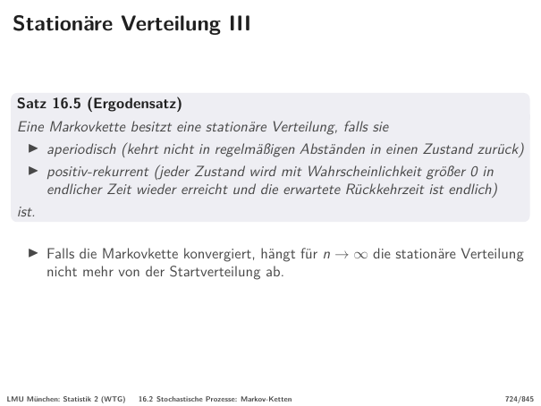

本页放在“模块零：从随机变量到随机过程”中，核心是理解 概率（Wahrscheinlichkeit）、分布（Verteilung）、平稳分布（stationäre Verteilung）。直觉上先抓住标题里的对象：平稳分布（Stationäre Verteilung）。然后看它是定义、例子、定理还是证明；定义页要记条件，例子页要看随机机制，证明页要看用了哪些闭包性或极限定理。

关键词：

- 概率（Wahrscheinlichkeit）
- 分布（Verteilung）
- 平稳分布（stationäre Verteilung）

本页需要抓住的德语线索：

- `Satz 16.5 (Ergodensatz)`
- `Falls die Markovkette konvergiert, hängt für n → ∞ die stationäre Verteilung`

### Seite 20 - 平稳分布（Stationäre Verteilung）

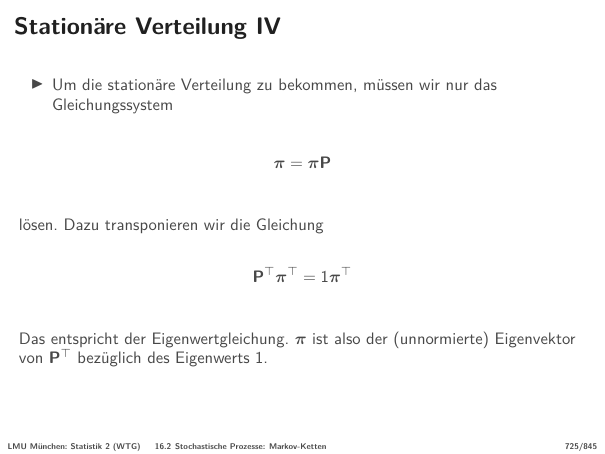

本页放在“模块零：从随机变量到随机过程”中，核心是理解 分布（Verteilung）、平稳分布（stationäre Verteilung）。直觉上先抓住标题里的对象：平稳分布（Stationäre Verteilung）。然后看它是定义、例子、定理还是证明；定义页要记条件，例子页要看随机机制，证明页要看用了哪些闭包性或极限定理。

关键词：

- 分布（Verteilung）
- 平稳分布（stationäre Verteilung）

本页需要抓住的德语线索：

- `π = πP`
- `P⊤π⊤ = 1π⊤`

### Seite 21 - 平稳分布（Stationäre Verteilung）

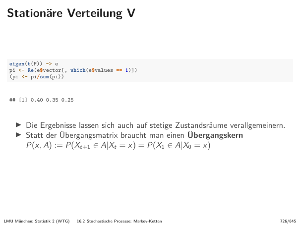

本页放在“模块零：从随机变量到随机过程”中，核心是理解 结果（Ergebnis）、分布（Verteilung）。直觉上先抓住标题里的对象：平稳分布（Stationäre Verteilung）。然后看它是定义、例子、定理还是证明；定义页要记条件，例子页要看随机机制，证明页要看用了哪些闭包性或极限定理。

关键词：

- 结果（Ergebnis）
- 分布（Verteilung）

本页需要抓住的德语线索：

- `pi <- Re(e$vector[, which(e$values == 1)])`
- `P(x , A) := P(X ∈ A|X = x ) = P(X ∈ A|X = x )`

### Seite 22 - Markov Chain Monte Carlo I

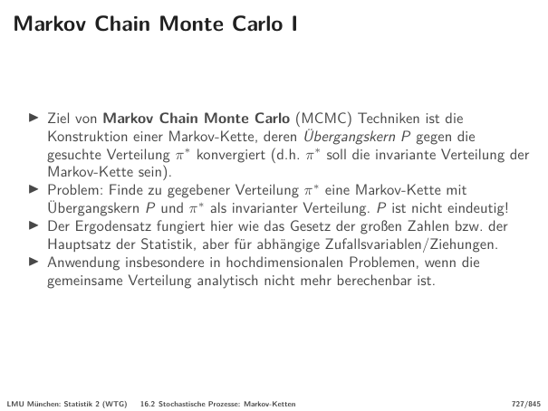

本页放在“模块零：从随机变量到随机过程”中，核心是理解 随机变量（Zufallsvariable）、分布（Verteilung）、Markov 链（Markov-Kette）。直觉上先抓住标题里的对象：Markov Chain Monte Carlo I。然后看它是定义、例子、定理还是证明；定义页要记条件，例子页要看随机机制，证明页要看用了哪些闭包性或极限定理。

关键词：

- 随机变量（Zufallsvariable）
- 分布（Verteilung）
- Markov 链（Markov-Kette）

本页需要抓住的德语线索：

- `Ziel von Markov Chain Monte Carlo (MCMC) Techniken ist die`

### Seite 23 - Markov Chain Monte Carlo II

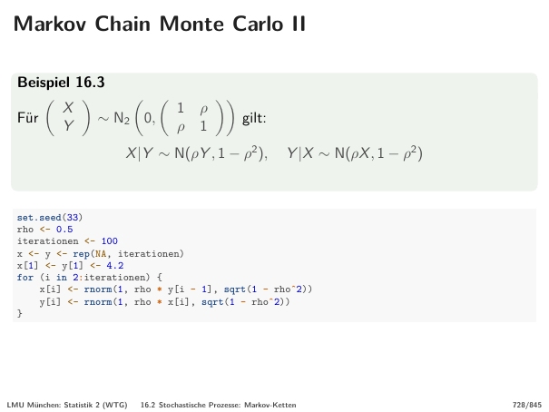

本页放在“模块零：从随机变量到随机过程”中，主要作用是推进 Seite 1-39 这一段的概念链。先把标题“Markov Chain Monte Carlo II”和前后页联系起来，再区分它是在给定义、展示例子、证明性质，还是做章节过渡。

本页需要抓住的德语线索：

- `Beispiel 16.3`

### Seite 24 - Markov Chain Monte Carlo III

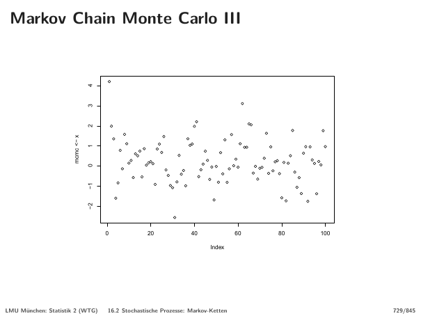

本页放在“模块零：从随机变量到随机过程”中，主要作用是推进 Seite 1-39 这一段的概念链。先把标题“Markov Chain Monte Carlo III”和前后页联系起来，再区分它是在给定义、展示例子、证明性质，还是做章节过渡。

本页需要抓住的德语线索：

- `Markov Chain Monte Carlo III`
- `0 20 40 60 80 100`
- `4`

### Seite 25 - Markov Chain Monte Carlo IV

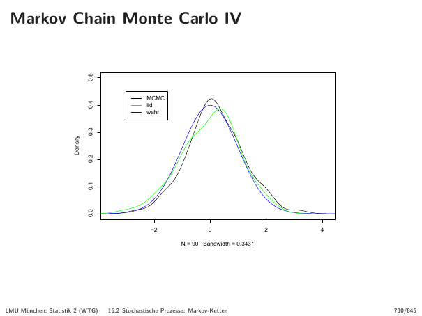

本页放在“模块零：从随机变量到随机过程”中，主要作用是推进 Seite 1-39 这一段的概念链。先把标题“Markov Chain Monte Carlo IV”和前后页联系起来，再区分它是在给定义、展示例子、证明性质，还是做章节过渡。

本页需要抓住的德语线索：

- `N = 90 Bandwidth = 0.3431`

### Seite 26 - 随机游走（Random Walk）

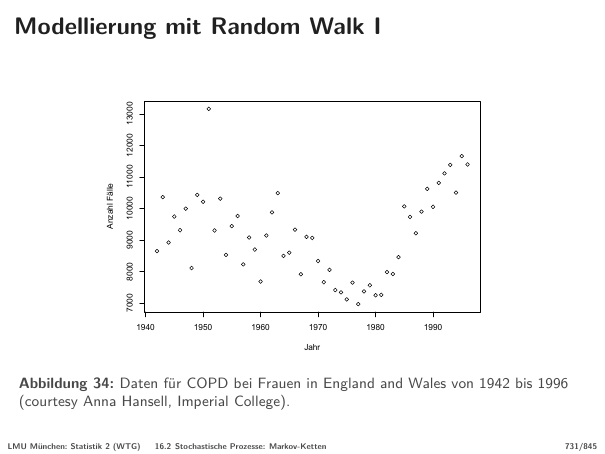

本页放在“模块零：从随机变量到随机过程”中，核心是理解 随机游走（Random Walk）。直觉上先抓住标题里的对象：随机游走（Random Walk）。然后看它是定义、例子、定理还是证明；定义页要记条件，例子页要看随机机制，证明页要看用了哪些闭包性或极限定理。

关键词：

- 随机游走（Random Walk）

本页需要抓住的德语线索：

- `Modellierung mit Random Walk I`
- `1940 1950 1960 1970 1980 1990`
- `00031`

### Seite 27 - 随机游走（Random Walk）

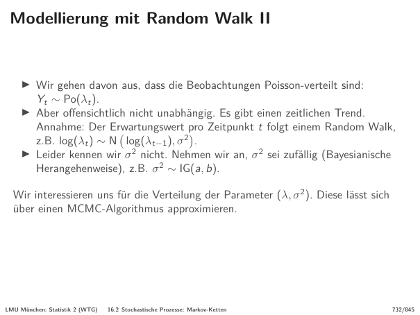

本页放在“模块零：从随机变量到随机过程”中，核心是理解 期望（Erwartungswert）、随机游走（Random Walk）、Poisson 分布（Poisson）。直觉上先抓住标题里的对象：随机游走（Random Walk）。然后看它是定义、例子、定理还是证明；定义页要记条件，例子页要看随机机制，证明页要看用了哪些闭包性或极限定理。

关键词：

- 期望（Erwartungswert）
- 随机游走（Random Walk）
- Poisson 分布（Poisson）

本页需要抓住的德语线索：

- `Modellierung mit Random Walk II`
- `Wir gehen davon aus, dass die Beobachtungen Poisson-verteilt sind:`
- `Y ∼ Po(λ ).`

### Seite 28 - 随机游走（Random Walk）

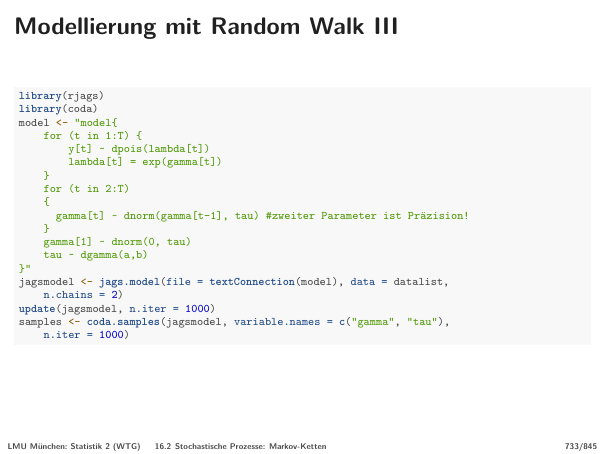

本页放在“模块零：从随机变量到随机过程”中，核心是理解 随机游走（Random Walk）。直觉上先抓住标题里的对象：随机游走（Random Walk）。然后看它是定义、例子、定理还是证明；定义页要记条件，例子页要看随机机制，证明页要看用了哪些闭包性或极限定理。

关键词：

- 随机游走（Random Walk）

本页需要抓住的德语线索：

- `lambda[t] = exp(gamma[t])`
- `jagsmodel <- jags.model(file = textConnection(model), data = datalist,`
- `n.chains = 2)`
- `update(jagsmodel, n.iter = 1000)`
- `samples <- coda.samples(jagsmodel, variable.names = c("gamma", "tau"),`

### Seite 29 - 随机游走（Random Walk）

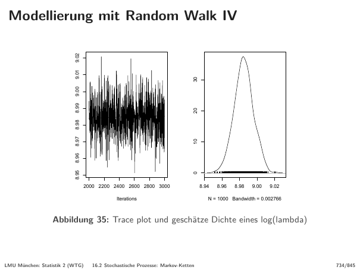

本页放在“模块零：从随机变量到随机过程”中，核心是理解 随机游走（Random Walk）。直觉上先抓住标题里的对象：随机游走（Random Walk）。然后看它是定义、例子、定理还是证明；定义页要记条件，例子页要看随机机制，证明页要看用了哪些闭包性或极限定理。

关键词：

- 随机游走（Random Walk）

本页需要抓住的德语线索：

- `N = 1000 Bandwidth = 0.002766`

### Seite 30 - 随机游走（Random Walk）

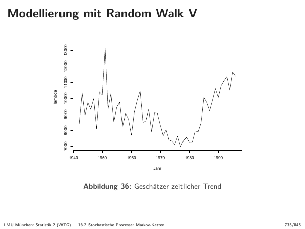

本页放在“模块零：从随机变量到随机过程”中，核心是理解 随机游走（Random Walk）。直觉上先抓住标题里的对象：随机游走（Random Walk）。然后看它是定义、例子、定理还是证明；定义页要记条件，例子页要看随机机制，证明页要看用了哪些闭包性或极限定理。

关键词：

- 随机游走（Random Walk）

本页需要抓住的德语线索：

- `Modellierung mit Random Walk V`
- `1940 1950 1960 1970 1980 1990`
- `00031`

### Seite 31 - 随机过程（Stochastische Prozesse）

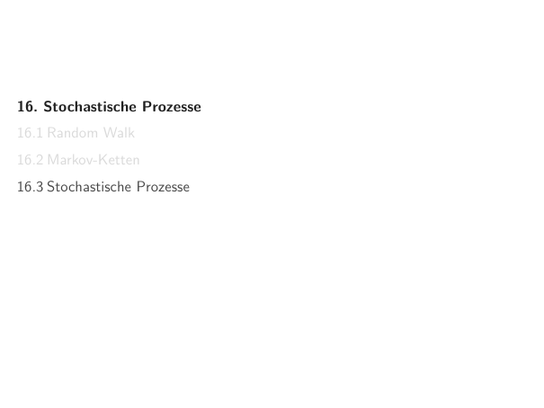

本页放在“模块零：从随机变量到随机过程”中，核心是理解 随机游走（Random Walk）、Markov 链（Markov-Kette）。直觉上先抓住标题里的对象：随机过程（Stochastische Prozesse）。然后看它是定义、例子、定理还是证明；定义页要记条件，例子页要看随机机制，证明页要看用了哪些闭包性或极限定理。

关键词：

- 随机游走（Random Walk）
- Markov 链（Markov-Kette）

本页需要抓住的德语线索：

- `16. Stochastische Prozesse`
- `16.1 Random Walk`
- `16.2 Markov-Ketten`

### Seite 32 - 随机过程（Stochastische Prozesse）

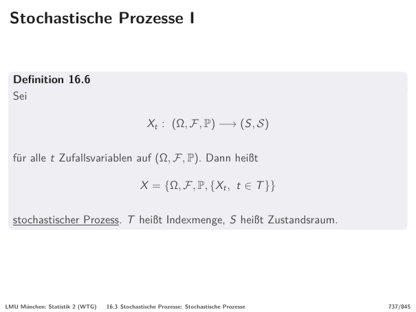

本页放在“模块零：从随机变量到随机过程”中，核心是理解 随机变量（Zufallsvariable）。直觉上先抓住标题里的对象：随机过程（Stochastische Prozesse）。然后看它是定义、例子、定理还是证明；定义页要记条件，例子页要看随机机制，证明页要看用了哪些闭包性或极限定理。

关键词：

- 随机变量（Zufallsvariable）

本页需要抓住的德语线索：

- `Definition 16.6`
- `X : (Ω, F, P) −→ (S, S)`
- `X = {Ω, F, P, {X , t ∈ T }}`

### Seite 33 - 随机过程（Stochastische Prozesse）

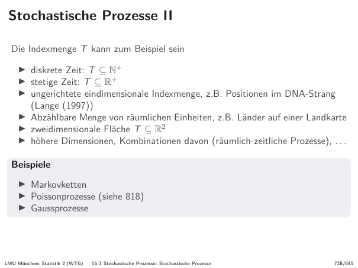

本页放在“模块零：从随机变量到随机过程”中，核心是理解 集合（Menge）、Poisson 分布（Poisson）。直觉上先抓住标题里的对象：随机过程（Stochastische Prozesse）。然后看它是定义、例子、定理还是证明；定义页要记条件，例子页要看随机机制，证明页要看用了哪些闭包性或极限定理。

关键词：

- 集合（Menge）
- Poisson 分布（Poisson）

本页需要抓住的德语线索：

- `Die Indexmenge T kann zum Beispiel sein`
- `Beispiele`

### Seite 34 - Gaussian 过程（Gaussprozesse）

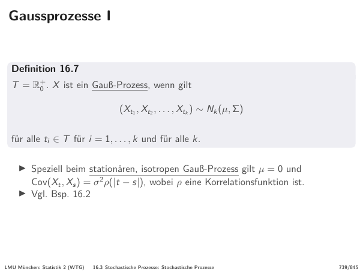

本页放在“模块零：从随机变量到随机过程”中，主要作用是推进 Seite 1-39 这一段的概念链。先把标题“Gaussian 过程（Gaussprozesse）”和前后页联系起来，再区分它是在给定义、展示例子、证明性质，还是做章节过渡。

本页需要抓住的德语线索：

- `Definition 16.7`
- `T = R+. X ist ein Gauß-Prozess, wenn gilt`
- `für alle t ∈ T für i = 1, . . . , k und für alle k.`
- `Speziell beim stationären, isotropen Gauß-Prozess gilt µ = 0 und`
- `Cov(X , X ) = σ2ρ(|t − s|), wobei ρ eine Korrelationsfunktion ist.`

### Seite 35 - Gaussian 过程（Gaussprozesse）

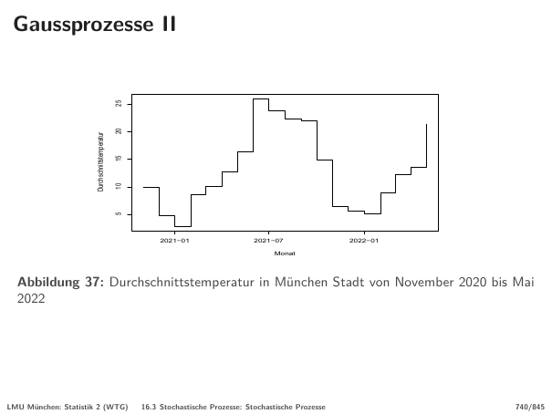

本页放在“模块零：从随机变量到随机过程”中，主要作用是推进 Seite 1-39 这一段的概念链。先把标题“Gaussian 过程（Gaussprozesse）”和前后页联系起来，再区分它是在给定义、展示例子、证明性质，还是做章节过渡。

本页需要抓住的德语线索：

- `Gaussprozesse II`
- `2021−01 2021−07 2022−01`
- `52`

### Seite 36 - Gaussian 过程（Gaussprozesse）

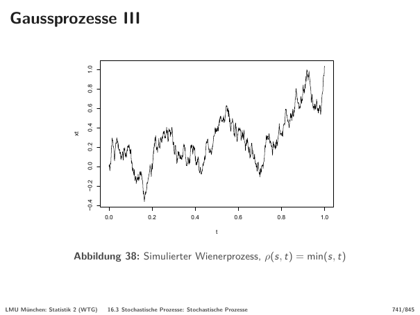

本页放在“模块零：从随机变量到随机过程”中，主要作用是推进 Seite 1-39 这一段的概念链。先把标题“Gaussian 过程（Gaussprozesse）”和前后页联系起来，再区分它是在给定义、展示例子、证明性质，还是做章节过渡。

本页需要抓住的德语线索：

- `Abbildung 38: Simulierter Wienerprozess, ρ(s, t) = min(s, t)`

### Seite 37 - Gaussian 过程（Gaussprozesse）

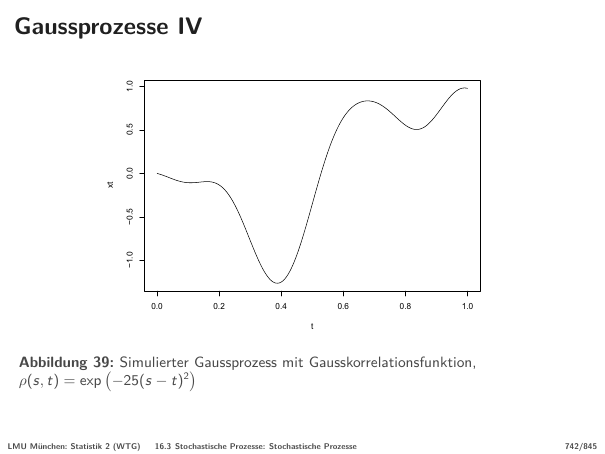

本页放在“模块零：从随机变量到随机过程”中，主要作用是推进 Seite 1-39 这一段的概念链。先把标题“Gaussian 过程（Gaussprozesse）”和前后页联系起来，再区分它是在给定义、展示例子、证明性质，还是做章节过渡。

本页需要抓住的德语线索：

- `ρ(s, t) = exp −25(s − t)2`

### Seite 38 - Gaussian 过程（Gaussprozesse）

本页可识别的嵌入图片裁切：

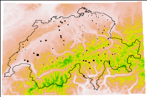

本页放在“模块零：从随机变量到随机过程”中，主要作用是推进 Seite 1-39 这一段的概念链。先把标题“Gaussian 过程（Gaussprozesse）”和前后页联系起来，再区分它是在给定义、展示例子、证明性质，还是做章节过渡。

本页需要抓住的德语线索：

- `Gaussprozesse V`
- `4000`
- `3000`

### Seite 39 - Gaussian 过程（Gaussprozesse）

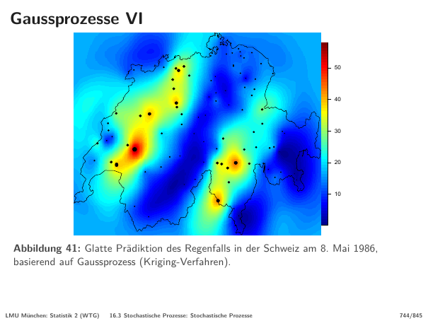

本页放在“模块零：从随机变量到随机过程”中，主要作用是推进 Seite 1-39 这一段的概念链。先把标题“Gaussian 过程（Gaussprozesse）”和前后页联系起来，再区分它是在给定义、展示例子、证明性质，还是做章节过渡。

本页需要抓住的德语线索：

- `Gaussprozesse VI`
- `50`
- `40`

## 模块一：Copula 把边际和依赖拆开（Seite 40-53）

两个变量的联合分布包含两类信息：各自边际长什么样，以及它们怎么绑在一起。Copula 的思想就是把这两部分拆开，专门研究依赖结构。

### Seite 40 - Copula（Copula）

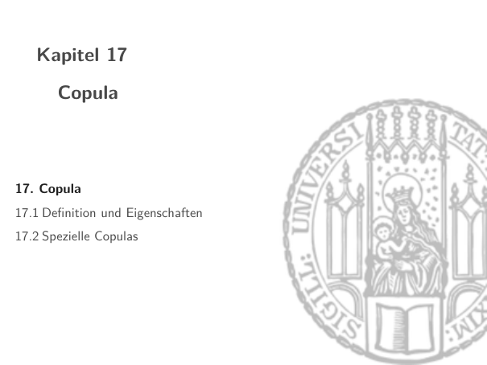

本页可识别的嵌入图片裁切：

本页放在“模块一：Copula 把边际和依赖拆开”中，核心是理解 Copula（Copula）。直觉上先抓住标题里的对象：Copula（Copula）。然后看它是定义、例子、定理还是证明；定义页要记条件，例子页要看随机机制，证明页要看用了哪些闭包性或极限定理。

关键词：

- Copula（Copula）

本页需要抓住的德语线索：

- `17.1 Definition und Eigenschaften`

### Seite 41 - Copula（Copula）

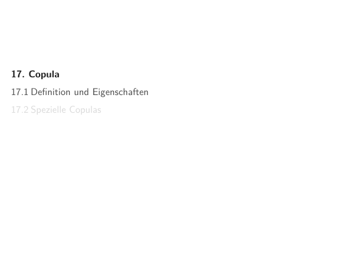

本页放在“模块一：Copula 把边际和依赖拆开”中，核心是理解 Copula（Copula）。直觉上先抓住标题里的对象：Copula（Copula）。然后看它是定义、例子、定理还是证明；定义页要记条件，例子页要看随机机制，证明页要看用了哪些闭包性或极限定理。

关键词：

- Copula（Copula）

本页需要抓住的德语线索：

- `17.1 Definition und Eigenschaften`

### Seite 42 - Copula（Copula）

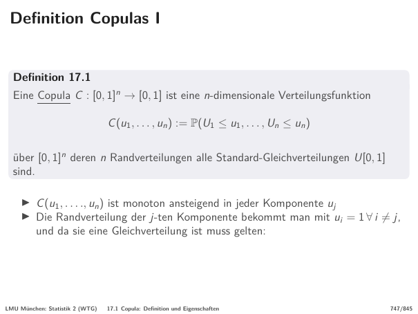

本页放在“模块一：Copula 把边际和依赖拆开”中，核心是理解 分布（Verteilung）、分布函数（Verteilungsfunktion）、Copula（Copula）。直觉上先抓住标题里的对象：Copula（Copula）。然后看它是定义、例子、定理还是证明；定义页要记条件，例子页要看随机机制，证明页要看用了哪些闭包性或极限定理。

关键词：

- 分布（Verteilung）
- 分布函数（Verteilungsfunktion）
- Copula（Copula）

本页需要抓住的德语线索：

- `Definition Copulas I`
- `Definition 17.1`
- `Eine Copula C : [0, 1]n → [0, 1] ist eine n-dimensionale Verteilungsfunktion`
- `C (u , . . . , u ) := P(U ≤ u , . . . , U ≤ u )`
- `Die Randverteilung der j-ten Komponente bekommt man mit u = 1 ∀ i ̸= j,`

### Seite 43 - Copula（Copula）

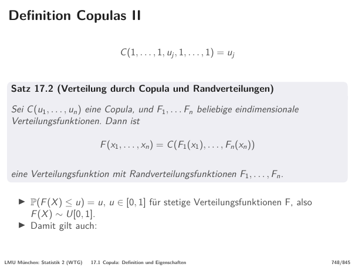

本页放在“模块一：Copula 把边际和依赖拆开”中，核心是理解 分布（Verteilung）、分布函数（Verteilungsfunktion）、Copula（Copula）。直觉上先抓住标题里的对象：Copula（Copula）。然后看它是定义、例子、定理还是证明；定义页要记条件，例子页要看随机机制，证明页要看用了哪些闭包性或极限定理。

关键词：

- 分布（Verteilung）
- 分布函数（Verteilungsfunktion）
- Copula（Copula）

本页需要抓住的德语线索：

- `Definition Copulas II`
- `C (1, . . . , 1, u , 1, . . . , 1) = u`
- `Satz 17.2 (Verteilung durch Copula und Randverteilungen)`
- `F (x , . . . , x ) = C (F (x ), . . . , F (x ))`
- `P(F (X ) ≤ u) = u, u ∈ [0, 1] für stetige Verteilungsfunktionen F, also`

### Seite 44 - Copula（Copula）

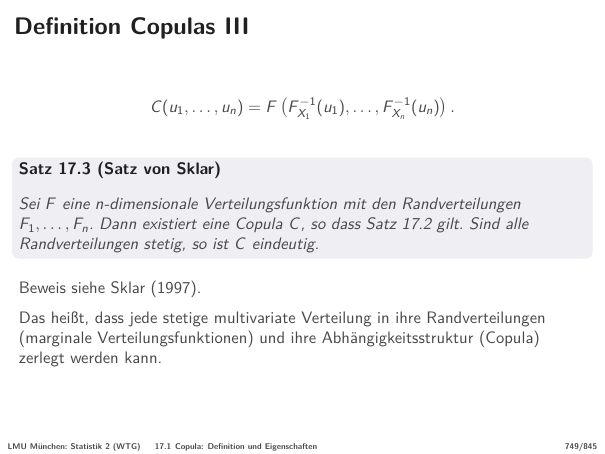

本页放在“模块一：Copula 把边际和依赖拆开”中，核心是理解 分布（Verteilung）、分布函数（Verteilungsfunktion）、Copula（Copula）。直觉上先抓住标题里的对象：Copula（Copula）。然后看它是定义、例子、定理还是证明；定义页要记条件，例子页要看随机机制，证明页要看用了哪些闭包性或极限定理。

关键词：

- 分布（Verteilung）
- 分布函数（Verteilungsfunktion）
- Copula（Copula）

本页需要抓住的德语线索：

- `Definition Copulas III`
- `C (u , . . . , u ) = F (cid:0) F −1(u ), . . . , F −1(u ) (cid:1) .`
- `Satz 17.3 (Satz von Sklar)`
- `F , . . . , F . Dann existiert eine Copula C , so dass Satz 17.2 gilt. Sind alle`

### Seite 45 - Eigenschaften I

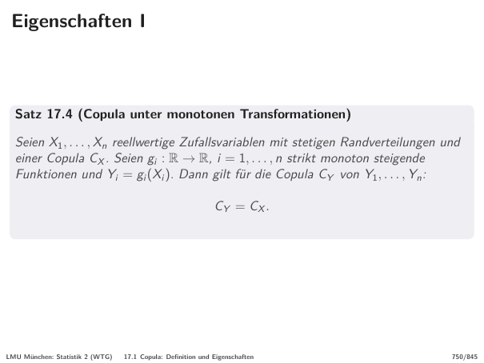

本页放在“模块一：Copula 把边际和依赖拆开”中，核心是理解 随机变量（Zufallsvariable）、Copula（Copula）。直觉上先抓住标题里的对象：Eigenschaften I。然后看它是定义、例子、定理还是证明；定义页要记条件，例子页要看随机机制，证明页要看用了哪些闭包性或极限定理。

关键词：

- 随机变量（Zufallsvariable）
- Copula（Copula）

本页需要抓住的德语线索：

- `Satz 17.4 (Copula unter monotonen Transformationen)`
- `einer Copula C . Seien g : R → R, i = 1, . . . , n strikt monoton steigende`
- `Funktionen und Y = g (X ). Dann gilt für die Copula C von Y , . . . , Y :`
- `C = C .`

### Seite 46 - Eigenschaften II

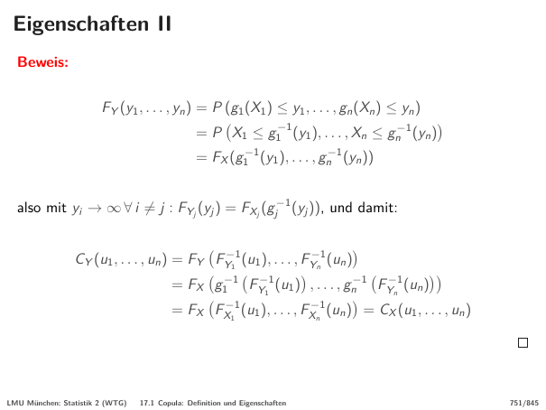

本页放在“模块一：Copula 把边际和依赖拆开”中，主要作用是推进 Seite 40-53 这一段的概念链。先把标题“Eigenschaften II”和前后页联系起来，再区分它是在给定义、展示例子、证明性质，还是做章节过渡。

本页需要抓住的德语线索：

- `F (y , . . . , y ) = P (g (X ) ≤ y , . . . , g (X ) ≤ y )`
- `= P (cid:0) X ≤ g−1(y ), . . . , X ≤ g−1(y ) (cid:1)`
- `= F (g−1(y ), . . . , g−1(y ))`
- `also mit y → ∞ ∀ i ̸= j : F (y ) = F (g−1(y )), und damit:`
- `C (u , . . . , u ) = F (cid:0) F −1(u ), . . . , F −1(u ) (cid:1)`

### Seite 47 - Eigenschaften III

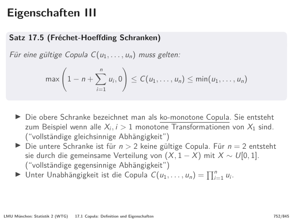

本页放在“模块一：Copula 把边际和依赖拆开”中，核心是理解 Copula（Copula）。直觉上先抓住标题里的对象：Eigenschaften III。然后看它是定义、例子、定理还是证明；定义页要记条件，例子页要看随机机制，证明页要看用了哪些闭包性或极限定理。

关键词：

- Copula（Copula）

本页需要抓住的德语线索：

- `Satz 17.5 (Fréchet-Hoeffding Schranken)`
- `max 1 − n + u , 0 ≤ C (u , . . . , u ) ≤ min(u , . . . , u )`
- `i=1`
- `zum Beispiel wenn alle X , i > 1 monotone Transformationen von X sind.`
- `Die untere Schranke ist für n > 2 keine gültige Copula. Für n = 2 entsteht`

### Seite 48 - Copula（Copula）

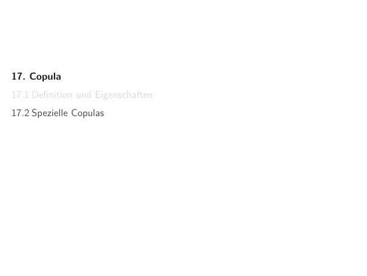

本页放在“模块一：Copula 把边际和依赖拆开”中，核心是理解 Copula（Copula）。直觉上先抓住标题里的对象：Copula（Copula）。然后看它是定义、例子、定理还是证明；定义页要记条件，例子页要看随机机制，证明页要看用了哪些闭包性或极限定理。

关键词：

- Copula（Copula）

本页需要抓住的德语线索：

- `17.1 Definition und Eigenschaften`

### Seite 49 - Copula（Copula）

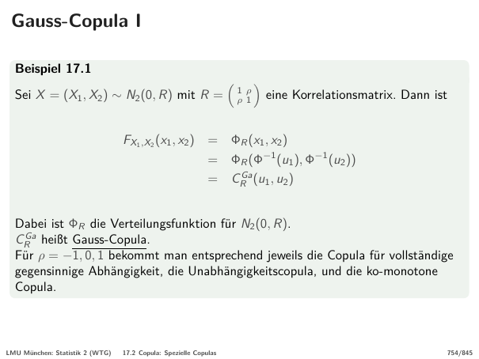

本页放在“模块一：Copula 把边际和依赖拆开”中，核心是理解 分布（Verteilung）、分布函数（Verteilungsfunktion）、Copula（Copula）。直觉上先抓住标题里的对象：Copula（Copula）。然后看它是定义、例子、定理还是证明；定义页要记条件，例子页要看随机机制，证明页要看用了哪些闭包性或极限定理。

关键词：

- 分布（Verteilung）
- 分布函数（Verteilungsfunktion）
- Copula（Copula）

本页需要抓住的德语线索：

- `Beispiel 17.1`
- `Sei X = (X , X ) ∼ N (0, R) mit R = 1 ρ eine Korrelationsmatrix. Dann ist`
- `F (x , x ) = Φ (x , x )`
- `= Φ (Φ−1(u ), Φ−1(u ))`
- `= C Ga(u , u )`

### Seite 50 - Copula（Copula）

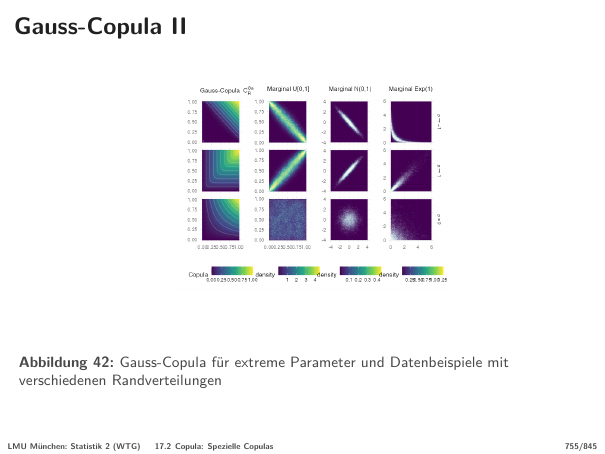

本页可识别的嵌入图片裁切：

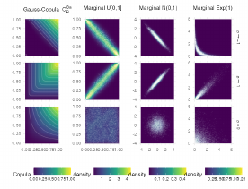

本页放在“模块一：Copula 把边际和依赖拆开”中，核心是理解 Copula（Copula）。直觉上先抓住标题里的对象：Copula（Copula）。然后看它是定义、例子、定理还是证明；定义页要记条件，例子页要看随机机制，证明页要看用了哪些闭包性或极限定理。

关键词：

- Copula（Copula）

本页需要抓住的德语线索：

- `Gauss-Copula II`
- `Abbildung 42: Gauss-Copula für extreme Parameter und Datenbeispiele mit`
- `verschiedenen Randverteilungen`

### Seite 51 - Copula（Copula）

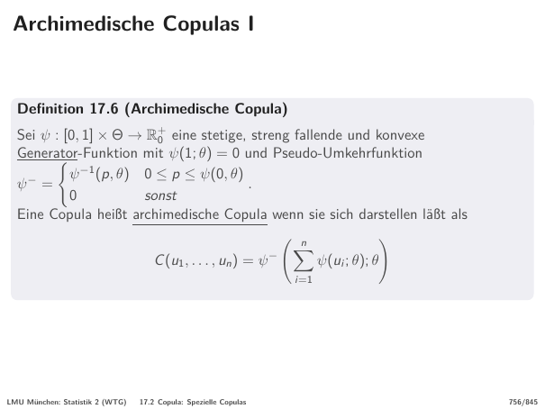

本页放在“模块一：Copula 把边际和依赖拆开”中，核心是理解 Copula（Copula）。直觉上先抓住标题里的对象：Copula（Copula）。然后看它是定义、例子、定理还是证明；定义页要记条件，例子页要看随机机制，证明页要看用了哪些闭包性或极限定理。

关键词：

- Copula（Copula）

本页需要抓住的德语线索：

- `Definition 17.6 (Archimedische Copula)`
- `Sei ψ : [0, 1] × Θ → R+ eine stetige, streng fallende und konvexe`
- `Generator-Funktion mit ψ(1; θ) = 0 und Pseudo-Umkehrfunktion`
- `ψ−1(p, θ) 0 ≤ p ≤ ψ(0, θ)`
- `ψ− = .`

### Seite 52 - Copula（Copula）

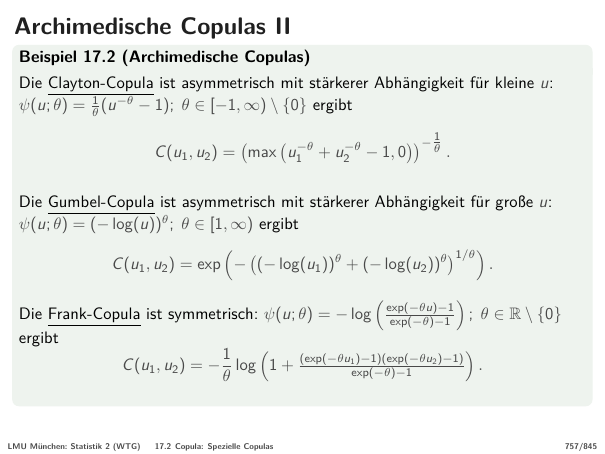

本页放在“模块一：Copula 把边际和依赖拆开”中，核心是理解 Copula（Copula）。直觉上先抓住标题里的对象：Copula（Copula）。然后看它是定义、例子、定理还是证明；定义页要记条件，例子页要看随机机制，证明页要看用了哪些闭包性或极限定理。

关键词：

- Copula（Copula）

本页需要抓住的德语线索：

- `Beispiel 17.2 (Archimedische Copulas)`
- `ψ(u; θ) = 1 (u−θ − 1); θ ∈ [−1, ∞) \ {0} ergibt`
- `C (u , u ) = (cid:0) max (cid:0) u−θ + u−θ − 1, 0 (cid:1)(cid:1)− θ .`
- `ψ(u; θ) = (− log(u))θ; θ ∈ [1, ∞) ergibt`
- `C (u , u ) = exp (cid:16) − (cid:0) (− log(u ))θ + (− log(u ))θ(cid:1)1/θ(cid:17) .`

### Seite 53 - Copula（Copula）

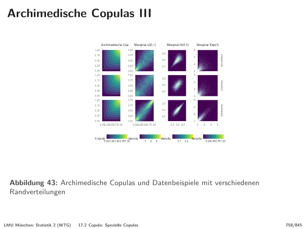

本页可识别的嵌入图片裁切：

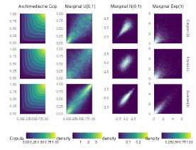

本页放在“模块一：Copula 把边际和依赖拆开”中，核心是理解 Copula（Copula）。直觉上先抓住标题里的对象：Copula（Copula）。然后看它是定义、例子、定理还是证明；定义页要记条件，例子页要看随机机制，证明页要看用了哪些闭包性或极限定理。

关键词：

- Copula（Copula）

本页需要抓住的德语线索：

- `Archimedische Copulas III`
- `Abbildung 43: Archimedische Copulas und Datenbeispiele mit verschiedenen`
- `Randverteilungen`

## 本章逻辑梳理

- **随机过程（Seite 1-39）：** Random Walk、Markov 链、MCMC、Gaussian 过程。
- **Copula（Seite 40-53）：** 边际与依赖分离。

复习时不要按页码硬背。先确认本页属于哪个模块，再问它是在定义对象、说明性质、给例子、证明定理，还是提醒适用边界。

## 关键考核点

1. 会定义简单随机游走和 Markov 性。
2. 会用转移矩阵计算有限状态 Markov 链分布。
3. 会解释平稳分布的方程 $\pi=\pi P$。
4. 会说明 Copula 如何连接联合分布与边际分布。

## 本章公式清单

### 随机过程与 Markov 链

| 序号 | 公式 | 使用场景 | 注意事项 |
| ---: | --- | --- | --- |
| 1 | $X_t=X_{t-1}+Z_t$ | 随机游走递推。 | $Z_t$ 是独立同分布增量。 |
| 2 | $P(X_{t+1}\mid X_t,\ldots,X_0)=P(X_{t+1}\mid X_t)$ | Markov 性。 | 未来只依赖当前状态。 |
| 3 | $\pi_{n+1}=\pi_nP$ | Markov 链分布更新。 | $P$ 是转移矩阵。 |
| 4 | $\pi=\pi P$ | 平稳分布。 | 长期不再被一步转移改变。 |

### Copula

| 序号 | 公式 | 使用场景 | 注意事项 |
| ---: | --- | --- | --- |
| 5 | $F_{X,Y}(x,y)=C(F_X(x),F_Y(y))$ | Sklar 定理的二维形式。 | Copula $C$ 描述依赖结构。 |
| 6 | $C(u,v)=uv$ | 独立 Copula。 | 对应独立变量。 |

## 章节自测

- [ ] Markov 链的未来在给定当前状态后还需要完整过去。
- [x] 平稳分布满足 $\pi=\pi P$。
- [ ] Copula 只描述边际分布，不描述依赖。

## 德语词汇表

| 德语 | 中文 | 使用场景 |
| --- | --- | --- |
| stochastischer Prozess | 随机过程 | 一族随机变量 |
| Random Walk | 随机游走 | 累积随机增量 |
| Markov-Eigenschaft | Markov 性 | 无记忆结构 |
| Übergangsmatrix | 转移矩阵 | 状态转移概率 |
| stationäre Verteilung | 平稳分布 | 转移后不变 |
| MCMC | Markov 链 Monte Carlo | 用链模拟目标分布 |
| Copula | Copula | 依赖结构函数 |

## C1 德语句式

| 序号 | 德语句式 | 中文翻译 | 适用场景 |
| ---: | --- | --- | --- |
| 1 | Die Markov-Eigenschaft besagt, dass die Zukunft bedingt auf die Gegenwart unabhängig von der Vergangenheit ist. | Markov 性表示：给定现在，未来与过去条件独立。 | 解释 Markov 链。 |
| 2 | Copulas erlauben es, Randverteilungen und Abhängigkeitsstruktur getrennt zu modellieren. | Copula 允许把边际分布和依赖结构分开建模。 | 解释 Copula 的价值。 |
