# 下学期第 07 章：附录：离散与连续分布

> 来源：`分章节讲义-下学期/07_Anhang_ Diskrete und Stetige Verteilungen.pdf`  
> 原讲义页码：S. 759-837  
> 图片目录：`assets/`  
> 核心主线：附录把常用离散和连续分布集中整理：从抽球模型和标准离散分布，到均匀、指数、Gamma、Beta、Cauchy、正态等连续分布。

## 章节知识树

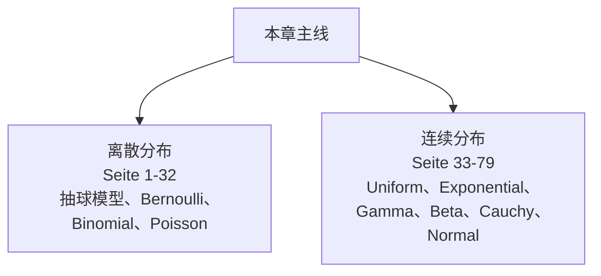
```mermaid
flowchart TD
  A["本章主线"]
  A --> M1["离散分布<br/>Seite 1-32<br/>抽球模型、Bernoulli、Binomial、Poisson"]
  A --> M2["连续分布<br/>Seite 33-79<br/>Uniform、Exponential、Gamma、Beta、Cauchy、Normal"]
```

## 学习路径

附录把常用离散和连续分布集中整理：从抽球模型和标准离散分布，到均匀、指数、Gamma、Beta、Cauchy、正态等连续分布。

1. **离散分布：** 抽球模型、Bernoulli、Binomial、Poisson（Seite 1-32）。
2. **连续分布：** Uniform、Exponential、Gamma、Beta、Cauchy、Normal（Seite 33-79）。

## 模块地图

| 模块 | 页码 | 核心问题 |
| --- | --- | --- |
| 离散分布 | Seite 1-32 | 抽球模型、Bernoulli、Binomial、Poisson |
| 连续分布 | Seite 33-79 | Uniform、Exponential、Gamma、Beta、Cauchy、Normal |

## 考试优先级

1. 会区分有放回/无放回、考虑/不考虑顺序的抽样空间。
2. 会写常见离散分布的 PMF、期望和方差。
3. 会写常见连续分布的密度、支撑集和参数含义。
4. 会说明 Poisson 近似二项、Gamma 与指数、Beta 与比例建模的关系。

## 模块零：抽球模型统一离散分布直觉（Seite 1-32）

有放回、无放回、是否考虑顺序，这三个问题决定了很多离散分布和组合公式。附录先用抽球模型把这些场景排清楚，再整理标准离散分布。

### Seite 1 - 分布（Verteilung）

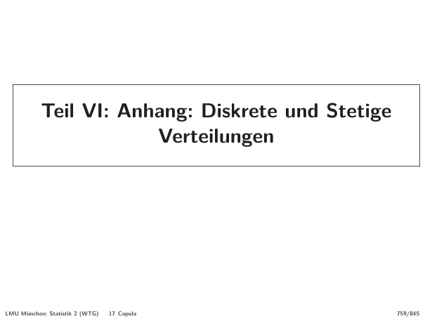

本页放在“模块零：抽球模型统一离散分布直觉”中，核心是理解 分布（Verteilung）。直觉上先抓住标题里的对象：分布（Verteilung）。然后看它是定义、例子、定理还是证明；定义页要记条件，例子页要看随机机制，证明页要看用了哪些闭包性或极限定理。

关键词：

- 分布（Verteilung）

本页需要抓住的德语线索：

- `Teil VI: Anhang: Diskrete und Stetige`
- `Verteilungen`

### Seite 2 - 离散分布（Diskrete Verteilungen）

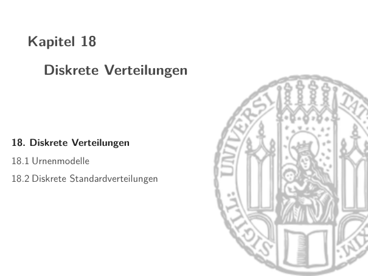

本页可识别的嵌入图片裁切：

本页放在“模块零：抽球模型统一离散分布直觉”中，核心是理解 分布（Verteilung）、 urn 模型/抽球模型（Urnenmodell）。直觉上先抓住标题里的对象：离散分布（Diskrete Verteilungen）。然后看它是定义、例子、定理还是证明；定义页要记条件，例子页要看随机机制，证明页要看用了哪些闭包性或极限定理。

关键词：

- 分布（Verteilung）
-  urn 模型/抽球模型（Urnenmodell）

本页需要抓住的德语线索：

- `Kapitel 18`
- `Diskrete Verteilungen`
- `18. Diskrete Verteilungen`

### Seite 3 - 离散分布（Diskrete Verteilungen）

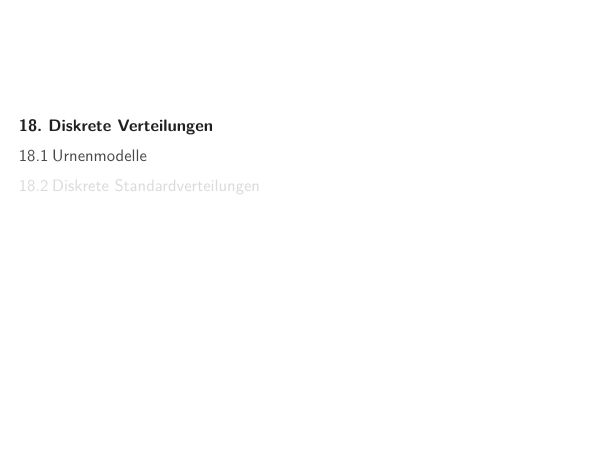

本页放在“模块零：抽球模型统一离散分布直觉”中，核心是理解 分布（Verteilung）、 urn 模型/抽球模型（Urnenmodell）。直觉上先抓住标题里的对象：离散分布（Diskrete Verteilungen）。然后看它是定义、例子、定理还是证明；定义页要记条件，例子页要看随机机制，证明页要看用了哪些闭包性或极限定理。

关键词：

- 分布（Verteilung）
-  urn 模型/抽球模型（Urnenmodell）

本页需要抓住的德语线索：

- `18. Diskrete Verteilungen`
- `18.1 Urnenmodelle`
- `18.2 Diskrete Standardverteilungen`

### Seite 4 - 抽球模型（Urnenmodelle）

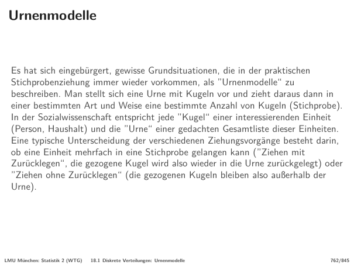

本页放在“模块零：抽球模型统一离散分布直觉”中，核心是理解  urn 模型/抽球模型（Urnenmodell）。直觉上先抓住标题里的对象：抽球模型（Urnenmodelle）。然后看它是定义、例子、定理还是证明；定义页要记条件，例子页要看随机机制，证明页要看用了哪些闭包性或极限定理。

关键词：

-  urn 模型/抽球模型（Urnenmodell）

本页需要抓住的德语线索：

- `Urnenmodelle`
- `Es hat sich eingebürgert, gewisse Grundsituationen, die in der praktischen`
- `Stichprobenziehung immer wieder vorkommen, als ”Urnenmodelle“ zu`

### Seite 5 - Ziehen mit Zurücklegen

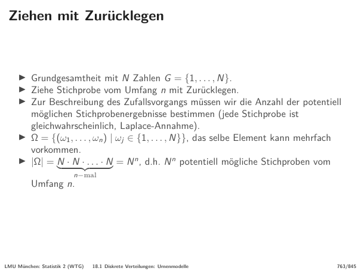

本页放在“模块零：抽球模型统一离散分布直觉”中，主要作用是推进 Seite 1-32 这一段的概念链。先把标题“Ziehen mit Zurücklegen”和前后页联系起来，再区分它是在给定义、展示例子、证明性质，还是做章节过渡。

本页需要抓住的德语线索：

- `Grundgesamtheit mit N Zahlen G = {1, . . . , N}.`
- `Ω = {(ω , . . . , ω ) | ω ∈ {1, . . . , N}}, das selbe Element kann mehrfach`
- `|Ω| = N · N · . . . · N = Nn, d.h. Nn potentiell mögliche Stichproben vom`

### Seite 6 - Ziehen ohne Zurücklegen

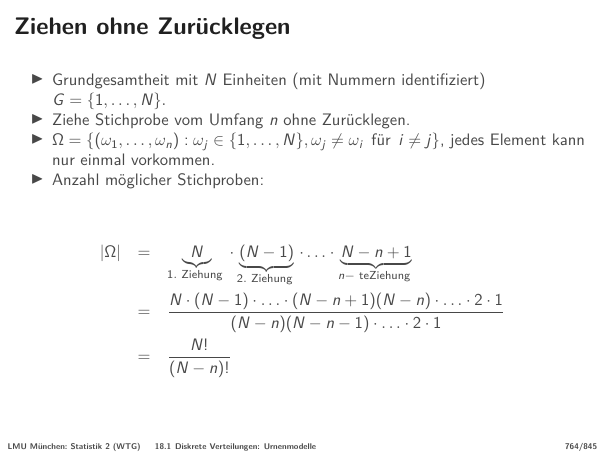

本页放在“模块零：抽球模型统一离散分布直觉”中，主要作用是推进 Seite 1-32 这一段的概念链。先把标题“Ziehen ohne Zurücklegen”和前后页联系起来，再区分它是在给定义、展示例子、证明性质，还是做章节过渡。

本页需要抓住的德语线索：

- `G = {1, . . . , N}.`
- `Ω = {(ω , . . . , ω ) : ω ∈ {1, . . . , N}, ω ̸= ω für i ̸= j}, jedes Element kann`
- `|Ω| = N · (N − 1) · . . . · N − n + 1`
- `=`
- `=`

### Seite 7 - Ziehen ohne Zurücklegen ohne Berücksichtigung der

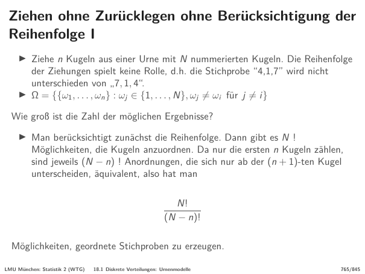

本页放在“模块零：抽球模型统一离散分布直觉”中，核心是理解 结果（Ergebnis）。直觉上先抓住标题里的对象：Ziehen ohne Zurücklegen ohne Berücksichtigung der。然后看它是定义、例子、定理还是证明；定义页要记条件，例子页要看随机机制，证明页要看用了哪些闭包性或极限定理。

关键词：

- 结果（Ergebnis）

本页需要抓住的德语线索：

- `Ω = {{ω , . . . , ω } : ω ∈ {1, . . . , N}, ω ̸= ω für j ̸= i}`

### Seite 8 - Ziehen ohne Zurücklegen ohne Berücksichtigung der

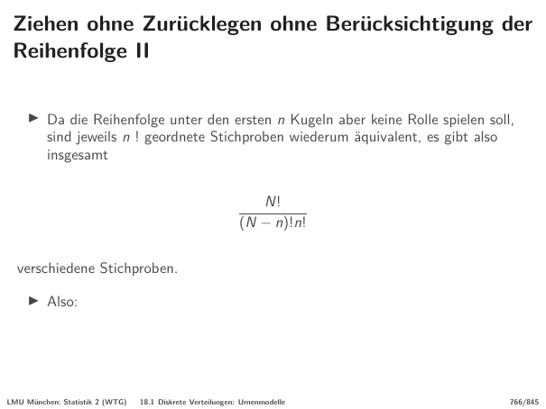

本页放在“模块零：抽球模型统一离散分布直觉”中，主要作用是推进 Seite 1-32 这一段的概念链。先把标题“Ziehen ohne Zurücklegen ohne Berücksichtigung der”和前后页联系起来，再区分它是在给定义、展示例子、证明性质，还是做章节过渡。

本页需要抓住的德语线索：

- `Ziehen ohne Zurücklegen ohne Berücksichtigung der`
- `Reihenfolge II`
- `Da die Reihenfolge unter den ersten n Kugeln aber keine Rolle spielen soll,`

### Seite 9 - Ziehen ohne Zurücklegen ohne Berücksichtigung der

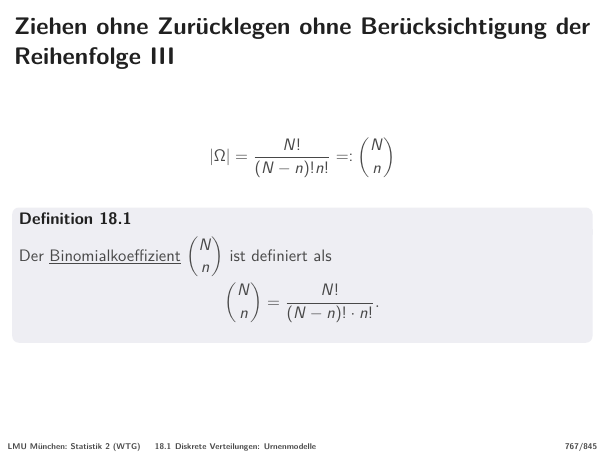

本页放在“模块零：抽球模型统一离散分布直觉”中，主要作用是推进 Seite 1-32 这一段的概念链。先把标题“Ziehen ohne Zurücklegen ohne Berücksichtigung der”和前后页联系起来，再区分它是在给定义、展示例子、证明性质，还是做章节过渡。

本页需要抓住的德语线索：

- `|Ω| = =:`
- `Definition 18.1`
- `= .`

### Seite 10 - Ziehen ohne Zurücklegen ohne Berücksichtigung der

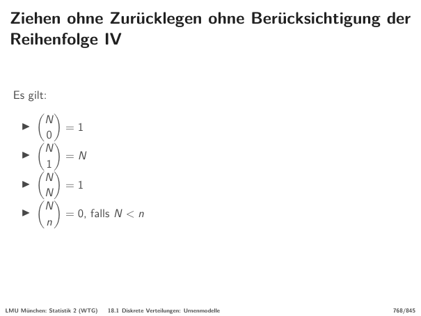

本页放在“模块零：抽球模型统一离散分布直觉”中，主要作用是推进 Seite 1-32 这一段的概念链。先把标题“Ziehen ohne Zurücklegen ohne Berücksichtigung der”和前后页联系起来，再区分它是在给定义、展示例子、证明性质，还是做章节过渡。

本页需要抓住的德语线索：

- `Es gilt:`
- `= 1`
- `= N`
- `= 1`
- `= 0, falls N < n`

### Seite 11 - Beispiel Lotto 6 aus 49 I

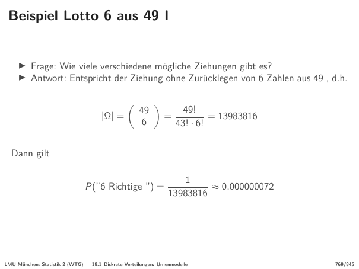

本页放在“模块零：抽球模型统一离散分布直觉”中，主要作用是推进 Seite 1-32 这一段的概念链。先把标题“Beispiel Lotto 6 aus 49 I”和前后页联系起来，再区分它是在给定义、展示例子、证明性质，还是做章节过渡。

本页需要抓住的德语线索：

- `Beispiel Lotto 6 aus 49 I`
- `|Ω| = = = 13983816`
- `P(”6 Richtige ”) = ≈ 0.000000072`

### Seite 12 - Beispiel Lotto 6 aus 49 II

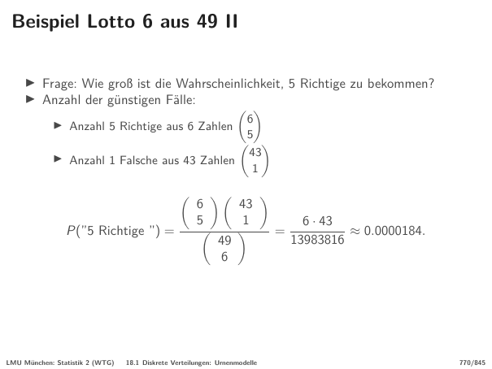

本页放在“模块零：抽球模型统一离散分布直觉”中，核心是理解 概率（Wahrscheinlichkeit）。直觉上先抓住标题里的对象：Beispiel Lotto 6 aus 49 II。然后看它是定义、例子、定理还是证明；定义页要记条件，例子页要看随机机制，证明页要看用了哪些闭包性或极限定理。

关键词：

- 概率（Wahrscheinlichkeit）

本页需要抓住的德语线索：

- `Beispiel Lotto 6 aus 49 II`
- `P(”5 Richtige ”) = = ≈ 0.0000184.`

### Seite 13 - 离散分布（Diskrete Verteilungen）

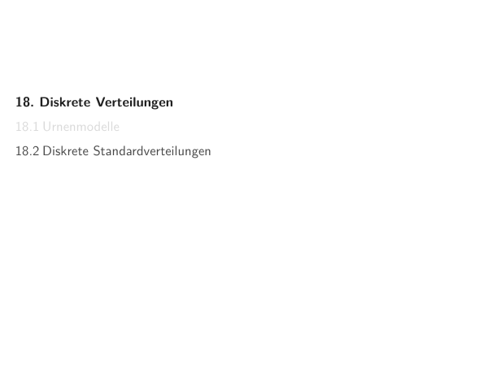

本页放在“模块零：抽球模型统一离散分布直觉”中，核心是理解 分布（Verteilung）、 urn 模型/抽球模型（Urnenmodell）。直觉上先抓住标题里的对象：离散分布（Diskrete Verteilungen）。然后看它是定义、例子、定理还是证明；定义页要记条件，例子页要看随机机制，证明页要看用了哪些闭包性或极限定理。

关键词：

- 分布（Verteilung）
-  urn 模型/抽球模型（Urnenmodell）

本页需要抓住的德语线索：

- `18. Diskrete Verteilungen`
- `18.1 Urnenmodelle`
- `18.2 Diskrete Standardverteilungen`

### Seite 14 - Diskrete Gleichverteilung I

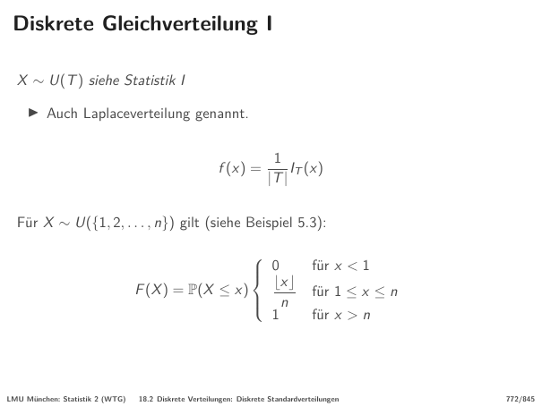

本页放在“模块零：抽球模型统一离散分布直觉”中，主要作用是推进 Seite 1-32 这一段的概念链。先把标题“Diskrete Gleichverteilung I”和前后页联系起来，再区分它是在给定义、展示例子、证明性质，还是做章节过渡。

本页需要抓住的德语线索：

- `f (x ) = I (x )`
- `Für X ∼ U({1, 2, . . . , n}) gilt (siehe Beispiel 5.3):`
- `F (X ) = P(X ≤ x ) für 1 ≤ x ≤ n`

### Seite 15 - Diskrete Gleichverteilung II

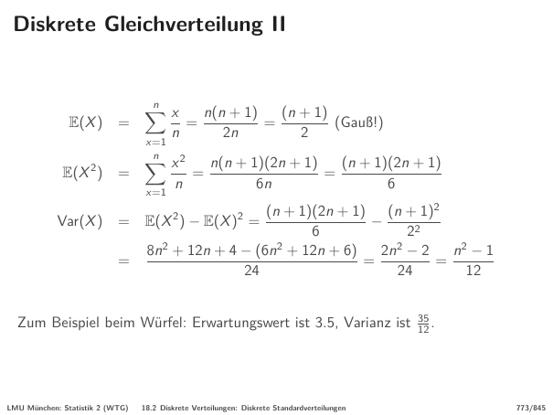

本页放在“模块零：抽球模型统一离散分布直觉”中，主要作用是推进 Seite 1-32 这一段的概念链。先把标题“Diskrete Gleichverteilung II”和前后页联系起来，再区分它是在给定义、展示例子、证明性质，还是做章节过渡。

本页需要抓住的德语线索：

- `E(X ) = = = (Gauß!)`
- `x=1`
- `E(X 2) = = =`
- `x=1`
- `Var(X ) = E(X 2) − E(X )2 = −`

### Seite 16 - Diskrete Gleichverteilung III

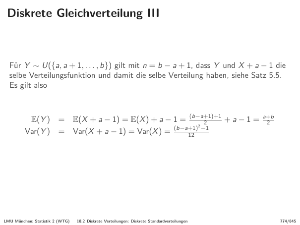

本页放在“模块零：抽球模型统一离散分布直觉”中，核心是理解 分布（Verteilung）、分布函数（Verteilungsfunktion）。直觉上先抓住标题里的对象：Diskrete Gleichverteilung III。然后看它是定义、例子、定理还是证明；定义页要记条件，例子页要看随机机制，证明页要看用了哪些闭包性或极限定理。

关键词：

- 分布（Verteilung）
- 分布函数（Verteilungsfunktion）

本页需要抓住的德语线索：

- `Für Y ∼ U({a, a + 1, . . . , b}) gilt mit n = b − a + 1, dass Y und X + a − 1 die`
- `selbe Verteilungsfunktion und damit die selbe Verteilung haben, siehe Satz 5.5.`
- `Es gilt also`
- `E(Y ) = E(X + a − 1) = E(X ) + a − 1 = (b−a+1)+1 + a − 1 = a+b`
- `Var(Y ) = Var(X + a − 1) = Var(X ) =`

### Seite 17 - 分布（Verteilung）

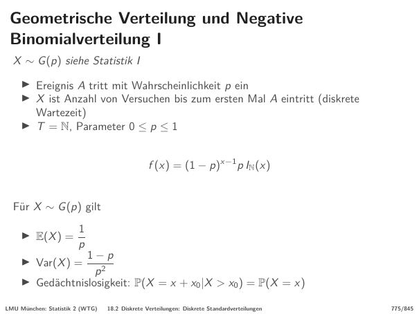

本页放在“模块零：抽球模型统一离散分布直觉”中，核心是理解 概率（Wahrscheinlichkeit）、事件（Ereignis）、分布（Verteilung）、二项分布（Binomialverteilung）。直觉上先抓住标题里的对象：分布（Verteilung）。然后看它是定义、例子、定理还是证明；定义页要记条件，例子页要看随机机制，证明页要看用了哪些闭包性或极限定理。

关键词：

- 概率（Wahrscheinlichkeit）
- 事件（Ereignis）
- 分布（Verteilung）
- 二项分布（Binomialverteilung）

本页需要抓住的德语线索：

- `T = N, Parameter 0 ≤ p ≤ 1`
- `f (x ) = (1 − p)x−1p IN(x )`
- `E(X ) =`
- `Var(X ) =`
- `Gedächtnislosigkeit: P(X = x + x |X > x ) = P(X = x )`

### Seite 18 - 分布（Verteilung）

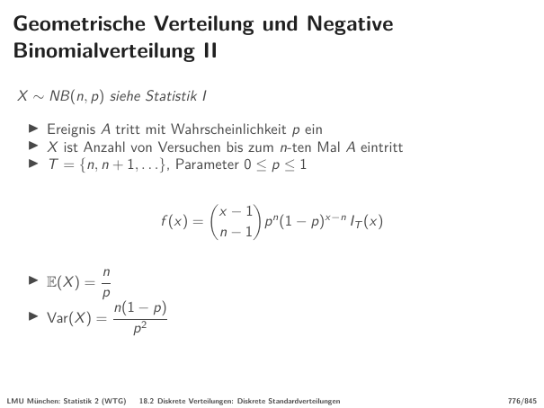

本页放在“模块零：抽球模型统一离散分布直觉”中，核心是理解 概率（Wahrscheinlichkeit）、事件（Ereignis）、分布（Verteilung）、二项分布（Binomialverteilung）。直觉上先抓住标题里的对象：分布（Verteilung）。然后看它是定义、例子、定理还是证明；定义页要记条件，例子页要看随机机制，证明页要看用了哪些闭包性或极限定理。

关键词：

- 概率（Wahrscheinlichkeit）
- 事件（Ereignis）
- 分布（Verteilung）
- 二项分布（Binomialverteilung）

本页需要抓住的德语线索：

- `T = {n, n + 1, . . .}, Parameter 0 ≤ p ≤ 1`
- `f (x ) = pn(1 − p)x−n I (x )`
- `E(X ) =`
- `Var(X ) =`

### Seite 19 - 分布（Verteilung）

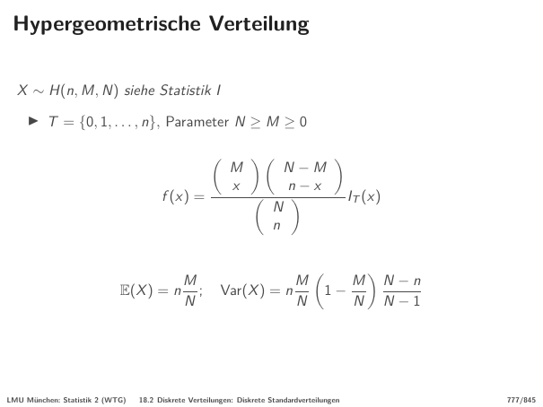

本页放在“模块零：抽球模型统一离散分布直觉”中，核心是理解 分布（Verteilung）。直觉上先抓住标题里的对象：分布（Verteilung）。然后看它是定义、例子、定理还是证明；定义页要记条件，例子页要看随机机制，证明页要看用了哪些闭包性或极限定理。

关键词：

- 分布（Verteilung）

本页需要抓住的德语线索：

- `T = {0, 1, . . . , n}, Parameter N ≥ M ≥ 0`
- `f (x ) = I (x )`
- `E(X ) = n ; Var(X ) = n 1 −`

### Seite 20 - 二项分布（Binomialverteilung）

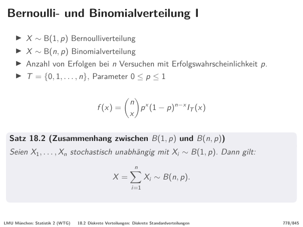

本页放在“模块零：抽球模型统一离散分布直觉”中，核心是理解 二项分布（Binomialverteilung）。直觉上先抓住标题里的对象：二项分布（Binomialverteilung）。然后看它是定义、例子、定理还是证明；定义页要记条件，例子页要看随机机制，证明页要看用了哪些闭包性或极限定理。

关键词：

- 二项分布（Binomialverteilung）

本页需要抓住的德语线索：

- `T = {0, 1, . . . , n}, Parameter 0 ≤ p ≤ 1`
- `f (x ) = px (1 − p)n−x I (x )`
- `Satz 18.2 (Zusammenhang zwischen B(1, p) und B(n, p))`
- `X = X ∼ B(n, p).`
- `i=1`

### Seite 21 - 二项分布（Binomialverteilung）

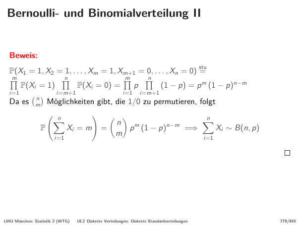

本页放在“模块零：抽球模型统一离散分布直觉”中，核心是理解 二项分布（Binomialverteilung）。直觉上先抓住标题里的对象：二项分布（Binomialverteilung）。然后看它是定义、例子、定理还是证明；定义页要记条件，例子页要看随机机制，证明页要看用了哪些闭包性或极限定理。

关键词：

- 二项分布（Binomialverteilung）

本页需要抓住的德语线索：

- `P(X = 1, X = 1, . . . , X = 1, X = 0, . . . , X = 0) s = tu`
- `Q P(X = 1) Q P(X = 0) = Q p Q (1 − p) = pm (1 − p)n−m`
- `i=1 i=m+1 i=1 i=m+1`
- `P X = m = pm (1 − p)n−m =⇒ X ∼ B(n, p)`
- `i=1 i=1`

### Seite 22 - 二项分布（Binomialverteilung）

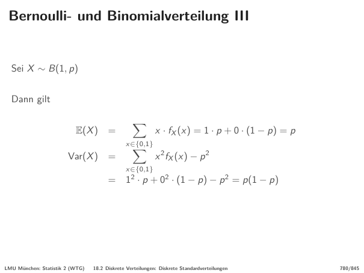

本页放在“模块零：抽球模型统一离散分布直觉”中，核心是理解 二项分布（Binomialverteilung）。直觉上先抓住标题里的对象：二项分布（Binomialverteilung）。然后看它是定义、例子、定理还是证明；定义页要记条件，例子页要看随机机制，证明页要看用了哪些闭包性或极限定理。

关键词：

- 二项分布（Binomialverteilung）

本页需要抓住的德语线索：

- `E(X ) = x · f (x ) = 1 · p + 0 · (1 − p) = p`
- `x∈{0,1}`
- `Var(X ) = x 2f (x ) − p2`
- `x∈{0,1}`
- `= 12 · p + 02 · (1 − p) − p2 = p(1 − p)`

### Seite 23 - 二项分布（Binomialverteilung）

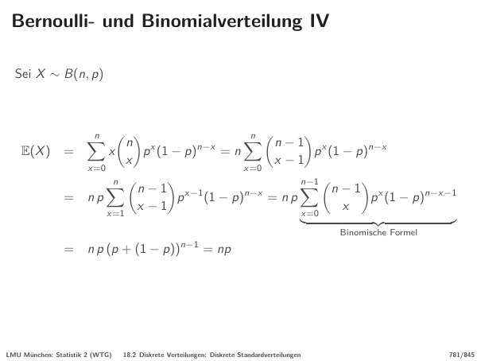

本页放在“模块零：抽球模型统一离散分布直觉”中，核心是理解 二项分布（Binomialverteilung）。直觉上先抓住标题里的对象：二项分布（Binomialverteilung）。然后看它是定义、例子、定理还是证明；定义页要记条件，例子页要看随机机制，证明页要看用了哪些闭包性或极限定理。

关键词：

- 二项分布（Binomialverteilung）

本页需要抓住的德语线索：

- `E(X ) = x px (1 − p)n−x = n px (1 − p)n−x`
- `x=0 x=0`
- `= n p px−1(1 − p)n−x = n p px (1 − p)n−x−1`
- `x=1 x=0`
- `= n p (p + (1 − p))n−1 = np`

### Seite 24 - 二项分布（Binomialverteilung）

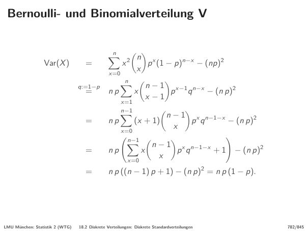

本页放在“模块零：抽球模型统一离散分布直觉”中，核心是理解 二项分布（Binomialverteilung）。直觉上先抓住标题里的对象：二项分布（Binomialverteilung）。然后看它是定义、例子、定理还是证明；定义页要记条件，例子页要看随机机制，证明页要看用了哪些闭包性或极限定理。

关键词：

- 二项分布（Binomialverteilung）

本页需要抓住的德语线索：

- `Var(X ) = x 2 px (1 − p)n−x − (np)2`
- `x=0`
- `q:= = 1−p n p X x n − 1 px−1qn−x − (n p)2`
- `x=1`
- `= n p (x + 1) px qn−1−x − (n p)2`

### Seite 25 - 分布（Verteilung）

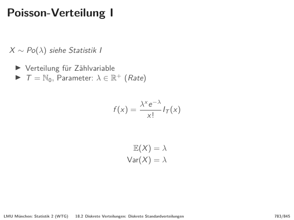

本页放在“模块零：抽球模型统一离散分布直觉”中，核心是理解 分布（Verteilung）、Poisson 分布（Poisson）。直觉上先抓住标题里的对象：分布（Verteilung）。然后看它是定义、例子、定理还是证明；定义页要记条件，例子页要看随机机制，证明页要看用了哪些闭包性或极限定理。

关键词：

- 分布（Verteilung）
- Poisson 分布（Poisson）

本页需要抓住的德语线索：

- `T = N , Parameter: λ ∈ R+ (Rate)`
- `f (x ) = I (x )`
- `E(X ) = λ`
- `Var(X ) = λ`

### Seite 26 - 分布（Verteilung）

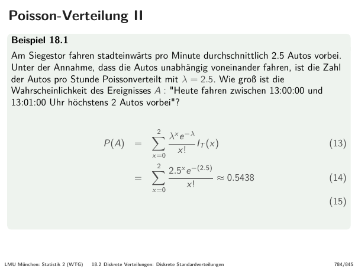

本页放在“模块零：抽球模型统一离散分布直觉”中，核心是理解 概率（Wahrscheinlichkeit）、事件（Ereignis）、分布（Verteilung）、Poisson 分布（Poisson）。直觉上先抓住标题里的对象：分布（Verteilung）。然后看它是定义、例子、定理还是证明；定义页要记条件，例子页要看随机机制，证明页要看用了哪些闭包性或极限定理。

关键词：

- 概率（Wahrscheinlichkeit）
- 事件（Ereignis）
- 分布（Verteilung）
- Poisson 分布（Poisson）

本页需要抓住的德语线索：

- `Beispiel 18.1`
- `der Autos pro Stunde Poissonverteilt mit λ = 2.5. Wie groß ist die`
- `P(A) = I (x ) (13)`
- `x=0`
- `= ≈ 0.5438 (14)`

### Seite 27 - 分布（Verteilung）

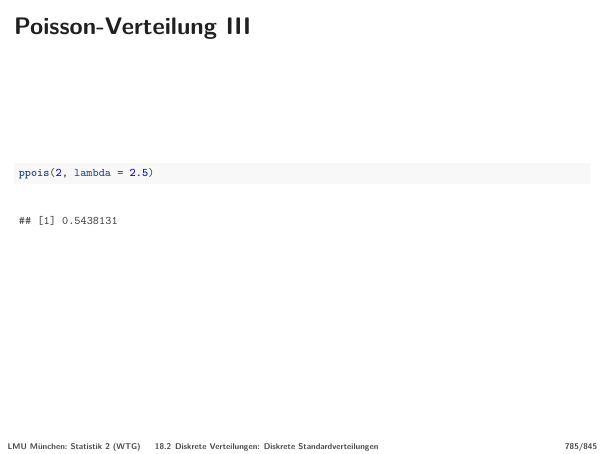

本页放在“模块零：抽球模型统一离散分布直觉”中，核心是理解 分布（Verteilung）、Poisson 分布（Poisson）。直觉上先抓住标题里的对象：分布（Verteilung）。然后看它是定义、例子、定理还是证明；定义页要记条件，例子页要看随机机制，证明页要看用了哪些闭包性或极限定理。

关键词：

- 分布（Verteilung）
- Poisson 分布（Poisson）

本页需要抓住的德语线索：

- `ppois(2, lambda = 2.5)`

### Seite 28 - 分布（Verteilung）

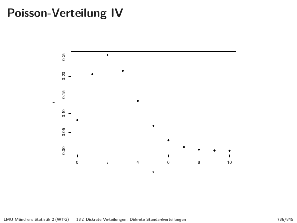

本页放在“模块零：抽球模型统一离散分布直觉”中，核心是理解 分布（Verteilung）、Poisson 分布（Poisson）。直觉上先抓住标题里的对象：分布（Verteilung）。然后看它是定义、例子、定理还是证明；定义页要记条件，例子页要看随机机制，证明页要看用了哪些闭包性或极限定理。

关键词：

- 分布（Verteilung）
- Poisson 分布（Poisson）

本页需要抓住的德语线索：

- `Poisson-Verteilung IV`
- `0 2 4 6 8 10`
- `52.0`

### Seite 29 - 分布（Verteilung）

本页可识别的嵌入图片裁切：

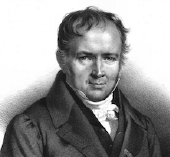

本页放在“模块零：抽球模型统一离散分布直觉”中，核心是理解 概率（Wahrscheinlichkeit）、分布（Verteilung）、Poisson 分布（Poisson）。直觉上先抓住标题里的对象：分布（Verteilung）。然后看它是定义、例子、定理还是证明；定义页要记条件，例子页要看随机机制，证明页要看用了哪些闭包性或极限定理。

关键词：

- 概率（Wahrscheinlichkeit）
- 分布（Verteilung）
- Poisson 分布（Poisson）

本页需要抓住的德语线索：

- `Poisson-Verteilung V`
- `Siméon Denis Poisson (1781–1840)`
- `Französischer Physiker und Mathematiker.`

### Seite 30 - 分布（Verteilung）

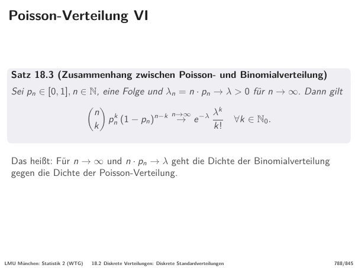

本页放在“模块零：抽球模型统一离散分布直觉”中，核心是理解 分布（Verteilung）、密度（Dichte）、二项分布（Binomialverteilung）、Poisson 分布（Poisson）。直觉上先抓住标题里的对象：分布（Verteilung）。然后看它是定义、例子、定理还是证明；定义页要记条件，例子页要看随机机制，证明页要看用了哪些闭包性或极限定理。

关键词：

- 分布（Verteilung）
- 密度（Dichte）
- 二项分布（Binomialverteilung）
- Poisson 分布（Poisson）

本页需要抓住的德语线索：

- `Satz 18.3 (Zusammenhang zwischen Poisson- und Binomialverteilung)`
- `Sei p ∈ [0, 1], n ∈ N, eine Folge und λ = n · p → λ > 0 für n → ∞. Dann gilt`
- `pk (1 − p )n−k n→ → ∞ e−λ ∀k ∈ N .`
- `Das heißt: Für n → ∞ und n · p → λ geht die Dichte der Binomialverteilung`

### Seite 31 - 分布（Verteilung）

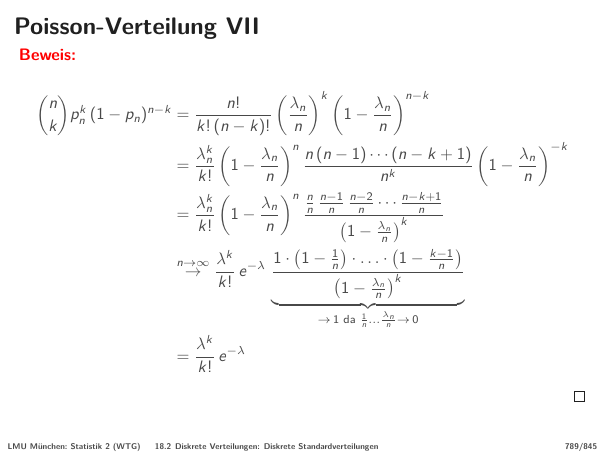

本页放在“模块零：抽球模型统一离散分布直觉”中，核心是理解 分布（Verteilung）、Poisson 分布（Poisson）。直觉上先抓住标题里的对象：分布（Verteilung）。然后看它是定义、例子、定理还是证明；定义页要记条件，例子页要看随机机制，证明页要看用了哪些闭包性或极限定理。

关键词：

- 分布（Verteilung）
- Poisson 分布（Poisson）

本页需要抓住的德语线索：

- `pk (1 − p )n−k = n 1 − n`
- `= n 1 − n 1 − n`
- `= n 1 − n n n n n`
- `n→ → ∞ e−λ n n`
- `→ 1 da 1 ... λn → 0`

### Seite 32 - 分布（Verteilung）

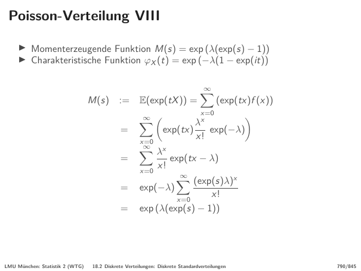

本页放在“模块零：抽球模型统一离散分布直觉”中，核心是理解 分布（Verteilung）、Poisson 分布（Poisson）。直觉上先抓住标题里的对象：分布（Verteilung）。然后看它是定义、例子、定理还是证明；定义页要记条件，例子页要看随机机制，证明页要看用了哪些闭包性或极限定理。

关键词：

- 分布（Verteilung）
- Poisson 分布（Poisson）

本页需要抓住的德语线索：

- `Momenterzeugende Funktion M(s) = exp (λ(exp(s) − 1))`
- `Charakteristische Funktion φ (t) = exp (−λ(1 − exp(it))`
- `M(s) := E(exp(tX )) = (exp(tx )f (x ))`
- `x=0`
- `= exp(tx ) exp(−λ)`

## 模块一：连续分布按随机机制和形状记忆（Seite 33-79）

连续分布不要死背公式。均匀分布对应区间无偏信息，指数分布对应等待时间，Gamma 是等待时间和，Beta 适合比例，Cauchy 是反例，正态是极限定理核心。

### Seite 33 - 连续分布（Stetige Verteilungen）

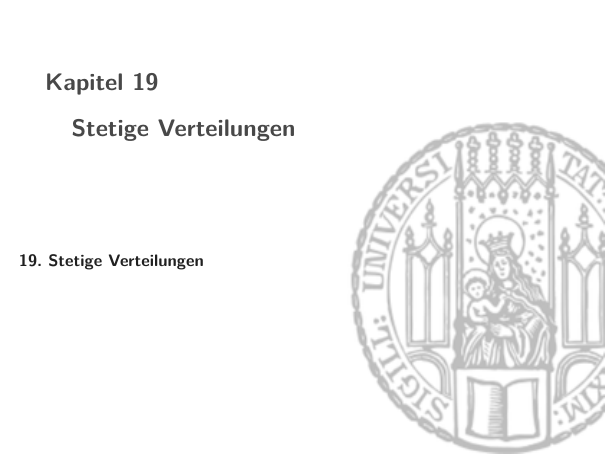

本页可识别的嵌入图片裁切：

本页放在“模块一：连续分布按随机机制和形状记忆”中，核心是理解 分布（Verteilung）。直觉上先抓住标题里的对象：连续分布（Stetige Verteilungen）。然后看它是定义、例子、定理还是证明；定义页要记条件，例子页要看随机机制，证明页要看用了哪些闭包性或极限定理。

关键词：

- 分布（Verteilung）

本页需要抓住的德语线索：

- `Kapitel 19`
- `Stetige Verteilungen`
- `19. Stetige Verteilungen`

### Seite 34 - Stetige Gleichverteilung I

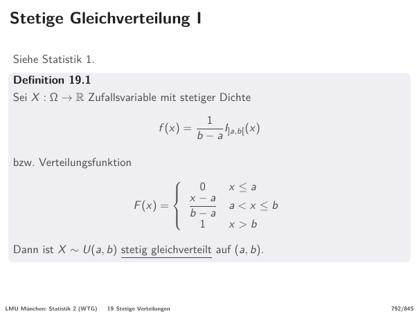

本页放在“模块一：连续分布按随机机制和形状记忆”中，核心是理解 随机变量（Zufallsvariable）、分布（Verteilung）、分布函数（Verteilungsfunktion）、密度（Dichte）。直觉上先抓住标题里的对象：Stetige Gleichverteilung I。然后看它是定义、例子、定理还是证明；定义页要记条件，例子页要看随机机制，证明页要看用了哪些闭包性或极限定理。

关键词：

- 随机变量（Zufallsvariable）
- 分布（Verteilung）
- 分布函数（Verteilungsfunktion）
- 密度（Dichte）

本页需要抓住的德语线索：

- `Definition 19.1`
- `Sei X : Ω → R Zufallsvariable mit stetiger Dichte`
- `f (x ) = I (x )`
- `0 x ≤ a`
- `F (x ) = a < x ≤ b`

### Seite 35 - Stetige Gleichverteilung II

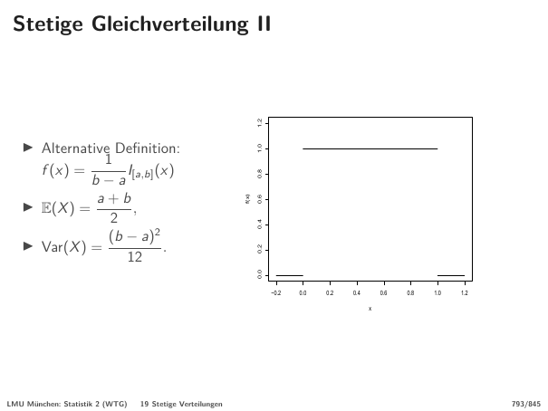

本页放在“模块一：连续分布按随机机制和形状记忆”中，主要作用是推进 Seite 33-79 这一段的概念链。先把标题“Stetige Gleichverteilung II”和前后页联系起来，再区分它是在给定义、展示例子、证明性质，还是做章节过渡。

本页需要抓住的德语线索：

- `Alternative Definition:`
- `f (x ) = I (x )`
- `a + b  E(X ) = ,`
- `Var(X ) = .`

### Seite 36 - 指数分布（Exponentialverteilung）

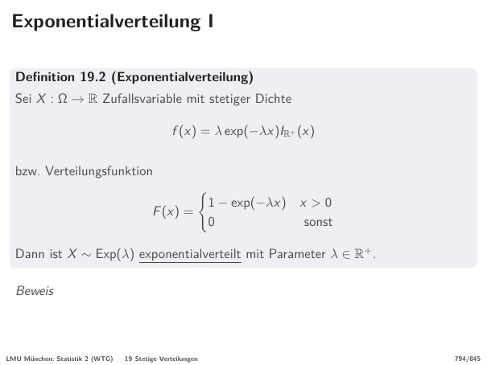

本页放在“模块一：连续分布按随机机制和形状记忆”中，核心是理解 随机变量（Zufallsvariable）、分布（Verteilung）、分布函数（Verteilungsfunktion）、密度（Dichte）。直觉上先抓住标题里的对象：指数分布（Exponentialverteilung）。然后看它是定义、例子、定理还是证明；定义页要记条件，例子页要看随机机制，证明页要看用了哪些闭包性或极限定理。

关键词：

- 随机变量（Zufallsvariable）
- 分布（Verteilung）
- 分布函数（Verteilungsfunktion）
- 密度（Dichte）
- 指数分布（Exponentialverteilung）

本页需要抓住的德语线索：

- `Definition 19.2 (Exponentialverteilung)`
- `Sei X : Ω → R Zufallsvariable mit stetiger Dichte`
- `f (x ) = λ exp(−λx )IR+ (x )`
- `F (x ) =`
- `Dann ist X ∼ Exp(λ) exponentialverteilt mit Parameter λ ∈ R+.`

### Seite 37 - 指数分布（Exponentialverteilung）

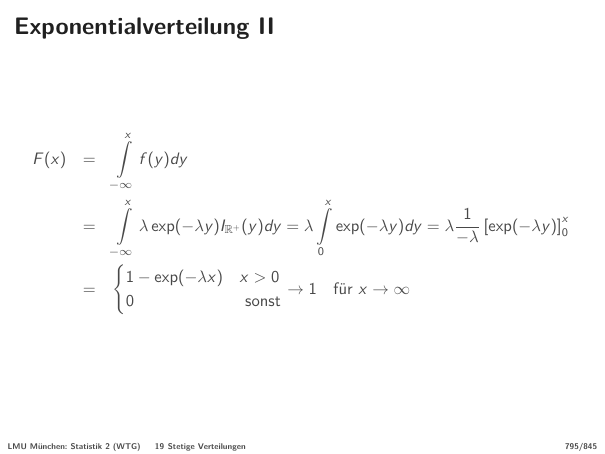

本页放在“模块一：连续分布按随机机制和形状记忆”中，核心是理解 指数分布（Exponentialverteilung）。直觉上先抓住标题里的对象：指数分布（Exponentialverteilung）。然后看它是定义、例子、定理还是证明；定义页要记条件，例子页要看随机机制，证明页要看用了哪些闭包性或极限定理。

关键词：

- 指数分布（Exponentialverteilung）

本页需要抓住的德语线索：

- `F (x ) = f (y )dy`
- `= λ exp(−λy )IR+ (y )dy = λ exp(−λy )dy = λ`
- `= → 1 für x → ∞`

### Seite 38 - 指数分布（Exponentialverteilung）

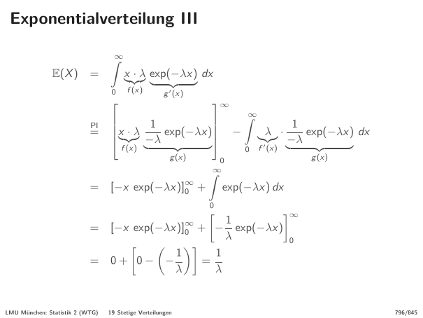

本页放在“模块一：连续分布按随机机制和形状记忆”中，核心是理解 指数分布（Exponentialverteilung）。直觉上先抓住标题里的对象：指数分布（Exponentialverteilung）。然后看它是定义、例子、定理还是证明；定义页要记条件，例子页要看随机机制，证明页要看用了哪些闭包性或极限定理。

关键词：

- 指数分布（Exponentialverteilung）

本页需要抓住的德语线索：

- `E(X ) = x · λ exp(−λx ) dx`
- `= x · λ exp(−λx ) − λ · exp(−λx ) dx`
- `= [−x exp(−λx )]∞ + exp(−λx ) dx`
- `= [−x exp(−λx )]∞ + − exp(−λx )`
- `= 0 + 0 − − =`

### Seite 39 - 指数分布（Exponentialverteilung）

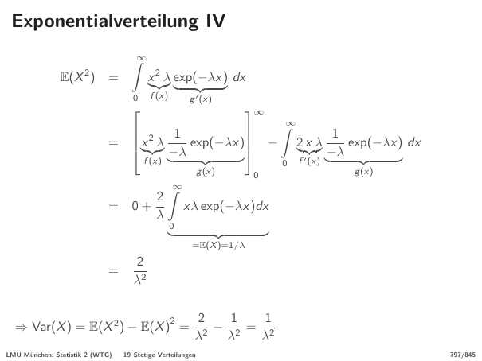

本页放在“模块一：连续分布按随机机制和形状记忆”中，核心是理解 指数分布（Exponentialverteilung）。直觉上先抓住标题里的对象：指数分布（Exponentialverteilung）。然后看它是定义、例子、定理还是证明；定义页要记条件，例子页要看随机机制，证明页要看用了哪些闭包性或极限定理。

关键词：

- 指数分布（Exponentialverteilung）

本页需要抓住的德语线索：

- `E(X 2) = x 2 λ exp(−λx ) dx`
- `=  x 2 λ 1 exp(−λx )   − Z 2 x λ 1 exp(−λx ) dx`
- `= 0 + x λ exp(−λx )dx`
- `=E(X)=1/λ`
- `=`

### Seite 40 - 指数分布（Exponentialverteilung）

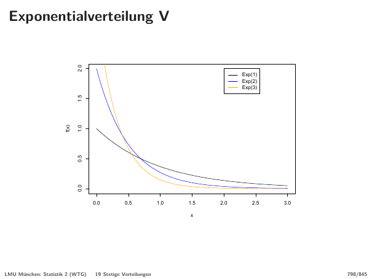

本页放在“模块一：连续分布按随机机制和形状记忆”中，核心是理解 指数分布（Exponentialverteilung）。直觉上先抓住标题里的对象：指数分布（Exponentialverteilung）。然后看它是定义、例子、定理还是证明；定义页要记条件，例子页要看随机机制，证明页要看用了哪些闭包性或极限定理。

关键词：

- 指数分布（Exponentialverteilung）

本页需要抓住的德语线索：

- `Exponentialverteilung V`
- `0.0 0.5 1.0 1.5 2.0 2.5 3.0`
- `0.2`

### Seite 41 - 指数分布（Exponentialverteilung）

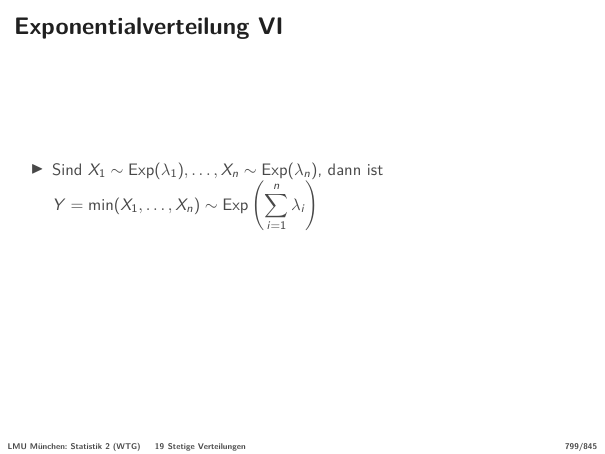

本页放在“模块一：连续分布按随机机制和形状记忆”中，核心是理解 指数分布（Exponentialverteilung）。直觉上先抓住标题里的对象：指数分布（Exponentialverteilung）。然后看它是定义、例子、定理还是证明；定义页要记条件，例子页要看随机机制，证明页要看用了哪些闭包性或极限定理。

关键词：

- 指数分布（Exponentialverteilung）

本页需要抓住的德语线索：

- `Y = min(X , . . . , X ) ∼ Exp λ`
- `i=1`

### Seite 42 - Lebensdauern I

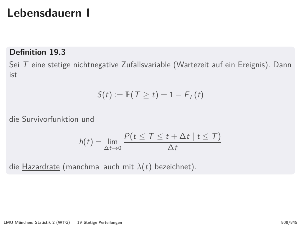

本页放在“模块一：连续分布按随机机制和形状记忆”中，核心是理解 事件（Ereignis）、随机变量（Zufallsvariable）。直觉上先抓住标题里的对象：Lebensdauern I。然后看它是定义、例子、定理还是证明；定义页要记条件，例子页要看随机机制，证明页要看用了哪些闭包性或极限定理。

关键词：

- 事件（Ereignis）
- 随机变量（Zufallsvariable）

本页需要抓住的德语线索：

- `Definition 19.3`
- `S(t) := P(T ≥ t) = 1 − F (t)`
- `P(t ≤ T ≤ t + ∆t | t ≤ T )`
- `h(t) = lim`
- `∆t→0 ∆t`

### Seite 43 - Lebensdauern II

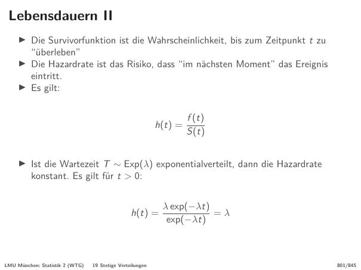

本页放在“模块一：连续分布按随机机制和形状记忆”中，核心是理解 概率（Wahrscheinlichkeit）、事件（Ereignis）。直觉上先抓住标题里的对象：Lebensdauern II。然后看它是定义、例子、定理还是证明；定义页要记条件，例子页要看随机机制，证明页要看用了哪些闭包性或极限定理。

关键词：

- 概率（Wahrscheinlichkeit）
- 事件（Ereignis）

本页需要抓住的德语线索：

- `Es gilt:`
- `h(t) =`
- `konstant. Es gilt für t > 0:`
- `h(t) = = λ`

### Seite 44 - Lebensdauern III

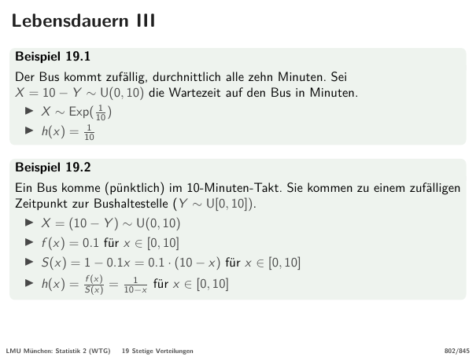

本页放在“模块一：连续分布按随机机制和形状记忆”中，主要作用是推进 Seite 33-79 这一段的概念链。先把标题“Lebensdauern III”和前后页联系起来，再区分它是在给定义、展示例子、证明性质，还是做章节过渡。

本页需要抓住的德语线索：

- `Beispiel 19.1`
- `X = 10 − Y ∼ U(0, 10) die Wartezeit auf den Bus in Minuten.`
- `h(x ) = 1`
- `Beispiel 19.2`
- `X = (10 − Y ) ∼ U(0, 10)`

### Seite 45 - 分布（Verteilung）

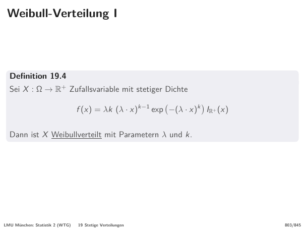

本页放在“模块一：连续分布按随机机制和形状记忆”中，核心是理解 随机变量（Zufallsvariable）、分布（Verteilung）、密度（Dichte）。直觉上先抓住标题里的对象：分布（Verteilung）。然后看它是定义、例子、定理还是证明；定义页要记条件，例子页要看随机机制，证明页要看用了哪些闭包性或极限定理。

关键词：

- 随机变量（Zufallsvariable）
- 分布（Verteilung）
- 密度（Dichte）

本页需要抓住的德语线索：

- `Definition 19.4`
- `Sei X : Ω → R+ Zufallsvariable mit stetiger Dichte`
- `f (x ) = λk (λ · x )k−1 exp (cid:0) −(λ · x )k (cid:1) IR+ (x )`

### Seite 46 - 分布（Verteilung）

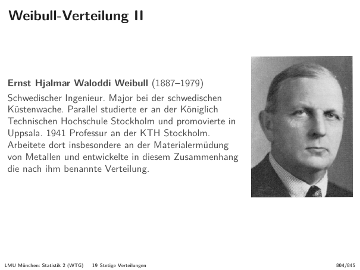

本页可识别的嵌入图片裁切：

本页放在“模块一：连续分布按随机机制和形状记忆”中，核心是理解 分布（Verteilung）。直觉上先抓住标题里的对象：分布（Verteilung）。然后看它是定义、例子、定理还是证明；定义页要记条件，例子页要看随机机制，证明页要看用了哪些闭包性或极限定理。

关键词：

- 分布（Verteilung）

本页需要抓住的德语线索：

- `Weibull-Verteilung II`
- `Ernst Hjalmar Waloddi Weibull (1887–1979)`
- `Schwedischer Ingenieur. Major bei der schwedischen`

### Seite 47 - 分布（Verteilung）

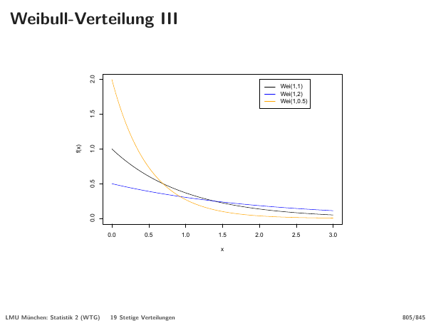

本页放在“模块一：连续分布按随机机制和形状记忆”中，核心是理解 分布（Verteilung）。直觉上先抓住标题里的对象：分布（Verteilung）。然后看它是定义、例子、定理还是证明；定义页要记条件，例子页要看随机机制，证明页要看用了哪些闭包性或极限定理。

关键词：

- 分布（Verteilung）

本页需要抓住的德语线索：

- `Weibull-Verteilung III`
- `0.0 0.5 1.0 1.5 2.0 2.5 3.0`
- `0.2`

### Seite 48 - 分布（Verteilung）

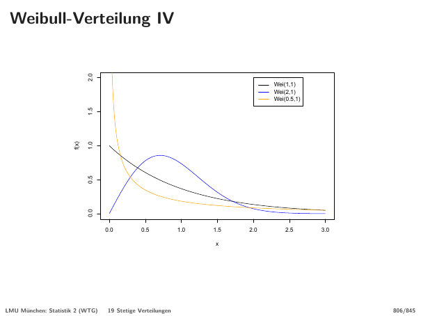

本页放在“模块一：连续分布按随机机制和形状记忆”中，核心是理解 分布（Verteilung）。直觉上先抓住标题里的对象：分布（Verteilung）。然后看它是定义、例子、定理还是证明；定义页要记条件，例子页要看随机机制，证明页要看用了哪些闭包性或极限定理。

关键词：

- 分布（Verteilung）

本页需要抓住的德语线索：

- `Weibull-Verteilung IV`
- `0.0 0.5 1.0 1.5 2.0 2.5 3.0`
- `0.2`

### Seite 49 - 分布（Verteilung）

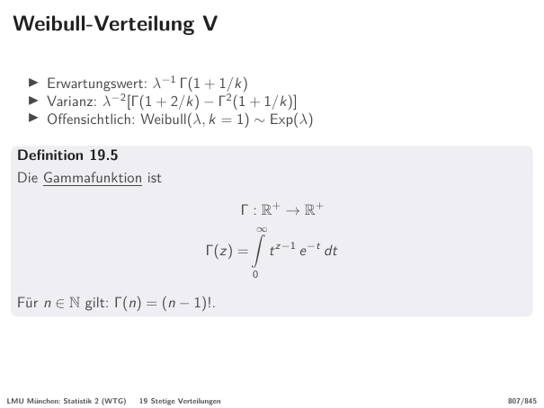

本页放在“模块一：连续分布按随机机制和形状记忆”中，核心是理解 分布（Verteilung）、期望（Erwartungswert）、方差（Varianz）、Gamma 分布（Gamma）。直觉上先抓住标题里的对象：分布（Verteilung）。然后看它是定义、例子、定理还是证明；定义页要记条件，例子页要看随机机制，证明页要看用了哪些闭包性或极限定理。

关键词：

- 分布（Verteilung）
- 期望（Erwartungswert）
- 方差（Varianz）
- Gamma 分布（Gamma）

本页需要抓住的德语线索：

- `Offensichtlich: Weibull(λ, k = 1) ∼ Exp(λ)`
- `Definition 19.5`
- `Γ : R+ → R+`
- `Γ(z) = tz−1 e−t dt`
- `Für n ∈ N gilt: Γ(n) = (n − 1)!.`

### Seite 50 - 分布（Verteilung）

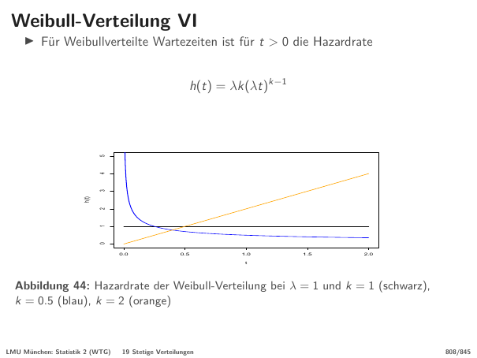

本页放在“模块一：连续分布按随机机制和形状记忆”中，核心是理解 分布（Verteilung）。直觉上先抓住标题里的对象：分布（Verteilung）。然后看它是定义、例子、定理还是证明；定义页要记条件，例子页要看随机机制，证明页要看用了哪些闭包性或极限定理。

关键词：

- 分布（Verteilung）

本页需要抓住的德语线索：

- `h(t) = λk(λt)k−1`
- `Abbildung 44: Hazardrate der Weibull-Verteilung bei λ = 1 und k = 1 (schwarz),`
- `k = 0.5 (blau), k = 2 (orange)`

### Seite 51 - 分布（Verteilung）

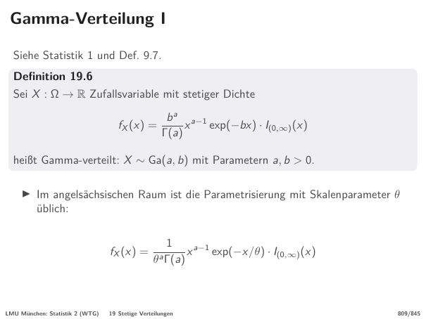

本页放在“模块一：连续分布按随机机制和形状记忆”中，核心是理解 随机变量（Zufallsvariable）、分布（Verteilung）、密度（Dichte）、Gamma 分布（Gamma）。直觉上先抓住标题里的对象：分布（Verteilung）。然后看它是定义、例子、定理还是证明；定义页要记条件，例子页要看随机机制，证明页要看用了哪些闭包性或极限定理。

关键词：

- 随机变量（Zufallsvariable）
- 分布（Verteilung）
- 密度（Dichte）
- Gamma 分布（Gamma）

本页需要抓住的德语线索：

- `Definition 19.6`
- `Sei X : Ω → R Zufallsvariable mit stetiger Dichte`
- `f (x ) = x a−1 exp(−bx ) · I (x )`
- `f (x ) = x a−1 exp(−x /θ) · I (x )`

### Seite 52 - 分布（Verteilung）

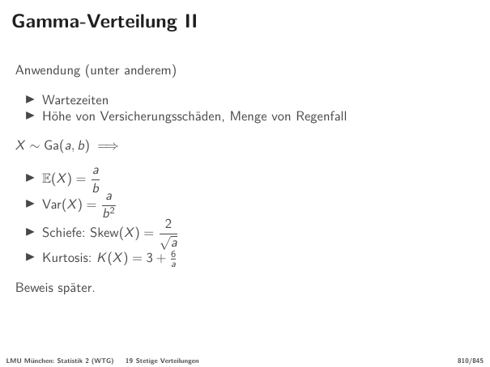

本页放在“模块一：连续分布按随机机制和形状记忆”中，核心是理解 集合（Menge）、分布（Verteilung）、Gamma 分布（Gamma）。直觉上先抓住标题里的对象：分布（Verteilung）。然后看它是定义、例子、定理还是证明；定义页要记条件，例子页要看随机机制，证明页要看用了哪些闭包性或极限定理。

关键词：

- 集合（Menge）
- 分布（Verteilung）
- Gamma 分布（Gamma）

本页需要抓住的德语线索：

- `X ∼ Ga(a, b) =⇒`
- `E(X ) =`
- `Var(X ) =`
- `Schiefe: Skew(X ) = √`
- `Kurtosis: K (X ) = 3 + 6`

### Seite 53 - 分布（Verteilung）

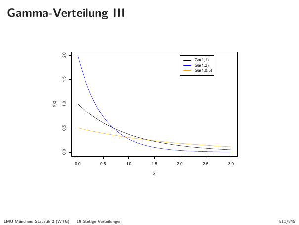

本页放在“模块一：连续分布按随机机制和形状记忆”中，核心是理解 分布（Verteilung）、Gamma 分布（Gamma）。直觉上先抓住标题里的对象：分布（Verteilung）。然后看它是定义、例子、定理还是证明；定义页要记条件，例子页要看随机机制，证明页要看用了哪些闭包性或极限定理。

关键词：

- 分布（Verteilung）
- Gamma 分布（Gamma）

本页需要抓住的德语线索：

- `Gamma-Verteilung III`
- `0.0 0.5 1.0 1.5 2.0 2.5 3.0`
- `0.2`

### Seite 54 - 分布（Verteilung）

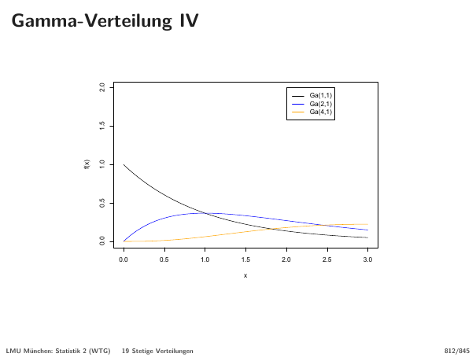

本页放在“模块一：连续分布按随机机制和形状记忆”中，核心是理解 分布（Verteilung）、Gamma 分布（Gamma）。直觉上先抓住标题里的对象：分布（Verteilung）。然后看它是定义、例子、定理还是证明；定义页要记条件，例子页要看随机机制，证明页要看用了哪些闭包性或极限定理。

关键词：

- 分布（Verteilung）
- Gamma 分布（Gamma）

本页需要抓住的德语线索：

- `Gamma-Verteilung IV`
- `0.0 0.5 1.0 1.5 2.0 2.5 3.0`
- `0.2`

### Seite 55 - 分布（Verteilung）

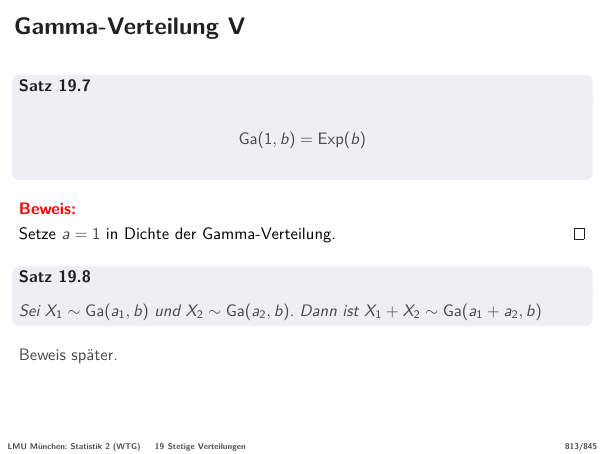

本页放在“模块一：连续分布按随机机制和形状记忆”中，核心是理解 分布（Verteilung）、密度（Dichte）、Gamma 分布（Gamma）。直觉上先抓住标题里的对象：分布（Verteilung）。然后看它是定义、例子、定理还是证明；定义页要记条件，例子页要看随机机制，证明页要看用了哪些闭包性或极限定理。

关键词：

- 分布（Verteilung）
- 密度（Dichte）
- Gamma 分布（Gamma）

本页需要抓住的德语线索：

- `Satz 19.7`
- `Ga(1, b) = Exp(b)`
- `Setze a = 1 in Dichte der Gamma-Verteilung.`
- `Satz 19.8`

### Seite 56 - 分布（Verteilung）

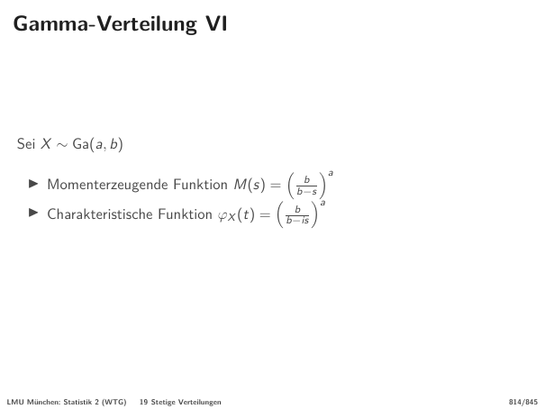

本页放在“模块一：连续分布按随机机制和形状记忆”中，核心是理解 分布（Verteilung）、Gamma 分布（Gamma）。直觉上先抓住标题里的对象：分布（Verteilung）。然后看它是定义、例子、定理还是证明；定义页要记条件，例子页要看随机机制，证明页要看用了哪些闭包性或极限定理。

关键词：

- 分布（Verteilung）
- Gamma 分布（Gamma）

本页需要抓住的德语线索：

- `Momenterzeugende Funktion M(s) = b`
- `Charakteristische Funktion φ (t) = b`

### Seite 57 - 分布（Verteilung）

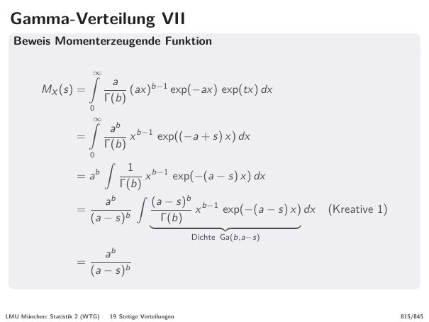

本页放在“模块一：连续分布按随机机制和形状记忆”中，核心是理解 分布（Verteilung）、Gamma 分布（Gamma）。直觉上先抓住标题里的对象：分布（Verteilung）。然后看它是定义、例子、定理还是证明；定义页要记条件，例子页要看随机机制，证明页要看用了哪些闭包性或极限定理。

关键词：

- 分布（Verteilung）
- Gamma 分布（Gamma）

本页需要抓住的德语线索：

- `M (s) = (ax )b−1 exp(−ax ) exp(tx ) dx`
- `= x b−1 exp((−a + s) x ) dx`
- `= ab x b−1 exp(−(a − s) x ) dx`
- `= x b−1 exp(−(a − s) x ) dx (Kreative 1)`
- `=`

### Seite 58 - 分布（Verteilung）

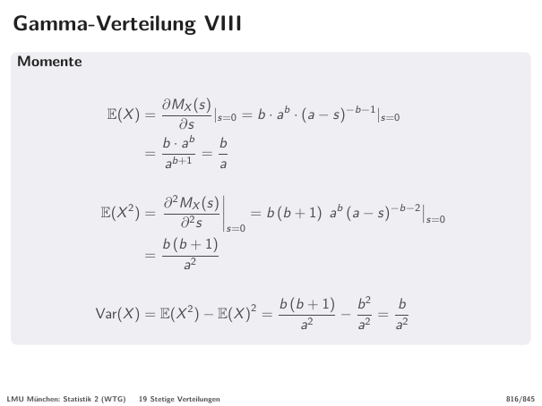

本页放在“模块一：连续分布按随机机制和形状记忆”中，核心是理解 分布（Verteilung）、Gamma 分布（Gamma）。直觉上先抓住标题里的对象：分布（Verteilung）。然后看它是定义、例子、定理还是证明；定义页要记条件，例子页要看随机机制，证明页要看用了哪些闭包性或极限定理。

关键词：

- 分布（Verteilung）
- Gamma 分布（Gamma）

本页需要抓住的德语线索：

- `E(X ) = X | = b · ab · (a − s)−b−1|`
- `∂s s=0 s=0`
- `= =`
- `E(X 2) = ∂2M X (s) (cid:12) (cid:12) (cid:12) = b (b + 1) ab (a − s)−b−2(cid:12) (cid:12)`
- `∂2s (cid:12) s=0`

### Seite 59 - 分布（Verteilung）

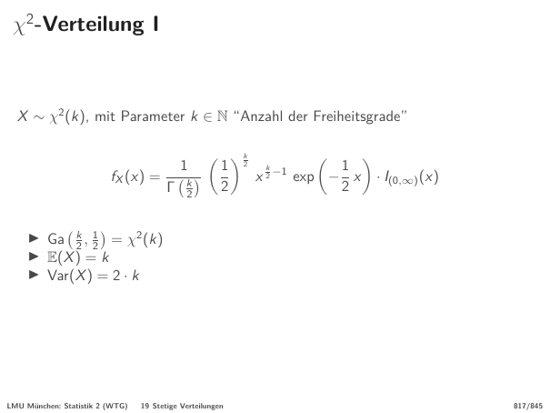

本页放在“模块一：连续分布按随机机制和形状记忆”中，核心是理解 分布（Verteilung）。直觉上先抓住标题里的对象：分布（Verteilung）。然后看它是定义、例子、定理还是证明；定义页要记条件，例子页要看随机机制，证明页要看用了哪些闭包性或极限定理。

关键词：

- 分布（Verteilung）

本页需要抓住的德语线索：

- `X ∼ χ2(k), mit Parameter k ∈ N “Anzahl der Freiheitsgrade”`
- `f X (x ) = Γ (cid:0) 1 k (cid:1) 1 2 2 x k 2 −1 exp − 1 2 x · I (0,∞) (x )`
- `Ga (cid:0) k , 1 (cid:1) = χ2(k)`
- `E(X ) 2 = 2 k`
- `Var(X ) = 2 · k`

### Seite 60 - Poisson 分布（Poisson）

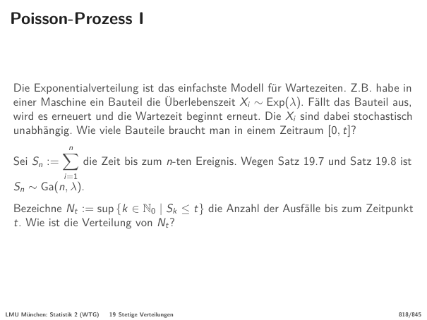

本页放在“模块一：连续分布按随机机制和形状记忆”中，核心是理解 事件（Ereignis）、Poisson 分布（Poisson）、指数分布（Exponentialverteilung）。直觉上先抓住标题里的对象：Poisson 分布（Poisson）。然后看它是定义、例子、定理还是证明；定义页要记条件，例子页要看随机机制，证明页要看用了哪些闭包性或极限定理。

关键词：

- 事件（Ereignis）
- Poisson 分布（Poisson）
- 指数分布（Exponentialverteilung）

本页需要抓住的德语线索：

- `Sei S := die Zeit bis zum n-ten Ereignis. Wegen Satz 19.7 und Satz 19.8 ist`
- `i=1`
- `Bezeichne N := sup {k ∈ N | S ≤ t} die Anzahl der Ausfälle bis zum Zeitpunkt`

### Seite 61 - Poisson 分布（Poisson）

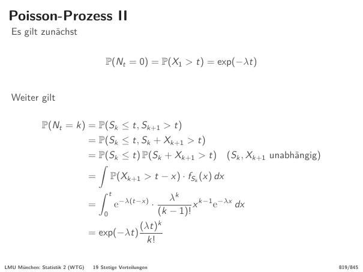

本页放在“模块一：连续分布按随机机制和形状记忆”中，核心是理解 Poisson 分布（Poisson）。直觉上先抓住标题里的对象：Poisson 分布（Poisson）。然后看它是定义、例子、定理还是证明；定义页要记条件，例子页要看随机机制，证明页要看用了哪些闭包性或极限定理。

关键词：

- Poisson 分布（Poisson）

本页需要抓住的德语线索：

- `Es gilt zunächst`
- `P(N = 0) = P(X > t) = exp(−λt)`
- `P(N = k) = P(S ≤ t, S > t)`
- `= P(S ≤ t, S + X > t)`
- `= P(S ≤ t) P(S + X > t) (S , X unabhängig)`

### Seite 62 - Poisson 分布（Poisson）

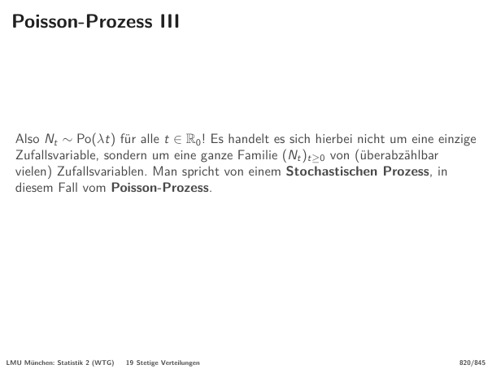

本页放在“模块一：连续分布按随机机制和形状记忆”中，核心是理解 随机变量（Zufallsvariable）、Poisson 分布（Poisson）。直觉上先抓住标题里的对象：Poisson 分布（Poisson）。然后看它是定义、例子、定理还是证明；定义页要记条件，例子页要看随机机制，证明页要看用了哪些闭包性或极限定理。

关键词：

- 随机变量（Zufallsvariable）
- Poisson 分布（Poisson）

本页需要抓住的德语线索：

- `Also N ∼ Po(λt) für alle t ∈ R ! Es handelt es sich hierbei nicht um eine einzige`
- `t t≥0`

### Seite 63 - Poisson 分布（Poisson）

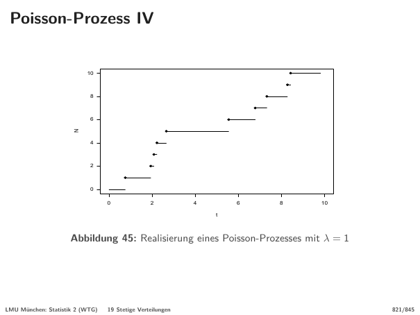

本页放在“模块一：连续分布按随机机制和形状记忆”中，核心是理解 Poisson 分布（Poisson）。直觉上先抓住标题里的对象：Poisson 分布（Poisson）。然后看它是定义、例子、定理还是证明；定义页要记条件，例子页要看随机机制，证明页要看用了哪些闭包性或极限定理。

关键词：

- Poisson 分布（Poisson）

本页需要抓住的德语线索：

- `Abbildung 45: Realisierung eines Poisson-Prozesses mit λ = 1`

### Seite 64 - 分布（Verteilung）

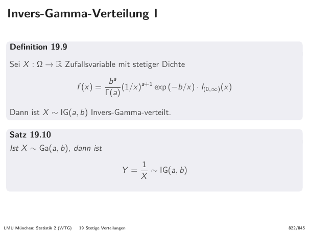

本页放在“模块一：连续分布按随机机制和形状记忆”中，核心是理解 随机变量（Zufallsvariable）、分布（Verteilung）、密度（Dichte）、Gamma 分布（Gamma）。直觉上先抓住标题里的对象：分布（Verteilung）。然后看它是定义、例子、定理还是证明；定义页要记条件，例子页要看随机机制，证明页要看用了哪些闭包性或极限定理。

关键词：

- 随机变量（Zufallsvariable）
- 分布（Verteilung）
- 密度（Dichte）
- Gamma 分布（Gamma）

本页需要抓住的德语线索：

- `Definition 19.9`
- `Sei X : Ω → R Zufallsvariable mit stetiger Dichte`
- `f (x ) = (1/x )a+1 exp (−b/x ) · I (x )`
- `Satz 19.10`
- `Y = ∼ IG(a, b)`

### Seite 65 - 分布（Verteilung）

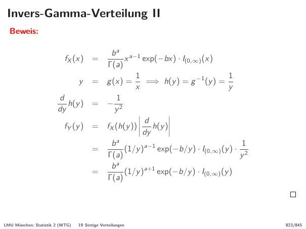

本页放在“模块一：连续分布按随机机制和形状记忆”中，核心是理解 分布（Verteilung）、Gamma 分布（Gamma）。直觉上先抓住标题里的对象：分布（Verteilung）。然后看它是定义、例子、定理还是证明；定义页要记条件，例子页要看随机机制，证明页要看用了哪些闭包性或极限定理。

关键词：

- 分布（Verteilung）
- Gamma 分布（Gamma）

本页需要抓住的德语线索：

- `f (x ) = x a−1 exp(−bx ) · I (x )`
- `y = g(x ) = =⇒ h(y ) = g−1(y ) =`
- `h(y ) = −`
- `f Y (y ) = f X (h(y )) (cid:12) (cid:12) dy h(y )(cid:12) (cid:12)`
- `= (1/y )a−1 exp(−b/y ) · I (y ) ·`

### Seite 66 - 分布（Verteilung）

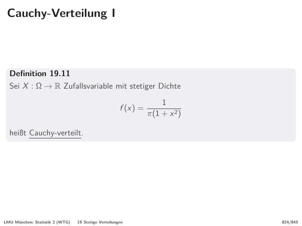

本页放在“模块一：连续分布按随机机制和形状记忆”中，核心是理解 随机变量（Zufallsvariable）、分布（Verteilung）、密度（Dichte）、Cauchy 分布（Cauchy）。直觉上先抓住标题里的对象：分布（Verteilung）。然后看它是定义、例子、定理还是证明；定义页要记条件，例子页要看随机机制，证明页要看用了哪些闭包性或极限定理。

关键词：

- 随机变量（Zufallsvariable）
- 分布（Verteilung）
- 密度（Dichte）
- Cauchy 分布（Cauchy）

本页需要抓住的德语线索：

- `Definition 19.11`
- `Sei X : Ω → R Zufallsvariable mit stetiger Dichte`
- `f (x ) =`

### Seite 67 - 分布（Verteilung）

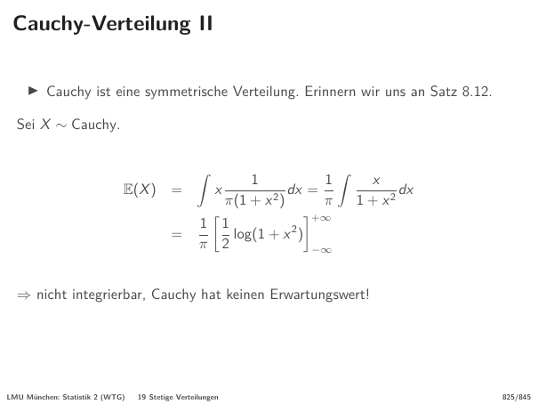

本页放在“模块一：连续分布按随机机制和形状记忆”中，核心是理解 分布（Verteilung）、Cauchy 分布（Cauchy）。直觉上先抓住标题里的对象：分布（Verteilung）。然后看它是定义、例子、定理还是证明；定义页要记条件，例子页要看随机机制，证明页要看用了哪些闭包性或极限定理。

关键词：

- 分布（Verteilung）
- Cauchy 分布（Cauchy）

本页需要抓住的德语线索：

- `Cauchy ist eine symmetrische Verteilung. Erinnern wir uns an Satz 8.12.`
- `E(X ) = x dx = dx`
- `= log(1 + x 2)`

### Seite 68 - 分布（Verteilung）

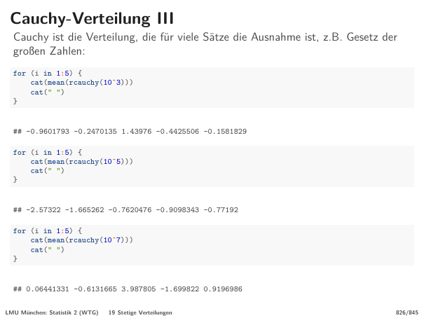

本页放在“模块一：连续分布按随机机制和形状记忆”中，核心是理解 分布（Verteilung）、Cauchy 分布（Cauchy）。直觉上先抓住标题里的对象：分布（Verteilung）。然后看它是定义、例子、定理还是证明；定义页要记条件，例子页要看随机机制，证明页要看用了哪些闭包性或极限定理。

关键词：

- 分布（Verteilung）
- Cauchy 分布（Cauchy）

本页需要抓住的德语线索：

- `Cauchy-Verteilung III`
- `Cauchy ist die Verteilung, die für viele Sätze die Ausnahme ist, z.B. Gesetz der`
- `großen Zahlen:`

### Seite 69 - 分布（Verteilung）

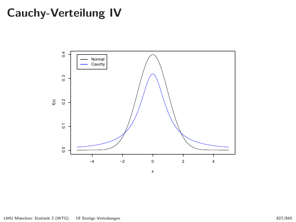

本页放在“模块一：连续分布按随机机制和形状记忆”中，核心是理解 分布（Verteilung）、Cauchy 分布（Cauchy）。直觉上先抓住标题里的对象：分布（Verteilung）。然后看它是定义、例子、定理还是证明；定义页要记条件，例子页要看随机机制，证明页要看用了哪些闭包性或极限定理。

关键词：

- 分布（Verteilung）
- Cauchy 分布（Cauchy）

本页需要抓住的德语线索：

- `Cauchy-Verteilung IV`
- `−4 −2 0 2 4`
- `4.0`

### Seite 70 - 分布（Verteilung）

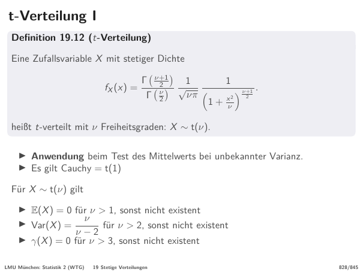

本页放在“模块一：连续分布按随机机制和形状记忆”中，核心是理解 随机变量（Zufallsvariable）、分布（Verteilung）、密度（Dichte）、方差（Varianz）。直觉上先抓住标题里的对象：分布（Verteilung）。然后看它是定义、例子、定理还是证明；定义页要记条件，例子页要看随机机制，证明页要看用了哪些闭包性或极限定理。

关键词：

- 随机变量（Zufallsvariable）
- 分布（Verteilung）
- 密度（Dichte）
- 方差（Varianz）
- Cauchy 分布（Cauchy）

本页需要抓住的德语线索：

- `Definition 19.12 (t-Verteilung)`
- `f (x ) = 2 √ .`
- `Es gilt Cauchy = t(1)`
- `E(X ) = 0 für ν > 1, sonst nicht existent`
- `Var(X ) = für ν > 2, sonst nicht existent`

### Seite 71 - 分布（Verteilung）

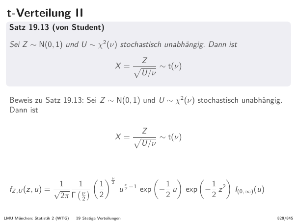

本页放在“模块一：连续分布按随机机制和形状记忆”中，核心是理解 分布（Verteilung）。直觉上先抓住标题里的对象：分布（Verteilung）。然后看它是定义、例子、定理还是证明；定义页要记条件，例子页要看随机机制，证明页要看用了哪些闭包性或极限定理。

关键词：

- 分布（Verteilung）

本页需要抓住的德语线索：

- `Satz 19.13 (von Student)`
- `X = ∼ t(ν)`
- `Beweis zu Satz 19.13: Sei Z ∼ N(0, 1) und U ∼ χ2(ν) stochastisch unabhängig.`
- `X = ∼ t(ν)`
- `f Z,U (z, u) = √ 1 2π Γ (cid:0) 1 ν (cid:1) 1 2 2 u ν 2 −1 exp − 1 2 u exp − 1 2 z2 I (0,∞) (u)`

### Seite 72 - 分布（Verteilung）

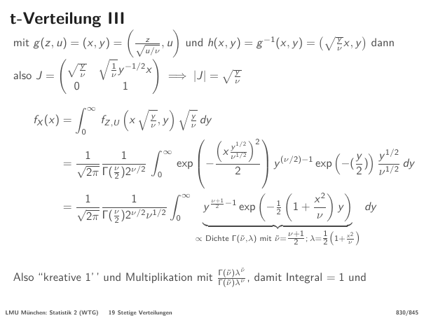

本页放在“模块一：连续分布按随机机制和形状记忆”中，核心是理解 分布（Verteilung）。直觉上先抓住标题里的对象：分布（Verteilung）。然后看它是定义、例子、定理还是证明；定义页要记条件，例子页要看随机机制，证明页要看用了哪些闭包性或极限定理。

关键词：

- 分布（Verteilung）

本页需要抓住的德语线索：

- `mit g(z, u) = (x , y ) = √z , u und h(x , y ) = g−1(x , y ) = (cid:0)p y x , y (cid:1) dann`
- `also J = p ν y ν 1 y −1/2x =⇒ |J| = p y`
- `f (x ) = f x y , y y dy`
- `= √ 1 1 Z ∞ exp − x ν`
- `= √ y ν+ 2 1 −1 exp − 1 1 + y dy`

### Seite 73 - 分布（Verteilung）

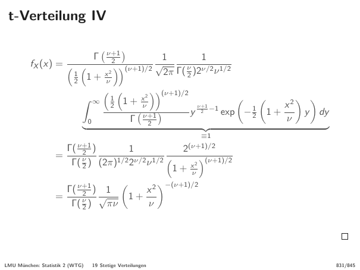

本页放在“模块一：连续分布按随机机制和形状记忆”中，核心是理解 分布（Verteilung）。直觉上先抓住标题里的对象：分布（Verteilung）。然后看它是定义、例子、定理还是证明；定义页要记条件，例子页要看随机机制，证明页要看用了哪些闭包性或极限定理。

关键词：

- 分布（Verteilung）

本页需要抓住的德语线索：

- `f (x ) = 2 √`
- `= 2`
- `= 2 √ 1 +`

### Seite 74 - 分布（Verteilung）

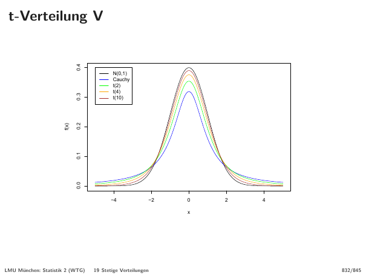

本页放在“模块一：连续分布按随机机制和形状记忆”中，核心是理解 分布（Verteilung）、Cauchy 分布（Cauchy）。直觉上先抓住标题里的对象：分布（Verteilung）。然后看它是定义、例子、定理还是证明；定义页要记条件，例子页要看随机机制，证明页要看用了哪些闭包性或极限定理。

关键词：

- 分布（Verteilung）
- Cauchy 分布（Cauchy）

本页需要抓住的德语线索：

- `t-Verteilung V`
- `−4 −2 0 2 4`
- `4.0`

### Seite 75 - 分布（Verteilung）

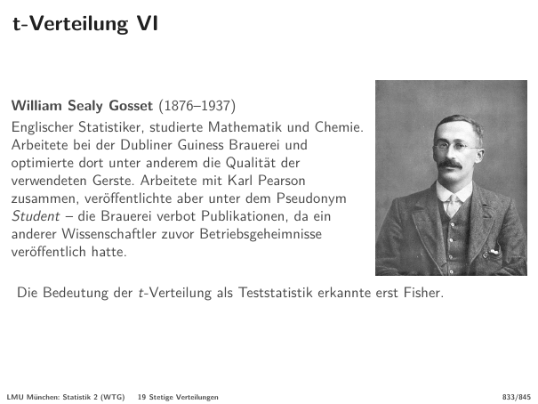

本页可识别的嵌入图片裁切：

本页放在“模块一：连续分布按随机机制和形状记忆”中，核心是理解 分布（Verteilung）。直觉上先抓住标题里的对象：分布（Verteilung）。然后看它是定义、例子、定理还是证明；定义页要记条件，例子页要看随机机制，证明页要看用了哪些闭包性或极限定理。

关键词：

- 分布（Verteilung）

本页需要抓住的德语线索：

- `t-Verteilung VI`
- `William Sealy Gosset (1876–1937)`
- `Englischer Statistiker, studierte Mathematik und Chemie.`

### Seite 76 - 分布（Verteilung）

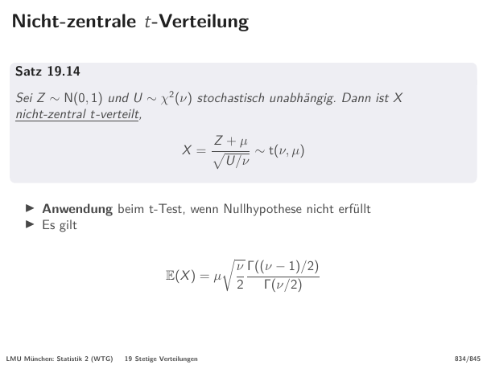

本页放在“模块一：连续分布按随机机制和形状记忆”中，核心是理解 分布（Verteilung）。直觉上先抓住标题里的对象：分布（Verteilung）。然后看它是定义、例子、定理还是证明；定义页要记条件，例子页要看随机机制，证明页要看用了哪些闭包性或极限定理。

关键词：

- 分布（Verteilung）

本页需要抓住的德语线索：

- `Satz 19.14`
- `X = ∼ t(ν, µ)`
- `Es gilt`
- `E(X ) = µ`

### Seite 77 - 分布（Verteilung）

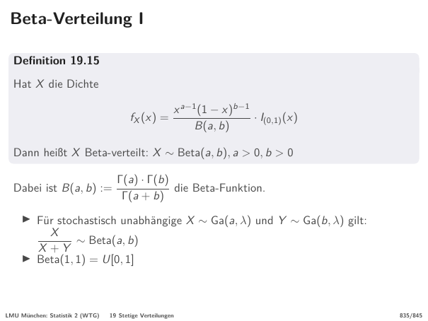

本页放在“模块一：连续分布按随机机制和形状记忆”中，核心是理解 分布（Verteilung）、密度（Dichte）、Beta 分布（Beta）。直觉上先抓住标题里的对象：分布（Verteilung）。然后看它是定义、例子、定理还是证明；定义页要记条件，例子页要看随机机制，证明页要看用了哪些闭包性或极限定理。

关键词：

- 分布（Verteilung）
- 密度（Dichte）
- Beta 分布（Beta）

本页需要抓住的德语线索：

- `Definition 19.15`
- `f (x ) = · I (x )`
- `Dabei ist B(a, b) := die Beta-Funktion.`
- `Beta(1, 1) = U[0, 1]`

### Seite 78 - 分布（Verteilung）

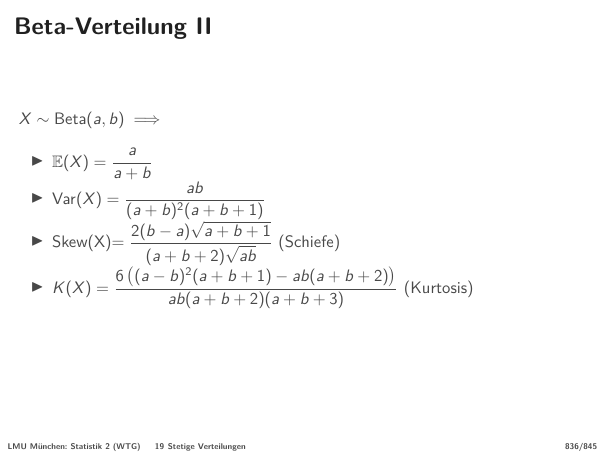

本页放在“模块一：连续分布按随机机制和形状记忆”中，核心是理解 分布（Verteilung）、Beta 分布（Beta）。直觉上先抓住标题里的对象：分布（Verteilung）。然后看它是定义、例子、定理还是证明；定义页要记条件，例子页要看随机机制，证明页要看用了哪些闭包性或极限定理。

关键词：

- 分布（Verteilung）
- Beta 分布（Beta）

本页需要抓住的德语线索：

- `X ∼ Beta(a, b) =⇒`
- `E(X ) =`
- `Var(X ) =`
- `Skew(X)= √ (Schiefe)`
- `K (X ) = (Kurtosis)`

### Seite 79 - 分布（Verteilung）

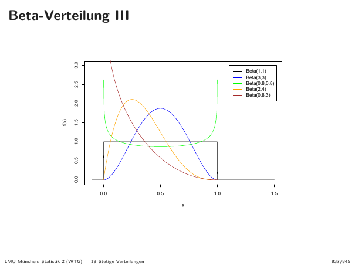

本页放在“模块一：连续分布按随机机制和形状记忆”中，核心是理解 分布（Verteilung）、Beta 分布（Beta）。直觉上先抓住标题里的对象：分布（Verteilung）。然后看它是定义、例子、定理还是证明；定义页要记条件，例子页要看随机机制，证明页要看用了哪些闭包性或极限定理。

关键词：

- 分布（Verteilung）
- Beta 分布（Beta）

本页需要抓住的德语线索：

- `Beta-Verteilung III`
- `0.0 0.5 1.0 1.5`
- `0.3`

## 本章逻辑梳理

- **离散分布（Seite 1-32）：** 抽球模型、Bernoulli、Binomial、Poisson。
- **连续分布（Seite 33-79）：** Uniform、Exponential、Gamma、Beta、Cauchy、Normal。

复习时不要按页码硬背。先确认本页属于哪个模块，再问它是在定义对象、说明性质、给例子、证明定理，还是提醒适用边界。

## 关键考核点

1. 会区分有放回/无放回、考虑/不考虑顺序的抽样空间。
2. 会写常见离散分布的 PMF、期望和方差。
3. 会写常见连续分布的密度、支撑集和参数含义。
4. 会说明 Poisson 近似二项、Gamma 与指数、Beta 与比例建模的关系。

## 本章公式清单

### 离散分布

| 序号 | 公式 | 使用场景 | 注意事项 |
| ---: | --- | --- | --- |
| 1 | $\binom Nk=\frac{N!}{k!(N-k)!}$ | 组合数。 | 无顺序抽取。 |
| 2 | $P(X=k)=\binom nkp^k(1-p)^{n-k}$ | 二项分布。 | 固定次数独立 Bernoulli。 |
| 3 | $P(X=k)=e^{-\lambda}\frac{\lambda^k}{k!}$ | Poisson 分布。 | 计数变量，均值方差均为 $\lambda$。 |
| 4 | $P(X=k)=\frac{\binom Mk\binom{N-M}{n-k}}{\binom Nn}$ | 超几何分布。 | 无放回抽样。 |

### 连续分布

| 序号 | 公式 | 使用场景 | 注意事项 |
| ---: | --- | --- | --- |
| 5 | $f(x)=\frac1{b-a}I_{[a,b]}(x)$ | 连续均匀分布。 | 区间内密度常数。 |
| 6 | $f(x)=\lambda e^{-\lambda x}I_{\mathbb R_+}(x)$ | 指数分布。 | 等待时间。 |
| 7 | $f(x)=\frac{\lambda^\alpha}{\Gamma(\alpha)}x^{\alpha-1}e^{-\lambda x}$ | Gamma 分布。 | 指数等待时间的推广。 |
| 8 | $f(x)=\frac1{\sqrt{2\pi}\sigma}e^{-\frac{(x-\mu)^2}{2\sigma^2}}$ | 正态密度。 | 中心极限定理核心分布。 |

## 章节自测

- [x] 无放回抽样通常导致抽取结果不独立。
- [x] Poisson 分布的期望和方差都等于 $\lambda$。
- [ ] Cauchy 分布有有限方差。

## 德语词汇表

| 德语 | 中文 | 使用场景 |
| --- | --- | --- |
| Urnenmodell | 抽球模型 | 抽样机制 |
| mit Zurücklegen | 有放回 | 独立重复 |
| ohne Zurücklegen | 无放回 | 有限总体不独立 |
| Bernoulli-Verteilung | Bernoulli 分布 | 一次成功失败 |
| Binomialverteilung | 二项分布 | 成功次数 |
| Poisson-Verteilung | Poisson 分布 | 事件计数 |
| Gamma-Verteilung | Gamma 分布 | 等待时间和 |
| Cauchy-Verteilung | Cauchy 分布 | 无期望反例 |

## C1 德语句式

| 序号 | 德语句式 | 中文翻译 | 适用场景 |
| ---: | --- | --- | --- |
| 1 | Urnenmodelle unterscheiden sich danach, ob mit oder ohne Zurücklegen gezogen wird und ob die Reihenfolge berücksichtigt wird. | 抽球模型根据是否放回以及是否考虑顺序来区分。 | 解释抽样空间。 |
| 2 | Die Cauchy-Verteilung dient häufig als Gegenbeispiel, weil Erwartungswert und Varianz nicht existieren. | Cauchy 分布常作为反例，因为其期望和方差不存在。 | 解释 Cauchy。 |
