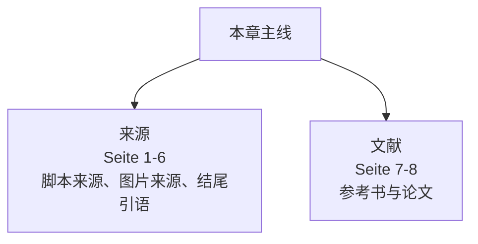
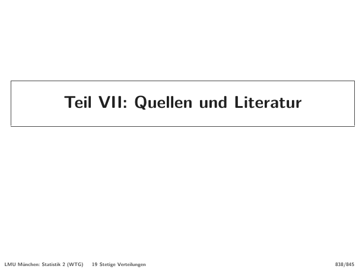
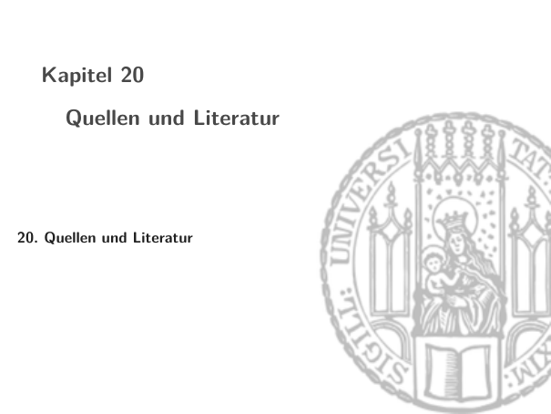
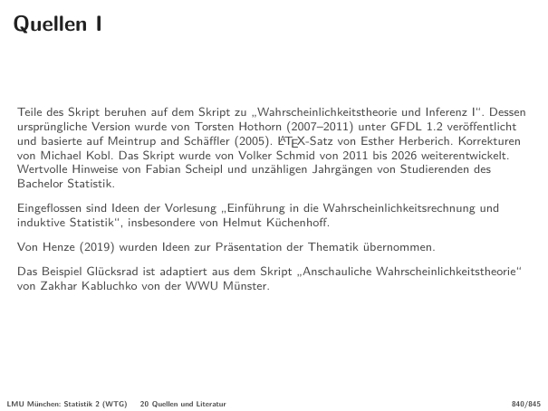
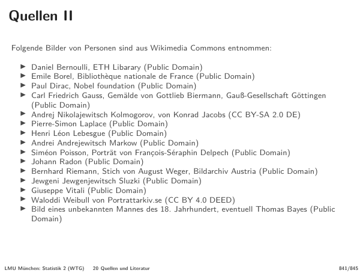
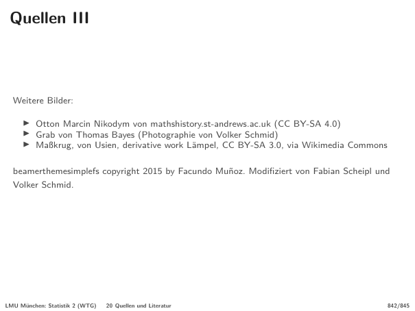
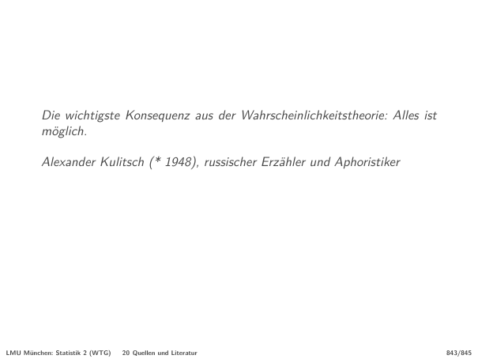
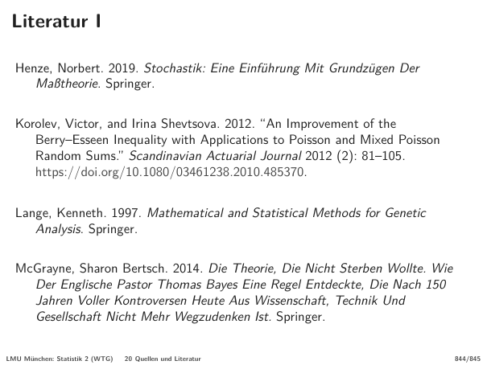
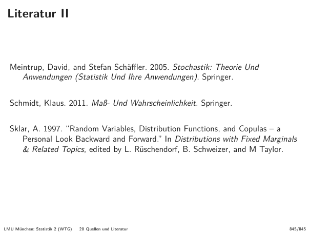

# 下学期第 08 章：来源与文献

> 来源：`分章节讲义-下学期/08_Quellen und Literatur.pdf`  
> 原讲义页码：S. 838-845  
> 图片目录：`assets/`  
> 核心主线：最后部分记录讲义来源、图片授权和推荐文献。学习上它不是计算章节，但有助于追溯概率论与统计基础的参考书。

## 章节知识树

## 学习路径

最后部分记录讲义来源、图片授权和推荐文献。学习上它不是计算章节，但有助于追溯概率论与统计基础的参考书。

1. **来源：** 脚本来源、图片来源、结尾引语（Seite 1-6）。
2. **文献：** 参考书与论文（Seite 7-8）。

## 模块地图

| 模块 | 页码 | 核心问题 |
| --- | --- | --- |
| 来源 | Seite 1-6 | 脚本来源、图片来源、结尾引语 |
| 文献 | Seite 7-8 | 参考书与论文 |

## 考试优先级

1. 知道本讲义来源于概率论与推断统计相关脚本。
2. 知道图片和材料来源需要保留授权信息。
3. 能识别 Henze、Meintrup/Schaeffler 等参考文献。

## 模块零：来源和授权（Seite 1-6）

这部分说明讲义继承了哪些脚本、哪些图片来自公开资源。写论文或整理笔记时，这类来源页能帮助你规范引用。

### Seite 1 - 来源与文献（Quellen und Literatur）

本页放在“模块零：来源和授权”中，主要作用是推进 Seite 1-6 这一段的概念链。先把标题“来源与文献（Quellen und Literatur）”和前后页联系起来，再区分它是在给定义、展示例子、证明性质，还是做章节过渡。

本页需要抓住的德语线索：

- `Teil VII: Quellen und Literatur`

### Seite 2 - 来源与文献（Quellen und Literatur）

本页可识别的嵌入图片裁切：

本页放在“模块零：来源和授权”中，主要作用是推进 Seite 1-6 这一段的概念链。先把标题“来源与文献（Quellen und Literatur）”和前后页联系起来，再区分它是在给定义、展示例子、证明性质，还是做章节过渡。

本页需要抓住的德语线索：

- `Kapitel 20`
- `Quellen und Literatur`
- `20. Quellen und Literatur`

### Seite 3 - Quellen I

本页放在“模块零：来源和授权”中，核心是理解 概率（Wahrscheinlichkeit）。直觉上先抓住标题里的对象：Quellen I。然后看它是定义、例子、定理还是证明；定义页要记条件，例子页要看随机机制，证明页要看用了哪些闭包性或极限定理。

关键词：

- 概率（Wahrscheinlichkeit）

本页需要抓住的德语线索：

- `und basierte auf Meintrup and Schäffler (2005). LATEX-Satz von Esther Herberich. Korrekturen`
- `Eingeflossen sind Ideen der Vorlesung „Einführung in die Wahrscheinlichkeitsrechnung und`
- `Von Henze (2019) wurden Ideen zur Präsentation der Thematik übernommen.`
- `Das Beispiel Glücksrad ist adaptiert aus dem Skript „Anschauliche Wahrscheinlichkeitstheorie“`

### Seite 4 - Quellen II

本页放在“模块零：来源和授权”中，核心是理解 Poisson 分布（Poisson）。直觉上先抓住标题里的对象：Quellen II。然后看它是定义、例子、定理还是证明；定义页要记条件，例子页要看随机机制，证明页要看用了哪些闭包性或极限定理。

关键词：

- Poisson 分布（Poisson）

本页需要抓住的德语线索：

- `Quellen II`
- `Folgende Bilder von Personen sind aus Wikimedia Commons entnommen:`
- `Daniel Bernoulli, ETH Libarary (Public Domain)`

### Seite 5 - Quellen III

本页放在“模块零：来源和授权”中，核心是理解 测度（Maß）。直觉上先抓住标题里的对象：Quellen III。然后看它是定义、例子、定理还是证明；定义页要记条件，例子页要看随机机制，证明页要看用了哪些闭包性或极限定理。

关键词：

- 测度（Maß）

本页需要抓住的德语线索：

- `Quellen III`
- `Weitere Bilder:`
- `Otton Marcin Nikodym von mathshistory.st-andrews.ac.uk (CC BY-SA 4.0)`

### Seite 6 - 概率（Wahrscheinlichkeit）

本页放在“模块零：来源和授权”中，核心是理解 概率（Wahrscheinlichkeit）。直觉上先抓住标题里的对象：概率（Wahrscheinlichkeit）。然后看它是定义、例子、定理还是证明；定义页要记条件，例子页要看随机机制，证明页要看用了哪些闭包性或极限定理。

关键词：

- 概率（Wahrscheinlichkeit）

本页需要抓住的德语线索：

- `Die wichtigste Konsequenz aus der Wahrscheinlichkeitstheorie: Alles ist`
- `möglich.`
- `Alexander Kulitsch (* 1948), russischer Erzähler und Aphoristiker`

## 模块一：继续学习的文献入口（Seite 7-8）

参考文献给出概率论、测度论和统计基础的延伸阅读。复习考试时不必逐条背，但可以用来定位更严谨的证明。

### Seite 7 - Literatur I

本页放在“模块一：继续学习的文献入口”中，核心是理解 测度（Maß）、Poisson 分布（Poisson）。直觉上先抓住标题里的对象：Literatur I。然后看它是定义、例子、定理还是证明；定义页要记条件，例子页要看随机机制，证明页要看用了哪些闭包性或极限定理。

关键词：

- 测度（Maß）
- Poisson 分布（Poisson）

本页需要抓住的德语线索：

- `Literatur I`
- `Henze, Norbert. 2019. Stochastik: Eine Einführung Mit Grundzügen Der`
- `Maßtheorie. Springer.`

### Seite 8 - Literatur II

本页放在“模块一：继续学习的文献入口”中，核心是理解 概率（Wahrscheinlichkeit）、测度（Maß）、Copula（Copula）。直觉上先抓住标题里的对象：Literatur II。然后看它是定义、例子、定理还是证明；定义页要记条件，例子页要看随机机制，证明页要看用了哪些闭包性或极限定理。

关键词：

- 概率（Wahrscheinlichkeit）
- 测度（Maß）
- Copula（Copula）

本页需要抓住的德语线索：

- `Literatur II`
- `Meintrup, David, and Stefan Schäffler. 2005. Stochastik: Theorie Und`
- `Anwendungen (Statistik Und Ihre Anwendungen). Springer.`

## 本章逻辑梳理

- **来源（Seite 1-6）：** 脚本来源、图片来源、结尾引语。
- **文献（Seite 7-8）：** 参考书与论文。

复习时不要按页码硬背。先确认本页属于哪个模块，再问它是在定义对象、说明性质、给例子、证明定理，还是提醒适用边界。

## 关键考核点

1. 知道本讲义来源于概率论与推断统计相关脚本。
2. 知道图片和材料来源需要保留授权信息。
3. 能识别 Henze、Meintrup/Schaeffler 等参考文献。

## 本章公式清单

### 引用结构

| 序号 | 公式 | 使用场景 | 注意事项 |
| ---: | --- | --- | --- |
| 1 | $Quelle \to Lizenz \to Literatur$ | 整理来源信息。 | 不是数学公式，而是学术写作规范。 |

## 章节自测

- [ ] 来源页不包含数学知识，因此完全没有学习价值。
- [x] 引用和授权信息有助于材料复用和学术规范。

## 德语词汇表

| 德语 | 中文 | 使用场景 |
| --- | --- | --- |
| Quelle | 来源 | 材料出处 |
| Literatur | 文献 | 参考书目 |
| Lizenz | 授权 | 使用条件 |
| GFDL | GNU 自由文档许可证 | 材料授权 |

## C1 德语句式

| 序号 | 德语句式 | 中文翻译 | 适用场景 |
| ---: | --- | --- | --- |
| 1 | Quellenangaben dienen nicht nur der formalen Korrektheit, sondern auch der Nachvollziehbarkeit wissenschaftlicher Aussagen. | 来源标注不仅是形式正确，也保证科学陈述可追溯。 | 解释引用意义。 |
