# 第01章：导论（Einführung）

> 本章是整门课的方法论入口：统计学（Statistik）不是“算公式”，而是围绕数据（Daten）、不确定性（Unsicherheit）、模型（Modell）和经验世界（Empirie）建立可检验、可沟通、可批判的判断。

## 章节知识树

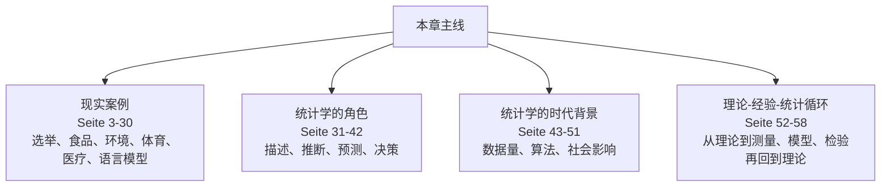

## 学习路径

统计学不是从公式开始，而是从现实问题、数据、模型和不确定性之间的来回翻译开始。

1. **现实案例：** 选举、食品、环境、体育、医疗、语言模型（Seite 3-30）。
2. **统计学的角色：** 描述、推断、预测、决策（Seite 31-42）。
3. **统计学的时代背景：** 数据量、算法、社会影响（Seite 43-51）。
4. **理论-经验-统计循环：** 从理论到测量、模型、检验再回到理论（Seite 52-58）。

## 模块地图

| 模块 | 页码 | 核心问题 |
| --- | --- | --- |
| 现实案例 | Seite 3-30 | 选举、食品、环境、体育、医疗、语言模型 |
| 统计学的角色 | Seite 31-42 | 描述、推断、预测、决策 |
| 统计学的时代背景 | Seite 43-51 | 数据量、算法、社会影响 |
| 理论-经验-统计循环 | Seite 52-58 | 从理论到测量、模型、检验再回到理论 |

## 考试优先级

1. 会把一个现实案例翻译成总体（Grundgesamtheit）、样本（Stichprobe）、变量（Merkmal）和研究问题。
2. 会解释统计学为什么必须处理不确定性（Unsicherheit），而不是只给一个确定答案。
3. 会区分数据（Daten）、模型（Modell）和现实（Wirklichkeit）。
4. 会说明为什么图形、模型和背景知识必须配合使用。

## 模块零：章节入口（Seite 1-2）

先别急着问本章有没有公式。导论真正想让你建立的是统计直觉：我们为什么要从有限数据谈论一个更大的现实？目录页先给出全课地图，后面的案例会不断回到同一个问题：样本看到的东西，怎样才能变成对总体、机制或未来的有根据判断？

### Seite 1 - 本章路线图

本章包括五个部分：

- 例子（Beispiele）
- 统计学是什么、怎么做、为什么需要（Statistik: Was - Wie - Warum）
- 统计学的当下与未来（Gegenwart & Zukunft der Statistik）
- 理论、经验与统计（Theorie-Empirie-Statistik）

**学习目标：** 能把“数据例子”翻译成统计问题：样本（Stichprobe）、总体（Grundgesamtheit）、测量（Messung）、模型（Modell）、推断（Inferenz）和不确定性。

### Seite 2 - 目录页

目录提示本章先从现实案例进入，再抽象出统计学的角色。考试中常见问法不是“背定义”，而是让你解释某个研究场景为什么需要统计方法（statistische Methoden）。

## 模块一：现实案例把统计问题逼出来（Seite 3-30）

这一组页面的作用是把“统计学有用”讲具体。选举预测、舞弊检测、空气污染、体育数据、医学诊断和语言模型看起来不一样，但底层都在处理同一件事：数据里有信号，也有噪声；我们想用数据回答问题，但又不能把数据当成现实本身。

### Seite 3 - 例子：2021 德国联邦议院选举

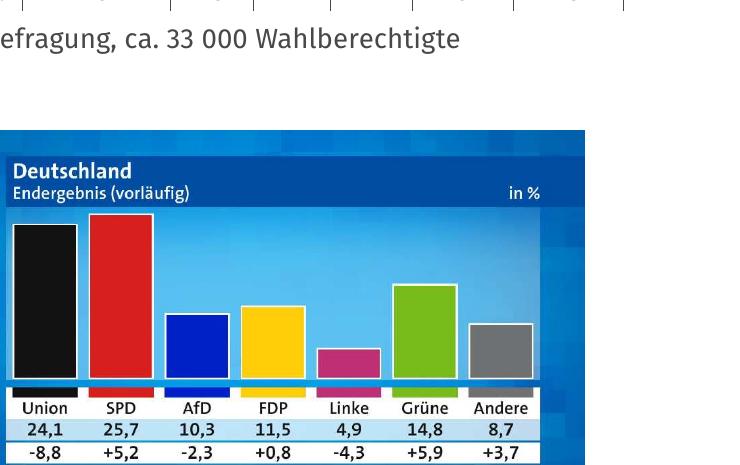

本页以 2021 年德国联邦议院选举（Bundestagswahl）为例：18:00 的预测（Prognose）基于选后调查（Nachwahlbefragung）约 33,000 名有选举权者。

统计问题：如何从样本（Stichprobe）推断总体结果（Gesamtergebnis）？

**关键词：** 预测（Prognose）、样本调查（Befragung einer Stichprobe）、投票份额（Stimmanteil）。

### Seite 4 - 选举预测的目标

选举预测有两个目标：

- 从样本中的选民（Wähler:innen）推断整体选举结果。
- 通过附加问题分析投票行为（Wahlverhalten），例如换票者（Wechselwähler:innen）。

**逻辑：** 样本不是总体，但如果抽样和加权合理，样本可以提供关于总体的有信息估计（informative Schätzung）。

### Seite 5 - 例子：选举舞弊检测

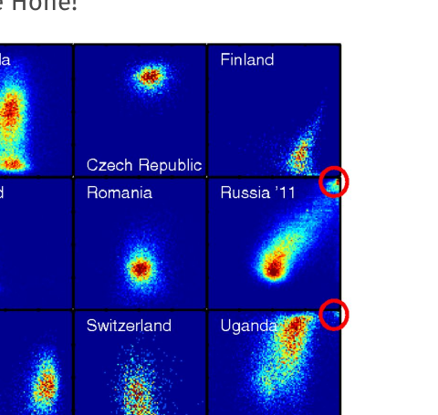

思路：研究胜选者得票率（Stimmenanteil der Sieger）与投票率（Wahlbeteiligung）的关系。若出现 ballot stuffing（向票箱塞票），两者可能同时异常升高。

统计学在这里的作用不是直接“判罪”，而是识别异常模式（auffällige Muster）并提供进一步调查线索。

### Seite 6 - KOALA：联盟分析

KOALA（Koalitions Analyse）项目的目标是更好传达选前民调（Wahlumfragen）背后的不确定性（Unsicherheit）。

核心思想：

- 小的民调百分比变化不一定重要。
- 真正重要的是某些政治事件的概率，例如某联盟能否形成多数。
- 通过模拟许多可能选举结果（Simulation möglicher Wahlergebnisse）估计事件概率。

### Seite 7 - KOALA 图示：民调份额

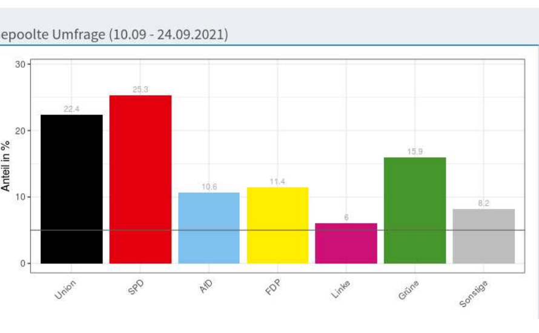

图中展示各党派民调份额。单个百分比点容易被过度解读；统计视角会问：这些差异是否大到足以改变联盟多数的概率？

**考点：** 不确定性表达（Unsicherheitskommunikation）比单点估计更重要。

### Seite 8 - KOALA 图示：模拟结果

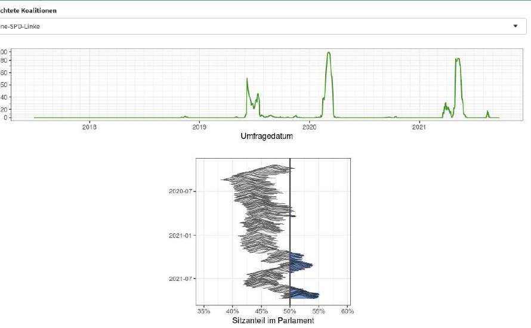

图中用模拟（Simulation）呈现可能席位或多数结果。概率可理解为：在所有模拟世界中，某事件发生的比例（Anteil der Simulationen）。

**句式：** `Die Wahrscheinlichkeit wird als Anteil der Simulationen interpretiert, in denen das Ereignis eintritt.`

### Seite 9 - ISAR：食品进口筛查

ISAR（Lebensmittelimportscreening）用于食品贸易风险早期识别（Früherkennung von Risiken im Lebensmittelhandel）。

方法：

- 长期监控产品与国家特定的进口数据。
- 观察数量或价格异常（Auffälligkeiten in Mengen oder Preisen）。
- 使用统计时间序列模型（statistische Zeitreihen-Modelle）。
- 将观测值与模型预测（Vorhersagen）比较。

### Seite 10 - ISAR 例子：土耳其榛子价格

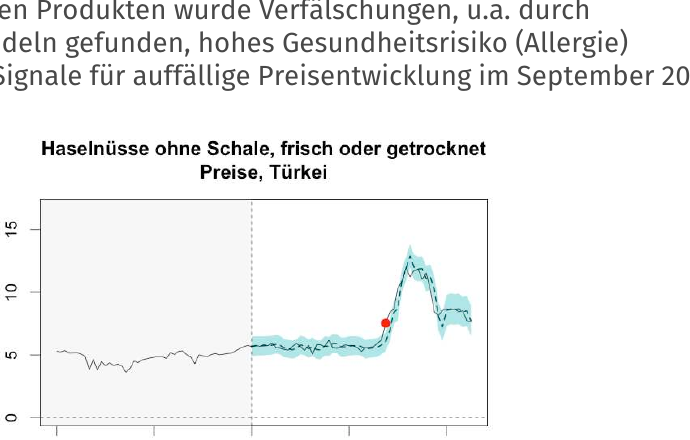

2014 年土耳其榛子歉收（Ernteeinbruch）后价格大幅上涨。价格异常可能提示掺假或替代品风险，例如加工产品中混入腰果/杏仁，对过敏人群有健康风险。

统计学作用：把时间序列中的异常变化从正常波动中区分出来。

### Seite 11 - ISAR 例子：异常点标记

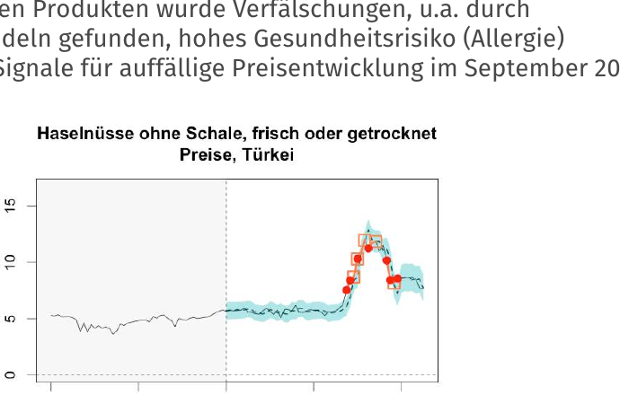

图中红点表示模型识别出的异常信号（auffällige Signale）。这体现了“模型预测 vs. 实际观测”的统计监控框架。

**考点：** 异常检测（Anomalieerkennung）通常不是寻找单个最大值，而是寻找相对模型预期不寻常的偏离。

### Seite 12 - 矿泉水研究

研究问题：富氧矿泉水（mit Sauerstoff angereichertes Mineralwasser）是否比普通矿泉水更好喝？

设计：

- 双盲研究（Doppelblindstudie）
- 控制组（Kontrollgruppe）：两次同样的普通水
- 处理组/真实处理组（Verum-Gruppe）：第二次富氧水
- 结果通过统计检验（statistischer Test）判断差异是否显著

**关键词：** 随机化（Randomisierung）、安慰剂（Placebo）、显著效应（signifikanter Effekt）。

### Seite 13 - 研究目标和方法

本页总结矿泉水研究的统计要素：

- 随机化双盲研究（randomisierte Doppelblindstudie）
- 用统计检验做决策（Entscheidungsfindung durch statistischen Test）
- 量化效应（Quantifizierung des Effekts）

**考试抓手：** 设计质量决定因果解释的强度。双盲和随机化用于减少偏差（Bias）。

### Seite 14 - 环境区与细颗粒物

问题：慕尼黑环境区（Umweltzone）是否降低细颗粒物污染（Feinstaubbelastung）？

简单做法是比较实施前后均值（Mittelwerte vor und nach der Einführung），但存在问题：

- 无车基础污染可能变化。
- 天气影响强。
- 一天内和季节之间波动明显。

因此需要回归模型（Regressionsmodell），纳入参考站、天气和日变化等因素。

### Seite 15 - Prinzregentenstrasse 的污染曲线

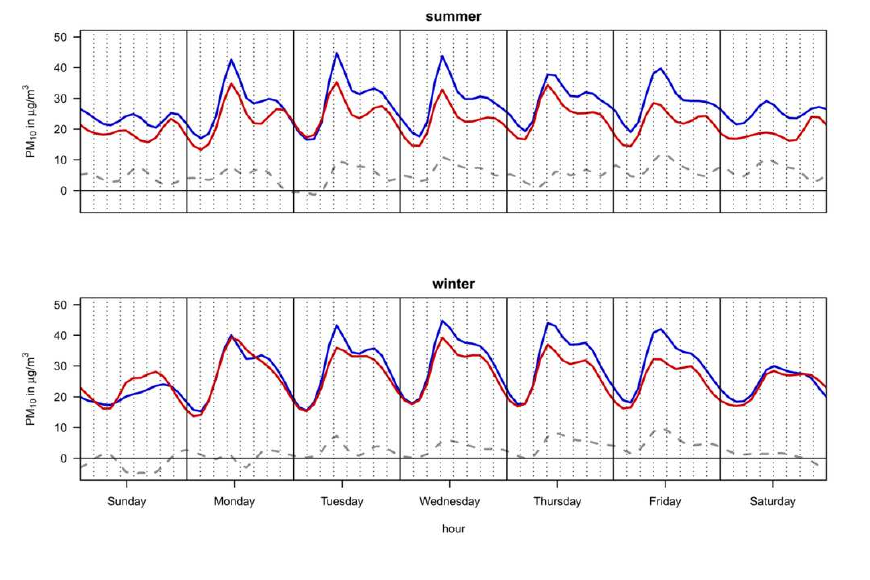

图中比较有/无措施模型下的细颗粒物走势。统计模型的目标是估计“如果没有政策，污染会如何变化”的反事实（Kontrafaktum）。

### Seite 16 - Lothstrasse 的污染曲线

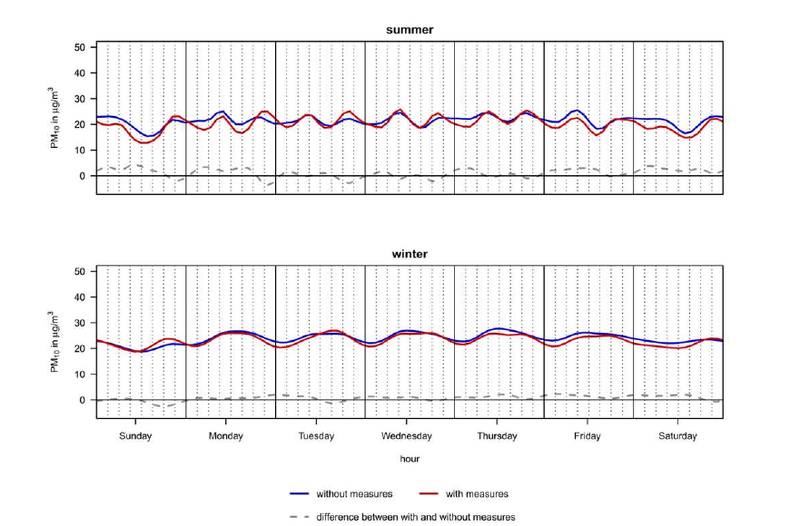

不同监测站表现不同，说明环境数据具有空间和时间异质性（räumliche und zeitliche Heterogenität）。不能只凭一个前后均值差得出政策效果结论。

### Seite 17 - 更多应用场景

统计学应用包括：

- 临床研究（klinische Studien）
- 流行病学研究（epidemiologische Studien）
- 质量控制（Qualitätskontrolle）
- 市场研究（Marktforschung）
- 收视率（Einschaltquoten）
- A/B 测试
- 体育统计（Sportstatistik）
- 基因表达/序列数据分析
- 网络分析（Netzwerkanalysen）
- 模式识别（Mustererkennung）

**总之：** 只要有数据、变异和不确定性，就可能需要统计。

### Seite 18 - 转入“统计学是什么”

本页是章节切换，从案例转向定义。前面的例子共同体现：统计学帮助我们从有限、不完美、有噪声的数据中获得可辩护的结论。

### Seite 19 - 什么是统计学

统计学（Statistik）是关于数据的采集、展示、分析和评价的方法论（Methodenlehre）。

三个子领域：

- 描述统计（deskriptive Statistik）：描述、汇总、可视化数据。
- 探索统计（explorative Statistik）：交互迭代地寻找数据结构。
- 归纳统计（induktive Statistik）：从观察数据推断潜在结构。

**关键：** 统计学包含随机成分的模型构建（Modellbildung mit zufälligen Komponenten）。

### Seite 20 - 描述统计

描述统计（deskriptive Statistik）的目标是用尽量少的信息损失（Informationsverlust）真实描述数据。

手段：

- 图形（Grafiken）
- 表格（Tabellen）
- 指标/特征数（Kennzahlen）
- 单变量与多变量分析（uni-/multivariat）

描述统计不直接从样本推出总体；它主要做描述（Deskription），不是推断（Inferenz）。

### Seite 21 - 统计学作为科学语言

本页通过若干引文强调：统计学是经验科学（empirische Wissenschaft）的基本工具。它把信息收集、整理并放入可理解的结构中。

**考试表达：**  
`Statistische Methodik ist ein unverzichtbares Werkzeug empirischer Wissenschaften.`

### Seite 22 - 信息整理与科学语法

统计学不仅使用数学（Mathematik），也服务于科学表达：如何定义变量、如何测量、如何整理证据、如何表达不确定性。

**重点：** 数学是语言，统计学的目标是从经验中学习（Lernen aus Erfahrung）。

### Seite 23 - 从经验中学习

统计学习的核心不是“得到一个数字”，而是建立从数据到知识的路径：

### Seite 24 - 经验科学中的统计方法

经验科学依赖观察和测量，因此也依赖处理测量误差、抽样变异和模型不确定性的统计方法。

**关键词：** 测量误差（Messfehler）、抽样误差（Stichprobenfehler）、不确定性（Unsicherheit）。

### Seite 25 - 为什么需要统计学

统计学帮助人在不确定性（Unsicherheit）中做更理性的决策。它可以抵抗只凭鲜活个案（anekdotische Evidenz）做判断的倾向。

**核心：** 统计教育（statistische Bildung）是理性公共判断的一部分。

### Seite 26 - 统计学与决策

统计学提供的不是绝对确定性，而是在证据有限时更稳健的判断框架。

例子：

- 医疗试验中是否批准治疗。
- 食品风险中是否加大抽检。
- 选举预测中如何表达不确定性。

### Seite 27 - 统计学与反操纵

理解统计图表、样本、概率和不确定性，可以减少被误导的风险。

**考试句式：**  
`Statistische Bildung ermöglicht einen kritischeren Umgang mit quantitativen Aussagen.`

### Seite 28 - 统计学与理性公共讨论

统计结果常进入公共讨论：民调、疫情、经济指标、教育评估。统计素养（statistische Kompetenz）帮助区分证据强弱。

**考点：** 统计学不是替代价值判断，而是澄清事实判断的依据。

### Seite 29 - 统计学教育的社会意义

本页继续强调：统计学训练让人能在不确定性下合理行动（vernünftig handeln）。它也要求人愿意“仔细看”（genau hinsehen），而不是用一句“统计能证明一切”逃避分析。

### Seite 30 - 为什么也要警惕统计学

统计模型有用，但模型总是现实的简化。数据和强烈求答案的愿望，并不保证能从数据中提取出合理答案。

**关键边界：** 数据不能回答未被合理测量、未被合理建模、或理论上不适合回答的问题。

## 模块二：统计学到底在做什么（Seite 31-42）

看完案例后，就要抽象出统计学的工作方式。统计学不是机械计算，而是围绕数据生成、描述、建模、推断和不确定性沟通的一整套方法。这里要建立一个大白话理解：统计学帮我们在“不知道全部真相”的情况下，尽量诚实地说出我们知道什么、不知道什么、判断有多稳。

### Seite 31 - 模型是工具，不是现实

模型（Modell）帮助我们理解现实，但不是现实本身。模型的价值在于是否适合具体问题（Tauglichkeit für die Fragestellung）。

**德语表达：**  
`Ein Modell ist eine vereinfachte Abbildung der Realität, nicht die Realität selbst.`

### Seite 32 - 数据折磨与伪发现

如果反复尝试不同分析直到出现想要的结果，就会产生伪发现。这与后面提到的 p-hacking（p-Hacking）和再现危机（Replikationskrise）相关。

**考点：** 分析流程（Analyseplan）和透明报告（Transparenz）很重要。

### Seite 33 - 没有例行统计问题

统计程序不能机械套用。每个问题都需要判断：

- 数据如何产生？
- 变量如何测量？
- 模型假设是否合理？
- 结论能推广到哪里？

### Seite 34 - 误用与误读

统计结果容易被滥用（missbraucht）或误解释（missinterpretiert）。因此统计学同时要求技术能力和批判能力。

**小测验：**

- [x] 模型是现实的简化。
- [ ] 只要数据量大，任何问题都能得到可靠答案。
- [x] 统计方法需要结合具体研究问题判断。

### Seite 35 - 为什么有时不该使用统计

不是所有重要事物都能被精确定义或测量。统计只有在可测量性（Messbarkeit）和可量化性（Quantifizierbarkeit）足够时才有意义。

### Seite 36 - 测量边界

测量是统计分析的入口。如果概念没有清楚操作化（Operationalisierung），后续模型再复杂也可能只是精确地处理模糊对象。

**例子：** 爱、尊严、友谊等概念可研究，但必须先定义可观察指标，并承认指标的局限。

### Seite 37 - 定量方法的限度

定量方法（quantitative Methode）不能替代伦理、理论和实质领域知识。统计数字需要解释语境（Kontext）。

### Seite 38 - 合理使用统计的条件

合理使用统计需要：

- 明确研究问题。
- 变量可测量。
- 数据生成过程可理解。
- 模型假设可检查。
- 结论范围不过度扩张。

### Seite 39 - Goodhart 定律

Goodhart 定律（Goodhart’s Law）说：当某个指标成为目标，它就可能不再是好指标。

原因：被测系统会反应，指标会被优化、操纵或规避。类似现象包括预防悖论（Präventions-Paradox）、自我实现/自我毁灭预言（self-fulfilling / self-destroying prophecy）。

### Seite 40 - 指标、预测和系统反馈

在社会系统中，测量结果和预测会影响人的行为。因此可靠测量和预测（verlässliche Messungen & Vorhersagen）更困难。

**考点：** 统计模型在会反馈的系统中不是外部旁观者，而可能成为系统的一部分。

### Seite 41 - 转入当下与未来

本页切换到统计学的当下与未来，尤其是 Big Data、机器学习（Machine Learning）和人工智能（Künstliche Intelligenz）。

### Seite 42 - Big Data

Big Data 指大规模数据的分析与处理。三 V：

- Volume：数据量
- Velocity：数据速度
- Variety：数据类型多样

挑战：很多方法偏启发式或算法式（heuristisch / algorithmisch），不一定有概率模型（probabilistisches Modell）或因果理论（kausale Theorie）。

## 模块三：现代统计的处境（Seite 43-51）

数据越来越多，并不自动意味着判断越来越好。大数据、机器学习和自动化模型让统计学更重要，也更容易被误用。本模块的重点是：数据规模、算法复杂度和解释责任要一起看。

### Seite 43 - Big Data 三 V 图

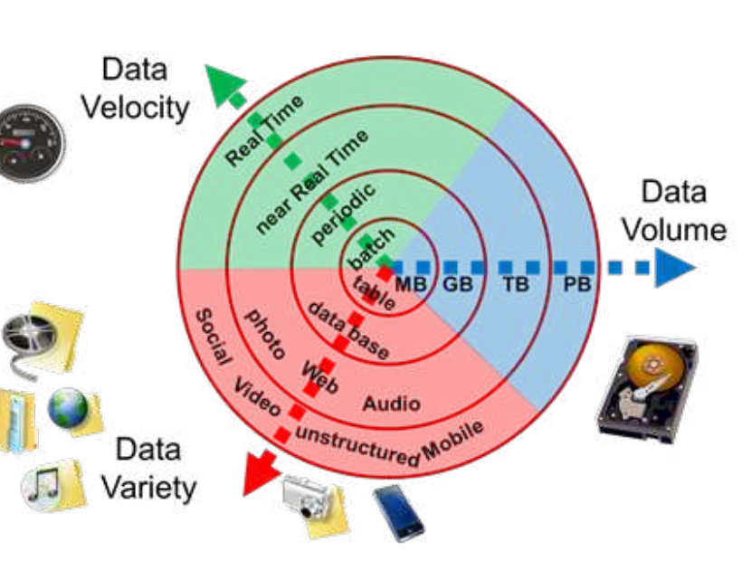

图示强调大数据不仅是“多”，还包括实时性、格式复杂性和来源多样性。

**关键提醒：** 数据更多不等于偏差更少。大数据仍可能存在选择偏差、测量偏差和算法偏差。

### Seite 44 - Big Data、ML 与 KI

归纳统计（induktive Statistik）包含机器学习和现代 AI 中许多基于数据的模式识别（Mustererkennung）与预测（Vorhersage）方法。

应用场景：

- 推荐算法与 filter bubble
- 支付方式和信用评分
- 医疗诊断
- 预测性警务（Predictive Policing）
- 刑事司法评分
- 自主武器系统

**考点：** 统计方法的社会影响取决于应用场景和决策权力。

### Seite 45 - Big Data 与隐私

本页讨论自动化、无处不在、持续的数据采集是否会威胁隐私（Privatsphäre）。Big Data 可能推断出比个人主动公开更多的信息。

**关键词：** 数据采集（Datenerfassung）、隐私保护（Schutz der Privatsphäre）、监控（Überwachung）。

### Seite 46 - 隐私不是“有东西可藏”

隐私的统计含义：数据组合、画像和预测可能影响个人机会，即使单个数据点看起来无害。

**考试表达：**  
`Datenschutz betrifft nicht nur Geheimhaltung, sondern auch Kontrolle über die Verwendung personenbezogener Daten.`

### Seite 47 - 大规模监控的滥用风险

大规模数据系统（Massendatensysteme）一旦存在，就可能被滥用。统计学需要考虑技术可行性之外的公平性（Fairness）和问责（Accountability）。

### Seite 48 - 隐私问题的统计维度

统计模型可能从间接变量推断敏感信息。即使删除姓名，也可能通过组合特征重新识别（Re-Identifikation）。

**考点：** 匿名化（Anonymisierung）不是绝对安全，尤其在多源数据可链接时。

### Seite 49 - 预测模型的道德责任

预测模型（predictive models）会影响资源分配、制度运行和个体生活。选择哪些数据进入模型、哪些变量被忽略，本身带有规范性和道德性。

**核心：** 模型不是中立自然力，而是人造决策工具。

### Seite 50 - 算法偏差与不透明性

复杂模型可能把人类偏见、测量偏差和历史不平等编码进系统。风险在于：

- 模型不透明（opaque）
- 错误难以上诉
- 对弱势群体造成更大伤害
- 数据采集和分析阶段都有隐藏偏差（hidden biases）

### Seite 51 - 偏差不仅来自算法

偏差（Bias）不只来自模型算法，也来自数据收集、标签定义、目标函数和使用环境。

**句式：**  
`Verzerrungen können sowohl in der Datenerhebung als auch in der Modellierung entstehen.`

## 模块四：理论、经验与模型的循环（Seite 52-58）

最后回到科学方法。理论给出概念，经验世界提供对象，统计把测量结果组织成可检验的模型。这个循环是后面所有章节的总背景：每一个公式都只是这个循环里的一个工具。

### Seite 52 - 未来挑战：公平实现潜力

本页总结 Big Data 与 ML 的挑战：如何实现正面潜力，同时避免反乌托邦式后果（dystopische Aspekte）。

需要结合统计学、计算机科学、伦理、法律和领域知识。

### Seite 53 - 统计学的当下与未来

当前趋势：

- 自动化采集数据无处不在。
- ChatGPT 等工具降低分析门槛。
- 统计基本理解对所有数据工作者都必要。
- 误用统计导致再现危机（Reproduzierbarkeitskrisen）。
- AI、ML 与 Big Data 带来新应用，也带来可解释性和风险评估问题。

**考点：** 工具越强，统计素养越重要。

### Seite 54 - 转入理论与经验

本页切换到最后一节：理论（Theorie）、经验（Empirie）与统计（Statistik）如何连接。

### Seite 55 - 理论与经验三角

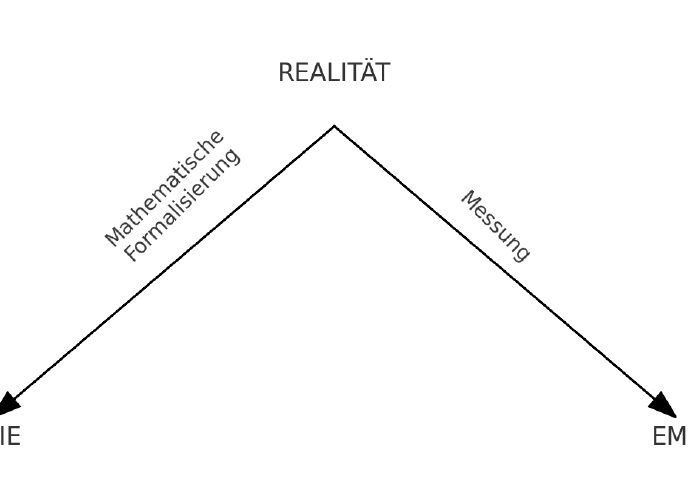

图示表达：理论通过数学形式化（mathematische Formalisierung）描述现实；经验通过测量（Messung）从现实获取数据。统计位于理论与数据之间，帮助连接两者。

### Seite 56 - 理论、数据与统计的循环

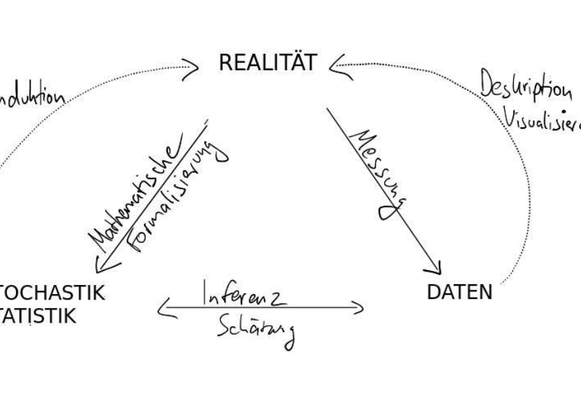

图中更明确地显示：

- 数学形式化把现实转为理论模型。
- 测量把现实转为数据。
- 描述统计可视化和总结数据。
- 推断统计从数据回到模型参数或理论判断。

### Seite 57 - 模型、数据与现实的关系

关键结论：

- 模型构建（Modellbildung）是现实片段的简化符号化。
- 数据来自测量，也是现实片段的简化数值化。
- 描述统计把数据总结为图、表和特征数。
- 统计推断基于数据对模型组成部分做定量陈述。
- 模型不等于现实（Modell ≠ Realität）。
- 有意义的应用统计总是跨学科的（interdisziplinär）。

### Seite 58 - 数学形式与经验数据的对应

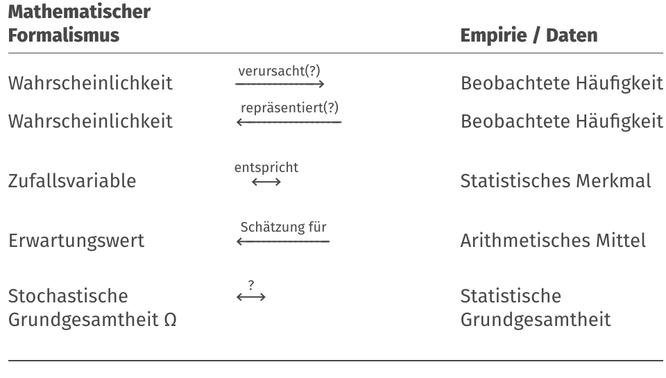

本页把数学形式和经验数据对应起来：

| 数学形式（Mathematischer Formalismus） | 经验/数据（Empirie / Daten） |
|---|---|
| Wahrscheinlichkeit | Beobachtete Häufigkeit |
| Zufallsvariable | Statistisches Merkmal |
| Erwartungswert | Arithmetisches Mittel |
| Stochastische Grundgesamtheit `Ω` | Statistische Grundgesamtheit |

**核心：** 这些对应不是机械等同，而是通过建模、测量和估计建立联系。

## 本章逻辑梳理

- **现实案例（Seite 3-30）：** 选举、食品、环境、体育、医疗、语言模型。
- **统计学的角色（Seite 31-42）：** 描述、推断、预测、决策。
- **统计学的时代背景（Seite 43-51）：** 数据量、算法、社会影响。
- **理论-经验-统计循环（Seite 52-58）：** 从理论到测量、模型、检验再回到理论。

真正复习时，不要按页码零散背。先问本章在解决什么问题，再把每页放回上面的模块里：前面的页通常提出问题，中间的页给出工具，后面的页提醒适用边界或展示例子。

## 关键考核点

1. 会把一个现实案例翻译成总体（Grundgesamtheit）、样本（Stichprobe）、变量（Merkmal）和研究问题。
2. 会解释统计学为什么必须处理不确定性（Unsicherheit），而不是只给一个确定答案。
3. 会区分数据（Daten）、模型（Modell）和现实（Wirklichkeit）。
4. 会说明为什么图形、模型和背景知识必须配合使用。

## 本章公式清单

### 统计推理框架

| 序号 | 公式 | 使用场景 | 注意事项 |
| ---: | --- | --- | --- |
| 1 | $Stichprobe \to Grundgesamtheit$ | 从样本推广到总体。 | 这不是计算公式，而是本课程最重要的推理方向。 |
| 2 | $Daten = Signal + Rauschen$ | 理解为什么需要模型与不确定性表达。 | 不要把观测到的波动直接解释成真实机制。 |
| 3 | $Modell \neq Wirklichkeit$ | 解释模型和现实之间的关系。 | 模型是有目的的简化，不是真实世界的复制品。 |

### 研究流程

| 序号 | 公式 | 使用场景 | 注意事项 |
| ---: | --- | --- | --- |
| 4 | $Theorie \to Messung \to Daten \to Modell \to Interpretation$ | 说明统计研究从概念到结论的链条。 | 任何一步出错，后面的数字都可能失去意义。 |
| 5 | $Unsicherheit \to Kommunikation \to Entscheidung$ | 解释统计结果为什么要报告不确定性。 | 只给点估计、不说误差范围，通常是不完整的。 |

## 章节自测

- [ ] 统计模型可以完全替代现实背景知识。
- [x] 样本到总体的推广需要讨论不确定性。
- [ ] 大数据自动消除测量误差和选择偏差。
- [x] 统计结论应当放回具体研究问题中解释。

## 德语词汇表

| 德语 | 中文 | 使用场景 |
| --- | --- | --- |
| Grundgesamtheit | 总体 | 研究对象全集 |
| Stichprobe | 样本 | 实际观察到的子集 |
| Unsicherheit | 不确定性 | 统计推断核心 |
| Modell | 模型 | 现实的有目的简化 |
| Empirie | 经验世界 | 数据所来自的现实层面 |
| Inferenz | 推断 | 从样本到总体 |
| Prognose | 预测 | 对未知或未来结果作判断 |
| Simulation | 模拟 | 用模型生成可能情形 |

## C1 德语句式

| 序号 | 德语句式 | 中文翻译 | 适用场景 |
| ---: | --- | --- | --- |
| 1 | Statistische Modelle liefern keine Abbilder der Wirklichkeit, sondern strukturierte Vereinfachungen. | 统计模型并不提供现实的复制品，而是结构化的简化。 | 解释模型边界。 |
| 2 | Aus einer Stichprobe auf eine Grundgesamtheit zu schließen, erfordert stets eine Quantifizierung der Unsicherheit. | 从样本推断总体，总是需要量化不确定性。 | 说明推断逻辑。 |
| 3 | Die Aussagekraft einer Analyse hängt nicht nur von der Datenmenge, sondern auch von Messung, Design und Modellannahmen ab. | 分析的说服力不仅取决于数据量，也取决于测量、研究设计和模型假设。 | 批判大数据迷信。 |
