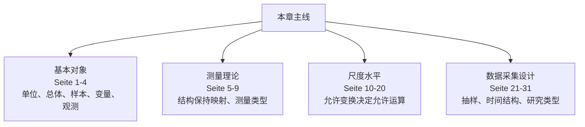
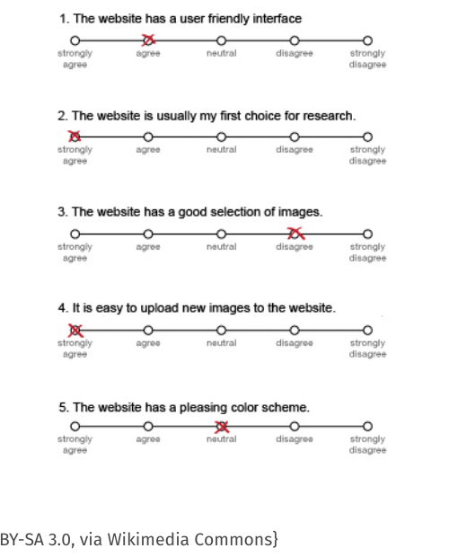

# 第 2 章：数据采集与测量（Datenerhebung & Messung）

> 来源：`分章节讲义/02_Datenerhebung & Messung.pdf`  
> 原讲义页码：S. 50-79，共 31 页  
> 图片目录：`assets/`  
> 核心主线：统计不是从“数字”开始，而是从“如何把现实对象的属性转化为可分析的符号或数字”开始。本章讲测量（Messung）、尺度水平（Skalenniveau）和数据采集（Datenerhebung）。

---

## 章节知识树

## 学习路径

统计数据不是天然存在的数字，而是通过测量规则和采集设计从现实中制造出来的分析对象。

1. **基本对象：** 单位、总体、样本、变量、观测（Seite 1-4）。
2. **测量理论：** 结构保持映射、测量类型（Seite 5-9）。
3. **尺度水平：** 允许变换决定允许运算（Seite 10-20）。
4. **数据采集设计：** 抽样、时间结构、研究类型（Seite 21-31）。

## 模块地图

| 模块 | 页码 | 核心问题 |
| --- | --- | --- |
| 基本对象 | Seite 1-4 | 单位、总体、样本、变量、观测 |
| 测量理论 | Seite 5-9 | 结构保持映射、测量类型 |
| 尺度水平 | Seite 10-20 | 允许变换决定允许运算 |
| 数据采集设计 | Seite 21-31 | 抽样、时间结构、研究类型 |

## 考试优先级

1. 会区分统计单位（statistische Einheit）、总体（Grundgesamtheit）、样本（Stichprobe）、变量（Merkmal）和取值（Ausprägung）。
2. 会根据允许变换判断尺度水平（Skalenniveau）。
3. 会说明为什么尺度水平决定均值、差值、比例等运算是否有意义。
4. 会区分横截面、时间序列、面板、观察研究、问卷和实验。

## 模块零：统计对象先要说清楚（Seite 1-4）

在做任何计算之前，必须先回答：谁是研究单位？总体是什么？样本从哪里来？变量能取哪些值？这几页是在给数据表里的每一行、每一列找现实含义。

### Seite 1 - 目录：Datenerhebung & Messung

本章目录：

- 测量（Messung）
- 尺度水平（Skalenniveaus）
- 数据采集（Datenerhebung）

中文理解：这一章是统计学的“地基”。如果测量错了、尺度判断错了，后面的均值、相关、回归都可能在内容上没有意义。

### Seite 2 - 基本概念 I（Grundbegriffe）

统计单位/研究单位（statistische Einheit, Untersuchungseinheit, UE）：被采集感兴趣量的对象，也叫特征载体（Merkmalsträger）。

总体（Grundgesamtheit, Population, GG）：对某个问题而言所有相关统计单位的集合。

子总体/样本（Teilgesamtheit, Stichprobe）：总体的一个子集；更具体地说，是那些实际有数据的研究单位。

> [!tip] 例子  
> 若研究“慕尼黑学生的通勤时间”，UE 是每个学生，GG 是所有目标范围内的慕尼黑学生，Stichprobe 是实际被调查且有数据的学生。

### Seite 3 - 基本概念 II

变量/特征（Merkmal, Variable, Ko-Variable）：研究单位上可测量的属性。

特征取值（Merkmalsausprägung）：某个研究单位在某个变量上的具体值。

特征空间/状态空间（Merkmalsraum, Zustandsraum）：某变量所有可能取值的集合。

注意：

$$
\text{beobachtete Ausprägungen}\subseteq \text{Merkmalsraum}.
$$

也就是说，样本里实际出现的取值只是可能取值空间的一部分。

观测（Beobachtung）：在某个测量时间点（Messzeitpunkt），一个研究单位所有被测变量的实际取值整体。

### Seite 4 - 目录切换：Messung

进入第一部分：测量（Messung）。

---

## 模块一：测量把现实变成数据（Seite 5-9）

测量不是随便贴数字标签，而是按规则把现实关系映射到符号系统。直觉上就是：如果现实中 A 比 B 更高，测量结果也必须保留这种关系。否则后面的统计量再漂亮也没有内容意义。

### Seite 5 - 测量的思想 I

讲义引用 Henry Margenau：

> Measurement is the contact of reason with nature.

意思是：测量是理性与自然接触的方式。

讲义引用 Stanley S. Stevens：

> Measurement is the assignment of numerals to objects or events according to rules.

意思是：测量就是按照规则把数字赋给对象或事件。

> [!note] 中文理解  
> 统计里的数字不是天然存在的，而是通过规则生成的。规则决定了数字能不能比较、能不能相减、能不能求比例。

### Seite 6 - 测量的思想 II

本页重复 Seite 5 的两个定义，用来强调：测量不只是“读数”，而是把现实对象按规则映射到数字或符号系统。

### Seite 7 - 什么是测量（Messen）

测量（Messen）意味着：把数字或符号分配给研究单位上某些变量的取值。

例子：

- 物理测量（physikalische Messungen）：长度、血压、温度。
- 心理测量（psychometrische Beispiele）：暴力倾向、抑郁严重程度。
- 经济学测量（wirtschaftswissenschaftliche Beispiele）：通货膨胀、国内生产总值、失业率。

核心：不同领域的“测量”可靠程度和理论依赖不同。长度测量通常比“抑郁严重程度”更直接。

### Seite 8 - 测量是结构保持映射

例子：

- Amir 身高 1.84
- Liz 身高 1.61
- Feihong 身高 1.72

身高这个变量在研究单位之间定义了一种关系：

$$
\text{Amir} > \text{Feihong} > \text{Liz}.
$$

有效测量（gültige Messung）必须保持这种关系，也就是结构保持映射（strukturerhaltende Abbildung / Homomorphismus）。

例如：

$$
\text{Liz ist kleiner als Amir}\Longleftrightarrow 1.61<1.84.
$$

> [!important] 考点  
> 测量不是任意贴标签。有效测量必须保留现实中的相关关系（Relationen）。

### Seite 9 - 测量类型（Typen von Messungen）

两类测量：

1. 有现实/物理对应结构的测量（reales/physikalisches Relativ），也叫直接测量（direkte Messung / representational measurement）。  
   例：长度、重量、数量、血糖浓度。

2. 通过操作化定义结构的测量（durch Operationalisierung definiertes Relativ），也叫间接/操作性测量（indirekte/operationale Messung / pragmatic measurement）。  
   例：智力、疾病严重程度、失业率。

操作化（Operationalisierung）意思是“使之可测”（Messbarmachung）：明确测量规则、测量工具、调查流程等。

## 模块二：尺度水平决定你能算什么（Seite 10-20）

很多考试题的陷阱是：变量看起来是数字，但不一定能做所有数字运算。名义、顺序、区间、比例尺度的区别，本质上是允许哪些变换不改变信息。能不能算均值、比例、差值、倍数，都要从尺度水平推出。

### Seite 10 - 目录切换：Skalenniveaus

进入尺度水平（Skalenniveaus）。

---

### Seite 11 - 尺度（Skalen）

测量可理解为结构保持映射：

$$
\text{empirisches Relativ}\cong \text{numerisches Relativ}.
$$

两个问题：

存在性（Existenz）：现实对象的结构是否允许一个结构保持映射存在？例如表示定理（Repräsentationstheorem）的公理是否满足，如传递性（Transitivität）。

唯一性（Eindeutigkeit）：是否有多个允许的尺度？例如面积可用 $\text{km}^2$ 或 ha，温度可用 Celsius、Fahrenheit 或 Kelvin。

由此产生关键问题：哪些变换仍然是允许的结构保持变换（zulässige strukturerhaltende Transformationen）？

### Seite 12 - 变换与运算（Transformationen und Operationen）

尺度变换（Transformation einer Skala）：把某个变量的取值映射到新取值的函数。近似理解为“换尺度”。

例子：

- 物理单位转换：温度从 Fahrenheit 到 Celsius。
- 重新命名（Relabeling）：职业标签从 “Putzkraft” 到 “Raumpfleger*in”。
- 分组（Gruppierung）：把 “braun” 和 “schwarz” 合并为 “dunkel”。

尺度上的运算（Operation auf einer Skala）：在同一个尺度上把取值相互联系起来的函数，例如 $=,\ne,>,<,$ 差值、比值等。

> [!warning] 易错点  
> 变换（Transformation）是换编码或换单位；运算（Operation）是在已有尺度上做比较、相减或求比例。

### Seite 13 - 尺度水平的核心逻辑

允许的尺度变换必须保持经验关系的结构。

允许变换的集合决定变量的尺度水平（Skalenniveau）。

尺度水平越高：

- 对观测值可做的有意义运算越多；
- 但允许的结构保持变换越少。

直觉：信息越丰富，乱改编码的自由越小。

### Seite 14 - 名义尺度（Nominalskala）

例子：宗教归属、居住地、袜子颜色。

结构：没有大小顺序，只有“相同/不同”。

有意义运算：等于/不等于（gleich/ungleich）。

允许变换：所有一一映射（eineindeutige Abbildungen）$f$，因为：

$$
a=b \Longleftrightarrow f(a)=f(b).
$$

> [!tip] 判断法  
> 如果换标签不会改变信息，就是 Nominalskala。例如把“红/蓝”改成“1/2”，数字大小没有意义。

### Seite 15 - 序数尺度（Ordinal- oder Rangskala）

例子：教育水平、社会阶层、疾病严重程度。

结构：线性顺序（lineare Ordnung）。

有意义运算：相同/不同，大于/小于。

允许变换：所有严格单调递增函数（streng monoton steigende Abbildungen）$f$，因为：

$$
a<b \Longleftrightarrow f(a)<f(b).
$$

注意：序数尺度可排序，但差距大小没有可靠解释。

### Seite 16 - 区间尺度（Intervallskala）

例子：摄氏温度、年份、IQ。

结构：差距可量化（Abstände quantifizierbar）。

有意义运算：相同/不同，大于/小于，差值（Differenzbildung）。

允许变换：正斜率线性变换：

$$
f(x)=ax+b,\quad a>0.
$$

它保持差值之间的相等关系：

$$
f(x_1)-f(x_2)=f(x_3)-f(x_4)
\Longleftrightarrow x_1-x_2=x_3-x_4.
$$

### Seite 17 - 比例尺度（Verhältnisskala）

比例尺度是带自然零点（natürlicher Nullpunkt）的区间尺度。

例子：时间长度、价格、长度、重量。

结构：差距可量化，零点唯一确定。

有意义运算：相同/不同，大于/小于，差值，比例（Verhältnisse）。

允许变换：正比例缩放：

$$
f(x)=ax,\quad a>0.
$$

它保持比值：

$$
\frac{f(x_1)}{f(x_2)}=\frac{x_1}{x_2}.
$$

### Seite 18 - 绝对尺度（Absolutskala）

例子：频数、数量（Häufigkeit, Anzahl）。

结构：单位自然固定。

允许变换：没有变换（keine Transformationen）。

例如“3 个孩子”中的 3 不能通过换单位变成别的数；计数单位已经天然给定。

### Seite 19 - 尺度水平总结（Skalenniveau）

核心原则：

- 尺度水平越高，对观测值可做的计算越多。
- 只有那些不受允许尺度变换影响的运算，才有内容上可解释的意义。

总结表：

| Oberbegriff | Skalenniveau | auszählen | ordnen | Differenzen | Quotienten |
|---|---|---:|---:|---:|---:|
| qualitativ | Nominal | ✓ | X | X | X |
| qualitativ | Ordinal | ✓ | ✓ | X | X |
| quantitativ / metrisch | Intervall | ✓ | ✓ | ✓ | X |
| quantitativ / metrisch | Verhältnis | ✓ | ✓ | ✓ | ✓ |
| quantitativ / metrisch | Absolut | ✓ | ✓ | ✓ | ✓ |

特殊情况：二分变量（dichotome, binär codierte Merkmale），如 0/1 编码，理论上是名义尺度，但均值可解释为比例。

### Seite 20 - 尺度变换：细菌浓度示例

例：细菌浓度可用原始浓度，也可用对数尺度（log-Skala）。

原始值：

$$
0.003,\quad 0.0003,\quad 0.00003.
$$

在 $\log_{10}$ 尺度上大致变为：

$$
-2.5,\quad -3.5,\quad -4.5.
$$

在 log 尺度上，差值表示变化因子的 log：

$$
\text{Differenz}=\log(\text{Faktor der Veränderung}).
$$

讲义提醒：有些变换在应用上很有意义，但从严格测量理论看可能不是允许变换。欢迎来到应用统计的现实世界。

## 模块三：数据采集决定结论边界（Seite 21-31）

同样一个变量，用全体调查、抽样、横截面、时间序列、面板、实验或观察研究得到，解释边界完全不同。本模块要养成习惯：看到数据先问它是怎么来的。

### Seite 21 - 指数构造（Indexbildung）

指数构造（Indexbildung）：把多个变量/题项（Items）汇总成一个聚合变量（aggregiertes Merkmal），也叫分数（Score）或指数（Index）。

常见做法：构造加权和（gewichtete Summe）。

例：Wahl-O-Mat 中与某政党的匹配度可理解为若干题项回答的加权汇总：

$$
w_1Q(\text{Tempolimit})+w_2Q(\text{Verteidigungsausgaben})+\cdots
$$

常见问题：

- 题项权重（Gewichtung der Items）如何确定？
- 指数的尺度水平（Skalenniveau des Index）是什么？

### Seite 22 - Likert 量表示例（Likert-Skalen）

本页给出 Likert 题项示例：受访者在“强烈同意”到“强烈不同意”的等级上作答。

### Seite 23 - Likert 量表的指数构造

Likert 量表常用于心理测量（Psychometrie）。

典型结构：

- 多个题项（Items）用评分尺度（Ratingskalen）询问对同一主题的同意/反对。
- 将多个有序评分（ordinale Ratings）求和或取平均，得到 Likert 量表的分数（Summen- oder Durchschnittsscore）。

关键问题：单个题项通常是序数尺度，但合成分数经常被当作近似区间尺度使用。这是应用统计中很常见、但需要说明假设的做法。

### Seite 24 - 连续与离散变量（stetige und diskrete Merkmale）

离散变量（diskretes Merkmal）：只能取有限或可数无限多个不同值。  
例：性别、孩子数量。

连续变量（stetiges Merkmal）：可以取连续区间中的所有值。  
例：时间长度、身高、体重。

这个区分会影响图形展示（grafische Darstellungsformen）和数值概括（numerische Zusammenfassungen）的选择。

### Seite 25 - 其他变量类别（Weitere Klassen）

准连续变量（quasi-stetiges Merkmal）：理论上离散，但单位很小，实践中近似连续。  
例：以 Cent 计的货币金额。

讲义提醒：现实测量几乎总是准连续，因为测量仪器和计算机浮点表示都有有限精度。

分组数据/频数数据（gruppierte Daten, Häufigkeitsdaten）：把一个准连续或连续变量的值域分成若干组（Klassen, Kategorien）。

例：工资等级、年龄组。

分组也常用于数据保护（Datenschutz）。

### Seite 26 - 目录切换：Datenerhebung

进入数据采集（Datenerhebung）。

---

### Seite 27 - 按范围分类：全体调查与样本

全体调查（Vollerhebung）：调查总体中的所有统计单位。

样本/部分调查（Stichprobe / Teilerhebung）：只调查总体中的一部分研究单位。若这些单位是随机选择的，称为随机样本（Zufallsstichprobe）。

讲义强调：归纳统计（induktive Statistik）通常只有在合适的随机样本基础上才是允许的。

> [!important] 考点  
> 描述性统计可以描述手头数据；推断总体时，样本选择机制非常关键。

### Seite 28 - 按数据形态分类

横截面数据（Querschnittsdaten）：在多个研究单位上一次性采集一个或多个变量。  
特点：每个研究单位一条观测。

时间序列（Zeitreihe）：对同一个研究单位，重复测量同一个变量，通常按固定间隔。  
例：某公司股价、某 Landkreis 的 Corona-Inzidenz。

纵向数据/面板数据（Längsschnittdaten, Longitudinaldaten, Paneldaten）：在多个研究单位上，对相同变量在多个时间点重复测量。  
特点：多个研究单位，每个单位多条观测。

### Seite 29 - 操作性测量的方法

观察（Beobachtung）：

- 隐蔽或参与式（verdeckt oder teilnehmend）；
- 用观察记录表进行系统观察（systematisch mit Beobachtungsprotokoll）。

调查/访谈（Befragung）：

- 口头、电话、是否有访谈员；
- 书面或在线问卷（Fragebogen）。

实验（Experiment）：

- 控制情境（kontrollierte Situation）；
- 可能通过观察或调查采集数据。

### Seite 30 - 实验（Experimente）

实验通常比较不同处理（Behandlungen）。

共同点：对事件过程进行实验性干预（experimenteller Eingriff）。

例子：

- 随机临床试验（randomisierte klinische Studie）：用随机化（Randomisierung）把处理分配给人。
- 生产、农业中的随机实验。
- 医学和生物学实验。
- 带随机成分的自然科学实验。
- Web 开发或 UX 设计中的 A/B 测试（A-B-Testing）。

### Seite 31 - 流行病学研究（Epidemiologische Studien）

队列研究（Kohortenstudien）：纵向数据的一种，可回顾性（retrospektiv）或前瞻性（prospektiv）。  
例：EPIC Studie，九个欧洲国家中 400,000 人。

病例-对照研究（Fall-Kontroll-Studien）：先收集患病者（Fälle），再匹配相应健康对照（Kontrollen）。  
例：Deutsche Radon Studie。

---

## 本章逻辑梳理

- **基本对象（Seite 1-4）：** 单位、总体、样本、变量、观测。
- **测量理论（Seite 5-9）：** 结构保持映射、测量类型。
- **尺度水平（Seite 10-20）：** 允许变换决定允许运算。
- **数据采集设计（Seite 21-31）：** 抽样、时间结构、研究类型。

真正复习时，不要按页码零散背。先问本章在解决什么问题，再把每页放回上面的模块里：前面的页通常提出问题，中间的页给出工具，后面的页提醒适用边界或展示例子。

## 关键考核点

1. 会区分统计单位（statistische Einheit）、总体（Grundgesamtheit）、样本（Stichprobe）、变量（Merkmal）和取值（Ausprägung）。
2. 会根据允许变换判断尺度水平（Skalenniveau）。
3. 会说明为什么尺度水平决定均值、差值、比例等运算是否有意义。
4. 会区分横截面、时间序列、面板、观察研究、问卷和实验。

## 本章公式清单

### 测量与尺度

| 序号 | 公式 | 使用场景 | 注意事项 |
| ---: | --- | --- | --- |
| 1 | $m: E \to Z$ | 把经验关系系统映射到数值/符号系统。 | 重点是结构保持（strukturerhaltend），不是数字本身。 |
| 2 | $x \mapsto f(x)$ | 描述允许变换（zulässige Transformation）。 | 不同尺度允许的 $f$ 不同，因此可用统计量也不同。 |
| 3 | $x' = a + bx,\ b>0$ | 区间尺度的允许线性变换。 | 差值有意义，零点不固定，倍数通常无意义。 |
| 4 | $x' = bx,\ b>0$ | 比例尺度的允许变换。 | 零点固定，因此倍数和比率有意义。 |

### 采集结构

| 序号 | 公式 | 使用场景 | 注意事项 |
| ---: | --- | --- | --- |
| 5 | $Stichprobe \subset Grundgesamtheit$ | 表示样本与总体的包含关系。 | 样本是否代表总体取决于抽样设计。 |
| 6 | $Beobachtung = (x_1,\ldots,x_p)$ | 一条观测由一个研究单位的多个变量取值组成。 | 不要把观测、变量、取值混为一谈。 |

## 章节自测

- [ ] 邮政编码是数字，所以可以计算平均值。
- [x] 比例尺度有固定零点，因此倍数比较有意义。
- [x] 样本只是总体的一个子集，是否代表总体还要看抽样设计。
- [ ] 观察研究天然可以推出因果关系。

## 德语词汇表

| 德语 | 中文 | 使用场景 |
| --- | --- | --- |
| statistische Einheit | 统计单位 | 数据行对应对象 |
| Merkmal | 变量/特征 | 数据列 |
| Merkmalsausprägung | 特征取值 | 某单位的具体值 |
| Skalenniveau | 尺度水平 | 决定允许运算 |
| zulässige Transformation | 允许变换 | 尺度判断核心 |
| Vollerhebung | 全体调查 | 覆盖总体 |
| Stichprobenerhebung | 抽样调查 | 只观察子集 |
| Paneldaten | 面板数据 | 多个单位多期观察 |

## C1 德语句式

| 序号 | 德语句式 | 中文翻译 | 适用场景 |
| ---: | --- | --- | --- |
| 1 | Welche statistischen Operationen sinnvoll sind, hängt vom Skalenniveau des Merkmals ab. | 哪些统计运算有意义，取决于变量的尺度水平。 | 解释尺度题。 |
| 2 | Eine Messung ist nur dann interpretierbar, wenn die relevanten empirischen Relationen im numerischen System erhalten bleiben. | 只有当相关经验关系在数值系统中被保留下来时，测量才可解释。 | 说明结构保持。 |
| 3 | Die Art der Datenerhebung begrenzt, welche Schlussfolgerungen aus den Daten gezogen werden dürfen. | 数据采集方式限制了我们能从数据中得出哪些结论。 | 讨论研究设计边界。 |
