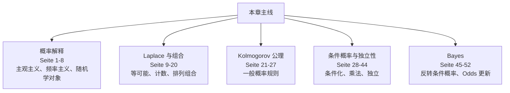
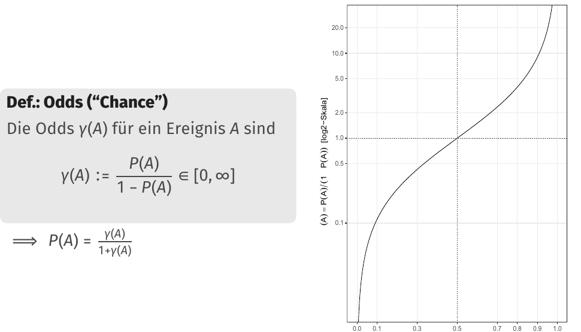

# 第 3 章：概率：基础与定义（Wahrscheinlichkeit: Grundlagen & Definitionen）

> 来源：`分章节讲义/03_Wahrscheinlichkeit_ Grundlagen & Definitionen.pdf`  
> 原讲义页码：S. 80-131，共 52 页  
> 图片目录：`assets/`  
> 核心主线：本章从概率的解释出发，建立事件（Ereignis）、样本空间（Grundraum/Ergebnisraum）、Laplace 概率、Kolmogorov 公理、条件概率、独立性与 Bayes 公式。

---

## 章节知识树

## 学习路径

概率把不确定性变成可运算的语言：从事件、样本空间到条件概率、独立性和 Bayes 更新。

1. **概率解释：** 主观主义、频率主义、随机学对象（Seite 1-8）。
2. **Laplace 与组合：** 等可能、计数、排列组合（Seite 9-20）。
3. **Kolmogorov 公理：** 一般概率规则（Seite 21-27）。
4. **条件概率与独立性：** 条件化、乘法、独立（Seite 28-44）。
5. **Bayes：** 反转条件概率、Odds 更新（Seite 45-52）。

## 模块地图

| 模块 | 页码 | 核心问题 |
| --- | --- | --- |
| 概率解释 | Seite 1-8 | 主观主义、频率主义、随机学对象 |
| Laplace 与组合 | Seite 9-20 | 等可能、计数、排列组合 |
| Kolmogorov 公理 | Seite 21-27 | 一般概率规则 |
| 条件概率与独立性 | Seite 28-44 | 条件化、乘法、独立 |
| Bayes | Seite 45-52 | 反转条件概率、Odds 更新 |

## 考试优先级

1. 会区分主观概率与频率主义解释。
2. 会用 Laplace 原理前先检查等可能。
3. 会区分互斥（disjunkt）和独立（unabhängig）。
4. 会用条件概率和 Bayes 公式解释诊断题。

## 模块零：先弄清概率在说什么（Seite 1-8）

概率不是只会算骰子。开头先处理一个基础问题：当我们写 $P(A)$ 时，到底是在表达个人信念、长期频率，还是一个抽象公理系统里的数？这决定了你如何解释统计结论。

### Seite 1 - 目录

本章内容：

- 概率的概念形成与解释（Begriffsbildung & Interpretation）
- Laplace 概率（Laplace-Wahrscheinlichkeiten）
- Kolmogorov 公理（Axiome von Kolmogorov）
- 条件概率（Bedingte Wahrscheinlichkeiten）
- 随机独立性（Stochastische Unabhängigkeit）
- Bayes 定理（Satz von Bayes）

### Seite 2 - 目录重复页

本页再次列出章节结构，用于进入概率解释部分。

### Seite 3 - 概率（Wahrscheinlichkeit）

概率（Wahrscheinlichkeit）是随机学（Stochastik）的基本概念。对事件（Ereignis）$A$：

- $P(A)=1$：$A$ 必然发生（tritt mit Sicherheit ein）。
- $P(A)=0$：$A$ 必然不发生（tritt mit Sicherheit nicht ein）。
- $P(A)=p\in(0,1)$：$A$ 以概率 $p$ 发生。

核心问题：$P(A)$ 到底该如何解释？

### Seite 4 - 主观主义解释（subjektivistische Interpretation）

主观主义概率可以从下注（Wetteinsatz）理解：

如果事件 $A$ 发生会获得收益 $g$，你愿意最多支付下注额 $e$，则在风险中性（Risikoneutralität）下：

$$
P(A)=\frac{e}{g}.
$$

因此概率可视为个人/主观不确定性（individuelle/subjektive Unsicherheit）的度量。

### Seite 5 - 运动博彩示例（Sportwette）

Nick 若在 Yolanda 喜欢的球队夺冠（事件 $M$）时支付两倍下注额，则：

- Yolanda 只有在她相信 $P(M)\ge 1/2$ 时才会下注；
- Nick 只有在他相信 $P(M)\le 1/2$ 时才会提供这个赌约。

中文理解：同一事件的主观概率可能因人而异，这不妨碍它作为不确定性的形式化表达。

### Seite 6 - 频率主义解释（frequentistische Interpretation）

频率主义解释：如果随机过程可无限重复，则事件 $A$ 发生的相对频率会收敛到概率 $P(A)$。

经典例子：反复投掷公平骰子（fairer Würfel）。

### Seite 7 - 两种解释的解释

对数学理论而言，$P(A)$ 的内容解释大多无关；但对统计分析的沟通与解释非常重要。

适用差异：

- 独一无二事件的概率，例如“某候选人是否赢得一次选举”，频率主义解释较困难。
- 已发生但未观察到的事件，频率主义解释也不自然。
- 简单可重复物理过程，如掷骰子，频率主义解释很自然。

应用：

- 主观主义概率：Bayesianische Statistik。
- 频率主义概率：klassische/frequentistische Statistik。

### Seite 8 - 随机学基本概念（Grundbegriffe der Stochastik）

结果（Ergebnis）$\omega$：随机实验的一个可能结果。

随机总体/样本空间（stochastische Grundgesamtheit / Grundraum / Basismenge / Ergebnisraum）$\Omega$：所有可能结果的集合。

事件（Ereignis）：$\Omega$ 的子集：

$$
A\subseteq \Omega.
$$

基本事件（Elementarereignis）：只含一个结果的集合 $\{\omega\}$。

每次随机实验恰好只有一个基本事件发生。

## 模块一：等可能时，概率就是会计数（Seite 9-20）

如果所有基本结果等可能，问题就变成数数：有利情况有多少，总情况有多少。困难常常不在公式，而在别漏数、别重数。

### Seite 9 - 目录切换：Laplace-Wahrscheinlichkeiten

进入 Laplace 概率。

---

### Seite 10 - Laplace 原理（Laplace-Prinzip）

Laplace 原理：如果没有反对理由，则假设所有基本事件等可能（gleichwahrscheinlich）。

> [!warning] 易错点  
> Laplace 原理只适合“有限 + 等可能”的场景。骰子若不公平，或基本事件无限，就不能直接用。

### Seite 11 - Laplace 概率定义

有限样本空间：

$$
\Omega=\{\omega_1,\omega_2,\ldots,\omega_n\}.
$$

对事件 $A\subseteq \Omega$，Laplace 概率：

$$
P(A)=\frac{|A|}{|\Omega|}=\frac{|A|}{n}.
$$

口语版：有利且等可能情况数 / 所有可能且等可能情况数。

### Seite 12 - 推论与扩展

在 Laplace 概率空间中，每个基本事件概率为：

$$
P(\{\omega_i\})=\frac{1}{n}.
$$

整体事件概率：

$$
P(\Omega)=1.
$$

$P:\mathcal{P}(\Omega)\to[0,1]$ 把每个事件映射到概率。这里 $\mathcal{P}(\Omega)$ 是幂集（Potenzmenge），即 $\Omega$ 的所有子集，不要和概率函数 $P$ 混淆。

事件运算：

- 并集（Vereinigung）$A\cup B$：A 或 B 或二者都发生。
- 交集（Schnitt）$A\cap B$：A 与 B 同时发生。

### Seite 13 - 两个骰子的点数和

两个骰子的样本空间：

$$
\Omega=\{(1,1),(1,2),\ldots,(6,6)\},\quad |\Omega|=36.
$$

令 $A_k$ 为“点数和为 $k$”，则：

$$
P(A_k)=\frac{6-|k-7|}{36},\quad k=2,\ldots,12.
$$

原因：和为 7 的组合最多，离 7 越远组合越少。

### Seite 14 - 组合数学一页（Kombinatorik）

从 $n$ 个元素中选 $k$ 个：

有放回、有顺序：

$$
n^k.
$$

无放回、有顺序：

$$
n(n-1)\cdots(n-k+1)=\frac{n!}{(n-k)!}.
$$

无放回、无顺序：

$$
\binom{n}{k}=\frac{n!}{(n-k)!k!}.
$$

有放回、无顺序：

$$
\binom{n+k-1}{k}.
$$

### Seite 15 - Skat 牌例子

Skat 中有 32 张牌，包括 4 张 Jacks（Buben），分给 3 人，每人 10 张，2 张进 Skat。

问题：计算 Laplace 概率：

- $A_1$：“Person 1 erhält alle Buben”
- $A_2$：“Alle 3 erhalten genau einen Buben”

讲义在这里强调：这类问题要先明确“等可能的发牌方式”是什么，再数有利情况。

### Seite 16 - Laplace 概率太特殊

反例：

- 不公平骰子（unfairer Würfel）。
- 稀有事件，如硬盘损坏、突变。

这些情况下基本事件不等可能。另一个问题：若 $|\Omega|=\infty$，则无法简单用 $|A|/|\Omega|$。

### Seite 17 - 无限样本空间示例

问题：投公平硬币直到第一次出现 Zahl，关心需要投掷的次数。

样本空间：

$$
\Omega=\{1,2,3,\ldots\}=\mathbb{N}^+.
$$

若 $\omega_i=i$，则：

$$
P(\{\omega_i\})=\left(\frac12\right)^i,\quad i=1,2,\ldots
$$

且：

$$
\sum_{i=1}^{\infty}\left(\frac12\right)^i=1.
$$

这说明无限样本空间也可以有合理概率分布，但不能用简单 Laplace 计数。

### Seite 18 - 目录切换：Kolmogorov-Axiome

进入 Kolmogorov 公理。

---

### Seite 19 - 不相交事件与补事件

不相交事件（disjunkte Ereignisse）：若 $A,B\subseteq\Omega$ 且：

$$
A\cap B=\varnothing,
$$

则 $A$ 与 $B$ 不相交。

补事件/对立事件（Komplement/Gegenereignis）：

$$
\bar{A}:=\Omega\setminus A=\{\omega\in\Omega:\omega\notin A\}.
$$

事件与补事件不相交，且不能同时发生。样本空间中的基本事件构成一组不相交事件。

### Seite 20 - Kolmogorov 公理

给定可数样本空间 $\Omega$ 和函数 $P:\mathcal{P}(\Omega)\to[0,1]$。若满足：

A1 非负性（Positivität）：

$$
P(A)\ge 0,\quad \forall A\subseteq\Omega.
$$

A2 必然事件（sicheres Ereignis）：

$$
P(\Omega)=1.
$$

A3 可加性（Additivität）：若 $A,B$ 不相交，则：

$$
P(A\cup B)=P(A)+P(B).
$$

则 $P$ 是 $\Omega$ 上的概率分布（Wahrscheinlichkeitsverteilung）。

## 模块二：Kolmogorov 公理给概率立规矩（Seite 21-27）

现实问题不总是等可能，所以要有更一般的规则。公理系统告诉你：概率至少必须非负、总量为 1、互斥事件可加。后面所有复杂计算都不能违反这些底线。

### Seite 21 - 公理推论

若 $A_1,\ldots,A_n$ 两两不相交：

$$
P\left(\bigcup_{i=1}^{n}A_i\right)=\sum_{i=1}^{n}P(A_i).
$$

若 $A\subseteq B$：

$$
P(A)\le P(B).
$$

补事件：

$$
P(\bar{A})=1-P(A).
$$

一般加法公式：

$$
P(A\cup B)=P(A)+P(B)-P(A\cap B).
$$

### Seite 22 - Sylvester-Poincaré 筛公式

对任意事件 $A_1,\ldots,A_n$：

$$
P\left(\bigcup_{i=1}^{n}A_i\right)
=\sum_i P(A_i)-\sum_{i<j}P(A_i\cap A_j)
+\sum_{i<j<k}P(A_i\cap A_j\cap A_k)-\cdots.
$$

三事件情形：

$$
\begin{aligned}
P(A\cup B\cup C)
=&P(A)+P(B)+P(C)\\
&-P(A\cap B)-P(A\cap C)-P(B\cap C)\\
&+P(A\cap B\cap C).
\end{aligned}
$$

### Seite 23 - Bonferroni 不等式

对任意事件 $A_1,\ldots,A_n$：

$$
\sum_i P(A_i)\ge P\left(\bigcup_i A_i\right)
\ge \sum_i P(A_i)-\sum_{i<j}P(A_i\cap A_j).
$$

中文理解：只加单个事件概率会高估并集概率；减去两两交集后给出下界。

### Seite 24 - 目录切换：Bedingte Wahrscheinlichkeiten

进入条件概率。

---

### Seite 25 - 条件概率定义

对 $A,B\subseteq\Omega$ 且 $P(B)>0$，给定 $B$ 下 $A$ 的条件概率（bedingte Wahrscheinlichkeit）：

$$
P(A|B):=\frac{P(A\cap B)}{P(B)}.
$$

解释：

- 在 $B$ 已经发生的前提下，$A$ 有多可能？
- 在所有 $B$ 发生的情况中，有多少比例也属于 $A$？

### Seite 26 - 骰子例子

定义：

- $G$：骰子结果为偶数（gerade Zahl）。
- $F$：骰子结果至少为 5。
- $S$：骰子结果为 6。

则：

$$
P(F|G)=\frac13,\quad P(G|F)=\frac12,\quad P(S|\bar{G})=0,\quad P(G|S)=1.
$$

> [!important] 考点  
> 条件顺序不能随便交换。通常 $P(A|B)\ne P(B|A)$。

### Seite 27 - 条件概率的性质

固定条件 $B$ 时：

$$
P(B|B)=1,\qquad P(\bar{B}|B)=0,\qquad P(A|B)\ge 0.
$$

若 $A_1,A_2$ 不相交：

$$
P((A_1\cup A_2)|B)=P(A_1|B)+P(A_2|B).
$$

因此，固定 $B$ 后，$P(A|B)$ 在新的较小样本空间 $B$ 上也是一个概率分布。

多重条件等价于对条件交集进行条件化：

$$
P((A|B)|C)=P(A|B\cap C).
$$

## 模块三：条件化让概率进入信息更新（Seite 28-44）

一旦知道了 $B$ 已经发生，我们看 $A$ 的概率就要换世界。条件概率、乘法公式和独立性都围绕这件事展开：新信息有没有改变原来的概率？

### Seite 28 - Skat 条件概率示例

定义：

- $A$：“至少一张方块牌（Karokarte）在 Skat 中。”
- $B$：“Spieler 1 发牌时没有拿到八张方块牌中的任何一张。”

需要比较 $P(A)$ 与 $P(A|B)$。

中文理解：条件 $B$ 改变了剩余牌的构成，因此会改变 $A$ 的概率。

### Seite 29 - 乘法公式（Multiplikationssatz）

对事件 $A_1,\ldots,A_n$：

$$
\begin{aligned}
P(A_1\cap\cdots\cap A_n)
=&P(A_1)\cdot P(A_2|A_1)\cdot P(A_3|A_1\cap A_2)\\
&\cdots P(A_n|A_1\cap\cdots\cap A_{n-1}).
\end{aligned}
$$

两事件：

$$
P(A_1,A_2)=P(A_1)P(A_2|A_1).
$$

三事件：

$$
P(A_1,A_2,A_3)=P(A_1)P(A_2|A_1)P(A_3|A_1,A_2).
$$

### Seite 30 - 全概率公式（Satz von der totalen Wahrscheinlichkeit）

若 $B_1,\ldots,B_n$ 构成 $\Omega$ 的不相交分解（disjunkte Zerlegung / Partition）：

$$
B_i\cap B_j=\varnothing\ (i\ne j),\qquad \bigcup_{i=1}^{n}B_i=\Omega.
$$

且 $P(B_i)>0$，则对任意 $A$：

$$
P(A)=\sum_{i=1}^{n}P(A|B_i)P(B_i).
$$

### Seite 31 - 全概率公式的重要特例

由 $B$ 和 $\bar{B}$ 构成分解：

$$
P(A)=P(A|B)P(B)+P(A|\bar{B})P(\bar{B}).
$$

### Seite 32 - 目录切换：Stochastische Unabhängigkeit

进入随机独立性。

---

### Seite 33 - 独立性的动机

两个事件 $A,B$ 随机独立（stochastisch unabhängig），直觉是：

$$
P(A|B)=P(A)
$$

或：

$$
P(B|A)=P(B).
$$

也就是：一个事件发生不改变另一个事件发生的概率。

### Seite 34 - 独立性定义

两个事件 $A,B$ 独立，当且仅当：

$$
P(A\cap B)=P(A)\cdot P(B).
$$

记号：

$$
A\perp B.
$$

这个定义不要求 $P(A)>0$ 或 $P(B)>0$。

独立性可传递到补事件：

$$
A\perp B \Longleftrightarrow \bar{A}\perp B
\Longleftrightarrow A\perp \bar{B}
\Longleftrightarrow \bar{A}\perp \bar{B}.
$$

### Seite 35 - 两次掷骰子

公平骰子连续掷两次：

- $A$：第一次掷出 6。
- $B$：第二次掷出 6。

$$
P(A)=P(B)=\frac16.
$$

若两次投掷独立：

$$
P(A\cap B)=P(A)P(B)=\frac{1}{36}.
$$

### Seite 36 - 有技巧的两次掷骰子

若第二次投掷可被操控，使其以 0.5 的概率等于第一次结果，其余五个结果各以 0.1 概率出现。

仍可能有：

$$
P(A)=P(B)=\frac16.
$$

但：

$$
P(A\cap B)=P(A)P(B|A)=\frac16\cdot\frac12=\frac{1}{12}\ne \frac{1}{36}.
$$

因此 $A$ 与 $B$ 依赖（abhängig）。

### Seite 37 - 多个事件的独立性

事件 $A_1,\ldots,A_n$ 独立，当且仅当对所有子集 $I=\{i_1,\ldots,i_k\}\subseteq\{1,\ldots,n\}$：

$$
P(A_{i_1}\cap\cdots\cap A_{i_k})
=P(A_{i_1})\cdots P(A_{i_k}).
$$

注意：两两独立（paarweise unabhängig）不推出多个事件共同独立。

### Seite 38 - 两两独立但不共同独立

Laplace 空间：

$$
\Omega=\{0,1,2,3\}.
$$

定义：

$$
A_i=\{0\}\cup\{i\},\quad i=1,2,3.
$$

则：

$$
P(A_i)=\frac12,\quad P(A_i\cap A_j)=\frac14=P(A_i)P(A_j).
$$

所以两两独立。但：

$$
P(A_1\cap A_2\cap A_3)=\frac14\ne \frac18=P(A_1)P(A_2)P(A_3).
$$

因此三者不共同独立。

### Seite 39 - 条件独立性（bedingte Unabhängigkeit）

给定事件 $C$ 且 $P(C)>0$，若：

$$
P(A\cap B|C)=P(A|C)P(B|C),
$$

则称 $A$ 与 $B$ 在给定 $C$ 下条件独立（bedingt unabhängig gegeben $C$）。

记号：

$$
(A\perp B)|C.
$$

重要：条件独立不推出无条件独立；无条件独立也不推出条件独立。

### Seite 40 - 条件独立例子 1

盒中有两枚硬币：一枚正常硬币，一枚两面都是 Kopf 的假硬币。随机选一枚，投两次。

定义：

- $A$：第一次 Kopf。
- $B$：第二次 Kopf。
- $C$：选中正常硬币。

给定 $C$ 时，两次投掷独立；但不给定 $C$ 时，$A$ 与 $B$ 不独立。

结论：条件独立不推出无条件独立。

### Seite 41 - 条件独立例子 2

一次掷骰子：

$$
A=\{1,2\},\quad B=\{2,4,6\},\quad C=\{1,4\}.
$$

有 $A\perp B$，但给定 $C$ 后不独立：

$$
(A\not\perp B)|C.
$$

结论：无条件独立不推出条件独立。

### Seite 42 - 目录切换：Satz von Bayes

进入 Bayes 定理。

---

### Seite 43 - Bayes 定理的来源

条件概率定义的非对称性：

$$
P(A|B)=\frac{P(A\cap B)}{P(B)}
\Rightarrow P(A\cap B)=P(A|B)P(B).
$$

同时：

$$
P(B|A)=\frac{P(A\cap B)}{P(A)}
\Rightarrow P(A\cap B)=P(B|A)P(A).
$$

因此：

$$
P(A|B)P(B)=P(B|A)P(A).
$$

### Seite 44 - Bayes 定理 II

Bayes 公式：

$$
P(B|A)=\frac{P(A|B)P(B)}{P(A)}.
$$

用全概率公式展开分母：

$$
P(B|A)=
\frac{P(A|B)P(B)}
{P(A|B)P(B)+P(A|\bar{B})P(\bar{B})}.
$$

对分解 $B_1,\ldots,B_n$：

$$
P(B_i|A)=
\frac{P(A|B_i)P(B_i)}
{\sum_{j=1}^{n}P(A|B_j)P(B_j)}.
$$

## 模块四：Bayes 把条件方向反过来（Seite 45-52）

很多现实问题不是问原因推出结果，而是看到结果后倒推原因。Bayes 公式就是把 $P(Daten\mid Hypothese)$ 转成 $P(Hypothese\mid Daten)$ 的工具。

### Seite 45 - Bayes 的解释

$P(B_i)$：先验概率（a-priori-Wahrscheinlichkeit），表示观察数据前对假设 $B_i$ 的可信度。

$P(A|B_i)$：似然（Likelihood），表示如果 $B_i$ 为真，观察到数据 $A$ 有多合理。

$P(B_i|A)$：后验概率（a-posteriori-Wahrscheinlichkeit），表示观察到 $A$ 后，假设 $B_i$ 的更新概率。

Bayes 是更新规则（Update-Regel）。

### Seite 46 - Bayes 的意义

Bayes 定理可以反转条件顺序：

从：

$$
P(A|B_i)
$$

即“若假设 $B_i$ 为真，观察到数据 $A$ 有多可能？”

转到：

$$
P(B_i|A)
$$

即“已经观察到数据 $A$ 后，假设 $B_i$ 有多可信？”

这允许根据观测数据推断不可直接观察的现象或模型假设。

### Seite 47 - 诊断测试示例

定义：

- $K$：Person ist krank。
- $T$：Test ist positiv。

给定：

- Sensitivität（真阳性率）：$P(T|K)$。
- Spezifität（真阴性率）：$P(\bar{T}|\bar{K})$。
- Prävalenz：$P(K)$。

治疗决策相关：

- 阳性预测值（positiv prädiktiver Wert）：$P(K|T)$。
- 阴性预测值（negativ prädiktiver Wert）：$P(\bar{K}|\bar{T})$。

### Seite 48 - 诊断测试计算

给定：

$$
P(T|K)=0.8,\quad P(\bar{T}|\bar{K})=0.99,\quad P(K)=0.001.
$$

总阳性概率：

$$
\begin{aligned}
P(T)
&=P(T|K)P(K)+P(T|\bar{K})P(\bar{K})\\
&=0.8\cdot0.001+(1-0.99)\cdot0.999\\
&\approx 0.011.
\end{aligned}
$$

阳性后真正患病概率：

$$
P(K|T)=\frac{P(T|K)P(K)}{P(T)}\approx 0.073.
$$

这看起来反直觉，但原因是疾病太罕见。

### Seite 49 - Odds / Chancen

Odds（Chance）是概率的另一种表示：

$$
\gamma(A):=\frac{P(A)}{1-P(A)}\in[0,\infty].
$$

反解：

$$
P(A)=\frac{\gamma(A)}{1+\gamma(A)}.
$$

### Seite 50 - Odds 形式的 Bayes

Bayes 可写成：

$$
\frac{P(B|A)}{P(\bar{B}|A)}
=
\frac{P(B)}{P(\bar{B})}
\cdot
\frac{P(A|B)}{P(A|\bar{B})}.
$$

也就是：

$$
\gamma(B|A)=\gamma(B)\cdot \frac{P(A|B)}{P(A|\bar{B})}.
$$

含义：

$$
\text{Posterior Odds}=\text{Prior Odds}\times\text{Likelihood Ratio}.
$$

Likelihood Ratio 也叫 Bayes-Faktor。离 1 越远，观测 $A$ 对假设 $B$ 越有信息量。

### Seite 51 - 用 Odds 做 Bayes 更新

沿用诊断测试：

$$
P(T|K)=0.8,\quad P(\bar{T}|\bar{K})=0.99,\quad P(K)=0.001.
$$

先验 odds：

$$
\gamma(K)=\frac{0.001}{0.999}\approx 1:999.
$$

Likelihood Ratio：

$$
\frac{P(T|K)}{P(T|\bar{K})}=\frac{0.8}{0.01}=80.
$$

后验 odds：

$$
\gamma(K|T)\approx \frac{1}{999}\cdot 80\approx 1:12.
$$

结论：约 13 个阳性测试中，只有 1 个真正患病。

这是非常常见的基率谬误（base-rate fallacy）：把 likelihood 或 likelihood ratio 与 posterior 混淆，忽略先验/基率（Prior/base-rate）。

### Seite 52 - Bayes 练习：Python 与数学专业

给定：

- 75% 的数学学生会 Python。
- 15% 的其他学生会 Python。
- 1100 名学生中，100 人学数学。

定义：

- $M$：Kim studiert Mathe。
- $P$：Kim kann Python。

要求：

$$
\gamma(M|P)\quad \text{和}\quad P(M|P).
$$

解题思路：

$$
P(M)=\frac{100}{1100}=\frac{1}{11},\quad P(\bar{M})=\frac{10}{11}.
$$

$$
P(P|M)=0.75,\quad P(P|\bar{M})=0.15.
$$

先验 odds：

$$
\gamma(M)=\frac{1/11}{10/11}=1:10.
$$

Likelihood Ratio：

$$
\frac{P(P|M)}{P(P|\bar{M})}=\frac{0.75}{0.15}=5.
$$

后验 odds：

$$
\gamma(M|P)=\frac{1}{10}\cdot5=\frac12=1:2.
$$

所以：

$$
P(M|P)=\frac{\gamma(M|P)}{1+\gamma(M|P)}
=\frac{1/2}{1+1/2}=\frac13.
$$

---

## 本章逻辑梳理

- **概率解释（Seite 1-8）：** 主观主义、频率主义、随机学对象。
- **Laplace 与组合（Seite 9-20）：** 等可能、计数、排列组合。
- **Kolmogorov 公理（Seite 21-27）：** 一般概率规则。
- **条件概率与独立性（Seite 28-44）：** 条件化、乘法、独立。
- **Bayes（Seite 45-52）：** 反转条件概率、Odds 更新。

真正复习时，不要按页码零散背。先问本章在解决什么问题，再把每页放回上面的模块里：前面的页通常提出问题，中间的页给出工具，后面的页提醒适用边界或展示例子。

## 关键考核点

1. 会区分主观概率与频率主义解释。
2. 会用 Laplace 原理前先检查等可能。
3. 会区分互斥（disjunkt）和独立（unabhängig）。
4. 会用条件概率和 Bayes 公式解释诊断题。

## 本章公式清单

### 基本概率

| 序号 | 公式 | 使用场景 | 注意事项 |
| ---: | --- | --- | --- |
| 1 | $0\le P(A)\le 1$ | 判断概率值是否合法。 | 概率不能小于 0 或大于 1。 |
| 2 | $P(\Omega)=1$ | 样本空间必然发生。 | 所有可能结果合在一起概率为 1。 |
| 3 | $P(A^c)=1-P(A)$ | 用补事件简化计算。 | 常用于“至少一个”等题型。 |
| 4 | $P(A\cup B)=P(A)+P(B)-P(A\cap B)$ | 两个事件并集概率。 | 不要重复计算交集。 |

### Laplace 与组合

| 序号 | 公式 | 使用场景 | 注意事项 |
| ---: | --- | --- | --- |
| 5 | $P(A)=\frac{\lvert A\rvert}{\lvert\Omega\rvert}$ | 有限等可能情形。 | 只适用于所有基本结果等可能。 |
| 6 | $\binom{n}{k}=\frac{n!}{k!(n-k)!}$ | 无顺序抽取 $k$ 个对象。 | 先判断顺序是否重要。 |

### 条件概率、独立与 Bayes

| 序号 | 公式 | 使用场景 | 注意事项 |
| ---: | --- | --- | --- |
| 7 | $P(A\mid B)=\frac{P(A\cap B)}{P(B)}$ | 已知 $B$ 发生后计算 $A$。 | 要求 $P(B)>0$。 |
| 8 | $P(A\cap B)=P(A\mid B)P(B)$ | 乘法公式。 | 可推广到多阶段过程。 |
| 9 | $A\perp B \Leftrightarrow P(A\cap B)=P(A)P(B)$ | 判断随机独立。 | 独立不是互斥。 |
| 10 | $P(A\mid B)=\frac{P(B\mid A)P(A)}{P(B)}$ | Bayes 公式。 | 分母通常用全概率公式展开。 |
| 11 | $Odds(A\mid B)=BF\cdot Odds(A)$ | 用 Odds 形式做 Bayes 更新。 | 适合连续多次证据更新。 |

## 章节自测

- [ ] 互斥事件一定独立。
- [x] Bayes 公式可以把 $P(B\mid A)$ 转成 $P(A\mid B)$。
- [x] Laplace 概率要求基本结果等可能。
- [ ] $P(A\mid B)$ 与 $P(B\mid A)$ 通常相等。

## 德语词汇表

| 德语 | 中文 | 使用场景 |
| --- | --- | --- |
| Grundraum | 样本空间 | 所有基本结果 |
| Ereignis | 事件 | 样本空间子集 |
| Laplace-Prinzip | Laplace 原理 | 有限等可能 |
| disjunkt | 互斥 | 不能同时发生 |
| bedingte Wahrscheinlichkeit | 条件概率 | 已知信息后的概率 |
| stochastische Unabhängigkeit | 随机独立 | 概率不被对方改变 |
| Satz von Bayes | Bayes 定理 | 反转条件概率 |
| Odds | 赔率 | 概率的比值形式 |

## C1 德语句式

| 序号 | 德语句式 | 中文翻译 | 适用场景 |
| ---: | --- | --- | --- |
| 1 | Die Laplace-Formel ist nur anwendbar, wenn alle Elementarereignisse gleich wahrscheinlich sind. | 只有当所有基本事件等可能时，Laplace 公式才适用。 | 防止乱套公式。 |
| 2 | Unabhängigkeit bedeutet, dass die Information über das eine Ereignis die Wahrscheinlichkeit des anderen nicht verändert. | 独立意味着关于一个事件的信息不会改变另一个事件的概率。 | 解释独立性。 |
| 3 | Der Satz von Bayes erlaubt es, von einer Likelihood auf eine posteriori Wahrscheinlichkeit zu schließen. | Bayes 定理允许我们从似然推到后验概率。 | 解释 Bayes 更新。 |
