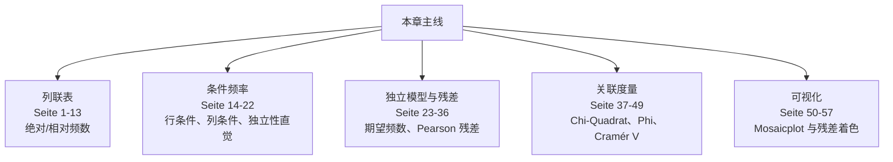
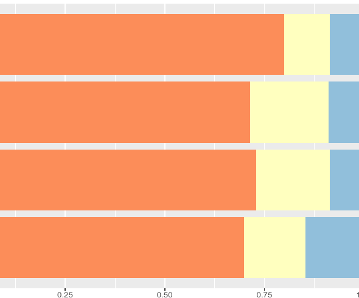
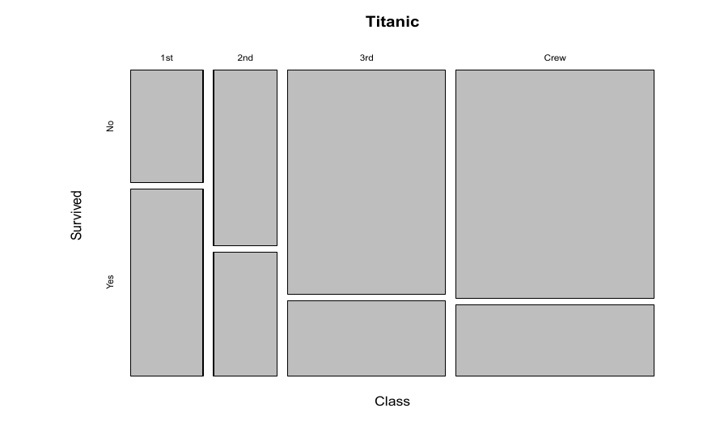
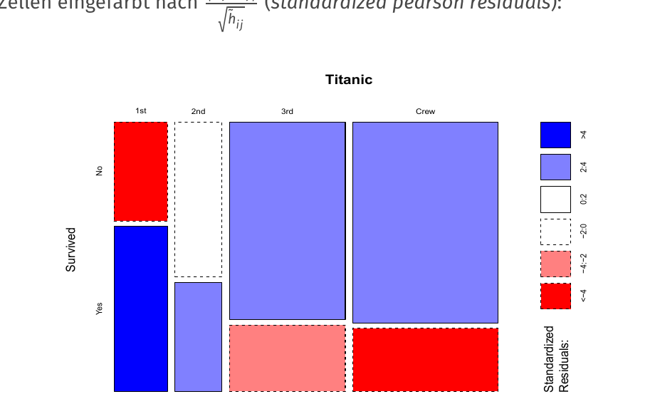
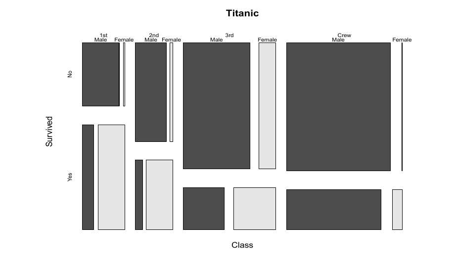

# 第 4 章：离散变量的关联度量（Zusammenhangsmaße für diskrete Merkmale）

> 来源：`分章节讲义/04_Zusammenhangsmaße für diskrete Merkmale.pdf`  
> 原讲义页码：S. 132-188，共 57 页  
> 图片目录：`assets/`  
> 核心主线：本章研究两个或多个离散/分组变量（diskrete und gruppierte Merkmale）之间是否有关联，以及这种关联如何用列联表（Kontingenztafel）、条件频率（bedingte Häufigkeiten）、Odds Ratio、$\chi^2$ 系数、Kontingenzkoeffizient 和 Mosaikplot 描述。

---

## 章节知识树

## 学习路径

离散变量的关系先从列联表看结构，再用条件频率、期望频数、残差和关联度量量化偏离独立的程度。

1. **列联表：** 绝对/相对频数（Seite 1-13）。
2. **条件频率：** 行条件、列条件、独立性直觉（Seite 14-22）。
3. **独立模型与残差：** 期望频数、Pearson 残差（Seite 23-36）。
4. **关联度量：** Chi-Quadrat、Phi、Cramér V（Seite 37-49）。
5. **可视化：** Mosaicplot 与残差着色（Seite 50-57）。

## 模块地图

| 模块 | 页码 | 核心问题 |
| --- | --- | --- |
| 列联表 | Seite 1-13 | 绝对/相对频数 |
| 条件频率 | Seite 14-22 | 行条件、列条件、独立性直觉 |
| 独立模型与残差 | Seite 23-36 | 期望频数、Pearson 残差 |
| 关联度量 | Seite 37-49 | Chi-Quadrat、Phi、Cramér V |
| 可视化 | Seite 50-57 | Mosaicplot 与残差着色 |

## 考试优先级

1. 会从列联表读绝对频数、相对频数、边际频数和条件频率。
2. 会解释独立时的期望频数如何由边际频数得到。
3. 会区分 Chi-Quadrat 统计量和 Cramér's V 的用途。
4. 会用残差或 Mosaicplot 指出哪类组合异常。

## 模块零：两个离散变量先放进同一张表（Seite 1-13）

如果一个变量只有类别，另一个变量也只有类别，散点图就不再是主角。我们先用列联表把组合情况数清楚：每个格子代表一种变量组合，每个边际和代表一个变量自己的分布。

### Seite 1 - 目录

本章内容包括：

- 离散和分组变量的列联表（Kontingenztafeln）
- 条件频率（bedingte Häufigkeiten）
- 离散关联分析：Odds
- 离散关联分析：独立性与列联（Unabhängigkeit & Kontingenz）
- 多变量列联表与 Mosaikplots

### Seite 2 - 目录重复页

本页再次给出章节结构。

### Seite 3 - 引入（Einführung）

回到经验数据：如何根据观测数据判断变量之间的依赖或独立？

当每个研究单位有多个变量时，数据是多维或多变量数据（mehrdimensionale oder multivariate Daten）。

### Seite 4 - 多变量数据（Multivariate Daten）

样本中每个研究单位 $i=1,\ldots,n$ 可有多个变量观测：

$$
(x_i,y_i,z_i).
$$

本章通常只看两个变量 $X,Y$。

两类问题：

- $X\leftrightarrow Y$：$X$ 与 $Y$ 是否以及如何相关？关键词：Assoziation、Korrelation、Unabhängigkeit。
- $X\to Y$：$X$ 如何影响目标变量 $Y$？关键词：Regression、Kausalität。本章不深入因果。

### Seite 5 - 离散和分组变量

设 $X$ 的取值为：

$$
a_1,\ldots,a_k
$$

$Y$ 的取值为：

$$
b_1,\ldots,b_m.
$$

这里 $X,Y$ 可以是任意尺度水平，甚至可以是分组后的度量变量（gruppierte metrische Merkmale），但后续分析只使用名义尺度层面的信息（Nominalskalenniveau）。

### Seite 6 - 示例：按性别的投票行为

Bundestag 2021 选后调查（Nachwahlbefragung）给出性别与党派偏好列联表。行是 Männer/Frauen，列是 SPD、CDU/CSU、Grüne、FDP、AfD、Linke、Rest。

该表展示联合绝对频数（gemeinsame absolute Häufigkeiten），边际和（Randhäufigkeiten）在右侧和底部。

### Seite 7 - 示例：失业

两个变量：

- $X$：Ausbildungsniveau，类别包括 keine Ausbildung、Lehre、fachspezifische Ausbildung、Hochschulabschluss。
- $Y$：Dauer der Arbeitslosigkeit，类别包括 Kurzzeit、mittelfristig、Langzeit。

### Seite 8 - 失业列联表

列联表给出教育水平与失业持续时间的绝对频数。例如：

| Ausbildungsniveau | Kurzzeit | mittelfristig | Langzeit | Summe |
|---|---:|---:|---:|---:|
| Keine Ausbildung | 86 | 19 | 18 | 123 |
| Lehre | 170 | 43 | 20 | 233 |
| Fachspez. | 40 | 11 | 5 | 56 |
| Hochschule | 28 | 4 | 3 | 35 |
| Summe | 324 | 77 | 46 | 447 |

### Seite 9 - 绝对频数列联表的一般形式

一个 $k\times m$ 绝对频数列联表（Kontingenztafel der absoluten Häufigkeiten）形如：

|  | $b_1$ | $\cdots$ | $b_m$ | Summe |
|---|---:|---:|---:|---:|
| $a_1$ | $h_{11}$ | $\cdots$ | $h_{1m}$ | $h_{1\cdot}$ |
| $\vdots$ | $\vdots$ |  | $\vdots$ | $\vdots$ |
| $a_k$ | $h_{k1}$ | $\cdots$ | $h_{km}$ | $h_{k\cdot}$ |
| Summe | $h_{\cdot1}$ | $\cdots$ | $h_{\cdot m}$ | $n$ |

### Seite 10 - 绝对频数记号

$h_{ij}=h(a_i,b_j)$：组合 $(a_i,b_j)$ 的绝对频数。

行边际频数：

$$
h_{i\cdot}=\sum_{j=1}^{m}h_{ij}.
$$

列边际频数：

$$
h_{\cdot j}=\sum_{i=1}^{k}h_{ij}.
$$

列联表以绝对频数表示 $X$ 和 $Y$ 的联合分布（gemeinsame Verteilung）。

### Seite 11 - 相对频数列联表

相对频数（relative Häufigkeiten）表使用：

$$
f_{ij}=\frac{h_{ij}}{n}.
$$

总和为 1，而不是 $n$。

### Seite 12 - 相对频数记号

联合相对频数：

$$
f_{ij}=h_{ij}/n.
$$

行边际相对频数：

$$
f_{i\cdot}=\sum_{j=1}^{m}f_{ij}=h_{i\cdot}/n.
$$

列边际相对频数：

$$
f_{\cdot j}=\sum_{i=1}^{k}f_{ij}=h_{\cdot j}/n.
$$

### Seite 13 - 目录切换：Bedingte Häufigkeiten

进入条件频率。

---

## 模块一：条件频率让比较变公平（Seite 14-22）

只看绝对人数很容易误导，因为组大小可能不同。条件频率的想法很朴素：在同一个条件组里面看比例，再比较这些比例是否明显不同。

### Seite 14 - 为什么需要条件频率

仅看联合频数 $h_{ij}$ 或 $f_{ij}$，变量 $X,Y$ 的关系通常不容易看出。

因此要看条件频率：固定第二个变量的某个值后，观察第一个变量的分布，或反过来。

### Seite 15 - 条件频率示例：投票行为

按性别分层后，党派偏好的相对分布变为：

| Geschlecht | SPD | CDU/CSU | Grüne | FDP | AfD | Linke | Rest | Summe |
|---|---:|---:|---:|---:|---:|---:|---:|---:|
| Männer | 25 | 24 | 14 | 13 | 12 | 5 | 7 | 100 |
| Frauen | 27 | 24 | 16 | 10 | 8 | 5 | 10 | 100 |

这是给定 Geschlecht 下 Parteipräferenz 的条件相对频率。

### Seite 16 - 条件相对频率分布定义

给定 $X=a_i$ 时，$Y$ 的条件分布：

$$
f_{Y|X}(b_j|a_i)=\frac{h_{ij}}{h_{i\cdot}},\quad j=1,\ldots,m.
$$

给定 $Y=b_j$ 时，$X$ 的条件分布：

$$
f_{X|Y}(a_i|b_j)=\frac{h_{ij}}{h_{\cdot j}},\quad i=1,\ldots,k.
$$

### Seite 17 - 条件相对频率的计算

也可用相对频数计算：

$$
f_{Y|X}(b_j|a_i)=\frac{f_{ij}}{f_{i\cdot}},
\qquad
f_{X|Y}(a_i|b_j)=\frac{f_{ij}}{f_{\cdot j}}.
$$

记忆句：按行条件化就除以行和，按列条件化就除以列和。

### Seite 18 - 投票行为计算示例

男性中 SPD 的条件相对频率：

$$
\frac{626}{2504}\approx 25\%.
$$

男性中 Rest：

$$
\frac{175}{2504}\approx 7\%.
$$

女性中 SPD：

$$
\frac{567}{2098}\approx 27\%.
$$

### Seite 19 - 从条件频率和边际频数回到联合频数

若知道边际频数和条件频率，也可恢复联合频数：

$$
h(a_i)\cdot f(b_j|a_i)=h(a_i,b_j).
$$

例如：

$$
2504\cdot 25\%\approx 626.
$$

### Seite 20 - 失业示例：条件分布

固定教育水平 $X=a_i$，看失业持续时间 $Y$ 的条件分布。

例如无培训组（keine Ausbildung）：

$$
\frac{86}{123}=0.699,\qquad \frac{19}{123}=0.154.
$$

### Seite 21 - 条件分布表

给定教育水平的失业持续时间条件分布：

| Ausbildungsniveau | Kurzzeit | mittelfristig | Langzeit | Summe |
|---|---:|---:|---:|---:|
| Keine Ausb. | 0.699 | 0.154 | 0.147 | 1 |
| Lehre | 0.730 | 0.184 | 0.086 | 1 |
| Fachspez. Aus. | 0.714 | 0.197 | 0.089 | 1 |
| Hochschula. | 0.800 | 0.114 | 0.086 | 1 |

解释：Hochschulabschluss 子总体中 Kurzzeitarbeitslosigkeit 的相对频率最高，为 0.8。

### Seite 22 - 条件分布的图形展示

条件分布可以用堆叠条形图（Stapeldiagramm）展示。

## 模块二：独立性给出“本来应该是多少”（Seite 23-36）

要判断两个变量有没有关系，不能只看格子大不大，而要问：如果它们独立，这个格子理论上应该有多大？实际频数和期望频数的差，就是后面残差和检验统计量的来源。

### Seite 23 - 目录切换：Odds

进入离散关联分析：Odds。

---

### Seite 24 - 列联表中的关联分析

此前是表格/图形展示。现在要构造变量 $X,Y$ 之间关联强度的数值指标。

首先只考虑 $2\times2$ 列联表。

### Seite 25 - Odds（Chancen）

先不对称地看 $X,Y$：$X$ 的取值定义子总体，$Y$ 是感兴趣的二分变量。

Odds（Chance）是 $Y=1$ 和 $Y=2$ 的频数比。

给定 $X=a_i$ 的条件 odds：

$$
\gamma(1,2|X=a_i)=\frac{h_{i1}}{h_{i2}}.
$$

### Seite 26 - Odds Ratio（Chancenverhältnis）

对 $2\times2$ 表：

|  | $Y=1$ | $Y=2$ |
|---|---:|---:|
| $X=1$ | $h_{11}$ | $h_{12}$ |
| $X=2$ | $h_{21}$ | $h_{22}$ |

Odds Ratio：

$$
\gamma=\frac{\gamma(1,2|X=1)}{\gamma(1,2|X=2)}
=\frac{h_{11}/h_{12}}{h_{21}/h_{22}}
=\frac{h_{11}h_{22}}{h_{21}h_{12}}.
$$

### Seite 27 - 失业持续时间示例 I

只看两类教育水平和两类失业时长：

|  | Kurzzeit | Mittel- und langfristig |
|---|---:|---:|
| Fachspezifische Ausbildung | 40 | 16 |
| Hochschulabschluss | 28 | 7 |

对 fachspezifische Ausbildung：

$$
\gamma=\frac{40}{16}=2.5=5:2.
$$

### Seite 28 - 失业持续时间示例 II

对 Hochschulabschluss：

$$
\gamma=\frac{28}{7}=4=4:1.
$$

Odds Ratio：

$$
\frac{5:2}{4:1}=\frac{2.5}{4}=0.625
=\frac{40\cdot 7}{16\cdot 28}.
$$

### Seite 29 - Odds Ratio 的解释

Odds Ratio 又叫交叉乘积比（Kreuzproduktverhältnis）：

$$
\gamma=\frac{h_{11}h_{22}}{h_{21}h_{12}}.
$$

解释：

- $\gamma=1$：两个子总体 odds 相同。
- $\gamma>1$：第一子总体 odds 更大。
- $\gamma<1$：第一子总体 odds 更小。

它表示两个子总体的 odds 相差多少倍。

### Seite 30 - Odds Ratio 的对称性

虽然 odds 的构造看起来不对称，但交叉乘积比本身是对称的。交换变量或类别会得到相同值或倒数。

这使 Odds Ratio 可作为两个二分变量的对称关联指标。

### Seite 31 - 病例-对照研究示例

Morbus Alzheimer 与 ApoE3/ApoE4：

|  | ApoE3 | ApoE4 | Summe |
|---|---:|---:|---:|
| Kontrolle | 2258 | 803 | 3061 |
| Fall | 593 | 620 | 1213 |
| Summe | 2851 | 1423 | 4274 |

Odds Ratio：

$$
OR=\frac{2258/803}{593/620}\approx 2.94.
$$

解释：控制组中 ApoE3 相对 ApoE4 的 odds 约为病例组的 2.94 倍。等价地，ApoE4 是 Alzheimer 的风险因子（Risikofaktor）。

### Seite 32 - 病例-对照研究中的核心论证

Odds Ratio 是对称指标。因此：

“控制组中 ApoE4 的 odds 与病例组相比”  
等价于  
“ApoE3 相比 ApoE4 时不患 Alzheimer 的 odds”。

这使其在 Fall-Kontroll-Studie 中可解释为风险因素。

### Seite 33 - 推广到 $k\times m$ 表

若至少一个变量有超过两个类别，可每次选两行 $X=a_i,X=a_j$ 和两列 $Y=b_r,Y=b_s$，形成一个 $2\times2$ 子表计算局部 Odds Ratio。

常用参考类别（Referenzkategorie）。

实践中也常使用对数 Odds Ratio（logarithmiertes Odds Ratio）。

### Seite 34 - ApoE 与 Alzheimer 应用

讲义给出不同 ApoE genotype 与 Alzheimer / control 的元分析数据。

类别包括 $\epsilon2\epsilon2,\epsilon2\epsilon3,\epsilon2\epsilon4,\epsilon3\epsilon3,\epsilon3\epsilon4,\epsilon4\epsilon4$。

### Seite 35 - ApoE Odds Ratios

以 $\epsilon3\epsilon3$ 为参考类别，给出不同 genotype 的 OR。

临床数据中：

- $\epsilon3\epsilon4$：OR 约 2.94。
- $\epsilon4\epsilon4$：OR 约 11.1。

Post-mortem 数据中：

- $\epsilon3\epsilon4$：OR 约 4.5。
- $\epsilon4\epsilon4$：OR 约 17.4。

解释：含 $\epsilon4$ 越多，Alzheimer 关联越强。

### Seite 36 - 目录切换：Unabhängigkeit & Kontingenz

进入独立性与列联。

---

## 模块三：把偏离独立压缩成关联指标（Seite 37-49）

列联表能看细节，但考试常要求一个总体强度指标。Chi-Quadrat 看总体偏离，Phi 适合 2x2，Cramér's V 适合更一般的表。

### Seite 37 - Kontingenz- 与 $\chi^2$ 系数

目标：定义适用于一般离散变量的关联指标。

思路：

1. 若在给定边际分布下 $X,Y$ 经验独立，联合频数应该是多少？
2. 量化观测联合频数 $h_{ij}$ 与独立情形期望频数 $\tilde h_{ij}$ 的距离。

### Seite 38 - 经验独立性（empirische Unabhängigkeit）

$X,Y$ 经验独立意味着：$Y$ 的分布不受 $X$ 影响。

形式上，对所有 $j$：

$$
f_{Y|X}(b_j|a_1)=f_{Y|X}(b_j|a_2)=\cdots=f_{Y|X}(b_j|a_k).
$$

对应概率论中的：

$$
A\perp B \Longleftrightarrow P(A|B)=P(A).
$$

### Seite 39 - 经验独立性例子

表中每一行的条件分布相同，例如：

$$
f_{Y|X}(b_1|a_1)=f_{Y|X}(b_1|a_2)=f_Y(b_1)=\frac16.
$$

局部 Odds Ratios 都为 1。

### Seite 40 - 独立性下的期望频数

若经验独立，则：

$$
f_{Y|X}(b_j|a_i)=f_Y(b_j).
$$

因此：

$$
\frac{\tilde h_{ij}}{h_{i\cdot}}=\frac{h_{\cdot j}}{n},
$$

即：

$$
\tilde h_{ij}=\frac{h_{i\cdot}h_{\cdot j}}{n}.
$$

相对频数形式：

$$
\tilde f_{ij}=f_{i\cdot}f_{\cdot j}.
$$

### Seite 41 - $\chi^2$ 系数

对每个单元格，比较观测频数 $h_{ij}$ 与独立情形期望频数 $\tilde h_{ij}$：

$$
\chi^2
=\sum_{i=1}^{k}\sum_{j=1}^{m}
\frac{(h_{ij}-\tilde h_{ij})^2}{\tilde h_{ij}}.
$$

等价形式：

$$
\chi^2
=n\sum_{i=1}^{k}\sum_{j=1}^{m}
\frac{(f_{ij}-f_{i\cdot}f_{\cdot j})^2}{f_{i\cdot}f_{\cdot j}}.
$$

### Seite 42 - $\chi^2$ 系数性质

取值范围：

$$
\chi^2\in[0,n(\min(k,m)-1)].
$$

且：

$$
\chi^2=0\Longleftrightarrow X,Y \text{ empirisch unabhängig}.
$$

数值越大表示关联越强。但问题是：$\chi^2$ 受样本量 $n$ 和表格维度影响，难以直接解释，因此需要标准化。

### Seite 43 - Kontingenzkoeffizient

Kontingenzkoeffizient：

$$
K=\sqrt{\frac{\chi^2}{n+\chi^2}}.
$$

其上界取决于：

$$
M=\min(k,m),
$$

范围：

$$
K\in\left[0,\sqrt{\frac{M-1}{M}}\right].
$$

修正 Kontingenzkoeffizient：

$$
K^*=\frac{K}{\sqrt{(M-1)/M}},
$$

范围：

$$
K^*\in[0,1].
$$

### Seite 44 - Kontingenzkoeffizient 性质

该指标只测量关联强度（Stärke des Zusammenhangs），不像 Odds Ratio 那样带方向。

注意：即使单元格数相同，样本量差异很大时也要谨慎比较，因为 $\chi^2$ 会随 $n$ 增大。

所有这些指标只使用 $X,Y$ 的名义尺度信息。

### Seite 45 - Nachwahlbefragung 2021 示例

在性别与党派偏好的列联表中，若二者独立，可计算每格期望频数。

例如男性 SPD 的期望频数为 649.12，但实际观测为 626。

解释：如果 Geschlecht 与 Parteipräferenz 独立，则样本中约应有 649 名 SPD 男性选民；实际略少。

### Seite 46 - 示例解释

讲义结果：

$$
\chi^2=43.6,\qquad K=0.097,\qquad K^*=0.14.
$$

结论：Geschlecht 与 Parteipräferenz 之间没有强关联。

### Seite 47 - $2\times2$ 特例

对：

|  |  |  |
|---|---:|---:|
|  | $a$ | $b$ |
|  | $c$ | $d$ |

$\chi^2$ 可写成：

$$
\chi^2=
\frac{n(ad-bc)^2}
{(a+b)(a+c)(b+d)(c+d)}.
$$

### Seite 48 - 失业示例

对表：

|  | mittelfristig | langfristig | Summe |
|---|---:|---:|---:|
| Keine Ausbildung | 19 | 18 | 37 |
| Lehre | 43 | 20 | 63 |
| Summe | 62 | 38 | 100 |

可得：

$$
\chi^2=2.8,\qquad K=0.17,\qquad K^*=0.23.
$$

### Seite 49 - 目录切换：multivariate Kontingenztafeln & Mosaikplots

进入多维列联表和 Mosaikplots。

---

## 模块四：Mosaicplot 把表格变成图（Seite 50-57）

当类别多了，表格很难一眼看出结构。Mosaicplot 用面积表示频数，用颜色或残差表示偏离独立，让你同时看到大小和异常。

### Seite 50 - 多维列联表

例：Titanic 沉没中的生存情况。

多个离散变量：

- Geschlecht：m/w
- Klasse：1st/2nd/3rd/Crew
- Alter：Kind/Erwachsene
- Überleben：Ja/Nein

分析方法包括：

- 条件分布和边际分布；
- 给定第三变量下两个变量的 Odds Ratio；
- Mosaikplot 图形展示。

### Seite 51 - Titanic 数据结构

R 中 `Titanic` 是四维列联表：

- Class：1st, 2nd, 3rd, Crew
- Sex：Male, Female
- Age：Child, Adult
- Survived：No, Yes

通过对其他维度求和（Akkumulation）可得到边际频数。

例如按 Survived 和 Class 汇总：

| Survived | 1st | 2nd | 3rd | Crew |
|---|---:|---:|---:|---:|
| No | 122 | 167 | 528 | 673 |
| Yes | 203 | 118 | 178 | 212 |

### Seite 52 - Titanic：按舱位的条件生存分布

Class 边际分布：

| Class | 1st | 2nd | 3rd | Crew |
|---|---:|---:|---:|---:|
| Häufigkeit | 325 | 285 | 706 | 885 |

给定 Class 的 Survived 条件分布：

| Class | No | Yes |
|---|---:|---:|
| 1st | 0.38 | 0.62 |
| 2nd | 0.59 | 0.41 |
| 3rd | 0.75 | 0.25 |
| Crew | 0.76 | 0.24 |

### Seite 53 - Titanic：按性别的生存 Odds

按 Sex 和 Survived 汇总：

| Sex | No | Yes |
|---|---:|---:|
| Male | 1364 | 367 |
| Female | 126 | 344 |

女性生存 odds：

$$
\frac{344}{126}\approx 2.7.
$$

男性生存 odds：

$$
\frac{367}{1364}\approx 0.27.
$$

Odds Ratio 约：

$$
10.
$$

### Seite 54 - Mosaikplot

Mosaikplot 是面积忠实（flächentreu）的联合频数展示方式。

特点：

- 逐步按变量划分矩形面积。
- 通常先按解释变量，再按目标变量划分。
- 适合多类别有序数据。
- 二维情况下相当于可变条宽的堆叠条形图。

### Seite 55 - Titanic Mosaikplot：Class 与 Survived

### Seite 56 - Titanic Mosaikplot：Pearson 残差着色

单元格按标准化 Pearson 残差（standardized Pearson residuals）着色：

$$
\frac{h_{ij}-\tilde h_{ij}}{\sqrt{\tilde h_{ij}}}.
$$

颜色显示哪些单元格高于或低于独立性期望。

### Seite 57 - Titanic Mosaikplot：加入 Sex

更高维的 Mosaikplot 可进一步把 Class 内部按 Sex 分割，再看 Survived。

---

## 本章逻辑梳理

- **列联表（Seite 1-13）：** 绝对/相对频数。
- **条件频率（Seite 14-22）：** 行条件、列条件、独立性直觉。
- **独立模型与残差（Seite 23-36）：** 期望频数、Pearson 残差。
- **关联度量（Seite 37-49）：** Chi-Quadrat、Phi、Cramér V。
- **可视化（Seite 50-57）：** Mosaicplot 与残差着色。

真正复习时，不要按页码零散背。先问本章在解决什么问题，再把每页放回上面的模块里：前面的页通常提出问题，中间的页给出工具，后面的页提醒适用边界或展示例子。

## 关键考核点

1. 会从列联表读绝对频数、相对频数、边际频数和条件频率。
2. 会解释独立时的期望频数如何由边际频数得到。
3. 会区分 Chi-Quadrat 统计量和 Cramér's V 的用途。
4. 会用残差或 Mosaicplot 指出哪类组合异常。

## 本章公式清单

### 列联表频率

| 序号 | 公式 | 使用场景 | 注意事项 |
| ---: | --- | --- | --- |
| 1 | $n_{ij}$ | 第 $i$ 行第 $j$ 列的绝对频数。 | 格子频数是所有后续量的基础。 |
| 2 | $n_{i\cdot}=\sum_j n_{ij},\quad n_{\cdot j}=\sum_i n_{ij}$ | 计算行边际和列边际。 | 点号表示对该维度求和。 |
| 3 | $h_{ij}=\frac{n_{ij}}{n}$ | 相对频数。 | 所有格子的相对频数和为 1。 |

### 条件频率与独立

| 序号 | 公式 | 使用场景 | 注意事项 |
| ---: | --- | --- | --- |
| 4 | $h_{j\mid i}=\frac{n_{ij}}{n_{i\cdot}}$ | 给定行类别后看列类别比例。 | 分母是行合计。 |
| 5 | $h_{i\mid j}=\frac{n_{ij}}{n_{\cdot j}}$ | 给定列类别后看行类别比例。 | 分母是列合计。 |
| 6 | $e_{ij}=\frac{n_{i\cdot}n_{\cdot j}}{n}$ | 独立假设下的期望频数。 | 实际频数要和它比较。 |

### 关联强度

| 序号 | 公式 | 使用场景 | 注意事项 |
| ---: | --- | --- | --- |
| 7 | $\chi^2=\sum_{i,j}\frac{(n_{ij}-e_{ij})^2}{e_{ij}}$ | 衡量总体偏离独立的程度。 | 受样本量影响，不能单独当强度指标。 |
| 8 | $\phi=\sqrt{\frac{\chi^2}{n}}$ | 2x2 表的关联强度。 | 只适合二乘二列联表。 |
| 9 | $V=\sqrt{\frac{\chi^2}{n\min(r-1,c-1)}}$ | Cramér's V。 | 适合一般 $r\times c$ 表，范围通常在 $[0,1]$。 |
| 10 | $r_{ij}=\frac{n_{ij}-e_{ij}}{\sqrt{e_{ij}}}$ | Pearson 残差。 | 用于定位哪些格子贡献最大。 |

## 章节自测

- [x] 条件频率的分母取决于给定的是行还是列。
- [ ] Chi-Quadrat 越大一定说明关联强度越大，和样本量无关。
- [x] Pearson 残差可以帮助定位具体异常格子。
- [x] Cramér's V 可用于一般列联表的关联强度描述。

## 德语词汇表

| 德语 | 中文 | 使用场景 |
| --- | --- | --- |
| Kontingenztafel | 列联表 | 两个离散变量 |
| Randhäufigkeit | 边际频数 | 行/列合计 |
| bedingte Häufigkeit | 条件频率 | 组内比例 |
| Unabhängigkeit | 独立性 | 条件分布不变 |
| erwartete Häufigkeit | 期望频数 | 独立模型下频数 |
| Pearson-Residuum | Pearson 残差 | 定位偏离 |
| Cramérs V | Cramér's V | 关联强度 |
| Mosaikplot | 马赛克图 | 列联表可视化 |

## C1 德语句式

| 序号 | 德语句式 | 中文翻译 | 适用场景 |
| ---: | --- | --- | --- |
| 1 | Bedingte Häufigkeiten ermöglichen einen fairen Vergleich zwischen Gruppen unterschiedlicher Größe. | 条件频率使不同规模组之间可以公平比较。 | 解释为什么不用绝对频数。 |
| 2 | Unter Unabhängigkeit ergibt sich die erwartete Häufigkeit aus dem Produkt der Randhäufigkeiten geteilt durch den Stichprobenumfang. | 在独立假设下，期望频数等于行边际与列边际的乘积除以样本量。 | 说明期望频数。 |
| 3 | Standardisierte Residuen zeigen, welche Zellen besonders stark zur Abweichung von der Unabhängigkeit beitragen. | 标准化残差显示哪些格子对偏离独立的贡献特别大。 | 解释残差图。 |
