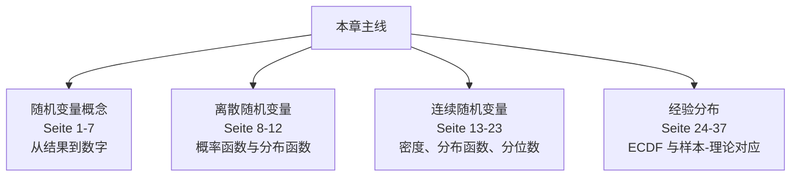
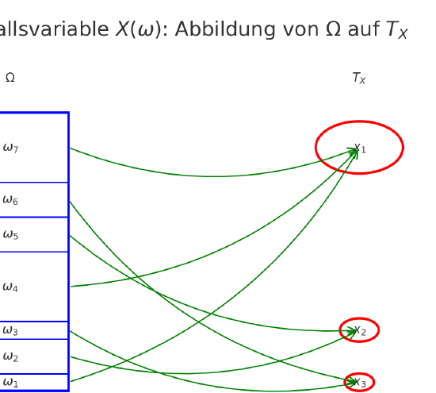
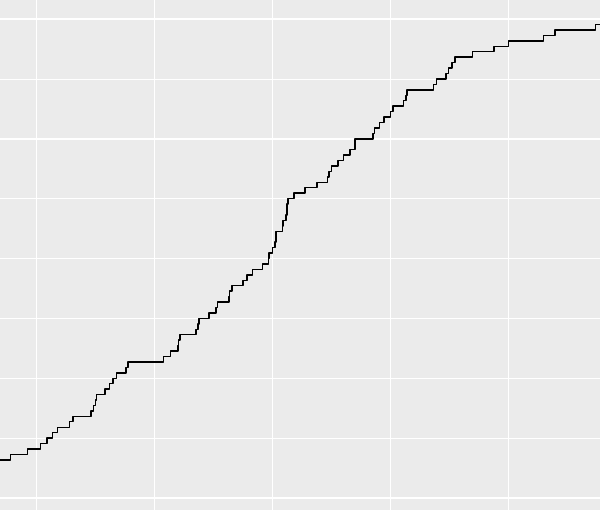
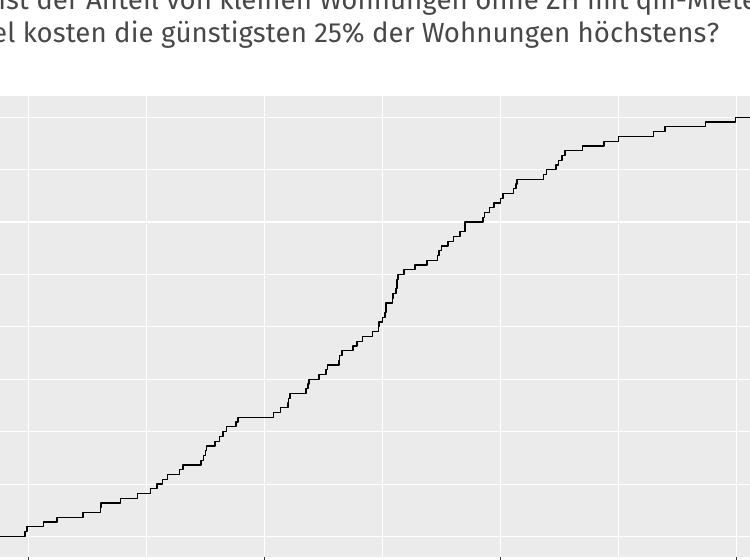
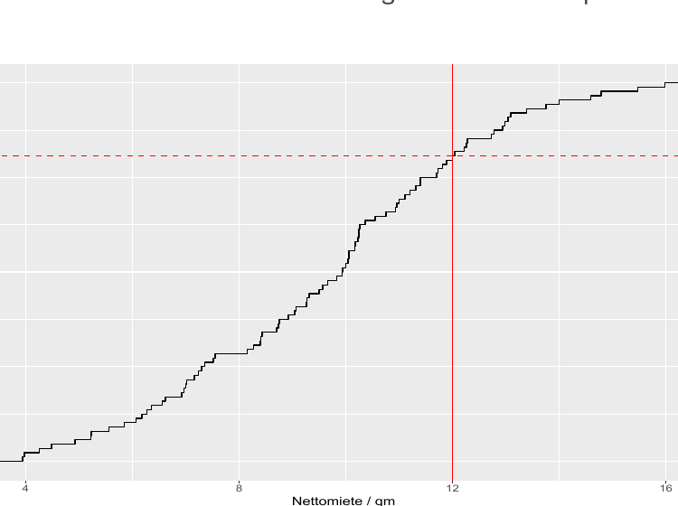
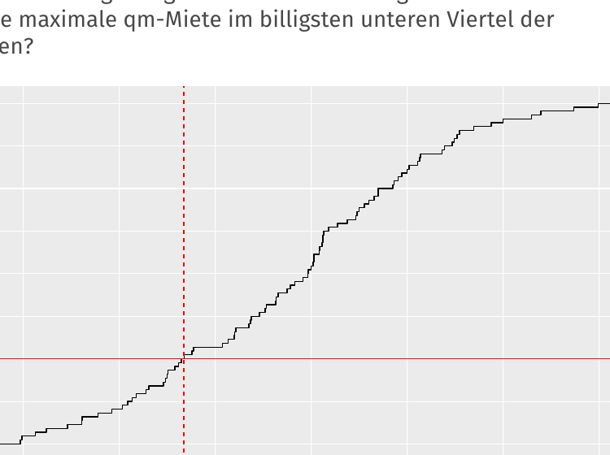

# 第 5 章：随机变量、分布与频率（Zufallsvariablen, Verteilungen & Häufigkeiten）

> 来源：`分章节讲义/05_Zufallsvariablen, Verteilungen & Häufigkeiten.pdf`  
> 原讲义页码：S. 189-225，共 37 页  
> 图片目录：`assets/`  
> 核心主线：随机变量（Zufallsvariable）把随机实验结果映射成数值；理论上用概率函数、密度函数和分布函数描述；经验上用频率分布和经验分布函数（ECDF）对应。

---

## 章节知识树

## 学习路径

随机变量把随机结果翻译成数字；分布函数、概率函数、密度函数和经验分布函数分别描述理论与样本中的取值规律。

1. **随机变量概念：** 从结果到数字（Seite 1-7）。
2. **离散随机变量：** 概率函数与分布函数（Seite 8-12）。
3. **连续随机变量：** 密度、分布函数、分位数（Seite 13-23）。
4. **经验分布：** ECDF 与样本-理论对应（Seite 24-37）。

## 模块地图

| 模块 | 页码 | 核心问题 |
| --- | --- | --- |
| 随机变量概念 | Seite 1-7 | 从结果到数字 |
| 离散随机变量 | Seite 8-12 | 概率函数与分布函数 |
| 连续随机变量 | Seite 13-23 | 密度、分布函数、分位数 |
| 经验分布 | Seite 24-37 | ECDF 与样本-理论对应 |

## 考试优先级

1. 会解释随机变量是从样本空间到实数的函数。
2. 会区分概率函数、密度函数、分布函数和经验分布函数。
3. 会说明连续变量单点概率为 0 不代表该点“不可能”。
4. 会从 ECDF 读比例和分位数。

## 模块零：为什么要引入随机变量（Seite 1-7）

随机试验的原始结果可能是正反面、颜色、路径或类别。随机变量做的事很简单：把这些结果按规则变成数字，这样概率才能和函数、期望、方差连接起来。

### Seite 1 - 目录

本章内容：

- 离散随机变量（diskrete Zufallsvariablen）
- 连续随机变量（stetige Zufallsvariablen）
- 经验频率分布（empirische Häufigkeitsverteilungen）
- 经验分布函数（empirische Verteilungsfunktion）

### Seite 2 - 标题页

本页为章节标题页。

### Seite 3 - 随机变量的动机

随机过程的结果不一定是数字。为了计算，常把结果映射为数字。

例：投硬币 3 次：

$$
\Omega=\{Z,K\}\times\{Z,K\}\times\{Z,K\},\quad |\Omega|=8.
$$

若关心“出现 Kopf 的次数”，可定义随机变量 $Y$。其取值为：

$$
Y\in T=\{0,1,2,3\}.
$$

当随机变量取到值 $y$，写作：

$$
Y=y.
$$

### Seite 4 - 随机变量定义

随机变量 $X$ 的支撑集（Träger）是其所有可能取值集合 $T_X$。

随机变量（Zufallsvariable）是从样本空间到实数集合的明确映射：

$$
X:\Omega\to T_X\subseteq\mathbb{R}.
$$

每个基本事件 $\omega\in\Omega$ 被分配一个数值 $x=X(\omega)$。多个基本事件可以映射到同一个数值。

> [!important] 考点  
> 区分随机变量 $X$ 和它的取值/实现 $x=X(\omega)$。

### Seite 5 - 随机变量图示

图中展示：样本空间中的多个基本事件可被随机变量映射到少数几个数值。

### Seite 6 - 为什么随机变量重要

有了随机变量，就可以计算：

$$
P(X\le a),\quad P(X>b),\quad E(X).
$$

原始概率空间 $(\Omega,P)$ 往往不再直接需要；只需要随机变量取值上的概率分布。

例：比起处理所有硬币序列 $\{KKK,KKZ,\ldots,ZZZ\}$，处理 $\{0,1,2,3\}$ 上的分布更简单。

随机变量是统计应用中把经验现象数学化的核心概念。

### Seite 7 - 目录切换：diskrete Zufallsvariablen

进入离散随机变量。

---

## 模块一：离散随机变量靠概率函数说话（Seite 8-12）

如果可能取值能一个个列出来，就给每个取值分配概率。概率函数回答“刚好等于这个值”的概率，分布函数回答“小于等于这个值”的累计概率。

### Seite 8 - 离散随机变量与概率函数

离散随机变量（diskrete Zufallsvariable）：只取有限或可数无限多个值。

支撑集：

$$
T_X=\{x_1,x_2,\ldots\}.
$$

概率函数（Wahrscheinlichkeitsfunktion）：

$$
f_X(x_i):=P(X=x_i)=P(\{\omega\in\Omega:X(\omega)=x_i\}).
$$

若 $x\notin T_X$，则 $f_X(x)=0$。

### Seite 9 - 概率函数诱导分布

对任意 $B\subset\mathbb{R}$：

$$
P(X\in B)=P(\{\omega\in\Omega:X(\omega)\in B\}).
$$

随机变量 $X$ 与原概率分布 $P$ 共同诱导出实数轴上的概率分布。这就是 $X$ 的分布（Verteilung der Zufallsvariable）。

### Seite 10 - 离散分布函数

离散随机变量的分布函数（Verteilungsfunktion）：

$$
F_X(x):=P(X\le x)=\sum_{i:x_i\le x} f_X(x_i).
$$

知道概率函数 $f_X$ 就能得到分布函数 $F_X$；反过来也可以从跳跃高度恢复概率。

### Seite 11 - 分布函数性质

离散分布函数：

- 单调递增（monoton wachsend）；
- 是阶梯函数（Treppenfunktion）；
- 在 $x_i\in T_X$ 且 $f_X(x_i)>0$ 的位置跳跃；
- 跳跃高度为 $f_X(x_i)$；
- $\lim_{x\to-\infty}F_X(x)=0$；
- $\lim_{x\to\infty}F_X(x)=1$。

### Seite 12 - 三次投硬币示例

令 $X$ 为三次投硬币中 Kopf 的个数：

$$
T_X=\{0,1,2,3\}.
$$

概率函数：

$$
f(0)=1/8,\quad f(1)=3/8,\quad f(2)=3/8,\quad f(3)=1/8.
$$

分布函数：

$$
F(x)=
\begin{cases}
0,&x<0,\\
1/8,&0\le x<1,\\
4/8,&1\le x<2,\\
7/8,&2\le x<3,\\
1,&x\ge 3.
\end{cases}
$$

## 模块二：连续随机变量不能问点概率（Seite 13-23）

连续变量的单点概率通常是 0，所以不能像离散情形那样读 $P(X=x)$。真正有意义的是区间概率，而区间概率来自密度函数下面的面积。

### Seite 13 - 目录切换：stetige Zufallsvariablen

进入连续随机变量。

---

### Seite 14 - 连续随机变量定义 1

直观定义：若随机变量的支撑集是实数的不可数子集，则称其为连续随机变量（stetige Zufallsvariable）。

例：幸运轮停止时的精确角度 $[0^\circ,360^\circ)$。

### Seite 15 - 连续随机变量定义 2

若存在非负函数 $f_X$，使得：

$$
F_X(x)=P(X\le x)=\int_{-\infty}^{x}f_X(u)\,du,
$$

则 $X$ 是连续随机变量。$f_X$ 称为密度函数（Dichtefunktion / Wahrscheinlichkeitsdichte）。

注意：离散情形中 $F$ 来自概率函数求和；连续情形中 $F$ 来自密度积分。

### Seite 16 - 密度函数

密度函数满足：

$$
f(x)\ge0,\qquad \int_{-\infty}^{\infty}f(x)\,dx=1.
$$

重要：$f(x)$ 本身不是概率，而是数值附近的概率密度。区间概率通过面积计算：

$$
P(a\le X\le b)=\int_a^b f(x)\,dx.
$$

### Seite 17 - 连续分布函数的推论

连续随机变量的分布函数：

- 连续；
- 单调递增；
- $\lim_{x\to-\infty}F(x)=0$；
- $\lim_{x\to\infty}F(x)=1$。

区间概率：

$$
P(X\in[a,b])=\int_a^b f(x)\,dx=F(b)-F(a).
$$

反直觉但重要：

$$
P(X=x)=0,\quad \forall x\in\mathbb{R}.
$$

单点概率为 0，不代表不可能，而是连续分布中概率只分配给区间。

### Seite 18 - 连续分布函数补充性质

若 $f$ 在 $x$ 处连续，则：

$$
F'(x)=f(x).
$$

并且：

$$
P(X>a)=1-F(a).
$$

### Seite 19 - 展望：更一般的定义

更严格的概率论会用测度论（Maßtheorie）统一处理：

- 离散随机变量；
- 连续随机变量；
- 混合型随机变量。

连续情形可用 Lebesgue 积分表示，离散情形可视作计数测度积分，混合情形则需要混合测度。

### Seite 20 - 目录切换：empirische Häufigkeitsverteilungen

进入经验频率分布。

---

### Seite 21 - 经验频率分布标题页

本页为小节标题页。

### Seite 22 - 回到经验数据

随机变量是随机过程的数学形式化。现在看这些理论概念的经验对应物。

### Seite 23 - 记号与术语

后续：

- 用 $X,Y,\ldots$ 表示变量（Merkmale）。
- $n$ 为研究单位数量。
- $x_i$ 是第 $i$ 个研究单位在变量 $X$ 上的观测值。
- $x_1,\ldots,x_n$ 是原始数据列表（Urliste / Rohdaten）。
- $a_1,\ldots,a_k$ 是原始数据中不同的观测取值，$k\le n$。

## 模块三：经验分布函数把样本变成分布的影子（Seite 24-37）

理论分布来自模型，经验分布来自数据。ECDF 的阶梯形状告诉你样本中有多少比例不超过某个值，它是后面收敛、估计和检验的基础。

### Seite 24 - 一维频率分布

步骤：

1. 按某个变量排序。
2. 统计每个取值的频数。
3. 相对频率 = 某取值频数 / 研究单位数。
4. 对序数或度量变量，可以计算累计相对频率。

经验分布函数可理解为：

$$
F_n(x)=\text{ Anteil der UE mit Merkmalsausprägung }\le x.
$$

### Seite 25 - 频率分布备注

对名义尺度变量，取值顺序 $<$ 没有内容意义。

类别变量中，不同类别数量 $k$ 通常较小。

连续变量中，$k$ 经常接近 $n$，因为很多观测值各不相同。

### Seite 26 - 绝对与相对频率

绝对频数：

$$
h(a_j)=h_j=\#\{x_i:x_i=a_j\}.
$$

相对频数：

$$
f(a_j)=f_j=\frac{h_j}{n}.
$$

绝对频率分布：

$$
h_1,\ldots,h_k.
$$

相对频率分布：

$$
f_1,\ldots,f_k.
$$

### Seite 27 - 频率数据与分组数据

若已经有取值 $a_1,\ldots,a_k$ 和频数 $h_1,\ldots,h_k$ 或 $f_1,\ldots,f_k$，称为频率数据（Häufigkeitsdaten）。

对于度量、连续或准连续变量，常常通过分组（Klassenbildung）把原始列表聚合成分组数据（gruppierte Daten）。

### Seite 28 - Nettomieten 示例 I

讲义从 München Mietspiegel 2015 中筛选小且无中央热水供应的住房，得到 88 个 Nettomiete 原始值，并排序展示。

这里所有值不同，因此：

$$
k=n=88,\qquad f_j=\frac{1}{88}.
$$

### Seite 29 - Nettomieten 示例 II：分组

若以 100 欧元为组宽分组，得到：

| Klasse | absolute H.keit | relative H.keit | kumulative rel. H.keit |
|---|---:|---:|---:|
| (150,250] | 6 | 0.07 | 0.07 |
| (250,350] | 21 | 0.24 | 0.31 |
| (350,450] | 18 | 0.20 | 0.51 |
| (450,550] | 22 | 0.25 | 0.76 |
| (550,650] | 14 | 0.16 | 0.92 |
| (650,750] | 6 | 0.07 | 0.99 |
| (750,850] | 1 | 0.01 | 1.00 |

### Seite 30 - 目录切换：empirische Verteilungsfunktion

进入经验分布函数（ECDF）。

---

### Seite 31 - 经验分布函数定义

经验累计频数：

$$
H(x)=\#\{x_i:x_i\le x\}.
$$

经验分布函数：

$$
F_n(x)=\frac{H(x)}{n}
=\frac{1}{n}\#\{x_i:x_i\le x\}.
$$

若不同取值排序为 $a_1<\cdots<a_k$，则对 $a_j\le x<a_{j+1}$：

$$
F_n(x)=f(a_1)+\cdots+f(a_j)=\sum_{i:a_i\le x}f_i.
$$

### Seite 32 - ECDF 性质

ECDF 是单调递增阶梯函数：

- 在观测取值 $a_1,\ldots,a_k$ 处跳跃；
- 跳跃高度为 $f_1,\ldots,f_k$；
- 右连续（rechtsseitig stetig）；
- $F_n(x)=0$ 对 $x<a_1$；
- $F_n(x)=1$ 对 $x\ge a_k$。

### Seite 33 - ECDF 示例：每平方米租金

小且冷住房的 Nettoquadratmetermiete 的经验分布函数。

### Seite 34 - ECDF 读图问题

问题：

- 每平方米租金 $\le 12$ 欧元的小且冷住房比例是多少？
- 最便宜的 25% 住房每平方米租金最高是多少？

### Seite 35 - ECDF 读图：比例

从图上读出：

$$
F_n(12)\approx 0.80.
$$

所以约 80% 的小且冷住房每平方米租金不超过 12 欧元。

### Seite 36 - ECDF 读图：下四分位数

最便宜的 25% 的最大 qm-Miete 约为：

$$
7.3\text{ Euro}.
$$

这对应经验 25% 分位数。

### Seite 37 - 理论与经验对应

| Theorie | Empirie |
|---|---|
| Zufallsvariable $X$ | Merkmal $X$ |
| Träger $T_X$ | beobachtete Merkmalsausprägungen $\{a_1,\ldots,a_k\}$ |
| Wahrscheinlichkeitsfunktion $f_X(x)$ | relative Häufigkeiten $f_j$ |
| Verteilungsfunktion $F_X(x)$ | kumulative relative Häufigkeiten / ECDF $F_n(x)$ |

---

## 本章逻辑梳理

- **随机变量概念（Seite 1-7）：** 从结果到数字。
- **离散随机变量（Seite 8-12）：** 概率函数与分布函数。
- **连续随机变量（Seite 13-23）：** 密度、分布函数、分位数。
- **经验分布（Seite 24-37）：** ECDF 与样本-理论对应。

真正复习时，不要按页码零散背。先问本章在解决什么问题，再把每页放回上面的模块里：前面的页通常提出问题，中间的页给出工具，后面的页提醒适用边界或展示例子。

## 关键考核点

1. 会解释随机变量是从样本空间到实数的函数。
2. 会区分概率函数、密度函数、分布函数和经验分布函数。
3. 会说明连续变量单点概率为 0 不代表该点“不可能”。
4. 会从 ECDF 读比例和分位数。

## 本章公式清单

### 随机变量与分布

| 序号 | 公式 | 使用场景 | 注意事项 |
| ---: | --- | --- | --- |
| 1 | $X:\Omega\to\mathbb{R}$ | 随机变量定义。 | 它是函数，不是单个随机数字。 |
| 2 | $F_X(x)=P(X\le x)$ | 分布函数定义。 | 适用于离散和连续随机变量。 |
| 3 | $P(a<X\le b)=F_X(b)-F_X(a)$ | 由分布函数计算区间概率。 | 边界是否包含在连续情形通常无影响。 |

### 离散情形

| 序号 | 公式 | 使用场景 | 注意事项 |
| ---: | --- | --- | --- |
| 4 | $p_X(x)=P(X=x)$ | 概率函数。 | 所有取值概率非负且总和为 1。 |
| 5 | $F_X(x)=\sum_{t\le x}p_X(t)$ | 离散分布函数。 | 阶梯函数，跳跃大小就是点概率。 |

### 连续情形与经验分布

| 序号 | 公式 | 使用场景 | 注意事项 |
| ---: | --- | --- | --- |
| 6 | $F_X(x)=\int_{-\infty}^{x} f_X(t)\,dt$ | 由密度得到分布函数。 | 密度可以大于 1，但面积概率不能超过 1。 |
| 7 | $P(a\le X\le b)=\int_a^b f_X(t)\,dt$ | 连续变量区间概率。 | 概率是面积，不是高度。 |
| 8 | $\hat F_n(x)=\frac1n\sum_{i=1}^n I(x_i\le x)$ | 经验分布函数。 | 样本比例形式，是理论 $F$ 的数据对应物。 |
| 9 | $x_p=F^{-1}(p)$ | 理论分位数。 | 用于把概率位置转成取值位置。 |

## 章节自测

- [x] 随机变量本质上是定义在样本空间上的函数。
- [ ] 连续随机变量的密度值就是概率。
- [x] 分布函数 $F(x)$ 表示 $P(X\le x)$。
- [x] 经验分布函数来自样本数据。

## 德语词汇表

| 德语 | 中文 | 使用场景 |
| --- | --- | --- |
| Zufallsvariable | 随机变量 | 结果到数字的函数 |
| Verteilungsfunktion | 分布函数 | 累计概率 |
| Wahrscheinlichkeitsfunktion | 概率函数 | 离散点概率 |
| Dichtefunktion | 密度函数 | 连续概率面积 |
| Träger | 支撑集 | 可能取值范围 |
| Quantil | 分位数 | 概率位置对应取值 |
| empirische Verteilungsfunktion | 经验分布函数 | 样本累计比例 |

## C1 德语句式

| 序号 | 德语句式 | 中文翻译 | 适用场景 |
| ---: | --- | --- | --- |
| 1 | Eine Zufallsvariable ordnet jedem Ergebnis eines Zufallsexperiments eine reelle Zahl zu. | 随机变量把随机试验的每个结果对应到一个实数。 | 定义随机变量。 |
| 2 | Bei stetigen Zufallsvariablen werden Wahrscheinlichkeiten über Intervalle und nicht über einzelne Punkte berechnet. | 连续随机变量的概率通过区间而不是单个点来计算。 | 解释密度。 |
| 3 | Die empirische Verteilungsfunktion ist das stichprobenbasierte Gegenstück zur theoretischen Verteilungsfunktion. | 经验分布函数是理论分布函数在样本层面的对应物。 | 连接经验与理论。 |
