# 第06章：统计图形（Statistische Grafiken）

> 本章核心：统计图形（statistische Grafiken）不是装饰，而是把数据特征（Merkmalsausprägungen）映射到几何对象（geometrische Objekte）的可见属性（ästhetische Eigenschaften）。考试常问：某图是否误导、哪种图适合哪种变量、色标如何选、直方图/核密度/散点图如何解释。

## 章节知识树

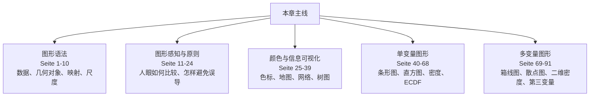
```mermaid
flowchart TD
  A["本章主线"]
  A --> M1["图形语法<br/>Seite 1-10<br/>数据、几何对象、映射、尺度"]
  A --> M2["图形感知与原则<br/>Seite 11-24<br/>人眼如何比较、怎样避免误导"]
  A --> M3["颜色与信息可视化<br/>Seite 25-39<br/>色标、地图、网络、树图"]
  A --> M4["单变量图形<br/>Seite 40-68<br/>条形图、直方图、密度、ECDF"]
  A --> M5["多变量图形<br/>Seite 69-91<br/>箱线图、散点图、二维密度、第三变量"]
```

## 学习路径

统计图形是把变量映射到位置、颜色、面积、形状等视觉通道，用来发现结构、比较分布并避免被图形误导。

1. **图形语法：** 数据、几何对象、映射、尺度（Seite 1-10）。
2. **图形感知与原则：** 人眼如何比较、怎样避免误导（Seite 11-24）。
3. **颜色与信息可视化：** 色标、地图、网络、树图（Seite 25-39）。
4. **单变量图形：** 条形图、直方图、密度、ECDF（Seite 40-68）。
5. **多变量图形：** 箱线图、散点图、二维密度、第三变量（Seite 69-91）。

## 模块地图

| 模块 | 页码 | 核心问题 |
| --- | --- | --- |
| 图形语法 | Seite 1-10 | 数据、几何对象、映射、尺度 |
| 图形感知与原则 | Seite 11-24 | 人眼如何比较、怎样避免误导 |
| 颜色与信息可视化 | Seite 25-39 | 色标、地图、网络、树图 |
| 单变量图形 | Seite 40-68 | 条形图、直方图、密度、ECDF |
| 多变量图形 | Seite 69-91 | 箱线图、散点图、二维密度、第三变量 |

## 考试优先级

1. 会把统计图拆成数据、几何对象、审美映射、尺度和坐标。
2. 会判断图形是否误导，例如截断坐标轴、面积错觉、颜色不合适。
3. 会根据变量尺度选择条形图、直方图、密度图、箱线图、散点图等。
4. 会解释 bin 宽度和核密度带宽如何改变图形。

## 模块零：图不是装饰，是编码（Seite 1-10）

一张统计图的本质是映射：把数据变量放到位置、长度、颜色、大小等视觉属性上。先学图形语法，是为了以后看到任何图都能拆开问：数据是什么？映射是什么？尺度和坐标有没有误导？

### Seite 1 - 本章路线图

本章覆盖：

- 图形语法（Grammar of Graphics）
- 图形感知（Wahrnehmung）
- 信息可视化与统计图（Infoviz vs statistische Grafiken）
- 色标（Farbskalen）
- 离散变量与度量变量的频数/分布可视化
- 核密度估计（Kerndichteschätzung）
- 多变量共同分布的可视化

### Seite 2 - 章节结构

本页重复目录。学习顺序很重要：先理解图由哪些部件构成，再判断人眼如何读图，最后选择适合变量类型的图形。

**总原则：** 图形选择应服务于比较（Vergleich）、结构识别（Strukturerkennung）和不确定性表达（Unsicherheitskommunikation）。

### Seite 3 - 什么是统计图形

统计图形通过几何对象的可见属性来表示数据集中某些变量的取值。

形式化表述：

```text
Daten -> geometrische Objekte -> ästhetische Eigenschaften
```

这引出图形语法（Grammar of Graphics）：几乎所有图都能拆成数据、几何对象、审美映射、尺度、坐标系、分面和主题。

### Seite 4 - Grammar of Graphics：基本元素

基本元素：

- 数据（Daten）：观测值或派生统计量。
- 几何对象（geometrische Elemente）：点、线、矩形等。
- 审美映射（ästhetische Zuordnungen）：位置、颜色、大小、形状等。

**例子：** 散点图把两个度量变量映射到水平/垂直位置；颜色可表示第三变量。

### Seite 5 - 统计变换、尺度与坐标

图中常展示的不是原始数据，而是派生量（abgeleitete Größen），如均值、比例、频数。

附加元素：

- 数据变换/统计量（Datentransformationen / Statistiken）
- 尺度（Skalen）：决定轴、颜色、图例。
- 坐标系（Koordinatensysteme）：笛卡尔、对数、极坐标、地图投影。

**考点：** 图形中的“柱子高度”可能是频数、比例或均值，必须看清统计变换。

### Seite 6 - 分面与主题

分面（Facettierung）按变量把数据分成子组，并排列成小倍图（small multiples）。主题（Theme）控制字体、网格线、背景、图例布局等设计细节。

工具：

- R：`ggplot2`
- Python：`plotnine`

### Seite 7 - 几何对象示例

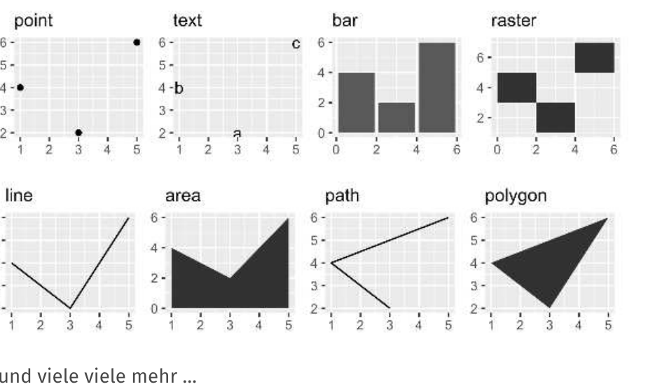

点（point）、线（line）、柱（bar）、矩形（rect）、面积（area）、路径（path）、多边形（polygon）等都是几何对象。

**选择原则：** 点适合个体观测，线适合时间趋势，矩形适合频数或比例，面积/多边形适合空间或分布形状。

### Seite 8 - 审美属性示例

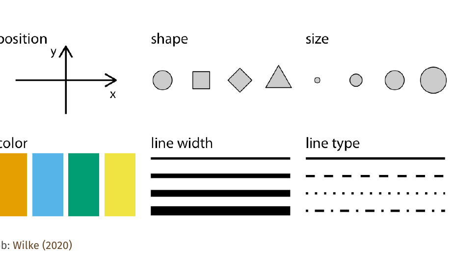

审美属性（Ästhetiken）包括位置（position）、颜色（color）、形状（shape）、大小（size）、线宽（line width）、线型（line type）等。

**关键：** 最重要的信息应使用最容易感知的属性编码，通常是位置而不是颜色或面积。

### Seite 9 - 图形语法代码示例

本页展示图形语法如何转化为代码。无论是 `ggplot2` 还是类似系统，思路都是：

```text
data + aes(mapping) + geom + scale + facet + theme
```

**考试不要求背代码，但要理解图由层（Layer）组合而成。**

### Seite 10 - 转入图形感知

本页切换到图形感知（Wahrnehmung von Grafiken）。图不仅要“能画出来”，还要让读者正确、快速地理解。

## 模块一：人眼读图有强项也有弱点（Seite 11-24）

不同视觉通道的精确度不同。位置和长度通常好比较，面积、角度和颜色就更容易误读。所以图形设计不是审美偏好，而是认知效率问题。

### Seite 11 - 不同图形类型的感知差异

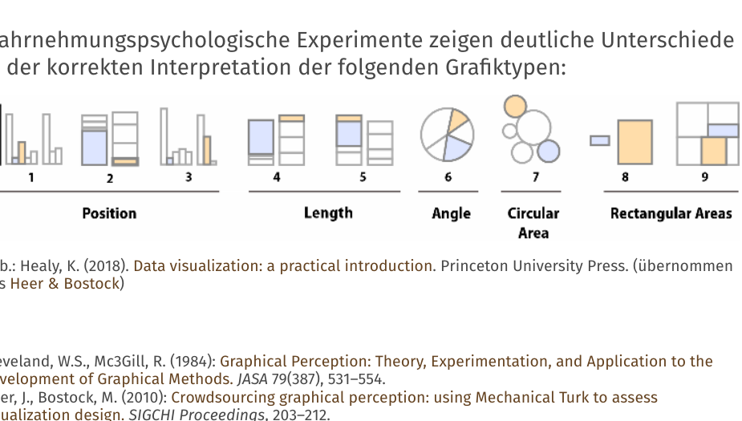

心理实验显示：人们对不同视觉编码的判断准确性差异很大。位置判断通常比面积、体积、颜色判断更准确。

**考点：** 图形设计要考虑人类感知系统，而不是只追求视觉新奇。

### Seite 12 - 图形感知实验

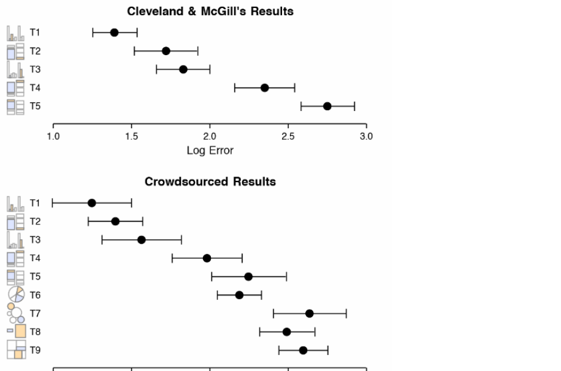

实验比较不同编码方式的误差。共同尺度上的位置（Position auf gemeinsamer Skala）最容易读，颜色和体积最难精确比较。

### Seite 13 - 感知层级

正确解释的层级大致为：

1. 位置（Position）
2. 距离与长度（Abstände & Längen）
3. 斜率与角度（Steigung & Winkel）
4. 面积（Flächen）
5. 体积（Volumen）
6. 色调、饱和度、亮度（Farbton, Farbsättigung, Farbhelligkeit）

**结论：** 最重要变量用位置或长度编码。

### Seite 14 - 优秀图形原则

Tufte 的图形卓越原则（Graphical Excellence）强调：清晰、精确、高效地呈现有意义数据，并诚实表达数据。

**中文化理解：** 好图不是漂亮图，而是帮助读者以最少认知负担获得最多真实信息的图。

### Seite 15 - 图形设计黄金规则

理解图形需要三步：

- 检测（Detektion）：识别元素和属性代表什么。
- 综合（Synthese）：把内容分组并建立关系。
- 评价（Evaluation）：比较大小和意义。

设计应支持这三步：合适的轴、网格、比例、排序、标注和高亮。

### Seite 16 - 转入 Infoviz 与统计图

本页进入信息可视化（Infoviz）与统计图形的区别。统计图更重视比较准确性、轴尺度和可解释性。

### Seite 17 - Infoviz 示例：啤酒杯图

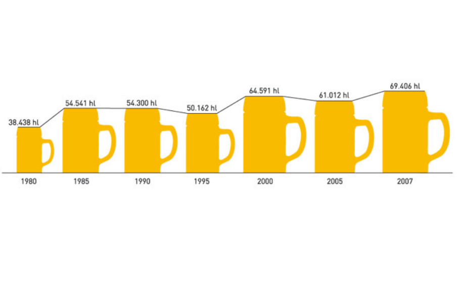

装饰性图形可能吸引注意，但容易让面积或体积暗示错误比例。统计图更关心准确比较（präziser Vergleich）。

### Seite 18 - 啤酒消费图：从零开始的轴

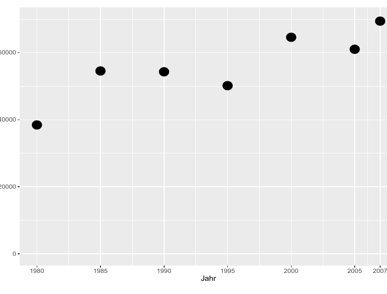

从零开始的轴能展示绝对量级，但有时趋势变化显得不明显。是否从零开始取决于图形类型和比较目的。

### Seite 19 - 啤酒消费图：截断轴

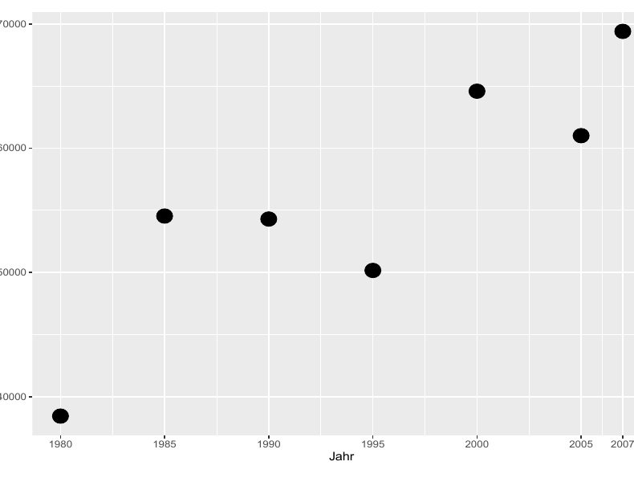

截断轴（abgeschnittene Achse）会放大变化。用于柱状图时尤其危险，因为柱长通常被理解为从 0 起算。

**小测验：**

- [x] 柱状图通常应从 0 开始。
- [ ] 截断轴永远不能使用。
- [x] 截断轴必须清楚标注。

### Seite 20 - Infoviz 示例：气泡图

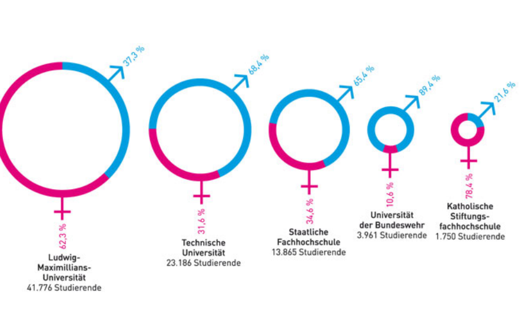

气泡大小用面积编码，精确比较困难。如果目的是比较数值大小，位置或长度通常更好。

### Seite 21 - 堆叠柱状图

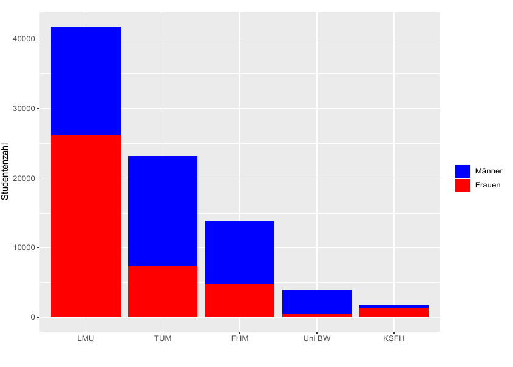

堆叠柱状图（Stapeldiagramm）适合展示总量和组成，但除底部类别外，其他类别的长度没有共同基线，比较较难。

### Seite 22 - 分组柱状图

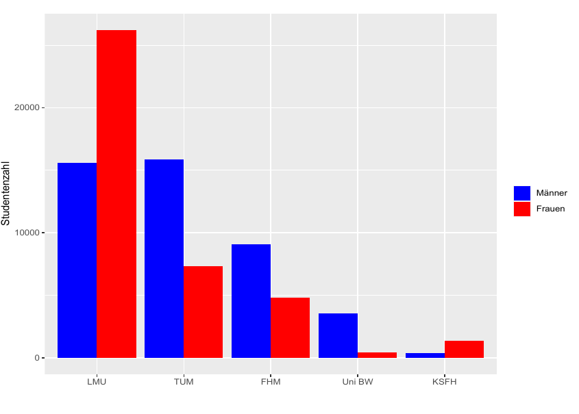

分组柱状图（gruppiertes Balkendiagramm）让男女两组在同一基线附近比较，更适合比较组间差异。

### Seite 23 - Infoviz 示例：装饰性人物/气泡

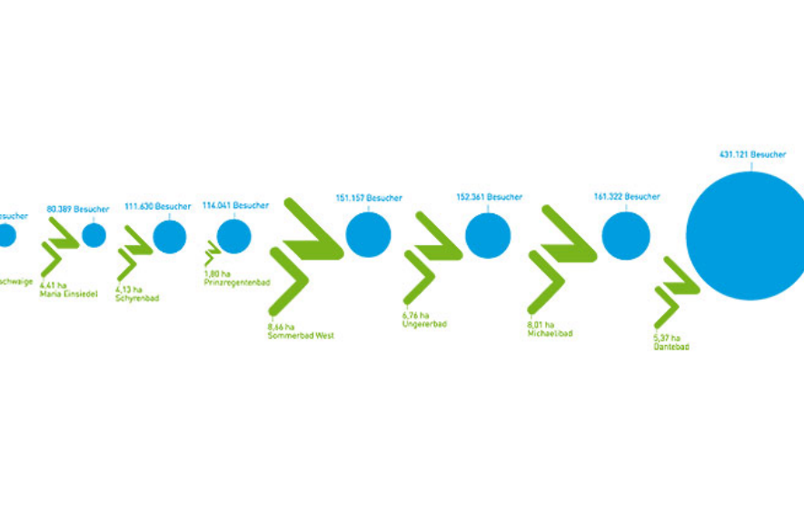

人物图标和气泡可能增加趣味，但如果面积、图标数量或排列不清楚，会降低精确性。统计图应优先保证数值可读。

### Seite 24 - 统计图替代方案

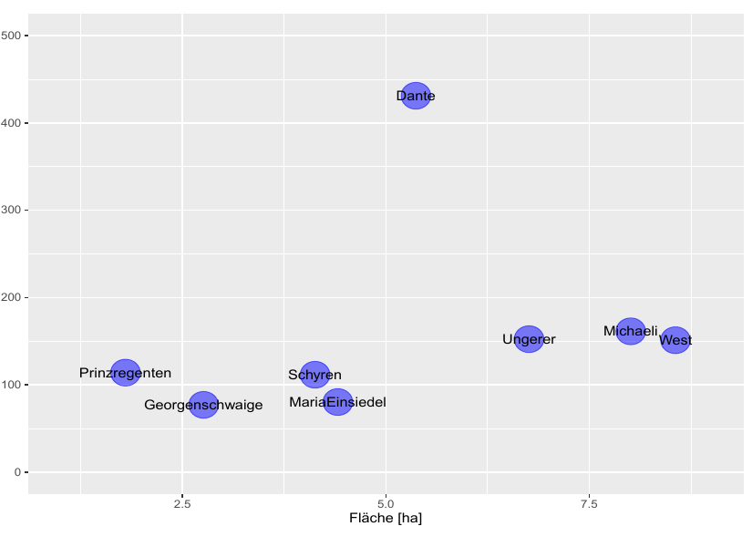

用点和位置编码同类信息，通常更易读、更精确。统计图形常用“少装饰、强比较”的方式提高信息效率。

## 模块二：颜色和信息可视化要服务变量类型（Seite 25-39）

颜色很吸引眼球，也很容易出错。连续变量、发散变量和类别变量需要不同色标；地图、网络和树图也要警惕视觉面积或布局带来的错觉。

### Seite 25 - 转入色标

本页切换到颜色（Farbe）和色标（Farbskalen）。颜色很有用，但也是误导高发区。

### Seite 26 - 审美映射的感知

不同审美属性对不同任务的适配性不同：分类可用颜色/形状；有序数值更适合位置、长度或亮度梯度。

**关键：** 颜色不能承载太多精确信息。

### Seite 27 - 色觉与色标问题

色觉差异（Farbwahrnehmung）和色盲（Farbenblindheit）会影响图形理解。因此色标应考虑可访问性（Barrierefreiheit）。

### Seite 28 - 色觉模拟

本页展示不同色觉条件下图像如何变化。红绿对比可能对部分读者不可区分。

### Seite 29 - 色觉可变性示例

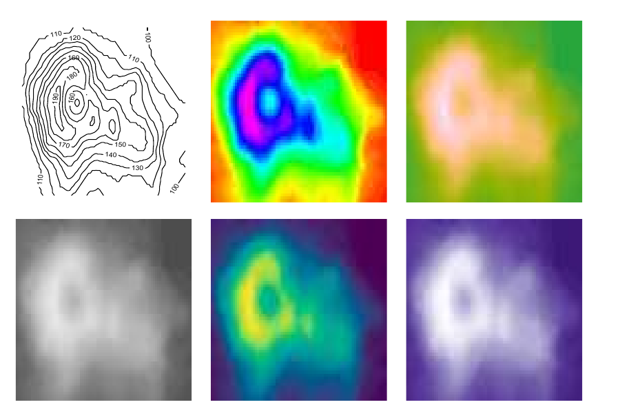

同一色标在不同视觉条件下会变得难以区分。考试中可写：色标应对色觉缺陷鲁棒（robust gegenüber Farbsehschwächen）。

### Seite 30 - 色彩空间

颜色可由色调（Hue/Farbton）、饱和度（Saturation/Farbsättigung）和亮度（Luminance/Farbhelligkeit）描述。

**图形原则：** 有序数值更适合亮度变化；无序类别更适合色调差异。

### Seite 31 - HCL 色彩空间

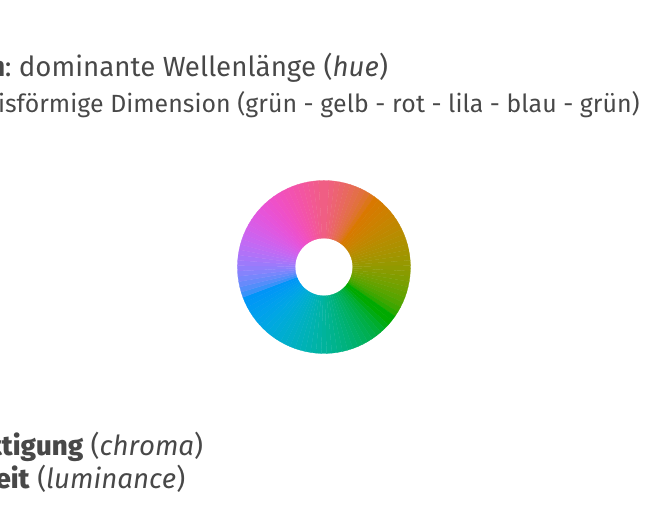

HCL 以色调、色度和亮度组织颜色，更贴近人眼感知。它常用于构造感知上更均匀的色标。

### Seite 32 - 色调示例

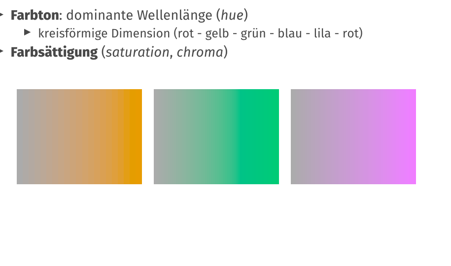

色调变化适合类别变量（nominale Skala），但不天然表达大小顺序。

### Seite 33 - 亮度与饱和度示例

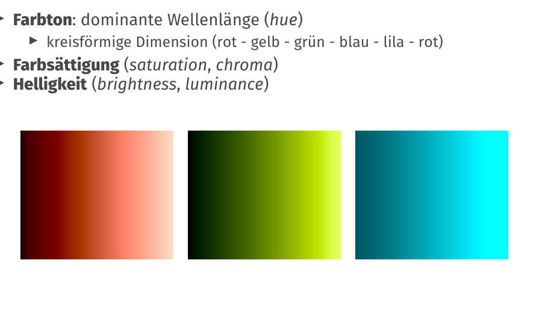

亮度/饱和度变化更适合表达有序或连续大小，但要保证单调性（Monotonie）。

### Seite 34 - HCL 色轮变体

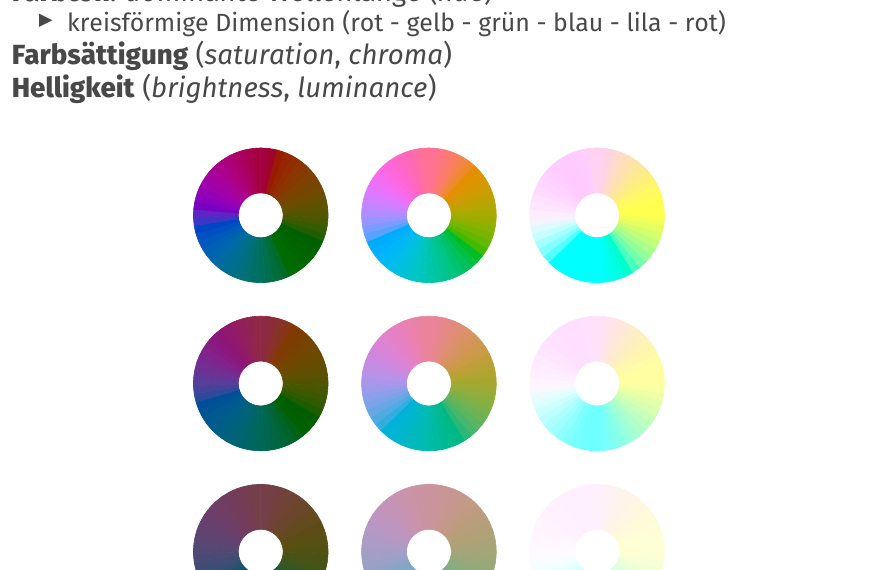

同样的色调组合，在亮度和饱和度变化后会有不同感知效果。设计色标时不能只看“颜色好看”。

### Seite 35 - 色标类型

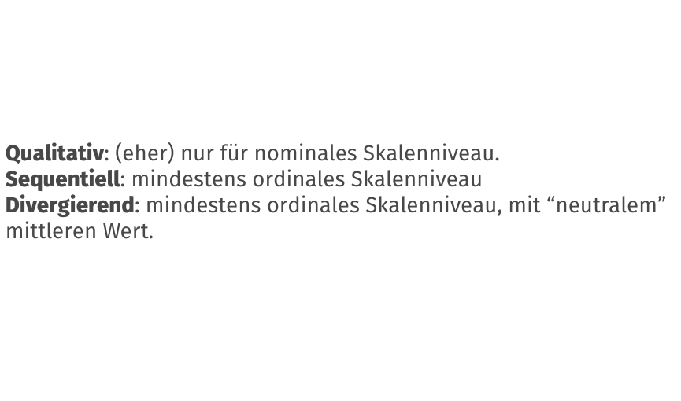

三类色标：

- 定性色标（qualitative Farbskala）：无序类别。
- 顺序色标（sequentielle Farbskala）：低到高。
- 发散色标（divergierende Farbskala）：围绕中点偏离。

### Seite 36 - 名义尺度色标

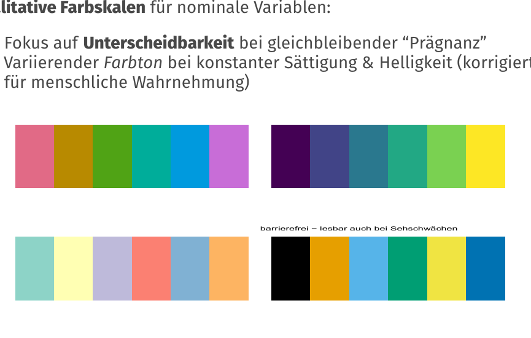

名义变量（nominale Variable）没有顺序，色标应使用明显不同但无强烈顺序暗示的颜色。

### Seite 37 - 名义色标地图例子

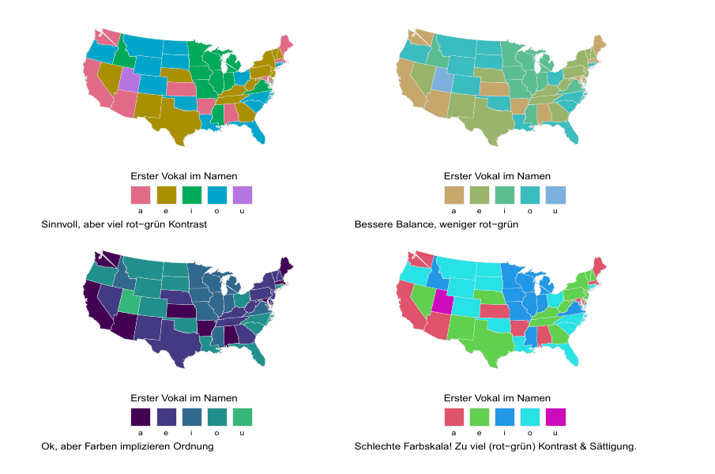

如果类别色标太相近或产生虚假顺序，地图会误导读者。应选择区分度高、色盲友好的组合。

### Seite 38 - 顺序色标

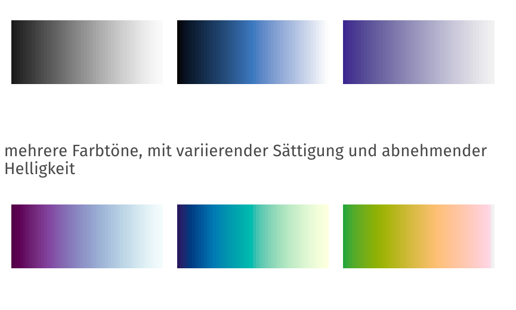

顺序色标（sequentielle Farbskalen）用于从低到高的数值。亮度应随数值单调变化。

### Seite 39 - 顺序色标地图例子

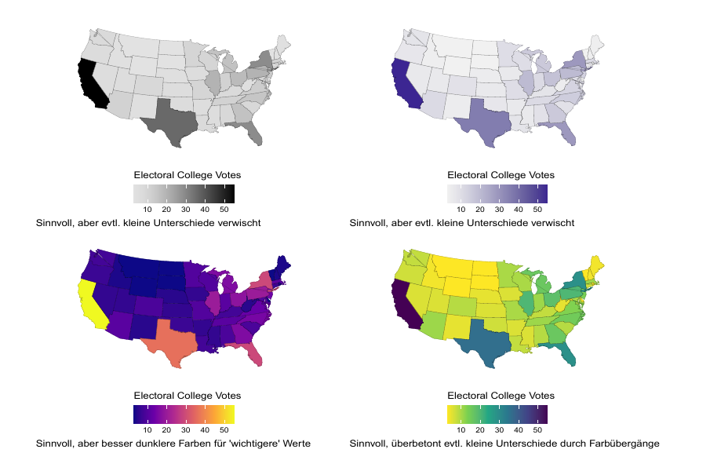

地图中若数值有自然低高顺序，顺序色标能帮助读者快速识别高低区域。

## 模块三：单变量图形回答“分布长什么样”（Seite 40-68）

条形图看类别频数，直方图和核密度看度量变量分布，ECDF 看累计比例。这里的关键不是记图名，而是知道每种图牺牲什么、突出什么。

### Seite 40 - 发散色标

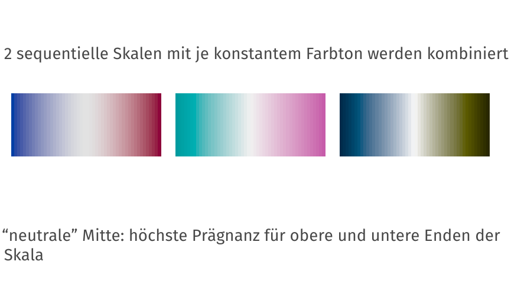

发散色标（divergierende Farbskalen）适合有自然中点的变量，例如差值、残差、相对平均值偏离。

### Seite 41 - 发散色标地图例子

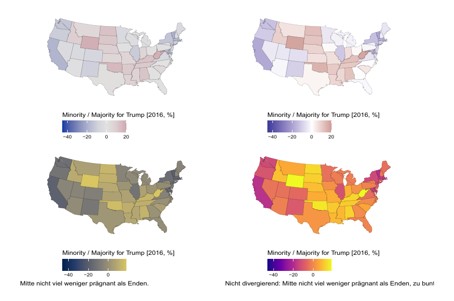

两端颜色表示正负或低高偏离，中间颜色表示中性值。关键是中点（Mittelpunkt）要有实质意义。

### Seite 42 - 发散色标反例

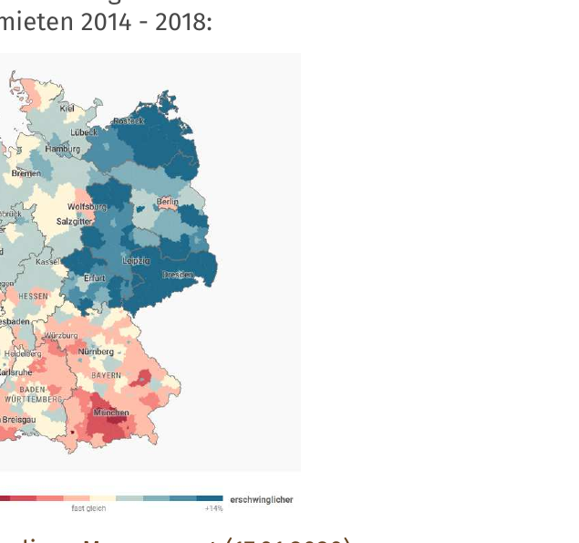

如果没有合理中点却使用发散色标，会暗示不存在的对称偏离结构。

### Seite 43 - 转入离散变量频数图

本页进入离散变量（diskrete Merkmale）的频数和分布可视化。

### Seite 44 - 离散特征频数可视化

离散变量的常用图：

- 柱状图（Stabdiagramm / Säulendiagramm）
- 条形图（Balkendiagramm）
- 堆叠图（Stapeldiagramm）
- 饼图（Kreisdiagramm / Tortendiagramm）
- 点图（Dotplot）

### Seite 45 - 柱状图、条形图

柱状图适合展示类别频数（Häufigkeiten）或比例（Anteile）。类别较多或标签较长时，水平条形图（Balkendiagramm）通常更易读。

### Seite 46 - 柱图注意事项

柱状图的柱长编码数值大小，因此坐标轴通常应从 0 开始。类别顺序应有意义：自然顺序、大小排序或理论顺序。

### Seite 47 - 堆叠与分组柱图比较

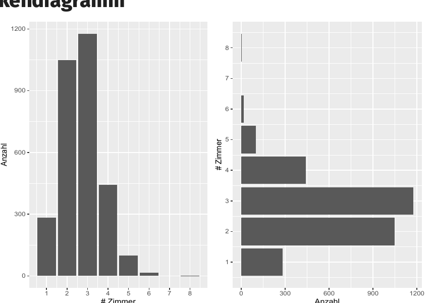

分组柱图利于比较同一类别内不同组；堆叠柱图利于看总量和组成。不要让读者同时承担太多比较任务。

### Seite 48 - 堆叠图

堆叠图适合展示组成比例，但中间部分缺少共同基线。若重点是比较某一子类别，分组柱图或点图常更合适。

### Seite 49 - 堆叠图变体

百分比堆叠图（100%-Stapeldiagramm）强调组成比例，牺牲总量信息。选择取决于主要信息目标。

### Seite 50 - Mietspiegel 堆叠图例

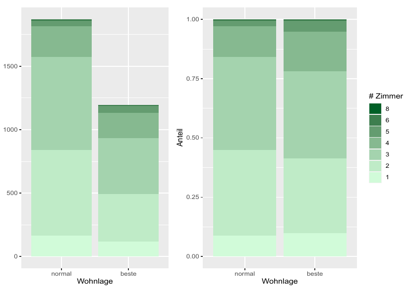

图中用颜色表示组成。读图时要注意：颜色越多，图例负担越重；若类别有顺序，应使用顺序色标。

### Seite 51 - 饼图与环图

饼图（Kreisdiagramm / Tortendiagramm）用角度和面积编码比例，人眼比较角度不如比较长度准确。类别多时尤其不推荐。

### Seite 52 - 饼图例子

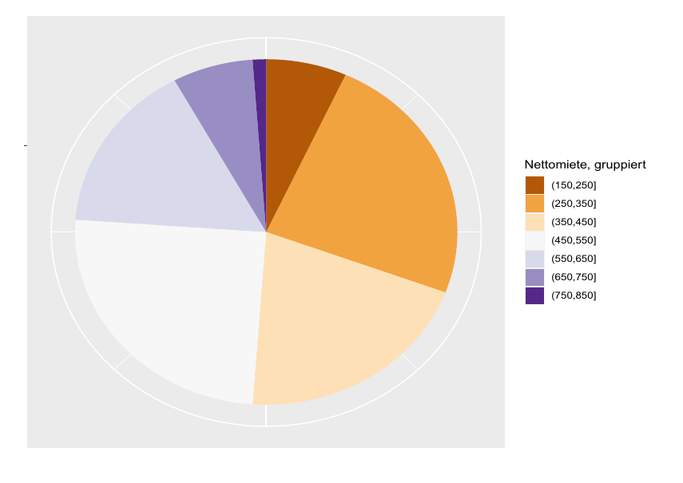

饼图可以展示粗略组成，但不适合精确比较接近的比例。

### Seite 53 - 饼图与堆叠条形图比较

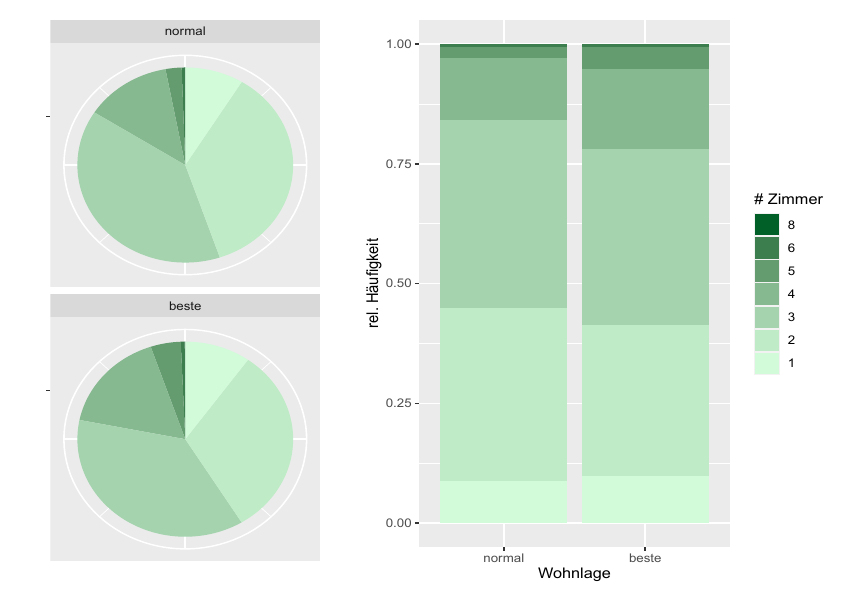

同样信息用堆叠条形图表达，往往更便于比较组间差异。考试中可指出：条形长度比扇形角度更易比较。

### Seite 54 - 转入度量变量分布

本页切换到度量变量（metrische Merkmale）的频数与分布可视化。

### Seite 55 - Dotplot

点图（Dotplot）把每个观测值显示为一个点，适合小到中等样本，能显示重复值、离群值和分布形状。

### Seite 56 - Dotplot 示例

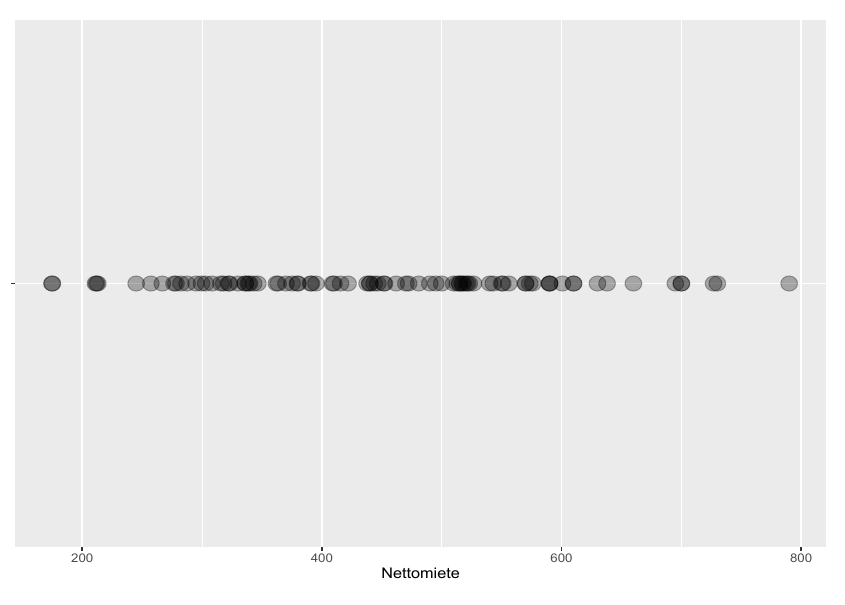

点图保留个体数据，避免过早聚合。缺点是样本太大时会拥挤。

### Seite 57 - 分组 Dotplot

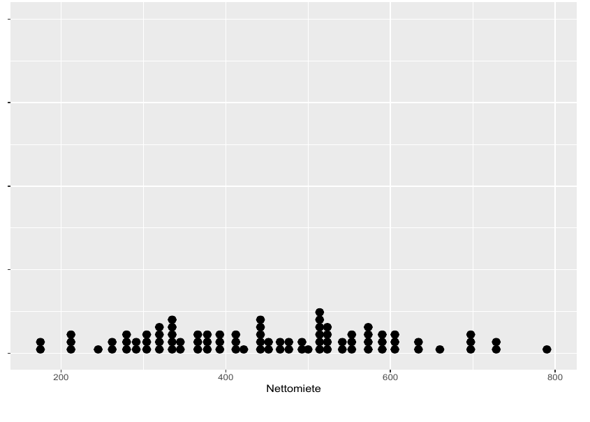

分组点图可以比较组间分布差异，如位置、散布和离群点。

### Seite 58 - 条件分布 Dotplot

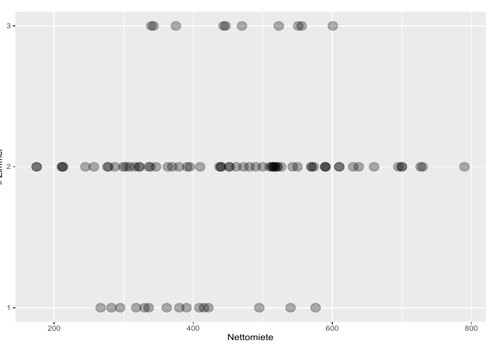

通过分面或分组显示条件分布（bedingte Verteilungen），可避免总体图掩盖组内结构。

### Seite 59 - 负面例子：不合适的散点/点图

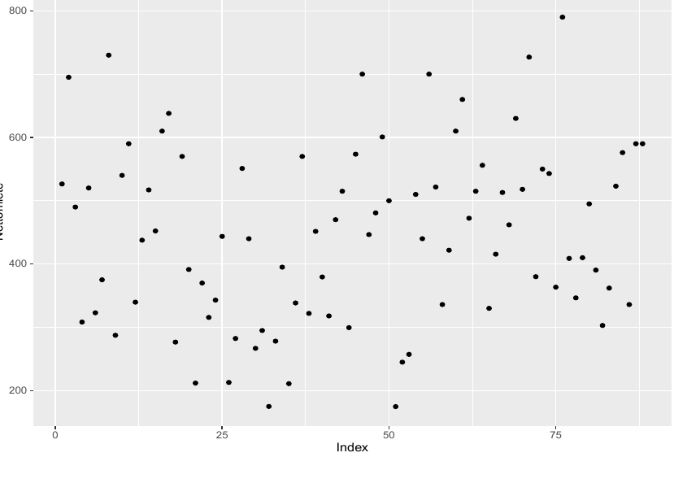

如果点过度重叠（Overplotting）或轴/尺度选择不当，图形会降低可读性。

### Seite 60 - 直方图

直方图（Histogramm）把连续变量分箱（Klassierung / Binning），展示频数或密度。它适合观察分布形状、偏态、峰和离群值。

### Seite 61 - 分箱选择影响直方图

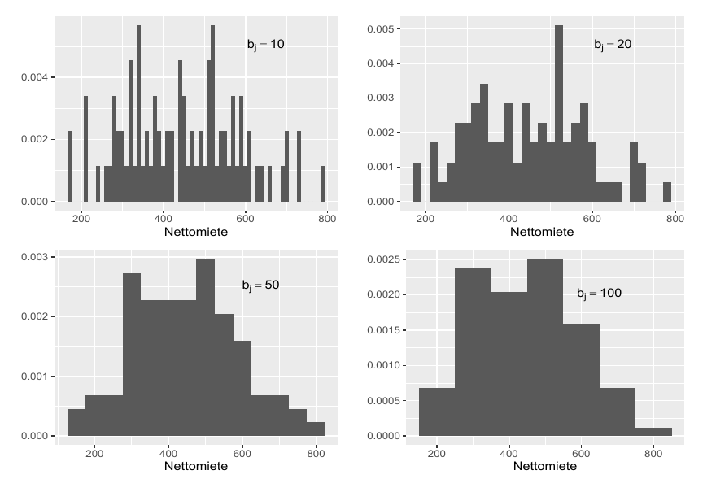

箱宽（Klassenbreite）会显著影响图形外观。箱太宽会掩盖结构；箱太窄会产生噪声。

### Seite 62 - 直方图的解释

直方图用于近似连续分布。应说明横轴变量、纵轴是频数还是密度，以及箱宽或箱数。

### Seite 63 - 直方图常见错误

常见错误：

- 箱宽任意且未说明。
- 用频数比较不同样本量组。
- 轴标签缺失。
- 将直方图当成精确密度函数。

### Seite 64 - 转入密度估计

本页切换到密度函数（Dichtefunktion）和核密度估计（Kerndichteschätzung）。

### Seite 65 - 密度函数 I

连续变量的概率通过密度函数积分计算。直方图可以看作密度的粗略估计。

### Seite 66 - 密度函数 II

密度曲线下的面积为 1。密度值可以大于 1，关键是面积代表概率。

### Seite 67 - 直方图与密度示例一

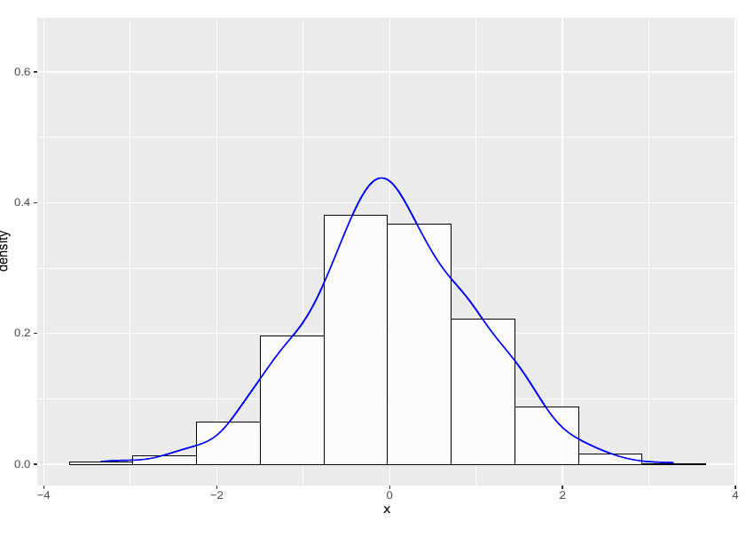

密度曲线提供平滑的分布形状，但会隐藏个体观测和分箱信息。

### Seite 68 - 直方图与密度示例二

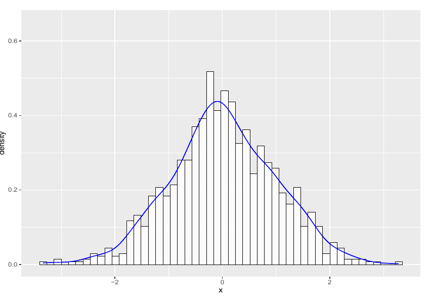

当样本量较大时，直方图与平滑密度通常能更稳定地显示总体形状。

## 模块四：多变量图形回答“变量怎么一起变”（Seite 69-91）

两个或多个变量放在一起时，图形开始承担关系诊断功能：箱线图比较组间分布，散点图看形状，二维密度看重叠，颜色或分面可以加入第三变量。

### Seite 69 - 直方图与密度示例三

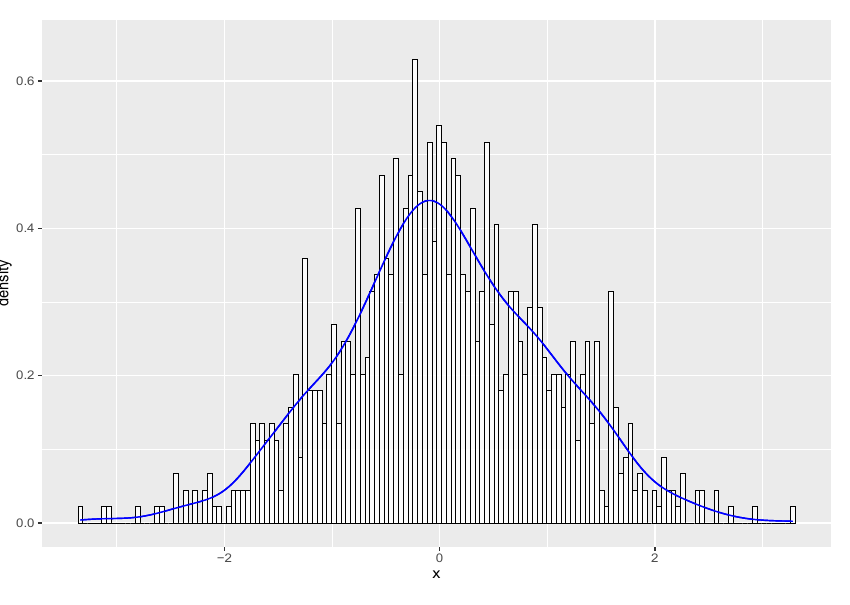

不同箱宽会影响直方图，而密度估计受带宽（Bandbreite）影响。

### Seite 70 - 密度计算与箱宽

直方图密度高度大致为：

$$
\text{Dichte}=\frac{\text{relative Häufigkeit im Bin}}{\text{Binbreite}}
$$

这样各柱面积之和为 1。

### Seite 71 - 核密度估计

核密度估计（Kerndichteschätzer）用核函数（Kernfunktion）在每个观测点附近放置平滑小曲线，再叠加得到估计密度。

### Seite 72 - 核密度估计例子

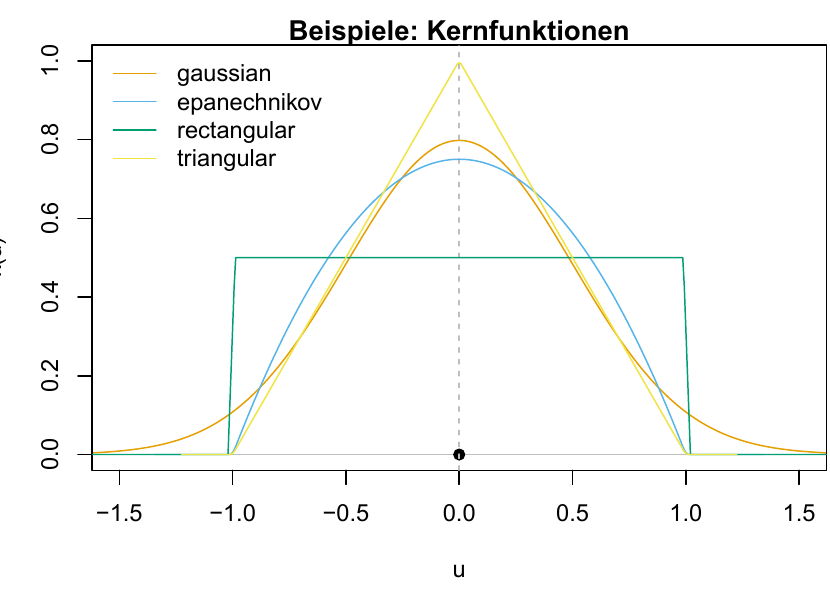

带宽（Bandbreite）控制平滑程度。带宽大，曲线平滑但可能过度平滑；带宽小，细节多但噪声大。

### Seite 73 - 核密度与直方图

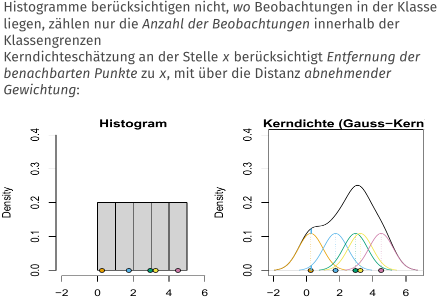

直方图受箱边界影响，核密度更平滑，但也依赖带宽和核函数选择。

### Seite 74 - 箱边界移动的影响

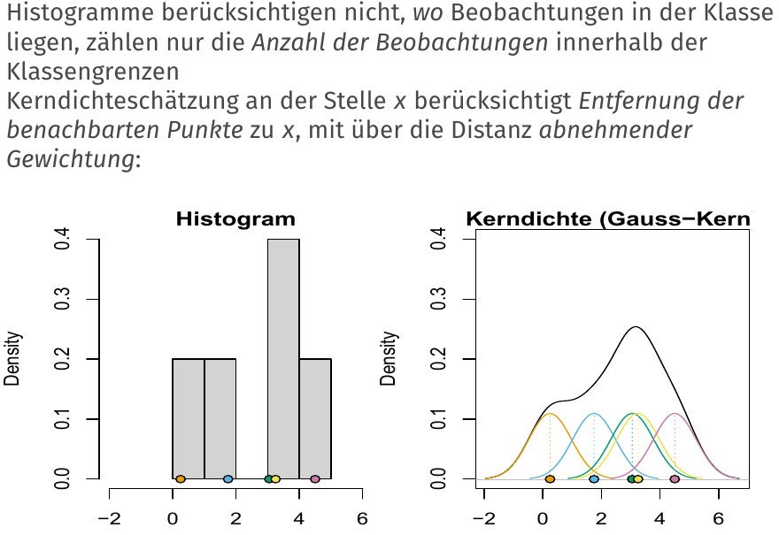

同一数据，仅移动箱边界就可能改变直方图外观。这是使用密度估计或多种箱宽检查的理由。

### Seite 75 - 带宽示例

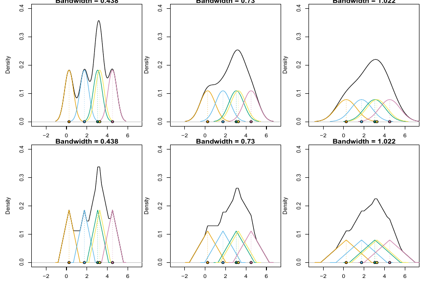

带宽太小会出现很多假峰；太大会抹平真实结构。合适带宽是偏差-方差权衡（Bias-Varianz-Abwägung）。

### Seite 76 - 核密度带宽比较

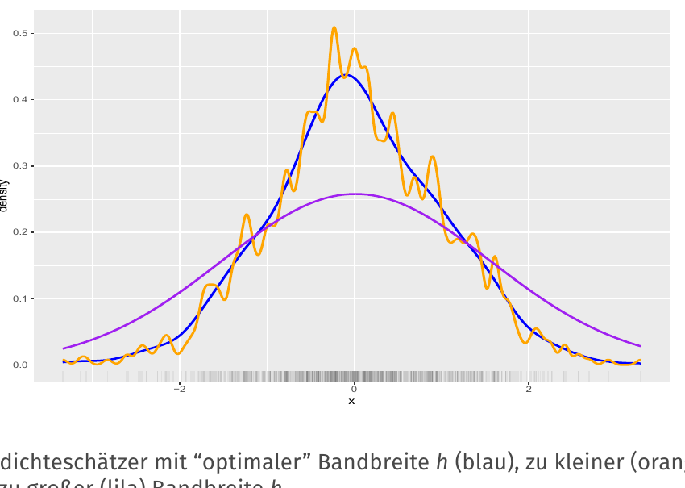

图中不同平滑程度展示了带宽选择对结论的影响。考试中要能说：密度曲线不是“真相”，而是估计。

### Seite 77 - 密度估计注意事项

密度估计的注意事项：

- 边界处可能有偏差。
- 带宽选择影响峰的数量和位置。
- 多峰结构需结合领域知识判断。

### Seite 78 - 转入共同分布

本页切换到度量变量共同分布（gemeinsame Verteilungen metrischer Merkmale）的可视化。

### Seite 79 - 二变量度量数据

两个度量变量的关系常用散点图（Streudiagramm）表示。目标是观察关联方向、强度、非线性、离群点和异方差。

### Seite 80 - 正相关散点图

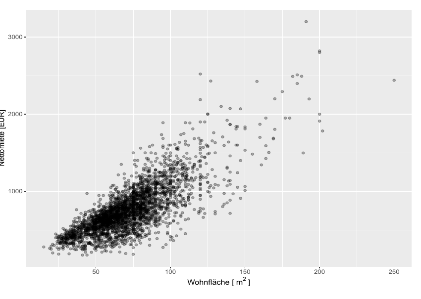

点云从左下到右上，表示正相关（positive Korrelation）。但相关不等于因果（Korrelation ist nicht Kausalität）。

### Seite 81 - 负相关散点图

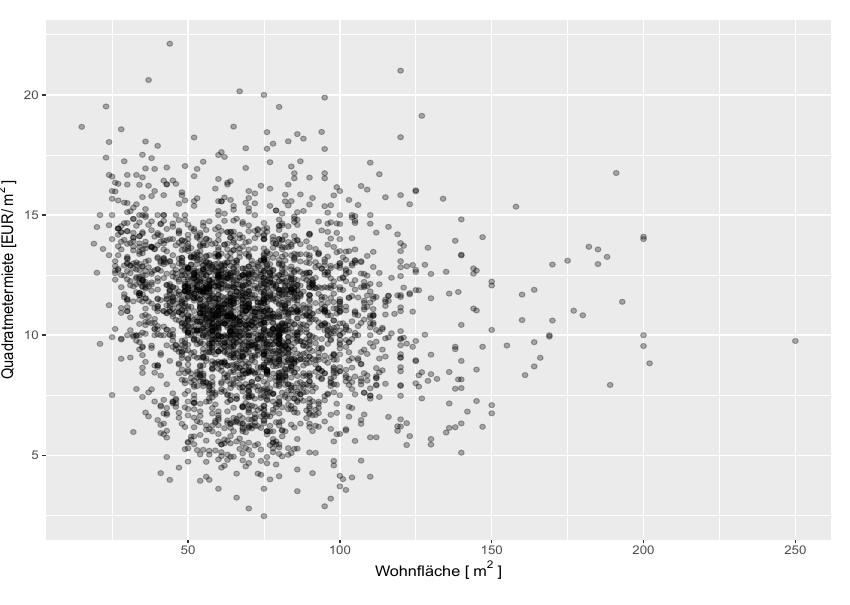

点云从左上到右下，表示负相关（negative Korrelation）。散点图可显示线性或非线性结构。

### Seite 82 - 大数据散点图与重叠

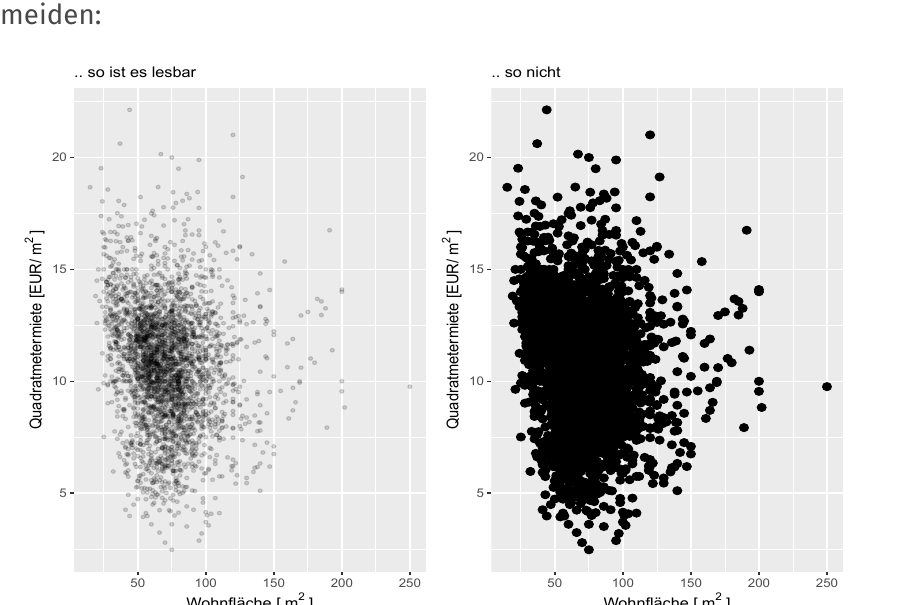

样本量大时，点会重叠，普通散点图可能变成黑块。可用透明度（Alpha）、二维分箱或密度图。

### Seite 83 - 透明度与二维密度

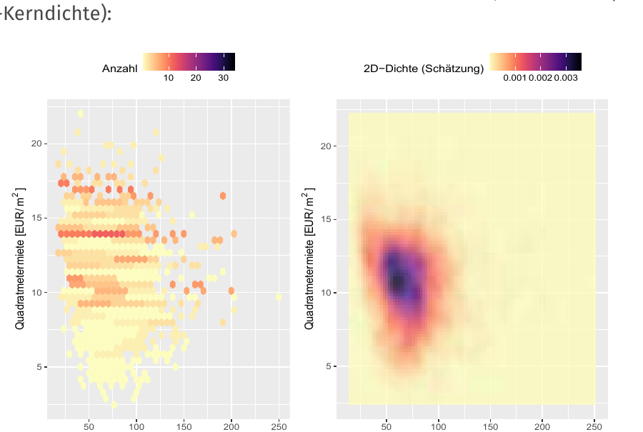

透明度和二维密度能显示高密度区域，比完全不透明点更适合大数据。

### Seite 84 - 三维图的风险

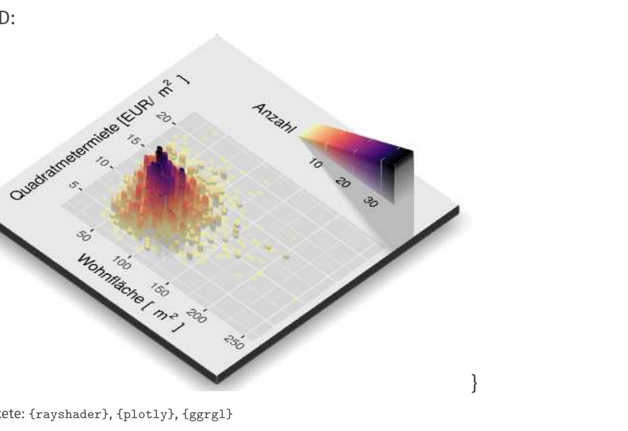

三维透视图看起来立体，但遮挡和视角会影响判断。统计图通常优先使用二维图和清晰尺度。

### Seite 85 - 离散第三变量：颜色编码

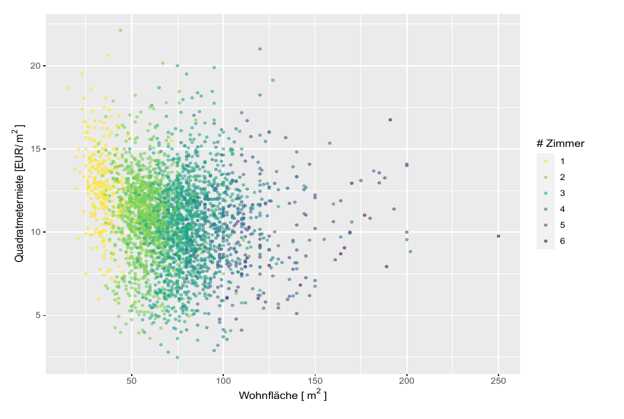

颜色可表示离散第三变量（diskrete Drittvariable），帮助观察组间差异。

### Seite 86 - 离散第三变量：分面

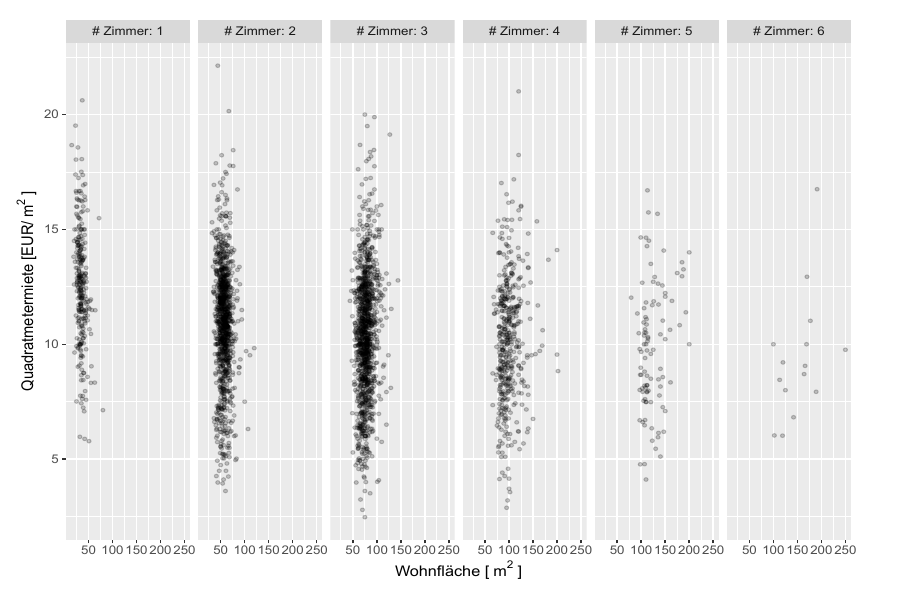

分面（Facettierung）能减少颜色混杂，让每组结构更清楚。

### Seite 87 - 离散第三变量：密度表示

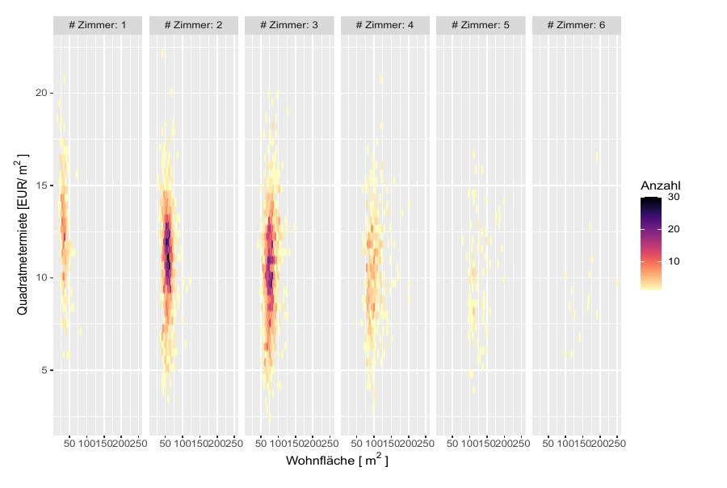

当每组点很多时，可用密度或等高线表达各组分布。

### Seite 88 - 连续第三变量

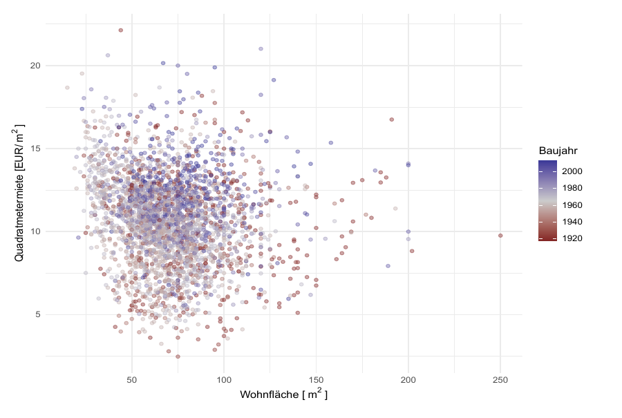

连续第三变量可用颜色梯度表示，但要选择合适的顺序色标，避免虚假类别感。

### Seite 89 - 连续第三变量的颜色编码

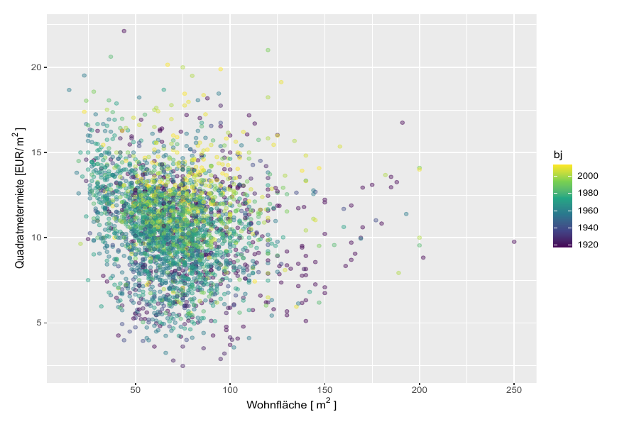

颜色梯度应单调、易读，并带图例。若颜色承担核心数值比较任务，读者可能难以精确判断。

### Seite 90 - 分组第三变量

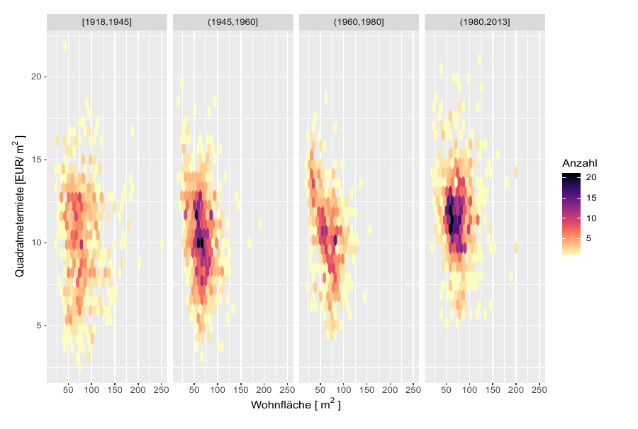

按组展示散点图可揭示总体趋势与组内趋势差异。后续章节中的 Simpson 悖论也与此相关。

### Seite 91 - 分组第三变量密度图

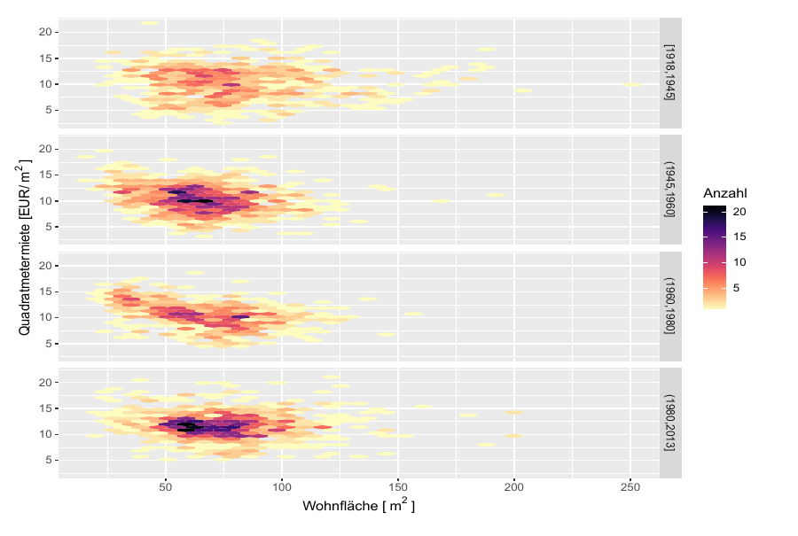

密度图可帮助比较多个组的分布重叠和集中区域，适合点数较多时替代普通散点图。

## 本章逻辑梳理

- **图形语法（Seite 1-10）：** 数据、几何对象、映射、尺度。
- **图形感知与原则（Seite 11-24）：** 人眼如何比较、怎样避免误导。
- **颜色与信息可视化（Seite 25-39）：** 色标、地图、网络、树图。
- **单变量图形（Seite 40-68）：** 条形图、直方图、密度、ECDF。
- **多变量图形（Seite 69-91）：** 箱线图、散点图、二维密度、第三变量。

真正复习时，不要按页码零散背。先问本章在解决什么问题，再把每页放回上面的模块里：前面的页通常提出问题，中间的页给出工具，后面的页提醒适用边界或展示例子。

## 关键考核点

1. 会把统计图拆成数据、几何对象、审美映射、尺度和坐标。
2. 会判断图形是否误导，例如截断坐标轴、面积错觉、颜色不合适。
3. 会根据变量尺度选择条形图、直方图、密度图、箱线图、散点图等。
4. 会解释 bin 宽度和核密度带宽如何改变图形。

## 本章公式清单

### 图形映射

| 序号 | 公式 | 使用场景 | 注意事项 |
| ---: | --- | --- | --- |
| 1 | $Daten \to geometrische Objekte \to ästhetische Eigenschaften$ | 概括统计图形的编码链条。 | 先看映射，再解释图形。 |
| 2 | $Variable \mapsto Position, Farbe, Größe, Form$ | 判断变量被放到了哪个视觉通道。 | 不同通道适合不同尺度水平。 |

### 频数与密度图

| 序号 | 公式 | 使用场景 | 注意事项 |
| ---: | --- | --- | --- |
| 3 | $h_j=\frac{n_j}{n}$ | 条形图或频率图中的相对频数。 | 注意柱高表示频数、比例还是统计量。 |
| 4 | $\text{density}=\frac{\text{count}}{n\cdot \text{bin width}}$ | 直方图密度标尺。 | bin 宽度不同不能只比较高度。 |
| 5 | $\hat f_h(x)=\frac1{nh}\sum_{i=1}^{n}K\left(\frac{x-x_i}{h}\right)$ | 核密度估计。 | 带宽 $h$ 控制平滑程度。 |

### 经验分布与关系图

| 序号 | 公式 | 使用场景 | 注意事项 |
| ---: | --- | --- | --- |
| 6 | $\hat F_n(x)=\frac1n\sum I(x_i\le x)$ | ECDF。 | 读“有多少比例不超过 x”。 |
| 7 | $(x_i,y_i)$ | 散点图中的一个观测点。 | 先看形状、离群点、非线性，再谈相关。 |

## 章节自测

- [x] 统计图形中的颜色、位置、大小都是审美映射的一部分。
- [ ] 直方图的形状不受 bin 宽度影响。
- [x] 散点图适合先检查两个度量变量的关系形状。
- [ ] 颜色越丰富，统计图通常越准确。

## 德语词汇表

| 德语 | 中文 | 使用场景 |
| --- | --- | --- |
| Grammar of Graphics | 图形语法 | 拆解图形结构 |
| ästhetische Zuordnung | 审美映射 | 变量到视觉属性 |
| Skala | 尺度/标尺 | 轴与图例规则 |
| Koordinatensystem | 坐标系 | 位置解释框架 |
| Histogramm | 直方图 | 连续变量分布 |
| Kerndichteschätzung | 核密度估计 | 平滑密度 |
| Scatterplot | 散点图 | 两个度量变量 |
| Farbskala | 色标 | 颜色编码规则 |

## C1 德语句式

| 序号 | 德语句式 | 中文翻译 | 适用场景 |
| ---: | --- | --- | --- |
| 1 | Eine statistische Grafik kodiert Daten durch geometrische Objekte und deren ästhetische Eigenschaften. | 统计图形通过几何对象及其视觉属性来编码数据。 | 定义图形语法。 |
| 2 | Die Wahl der grafischen Darstellung sollte sich an Skalenniveau, Fragestellung und Wahrnehmungsgenauigkeit orientieren. | 图形选择应根据尺度水平、研究问题和感知精确度来决定。 | 解释选图原则。 |
| 3 | Veränderte Klassenbreiten oder Bandbreiten können die wahrgenommene Verteilungsform erheblich beeinflussen. | 改变组距或带宽会显著影响人们看到的分布形状。 | 解释直方图/密度图敏感性。 |
