# 第 7 章：统计特征值与分布性质（Kennwerte & Verteilungseigenschaften）

> 来源：`分章节讲义/07_Kennwerte & Verteilungseigenschaften.pdf`  
> 原讲义页码：S. 317-400，共 84 页  
> 图片目录：`assets/`  
> 核心主线：本章回答一个问题：如何用少数统计特征值（statistische Kennwerte）描述一个变量的“位置”（Lage）、“离散程度”（Streuung）、“形状”（Verteilungseigenschaften）和“集中程度”（Konzentration）？

---

## 章节知识树

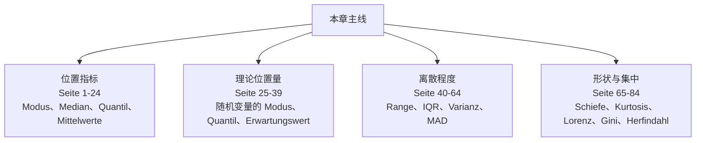

## 学习路径

用少数统计特征值描述一个变量的位置、离散程度、形状和集中度，同时清楚每个指标适合什么数据、怕什么异常。

1. **位置指标：** Modus、Median、Quantil、Mittelwerte（Seite 1-24）。
2. **理论位置量：** 随机变量的 Modus、Quantil、Erwartungswert（Seite 25-39）。
3. **离散程度：** Range、IQR、Varianz、MAD（Seite 40-64）。
4. **形状与集中：** Schiefe、Kurtosis、Lorenz、Gini、Herfindahl（Seite 65-84）。

## 模块地图

| 模块 | 页码 | 核心问题 |
| --- | --- | --- |
| 位置指标 | Seite 1-24 | Modus、Median、Quantil、Mittelwerte |
| 理论位置量 | Seite 25-39 | 随机变量的 Modus、Quantil、Erwartungswert |
| 离散程度 | Seite 40-64 | Range、IQR、Varianz、MAD |
| 形状与集中 | Seite 65-84 | Schiefe、Kurtosis、Lorenz、Gini、Herfindahl |

## 考试优先级

1. 会说明均值、中位数、众数各自表达的“中心”不同。
2. 会判断哪些指标对离群值稳健。
3. 会区分经验指标和随机变量的理论指标。
4. 会解释 Boxplot、Lorenz 曲线、Gini 和 Herfindahl 的读法。

## 模块零：描述一个变量先问四个问题（Seite 1-4）

一个变量的分布不是一个数字能说完的。你至少要问：典型位置在哪里？数据散得多开？形状是否偏斜或厚尾？总量是否集中在少数对象手里？本章就是围绕这四个问题建立工具箱。

### Seite 1 - 目录：Kennwerte & Verteilungseigenschaften

本页列出章节结构：

- 单变量统计特征值（univariate statistische Kennwerte）
- 位置指标（Lagemaße）
- 随机变量的位置指标（Lagemaße für Zufallsvariablen）
- 随机变量的期望值（Erwartungswert einer Zufallsvariablen）
- 离散指标（Streuungsmaße）
- 随机变量的方差（Varianz einer Zufallsvariable）
- 分布性质（Verteilungseigenschaften）
- 集中度指标（Konzentrationsmaße）

中文理解：这一章把“描述一个变量”拆成四个问题：典型值在哪里、数据散得多开、分布形状如何、总量是否集中在少数个体手里。

### Seite 2 - 目录重复页

这一页再次给出目录，用于切换到第一部分：单变量统计特征值（univariate statistische Kennwerte）。

> [!tip] 学习顺序  
> 先把经验指标（empirische Kennwerte）学扎实，再理解随机变量指标（theoretische Kennwerte）。前者从数据算，后者从分布算。

### Seite 3 - 统计特征值（Statistische Kennwerte）

位置指标（Lagemaßzahlen）回答：

- 观测值的“中间”（Mitte）在哪里？
- 哪个取值是“典型”（typisch）的？
- 大多数数据落在哪里？

离散指标（Streuungsmaßzahlen）回答：

- 观测值波动（Schwankung）有多大？
- 特征取值（Merkmalsausprägungen）覆盖多大范围？
- 数据彼此靠得近还是分得远？

> [!important] 考点  
> 位置指标和离散指标通常成对解释。只说均值（Mittelwert）而不说标准差（Standardabweichung），信息是不完整的。

### Seite 4 - 目录切换：Lagemaße

进入统计位置指标（statistische Kennwerte: Lagemaße）。

---

## 模块一：样本的位置指标找“中心”（Seite 5-24）

众数、中位数、分位数和均值都在说“中心”，但中心有不同含义。众数看最常见，中位数看排序中间，均值看总量平衡点。遇到离群值和偏态分布时，它们会给出不同故事。

### Seite 5 - 众数（Modus）

定义：众数（Modus）是最常出现的值（häufigster Wert）。

性质：

- 常常不唯一（nicht eindeutig）。
- 只在分组数据（gruppierte Daten）或取值很少的变量（Merkmale mit wenigen Ausprägungen）中有意义。
- 对所有一一变换（eindeutige Transformationen）可以直接转移。
- 适合所有尺度水平（alle Skalenniveaus），包括名义尺度（Nominalskala）。

> [!note] 中文理解  
> 众数是最“民主”的位置指标：只问哪个值出现最多，不要求数值可加减。因此它可以用于类别变量。

### Seite 6 - 中位数（Median）

定义：中位数（Median, $\tilde{x}$）满足：

- 至少 50% 的数据小于或等于 $\tilde{x}$；
- 至少 50% 的数据大于或等于 $\tilde{x}$。

将数据排序为 $x_{(1)},\ldots,x_{(n)}$：

$$
\tilde{x}=
\begin{cases}
x_{(k)}, & k=(n+1)/2 \text{ 为整数，即 } n \text{ 为奇数},\\
\frac{x_{(k)}+x_{(k+1)}}{2}, & k=n/2 \text{ 为整数，即 } n \text{ 为偶数}.
\end{cases}
$$

另一种定义：偶数样本时，也可把 Median 定义为区间 $[x_{(k)},x_{(k+1)}]$ 中任意一点。

### Seite 7 - Median 的性质（Eigenschaften des Medians）

Median：

- 直观（anschaulich）；
- 至少适合序数数据（mindestens ordinale Daten）；
- 对极端值稳健（robust gegenüber extremen Werten）；
- 对单调变换（monotone Transformationen）可直接转移；
- 是使绝对偏差和（Summe der absoluten Differenzen）最小的值：

$$
\tilde{x}=\arg\min_x \sum_{i=1}^{n}|x_i-x|.
$$

> [!important] 考点  
> Median 最小化绝对偏差，Mittelwert 最小化平方偏差。这是两者对异常值敏感性不同的根源。

### Seite 8 - 分位数（Quantil）

定义：$p$-分位数（$p$-Quantil）是一个值 $\tilde{x}_p$，满足：

- 至少比例 $p$ 的数据小于或等于它；
- 至少比例 $1-p$ 的数据大于或等于它。

讲义采用的经验定义：

$$
\tilde{x}_p=
\begin{cases}
x_{(k)}, & np \text{ 不是整数，且 } k \text{ 是满足 } k>np \text{ 的最小整数},\\
\in [x_{(k)},x_{(k+1)}], & k=np.
\end{cases}
$$

注意：分位数定义有多种，R 里有 9 种类型。差别通常只在极端分位数（extreme Quantile）处明显。

关系：

- $p$-Quantil 等同于 $(100p)$-Perzentil。
- Median 是 $0.5$-Quantil，也就是 50-Perzentil。

### Seite 9 - Boxplot 的应用（Anwendung in Visualisierung: Boxplot）

Boxplot 用来概览一个变量的分布（Verteilung eines Merkmals），它可视化五数概括（5-Punkte-Zusammenfassung）：

Minimum、25-Perzentil、50-Perzentil、75-Perzentil、Maximum。

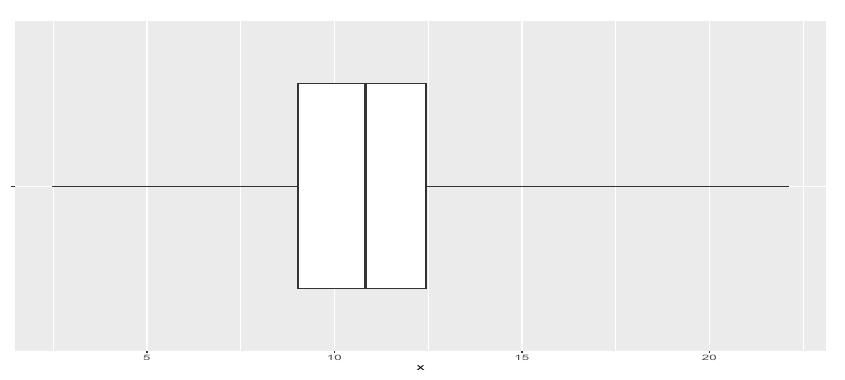

### Seite 10 - 简单 Boxplot（Einfacher Boxplot）

简单箱线图中：

- 箱体起点（Anfang der Box）是下四分位数（unteres Quartil）$Q_{0.25}$；
- 箱体终点（Ende der Box）是上四分位数（oberes Quartil）$Q_{0.75}$；
- 箱体长度是四分位距（Interquartile Range, IQR）：

$$
d_Q=Q_{0.75}-Q_{0.25}.
$$

- 箱内竖线表示 Median。
- 箱外两条须（Whiskers）延伸到最小值（Minimum）和最大值（Maximum）。

### Seite 11 - 修正 Boxplot（Modifizierter Boxplot）

修正箱线图（modifizierter Boxplot）不一定把 Whiskers 拉到真实最小值和最大值，而是只拉到“围栏”（Zäune）内最远的观测值。

常用围栏：

$$
z_u=Q_{0.25}-1.5d_Q,\qquad z_o=Q_{0.75}+1.5d_Q.
$$

围栏外的观测值作为单独点或符号画出，通常解释为异常值（Ausreißer）。

### Seite 12 - Mietspiegel 示例：简单与修正 Boxplot

本页比较慕尼黑租金数据（Nettomiete [EUR/qm]）的简单 Boxplot 和修正 Boxplot。修正版本会把围栏外的高租金点单独标出。

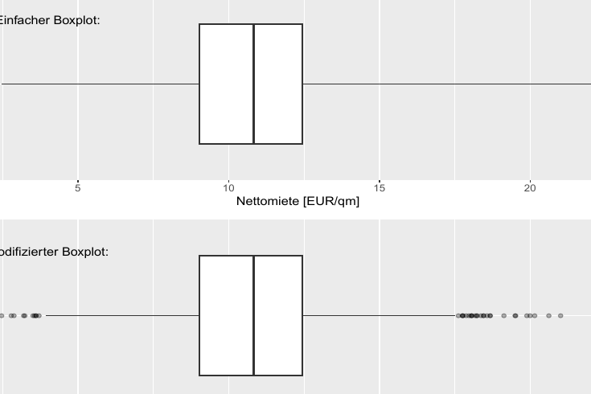

### Seite 13 - 分组 Boxplot（Gruppierter Boxplot）

按房间数（Zimmerzahl）分组展示每平方米净租金（Netto-Quadratmetermiete）。横向箱线图的高度可按组大小（Gruppengröße）缩放。

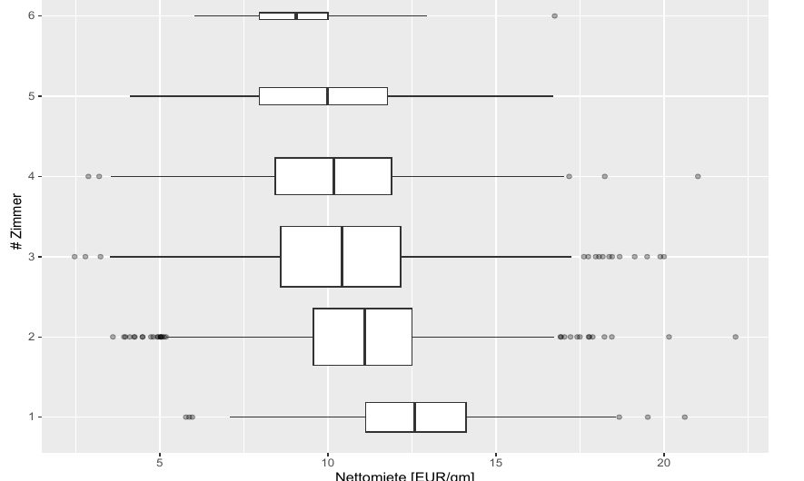

> [!tip] 读图顺序  
> 先看 Median 位置，再看 IQR 宽度，然后看 Whiskers 与异常值。比较组间差异时，不要只盯平均水平，也要看组内波动。

### Seite 14 - Boxplot 的优缺点（Vor- und Nachteile）

优点：

- 紧凑（kompakt）。
- 适合组间比较（geeignet für Vergleiche）。
- 中央区域（zentraler Bereich）容易读出。
- 异常值（Ausreißer）可见。
- 偏斜（Schiefe）可见。

缺点：

- 可能违背直觉：少数异常值被画得很醒目。
- 多峰分布（multimodale Verteilungen）看不出来。
- 箱体高度本身没有信息，除非特别编码组大小。

### Seite 15 - 简单 Boxplot 的 Grammar of Graphics

Boxplot 的几何对象（Geometrie）是：

- 一个矩形（Rechteck）；
- 箱内竖线表示 Median；
- 水平 Whiskers 表示范围。

映射的美学属性（zugeordnete Ästhetiken）包括：

- 矩形水平范围：$Q_{0.25}$ 到 $Q_{0.75}$；
- 箱内线位置：Median；
- Whiskers 端点：Minimum 和 Maximum；
- 可选：箱体高度表示观测数量。

### Seite 16 - 修正 Boxplot 的 Grammar of Graphics

修正 Boxplot 额外使用点或符号（Punkte/Symbole）表示围栏外观测值；Whiskers 的位置也按围栏规则调整。

讲义提醒：也可以用其他位置与离散指标构造“类 Boxplot”，只要定义清楚即可。

### Seite 17 - 算术平均数（arithmetisches Mittel）

算术平均数（arithmetisches Mittel, $\bar{x}$）：

- 是最知名的位置指标；
- 强烈受极端值影响（stark beeinflusst von extremen Werten）；
- 适合区间尺度数据（intervallskalierte Daten）；
- 可理解为数据的平均值或重心（Schwerpunkt）。

公式：

$$
\bar{x}=\frac{1}{n}\sum_{i=1}^{n}x_i.
$$

它也是最小化平方偏差和（Summe der quadrierten Differenzen）的值：

$$
\bar{x}=\arg\min_x\sum_{i=1}^{n}(x_i-x)^2.
$$

### Seite 18 - 分组数据的平均数（Mittelwert bei gruppierten Daten）

若值 $a_j$ 的绝对频数为 $h_j$，相对频数为 $f_j=h_j/n$，则：

$$
\bar{x}=\frac{1}{n}\sum_{j=1}^{k}h_j a_j=\sum_{j=1}^{k}f_j a_j.
$$

> [!important] 考点  
> 分组表里不要把类别值简单相加平均；必须按频数（Häufigkeit）加权。

### Seite 19 - 加权平均数（gewichteter Mittelwert）

给定非负权重（Gewichte）$w_i\ge 0$，加权平均数（gewichteter Mittelwert）为：

$$
\bar{x}_W=\frac{1}{\sum_{i=1}^{n}w_i}\sum_{i=1}^{n}w_i x_i.
$$

普通平均数是所有权重相同的特殊情况。

### Seite 20 - 几何平均数（geometrisches Mittel）

几何平均数（geometrisches Mittel）：

$$
\bar{x}_G=\sqrt[n]{\prod_{i=1}^{n}x_i}
=\exp\left(\frac{1}{n}\sum_{i=1}^{n}\log x_i\right).
$$

适用条件：

- 只适用于正值（positive Werte）；
- 至少区间尺度；
- 常用于变化率（Änderungsraten）、收益率、利率（Verzinsung）；
- 当变量可解释为乘法因子（multiplikative Faktoren）时，应使用几何平均。

### Seite 21 - 几何平均数示例

初始资本 100 欧元，三个季度：

- Q1：20% Gewinn，因子 1.2；
- Q2：50% Gewinn，因子 1.5；
- Q3：40% Verlust，因子 0.6。

最终资本：

$$
100\cdot 1.2\cdot 1.5\cdot 0.6=108.
$$

算术平均因子：

$$
\bar{r}=\frac{1.2+1.5+0.6}{3}=1.1,
$$

会错误地暗示每季度平均收益 10%，三季度后 $100\cdot1.1^3=133.1$。

几何平均因子：

$$
\bar{r}_G=\exp(\overline{\log r})\approx 1.026,
$$

对应每季度约 2.6% 收益，三季度后正好约为 108。

### Seite 22 - 调和平均数（harmonisches Mittel）

调和平均数（harmonisches Mittel）是倒数的算术平均再取倒数：

$$
\bar{x}_H=\left(\frac{1}{n}\sum_{i=1}^{n}\frac{1}{x_i}\right)^{-1}.
$$

适合处理比率或商（Quotienten/Verhältnisse），例如速度（Geschwindigkeiten）、市盈率（Kurs-Gewinn-Verhältnis）。

### Seite 23 - 调和平均数示例

前 100 km 速度 30 km/h，后 100 km 速度 100 km/h。

总距离：200 km。总时间：

$$
\frac{100}{30}+\frac{100}{100}=3.33+1=4.33\text{ h}.
$$

平均速度：

$$
\frac{200}{4.33}\approx 46.2\text{ km/h}.
$$

若用算术平均 $(30+100)/2=65$ km/h，是错误的，因为两段的时间权重不同。

### Seite 24 - 算术平均数的一般变换（Transformation des arithmetischen Mittels）

线性变换（lineare Transformation）：

$$
y_i=a+bx_i \Rightarrow \bar{y}=a+b\bar{x}.
$$

但一般非线性变换下：

$$
\overline{g(x)}\ne g(\bar{x}).
$$

> [!warning] 易错点  
> “先平均再变换”和“先变换再平均”通常不等价。只有线性变换有简单交换关系。

## 模块二：随机变量的位置量把样本概念理论化（Seite 25-39）

样本指标从数据算，理论指标从分布算。这里要把经验 Median、Quantil、Mittelwert 对应到随机变量的分布函数和期望值，为后面概率模型打基础。

### Seite 25 - 截尾平均数（getrimmtes Mittel）

为了降低算术平均数对异常值的敏感性，可以使用 $\alpha$-截尾平均数（$\alpha$-getrimmtes Mittel）。

排序数据 $x_{(1)},\ldots,x_{(n)}$，令 $r$ 为满足 $r\le n\alpha$ 的最大整数，则：

$$
\bar{x}_{\alpha}=\frac{1}{n-2r}\sum_{i=r+1}^{n-r}x_{(i)}.
$$

也就是说，从底部和顶部各删去比例 $\alpha$ 的极端值。

替代方法：Winsor 化平均数（winsorisiertes Mittel）：不是删除极端值，而是用相应分位数替换极端值。

> [ ] 小测：如果数据有少数特别大的收入值，Median、截尾平均数、算术平均数中哪个最容易被拉高？  
> 正确直觉：算术平均数最容易被拉高。

### Seite 26 - 目录切换：Lagemaße für Zufallsvariablen

进入随机变量的位置指标（Lagemaße für Zufallsvariablen）。

### Seite 27 - 从经验指标到理论指标（Einleitung）

已学过：经验位置与离散指标（empirische Lage- und Streuungsmaße），例如 Mittelwerte、Median、Modus、Stichprobenvarianz、MAD，用于描述样本中的观测分布。

现在学习：随机变量分布的理论对应物（theoretische Entsprechungen）。

之后在估计理论（Schätztheorie）中会问：哪些经验指标适合估计哪些理论指标？

### Seite 28 - 随机变量的众数（Modus einer Zufallsvariablen）

随机变量 $X$ 的众数（Modus einer Zufallsvariable）是密度函数或概率函数的全局最大点（globale Maximumsstelle）：

$$
f_X(x_{Mod})\ge f_X(x),\quad \forall x\in T_X.
$$

和经验众数一样，随机变量的众数不一定唯一，也不一定存在。

### Seite 29 - 随机变量的 Median 与 Quantile

随机变量 $X$ 的 $p$-分位数（Quantil einer Zufallsvariable）定义为：

$$
\tilde{x}_p:=\arg\min_x \{x: F_X(x)\ge p\}.
$$

也就是：使分布函数（Verteilungsfunktion）至少达到 $p$ 的最小值。

若 $X$ 连续，且密度严格为正、分布函数严格单调，则：

$$
\tilde{x}_p=F_X^{-1}(p).
$$

$F_X^{-1}$ 称为分位数函数（Quantilfunktion）。

---

### Seite 30 - 目录切换：Erwartungswert

进入随机变量的期望值（Erwartungswert einer Zufallsvariablen）。

### Seite 31 - 随机变量的期望值定义

离散随机变量（diskrete Zufallsvariable）$X$，支撑集（Träger）为 $T_X$：

$$
E(X)=\sum_{x\in T_X}x\cdot P(X=x)
=\sum_{x\in T_X}x\cdot f_X(x).
$$

也可从样本空间写为：

$$
E(X)=\sum_{\omega\in\Omega}P(\{\omega\})X(\omega).
$$

连续随机变量（stetige Zufallsvariable）$X$，密度函数（Dichtefunktion）为 $f_X$：

$$
E(X)=\int_{-\infty}^{\infty}x f_X(x)\,dx.
$$

### Seite 32 - 期望值的直觉与存在条件

直觉：期望值是随机变量所有可能值的加权算术平均（gewichtetes arithmetisches Mittel），权重是对应概率。

存在并有限（endlich）的条件：

- 离散情形：$\sum_{x\in T_X}|x|f_X(x)<\infty$；
- 连续情形：$\int_{-\infty}^{\infty}|x|f_X(x)\,dx<\infty$。

### Seite 33 - 期望值性质 I

若 $X=a$ 几乎必然成立（deterministische Zufallsvariable），则：

$$
E(X)=a.
$$

线性性（Linearität des Erwartungswertes）：

$$
E(aX+bY)=aE(X)+bE(Y).
$$

因此：

$$
E(aX+b)=aE(X)+b.
$$

若密度函数关于点 $c$ 对称（symmetrisch um einen Punkt $c$），即 $f(c-x)=f(c+x)$，则：

$$
E(X)=c.
$$

### Seite 34 - 期望值性质 II

对任意常数 $a_1,\ldots,a_n$ 和任意随机变量 $X_1,\ldots,X_n$：

$$
E\left(\sum_{i=1}^{n}a_iX_i\right)=\sum_{i=1}^{n}a_iE(X_i).
$$

注意：这里不需要独立性（Unabhängigkeit）。独立性在方差相加时才重要。

### Seite 35 - 期望值的变换规则（Transformationsregel）

若 $Y=g(X)$：

$$
E[g(X)]=
\begin{cases}
\sum_{x\in T_X}g(x)f_X(x), & X \text{ 离散},\\
\int_{-\infty}^{\infty}g(x)f_X(x)\,dx, & X \text{ 连续}.
\end{cases}
$$

一般不成立：

$$
E[g(X)]\ne g(E[X]).
$$

### Seite 36 - 期望值计算示例

随机变量 $X$ 的概率函数：

$$
f(x)=
\begin{cases}
1/4, & x=-2,\\
1/8, & x=-1,\\
1/4, & x=1,\\
3/8, & x=3.
\end{cases}
$$

要求 $E(X^2)$。按变换规则：

$$
E(X^2)=4\cdot\frac14+1\cdot\frac18+1\cdot\frac14+9\cdot\frac38
=1+\frac18+\frac14+\frac{27}{8}
=\frac{19}{4}=4.75.
$$

### Seite 37 - 自然数支撑上的期望值尾和公式

若 $X$ 的支撑为 $\mathbb{N}^+$，则：

$$
E(X)=\sum_{k=1}^{\infty}P(X\ge k).
$$

证明思路：把每个 $P(X=t)$ 在尾概率求和中数了 $t$ 次，因此：

$$
\sum_{k=1}^{\infty}P(X\ge k)
=\sum_{t=1}^{\infty}tP(X=t)=E(X).
$$

> [!tip] 何时好用  
> 等待时间（Wartezeit）、寿命、首次成功次数等非负整数变量，经常可用尾和公式简化期望计算。

---

### Seite 38 - 目录切换：Streuungsmaße

进入统计离散指标（statistische Kennwerte: Streuungsmaße）。

### Seite 39 - 离散程度的指标

本节指标：

- 极差（Spannweite, Range）
- 四分位距（Interquartilsabstand）
- 标准差与方差（Standardabweichung und Varianz）
- 变异系数（Variationskoeffizient）

## 模块三：离散程度回答“散得多开”（Seite 40-64）

只知道中心不够。两个班平均分一样，一个很稳定，一个两极分化，含义完全不同。Range、IQR、方差、标准差、变异系数和 MAD 都是在量化波动，但稳健性和尺度依赖不同。

### Seite 40 - 极差（Spannweite / Range）

定义：

$$
sp=x_{\max}-x_{\min}.
$$

解释：数据所在区间的长度。

主要用途：数据质量控制（Kontrolle der Datenqualität），例如发现输入错误、编码错误、误测值和异常值。

缺点：对异常值极端敏感（extrem sensibel gegen Ausreißer）。

### Seite 41 - 四分位距（Quartilsabstand / IQR）

定义：

$$
d_Q=Q_{0.75}-Q_{0.25}.
$$

解释：

- 表示中间一半数据所在区域的长度；
- 等于 Boxplot 箱体长度；
- 又称 Interquartile Range (IQR)；
- 对异常值稳健；
- 对序数尺度数据，也可报告 $Q_{0.25}$ 与 $Q_{0.75}$ 来描述中央 50% 区域。

### Seite 42 - 标准差与样本方差（Standardabweichung und Stichprobenvarianz）

样本方差（Stichprobenvarianz）：

$$
s_x^2=\frac{1}{n-1}\sum_{i=1}^{n}(x_i-\bar{x})^2.
$$

标准差（Standardabweichung）：

$$
s_x=\sqrt{s_x^2}.
$$

性质：

- 松散地解释为“平均偏离均值的程度”；
- 至少要求区间尺度；
- 对异常值敏感；
- 全体调查（Vollerhebung）时可用 $\tilde{s}_x^2=\frac{1}{n}\sum (x_i-\bar{x})^2$；
- 除以 $n-1$ 主要用于样本情形。

### Seite 43 - 线性变换下方差和标准差

若：

$$
y_i=a+bx_i,
$$

则：

$$
\tilde{s}_y^2=b^2\tilde{s}_x^2,\qquad \tilde{s}_y=|b|\tilde{s}_x.
$$

平移（Verschiebung）不改变离散程度，缩放（Skalierung）按比例改变离散程度。

### Seite 44 - Verschiebungssatz

对任意 $c\in\mathbb{R}$：

$$
\sum_{i=1}^{n}(x_i-c)^2
=\sum_{i=1}^{n}(x_i-\bar{x})^2+n(\bar{x}-c)^2.
$$

令 $c=0$ 可得：

$$
\tilde{s}_x^2=\overline{x^2}-\bar{x}^2.
$$

注意：这个公式不适合在计算机上追求高精度结果，因为可能发生浮点数抵消（Auslöschung von Gleitkommazahlen）。

### Seite 45 - 离散分解 I（Streuungszerlegung）

将数据分为 $r$ 个层（Schichten），每层样本量为 $n_j$，总样本量：

$$
n=\sum_{j=1}^{r}n_j.
$$

每层有层均值（Schichtmittelwert）$\bar{x}_j$ 和层方差（Schichtvarianz）$\tilde{s}_{xj}^2$。

### Seite 46 - 离散分解 II

总体均值：

$$
\bar{x}=\frac{1}{n}\sum_{j=1}^{r}n_j\bar{x}_j.
$$

总方差可分解为：

$$
\tilde{s}_x^2
=\frac{1}{n}\sum_{j=1}^{r}n_j\tilde{s}_{xj}^2
+\frac{1}{n}\sum_{j=1}^{r}n_j(\bar{x}_j-\bar{x})^2.
$$

含义：

- 第一项：层内离散（Streuung innerhalb der Schichten）。
- 第二项：层间离散（Streuung zwischen den Schichten）。

### Seite 47 - Streuungszerlegung 示例：租金与 Zimmerzahl

本页把每平方米净租金（Netto-Quadratmetermiete）按房间数（Zimmerzahl）分层。

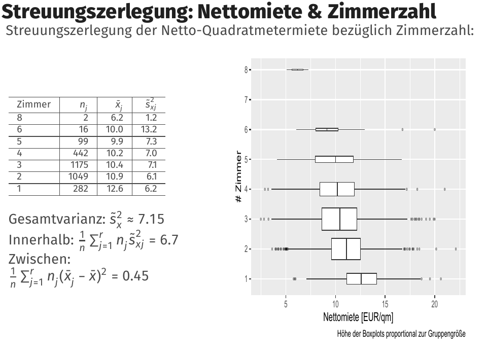

讲义结果：

- 总方差约 $\tilde{s}_x^2\approx 7.15$；
- 层内部分约 $6.7$；
- 层间部分约 $0.45$。

层间解释比例：

$$
\frac{0.45}{7.15}\approx 6.25\%.
$$

结论：每平方米租金的总差异中，只有约 6.25% 可归因于房间数不同，绝大部分差异来自同一房间数内部的差异。

### Seite 48 - 变异系数（Variationskoeffizient）

变异系数（Variationskoeffizient）：

$$
v=\frac{\tilde{s}_x}{\bar{x}},\qquad \bar{x}>0.
$$

特点：

- 无单位（keine Einheit）；
- 尺度无关（skalenunabhängig）；
- 衡量相对于均值的相对波动（relative Schwankung）；
- 只适用于正值变量。

### Seite 49 - 平均绝对偏差（Mittlere absolute Abweichung, MAD）

平均绝对偏差（mean absolute deviation）：

$$
MAD_x=\frac{1}{n}\sum_{i=1}^{n}|x_i-\bar{x}|.
$$

Median absolute deviation（MedAD）：

$$
MedAD_x=\operatorname{Median}(|x_i-\tilde{x}|).
$$

性质：

- MAD 通常比标准差更直观；
- MAD 和 MedAD 都比标准差更不受异常值影响，尤其 MedAD；
- 但它们理论性质不如方差和标准差“漂亮”，所以使用较少。

> [ ] 小测：为什么标准差使用平方偏差，而不是绝对偏差？  
> 提示：平方偏差在数学推导、优化和方差分解中更方便。

---

### Seite 50 - 目录切换：Varianz

进入随机变量方差（Varianz einer Zufallsvariable）。

### Seite 51 - 方差定义（Varianz）

随机变量 $X$ 的方差：

$$
\operatorname{Var}(X)=E\left[(X-E(X))^2\right].
$$

离散情形：

$$
\operatorname{Var}(X)=\sum_{x\in T_X}(x-E(X))^2f_X(x).
$$

连续情形：

$$
\operatorname{Var}(X)=\int_{-\infty}^{\infty}(x-E(X))^2f_X(x)\,dx.
$$

解释：期望的平方偏离（erwartete quadratische Abweichung）期望值。

注意：方差不一定有限；若期望值不存在，则方差也不存在。

### Seite 52 - 方差性质

Verschiebungssatz：

$$
\operatorname{Var}(X)=E(X^2)-[E(X)]^2.
$$

线性变换：

$$
\operatorname{Var}(aX+b)=a^2\operatorname{Var}(X).
$$

若 $X,Y$ 独立（unabhängig）：

$$
\operatorname{Var}(X+Y)=\operatorname{Var}(X)+\operatorname{Var}(Y).
$$

> [!warning] 易错点  
> 期望线性性不需要独立；方差相加通常需要独立或至少协方差为 0。

### Seite 53 - 切比雪夫不等式（Ungleichung von Tschebyscheff）

对任意随机变量 $X$：

$$
P(|X-E(X)|\ge c)\le \frac{\operatorname{Var}(X)}{c^2}.
$$

若 $\operatorname{Var}(X)=1$，则：

$$
P(|X-E(X)|\ge 1)\le 1,\quad
P(|X-E(X)|\ge 2)\le \frac14,\quad
P(|X-E(X)|\ge 3)\le \frac19.
$$

中文理解：离均值越远的事件，上界越小。它不要求正态分布，适用于任意分布，但界通常较松。

### Seite 54 - 随机变量的标准差（Standardabweichung）

随机变量的标准差：

$$
\sigma(X)=+\sqrt{\operatorname{Var}(X)}.
$$

线性变换：

$$
\sigma(aX+b)=|a|\sigma(X).
$$

讲义提醒：期望绝对偏差 $E(|X-E(X)|)$ 虽然更直观，但数学处理更困难。

---

### Seite 55 - 目录切换：Verteilungseigenschaften

进入分布性质：峰数、对称性、偏度、峰度/尾部极端值。

### Seite 56 - 单峰与多峰分布（uni- und multimodale Verteilungen）

单峰（unimodal/eingipflig）表示只有一个主要峰；多峰（multimodal/mehrgipflig）表示有多个峰。

例：利率直方图显示双峰（bimodal）或可能三峰（trimodal）分布。

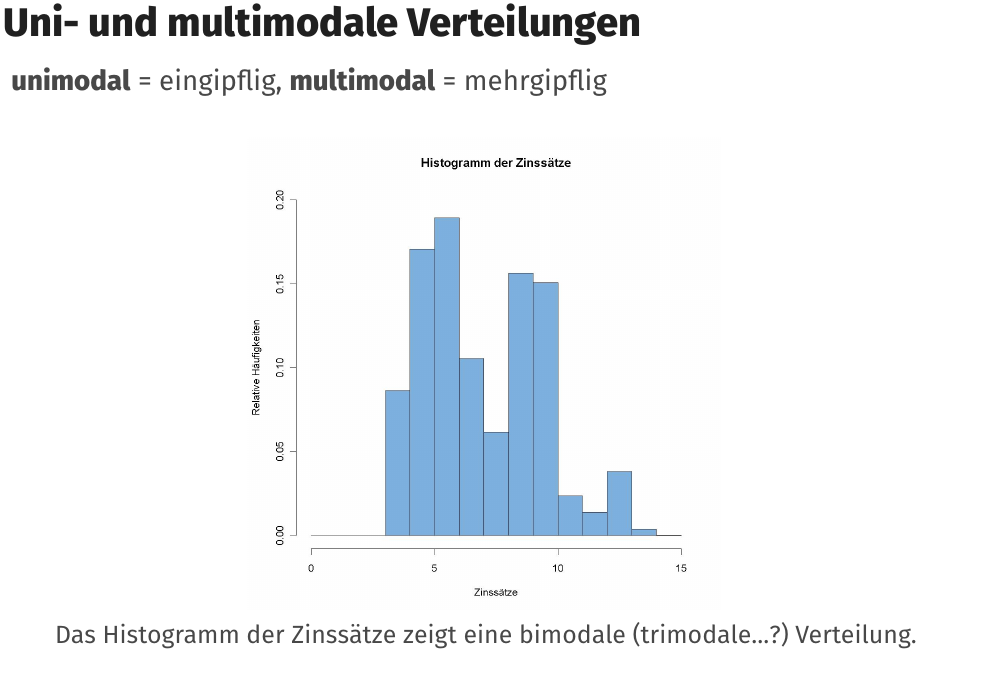

### Seite 57 - 对称与偏斜 I（Symmetrie und Schiefe）

三种形状：

- 对称（symmetrisch）：左右两半近似镜像。
- 左陡/右偏（linkssteil / rechtsschief）：左侧下降更陡，右侧尾部更长。
- 右陡/左偏（rechtssteil / linksschief）：右侧下降更陡，左侧尾部更长。

> [!important] 德语陷阱  
> `linkssteil` 强调左侧“陡”，但对应 `rechtsschief`，因为长尾在右侧。`rechtssteil` 对应 `linksschief`。

### Seite 58 - 对称与偏斜 II

图中展示：

- (a) linkssteil / rechtsschief；
- (b) symmetrisch；
- (c) rechtssteil / linksschief。

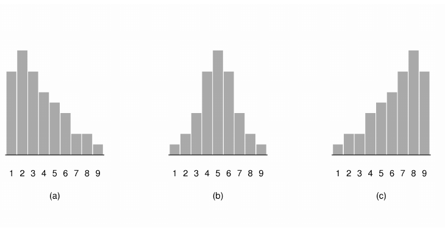

### Seite 59 - 位置规则（Lageregeln）

经验规则：

- 对称且单峰分布：

$$
\bar{x}\approx \tilde{x}_{med}\approx x_{mod}.
$$

- linkssteil / rechtsschief：

$$
\bar{x}>\tilde{x}_{med}>x_{mod}.
$$

- rechtssteil / linksschief：

$$
\bar{x}<\tilde{x}_{med}<x_{mod}.
$$

注意：

- 这些只是经验规则（Daumenregeln），不保证每个个案都成立。
- 线性变换保持分布形状；非线性变换可能改变分布形状。

### Seite 60 - 偏度指标 I：分位数系数（Quantilskoeffizient）

分位数偏度系数：

$$
g_p=\frac{(\tilde{x}_{1-p}-\tilde{x}_{med})-(\tilde{x}_{med}-\tilde{x}_{p})}
{\tilde{x}_{1-p}-\tilde{x}_{p}},\quad 0<p<0.5.
$$

当 $p=0.25$ 时称四分位偏度系数（Quartilskoeffizient）。

解释：

- $g_p=0$：对称分布；
- $g_p>0$：linkssteil / rechtsschief；
- $g_p<0$：rechtssteil / linksschief。

### Seite 61 - 偏度指标 II：矩系数（Momentenkoeffizient）

三阶中心矩：

$$
m_3=\frac{1}{n}\sum_{i=1}^{n}(x_i-\bar{x})^3.
$$

偏度矩系数：

$$
g_m=\frac{m_3}{s_x^3}
=\frac{1}{n}\sum_{i=1}^{n}\left(\frac{x_i-\bar{x}}{s_x}\right)^3.
$$

解释：

- $g_m=0$：对称；
- $g_m>0$：linkssteil / rechtsschief；
- $g_m<0$：rechtssteil / linksschief。

### Seite 62 - 峰度与极端值（Wölbung und Extremwerte）

重要问题：极端值（extreme Werte）在分布边缘（Ränder der Verteilung）出现得有多频繁？这些值离“中间”（Mitte）有多远？

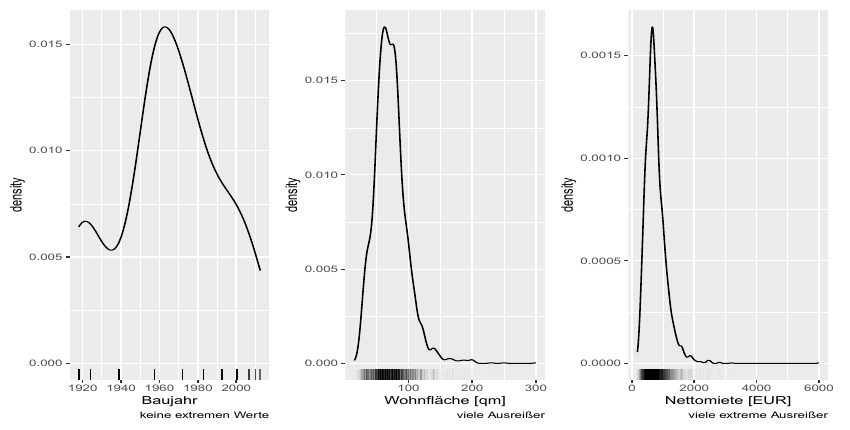

### Seite 63 - Kurtosis / Exzess-Kurtosis

峰度（Wölbung/Kurtosis）衡量极端值的频率与距离：

$$
k=\frac{m_4}{s_x^4}
=\frac{1}{n}\sum_{i=1}^{n}\left(\frac{x_i-\bar{x}}{s_x}\right)^4.
$$

通常看超额峰度（Exzess-Kurtosis）：

$$
k^\star=k-3.
$$

分类：

- $k^\star\approx 0$：normalgipflig / mesokurtisch，类似正态分布；
- $k^\star>0$：steilgipflig / leptokurtisch，窄而尖，极端值更多；
- $k^\star<0$：flachgipflig / platykurtisch，峰较平，极端值较少。

### Seite 64 - Kurtosis 理论图

经典理论图展示不同峰度曲线的差异。

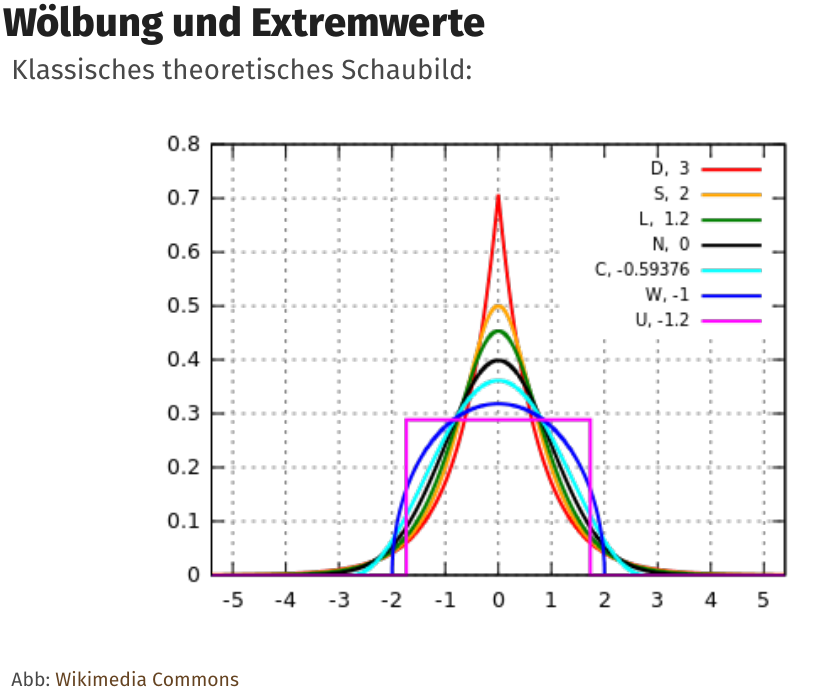

## 模块四：形状与集中度回答“分布怎么歪、资源怎么集中”（Seite 65-84）

偏度和峰度描述分布形状，Lorenz 曲线、Gini 和 Herfindahl 描述集中程度。它们常用于收入、财富、市场份额这类“不只是平均数”的问题。

### Seite 65 - Kurtosis 实际示例

不同变量的尾部与异常值情况：

- Baujahr：几乎没有异常值，Exzesskurtosis 约 -0.69；
- Wohnfläche：许多异常值，Exzesskurtosis 约 5.3；
- Nettomiete：许多极端异常值，Exzesskurtosis 约 22。

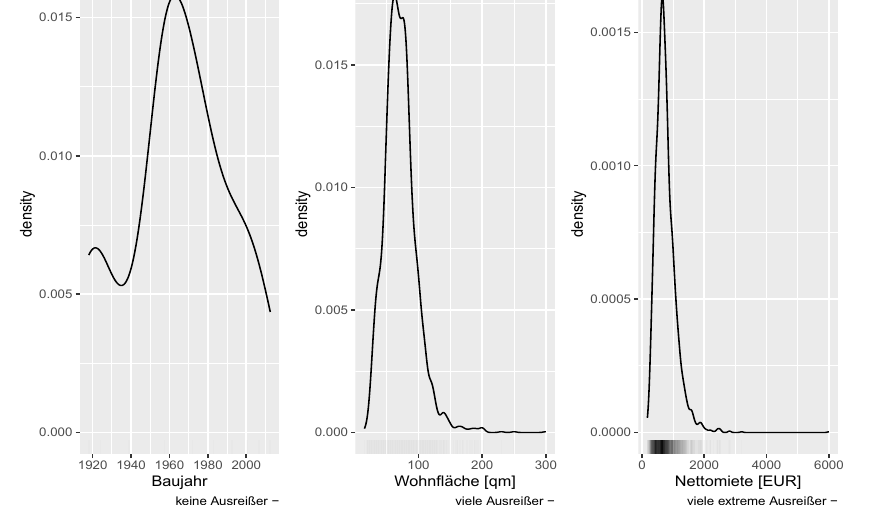

### Seite 66 - 随机变量的矩（Momente von Zufallsvariablen）

随机变量 $X$ 的 $k$ 阶矩（$k$-tes Moment）：

$$
E(X^k).
$$

$k$ 阶中心矩（zentriertes Moment）：

$$
E\left[(X-E(X))^k\right].
$$

关系：

- 期望值是第一矩（erstes Moment）。
- 方差是第二中心矩（zweites zentriertes Moment）。

### Seite 67 - 随机变量的高阶矩

理论偏度（Schiefe）是标准化变量的三阶中心矩：

$$
E\left[\left(\frac{X-E(X)}{\sigma(X)}\right)^3\right].
$$

理论峰度（Kurtosis）是标准化变量的四阶中心矩：

$$
E\left[\left(\frac{X-E(X)}{\sigma(X)}\right)^4\right].
$$

偶数中心矩（gerade zentrale Momente）本质上越来越重视尾部的“方差”；奇数中心矩（ungerade zentrale Momente）衡量不对称性，阶数越高越强调尾部不对称。

### Seite 68 - 理论与经验（Theorie & Empirie）

本页总结理论指标与经验指标的对应：

| 理论：随机变量（ZV） | 经验：观测特征（beobachtete Merkmale） |
|---|---|
| $E(X)=\int x f(x)\,dx$ | $\bar{x}=\frac1n\sum x_i$ 或 $\sum a_j f_j$ |
| $\operatorname{Var}(X)=\int(x-E(X))^2f(x)\,dx$ | $s_x^2=\frac1{n-1}\sum(x_i-\bar{x})^2$ |
| Median: $x_{med}:F_X(x_{med})=0.5$ | $\tilde{x}=x_{(\lceil n/2\rceil)}$ 或偶数修正 |
| Modus: $\arg\max f_X(x)$ | 频数最大的类别或数值 |

> [!important] 考点  
> Empirie 是从样本算出来的；Theorie 是由分布定义的。估计理论就是问前者能否可靠估计后者。

---

### Seite 69 - 目录切换：Konzentrationsmaße

进入集中度指标。

### Seite 70 - 集中度的动机

若某个总量（Menge）分配在许多个体（Individuen）之间，就需要知道它分配得是否均匀。

例子：

- 一个国家的财富分布（Vermögensverteilung）；
- 某市场中的公司市场份额（Marktanteile）。

### Seite 71 - Lorenz 曲线的基本思想（Lorenzkurve）

Lorenz 曲线要图形化表达：

- 最穷/最小的 $x\%$ 个体拥有总量的 $y\%$；
- 最富/最大的 $x\%$ 个体拥有总量的 $y\%$。

### Seite 72 - Lorenz 曲线定义

前提：变量只能取正值（positive Ausprägungen）。

总和：

$$
\sum_{i=1}^{n}x_i=\sum_{i=1}^{n}x_{(i)}.
$$

将观测值按大小排序：

$$
0\le x_{(1)}\le \cdots \le x_{(n)}.
$$

Lorenz 曲线连接一系列点：横轴是个体累计比例，纵轴是排序后数值的累计总量比例。

### Seite 73 - Lorenz 曲线坐标计算

设：

$$
u_0=0,\quad v_0=0.
$$

横坐标：

$$
u_j=\frac{j}{n},\quad j=1,\ldots,n.
$$

纵坐标：

$$
v_j=\frac{\sum_{i=1}^{j}x_{(i)}}{\sum_{i=1}^{n}x_{(i)}},\quad j=1,\ldots,n.
$$

将 $(u_j,v_j)$ 画出并用线段连接。

### Seite 74 - Lorenz 曲线：完全平等示例

5 个农民各拥有 20 ha，总面积 100 ha。Lorenz 曲线与对角线重合，表示完全均等（Gleichverteilung）。

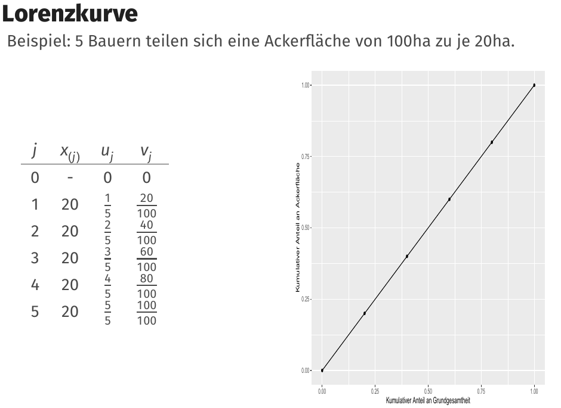

### Seite 75 - Lorenz 曲线：完全集中示例

4 个农民一无所有，1 个农民拥有全部 100 ha。Lorenz 曲线贴近底部，最后跳到 1，表示完全集中（vollständige Konzentration）。

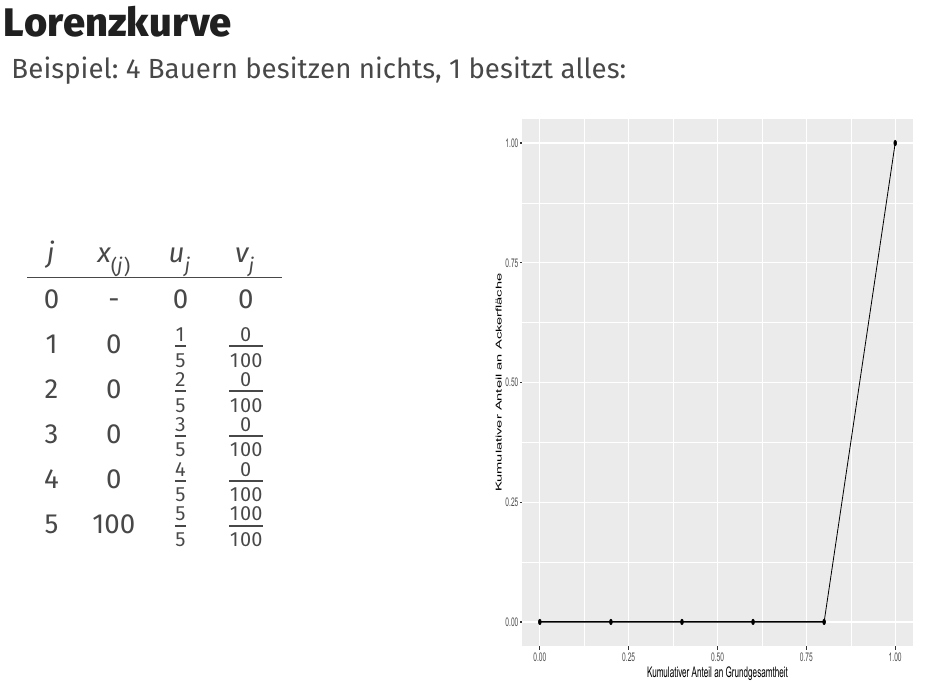

### Seite 76 - Lorenz 曲线的外观性质

Lorenz 曲线满足：

- 起点总是 $(0,0)$；
- 终点总是 $(1,1)$；
- 曲线总在对角线下方，极端情况下位于对角线上；
- 单调递增（monoton steigend）；
- 后一段斜率不小于前一段斜率，因为观测值已按升序排序。

### Seite 77 - Gini 系数（Gini-Koeffizient）

Gini 系数（Gini-Koeffizient）或 Lorenz 集中度指标（Lorenz'sches Konzentrationsmaß）描述集中程度：

$$
G=2F,
$$

其中 $F$ 是对角线与 Lorenz 曲线之间的面积。

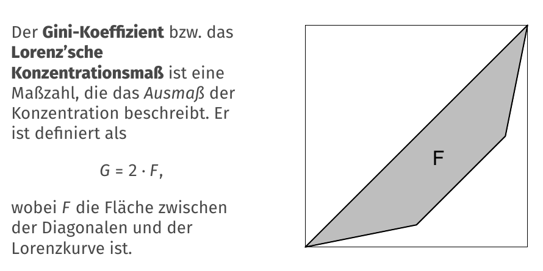

### Seite 78 - Gini 系数计算

按排序值计算：

$$
G=\frac{2\sum_{i=1}^{n}i x_{(i)}-(n+1)\sum_{i=1}^{n}x_{(i)}}{n\sum_{i=1}^{n}x_{(i)}}.
$$

或用 Lorenz 点：

$$
G=1-\frac{1}{n}\sum_{i=1}^{n}(v_{i-1}+v_i).
$$

取值范围：

$$
0\le G\le \frac{n-1}{n}.
$$

### Seite 79 - 标准化 Gini 系数（normierter Gini-Koeffizient）

标准化：

$$
G^+=\frac{n}{n-1}G.
$$

于是：

$$
0\le G^+\le 1.
$$

其中 0 表示无集中/完全均等（Gleichverteilung），1 表示完全集中/垄断（Monopol）。

### Seite 80 - Gini 系数性质

需要注意：

- 很不同的 Lorenz 曲线可能给出同一个 Gini 值，例如 $G=0.5$。
- 如果所有 $x$ 值乘以同一因子，Gini 不变，这叫对相对增长不敏感（unempfindlich gegen relatives Wachstum）。
- 对上端异常值敏感。
- 大总体中低 Gini 值更不容易出现，因为更大总体更可能包含极端高值。
- 在含负值的变量上也有人使用推广 Lorenz 曲线或 Gini，但此时单调性等性质可能不再成立。

### Seite 81 - Herfindahl 指数（Herfindahl-Index）

给定非负数据 $x_1,\ldots,x_n$，定义份额：

$$
p_i=\frac{x_i}{\sum_{j=1}^{n}x_j}.
$$

Herfindahl 指数：

$$
H=\sum_{i=1}^{n}p_i^2.
$$

取值范围：从 $1/n$（所有 $x_i$ 相同）到 1（Monopol）。

> [!tip] 直觉  
> Gini 通过 Lorenz 曲线看整体不平等；Herfindahl 更像“份额平方和”，大份额会被平方放大，因此常用于市场集中度。

### Seite 82 - 德国财富分布的 Lorenz 曲线

德国个人净财富（individuelle Nettovermögen）的 Lorenz 曲线显示财富高度集中，Gini 系数约为 0.77-0.80。

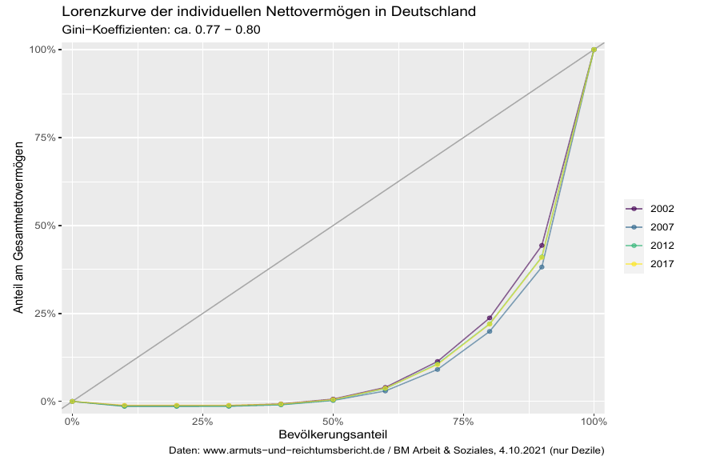

### Seite 83 - 德国财富 Gini 指数

来自德国贫困与财富报告（Armuts- & Reichtumsbericht, BM Arbeit & Soziales）的财富 Gini 指数示例。

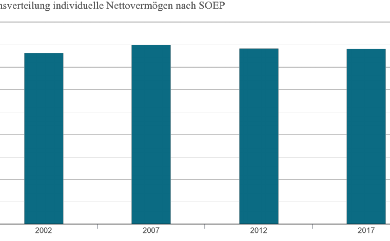

### Seite 84 - 德国收入 Gini 指数

来自同一来源的收入 Gini 指数示例。通常收入分布（Einkommensverteilung）的不平等程度低于财富分布（Vermögensverteilung）。

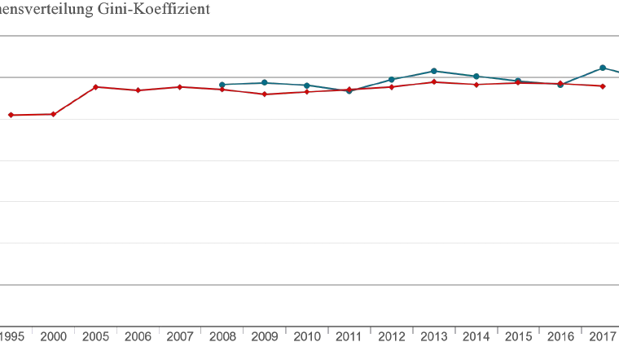

---

## 本章逻辑梳理

- **位置指标（Seite 1-24）：** Modus、Median、Quantil、Mittelwerte。
- **理论位置量（Seite 25-39）：** 随机变量的 Modus、Quantil、Erwartungswert。
- **离散程度（Seite 40-64）：** Range、IQR、Varianz、MAD。
- **形状与集中（Seite 65-84）：** Schiefe、Kurtosis、Lorenz、Gini、Herfindahl。

真正复习时，不要按页码零散背。先问本章在解决什么问题，再把每页放回上面的模块里：前面的页通常提出问题，中间的页给出工具，后面的页提醒适用边界或展示例子。

## 关键考核点

1. 会说明均值、中位数、众数各自表达的“中心”不同。
2. 会判断哪些指标对离群值稳健。
3. 会区分经验指标和随机变量的理论指标。
4. 会解释 Boxplot、Lorenz 曲线、Gini 和 Herfindahl 的读法。

## 本章公式清单

### 位置指标

| 序号 | 公式 | 使用场景 | 注意事项 |
| ---: | --- | --- | --- |
| 1 | $x_{(1)}\le\cdots\le x_{(n)}$ | 排序统计量。 | Median、Quantil、IQR 都依赖排序。 |
| 2 | $\tilde x=x_{((n+1)/2)}$ | 奇数样本量的中位数。 | 偶数样本量通常取中间两个的均值。 |
| 3 | $\bar x=\frac1n\sum_{i=1}^n x_i$ | 算术平均数。 | 对离群值敏感，适合度量数据。 |
| 4 | $x_p=F^{-1}(p)$ | 理论分位数。 | 由分布函数反推取值。 |

### 离散指标

| 序号 | 公式 | 使用场景 | 注意事项 |
| ---: | --- | --- | --- |
| 5 | $R=x_{max}-x_{min}$ | 极差。 | 极度受离群值影响。 |
| 6 | $IQR=Q_{0.75}-Q_{0.25}$ | 四分位距。 | 稳健，常配合 Boxplot。 |
| 7 | $s^2=\frac1{n-1}\sum_{i=1}^n(x_i-ar x)^2$ | 样本方差。 | 单位是原变量单位的平方。 |
| 8 | $s=\sqrt{s^2}$ | 样本标准差。 | 与原变量同单位。 |
| 9 | $v=\frac{s}{\bar x}$ | 变异系数。 | 均值接近 0 时不稳定。 |
| 10 | $MAD=median(\lvert x_i-median(x)\rvert)$ | Median Absolute Deviation。 | 稳健离散指标。 |

### 形状与集中

| 序号 | 公式 | 使用场景 | 注意事项 |
| ---: | --- | --- | --- |
| 11 | $\mu=E(X)$ | 期望值。 | 理论平均位置，要求存在。 |
| 12 | $Var(X)=E[(X-E(X))^2]$ | 随机变量方差。 | 理论离散程度。 |
| 13 | $\gamma_1=E\left[\left(\frac{X-\mu}{\sigma}\right)^3\right]$ | 偏度。 | 描述左右尾不对称。 |
| 14 | $\gamma_2=E\left[\left(\frac{X-\mu}{\sigma}\right)^4\right]$ | 峰度。 | 常用于尾部/极端值倾向。 |
| 15 | $G=1-2\int_0^1 L(p)\,dp$ | Gini 系数。 | 由 Lorenz 曲线下面积得到。 |
| 16 | $H=\sum_i a_i^2$ | Herfindahl 指数。 | 市场份额或集中度，份额越集中越大。 |

## 章节自测

- [x] 中位数通常比均值更抗离群值。
- [ ] 方差和原变量单位相同。
- [x] IQR 是第三四分位数减第一四分位数。
- [ ] Gini 系数越大表示越平均。

## 德语词汇表

| 德语 | 中文 | 使用场景 |
| --- | --- | --- |
| Lagemaß | 位置指标 | 中心/典型值 |
| Streuungsmaß | 离散指标 | 波动程度 |
| Median | 中位数 | 排序中间 |
| Quantil | 分位数 | 概率位置 |
| arithmetisches Mittel | 算术平均数 | 总量平衡点 |
| Varianz | 方差 | 平方偏离均值 |
| Standardabweichung | 标准差 | 方差平方根 |
| Schiefe | 偏度 | 不对称性 |
| Kurtosis | 峰度 | 尾部/峰形 |
| Lorenzkurve | Lorenz 曲线 | 集中度图形 |
| Gini-Koeffizient | Gini 系数 | 不平等程度 |

## C1 德语句式

| 序号 | 德语句式 | 中文翻译 | 适用场景 |
| ---: | --- | --- | --- |
| 1 | Lagemaße und Streuungsmaße sollten gemeinsam interpretiert werden, weil ein Zentrum ohne Streuung wenig aussagekräftig ist. | 位置指标和离散指标应当一起解释，因为只有中心而没有波动的信息量很低。 | 说明均值必须配标准差。 |
| 2 | Robuste Kennwerte verändern sich bei Ausreißern deutlich weniger als nicht robuste Kennwerte. | 稳健指标在出现离群值时变化明显小于非稳健指标。 | 解释 robust。 |
| 3 | Die Lorenzkurve beschreibt, welcher Anteil der Gesamtsumme auf welchen Anteil der Einheiten entfällt. | Lorenz 曲线描述一定比例的单位拥有总体总量的多少比例。 | 解释 Lorenz 曲线。 |
