# 第08章：重要的参数分布（Wichtige parametrische Verteilungen）

> 本章是“分布识别题”的核心：你要能根据随机过程（Zufallsvorgang）判断该用哪类分布（Verteilung），写出参数（Parameter）、支撑集（Träger）、概率函数/密度函数（Wahrscheinlichkeitsfunktion / Dichtefunktion），并知道常见近似（Approximation）什么时候成立。

## 章节知识树

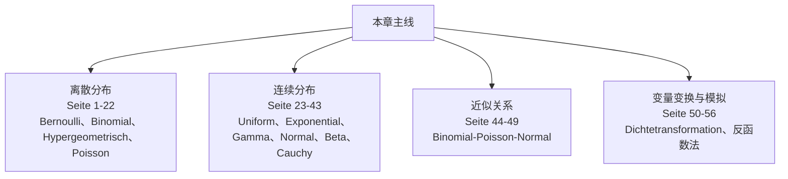
```mermaid
flowchart TD
  A["本章主线"]
  A --> M1["离散分布<br/>Seite 1-22<br/>Bernoulli、Binomial、Hypergeometrisch、Poisson"]
  A --> M2["连续分布<br/>Seite 23-43<br/>Uniform、Exponential、Gamma、Normal、Beta、Cauchy"]
  A --> M3["近似关系<br/>Seite 44-49<br/>Binomial-Poisson-Normal"]
  A --> M4["变量变换与模拟<br/>Seite 50-56<br/>Dichtetransformation、反函数法"]
```

## 学习路径

参数分布是常见随机过程的模板；看到场景关键词，要能匹配分布、参数、支撑集、期望方差和近似关系。

1. **离散分布：** Bernoulli、Binomial、Hypergeometrisch、Poisson（Seite 1-22）。
2. **连续分布：** Uniform、Exponential、Gamma、Normal、Beta、Cauchy（Seite 23-43）。
3. **近似关系：** Binomial-Poisson-Normal（Seite 44-49）。
4. **变量变换与模拟：** Dichtetransformation、反函数法（Seite 50-56）。

## 模块地图

| 模块 | 页码 | 核心问题 |
| --- | --- | --- |
| 离散分布 | Seite 1-22 | Bernoulli、Binomial、Hypergeometrisch、Poisson |
| 连续分布 | Seite 23-43 | Uniform、Exponential、Gamma、Normal、Beta、Cauchy |
| 近似关系 | Seite 44-49 | Binomial-Poisson-Normal |
| 变量变换与模拟 | Seite 50-56 | Dichtetransformation、反函数法 |

## 考试优先级

1. 会根据随机过程匹配分布，而不是只凭公式形状。
2. 会写常见分布的参数、支撑集、期望和方差。
3. 会区分有放回二项分布与无放回超几何分布。
4. 会判断 Poisson 近似和正态近似是否合理。

## 模块零：分布是随机过程的模板（Seite 1-3）

本章不是把一堆分布背成词典，而是训练识别：一个随机过程的机制是什么？有几次试验？是否放回？是否等待第一次成功？是否看固定时间内的次数？机制一变，分布就变。

### Seite 1 - 本章路线图

本章分三部分：

- 离散参数分布（diskrete parametrische Verteilungen）
- 连续参数分布（stetige parametrische Verteilungen）
- 密度变换定理（Dichtetransformationssatz）

**学习目标：** 看到“抽样是否放回、等待时间、事件次数、区间均匀、正态变换”等关键词时，迅速匹配分布。

### Seite 2 - 章节目录

目录再次说明本章顺序。离散部分先从 Bernoulli 到 Binomial，再到 Hypergeometrisch、Poisson；连续部分从 Uniform、Exponential、Gamma 到 Normal、Beta、Cauchy；最后讲随机变量变换后的密度。

**考点优先级：** 分布定义 > 参数含义 > 支撑集 > 期望方差 > 近似关系 > R 函数参数名。

### Seite 3 - 参数分布的意义

参数分布（parametrische Verteilungen）是一些常见随机过程（Zufallsvorgänge）的模型化形式。例如：

- 所有结果等可能：均匀分布（Gleichverteilung）
- 有/无放回抽样：二项分布（Binomialverteilung）或超几何分布（hypergeometrische Verteilung）
- 固定时间内事件次数：Poisson 分布（Poisson-Verteilung）
- 等待时间：指数分布（Exponentialverteilung）

参数（Parameter）描述具体场景，如成功概率 $\pi$、试验次数 $n$、事件率 $\lambda$。

## 模块一：离散分布处理可数结果（Seite 4-22）

Bernoulli 是一次成功/失败，Binomial 是固定次数独立重复，Hypergeometrisch 是无放回抽样，Poisson 是稀有事件计数。它们之间很像，但抽样方式和参数含义不能混。

### Seite 4 - Bernoulli 分布

Bernoulli 分布（Bernoulli-Verteilung）是最简单的离散分布。随机变量只取 `0` 或 `1`：

$$
P(X=1)=\pi,\quad P(X=0)=1-\pi,\quad X\sim \mathcal{B}(\pi)
$$

其中 `π ∈ [0,1]` 是唯一参数（Parameter）。例子：一次硬币投掷（Münzwurf），若正面记为 1，则公平硬币对应 `π=0.5`。

**关键词：** 成功/失败（Erfolg/Misserfolg）、指示变量（Indikatorvariable）、二值随机变量（binäre Zufallsvariable）。

### Seite 5 - 离散均匀分布

离散均匀分布（diskrete Gleichverteilung）用于有限支撑集 `T={x_1,...,x_k}` 上所有值等概率的情况：

$$
P(X=x)=\frac{1}{k}\cdot I(x\in T)
$$

若支撑集是自然数区间 `{a,...,b}`，常写作：

$$
X\sim \mathcal{U}(a,b)
$$

例子：公平骰子（fairer Würfelwurf）点数服从 `\mathcal{U}(1,6)`。R 中常用 `sample()` 模拟。

### Seite 6 - 几何分布：直到第一次成功的试验次数

几何分布（geometrische Verteilung）描述独立重复 Bernoulli 试验中，直到第一次事件 `A` 发生需要的试验次数。

若 `X` 表示“直到第一次成功的总试验次数”，则支撑集为 `ℕ+`，概率函数为：

$$
P(X=x)=(1-\pi)^{x-1}\pi,\quad x=1,2,\ldots
$$

其中 `π` 是每次成功概率（Erfolgswahrscheinlichkeit）。记作 `X\sim \mathcal{G}(\pi)`。

### Seite 7 - 几何分布的另一种定义

R 中几何分布常采用另一种定义：`Y` 表示第一次成功前的失败次数（Anzahl der Versuche bevor das erste Mal A eintritt），即：

$$
Y=X-1,\quad Y\in\{0,1,2,\ldots\}
$$

概率函数：

$$
P(Y=y)=(1-\pi)^y\pi
$$

R 函数：

- `dgeom(x, prob=π)`：概率函数（Wahrscheinlichkeitsfunktion）
- `pgeom(q, prob=π)`：分布函数（Verteilungsfunktion）
- `rgeom(n, prob=π)`：生成随机数
- `qgeom(p, prob=π)`：分位数（Quantil）

**误区：** 讲义定义的 `X` 和 R 的 `Y` 相差 1。

### Seite 8 - 几何分布可视化

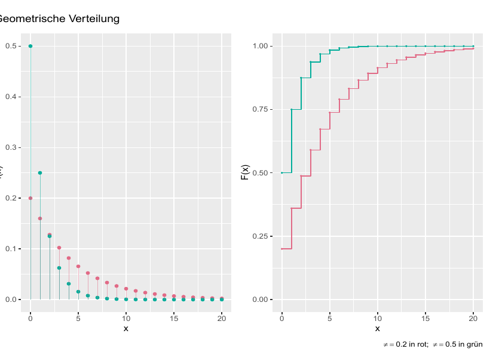

图中比较 `π=0.2` 与 `π=0.5`。成功概率越大，第一次成功越可能早发生，概率质量集中在小的 `x` 上，分布函数（Verteilungsfunktion）上升更快。

**判断题：**

- [x] `π` 越大，等待第一次成功的时间通常越短。
- [ ] 几何分布有固定上界。

### Seite 9 - 二项分布

二项分布（Binomialverteilung）描述 
` 次独立 Bernoulli 试验中成功次数：

$$
X=\sum_{i=1}^{n}X_i,\quad X_i\sim \mathcal{B}(\pi)
$$

概率函数：

$$
P(X=x)=\binom{n}{x}\pi^x(1-\pi)^{n-x},\quad x=0,\ldots,n
$$

记作 $X\sim \mathcal{B}(n,\pi)$。特殊情况：$\mathcal{B}(1,\pi)=\mathcal{B}(\pi)$。

R：`dbinom/pbinom/qbinom/rbinom(size=n, prob=π)`。

### Seite 10 - 二项分布可视化

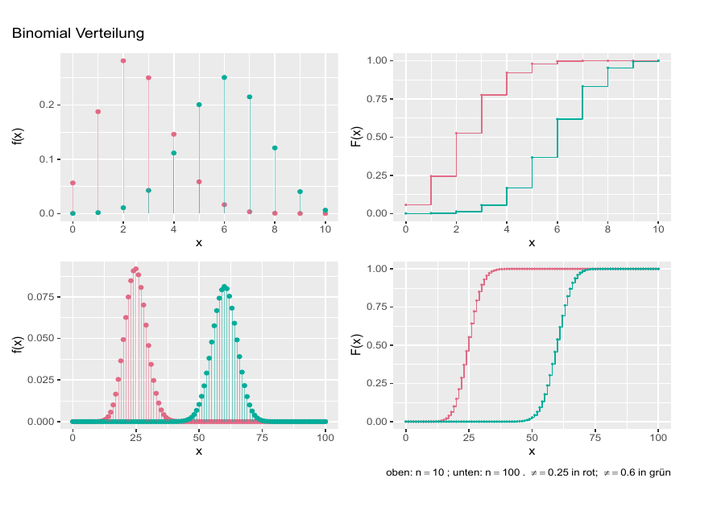

图中上方 
=10`、下方 
=100`。当 
` 增大时，取值范围扩大，分布形状更平滑；`π` 决定中心位置 
π`。

**考试关键词：** 独立重复试验（unabhängige Wiederholungen）、成功次数（Anzahl der Erfolge）、固定试验次数（feste Anzahl von Versuchen）。

### Seite 11 - 抽球模型：有放回抽样

本页用 urn model（Urnenmodell）解释二项分布：从含 `N` 个球、其中 `M` 个有标记的总体中，有放回（mit Zurücklegen）抽取 
` 次。

若 `X` 是样本中有标记球的数量，则每次成功概率恒为：

$$
\pi=\frac{M}{N}
$$

因此：

$$
X\sim \mathcal{B}\left(n,\frac{M}{N}\right)
$$

### Seite 12 - 超几何分布：无放回抽样

超几何分布（hypergeometrische Verteilung）用于无放回（ohne Zurücklegen）抽样。总体有 `N` 个对象，其中 `M` 个有标记，抽取 
` 个，`X` 表示抽到的有标记对象数量。

概率函数：

$$
P(X=x)=\frac{\binom{M}{x}\binom{N-M}{n-x}}{\binom{N}{n}}
$$

支撑集：

$$
x=\max(0,n-(N-M)),\ldots,\min(n,M)
$$

记作 $X\sim \mathcal{H}(n,N,M)$。R：`[dpqr]hyper(m=M, n=N-M, k=n, ...)`，注意 R 的参数名与讲义符号不同。

### Seite 13 - 有放回与无放回比较 I

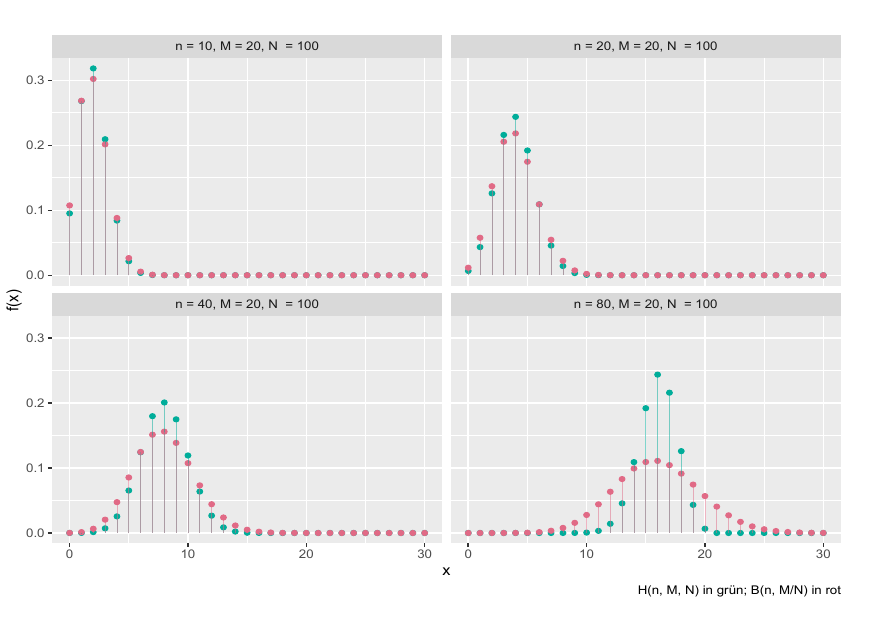

图中绿色为超几何分布 `H(n,M,N)`，红色为二项分布 `B(n,M/N)`。当抽样比例 
/N` 不小时，无放回会明显改变分布形状。

**直觉：** 无放回抽样让每次抽取后的成功概率改变，因此不再是独立同分布 Bernoulli 试验。

### Seite 14 - 有放回与无放回比较 II

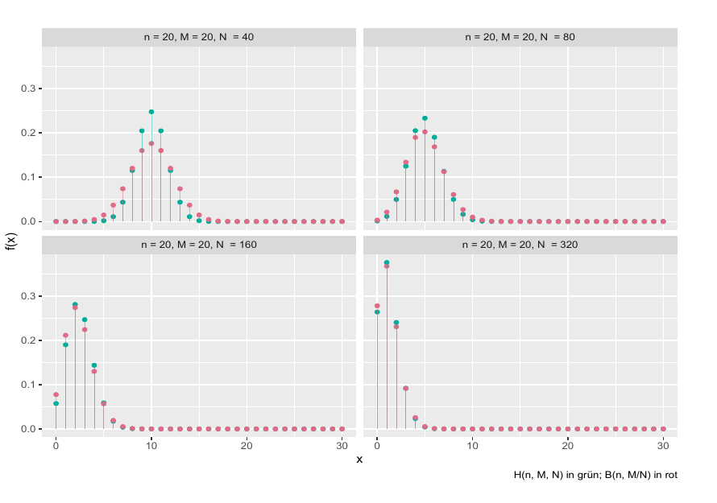

本页固定 
` 和 `M`，改变总体大小 `N`。当 `N` 越大、抽样比例越小，超几何分布越接近二项分布。

**考点：** “总体很大、样本相对很小”时，无放回近似为有放回。

### Seite 15 - 超几何分布的二项近似

当 `N` 大、
` 小时：

$$
\mathcal{H}(n,N,M)\approx \mathcal{B}\left(n,\pi=\frac{M}{N}\right)
$$

这是一个近似（Approximation），不是恒等。近似质量取决于抽样比例 
/N` 和总体大小 `N`。

### Seite 16 - Poisson 分布的应用场景

Poisson 分布（Poisson-Verteilung）用于固定时间/空间区间内事件次数，尤其是没有自然上界（keine natürliche obere Grenze）的计数过程。

例子：

- 呼叫中心每小时来电数
- Oberbayern 每周雷击次数

关键词：事件次数（Anzahl der Ereignisse）、时间区间（Zeitintervall）、事件率（Rate / Intensität）。

### Seite 17 - Poisson 分布定义

若 `X` 的支撑集为 $ℕ_0$，概率函数为：

$$
P(X=x)=\frac{\lambda^x e^{-\lambda}}{x!},\quad x=0,1,2,\ldots
$$

则 $X\sim \mathcal{P}(\lambda)$。参数 $λ>0$ 是平均率或强度（durchschnittliche Rate / Intensität）。

重要关系：若单位区间事件数服从 Poisson 分布，则事件间等待时间常与指数分布（Exponentialverteilung）相连。

### Seite 18 - Poisson 分布可视化

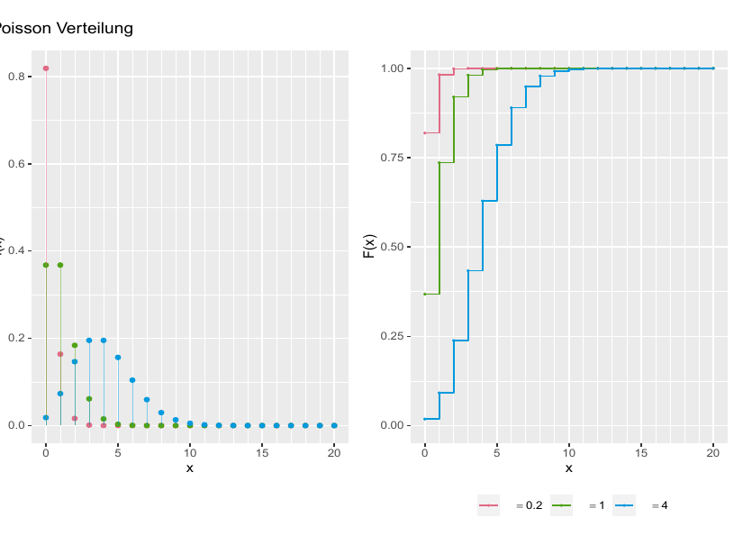

$λ$ 越大，分布中心越向右移动。Poisson 分布有一个重要性质：

$$
E(X)=\lambda,\quad Var(X)=\lambda
$$

**小测验：**

- [x] Poisson 分布适合建模固定时间区间内的事件次数。
- [ ] Poisson 分布的方差一定小于均值。

### Seite 19 - 二项分布的 Poisson 近似

当 
` 很大、`π` 很小，并且 `λ=nπ` 适中时：

$$
\mathcal{B}(n,\pi)\approx \mathcal{P}(\lambda=n\pi)
$$

这就是“稀有事件近似”（Approximation seltener Ereignisse）。

**判断口诀：** 试验很多、单次成功概率很小、只关心成功总数。

### Seite 20 - Binomial/Poisson 比较：n=10

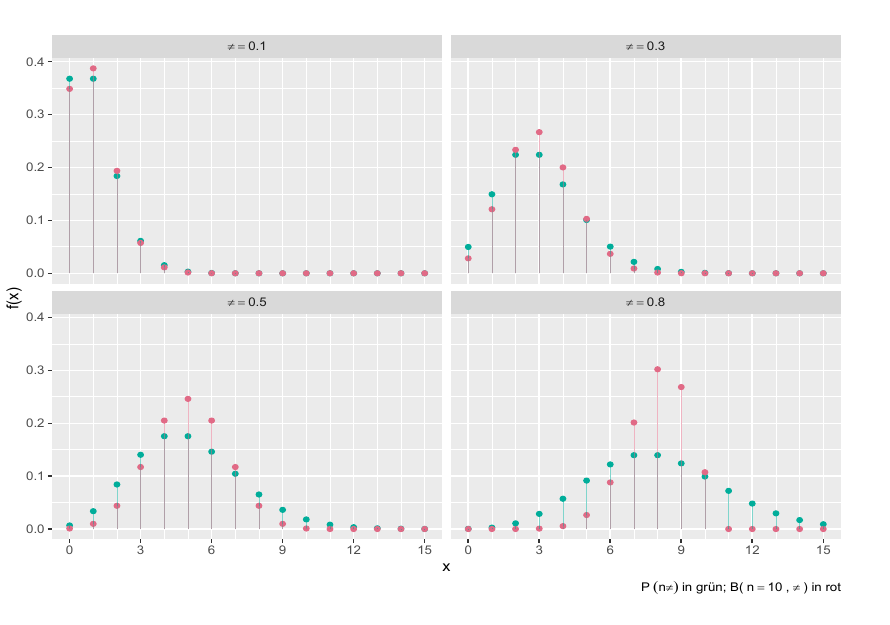

当 
=10` 时，近似质量有限。特别是 $π$ 较大时，Poisson 分布没有上界，而二项分布最大为 
`，两者形状差异明显。

**考点：** 不能只看 `λ=nπ`，还要看 `π` 是否足够小。

### Seite 21 - Binomial/Poisson 比较：n=100

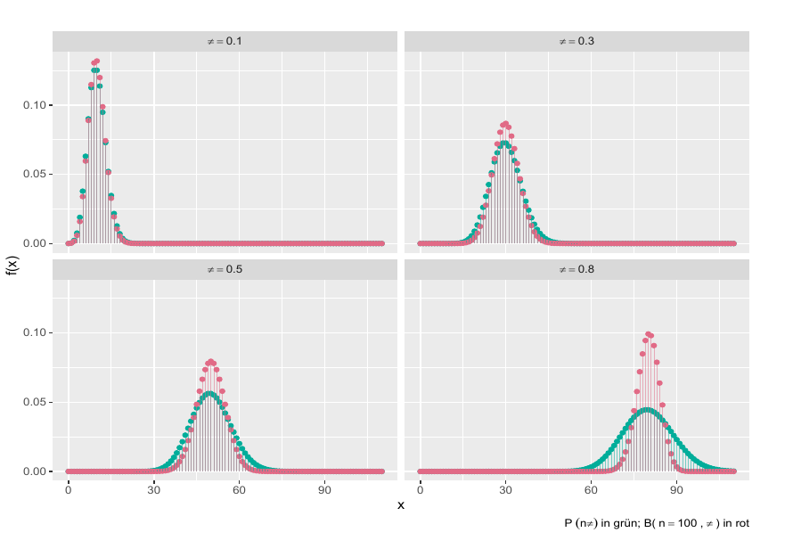

` 增大后，若 $π$ 不小，Poisson 近似仍可能不好。图中 $π=0.5$ 或 $π=0.8$ 时，二项分布具有明显有限上界结构，Poisson 不能很好匹配。

### Seite 22 - 小 π 时近似改善

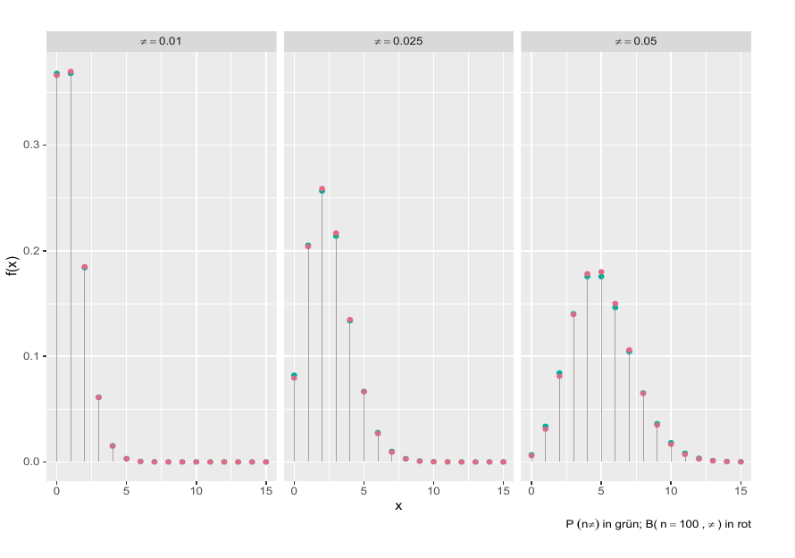

本页展示 
=100` 且 `π=0.01,0.025,0.05`。`π` 越小，Poisson 近似越好。

**考试表述：**  
`Die Poisson-Approximation ist besonders geeignet für großes n und kleines π bei λ=nπ.`

## 模块二：连续分布处理区间和密度（Seite 23-43）

连续分布不再给单点概率，而是用密度下面积。均匀分布强调区间等可能，指数分布看等待时间，Gamma 扩展等待时间，正态分布是中心极限定理的核心形状。

### Seite 23 - 离散分布汇总

本页汇总离散分布（diskrete Verteilungen）的参数、支撑集、期望和方差：

| 分布 | 记号 | 典型场景 | 期望 | 方差 |
|---|---|---|---:|---:|
| Bernoulli | `B(π)` | 一次成功/失败 | `π` | `π(1-π)` |
| Binomial | `B(n,π)` | n 次独立成功次数 | 
π` | 
π(1-π)` |
| Geometrisch | `G(π)` | 等到第一次成功 | 依定义不同 | 依定义不同 |
| Poisson | `P(λ)` | 固定区间事件数 | `λ` | `λ` |
| Hypergeometrisch | `H(n,N,M)` | 无放回抽样 | 
M/N` | 有有限总体修正 |

**注意：** 几何分布的期望方差取决于从 1 计数还是从 0 计数。

### Seite 24 - 转入连续参数分布

本页是章节切换：从离散参数分布（diskrete parametrische Verteilungen）转向连续参数分布（stetige parametrische Verteilungen）。

连续分布通常用密度函数（Dichtefunktion）和支撑集（Träger）描述，而不是点概率。

### Seite 25 - 连续分布的描述方式

连续随机变量（stetige Zufallsvariable）的单点概率通常为 0：

$$
P(X=x)=0
$$

因此我们使用密度函数 $f(x)$ 与积分计算区间概率：

$$
P(a\le X\le b)=\int_a^b f(x)\,dx
$$

本章会给出各分布的密度函数（Dichtefunktion）和支撑集（Träger）。

### Seite 26 - 连续均匀分布

连续均匀分布（stetige Gleichverteilung）在区间 `[a,b]` 上密度恒定：

$$
f(x)=\frac{1}{b-a},\quad x\in[a,b]
$$

支撑集为 $T=[a,b]$，记作：

$$
X\sim \mathcal{U}[a,b]
$$

R：`[dpqr]unif(min=a, max=b)`。

### Seite 27 - 指数分布

指数分布（Exponentialverteilung）用于非负等待时间（Wartezeit）：

$$
f(x)=\lambda e^{-\lambda x},\quad x\ge 0
$$

分布函数：

$$
F(x)=1-e^{-\lambda x},\quad x\ge 0
$$

记作 $X\sim \mathcal{E}(\lambda)$。若事件数服从 Poisson 过程，事件间等待时间常服从指数分布。

### Seite 28 - 指数分布可视化

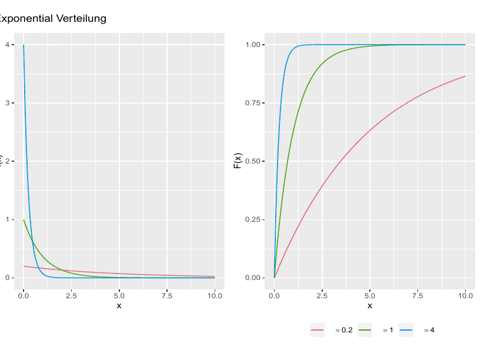

$λ$ 是 rate（Rate），不是 scale。$λ$ 越大，等待时间越短，密度越集中在 0 附近。

$$
E(X)=\frac{1}{\lambda},\quad Var(X)=\frac{1}{\lambda^2}
$$

### Seite 29 - Gamma 分布

Gamma 分布（Gammaverteilung）是指数分布的推广。参数通常为形状（shape）$α$ 与率（rate）$β$：

$$
f(x)=\frac{\beta^\alpha}{\Gamma(\alpha)}x^{\alpha-1}e^{-\beta x},\quad x>0
$$

记作 $X\sim \mathcal{G}(\alpha,\beta)$。Gamma 函数（Gammafunktion）满足：

$$
\Gamma(x+1)=x!\quad \text{for integer }x
$$

R：`[dpqr]gamma(shape=α, rate=β)`。

### Seite 30 - Gamma 分布可视化：改变 rate

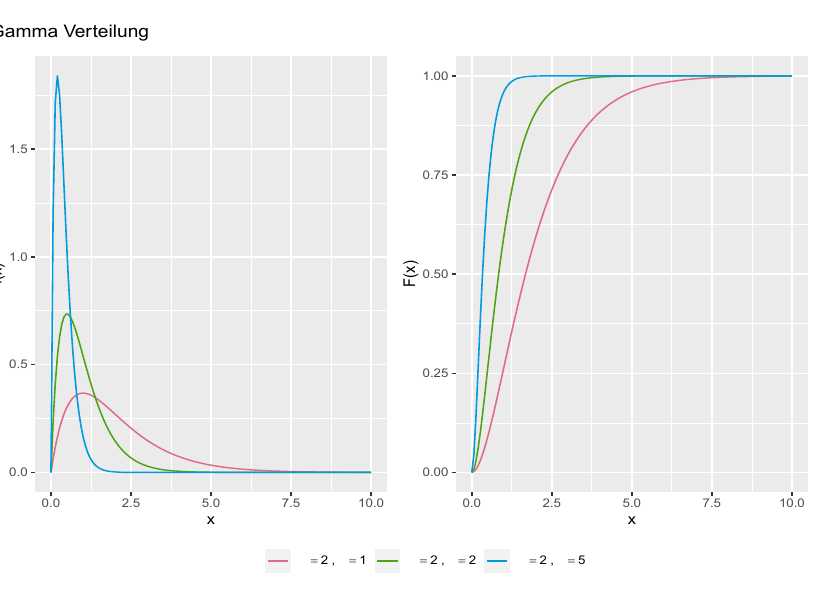

本页固定 $α=2$，改变 $β$。$β$ 越大，分布越向 0 附近压缩，等待量或总时间更小。

**参数直觉：** $α$ 控制形状，$β$ 控制速率/尺度方向。

### Seite 31 - Gamma 分布可视化：α 小于 1

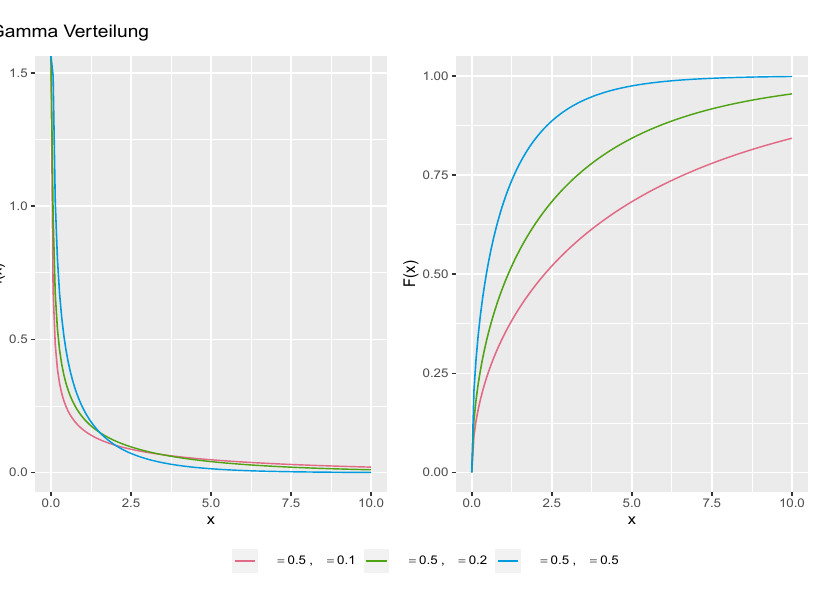

当 $α<1$ 时，密度在 0 附近可能非常高，右尾较长。图中展示 $α=0.5$ 且不同 $β$ 的形状。

### Seite 32 - Gamma 分布可视化：形状差异

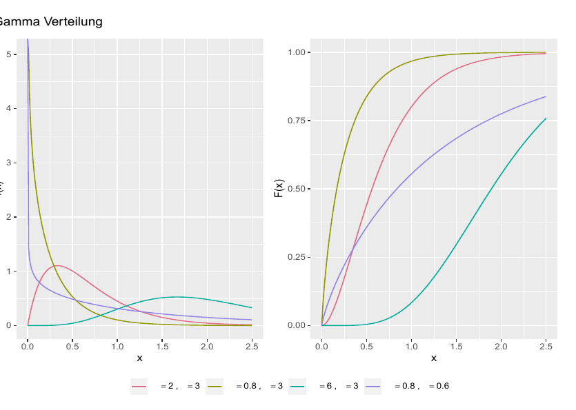

本页同时改变 $α$ 与 $β$，展示 Gamma 分布形状的灵活性：可以右偏、靠近 0、单峰，也可以较平滑。

**考试提示：** Gamma 分布支撑集为正实数，常用于时间、寿命、等待总量。

### Seite 33 - Gamma、指数与 Chi-Quadrat

Gamma 分布包含几个重要特例：

$$
\mathcal{E}(\lambda)\equiv \mathcal{G}(\alpha=1,\beta=\lambda)
$$

Chi-square 分布（Chi-Quadrat-Verteilung）也是 Gamma 分布特例：

$$
\chi^2(d)\equiv \mathcal{G}\left(\alpha=\frac{d}{2},\beta=\frac{1}{2}\right)
$$

R：`[dpqr]chisq(df=d)`。

### Seite 34 - 正态分布

正态分布（Normalverteilung）定义在全实数 $ℝ$ 上：

$$
f(x)=\frac{1}{\sqrt{2\pi\sigma^2}}\exp\left(-\frac{(x-\mu)^2}{2\sigma^2}\right)
$$

记作：

$$
X\sim \mathcal{N}(\mu,\sigma^2)
$$

$μ$ 是均值（Erwartungswert），$σ²$ 是方差（Varianz）。标准正态分布（Standardnormalverteilung）为 `N(0,1)`。

**R 注意：** 
`norm(..., mean=μ, sd=σ)` 用标准差 `sd`，不是方差。

### Seite 35 - 正态分布可视化

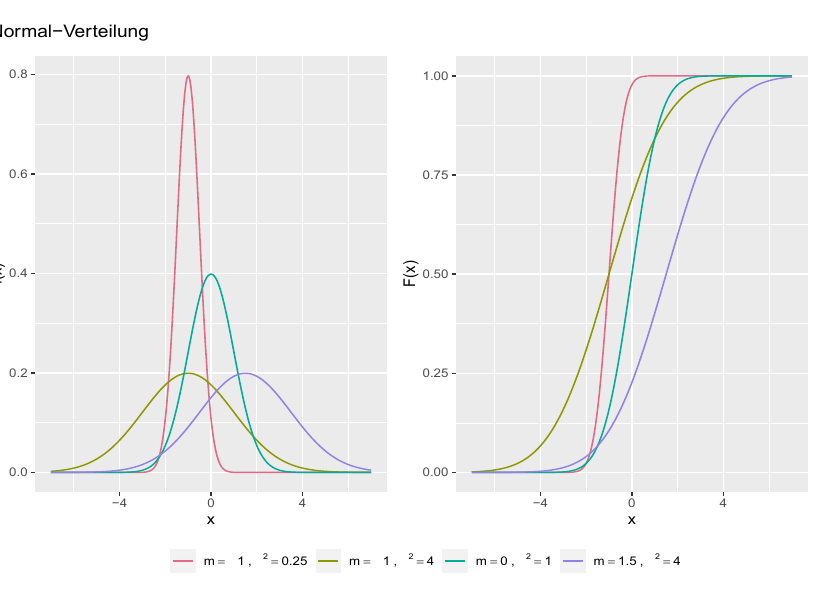

`μ` 控制位置（Lage），`σ²` 控制离散程度（Streuung）。方差越大，钟形曲线（Gaußsche Glockenkurve）越宽、峰越低。

### Seite 36 - 正态分布的封闭性

正态分布有重要性质：

$$
X\sim N(\mu,\sigma^2)\Rightarrow a+bX\sim N(a+b\mu,b^2\sigma^2)
$$

独立正态变量的和仍正态：

$$
X_i\sim N(\mu_i,\sigma_i^2)\Rightarrow \sum_i X_i\sim N\left(\sum_i\mu_i,\sum_i\sigma_i^2\right)
$$

注意：方差相加通常需要独立性（Unabhängigkeit）。正态密度的积分没有初等闭式，需要数值方法或误差函数（error function）。

### Seite 37 - Beta 分布

Beta 分布（Betaverteilung）定义在 `(0,1)` 上：

$$
f(x)=\frac{1}{B(\alpha,\beta)}x^{\alpha-1}(1-x)^{\beta-1},\quad 0<x<1
$$

记作 `X\sim \mathcal{Be}(\alpha,\beta)`。Beta 函数（Betafunktion）用于归一化，使密度积分为 1。

常见用途：比例、概率参数、占比（Anteil / Wahrscheinlichkeit）。

### Seite 38 - Beta 分布可视化

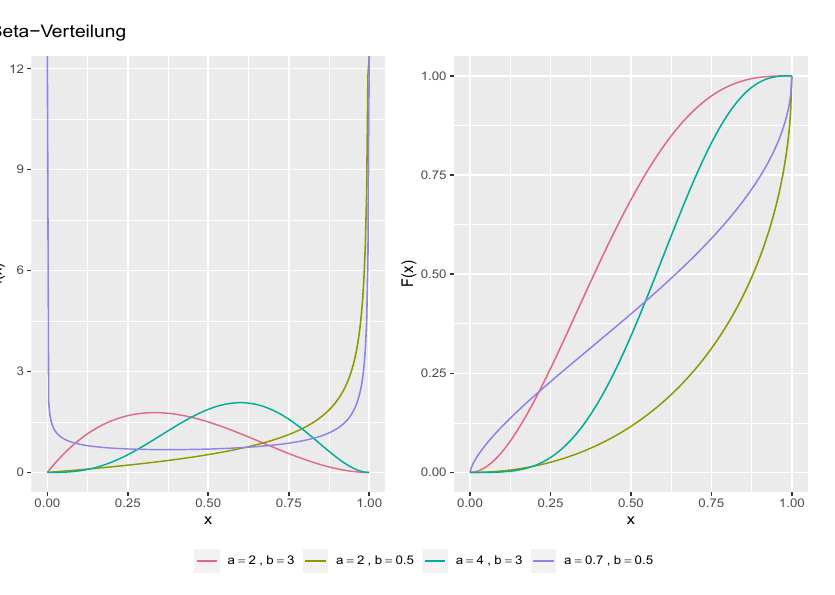

Beta 分布非常灵活：可偏向 0、偏向 1、单峰、U 型。因为支撑集是 `(0,1)`，它很适合描述概率或比例型变量。

### Seite 39 - Cauchy 分布

Cauchy 分布（Cauchy-Verteilung）定义在 `ℝ` 上：

$$
f(x)=\frac{1}{\pi(1+x^2)},\quad F(x)=\frac{1}{2}+\frac{1}{\pi}\arctan(x)
$$

记作 `X\sim \mathcal{C}`。它有重尾（heavy tails），极端值概率远高于正态分布。

**重要：** Cauchy 分布的期望、方差和高阶矩通常不存在。

### Seite 40 - Cauchy 与 Normal 比较

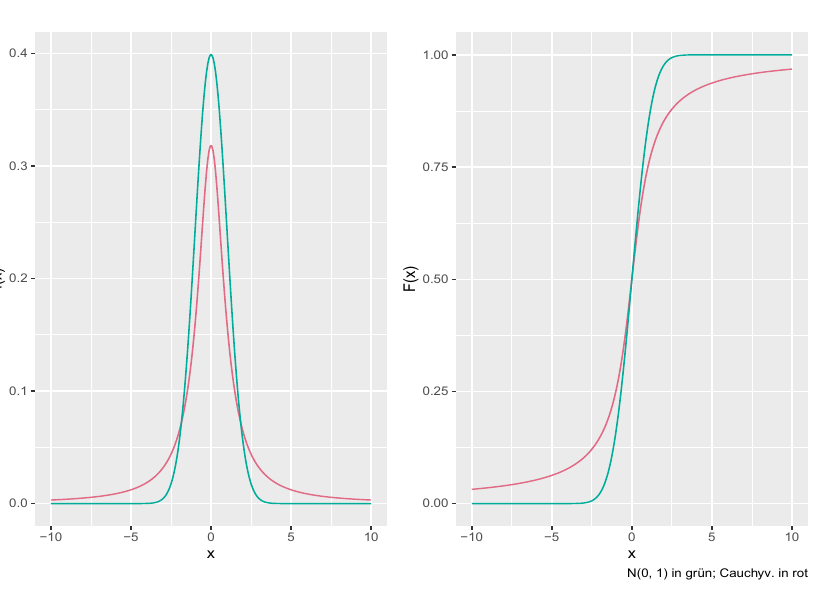

图中 Cauchy 分布尾部更厚，中心附近形状也不同。它常用于提醒：不是所有连续分布都有期望和方差。

**小测验：**

- [x] Cauchy 分布有重尾。
- [ ] 所有连续分布都有有限方差。

### Seite 41 - 连续分布汇总

本页总结连续分布：

| 分布 | 记号 | 支撑集 | 典型用途 |
|---|---|---|---|
| Stetige Gleichverteilung | `U[a,b]` | `[a,b]` | 区间等可能 |
| Exponentialverteilung | `E(λ)` | `ℝ_+` | 等待时间 |
| Gammaverteilung | `G(α,β)` | `ℝ_+` | 等待总量、寿命 |
| Normalverteilung | `N(μ,σ²)` | `ℝ` | 加性误差、中心极限定理 |
| Betaverteilung | `Be(α,β)` | `(0,1)` | 比例、概率 |
| Cauchy-Verteilung | `C` | `ℝ` | 重尾例子 |

### Seite 42 - 转入密度变换

本页切换到密度变换定理（Dichtetransformationssatz）。问题是：如果 `X` 有已知密度，`Y=g(X)` 的密度是什么？

这在生成随机数、变量标准化、平方变换等任务中很重要。

### Seite 43 - Dichtetransformationssatz

本节主题：随机变量变换后的密度。核心思想是概率质量守恒（Erhaltung der Wahrscheinlichkeit）：变换不会创造或消灭概率，只会拉伸或压缩区间。

## 模块三：近似关系减少计算负担（Seite 44-49）

当 $n$ 大、$p$ 小，二项可近似 Poisson；当样本量大或参数合适，很多离散分布可近似正态。考试常问的不是只算，而是判断近似条件是否合理。

### Seite 44 - 变换直觉一

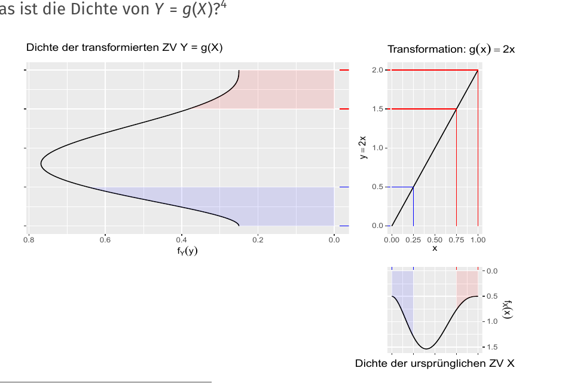

图中展示 `Y=g(X)` 的变换。若某段 `X` 区间被压缩到较短的 `Y` 区间，则为了保持同样概率，`Y` 上的密度必须变大。

关键词：变换（Transformation）、逆函数（Umkehrfunktion）、导数修正（Ableitungskorrektur）。

### Seite 45 - 变换直觉二

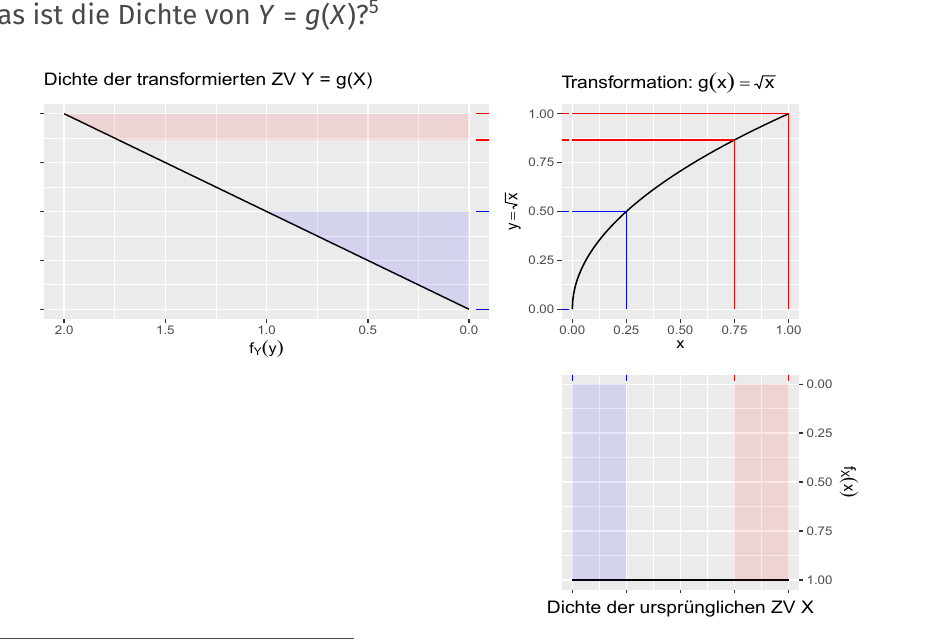

本页展示另一种变换形状。核心仍是区间长度改变导致密度高度改变。密度变换公式中的绝对导数项就是这种长度变化的校正。

### Seite 46 - 变换直觉三

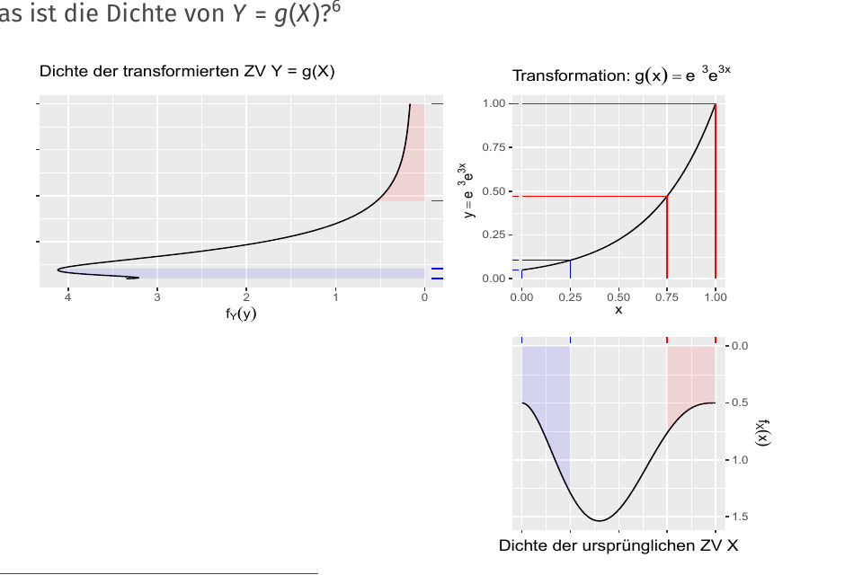

当变换函数弯曲较强时，不同区域的拉伸/压缩程度不同，变换后密度形状会明显改变。

**图形考点：** 斜率小的地方容易“堆积”密度；斜率大的地方密度被摊薄。

### Seite 47 - 密度变换定理公式

若 `X` 是连续随机变量，密度为 `f_X`，`Y=g(X)`，且 `g` 严格单调并可微，则：

$$
f_Y(y)=f_X(g^{-1}(y))\cdot \left|(g^{-1})'(y)\right|
$$

支撑集也要变换：

$$
T_Y=g(T_X)
$$

**考试必写两件事：** 逆函数 `g^{-1}` 和 Jacobian/导数绝对值（Betrag der Ableitung）。

### Seite 48 - 公式直觉：为什么有导数项

概率守恒要求：

$$
P(X\in[a,b])=P(Y\in[g(a),g(b)])
$$

若 `g` 的斜率很小，`X` 中长区间映到 `Y` 中短区间，`Y` 密度必须变大；若斜率很大，密度变小。

因此公式中出现：

$$
\left|(g^{-1})'(y)\right|
$$

它是“区间长度修正项”（Längenkorrektur）。

### Seite 49 - 线性变换例子

若：

$$
Y=aX+b,\quad a\ne 0
$$

则：

$$
g^{-1}(y)=\frac{y-b}{a},\quad |(g^{-1})'(y)|=\frac{1}{|a|}
$$

所以：

$$
f_Y(y)=\frac{1}{|a|}f_X\left(\frac{y-b}{a}\right)
$$

这是标准化和尺度变换的基本公式。

## 模块四：变量变换和反函数法让分布动起来（Seite 50-56）

如果 $Y=g(X)$，分布会随函数变换改变。反函数法则反过来：从均匀随机数出发，生成目标分布的随机数。

### Seite 50 - 标准正态平方得到 Chi-square

若 `X\sim N(0,1)`，则：

$$
Y=X^2\sim \chi^2(1)
$$

直觉：正态变量平方后支撑集变成 `ℝ_+`，密度是 Gamma 分布的特例：

$$
\chi^2(1)\equiv G(1/2,1/2)
$$

**注意：** 平方函数不是全域单调，讲义先考虑 `Z=|X|` 再变换，避免直接套单调公式出错。

### Seite 51 - 用均匀分布生成指数分布

若 `X\sim U[0,1]`，令：

$$
Y=-\log(X)
$$

则 `Y\sim E(1)`。更一般地：

$$
Y=-\frac{1}{\lambda}\log(X)\sim E(\lambda)
$$

这是反函数法（Inversionsmethode）生成指数随机数的基础。

### Seite 52 - 反函数法

反函数法（Inversions-Methode）用于从任意连续分布生成随机数：

1. 生成 `U_i\sim U[0,1]`。
2. 计算 `X_i=F^{-1}(U_i)`。
3. 则 `X_i` 服从目标分布函数 `F`。

核心依据：若 `U=F(X)`，则 `U` 服从 `[0,1]` 上的均匀分布；反过来用 `F^{-1}` 可生成 `X`。

### Seite 53 - 反函数法：指数分布

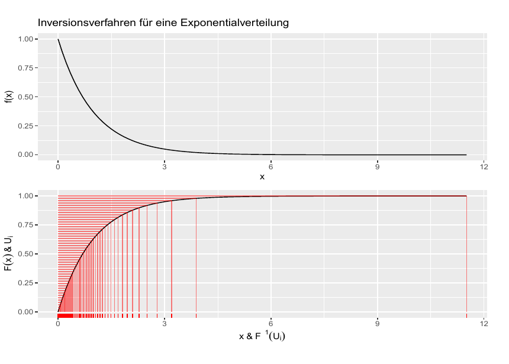

图中横向均匀生成 `U_i`，通过 `F^{-1}` 映射到指数分布的随机数。密度较高的区域会对应更密集的样本点。

### Seite 54 - 反函数法：正态分布

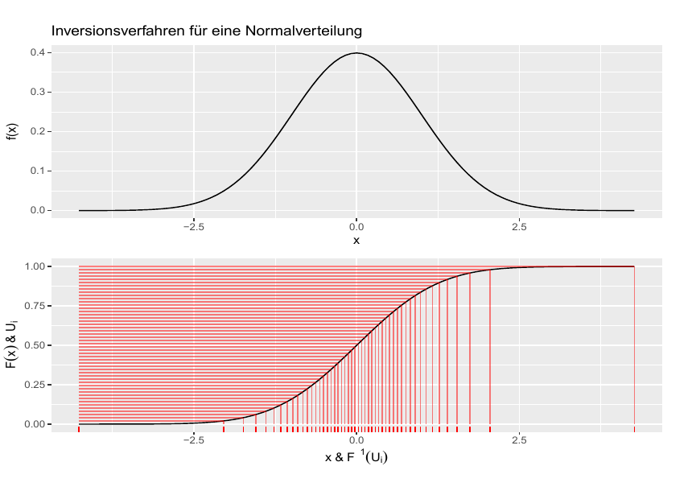

正态分布也可以用 `F^{-1}(U)` 生成，但正态分布函数没有简单闭式，实际软件用数值算法近似分位数函数（Quantilsfunktion）。

### Seite 55 - 反函数法：双峰密度

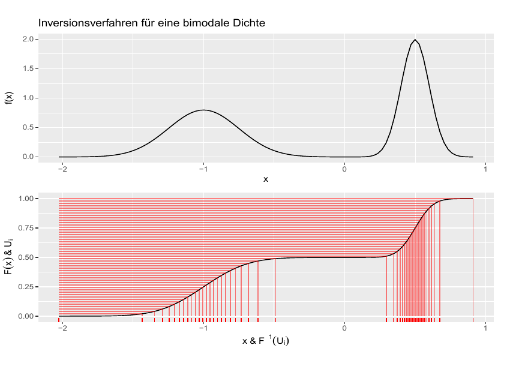

即使密度是双峰的（bimodale Dichte），只要分布函数 `F` 单调，仍可用反函数法。密度高的两个区域会得到更多随机数。

### Seite 56 - 用反函数法生成 Cauchy 随机数

Cauchy 分布函数为：

$$
F(x)=\frac{1}{2}+\frac{1}{\pi}\arctan(x)
$$

反函数为：

$$
F^{-1}(u)=\tan\left(\pi(u-\frac{1}{2})\right)
$$

因此若 `U_i\sim U[0,1]`，则：

$$
X_i=\tan\left(\pi(U_i-\frac{1}{2})\right)
$$

服从 Cauchy 分布。

## 本章逻辑梳理

- **离散分布（Seite 1-22）：** Bernoulli、Binomial、Hypergeometrisch、Poisson。
- **连续分布（Seite 23-43）：** Uniform、Exponential、Gamma、Normal、Beta、Cauchy。
- **近似关系（Seite 44-49）：** Binomial-Poisson-Normal。
- **变量变换与模拟（Seite 50-56）：** Dichtetransformation、反函数法。

真正复习时，不要按页码零散背。先问本章在解决什么问题，再把每页放回上面的模块里：前面的页通常提出问题，中间的页给出工具，后面的页提醒适用边界或展示例子。

## 关键考核点

1. 会根据随机过程匹配分布，而不是只凭公式形状。
2. 会写常见分布的参数、支撑集、期望和方差。
3. 会区分有放回二项分布与无放回超几何分布。
4. 会判断 Poisson 近似和正态近似是否合理。

## 本章公式清单

### 离散分布

| 序号 | 公式 | 使用场景 | 注意事项 |
| ---: | --- | --- | --- |
| 1 | $P(X=1)=\pi,\ P(X=0)=1-\pi$ | Bernoulli 分布。 | 一次成功/失败。 |
| 2 | $P(X=k)=\binom nk\pi^k(1-\pi)^{n-k}$ | 二项分布。 | 固定 $n$ 次独立同分布 Bernoulli。 |
| 3 | $P(X=k)=\frac{\binom Mk\binom{N-M}{n-k}}{\binom Nn}$ | 超几何分布。 | 无放回抽样。 |
| 4 | $P(X=k)=e^{-\lambda}\frac{\lambda^k}{k!}$ | Poisson 分布。 | 固定区间内事件次数。 |

### 连续分布

| 序号 | 公式 | 使用场景 | 注意事项 |
| ---: | --- | --- | --- |
| 5 | $f(x)=\frac1{b-a},\ a\le x\le b$ | 连续均匀分布。 | 区间内密度常数。 |
| 6 | $f(x)=\lambda e^{-\lambda x},\ x\ge0$ | 指数分布。 | 等待时间，无记忆性。 |
| 7 | $f(x)=\frac{\lambda^\alpha}{\Gamma(\alpha)}x^{\alpha-1}e^{-\lambda x}$ | Gamma 分布。 | 多个等待时间之和。 |
| 8 | $f(x)=\frac1{\sqrt{2\pi}\sigma}e^{-\frac{(x-\mu)^2}{2\sigma^2}}$ | 正态分布。 | 中心极限定理与误差模型核心。 |

### 近似与变换

| 序号 | 公式 | 使用场景 | 注意事项 |
| ---: | --- | --- | --- |
| 9 | $Bin(n,\pi)\approx Pois(n\pi)$ | 二项到 Poisson 近似。 | $n$ 大、$\pi$ 小且 $n\pi$ 适中。 |
| 10 | $\frac{X-\mu}{\sigma}\sim N(0,1)$ | 正态标准化。 | 用于查标准正态表。 |
| 11 | $f_Y(y)=f_X(g^{-1}(y))\left\lvert\frac{d}{dy}g^{-1}(y)\right\rvert$ | 一维单调变换密度。 | 必须乘 Jacobian 绝对值。 |
| 12 | $X=F^{-1}(U),\ U\sim U(0,1)$ | 反函数法模拟。 | 要求能处理分布函数反函数。 |

## 章节自测

- [x] 无放回抽样通常对应超几何分布。
- [x] Poisson 分布常用于固定区间内事件次数。
- [x] 指数分布用于描述连续等待时间。
- [ ] Cauchy 分布有有限期望和方差。

## 德语词汇表

| 德语 | 中文 | 使用场景 |
| --- | --- | --- |
| Bernoulli-Verteilung | Bernoulli 分布 | 一次成功/失败 |
| Binomialverteilung | 二项分布 | 有放回/独立重复 |
| hypergeometrische Verteilung | 超几何分布 | 无放回抽样 |
| Poisson-Verteilung | Poisson 分布 | 事件计数 |
| Exponentialverteilung | 指数分布 | 等待时间 |
| Normalverteilung | 正态分布 | 钟形分布 |
| Dichtetransformationssatz | 密度变换定理 | 变量变换 |
| Inverse-Transformations-Methode | 反函数法 | 随机数生成 |

## C1 德语句式

| 序号 | 德语句式 | 中文翻译 | 适用场景 |
| ---: | --- | --- | --- |
| 1 | Die Wahl der Verteilung sollte aus dem zugrunde liegenden Zufallsmechanismus abgeleitet werden. | 分布的选择应当从底层随机机制推出。 | 解释分布识别。 |
| 2 | Die hypergeometrische Verteilung modelliert Ziehen ohne Zurücklegen, während die Binomialverteilung unabhängige Wiederholungen voraussetzt. | 超几何分布刻画无放回抽样，而二项分布假设独立重复。 | 区分两者。 |
| 3 | Bei Transformationen stetiger Zufallsvariablen muss die Änderung der Skala durch den Jacobi-Faktor berücksichtigt werden. | 连续随机变量变换时必须用 Jacobi 因子考虑尺度变化。 | 解释密度变换。 |
