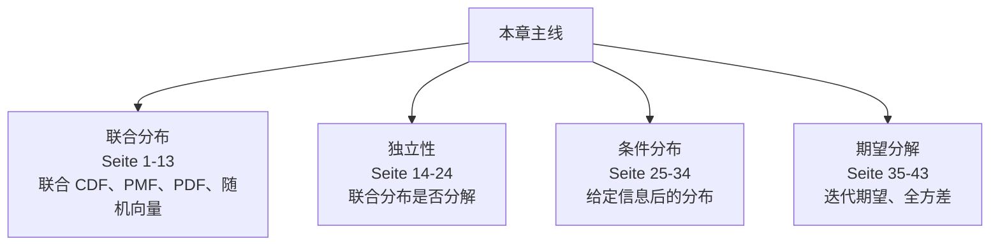
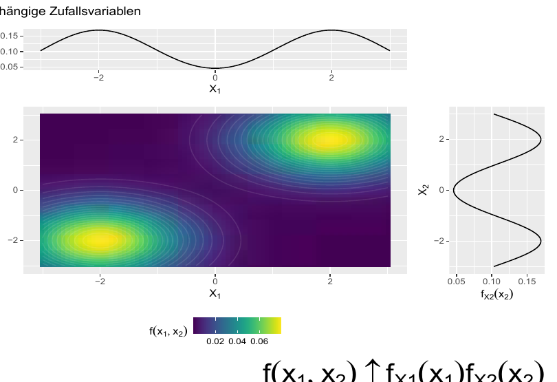
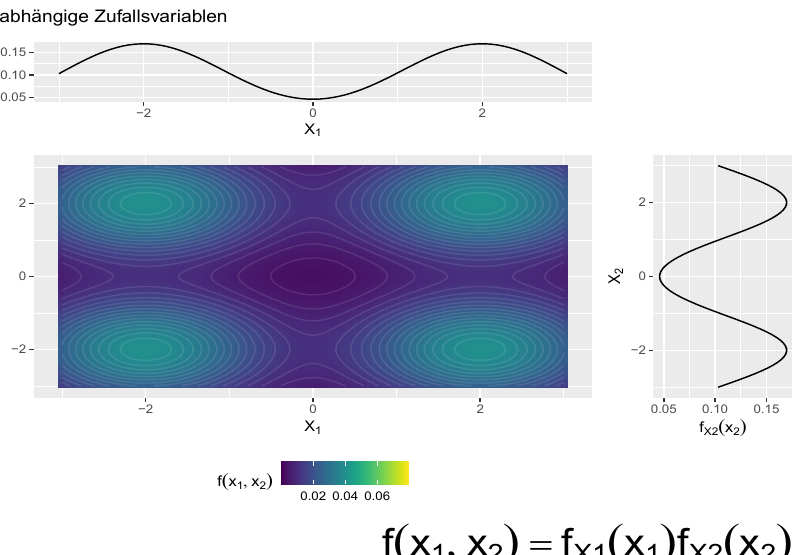
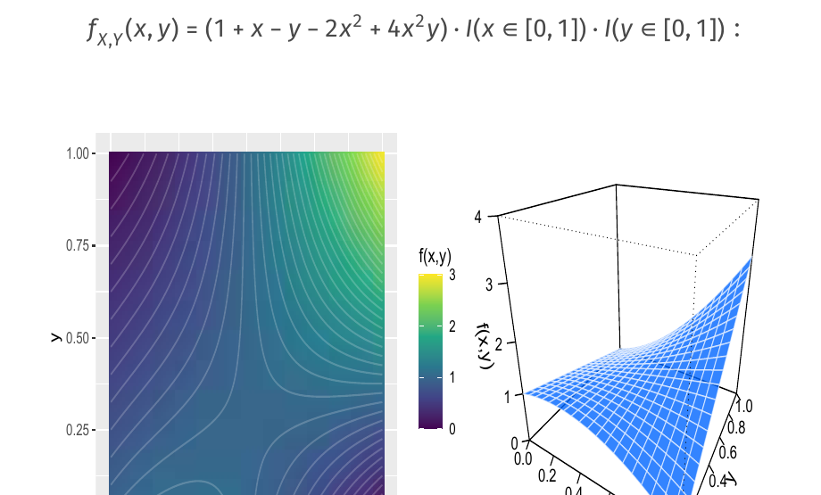
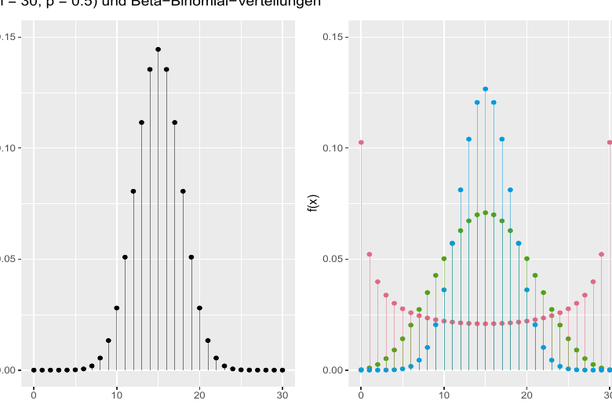

# 第 9 章：随机向量与多变量分布（Zufallsvektoren & multivariate Verteilungen）

> 来源：`分章节讲义/09_Zufallsvektoren & multivariate Verteilungen.pdf`  
> 原讲义页码：S. 457-499，共 43 页  
> 图片目录：`assets/`  
> 核心主线：本章从一维随机变量扩展到随机向量（Zufallsvektor），学习联合分布（gemeinsame Verteilung）、边际分布（Randverteilung）、独立性（stochastische Unabhängigkeit）、卷积（Faltung）、条件分布（bedingte Verteilung）和条件矩（bedingte Momente）。

---

## 章节知识树

## 学习路径

多维随机变量把多个随机量放进同一个概率结构中，核心问题是联合分布、边际分布、条件分布和独立性如何互相推出。

1. **联合分布：** 联合 CDF、PMF、PDF、随机向量（Seite 1-13）。
2. **独立性：** 联合分布是否分解（Seite 14-24）。
3. **条件分布：** 给定信息后的分布（Seite 25-34）。
4. **期望分解：** 迭代期望、全方差（Seite 35-43）。

## 模块地图

| 模块 | 页码 | 核心问题 |
| --- | --- | --- |
| 联合分布 | Seite 1-13 | 联合 CDF、PMF、PDF、随机向量 |
| 独立性 | Seite 14-24 | 联合分布是否分解 |
| 条件分布 | Seite 25-34 | 给定信息后的分布 |
| 期望分解 | Seite 35-43 | 迭代期望、全方差 |

## 考试优先级

1. 会从联合分布推出边际分布。
2. 会用分解条件判断独立性。
3. 会计算和解释条件分布。
4. 会用迭代期望和全方差解释分层结构。

## 模块零：从一个随机变量扩展到多个随机变量（Seite 1-13）

现实里变量很少单独出现。收入和教育、身高和体重、多个类别计数都需要放在一个联合概率结构里。联合分布告诉我们变量如何一起取值，边际分布告诉我们只看其中一个变量时会怎样。

### Seite 1 - 目录

本章内容：

- Zufallsvektoren
- Zufallsvariablen 的随机独立性
- Faltungen
- 条件分布与密度
- 条件矩

### Seite 2 - 目录重复页

本页再次列出章节结构。

### Seite 3 - 联合分布函数（gemeinsame Verteilungsfunktion）

两个随机变量 $X,Y$ 的联合分布函数：

$$
F_{X,Y}(x,y):=P(X\le x\wedge Y\le y)
=P(\{\omega\in\Omega:X(\omega)\le x,\ Y(\omega)\le y\}).
$$

这是函数：

$$
F_{X,Y}:\mathbb{R}\times\mathbb{R}\to[0,1].
$$

定义同时适用于离散和连续随机变量。

### Seite 4 - 联合概率函数（gemeinsame Wahrscheinlichkeitsfunktion）

若 $X,Y$ 为离散随机变量，支撑集为 $T_X,T_Y$，则联合概率函数：

$$
f_{X,Y}(x,y)=P(X=x,Y=y),\quad x\in T_X,\ y\in T_Y.
$$

联合分布函数可由联合概率函数累加得到：

$$
F_{X,Y}(x,y)=\sum_{u\le x}\sum_{v\le y}f_{X,Y}(u,v).
$$

### Seite 5 - 联合密度函数（gemeinsame Dichtefunktion）

若 $X,Y$ 为连续随机变量，联合密度函数 $f_{X,Y}$ 通过联合分布函数定义：

$$
F_{X,Y}(x,y)=\int_{-\infty}^{y}\int_{-\infty}^{x}f_{X,Y}(u,v)\,du\,dv.
$$

### Seite 6 - 联合密度性质

若 $F$ 足够光滑，则：

$$
f(x,y)=\frac{\partial^2 F(x,y)}{\partial x\,\partial y}.
$$

联合密度归一化：

$$
\int_{-\infty}^{\infty}\int_{-\infty}^{\infty}f(x,y)\,dx\,dy=1.
$$

任意区域 $A\subseteq\mathbb{R}^2$ 的概率：

$$
P((X,Y)\in A)=\int_A f(x,y)\,d(x,y).
$$

### Seite 7 - 二元函数的期望变换规则

若 $Z=g(X,Y)$：

离散情形：

$$
E[Z]=\sum_x\sum_y g(x,y)f_{X,Y}(x,y).
$$

连续情形：

$$
E[Z]=\int_{-\infty}^{\infty}\int_{-\infty}^{\infty}
g(x,y)f_{X,Y}(x,y)\,dx\,dy.
$$

例：

$$
E(XY)=\sum_x\sum_y xyf_{X,Y}(x,y)
$$

或连续时：

$$
E(XY)=\int\int xyf_{X,Y}(x,y)\,dx\,dy.
$$

### Seite 8 - 边际分布（Randverteilungen）

从联合分布得到 $X$ 的边际密度/概率函数：

离散：

$$
f_X(x)=\sum_{y\in T_Y}f_{X,Y}(x,y).
$$

连续：

$$
f_X(x)=\int_{-\infty}^{\infty}f_{X,Y}(x,y)\,dy.
$$

类似地：

$$
f_Y(y)=\sum_{x\in T_X}f_{X,Y}(x,y)
$$

或：

$$
f_Y(y)=\int_{-\infty}^{\infty}f_{X,Y}(x,y)\,dx.
$$

联合分布通常比边际分布包含更多信息。

### Seite 9 - 一般随机向量

多个随机变量可组成 $n$ 维随机向量：

$$
\mathbf{X}=(X_1,\ldots,X_n).
$$

联合密度/概率函数：

$$
f_{\mathbf{X}}(\mathbf{x})=f_{\mathbf{X}}(x_1,\ldots,x_n).
$$

联合分布函数：

$$
F_{\mathbf{X}}(\mathbf{x})=P(X_1\le x_1,\ldots,X_n\le x_n).
$$

边际分布通过对其他变量求和或积分得到。

### Seite 10 - 例子：硬币投掷作弊

老师让学生投公平硬币两次，记录 $X$ 和 $Y$。

认真学生：真的投两次，记录 $(X_G,Y_G)$。

偷懒学生：只投一次，把同一结果记录两次，得到 $(X_F,Y_F)$。

比较：两者的边际分布可能一样，但联合分布不同。偷懒学生的 $X_F,Y_F$ 完全依赖。

### Seite 11 - Trinomialverteilung 动机

一个实验有三种可能结果，概率为 $\pi_1,\pi_2,\pi_3$，且：

$$
\pi_1+\pi_2+\pi_3=1.
$$

独立重复 $n$ 次。随机向量 $\mathbf{X}=(X_1,X_2,X_3)$ 记录三种结果分别出现的次数。

### Seite 12 - 三项分布定义

三维离散随机向量 $\mathbf{X}=(X_1,X_2,X_3)$ 的支撑集：

$$
T_{\mathbf{X}}=\{(x_1,x_2,x_3):x_i\in\{0,\ldots,n\},\ x_1+x_2+x_3=n\}.
$$

概率函数：

$$
f_{\mathbf{X}}(x_1,x_2,x_3)
=\frac{n!}{x_1!x_2!x_3!}\pi_1^{x_1}\pi_2^{x_2}\pi_3^{x_3}.
$$

### Seite 13 - Multinomialverteilung

记作：

$$
\mathbf{X}\sim \mathcal{M}_3(n,\boldsymbol{\pi}=(\pi_1,\pi_2,\pi_3)).
$$

一般 $d$ 维 Multinomialverteilung：

$$
\mathbf{X}\sim\mathcal{M}_d(n,\boldsymbol{\pi}),
$$

其中：

$$
\sum_{j=1}^{d}x_j=n,\qquad \sum_{j=1}^{d}\pi_j=1.
$$

边际分布：

$$
X_i\sim \mathcal{B}(n,\pi_i).
$$

## 模块一：独立性就是联合结构可以拆开（Seite 14-24）

如果两个随机变量独立，联合分布可以分解成边际分布的乘积。大白话就是：知道一个变量的信息，不会改变另一个变量的概率结构。

### Seite 14 - 目录切换：Unabhängigkeit

进入随机变量的随机独立性。

---

### Seite 15 - 两个随机变量独立

$X,Y$ 独立，当且仅当：

$$
F_{X,Y}(x,y)=F_X(x)F_Y(y)
$$

对所有 $x,y$ 成立。

若离散或连续，也可写成：

$$
f_{X,Y}(x,y)=f_X(x)f_Y(y).
$$

离散时：

$$
P(X=x,Y=y)=P(X=x)P(Y=y).
$$

### Seite 16 - 多个随机变量独立

$X_1,\ldots,X_n$ 独立，若联合分布等于边际分布乘积。

离散时：

$$
P(X_1=x_1,\ldots,X_n=x_n)=\prod_{i=1}^{n}P(X_i=x_i).
$$

直觉：若独立，联合分布不比边际分布提供额外信息。

### Seite 17 - 相关例：依赖随机变量

图中边际分布看起来给出各自形状，但联合密度不等于边际密度乘积。

### Seite 18 - 独立随机变量

独立时：

$$
f(x_1,x_2)=f_{X_1}(x_1)f_{X_2}(x_2).
$$

### Seite 19 - Bernoulli-Kette

若：

$$
X_1,\ldots,X_n\sim Bernoulli(\pi)
$$

且相互独立，则 $\mathbf{X}=(X_1,\ldots,X_n)$ 称为 Bernoulli-Kette。

例：$n=3,\pi=1/6$：

$$
P(\mathbf{X}=(1,0,0))=\frac16\cdot\frac56\cdot\frac56=\frac{25}{216}.
$$

### Seite 20 - 目录切换：Faltungen

进入卷积。

---

### Seite 21 - 离散随机变量和的分布

对 $Z=X+Y$：

$$
P(X+Y=z)=\sum_{x\in T_X}P(X=x,Y=z-x).
$$

若 $X\perp Y$：

$$
P(X+Y=z)=\sum_{x\in T_X}f_X(x)f_Y(z-x).
$$

### Seite 22 - 卷积定义

独立离散随机变量 $X,Y$ 的卷积（Faltung）是其和 $Z=X+Y$ 的概率分布：

$$
f_Z(z)=\sum_{x\in T_X}f_X(x)f_Y(z-x).
$$

连续独立情形：

$$
f_Z(z)=\int f_X(x)f_Y(z-x)\,dx.
$$

### Seite 23 - 两个几何分布的卷积

若：

$$
X\sim\mathcal{G}(\pi),\quad Y\sim\mathcal{G}(\pi)
$$

且独立，求 $Z=X+Y$ 的支撑集和概率函数。

解释：$Z$ 可理解为直到第 2 次成功所需试验次数。

### Seite 24 - 负二项分布

若：

$$
X=X_1+\cdots+X_n,\quad X_i\sim\mathcal{G}(\pi)\ \text{i.i.d.}
$$

则 $X$ 服从负二项分布（Negative Binomialverteilung）：

$$
X\sim\mathcal{NB}(n,\pi).
$$

支撑集：

$$
T=\{n,n+1,n+2,\ldots\}.
$$

概率函数：

$$
f(x)=\binom{x-1}{n-1}\pi^n(1-\pi)^{x-n}I(x\ge n).
$$

注意：R 中 `nbinom` 的支撑定义不同。

## 模块二：条件分布描述“已知 X 后 Y 怎么变”（Seite 25-34）

条件分布是多变量概率的工作马。它回答：当我们锁定一个变量的值或范围时，另一个变量的分布如何变化。回归、Bayes 和预测都离不开这个思想。

### Seite 25 - 两个 Poisson 随机变量的卷积

若：

$$
X\sim\mathcal{P}(\lambda_1),\quad Y\sim\mathcal{P}(\lambda_2)
$$

且独立，则：

$$
X+Y\sim\mathcal{P}(\lambda_1+\lambda_2).
$$

这是 Poisson 分布的重要封闭性。

### Seite 26 - 目录切换：bedingte Verteilungen und Dichten

进入条件分布与条件密度。

---

### Seite 27 - 离散随机变量的条件分布

对离散 $X,Y$，若 $P(Y=y)>0$：

$$
F_{X|Y}(x|y)=P(X\le x|Y=y)
=\frac{P(X\le x,Y=y)}{P(Y=y)}.
$$

条件概率函数：

$$
f_{X|Y}(x|y)=P(X=x|Y=y)
=\frac{P(X=x,Y=y)}{P(Y=y)}
=\frac{f_{X,Y}(x,y)}{f_Y(y)}.
$$

### Seite 28 - 条件分布推论

总有：

$$
f_{X,Y}(x,y)=f_{X|Y}(x|y)f_Y(y)=f_{Y|X}(y|x)f_X(x).
$$

$X,Y$ 独立当且仅当：

$$
f_{X|Y}(x|y)=f_X(x)
$$

或：

$$
f_{Y|X}(y|x)=f_Y(y).
$$

### Seite 29 - Poisson 条件分布例子

若：

$$
X\sim\mathcal{P}(\lambda_1),\quad Y\sim\mathcal{P}(\lambda_2)
$$

独立，且 $Z=X+Y$，则：

$$
X|Z=z\sim\mathcal{B}\left(z,\pi=\frac{\lambda_1}{\lambda_1+\lambda_2}\right).
$$

直觉：给定总数 $z$ 后，每个事件属于 $X$ 来源的概率按 $\lambda_1$ 在总强度中的比例决定。

### Seite 30 - 连续随机变量的条件分布问题

连续随机变量中：

$$
P(Y=y)=0.
$$

所以不能直接用：

$$
P(X\le x|Y=y)=\frac{P(X\le x,Y=y)}{P(Y=y)}.
$$

需要通过“小区间极限”的思想定义条件密度。

### Seite 31 - 连续条件分布的直觉

考虑：

$$
y-\delta/2\le Y\le y+\delta/2
$$

这样的小区间。令 $\delta$ 趋近 0，可得到条件分布的密度形式。

直觉：虽然 $Y=y$ 单点概率为 0，但可以用 $Y$ 落在 $y$ 附近极小区间来逼近。

### Seite 32 - 连续条件密度定义

若 $f_Y(y)>0$，连续条件密度：

$$
f_{X|Y}(x|y)=\frac{f_{X,Y}(x,y)}{f_Y(y)}.
$$

条件分布函数：

$$
F_{X|Y}(x|y)=\int_{-\infty}^{x}\frac{f_{X,Y}(u,y)}{f_Y(y)}\,du.
$$

### Seite 33 - 联合、条件与边际密度示例

给定联合密度：

$$
f_{X,Y}(x,y)=(1+x-y-2x^2+4x^2y)I(x\in[0,1])I(y\in[0,1]).
$$

问题：求 $X$ 的边际密度与 $Y|X=x$ 的条件密度。

### Seite 34 - 离散与连续变量的联合分布

联合与条件分布也可用于一个变量离散、一个变量连续的情况。

例：成功概率本身是随机变量：

$$
X\sim Beta(\alpha,\beta),
$$

且：

$$
Y|X\sim\mathcal{B}(n,\pi=X).
$$

## 模块三：期望和方差也能分层拆解（Seite 35-43）

迭代期望和全方差公式告诉你：总体平均可以先分组再加权，总体方差可以拆成组内波动和组间波动。这是很多统计模型的底层逻辑。

### Seite 35 - 联合分布

联合分布：

$$
f(x,y)=f(y|x)f(x).
$$

代入 Binomial 与 Beta 密度：

$$
f(x,y)=\binom{n}{y}x^y(1-x)^{n-y}\cdot
\frac{1}{B(\alpha,\beta)}x^{\alpha-1}(1-x)^{\beta-1}.
$$

即：

$$
f(x,y)=\binom{n}{y}\frac{1}{B(\alpha,\beta)}
x^{y+\alpha-1}(1-x)^{n-y+\beta-1}.
$$

### Seite 36 - $X|Y=y$ 的条件分布

条件密度：

$$
f(x|y)=\frac{f(x,y)}{f(y)}\propto x^{y+\alpha-1}(1-x)^{n-y+\beta-1}.
$$

因此：

$$
X|Y=y\sim Beta(\alpha+y,\beta+n-y).
$$

这就是 Beta-Binomial 模型中的共轭更新。

### Seite 37 - $Y$ 的边际分布：Beta-Binomial

$Y$ 的边际分布：

$$
f(y)=\binom{n}{y}\frac{B(y+\alpha,n-y+\beta)}{B(\alpha,\beta)},
\quad y=0,\ldots,n.
$$

称为 Beta-Binomialverteilung：

$$
Y\sim\mathcal{BB}(n,\alpha,\beta).
$$

含义：独立 Bernoulli 试验次数为 $n$，但成功概率本身随机且服从 Beta 分布。

### Seite 38 - Beta-Binomial 图示

图中比较 Binomial 分布与不同参数的 Beta-Binomial 分布。

### Seite 39 - 目录切换：bedingte Momente

进入条件矩。

---

### Seite 40 - 条件期望与条件方差

条件期望：

离散：

$$
E(X|Z=z)=\sum_{x\in T_X}xP(X=x|Z=z).
$$

连续：

$$
E(X|Z=z)=\int_{-\infty}^{\infty}xf_{X|Z}(x|z)\,dx.
$$

条件方差：

$$
Var(X|Z=z)=E[(X-E(X|Z=z))^2|Z=z].
$$

注意：$E(X|Z=z)$ 是固定 $z$ 下的数值；$E(X|Z)$ 作为 $Z$ 的函数本身是随机变量。

### Seite 41 - 迭代期望定理（Satz vom iterierten Erwartungswert）

对任意函数 $g$：

$$
E(E(g(X)|Z))=E(g(X)).
$$

特别地：

$$
E(E(X|Z))=E(X).
$$

直觉：先在每个 $Z$ 层内取平均，再按 $Z$ 的分布加权平均，回到总体平均。

### Seite 42 - 全方差公式（Satz von der totalen Varianz）

全方差公式：

$$
Var(X)=E(Var(X|Z))+Var(E(X|Z)).
$$

解释：

- $E(Var(X|Z))$：层内平均方差。
- $Var(E(X|Z))$：层间均值方差。

这对应分层样本中的方差分解：

$$
\text{Gesamtvarianz}=\text{Varianz innerhalb der Schichten}+\text{Varianz zwischen den Schichten}.
$$

### Seite 43 - 全方差公式证明

用：

$$
Var(X|Z)=E(X^2|Z)-[E(X|Z)]^2
$$

并对两边取期望：

$$
E(Var(X|Z))=E(X^2)-E([E(X|Z)]^2).
$$

整理可得：

$$
Var(X)=E(Var(X|Z))+Var(E(X|Z)).
$$

---

## 本章逻辑梳理

- **联合分布（Seite 1-13）：** 联合 CDF、PMF、PDF、随机向量。
- **独立性（Seite 14-24）：** 联合分布是否分解。
- **条件分布（Seite 25-34）：** 给定信息后的分布。
- **期望分解（Seite 35-43）：** 迭代期望、全方差。

真正复习时，不要按页码零散背。先问本章在解决什么问题，再把每页放回上面的模块里：前面的页通常提出问题，中间的页给出工具，后面的页提醒适用边界或展示例子。

## 关键考核点

1. 会从联合分布推出边际分布。
2. 会用分解条件判断独立性。
3. 会计算和解释条件分布。
4. 会用迭代期望和全方差解释分层结构。

## 本章公式清单

### 联合与边际

| 序号 | 公式 | 使用场景 | 注意事项 |
| ---: | --- | --- | --- |
| 1 | $F_{X,Y}(x,y)=P(X\le x,Y\le y)$ | 联合分布函数。 | 同时限制两个变量。 |
| 2 | $p_{X,Y}(x,y)=P(X=x,Y=y)$ | 离散联合概率函数。 | 所有格子概率和为 1。 |
| 3 | $f_{X,Y}(x,y)$ | 连续联合密度。 | 二维区域上的积分才是概率。 |
| 4 | $p_X(x)=\sum_y p_{X,Y}(x,y)$ | 离散边际分布。 | 对另一个变量求和。 |
| 5 | $f_X(x)=\int f_{X,Y}(x,y)\,dy$ | 连续边际密度。 | 对另一个变量积分。 |

### 独立与条件

| 序号 | 公式 | 使用场景 | 注意事项 |
| ---: | --- | --- | --- |
| 6 | $X\perp Y \Leftrightarrow f_{X,Y}(x,y)=f_X(x)f_Y(y)$ | 连续情形独立性。 | 离散情形用概率函数同理。 |
| 7 | $p_{Y\mid X}(y\mid x)=\frac{p_{X,Y}(x,y)}{p_X(x)}$ | 离散条件分布。 | 要求分母大于 0。 |
| 8 | $f_{Y\mid X}(y\mid x)=\frac{f_{X,Y}(x,y)}{f_X(x)}$ | 连续条件密度。 | 条件密度本身仍需对 $y$ 积分为 1。 |

### 期望分解

| 序号 | 公式 | 使用场景 | 注意事项 |
| ---: | --- | --- | --- |
| 9 | $E[g(X,Y)]=\sum_x\sum_y g(x,y)p_{X,Y}(x,y)$ | 离散二维期望。 | 连续情形改为二重积分。 |
| 10 | $E(Y)=E(E(Y\mid X))$ | 迭代期望定理。 | 先条件平均，再总体平均。 |
| 11 | $Var(Y)=E[Var(Y\mid X)]+Var(E(Y\mid X))$ | 全方差公式。 | 组内波动 + 组间波动。 |

## 章节自测

- [x] 联合分布包含变量之间如何一起变化的信息。
- [x] 独立时联合密度可以写成边际密度乘积。
- [ ] 边际分布需要保留所有变量。
- [x] 全方差公式把总波动拆成组内和组间两部分。

## 德语词汇表

| 德语 | 中文 | 使用场景 |
| --- | --- | --- |
| Zufallsvektor | 随机向量 | 多个随机变量组成 |
| gemeinsame Verteilung | 联合分布 | 一起取值的概率结构 |
| Randverteilung | 边际分布 | 只看一个变量 |
| bedingte Verteilung | 条件分布 | 给定信息后的分布 |
| Unabhängigkeit | 独立性 | 联合可分解 |
| Satz vom iterierten Erwartungswert | 迭代期望定理 | 先条件再总体 |
| Satz von der totalen Varianz | 全方差公式 | 方差分解 |

## C1 德语句式

| 序号 | 德语句式 | 中文翻译 | 适用场景 |
| ---: | --- | --- | --- |
| 1 | Die gemeinsame Verteilung enthält mehr Information als die Randverteilungen allein. | 联合分布包含的信息多于单独的边际分布。 | 说明联合结构。 |
| 2 | Unabhängigkeit liegt vor, wenn sich die gemeinsame Verteilung in das Produkt der Randverteilungen zerlegen lässt. | 如果联合分布能分解为边际分布的乘积，则变量独立。 | 定义独立。 |
| 3 | Die totale Varianz zerlegt die Gesamtstreuung in erwartete bedingte Streuung und Streuung der bedingten Erwartungswerte. | 全方差把总体波动分解为期望的条件波动和条件期望的波动。 | 解释全方差。 |
