# 第 10 章：估计与极限定理（Schätzung & Grenzwertsätze）

> 来源：`分章节讲义/10_Schätzung & Grenzwertsätze.pdf`  
> 原讲义页码：S. 500-527，共 28 页  
> 图片目录：`assets/`  
> 核心主线：本章把描述性统计推向推断统计：样本均值（arithmetisches Mittel）为什么能估计期望值（Erwartungswert）？经验分布函数（empirische Verteilungsfunktion）为什么能逼近真实分布函数？中心极限定理（zentraler Grenzwertsatz）为什么让正态近似到处出现？

---

## 章节知识树

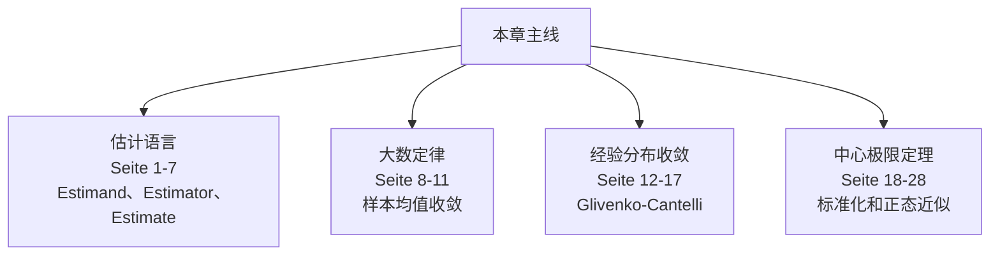

## 学习路径

估计和极限定理解释为什么样本统计量可以靠近总体参数，以及这种靠近在大样本下有什么规律。

1. **估计语言：** Estimand、Estimator、Estimate（Seite 1-7）。
2. **大数定律：** 样本均值收敛（Seite 8-11）。
3. **经验分布收敛：** Glivenko-Cantelli（Seite 12-17）。
4. **中心极限定理：** 标准化和正态近似（Seite 18-28）。

## 模块地图

| 模块 | 页码 | 核心问题 |
| --- | --- | --- |
| 估计语言 | Seite 1-7 | Estimand、Estimator、Estimate |
| 大数定律 | Seite 8-11 | 样本均值收敛 |
| 经验分布收敛 | Seite 12-17 | Glivenko-Cantelli |
| 中心极限定理 | Seite 18-28 | 标准化和正态近似 |

## 考试优先级

1. 会区分 Estimand、Estimator、Estimate。
2. 会说明大数定律和中心极限定理解决的问题不同。
3. 会解释经验分布函数为什么可以估计理论分布函数。
4. 会判断正态近似的使用条件和标准化方式。

## 模块零：先分清估计目标、估计量和估计值（Seite 1-7）

估计题最怕三个词混在一起。Estimand 是你想知道的总体量，Estimator 是用样本构造的随机规则，Estimate 是这次样本算出来的具体数字。

### Seite 1 - 目录

本章内容：

- 参数估计展望（Ausblick: Parameterschätzung）
- 大数定律（Gesetz der großen Zahlen）
- 统计学基本定理（Fundamentalsatz der Statistik）
- 中心极限定理（zentraler Grenzwertsatz）

### Seite 2 - 目录重复页

本页再次列出章节结构，用于进入参数估计部分。

### Seite 3 - 估计（Schätzung）

此前已经学过：

- 描述数据的统计特征值和方法；
- 随机变量的理论性质。

明显联系：

$$
\bar{x}\leftrightarrow E(X).
$$

观测到的统计量（beobachtete Kennwerte）往往有理论对应物（theoretische Entsprechungen）。

关键连接：把数据看成随机变量的实现（Realisierungen von Zufallsvariablen）。

下一步：从数据反推出底层随机变量分布的参数（Verteilungsparameter）。这就是估计（Schätzung）。

### Seite 4 - 参数估计展望

数据：

$$
x_1,\ldots,x_n.
$$

模型假设：数据是某随机变量 $X$ 的实现，而 $X$ 有未知分布参数：

$$
\theta=(\theta_1,\ldots,\theta_p).
$$

三类问题：

1. 哪个 $\theta$ 最适合观测数据？  
   点估计（Punktschätzung）。

2. 这个“最佳值”由数据确定得有多精确？哪些参数值与数据“差不多兼容”？  
   区间估计（Intervallschätzung）与不确定性量化（Quantifizierung von Unsicherheit）。

3. 某个预先给定的 $\theta$ 是否与数据兼容？  
   统计检验（statistische Tests）。

这些内容属于后续课程。

### Seite 5 - 估计量、估计值、估计目标

估计量（Schätzer / estimator）是其他随机变量的函数，因此本身也是随机变量：

$$
\bar{X}_n(\omega)=\frac{1}{n}\sum_{i=1}^n X_i(\omega).
$$

经验视角：把同一计算规则应用到观测数据，得到具体数值：

$$
\bar{x}=\frac{1}{n}\sum_{i=1}^n x_i.
$$

术语：

- estimand：要估计的理论目标，例如 $E(X)$。
- estimator：估计量，即随机变量层面的计算规则。
- estimate：估计值，即在实际数据上算出的数值。

### Seite 6 - Estimand / Estimate / Estimator 图示

本页用图说明三者关系：理论目标（estimand）、实际估计值（estimate）、计算规则/估计量（estimator）。

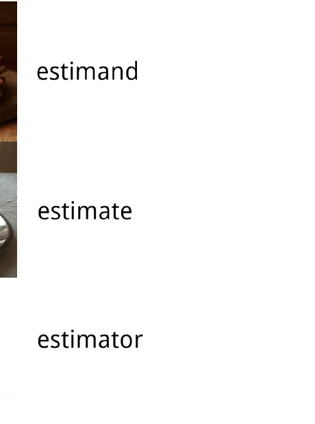

### Seite 7 - 目录切换：Gesetz der großen Zahlen

进入大数定律（Gesetz der großen Zahlen）。

---

## 模块一：大数定律解释样本平均为什么可靠（Seite 8-11）

如果重复抽样足够多，样本均值会靠近理论期望。大白话就是：独立重复带来的随机波动会被平均掉。但 Cauchy 这样的反例提醒你，条件不是装饰。

### Seite 8 - 弱大数定律（Schwaches Gesetz der großen Zahlen）

令 $X_1,\ldots,X_n$ 是独立同分布（unabhängig und identisch verteilt, i.i.d.）随机变量，且：

$$
E(X_i)=\mu_X,\qquad Var(X_i)=\sigma_X^2<\infty.
$$

样本均值：

$$
\bar{X}_n=\frac{1}{n}\sum_{i=1}^n X_i.
$$

则：

$$
E(\bar{X}_n)=\mu_X,\qquad Var(\bar{X}_n)=\frac{\sigma_X^2}{n}\to 0.
$$

并且对任意 $\epsilon>0$：

$$
P(|\bar{X}_n-\mu_X|\ge \epsilon)\to 0.
$$

记作：

$$
\bar{X}_n\xrightarrow{P}\mu_X.
$$

解释：i.i.d. 数据的算术平均数依概率收敛到生成分布的期望值；样本量越大，估计量方差越小。

### Seite 9 - 正态分布示例

当 $X_i\sim N(0,1)$ 且 i.i.d. 时，随着 $n$ 增大，样本均值路径逐渐稳定到真实期望 0 附近。

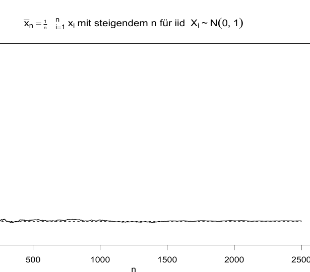

### Seite 10 - 反例：Cauchy 分布

Cauchy 分布没有有限期望和方差，因此样本均值不会像正态例子那样稳定。图中即使 $n$ 很大，均值路径仍会剧烈跳动。

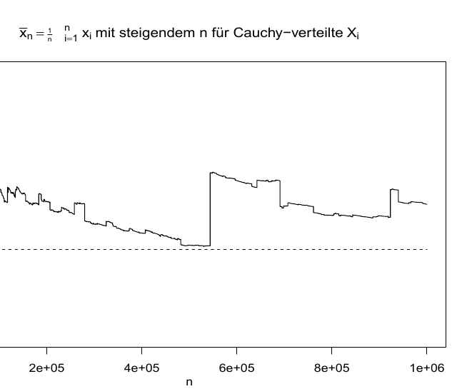

> [!warning] 易错点  
> 大数定律不是“任何分布都适用”。这里的弱大数定律需要有限期望和方差。Cauchy 分布是经典反例。

### Seite 11 - 目录切换：Fundamentalsatz der Statistik

进入统计学基本定理（Fundamentalsatz der Statistik）。

---

## 模块二：经验分布函数整体靠近真实分布（Seite 12-17）

不只样本均值会收敛，整个经验分布函数也会靠近理论分布函数。Glivenko-Cantelli 是后面非参数统计和分布估计的底层保证。

### Seite 12 - 经验分布的逐点收敛

对任意随机变量 $X$ 和集合 $B$：

$$
E(I(X\in B))=P(X\in B).
$$

其中指标函数（Indikatorfunktion）：

$$
I(x\in B)=
\begin{cases}
1,&x\in B,\\
0,&x\notin B.
\end{cases}
$$

取 $B=(-\infty,x]$，对 i.i.d. 样本：

$$
\frac{1}{n}\sum_{i=1}^n I(X_i\le x)\xrightarrow{P}P(X\le x)=F_X(x).
$$

经验分布函数（empirische Verteilungsfunktion, ECDF）：

$$
F_n(x)=\frac{1}{n}\sum_{i=1}^n I(X_i\le x).
$$

因此：

$$
F_n(x)\xrightarrow{P}F_X(x),\quad \forall x.
$$

### Seite 13 - 统计学基本定理（Glivenko-Cantelli）

Glivenko-Cantelli 定理：对 i.i.d. 随机变量 $X_1,\ldots,X_n$，其分布函数为 $F_X$，经验分布函数为 $F_n$，则：

$$
P\left(\sup_{x\in\mathbb{R}}|F_n(x)-F_X(x)|<\epsilon\right)\to 1,\quad \forall \epsilon>0.
$$

含义：经验分布函数和真实分布函数之间的最大偏差会随着样本量增大，以概率 1 变得任意小。

这比逐点依概率收敛更强：不是只在某个 $x$ 上接近，而是整条函数同时接近。

### Seite 14 - Glivenko-Cantelli：二项分布示例

黑线为多个样本的 ECDF，金色线为真实分布函数。随着 $n$ 从 20 到 10000 增大，ECDF 越来越贴近真实 $F(x)$。

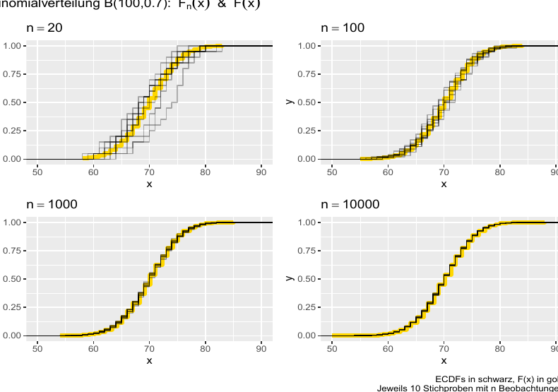

### Seite 15 - Glivenko-Cantelli：指数分布示例

连续分布同样适用。样本量增大后，阶梯状 ECDF 整体逼近指数分布的真实分布函数。

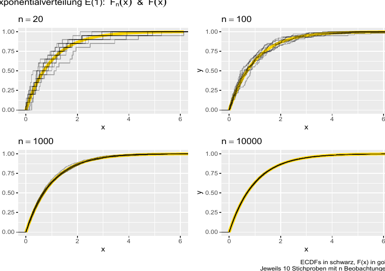

### Seite 16 - Glivenko-Cantelli：Cauchy 分布示例

即使 Cauchy 分布没有有限期望，ECDF 仍然可逼近真实分布函数。注意这和样本均值是否稳定是两个不同问题。

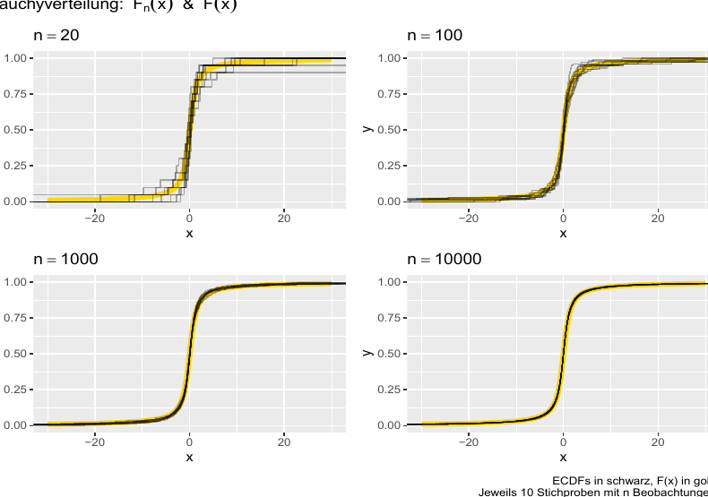

> [!important] 考点  
> Cauchy 下样本均值不稳定，但 ECDF 仍由 Glivenko-Cantelli 保证逼近真实分布函数。不要把“均值估计”与“分布函数估计”混为一谈。

### Seite 17 - 目录切换：zentraler Grenzwertsatz

进入中心极限定理。

---

## 模块三：中心极限定理解释为什么正态近似到处出现（Seite 18-28）

很多独立小影响相加后，标准化结果会接近正态。它不要求原始变量正态，这正是中心极限定理强大的地方。

### Seite 18 - 中心极限定理的直觉

中心极限定理（ZGWS/CLT）说：来自任意分布的一组 i.i.d. 随机变量，其算术平均数的分布在 $n$ 增大时趋向正态分布，只需条件不太苛刻。

它解释了正态分布（Normalverteilung）在随机学和统计学中的核心地位。

### Seite 19 - 标准化随机变量（standardisierte Zufallsvariable）

若随机变量 $X$ 有有限期望：

$$
\mu_X=E(X)
$$

和有限方差：

$$
\sigma_X^2=Var(X),
$$

则可标准化为：

$$
\tilde{X}=\frac{X-\mu_X}{\sigma_X}.
$$

于是：

$$
E(\tilde{X})=0,\qquad Var(\tilde{X})=1.
$$

### Seite 20 - i.i.d. 和的标准化

设 $X_1,\ldots,X_n$ i.i.d.，且：

$$
E(X_i)=\mu_X,\qquad Var(X_i)=\sigma_X^2.
$$

令：

$$
Y_n=X_1+\cdots+X_n.
$$

则：

$$
E(Y_n)=n\mu_X,\qquad Var(Y_n)=n\sigma_X^2.
$$

标准化和：

$$
Z_n=\frac{Y_n-n\mu_X}{\sqrt{n}\sigma_X}
=\frac{1}{\sqrt{n}}\sum_{i=1}^n\frac{X_i-\mu_X}{\sigma_X}.
$$

因此：

$$
E(Z_n)=0,\qquad Var(Z_n)=1.
$$

### Seite 21 - 中心极限定理（ZGWS）

中心极限定理：标准化和 $Z_n$ 的分布函数 $F_{Z_n}(z)$ 在 $n\to\infty$ 时逐点收敛到标准正态分布函数 $F_{N(0,1)}(z)$：

$$
F_{Z_n}(z)\to F_{N(0,1)}(z),\quad \forall z\in\mathbb{R}.
$$

因此实践中可写：

$$
Z_n\overset{a}{\sim}N(0,1).
$$

其中 $\overset{a}{\sim}$ 表示“渐近/近似服从”（asymptotisch/approximativ verteilt wie）。

### Seite 22 - ZGWS 备注

只要期望和方差存在，ZGWS 也适用于：

- 离散随机变量；
- 支撑集与正态分布不同的随机变量；
- 偏斜或多峰分布。

在更一般条件下，如 Lyapunov-/Lindeberg-ZGWS，甚至可放宽同分布要求，允许独立但不完全同分布。

不一定要标准化后表述。对和：

$$
Y_n=X_1+\cdots+X_n
$$

可近似为：

$$
Y_n\overset{a}{\sim}N(n\mu_X,n\sigma_X^2).
$$

对均值：

$$
\bar{X}_n\overset{a}{\sim}N\left(\mu_X,\frac{\sigma_X^2}{n}\right).
$$

### Seite 23 - GGZ 与 ZGWS 的区别

GGZ 给出样本均值的期望和方差的渐近说法：均值靠近 $\mu$，方差趋小。

ZGWS 给出样本均值完整的渐近分布：均值的误差近似正态。

应用：许多近似 i.i.d. 随机变量的和或平均，可以用正态分布模型近似。

### Seite 24 - ZGWS 与 GGZ 可视化 I

灰线：50 条样本均值路径；金线：真实期望；黑色曲线：这些均值的观测密度；红色曲线：ZGWS 预测的正态密度。

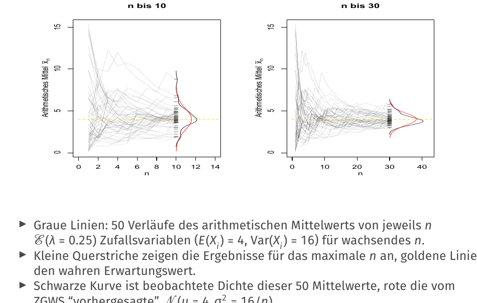

### Seite 25 - ZGWS 与 GGZ 可视化 II

随着最大样本量增大，样本均值路径收敛到真实期望附近，同时均值分布越来越窄。

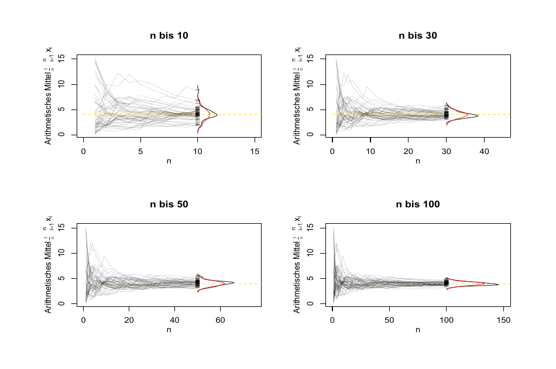

### Seite 26 - 离散情形：二项分布的正态近似

若：

$$
X_i\overset{iid}{\sim}B(\pi),\quad i=1,\ldots,n,
$$

则：

$$
Y_n=\sum_{i=1}^n X_i\sim B(n,\pi).
$$

ZGWS 给出：

$$
\frac{Y_n-n\pi}{\sqrt{n\pi(1-\pi)}}\overset{a}{\sim}N(0,1).
$$

等价地：

$$
Y_n\overset{a}{\sim}N(n\pi,n\pi(1-\pi)).
$$

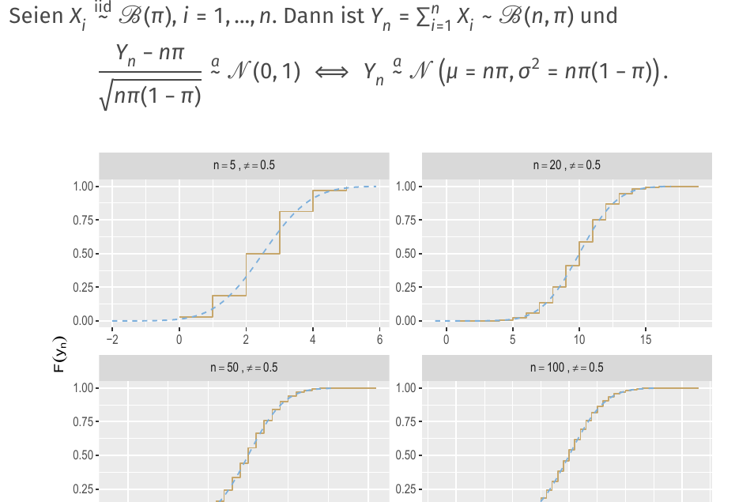

### Seite 27 - 离散情形：Poisson 分布的正态近似

若：

$$
X_i\overset{iid}{\sim}P(\lambda=\tau),
$$

则：

$$
Y_n=\sum_{i=1}^nX_i\sim P(\lambda=n\tau).
$$

ZGWS 给出：

$$
\frac{Y_n-n\tau}{\sqrt{n\tau}}\overset{a}{\sim}N(0,1),
$$

即：

$$
Y_n\overset{a}{\sim}N(n\tau,n\tau).
$$

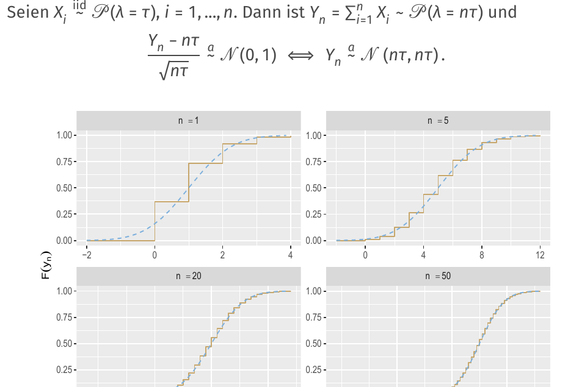

### Seite 28 - 连续情形：$\chi^2$ 分布的正态近似

若：

$$
X_i\overset{iid}{\sim}N(0,1),
$$

则：

$$
Y_n=\sum_{i=1}^n X_i^2\sim \chi^2(d=n).
$$

ZGWS 给出：

$$
\frac{Y_n-n}{\sqrt{2n}}\overset{a}{\sim}N(0,1),
$$

即：

$$
Y_n\overset{a}{\sim}N(n,2n).
$$

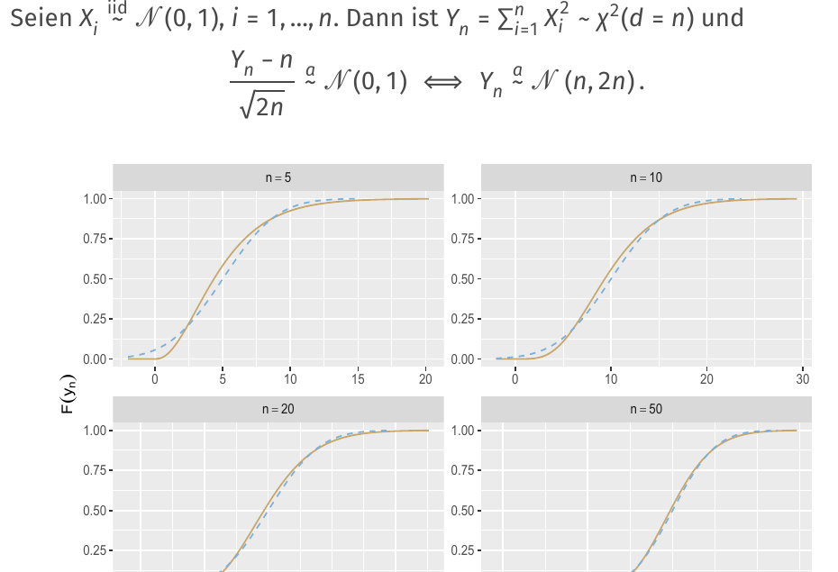

---

## 本章逻辑梳理

- **估计语言（Seite 1-7）：** Estimand、Estimator、Estimate。
- **大数定律（Seite 8-11）：** 样本均值收敛。
- **经验分布收敛（Seite 12-17）：** Glivenko-Cantelli。
- **中心极限定理（Seite 18-28）：** 标准化和正态近似。

真正复习时，不要按页码零散背。先问本章在解决什么问题，再把每页放回上面的模块里：前面的页通常提出问题，中间的页给出工具，后面的页提醒适用边界或展示例子。

## 关键考核点

1. 会区分 Estimand、Estimator、Estimate。
2. 会说明大数定律和中心极限定理解决的问题不同。
3. 会解释经验分布函数为什么可以估计理论分布函数。
4. 会判断正态近似的使用条件和标准化方式。

## 本章公式清单

### 估计语言

| 序号 | 公式 | 使用场景 | 注意事项 |
| ---: | --- | --- | --- |
| 1 | $\theta$ | 估计目标/参数（Estimand）。 | 总体层面的未知量。 |
| 2 | $\hat\theta=T(X_1,\ldots,X_n)$ | 估计量（Estimator）。 | 样本的函数，因此是随机变量。 |
| 3 | $\hat\theta(x_1,\ldots,x_n)$ | 估计值（Estimate）。 | 代入本次数据后的具体数字。 |

### 收敛定理

| 序号 | 公式 | 使用场景 | 注意事项 |
| ---: | --- | --- | --- |
| 4 | $\bar X_n=\frac1n\sum_{i=1}^n X_i$ | 样本均值。 | 大数定律和 CLT 的核心对象。 |
| 5 | $\bar X_n\xrightarrow{P} \mu$ | 弱大数定律。 | 要求相应条件，例如有限期望/方差。 |
| 6 | $\sup_x\lvert \hat F_n(x)-F(x)\rvert\to 0$ | Glivenko-Cantelli 定理。 | 经验分布函数一致收敛。 |

### 中心极限定理与近似

| 序号 | 公式 | 使用场景 | 注意事项 |
| ---: | --- | --- | --- |
| 7 | $\frac{\sqrt n(\bar X_n-\mu)}{\sigma}\xrightarrow{d}N(0,1)$ | 中心极限定理。 | 标准化后近似正态。 |
| 8 | $\bar X_n\approx N\left(\mu,\frac{\sigma^2}{n}\right)$ | 样本均值的大样本近似分布。 | 样本量越大，标准误越小。 |
| 9 | $Bin(n,p)\approx N(np,np(1-p))$ | 二项分布正态近似。 | 通常要求 $np$ 和 $n(1-p)$ 不太小。 |
| 10 | $Pois(\lambda)\approx N(\lambda,\lambda)$ | Poisson 正态近似。 | $\lambda$ 较大时更好。 |

## 章节自测

- [x] 估计量是样本的函数，因此在抽样前是随机变量。
- [ ] 大数定律说明样本均值的极限形状是正态分布。
- [x] 中心极限定理通常涉及标准化后的样本均值。
- [x] 样本量增大时样本均值的标准误通常变小。

## 德语词汇表

| 德语 | 中文 | 使用场景 |
| --- | --- | --- |
| Schätzung | 估计 | 用样本推总体 |
| Estimand | 估计目标 | 总体参数 |
| Estimator | 估计量 | 样本函数 |
| Estimate | 估计值 | 具体数值 |
| Gesetz der großen Zahlen | 大数定律 | 样本均值收敛 |
| empirische Verteilungsfunktion | 经验分布函数 | 样本分布 |
| Zentraler Grenzwertsatz | 中心极限定理 | 正态近似 |
| Standardfehler | 标准误 | 估计量波动 |

## C1 德语句式

| 序号 | 德语句式 | 中文翻译 | 适用场景 |
| ---: | --- | --- | --- |
| 1 | Ein Estimator ist eine Zufallsvariable, während ein Estimate der realisierte Zahlenwert nach Beobachtung der Daten ist. | 估计量是随机变量，而估计值是观察到数据后的实现数值。 | 区分三个估计概念。 |
| 2 | Das Gesetz der großen Zahlen begründet Konsistenz, während der zentrale Grenzwertsatz eine approximative Verteilung liefert. | 大数定律说明一致性，而中心极限定理给出近似分布。 | 区分 LLN 和 CLT。 |
| 3 | Die Genauigkeit eines Stichprobenmittels verbessert sich typischerweise mit wachsendem Stichprobenumfang. | 样本均值的精确度通常随样本量增加而提高。 | 解释标准误。 |
