# 第11章：度量变量的关联度量（Zusammenhangsmaße für metrische Merkmale）

> 本章核心：如何量化两个度量变量（metrische Merkmale）之间的关系。最容易考的陷阱是：Pearson 相关（Bravais-Pearson-Korrelation）只度量线性关系；相关为 0 不等于独立（Unabhängigkeit）；AUC/ROC 用于二分类目标与连续/有序评分的关系。

## 章节知识树

```mermaid
flowchart TD
  A["度量变量的关联度量<br/>Zusammenhangsmaße für metrische Merkmale"] --> B["一、样本层面的线性关联<br/>Seite 3-11"]
  B --> B1["协方差 Kovarianz<br/>方向 + 共同偏离"]
  B --> B2["Pearson 相关 r<br/>标准化协方差"]
  B --> B3["局限<br/>只看线性、怕离群值、必须配散点图"]
  A --> C["二、多变量关系展示<br/>Seite 12-15"]
  C --> C1["协方差矩阵 / 相关矩阵"]
  C --> C2["散点矩阵 Scatterplotmatrix"]
  A --> D["三、随机变量层面的理论化<br/>Seite 16-27"]
  D --> D1["Cov(X,Y), rho(X,Y)"]
  D --> D2["不相关 vs 独立"]
  D --> D3["线性变换与方差和"]
  D --> D4["二元/多元正态分布"]
  A --> E["四、替代关联指标<br/>Seite 28-42"]
  E --> E1["Spearman<br/>秩相关、单调关系"]
  E --> E2["Kendall Tau<br/>成对比较"]
  E --> E3["距离相关<br/>一般依赖、无方向"]
  A --> F["五、指标比较与图形诊断<br/>Seite 43-48"]
  F --> F1["线性、周期、U 型、加噪关系"]
  F --> F2["同一相关系数可对应不同图形"]
  A --> G["六、二分类目标 + 连续评分<br/>Seite 49-72"]
  G --> G1["阈值 Schwellenwert"]
  G --> G2["Sensitivität / Spezifität"]
  G --> G3["ROC / AUC"]
  G --> G4["ppV / npV 与 Prävalenz"]
```

## 学习路径

1. **先掌握主线：** `Kovarianz -> Pearson r -> 线性关系的局限`。这是本章最基本的计算和解释链。
2. **再上升到理论：** 把样本公式推广到随机变量公式，理解 `Unabhängigkeit => Unkorreliertheit`，但反过来不成立。
3. **然后学替代指标：** Spearman/Kendall 处理有序和单调关系，距离相关处理更一般的依赖。
4. **最后处理诊断问题：** 当 $Y$ 是二分类而 $X$ 是 score 时，不再用普通相关作为主工具，而用阈值、ROC、AUC、ppV、npV。

## 模块地图

| 模块     |          页码 | 核心问题               | 关键德语词                                                    |
| ------ | ----------: | ------------------ | -------------------------------------------------------- |
| 样本线性关联 |  Seite 3-11 | 两个度量变量是否线性同向/反向变化？ | `Kovarianz`, `Bravais-Pearson-Korrelation`, `Ausreißer`  |
| 多变量展示  | Seite 12-15 | 多个变量之间如何整体查看？      | `Korrelationsmatrix`, `Scatterplotmatrix`                |
| 随机变量理论 | Seite 16-27 | 样本相关背后的概率论定义是什么？   | $Cov(X,Y)$, `Unkorreliertheit`, `Unabhängigkeit`         |
| 替代关联指标 | Seite 28-42 | 线性相关不够时用什么？        | `Spearman`, `Kendall's Tau`, `Distanzkorrelation`        |
| 指标比较   | Seite 43-48 | 不同指标面对不同形状时会怎样？    | `linear`, `monoton`, `nichtlinear`, `verrauscht`         |
| 二分类评分  | Seite 49-72 | score 如何评价二分类预测？   | `Sensitivität`, `Spezifität`, $ROC$, $AUC$, $ppV$, $npV$ |

## 指标选择树

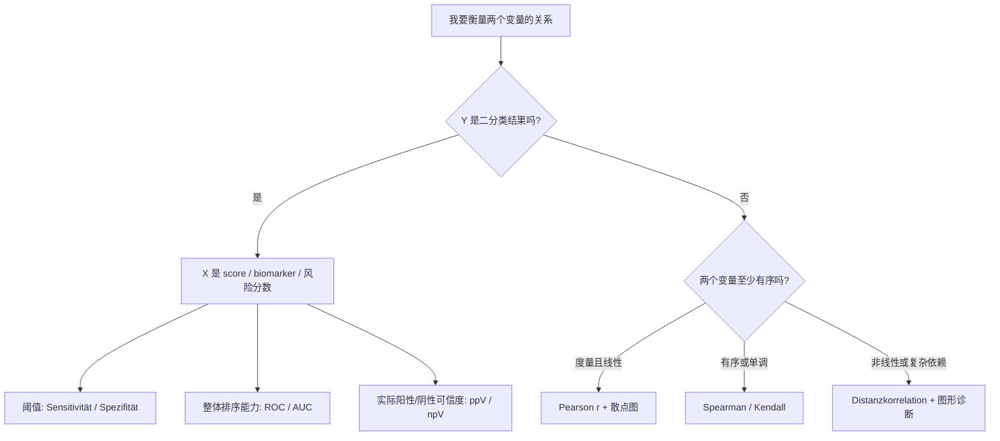
```mermaid
flowchart TD
  A["我要衡量两个变量的关系"] --> B{"Y 是二分类结果吗?"}
  B -->|是| C["X 是 score / biomarker / 风险分数"]
  C --> C1["阈值: Sensitivität / Spezifität"]
  C --> C2["整体排序能力: ROC / AUC"]
  C --> C3["实际阳性/阴性可信度: ppV / npV"]
  B -->|否| D{"两个变量至少有序吗?"}
  D -->|度量且线性| E["Pearson r + 散点图"]
  D -->|有序或单调| F["Spearman / Kendall"]
  D -->|非线性或复杂依赖| G["Distanzkorrelation + 图形诊断"]
```

## 考试优先级

1. 会解释 $r=0$ 的含义：没有线性关系，不代表独立。
2. 会根据散点图判断 Pearson 是否合适。
3. 会区分 Pearson、Spearman、Kendall 和距离相关的适用条件。
4. 会读 ROC 曲线，知道 $AUC=0.5$ 近似随机，$AUC=1$ 完美区分。
5. 会解释为什么高 Sensitivität/Spezifität 不必然带来高 ppV，尤其在低 Prävalenz 场景。

## 模块零：章节入口（Seite 1-2）

你这一章先不要急着背公式。先问一个很朴素的问题：两个变量到底有没有关系？比如房子越大，租金是不是越高；血糖越高，糖尿病风险是不是越大。问题一开始听起来很简单，但马上会变复杂：有的关系是直线型的，有的是弯的，有的是只看排序，有的是拿一个分数去判断“有病/没病”。所以本章其实是在回答同一个问题的不同版本：**变量之间的“有关联”到底该怎么量化？**

接下来 Seite 1-2 只是给你看地图。真正学习时，不要把后面所有指标混在一起背，而是按“问题变复杂，工具跟着升级”的顺序读。

### Seite 1 - 本章路线图

本章包括：

- 观测变量的协方差与相关（Kovarianz und Korrelation beobachteter Merkmale）
- 多变量关系展示（Darstellung multivariater Zusammenhänge）
- 随机变量的协方差与相关
- 替代关联度量（alternative Zusammenhangsmaße）
- 度量变量例子
- 二分类与有序/度量变量的关联指标

### Seite 2 - 章节结构

本页重复目录。学习路径是：先从样本数据的协方差开始，再抽象到随机变量，最后比较 Pearson、Spearman、Kendall、距离相关、ROC/AUC 的适用场景。

## 模块一：样本层面的线性关联（Seite 3-11）

我们先从最直观的情况开始：散点图里一堆点，好像从左下往右上走，或者从左上往右下走。肉眼能看出“有趋势”，但考试和研究不能只写“看起来有点关系”。于是第一个问题来了：**怎么把这种一起变大、一起变小的趋势变成一个数字？**

协方差（Kovarianz）就是第一步：看每个点相对均值是同向偏离还是反向偏离。但它有个麻烦：单位会影响数值，平方米和欧元一乘，数字很难直接解释。于是我们把协方差标准化，得到 Pearson 相关（Bravais-Pearson-Korrelation）。这一步很自然：先有“共同偏离”，再把它变成 `-1` 到 `1` 之间的无单位指标。

但这个工具也有脾气：它只擅长看直线关系（linearer Zusammenhang），对弯曲关系、离群值和奇怪形状很容易失灵。所以 Seite 3-11 的主线是：**先发明一个线性关系指标，再马上认识它的边界。**

### Seite 3 - 协方差

协方差（Kovarianz）度量两个度量变量线性关系的方向和共同变化：

$S_{xy}=\frac{1}{n-1}\sum_{i=1}^n(x_i-\bar{x})(y_i-\bar{y})$

若两个偏差同号，乘积为正；异号，乘积为负。$S_{xx}$ 就是 $X$ 的样本方差（Stichprobenvarianz）。

**注意：** 协方差大小受两个变量单位和散布影响，不便直接比较不同变量对。

### Seite 4 - 协方差几何直觉 I

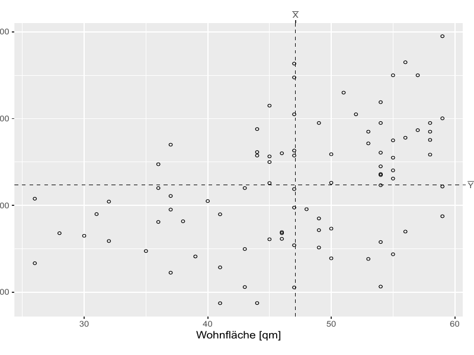

图中以 Wohnfläche 与 Nettomiete 为例。中心线表示均值，点相对于均值的位置决定对协方差的贡献。

### Seite 5 - 协方差几何直觉 II

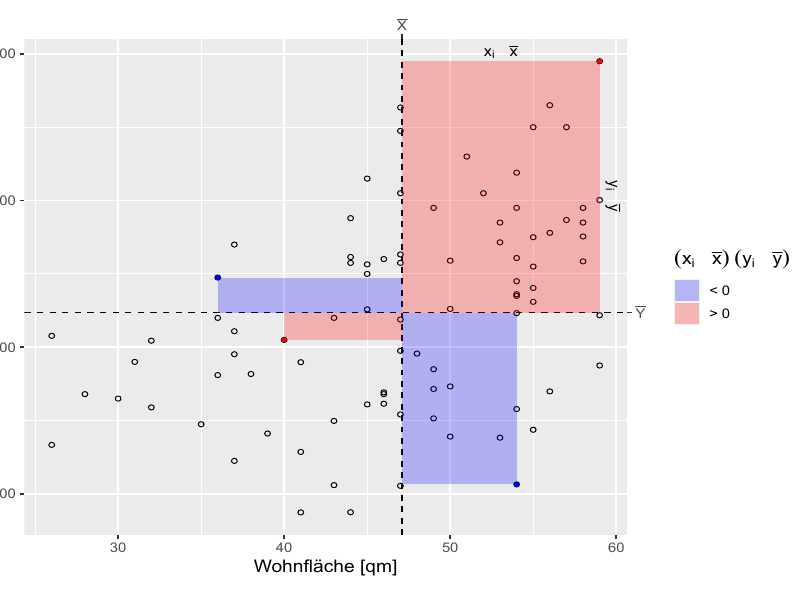

右上和左下象限的点贡献为正；左上和右下象限的点贡献为负。正负贡献相互抵消后得到总协方差。

### Seite 6 - 协方差几何直觉 III

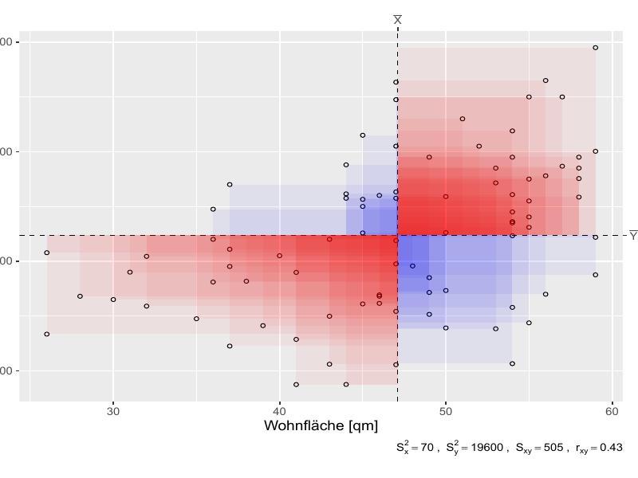

图中红色区域表示正贡献，蓝色区域表示负贡献。若点云主要沿正斜率方向排列，协方差为正。

### Seite 7 - Bravais-Pearson 相关系数

Pearson 相关系数（Bravais-Pearson-Korrelationskoeffizient）是标准化后的协方差：

$$
r_{xy}=\frac{S_{xy}}{S_xS_y}
$$

范围：

$$
-1\le r_{xy}\le 1
$$

它无量纲（dimensionslos），不受单位影响。$r>0$ 表示正线性趋势，$r<0$ 表示负线性趋势，$r=0$ 表示无线性相关。

### Seite 8 - Pearson 相关的性质

性质：

- 主要度量线性关系（linearer Zusammenhang）。
- 对线性变换基本不变。
- 对称：$r_{xy}=r_{yx}$。
- $r=1$ 或 $r=-1$ 表示点精确落在一条正/负斜率直线上。
- $r=0$ 不是独立，只是无线性关系。
- 对离群值（Ausreißer）敏感。

### Seite 9 - Pearson 只看线性

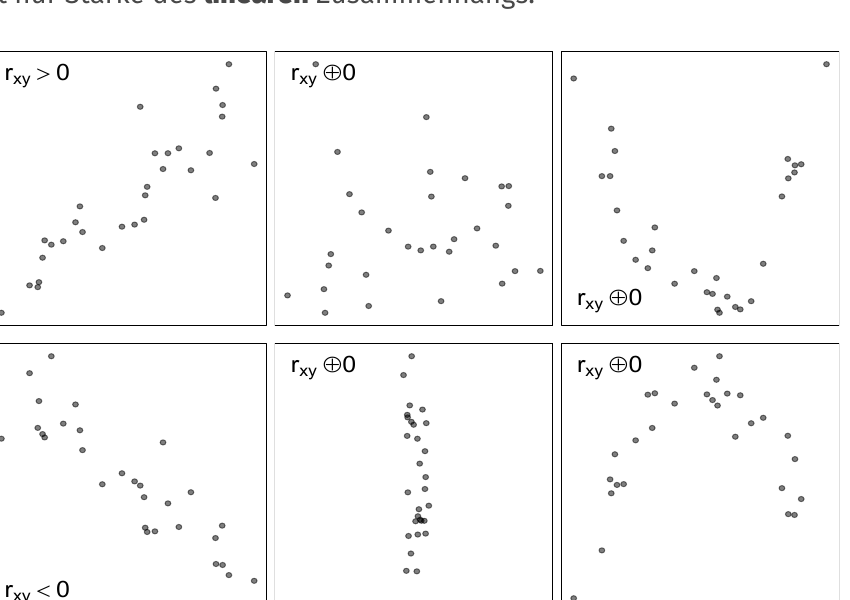

多个非线性图形的 $r$ 可能接近 0，但明显存在结构。考试中看到弯曲、圆形、U 型图，要写：Pearson 相关不能捕捉该非线性关系。

### Seite 10 - 相同相关，不同图形

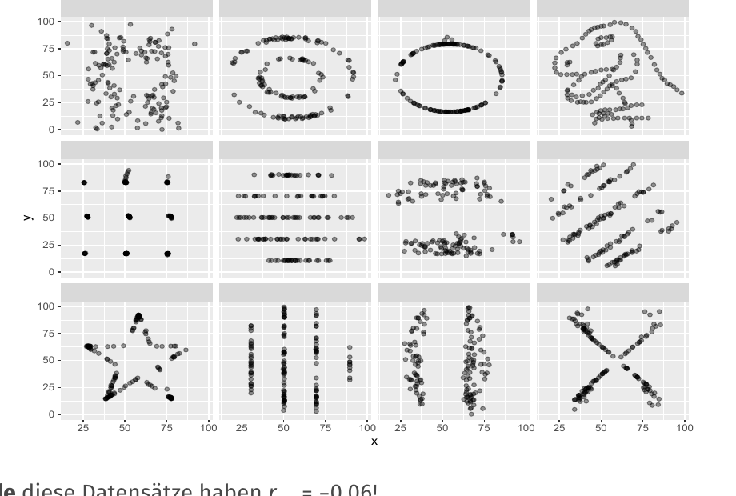

这些数据集具有几乎相同的均值、方差和相关系数，却图形完全不同。结论：相关系数不能替代散点图。

### Seite 11 - 线性变换

若存在精确线性关系：

$$
Y=aX+b
$$

则 $a>0$ 时 $r=1$，$a<0$ 时 $r=-1$。对变量做线性变换时，若两个尺度因子同号，相关保持；异号，相关变号。

## 模块二：多变量关系展示（Seite 12-15）

上一模块我们只看两个变量：$X$ 和 $Y$。这在黑板上很清楚，但真实数据不会这么乖。比如租房数据里同时有净租金（Nettomiete）、每平方米租金（qm-Miete）、住房面积（Wohnfläche）、建造年份（Baujahr）、房间数（Zimmer）。如果你每次只拿两个变量算一个 $r$，很快就会变成一堆零散数字：这个 0.46，那个 0.78，另一个 -0.14。学生最常见的感觉是：**我算了很多相关系数，但脑子里没有整体图像。**

所以这里要换思路：不要把变量关系当成一条一条孤立的线，而要把它看成一个网络。相关矩阵（Korrelationsmatrix）把所有两两相关摆成一张表，散点矩阵（Scatterplotmatrix）再把这些数字背后的图形一起展示出来。这样你不仅知道“谁和谁相关强”，还可以看到“是不是线性”“有没有离群点”“是不是某个变量在牵动很多关系”。

Seite 12-15 就是在解决这个问题：**当变量不止两个时，怎么从一堆成对关系里看出整体结构？**

### Seite 12 - 转入多变量展示

本页切换到多变量关系展示。两个以上变量时，不能只列一堆成对相关，通常需要矩阵和图形辅助。

### Seite 13 - 协方差矩阵与相关矩阵

多个变量的协方差和相关常写成矩阵（Matrix）。主对角线：

- 协方差矩阵：各变量方差。
- 相关矩阵：每个变量与自身相关，等于 1。

矩阵对称，因为 $S_{xy}=S_{yx}$、$r_{xy}=r_{yx}$。

### Seite 14 - Scatterplotmatrix I

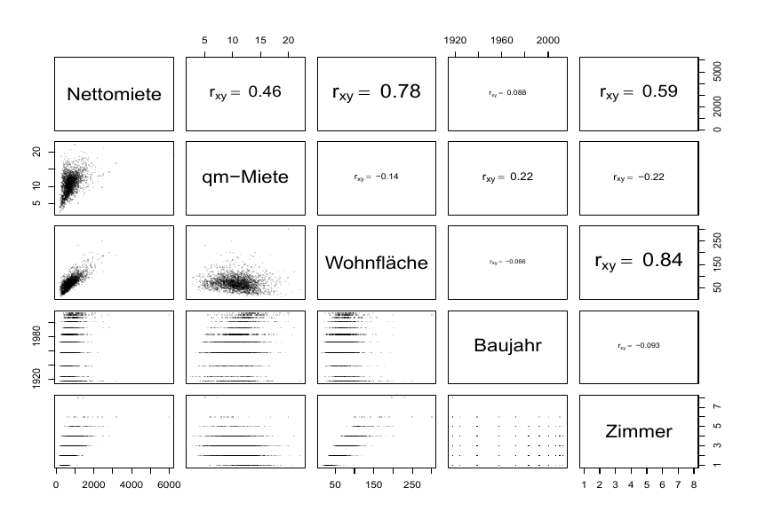

散点矩阵（Scatterplotmatrix）展示所有变量两两关系，并可标出相关系数。适合快速发现线性关系、非线性关系和离群点。

### Seite 15 - Scatterplotmatrix II

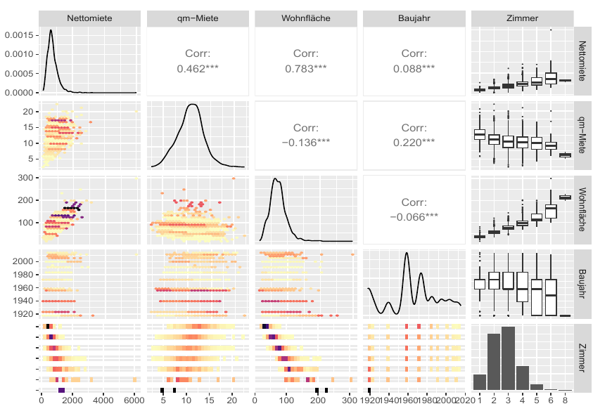

增强版散点矩阵可在对角线显示分布，在上三角显示相关，下三角显示散点。这比单独相关矩阵信息更丰富。

## 模块三：随机变量层面的协方差与相关（Seite 16-27）

前面算的 $S_{xy}$ 和 $r_{xy}$ 都是样本里的数字。可是统计学不只关心“这批数据长什么样”，还关心背后的随机机制：如果重新抽样，变量之间的关系是不是还存在？这时我们就不能只说样本协方差，而要说随机变量（Zufallsvariablen）的协方差 $Cov(X,Y)$ 和相关 $\rho(X,Y)$。

这里最容易掉坑的是“不相关”和“独立”。大白话说：独立是“你变不变完全不影响我”；不相关只是“我们没有直线型的一起变动”。前者很强，后者弱很多。很多人看到 $\rho=0$ 就想写“独立”，这在一般情况下是错的。只有在一些特殊分布里，比如二元正态（bivariate Normalverteilung），不相关才会推出独立。

Seite 16-27 的作用就是把样本里的直觉升级成概率论语言，并且帮你记住一个考试高频句：**Unabhängigkeit impliziert Unkorreliertheit, aber nicht umgekehrt.**

### Seite 16 - 转入随机变量的协方差与相关

本页切换到随机变量（Zufallsvariablen）的协方差与相关。样本公式是经验版本；随机变量公式基于期望（Erwartungswert）。

### Seite 17 - 随机变量的协方差与相关

定义：

$$
Cov(X,Y)=E[(X-E(X))(Y-E(Y))]
$$

相关：

$$
\rho(X,Y)=\frac{Cov(X,Y)}{\sqrt{Var(X)}\sqrt{Var(Y)}}
$$

前提是两个方差都大于 0。并且 $Cov(X,X)=Var(X)$。

### Seite 18 - 协方差的位移公式

协方差的常用公式（Verschiebungssatz）：

$$
Cov(X,Y)=E(XY)-E(X)E(Y)
$$

这个公式计算上常比定义更方便。

### Seite 19 - 不相关性

$X$ 和 $Y$ 不相关（unkorreliert），当且仅当：

$$
Cov(X,Y)=0 \quad \text{或}\quad \rho(X,Y)=0
$$

等价于：

$$
E(XY)=E(X)E(Y)
$$

**关键：** 独立推出不相关，但不相关不一定推出独立。

### Seite 20 - 独立 vs 不相关

本页给出离散随机变量例子：两个变量可以协方差为 0，但联合分布不等于边际分布乘积，因此不独立。

**考试句式：**  
`Unabhängigkeit impliziert Unkorreliertheit, aber der Umkehrschluss gilt im Allgemeinen nicht.`

### Seite 21 - 随机变量相关的性质

对所有随机变量：

$$
-1\le \rho(X,Y)\le 1
$$

且 $|\rho|=1$ 当且仅当存在完美线性关系：

$$
Y=a+bX,\quad b\ne 0
$$

### Seite 22 - 随机变量的线性变换

对线性变换：

$$
Cov(a+bX,c+dY)=bd\cdot Cov(X,Y)
$$

相关变换：

$$
\rho(a+bX,c+dY)=sgn(b)sgn(d)\rho(X,Y)
$$

同向缩放保持相关，反向缩放改变符号。

### Seite 23 - 两个随机变量和的方差

$$
Var(X+Y)=Var(X)+Var(Y)+2Cov(X,Y)
$$

若 $X$ 与 $Y$ 独立，因此不相关，则：

$$
Var(X+Y)=Var(X)+Var(Y)
$$

**考点：** 方差直接相加需要独立或至少协方差为 0。

### Seite 24 - 二元标准正态分布

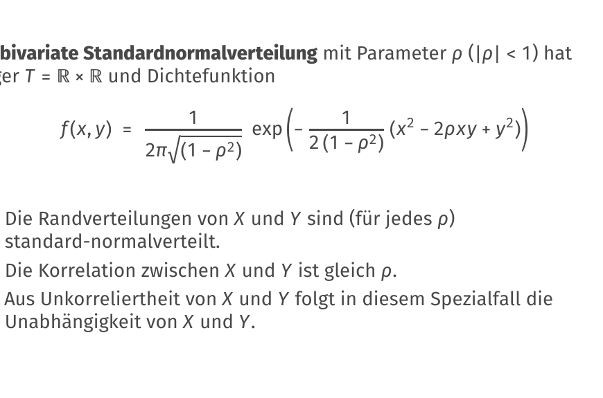

二元标准正态分布（bivariate Standardnormalverteilung）由参数 $\rho$ 控制相关。边际分布都是标准正态，$\rho$ 就是 $X$ 与 $Y$ 的相关。

### Seite 25 - 二元正态等高线

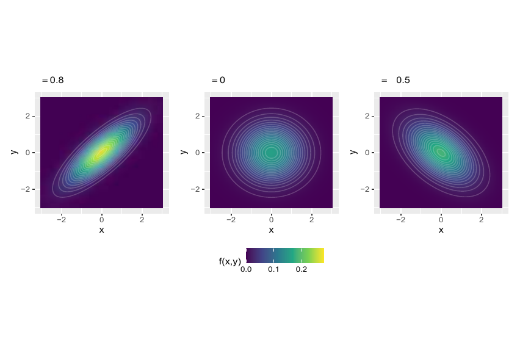

$\rho=0$ 时等高线近似圆形；正相关或负相关时等高线倾斜。二元正态的特殊性质：不相关可推出独立。

### Seite 26 - 二元正态三维图

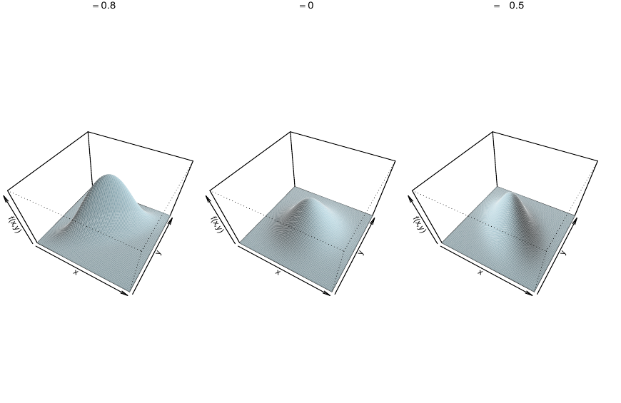

三维图展示密度曲面。相关改变椭圆方向和拉伸程度。

### Seite 27 - 多元正态分布

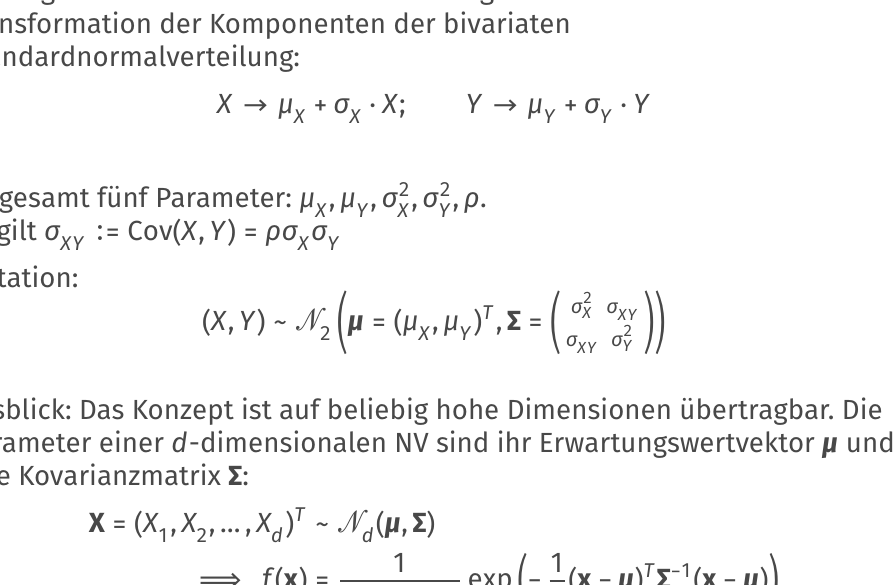

多元正态分布由期望向量（Erwartungswertvektor）`μ` 和协方差矩阵（Kovarianzmatrix）`Σ` 描述：

$$
X\sim \mathcal{N}(\mu,\Sigma)
$$

协方差矩阵编码每个变量方差和变量之间的线性关系。

## 模块四：替代关联度量（Seite 28-42）

到这里你已经知道 Pearson 很好用，但它偏科：只看线性。那如果关系不是直线，但很有规律怎么办？比如一个变量越大，另一个变量也总体越大，只是曲线弯弯的；或者我们根本不在乎具体差多少，只关心排序谁高谁低。继续硬用 Pearson，就像拿尺子去量温度，工具不对。

于是我们换三个新工具。Spearman（Spearman-Rangkorrelation）把原始数值换成排名，看的是单调关系（monotoner Zusammenhang）。Kendall's Tau 不直接看距离，而是比较任意两个观测对的排序是否一致。距离相关（Distanzkorrelation）更进一步：它不只看线性或单调，而是尝试捕捉更一般的依赖关系。

这一模块的学习感觉应该是：**不是所有“有关联”都长成直线，所以指标也不能只有 Pearson 一个。**

### Seite 28 - 转入替代关联度量

本页切换到替代关联度量。动机：Pearson 相关只能看线性关系，且对离群值敏感。

### Seite 29 - Spearman 秩相关

Spearman 秩相关（Spearman-/Rang-Korrelationskoeffizient）先把变量值转成秩（Ränge），再计算 Pearson 相关。

适用：至少有序变量（mindestens ordinal）。

$$
r^{SP}_{xy}=Cor(rg(x),rg(y))
$$

它度量单调关系（monotoner Zusammenhang）。

### Seite 30 - Spearman 计算步骤

步骤：

1. 将原始值排序。
2. 分配秩（Ränge）。
3. 若有并列（Bindungen / ties），给平均秩（Durchschnittsrang）。
4. 对秩计算相关。

### Seite 31 - Spearman 解释

$r_{SP}>0$：同向单调，大值对应大值。  
$r_{SP}<0$：反向单调，大值对应小值。  
$r_{SP}\approx 0$：没有明显单调关系。

**注意：** Spearman 可捕捉非线性但单调的关系。

### Seite 32 - Spearman 极端情况

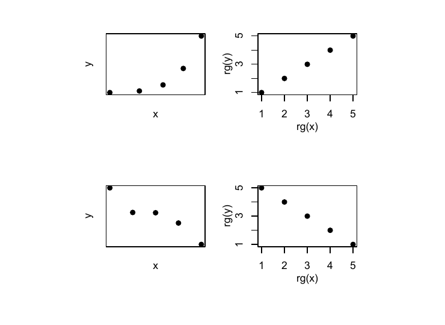

完全同序时 $r_{SP}=1$，完全反序时 $r_{SP}=-1$。

### Seite 33 - Spearman 简化公式

若没有并列，令秩差：

$$
d_i=rg(x_i)-rg(y_i)
$$

则可用：

$$
r^{SP}=1-\frac{6\sum d_i^2}{n(n^2-1)}
$$

### Seite 34 - 单调变换

Spearman 对严格单调变换（streng monotone Transformation）不敏感。若两个变量都做同向单调变换，秩相关不变；若一方方向反转，符号反转。

### Seite 35 - Kendall's Tau

Kendall's Tau 基于成对比较（Paarvergleiche）：

- 协同对（konkordant）：$X$ 的顺序与 $Y$ 的顺序一致。
- 不协同对（diskordant）：顺序相反。

$$
\tau=\frac{N_C-N_D}{n(n-1)/2}
$$

### Seite 36 - Kendall's Tau 可视化

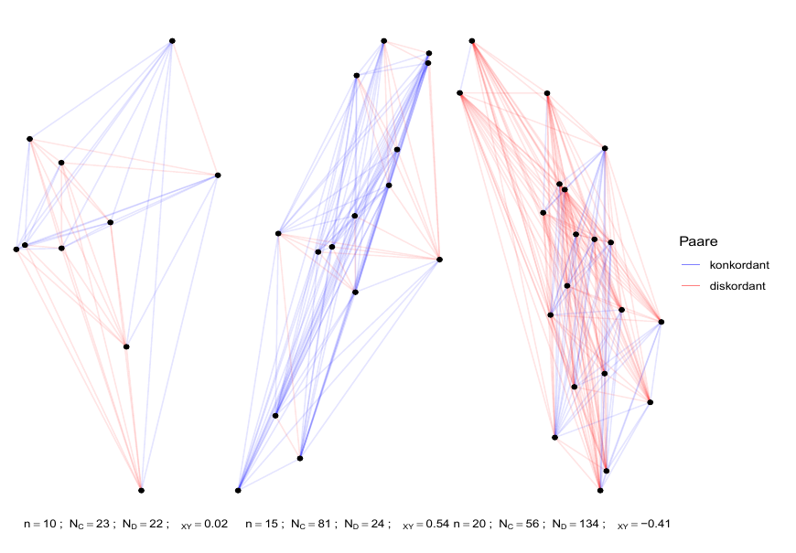

蓝色/红色线表示不同方向的成对关系。Tau 越高，协同对越多；越低，不协同对越多。

### Seite 37 - Pairwise 指标变体

Goodman & Kruskal's Gamma 忽略有并列的对；Somers' D 常在 $Y$ 为二分类时使用。

**共同点：** 这些指标都比较观测对的排序一致性。

### Seite 38 - Paarvergleichsmaße 共同点

Kendall's Tau、Somers' D、Goodman & Kruskal's Gamma 的值域通常为 `[-1,1]`，并要求变量至少有序（ordinal）。

### Seite 39 - Pairwise 指标 vs Spearman

Spearman 使用秩尺度上的距离；Kendall Tau 等使用所有成对比较。通常 `τ` 的绝对值小于 Spearman。

### Seite 40 - 距离协方差与距离相关

距离相关（Distanzkorrelation）用于捕捉几乎任意依赖关系，不局限于线性或单调。它基于观测之间的距离矩阵，而不是到均值的偏差。

### Seite 41 - 距离相关定义

距离相关由距离协方差标准化：

$$
dR_{xy}=\sqrt{\frac{dS^2_{xy}}{\sqrt{dS^2_{xx}dS^2_{yy}}}}
$$

概念上类似“距离版相关系数”。

### Seite 42 - 距离相关性质

性质：

- $0 \le dR \le 1$
- 只度量依赖强度，不给方向。
- $dR=0$ 对应经验独立。
- 可用于非数值数据，只要能定义距离，如图像、音频、基因序列。

## 模块五：不同关联指标的图形诊断（Seite 43-48）

学完一堆指标之后，很容易产生一种错觉：只要选对指标，就不用看图了。这个模块专门打破这个错觉。讲义把线性关系、周期关系、U 型关系、加噪关系放在一起，就是为了让你亲眼看到：同一个数据形状，不同指标会给出不同反应；同一个相关系数，也可能对应完全不同的点云。

这部分不是为了多背几个例子，而是训练一种统计直觉：**任何关联度量都是压缩信息，压缩就一定会丢东西。** 所以正确流程不是“算完相关系数就结束”，而是“先画图，再选指标，再解释指标”。

Seite 43-48 的任务就是让你形成这个习惯：看到关系问题，脑子里先出现散点图，而不是先掏公式。

### Seite 43 - 转入度量变量例子

本页切换到不同关联指标的例子比较。

### Seite 44 - 确定性线性关系

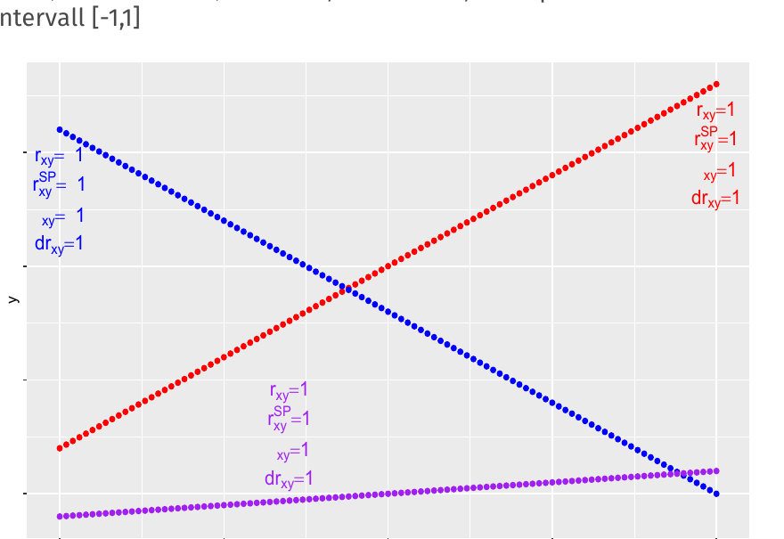

线性关系中 Pearson、Spearman、Kendall 和距离相关都会给出强关联。方向由 Pearson/Spearman/Kendall 符号体现，距离相关只给强度。

### Seite 45 - 确定性周期关系

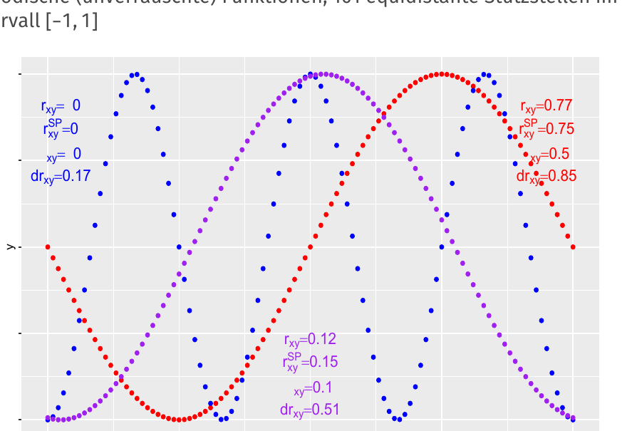

周期关系可能使 Pearson 接近 0，但显然存在结构。距离相关更可能识别非线性依赖。

### Seite 46 - 二次与三次关系

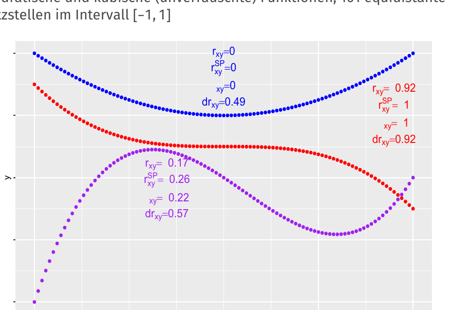

U 型关系中 Pearson 和 Spearman 可能为 0，因为没有线性或单调趋势；距离相关仍能显示依赖。

### Seite 47 - 加噪线性关系

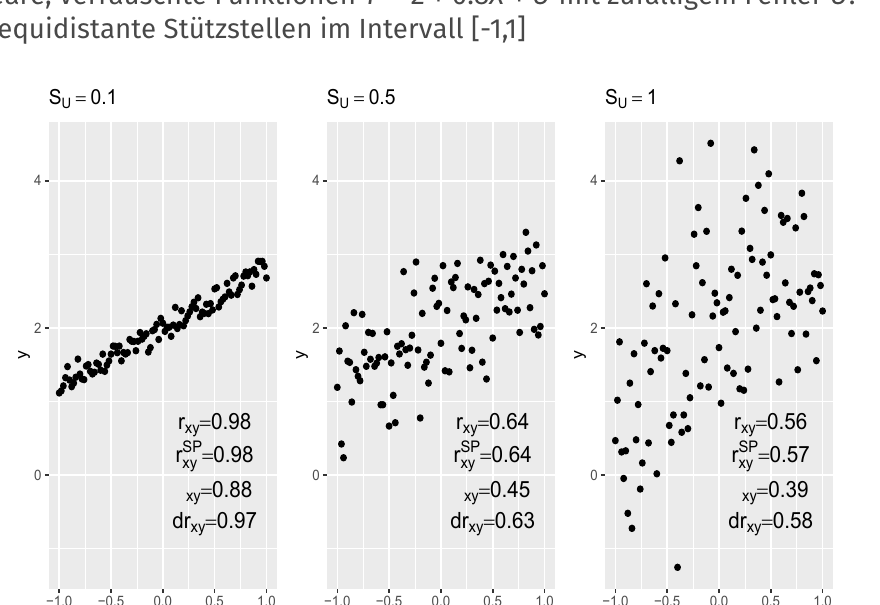

噪声越大，关联指标越弱。不同指标在近似线性关系下通常趋势一致。

### Seite 48 - 更多同统计量反例

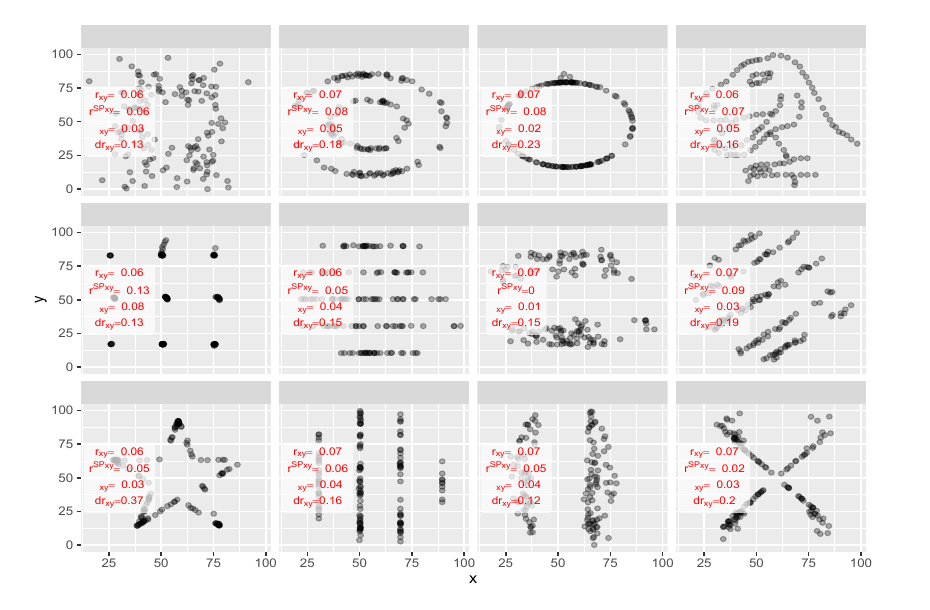

多组数据相关数值接近，但形状不同。再次说明：必须画图。

## 模块六：二分类目标与连续/有序评分（Seite 49-72）

最后一个模块看起来像突然换话题，其实它还是“关联”的问题，只是变量类型变了。现在 $Y$ 不是连续变量，而是二分类：有病/没病、违约/不违约、购买/不购买。$X$ 通常是一个连续评分，比如血糖值、风险分数、诊断 score。普通相关在这里不够贴近实际问题，因为真实问题不是“线性相关有多强”，而是：**我能不能用这个分数把两类人分开？阈值该放在哪里？误判的代价是什么？**

一旦引入阈值（Schwellenwert），事情就变成取舍：阈值低，容易抓到更多真阳性，但假阳性也会变多；阈值高，假阳性少了，但可能漏掉真阳性。敏感性（Sensitivität）和特异性（Spezifität）就是在描述这个取舍。ROC 曲线把所有阈值的表现画出来，AUC 再把整条曲线压缩成一个总体区分能力。

但故事还没完。实际诊断里，大家更关心“阳性结果到底有多可信”，这就轮到 ppV；“阴性结果到底能不能放心”，这就轮到 npV。它们又会受到患病率/基础率（Prävalenz）的强烈影响。所以 Seite 49-72 的主线是：**当目标是二分类时，别再只问相关，而要问分类、阈值、错误代价和基础率。**

### Seite 49 - 转入二分类与有序/度量变量

本页切换到二分类目标变量（dichotomes Merkmal）与至少有序评分变量的关联指标。

### Seite 50 - 二分类与度量变量场景

典型场景：

- 医学：诊断测试，$X$ 为 biomarker 或 score，$Y$ 为病/健康。
- 市场营销：$X$ 为客户特征，$Y$ 为是否购买。
- 信用评分：$X$ 为 score，$Y$ 为是否违约。

### Seite 51 - 敏感性与特异性：设定

设 $Y\in\{0,1\}$，$X$ 至少有序。通过阈值 $c$ 预测：

$$
\hat{y}=1 \Leftrightarrow x\ge c
$$

问题：如何选择阈值？$X$ 对预测 $Y$ 整体有多好？

### Seite 52 - 混淆矩阵与阈值困境

阈值越高，正预测越少：假阳性减少，但真阳性也可能减少。阈值越低，负预测越少：假阴性减少，但假阳性增加。

这就是敏感性（Sensitivität）与特异性（Spezifität）的 trade-off。

### Seite 53 - Sensitivität、Spezifität、FPR

定义：

$$
TPR(c)=P(\hat{Y}=1|Y=1)
$$

$$
FPR(c)=P(\hat{Y}=1|Y=0)
$$

$$
TNR(c)=P(\hat{Y}=0|Y=0)=1-FPR(c)
$$

Sensitivity = TPR；Specificity = TNR。

### Seite 54 - ROC 曲线

ROC 曲线连接所有阈值下的：

$$
(FPR(c),TPR(c))
$$

也就是 $(1-\text{Spezifität},\ \text{Sensitivität})$。它展示所有阈值下预测性能的整体形状。

### Seite 55 - ROC 例子 1：中等关联

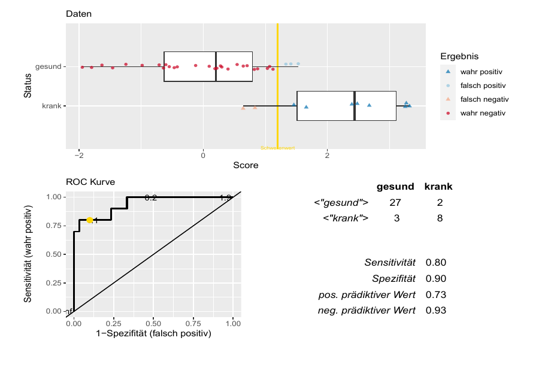

图中展示 score 分布、阈值、混淆矩阵和 ROC 曲线。阈值位置决定 Sensitivität 与 Spezifität。

### Seite 56 - ROC 例子 2：中等关联

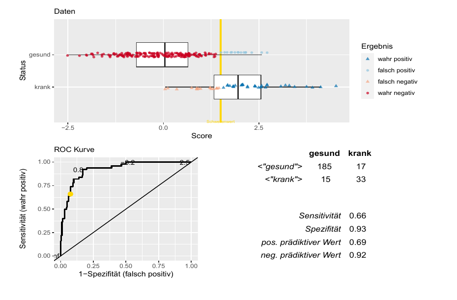

同样的总体关联下，不同阈值会改变假阳性和假阴性数量。

### Seite 57 - ROC 例子 2：阈值变化

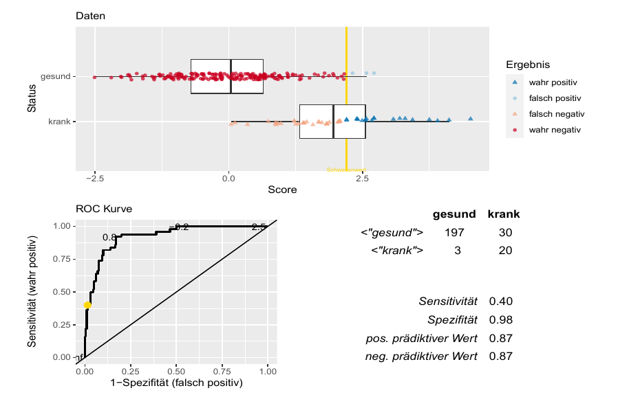

阈值升高通常提高特异性，但降低敏感性。选择阈值取决于错误代价。

### Seite 58 - ROC 例子 2：另一阈值

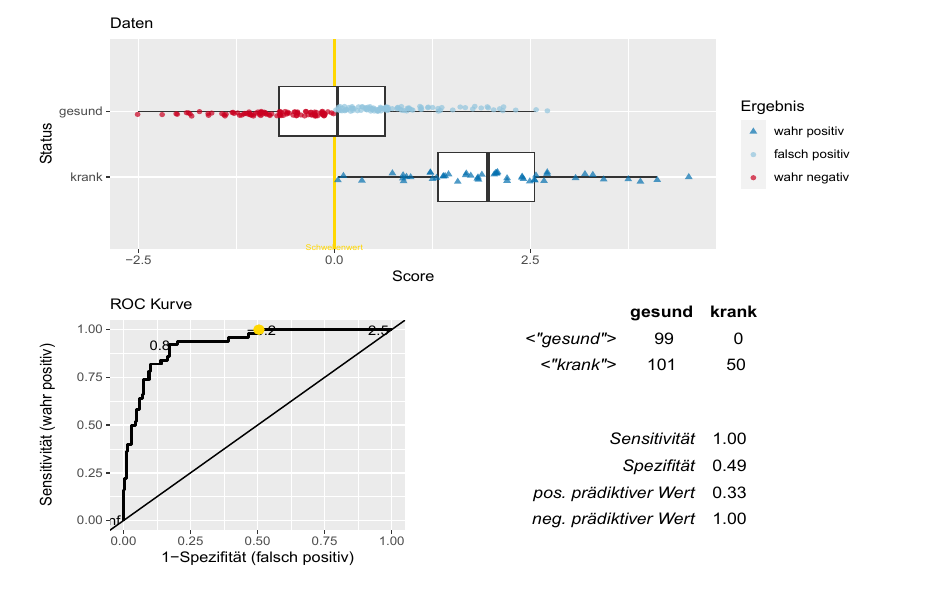

图中继续展示阈值变化如何改变混淆矩阵。考试要能把图中四格翻译为 TP、FP、TN、FN。

### Seite 59 - 无关联例子 I

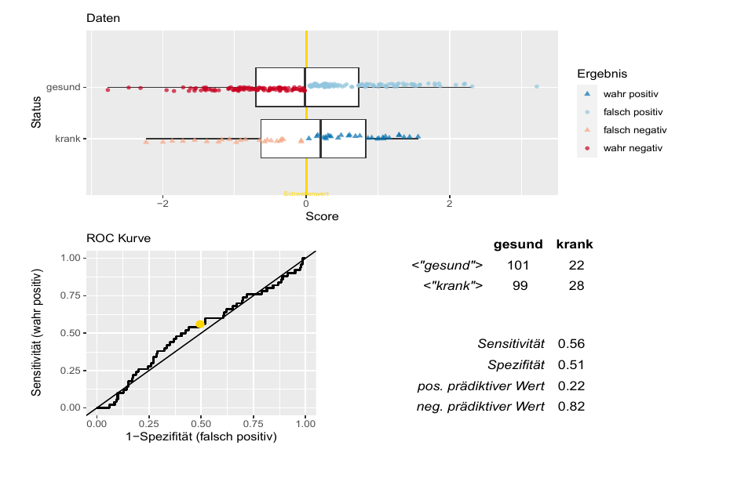

若 score 与状态几乎无关，ROC 曲线接近对角线，AUC 接近 0.5。

### Seite 60 - 无关联例子 II

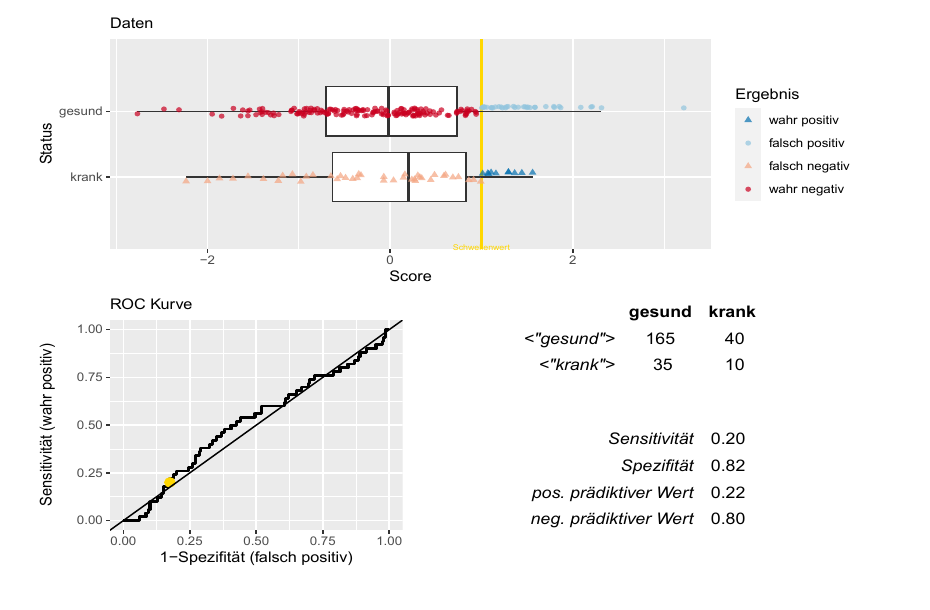

改变阈值可得到不同 Sensitivität/Spezifität，但整体性能仍差。

### Seite 61 - 无关联例子 III

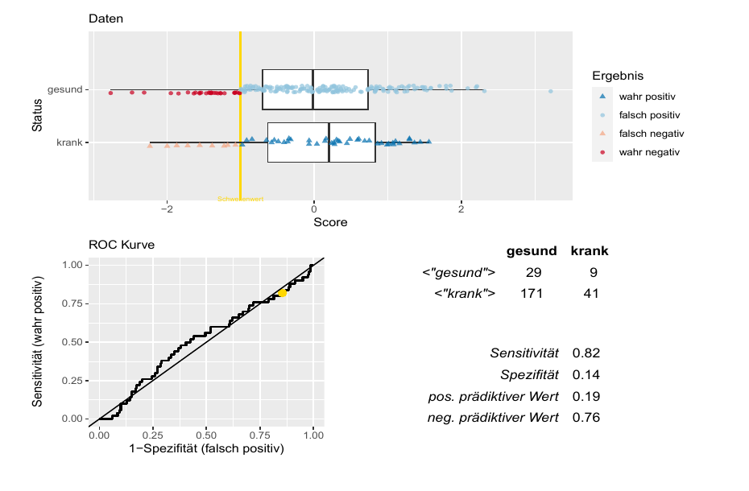

高敏感性可能只是因为阈值很低，并不代表模型真正区分了两组。

### Seite 62 - 强关联例子

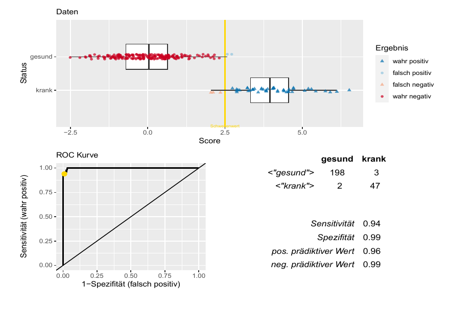

当 score 对两组区分明显时，ROC 曲线靠近左上角，Sensitivity 和 Specificity 可同时较高。

### Seite 63 - 有并列值的 ROC 曲线

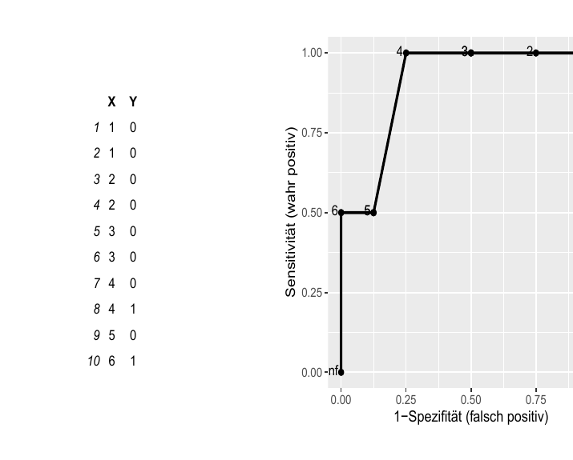

若 score 有并列（Bindungen / ties），ROC 曲线会出现水平或垂直阶梯，需要对并列对进行特殊处理。

### Seite 64 - AUC 定义

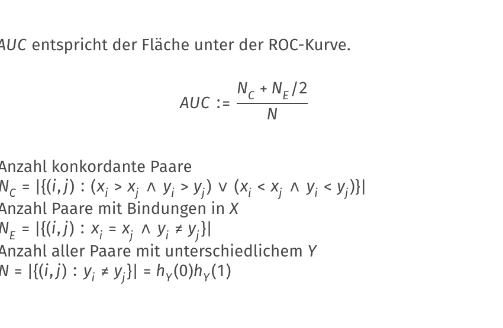

AUC 是 ROC 曲线下的面积（Area Under the Curve）。也可解释为：随机抽取一名正例和一名负例，正例 score 更高的概率，ties 计半。

### Seite 65 - AUC 解释

解释：

- $AUC=1$：完美分离。
- `AUC≈0.5`：与随机猜测相近。
- AUC 衡量基于 score 的阈值规则预测 $Y$ 的整体能力。

**注意：** AUC 不告诉你该选择哪个阈值。

### Seite 66 - Pima Indian Diabetes 数据

Pima Indian Diabetes 数据包含 532 名 21 岁以上女性，研究糖尿病与代谢指标、年龄、妊娠次数等变量的关系。

问题：哪些变量可作为糖尿病风险因子或预测指标？

### Seite 67 - Pima 数据散点矩阵

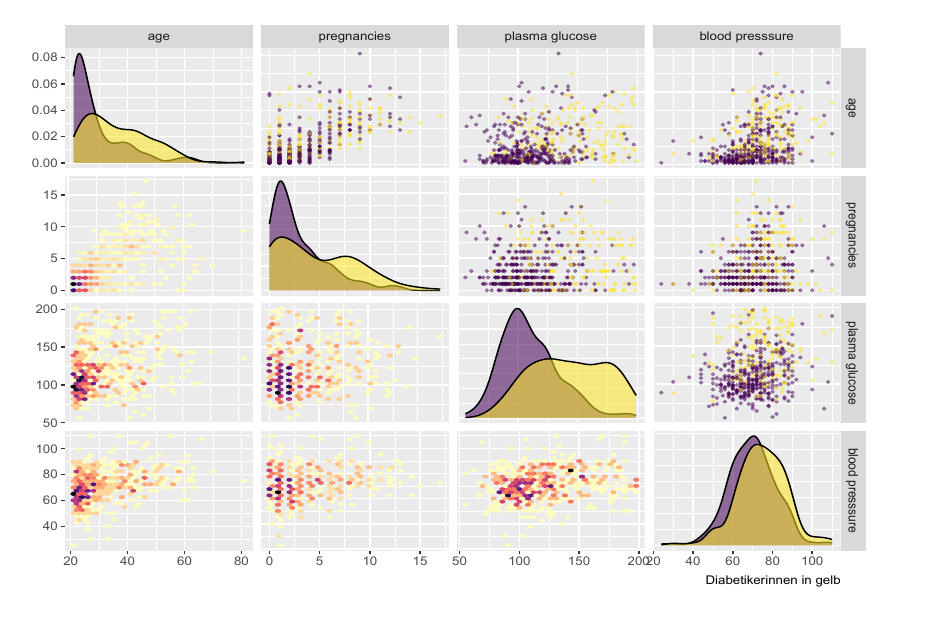

黄色表示糖尿病患者。散点矩阵帮助观察变量之间关系，以及状态组是否在某些变量上分离。

### Seite 68 - Pima 数据：箱线图与 ROC

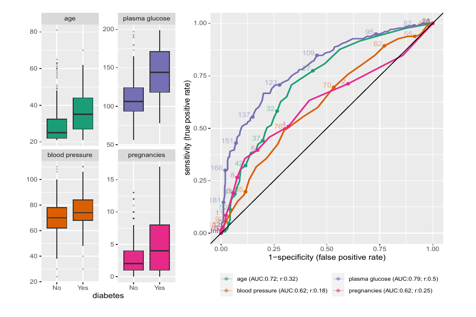

不同变量的 AUC 不同。血糖（plasma glucose）通常预测力较强，年龄和血压较弱。

### Seite 69 - Pima 数据：模型分数

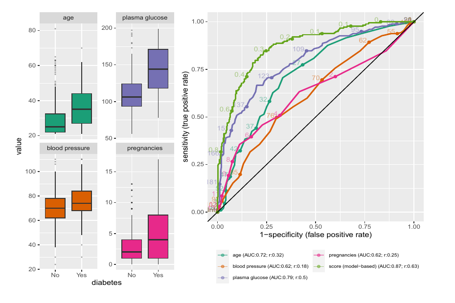

模型综合 score 的 AUC 可高于单一变量，说明组合信息能提升预测性能。

### Seite 70 - AUC 批判

AUC 平等看待敏感性和特异性，但现实中假阳性与假阴性的后果可能完全不同。

因此还要看：

- 阳性预测值（positiv prädiktiver Wert, ppV）
- 阴性预测值（negativ prädiktiver Wert, npV）
- 错误代价和患病率（Prävalenz）

### Seite 71 - ppV 与 npV

NIPT 例子说明：即使 Sensitivität 和 Spezifität 都很高，若疾病极罕见，阳性预测值 ppV 仍可能不高。

$$
ppV=P(Y=1|\hat{Y}=1),\quad npV=P(Y=0|\hat{Y}=0)
$$

**考点：** ppV/npV 强烈依赖基础率（Basisrate / Prävalenz）。

### Seite 72 - 术语混乱与指标总览

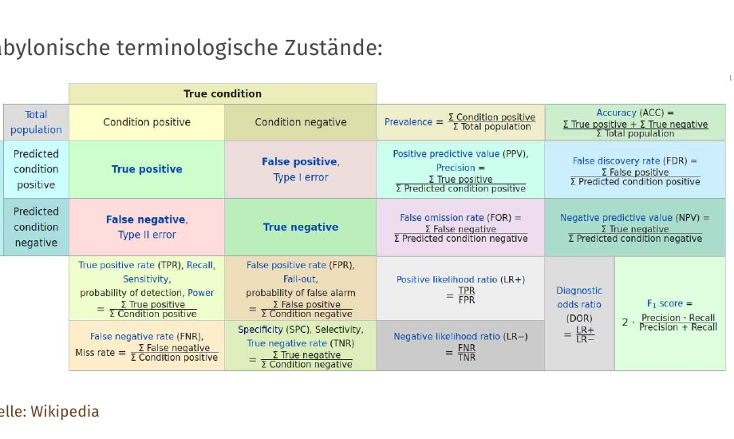

诊断指标术语非常多，且不同领域命名不统一。做题时优先回到混淆矩阵定义，避免被名称绕晕。

## 本章逻辑梳理

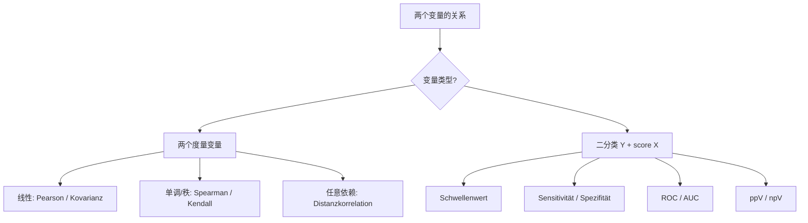
```mermaid
flowchart TD
  A["两个变量的关系"] --> B{"变量类型?"}
  B --> C["两个度量变量"]
  C --> C1["线性: Pearson / Kovarianz"]
  C --> C2["单调/秩: Spearman / Kendall"]
  C --> C3["任意依赖: Distanzkorrelation"]
  B --> D["二分类 Y + score X"]
  D --> D1["Schwellenwert"]
  D --> D2["Sensitivität / Spezifität"]
  D --> D3["ROC / AUC"]
  D --> D4["ppV / npV"]
```

## 关键考核点

1. 协方差有单位，Pearson 相关无量纲。
2. Pearson 相关只度量线性关系，必须结合散点图。
3. 独立推出不相关；不相关不推出独立。
4. Spearman 和 Kendall 度量秩/单调关系。
5. 距离相关可捕捉更一般的依赖，但不给方向。
6. ROC 曲线展示所有阈值下的 TPR-FPR trade-off。
7. AUC 不等于 ppV；ppV/npV 依赖基础率。

## 本章公式清单

本章公式不要按出现顺序死背，而要按“我要解决什么问题”来记。第一类公式回答“两个度量变量有没有线性一起变动”；第二类把样本公式推广到随机变量；第三类处理“线性不够用”的秩关系和一般依赖；第四类处理二分类目标变量和连续评分的诊断问题。

### A. 样本层面的线性关联

|  序号 | 公式                                                                     | 使用场景                                                | 注意事项                                          |
| --: | ---------------------------------------------------------------------- | --------------------------------------------------- | --------------------------------------------- |
|   1 | $S_{xy}=\frac{1}{n-1}\sum_{i=1}^{n}(x_i-\bar{x})(y_i-\bar{y})$         | 计算两个观测变量的样本协方差（Stichprobenkovarianz）。               | 有单位，数值大小受 $X$、$Y$ 的量纲影响，不适合直接跨变量比较。           |
|   2 | $S_{xx}=S_x^2$                                                         | 把协方差公式用于同一个变量时得到样本方差。                               | 这是理解“协方差是方差的推广”的关键。                           |
|   3 | $r_{xy}=\frac{S_{xy}}{S_xS_y}$                                         | 把协方差标准化，得到 Pearson 相关（Bravais-Pearson-Korrelation）。 | 无量纲，范围在 $[-1,1]$，但只度量线性关系。                    |
|   4 | $-1\le r_{xy}\le 1$                                                    | 判断 Pearson 相关系数是否合法，并解释强弱。                          | $\lvert r\rvert$ 越接近 1，线性关系越强；$r=0$ 只表示无线性关系。 |
|   5 | $r=1 \Leftrightarrow Y=aX+b,\ a>0$；$r=-1 \Leftrightarrow Y=aX+b,\ a<0$ | 判断完美正/负线性关系。                                        | 斜率大小不影响 $\lvert r\rvert$，只影响方向和单位变化。          |

### B. 随机变量层面的协方差与相关

|  序号 | 公式                                                                                                   | 使用场景                            | 注意事项                                                                            |
| --: | ---------------------------------------------------------------------------------------------------- | ------------------------------- | ------------------------------------------------------------------------------- |
|   6 | $Cov(X,Y)=E[(X-E(X))(Y-E(Y))]$                                                                       | 定义随机变量的协方差。                     | 这是总体/理论层面的公式，不是样本数据里的 $S_{xy}$。                                                 |
|   7 | $\rho(X,Y)=\frac{Cov(X,Y)}{\sqrt{Var(X)}\sqrt{Var(Y)}}$                                              | 定义随机变量的相关系数。                    | 要求 $Var(X)>0$ 且 $Var(Y)>0$。                                                     |
|   8 | $Cov(X,Y)=E(XY)-E(X)E(Y)$                                                                            | 计算协方差时的快捷公式（Verschiebungssatz）。 | 常比定义式更好算，尤其在已知 $E(XY)$ 时。                                                       |
|   9 | $Cov(X,Y)=0 \Leftrightarrow E(XY)=E(X)E(Y)$                                                          | 判断不相关（Unkorreliertheit）。        | 不相关不等于独立；独立可以推出不相关。                                                             |
|  10 | $-1\le \rho(X,Y)\le 1$                                                                               | 判断总体相关系数范围。                     | 与样本相关 $r$ 类似，但对象是随机变量。                                                          |
|  11 | $\lvert\rho(X,Y)\rvert=1 \Leftrightarrow P(Y=a+bX)=1,\ b\ne0$；且 $\rho=1$ 对应 $b>0$，$\rho=-1$ 对应 $b<0$ | 判断随机变量之间的完美线性依赖。                | 对随机变量要写成“几乎必然”（fast sicher / mit Wahrscheinlichkeit 1）的线性关系；只说明线性依赖，不涵盖非线性确定关系。 |
|  12 | $Cov(a+bX,c+dY)=bd\cdot Cov(X,Y)$                                                                    | 研究线性变换对协方差的影响。                  | 协方差会随尺度因子 $b,d$ 改变。                                                             |
|  13 | $\rho(a+bX,c+dY)=sgn(b)sgn(d)\rho(X,Y)$                                                              | 研究线性变换对相关的影响。                   | 同向缩放相关不变；一边反向会改变符号。                                                             |
|  14 | $Var(X+Y)=Var(X)+Var(Y)+2Cov(X,Y)$                                                                   | 计算两个随机变量和的方差。                   | 若 $X,Y$ 独立或不相关，协方差项为 0。                                                         |

### C. 正态分布中的相关结构

|  序号 | 公式                                                                                           | 使用场景                                             | 注意事项                                      |
| --: | -------------------------------------------------------------------------------------------- | ------------------------------------------------ | ----------------------------------------- |
|  15 | $f(x,y)=\frac{1}{2\pi\sqrt{1-\rho^2}}\exp\left(-\frac{x^2-2\rho xy+y^2}{2(1-\rho^2)}\right)$ | 二元标准正态分布（bivariate Standardnormalverteilung）的密度。 | 参数 $\rho$ 同时控制等高线倾斜和 $X,Y$ 的相关。           |
|  16 | $\sigma_{XY}=Cov(X,Y)=\rho\sigma_X\sigma_Y$                                                  | 从相关和标准差得到协方差。                                    | 多元正态中协方差矩阵 $\Sigma$ 是核心对象。                |
|  17 | $\mathbf{X}\sim\mathcal{N}(\boldsymbol{\mu},\Sigma)$                                         | 表示多元正态分布。                                        | $\boldsymbol{\mu}$ 是期望向量，$\Sigma$ 是协方差矩阵。 |

### D. 秩相关、成对比较与距离相关

|  序号 | 公式                                                                                                                                                                                                                                                                                                                  | 使用场景                                                          | 注意事项                                                                                  |
| --: | ------------------------------------------------------------------------------------------------------------------------------------------------------------------------------------------------------------------------------------------------------------------------------------------------------------------- | ------------------------------------------------------------- | ------------------------------------------------------------------------------------- |
|  18 | $r^{SP}_{xy}=Cor(rg(x),rg(y))$                                                                                                                                                                                                                                                                                      | Spearman 秩相关：把数值换成秩后计算 Pearson。                               | 适合至少有序变量，度量单调关系，不要求线性。                                                                |
|  19 | $r^{SP}=1-\frac{6\sum d_i^2}{n(n^2-1)}$                                                                                                                                                                                                                                                                             | 无并列秩时计算 Spearman 的简化公式。                                       | 有 ties 时不要机械套用，应使用平均秩后再算相关。                                                           |
|  20 | $\tau=\frac{N_C-N_D}{n(n-1)/2}$                                                                                                                                                                                                                                                                                     | Kendall's Tau：基于协同对（konkordant）和不协同对（diskordant）。             | 更像“排序一致性”指标，通常绝对值小于 Spearman。                                                         |
|  21 | $\gamma=\frac{N_C-N_D}{N_C+N_D}$                                                                                                                                                                                                                                                                                    | Goodman-Kruskal Gamma。                                        | 忽略有 ties 的观测对；ties 很多时解释要谨慎。                                                          |
|  22 | $d_{ij}^{x}=\lvert x_i-x_j\rvert$；$\bar d_{i\cdot}^{x}=\frac1n\sum_{j=1}^{n}d_{ij}^{x}$；$\bar d_{\cdot j}^{x}=\frac1n\sum_{i=1}^{n}d_{ij}^{x}$；$\bar d_{\cdot\cdot}^{x}=\frac1{n^2}\sum_{i=1}^{n}\sum_{j=1}^{n}d_{ij}^{x}$；$D_{ij}^{x}=d_{ij}^{x}-\bar d_{i\cdot}^{x}-\bar d_{\cdot j}^{x}+\bar d_{\cdot\cdot}^{x}$ | 距离相关中先计算所有观测两两距离，再做双中心化（doppelte Zentrierung）。                | 只写 $d_{ij}^{x}=\lvert x_i-x_j\rvert$ 不够；真正进入距离协方差的是中心化后的 $D_{ij}^{x}$ 和 $D_{ij}^{y}$。 |
|  23 | $dS_{xy}^{2}=\frac1{n^2}\sum_{i=1}^{n}\sum_{j=1}^{n}D_{ij}^{x}D_{ij}^{y}$；$dR_{xy}^{2}=\frac{dS_{xy}^{2}}{\sqrt{dS_{xx}^{2}dS_{yy}^{2}}}$                                                                                                                                                                           | 距离协方差与距离相关（Distanzkovarianz / Distanzkorrelation），用于捕捉更一般的依赖。 | 范围 $[0,1]$，只给强度，不给正负方向；若 $dS_{xx}^{2}$ 或 $dS_{yy}^{2}$ 为 0，则距离相关不适用或需特殊定义。            |

### E. 二分类目标与诊断指标

|  序号 | 公式                                     | 使用场景                                | 注意事项                                   |
| --: | -------------------------------------- | ----------------------------------- | -------------------------------------- |
|  24 | $\hat{y}=1 \Leftrightarrow x\ge c$     | 用连续/有序 score $X$ 和阈值 $c$ 预测二分类 $Y$。 | 阈值改变会同时改变假阳性和假阴性。                      |
|  25 | $TPR(c)=P(\hat{Y}=1\mid Y=1)$          | 敏感性（Sensitivität）：真正例中被抓到的比例。       | 也叫 true positive rate；高敏感性不代表阳性结果一定可信。 |
|  26 | $FPR(c)=P(\hat{Y}=1\mid Y=0)$          | 假阳性率：真实负例中被误判为正的比例。                 | ROC 横轴通常就是 $FPR=1-\text{Spezifität}$。  |
|  27 | $TNR(c)=P(\hat{Y}=0\mid Y=0)=1-FPR(c)$ | 特异性（Spezifität）：真负例中被正确识别的比例。       | 与敏感性常存在 trade-off。                     |
|  28 | $ROC:\ (FPR(c),TPR(c))$                | ROC 曲线，把所有阈值下的表现连起来。                | 看整体区分能力，不直接告诉你最优阈值。                    |
|  29 | $AUC=\frac{N_C+N_E/2}{N}$              | ROC 曲线下面积，也可解释为正例 score 高于负例的概率。    | $AUC=0.5$ 约等于随机，$AUC=1$ 是完美区分。         |
|  30 | $ppV=P(Y=1\mid\hat{Y}=1)$              | 阳性预测值：被判为阳性的人里真阳性的比例。               | 强烈依赖 Prävalenz；低患病率下 ppV 可能很低。         |
|  31 | $npV=P(Y=0\mid\hat{Y}=0)$              | 阴性预测值：被判为阴性的人里真阴性的比例。               | 同样依赖基础率；不能只看 Sensitivität/Spezifität。  |

## 章节自测

- [x] Pearson 相关对线性变换的单位变化不敏感。
- [ ] $r=0$ 表示两个变量独立。
- [x] Spearman 相关基于秩。
- [x] Kendall's Tau 基于成对比较。
- [x] AUC 接近 0.5 表示预测能力接近随机。
- [ ] 高 Sensitivität 一定意味着高 ppV。
- [x] ppV 受患病率/基础率影响。

## 德语词汇表

| Deutsch | 中文 | 使用提示 |
|---|---|---|
| Zusammenhangsmaß | 关联度量 | 总称 |
| metrisches Merkmal | 度量变量 | 连续/数值变量 |
| Kovarianz | 协方差 | 有单位 |
| Bravais-Pearson-Korrelationskoeffizient | Pearson 相关系数 | 线性关系 |
| linearer Zusammenhang | 线性关系 | Pearson 核心 |
| unkorreliert | 不相关 | 协方差为 0 |
| Unabhängigkeit | 独立 | 强于不相关 |
| Ausreißer | 离群值 | 影响 Pearson |
| Kovarianzmatrix | 协方差矩阵 | 多变量 |
| Korrelationsmatrix | 相关矩阵 | 对角线为 1 |
| Scatterplotmatrix | 散点矩阵 | 多变量图 |
| Rang | 秩 | Spearman/Kendall |
| Spearman-Korrelation | Spearman 秩相关 | 单调关系 |
| Kendall's Tau | Kendall Tau | 成对比较 |
| konkordant | 协同的 | 排序一致 |
| diskordant | 不协同的 | 排序相反 |
| Bindung / ties | 并列值 | 平均秩或特殊处理 |
| Distanzkorrelation | 距离相关 | 任意依赖 |
| dichotomes Merkmal | 二分类变量 | 0/1 目标 |
| Schwellenwert | 阈值 | 分类规则 |
| Sensitivität | 敏感性 | TPR |
| Spezifität | 特异性 | TNR |
| falsch positiv | 假阳性 | FP |
| falsch negativ | 假阴性 | FN |
| ROC-Kurve | ROC 曲线 | TPR vs FPR |
| AUC | 曲线下面积 | 总体区分能力 |
| positiver prädiktiver Wert | 阳性预测值 | ppV |
| negativer prädiktiver Wert | 阴性预测值 | npV |
| Prävalenz | 患病率/基础率 | 影响 ppV/npV |

## C1 德语句式

| 序号 | 德语句式 | 中文翻译 | 使用场景 |
|---:|---|---|---|
| 1 | Die Kovarianz misst Richtung und Stärke der gemeinsamen linearen Abweichung zweier metrischer Merkmale. | 协方差衡量两个度量变量共同线性偏离的方向和强度。 | 解释 Kovarianz 的定义和直觉。 |
| 2 | Der Bravais-Pearson-Korrelationskoeffizient ist eine dimensionslose Standardisierung der Kovarianz. | Bravais-Pearson 相关系数是协方差的无量纲标准化形式。 | 说明 Pearson 与 Kovarianz 的关系。 |
| 3 | Eine Korrelation von null bedeutet lediglich keinen linearen Zusammenhang, nicht notwendigerweise Unabhängigkeit. | 相关为零只表示没有线性关系，并不必然表示独立。 | 处理 $r=0$ 或 $\rho=0$ 的陷阱题。 |
| 4 | Die grafische Darstellung ist unverzichtbar, weil identische Kennzahlen sehr unterschiedliche Datenstrukturen verdecken können. | 图形展示不可或缺，因为相同的统计指标可能掩盖非常不同的数据结构。 | 解释为什么相关系数必须配合散点图。 |
| 5 | Spearman-Korrelationen beruhen auf Rängen und erfassen monotone Zusammenhänge. | Spearman 相关基于秩，捕捉单调关系。 | 区分 Pearson 与 Spearman。 |
| 6 | Kendall's Tau vergleicht die Anzahl konkordanter und diskordanter Beobachtungspaare. | Kendall's Tau 比较协同观测对和不协同观测对的数量。 | 解释 Kendall's Tau 的成对比较思想。 |
| 7 | Die Distanzkorrelation kann auch nichtlineare und nichtmonotone Abhängigkeiten erfassen. | 距离相关也能捕捉非线性、非单调的依赖关系。 | 当 Pearson/Spearman 不够时说明替代指标。 |
| 8 | Die ROC-Kurve beschreibt den Trade-off zwischen Sensitivität und falsch-positiver Rate über alle Schwellenwerte hinweg. | ROC 曲线描述所有阈值下敏感性与假阳性率之间的取舍。 | 解释 ROC 曲线坐标和阈值变化。 |
| 9 | Der AUC-Wert ist nicht gleichbedeutend mit dem positiven prädiktiven Wert. | AUC 值不等同于阳性预测值。 | 防止把 AUC 与 ppV 混淆。 |
| 10 | Bei seltenen Ereignissen kann selbst ein Test mit hoher Sensitivität und Spezifität einen niedrigen ppV aufweisen. | 对罕见事件，即使测试有很高的敏感性和特异性，也可能只有较低的阳性预测值。 | 解释低 Prävalenz 下 ppV 变低的原因。 |

