# 第12章：相关与因果（Korrelation & Kausalität）

> 本章核心不是“会不会算相关”，而是：看到相关（Korrelation）时，能否识别背后的因果结构（kausale Struktur）、混杂（Confounding）、聚合偏差（Aggregationseffekt）和选择偏差（Selektionsbias）。考试常把图、列联表、分组散点图放在一起，要求判断“能不能作因果解释”。

## 章节知识树

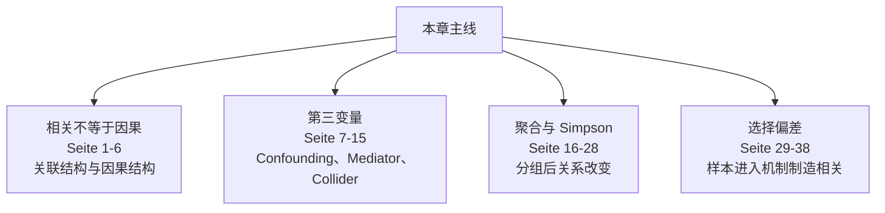
```mermaid
flowchart TD
  A["本章主线"]
  A --> M1["相关不等于因果<br/>Seite 1-6<br/>关联结构与因果结构"]
  A --> M2["第三变量<br/>Seite 7-15<br/>Confounding、Mediator、Collider"]
  A --> M3["聚合与 Simpson<br/>Seite 16-28<br/>分组后关系改变"]
  A --> M4["选择偏差<br/>Seite 29-38<br/>样本进入机制制造相关"]
```

## 学习路径

相关描述一起变化，因果描述干预后会发生什么；本章训练你识别混杂、聚合和选择机制制造的伪关联。

1. **相关不等于因果：** 关联结构与因果结构（Seite 1-6）。
2. **第三变量：** Confounding、Mediator、Collider（Seite 7-15）。
3. **聚合与 Simpson：** 分组后关系改变（Seite 16-28）。
4. **选择偏差：** 样本进入机制制造相关（Seite 29-38）。

## 模块地图

| 模块 | 页码 | 核心问题 |
| --- | --- | --- |
| 相关不等于因果 | Seite 1-6 | 关联结构与因果结构 |
| 第三变量 | Seite 7-15 | Confounding、Mediator、Collider |
| 聚合与 Simpson | Seite 16-28 | 分组后关系改变 |
| 选择偏差 | Seite 29-38 | 样本进入机制制造相关 |

## 考试优先级

1. 会区分关联结构（assoziative Struktur）和因果结构（kausale Struktur）。
2. 会识别 Confounder、Mediator、Collider，并说明是否应控制。
3. 会解释 Simpson-Paradox 和生态谬误为什么来自聚合。
4. 会说明选择偏差如何让无关变量产生相关。

## 模块零：先把一句老话说具体（Seite 1-6）

“相关不等于因果”太空泛。考试真正想看的是：为什么不能推出因果？是共同原因、反向因果、中介、碰撞点，还是选择机制？本章就是把这句话拆成可诊断的结构。

### Seite 1 - 本章路线图

本章讨论相关（Korrelation）与因果（Kausalität）的关系。讲义分成四个问题链：

1. 因果结构（kausale Struktur）与关联结构（assoziative Struktur）有什么区别？
2. 第三变量（Drittvariable）如何制造或改变表面关联（Scheinassoziation）？
3. 聚合（Aggregation）为什么可能导致辛普森悖论（Simpson-Paradox）或生态谬误（ökologischer Fehlschluss）？
4. 样本选择（Stichprobenauswahl）为什么会凭空制造相关？

**考核抓手：** 只说“相关不等于因果”不够。要能指出具体机制：共同原因（gemeinsame Ursache）、中介变量（Mediator）、碰撞点（Collider）、遗漏变量偏差（Omitted Variable Bias）或内生选择偏差（Endogenous Selection Bias）。

### Seite 2 - 章节结构

本页重复目录，说明本章按三类“伪关联”（Scheinassoziation）展开：

- 通过第三变量（über Drittvariablen）：典型是混杂（Confounding）。
- 通过聚合（durch Aggregation）：典型是辛普森悖论（Simpson-Paradox）和生态谬误（ökologischer Fehlschluss）。
- 通过样本选择（durch Stichprobenauswahl）：典型是对碰撞点（Collider）条件化。

**逻辑梳理：**

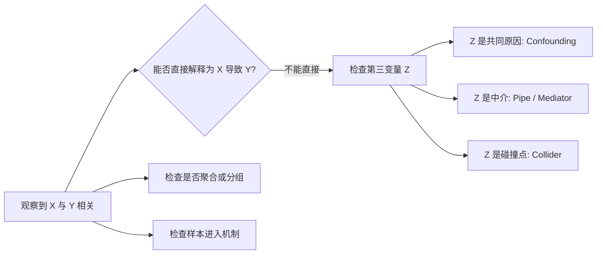
```mermaid
flowchart LR
  A["观察到 X 与 Y 相关"] --> B{"能否直接解释为 X 导致 Y?"}
  B -->|不能直接| C["检查第三变量 Z"]
  C --> D["Z 是共同原因: Confounding"]
  C --> E["Z 是中介: Pipe / Mediator"]
  C --> F["Z 是碰撞点: Collider"]
  A --> G["检查是否聚合或分组"]
  A --> H["检查样本进入机制"]
```

### Seite 3 - 因果结构与关联结构


本页进入第一节：因果结构（kausale Struktur）与关联结构（assoziative Struktur）。图中“相关”（correlation）标注只是提示：两个现象同时出现，不等于其中一个导致另一个。

中文考试表达可以这样组织：

- 关联结构（assoziative Struktur）描述变量之间是否统计相关。
- 因果结构（kausale Struktur）描述干预一个变量是否会改变另一个变量。
- 观察数据（Beobachtungsdaten）通常只能稳定地说明关联，不能自动推出因果。

**关键区分：** `P(Y | X)` 的差异是关联；`P(Y | do(X))` 的差异才接近因果干预（Intervention）的语言。

### Seite 4 - 同一关联可由多种因果结构产生

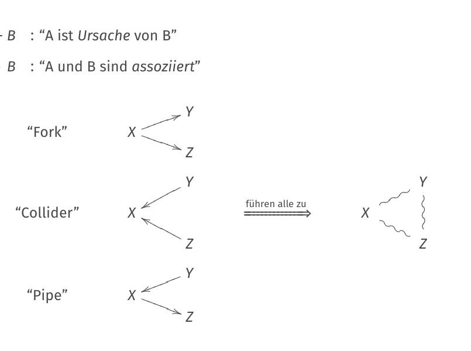

讲义展示三类基本图结构：

- Fork（Fork）：`X <- Z -> Y`，Z 是共同原因（gemeinsame Ursache）。
- Collider（Collider）：`X -> Z <- Y`，Z 是共同结果或碰撞点（gemeinsame Wirkung）。
- Pipe（Pipe）：`X -> Z -> Y`，Z 是链条中的中介变量（Mediator）。

这些结构都可能让变量之间出现关联（Assoziation），但因果解释完全不同。考试中如果只看到 `X` 和 `Y` 有相关，不能直接判断是哪一种结构。

**小测验：**

- [ ] 只要 `X` 和 `Y` 相关，就能说明 `X` 导致 `Y`。
- [x] 相同的相关结构可能由不同的因果图（Kausalgraph）生成。
- [x] Fork 中的第三变量通常是共同原因（gemeinsame Ursache）。

### Seite 5 - 非独立不等于直接因果

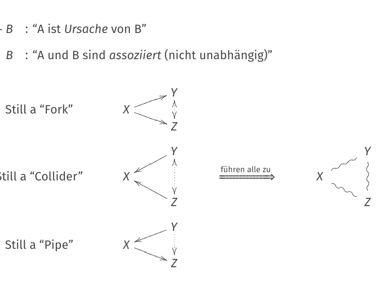

本页进一步说明：`A` 与 `B` 相关、即不独立（nicht unabhängig），仍然可能来自不同路径。

三种结构的解释：

- Fork：`X` 和 `Y` 因同一个 `Z` 变化而一起变化，可能没有直接因果。
- Collider：如果没有条件化，`X` 和 `Y` 常可独立；一旦条件化在 `Z` 上，可能出现关联。
- Pipe：`X` 通过 `Z` 影响 `Y`，此时 `Z` 是中介（Mediator）。

**考点：** 看到第三变量（Drittvariable）时，不要机械地说“控制它”。控制共同原因常有帮助；控制中介会改变总效应（totaler Effekt）的含义；控制碰撞点可能制造偏差。

### Seite 6 - 因果解释必须谨慎

本页结论：不同的因果结构（kausale Strukturen）可能产生相同的关联结构（assoziative Strukturen）。因此，因果解释（kausale Interpretation）必须非常谨慎。

讲义同时强调一种更柔性的说法：随机或概率因果性（stochastische / probabilistische Kausalität）。也就是说，原因不必决定性地导致结果，而是改变结果发生的概率。

例子：

- 吸烟（Rauchen）不必然导致肺癌（Lungenkrebs），但会提高肺癌概率。
- 补习（Nachhilfe）不必然提高成绩，但可能改变成绩分布。

**德语考试句式：**  
`Eine beobachtete Assoziation erlaubt ohne zusätzliche Annahmen keine eindeutige kausale Interpretation.`

## 模块一：第三变量会制造或改变关联（Seite 7-15）

如果 $Z$ 同时影响 $X$ 和 $Y$，你看到的 $X$-$Y$ 相关可能只是共同原因造成的。这里要建立图结构直觉：Fork、Pipe、Collider 处理方式不同，不能一律“控制变量”。

### Seite 7 - 第三变量引起的伪关联

本页进入第二节：通过第三变量（Drittvariablen）产生的真实关联或伪关联（Scheinassoziation）。

第三变量的作用不是单一的。它可能是：

- 混杂变量（konfundierende Variable）：共同影响 `X` 和 `Y`。
- 中介变量（Mediatorvariable）：位于因果链条中。
- 碰撞变量（Collider）：由 `X` 和 `Y` 共同影响。

**页面逻辑：** 接下来先讲混杂（Confounding），再通过例子展示“总体相关”和“分组相关”为什么可能方向相反。

### Seite 8 - Confounding：共同原因造成表面相关

混杂（Confounding）指第三变量 `Z` 同时影响解释变量 `X` 和目标变量 `Y`。结构是：

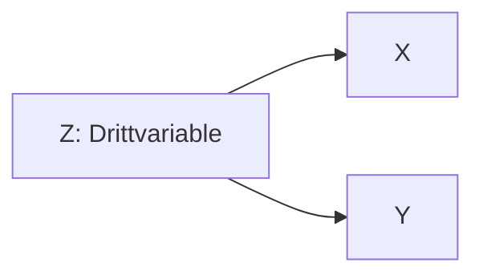
```mermaid
flowchart LR
  Z["Z: Drittvariable"] --> X["X"]
  Z --> Y["Y"]
```

如果不考虑 `Z`，`X` 与 `Y` 可能出现伪相关（Scheinkorrelation）。这类结构也叫 Fork。

讲义给出的关键词：

- 共同原因（gemeinsame Ursache）
- 虚假相关（Scheinkorrelation）
- 辛普森悖论（Simpson-Paradox）

**考核点：** 判断混杂时看两个条件：`Z` 是否影响 `X`，同时是否影响 `Y`。如果是，就不能把 `X-Y` 的边际相关（marginale Assoziation）直接当因果效应。

### Seite 9 - 伪相关的经典例子

本页列举常见伪相关（Scheinkorrelation）：

- 鹳鸟数量（Anzahl Störche）与出生率（Geburtenrate）相关，可能由农村化程度或地区结构影响。
- 溺水死亡（Ertrunkene）与冰淇淋消费（Eiskonsum）相关，第三变量可能是晴天数或气温（Sonnentage / Temperatur）。
- 鞋码（Schuhgröße）与词汇量（Wortschatz）相关，第三变量是年龄（Alter）。

**理解重点：** 这些例子不是说相关“没用”，而是说明相关需要结构解释。相关可以作为发现问题的线索，但不是因果证明（Kausalnachweis）。

### Seite 10 - 找出合理的第三变量

本页把前一页例子与第三变量对应起来：

- 鹳鸟与出生率：现代化程度（Modernisierung）或城乡结构。
- 溺水与冰淇淋：晴天数（Sonnentage）或季节。
- 鞋码与词汇量：年龄（Alter）。

**做题模板：**

1. 指出观察到的关联：`X` 与 `Y` sind assoziiert。
2. 提出第三变量：`Z` könnte eine gemeinsame Ursache sein。
3. 解释路径：`Z beeinflusst sowohl X als auch Y`。
4. 结论：边际相关不能直接作因果解释。

### Seite 11 - 补习例子：总体上看似负相关

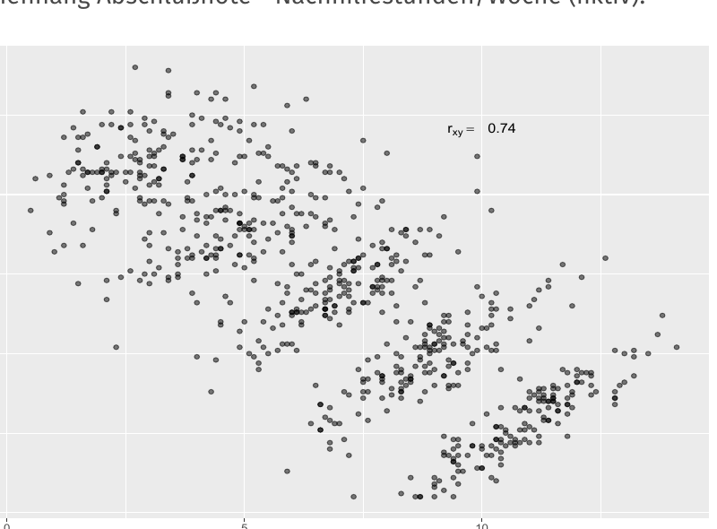

本页使用虚构数据（fiktive Daten）：补习小时数/周（Nachhilfestunden/Woche）与毕业成绩（Abschlussnote）。总体散点图显示强负相关，约 `r_xy = -0.74`。

注意德国成绩体系里较小的分数通常表示更好成绩。因此“负相关”的直观解释要小心：补习越多，成绩数值越高或越差，取决于坐标轴实际方向和变量编码。

**核心问题：** 这个总体相关是否说明“补习使成绩变差”？不能，因为学生原本的学习水平（Ausgangsniveau）或班级（Klasse）可能同时影响补习需求和成绩。

### Seite 12 - 分组后相关方向改变

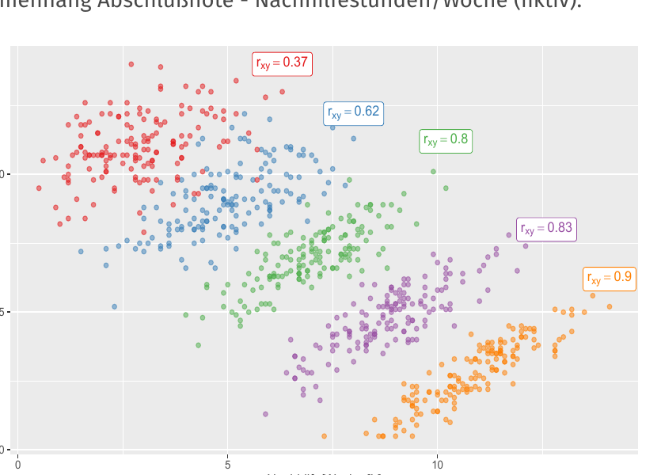

本页把数据按组别或班级（Klasse）分层。每个颜色组内部可能呈现与总体不同的趋势。

这说明边际相关（marginale Korrelation）可能混合了两件事：

- 组间差异（Unterschiede zwischen Gruppen）
- 组内关系（Zusammenhang innerhalb von Gruppen）

如果组别同时影响补习量和成绩，它就是混杂变量（Konfounder）。此时总体相关可能不是我们想要的因果效应。

**小测验：**

- [x] 分组后相关方向改变，是辛普森悖论的典型信号。
- [ ] 只要总体样本很大，就不需要考虑分组。
- [x] 组间差异可能掩盖组内关系。

### Seite 13 - 辛普森悖论的因果读法

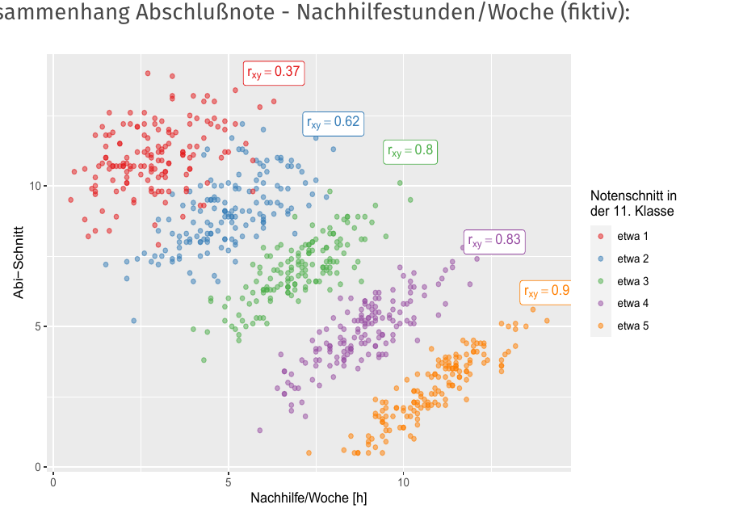

本页展示：总体上补习与成绩看似一种方向，但在每个组内可能呈现另一方向。这就是辛普森悖论（Simpson-Paradox）的直观图形。

因果解释：

- 学习困难学生更可能参加补习。
- 学习困难本身也影响成绩。
- 所以补习小时数与成绩之间的总体关系被学习困难程度混杂。

**考试要写清楚：**  
`Die marginale Assoziation wird durch die Gruppenvariable verzerrt; innerhalb der Gruppen zeigt sich ein anderer Zusammenhang.`

### Seite 14 - 聚合引起的伪关联

本页进入第三节：通过聚合（Aggregation）产生的伪关联。

聚合意味着把个体数据合并成组、地区、部门、国家等单位。问题在于：

- 聚合后的相关不一定等于个体层面的相关。
- 组间差异可能支配整体图像。
- 分组变量若被遗漏，会造成遗漏变量偏差（Omitted Variable Bias）。

**关键词：** 聚合偏差（Aggregationsbias）、辛普森悖论（Simpson-Paradox）、生态谬误（ökologischer Fehlschluss）。

### Seite 15 - Simpson-Paradox 与 Omitted Variable Bias

辛普森悖论（Simpson-Paradox）指：总体数据中的关联方向，与各子组内部的关联方向不同，甚至相反。

遗漏变量偏差（Omitted Variable Bias）指重要变量没有进入分析，导致估计出来的关系被系统性扭曲。

简化形式：

```text
真实结构: X <- Z -> Y
若遗漏 Z: 看到 X 与 Y 的边际关联
```

**考点：** 当题目给出总体表和分组表时，优先比较“边际结论”和“条件结论”（bedingte Schlussfolgerung）是否一致。

## 模块二：聚合会把分组内关系扭成另一种样子（Seite 16-28）

辛普森悖论的直觉是：总体趋势可能和每个组内趋势相反。不是数学魔术，而是组大小、基准差异和混杂结构共同作用。看到总体表要立刻问：是否应该分组？

### Seite 16 - Titanic：总体表可能误导

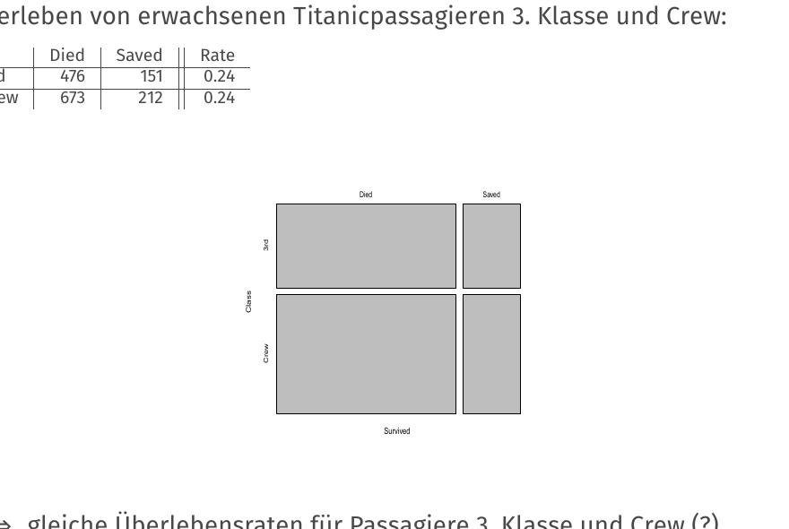

本页比较 Titanic 成人乘客中三等舱（3. Klasse）与船员（Crew）的生还情况。从总体表看，两个群体的生还率可能非常接近。

但这种总体比较忽略了性别（Geschlecht）。在 Titanic 数据中，性别强烈影响生还概率，因为“妇女和儿童优先”等规则改变了获救机会。

**结论：** 如果性别分布在三等舱与船员之间不同，边际生还率就不能直接代表“舱位/身份”的效果。

### Seite 17 - Titanic：按性别条件化后结论变化

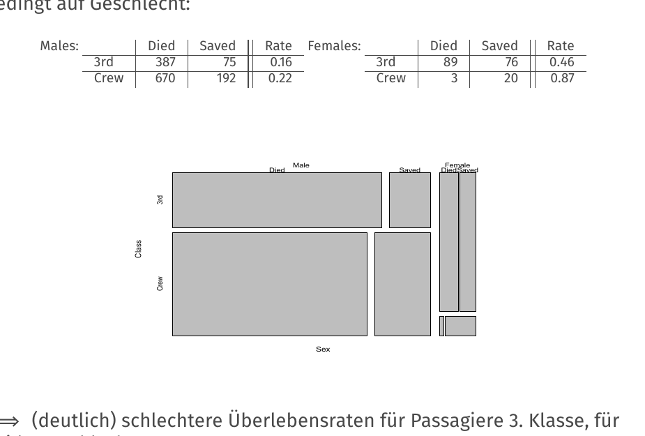

本页按性别（Geschlecht）分组比较三等舱与船员。条件化后可以看到：三等舱乘客在某些性别组内的生还率明显更差。

这里的变量结构可理解为：

- 性别影响生还（Überleben）。
- 舱位/身份与性别分布相关。
- 不分层时，总体比较会混合这些结构。

**德语表达：**  
`Nach der Stratifizierung nach Geschlecht verändert sich die Interpretation der Überlebensraten deutlich.`

### Seite 18 - Berkeley 录取：总体上看似性别歧视

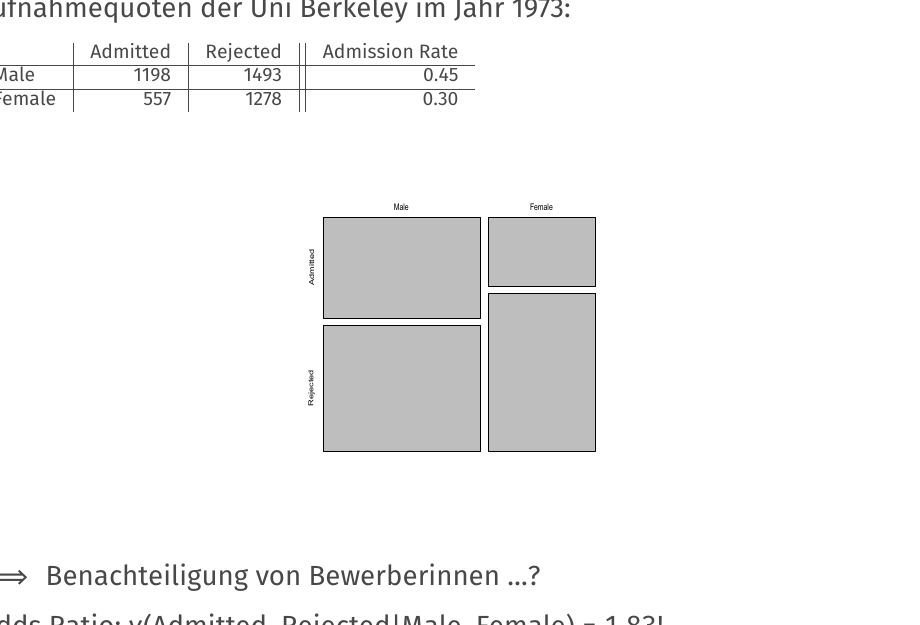

本页使用 Berkeley 研究生录取数据。总体上看，女性申请者（Bewerberinnen）的录取率似乎低于男性申请者（Bewerber）。

讲义用优势比（Odds Ratio）描述总体差异，例如 `OR > 1` 表示总体上男性录取优势更高。

**关键提醒：** 总体歧视判断不能只看边际录取率（marginale Aufnahmequote）。还要看女性和男性申请的专业或院系（Fach / Department）是否不同。

### Seite 19 - Berkeley：分院系后图像不同

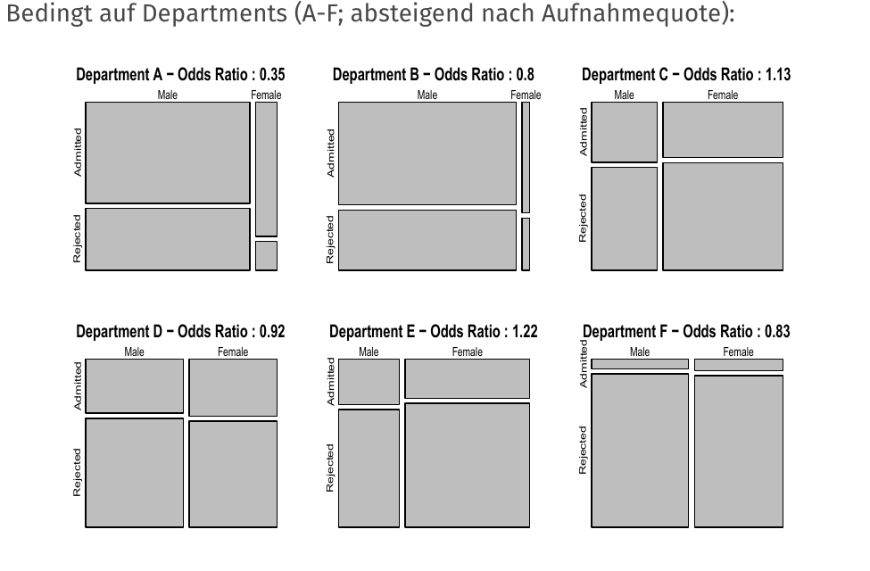

本页按 Department A-F 分层。分层后，多数院系内的录取差异并不支持简单的“总体性别歧视”结论。

原因是申请方向（Fachwahl）本身不同：女性可能更多申请录取率较低的院系，男性可能更多申请录取率较高的院系。

**考核句：**  
`Die Fakultätswahl wirkt hier als erklärende Variable für die marginale Differenz der Aufnahmequoten.`

### Seite 20 - Berkeley：申请分布解释总体差异

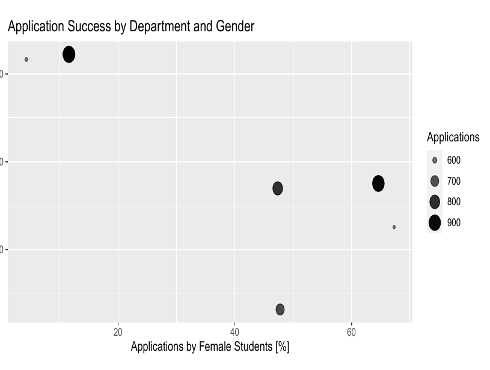

本页图显示不同院系的申请数量与性别构成。点的大小表示申请量（Applications），坐标轴比较女性申请比例与录取成功。

这页的因果结构不是最经典的 Fork 混杂，而更像 Pipe / Mediator：


```mermaid
flowchart LR
  G["Geschlecht"] --> F["Fachwahl"]
  F --> A["Aufnahme"]
```

如果研究问题是“总体现象为什么出现”，院系选择（Fachwahl）应被解释；如果研究问题是“性别的总效应”，是否控制院系就要非常谨慎。

### Seite 21 - Confounding 与 Mediator 的区别

本页强调 Berkeley 例子中专业选择（Fachwahl）更像中介（Mediator）或路径变量，而不一定是经典混杂变量（Konfounder）。

区别：

- Confounder：`Z -> X` 且 `Z -> Y`，Z 是共同原因。
- Mediator：`X -> Z -> Y`，Z 位于因果路径中。

**为什么重要？** 控制 Confounder 通常是为了去偏；控制 Mediator 会去掉一部分真实路径效应，使估计从“总效应”（totaler Effekt）变成“直接效应”（direkter Effekt）。

### Seite 22 - 生态谬误

生态谬误（ökologischer Fehlschluss）指：从群体层面的关系错误推断个体层面的关系。

例如：

- 国家层面收入与儿童死亡率相关，不代表每个家庭层面也有同样大小的关系。
- 地区层面政治态度与收入相关，不代表每个个体的收入越高就一定持某种态度。

**一句话：** 聚合数据（aggregierte Daten）回答的是组层问题，不自动回答个体层问题（individuelle Ebene）。

### Seite 23 - 收入与政治态度：群体层与个体层

本页展示收入（Einkommen）与政治态度（politische Einstellung）的例子。聚合后可能看到地区平均收入与地区平均政治态度之间有关系。

但这个关系不能直接套到个人：

- 高收入地区中也有低收入个体。
- 地区文化、教育结构、城市化程度等变量会共同影响政治态度。
- 个体层面的斜率（individuelle Steigung）可能与地区层面的斜率不同。

**考点：** 问题单位（Analyseeinheit）必须一致：个人、学校、城市、国家不能随意混用。

### Seite 24 - Aggregation 的解释边界

本页继续收入与政治态度的例子，强调聚合数据的解释边界。

合理说法：

- “在这些地区之间，平均收入与平均态度相关。”

不合理说法：

- “一个人收入越高，就一定越支持某种政治立场。”

**德语句式：**  
`Aus einem Zusammenhang auf Aggregatebene darf nicht ohne Weiteres auf einen Zusammenhang auf Individualebene geschlossen werden.`

### Seite 25 - 国家/地区层面的收入与儿童死亡率

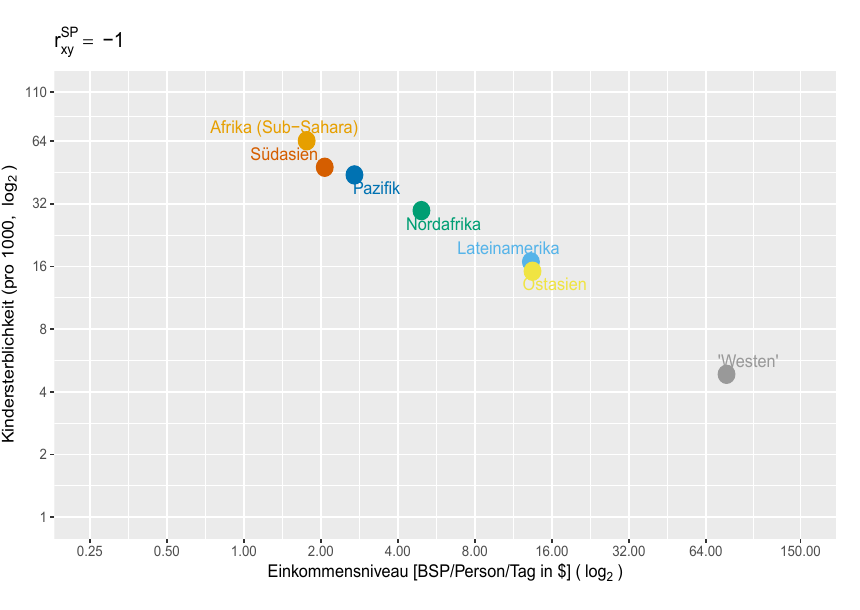

本页使用世界卫生组织/发展数据风格的例子：人均收入（Einkommen, BIP pro Kopf）与儿童死亡率（Kindersterblichkeit）。在地区聚合层面，收入越高，儿童死亡率越低，Spearman 相关（Spearman-Korrelation）接近 `-1`。

**读图重点：**

- 横轴通常为收入的对数尺度（log-Skala）。
- 纵轴为儿童死亡率。
- 地区点很少，相关很强，但这是高度聚合的数据。

### Seite 26 - 国家层面：点变多，结构更复杂

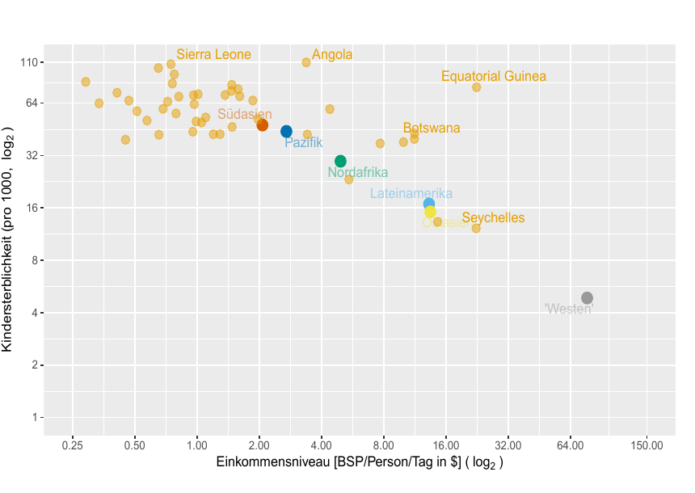

本页把地区拆成国家（Länder）。点变多后，整体负相关仍然存在，但离散程度增加。

这说明：

- 聚合层级改变会改变相关强度。
- 组内差异（innerhalb der Regionen）可能很大。
- 不能只用少数大区域点替代所有国家差异。

**考试提示：** 如果题目给出 Spearman 相关（Spearman-Korrelation）或 Pearson 相关（Pearson-Korrelation），还要看数据层级和散点图形状。

### Seite 27 - 标注国家后：异常点与组内差异

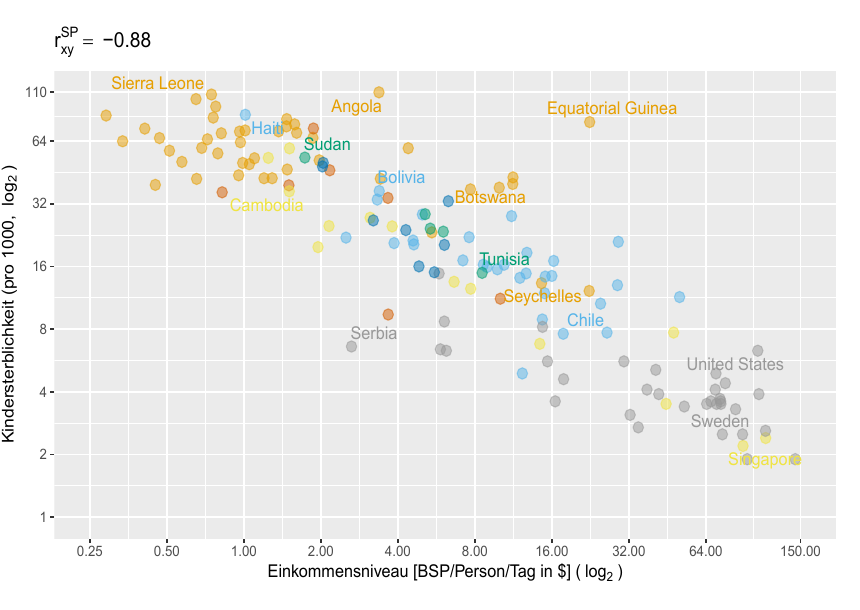

本页进一步标出若干国家。可以看到，同一收入水平附近可能有不同儿童死亡率；同一地区内部也存在明显差异。

这时应避免过度解释单一相关系数：

- 相关系数总结线性或单调趋势。
- 散点图揭示异质性（Heterogenität）。
- 异常点（Ausreißer）可能对解释很重要。

**关键考点：** 相关系数是压缩信息，不是替代图形诊断（grafische Diagnose）。

### Seite 28 - 分地区面板：组内关系不等于总体关系

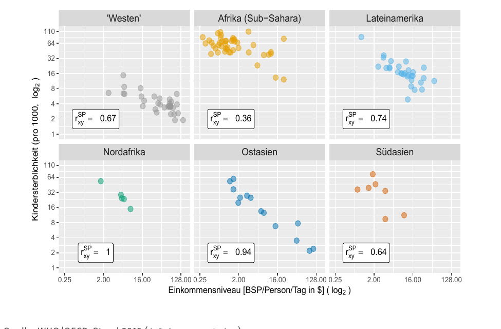

本页按地区分面（Facetten）。不同地区内部的相关强度和点云形状不同。

可以看到：

- 总体趋势强，不代表每个地区内都同样强。
- 某些地区数据点少，相关估计不稳定。
- 分面图能帮助区分总体趋势（Gesamttrend）与组内趋势（Gruppentrend）。

**小测验：**

- [x] 聚合层级改变，相关系数可能改变。
- [x] 分面图有助于发现组内异质性。
- [ ] 总体 Spearman 相关很强时，就不需要查看分组图。

## 模块三：样本选择本身也能创造相关（Seite 29-38）

如果只有满足某个条件的人进入样本，我们相当于对一个变量条件化。特别是对 Collider 条件化时，原本无关的变量也可能变得相关。

### Seite 29 - 样本选择引起的伪关联

本页进入第四节：通过样本选择（Stichprobenauswahl）产生的伪关联。

核心问题：我们观察到的数据不是总体（Population），而是被某种规则选入样本（Sample）的个体。如果选入机制依赖变量本身，就可能改变相关结构。

常见关键词：

- 选择偏差（Selektionsbias）
- 内生选择（endogene Selektion）
- 对碰撞点条件化（Konditionierung auf einen Collider）

### Seite 30 - 条件化在 Collider 上会制造相关

碰撞点（Collider）的结构是：

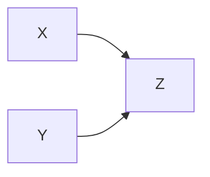
```mermaid
flowchart LR
  X --> Z
  Y --> Z
```

如果不条件化在 `Z` 上，`X` 与 `Y` 可能独立。但一旦只观察 `Z` 满足某条件的人，或者在回归中控制 `Z`，就可能在 `X` 和 `Y` 之间制造伪相关。

**直觉：** 如果两个原因都能让人进入样本，那么在已进入样本的人中，一个原因高，另一个原因就可能显得低。

**德语句式：**  
`Die Konditionierung auf einen Collider kann eine Scheinkorrelation zwischen seinen Ursachen erzeugen.`

### Seite 31 - 学生样本中的 IQ 与责任心

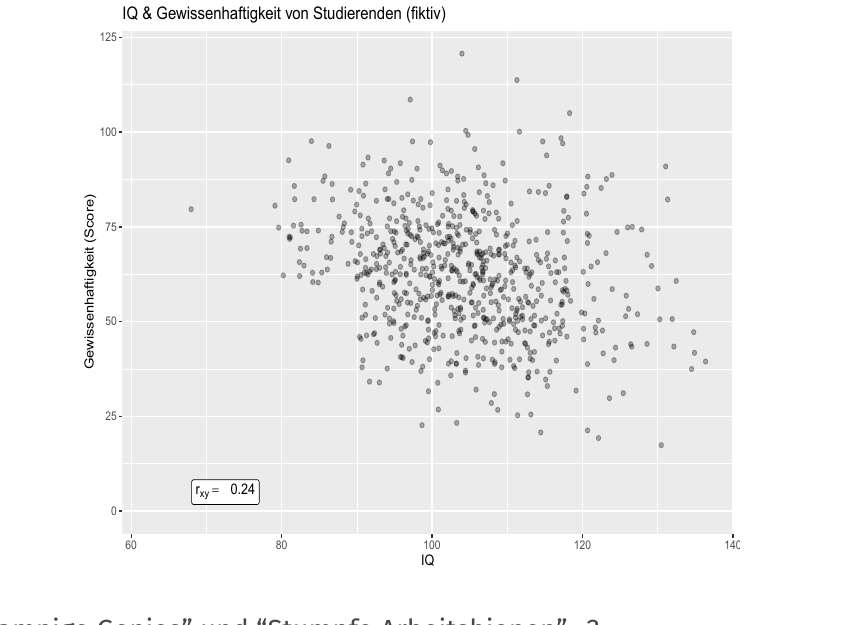

本页例子：在大学生（Studierende）样本中，IQ（Schlauheit）与责任心/勤奋（Gewissenhaftigkeit / Fleiß）呈负相关。

这不一定表示总体中聪明人更不勤奋，而可能是选择机制：

- 高 IQ 可以增加上大学概率。
- 高勤奋也可以增加上大学概率。
- 在“已经是大学生”的样本内，两者可能替代，从而出现负相关。

### Seite 32 - 总体中可能没有相关

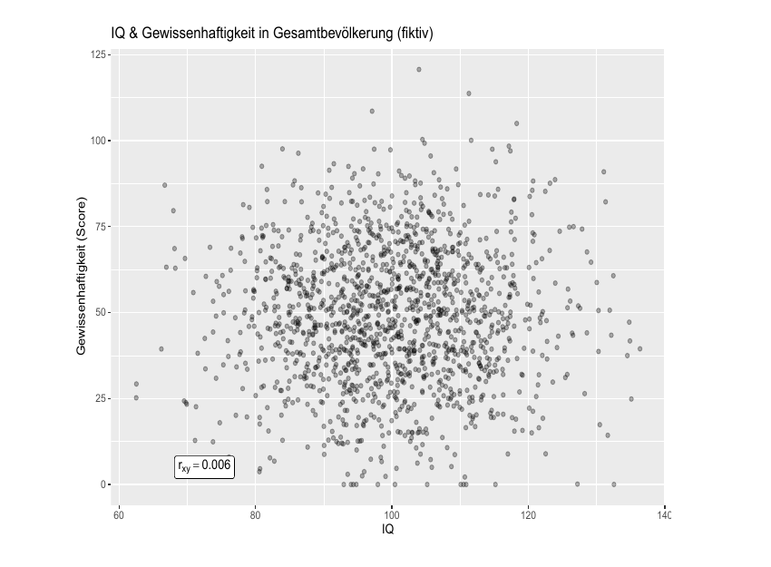

本页展示总体人口（Gesamtbevölkerung）中 IQ 与责任心可能几乎不相关，相关系数约接近 0。

这与上一页不矛盾，因为上一页只观察了被选择进入大学的人。也就是说，样本条件（Stichprobenbedingung）改变了联合分布（gemeinsame Verteilung）。

**考点：** “样本内相关”不是“总体相关”。看到特殊样本时要追问：进入样本的条件是什么？

### Seite 33 - 选择进入大学制造负相关

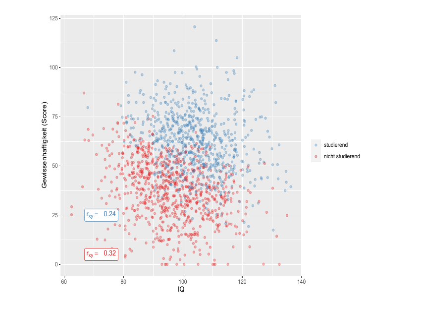

本页用颜色区分大学生（studierend）与非大学生（nicht studierend）。在全部人群中两个变量可能无相关；在大学生子样本中，却出现负相关。

因果结构：

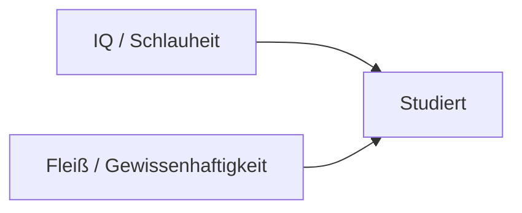
```mermaid
flowchart LR
  I["IQ / Schlauheit"] --> S["Studiert"]
  F["Fleiß / Gewissenhaftigkeit"] --> S
```

`Studiert` 是 Collider。只分析 `Studiert = ja` 的人，就是条件化在 Collider 上。

### Seite 34 - 因果图总结：Schlau 与 Fleiß 指向 Studiert

本页用因果图总结上一例：聪明程度（Schlauheit）和勤奋（Fleiß）共同影响是否上大学（Studiert）。

重点不是大学生内部真的存在本质负相关，而是：

- 选择变量（Selektionsvariable）由两个原因共同决定。
- 对选择变量条件化会打开原本关闭的路径。
- 这类偏差不是通过扩大样本量自动消失的，因为问题来自抽样机制。

**一句话：** 选择机制（Selektionsmechanismus）本身也是统计结构的一部分。

### Seite 35 - Endogenous Selection Bias

内生选择偏差（Endogenous Selection Bias）也叫选择-扭曲效应（selection-distortion effect）。当被观察的条件依赖于研究变量时，样本内关系会被系统扭曲。

典型形式：

- 招生录取：只看被录取者。
- 发表偏差：只看发表成功的研究。
- 平台数据：只看留下评论或活跃用户。

**考试答案模板：**  
`Da die Stichprobenauswahl von den interessierenden Variablen abhängt, ist die beobachtete Assoziation potenziell verzerrt.`

### Seite 36 - 选择规则 `x + y > const` 产生负相关

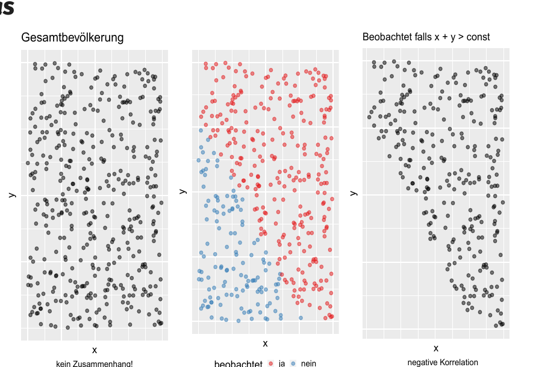

本页展示数学直觉：如果只观察满足 `x + y > const` 的点，即两个变量的总和超过门槛，那么样本内会出现负相关。

原因很简单：在总和必须足够高的条件下，`x` 高可以弥补 `y` 低，`y` 高也可以弥补 `x` 低，两者在被选样本中呈替代关系。

**对应结构：** `x` 和 `y` 共同决定是否被观察（beobachtet），被观察变量就是 Collider。

### Seite 37 - 选择规则 `|x - y| < const` 产生正相关

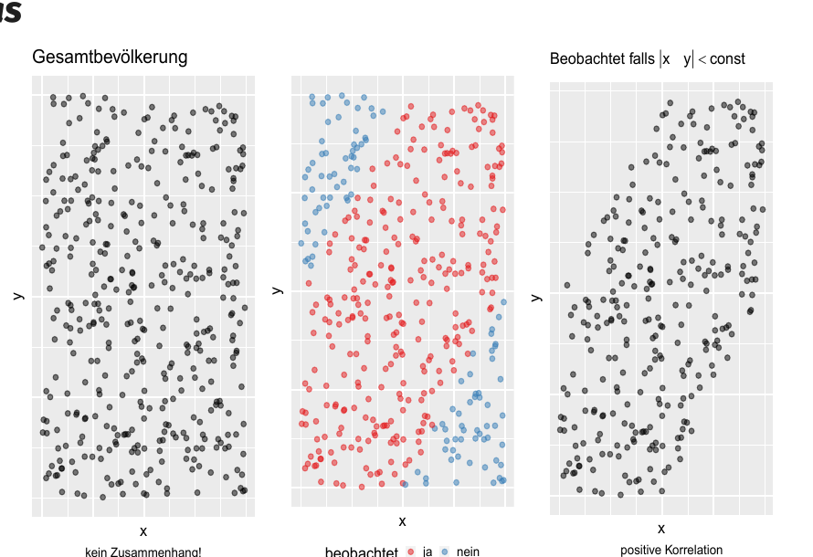

本页展示另一种选择规则：只观察满足 `|x - y| < const` 的点，即两个变量必须彼此接近。这样会在样本内产生正相关。

直觉：若 `x` 大，`y` 也必须大才能被选中；若 `x` 小，`y` 也必须小才能被选中。

**结论：** 选择偏差不仅会改变相关强度，还可能改变相关方向。因此解释样本内相关时，必须说明样本如何形成。

### Seite 38 - 结尾与来源说明

本页是讲义结尾和软件/资料来源说明。与考试最相关的是：本章所有图示都服务于同一个方法论结论。

**总复习：**

- 相关（Korrelation）描述共同变化，不直接证明因果（Kausalität）。
- 第三变量（Drittvariable）可能是混杂、媒介或碰撞点。
- 聚合（Aggregation）会导致辛普森悖论和生态谬误。
- 样本选择（Stichprobenauswahl）会通过 Collider 机制制造伪相关。

## 本章逻辑梳理

- **相关不等于因果（Seite 1-6）：** 关联结构与因果结构。
- **第三变量（Seite 7-15）：** Confounding、Mediator、Collider。
- **聚合与 Simpson（Seite 16-28）：** 分组后关系改变。
- **选择偏差（Seite 29-38）：** 样本进入机制制造相关。

真正复习时，不要按页码零散背。先问本章在解决什么问题，再把每页放回上面的模块里：前面的页通常提出问题，中间的页给出工具，后面的页提醒适用边界或展示例子。

## 关键考核点

1. 会区分关联结构（assoziative Struktur）和因果结构（kausale Struktur）。
2. 会识别 Confounder、Mediator、Collider，并说明是否应控制。
3. 会解释 Simpson-Paradox 和生态谬误为什么来自聚合。
4. 会说明选择偏差如何让无关变量产生相关。

## 本章公式清单

### 关联与因果语言

| 序号 | 公式 | 使用场景 | 注意事项 |
| ---: | --- | --- | --- |
| 1 | $P(Y\mid X=x)$ | 观察到 $X=x$ 时 $Y$ 的条件分布。 | 这是关联语言，不自动等于因果。 |
| 2 | $P(Y\mid do(X=x))$ | 干预把 $X$ 设为 $x$ 后 $Y$ 的分布。 | 这是因果语言，区别于普通条件化。 |
| 3 | $Korrelation \neq Kausalität$ | 核心警示。 | 考试要写出具体机制，不能只写口号。 |

### 第三变量结构

| 序号 | 公式 | 使用场景 | 注意事项 |
| ---: | --- | --- | --- |
| 4 | $X\leftarrow Z\rightarrow Y$ | 共同原因/混杂。 | 控制合适的 $Z$ 可能减少偏差。 |
| 5 | $X\rightarrow Z\rightarrow Y$ | 中介路径。 | 控制中介会改变总效应解释。 |
| 6 | $X\rightarrow Z\leftarrow Y$ | Collider。 | 对碰撞点条件化会制造伪相关。 |

### 偏差机制

| 序号 | 公式 | 使用场景 | 注意事项 |
| ---: | --- | --- | --- |
| 7 | $P(Y\mid X)\neq P(Y\mid do(X))$ | 存在混杂或选择偏差时的典型问题。 | 观察关联不能直接当因果效应。 |
| 8 | $E(Y\mid X)=\sum_z E(Y\mid X,Z=z)P(Z=z\mid X)$ | 总体关联由分组关系和组权重混合而成。 | 用于理解 Simpson-Paradox。 |
| 9 | $S=1$ | 样本选择条件。 | 分析对象变成 $P(X,Y\mid S=1)$，可能与总体不同。 |

## 章节自测

- [ ] 观察到相关就足以推出因果。
- [x] 共同原因可能让两个变量出现表面相关。
- [x] 对 Collider 条件化可能制造伪相关。
- [x] 辛普森悖论提醒我们总体关系可能掩盖分组关系。

## 德语词汇表

| 德语 | 中文 | 使用场景 |
| --- | --- | --- |
| Korrelation | 相关 | 一起变化 |
| Kausalität | 因果 | 干预改变结果 |
| kausale Struktur | 因果结构 | 箭头机制 |
| assoziative Struktur | 关联结构 | 统计依赖 |
| Confounding | 混杂 | 共同原因 |
| Mediator | 中介变量 | 因果路径中间点 |
| Collider | 碰撞点 | 两个箭头指向它 |
| Simpson-Paradox | 辛普森悖论 | 聚合反转 |
| Selektionsbias | 选择偏差 | 样本进入机制偏差 |

## C1 德语句式

| 序号 | 德语句式 | 中文翻译 | 适用场景 |
| ---: | --- | --- | --- |
| 1 | Eine beobachtete Korrelation ist zunächst eine assoziative und keine kausale Aussage. | 观察到的相关首先是关联性陈述，而不是因果性陈述。 | 开场判断。 |
| 2 | Ein Confounder ist eine gemeinsame Ursache von Exposition und Ergebnis und kann eine Scheinkorrelation erzeugen. | 混杂变量是暴露和结果的共同原因，可能产生伪相关。 | 定义 confounder。 |
| 3 | Durch Konditionierung auf einen Collider kann eine Abhängigkeit zwischen ursprünglich unabhängigen Variablen entstehen. | 对碰撞点条件化可能使原本独立的变量之间产生依赖。 | 解释选择偏差。 |
