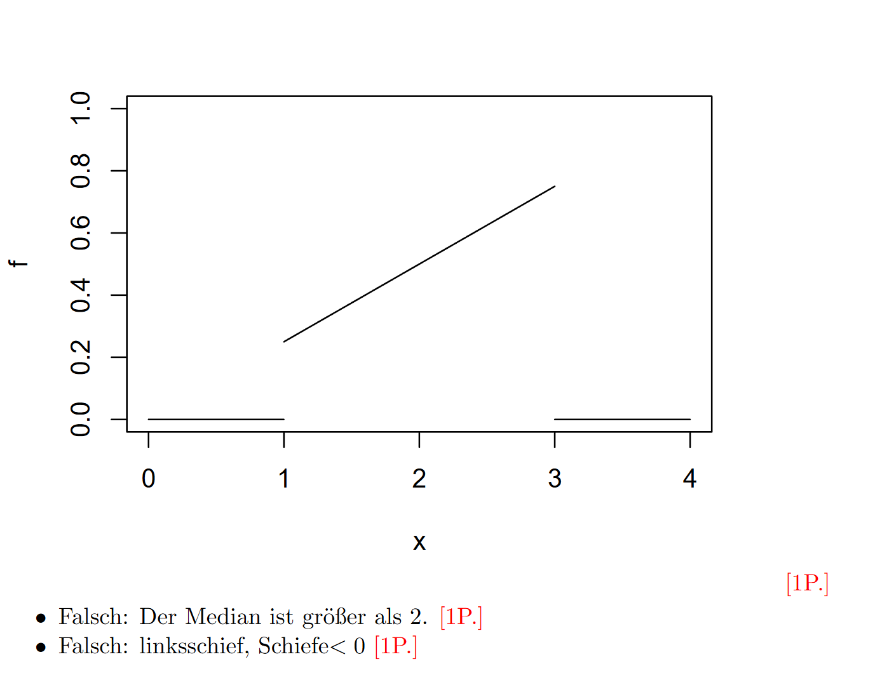

# 分布函数、密度与常见分布

练习题数：21

相关考试真题数：18

合计题目数：39

## 公式速查

### 分布函数、密度、常见分布与一维变换

- **分布函数**：$F_X(x)=\mathbb P(X\le x)$，性质是单调递增、右连续，且 $\lim_{x\to-\infty}F_X(x)=0$，$\lim_{x\to\infty}F_X(x)=1$。
- **由分布函数求概率**：$\mathbb P(a<X\le b)=F_X(b)-F_X(a)$，$\mathbb P(X>a)=1-F_X(a)$。
- **跳跃点概率**：$\mathbb P(X=a)=F_X(a)-F_X(a-)$；连续型随机变量单点概率为 $0$。
- **密度定义**：$f_X(x)\ge0$ 且 $\int_{-\infty}^{\infty}f_X(x)\,dx=1$。
- **CDF 和 PDF**：$F_X(x)=\int_{-\infty}^x f_X(t)\,dt$，在可导处 $F_X'(x)=f_X(x)$。
- **分位数**：$q_p$ 满足 $F(q_p)=p$；有跳跃时用广义逆 $q_p=\inf\{x:F(x)\ge p\}$。
- **众数/中位数**：众数是密度或频率最大点；中位数 $m$ 通常由 $F(m)=0.5$ 求出。
- **一维密度变换**：若 $Y=g(X)$ 且 $g$ 单调，$h(y)=g^{-1}(y)$，则 $f_Y(y)=f_X(h(y))|h'(y)|$。
- **单调递增变换**：$F_Y(y)=F_X(g^{-1}(y))$；**单调递减变换**：$F_Y(y)=1-F_X(g^{-1}(y))$。
- **离散均匀分布**：$X\sim U(T)$，$p(x)=\frac1{|T|}I_T(x)$。
- **连续均匀分布**：$X\sim U(a,b)$，$f(x)=\frac1{b-a}I_{(a,b)}(x)$，$E(X)=\frac{a+b}{2}$，$Var(X)=\frac{(b-a)^2}{12}$。
- **Bernoulli/Binomial**：$X\sim B(n,p)$，$\mathbb P(X=k)=\binom nkp^k(1-p)^{n-k}$，$E(X)=np$，$Var(X)=np(1-p)$。
- **几何分布**：$X\sim G(p)$ 表示首次成功所需次数，$E(X)=\frac1p$，$Var(X)=\frac{1-p}{p^2}$，具有无记忆性。
- **超几何分布**：$X\sim H(n,M,N)$，$\mathbb P(X=x)=\frac{\binom Mx\binom{N-M}{n-x}}{\binom Nn}$，$E(X)=n\frac MN$。
- **Poisson 分布**：$X\sim Po(\lambda)$，$\mathbb P(X=k)=e^{-\lambda}\frac{\lambda^k}{k!}$，$E(X)=Var(X)=\lambda$。
- **Poisson 近似**：当 $n\to\infty,p\to0,np\to\lambda$ 时，$B(n,p)\approx Po(\lambda)$。
- **指数分布**：$X\sim Exp(\lambda)$，$f(x)=\lambda e^{-\lambda x}I_{x>0}$，$F(x)=1-e^{-\lambda x}$，$E(X)=\frac1\lambda$，$Var(X)=\frac1{\lambda^2}$。
- **生存函数**：$S(t)=\mathbb P(X\ge t)=1-F(t)$，风险率 $h(t)=\frac{f(t)}{S(t)}$；指数分布的风险率恒为 $\lambda$。
- **Gamma/Beta/Weibull**：先把密度整理成标准形式，再通过指数、支持集和归一化常数读参数。

---

## 习题与讲解

### Aufgabe 1 - 分析分布函数、密度、众数或中位数。

#### 题目

Betrachten Sie die Verteilungsfunktion

$$
F(x)=
\begin{cases}
0, & x<0,\\
x^2, & 0\leq x<\frac12,\\
1, & x\geq \frac12.
\end{cases}
$$

Sei $X\sim F$. Bestimmen Sie die Wahrscheinlichkeiten:

###### (a)

$$
\mathbb P(X=0)
$$

###### (b)

$$
\mathbb P\left(X=\frac12\right)
$$

###### (c)

$$
\mathbb P\left(X\in\left]\frac13,\frac23\right]\right)
$$

#### 解答

##### 中文解题思路

看到分布函数或密度，先检查对象类型：离散型看跳跃点概率，连续型看密度积分。分布函数要满足单调、右连续、极限从 $0$ 到 $1$；密度要非负且总积分为 $1$。

先判断题目是在问分布函数、密度、变换后的分布，还是某个常见分布的参数。分布函数题要检查单调、右连续、左右极限；密度题要检查非负和积分为 $1$。

题目有多个小问时，建议每个小问都保留相同的解题格式：先列已知，再写公式，再代数化简。这样即使某一问算错，也不影响其它小问的结构分。

写最终答案时，要把关键等式链写完整：定义、代入、化简、结论四步尽量都出现。证明题尤其要避免只写直觉解释；计算题则要注明参数化方式、积分范围或条件事件。

###### (a)

Punktwahrscheinlichkeiten erhält man über Sprünge der Verteilungsfunktion:

$$
\mathbb P(X=0)=F(0)-F(0-).
$$

Hier ist:

$$
F(0)=0^2=0
$$

und:

$$
F(0-)=0.
$$

Also:

$$
\mathbb P(X=0)=0.
$$

###### (b)

Es gilt:

$$
\mathbb P\left(X=\frac12\right)
=
F\left(\frac12\right)-F\left(\frac12-\right).
$$

Aus der Definition:

$$
F\left(\frac12\right)=1.
$$

Der linksseitige Grenzwert ist:

$$
F\left(\frac12-\right)
=
\left(\frac12\right)^2
=
\frac14.
$$

Damit:

$$
\mathbb P\left(X=\frac12\right)
=
1-\frac14
=
\frac34.
$$

###### (c)

Für Intervalle der Form $(a,b]$ gilt:

$$
\mathbb P(a<X\leq b)=F(b)-F(a).
$$

Also:

$$
\mathbb P\left(\frac13<X\leq\frac23\right)
=
F\left(\frac23\right)-F\left(\frac13\right).
$$

Da $\frac23\geq\frac12$, ist:

$$
F\left(\frac23\right)=1.
$$

Außerdem:

$$
F\left(\frac13\right)
=
\left(\frac13\right)^2
=
\frac19.
$$

Somit:

$$
\mathbb P\left(X\in\left]\frac13,\frac23\right]\right)
=
1-\frac19
=
\frac89.
$$

---

---

### Aufgabe 2 - 用变量变换求新随机变量的密度或分布。

#### 题目

Sei $X$ eine stetige Zufallsvariable mit Dichte

$$
f(x)=c\cdot(0.5+x)^a\cdot(0.5-x)^b\cdot I_{]-0.5,0.5[}(x)
$$

mit Parametern $a,b>0$.

###### (a)

Berechnen Sie den Modus von $X$.

###### (b)

Es gilt:

$$
E(X)=\frac{a-b}{2(a+b+2)}.
$$

Für welche Kombination von Werten ist die Verteilung von $X$ rechtsschief?

#### 解答

##### 中文解题思路

看到分布函数或密度，先检查对象类型：离散型看跳跃点概率，连续型看密度积分。分布函数要满足单调、右连续、极限从 $0$ 到 $1$；密度要非负且总积分为 $1$。

变量变换题按三步走：写出变换和反变换，求导数或 Jacobian 绝对值，再把原密度代入并写出新支持集。支持集不能省，因为它决定密度在哪些地方为零。

先判断题目是在问分布函数、密度、变换后的分布，还是某个常见分布的参数。分布函数题要检查单调、右连续、左右极限；密度题要检查非负和积分为 $1$。

变量变换题的固定流程是：先写出反函数，再求反函数导数的绝对值，最后把原密度代入 $f_Y(y)=f_X(g^{-1}(y))|(g^{-1})'(y)|$。同时要把新变量的取值范围写清楚。

遇到 Beta/Gamma 这类题，不要只看形状，要把密度整理成标准形式，比较指数和归一化常数，从而读出参数。

题目有多个小问时，建议每个小问都保留相同的解题格式：先列已知，再写公式，再代数化简。这样即使某一问算错，也不影响其它小问的结构分。

写最终答案时，要把关键等式链写完整：定义、代入、化简、结论四步尽量都出现。证明题尤其要避免只写直觉解释；计算题则要注明参数化方式、积分范围或条件事件。

###### (a) Berechnen Sie den Modus von $X$.

Da $c>0$ nur eine Normierungskonstante ist, genügt es, den Ausdruck

$$
g(x)=(0.5+x)^a(0.5-x)^b
$$

auf dem Intervall $]-0.5,0.5[$ zu maximieren.

Wir betrachten den Logarithmus:

$$
\ell(x)=\log g(x)
=
a\log(0.5+x)+b\log(0.5-x).
$$

Ableiten:

$$
\ell'(x)=\frac{a}{0.5+x}-\frac{b}{0.5-x}.
$$

Für den Modus setzen wir $\ell'(x)=0$:

$$
\frac{a}{0.5+x}
=
\frac{b}{0.5-x}.
$$

Also:

$$
a(0.5-x)=b(0.5+x).
$$

Damit:

$$
\frac{a-b}{2}=(a+b)x.
$$

Also liegt der Modus bei:

$$
x_{\operatorname{mod}}
=
\frac{a-b}{2(a+b)}.
$$

###### (b) Es gilt:

Durch die Transformation

$$
T=X+\frac12
$$

liegt $T$ auf $(0,1)$ und hat eine Beta-artige Dichte:

$$
f_T(t)\propto t^a(1-t)^b.
$$

Das entspricht einer Betaverteilung mit Parametern $a+1$ und $b+1$.

Eine Betaverteilung ist rechtsschief, also positiv schief, wenn mehr Masse links liegt und der rechte Schwanz länger ist. Das ist der Fall, wenn der erste Formparameter kleiner als der zweite ist:

$$
a+1<b+1.
$$

Also:

$$
a<b.
$$

Damit ist die Verteilung von $X$ rechtsschief genau dann, wenn:

$$
a<b.
$$

---

---

### Aufgabe 3 - 分析分布函数、密度、众数或中位数。

#### 题目

Betrachten Sie:

$$
F(x)=
\begin{cases}
0, & x<0,\\
x^2, & 0\leq x<1,\\
1, & x\geq 1.
\end{cases}
$$

Sei $X\sim F$. Bestimmen Sie $\mathbb P(X=0)$, $\mathbb P(X=1)$ und $\mathbb P\left(X\in\left[\frac13,\frac23\right]\right)$.

#### 解答

##### 中文解题思路

看到分布函数或密度，先检查对象类型：离散型看跳跃点概率，连续型看密度积分。分布函数要满足单调、右连续、极限从 $0$ 到 $1$；密度要非负且总积分为 $1$。

先判断题目是在问分布函数、密度、变换后的分布，还是某个常见分布的参数。分布函数题要检查单调、右连续、左右极限；密度题要检查非负和积分为 $1$。

题目有多个小问时，建议每个小问都保留相同的解题格式：先列已知，再写公式，再代数化简。这样即使某一问算错，也不影响其它小问的结构分。

写最终答案时，要把关键等式链写完整：定义、代入、化简、结论四步尽量都出现。证明题尤其要避免只写直觉解释；计算题则要注明参数化方式、积分范围或条件事件。

Punktmassen erhält man aus Sprüngen der Verteilungsfunktion:

$$
\mathbb P(X=a)=F(a)-F(a-).
$$

Damit:

$$
\mathbb P(X=0)=F(0)-F(0-)=0-0=0,
$$

$$
\mathbb P(X=1)=F(1)-F(1-)=1-1=0.
$$

Für das Intervall gilt:

$$
\mathbb P\left(X\in\left[\frac13,\frac23\right]\right)
=F\left(\frac23\right)-F\left(\frac13-\right)
=\frac49-\frac19
=\frac13.
$$

---

---

### Aufgabe 4 - 分析分布函数、密度、众数或中位数。

#### 题目

Für $\lambda>0$ sei $F:\mathbb R\to\mathbb R$ definiert durch:

$$
F(x)=
\begin{cases}
0, & x<0,\\
1-\exp(-\lambda x), & x\geq 0.
\end{cases}
$$

Begründen Sie, ob es sich bei $F$ um eine Verteilungsfunktion handelt.

#### 解答

##### 中文解题思路

看到分布函数或密度，先检查对象类型：离散型看跳跃点概率，连续型看密度积分。分布函数要满足单调、右连续、极限从 $0$ 到 $1$；密度要非负且总积分为 $1$。

先判断题目是在问分布函数、密度、变换后的分布，还是某个常见分布的参数。分布函数题要检查单调、右连续、左右极限；密度题要检查非负和积分为 $1$。

写最终答案时，要把关键等式链写完整：定义、代入、化简、结论四步尽量都出现。证明题尤其要避免只写直觉解释；计算题则要注明参数化方式、积分范围或条件事件。

Ja. Es gilt:

$$
\lim_{x\to-\infty}F(x)=0,
\qquad
\lim_{x\to\infty}F(x)=1.
$$

Außerdem ist $F$ monoton wachsend und rechtsstetig. Bei $x=0$ gilt:

$$
F(0)=1-e^0=0=\lim_{x\uparrow 0}F(x).
$$

Damit ist $F$ eine Verteilungsfunktion, nämlich die Verteilungsfunktion einer Exponentialverteilung mit Parameter $\lambda$.

---

---

### Aufgabe 5 - 分析分布函数、密度、众数或中位数。

#### 题目

Sei $X$ eine geometrisch verteilte Zufallsvariable mit Parameter $p\in(0,1)$, d.h. die Zähldichte von $X$ ist:

$$
f_X(x)=p(1-p)^{x-1},
\qquad x\in\mathbb N.
$$

Bestimmen Sie explizit die Verteilungsfunktion $F_X$ von $X$.

#### 解答

##### 中文解题思路

看到分布函数或密度，先检查对象类型：离散型看跳跃点概率，连续型看密度积分。分布函数要满足单调、右连续、极限从 $0$ 到 $1$；密度要非负且总积分为 $1$。

测度/可测性题要回到定义：可测性通常看原像是否属于 $\sigma$-Algebra；Lebesgue 测度算长度或面积；计数测度算元素个数；Dirac 测度只看集合是否包含支撑点。

先判断题目是在问分布函数、密度、变换后的分布，还是某个常见分布的参数。分布函数题要检查单调、右连续、左右极限；密度题要检查非负和积分为 $1$。

写最终答案时，要把关键等式链写完整：定义、代入、化简、结论四步尽量都出现。证明题尤其要避免只写直觉解释；计算题则要注明参数化方式、积分范围或条件事件。

Für $x<1$ ist:

$$
F_X(x)=0.
$$

Für $x\geq 1$ summiert man bis $\lfloor x\rfloor$:

$$
F_X(x)
=\sum_{i=1}^{\lfloor x\rfloor}p(1-p)^{i-1}
=1-(1-p)^{\lfloor x\rfloor}.
$$

Damit:

$$
F_X(x)=
\begin{cases}
0, & x<1,\\
1-(1-p)^{\lfloor x\rfloor}, & x\geq 1.
\end{cases}
$$

---

---

### Aufgabe 6 - 用变量变换求新随机变量的密度或分布。

#### 题目

Sei $X\sim\operatorname{LogN}(\mu,\sigma^2)$ mit Dichte:

$$
f_X(x)
=
\frac{1}{x\sigma\sqrt{2\pi}}
\exp\left(
-\frac12\frac{(\log x-\mu)^2}{\sigma^2}
\right)
\mathbf 1_{(0,\infty)}(x).
$$

Zeigen Sie mit dem Transformationssatz, dass $Y:=\log(X)\sim N(\mu,\sigma^2)$.

#### 解答

##### 中文解题思路

看到分布函数或密度，先检查对象类型：离散型看跳跃点概率，连续型看密度积分。分布函数要满足单调、右连续、极限从 $0$ 到 $1$；密度要非负且总积分为 $1$。

变量变换题按三步走：写出变换和反变换，求导数或 Jacobian 绝对值，再把原密度代入并写出新支持集。支持集不能省，因为它决定密度在哪些地方为零。

先判断题目是在问分布函数、密度、变换后的分布，还是某个常见分布的参数。分布函数题要检查单调、右连续、左右极限；密度题要检查非负和积分为 $1$。

变量变换题的固定流程是：先写出反函数，再求反函数导数的绝对值，最后把原密度代入 $f_Y(y)=f_X(g^{-1}(y))|(g^{-1})'(y)|$。同时要把新变量的取值范围写清楚。

写最终答案时，要把关键等式链写完整：定义、代入、化简、结论四步尽量都出现。证明题尤其要避免只写直觉解释；计算题则要注明参数化方式、积分范围或条件事件。

Setze:

$$
g(x)=\log x,
\qquad
g^{-1}(y)=e^y.
$$

Dann:

$$
\frac{d}{dy}g^{-1}(y)=e^y.
$$

Nach dem Transformationssatz:

$$
f_Y(y)=f_X(e^y)\cdot e^y.
$$

Einsetzen liefert:

$$
f_Y(y)
=
\frac{1}{e^y\sigma\sqrt{2\pi}}
\exp\left(
-\frac12\frac{(y-\mu)^2}{\sigma^2}
\right)
\cdot e^y.
$$

Also:

$$
f_Y(y)
=
\frac{1}{\sigma\sqrt{2\pi}}
\exp\left(
-\frac12\frac{(y-\mu)^2}{\sigma^2}
\right),
\qquad y\in\mathbb R.
$$

Das ist die Dichte von $N(\mu,\sigma^2)$.

---

---

### Aufgabe 7 - 分析分布函数、密度、众数或中位数。

#### 题目

Welche der folgenden Funktionen sind Verteilungsfunktionen stetiger Zufallsvariablen?

###### (a)

$$
F(x)=
\begin{cases}
0, & x<1,\\
1-x^{-2}, & x\geq1.
\end{cases}
$$

###### (b)

$$
F(x)=
\begin{cases}
0, & x<0,\\
\log(1+\sin x), & 0\leq x<\frac{3\pi}{4},\\
1, & x\geq \frac{3\pi}{4}.
\end{cases}
$$

###### (c)

$$
F(x)=
\begin{cases}
0, & x<0,\\
1-e^{-x}, & x\geq0.
\end{cases}
$$

#### 解答

##### 中文解题思路

看到分布函数或密度，先检查对象类型：离散型看跳跃点概率，连续型看密度积分。分布函数要满足单调、右连续、极限从 $0$ 到 $1$；密度要非负且总积分为 $1$。

先判断题目是在问分布函数、密度、变换后的分布，还是某个常见分布的参数。分布函数题要检查单调、右连续、左右极限；密度题要检查非负和积分为 $1$。

变量变换题的固定流程是：先写出反函数，再求反函数导数的绝对值，最后把原密度代入 $f_Y(y)=f_X(g^{-1}(y))|(g^{-1})'(y)|$。同时要把新变量的取值范围写清楚。

题目有多个小问时，建议每个小问都保留相同的解题格式：先列已知，再写公式，再代数化简。这样即使某一问算错，也不影响其它小问的结构分。

写最终答案时，要把关键等式链写完整：定义、代入、化简、结论四步尽量都出现。证明题尤其要避免只写直觉解释；计算题则要注明参数化方式、积分范围或条件事件。

###### (a)

$F$ ist monoton wachsend, stetig bei $x=1$, und:

$$
\lim_{x\to-\infty}F(x)=0,
\qquad
\lim_{x\to\infty}F(x)=1.
$$

Also ist $F$ die Verteilungsfunktion einer stetigen Zufallsvariablen.

###### (b)

Diese Funktion ist keine Verteilungsfunktion einer stetigen Zufallsvariablen. Schon an der Übergangsstelle passt der linksseitige Grenzwert nicht zu $1$:

$$
\lim_{x\uparrow 3\pi/4}\log(1+\sin x)
=\log\left(1+\frac{\sqrt2}{2}\right)
\neq 1.
$$

Außerdem ist $\log(1+\sin x)$ auf längeren Intervallen mit Sinusanteil nicht generell monoton wachsend.

###### (c)

$F$ ist monoton wachsend, stetig, rechtsstetig und erfüllt:

$$
\lim_{x\to-\infty}F(x)=0,
\qquad
\lim_{x\to\infty}F(x)=1.
$$

Also ist $F$ eine Verteilungsfunktion, nämlich die der Exponentialverteilung mit Rate $1$.

---

---

### Aufgabe 8 - 分析分布函数、密度、众数或中位数。

#### 题目

Ein Wirt wird wöchentlich mit Bier beliefert. Der Wochenverbrauch $X$ in Hektolitern habe Dichte:

$$
f_X(x)=(cx-6x^2)\mathbf 1_{[0,1]}(x).
$$

#### 解答

##### 中文解题思路

看到分布函数或密度，先检查对象类型：离散型看跳跃点概率，连续型看密度积分。分布函数要满足单调、右连续、极限从 $0$ 到 $1$；密度要非负且总积分为 $1$。

先判断题目是在问分布函数、密度、变换后的分布，还是某个常见分布的参数。分布函数题要检查单调、右连续、左右极限；密度题要检查非负和积分为 $1$。

写最终答案时，要把关键等式链写完整：定义、代入、化简、结论四步尽量都出现。证明题尤其要避免只写直觉解释；计算题则要注明参数化方式、积分范围或条件事件。

Normierung:

$$
\int_0^1(cx-6x^2)\,dx
=\frac c2-2
=1.
$$

Also:

$$
c=6.
$$

Damit:

$$
f_X(x)=(6x-6x^2)\mathbf 1_{[0,1]}(x).
$$

Die Verteilungsfunktion ist:

$$
F_X(x)=
\begin{cases}
0, & x<0,\\
3x^2-2x^3, & 0\leq x<1,\\
1, & x\geq1.
\end{cases}
$$

Wahrscheinlichkeiten:

$$
\mathbb P(X>0.8)
=1-F_X(0.8)
=1-(3\cdot0.8^2-2\cdot0.8^3)
=0.104.
$$

Da $X$ stetig ist:

$$
\mathbb P(X=0.5)=0.
$$

Weiter:

$$
\mathbb P(0.5\leq X\leq0.8)
=F_X(0.8)-F_X(0.5)
=0.396.
$$

Der Wert, der mit Wahrscheinlichkeit $0.5$ überschritten wird, ist der Median. Wegen Symmetrie der Dichte $6x(1-x)$ auf $[0,1]$ liegt er bei:

$$
x_{0.5}=0.5.
$$

---

---

### Aufgabe 9 - 用中心极限定理或近似分布计算概率。

#### 题目

Gegeben sei die stetige Zufallsvariable $X$ mit Dichte:

$$
f_X(x)=\frac{c}{x^2}\mathbf 1_{[1,2]}(x).
$$

#### 解答

##### 中文解题思路

出现 $c/x!$ 这种点概率时，关键是用归一化条件：所有点概率加起来必须等于 $1$。所以先写 $\sum_x c/x!=1$，再把 $c$ 提出来；如果求和从 $0$ 到无穷，就会用到 $\sum_{x=0}^{\infty}1/x!=e$。

看到分布函数或密度，先检查对象类型：离散型看跳跃点概率，连续型看密度积分。分布函数要满足单调、右连续、极限从 $0$ 到 $1$；密度要非负且总积分为 $1$。

先判断题目是在问分布函数、密度、变换后的分布，还是某个常见分布的参数。分布函数题要检查单调、右连续、左右极限；密度题要检查非负和积分为 $1$。

变量变换题的固定流程是：先写出反函数，再求反函数导数的绝对值，最后把原密度代入 $f_Y(y)=f_X(g^{-1}(y))|(g^{-1})'(y)|$。同时要把新变量的取值范围写清楚。

写最终答案时，要把关键等式链写完整：定义、代入、化简、结论四步尽量都出现。证明题尤其要避免只写直觉解释；计算题则要注明参数化方式、积分范围或条件事件。

Normierung:

$$
1=\int_1^2\frac{c}{x^2}\,dx
=c\left[-\frac1x\right]_1^2
=\frac c2.
$$

Also:

$$
c=2.
$$

Der Erwartungswert:

$$
\mathbb E(X)
=\int_1^2 x\frac2{x^2}\,dx
=2\int_1^2\frac1x\,dx
=2\log 2
\approx 1.386.
$$

Die Dichte ist auf $[1,2]$ streng fallend, daher liegt der Modus bei $1$. Die Verteilung ist rechtsschief, also ist die Schiefe positiv. Der Median liegt nicht bei $1.5$, denn wegen der fallenden Dichte liegt mehr Masse links von $1.5$ als rechts.

Damit ist nur Aussage (ii) richtig:

$$
\text{Die Schiefe von }X\text{ ist größer als }0.
$$

---

---

### Aufgabe 10 - 用中心极限定理或近似分布计算概率。

#### 题目

Gegeben sei die stetige Zufallsvariable $X$ mit Dichte:

$$
f_X(x)=c x^2\mathbf 1_{[0,3]}(x).
$$

#### 解答

##### 中文解题思路

看到分布函数或密度，先检查对象类型：离散型看跳跃点概率，连续型看密度积分。分布函数要满足单调、右连续、极限从 $0$ 到 $1$；密度要非负且总积分为 $1$。

先判断题目是在问分布函数、密度、变换后的分布，还是某个常见分布的参数。分布函数题要检查单调、右连续、左右极限；密度题要检查非负和积分为 $1$。

写最终答案时，要把关键等式链写完整：定义、代入、化简、结论四步尽量都出现。证明题尤其要避免只写直觉解释；计算题则要注明参数化方式、积分范围或条件事件。

Normierung:

$$
1=\int_0^3 c x^2\,dx
=c\left[\frac{x^3}{3}\right]_0^3
=9c.
$$

Also:

$$
c=\frac19.
$$

Der Erwartungswert:

$$
\mathbb E(X)
=\int_0^3 x\cdot\frac19x^2\,dx
=\frac19\left[\frac{x^4}{4}\right]_0^3
=\frac94
=2.25.
$$

Für $0\leq x\leq3$ gilt:

$$
F_X(x)=\int_0^x\frac19t^2\,dt
=\frac{x^3}{27}.
$$

Der Median $m$ löst:

$$
\frac{m^3}{27}=\frac12.
$$

Also:

$$
m=3\sqrt[3]{\frac12}
\approx 2.381.
$$

---

---

### Aufgabe 11 - 用变量变换求新随机变量的密度或分布。

#### 题目

Die Zufallsvariable $X$ hat Dichte:

$$
f_X(x)=
c\left(1-\frac1{x+1}\right)\mathbf 1_{[0,1]}(x).
$$

###### (a)

Zeigen Sie:

$$
c=\frac1{1-\log 2}.
$$

###### (b)

Bestimmen Sie den Erwartungswert von:

$$
Z=(X+1)^2.
$$

###### (c)

Wie groß ist $\mathbb P(Z=4)$?

###### (d)

Geben Sie den Träger von $Z$ an und bestimmen Sie die Dichte von $Z$.

#### 解答

##### 中文解题思路

看到分布函数或密度，先检查对象类型：离散型看跳跃点概率，连续型看密度积分。分布函数要满足单调、右连续、极限从 $0$ 到 $1$；密度要非负且总积分为 $1$。

变量变换题按三步走：写出变换和反变换，求导数或 Jacobian 绝对值，再把原密度代入并写出新支持集。支持集不能省，因为它决定密度在哪些地方为零。

先判断题目是在问分布函数、密度、变换后的分布，还是某个常见分布的参数。分布函数题要检查单调、右连续、左右极限；密度题要检查非负和积分为 $1$。

变量变换题的固定流程是：先写出反函数，再求反函数导数的绝对值，最后把原密度代入 $f_Y(y)=f_X(g^{-1}(y))|(g^{-1})'(y)|$。同时要把新变量的取值范围写清楚。

题目有多个小问时，建议每个小问都保留相同的解题格式：先列已知，再写公式，再代数化简。这样即使某一问算错，也不影响其它小问的结构分。

写最终答案时，要把关键等式链写完整：定义、代入、化简、结论四步尽量都出现。证明题尤其要避免只写直觉解释；计算题则要注明参数化方式、积分范围或条件事件。

###### (a) Zeigen Sie:

$$
1=c\int_0^1\left(1-\frac1{x+1}\right)\,dx
=c[x-\log(x+1)]_0^1
=c(1-\log2).
$$

Also:

$$
c=\frac1{1-\log2}.
$$

###### (b) Bestimmen Sie den Erwartungswert von:

$$
\mathbb E(Z)
=
\int_0^1 (x+1)^2\frac1{1-\log2}\left(1-\frac1{x+1}\right)\,dx.
$$

Da:

$$
(x+1)^2\left(1-\frac1{x+1}\right)
=x^2+x,
$$

folgt:

$$
\mathbb E(Z)
=
\frac1{1-\log2}\int_0^1(x^2+x)\,dx
=
\frac1{1-\log2}\left(\frac13+\frac12\right).
$$

Also:

$$
\mathbb E(Z)=\frac{5}{6(1-\log2)}\approx 2.716.
$$

###### (c) Wie groß ist $\mathbb P(Z=4)$?

Da $X$ stetig ist und $Z=(X+1)^2$ auf $[0,1]$ streng monoton ist:

$$
\mathbb P(Z=4)=0.
$$

###### (d)

Da $X\in[0,1]$ gilt:

$$
Z=(X+1)^2\in[1,4].
$$

Die Transformation lautet:

$$
z=(x+1)^2,
\qquad
x=\sqrt z-1,
\qquad
\left|\frac{dx}{dz}\right|=\frac1{2\sqrt z}.
$$

Damit:

$$
f_Z(z)
=
\frac1{1-\log2}
\left(1-\frac1{\sqrt z}\right)
\frac1{2\sqrt z}
\mathbf 1_{[1,4]}(z).
$$

Äquivalent:

$$
f_Z(z)
=
\frac{\sqrt z-1}{2z(1-\log2)}
\mathbf 1_{[1,4]}(z).
$$

---

---

### Aufgabe 12 - 用卷积公式求和变量的分布。

#### 题目

Sei:

$$
Z=X+Y,
\qquad
X,Y\overset{iid}{\sim}\operatorname{Exp}(\lambda).
$$

Zeigen Sie, dass:

$$
Z\sim\operatorname{Ga}(2,\lambda)
$$

in Rate-Parametrisierung.

#### 解答

##### 中文解题思路

看到分布函数或密度，先检查对象类型：离散型看跳跃点概率，连续型看密度积分。分布函数要满足单调、右连续、极限从 $0$ 到 $1$；密度要非负且总积分为 $1$。

求和分布先写卷积公式，再由支持集决定积分上下限。多数错误不在积分，而在区间分段：要同时满足 $x$ 在 $X$ 的支持上、$z-x$ 在 $Y$ 的支持上。

先判断题目是在问分布函数、密度、变换后的分布，还是某个常见分布的参数。分布函数题要检查单调、右连续、左右极限；密度题要检查非负和积分为 $1$。

写最终答案时，要把关键等式链写完整：定义、代入、化简、结论四步尽量都出现。证明题尤其要避免只写直觉解释；计算题则要注明参数化方式、积分范围或条件事件。

Für $z\geq 0$:

$$
f_Z(z)=\int_0^z f_X(x)f_Y(z-x)\,dx.
$$

Da:

$$
f_X(x)=\lambda e^{-\lambda x}\mathbf 1_{\{x\geq0\}},
$$

folgt:

$$
f_Z(z)
=\int_0^z \lambda e^{-\lambda x}\lambda e^{-\lambda(z-x)}\,dx
=\lambda^2 e^{-\lambda z}\int_0^z 1\,dx.
$$

Also:

$$
f_Z(z)=\lambda^2 z e^{-\lambda z}\mathbf 1_{\{z\geq0\}}.
$$

Das ist die Dichte von $\operatorname{Ga}(2,\lambda)$.

---

---

### Aufgabe 13 - 用中心极限定理或近似分布计算概率。

#### 题目

Die Wahrscheinlichkeit, dass der HSV in einem Bundesligaspiel kein Tor schießt, beträgt $0.7788$.

###### (a)

Welche Verteilung eignet sich zur Beschreibung der Anzahl der Tore in $90$ Minuten?

###### (b)

Bestimmen Sie die Wahrscheinlichkeit, dass der HSV mindestens zwei Tore schießt.

###### (c)

Bayern erzielt durchschnittlich $2.8$ Tore pro Spiel. Berechnen Sie die Wahrscheinlichkeit für ein $4:0$ für Bayern, bei Unabhängigkeit der Torzahlen.

###### (d)

Welche Verteilung hat die Wartezeit auf das nächste HSV-Tor?

#### 解答

##### 中文解题思路

先判断题目是在问分布函数、密度、变换后的分布，还是某个常见分布的参数。分布函数题要检查单调、右连续、左右极限；密度题要检查非负和积分为 $1$。

变量变换题的固定流程是：先写出反函数，再求反函数导数的绝对值，最后把原密度代入 $f_Y(y)=f_X(g^{-1}(y))|(g^{-1})'(y)|$。同时要把新变量的取值范围写清楚。

题目有多个小问时，建议每个小问都保留相同的解题格式：先列已知，再写公式，再代数化简。这样即使某一问算错，也不影响其它小问的结构分。

写最终答案时，要把关键等式链写完整：定义、代入、化简、结论四步尽量都出现。证明题尤其要避免只写直觉解释；计算题则要注明参数化方式、积分范围或条件事件。

###### (a)

Eine naheliegende Modellierung ist:

$$
X\sim\operatorname{Poi}(\lambda).
$$

Da:

$$
\mathbb P(X=0)=e^{-\lambda}=0.7788,
$$

folgt:

$$
\lambda=-\log(0.7788)\approx 0.25.
$$

###### (b)

$$
\mathbb P(X\geq 2)
=1-\mathbb P(X=0)-\mathbb P(X=1).
$$

Also:

$$
\mathbb P(X\geq 2)
=1-e^{-0.25}(1+0.25)
\approx 0.0265.
$$

###### (c)

Sei $B\sim\operatorname{Poi}(2.8)$ für Bayern und $H\sim\operatorname{Poi}(0.25)$ für den HSV. Dann:

$$
\mathbb P(B=4,H=0)
=
\frac{e^{-2.8}2.8^4}{4!}\cdot e^{-0.25}
\approx 0.1213.
$$

###### (d) Welche Verteilung hat die Wartezeit auf das nächste HSV-Tor?

Im Poisson-Prozess sind Wartezeiten exponentialverteilt. Bezieht man $\lambda=0.25$ auf ein $90$-Minuten-Spiel, dann ist die Rate pro Minute:

$$
\frac{0.25}{90}.
$$

Die Wartezeit $Y$ in Minuten erfüllt also:

$$
Y\sim\operatorname{Exp}\left(\frac{0.25}{90}\right).
$$

---

---

### Aufgabe 14 - 用中心极限定理或近似分布计算概率。

#### 题目

Welche Verteilungen besitzen die folgenden Zufallsvariablen? Geben Sie Dichtefunktion und Träger an.

###### (a)

Fünf Aufgaben, vier vorbereitet, zwei werden zufällig ausgewählt. $X$ zählt die ausgewählten vorbereiteten Aufgaben.

###### (b)

Anzahl emittierter $\alpha$-Teilchen pro Zeitintervall.

###### (c)

Ein Schlüssel passt von $10$ Schlüsseln. Nach jedem Fehlversuch werden die Schlüssel neu gemischt. $X$ sei die Anzahl der Versuche bis zum Erfolg.

###### (d)

Ein Münchner kennt jeden $1000$-sten Einwohner persönlich. Auf einem Spaziergang trifft er $50$ Münchner. $X$ sei die Anzahl der Bekannten.

#### 解答

##### 中文解题思路

出现 $c/x!$ 这种点概率时，关键是用归一化条件：所有点概率加起来必须等于 $1$。所以先写 $\sum_x c/x!=1$，再把 $c$ 提出来；如果求和从 $0$ 到无穷，就会用到 $\sum_{x=0}^{\infty}1/x!=e$。

看到分布函数或密度，先检查对象类型：离散型看跳跃点概率，连续型看密度积分。分布函数要满足单调、右连续、极限从 $0$ 到 $1$；密度要非负且总积分为 $1$。

测度/可测性题要回到定义：可测性通常看原像是否属于 $\sigma$-Algebra；Lebesgue 测度算长度或面积；计数测度算元素个数；Dirac 测度只看集合是否包含支撑点。

先判断题目是在问分布函数、密度、变换后的分布，还是某个常见分布的参数。分布函数题要检查单调、右连续、左右极限；密度题要检查非负和积分为 $1$。

题目有多个小问时，建议每个小问都保留相同的解题格式：先列已知，再写公式，再代数化简。这样即使某一问算错，也不影响其它小问的结构分。

写最终答案时，要把关键等式链写完整：定义、代入、化简、结论四步尽量都出现。证明题尤其要避免只写直觉解释；计算题则要注明参数化方式、积分范围或条件事件。

###### (a)

$$
X\sim\operatorname{Hyp}(N=5,K=4,n=2).
$$

Der Träger ist:

$$
\{1,2\}.
$$

Die Zähldichte:

$$
\mathbb P(X=x)
=
\frac{\binom4x\binom1{2-x}}{\binom52},
\qquad x\in\{1,2\}.
$$

###### (b) Anzahl emittierter $\alpha$-Teilchen pro Zeitintervall.

Bei seltenen unabhängigen Zerfällen:

$$
X\sim\operatorname{Poi}(\lambda),
\qquad
\mathbb P(X=x)=e^{-\lambda}\frac{\lambda^x}{x!},
\quad x\in\mathbb N_0.
$$

###### (c)

Jeder Versuch hat Erfolgswahrscheinlichkeit $p=\frac1{10}$, unabhängig von den vorherigen Versuchen. Also:

$$
X\sim\operatorname{Geom}\left(\frac1{10}\right)
$$

auf $\mathbb N$, mit:

$$
\mathbb P(X=x)=\left(\frac9{10}\right)^{x-1}\frac1{10},
\qquad x\in\mathbb N.
$$

###### (d)

Exakt:

$$
X\sim\operatorname{Bin}\left(50,\frac1{1000}\right),
$$

mit:

$$
\mathbb P(X=x)=\binom{50}{x}\left(\frac1{1000}\right)^x\left(\frac{999}{1000}\right)^{50-x},
\qquad x=0,\dots,50.
$$

Für kleine Trefferwahrscheinlichkeit kann man auch approximieren:

$$
X\approx\operatorname{Poi}(0.05).
$$

---

---

### Aufgabe 15 - 分析分布函数、密度、众数或中位数。

#### 题目

Sei $X$ stetig mit Dichte $f$ und Verteilungsfunktion $F$. Entscheiden Sie, ob die Aussagen richtig oder falsch sind.

#### 解答

##### 中文解题思路

看到分布函数或密度，先检查对象类型：离散型看跳跃点概率，连续型看密度积分。分布函数要满足单调、右连续、极限从 $0$ 到 $1$；密度要非负且总积分为 $1$。

先判断题目是在问分布函数、密度、变换后的分布，还是某个常见分布的参数。分布函数题要检查单调、右连续、左右极限；密度题要检查非负和积分为 $1$。

题目有多个小问时，建议每个小问都保留相同的解题格式：先列已知，再写公式，再代数化简。这样即使某一问算错，也不影响其它小问的结构分。

写最终答案时，要把关键等式链写完整：定义、代入、化简、结论四步尽量都出现。证明题尤其要避免只写直觉解释；计算题则要注明参数化方式、积分范围或条件事件。

**(a)** $f(x)\leq x$ für alle $x$ ist falsch. Dichten können größer als $1$ sein, und für negative $x$ wäre die rechte Seite sogar negativ.

**(b)** $F(x)\leq 1$ für alle $x$ ist richtig, da $F(x)$ eine Wahrscheinlichkeit ist.

**(c)** 

$$
\int_x^\infty f(t)\,dt=1-F(x)
$$

ist für stetige Zufallsvariablen richtig, wenn $F(x)=\int_{-\infty}^{x}f(t)\,dt$.

**(d)** Ist $x_i<x_j$, dann gilt $F(x_i)\leq F(x_j)$. Das ist richtig, weil Verteilungsfunktionen monoton wachsend sind.

---

---

### Aufgabe 16 - 分析分布函数、密度、众数或中位数。

#### 题目

Für $\lambda>0$ sei die Funktion $F:\mathbb R\to\mathbb R$ definiert durch

$$
F(x)=
\begin{cases}
0, & x<0,\\
1-\exp(-\lambda x), & x\geq 0.
\end{cases}
$$

Zeigen Sie, dass $F$ eine gültige Verteilungsfunktion ist.

#### 解答

##### 中文解题思路

看到分布函数或密度，先检查对象类型：离散型看跳跃点概率，连续型看密度积分。分布函数要满足单调、右连续、极限从 $0$ 到 $1$；密度要非负且总积分为 $1$。

先判断题目是在问分布函数、密度、变换后的分布，还是某个常见分布的参数。分布函数题要检查单调、右连续、左右极限；密度题要检查非负和积分为 $1$。

写最终答案时，要把关键等式链写完整：定义、代入、化简、结论四步尽量都出现。证明题尤其要避免只写直觉解释；计算题则要注明参数化方式、积分范围或条件事件。

Eine Verteilungsfunktion muss monoton wachsend, rechtsstetig sein und die Grenzwerte $0$ und $1$ besitzen.

Für $x<0$ ist $F(x)=0$. Für $x\geq0$ gilt:

$$
F'(x)=\lambda\exp(-\lambda x)>0.
$$

Also ist $F$ monoton wachsend.

Rechtsstetigkeit gilt auf $(-\infty,0)$ und $(0,\infty)$ wegen Stetigkeit der jeweiligen Funktionsstücke. An der Stelle $0$:

$$
F(0)=1-\exp(0)=0,
$$

und:

$$
\lim_{x\downarrow0}F(x)=0.
$$

Die Grenzwerte sind:

$$
\lim_{x\to-\infty}F(x)=0
$$

und:

$$
\lim_{x\to\infty}F(x)
=
\lim_{x\to\infty}(1-\exp(-\lambda x))
=
1.
$$

Damit ist $F$ eine gültige Verteilungsfunktion.

---

---

### Aufgabe 17 - 分析分布函数、密度、众数或中位数。

#### 题目

Gegeben sei die Funktion

$$
G_a(x)=
\begin{cases}
0, & x<0,\\
a+\frac13(1-\exp(-x)), & x\geq0,
\end{cases}
\qquad a\in\mathbb R.
$$

###### (a)

Bestimmen Sie $a\in\mathbb R$, sodass $G_a$ eine Verteilungsfunktion ist.

###### (b)

Sei nun $X\sim G_a$ mit $a=\frac23$. Bestimmen Sie:

$$
\mathbb P(X\in(0,2]).
$$

#### 解答

##### 中文解题思路

看到分布函数或密度，先检查对象类型：离散型看跳跃点概率，连续型看密度积分。分布函数要满足单调、右连续、极限从 $0$ 到 $1$；密度要非负且总积分为 $1$。

先判断题目是在问分布函数、密度、变换后的分布，还是某个常见分布的参数。分布函数题要检查单调、右连续、左右极限；密度题要检查非负和积分为 $1$。

题目有多个小问时，建议每个小问都保留相同的解题格式：先列已知，再写公式，再代数化简。这样即使某一问算错，也不影响其它小问的结构分。

写最终答案时，要把关键等式链写完整：定义、代入、化简、结论四步尽量都出现。证明题尤其要避免只写直觉解释；计算题则要注明参数化方式、积分范围或条件事件。

###### (a)

Für eine Verteilungsfunktion muss gelten:

$$
\lim_{x\to\infty}G_a(x)=1.
$$

Hier ist:

$$
\lim_{x\to\infty}G_a(x)
=
a+\frac13.
$$

Also muss gelten:

$$
a+\frac13=1.
$$

Damit:

$$
a=\frac23.
$$

Für $a=\frac23$ ist außerdem $G_a$ monoton wachsend und rechtsstetig. Der Sprung bei $0$ ist erlaubt.

###### (b) Sei nun $X\sim G_a$ mit $a=\frac23$. Bestimmen Sie:

Für Intervalle der Form $(0,2]$ gilt:

$$
\mathbb P(X\in(0,2])=G_a(2)-G_a(0).
$$

Es ist:

$$
G_a(2)
=
\frac23+\frac13(1-e^{-2})
$$

und:

$$
G_a(0)
=
\frac23+\frac13(1-e^0)
=
\frac23.
$$

Also:

$$
\mathbb P(X\in(0,2])
=
\frac13(1-e^{-2}).
$$

---

---

### Aufgabe 18 - 练习分布、密度和常见分布识别。

#### 题目

Es sei $X\sim\operatorname{Geo}(p)$, das heißt $X:\Omega\to\mathbb N$ ist geometrisch verteilt mit

$$
\mathbb P(X=k)=p(1-p)^{k-1},
\qquad k\in\mathbb N,
$$

und $p\in(0,1)$. Zeigen Sie:

$$
\mathbb P(\{X=n+k\}\mid\{X>n\})
=
\mathbb P(X=k)
$$

für alle $n,k>0$.

#### 解答

##### 中文解题思路

先判断题目是在问分布函数、密度、变换后的分布，还是某个常见分布的参数。分布函数题要检查单调、右连续、左右极限；密度题要检查非负和积分为 $1$。

写最终答案时，要把关键等式链写完整：定义、代入、化简、结论四步尽量都出现。证明题尤其要避免只写直觉解释；计算题则要注明参数化方式、积分范围或条件事件。

Zunächst:

$$
\mathbb P(X>n)
=
\sum_{j=n+1}^{\infty}p(1-p)^{j-1}
=
(1-p)^n.
$$

Außerdem ist $\{X=n+k\}\subseteq\{X>n\}$ für $k>0$.

Daher:

$$
\mathbb P(X=n+k\mid X>n)
=
\frac{\mathbb P(X=n+k)}{\mathbb P(X>n)}.
$$

Einsetzen:

$$
\frac{p(1-p)^{n+k-1}}{(1-p)^n}
=
p(1-p)^{k-1}.
$$

Das ist genau:

$$
\mathbb P(X=k).
$$

Damit ist die Gedächtnislosigkeit der geometrischen Verteilung gezeigt.

---

### Aufgabe 19 - 分析分布函数、密度、众数或中位数。

#### 题目

Betrachten Sie die Funktion

$$
F(x)=
\begin{cases}
e^{2x}, & x<-1,\\
\frac12\left(1+\frac{x}{e}\right), & -1\leq x<1,\\
1-e^{-2x}, & x\geq1.
\end{cases}
$$

###### (a)

Zeigen Sie, dass $F$ eine Verteilungsfunktion ist.

###### (b)

Sei $\nu=\lambda_F$ das zu $F$ gehörende Lebesgue-Stieltjes-Maß. Bestimmen Sie eine Dichte $f$ und ein Maß $\mu$, sodass:

$$
\nu=f\cdot\mu.
$$

###### (c)

Sei $X$ eine Zufallsvariable mit Bildmaß $\nu$, also $X\sim\nu$. Berechnen Sie $E(X)$ und $\operatorname{Var}(X)$.

#### 解答

##### 中文解题思路

看到分布函数或密度，先检查对象类型：离散型看跳跃点概率，连续型看密度积分。分布函数要满足单调、右连续、极限从 $0$ 到 $1$；密度要非负且总积分为 $1$。

测度/可测性题要回到定义：可测性通常看原像是否属于 $\sigma$-Algebra；Lebesgue 测度算长度或面积；计数测度算元素个数；Dirac 测度只看集合是否包含支撑点。

先判断题目是在问分布函数、密度、变换后的分布，还是某个常见分布的参数。分布函数题要检查单调、右连续、左右极限；密度题要检查非负和积分为 $1$。

题目有多个小问时，建议每个小问都保留相同的解题格式：先列已知，再写公式，再代数化简。这样即使某一问算错，也不影响其它小问的结构分。

写最终答案时，要把关键等式链写完整：定义、代入、化简、结论四步尽量都出现。证明题尤其要避免只写直觉解释；计算题则要注明参数化方式、积分范围或条件事件。

###### (a) Zeigen Sie, dass $F$ eine Verteilungsfunktion ist.

Eine Verteilungsfunktion muss monoton wachsend und rechtsstetig sein sowie die Grenzwerte $0$ und $1$ besitzen.

Die Grenzwerte sind:

$$
\lim_{x\to-\infty}F(x)=0
$$

und:

$$
\lim_{x\to\infty}F(x)=1.
$$

Auf den drei Intervallen ist $F$ jeweils monoton wachsend, denn:

$$
\frac{d}{dx}e^{2x}=2e^{2x}>0,
$$

$$
\frac{d}{dx}\frac12\left(1+\frac{x}{e}\right)=\frac{1}{2e}>0,
$$

und:

$$
\frac{d}{dx}(1-e^{-2x})=2e^{-2x}>0.
$$

An den Übergängen gilt:

$$
F(-1-)=e^{-2}
\leq
\frac12\left(1-\frac1e\right)=F(-1),
$$

und:

$$
F(1-)=\frac12\left(1+\frac1e\right)
\leq
1-e^{-2}=F(1).
$$

Die Werte an $-1$ und $1$ gehören jeweils zum rechten Funktionsstück, daher ist $F$ rechtsstetig.

Also ist $F$ eine Verteilungsfunktion.

###### (b)

Die Verteilung besitzt eine stetige Komponente und Sprünge bei $-1$ und $1$.

Wähle:

$$
\mu=\lambda+\delta_{-1}+\delta_1.
$$

Die Dichte bezüglich $\mu$ ist:

$$
f(x)=
\begin{cases}
2e^{2x}, & x<-1,\\
\frac{1}{2e}, & -1<x<1,\\
2e^{-2x}, & x>1,\\
\frac12\left(1-\frac1e\right)-e^{-2}, & x=-1,\\
1-e^{-2}-\frac12\left(1+\frac1e\right), & x=1.
\end{cases}
$$

Die Werte an den Einzelpunkten sind genau die Sprunghöhen von $F$.

###### (c)

Die Verteilung ist symmetrisch um $0$: Die kontinuierlichen Teile links und rechts entsprechen sich, und die Sprungmassen bei $-1$ und $1$ sind gleich groß.

Daher:

$$
E(X)=0.
$$

Für das zweite Moment addieren wir kontinuierliche und diskrete Anteile.

Kontinuierlicher Anteil:

$$
\int_{-\infty}^{-1}x^2\cdot2e^{2x}\,dx
+\int_{-1}^{1}x^2\cdot\frac{1}{2e}\,dx
+\int_{1}^{\infty}x^2\cdot2e^{-2x}\,dx
=
5e^{-2}+\frac{1}{3e}.
$$

Die beiden Sprungmassen sind jeweils:

$$
m=
\frac12\left(1-\frac1e\right)-e^{-2}.
$$

Da sie bei $-1$ und $1$ liegen, tragen sie zusammen $2m$ zum zweiten Moment bei:

$$
2m=1-\frac1e-2e^{-2}.
$$

Also:

$$
E(X^2)
=
5e^{-2}+\frac{1}{3e}
+1-\frac1e-2e^{-2}
=
1-\frac{2}{3e}+3e^{-2}.
$$

Da $E(X)=0$, ist:

$$
\operatorname{Var}(X)
=
1-\frac{2}{3e}+3e^{-2}.
$$

---

---

### Aufgabe 20 - 分析列联表、条件比例和关联强度。

#### 题目

Sei $X\sim\chi^2(10)$.

###### (a)

Erstellen Sie in R eine Grafik der Dichte $f_X$ und der Verteilungsfunktion $F_X$ von $X$ nebeneinander und vergleichen Sie diese.

###### (b)

Geben Sie Modus, Median und Erwartungswert von $X$ an und zeichnen Sie diese in die Grafiken ein.

###### (c)

Seien $X\sim N(-5,1)$, $Y\sim N(3,5)$ und $Z\sim t(10)$. Die Zufallsvariable $V$ folgt einer Mischverteilung aus diesen drei Zufallsvariablen mit Gewichten $0.2$, $0.3$ und $0.5$.

###### (i)

Warum ist

$$
f_V(v)=0.2f_X(v)+0.3f_Y(v)+0.5f_Z(v)
$$

eine gültige Dichte?

###### (d)

Wiederholen Sie Schritt (a) für $V$.

###### (e) Bonus

Wiederholen Sie Schritt (b) für $V$.

#### 解答

##### 中文解题思路

看到分布函数或密度，先检查对象类型：离散型看跳跃点概率，连续型看密度积分。分布函数要满足单调、右连续、极限从 $0$ 到 $1$；密度要非负且总积分为 $1$。

列联表题先补全边际总数，再看条件比例。比较两组时不要只比原始频数，因为组大小可能不同；要用条件相对频率、期望频数、$\chi^2$ 或 Odds Ratio。

先判断题目是在问分布函数、密度、变换后的分布，还是某个常见分布的参数。分布函数题要检查单调、右连续、左右极限；密度题要检查非负和积分为 $1$。

题目有多个小问时，建议每个小问都保留相同的解题格式：先列已知，再写公式，再代数化简。这样即使某一问算错，也不影响其它小问的结构分。

写最终答案时，要把关键等式链写完整：定义、代入、化简、结论四步尽量都出现。证明题尤其要避免只写直觉解释；计算题则要注明参数化方式、积分范围或条件事件。

###### (a)

```r
x <- seq(0, 30, length.out = 1000)

par(mfrow = c(1, 2))
plot(x, dchisq(x, df = 10), type = "l",
     main = "Dichte", ylab = "f_X(x)", xlab = "x")
plot(x, pchisq(x, df = 10), type = "l",
     main = "Verteilungsfunktion", ylab = "F_X(x)", xlab = "x")
```

Die Dichte ist rechtsschief und unimodal. Die Verteilungsfunktion ist monoton wachsend und nähert sich für große $x$ dem Wert $1$.

###### (b)

Für $\chi^2(k)$ gilt:

$$
E(X)=k.
$$

Bei $k=10$:

$$
E(X)=10.
$$

Der Modus ist:

$$
k-2=8.
$$

Der Median hat keine einfache geschlossene Form. Numerisch:

$$
\operatorname{Median}(X)=q_{\chi^2(10)}(0.5)\approx9.34.
$$

In R:

```r
mode_x <- 8
median_x <- qchisq(0.5, df = 10)
mean_x <- 10
abline(v = c(mode_x, median_x, mean_x), col = c("red", "blue", "darkgreen"))
```

###### (c)

Die Funktion $f_V$ ist nichtnegativ, da alle drei Dichten nichtnegativ sind.

Außerdem:

$$
\int f_V(v)\,dv
=
0.2\int f_X(v)\,dv
+0.3\int f_Y(v)\,dv
+0.5\int f_Z(v)\,dv.
$$

Da jede Dichte Integral $1$ hat:

$$
\int f_V(v)\,dv
=
0.2+0.3+0.5=1.
$$

Also ist $f_V$ eine gültige Dichte.

###### (ii)

Gilt:

$$
F_V(v)=0.2F_X(v)+0.3F_Y(v)+0.5F_Z(v)?
$$

###### Lösung

Ja. Für eine Mischverteilung ist auch die Verteilungsfunktion die gewichtete Summe der Komponenten-Verteilungsfunktionen:

$$
F_V(v)
=
\int_{-\infty}^{v}f_V(t)\,dt
=
0.2F_X(v)+0.3F_Y(v)+0.5F_Z(v).
$$

###### (iii)

Berechnen Sie den Erwartungswert von $V$.

###### Lösung

Bei einer Mischverteilung ist der Erwartungswert die gewichtete Summe der Erwartungswerte:

$$
E(V)=0.2E(X)+0.3E(Y)+0.5E(Z).
$$

Mit:

$$
E(X)=-5,\qquad E(Y)=3,\qquad E(Z)=0
$$

folgt:

$$
E(V)=0.2(-5)+0.3(3)+0.5(0)=-1+0.9=-0.1.
$$

###### (d) Wiederholen Sie Schritt (a) für $V$.

```r
v <- seq(-10, 10, length.out = 2000)

fV <- 0.2 * dnorm(v, mean = -5, sd = 1) +
      0.3 * dnorm(v, mean = 3, sd = sqrt(5)) +
      0.5 * dt(v, df = 10)

FV <- 0.2 * pnorm(v, mean = -5, sd = 1) +
      0.3 * pnorm(v, mean = 3, sd = sqrt(5)) +
      0.5 * pt(v, df = 10)

par(mfrow = c(1, 2))
plot(v, fV, type = "l", main = "Dichte von V", ylab = "f_V(v)", xlab = "v")
plot(v, FV, type = "l", main = "Verteilungsfunktion von V", ylab = "F_V(v)", xlab = "v")
```

###### (e) Bonus

Für den Erwartungswert gilt:

$$
E(V)=-0.1.
$$

Median und Modus müssen numerisch bestimmt werden:

```r
mode_v <- v[which.max(fV)]
median_v <- uniroot(function(z) {
  0.2 * pnorm(z, mean = -5, sd = 1) +
  0.3 * pnorm(z, mean = 3, sd = sqrt(5)) +
  0.5 * pt(z, df = 10) - 0.5
}, interval = c(-10, 10))$root

mode_v
median_v
```

---

### Aufgabe 21 - 用变量变换求新随机变量的密度或分布。

#### 题目

Sei $X$ eine Zufallsvariable mit Dichte $f_X$ und $g:\mathbb R\to\mathbb R$ invertierbar. Sei $h=g^{-1}$ stetig differenzierbar. Leiten Sie den eindimensionalen Transformationssatz her.

#### 解答

##### 中文解题思路

看到分布函数或密度，先检查对象类型：离散型看跳跃点概率，连续型看密度积分。分布函数要满足单调、右连续、极限从 $0$ 到 $1$；密度要非负且总积分为 $1$。

变量变换题按三步走：写出变换和反变换，求导数或 Jacobian 绝对值，再把原密度代入并写出新支持集。支持集不能省，因为它决定密度在哪些地方为零。

先判断题目是在问分布函数、密度、变换后的分布，还是某个常见分布的参数。分布函数题要检查单调、右连续、左右极限；密度题要检查非负和积分为 $1$。

变量变换题的固定流程是：先写出反函数，再求反函数导数的绝对值，最后把原密度代入 $f_Y(y)=f_X(g^{-1}(y))|(g^{-1})'(y)|$。同时要把新变量的取值范围写清楚。

写最终答案时，要把关键等式链写完整：定义、代入、化简、结论四步尽量都出现。证明题尤其要避免只写直觉解释；计算题则要注明参数化方式、积分范围或条件事件。

Wenn $g$ streng monoton steigend ist, gilt:

$$
F_{g(X)}(y)
=
\mathbb P(g(X)\leq y)
=
\mathbb P(X\leq h(y))
=
F_X(h(y)).
$$

Ableiten mit der Kettenregel:

$$
f_{g(X)}(y)
=
f_X(h(y))h'(y).
$$

Da bei steigender Funktion $h'(y)>0$ gilt:

$$
f_{g(X)}(y)
=
f_X(h(y))|h'(y)|.
$$

Wenn $g$ streng monoton fallend ist:

$$
F_{g(X)}(y)
=
\mathbb P(g(X)\leq y)
=
\mathbb P(X\geq h(y))
=
1-F_X(h(y)).
$$

Ableiten:

$$
f_{g(X)}(y)
=
-f_X(h(y))h'(y).
$$

Da bei fallender Funktion $h'(y)<0$ gilt, ist ebenfalls:

$$
f_{g(X)}(y)
=
f_X(h(y))|h'(y)|.
$$

Insgesamt:

$$
f_{g(X)}(y)=f_X(h(y))|h'(y)|.
$$

---

## 相关考试真题

### 真题 1（2012） - Aufgabe 2

#### 题目

Die Länge $X$ eines zufällig auf der Straße gefundenen Blattes eines Baumes in Dezimetern folge einer Verteilung mit der Dichtefunktion

$$
f(x)=
\begin{cases}
cx(1-x), & x\in [0,1],\\
0, & \text{sonst}.
\end{cases}
$$

##### (a)

Zeigen Sie, dass gelten muss:

$$
c=6.
$$

$(2\text{ Pkt.})$

##### (b)

Bestimmen Sie den Erwartungswert der Zufallsvariablen

$$
Z=\frac{1}{X}.
$$

$(2\text{ Pkt.})$

##### (c)

Wie groß ist die Wahrscheinlichkeit, dass ein Blatt $0.75$ Dezimeter lang ist?  
$(1\text{ Pkt.})$

##### (d)

Die Fläche eines Blattes der Länge $X$ sei

$$
Y=\frac{1}{2}X^2.
$$

Bestimmen Sie die Dichte der Fläche $Y$ eines zufälligen Blattes.  
Welche Werte kann die Fläche eines Blattes annehmen, d.h. für welche Werte gilt

$$
f_Y(y)>0?
$$

$(4\text{ Pkt.})$

---

#### 解答

##### (a)

###### 中文解题思路

这是有限测度空间上的积分计算。不要把它当普通黎曼积分；这里每个点的贡献是函数值乘以该单点的测度，最后只对积分区域里的点求和。

$$
\int_0^1 cx(1-x)\,dx
=
c\left[\frac{x^2}{2}-\frac{x^3}{3}\right]_0^1
=
c\cdot \left(\frac{1}{2}-\frac{1}{3}\right)
=
c\cdot \frac{1}{6}
\overset{!}{=}1
\Rightarrow c=6.
$$

##### (b)

###### 中文解题思路

先确认随机变量的密度或分布，再分别按定义处理：期望用 $\int x f(x)\,dx$，Median 解 $F(m)=0.5$，Modus 找密度最大点，Schiefe 结合均值、Median 和分布形状判断。

$$
f_X(x)=6x(1-x)
$$

$$
E\left(\frac{1}{X}\right)
=
\int_0^1 \frac{1}{x}\cdot 6x(1-x)\,dx
=
\int_0^1 6(1-x)\,dx
$$

$$
=
6\left[x-\frac{x^2}{2}\right]_0^1
=
6-3
=
3.
$$

##### (c)

###### 中文解题思路

变量变换题先写出新旧变量关系和取值范围。如果变换单调，用 $f_Y(y)=f_X(x(y))\lvert x'(y)\rvert$；如果不是单调，要把所有原像分支的贡献加起来。

$$
P(X=0.75)=0,
$$

da es sich bei $X$ um eine stetige Zufallsvariable handelt.

##### (d)

###### 中文解题思路

变量变换题先写出新旧变量关系和取值范围。如果变换单调，用 $f_Y(y)=f_X(x(y))\lvert x'(y)\rvert$；如果不是单调，要把所有原像分支的贡献加起来。

$$
Y=\frac{1}{2}X^2
\Longleftrightarrow
2Y=X^2
\Longleftrightarrow
X=\sqrt{2Y}=h(Y).
$$

$$
\frac{dh(y)}{dy}
=
\sqrt{2}\cdot \frac{1}{2\sqrt{y}}
=
\frac{1}{\sqrt{2y}}.
$$

Damit gilt:

$$
f_Y(y)
=
f_X(h(y))\cdot
\left|
\frac{dh(y)}{dy}
\right|.
$$

Also:

$$
f_Y(y)
=
\begin{cases}
6\sqrt{2y}\left(1-\sqrt{2y}\right)\cdot \dfrac{1}{\sqrt{2y}},
& \text{für } y\in \left[0,\frac{1}{2}\right],\\[8pt]
0, & \text{sonst}.
\end{cases}
$$

Somit:

$$
f_Y(y)=
\begin{cases}
6-6\sqrt{2y}, & \text{für } y\in \left[0,\frac{1}{2}\right],\\
0, & \text{sonst}.
\end{cases}
$$

---

---

### 真题 2（2012） - Aufgabe 5

#### 题目

##### (a)

Es liegt eine Stichprobe von $\mathcal{U}[0,1]$-verteilten Zufallszahlen vor. Skizzieren Sie kurz, wie und nach welcher Methode sich daraus Zufallszahlen aus einer Poisson-Verteilung erzeugen lassen.  
$(2\text{ Pkt.})$

##### (b)

Es seien

$$
X_n:\Omega\to \mathbb{R}
$$

Zufallsvariablen für $n\in \mathbb{N}$. Definieren Sie: $X_1,X_2,X_3$ sind unabhängig.  
$(1\text{ Pkt.})$

##### (c)

Die Verteilungsfunktion einer Zufallsvariablen $X$ lautet:

$$
F(x)=
\begin{cases}
0, & x\le 1,\\
1-x^{-2}, & x>1.
\end{cases}
$$

Bestimmen Sie das $0.25$-Quantil der Verteilung. Wie lässt sich dieses interpretieren?  
$(2\text{ Pkt.})$

##### (d)

Der Maximum-Likelihood-Schätzer des Parameters $\lambda$ einer Exponentialverteilung lautet

$$
\hat{\lambda}_{ML}=\bar{X}^{-1}.
$$

Begründen Sie, weshalb für den Maximum-Likelihood-Schätzer von

$$
\vartheta(\lambda)=\frac{1}{\lambda}
$$

gilt:

$$
\hat{\vartheta}_{ML}=\bar{X}.
$$

$(1\text{ Pkt.})$

##### (e)

Unten stehende Abbildung zeigt die normierte Loglikelihood einer Stichprobe der Poisson-Verteilung. Zeichnen Sie ein $0.95\%$ Likelihood-Intervall für den Parameter $\lambda$ in die Grafik ein.  
$(3\text{ Pkt.})$

**Hinweis:** Die Verteilungsfunktion der $\chi_1^2$-Verteilung finden Sie im Anhang.

![[eee581c5-f283-4bd1-b4ed-ed7af066a877.png]]

##### (f)

Es wird ein Niveau-$\alpha$-Test $\psi$ für ein Testproblem $H_0$ versus $H_1$ durchgeführt. Die Testentscheidung lautet, dass die Nullhypothese abgelehnt wird. Welcher Fehler kann durch diese Testentscheidung eingetreten sein? Kann eine maximale Wahrscheinlichkeit, mit der dieser Fehler auftritt, angegeben werden?  
$(2\text{ Pkt.})$

---

#### 解答

##### (a)

###### 中文解题思路

Poisson 题先判断是点概率、分布函数还是随机数生成。若从均匀随机数生成 Poisson 分布，用 Inversionsmethode：把 $U\sim U[0,1]$ 代入离散分布函数的广义逆分位函数。

Aus den auf dem Intervall $[0,1]$ gleichverteilten Beobachtungen lässt sich nach der Inversionsmethode eine Stichprobe von Poisson-verteilten Zufallsvariablen erzeugen, indem die gleichverteilten Beobachtungen in die inverse Verteilungsfunktion der Poisson-Verteilung eingesetzt werden.

##### (b)

###### 中文解题思路

先明确实验到底要区分哪些结果。若题目要求完整记录每次投掷，就用有序元组作 $\Omega$；若只关心和或某个统计量，就可以把样本空间压缩到这些统计量的可能取值。

$$
f_{X_1,X_2,X_3}(x_1,x_2,x_3)
=
\prod_{i=1}^3 f_{X_i}(x_i).
$$

##### (c)

###### 中文解题思路

分位数题就是解 $F(x)=p$，但要先检查 $x$ 所在的分段。连续分布中 $p$-Quantil 表示有 $p$ 的概率落在该值左侧；如果分布有跳跃，要用广义逆定义。

$$
F(x)=0.25
\Longleftrightarrow
1-\frac{1}{x^2}=0.25
$$

$$
\Longleftrightarrow
0.75=\frac{1}{x^2}
\Longleftrightarrow
x^2=\frac{1}{0.75}
\Longleftrightarrow
x=1.154701.
$$

Interpretation: Die Beobachtungen der Zufallsvariablen $X$ liegen mit einer Wahrscheinlichkeit von $0.25$ zwischen $1$ und $1.154701$ und mit einer Wahrscheinlichkeit von $0.75$ darüber.

##### (d)

###### 中文解题思路

变量变换题先写出新旧变量关系和取值范围。如果变换单调，用 $f_Y(y)=f_X(x(y))\lvert x'(y)\rvert$；如果不是单调，要把所有原像分支的贡献加起来。

Da der Maximum-Likelihood-Schätzer invariant gegenüber eineindeutigen Transformationen ist, gilt:

$$
\hat{\vartheta}_{ML}
=
\vartheta(\hat{\lambda}_{ML}).
$$

##### (e)

###### 中文解题思路

这是用中心极限定理反推参数范围。先把 $|\overline X-\mu|\le x$ 标准化成标准正态区间，再利用双侧 $90\%$ 对应 $0.95$ 分位数 $1.645$，最后把不等式化成关于 $p$ 的二次不等式。

In der Angabe wurde nach dem $0.95\%$-Likelihood-Intervall gefragt, eigentlich war das $95\%$-Likelihood-Intervall gemeint.

Für die falsche Angabe ergibt sich die folgende Lösung:

Ein $0.95\%$-Konfidenzintervall hat quasi keine Überdeckungswahrscheinlichkeit, dementsprechend ist das „Intervall“ optisch nicht von einem Punkt an der Stelle des Maximums der normierten Loglikelihood zu unterscheiden.

Für das eigentlich gemeinte $95\%$-Likelihood-Intervall ergibt sich als Lösung:

Das $0.95$-Quantil der $\chi_1^2$-Verteilung ist $3.842$.

Ein $95\%$-Likelihood-Intervall für $\lambda$ ist gegeben durch alle Werte, für die die normierte Loglikelihood über

$$
-\frac{1}{2}\cdot 3.842=-1.921
$$

liegt.

Für beide Lösungen wurden Punkte vergeben, die jedoch als Bonuspunkte gewertet wurden und nicht zum Erlangen von $100\%$ der Klausurpunkte nötig waren.

![[948ddf67-e893-483f-b18e-7e918a6b9bad.png]]

##### (f)

###### 中文解题思路

检验错误题先看最终决策：拒绝 $H_0$ 时可能犯 Fehler 1. Art，即 $H_0$ 真实却被拒绝。Niveau-$\alpha$ 检验保证这种错误概率最多为 $\alpha$。

Es kann der Fehler $1.$ Art aufgetreten sein: Die Nullhypothese wird abgelehnt, obwohl die Nullhypothese wahr ist.

Die Wahrscheinlichkeit für den Fehler $1.$ Art liegt bei einem Niveau-$\alpha$-Test bei maximal $\alpha$.

---

### 真题 3（2014） - Aufgabe 3

#### 题目

Die stetige Zufallsvariable $X$ hat die Verteilungsfunktion

$$
F_X(x)=
\begin{cases}
0, & \text{für } x \le 0,\\[4pt]
\dfrac{x}{1+x}, & \text{für } x>0.
\end{cases}
$$

a) Bestimme die Dichte $f_X(x)$ von $X$.

b) Berechne $P(1<X<3)$.

c) Betrachte die Funktion

$$
h(x)=
\begin{cases}
c x^3+x, & \text{für } 0 \le x \le 1,\\
0, & \text{sonst}.
\end{cases}
$$

Ermittle $c$, sodass $h(x)$ eine Dichte ist.

---

#### 解答

##### 中文解题思路

先把题目给出的对象、要求证明或计算的量逐一标出来；然后选择对应的定义、定理或计算公式，最后把结果和题目要求逐项对应。

**a)** Für $x>0$ ist

$$
F_X(x)=\frac{x}{1+x}.
$$

Ableiten liefert:

$$
f_X(x)=F_X'(x)=\frac{1}{(1+x)^2},\qquad x>0.
$$

Also:

$$
f_X(x)=
\begin{cases}
\dfrac{1}{(1+x)^2}, & x>0,\\
0, & x\le0.
\end{cases}
$$

**b)**

$$
\mathbb P(1<X<3)=F_X(3)-F_X(1)
=\frac34-\frac12
=\frac14.
$$

**c)** Damit $h$ eine Dichte ist, muss gelten:

$$
\int_0^1(cx^3+x)\,dx=1.
$$

Also:

$$
c\int_0^1x^3\,dx+\int_0^1x\,dx
=\frac c4+\frac12=1.
$$

Damit:

$$
c=2.
$$

---

### 真题 4（2014） - Aufgabe 5

#### 题目

Seien $X_1,\dots,X_n$ i.i.d. verteilte stetige Zufallsvariablen mit Dichte

$$
f(x_i)=\alpha \beta x_i^{\beta-1}\exp(-\alpha x_i^\beta),
\qquad i=1,\dots,n,
$$

für $x_i>0$ und Verteilungsparameter $\alpha>0$, $\beta>0$.

a) Stelle $L(\alpha)$ und $l(\alpha)$ für gegebene Stichproben $x_1,\dots,x_n$ auf.

b) Verwende $\beta=1$ und bestimme aus resultierender Log-Likelihood den ML-Schätzer für $\alpha$. Sie können davon ausgehen, dass das Ergebnis dem Maximum entspricht.

c) Gegeben sei die Stichprobe

$$
x^T=(0{,}25,\ 0{,}025,\ 0{,}001,\ 0{,}174,\ 0{,}033).
$$

Berechnen Sie $\hat{\alpha}_{ML}$ für diese Stichprobe.

#### 解答

##### 中文解题思路

先把题目给出的对象、要求证明或计算的量逐一标出来；然后选择对应的定义、定理或计算公式，最后把结果和题目要求逐项对应。

Für gegebene Beobachtungen $x_1,\dots,x_n$ ist die Likelihood:

$$
L(\alpha)
=\prod_{i=1}^n \alpha\beta x_i^{\beta-1}\exp(-\alpha x_i^\beta).
$$

Also:

$$
L(\alpha)
=\alpha^n\beta^n\left(\prod_{i=1}^n x_i^{\beta-1}\right)
\exp\left(-\alpha\sum_{i=1}^n x_i^\beta\right).
$$

Die Log-Likelihood ist:

$$
\ell(\alpha)
=n\log\alpha+n\log\beta+(\beta-1)\sum_{i=1}^n\log x_i-\alpha\sum_{i=1}^n x_i^\beta.
$$

Für $\beta=1$:

$$
\ell(\alpha)=n\log\alpha-\alpha\sum_{i=1}^n x_i+\text{Konstante}.
$$

Ableiten:

$$
\ell'(\alpha)=\frac n\alpha-\sum_{i=1}^n x_i.
$$

Setze $\ell'(\alpha)=0$:

$$
\hat\alpha_{ML}=\frac{n}{\sum_{i=1}^n x_i}.
$$

Für die Stichprobe ist:

$$
\sum x_i=0.25+0.025+0.001+0.174+0.033=0.483.
$$

Damit:

$$
\hat\alpha_{ML}=\frac5{0.483}\approx10.35.
$$

---

### 真题 5（2015） - Aufgabe 2: Diskrete Zufallsvariable

#### 题目

Die diskrete Zufallsvariable $X$ mit Wahrscheinlichkeitsdichte

$$
p_X(x)=
\begin{cases}
c \cdot 0{,}2, & \text{falls } x=2,\\
\dfrac{c}{2}\cdot 0{,}5, & \text{falls } x=4,\\
2{,}1-c, & \text{falls } x=6,\\
0, & \text{sonst}.
\end{cases}
$$

Dabei ist $c \in \mathbb{R}$ eine Konstante.

a) Bestimmen Sie die Konstante $c$, sodass $p_X$ eine Wahrscheinlichkeitsdichte der diskreten Zufallsvariable $X$ ist.

Verwenden Sie für die folgenden Aufgaben $c=2$.

b) Bestimmen Sie die Verteilungsfunktion von $X$ und skizzieren Sie diese.

c) Berechnen Sie Erwartungswert und Varianz von $X$.

---

#### 解答

##### 中文解题思路

先把题目给出的对象、要求证明或计算的量逐一标出来；然后选择对应的定义、定理或计算公式，最后把结果和题目要求逐项对应。

Die Wahrscheinlichkeiten müssen sich zu $1$ addieren:

$$
0.2c+0.25c+(2.1-c)=1.
$$

Also:

$$
2.1-0.55c=1
\quad\Longrightarrow\quad
c=2.
$$

Damit:

$$
\mathbb P(X=2)=0.4,\qquad
\mathbb P(X=4)=0.5,\qquad
\mathbb P(X=6)=0.1.
$$

Die Verteilungsfunktion ist:

$$
F_X(x)=
\begin{cases}
0, & x<2,\\
0.4, & 2\le x<4,\\
0.9, & 4\le x<6,\\
1, & x\ge6.
\end{cases}
$$

Der Erwartungswert:

$$
E(X)=2\cdot0.4+4\cdot0.5+6\cdot0.1=3.4.
$$

Außerdem:

$$
E(X^2)=4\cdot0.4+16\cdot0.5+36\cdot0.1=13.2.
$$

Damit:

$$
\operatorname{Var}(X)=13.2-3.4^2=1.64.
$$

---

### 真题 6（2015） - Aufgabe 3: Cauchy-Verteilung

#### 题目

Sei $X$ eine Cauchy-verteilte Zufallsvariable mit zugehöriger Dichte

$$
f_X(x)=\frac{1}{\pi}\cdot \frac{1}{1+x^2}, \qquad x \in \mathbb{R}.
$$

a) Bestimmen Sie anhand des Transformationssatzes für Dichten die Dichte der Zufallsvariablen

$$
Y=g(X)=\frac{1}{X}.
$$

b) Welcher Verteilung folgt $Y$?

---

#### 解答

##### 中文解题思路

先把题目给出的对象、要求证明或计算的量逐一标出来；然后选择对应的定义、定理或计算公式，最后把结果和题目要求逐项对应。

Die Transformation lautet:

$$
Y=g(X)=\frac1X.
$$

Die Umkehrfunktion ist:

$$
x=g^{-1}(y)=\frac1y.
$$

Außerdem:

$$
\left|\frac{d}{dy}g^{-1}(y)\right|=\frac1{y^2}.
$$

Nach dem Transformationssatz:

$$
f_Y(y)
=f_X\left(\frac1y\right)\frac1{y^2}
=\frac1\pi\frac{1}{1+1/y^2}\frac1{y^2}
=\frac1\pi\frac1{1+y^2}.
$$

Also hat $Y$ wieder die Standard-Cauchy-Verteilung.

---

### 真题 7（2021） - Aufgabe 1

#### 题目

Sei $X$ eine Zufallsvariable mit Dichte

$$
f(x)=
\begin{cases}
c(x-1)(4-x), & \text{falls } 1 \le x \le 4,\\
0, & \text{sonst}
\end{cases}
$$

mit Konstante $c>0$.

##### (a)

###### (i)

Geben Sie an, was für eine Funktion $f$ gelten muss, sodass $f$ eine Dichte ist.  
$(2P)$

###### (ii)

Bestimmen Sie die Konstante $c$ so, dass $f(x)$ eine Dichte ist und prüfen Sie, ob $f(x)$ die Eigenschaften aus Teilaufgabe (a)(i) erfüllt.  
$(4P)$

###### (iii)

Geben Sie den Träger von $f(x)$ an.  
$(2P)$

##### (b)

Bestimmen Sie den Erwartungswert der Zufallsvariable $X$.  
$(4P)$

##### (c)

Seien $X_1,\dots,X_n$ für $n \in \mathbb{N}$ i.i.d. verteilt wie die Zufallsvariable $X$. Betrachtet wird jetzt

$$
Y_n := \sum_{i=1}^n X_i.
$$

Sei $\tilde{Y}_n$ die standardisierte Zufallsvariable von $Y_n$ für $n \in \mathbb{N}$. Welche Aussage können Sie über die Konvergenz von $\tilde{Y}_n$ für $n \to \infty$ treffen und warum?  
$(3P)$

##### (d)

Bestimmen Sie

$$
P(X=2).
$$

$(1P)$

---

#### 解答

###### (a)

###### 中文解题思路

密度题按定义来：先检查 $f(x)\ge0$，再用归一化条件 $\int f(x)\,dx=1$ 求常数。求期望时不要忘记多乘一个 $x$，连续型随机变量的单点概率为 $0$。

###### (i)

Damit $f$ eine Dichte ist, müssen zwei Eigenschaften gelten:

$$
f(x)\ge 0 \quad \text{für alle } x
$$

und

$$
\int_{-\infty}^{\infty} f(x)\,dx=1.
$$

###### (ii)

Auf dem Intervall $[1,4]$ gilt:

$$
(x-1)(4-x)\ge 0,
$$

also ist $f(x)\ge 0$, wenn $c>0$ ist.

Für die Normierung berechnen wir:

$$
1=\int_{-\infty}^{\infty} f(x)\,dx
=c\int_1^4 (x-1)(4-x)\,dx.
$$

Nun ist:

$$
(x-1)(4-x)=-x^2+5x-4.
$$

Damit:

$$
\int_1^4 (x-1)(4-x)\,dx
=
\left[-\frac{x^3}{3}+\frac52x^2-4x\right]_1^4
=\frac92.
$$

Also:

$$
c\cdot \frac92=1
\quad\Longrightarrow\quad
c=\frac29.
$$

Damit lautet die Dichte:

$$
f(x)=
\begin{cases}
\dfrac29(x-1)(4-x), & 1\le x\le 4,\\
0, & \text{sonst}.
\end{cases}
$$

Sie ist nichtnegativ und integriert sich zu $1$, also erfüllt sie die Dichte-Eigenschaften.

###### (iii)

Der Träger ist das Intervall, auf dem die Dichte positiv sein kann:

$$
\operatorname{supp}(f)=[1,4].
$$

###### (b)

###### 中文解题思路

先确认随机变量的密度或分布，再分别按定义处理：期望用 $\int x f(x)\,dx$，Median 解 $F(m)=0.5$，Modus 找密度最大点，Schiefe 结合均值、Median 和分布形状判断。

Der Erwartungswert ist:

$$
\mathbb E(X)
=
\int_{-\infty}^{\infty} x f(x)\,dx
=
\frac29\int_1^4 x(x-1)(4-x)\,dx.
$$

Nun gilt:

$$
x(x-1)(4-x)=-x^3+5x^2-4x.
$$

Daher:

$$
\int_1^4 x(x-1)(4-x)\,dx
=
\left[-\frac{x^4}{4}+\frac53x^3-2x^2\right]_1^4
=
\frac{45}{4}.
$$

Also:

$$
\mathbb E(X)
=
\frac29\cdot \frac{45}{4}
=
\frac52.
$$

###### (c)

###### 中文解题思路

这是中心极限定理/极限分布题。先确认 $X_i$ 独立同分布且方差有限，再写出和变量的均值与方差；标准化以后直接用 CLT 得到收敛到 $N(0,1)$。

Da $X_1,\dots,X_n$ unabhängig und identisch verteilt sind und $X$ eine endliche Varianz besitzt, kann der zentrale Grenzwertsatz angewendet werden.

Für

$$
Y_n=\sum_{i=1}^nX_i
$$

gilt:

$$
\mathbb E(Y_n)=n\mathbb E(X)
$$

und

$$
\operatorname{Var}(Y_n)=n\operatorname{Var}(X).
$$

Die standardisierte Zufallsvariable ist:

$$
\tilde Y_n
=
\frac{Y_n-n\mathbb E(X)}{\sqrt{n\operatorname{Var}(X)}}.
$$

Nach dem zentralen Grenzwertsatz gilt:

$$
\tilde Y_n \xrightarrow{d} N(0,1).
$$

###### (d)

###### 中文解题思路

这一步按一维分布题处理：先确认是分布函数、密度、分位数还是变换，再用对应定义。若涉及连续型变量，重点检查分段、支持集、总积分为 $1$ 和端点连续性。

Da $X$ stetig verteilt ist, hat jeder einzelne Punkt Wahrscheinlichkeit $0$:

$$
P(X=2)=0.
$$

---

### 真题 8（Altklausur2LV） - Aufgabe 7 — 13 Punkte

#### 题目

Gegeben sei die stetige Zufallsvariable $X$ mit Dichte

$$
f_X(x)=c\cdot x\cdot I_{[1,3]}(x).
$$

##### (a)

Berechnen Sie die Konstante $c$.

##### (b)

Skizzieren Sie die Dichte.

##### (c)

Welche der folgenden Aussagen ist richtig? Begründen Sie kurz, keine explizite Berechnung notwendig.

- Der Median von $X$ ist $2$.
- Die Schiefe von $X$ ist größer $0$.
- Der Erwartungswert von $X$ ist kleiner als der Modus von $X$.



##### (d)

Berechnen Sie mit Hilfe des Dichtetransformationssatzes die Dichte der Zufallsvariablen

$$
Y=\frac1{1+X}.
$$

#### 解答

###### (a) Berechnen Sie die Konstante $c$.

###### 中文解题思路

这是有限测度空间上的积分计算。不要把它当普通黎曼积分；这里每个点的贡献是函数值乘以该单点的测度，最后只对积分区域里的点求和。

Gesucht ist $c$ so, dass

$$
\int f(x)\,dx=1.
$$

Also:

$$
\int f(x)\,dx=\int c\cdot x\cdot I_{[1,3]}(x)\,dx
$$

$$
=c\int_1^3x\,dx
$$

$$
=c\left[\frac12x^2\right]_1^3
$$

$$
=c\cdot\frac12(9-1)=4c.
$$

Damit:

$$
4c=1
$$

und somit

$$
c=\frac14.
$$

---

###### (b) Skizzieren Sie die Dichte.

###### 中文解题思路

密度题按定义来：先检查 $f(x)\ge0$，再用归一化条件 $\int f(x)\,dx=1$ 求常数。求期望时不要忘记多乘一个 $x$，连续型随机变量的单点概率为 $0$。

Die Dichte ist

$$
f_X(x)=
\begin{cases}
\frac14x, & x\in[1,3],\\
0, & \text{sonst}.
\end{cases}
$$

Sie ist also auf dem Intervall $[1,3]$ eine linear steigende Gerade von $f_X(1)=\frac14$ bis $f_X(3)=\frac34$ und außerhalb von $[1,3]$ gleich $0$.

---

###### (c) Welche der folgenden Aussagen ist richtig? Begründen Sie kurz, keine explizite Berechnung notwendig.

###### 中文解题思路

先确认随机变量的密度或分布，再分别按定义处理：期望用 $\int x f(x)\,dx$，Median 解 $F(m)=0.5$，Modus 找密度最大点，Schiefe 结合均值、Median 和分布形状判断。

Richtig ist:

- Der Erwartungswert von $X$ ist kleiner als der Modus von $X$.

Begründung: Die Dichte ist auf $[1,3]$ streng steigend. Daher liegt der Modus bei $x=3$. Der Erwartungswert liegt irgendwo zwischen $2$ und $3$, insbesondere aber kleiner als $3$. Also gilt:

$$
E(X)<\operatorname{Modus}(X).
$$

---

###### (d) Berechnen Sie mit Hilfe des Dichtetransformationssatzes die Dichte der Zufallsvariablen

###### 中文解题思路

变量变换题先写出新旧变量关系和取值范围。如果变换单调，用 $f_Y(y)=f_X(x(y))\lvert x'(y)\rvert$；如果不是单调，要把所有原像分支的贡献加起来。

Da $X\in[1,3]$, gilt für $Y=\frac1{1+X}$ der Wertebereich:

$$
Y\in\left[\frac14,\frac12\right].
$$

Nun:

$$
y=\frac1{1+x}
$$

$$
\Longleftrightarrow 1+x=\frac1y
$$

$$
\Longleftrightarrow x=\frac1y-1=\frac{1-y}{y}=g(y).
$$

Die Ableitung ist:

$$
g'(y)=-\frac1{y^2}.
$$

Also:

$$
|g'(y)|=\frac1{y^2}.
$$

Mit dem Dichtetransformationssatz:

$$
f_Y(y)=f_X(g(y))\cdot |g'(y)|.
$$

Da

$$
f_X(x)=\frac14x\cdot I_{[1,3]}(x),
$$

folgt:

$$
f_Y(y)=\frac14\left(\frac{1-y}{y}\right)\cdot\frac1{y^2}\cdot I_{[1,3]}\left(\frac1y-1\right).
$$

Da

$$
\frac1y-1\in[1,3]\Longleftrightarrow y\in\left[\frac14,\frac12\right],
$$

ergibt sich:

$$
f_Y(y)=\frac{1-y}{4y^3}\cdot I_{\left[\frac14,\frac12\right]}(y).
$$

---

---

### 真题 9（Altklausur3LV） - Aufgabe 5 — 18 Punkte

#### 题目

Gegeben sei die stetige Zufallsvariable $X$ mit Dichte

$$
f_X(x)=c\cdot x^2\cdot I_{[0,3]}(x).
$$

---

##### (a)

Zeigen Sie, dass

$$
c=\frac{1}{9}.
$$

##### (b)

Skizzieren Sie die Dichte.

##### (c)

Berechnen Sie den Erwartungswert von $X$.

##### (d)

Berechnen Sie den Median von $X$.

##### (e)

Berechnen Sie mit Hilfe des Dichtetransformationssatzes die Dichte der Zufallsvariablen

$$
Y=\exp(X+1).
$$

#### 解答

###### (a) Zeigen Sie, dass

###### 中文解题思路

密度题按定义来：先检查 $f(x)\ge0$，再用归一化条件 $\int f(x)\,dx=1$ 求常数。求期望时不要忘记多乘一个 $x$，连续型随机变量的单点概率为 $0$。

Damit $f_X$ eine Dichte ist, muss gelten:

$$
\int_{-\infty}^{\infty} f_X(x)\,dx=1.
$$

Also:

$$
\int_{-\infty}^{\infty}
c x^2 I_{[0,3]}(x)\,dx
=
1.
$$

Da die Dichte außerhalb von $[0,3]$ gleich $0$ ist:

$$
c\int_0^3 x^2\,dx=1.
$$

Nun:

$$
\int_0^3 x^2\,dx
=
\left[\frac{x^3}{3}\right]_0^3
=
\frac{27}{3}
=
9.
$$

Also:

$$
9c=1.
$$

Damit:

$$
c=\frac{1}{9}.
$$

---

###### (b) Skizzieren Sie die Dichte.

###### 中文解题思路

密度题按定义来：先检查 $f(x)\ge0$，再用归一化条件 $\int f(x)\,dx=1$ 求常数。求期望时不要忘记多乘一个 $x$，连续型随机变量的单点概率为 $0$。

Die Dichte lautet:

$$
f_X(x)=
\begin{cases}
\dfrac{x^2}{9}, & 0\le x\le 3,\\
0, & \text{sonst}.
\end{cases}
$$

Sie ist auf $[0,3]$ eine nach oben geöffnete quadratische Funktion.

Wichtige Punkte:

$$
f_X(0)=0,
$$

$$
f_X(3)=1.
$$

Außerhalb von $[0,3]$ ist die Dichte gleich $0$.

---

###### (c) Berechnen Sie den Erwartungswert von $X$.

###### 中文解题思路

先确认随机变量的密度或分布，再分别按定义处理：期望用 $\int x f(x)\,dx$，Median 解 $F(m)=0.5$，Modus 找密度最大点，Schiefe 结合均值、Median 和分布形状判断。

Es gilt:

$$
E(X)
=
\int_{-\infty}^{\infty} x f_X(x)\,dx.
$$

Damit:

$$
E(X)
=
\int_0^3 x\cdot \frac{x^2}{9}\,dx
=
\frac{1}{9}\int_0^3 x^3\,dx.
$$

Nun:

$$
\frac{1}{9}\int_0^3 x^3\,dx
=
\frac{1}{9}\left[\frac{x^4}{4}\right]_0^3.
$$

$$
=
\frac{1}{9}\cdot \frac{81}{4}
=
\frac{9}{4}.
$$

Also:

$$
E(X)=\frac{9}{4}.
$$

---

###### (d) Berechnen Sie den Median von $X$.

###### 中文解题思路

先确认随机变量的密度或分布，再分别按定义处理：期望用 $\int x f(x)\,dx$，Median 解 $F(m)=0.5$，Modus 找密度最大点，Schiefe 结合均值、Median 和分布形状判断。

Der Median $m$ erfüllt:

$$
P(X\le m)=0.5.
$$

Für $m\in[0,3]$ gilt:

$$
P(X\le m)
=
\int_0^m \frac{x^2}{9}\,dx.
$$

Also:

$$
\int_0^m \frac{x^2}{9}\,dx
=
0.5.
$$

Berechnen:

$$
\frac{1}{9}\left[\frac{x^3}{3}\right]_0^m
=
0.5.
$$

$$
\frac{m^3}{27}
=
0.5.
$$

Daher:

$$
m^3
=
13.5.
$$

Also:

$$
m
=
\sqrt[3]{13.5}
=
\sqrt[3]{\frac{27}{2}}
=
\frac{3}{\sqrt[3]{2}}.
$$

Numerisch:

$$
m\approx 2.381.
$$

---

###### (e) Berechnen Sie mit Hilfe des Dichtetransformationssatzes die Dichte der Zufallsvariablen

###### 中文解题思路

变量变换题先写出新旧变量关系和取值范围。如果变换单调，用 $f_Y(y)=f_X(x(y))\lvert x'(y)\rvert$；如果不是单调，要把所有原像分支的贡献加起来。

Gegeben ist:

$$
Y=\exp(X+1).
$$

Da

$$
X\in[0,3],
$$

gilt für $Y$:

$$
Y\in[e,e^4].
$$

Die Transformation ist streng monoton steigend.

Setze:

$$
y=\exp(x+1).
$$

Dann gilt:

$$
\log(y)=x+1.
$$

Also ist die Umkehrfunktion:

$$
x=\log(y)-1.
$$

Die Ableitung der Umkehrfunktion ist:

$$
\frac{d}{dy}(\log(y)-1)=\frac{1}{y}.
$$

Mit dem Dichtetransformationssatz:

$$
f_Y(y)
=
f_X(\log(y)-1)\cdot \left|\frac{1}{y}\right|.
$$

Da

$$
f_X(x)=\frac{x^2}{9}
$$

für $x\in[0,3]$, folgt:

$$
f_Y(y)
=
\frac{(\log(y)-1)^2}{9}\cdot \frac{1}{y}
$$

für

$$
y\in[e,e^4].
$$

Also:

$$
f_Y(y)
=
\begin{cases}
\dfrac{(\log(y)-1)^2}{9y}, & y\in[e,e^4],\\
0, & \text{sonst}.
\end{cases}
$$

---

---

### 真题 10（Altklausur3LV） - Aufgabe 8 — 12 Punkte

#### 题目

##### (a)

Eine Person findet heraus, dass sie auch gänzlich ohne Lernen jede Klausur mit $20\%$ Wahrscheinlichkeit besteht. Wie oft müsste sie im Mittel eine Klausur schreiben, um sie zu bestehen? Welche Varianz ergibt sich?

##### (b)

Bei der Lufthansa ist aus Erfahrung bekannt, dass etwa $18\%$ der Fluggäste ihre gebuchte Reise nicht antreten. Um die Auslastung der Flugzeugflotte möglichst hoch zu halten, werden mehr als die verfügbaren $150$ Plätze in einem Airbus A320 verkauft. Berechnen Sie mit Hilfe des zentralen Grenzwertsatzes die Wahrscheinlichkeit dafür, dass mehr als $150$ Passagiere die Reise antreten wollen, wenn $170$ Plätze verkauft werden. Runden Sie Ihr Ergebnis bitte auf $3$ Nachkommastellen.

Hinweis:

$$
\Phi(2.116)=0.983.
$$

#### 解答

###### (a) Eine Person findet heraus, dass sie auch gänzlich ohne Lernen jede Klausur mit $20\%$ Wahrscheinlichkeit besteht. Wie oft müsste sie im Mittel eine Klausur schreiben, um sie zu bestehen? Welche Varianz ergibt sich?

###### 中文解题思路

把题目给出的均值、方差、协方差先列成公式，再用线性组合的期望方差规则；正态题最后标准化到 $N(0,1)$。

Die Anzahl der Versuche bis zum ersten Bestehen ist geometrisch verteilt mit

$$
p=0.2.
$$

Also:

$$
X\sim \operatorname{Geom}(0.2).
$$

In der hier verwendeten Parametrisierung gilt:

$$
E(X)=\frac{1}{p}.
$$

Damit:

$$
E(X)=\frac{1}{0.2}=5.
$$

Die Varianz ist:

$$
\operatorname{Var}(X)
=
\frac{1-p}{p^2}.
$$

Also:

$$
\operatorname{Var}(X)
=
\frac{1-0.2}{0.2^2}
=
\frac{0.8}{0.04}
=
20.
$$

---

###### (b) Bei der Lufthansa ist aus Erfahrung bekannt, dass etwa $18\%$ der Fluggäste ihre gebuchte Reise nicht antreten. Um die Auslastung der Flugzeugflotte möglichst hoch zu halten, werden mehr als die verfügbaren $150$ Plätze in einem Airbus A320 verkauft. Berechnen Sie mit Hilfe des zentralen Grenzwertsatzes die Wahrscheinlichkeit dafür, dass mehr als $150$ Passagiere die Reise antreten wollen, wenn $170$ Plätze verkauft werden. Runden Sie Ihr Ergebnis bitte auf $3$ Nachkommastellen.

###### 中文解题思路

这是中心极限定理/极限分布题。先确认 $X_i$ 独立同分布且方差有限，再写出和变量的均值与方差；标准化以后直接用 CLT 得到收敛到 $N(0,1)$。

Sei $X$ die Anzahl der Personen, die die Reise antreten.

Eine Person tritt mit Wahrscheinlichkeit

$$
p=1-0.18=0.82
$$

die Reise an.

Bei

$$
n=170
$$

verkauften Plätzen gilt daher:

$$
X\sim \mathcal B(170,0.82).
$$

Gesucht ist:

$$
P(X>150).
$$

Mit dem zentralen Grenzwertsatz approximieren wir:

$$
X
\approx
\mathcal N(np,np(1-p)).
$$

Hier ist:

$$
np=170\cdot 0.82=139.4.
$$

Außerdem:

$$
np(1-p)
=
170\cdot 0.82\cdot 0.18
=
25.092.
$$

Also:

$$
X
\approx
\mathcal N(139.4,25.092).
$$

Nun:

$$
P(X>150)
=
1-P(X\le 150).
$$

Standardisieren:

$$
P(X\le 150)
\approx
\Phi\left(
\frac{150-139.4}{\sqrt{25.092}}
\right).
$$

$$
\frac{150-139.4}{\sqrt{25.092}}
=
\frac{10.6}{\sqrt{25.092}}
\approx
2.116.
$$

Damit:

$$
P(X>150)
\approx
1-\Phi(2.116).
$$

Mit dem Hinweis:

$$
\Phi(2.116)=0.983.
$$

Also:

$$
P(X>150)
\approx
1-0.983
=
0.017.
$$

Die gesuchte Wahrscheinlichkeit beträgt daher ungefähr

$$
\boxed{0.017}.
$$

---

### 真题 11（GOP-Klausur-1） - Aufgabe 3 -- 15 Punkte

#### 题目

Sei

$$
F(x)=
\begin{cases}
0, & x<0,\\
\ln(ax+b), & 0\leq x\leq \exp(1),\\
1, & x>\exp(1).
\end{cases}
$$

##### (a)

Für welche Werte von $a$ und $b$ ist $F(x)$ die Verteilungsfunktion einer stetigen Zufallsvariable?

##### (b)

Wie lautet die zugehörige Dichte $f(x)$?

##### (c)

Wie lautet die Quantilfunktion? Berechnen Sie das $95\%$-Quantil.

##### (d)

###### (i)

Wird durch $F(x)$ eindeutig eine Verteilung festgelegt? Begründen Sie.

#### 解答

###### (a) Für welche Werte von $a$ und $b$ ist $F(x)$ die Verteilungsfunktion einer stetigen Zufallsvariable?

###### 中文解题思路

变量变换题先写出新旧变量关系和取值范围。如果变换单调，用 $f_Y(y)=f_X(x(y))\lvert x'(y)\rvert$；如果不是单调，要把所有原像分支的贡献加起来。

Hinreichend und notwendig sind Monotonie und Stetigkeit sowie die passenden Randwerte.

Es gilt:

$$
F(0)=\log(b)=0
$$

Also:

$$
b=1
$$

Außerdem:

$$
F(e)=\log(ae+1)=1
$$

Damit:

$$
ae+1=e
$$

und:

$$
a=\frac{e-1}{e}
$$

###### (b) Wie lautet die zugehörige Dichte $f(x)$?

###### 中文解题思路

密度题按定义来：先检查 $f(x)\ge0$，再用归一化条件 $\int f(x)\,dx=1$ 求常数。求期望时不要忘记多乘一个 $x$，连续型随机变量的单点概率为 $0$。

$$
f(x)=F'(x)=\frac{a}{ax+b}
$$

Einsetzen liefert:

$$
f(x)=\frac{e-1}{(e-1)x+e}I_{[0,e]}(x)
$$

Der Träger bzw. eine entsprechende Fallunterscheidung muss angegeben werden.

###### (c) Wie lautet die Quantilfunktion? Berechnen Sie das $95\%$-Quantil.

###### 中文解题思路

这是用中心极限定理反推参数范围。先把 $|\overline X-\mu|\le x$ 标准化成标准正态区间，再利用双侧 $90\%$ 对应 $0.95$ 分位数 $1.645$，最后把不等式化成关于 $p$ 的二次不等式。

Die Quantilfunktion ist die Umkehrfunktion von $F$:

$$
p=\log(ax+b)
$$

$$
\exp(p)=ax+b
$$

$$
x=\frac{\exp(p)-b}{a}
$$

Also:

$$
Q(p)=F^{-1}(p)
=
\frac{\exp(p)-1}{(e-1)/e},
\qquad
p\in[0,1]
$$

Für $p=0.95$ gilt:

$$
Q(0.95)\approx 2.509
$$

###### (d) ##### (i)

###### 中文解题思路

密度题按定义来：先检查 $f(x)\ge0$，再用归一化条件 $\int f(x)\,dx=1$ 求常数。求期望时不要忘记多乘一个 $x$，连续型随机变量的单点概率为 $0$。

Ja, wegen des Korrespondenzsatzes legt eine Verteilungsfunktion eindeutig eine Verteilung fest.

###### (ii)

Wird durch $f(x)$ eindeutig eine Verteilung festgelegt? Begründen Sie.

###### Lösungsvorschlag

Nein, eine Dichte ist nur fast überall eindeutig bestimmt. Änderungen auf Nullmengen ändern die zugehörige Verteilung nicht.

---

---

### 真题 12（GOP-Klausur-1） - Aufgabe 6 -- 23 Punkte

#### 题目

Sei

$$
f(x)=\frac{3}{2}(x-1)^2I_{[0,2]}(x)
$$

die stetige Dichte der Zufallsvariable $X$.

##### (a)

Skizzieren Sie die Dichte. Wie ist der Modus der Verteilung? Geben Sie ohne Berechnung, aber mit Begründung Erwartungswert, Median und Schiefe der Verteilung an.

##### (b)

Berechnen Sie die Varianz der Verteilung.

##### (c)

Berechnen Sie die Dichte von $Y=X^2$.

##### (d)

Schätzen Sie den Erwartungswert von

$$
Z=\sin(X)
$$

ab. Keine explizite Berechnung.

#### 解答

###### (a) Skizzieren Sie die Dichte. Wie ist der Modus der Verteilung? Geben Sie ohne Berechnung, aber mit Begründung Erwartungswert, Median und Schiefe der Verteilung an.

###### 中文解题思路

先确认随机变量的密度或分布，再分别按定义处理：期望用 $\int x f(x)\,dx$，Median 解 $F(m)=0.5$，Modus 找密度最大点，Schiefe 结合均值、Median 和分布形状判断。

Die Dichte ist U-förmig und symmetrisch um $x=1$.

Die Verteilung ist bimodal mit Modi bei:

$$
x=0
\qquad
\text{und}
\qquad
x=2
$$

Wegen Symmetrie gilt:

$$
E(X)=1
$$

$$
\operatorname{Median}(X)=1
$$

und:

$$
\text{Schiefe}=0
$$

###### (b) Berechnen Sie die Varianz der Verteilung.

###### 中文解题思路

这是有限测度空间上的积分计算。不要把它当普通黎曼积分；这里每个点的贡献是函数值乘以该单点的测度，最后只对积分区域里的点求和。

$$
\operatorname{Var}(X)=E(X^2)-E(X)^2
$$

Berechne:

$$
E(X^2)=\int_0^2 x^2f(x)\,dx
$$

$$
=
\int_0^2 x^2\cdot\frac{3}{2}(x-1)^2\,dx
$$

$$
=
\frac{3}{2}\int_0^2 x^2(x^2-2x+1)\,dx
$$

$$
=
\frac{3}{2}\int_0^2(x^4-2x^3+x^2)\,dx
$$

$$
=
\frac{3}{2}
\left[
\frac{x^5}{5}
-\frac{x^4}{2}
+\frac{x^3}{3}
\right]_0^2
$$

$$
=
\frac{3}{2}
\left(
\frac{32}{5}
-8
+\frac{8}{3}
\right)
$$

$$
=
\frac{3}{2}\cdot\frac{16}{15}
=
\frac{8}{5}
$$

Da $E(X)=1$:

$$
\operatorname{Var}(X)
=
\frac{8}{5}-1^2
=
\frac{3}{5}
$$

###### (c) Berechnen Sie die Dichte von $Y=X^2$.

###### 中文解题思路

变量变换题先写出新旧变量关系和取值范围。如果变换单调，用 $f_Y(y)=f_X(x(y))\lvert x'(y)\rvert$；如果不是单调，要把所有原像分支的贡献加起来。

Die Funktion

$$
g(x)=x^2
$$

ist auf $[0,2]$ bijektiv. Die Umkehrfunktion ist:

$$
h(y)=\sqrt y
$$

Für $Y$ gilt:

$$
Y\in[0,4]
$$

Die Ableitung der Umkehrfunktion ist:

$$
h'(y)=\frac{1}{2}y^{-1/2}
$$

Damit:

$$
f_Y(y)
=
f_X(h(y))|h'(y)|
$$

$$
=
\frac{3}{2}(\sqrt y-1)^2\cdot\frac{1}{2}y^{-1/2}
$$

$$
=
\frac{3}{4}(\sqrt y-1)^2y^{-1/2}
$$

Äquivalent:

$$
f_Y(y)
=
\frac{3}{4}
\left(
y^{1/2}-2+y^{-1/2}
\right)
$$

für $y\in[0,4]$.

Insgesamt:

$$
f_Y(y)
=
\frac{3}{4}(\sqrt y-1)^2y^{-1/2}I_{[0,4]}(y)
$$

###### (d) Schätzen Sie den Erwartungswert von

###### 中文解题思路

先确认随机变量的密度或分布，再分别按定义处理：期望用 $\int x f(x)\,dx$，Median 解 $F(m)=0.5$，Modus 找密度最大点，Schiefe 结合均值、Median 和分布形状判断。

Verwendet wird die Ungleichung von Jensen.

Die Funktion

$$
g(x)=\sin(x)
$$

ist konkav auf $[0,2]$.

Daher gilt:

$$
E(Z)=E(\sin(X))\leq \sin(E(X))
$$

Da $E(X)=1$:

$$
E(Z)\leq \sin(1)
$$

---

---

### 真题 13（GOP-Klausur-2） - Aufgabe 7 — 13 Punkte

#### 题目

Gegeben sei die stetige Zufallsvariable $X$ mit Dichte

$$
f_X(x)=c\cdot x\cdot I_{[1,3]}(x)
$$

---

##### (a)

Berechnen Sie die Konstante $c$.

##### (b)

Skizzieren Sie die Dichte.

##### (c)

Welche der folgenden Aussagen ist richtig? Begründen Sie kurz, keine explizite Berechnung notwendig.

- Der Median von $X$ ist $2$.
- Die Schiefe von $X$ ist größer $0$.
- Der Erwartungswert von $X$ ist kleiner als der Modus von $X$.

##### (d)

Berechnen Sie mit Hilfe des Dichtetransformationssatzes die Dichte der Zufallsvariablen

$$
Y=\frac{1}{1+X}
$$

#### 解答

###### (a) Berechnen Sie die Konstante $c$.

###### 中文解题思路

密度题按定义来：先检查 $f(x)\ge0$，再用归一化条件 $\int f(x)\,dx=1$ 求常数。求期望时不要忘记多乘一个 $x$，连续型随机变量的单点概率为 $0$。

Damit $f_X$ eine Dichte ist, muss gelten:

$$
\int_{-\infty}^{\infty} f_X(x)\,dx=1
$$

Also:

$$
\int_1^3 cx\,dx=1
$$

Berechnen:

$$
c\left[\frac{x^2}{2}\right]_1^3=1
$$

Also:

$$
c\left(\frac{9}{2}-\frac{1}{2}\right)=1
$$

Damit:

$$
c\cdot 4=1
$$

Also:

$$
c=\frac{1}{4}
$$

---

###### (b) Skizzieren Sie die Dichte.

###### 中文解题思路

密度题按定义来：先检查 $f(x)\ge0$，再用归一化条件 $\int f(x)\,dx=1$ 求常数。求期望时不要忘记多乘一个 $x$，连续型随机变量的单点概率为 $0$。

Die Dichte lautet:

$$
f_X(x)=
\begin{cases}
\frac{x}{4}, & 1\leq x\leq 3,\\
0, & \text{sonst}.
\end{cases}
$$

Sie ist auf dem Intervall $[1,3]$ linear steigend.

Es gilt:

$$
f_X(1)=\frac{1}{4}
$$

$$
f_X(3)=\frac{3}{4}
$$

Außerhalb von $[1,3]$ ist die Dichte $0$.

---

###### (c) Welche der folgenden Aussagen ist richtig? Begründen Sie kurz, keine explizite Berechnung notwendig.

###### 中文解题思路

先确认随机变量的密度或分布，再分别按定义处理：期望用 $\int x f(x)\,dx$，Median 解 $F(m)=0.5$，Modus 找密度最大点，Schiefe 结合均值、Median 和分布形状判断。

Die Dichte ist auf $[1,3]$ linear steigend. Daher liegt mehr Wahrscheinlichkeitsmasse im rechten Bereich des Intervalls.

###### Aussage 1: Der Median von $X$ ist $2$.

Diese Aussage ist falsch.

Da die Dichte steigt, liegt im Intervall $[1,2]$ weniger als die Hälfte der Gesamtwahrscheinlichkeit. Der Median muss daher größer als $2$ sein.

###### Aussage 2: Die Schiefe von $X$ ist größer $0$.

Diese Aussage ist falsch.

Die Dichte steigt nach rechts, daher liegt viel Masse rechts und der linke Rand ist relativ dünn besetzt. Die Verteilung ist eher linksschief bzw. negativ schief.

###### Aussage 3: Der Erwartungswert von $X$ ist kleiner als der Modus von $X$.

Diese Aussage ist richtig.

Der Modus liegt dort, wo die Dichte maximal ist, also bei

$$
x=3
$$

Der Erwartungswert liegt innerhalb des Intervalls und daher strikt kleiner als $3$.

Also ist der Erwartungswert kleiner als der Modus.

---

###### (d) Berechnen Sie mit Hilfe des Dichtetransformationssatzes die Dichte der Zufallsvariablen

###### 中文解题思路

变量变换题先写出新旧变量关系和取值范围。如果变换单调，用 $f_Y(y)=f_X(x(y))\lvert x'(y)\rvert$；如果不是单调，要把所有原像分支的贡献加起来。

Gegeben ist:

$$
Y=g(X)=\frac{1}{1+X}
$$

Da

$$
X\in[1,3]
$$

gilt:

$$
Y\in\left[\frac{1}{4},\frac{1}{2}\right]
$$

Die Transformation ist streng monoton fallend.

Bestimme die Umkehrfunktion:

$$
y=\frac{1}{1+x}
$$

Dann:

$$
1+x=\frac{1}{y}
$$

Also:

$$
x=\frac{1}{y}-1
$$

Die Umkehrfunktion ist:

$$
h(y)=\frac{1}{y}-1
$$

Die Ableitung ist:

$$
h'(y)=-\frac{1}{y^2}
$$

Also:

$$
|h'(y)|=\frac{1}{y^2}
$$

Mit dem Dichtetransformationssatz:

$$
f_Y(y)=f_X(h(y))\cdot |h'(y)|
$$

Nun:

$$
f_X(x)=\frac{x}{4}
$$

für $x\in[1,3]$.

Also:

$$
f_X(h(y))=\frac{1}{4}\left(\frac{1}{y}-1\right)
$$

Damit:

$$
f_Y(y)=\frac{1}{4}\left(\frac{1}{y}-1\right)\cdot \frac{1}{y^2}
$$

Also:

$$
f_Y(y)=\frac{1-y}{4y^3}
$$

für

$$
y\in\left[\frac{1}{4},\frac{1}{2}\right]
$$

Insgesamt:

$$
f_Y(y)=
\begin{cases}
\frac{1-y}{4y^3}, & \frac{1}{4}\leq y\leq \frac{1}{2},\\
0, & \text{sonst}.
\end{cases}
$$

---

---

### 真题 14（GOP-Klausur-3） - Aufgabe 7 - 13 Punkte

#### 题目

Gegeben sei die stetige Zufallsvariable $X$ mit Dichte

$$
f_X(x)=c\cdot x\cdot I_{[1,3]}(x)
$$

---

##### (a)

Berechnen Sie die Konstante $c$.

##### (b)

Skizzieren Sie die Dichte.

##### (c)

Welche der folgenden Aussagen ist richtig? Begründen Sie kurz, keine explizite Berechnung notwendig.

- Der Median von $X$ ist $2$.
- Die Schiefe von $X$ ist größer $0$.
- Der Erwartungswert von $X$ ist kleiner als der Modus von $X$.

##### (d)

Berechnen Sie mit Hilfe des Dichtetransformationssatzes die Dichte der Zufallsvariablen

$$
Y=\frac{1}{1+X}
$$

#### 解答

###### (a) Berechnen Sie die Konstante $c$.

###### 中文解题思路

密度题按定义来：先检查 $f(x)\ge0$，再用归一化条件 $\int f(x)\,dx=1$ 求常数。求期望时不要忘记多乘一个 $x$，连续型随机变量的单点概率为 $0$。

Damit $f_X$ eine Dichte ist, muss gelten:

$$
\int_{-\infty}^{\infty} f_X(x)\,dx=1
$$

Also:

$$
\int_1^3 cx\,dx=1
$$

Berechnen:

$$
c\left[\frac{x^2}{2}\right]_1^3=1
$$

Also:

$$
c\left(\frac{9}{2}-\frac{1}{2}\right)=1
$$

Damit:

$$
c\cdot 4=1
$$

Also:

$$
c=\frac{1}{4}
$$

---

###### (b) Skizzieren Sie die Dichte.

###### 中文解题思路

密度题按定义来：先检查 $f(x)\ge0$，再用归一化条件 $\int f(x)\,dx=1$ 求常数。求期望时不要忘记多乘一个 $x$，连续型随机变量的单点概率为 $0$。

Die Dichte lautet:

$$
f_X(x)=
\begin{cases}
\frac{x}{4}, & 1\leq x\leq 3,\\
0, & \text{sonst}.
\end{cases}
$$

Sie ist auf dem Intervall $[1,3]$ linear steigend.

Es gilt:

$$
f_X(1)=\frac{1}{4}
$$

$$
f_X(3)=\frac{3}{4}
$$

Außerhalb von $[1,3]$ ist die Dichte $0$.

---

###### (c) Welche der folgenden Aussagen ist richtig? Begründen Sie kurz, keine explizite Berechnung notwendig.

###### 中文解题思路

先确认随机变量的密度或分布，再分别按定义处理：期望用 $\int x f(x)\,dx$，Median 解 $F(m)=0.5$，Modus 找密度最大点，Schiefe 结合均值、Median 和分布形状判断。

Die Dichte ist auf $[1,3]$ linear steigend. Daher liegt mehr Wahrscheinlichkeitsmasse im rechten Bereich des Intervalls.

###### Aussage 1: Der Median von $X$ ist $2$.

Diese Aussage ist falsch.

Da die Dichte steigt, liegt im Intervall $[1,2]$ weniger als die Hälfte der Gesamtwahrscheinlichkeit. Der Median muss daher größer als $2$ sein.

###### Aussage 2: Die Schiefe von $X$ ist größer $0$.

Diese Aussage ist falsch.

Die Dichte steigt nach rechts, daher liegt viel Masse rechts und der linke Rand ist relativ dünn besetzt. Die Verteilung ist eher linksschief bzw. negativ schief.

###### Aussage 3: Der Erwartungswert von $X$ ist kleiner als der Modus von $X$.

Diese Aussage ist richtig.

Der Modus liegt dort, wo die Dichte maximal ist, also bei

$$
x=3
$$

Der Erwartungswert liegt innerhalb des Intervalls und daher strikt kleiner als $3$.

Also ist der Erwartungswert kleiner als der Modus.

---

###### (d) Berechnen Sie mit Hilfe des Dichtetransformationssatzes die Dichte der Zufallsvariablen

###### 中文解题思路

变量变换题先写出新旧变量关系和取值范围。如果变换单调，用 $f_Y(y)=f_X(x(y))\lvert x'(y)\rvert$；如果不是单调，要把所有原像分支的贡献加起来。

Gegeben ist:

$$
Y=g(X)=\frac{1}{1+X}
$$

Da

$$
X\in[1,3]
$$

gilt:

$$
Y\in\left[\frac{1}{4},\frac{1}{2}\right]
$$

Die Transformation ist streng monoton fallend.

Bestimme die Umkehrfunktion:

$$
y=\frac{1}{1+x}
$$

Dann:

$$
1+x=\frac{1}{y}
$$

Also:

$$
x=\frac{1}{y}-1
$$

Die Umkehrfunktion ist:

$$
h(y)=\frac{1}{y}-1
$$

Die Ableitung ist:

$$
h'(y)=-\frac{1}{y^2}
$$

Also:

$$
|h'(y)|=\frac{1}{y^2}
$$

Mit dem Dichtetransformationssatz:

$$
f_Y(y)=f_X(h(y))\cdot |h'(y)|
$$

Nun:

$$
f_X(x)=\frac{x}{4}
$$

für $x\in[1,3]$.

Also:

$$
f_X(h(y))=\frac{1}{4}\left(\frac{1}{y}-1\right)
$$

Damit:

$$
f_Y(y)=\frac{1}{4}\left(\frac{1}{y}-1\right)\cdot \frac{1}{y^2}
$$

Also:

$$
f_Y(y)=\frac{1-y}{4y^3}
$$

für

$$
y\in\left[\frac{1}{4},\frac{1}{2}\right]
$$

Insgesamt:

$$
f_Y(y)=
\begin{cases}
\frac{1-y}{4y^3}, & \frac{1}{4}\leq y\leq \frac{1}{2},\\
0, & \text{sonst}.
\end{cases}
$$

---

---

### 真题 15（ss2022） - Aufgabe 3 -- Verteilungsfunktion

#### 题目

Gegeben:

$$
F(x)=
\begin{cases}
0, & x<0,\\
\log(ax+b), & 0\leq x\leq \exp(1),\\
1, & x>\exp(1).
\end{cases}
$$

Da $\exp(1)=e$ ist, ist der Träger $[0,e]$.

###### (a)

Werte von $a$ und $b$.

###### (b)

Dichte.

###### (c)

Quantilfunktion.

###### (d)

Eindeutigkeit.

#### 解答

Gegeben:

$$
F(x)=
\begin{cases}
0, & x<0,\\
\log(ax+b), & 0\leq x\leq \exp(1),\\
1, & x>\exp(1).
\end{cases}
$$

Da $\exp(1)=e$ ist, ist der Träger $[0,e]$.

##### (a) Werte von $a$ und $b$

###### 中文解题思路

这一步按一维分布题处理：先确认是分布函数、密度、分位数还是变换，再用对应定义。若涉及连续型变量，重点检查分段、支持集、总积分为 $1$ 和端点连续性。

Für Stetigkeit gilt:

$$
F(0)=0
$$

Also:

$$
\log(b)=0
$$

Damit:

$$
b=1
$$

Außerdem:

$$
F(e)=1
$$

Also:

$$
\log(ae+1)=1
$$

$$
ae+1=e
$$

Daher:

$$
a=\frac{e-1}{e}
$$

Also:

$$
a=\frac{e-1}{e},
\qquad
b=1
$$

##### (b) Dichte

###### 中文解题思路

密度题按定义来：先检查 $f(x)\ge0$，再用归一化条件 $\int f(x)\,dx=1$ 求常数。求期望时不要忘记多乘一个 $x$，连续型随机变量的单点概率为 $0$。

Es gilt:

$$
f(x)=F'(x)=\frac{a}{ax+b}
$$

Einsetzen liefert:

$$
f(x)=\frac{e-1}{(e-1)x+e}
$$

für $x\in[0,e]$.

Also:

$$
f(x)=\frac{e-1}{(e-1)x+e}I_{[0,e]}(x)
$$

##### (c) Quantilfunktion

###### 中文解题思路

这是用中心极限定理反推参数范围。先把 $|\overline X-\mu|\le x$ 标准化成标准正态区间，再利用双侧 $90\%$ 对应 $0.95$ 分位数 $1.645$，最后把不等式化成关于 $p$ 的二次不等式。

Setze:

$$
p=\log(ax+b)
$$

Dann:

$$
e^p=ax+b
$$

und

$$
x=\frac{e^p-b}{a}
$$

Mit $b=1$ und $a=(e-1)/e$:

$$
Q(p)=\frac{e^p-1}{(e-1)/e}
$$

Also:

$$
Q(p)=\frac{e(e^p-1)}{e-1}
$$

Für $p=0.95$:

$$
Q(0.95)\approx 2.509
$$

##### (d) Eindeutigkeit

###### 中文解题思路

判断是否为相对于 $\mu$ 的密度，关键不是看函数是否非负就结束，而是检查全空间积分是否等于 $1$。有限空间里直接算 $\sum f(\omega)\mu(\{\omega\})$。

###### (i) Verteilungsfunktion

Ja, eine Verteilungsfunktion legt eindeutig eine Verteilung fest.

###### (ii) Dichte

Nein. Eine Dichte legt als punktweise Funktion nicht eindeutig eine Verteilung fest, wenn sie nur bis auf Nullmengen bestimmt ist. Dichten sind bezüglich eines dominierenden Maßes nur fast überall eindeutig.

---

---

### 真题 16（ss2024） - Aufgabe 4 — 21 Punkte

#### 题目

Gegeben sei:

$$
F(x)=\begin{cases}0, & x<1,\\1-a x^{-2}, & x\ge 1.\end{cases}
$$

---

###### (a)

Zeigen Sie, dass $F(x)$ für $a=1$ die Verteilungsfunktion einer stetigen Zufallsvariable ist.

###### (b)

Dichte für $a=1$.

###### (c)

Erwartungswert für $a=1$.

###### (d)

$0.99$-Quantil für $a=1$.

###### (e)

Geben Sie $P(X=1)$ für $a=1$ und $a=0.5$ an.

###### (f)

$0.25$-Quantil für $a=0.5$.

#### 解答

Gegeben sei:

$$
F(x)=\begin{cases}0, & x<1,\\1-a x^{-2}, & x\ge 1.\end{cases}
$$

---

##### (a) Zeigen Sie, dass $F(x)$ für $a=1$ die Verteilungsfunktion einer stetigen Zufallsvariable ist.

###### 中文解题思路

变量变换题先写出新旧变量关系和取值范围。如果变换单调，用 $f_Y(y)=f_X(x(y))\lvert x'(y)\rvert$；如果不是单调，要把所有原像分支的贡献加起来。

Für $a=1$ lautet:

$$
F(x)=\begin{cases}0, & x<1,\\1-x^{-2}, & x\ge 1.\end{cases}
$$

Eine Verteilungsfunktion muss monoton wachsend, rechtsstetig und mit Grenzwerten $0$ und $1$ versehen sein.

###### Grenzwert links

Für $x<1$ gilt:

$$
F(x)=0
$$

Also:

$$
\lim_{x\to -\infty}F(x)=0
$$

###### Wert bei $x=1$

$$
F(1)=1-1^{-2}=1-1=0
$$

Damit ist kein Sprung bei $x=1$ vorhanden.

###### Monotonie für $x\ge 1$

Für $x\ge 1$ gilt:

$$
F(x)=1-x^{-2}
$$

Ableitung:

$$
F'(x)=2x^{-3}=\frac{2}{x^3}>0
$$

für alle $x>0$.

Also ist $F$ monoton wachsend auf $[1,\infty)$.

###### Grenzwert für $x\to\infty$

$$
\lim_{x\to\infty}F(x)=\lim_{x\to\infty}(1-x^{-2})=1
$$

Damit ist $F$ für $a=1$ eine gültige Verteilungsfunktion einer stetigen Zufallsvariable.

---

##### (b) Dichte für $a=1$

###### 中文解题思路

密度题按定义来：先检查 $f(x)\ge0$，再用归一化条件 $\int f(x)\,dx=1$ 求常数。求期望时不要忘记多乘一个 $x$，连续型随机变量的单点概率为 $0$。

Die Dichte ergibt sich durch Ableiten von $F$ auf dem Träger $[1,\infty)$:

$$
f(x)=F'(x)=\frac{2}{x^3}
$$

für $x\ge 1$.

Also:

$$
f(x)=\frac{2}{x^3}I_{[1,\infty)}(x)
$$

oder als Fallunterscheidung:

$$
f(x)=\begin{cases}\frac{2}{x^3}, & x\ge 1,\\0, & x<1.\end{cases}
$$

---

##### (c) Erwartungswert für $a=1$

###### 中文解题思路

先确认随机变量的密度或分布，再分别按定义处理：期望用 $\int x f(x)\,dx$，Median 解 $F(m)=0.5$，Modus 找密度最大点，Schiefe 结合均值、Median 和分布形状判断。

Der Erwartungswert ist:

$$
E(X)=\int_{-\infty}^{\infty}x f(x)\,dx
$$

Da der Träger $[1,\infty)$ ist:

$$
E(X)=\int_1^\infty x\cdot \frac{2}{x^3}\,dx
$$

$$
=2\int_1^\infty x^{-2}\,dx
$$

$$
=2\left[-x^{-1}\right]_1^\infty
$$

=2(0−(−1))=2= 2(0-(-1)) = 2=2(0−(−1))=2

Damit:

E(X)=2E(X)=2E(X)=2

---

##### (d) $0.99$-Quantil für $a=1$

###### 中文解题思路

这是用中心极限定理反推参数范围。先把 $|\overline X-\mu|\le x$ 标准化成标准正态区间，再利用双侧 $90\%$ 对应 $0.95$ 分位数 $1.645$，最后把不等式化成关于 $p$ 的二次不等式。

Gesucht ist $\tilde x_{0.99}$ mit:

$$
F(\tilde x_{0.99})=0.99
$$

Für $a=1$ gilt:

$$
F(x)=1-x^{-2}
$$

Also:

$$
1-\tilde x_{0.99}^{-2}=0.99
$$

$$
\tilde x_{0.99}^{-2}=0.01
$$

$$
\tilde x_{0.99}^2=100
$$

Da $x\ge 1$:

$$
\tilde x_{0.99}=10
$$

---

##### (e) Geben Sie $P(X=1)$ für $a=1$ und $a=0.5$ an

###### 中文解题思路

这一步按一维分布题处理：先确认是分布函数、密度、分位数还是变换，再用对应定义。若涉及连续型变量，重点检查分段、支持集、总积分为 $1$ 和端点连续性。

###### Fall $a=1$

Für $a=1$ ist die Verteilung stetig.

Daher:

$$
P(X=1)=0
$$

Alternativ:

$$
P(X=1)=F(1)-\lim_{x\uparrow 1}F(x)
$$

Für $a=1$:

$$
F(1)=0
$$

und

$$
\lim_{x\uparrow 1}F(x)=0
$$

Also:

$$
P(X=1)=0
$$

---

###### Fall $a=0.5$

Für $a=0.5$ gilt:

$$
F(1)=1-0.5\cdot 1^{-2}=0.5
$$

Für $x<1$ gilt:

$$
F(x)=0
$$

also:

$$
\lim_{x\uparrow 1}F(x)=0
$$

Damit:

$$
P(X=1)=F(1)-\lim_{x\uparrow 1}F(x)
$$

Für $a=0.5$ gibt es also einen Sprung bei $x=1$.

Die Verteilung ist daher eine **gemischt diskret-stetige Verteilung**.

---

##### (f) $0.25$-Quantil für $a=0.5$

###### 中文解题思路

分位数题就是解 $F(x)=p$，但要先检查 $x$ 所在的分段。连续分布中 $p$-Quantil 表示有 $p$ 的概率落在该值左侧；如果分布有跳跃，要用广义逆定义。

Für $a=0.5$ gilt:

$$
F(x)=0
$$

für $x<1$, und:

$$
F(1)=0.5
$$

Das bedeutet:

- Bei $x=1$ springt die Verteilungsfunktion von $0$ auf $0.5$.
- Alle Quantile $p$ mit $0<p\le 0.5$ liegen daher bei $x=1$.

Insbesondere gilt für das $0.25$-Quantil:

x0.25=1x_{0.25}=1x0.25​=1

---

---

### 真题 17（ss2024） - Aufgabe 5 — 16 Punkte

#### 题目

Sei $X\sim \operatorname{Exp}(\lambda)$ mit $\lambda\in\mathbb R^+$.

Die Dichte lautet:

$$
f(x,\lambda)=\begin{cases}\lambda\exp(-\lambda x), & x\ge 0,\\0, & x<0.\end{cases}
$$

---

###### (a)

Ist $X$ stetig oder diskret?.

###### (b)

Sei $Y=a+bX$ mit $a,b\in\mathbb R^+$. Begründen Sie, dass $Y$ eine Zufallsvariable ist.

###### (c)

Verteilungsfunktion von $Y$.

###### (e)

Faltung für $D=W-Z=\nu U-\lambda X$.

#### 解答

Sei $X\sim \operatorname{Exp}(\lambda)$ mit $\lambda\in\mathbb R^+$.

Die Dichte lautet:

$$
f(x,\lambda)=\begin{cases}\lambda\exp(-\lambda x), & x\ge 0,\\0, & x<0.\end{cases}
$$

---

##### (a) Ist $X$ stetig oder diskret?

###### 中文解题思路

变量变换题先写出新旧变量关系和取值范围。如果变换单调，用 $f_Y(y)=f_X(x(y))\lvert x'(y)\rvert$；如果不是单调，要把所有原像分支的贡献加起来。

$X$ ist eine **stetige Zufallsvariable**, da ihre Verteilung durch eine Dichte bezüglich des Lebesgue-Maßes beschrieben wird.

---

##### (b) Sei $Y=a+bX$ mit $a,b\in\mathbb R^+$. Begründen Sie, dass $Y$ eine Zufallsvariable ist.

###### 中文解题思路

变量变换题先写出新旧变量关系和取值范围。如果变换单调，用 $f_Y(y)=f_X(x(y))\lvert x'(y)\rvert$；如果不是单调，要把所有原像分支的贡献加起来。

Die Funktion

g(x)=a+bxg(x)=a+bxg(x)=a+bx

ist stetig und daher messbar.

Da $X$ eine Zufallsvariable ist, ist die Komposition

Y=g(X)=a+bXY=g(X)=a+bXY=g(X)=a+bX

ebenfalls messbar.

Also ist $Y$ eine Zufallsvariable.

---

##### (c) Verteilungsfunktion von $Y$

###### 中文解题思路

变量变换题先写出新旧变量关系和取值范围。如果变换单调，用 $f_Y(y)=f_X(x(y))\lvert x'(y)\rvert$；如果不是单调，要把所有原像分支的贡献加起来。

Es gilt:

Y=a+bXY=a+bXY=a+bX

mit $a,b>0$.

Die Transformationsfunktion ist:

g(x)=a+bxg(x)=a+bxg(x)=a+bx

###### Voraussetzungen

- $g$ ist streng monoton steigend, da $b>0$.
- $g$ ist umkehrbar.
- Die Umkehrfunktion lautet:

$$
g^{-1}(y)=\frac{y-a}{b}
$$

Damit:

$$
F_Y(y)=P(Y\le y)
$$

$$
=P(a+bX\le y)
$$

$$
=P\left(X\le \frac{y-a}{b}\right)
$$

Für $y\le a$ ist $\frac{y-a}{b}\le 0$, also:

FY(y)=0F_Y(y)=0FY​(y)=0

Für $y>a$ gilt:

$$
F_Y(y)=F_X\left(\frac{y-a}{b}\right)
$$

Die Verteilungsfunktion der Exponentialverteilung ist:

$$
F_X(x)=1-\exp(-\lambda x)
$$

für $x\ge 0$.

Also:

$$
F_Y(y)=1-\exp\left(-\lambda\frac{y-a}{b}\right)
$$

für $y>a$.

Damit:

$$
F_Y(y)=\begin{cases}0, & y\le a,\\1-\exp\left(-\frac{\lambda}{b}(y-a)\right), & y>a.\end{cases}
$$

---

$$
Z=\lambda X
$$

Sei:

$$
Z=\lambda X
$$

Also:

$$
X=\frac{Z}{\lambda}
$$

Für $z\ge 0$ gilt:

$$
f_Z(z)=f_X\left(\frac{z}{\lambda}\right)\cdot\frac{1}{\lambda}
$$

Einsetzen:

$$
f_Z(z)=\lambda\exp\left(-\lambda\cdot\frac{z}{\lambda}\right)\cdot\frac{1}{\lambda}
$$

$$
=\exp(-z)
$$

für $z\ge 0$.

Also:

$$
=\exp(-z)
$$

Damit:

$$
Z\sim \operatorname{Exp}(1)
$$

---

##### (e) Faltung für $D=W-Z=\nu U-\lambda X$

###### 中文解题思路

密度题按定义来：先检查 $f(x)\ge0$，再用归一化条件 $\int f(x)\,dx=1$ 求常数。求期望时不要忘记多乘一个 $x$，连续型随机变量的单点概率为 $0$。

Gegeben:

$$
U\sim \operatorname{Exp}(
u)
$$

und $U$ ist unabhängig von $X$.

Außerdem:

$$
Z=\lambda X
$$

und

$$
W=
u U
$$

Aus Teil (d) folgt:

$$
Z\sim \operatorname{Exp}(1)
$$

und analog:

$$
W\sim \operatorname{Exp}(1)
$$

Also:

$$
f_Z(z)=e^{-z}I_{[0,\infty)}(z)
$$

und

$$
f_W(w)=e^{-w}I_{[0,\infty)}(w)
$$

Gesucht ist die Dichte von:

D=W−ZD=W-ZD=W−Z

Für $d\ge 0$ gilt:

$$
f_D(d)=\int_0^\infty f_Z(z)f_W(d+z)\,dz
$$

weil aus $D=W-Z$ folgt:

W=D+ZW=D+ZW=D+Z

Einsetzen:

$$
f_D(d)=\int_0^\infty e^{-z}e^{-(d+z)}\,dz
$$

$$
=\int_0^\infty e^{-d}e^{-2z}\,dz
$$

$$
=e^{-d}\int_0^\infty e^{-2z}\,dz
$$

Nun:

$$
\int_0^\infty e^{-2z}\,dz=\left[-\frac12e^{-2z}\right]_0^\infty
$$

$$
=0-\left(-\frac12\right)=\frac12
$$

Also:

$$
f_D(d)=\frac12 e^{-d}
$$

für $d\ge 0$.

Damit:

$$
f_D(d)=\frac12 e^{-d}
$$

###### Wichtiger Hinweis

Die vollständige Verteilung von $D=W-Z$ auf ganz $\mathbb R$ wäre eigentlich eine symmetrische Laplace-Verteilung mit Dichte:

$$
f_D(d)=\frac12 e^{-|d|}
$$

für $d\in\mathbb R$.

Die in der Aufgabenstellung angegebene Form

$$
f_D(d)=\frac12 e^{-d}
$$

beschreibt nur den Teil für $d\ge 0$.

---

---

### 真题 18（ss2024） - Aufgabe 6 — 19 Punkte

#### 题目

---

###### (a)

Poisson-Prozess am Bahnhof.

###### (b)

Unimodale stetige Zufallsvariable.

###### (c)

Diagnosetest.

###### (d)

Fast sichere Konvergenz von $\bar Y_n$.

###### (e)

Kovarianzmatrix.

#### 解答

---

##### (a) Poisson-Prozess am Bahnhof

###### 中文解题思路

Poisson 题先判断是点概率、分布函数还是随机数生成。若从均匀随机数生成 Poisson 分布，用 Inversionsmethode：把 $U\sim U[0,1]$ 代入离散分布函数的广义逆分位函数。

Pro Stunde halten im Mittel 3 Züge.

---

###### (i) Wahrscheinlichkeit, dass in einem 20-Minuten-Intervall mindestens ein Zug hält

20 Minuten sind ein Drittel einer Stunde.

Die erwartete Anzahl in 20 Minuten ist:

$$
\lambda=3\cdot\frac13=1
$$

Also:

$$
X\sim \operatorname{Poi}(1)
$$

Gesucht:

$$
P(X\ge 1)
$$

Das ist:

$$
P(X\ge 1)
$$

Für die Poissonverteilung:

$$
P(X=0)=e^{-1}\frac{1^0}{0!}=e^{-1}
$$

Also:

$$
P(X\ge 1)
$$

Numerisch:

$$
1-e^{-1}\approx 0.632
$$

---

###### (ii) Wahrscheinlichkeit, dass die Wartezeit weniger als 60 Minuten beträgt

Im Poisson-Prozess sind die Wartezeiten exponentialverteilt.

Auf der 20-Minuten-Skala beträgt die Rate:

$$
\lambda=1
$$

60 Minuten entsprechen drei 20-Minuten-Intervallen, also:

$$
t=3
$$

Sei:

$$
T\sim \operatorname{Exp}(1)
$$

Gesucht:

$$
P(T<3)
$$

Da die Exponentialverteilung stetig ist:

$$
P(T<3)=P(T\le 3)
$$

Also:

$$
P(T<3)=F_T(3)=1-e^{-3}
$$

Numerisch:

$$
1-e^{-3}\approx 0.950
$$

---

##### (b) Unimodale stetige Zufallsvariable

###### 中文解题思路

先确认随机变量的密度或分布，再分别按定义处理：期望用 $\int x f(x)\,dx$，Median 解 $F(m)=0.5$，Modus 找密度最大点，Schiefe 结合均值、Median 和分布形状判断。

Gegeben:

$$
E(X)=55
$$

$$
F_X(35)=0.5
$$

$$
\operatorname{Var}(X)=9^2
$$

Da:

$$
F_X(35)=0.5
$$

ist $35$ der Median.

---

###### 1. Mehr Ausreißer mit großen oder kleinen Werten?

Da:

$$
E(X)=55
$$

und

$$
\operatorname{Median}(X)=35
$$

liegt der Erwartungswert deutlich rechts vom Median.

Das spricht für eine **rechtsschiefe** beziehungsweise **linkssteile** Verteilung.

Daher sind besonders große Ausreißer wahrscheinlicher beziehungsweise häufiger zu erwarten als besonders kleine Ausreißer.

---

###### 2. Obere Schranke für $P(X<40\text{ oder }X>70)$

Gesucht ist eine obere Schranke für:

$$
P(X<40\ \text{oder}\ X>70)
$$

Da:

$$
E(X)=55
$$

liegen die Grenzen $40$ und $70$ jeweils $15$ Einheiten vom Erwartungswert entfernt.

Also:

$$
\{X<40\ \text{oder}\ X>70\}=\{|X-55|>15\}
$$

Mit der Tschebyscheff-Ungleichung:

$$
P(|X-E(X)|\ge 15)\le\frac{\operatorname{Var}(X)}{15^2}
$$

Einsetzen:

$$
\le\frac{9^2}{15^2}=\frac{81}{225}=0.36
$$

Damit:

$$
P(X<40\ \text{oder}\ X>70)
$$

---

##### (c) Diagnosetest

###### 中文解题思路

先命名真实状态和测试结果两个事件，画出条件概率树或列联表；预测值问题用 Bayes，ROC 问题看 TPR/FPR 的权衡。

Gegeben:

- Sensitivität: $95%$
- Spezifität: $99%$
- Odds für Erkrankung: $1:999$

Sei:

- $K$: Person ist krank.
- $\text{Pos}$: Test ist positiv.

Aus den Odds $1:999$ folgt:

$$
P(K)=\frac{1}{1+999}=0.001
$$

und:

$$
P(\bar K)=0.999
$$

Sensitivität:

$$
P(\text{Pos}\mid K)=0.95
$$

Spezifität:

$$
P(\text{Neg}\mid \bar K)=0.99
$$

Daher ist die False-Positive-Rate:

$$
P(\text{Pos}\mid \bar K)=1-0.99=0.01
$$

Gesucht ist:

$$
P(K\mid \text{Pos})
$$

Mit Bayes:

$$
P(K\mid \text{Pos})
$$

Einsetzen:

$$
P(K\mid \text{Pos})
$$

$$
=\frac{0.00095}{0.00095+0.00999}
$$

$$
=\frac{0.00095}{0.01094}
$$

$$
\approx 0.0868
$$

Also beträgt die Wahrscheinlichkeit ungefähr:

$$
8.68\%
$$

---

##### (d) Fast sichere Konvergenz von $\bar Y_n$

###### 中文解题思路

这是中心极限定理/极限分布题。先确认 $X_i$ 独立同分布且方差有限，再写出和变量的均值与方差；标准化以后直接用 CLT 得到收敛到 $N(0,1)$。

Gegeben seien unabhängige, identisch verteilte Zufallsvariablen:

$$
X_1,X_2,\dots
$$

mit:

$$
E(X_i)=\mu=0
$$

und:

$$
0<\sigma^2<\infty
$$

Definiert sei:

Yi=(Xi)2Y_i=(X_i)^2Yi​=(Xi​)2

Gesucht ist die fast sichere Konvergenz von:

$$
\bar Y_n=\frac1n\sum_{i=1}^n Y_i
$$

---

###### Erwartungswert von $Y_i$

Da:

Yi=Xi2Y_i=X_i^2Yi​=Xi2​

gilt:

E(Yi)=E(Xi2)E(Y_i)=E(X_i^2)E(Yi​)=E(Xi2​)

Mit dem Verschiebungssatz:

$$
\operatorname{Var}(X_i)=E\left((X_i-E(X_i))^2\right)
$$

Da $E(X_i)=0$, folgt:

$$
\operatorname{Var}(X_i)=E(X_i^2)
$$

Also:

$$
E(Y_i)=E(X_i^2)=\sigma^2
$$

Dieser Erwartungswert ist endlich, da nach Angabe:

$$
\sigma^2<\infty
$$

---

###### Anwendung des starken Gesetzes der großen Zahlen

Da die $X_i$ iid sind und alle $Y_i$ durch dieselbe messbare Transformation entstehen, sind auch:

$$
Y_1,Y_2,\dots
$$

iid.

Außerdem gilt:

$$
\sigma^2<\infty
$$

Nach dem **starken Gesetz der großen Zahlen von Kolmogorov** folgt:

$$
\bar Y_n=\frac1n\sum_{i=1}^nY_i\overset{f.s.}{\longrightarrow}E(Y_i)=\sigma^2
$$

Also:

$$
\bar Y_n\xrightarrow{f.s.}\sigma^2
$$

---

##### (e) Kovarianzmatrix

###### 中文解题思路

把题目给出的均值、方差、协方差先列成公式，再用线性组合的期望方差规则；正态题最后标准化到 $N(0,1)$。

Gegeben ist:

$$
A=\begin{pmatrix}1&2\\a&b\end{pmatrix}
$$

Damit $A$ eine Kovarianzmatrix ist, muss sie:

1. symmetrisch sein,
2. positiv semidefinit sein.

---

###### Symmetrie

Für Symmetrie muss gelten:

a=2a=2a=2

Dann lautet die Matrix:

$$
A=\begin{pmatrix}1&2\\2&b\end{pmatrix}
$$

---

###### Positive Semidefinitheit

Für eine $2\times 2$-Matrix muss gelten:

$$
\det(A)\ge0
$$

Berechnung:

$$
\det(A)=1\cdot b-2\cdot2=b-4
$$

Also:

$$
b-4\ge0
$$

$$
b\ge4
$$

Damit ist $A$ genau dann eine Kovarianzmatrix, wenn:

a=2a=2a=2

und

$$
b\ge4
$$

---
