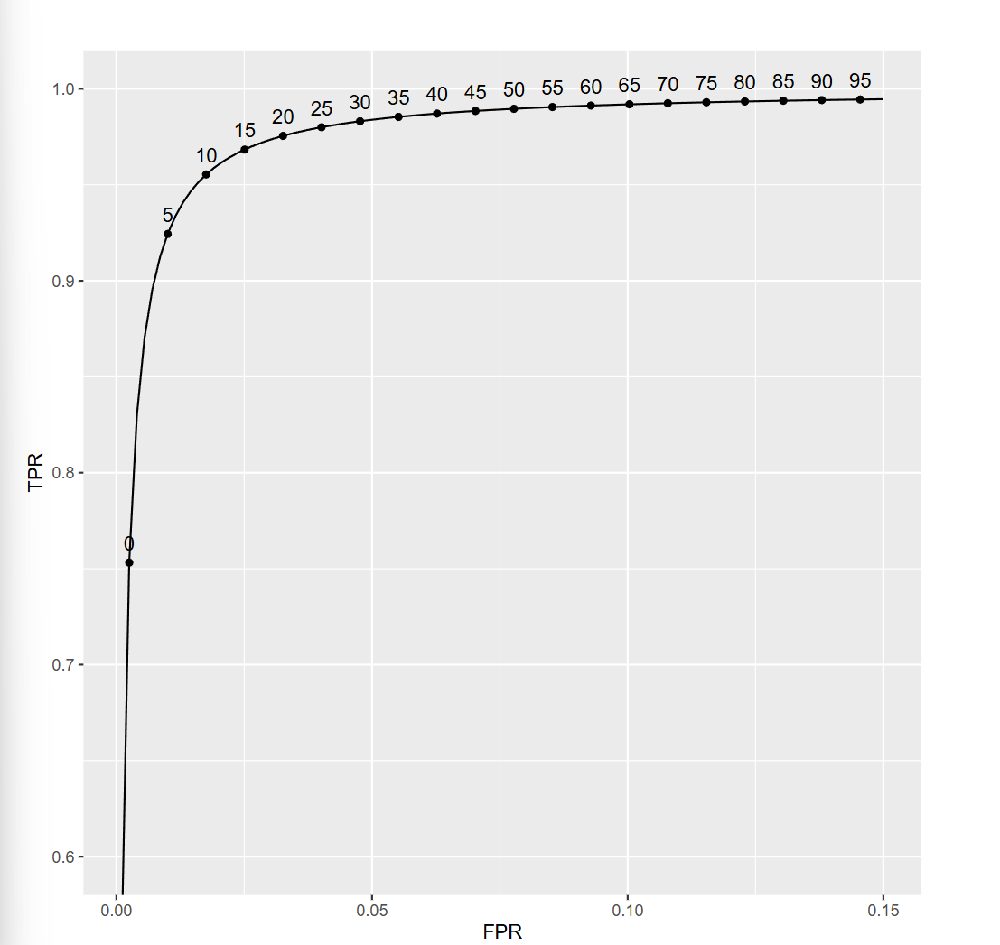
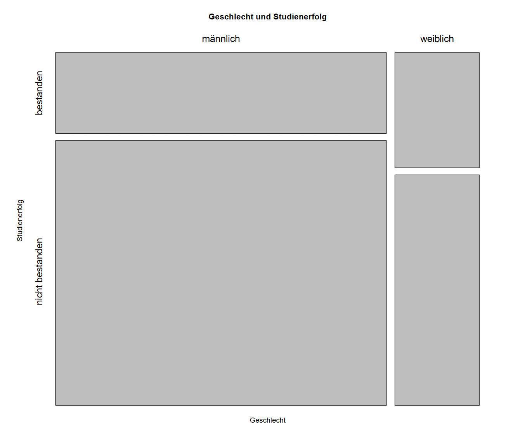
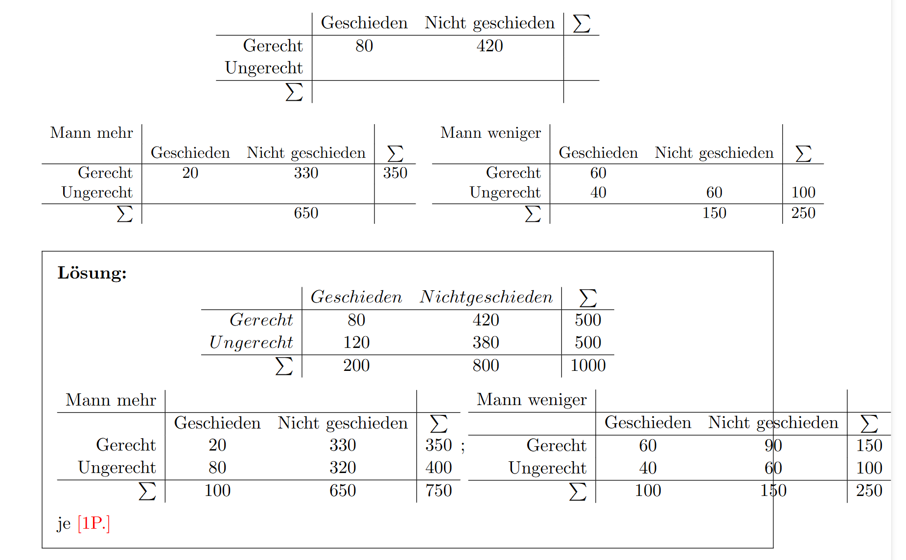

# 条件概率、Bayes、列联表与诊断指标

练习题数：7

相关考试真题数：14

合计题目数：21

## 公式速查

### 考试可用版

- **条件概率**：$P(A|B)=\frac{P(A\cap B)}{P(B)}$
- **乘法公式**：$P(A\cap B)=P(A|B)P(B)$
- **全概率**：$P(A)=\sum_iP(A|B_i)P(B_i)$
- **Bayes**：$P(A|B)=\frac{P(B|A)P(A)}{P(B)}$
- **Bayes 二分类**：$P(A|B)=\frac{P(B|A)P(A)}{P(B|A)P(A)+P(B|A^c)P(A^c)}$
- **敏感度/TPR**：$\frac{TP}{TP+FN}=P(T+|K)$
- **特异度/TNR**：$\frac{TN}{TN+FP}=P(T-|K^c)$
- **FPR**：$\frac{FP}{FP+TN}=1-TNR$
- **PPV**：$\frac{TP}{TP+FP}=P(K|T+)$
- **NPV**：$\frac{TN}{TN+FN}=P(K^c|T-)$
- **Odds**：$O(A)=\frac{P(A)}{1-P(A)}$
- **Odds Ratio**：$OR=\frac{ad}{bc}$
- **期望频数**：$E_{ij}=\frac{\text{行和}_i\text{列和}_j}{n}$
- **Chi-square**：$\chi^2=\sum\frac{(O_{ij}-E_{ij})^2}{E_{ij}}$

### 不会时怎么下手

- **题目问条件概率**：先命名事件，再确认竖线后面的是“已知条件”。
- **题目问原因概率**：例如阳性后患病概率，通常用 Bayes，不要直接拿敏感度。
- **题目有多个来源/组别**：先用全概率公式算分母。
- **题目有检测指标**：把 $K,T+$ 写清楚，再区分 $P(T+|K)$ 和 $P(K|T+)$。
- **题目给列联表**：先补全行和列总数，再算条件比例。
- **题目问关联强度**：二乘二表可用 Odds Ratio；多格表常用 $\chi^2$。

---

## 习题与讲解

### Aufgabe 1 - 分析列联表、条件比例和关联强度。

#### 题目

Die Wirkung von zwei Hustensäften A und B soll verglichen werden.

Erste Studie:

$$
\begin{array}{c|cc|c}
 & A & B & \text{Summe}\\
\hline
\text{Besserung ja} & 25 & 38 & 63\\
\text{Besserung nein} & 7 & 21 & 28\\
\hline
\text{Summe} & 32 & 59 & 91
\end{array}
$$

Zweite Studie:

$$
\begin{array}{c|cc|c}
 & A & B & \text{Summe}\\
\hline
\text{Besserung ja} & 56 & 86 & 142\\
\text{Besserung nein} & 42 & 47 & 89\\
\hline
\text{Summe} & 98 & 133 & 231
\end{array}
$$

#### 解答

##### 中文解题思路

条件概率题先命名事件，再把题目给出的百分比写成条件概率。若题目问的是原因在结果已知后的概率，例如 $P(K\mid T+)$，就要用 Bayes，不能直接拿敏感度或检出率当答案。

列联表题先补全边际总数，再看条件比例。比较两组时不要只比原始频数，因为组大小可能不同；要用条件相对频率、期望频数、$\chi^2$ 或 Odds Ratio。

条件概率题先把事件命名清楚，例如疾病、阳性、机器来源、改善与否。然后写出已知概率和要求的条件概率，最后判断是直接条件概率、全概率公式还是 Bayes 公式。

列联表题建议先补全行和列的总数，再算条件相对频率。比较关联强弱时，用期望频数、$\chi^2$、Odds Ratio 或相关系数时要说明每个格子的含义。

写最终答案时，要把关键等式链写完整：定义、代入、化简、结论四步尽量都出现。证明题尤其要避免只写直觉解释；计算题则要注明参数化方式、积分范围或条件事件。

Für den Vergleich der Hustensäfte sind bedingte relative Häufigkeiten der Besserung gegeben den Hustensaft sinnvoll:

$$
h(\text{ja}\mid A)=\frac{25}{32}\approx0.781,
\qquad
h(\text{ja}\mid B)=\frac{38}{59}\approx0.644.
$$

Nach dieser Stichprobe würde man Hustensaft A bevorzugen.

Die erwarteten absoluten Häufigkeiten unter Unabhängigkeit in Studie 1 sind:

$$
\tilde h_{ij}=\frac{h_{i\cdot}h_{\cdot j}}{n}.
$$

Also:

$$
\begin{array}{c|cc|c}
 & A & B & \text{Summe}\\
\hline
\text{Besserung ja} & \frac{63\cdot32}{91}\approx22.15 & \frac{63\cdot59}{91}\approx40.85 & 63\\
\text{Besserung nein} & \frac{28\cdot32}{91}\approx9.85 & \frac{28\cdot59}{91}\approx18.15 & 28\\
\hline
\text{Summe} & 32 & 59 & 91
\end{array}
$$

Für den $\chi^2$-Wert erhält man:

$$
\chi^2\approx1.833.
$$

Der Kontingenzkoeffizient:

$$
K=\sqrt{\frac{\chi^2}{n+\chi^2}}
=
\sqrt{\frac{1.833}{91+1.833}}
\approx0.141.
$$

Für eine $2\times2$-Tafel ist der korrigierte Koeffizient:

$$
K^*
=\frac{K}{\sqrt{1/2}}
\approx0.199.
$$

Das spricht für einen eher schwachen Zusammenhang.

Der Vorteil des korrigierten Kontingenzkoeffizienten ist die Normierung auf $[0,1]$. Dadurch ist der Wert leichter interpretierbar und besser zwischen Tafeln vergleichbar.

Die Odds Ratio für Studie 1 ist:

$$
\operatorname{OR}_1
=
\frac{25/7}{38/21}
=
\frac{25\cdot21}{7\cdot38}
\approx1.974.
$$

Die Chance auf Besserung ist bei Hustensaft A also fast doppelt so groß wie bei Hustensaft B. Die Odds Ratio hat im Gegensatz zum Kontingenzkoeffizienten eine Richtung.

Für Studie 2:

$$
\operatorname{OR}_2
=
\frac{56/42}{86/47}
=
\frac{56\cdot47}{42\cdot86}
\approx0.729.
$$

Hier ist die Chance auf Besserung mit A kleiner als mit B. Zum Vergleich der Stärke nimmt man den Kehrwert:

$$
\frac1{\operatorname{OR}_2}\approx1.372.
$$

Da:

$$
1.974>1.372,
$$

ist der Unterschied zwischen den Behandlungen in Studie 1 größer.

---

### Aufgabe 2 - 用条件概率和 Bayes 公式解决诊断或来源判断。

#### 题目

###### (i)

In einer Population leiden $5\%$ an Nierenproblemen. Von diesen trinken $75\%$ regelmäßig Alkohol. Von den Personen ohne Nierenprobleme trinken $50\%$ regelmäßig Alkohol. Wie viel Prozent der regelmäßig Alkohol konsumierenden leiden an Nierenproblemen?

#### 解答

##### 中文解题思路

条件概率题先命名事件，再把题目给出的百分比写成条件概率。若题目问的是原因在结果已知后的概率，例如 $P(K\mid T+)$，就要用 Bayes，不能直接拿敏感度或检出率当答案。

条件概率题先把事件命名清楚，例如疾病、阳性、机器来源、改善与否。然后写出已知概率和要求的条件概率，最后判断是直接条件概率、全概率公式还是 Bayes 公式。

写最终答案时，要把关键等式链写完整：定义、代入、化简、结论四步尽量都出现。证明题尤其要避免只写直觉解释；计算题则要注明参数化方式、积分范围或条件事件。

Sei $N$ das Ereignis "Nierenprobleme" und $A$ "regelmäßiger Alkoholkonsum". Dann:

$$
\mathbb P(N)=0.05,
\qquad
\mathbb P(A\mid N)=0.75,
\qquad
\mathbb P(A\mid \bar N)=0.50.
$$

Mit Bayes:

$$
\mathbb P(N\mid A)
=
\frac{\mathbb P(A\mid N)\mathbb P(N)}
{\mathbb P(A\mid N)\mathbb P(N)+\mathbb P(A\mid\bar N)\mathbb P(\bar N)}.
$$

Also:

$$
\mathbb P(N\mid A)
=
\frac{0.75\cdot0.05}{0.75\cdot0.05+0.50\cdot0.95}
\approx0.0732.
$$

Etwa $7.32\%$ der regelmäßig Alkohol konsumierenden leiden an Nierenproblemen.

###### (ii)

Eine Gruppe von $68$ Patient:innen nimmt stationär oder ambulant an einer Therapie teil. $45$ Personen sind HIV-negativ, also $23$ HIV-positiv. Von den HIV-positiven sind $80\%$ stationär, von den HIV-negativen $40\%$.

###### Lösung

Erwartete Anzahl stationär und HIV-positiv:

$$
68\cdot \frac{23}{68}\cdot0.8=18.4\approx18.
$$

Erwartete Anzahl stationär und HIV-negativ:

$$
68\cdot \frac{45}{68}\cdot0.4=18.
$$

Erwartete Anzahl stationär insgesamt:

$$
18.4+18=36.4\approx36.
$$

Anteil HIV-positiver unter den stationären Patient:innen:

$$
\mathbb P(H+\mid S)
=
\frac{0.8\cdot(23/68)}
{0.8\cdot(23/68)+0.4\cdot(45/68)}
\approx0.505.
$$

Unter etwa $36$ stationären Personen erwartet man also ungefähr:

$$
36\cdot0.505\approx18
$$

HIV-positive.

###### (iii)

In einer Gruppe sind $43\%$ männlich, $55\%$ weiblich und $2\%$ divers. Für Männer beträgt die Wahrscheinlichkeit für Farbenblindheit $6\%$, für Frauen ist sie $90\%$ geringer, also $0.6\%$, und für diverse Personen beträgt sie $3\%$.

###### Lösung

Die Wahrscheinlichkeit, dass eine zufällig ausgewählte Person eine farbenblinde Frau ist:

$$
\mathbb P(W\cap F)
=0.55\cdot0.006
=0.0033.
$$

Die Gesamtwahrscheinlichkeit für Farbenblindheit:

$$
\mathbb P(F)
=0.43\cdot0.06+0.55\cdot0.006+0.02\cdot0.03
=0.0297.
$$

Damit:

$$
\mathbb P(M\mid F)
=
\frac{0.43\cdot0.06}{0.0297}
\approx0.869.
$$

Und:

$$
\mathbb P(D\mid F)
=
\frac{0.02\cdot0.03}{0.0297}
\approx0.020.
$$

Der Anteil diverser Personen unter den Farbenblinden ist also deutlich kleiner als der Anteil männlicher Personen.

---

### Aufgabe 3 - 用条件概率和 Bayes 公式解决诊断或来源判断。

#### 题目

An den Kassen eines Modegeschäfts wird ein Gerät eingeführt, das die Echtheit von $500$-Euro-Scheinen prüfen soll. Aus Erfahrung ist bekannt: $12$ von $10000$ Scheinen sind falsch. Das Gerät blinkt, wenn der Schein falsch ist. Bei falschen Scheinen blinkt es in $95$ von $100$ Fällen. Bei echten Scheinen blinkt es in $10$ von $100$ Fällen. Das Gerät blinkt. Wie sicher kann man sein, dass der Schein tatsächlich falsch ist?

#### 解答

##### 中文解题思路

条件概率题先命名事件，再把题目给出的百分比写成条件概率。若题目问的是原因在结果已知后的概率，例如 $P(K\mid T+)$，就要用 Bayes，不能直接拿敏感度或检出率当答案。

条件概率题先把事件命名清楚，例如疾病、阳性、机器来源、改善与否。然后写出已知概率和要求的条件概率，最后判断是直接条件概率、全概率公式还是 Bayes 公式。

写最终答案时，要把关键等式链写完整：定义、代入、化简、结论四步尽量都出现。证明题尤其要避免只写直觉解释；计算题则要注明参数化方式、积分范围或条件事件。

Sei $F$ das Ereignis "Schein falsch" und $A$ das Ereignis "Alarm blinkt". Dann:

$$
\mathbb P(F)=\frac{12}{10000}=0.0012,
\qquad
\mathbb P(A\mid F)=0.95,
\qquad
\mathbb P(A\mid\bar F)=0.10.
$$

Gesucht ist:

$$
\mathbb P(F\mid A).
$$

Mit Bayes:

$$
\mathbb P(F\mid A)
=
\frac{\mathbb P(A\mid F)\mathbb P(F)}
{\mathbb P(A\mid F)\mathbb P(F)+\mathbb P(A\mid\bar F)\mathbb P(\bar F)}.
$$

Einsetzen:

$$
\mathbb P(F\mid A)
=
\frac{0.95\cdot0.0012}
{0.95\cdot0.0012+0.10\cdot0.9988}
\approx0.0113.
$$

Obwohl das Gerät geblinkt hat, liegt die Wahrscheinlichkeit für einen tatsächlich falschen Schein nur bei etwa $1.13\%$. Grund ist die sehr niedrige Grundrate falscher Scheine.

---

### Aufgabe 4 - 用条件概率和 Bayes 公式解决诊断或来源判断。

#### 题目

Maschine A produziert $60\%$ der Schrauben, davon sind $2\%$ fehlerhaft. Maschine B produziert $40\%$, davon sind $5\%$ fehlerhaft. Eine zufällig entnommene Schraube ist fehlerhaft. Mit welcher Wahrscheinlichkeit stammt sie von Maschine B?

#### 解答

##### 中文解题思路

先把题目翻译成概率测度的基本性质：概率非负、全集概率为 $1$、单调性 $A\subseteq B\Rightarrow \mathbb P(A)\le \mathbb P(B)$，以及不交事件满足 $\mathbb P(A\cup B)=\mathbb P(A)+\mathbb P(B)$。这类题不要凭图像直觉判断，最好把每个条件都写成一个概率等式或不等式。

条件概率题先命名事件，再把题目给出的百分比写成条件概率。若题目问的是原因在结果已知后的概率，例如 $P(K\mid T+)$，就要用 Bayes，不能直接拿敏感度或检出率当答案。

条件概率题先把事件命名清楚，例如疾病、阳性、机器来源、改善与否。然后写出已知概率和要求的条件概率，最后判断是直接条件概率、全概率公式还是 Bayes 公式。

题目有多个小问时，建议每个小问都保留相同的解题格式：先列已知，再写公式，再代数化简。这样即使某一问算错，也不影响其它小问的结构分。

写最终答案时，要把关键等式链写完整：定义、代入、化简、结论四步尽量都出现。证明题尤其要避免只写直觉解释；计算题则要注明参数化方式、积分范围或条件事件。

$$
\mathbb P(A)=0.6,
\qquad
\mathbb P(B)=0.4,
\qquad
\mathbb P(F\mid A)=0.02,
\qquad
\mathbb P(F\mid B)=0.05.
$$

Mit Bayes:

$$
\mathbb P(B\mid F)
=
\frac{\mathbb P(B)\mathbb P(F\mid B)}
{\mathbb P(A)\mathbb P(F\mid A)+\mathbb P(B)\mathbb P(F\mid B)}.
$$

Also:

$$
\mathbb P(B\mid F)
=
\frac{0.4\cdot0.05}{0.6\cdot0.02+0.4\cdot0.05}
=
\frac{0.02}{0.032}
=0.625.
$$

---

### Aufgabe 5 - 用条件概率和 Bayes 公式解决诊断或来源判断。

#### 题目

Eine Krankheit hat Prävalenz $1\%$. Ein Test hat Sensitivität $95\%$ und False-Positive-Rate $3\%$. Eine Person testet positiv. Wie wahrscheinlich ist es, dass sie wirklich krank ist?

#### 解答

##### 中文解题思路

条件概率题先命名事件，再把题目给出的百分比写成条件概率。若题目问的是原因在结果已知后的概率，例如 $P(K\mid T+)$，就要用 Bayes，不能直接拿敏感度或检出率当答案。

条件概率题先把事件命名清楚，例如疾病、阳性、机器来源、改善与否。然后写出已知概率和要求的条件概率，最后判断是直接条件概率、全概率公式还是 Bayes 公式。

诊断题最容易错在把敏感度和阳性预测值混淆。敏感度是 $P(T+|K)$，PPV 是 $P(K|T+)$；后者必须通过 Bayes 把患病率纳入计算。

写最终答案时，要把关键等式链写完整：定义、代入、化简、结论四步尽量都出现。证明题尤其要避免只写直觉解释；计算题则要注明参数化方式、积分范围或条件事件。

Sei $K$ das Ereignis "krank" und $T$ das Ereignis "Test positiv". Dann:

$$
\mathbb P(K)=0.01,
\qquad
\mathbb P(T\mid K)=0.95,
\qquad
\mathbb P(T\mid \bar K)=0.03.
$$

Der positive prädiktive Wert ist:

$$
\mathbb P(K\mid T)
=
\frac{\mathbb P(T\mid K)\mathbb P(K)}
{\mathbb P(T\mid K)\mathbb P(K)+\mathbb P(T\mid\bar K)\mathbb P(\bar K)}.
$$

Damit:

$$
\mathbb P(K\mid T)
=
\frac{0.95\cdot0.01}{0.95\cdot0.01+0.03\cdot0.99}
=
\frac{0.0095}{0.0392}
\approx 0.2423.
$$

---

### Aufgabe 6 - 用条件概率和 Bayes 公式解决诊断或来源判断。

#### 题目

Blutgruppen treten mit Wahrscheinlichkeiten $0.42$, $0.10$, $0.04$, $0.44$ für $A,B,AB,0$ auf. Die bedingten Wahrscheinlichkeiten für $R+$ sind $0.85$ für $A$ und $0$, $0.8$ für $B$ und $0.75$ für $AB$.

#### 解答

##### 中文解题思路

条件概率题先命名事件，再把题目给出的百分比写成条件概率。若题目问的是原因在结果已知后的概率，例如 $P(K\mid T+)$，就要用 Bayes，不能直接拿敏感度或检出率当答案。

条件概率题先把事件命名清楚，例如疾病、阳性、机器来源、改善与否。然后写出已知概率和要求的条件概率，最后判断是直接条件概率、全概率公式还是 Bayes 公式。

写最终答案时，要把关键等式链写完整：定义、代入、化简、结论四步尽量都出现。证明题尤其要避免只写直觉解释；计算题则要注明参数化方式、积分范围或条件事件。

Mit der Formel der totalen Wahrscheinlichkeit:

$$
\mathbb P(R+)
=0.42\cdot0.85+0.10\cdot0.8+0.04\cdot0.75+0.44\cdot0.85.
$$

Also:

$$
\mathbb P(R+)=0.841.
$$

Mit Bayes:

$$
\mathbb P(AB\mid R+)
=\frac{\mathbb P(R+\mid AB)\mathbb P(AB)}{\mathbb P(R+)}
=\frac{0.75\cdot0.04}{0.841}
\approx 0.0357.
$$

---

### Aufgabe 7 - 练习条件概率、Bayes 和列联表。

#### 题目

Sei $(\Omega,\mathcal F,\mathbb P)$ ein beliebiger Wahrscheinlichkeitsraum mit $A_1,\dots,A_n\in\mathcal F$, $n\in\mathbb N$.

###### (a)

Beweisen Sie die Siebformel:

$$
\mathbb P\left(\bigcup_{i=1}^n A_i\right)
=
\sum_{k=1}^n
(-1)^{k+1}
\sum_{1\leq j_1<\dots<j_k\leq n}
\mathbb P(A_{j_1}\cap\dots\cap A_{j_k}).
$$

###### (b)

Wie groß ist die Laplace-Wahrscheinlichkeit, dass eine beliebig gewählte Zahl $n\in\{1,\dots,100\}$ durch mindestens eine der Zahlen $2$, $3$ oder $5$ teilbar ist?

#### 解答

##### 中文解题思路

Laplace 模型的第一步是数清样本空间大小和有利结果个数。最后概率写成 $|A|/|\Omega|$；如果事件之间有重叠，要用容斥原理而不是直接相加。

条件概率题先把事件命名清楚，例如疾病、阳性、机器来源、改善与否。然后写出已知概率和要求的条件概率，最后判断是直接条件概率、全概率公式还是 Bayes 公式。

题目有多个小问时，建议每个小问都保留相同的解题格式：先列已知，再写公式，再代数化简。这样即使某一问算错，也不影响其它小问的结构分。

写最终答案时，要把关键等式链写完整：定义、代入、化简、结论四步尽量都出现。证明题尤其要避免只写直觉解释；计算题则要注明参数化方式、积分范围或条件事件。

###### (a) Beweisen Sie die Siebformel:

Für $n=2$ ist dies die bekannte Additionsformel:

$$
\mathbb P(A_1\cup A_2)
=
\mathbb P(A_1)+\mathbb P(A_2)-\mathbb P(A_1\cap A_2).
$$

Der allgemeine Fall folgt per vollständiger Induktion über $n$.

Induktionsschritt: Schreibe

$$
\bigcup_{i=1}^{n+1}A_i
=
\left(\bigcup_{i=1}^n A_i\right)\cup A_{n+1}.
$$

Wende die Formel für zwei Mengen an und benutze die Induktionsvoraussetzung sowohl für $\bigcup_{i=1}^n A_i$ als auch für

$$
\left(\bigcup_{i=1}^n A_i\right)\cap A_{n+1}
=
\bigcup_{i=1}^n(A_i\cap A_{n+1}).
$$

Dadurch entstehen genau die Summanden der Siebformel mit alternierenden Vorzeichen.

###### (b)

Seien:

$$
A_2=\{n:2\mid n\},
\quad
A_3=\{n:3\mid n\},
\quad
A_5=\{n:5\mid n\}.
$$

Dann:

$$
|A_2|=50,\quad |A_3|=33,\quad |A_5|=20.
$$

Schnittmengen:

$$
|A_2\cap A_3|=16,\quad
|A_2\cap A_5|=10,\quad
|A_3\cap A_5|=6.
$$

Dreifacher Schnitt:

$$
|A_2\cap A_3\cap A_5|=3.
$$

Mit der Siebformel:

$$
|A_2\cup A_3\cup A_5|
=
50+33+20-16-10-6+3
=
74.
$$

Also:

$$
\mathbb P(A_2\cup A_3\cup A_5)=\frac{74}{100}=0.74.
$$

---

## 相关考试真题

### 真题 1（2014） - Aufgabe 1

#### 题目

Trotz Anschnallpflicht legen $15\%$ aller Autofahrer keinen Gurt an.  
Eine Krankenversicherung ermittelte, dass bei Verkehrsunfällen von PKW-Fahrern nur $8\%$ schwere Kopfverletzungen aufwiesen, wenn die Fahrer angeschnallt waren. Bei nicht-angeschnallten Fahrern trugen $62\%$ keine schwere Kopfverletzung davon.

$A$: angegurtet  
$K$: Kopfverletzung

a) Interpretiere Ereignis $\bar A \cap \bar K$ und berechne $P(\bar A \cap \bar K)$.

b) Sind $\bar A$ und $\bar K$ stochastisch unabhängig?

c) Wie groß ist die Wahrscheinlichkeit, dass Autofahrer nicht angegurtet waren, wenn sie eine Kopfverletzung haben?

---

#### 解答

##### 中文解题思路

先把题目给出的对象、要求证明或计算的量逐一标出来；然后选择对应的定义、定理或计算公式，最后把结果和题目要求逐项对应。

Es gilt $\mathbb P(\bar A)=0.15$, also $\mathbb P(A)=0.85$.
Weiter ist

$$
\mathbb P(K\mid A)=0.08,\qquad \mathbb P(\bar K\mid \bar A)=0.62.
$$

**a)** Das Ereignis $\bar A\cap \bar K$ bedeutet: Der Fahrer war nicht angegurtet und hatte keine schwere Kopfverletzung.

$$
\mathbb P(\bar A\cap \bar K)
=\mathbb P(\bar A)\mathbb P(\bar K\mid \bar A)
=0.15\cdot0.62
=0.093.
$$

**b)** Für Unabhängigkeit müsste gelten:

$$
\mathbb P(\bar A\cap \bar K)=\mathbb P(\bar A)\mathbb P(\bar K).
$$

Zunächst:

$$
\mathbb P(\bar K)=\mathbb P(\bar K\mid A)\mathbb P(A)+\mathbb P(\bar K\mid\bar A)\mathbb P(\bar A)
=0.92\cdot0.85+0.62\cdot0.15=0.875.
$$

Damit:

$$
\mathbb P(\bar A)\mathbb P(\bar K)=0.15\cdot0.875=0.13125\neq0.093.
$$

Also sind $\bar A$ und $\bar K$ nicht unabhängig.

**c)** Gesucht ist $\mathbb P(\bar A\mid K)$.

$$
\mathbb P(K)=0.08\cdot0.85+0.38\cdot0.15=0.125.
$$

$$
\mathbb P(\bar A\mid K)=\frac{\mathbb P(K\mid\bar A)\mathbb P(\bar A)}{\mathbb P(K)}
=\frac{0.38\cdot0.15}{0.125}
=0.456.
$$

---

### 真题 2（2014） - Aufgabe 4

#### 题目

Für $n=60$ Studenten wurde die Haarfarbe ermittelt und in „Blond“, „Schwarz/Braun“ und „Sonstig“ aufgeteilt.

| Blond | Schwarz/Braun | Sonst |
|---:|---:|---:|
| $30$ | $20$ | $10$ |

Für diese $3$ Haargruppen wird diskrete Gleichverteilung angenommen.

a) Bestimme die erwarteten Häufigkeiten für die Haargruppen unter der Annahme, dass diskrete Gleichverteilung vorliegt.

b) Berechne Pearsonsches $\chi^2$-Maß.

c) Das Pearsonsches $\chi^2$-Maß folgt unter der obigen Annahme einer $\chi^2_k$-Verteilung mit $k$ Freiheitsgraden. Gib die Anzahl der Freiheitsgrade im vorliegenden Beispiel an.

d) Überprüfe obige Annahme auf dem Niveau $\alpha=0{,}1$. Nutze eine der folgenden Möglichkeiten:

- entweder: Berechne den $p$-Wert,
- oder: Vergleiche das Pearsonsches $\chi^2$-Maß mit dem kritischen Wert aus Teilaufgabe c).

**Hinweis:**  
Die Quantilsfunktion und die Verteilungsfunktion der $\chi^2$-Verteilung ist für $k=1,\dots,5$ im Anhang angegeben. Verwende passendes $k$.

**Anmerkung:**  
Dies ist ein Gedächtnisprotokoll. Verwende Google statt der Tabellen.

Tabelle 1: Quantilsfunktion der $\chi^2_k$-Verteilung mit $k=1,\dots,5$ Freiheitsgraden

Tabelle 2: Verteilungsfunktion der $\chi^2_k$-Verteilung mit $k=1,\dots,5$ Freiheitsgraden

---

#### 解答

##### 中文解题思路

先把题目给出的对象、要求证明或计算的量逐一标出来；然后选择对应的定义、定理或计算公式，最后把结果和题目要求逐项对应。

Unter Gleichverteilung sind die erwarteten Häufigkeiten:

$$
E_i=\frac{60}{3}=20
$$

für jede der drei Haarfarben.

Das Pearsonsche $\chi^2$-Maß ist:

$$
\chi^2
=\frac{(30-20)^2}{20}
+\frac{(20-20)^2}{20}
+\frac{(10-20)^2}{20}
=5+0+5=10.
$$

Bei drei Kategorien und vollständig vorgegebener Gleichverteilung gilt:

$$
k=3-1=2.
$$

Für $\alpha=0.1$ wird mit dem kritischen Wert der $\chi^2_2$-Verteilung verglichen.
Da $\chi^2=10$ groß ist, wird die Gleichverteilungsannahme auf dem Niveau $\alpha=0.1$ verworfen.

---

### 真题 3（2015） - Aufgabe 1: HIV-Test

#### 题目

Tests auf HIV können positiv sein, obwohl eigentlich negativ.  
Wahrscheinlichkeit: $0{,}005\%$.

Wenn tatsächlich HIV-infiziert, dann ist die Wahrscheinlichkeit $=100\%$ für Test positiv.

$I$: Die Person ist mit HIV infiziert.  
$P$: Der HIV-Test fällt positiv aus.

Low-Risk-Gruppe: Nur $10$ von $100000$ Personen sind mit HIV infiziert.  
Eine Person aus dieser Gruppe.

a) Wie groß ist die a-priori Wahrscheinlichkeit, dass diese Person mit HIV infiziert ist, vor dem Test?

b) Untersuchen Sie formal und mit Begründung, ob die Ereignisse $I$ und $P$ stochastisch unabhängig sind.

c) Wie groß ist die Wahrscheinlichkeit, dass diese Person tatsächlich mit HIV infiziert ist, wenn der HIV-Test positiv ausfällt?

---

#### 解答

##### 中文解题思路

先把题目给出的对象、要求证明或计算的量逐一标出来；然后选择对应的定义、定理或计算公式，最后把结果和题目要求逐项对应。

In der Low-Risk-Gruppe gilt:

$$
\mathbb P(I)=\frac{10}{100000}=0.0001.
$$

Außerdem:

$$
\mathbb P(P\mid I)=1,\qquad
\mathbb P(P\mid I^c)=0.00005.
$$

Die Ereignisse $I$ und $P$ sind nicht unabhängig, denn:

$$
\mathbb P(P\mid I)=1
$$

ist offensichtlich nicht gleich der Gesamtwahrscheinlichkeit $\mathbb P(P)$.

Mit der Formel der totalen Wahrscheinlichkeit:

$$
\mathbb P(P)=1\cdot0.0001+0.00005\cdot0.9999
\approx0.000149995.
$$

Mit Bayes:

$$
\mathbb P(I\mid P)
=\frac{\mathbb P(P\mid I)\mathbb P(I)}{\mathbb P(P)}
=\frac{0.0001}{0.000149995}
\approx0.667.
$$

Trotz positivem Test liegt die Wahrscheinlichkeit einer tatsächlichen Infektion also nur bei ungefähr $66.7\%$.

---

### 真题 4（Altklausur2LV） - Aufgabe 5 — 13 Punkte

#### 题目

Prof. Dr. med. Kwarantina Bauterlach-Vligenört hat einen neuen diagnostischen Test für das Vorliegen einer akuten Infektion mit der schrecklichen Fnufnu-Krankheit entwickelt.

Ihre klinische Erprobung des Tests an einer Stichprobe von Patient:innen, die entweder noch nie mit dem Fnufnu-Erreger infiziert waren („Naiv“) oder eine solche Infektion bereits hinter sich haben („Genesen“) oder zum Zeitpunkt der Studie an einer akuten Fnufnu-Infektion leiden („Kranke“), ergibt folgende Ergebnisse:

| Status | Naiv | Genesen | Krank | Summe |
| --- | --: | --: | --: | --: |
| Test positiv | 1 | 3 | 35 | 39 |
| Test negativ | 20 | 25 | 3 | 48 |
| Summe | 21 | 28 | 38 | 87 |

Unter den Patient:innen, die Bauterlach-Vligenört im Klinikalltag versorgt, sind

- $30\%$ Genesene,
- $65\%$ Naive,
- $5\%$ Fnufnu-Kranke.

Gehen Sie im Folgenden davon aus, dass die in der klinischen Erprobung ermittelten Eigenschaften des Tests, also FPR, TNR etc., auch im Klinikalltag gelten.

##### (a)

Berechnen Sie auf Basis der Ergebnisse der klinischen Erprobung die Sensitivität und Spezifität des Tests zur Entdeckung einer akuten Infektion.

##### (b)

Berechnen Sie für die oben angegebene Prävalenz der Krankheit die Wahrscheinlichkeit, mit der ein Test im Klinikalltag ein positives Ergebnis zeigt.

##### (c)

Berechnen Sie die Wahrscheinlichkeit, mit der ein negatives Testergebnis im Klinikalltag eine tatsächlich nicht akut erkrankte Person anzeigt.

##### (d)

Die Grafik unten zeigt die ROC-Kurve eines alternativen, deutlich teureren diagnostischen Tests. Die ROC-Kurve ist an ausgewählten Punkten mit den entsprechenden Schwellenwerten des zu Grunde liegenden diagnostischen Scores beschriftet.

###### (i)

Funktioniert der in den vorherigen Teilaufgaben analysierte Test von Bauterlach-Vligenört etwa gleich gut, besser, oder schlechter als der hier dargestellte Test?

###### (ii)

Gehen Sie davon aus, dass eine Erkrankung mit der Fnufnu-Krankheit für Schwangere und ihre ungeborenen Kinder absolut lebensbedrohend ist, falls diese nicht sehr früh entdeckt und therapiert wird. Wie sollte der Schwellenwert des in der Grafik gezeigten diagnostischen Tests also gewählt werden, wenn dieser auf eine schwangere Patientin angewendet wird?

Begründen Sie Ihre Antworten kurz.

#### 解答

###### (a) Berechnen Sie auf Basis der Ergebnisse der klinischen Erprobung die Sensitivität und Spezifität des Tests zur Entdeckung einer akuten Infektion.

###### 中文解题思路

先命名真实状态和测试结果两个事件，画出条件概率树或列联表；预测值问题用 Bayes，ROC 问题看 TPR/FPR 的权衡。

Status:

$$
N=\text{Naiv},\qquad G=\text{Genesen},\qquad K=\text{Krank}
$$

Testergebnis:

$$
P=\text{positiv},\qquad nP=\text{negativ}
$$

Sensitivität bzw. TPR:

$$
P(P\mid K)=\frac{35}{38}\approx0.921.
$$

Spezifität bzw. TNR:

$$
P(nP\mid \overline K)=\frac{20+25}{21+28}=\frac{45}{49}\approx0.918.
$$

---

###### (b) Berechnen Sie für die oben angegebene Prävalenz der Krankheit die Wahrscheinlichkeit, mit der ein Test im Klinikalltag ein positives Ergebnis zeigt.

###### 中文解题思路

先判断样本是否配对、是否近似正态，再写出原假设和备择假设；计算检验统计量后和临界值或 p 值比较。

Mit totaler Wahrscheinlichkeit:

$$
P(P)=\sum_{B\in\{N,K,G\}}P(P\mid B)P(B).
$$

Aus der Tabelle:

$$
P(P\mid K)=\frac{35}{38},\qquad P(P\mid N)=\frac1{21},\qquad P(P\mid G)=\frac3{28}.
$$

Mit

$$
P(N)=0.65,\qquad P(K)=0.05,\qquad P(G)=0.3
$$

folgt:

$$
P(P)=\frac1{21}\cdot0.65+\frac{35}{38}\cdot0.05+\frac3{28}\cdot0.3\approx0.109.
$$

---

###### (c) Berechnen Sie die Wahrscheinlichkeit, mit der ein negatives Testergebnis im Klinikalltag eine tatsächlich nicht akut erkrankte Person anzeigt.

###### 中文解题思路

先命名真实状态和测试结果两个事件，画出条件概率树或列联表；预测值问题用 Bayes，ROC 问题看 TPR/FPR 的权衡。

Gesucht ist:

$$
P(G\cup N\mid nP).
$$

Mit Bayes:

$$
P(G\cup N\mid nP)=\frac{P(nP\mid G\cup N)P(G\cup N)}{P(nP)}.
$$

Nun ist:

$$
P(nP\mid G\cup N)=\frac{20+25}{21+28}=\frac{45}{49}
$$

und

$$
P(G\cup N)=0.3+0.65=0.95.
$$

Damit:

$$
P(nP\mid G\cup N)P(G\cup N)=\frac{45}{49}\cdot0.95\approx0.872.
$$

Außerdem:

$$
P(nP)=1-P(P)=1-0.109=0.891.
$$

Also:

$$
P(G\cup N\mid nP)=\frac{0.872}{0.891}\approx0.979.
$$

---

###### (d) Die Grafik unten zeigt die ROC-Kurve eines alternativen, deutlich teureren diagnostischen Tests. Die ROC-Kurve ist an ausgewählten Punkten mit den entsprechenden Schwellenwerten des zu Grunde liegenden diagnostischen Scores beschriftet.

###### 中文解题思路

先命名真实状态和测试结果两个事件，画出条件概率树或列联表；预测值问题用 Bayes，ROC 问题看 TPR/FPR 的权衡。

###### (i)

Deutlich schlechter.

Das hier gezeigte System erreicht für

$$
\operatorname{FPR}=8\%
$$

also etwa die FPR des Tests von Bauterlach-Vligenört, eine TPR von deutlich über $95\%$.

Der Test von Bauterlach-Vligenört erreicht nur eine TPR von etwa $92\%$.

###### (ii)

In dem hier beschriebenen Szenario ist die Entdeckung und Beseitigung möglichst aller Erkrankungen wichtiger als die Vermeidung von Fehlalarmen.

Also gilt es, die Sensitivität bzw. TPR zu maximieren.

Ein Schwellenwert $>55$ erscheint angemessen. Eine Erhöhung auf mehr als ca. $65$ bringt keine deutliche Verbesserung der TPR mehr, produziert aber deutlich mehr Fehldiagnosen.

Akzeptabel wären bei entsprechender Begründung auch Schwellenwerte im Bereich von etwa $40$ bis $70$.

---

### 真题 5（Altklausur2LV） - Aufgabe 9 — 21 Punkte

#### 题目

Beantworten Sie die folgenden Fragen jeweils mit kurzer Begründung oder Rechnung mit nachvollziehbarem Ansatz.

---

##### (a)

A und B spielen folgendes Spiel: Es wird mit $4$ Würfeln gewürfelt. Tritt mindestens einmal die Zahl $6$ auf, dann gewinnt A, sonst B. Ist das Spiel fair in dem Sinne, dass im Mittel beide gleich oft gewinnen werden?

##### (b)

In einer Population leiden fünf Prozent der Menschen an erhöhtem Blutdruck. Von diesen fünf Prozent trinken $75\%$ regelmäßig Alkohol. Außerdem ist bekannt, dass $50\%$ der Menschen, die keinen erhöhten Blutdruck haben, regelmäßig Alkohol trinken. Wieviel Prozent der regelmäßigen Alkoholkonsument:innen leiden an erhöhtem Blutdruck?

##### (c)

Sei $X$ eine stetige Zufallsvariable mit Verteilungsfunktion $F_X$ und einem $0.25$-Quantil von $3$. Welche der folgenden Aussagen trifft/treffen zu?

1. $F_X(3)=0.25$
2. $F_X(0.25)=3$
3. $F_X^{-1}(3)=0.25$

##### (d)

Sei $Y$ eine diskrete Zufallsvariable mit Träger $T_Y=\mathbb N$ und Verteilungsfunktion $F_Y$ mit

$$
F_Y\left(\frac{33}{10}\right)=0.5
$$

und

$$
F_Y(2)\neq F_Y(3)\neq F_Y(4).
$$

Geben Sie für die folgenden Aussagen an, ob sie aus diesen Angaben folgen:

1. Der Median von $Y$ ist $3$.
2. $P(Y<3)\le 0.5$
3. Der Erwartungswert von $Y$ ist $3$.

##### (e)

Welche Verteilung hat die Zufallsvariable

$$
Z=3U-12
$$

falls

$$
U\sim \mathcal N(\mu=4,\sigma^2=5)?
$$

##### (f)

Nehmen Sie an, ein Pfandautomat akzeptiert jede ihm zugeführte Flasche mit Wahrscheinlichkeit $p<1$. Sei $F$ die Anzahl der Flaschen, die man dem Automaten zuführen muss, um einen Pfandbon für $m$ akzeptierte Flaschen zu bekommen. Mit welcher aus der Vorlesung bekannten parametrischen Verteilung können Sie $F$ beschreiben, was sind die Parameterwerte und welche zusätzlichen Annahmen über den daten-generierenden Prozess müssen Sie dafür treffen?

##### (g)

Folgender Mosaikplot stellt den beobachteten Zusammenhang der Merkmale Geschlecht $(m/w)$ und Klausurerfolg $(bestanden/nicht bestanden)$ für eine Statistikklausur dar.

1. Für welches Geschlecht ist die Durchfallrate höher?
2. Gibt es insgesamt mehr Männer, die bestehen oder mehr Frauen, die bestehen?
3. Das zusätzlich erhobene Merkmal „Studienfach“ mit möglichen Ausprägungen „Nebenfach“ und „Hauptfach“ ist empirisch unabhängig von „Geschlecht“ und von „Klausurerfolg“. Die Hälfte der Prüfungsteilnehmer:innen sind Nebenfachstudierende, die anderen Hauptfachstudierende. Skizzieren Sie einen Mosaikplot für die gemeinsame Verteilung dieser drei Merkmale. Nur schematische Skizze gefragt, keine exakte Zeichnung.

##### (h)

Es liegt eine große Anzahl $n$ von unabhängig Poisson-verteilten Zufallsvariablen mit gleicher Rate $\lambda$ vor. Wie ist die Summe dieser Zufallsvariablen exakt verteilt und welcher Verteilung folgt diese Summe approximativ?

#### 解答

###### (a) A und B spielen folgendes Spiel: Es wird mit $4$ Würfeln gewürfelt. Tritt mindestens einmal die Zahl $6$ auf, dann gewinnt A, sonst B. Ist das Spiel fair in dem Sinne, dass im Mittel beide gleich oft gewinnen werden?

###### 中文解题思路

先明确实验到底要区分哪些结果。若题目要求完整记录每次投掷，就用有序元组作 $\Omega$；若只关心和或某个统计量，就可以把样本空间压缩到这些统计量的可能取值。

B gewinnt genau dann, wenn bei allen $4$ Würfen **keine** $6$ auftritt.

$$
P(\text{B gewinnt})
=
\left(\frac{5}{6}\right)^4
=
\frac{625}{1296}
\approx 0.4823
$$

Damit ist

$$
P(\text{A gewinnt})
=
1-\left(\frac{5}{6}\right)^4
\approx 0.5177.
$$

Da

$$
P(\text{B gewinnt})\neq 0.5
$$

bzw.

$$
P(\text{A gewinnt})\neq P(\text{B gewinnt}),
$$

ist das Spiel **nicht fair**.

---

###### (b) In einer Population leiden fünf Prozent der Menschen an erhöhtem Blutdruck. Von diesen fünf Prozent trinken $75\%$ regelmäßig Alkohol. Außerdem ist bekannt, dass $50\%$ der Menschen, die keinen erhöhten Blutdruck haben, regelmäßig Alkohol trinken. Wieviel Prozent der regelmäßigen Alkoholkonsument:innen leiden an erhöhtem Blutdruck?

###### 中文解题思路

先命名真实状态和测试结果两个事件，画出条件概率树或列联表；预测值问题用 Bayes，ROC 问题看 TPR/FPR 的权衡。

Seien

$$
B=\text{Person leidet an erhöhtem Blutdruck}
$$

und

$$
A=\text{Person trinkt regelmäßig Alkohol}.
$$

Gegeben sind:

$$
P(B)=0.05,
\qquad
P(A\mid B)=0.75,
\qquad
P(A\mid \overline B)=0.5.
$$

Gesucht ist:

$$
P(B\mid A).
$$

Mit Bayes:

$$
P(B\mid A)
=
\frac{P(A\mid B)P(B)}
{P(A\mid B)P(B)+P(A\mid \overline B)P(\overline B)}.
$$

Einsetzen liefert:

$$
P(B\mid A)
=
\frac{0.75\cdot 0.05}
{0.75\cdot 0.05+0.5\cdot 0.95}.
$$

$$
P(B\mid A)
=
\frac{0.0375}{0.0375+0.475}
=
\frac{0.0375}{0.5125}
\approx 0.0732.
$$

Also leiden ungefähr

$$
7.3\%
$$

der regelmäßigen Alkoholkonsument:innen an erhöhtem Blutdruck.

---

###### (c) Sei $X$ eine stetige Zufallsvariable mit Verteilungsfunktion $F_X$ und einem $0.25$-Quantil von $3$. Welche der folgenden Aussagen trifft/treffen zu?

###### 中文解题思路

分位数题就是解 $F(x)=p$，但要先检查 $x$ 所在的分段。连续分布中 $p$-Quantil 表示有 $p$ 的概率落在该值左侧；如果分布有跳跃，要用广义逆定义。

Ein $0.25$-Quantil von $X$ ist gegeben durch

$$
F_X^{-1}(0.25)=3.
$$

Da $X$ stetig ist, gilt hier entsprechend:

$$
F_X(3)=0.25.
$$

Damit ist nur Aussage **(i)** richtig.

Die Aussagen

$$
F_X(0.25)=3
$$

und

$$
F_X^{-1}(3)=0.25
$$

vertauschen jeweils Argument und Funktionswert bzw. verwenden eine unmögliche Quantilswahrscheinlichkeit, da $3\notin[0,1]$ ist.

---

###### (d) Sei $Y$ eine diskrete Zufallsvariable mit Träger $T_Y=\mathbb N$ und Verteilungsfunktion $F_Y$ mit

###### 中文解题思路

先确认随机变量的密度或分布，再分别按定义处理：期望用 $\int x f(x)\,dx$，Median 解 $F(m)=0.5$，Modus 找密度最大点，Schiefe 结合均值、Median 和分布形状判断。

Da

$$
T_Y=\mathbb N
$$

und

$$
\frac{33}{10}=3.3,
$$

gilt

$$
F_Y(3.3)=P(Y\le 3)=F_Y(3)=0.5.
$$

Außerdem folgt aus

$$
F_Y(2)\neq F_Y(3)
$$

dass bei $Y=3$ positive Wahrscheinlichkeit liegt, also

$$
P(Y=3)>0.
$$

Damit gilt

$$
F_Y(2)<F_Y(3)=0.5.
$$

Also:

$$
P(Y<3)=P(Y\le 2)=F_Y(2)<0.5.
$$

Damit folgt Aussage **(ii)**.

Da außerdem

$$
F_Y(3)=0.5
$$

und wegen

$$
F_Y(3)\neq F_Y(4)
$$

auch

$$
F_Y(4)>0.5
$$

gilt, ist $3$ ein Median. Aussage **(i)** folgt also ebenfalls.

Der Erwartungswert hängt dagegen von der gesamten Verteilung ab und ist durch diese Angaben nicht bestimmt. Aussage **(iii)** folgt daher nicht.

Also folgen:

$$
\text{(i) und (ii), aber nicht (iii).}
$$

---

###### (e) Welche Verteilung hat die Zufallsvariable

###### 中文解题思路

变量变换题先写出新旧变量关系和取值范围。如果变换单调，用 $f_Y(y)=f_X(x(y))\lvert x'(y)\rvert$；如果不是单调，要把所有原像分支的贡献加起来。

Lineare Transformationen normalverteilter Zufallsvariablen sind wieder normalverteilt.

Es gilt:

$$
E(Z)
=
E(3U-12)
=
3E(U)-12
=
3\cdot 4-12
=
0.
$$

Außerdem:

$$
\operatorname{Var}(Z)
=
\operatorname{Var}(3U-12)
=
3^2\operatorname{Var}(U)
=
9\cdot 5
=
45.
$$

Damit:

$$
Z\sim \mathcal N(0,45).
$$

---

###### (f) Nehmen Sie an, ein Pfandautomat akzeptiert jede ihm zugeführte Flasche mit Wahrscheinlichkeit $p<1$. Sei $F$ die Anzahl der Flaschen, die man dem Automaten zuführen muss, um einen Pfandbon für $m$ akzeptierte Flaschen zu bekommen. Mit welcher aus der Vorlesung bekannten parametrischen Verteilung können Sie $F$ beschreiben, was sind die Parameterwerte und welche zusätzlichen Annahmen über den daten-generierenden Prozess müssen Sie dafür treffen?

###### 中文解题思路

这一步先把事件命名并整理成条件概率、全概率或 Bayes 公式。若是抽样或诊断题，先分清真实状态、观察结果和题目真正要求的条件方向。

Gesucht ist die Anzahl der Versuche, bis der $m$-te Erfolg eintritt.

Ein Erfolg ist hier:

$$
\text{Flasche wird akzeptiert}.
$$

Die Erfolgswahrscheinlichkeit ist

$$
p.
$$

Unter der Annahme, dass

- die Erfolgswahrscheinlichkeit $p$ bei jedem Versuch konstant bleibt,
- die einzelnen Versuche unabhängig voneinander sind,

ist $F$ negativ-binomialverteilt.

In der Parametrisierung „Anzahl der Versuche bis zum $m$-ten Erfolg“ gilt:

$$
F\sim \operatorname{NB}(m,p).
$$

Dabei ist

$$
m=\text{Anzahl benötigter akzeptierter Flaschen}
$$

und

$$
p=\text{Akzeptanzwahrscheinlichkeit pro Flasche}.
$$

---

###### (g) Folgender Mosaikplot stellt den beobachteten Zusammenhang der Merkmale Geschlecht $(m/w)$ und Klausurerfolg $(bestanden/nicht bestanden)$ für eine Statistikklausur dar.

###### 中文解题思路

经验独立性题要比较条件分布是否随另一个变量变化。如果每个年龄组中的回答分布都一样，才支持经验独立；图中各年龄组比例明显不同，就说明两个分类变量有关联。

###### (i)

Die Durchfallrate ist bei den **Männern** höher.

Im Mosaikplot ist das untere linke Rechteck höher als das untere rechte Rechteck. Daher ist der Anteil der Nicht-Bestandenen innerhalb der Männer größer als innerhalb der Frauen.

###### (ii)

Es gibt insgesamt mehr **Männer, die bestehen**.

Das entsprechende Rechteck für bestandene Männer hat einen deutlich größeren Flächeninhalt als das Rechteck für bestandene Frauen.

###### (iii)

Da das Merkmal „Studienfach“ empirisch unabhängig von „Geschlecht“ und „Klausurerfolg“ ist und jeweils die Hälfte der Personen Nebenfach- bzw. Hauptfachstudierende sind, wird jede vorhandene Kachel des Mosaikplots in zwei gleich große Teile aufgeteilt.

Schematisch:

- Die ursprünglichen vier Kacheln bleiben in ihrer Größe erhalten.
- Jede dieser vier Kacheln wird zusätzlich in zwei gleich große Hälften geteilt.
- Eine Hälfte steht für

$$
\text{Hauptfach},
$$

die andere für

$$
\text{Nebenfach}.
$$

Da Unabhängigkeit gilt, erfolgt diese Teilung in jeder Kachel im gleichen Verhältnis

$$
50:50.
$$

---

###### (h) Es liegt eine große Anzahl $n$ von unabhängig Poisson-verteilten Zufallsvariablen mit gleicher Rate $\lambda$ vor. Wie ist die Summe dieser Zufallsvariablen exakt verteilt und welcher Verteilung folgt diese Summe approximativ?

###### 中文解题思路

这是中心极限定理/极限分布题。先确认 $X_i$ 独立同分布且方差有限，再写出和变量的均值与方差；标准化以后直接用 CLT 得到收敛到 $N(0,1)$。

Seien

$$
X_1,\dots,X_n
$$

unabhängig und identisch verteilt mit

$$
X_i\sim \operatorname{Poi}(\lambda).
$$

Dann gilt für die Summe

$$
S_n=\sum_{i=1}^n X_i.
$$

Die Summe unabhängiger Poisson-verteilter Zufallsvariablen ist wieder Poisson-verteilt. Exakt gilt also:

$$
S_n\sim \operatorname{Poi}(n\lambda).
$$

Für diese Verteilung gilt:

$$
E(S_n)=n\lambda
$$

und

$$
\operatorname{Var}(S_n)=n\lambda.
$$

Für großes $n$ kann man mit dem zentralen Grenzwertsatz approximieren durch:

$$
S_n\approx \mathcal N(n\lambda,n\lambda).
$$

Also ist die exakte Verteilung

$$
\operatorname{Poi}(n\lambda)
$$

und die approximative Verteilung

$$
\mathcal N(n\lambda,n\lambda).
$$

---

### 真题 6（Altklausur3LV） - Aufgabe 1 — 9 Punkte

#### 题目

Eine Studie untersucht Zusammenhänge zwischen dem Fortbestand der Ehe nach sieben Ehejahren, der Aufteilung der Hausarbeit und den Einkommensunterschieden zwischen den Ehepartnern bei $1000$ heterosexuellen Ehepaaren.

Insgesamt waren $200$ der $1000$ Ehepaare nach sieben Jahren bereits wieder geschieden.

---

##### (a)

Vervollständigen Sie die marginalen gemeinsamen Häufigkeiten des Fortbestands der Ehe und der Aufteilung der Hausarbeit ohne Berücksichtigung der Einkommensunterschiede sowie die gemeinsame Häufigkeitsverteilung aller drei Merkmale in den folgenden Kontingenztafeln.  

##### (b)

Die Forscher:innen interessieren sich primär für mögliche Unterschiede in den Scheidungsraten zwischen Paaren, in denen Hausarbeit gerecht aufgeteilt ist und Paaren, in denen Hausarbeit ungerecht verteilt ist. Berechnen Sie die entsprechende Odds Ratio und interpretieren Sie Ihr Ergebnis kurz.

##### (c)

Gibt es in Anbetracht der Daten aus der Studie Anhaltspunkte dafür, dass der Zusammenhang zwischen der Aufteilung der Hausarbeit und dem Fortbestand der Ehe durch Einkommensunterschiede zwischen den Ehepartnern modifiziert wird? Berechnen Sie die relevanten Odds Ratios und interpretieren Sie Ihr Ergebnis. Nennen Sie den Fachbegriff für das hier auftretende Phänomen.

#### 解答

###### (a) Vervollständigen Sie die marginalen gemeinsamen Häufigkeiten des Fortbestands der Ehe und der Aufteilung der Hausarbeit ohne Berücksichtigung der Einkommensunterschiede sowie die gemeinsame Häufigkeitsverteilung aller drei Merkmale in den folgenden Kontingenztafeln.

###### 中文解题思路

频数题先明确总次数和时间尺度，再把年频率、月频率或条件频率换到题目要求的单位。若后面要用于诊断或 ROC，先把真实状态和系统报警状态整理成列联表。

Marginale gemeinsame Häufigkeiten von Hausarbeit und Fortbestand der Ehe:

|  | Geschieden | Nicht geschieden | Summe |
|---|---:|---:|---:|
| Gerecht | 80 | 420 | 500 |
| Ungerecht | 120 | 380 | 500 |
| Summe | 200 | 800 | 1000 |

Für die Gruppe **Mann mehr**:

|  | Geschieden | Nicht geschieden | Summe |
|---|---:|---:|---:|
| Gerecht | 20 | 330 | 350 |
| Ungerecht | 80 | 320 | 400 |
| Summe | 100 | 650 | 750 |

Für die Gruppe **Mann weniger**:

|  | Geschieden | Nicht geschieden | Summe |
|---|---:|---:|---:|
| Gerecht | 60 | 90 | 150 |
| Ungerecht | 40 | 60 | 100 |
| Summe | 100 | 150 | 250 |

---

###### (b) Die Forscher:innen interessieren sich primär für mögliche Unterschiede in den Scheidungsraten zwischen Paaren, in denen Hausarbeit gerecht aufgeteilt ist und Paaren, in denen Hausarbeit ungerecht verteilt ist. Berechnen Sie die entsprechende Odds Ratio und interpretieren Sie Ihr Ergebnis kurz.

###### 中文解题思路

这一步先把事件命名并整理成条件概率、全概率或 Bayes 公式。若是抽样或诊断题，先分清真实状态、观察结果和题目真正要求的条件方向。

Die Odds für Scheidung bei gerechter Hausarbeit sind

$$
\frac{80}{420}.
$$

Die Odds für Scheidung bei ungerechter Hausarbeit sind

$$
\frac{120}{380}.
$$

Damit ergibt sich die Odds Ratio:

$$
\gamma(\text{geschieden},\text{nicht geschieden}\mid \text{gerecht},\text{ungerecht})
=
\frac{80\cdot 380}{120\cdot 420}.
$$

$$
\gamma
=
\frac{30400}{50400}
\approx 0.60.
$$

Interpretation:

Die Odds für eine Scheidung nach sieben Jahren sind in Ehen, in denen die Hausarbeit gerecht verteilt ist, nur etwa

$$
0.6
$$

-mal so groß wie in Ehen, in denen die Hausarbeit ungerecht verteilt ist.

Anders gesagt: Gerechte Hausarbeitsverteilung ist in der marginalen Betrachtung mit geringeren Scheidungs-Odds verbunden.

---

###### (c) Gibt es in Anbetracht der Daten aus der Studie Anhaltspunkte dafür, dass der Zusammenhang zwischen der Aufteilung der Hausarbeit und dem Fortbestand der Ehe durch Einkommensunterschiede zwischen den Ehepartnern modifiziert wird? Berechnen Sie die relevanten Odds Ratios und interpretieren Sie Ihr Ergebnis. Nennen Sie den Fachbegriff für das hier auftretende Phänomen.

###### 中文解题思路

这一步先把事件命名并整理成条件概率、全概率或 Bayes 公式。若是抽样或诊断题，先分清真实状态、观察结果和题目真正要求的条件方向。

Wir betrachten die Odds Ratios getrennt nach Einkommensgruppe.

###### Gruppe: Mann mehr

Die Odds Ratio lautet:

$$
\gamma_{\text{Mann mehr}}
=
\frac{20\cdot 320}{80\cdot 330}.
$$

$$
\gamma_{\text{Mann mehr}}
=
\frac{6400}{26400}
\approx 0.24.
$$

In der Gruppe, in der der Mann mehr verdient, sind die Scheidungs-Odds bei gerechter Hausarbeit nur etwa

$$
0.24
$$

-mal so groß wie bei ungerechter Hausarbeit.

###### Gruppe: Mann weniger

Die Odds Ratio lautet:

$$
\gamma_{\text{Mann weniger}}
=
\frac{60\cdot 60}{40\cdot 90}.
$$

$$
\gamma_{\text{Mann weniger}}
=
\frac{3600}{3600}
=
1.
$$

In der Gruppe, in der der Mann weniger verdient, besteht empirisch kein Zusammenhang zwischen Hausarbeitsverteilung und Scheidungs-Odds.

###### Interpretation

Das marginale Odds Ratio aus Teil (b) beträgt

$$
0.60.
$$

Bedingt auf die Einkommensgruppen ergeben sich jedoch:

$$
\gamma_{\text{Mann mehr}}\approx 0.24
$$

und

$$
\gamma_{\text{Mann weniger}}=1.
$$

Der Zusammenhang zwischen Hausarbeitsverteilung und Scheidungswahrscheinlichkeit hängt also von der Einkommensgruppe ab.

Hier liegt ein Fall des **Simpson-Paradoxons** bzw. eine **Veränderung marginaler Zusammenhänge bei konditionaler Betrachtung** vor.

---

### 真题 7（Altklausur3LV） - Aufgabe 7 — 8 Punkte

#### 题目

##### (a)

In einer Population leiden zwei Prozent an einer Krankheit. Von diesen zwei Prozent rauchen $80\%$ regelmäßig. Es sei weiterhin bekannt, dass $30\%$ der Menschen, die die Krankheit nicht haben, regelmäßig rauchen. Wie viel Prozent der regelmäßigen Raucher:innen leiden an der Krankheit? Runden Sie Ihr Ergebnis bitte auf $3$ Nachkommastellen.

##### (b)

Sei $X$ gegeben $Y$ geometrisch verteilt mit

$$
X\mid Y=y\sim \operatorname{Geom}(y)
$$

und $Y$ stetig gleichverteilt mit

$$
Y\sim U(1,2).
$$

Berechnen Sie $E(X)$.

#### 解答

###### (a) In einer Population leiden zwei Prozent an einer Krankheit. Von diesen zwei Prozent rauchen $80\%$ regelmäßig. Es sei weiterhin bekannt, dass $30\%$ der Menschen, die die Krankheit nicht haben, regelmäßig rauchen. Wie viel Prozent der regelmäßigen Raucher:innen leiden an der Krankheit? Runden Sie Ihr Ergebnis bitte auf $3$ Nachkommastellen.

###### 中文解题思路

先命名真实状态和测试结果两个事件，画出条件概率树或列联表；预测值问题用 Bayes，ROC 问题看 TPR/FPR 的权衡。

Seien

$$
B=\text{Person leidet an Krankheit}
$$

und

$$
A=\text{Person raucht regelmäßig}.
$$

Gegeben sind:

$$
P(B)=0.02,
$$

$$
P(A\mid B)=0.8,
$$

$$
P(A\mid \overline B)=0.3.
$$

Gesucht ist:

$$
P(B\mid A).
$$

Nach Bayes gilt:

$$
P(B\mid A)
=
\frac{P(A\mid B)P(B)}
{P(A\mid B)P(B)+P(A\mid \overline B)P(\overline B)}.
$$

Einsetzen:

$$
P(B\mid A)
=
\frac{0.8\cdot 0.02}
{0.8\cdot 0.02+0.3\cdot 0.98}.
$$

$$
P(B\mid A)
=
\frac{0.016}{0.016+0.294}
=
\frac{0.016}{0.31}
\approx 0.0516.
$$

Gerundet auf drei Nachkommastellen:

$$
P(B\mid A)\approx 0.052.
$$

Also leiden etwa

$$
5.2\%
$$

der regelmäßigen Raucher:innen an der Krankheit.

---

###### (b) Sei $X$ gegeben $Y$ geometrisch verteilt mit

###### 中文解题思路

先确认随机变量的密度或分布，再分别按定义处理：期望用 $\int x f(x)\,dx$，Median 解 $F(m)=0.5$，Modus 找密度最大点，Schiefe 结合均值、Median 和分布形状判断。

Mit dem Satz vom iterierten Erwartungswert gilt:

$$
E(X)
=
E_Y\left(E(X\mid Y)\right).
$$

Für die geometrische Verteilung in der Parametrisierung „Anzahl der Versuche bis zum ersten Erfolg“ gilt:

$$
E(X\mid Y=y)=\frac{1}{y}.
$$

Damit:

$$
E(X)
=
E_Y\left(\frac{1}{Y}\right).
$$

Da

$$
Y\sim U(1,2),
$$

hat $Y$ die Dichte

$$
f_Y(y)=1
\qquad
\text{für } y\in[1,2].
$$

Also:

$$
E\left(\frac{1}{Y}\right)
=
\int_1^2 \frac{1}{y}\cdot 1\,dy.
$$

$$
=
\left[\log(y)\right]_1^2
=
\log(2)-\log(1)
=
\log(2).
$$

Da

$$
\log(1)=0,
$$

folgt:

$$
E(X)=\log(2).
$$

---

### 真题 8（GOP-Klausur-1） - Aufgabe 4 -- 19 Punkte

#### 题目

Die Firma „Loysent“ will zur Qualitätskontrolle in der Lebensmittelproduktion ein System zur automatischen Entdeckung verunreinigter Produkte einsetzen. Pro Monat soll das System im Alltagsbetrieb $5$ Millionen Einheiten überprüfen. Von einer Million Einheiten sind erwartungsgemäß zehn verunreinigt. In einem Pilotversuch des Systems mit einer bewusst ausgewählten Stichprobe von Produkten löste es bei $13$ von $15$ tatsächlich verunreinigten Einheiten und bei $22$ von $1100$ nicht verunreinigten Einheiten einen Alarm aus.

##### (a)

Berechnen Sie auf Basis der Ergebnisse des Pilotversuchs die erwarteten monatlichen Häufigkeiten von Fehlalarmen, zutreffenden Alarmen, übersehenen Verunreinigungen und vom System korrekt als beanstandungsfrei identifizierten Einheiten, falls das System in der Produktion zum Einsatz käme.

##### (b)

Halten Sie den Einsatz des Systems unter den gegebenen Umständen aus statistischer Sicht für sinnvoll? Begründen Sie Ihre Antwort quantitativ mit geeigneten Kennzahlen.

##### (c)

Quantifizieren Sie die erwartete Stärke des Zusammenhangs zwischen der tatsächlichen Verunreinigung einer Einheit und der Reaktion des Systems auf diese Einheit im Alltagsbetrieb. Benutzen Sie dafür eine Maßzahl, deren Wertebereich $\mathbb R_0^+$ ist. Interpretieren Sie Ihr Ergebnis.

##### (d)

Die Grafik unten zeigt die ROC-Kurven zweier Systeme zur automatischen Entdeckung verunreinigter Produkte, die von den Firmen „Ponapticum“ und „Nopapcitom“ angeboten werden. Die ROC-Kurven sind an ausgewählten Punkten mit den entsprechenden Schwellenwerten des zugrunde liegenden Scores beschriftet.

###### (i)

Funktioniert das in den vorherigen Teilaufgaben analysierte System etwa gleich gut, deutlich besser oder deutlich schlechter als die zwei hier dargestellten Systeme?

###### (ii)

Gehen Sie davon aus, dass der Verkauf verunreinigter Produkte für „Loysent“ existenzbedrohend ist und Einheiten, die vom System als verunreinigt eingestuft werden, einfach und kostengünstig automatisch gereinigt werden können. Welches der beiden in der Grafik gezeigten Systeme ist für diese Situation besser geeignet? Welcher Bereich von Schwellenwerten sollte für den praktischen Einsatz des präferierten Systems benutzt werden? Begründen Sie Ihre Antworten kurz.

##### (e)

Das System prüft nacheinander jede einzelne produzierte Einheit. Im Zuge der Erprobung des Systems wurde auch festgehalten, wie viele vom System nicht beanstandete Einheiten jeweils zwischen zwei beanstandeten Einheiten überprüft wurden. Sei die Anzahl der aufeinanderfolgenden, nicht beanstandeten Einheiten $X$.

Mit welcher parametrischen Verteilungsfamilie können Sie die Verteilung von $X$ beschreiben? Welche Annahmen müssen Sie dafür zusätzlich treffen? Geben Sie an, was die theoretischen Annahmen in der beschriebenen Situation konkret bedeuten.

#### 解答

###### (a) Berechnen Sie auf Basis der Ergebnisse des Pilotversuchs die erwarteten monatlichen Häufigkeiten von Fehlalarmen, zutreffenden Alarmen, übersehenen Verunreinigungen und vom System korrekt als beanstandungsfrei identifizierten Einheiten, falls das System in der Produktion zum Einsatz käme.

###### 中文解题思路

频数题先明确总次数和时间尺度，再把年频率、月频率或条件频率换到题目要求的单位。若后面要用于诊断或 ROC，先把真实状态和系统报警状态整理成列联表。

Seien:

$$
V=\text{„Einheit verunreinigt“}
$$

und

$$
A=\text{„System löst Alarm aus“}
$$

Das System hatte im Pilotversuch die Sensitivität:

$$
P(A\mid V)=\frac{13}{15}\approx 0.867
$$

und die False Positive Rate:

$$
P(A\mid \bar V)=\frac{22}{1100}=0.02
$$

Unter den $5$ Millionen Einheiten pro Monat sind zu erwarten:

$$
\frac{10}{10^6}\cdot 5\cdot 10^6=50
$$

verunreinigte Einheiten.

Die erwarteten Häufigkeiten betragen:

$$
\frac{13}{15}\cdot 50\approx 43.33
$$

korrekte Alarme, also True Positives,

$$
\frac{2}{15}\cdot 50\approx 6.67
$$

übersehene Verunreinigungen, also False Negatives,

$$
\frac{22}{1100}\cdot(5\cdot 10^6-50)=99\,999
$$

Fehlalarme, also False Positives, und

$$
\left(1-\frac{22}{1100}\right)(5\cdot 10^6-50)=4\,899\,951
$$

korrekt als beanstandungsfrei identifizierte Einheiten, also True Negatives.

|  | verunreinigt $V$ | nicht verunreinigt $\bar V$ | total |
|---|---:|---:|---:|
| Alarm $A$ | $43$ | $99\,999$ | $100\,042$ |
| kein Alarm $\bar A$ | $7$ | $4\,899\,951$ | $4\,899\,958$ |
| total | $50$ | $4\,999\,950$ | $5\,000\,000$ |

###### (b) Halten Sie den Einsatz des Systems unter den gegebenen Umständen aus statistischer Sicht für sinnvoll? Begründen Sie Ihre Antwort quantitativ mit geeigneten Kennzahlen.

###### 中文解题思路

先判断样本是否配对、是否近似正态，再写出原假设和备择假设；计算检验统计量后和临界值或 p 值比较。

Der positive Vorhersagewert ist:

$$
P(V\mid A)
=
\frac{P(A\mid V)P(V)}
{P(A\mid V)P(V)+P(A\mid \bar V)P(\bar V)}
$$

Einsetzen:

$$
P(V\mid A)
=
\frac{\frac{13}{15}\cdot\frac{10}{10^6}}
{\frac{13}{15}\cdot\frac{10}{10^6}
+\frac{22}{1100}\cdot\left(1-\frac{10}{10^6}\right)}
$$

Also:

$$
P(V\mid A)\approx 4.3\cdot 10^{-4}
$$

Direkt aus der Kreuztabelle:

$$
\operatorname{PPV}=\frac{43}{100\,042}\approx 0.00043
$$

Der PPV liegt nahe bei $0$. Ein positives Testergebnis liefert also nur sehr wenig Information, und die weit überwiegende Mehrzahl angezeigter Verunreinigungen sind Fehlalarme.

Der Test ist zu ungenau, um ihn sinnvoll für die automatische Überwachung der gesamten Produktion zu verwenden.

###### (c) Quantifizieren Sie die erwartete Stärke des Zusammenhangs zwischen der tatsächlichen Verunreinigung einer Einheit und der Reaktion des Systems auf diese Einheit im Alltagsbetrieb. Benutzen Sie dafür eine Maßzahl, deren Wertebereich $\mathbb R_0^+$ ist. Interpretieren Sie Ihr Ergebnis.

###### 中文解题思路

证明 $\mu$ 是测度时按定义逐条写：空集测度为 $0$、非负性、对两两不交集合可加。有限空间中，可列可加会退化成对点权重求和的可加性。

Geeignet ist die Odds Ratio:

$$
\operatorname{OR}
=
\frac{43\cdot 4\,899\,951}{7\cdot 99\,999}
$$

Also:

$$
\operatorname{OR}\approx 301
$$

Es liegt also ein sehr starker Zusammenhang zwischen tatsächlicher Verunreinigung und Alarmreaktion vor.

###### (d) Die Grafik unten zeigt die ROC-Kurven zweier Systeme zur automatischen Entdeckung verunreinigter Produkte, die von den Firmen „Ponapticum“ und „Nopapcitom“ angeboten werden. Die ROC-Kurven sind an ausgewählten Punkten mit den entsprechenden Schwellenwerten des zugrunde liegenden Scores beschriftet.

###### 中文解题思路

证明 $\mu$ 是测度时按定义逐条写：空集测度为 $0$、非负性、对两两不交集合可加。有限空间中，可列可加会退化成对点权重求和的可加性。

###### (i)

Das System ist deutlich schlechter. Beide hier gezeigten Systeme haben wesentlich höhere TPR und niedrigere FPR.

###### (ii)

In diesem Szenario ist die Entdeckung und Beseitigung möglichst aller Verunreinigungen wichtiger als die Vermeidung von Fehlalarmen.

Also soll die Sensitivität bzw. TPR maximiert werden.

Das System von **Ponapticum** ist dafür besser geeignet.

Ein geeigneter Schwellenwertbereich liegt etwa zwischen:

$$
19\text{ und }23
$$

In diesem Bereich hat Ponapticum eine bessere TPR, ohne dass sich die FPR massiv erhöht.

###### (e) Das System prüft nacheinander jede einzelne produzierte Einheit. Im Zuge der Erprobung des Systems wurde auch festgehalten, wie viele vom System nicht beanstandete Einheiten jeweils zwischen zwei beanstandeten Einheiten überprüft wurden. Sei die Anzahl der aufeinanderfolgenden, nicht beanstandeten Einheiten $X$.

###### 中文解题思路

这一步先把事件命名并整理成条件概率、全概率或 Bayes 公式。若是抽样或诊断题，先分清真实状态、观察结果和题目真正要求的条件方向。

Die Wartezeit in diskreter Zeit kann mit einer geometrischen Verteilung beschrieben werden.

Annahmen:

- unabhängige Bernoulli-Versuche
- identische Erfolgswahrscheinlichkeit
- jede Einheit wird entweder beanstandet oder nicht beanstandet

Konkret bedeutet das:

- Die Alarmwahrscheinlichkeit hängt nicht davon ab, wann der letzte Alarm war.
- Die Verunreinigungsquote bzw. Alarmwahrscheinlichkeit ändert sich nicht über die Zeit.

---

### 真题 9（GOP-Klausur-2） - Aufgabe 5 — 13 Punkte

#### 题目

Prof. Dr. med. Kwarantina Bauterlach-Vligenört hat einen neuen diagnostischen Test für das Vorliegen einer akuten Infektion mit der schrecklichen Fnufnu-Krankheit entwickelt.

Ihre klinische Erprobung des Tests an einer Stichprobe von Patient:innen, die entweder noch nie mit dem Fnufnu-Erreger infiziert waren, „Naiv“, oder eine solche Infektion bereits hinter sich haben, „Genesen“, oder zum Zeitpunkt der Studie an einer akuten Fnufnu-Infektion leiden, „Kranke“, ergibt folgende Ergebnisse:

| Status | Naiv | Genesen | Krank | Gesamt |
|---|---:|---:|---:|---:|
| Test positiv | $1$ | $3$ | $35$ | $39$ |
| Test negativ | $20$ | $25$ | $3$ | $48$ |
| Gesamt | $21$ | $28$ | $38$ | $87$ |

Unter den Patient:innen, die Bauterlach-Vligenört im Klinikalltag versorgt, sind:

- $30\%$ Genesene,
- $65\%$ Naive,
- $5\%$ Fnufnu-Kranke.

Gehen Sie im Folgenden davon aus, dass die in der klinischen Erprobung ermittelten Eigenschaften des Tests, also FPR, TNR usw., auch im Klinikalltag gelten.

---

##### (a)

Berechnen Sie auf Basis der Ergebnisse der klinischen Erprobung die Sensitivität und Spezifität des Tests zur Entdeckung einer akuten Infektion.

##### (b)

Berechnen Sie für die oben angegebene Prävalenz der Krankheit die Wahrscheinlichkeit, mit der ein Test im Klinikalltag ein positives Ergebnis zeigt.

##### (c)

Berechnen Sie die Wahrscheinlichkeit, mit der ein negatives Testergebnis im Klinikalltag eine tatsächlich nicht akut erkrankte Person anzeigt.

##### (d)

Die Grafik unten zeigt die ROC-Kurve eines alternativen, deutlich teureren diagnostischen Tests. Die ROC-Kurve ist an ausgewählten Punkten mit den entsprechenden Schwellenwerten des zugrunde liegenden diagnostischen Scores beschriftet.

###### (i)

Funktioniert der in den vorherigen Teilaufgaben analysierte Test von Bauterlach-Vligenört etwa gleich gut, besser oder schlechter als der hier dargestellte Test?

###### (ii)

Gehen Sie davon aus, dass eine Erkrankung mit der Fnufnu-Krankheit für Schwangere und ihre ungeborenen Kinder absolut lebensbedrohend ist, falls diese nicht sehr früh entdeckt und therapiert wird. Wie sollte der Schwellenwert des in der Grafik gezeigten diagnostischen Tests also gewählt werden, wenn dieser auf eine schwangere Patientin angewendet wird?

Begründen Sie Ihre Antworten kurz.

#### 解答

###### (a) Berechnen Sie auf Basis der Ergebnisse der klinischen Erprobung die Sensitivität und Spezifität des Tests zur Entdeckung einer akuten Infektion.

###### 中文解题思路

先命名真实状态和测试结果两个事件，画出条件概率树或列联表；预测值问题用 Bayes，ROC 问题看 TPR/FPR 的权衡。

Sei $K$ das Ereignis „akut krank“ und $+$ das Ereignis „Test positiv“.

Die Sensitivität ist:

$$
P(+\mid K)
$$

Aus der Tabelle:

$$
P(+\mid K)=\frac{35}{38}
$$

Also:

$$
\text{Sensitivität}=\frac{35}{38}\approx 0.921
$$

Die Spezifität ist:

$$
P(-\mid \bar K)
$$

Nicht akut krank sind Naive und Genesene.

Insgesamt nicht akut krank in der Studie:

$$
21+28=49
$$

Davon testen negativ:

$$
20+25=45
$$

Also:

$$
\text{Spezifität}=\frac{45}{49}\approx 0.918
$$

---

###### (b) Berechnen Sie für die oben angegebene Prävalenz der Krankheit die Wahrscheinlichkeit, mit der ein Test im Klinikalltag ein positives Ergebnis zeigt.

###### 中文解题思路

先命名真实状态和测试结果两个事件，画出条件概率树或列联表；预测值问题用 Bayes，ROC 问题看 TPR/FPR 的权衡。

Gesucht ist:

$$
P(+)
$$

Nach dem Satz der totalen Wahrscheinlichkeit:

$$
P(+)=P(+\mid K)P(K)+P(+\mid \bar K)P(\bar K)
$$

Aus Teil (a):

$$
P(+\mid K)=\frac{35}{38}
$$

Die False Positive Rate ist:

$$
P(+\mid \bar K)=1-\text{Spezifität}=1-\frac{45}{49}=\frac{4}{49}
$$

Im Klinikalltag gilt:

$$
P(K)=0.05
$$

und

$$
P(\bar K)=0.95
$$

Also:

$$
P(+)=\frac{35}{38}\cdot 0.05+\frac{4}{49}\cdot 0.95
$$

Berechnen:

$$
\frac{35}{38}\cdot 0.05\approx 0.0461
$$

$$
\frac{4}{49}\cdot 0.95\approx 0.0776
$$

Also:

$$
P(+)\approx 0.1237
$$

Damit zeigt der Test im Klinikalltag mit Wahrscheinlichkeit ungefähr

$$
0.124
$$

ein positives Ergebnis.

---

###### (c) Berechnen Sie die Wahrscheinlichkeit, mit der ein negatives Testergebnis im Klinikalltag eine tatsächlich nicht akut erkrankte Person anzeigt.

###### 中文解题思路

先命名真实状态和测试结果两个事件，画出条件概率树或列联表；预测值问题用 Bayes，ROC 问题看 TPR/FPR 的权衡。

Gesucht ist der negative Vorhersagewert:

$$
P(\bar K\mid -)
$$

Nach Bayes:

$$
P(\bar K\mid -)
=
\frac{P(-\mid \bar K)P(\bar K)}
{P(-\mid \bar K)P(\bar K)+P(-\mid K)P(K)}
$$

Aus Teil (a):

$$
P(-\mid \bar K)=\frac{45}{49}
$$

Außerdem:

$$
P(-\mid K)=1-\frac{35}{38}=\frac{3}{38}
$$

Einsetzen:

$$
P(\bar K\mid -)
=
\frac{\frac{45}{49}\cdot 0.95}
{\frac{45}{49}\cdot 0.95+\frac{3}{38}\cdot 0.05}
$$

Berechnen:

$$
\frac{45}{49}\cdot 0.95\approx 0.8724
$$

$$
\frac{3}{38}\cdot 0.05\approx 0.00395
$$

Also:

$$
P(\bar K\mid -)
\approx
\frac{0.8724}{0.8724+0.00395}
$$

$$
P(\bar K\mid -)\approx 0.9955
$$

Damit zeigt ein negatives Testergebnis mit Wahrscheinlichkeit ungefähr

$$
0.996
$$

eine tatsächlich nicht akut erkrankte Person an.

---

###### (d) Die Grafik unten zeigt die ROC-Kurve eines alternativen, deutlich teureren diagnostischen Tests. Die ROC-Kurve ist an ausgewählten Punkten mit den entsprechenden Schwellenwerten des zugrunde liegenden diagnostischen Scores beschriftet.

###### 中文解题思路

先命名真实状态和测试结果两个事件，画出条件概率树或列联表；预测值问题用 Bayes，ROC 问题看 TPR/FPR 的权衡。

###### (i)

Der Test von Bauterlach-Vligenört hat:

$$
\text{TPR}=\frac{35}{38}\approx 0.921
$$

und

$$
\text{FPR}=1-\text{Spezifität}=\frac{4}{49}\approx 0.082
$$

In der ROC-Grafik liegt der alternative Test bei ähnlicher FPR ungefähr bei einer TPR von etwa $0.95$ oder höher.

Daher funktioniert der alternative Test tendenziell **besser** als der Test von Bauterlach-Vligenört.

###### (ii)

Für Schwangere ist es besonders wichtig, möglichst keine akute Infektion zu übersehen.

Daher sollte die Sensitivität bzw. True Positive Rate möglichst hoch gewählt werden.

Das bedeutet: Der Schwellenwert sollte eher niedrig gewählt werden, sodass fast alle Erkrankten positiv testen.

Aus der ROC-Kurve sollte man also einen Schwellenwert im linken oberen Bereich wählen, bei dem die TPR nahe bei $1$ liegt, auch wenn die FPR dadurch etwas steigt.

Ein geeigneter Schwellenwert wäre ungefähr im Bereich zwischen $5$ und $15$, je nachdem, wie stark man Fehlalarme akzeptiert.

---

### 真题 10（GOP-Klausur-2） - Aufgabe 9 — 21 Punkte

#### 题目

Beantworten Sie die folgenden Fragen jeweils mit kurzer Begründung oder Rechnung mit nachvollziehbarem Ansatz.

---

##### (a)

A und B spielen folgendes Spiel: Es wird mit $4$ Würfeln gewürfelt. Tritt mindestens einmal die Zahl $6$ auf, dann gewinnt A, sonst B. Ist das Spiel fair in dem Sinne, dass im Mittel beide gleich oft gewinnen werden?

##### (b)

In einer Population leiden fünf Prozent der Menschen an erhöhtem Blutdruck. Von diesen fünf Prozent trinken $75\%$ regelmäßig Alkohol. Außerdem ist bekannt, dass $50\%$ der Menschen, die keinen erhöhten Blutdruck haben, regelmäßig Alkohol trinken. Wie viel Prozent der regelmäßigen Alkoholkonsument:innen leiden an erhöhtem Blutdruck?

##### (c)

Sei $X$ eine stetige Zufallsvariable mit Verteilungsfunktion $F_X$ und einem $0.25$-Quantil von $3$.

Welche der folgenden Aussagen trifft bzw. treffen zu?

1. $F_X(3)=0.25$
2. $F_X(0.25)=3$
3. $F_X^{-1}(3)=0.25$

##### (d)

Sei $Y$ eine diskrete Zufallsvariable mit Träger $T_Y=\mathbb N$ und Verteilungsfunktion $F_Y$ mit

$$
F_Y(33/10)=0.5
$$

und

$$
F_Y(2)\neq F_Y(3)\neq F_Y(4)
$$

Geben Sie für die folgenden Aussagen an, ob sie aus diesen Angaben folgen:

1. Der Median von $Y$ ist $3$.
2. $P(Y<3)\leq 0.5$
3. Der Erwartungswert von $Y$ ist $3$.

##### (e)

Welche Verteilung hat die Zufallsvariable

$$
Z=3U-12
$$

falls

$$
U\sim N(\mu=4,\sigma^2=5)?
$$

##### (f)

Nehmen Sie an, ein Pfandautomat akzeptiert jede ihm zugeführte Flasche mit Wahrscheinlichkeit $p<1$. Sei $F$ die Anzahl der Flaschen, die man dem Automaten zuführen muss, um einen Pfandbon für $m$ akzeptierte Flaschen zu bekommen.

Mit welcher aus der Vorlesung bekannten parametrischen Verteilung können Sie $F$ beschreiben, was sind die Parameterwerte und welche zusätzlichen Annahmen über den daten-generierenden Prozess müssen Sie dafür treffen?

##### (g)

Folgender Mosaikplot stellt den beobachteten Zusammenhang der Merkmale Geschlecht, $m/w$, und Klausurerfolg, bestanden/nicht bestanden, für eine Statistikklausur dar.

###### (i)

Für welches Geschlecht ist die Durchfallrate höher?

###### (ii)

Gibt es insgesamt mehr Männer, die bestehen, oder mehr Frauen, die bestehen?

###### (iii)

Das in den oben dargestellten Daten zusätzlich erhobene Merkmal „Studienfach“ mit möglichen Ausprägungen „Nebenfach“ und „Hauptfach“ ist empirisch unabhängig von „Geschlecht“ und von „Klausurerfolg“. Die Hälfte der Prüfungsteilnehmer:innen sind Nebenfachstudierende, die anderen Hauptfachstudierende. Skizzieren Sie einen Mosaikplot für die gemeinsame Verteilung dieser drei Merkmale. Nur schematische Skizze gefragt, keine exakte Zeichnung.

##### (h)

Es liegt eine große Anzahl $n$ von unabhängig Poisson-verteilten Zufallsvariablen mit gleicher Rate $\lambda$ vor. Wie ist die Summe dieser Zufallsvariablen exakt verteilt und welcher Verteilung folgt diese Summe approximativ?

#### 解答

###### (a) A und B spielen folgendes Spiel: Es wird mit $4$ Würfeln gewürfelt. Tritt mindestens einmal die Zahl $6$ auf, dann gewinnt A, sonst B. Ist das Spiel fair in dem Sinne, dass im Mittel beide gleich oft gewinnen werden?

###### 中文解题思路

先明确实验到底要区分哪些结果。若题目要求完整记录每次投掷，就用有序元组作 $\Omega$；若只关心和或某个统计量，就可以把样本空间压缩到这些统计量的可能取值。

A gewinnt, wenn mindestens eine $6$ fällt.

Die Wahrscheinlichkeit dafür ist:

$$
P(A)=1-P(\text{keine }6)
$$

Bei einem Würfel ist:

$$
P(\text{keine }6)=\frac{5}{6}
$$

Bei $4$ unabhängigen Würfeln:

$$
P(\text{keine }6)=\left(\frac{5}{6}\right)^4
$$

Also:

$$
P(A)=1-\left(\frac{5}{6}\right)^4
$$

Berechnen:

$$
\left(\frac{5}{6}\right)^4=\frac{625}{1296}\approx 0.4823
$$

Also:

$$
P(A)\approx 1-0.4823=0.5177
$$

Damit gewinnt A mit Wahrscheinlichkeit etwa $0.518$ und B mit Wahrscheinlichkeit etwa $0.482$.

Das Spiel ist also nicht fair. A hat einen kleinen Vorteil.

---

###### (b) In einer Population leiden fünf Prozent der Menschen an erhöhtem Blutdruck. Von diesen fünf Prozent trinken $75\%$ regelmäßig Alkohol. Außerdem ist bekannt, dass $50\%$ der Menschen, die keinen erhöhten Blutdruck haben, regelmäßig Alkohol trinken. Wie viel Prozent der regelmäßigen Alkoholkonsument:innen leiden an erhöhtem Blutdruck?

###### 中文解题思路

先命名真实状态和测试结果两个事件，画出条件概率树或列联表；预测值问题用 Bayes，ROC 问题看 TPR/FPR 的权衡。

Seien:

$B$: Person hat erhöhten Blutdruck.

$A$: Person trinkt regelmäßig Alkohol.

Gegeben:

$$
P(B)=0.05
$$

$$
P(A\mid B)=0.75
$$

$$
P(A\mid \bar B)=0.50
$$

Gesucht:

$$
P(B\mid A)
$$

Nach Bayes:

$$
P(B\mid A)=
\frac{P(A\mid B)P(B)}
{P(A\mid B)P(B)+P(A\mid \bar B)P(\bar B)}
$$

Einsetzen:

$$
P(B\mid A)=
\frac{0.75\cdot 0.05}
{0.75\cdot 0.05+0.50\cdot 0.95}
$$

Also:

$$
P(B\mid A)=
\frac{0.0375}{0.0375+0.475}
$$

$$
P(B\mid A)=\frac{0.0375}{0.5125}\approx 0.0732
$$

Damit leiden etwa

$$
7.3\%
$$

der regelmäßigen Alkoholkonsument:innen an erhöhtem Blutdruck.

---

###### (c) Sei $X$ eine stetige Zufallsvariable mit Verteilungsfunktion $F_X$ und einem $0.25$-Quantil von $3$.

###### 中文解题思路

分位数题就是解 $F(x)=p$，但要先检查 $x$ 所在的分段。连续分布中 $p$-Quantil 表示有 $p$ 的概率落在该值左侧；如果分布有跳跃，要用广义逆定义。

Ein $0.25$-Quantil von $3$ bedeutet:

$$
F_X^{-1}(0.25)=3
$$

Bei einer stetigen und streng monotonen Verteilungsfunktion gilt außerdem:

$$
F_X(3)=0.25
$$

Aussage (i) ist daher richtig, sofern die Verteilungsfunktion an dieser Stelle entsprechend eindeutig invertierbar ist.

Aussage (ii) ist falsch, denn $F_X(0.25)$ ist eine Wahrscheinlichkeit und kann nicht als Quantil $3$ interpretiert werden.

Aussage (iii) ist falsch, denn $F_X^{-1}(3)$ ist nicht sinnvoll, da Argumente der Quantilfunktion Wahrscheinlichkeiten aus $[0,1]$ sein müssen.

---

###### (d) Sei $Y$ eine diskrete Zufallsvariable mit Träger $T_Y=\mathbb N$ und Verteilungsfunktion $F_Y$ mit

###### 中文解题思路

先确认随机变量的密度或分布，再分别按定义处理：期望用 $\int x f(x)\,dx$，Median 解 $F(m)=0.5$，Modus 找密度最大点，Schiefe 结合均值、Median 和分布形状判断。

Da $Y$ Werte in $\mathbb N$ annimmt, gilt:

$$
33/10=3.3
$$

Also:

$$
F_Y(3.3)=P(Y\leq 3)=0.5
$$

Damit:

$$
P(Y\leq 3)=0.5
$$

Zusätzlich bedeutet $F_Y(2)\neq F_Y(3)$, dass

$$
P(Y=3)>0
$$

###### Aussage (i)

Der Median von $Y$ ist $3$.

Ein Median $m$ erfüllt:

$$
P(Y\leq m)\geq 0.5
$$

und

$$
P(Y\geq m)\geq 0.5
$$

Für $m=3$ gilt:

$$
P(Y\leq 3)=0.5
$$

Außerdem:

$$
P(Y\geq 3)=1-P(Y<3)=1-P(Y\leq 2)
$$

Da $P(Y=3)>0$, gilt:

$$
P(Y\leq 2)<0.5
$$

Also:

$$
P(Y\geq 3)>0.5
$$

Damit ist $3$ ein Median.

Aussage (i) folgt.

###### Aussage (ii)

$$
P(Y<3)\leq 0.5
$$

Es gilt:

$$
P(Y<3)=P(Y\leq 2)=F_Y(2)
$$

Da

$$
F_Y(3)=0.5
$$

und die Verteilungsfunktion monoton wachsend ist:

$$
F_Y(2)\leq F_Y(3)=0.5
$$

Aussage (ii) folgt.

###### Aussage (iii)

Der Erwartungswert von $Y$ ist $3$.

Aus den Angaben zur Verteilungsfunktion folgt nichts Eindeutiges über den Erwartungswert.

Aussage (iii) folgt nicht.

---

###### (e) Welche Verteilung hat die Zufallsvariable

###### 中文解题思路

先确认随机变量的密度或分布，再分别按定义处理：期望用 $\int x f(x)\,dx$，Median 解 $F(m)=0.5$，Modus 找密度最大点，Schiefe 结合均值、Median 和分布形状判断。

Eine lineare Transformation einer normalverteilten Zufallsvariable ist wieder normalverteilt.

Es gilt:

$$
Z=3U-12
$$

Der Erwartungswert ist:

$$
E(Z)=3E(U)-12
$$

Also:

$$
E(Z)=3\cdot 4-12=0
$$

Die Varianz ist:

$$
\operatorname{Var}(Z)=3^2\operatorname{Var}(U)=9\cdot 5=45
$$

Damit:

$$
Z\sim N(0,45)
$$

---

###### (f) Nehmen Sie an, ein Pfandautomat akzeptiert jede ihm zugeführte Flasche mit Wahrscheinlichkeit $p<1$. Sei $F$ die Anzahl der Flaschen, die man dem Automaten zuführen muss, um einen Pfandbon für $m$ akzeptierte Flaschen zu bekommen.

###### 中文解题思路

这一步先把事件命名并整理成条件概率、全概率或 Bayes 公式。若是抽样或诊断题，先分清真实状态、观察结果和题目真正要求的条件方向。

$F$ beschreibt die Anzahl der Versuche bis zum Erreichen von $m$ akzeptierten Flaschen.

Damit folgt $F$ einer **negativen Binomialverteilung**.

Also:

$$
F\sim \operatorname{NegBin}(m,p)
$$

wenn die negative Binomialverteilung als Anzahl der Versuche bis zum $m$-ten Erfolg parametrisiert ist.

Parameter:

- Anzahl der Erfolge: $m$,
- Erfolgswahrscheinlichkeit je Versuch: $p$.

Zusätzliche Annahmen:

1. Die einzelnen Flaschen werden unabhängig voneinander akzeptiert oder abgelehnt.
2. Die Akzeptanzwahrscheinlichkeit $p$ ist für jede Flasche gleich.
3. Jeder Versuch hat genau zwei mögliche Ausgänge: akzeptiert oder nicht akzeptiert.

---

###### (g) Folgender Mosaikplot stellt den beobachteten Zusammenhang der Merkmale Geschlecht, $m/w$, und Klausurerfolg, bestanden/nicht bestanden, für eine Statistikklausur dar.

###### 中文解题思路

经验独立性题要比较条件分布是否随另一个变量变化。如果每个年龄组中的回答分布都一样，才支持经验独立；图中各年龄组比例明显不同，就说明两个分类变量有关联。

###### (i)

Aus dem Mosaikplot ist die Durchfallrate bei **Männern** höher, wenn der Anteil des Bereichs „nicht bestanden“ innerhalb der männlichen Spalte größer ist als innerhalb der weiblichen Spalte.

Nach der dargestellten Grafik ist die Durchfallrate bei **Männern** höher.

###### (ii)

Die absolute Zahl der Bestehenden ergibt sich aus der Fläche des jeweiligen Bereichs „bestanden“ innerhalb der männlichen bzw. weiblichen Spalte.

Aus dem Mosaikplot ist die Fläche für **Frauen, bestanden** größer.

Also gibt es insgesamt mehr Frauen, die bestehen.

###### (iii)

Da das Merkmal „Studienfach“ empirisch unabhängig von „Geschlecht“ und „Klausurerfolg“ ist und jeweils die Hälfte Hauptfach- und Nebenfachstudierende sind, wird jede vorhandene Fläche im Mosaikplot nochmals im Verhältnis $1:1$ aufgeteilt.

Schematisch:

- Der ursprüngliche Mosaikplot für Geschlecht und Klausurerfolg bleibt in seiner Struktur erhalten.
- Innerhalb jedes Feldes wird zusätzlich eine gleich große Unterteilung vorgenommen:
  - $50\%$ Nebenfach,
  - $50\%$ Hauptfach.

Da Studienfach unabhängig ist, sieht diese Unterteilung in allen Feldern gleich aus.

---

###### (h) Es liegt eine große Anzahl $n$ von unabhängig Poisson-verteilten Zufallsvariablen mit gleicher Rate $\lambda$ vor. Wie ist die Summe dieser Zufallsvariablen exakt verteilt und welcher Verteilung folgt diese Summe approximativ?

###### 中文解题思路

Poisson 题先判断是点概率、分布函数还是随机数生成。若从均匀随机数生成 Poisson 分布，用 Inversionsmethode：把 $U\sim U[0,1]$ 代入离散分布函数的广义逆分位函数。

Seien

$$
X_1,\dots,X_n
$$

unabhängig mit

$$
X_i\sim \operatorname{Poi}(\lambda)
$$

Dann ist die Summe

$$
S_n=\sum_{i=1}^n X_i
$$

exakt wieder Poisson-verteilt mit Parameter

$$
n\lambda
$$

Also:

$$
S_n\sim \operatorname{Poi}(n\lambda)
$$

Für große $n$ kann man die Poisson-Verteilung approximativ durch eine Normalverteilung annähern:

$$
S_n\approx N(n\lambda,n\lambda)
$$

Dabei sind Erwartungswert und Varianz jeweils

$$
n\lambda
$$

---

### 真题 11（GOP-Klausur-3） - Aufgabe 5 - 13 Punkte

#### 题目

Prof. Dr. med. Kwarantina Bauterlach-Vligenört hat einen neuen diagnostischen Test für das Vorliegen einer akuten Infektion mit der schrecklichen Fnufnu-Krankheit entwickelt.

Ihre klinische Erprobung des Tests an einer Stichprobe von Patient:innen, die entweder noch nie mit dem Fnufnu-Erreger infiziert waren, „Naiv“, oder eine solche Infektion bereits hinter sich haben, „Genesen“, oder zum Zeitpunkt der Studie an einer akuten Fnufnu-Infektion leiden, „Kranke“, ergibt folgende Ergebnisse:

| Status | Naiv | Genesen | Krank | Gesamt |
|---|---:|---:|---:|---:|
| Test positiv | $1$ | $3$ | $35$ | $39$ |
| Test negativ | $20$ | $25$ | $3$ | $48$ |
| Gesamt | $21$ | $28$ | $38$ | $87$ |

Unter den Patient:innen, die Bauterlach-Vligenört im Klinikalltag versorgt, sind:

- $30\%$ Genesene,
- $65\%$ Naive,
- $5\%$ Fnufnu-Kranke.

Gehen Sie im Folgenden davon aus, dass die in der klinischen Erprobung ermittelten Eigenschaften des Tests, also FPR, TNR usw., auch im Klinikalltag gelten.

---

##### (a)

Berechnen Sie auf Basis der Ergebnisse der klinischen Erprobung die Sensitivität und Spezifität des Tests zur Entdeckung einer akuten Infektion.

##### (b)

Berechnen Sie für die oben angegebene Prävalenz der Krankheit die Wahrscheinlichkeit, mit der ein Test im Klinikalltag ein positives Ergebnis zeigt.

##### (c)

Berechnen Sie die Wahrscheinlichkeit, mit der ein negatives Testergebnis im Klinikalltag eine tatsächlich nicht akut erkrankte Person anzeigt.

##### (d)

Die Grafik unten zeigt die ROC-Kurve eines alternativen, deutlich teureren diagnostischen Tests. Die ROC-Kurve ist an ausgewählten Punkten mit den entsprechenden Schwellenwerten des zugrunde liegenden diagnostischen Scores beschriftet.

###### (i)
Funktioniert der in den vorherigen Teilaufgaben analysierte Test von Bauterlach-Vligenört etwa gleich gut, besser oder schlechter als der hier dargestellte Test?

###### (ii)
Gehen Sie davon aus, dass eine Erkrankung mit der Fnufnu-Krankheit für Schwangere und ihre ungeborenen Kinder absolut lebensbedrohend ist, falls diese nicht sehr früh entdeckt und therapiert wird. Wie sollte der Schwellenwert des in der Grafik gezeigten diagnostischen Tests also gewählt werden, wenn dieser auf eine schwangere Patientin angewendet wird?

Begründen Sie Ihre Antworten kurz.

#### 解答

###### (a) Berechnen Sie auf Basis der Ergebnisse der klinischen Erprobung die Sensitivität und Spezifität des Tests zur Entdeckung einer akuten Infektion.

###### 中文解题思路

先命名真实状态和测试结果两个事件，画出条件概率树或列联表；预测值问题用 Bayes，ROC 问题看 TPR/FPR 的权衡。

Sei $K$ das Ereignis „akut krank“ und $+$ das Ereignis „Test positiv“.

Die Sensitivität ist:

$$
P(+\mid K)
$$

Aus der Tabelle:

$$
P(+\mid K)=\frac{35}{38}
$$

Also:

$$
\text{Sensitivität}=\frac{35}{38}\approx 0.921
$$

Die Spezifität ist:

$$
P(-\mid \bar K)
$$

Nicht akut krank sind Naive und Genesene.

Insgesamt nicht akut krank in der Studie:

$$
21+28=49
$$

Davon testen negativ:

$$
20+25=45
$$

Also:

$$
\text{Spezifität}=\frac{45}{49}\approx 0.918
$$

---

###### (b) Berechnen Sie für die oben angegebene Prävalenz der Krankheit die Wahrscheinlichkeit, mit der ein Test im Klinikalltag ein positives Ergebnis zeigt.

###### 中文解题思路

先命名真实状态和测试结果两个事件，画出条件概率树或列联表；预测值问题用 Bayes，ROC 问题看 TPR/FPR 的权衡。

Gesucht ist:

$$
P(+)
$$

Nach dem Satz der totalen Wahrscheinlichkeit:

$$
P(+)=P(+\mid K)P(K)+P(+\mid \bar K)P(\bar K)
$$

Aus Teil (a):

$$
P(+\mid K)=\frac{35}{38}
$$

Die False Positive Rate ist:

$$
P(+\mid \bar K)=1-\text{Spezifität}=1-\frac{45}{49}=\frac{4}{49}
$$

Im Klinikalltag gilt:

$$
P(K)=0.05
$$

und

$$
P(\bar K)=0.95
$$

Also:

$$
P(+)=\frac{35}{38}\cdot 0.05+\frac{4}{49}\cdot 0.95
$$

Berechnen:

$$
\frac{35}{38}\cdot 0.05\approx 0.0461
$$

$$
\frac{4}{49}\cdot 0.95\approx 0.0776
$$

Also:

$$
P(+)\approx 0.1237
$$

Damit zeigt der Test im Klinikalltag mit Wahrscheinlichkeit ungefähr

$$
0.124
$$

ein positives Ergebnis.

---

###### (c) Berechnen Sie die Wahrscheinlichkeit, mit der ein negatives Testergebnis im Klinikalltag eine tatsächlich nicht akut erkrankte Person anzeigt.

###### 中文解题思路

先命名真实状态和测试结果两个事件，画出条件概率树或列联表；预测值问题用 Bayes，ROC 问题看 TPR/FPR 的权衡。

Gesucht ist der negative Vorhersagewert:

$$
P(\bar K\mid -)
$$

Nach Bayes:

$$
P(\bar K\mid -)
=
\frac{P(-\mid \bar K)P(\bar K)}
{P(-\mid \bar K)P(\bar K)+P(-\mid K)P(K)}
$$

Aus Teil (a):

$$
P(-\mid \bar K)=\frac{45}{49}
$$

Außerdem:

$$
P(-\mid K)=1-\frac{35}{38}=\frac{3}{38}
$$

Einsetzen:

$$
P(\bar K\mid -)
=
\frac{\frac{45}{49}\cdot 0.95}
{\frac{45}{49}\cdot 0.95+\frac{3}{38}\cdot 0.05}
$$

Berechnen:

$$
\frac{45}{49}\cdot 0.95\approx 0.8724
$$

$$
\frac{3}{38}\cdot 0.05\approx 0.00395
$$

Also:

$$
P(\bar K\mid -)
\approx
\frac{0.8724}{0.8724+0.00395}
$$

$$
P(\bar K\mid -)\approx 0.9955
$$

Damit zeigt ein negatives Testergebnis mit Wahrscheinlichkeit ungefähr

$$
0.996
$$

eine tatsächlich nicht akut erkrankte Person an.

---

###### (d) Die Grafik unten zeigt die ROC-Kurve eines alternativen, deutlich teureren diagnostischen Tests. Die ROC-Kurve ist an ausgewählten Punkten mit den entsprechenden Schwellenwerten des zugrunde liegenden diagnostischen Scores beschriftet.

###### 中文解题思路

先命名真实状态和测试结果两个事件，画出条件概率树或列联表；预测值问题用 Bayes，ROC 问题看 TPR/FPR 的权衡。

###### (i)
Der Test von Bauterlach-Vligenört hat:

$$
\text{TPR}=\frac{35}{38}\approx 0.921
$$

und

$$
\text{FPR}=1-\text{Spezifität}=\frac{4}{49}\approx 0.082
$$

In der ROC-Grafik liegt der alternative Test bei ähnlicher FPR ungefähr bei einer TPR von etwa $0.95$ oder höher.

Daher funktioniert der alternative Test tendenziell **besser** als der Test von Bauterlach-Vligenört.

###### (ii)
Für Schwangere ist es besonders wichtig, möglichst keine akute Infektion zu übersehen.

Daher sollte die Sensitivität bzw. True Positive Rate möglichst hoch gewählt werden.

Das bedeutet: Der Schwellenwert sollte eher niedrig gewählt werden, sodass fast alle Erkrankten positiv testen.

Aus der ROC-Kurve sollte man also einen Schwellenwert im linken oberen Bereich wählen, bei dem die TPR nahe bei $1$ liegt, auch wenn die FPR dadurch etwas steigt.

Ein geeigneter Schwellenwert wäre ungefähr im Bereich zwischen $5$ und $15$, je nachdem, wie stark man Fehlalarme akzeptiert.

---

### 真题 12（GOP-Klausur-3） - Aufgabe 9 - 21 Punkte

#### 题目

Beantworten Sie die folgenden Fragen jeweils mit kurzer Begründung oder Rechnung mit nachvollziehbarem Ansatz.

---

##### (a)

A und B spielen folgendes Spiel: Es wird mit $4$ Würfeln gewürfelt. Tritt mindestens einmal die Zahl $6$ auf, dann gewinnt A, sonst B. Ist das Spiel fair in dem Sinne, dass im Mittel beide gleich oft gewinnen werden?

##### (b)

In einer Population leiden fünf Prozent der Menschen an erhöhtem Blutdruck. Von diesen fünf Prozent trinken $75\%$ regelmäßig Alkohol. Außerdem ist bekannt, dass $50\%$ der Menschen, die keinen erhöhten Blutdruck haben, regelmäßig Alkohol trinken. Wie viel Prozent der regelmäßigen Alkoholkonsument:innen leiden an erhöhtem Blutdruck?

##### (c)

Sei $X$ eine stetige Zufallsvariable mit Verteilungsfunktion $F_X$ und einem $0.25$-Quantil von $3$.

Welche der folgenden Aussagen trifft bzw. treffen zu?

1. $F_X(3)=0.25$
2. $F_X(0.25)=3$
3. $F_X^{-1}(3)=0.25$

##### (d)

Sei $Y$ eine diskrete Zufallsvariable mit Träger $T_Y=\mathbb N$ und Verteilungsfunktion $F_Y$ mit

$$
F_Y(33/10)=0.5
$$

und

$$
F_Y(2)\neq F_Y(3)\neq F_Y(4)
$$

Geben Sie für die folgenden Aussagen an, ob sie aus diesen Angaben folgen:

1. Der Median von $Y$ ist $3$.
2. $P(Y<3)\leq 0.5$
3. Der Erwartungswert von $Y$ ist $3$.

##### (e)

Welche Verteilung hat die Zufallsvariable

$$
Z=3U-12
$$

falls

$$
U\sim N(\mu=4,\sigma^2=5)?
$$

##### (f)

Nehmen Sie an, ein Pfandautomat akzeptiert jede ihm zugeführte Flasche mit Wahrscheinlichkeit $p<1$. Sei $F$ die Anzahl der Flaschen, die man dem Automaten zuführen muss, um einen Pfandbon für $m$ akzeptierte Flaschen zu bekommen.

Mit welcher aus der Vorlesung bekannten parametrischen Verteilung können Sie $F$ beschreiben, was sind die Parameterwerte und welche zusätzlichen Annahmen über den daten-generierenden Prozess müssen Sie dafür treffen?

##### (g)

Folgender Mosaikplot stellt den beobachteten Zusammenhang der Merkmale Geschlecht, $m/w$, und Klausurerfolg, bestanden/nicht bestanden, für eine Statistikklausur dar.

###### (i)
Für welches Geschlecht ist die Durchfallrate höher?

###### (ii)
Gibt es insgesamt mehr Männer, die bestehen, oder mehr Frauen, die bestehen?

###### (iii)
Das in den oben dargestellten Daten zusätzlich erhobene Merkmal „Studienfach“ mit möglichen Ausprägungen „Nebenfach“ und „Hauptfach“ ist empirisch unabhängig von „Geschlecht“ und von „Klausurerfolg“. Die Hälfte der Prüfungsteilnehmer:innen sind Nebenfachstudierende, die anderen Hauptfachstudierende. Skizzieren Sie einen Mosaikplot für die gemeinsame Verteilung dieser drei Merkmale. Nur schematische Skizze gefragt, keine exakte Zeichnung.

##### (h)

Es liegt eine große Anzahl $n$ von unabhängig Poisson-verteilten Zufallsvariablen mit gleicher Rate $\lambda$ vor. Wie ist die Summe dieser Zufallsvariablen exakt verteilt und welcher Verteilung folgt diese Summe approximativ?

#### 解答

###### (a) A und B spielen folgendes Spiel: Es wird mit $4$ Würfeln gewürfelt. Tritt mindestens einmal die Zahl $6$ auf, dann gewinnt A, sonst B. Ist das Spiel fair in dem Sinne, dass im Mittel beide gleich oft gewinnen werden?

###### 中文解题思路

先明确实验到底要区分哪些结果。若题目要求完整记录每次投掷，就用有序元组作 $\Omega$；若只关心和或某个统计量，就可以把样本空间压缩到这些统计量的可能取值。

A gewinnt, wenn mindestens eine $6$ fällt.

Die Wahrscheinlichkeit dafür ist:

$$
P(A)=1-P(\text{keine }6)
$$

Bei einem Würfel ist:

$$
P(\text{keine }6)=\frac{5}{6}
$$

Bei $4$ unabhängigen Würfeln:

$$
P(\text{keine }6)=\left(\frac{5}{6}\right)^4
$$

Also:

$$
P(A)=1-\left(\frac{5}{6}\right)^4
$$

Berechnen:

$$
\left(\frac{5}{6}\right)^4=\frac{625}{1296}\approx 0.4823
$$

Also:

$$
P(A)\approx 1-0.4823=0.5177
$$

Damit gewinnt A mit Wahrscheinlichkeit etwa $0.518$ und B mit Wahrscheinlichkeit etwa $0.482$.

Das Spiel ist also nicht fair. A hat einen kleinen Vorteil.

---

###### (b) In einer Population leiden fünf Prozent der Menschen an erhöhtem Blutdruck. Von diesen fünf Prozent trinken $75\%$ regelmäßig Alkohol. Außerdem ist bekannt, dass $50\%$ der Menschen, die keinen erhöhten Blutdruck haben, regelmäßig Alkohol trinken. Wie viel Prozent der regelmäßigen Alkoholkonsument:innen leiden an erhöhtem Blutdruck?

###### 中文解题思路

先命名真实状态和测试结果两个事件，画出条件概率树或列联表；预测值问题用 Bayes，ROC 问题看 TPR/FPR 的权衡。

Seien:

$B$: Person hat erhöhten Blutdruck.

$A$: Person trinkt regelmäßig Alkohol.

Gegeben:

$$
P(B)=0.05
$$

$$
P(A\mid B)=0.75
$$

$$
P(A\mid \bar B)=0.50
$$

Gesucht:

$$
P(B\mid A)
$$

Nach Bayes:

$$
P(B\mid A)=
\frac{P(A\mid B)P(B)}
{P(A\mid B)P(B)+P(A\mid \bar B)P(\bar B)}
$$

Einsetzen:

$$
P(B\mid A)=
\frac{0.75\cdot 0.05}
{0.75\cdot 0.05+0.50\cdot 0.95}
$$

Also:

$$
P(B\mid A)=
\frac{0.0375}{0.0375+0.475}
$$

$$
P(B\mid A)=\frac{0.0375}{0.5125}\approx 0.0732
$$

Damit leiden etwa

$$
7.3\%
$$

der regelmäßigen Alkoholkonsument:innen an erhöhtem Blutdruck.

---

###### (c) Sei $X$ eine stetige Zufallsvariable mit Verteilungsfunktion $F_X$ und einem $0.25$-Quantil von $3$.

###### 中文解题思路

分位数题就是解 $F(x)=p$，但要先检查 $x$ 所在的分段。连续分布中 $p$-Quantil 表示有 $p$ 的概率落在该值左侧；如果分布有跳跃，要用广义逆定义。

Ein $0.25$-Quantil von $3$ bedeutet:

$$
F_X^{-1}(0.25)=3
$$

Bei einer stetigen und streng monotonen Verteilungsfunktion gilt außerdem:

$$
F_X(3)=0.25
$$

Aussage (i) ist daher richtig, sofern die Verteilungsfunktion an dieser Stelle entsprechend eindeutig invertierbar ist.

Aussage (ii) ist falsch, denn $F_X(0.25)$ ist eine Wahrscheinlichkeit und kann nicht als Quantil $3$ interpretiert werden.

Aussage (iii) ist falsch, denn $F_X^{-1}(3)$ ist nicht sinnvoll, da Argumente der Quantilfunktion Wahrscheinlichkeiten aus $[0,1]$ sein müssen.

---

###### (d) Sei $Y$ eine diskrete Zufallsvariable mit Träger $T_Y=\mathbb N$ und Verteilungsfunktion $F_Y$ mit

###### 中文解题思路

先确认随机变量的密度或分布，再分别按定义处理：期望用 $\int x f(x)\,dx$，Median 解 $F(m)=0.5$，Modus 找密度最大点，Schiefe 结合均值、Median 和分布形状判断。

Da $Y$ Werte in $\mathbb N$ annimmt, gilt:

$$
33/10=3.3
$$

Also:

$$
F_Y(3.3)=P(Y\leq 3)=0.5
$$

Damit:

$$
P(Y\leq 3)=0.5
$$

Zusätzlich bedeutet $F_Y(2)\neq F_Y(3)$, dass

$$
P(Y=3)>0
$$

###### Aussage (i)

Der Median von $Y$ ist $3$.

Ein Median $m$ erfüllt:

$$
P(Y\leq m)\geq 0.5
$$

und

$$
P(Y\geq m)\geq 0.5
$$

Für $m=3$ gilt:

$$
P(Y\leq 3)=0.5
$$

Außerdem:

$$
P(Y\geq 3)=1-P(Y<3)=1-P(Y\leq 2)
$$

Da $P(Y=3)>0$, gilt:

$$
P(Y\leq 2)<0.5
$$

Also:

$$
P(Y\geq 3)>0.5
$$

Damit ist $3$ ein Median.

Aussage (i) folgt.

###### Aussage (ii)

$$
P(Y<3)\leq 0.5
$$

Es gilt:

$$
P(Y<3)=P(Y\leq 2)=F_Y(2)
$$

Da

$$
F_Y(3)=0.5
$$

und die Verteilungsfunktion monoton wachsend ist:

$$
F_Y(2)\leq F_Y(3)=0.5
$$

Aussage (ii) folgt.

###### Aussage (iii)

Der Erwartungswert von $Y$ ist $3$.

Aus den Angaben zur Verteilungsfunktion folgt nichts Eindeutiges über den Erwartungswert.

Aussage (iii) folgt nicht.

---

###### (e) Welche Verteilung hat die Zufallsvariable

###### 中文解题思路

先确认随机变量的密度或分布，再分别按定义处理：期望用 $\int x f(x)\,dx$，Median 解 $F(m)=0.5$，Modus 找密度最大点，Schiefe 结合均值、Median 和分布形状判断。

Eine lineare Transformation einer normalverteilten Zufallsvariable ist wieder normalverteilt.

Es gilt:

$$
Z=3U-12
$$

Der Erwartungswert ist:

$$
E(Z)=3E(U)-12
$$

Also:

$$
E(Z)=3\cdot 4-12=0
$$

Die Varianz ist:

$$
\operatorname{Var}(Z)=3^2\operatorname{Var}(U)=9\cdot 5=45
$$

Damit:

$$
Z\sim N(0,45)
$$

---

###### (f) Nehmen Sie an, ein Pfandautomat akzeptiert jede ihm zugeführte Flasche mit Wahrscheinlichkeit $p<1$. Sei $F$ die Anzahl der Flaschen, die man dem Automaten zuführen muss, um einen Pfandbon für $m$ akzeptierte Flaschen zu bekommen.

###### 中文解题思路

这一步先把事件命名并整理成条件概率、全概率或 Bayes 公式。若是抽样或诊断题，先分清真实状态、观察结果和题目真正要求的条件方向。

$F$ beschreibt die Anzahl der Versuche bis zum Erreichen von $m$ akzeptierten Flaschen.

Damit folgt $F$ einer **negativen Binomialverteilung**.

Also:

$$
F\sim \operatorname{NegBin}(m,p)
$$

wenn die negative Binomialverteilung als Anzahl der Versuche bis zum $m$-ten Erfolg parametrisiert ist.

Parameter:

- Anzahl der Erfolge: $m$,
- Erfolgswahrscheinlichkeit je Versuch: $p$.

Zusätzliche Annahmen:

1. Die einzelnen Flaschen werden unabhängig voneinander akzeptiert oder abgelehnt.
2. Die Akzeptanzwahrscheinlichkeit $p$ ist für jede Flasche gleich.
3. Jeder Versuch hat genau zwei mögliche Ausgänge: akzeptiert oder nicht akzeptiert.

---

###### (g) Folgender Mosaikplot stellt den beobachteten Zusammenhang der Merkmale Geschlecht, $m/w$, und Klausurerfolg, bestanden/nicht bestanden, für eine Statistikklausur dar.

###### 中文解题思路

经验独立性题要比较条件分布是否随另一个变量变化。如果每个年龄组中的回答分布都一样，才支持经验独立；图中各年龄组比例明显不同，就说明两个分类变量有关联。

###### (i)
Aus dem Mosaikplot ist die Durchfallrate bei **Männern** höher, wenn der Anteil des Bereichs „nicht bestanden“ innerhalb der männlichen Spalte größer ist als innerhalb der weiblichen Spalte.

Nach der dargestellten Grafik ist die Durchfallrate bei **Männern** höher.

###### (ii)
Die absolute Zahl der Bestehenden ergibt sich aus der Fläche des jeweiligen Bereichs „bestanden“ innerhalb der männlichen bzw. weiblichen Spalte.

Aus dem Mosaikplot ist die Fläche für **Frauen, bestanden** größer.

Also gibt es insgesamt mehr Frauen, die bestehen.

###### (iii)
Da das Merkmal „Studienfach“ empirisch unabhängig von „Geschlecht“ und „Klausurerfolg“ ist und jeweils die Hälfte Hauptfach- und Nebenfachstudierende sind, wird jede vorhandene Fläche im Mosaikplot nochmals im Verhältnis $1:1$ aufgeteilt.

Schematisch:

- Der ursprüngliche Mosaikplot für Geschlecht und Klausurerfolg bleibt in seiner Struktur erhalten.
- Innerhalb jedes Feldes wird zusätzlich eine gleich große Unterteilung vorgenommen:
  - $50\%$ Nebenfach,
  - $50\%$ Hauptfach.

Da Studienfach unabhängig ist, sieht diese Unterteilung in allen Feldern gleich aus.

---

###### (h) Es liegt eine große Anzahl $n$ von unabhängig Poisson-verteilten Zufallsvariablen mit gleicher Rate $\lambda$ vor. Wie ist die Summe dieser Zufallsvariablen exakt verteilt und welcher Verteilung folgt diese Summe approximativ?

###### 中文解题思路

Poisson 题先判断是点概率、分布函数还是随机数生成。若从均匀随机数生成 Poisson 分布，用 Inversionsmethode：把 $U\sim U[0,1]$ 代入离散分布函数的广义逆分位函数。

Seien

$$
X_1,\dots,X_n
$$

unabhängig mit

$$
X_i\sim \operatorname{Poi}(\lambda)
$$

Dann ist die Summe

$$
S_n=\sum_{i=1}^n X_i
$$

exakt wieder Poisson-verteilt mit Parameter

$$
n\lambda
$$

Also:

$$
S_n\sim \operatorname{Poi}(n\lambda)
$$

Für große $n$ kann man die Poisson-Verteilung approximativ durch eine Normalverteilung annähern:

$$
S_n\approx N(n\lambda,n\lambda)
$$

Dabei sind Erwartungswert und Varianz jeweils

$$
n\lambda
$$

---

### 真题 13（ss2022） - Aufgabe 4 -- Diagnostisches System

#### 题目

Gegeben:

- $5$ Millionen Einheiten pro Monat
- pro $1$ Million Einheiten sind $10$ verunreinigt

Also beträgt die erwartete Anzahl verunreinigter Einheiten pro Monat:

$$
5\cdot 10=50
$$

Pilotversuch:

- $13$ von $15$ verunreinigten Einheiten erkannt
- $22$ von $1100$ nicht verunreinigten Einheiten mit Alarm

###### (a)

Erwartete monatliche Häufigkeiten.

###### (b)

Sinnvoller Einsatz?.

###### (c)

Zusammenhangsmaß mit Wertebereich $\mathbb R_0^+$.

###### (d)

ROC-Kurven.

###### (e)

Wartezeit zwischen beanstandeten Einheiten.

#### 解答

Gegeben:

- $5$ Millionen Einheiten pro Monat
- pro $1$ Million Einheiten sind $10$ verunreinigt

Also beträgt die erwartete Anzahl verunreinigter Einheiten pro Monat:

$$
5\cdot 10=50
$$

Pilotversuch:

- $13$ von $15$ verunreinigten Einheiten erkannt
- $22$ von $1100$ nicht verunreinigten Einheiten mit Alarm

##### (a) Erwartete monatliche Häufigkeiten

###### 中文解题思路

频数题先明确总次数和时间尺度，再把年频率、月频率或条件频率换到题目要求的单位。若后面要用于诊断或 ROC，先把真实状态和系统报警状态整理成列联表。

Sensitivität:

$$
P(A\mid V)=\frac{13}{15}\approx 0.867
$$

False Positive Rate:

$$
P(A\mid \bar V)=\frac{22}{1100}=0.02
$$

Verunreinigt:

$$
50
$$

Nicht verunreinigt:

$$
5\,000\,000-50=4\,999\,950
$$

True Positives:

$$
\frac{13}{15}\cdot 50\approx 43.33
$$

False Negatives:

$$
\frac{2}{15}\cdot 50\approx 6.67
$$

False Positives:

$$
0.02\cdot 4\,999\,950=99\,999
$$

True Negatives:

$$
0.98\cdot 4\,999\,950=4\,899\,951
$$

|  | verunreinigt | nicht verunreinigt | Summe |
|---|---:|---:|---:|
| Alarm | $43$ | $99\,999$ | $100\,042$ |
| kein Alarm | $7$ | $4\,899\,951$ | $4\,899\,958$ |
| Summe | $50$ | $4\,999\,950$ | $5\,000\,000$ |

##### (b) Sinnvoller Einsatz?

###### 中文解题思路

这一步先把事件命名并整理成条件概率、全概率或 Bayes 公式。若是抽样或诊断题，先分清真实状态、观察结果和题目真正要求的条件方向。

Der positive Vorhersagewert ist:

$$
P(V\mid A)
=
\frac{P(A\mid V)P(V)}
{P(A\mid V)P(V)+P(A\mid \bar V)P(\bar V)}
$$

Mit:

$$
P(V)=\frac{10}{1\,000\,000}=10^{-5}
$$

ergibt sich:

$$
P(V\mid A)\approx 4.3\cdot 10^{-4}
$$

Direkt aus der Tabelle:

$$
\operatorname{PPV}=\frac{43}{100\,042}\approx 0.00043
$$

Das ist extrem klein. Fast alle Alarme sind Fehlalarme. Deshalb ist das System für eine automatische Überwachung der gesamten Produktion unter diesen Bedingungen statistisch kaum sinnvoll.

##### (c) Zusammenhangsmaß mit Wertebereich $\mathbb R_0^+$

###### 中文解题思路

证明 $\mu$ 是测度时按定义逐条写：空集测度为 $0$、非负性、对两两不交集合可加。有限空间中，可列可加会退化成对点权重求和的可加性。

Verwendet wird die **Odds Ratio**:

$$
\operatorname{OR}
=
\frac{43\cdot 4\,899\,951}{7\cdot 99\,999}
$$

Damit:

$$
\operatorname{OR}\approx 301
$$

Interpretation: Es besteht ein sehr starker Zusammenhang zwischen tatsächlicher Verunreinigung und Alarmreaktion. Trotzdem ist der praktische Nutzen wegen der extrem niedrigen Prävalenz und der vielen Fehlalarme fraglich.

##### (d) ROC-Kurven

###### 中文解题思路

证明 $\mu$ 是测度时按定义逐条写：空集测度为 $0$、非负性、对两两不交集合可加。有限空间中，可列可加会退化成对点权重求和的可加性。

###### (i)

Das bisherige System ist deutlich schlechter als die beiden dargestellten Systeme, da diese bei vergleichbaren oder niedrigeren FPR deutlich höhere TPR haben.

###### (ii)

Da der Verkauf verunreinigter Produkte existenzbedrohend ist und Reinigung günstig ist, soll man die Sensitivität maximieren.

Daher ist das System von **Ponapticum** besser geeignet.

Geeigneter Schwellenwertbereich laut Musterlösung:

$$
19\text{ bis }23
$$

In diesem Bereich ist die TPR besonders hoch, ohne dass die FPR massiv steigt.

##### (e) Wartezeit zwischen beanstandeten Einheiten

###### 中文解题思路

这一步先把事件命名并整理成条件概率、全概率或 Bayes 公式。若是抽样或诊断题，先分清真实状态、观察结果和题目真正要求的条件方向。

Gesucht ist die Verteilung der Anzahl nicht beanstandeter Einheiten zwischen zwei beanstandeten Einheiten.

Geeignete Verteilung:

$$
\text{geometrische Verteilung}
$$

Annahmen:

- unabhängige Bernoulli-Versuche
- konstante Alarmwahrscheinlichkeit
- jede Einheit wird entweder beanstandet oder nicht beanstandet
- Alarmwahrscheinlichkeit hängt nicht davon ab, wann der letzte Alarm war
- Verunreinigungsquote bzw. Alarmwahrscheinlichkeit ändert sich nicht über die Zeit

---

### 真题 14（ss2024） - Aufgabe 2 - 16 Punkte

#### 题目

Gegeben sind $N+1$ Stapel $s_0,\dots,s_N$. Stapel $s_j$ enthält $j$ rote und $N-j$ blaue Chips. Aus den $N+1$ Stapeln wird zufällig einer ausgewählt und aus diesem Stapel werden ohne Zurücklegen zwei Chips gezogen.

Bezeichne $S_j$ das Ereignis, dass Stapel $s_j$ ausgewählt wurde. Sei $R_i$ das Ereignis, dass der $i$-te gezogene Chip rot ist.

Hinweise:

$$
\sum_{j=0}^N j = \frac{N(N+1)}{2}
$$

und

$$
\sum_{j=0}^N j^2 = \frac{N(N+1)(2N+1)}{6}
$$

---

###### (a)

Bestimmen Sie $P(R_1\mid S_j)$ und interpretieren Sie die Größe.

###### (b)

Zeigen Sie, dass $P(R_1)=\frac12$.

###### (c)

Bestimmen Sie $P(R_1\cap R_2\mid S_j)$.

###### (d)

Berechnen Sie $P(R_1\cap R_2)$.

#### 解答

Gegeben sind $N+1$ Stapel $s_0,\dots,s_N$. Stapel $s_j$ enthält $j$ rote und $N-j$ blaue Chips. Aus den $N+1$ Stapeln wird zufällig einer ausgewählt und aus diesem Stapel werden ohne Zurücklegen zwei Chips gezogen.

Bezeichne $S_j$ das Ereignis, dass Stapel $s_j$ ausgewählt wurde. Sei $R_i$ das Ereignis, dass der $i$-te gezogene Chip rot ist.

Hinweise:

$$
\sum_{j=0}^N j = \frac{N(N+1)}{2}
$$

und

$$
\sum_{j=0}^N j^2 = \frac{N(N+1)(2N+1)}{6}
$$

---

##### (a) Bestimmen Sie $P(R_1\mid S_j)$ und interpretieren Sie die Größe.

###### 中文解题思路

这一步先把事件命名并整理成条件概率、全概率或 Bayes 公式。若是抽样或诊断题，先分清真实状态、观察结果和题目真正要求的条件方向。

Wenn Stapel $s_j$ gewählt wurde, enthält er $j$ rote Chips von insgesamt $N$ Chips. Also gilt:

$$
P(R_1\mid S_j)=\frac{j}{N}
$$

Inhaltliche Bedeutung: Das ist die Wahrscheinlichkeit, dass der erste gezogene Chip rot ist, gegeben, dass Stapel $s_j$ ausgewählt wurde.

---

##### (b) Zeigen Sie, dass $P(R_1)=\frac12$.

###### 中文解题思路

这一步先把事件命名并整理成条件概率、全概率或 Bayes 公式。若是抽样或诊断题，先分清真实状态、观察结果和题目真正要求的条件方向。

Nach dem Satz der totalen Wahrscheinlichkeit:

$$
P(R_1)=\sum_{j=0}^N P(R_1\mid S_j)P(S_j)
$$

Da jeder Stapel gleich wahrscheinlich ausgewählt wird:

$$
P(S_j)=\frac{1}{N+1}
$$

Also:

$$
P(R_1)=\sum_{j=0}^N \frac{j}{N}\cdot\frac{1}{N+1}
$$

$$
P(R_1)=\frac{1}{N(N+1)}\sum_{j=0}^N j
$$

Mit

$$
\sum_{j=0}^N j=\frac{N(N+1)}{2}
$$

folgt:

$$
P(R_1)=\frac{1}{N(N+1)}\cdot\frac{N(N+1)}{2}=\frac12
$$

---

##### (c) Bestimmen Sie $P(R_1\cap R_2\mid S_j)$.

###### 中文解题思路

这一步先把事件命名并整理成条件概率、全概率或 Bayes 公式。若是抽样或诊断题，先分清真实状态、观察结果和题目真正要求的条件方向。

Gegeben sei Stapel $s_j$. Dann enthält dieser Stapel $j$ rote Chips und insgesamt $N$ Chips. Die Wahrscheinlichkeit, zuerst einen roten Chip zu ziehen, ist:

$$
\frac{j}{N}
$$

Da ohne Zurücklegen gezogen wird, bleiben danach $j-1$ rote Chips und $N-1$ Chips insgesamt. Also:

$$
P(R_1\cap R_2\mid S_j)=\frac{j}{N}\cdot\frac{j-1}{N-1}
$$

Damit:

$$
P(R_1\cap R_2\mid S_j)=\frac{j(j-1)}{N(N-1)}
$$

für $j\ge 2$. Für $j<2$ ist die Wahrscheinlichkeit $0$, da dann nicht zwei rote Chips vorhanden sind. Insgesamt:

$$
P(R_1\cap R_2\mid S_j)=
\begin{cases}
\frac{j(j-1)}{N(N-1)}, & j\ge 2,\\
0, & j<2.
\end{cases}
$$

---

##### (d) Berechnen Sie $P(R_1\cap R_2)$.

###### 中文解题思路

这一步先把事件命名并整理成条件概率、全概率或 Bayes 公式。若是抽样或诊断题，先分清真实状态、观察结果和题目真正要求的条件方向。

Wieder verwenden wir den Satz der totalen Wahrscheinlichkeit:

$$
P(R_1\cap R_2)=\sum_{j=0}^N P(R_1\cap R_2\mid S_j)P(S_j)
$$

Da für $j<2$ die Wahrscheinlichkeit $0$ ist:

$$
P(R_1\cap R_2)=\sum_{j=2}^N \frac{j(j-1)}{N(N-1)}\cdot\frac{1}{N+1}
$$

Also:

$$
P(R_1\cap R_2)=\frac{1}{N(N-1)(N+1)}\sum_{j=2}^N j(j-1)
$$

Da $j(j-1)=j^2-j$, gilt:

$$
\sum_{j=2}^N j(j-1)=\sum_{j=0}^N (j^2-j)
$$

Damit:

$$
P(R_1\cap R_2)=\frac{1}{N(N-1)(N+1)}\left(\sum_{j=0}^N j^2-\sum_{j=0}^N j\right)
$$

Einsetzen der gegebenen Summenformeln:

$$
P(R_1\cap R_2)=\frac{1}{N(N-1)(N+1)}\left(\frac{N(N+1)(2N+1)}{6}-\frac{N(N+1)}{2}\right)
$$

Faktorisieren:

$$
P(R_1\cap R_2)=\frac{1}{N-1}\left(\frac{2N+1}{6}-\frac{1}{2}\right)
$$

$$
P(R_1\cap R_2)=\frac{1}{N-1}\cdot\frac{2N-2}{6}
$$

$$
P(R_1\cap R_2)=\frac{1}{N-1}\cdot\frac{2(N-1)}{6}=\frac13
$$

---

## 常见错误提醒

- **把 $P(T+|K)$ 当成 $P(K|T+)$**：敏感度不是阳性预测值。
  例：$P(T+|K)$ 要转成 $P(K|T+)$ 必须用 Bayes。
- **Bayes 分母漏掉反面情况**：分母是所有能导致阳性的路径。
  例：$P(T+)=P(T+|K)P(K)+P(T+|K^c)P(K^c)$。
- **列联表只比人数不比比例**：组大小不同必须比条件比例。
  例：A 组 30/100，B 组 20/40，不能只说 30 大于 20。
- **Odds 和概率混淆**：Odds 是 $\frac p{1-p}$，不是 $p$。
  例：$p=0.2$ 时 Odds $=0.25$。
- **χ² 期望频数算错**：每格期望是行和乘列和再除以总数。
  例：$E_{ij}=\frac{\text{行和}\cdot\text{列和}}n$。

## 本章必会题型清单

- 会命名事件并写条件概率。
- 会用全概率公式算分母。
- 会用 Bayes 求后验概率。
- 会区分敏感度、特异度、PPV、NPV、FPR、FNR。
- 会补全列联表并计算条件比例。
- 会计算 Odds、Odds Ratio 和 χ² 统计量。

---
