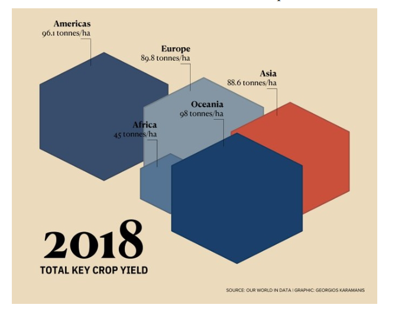
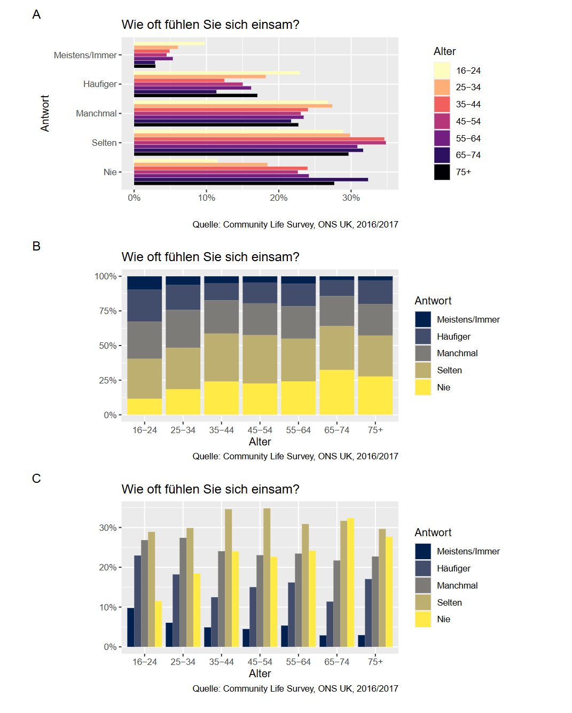
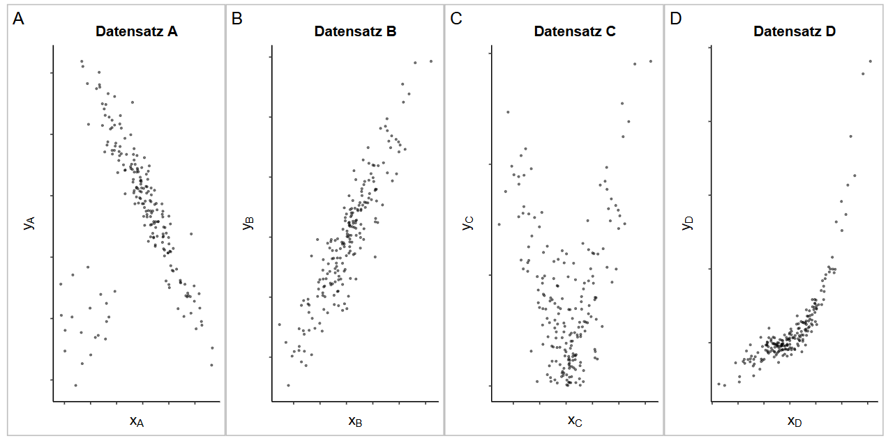
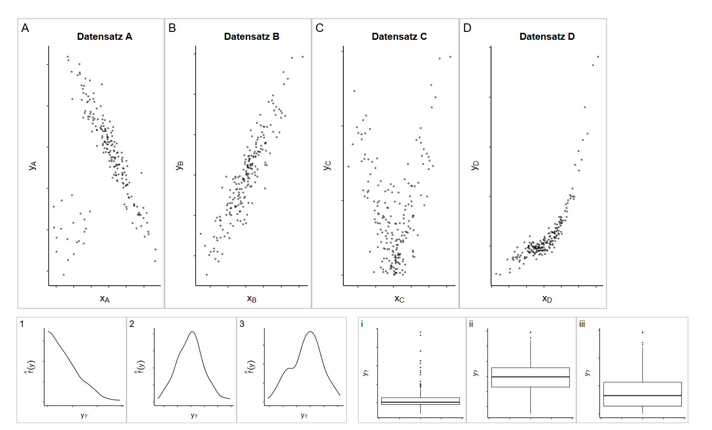
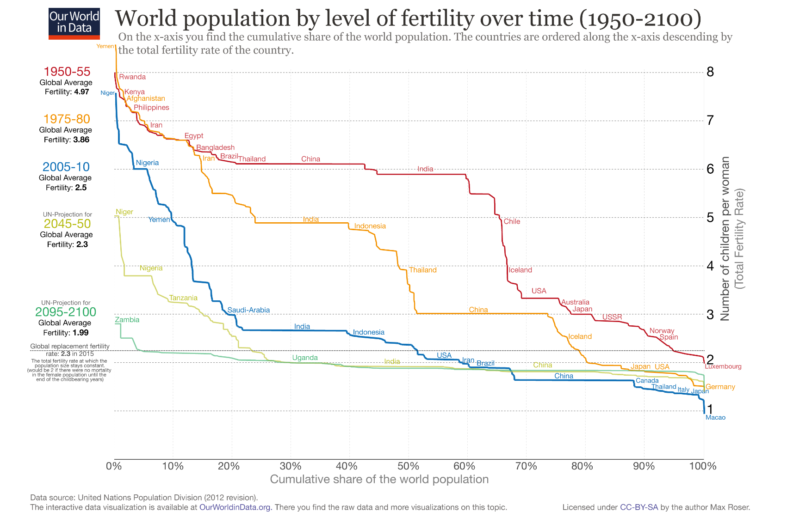
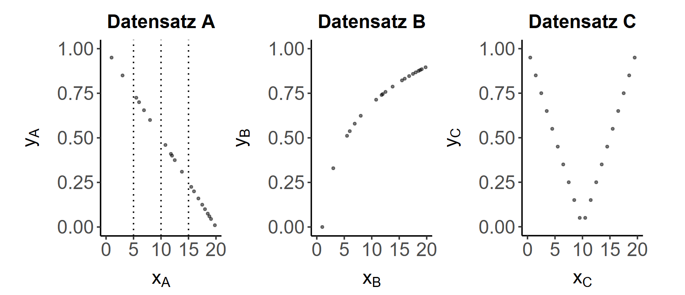

# 统计图形、ROC、AUC 与可视化评价

练习题数：9

相关考试真题数：11

合计题目数：20

## 公式速查

### 可视化、描述统计、相关系数、ROC 与 AUC

- **图形语法**：数据、数据转换/统计、坐标系、分面、主题；美学元素包括位置、颜色、大小、形状。
- **感知一致性**：位置和长度通常比颜色更容易精确比较；颜色要考虑色盲和亮度差异。
- **直方图**：适合度量数据，展示分布形状、偏态和多峰；组距会强烈影响结果。
- **直方图高度**：当组距不同，高度应为 $\frac{\text{relative Häufigkeit}}{\text{Klassenbreite}}$。
- **箱线图流程**：排序 $\to$ 求 $Q_1,Q_2,Q_3$ $\to$ 算 $IQR$ $\to$ 栅栏 $\to$ 画图。
- **IQR**：$IQR=Q_3-Q_1$；**改良箱线图栅栏**：$L=Q_1-1.5IQR$，$U=Q_3+1.5IQR$。
- **均值**：$\bar X=\frac1n\sum_{i=1}^nX_i$；**加权均值**：$\bar X_w=\frac{\sum_iw_iX_i}{\sum_iw_i}$。
- **几何均值**：$\bar X_g=\sqrt[n]{\prod_{i=1}^nX_i}$；**调和均值**：$\bar X_h=\frac n{\sum_{i=1}^n1/X_i}$。
- **偏度方向**：负偏/左偏常见顺序是众数 $>$ 中位数 $>$ 均值；正偏/右偏常见顺序是均值 $>$ 中位数 $>$ 众数。
- **矩偏度**：$g_m=\frac1n\sum_{i=1}^n(\frac{x_i-\bar x}{s_x})^3$。
- **Bowley 偏态系数**：$g_p=\frac{(x_{1-p}-x_{med})-(x_{med}-x_p)}{x_{1-p}-x_p}$，基于分位数，更稳健。
- **峰度**：$k=\frac1n\sum_{i=1}^n(\frac{x_i-\bar x}{s_x})^4$，超额峰度 $k^*=k-3$。
- **Pearson 相关系数**：$r_{xy}=\frac{Cov(X,Y)}{s_Xs_Y}$，度量线性关系。
- **Spearman 相关系数**：对秩次计算 Pearson；无重复时 $r^{SP}=1-\frac{6\sum_iD_i^2}{n(n^2-1)}$。
- **Kendall tau**：$\tau=\frac{N_c-N_d}{n(n-1)/2}$，$N_c$ 为同向对数，$N_d$ 为反向对数。
- **ROC: TPR**：$TPR=\frac{TP}{TP+FN}$；**ROC: FPR**：$FPR=\frac{FP}{FP+TN}$。
- **ROC 曲线**：按 score 阈值排序，逐个计算 $(FPR,TPR)$ 并连线。
- **AUC 含义**：$AUC=P(\text{Score}_+>\text{Score}_-)$，即随机正例分数高于随机负例的概率。
- **AUC 梯形近似**：$AUC\approx\sum_i\frac{TPR_{i+1}+TPR_i}{2}(FPR_{i+1}-FPR_i)$。

---

## 习题与讲解

### Aufgabe 1 - 计算 ROC 指标、AUC 或评价分类图形。

#### 题目

Gegeben sind:

$$
\begin{array}{c|cc}
\text{Index} & \text{Score} & \text{Kategorie}\\
\hline
1&0.95&1\\
2&0.86&1\\
3&0.45&0\\
4&0.12&0\\
5&0.65&0\\
6&0.98&1\\
7&0.80&0\\
8&0.63&1
\end{array}
$$

Berechnen Sie TPR und FPR für mögliche Score-Cut-offs, zeichnen Sie die ROC-Kurve, berechnen Sie AUC und interpretieren Sie den Wert. Außerdem: Bewerten Sie in einem medizinischen Diagnosebeispiel False Positives, False Negatives und NPV/PPV bei Cut-off $0.65$.

#### 解答

##### 中文解题思路

条件概率题先命名事件，再把题目给出的百分比写成条件概率。若题目问的是原因在结果已知后的概率，例如 $P(K\mid T+)$，就要用 Bayes，不能直接拿敏感度或检出率当答案。

ROC 题先按阈值排序，然后每个阈值分别数 TP、FP、TN、FN，计算 TPR 和 FPR。AUC 的直观含义是随机取一个正例和一个负例时，正例分数更高的概率。

图形题先识别变量类型、尺度水平和图形映射：横轴、纵轴、颜色、大小、分组各表示什么。不要只描述图好不好看，要说明图是否支持比较、趋势判断或分类评价。

ROC 题按阈值从宽到严排序，逐个计算 TPR 和 FPR，再把点画到坐标系中。AUC 可以理解为随机抽一个正例和负例时，正例分数更高的概率。

写最终答案时，要把关键等式链写完整：定义、代入、化简、结论四步尽量都出现。证明题尤其要避免只写直觉解释；计算题则要注明参数化方式、积分范围或条件事件。

Bei der Regel "positiv, falls Score $>c$" erhält man:

$$
\begin{array}{c|cc}
c & \operatorname{FPR} & \operatorname{TPR}\\
\hline
-\infty&1&1\\
0.12&0.75&1\\
0.45&0.50&1\\
0.63&0.50&0.75\\
0.65&0.25&0.75\\
0.80&0&0.75\\
0.86&0&0.50\\
0.95&0&0.25\\
0.98&0&0
\end{array}
$$

Die ROC-Kurve entsteht durch Eintragen der Punkte $(\operatorname{FPR},\operatorname{TPR})$.

Der AUC-Wert ist:

$$
\operatorname{AUC}=0.875.
$$

Interpretation: In $87.5\%$ der zufällig gebildeten Paare aus positiver und negativer Beobachtung hat die positive Beobachtung den höheren Score. Das Modell trennt die Klassen also gut.

Im Krankenhausbeispiel ist ein False Negative meist schwerwiegender, weil ein kranker Patient fälschlich als gesund eingestuft wird. Deshalb ist der NPV besonders relevant:

$$
\operatorname{NPV}
=
\frac{\operatorname{TN}}{\operatorname{TN}+\operatorname{FN}}.
$$

Für $c=0.65$ sind negativ vorhergesagt die Scores $\leq0.65$. Darunter befinden sich $3$ tatsächliche Negative und $1$ tatsächliches Positiv. Daher:

$$
\operatorname{NPV}=\frac{3}{3+1}=\frac34=75\%.
$$

---

### Aufgabe 2 - 识别统计图中的变量、尺度和视觉映射。

#### 题目

Eine Grafik zeigt den Zusammenhang zwischen BIP pro Kopf und Kindersterblichkeitsrate in verschiedenen Ländern. Listen Sie die dargestellten Merkmale, Skalenniveaus und ästhetischen Zuordnungen auf.

#### 解答

##### 中文解题思路

图形题先识别变量类型、尺度水平和图形映射：横轴、纵轴、颜色、大小、分组各表示什么。不要只描述图好不好看，要说明图是否支持比较、趋势判断或分类评价。

写最终答案时，要把关键等式链写完整：定义、代入、化简、结论四步尽量都出现。证明题尤其要避免只写直觉解释；计算题则要注明参数化方式、积分范围或条件事件。

Merkmale und Zuordnungen:

| Merkmal | Skalenniveau | ästhetische Zuordnung |
|---|---|---|
| Kindersterblichkeitsrate | verhältnisskaliert | y-Achse, log-Skala |
| BIP pro Kopf | verhältnisskaliert | x-Achse, log-Skala |
| Land | nominal | Punkt/Label |
| Bevölkerungsgröße | verhältnisskaliert | Kreisgröße |
| Weltregion | nominal | Farbe, qualitative Farbskala |

Die Untersuchungseinheiten sind Länder. Die Grafik ist ein Streudiagramm bzw. Bubbleplot.

---

### Aufgabe 3 - 识别统计图中的变量、尺度和视觉映射。

#### 题目

Analysieren Sie eine gestapelte Balkengrafik zu Bildungsstand, Geschlecht und Altersgruppen.

#### 解答

##### 中文解题思路

图形题先识别变量类型、尺度水平和图形映射：横轴、纵轴、颜色、大小、分组各表示什么。不要只描述图好不好看，要说明图是否支持比较、趋势判断或分类评价。

写最终答案时，要把关键等式链写完整：定义、代入、化简、结论四步尽量都出现。证明题尤其要避免只写直觉解释；计算题则要注明参数化方式、积分范围或条件事件。

Mögliche Antworten:

- Grundgesamtheit: ständige Wohnbevölkerung ab $25$ Jahren.
- Untersuchungseinheit: eine Person ab $25$ Jahren.
- Erhebungsart: vermutlich Stichprobe.
- Datenstruktur: Querschnittsdaten.

Visualisierte Merkmale:

| Merkmal | Skalenniveau | Zuordnung |
|---|---|---|
| Bildungsstand | nominal/ordinal | Farbe, Stapelsegment |
| Geschlecht | nominal | Facetten |
| Altersgruppe | ordinal | x-Achse |
| Anteil | verhältnisskaliert | y-Achse |

Geometrie: gestapelte Säulen.

Die Farbskala kann problematisch sein, wenn sie divergierend wirkt, obwohl kein natürlicher Mittelpunkt des Bildungsstands vorliegt. Eine qualitative oder klar ordinal-sequenzielle Skala wäre besser.

Vorteile gestapelter Balken:

- kompakter Überblick,
- Gesamtanteil pro Altersgruppe ist direkt sichtbar,
- Randkategorien sind gut vergleichbar.

Nachteile:

- mittlere Kategorien sind schlecht vergleichbar,
- Segmentpositionen wechseln,
- Flächen können optisch verzerren.

Alternative: gruppierte Balken oder kleine Facetten pro Bildungsniveau.

---

### Aufgabe 4 - 识别统计图中的变量、尺度和视觉映射。

#### 题目

Analysieren Sie eine WHO-Grafik zu WASH-Services, Wohnort und Zugangszuwächsen.

#### 解答

##### 中文解题思路

图形题先识别变量类型、尺度水平和图形映射：横轴、纵轴、颜色、大小、分组各表示什么。不要只描述图好不好看，要说明图是否支持比较、趋势判断或分类评价。

写最终答案时，要把关键等式链写完整：定义、代入、化简、结论四步尽量都出现。证明题尤其要避免只写直觉解释；计算题则要注明参数化方式、积分范围或条件事件。

Mögliche Analyse:

- Grundgesamtheit: Bevölkerung in den betrachteten Ländern bzw. Weltregionen im Zeitraum 2015 bis 2022.
- Untersuchungseinheit: je nach Aggregation ein Land, eine Ländergruppe oder eine Personengruppe.
- Datenstruktur: Längsschnittinformation, in der Grafik aggregiert dargestellt.
- Erhebungsart: vermutlich amtliche/sekundäre Daten, teils mit fehlenden Daten.

Merkmale:

| Merkmal | Skalenniveau | Zuordnung |
|---|---|---|
| WASH-Service-Kategorie | nominal | x-Achse/Gruppierung |
| Wohnort rural/urban | nominal | Farbe/Gruppierung |
| proportionales Wachstum | verhältnisskaliert | y-Achse |
| absolute Anzahl Menschen | verhältnisskaliert | Kreisgröße/Text |

Die Farbskala ist qualitativ grundsätzlich passend, aber eine fehlende oder unklare Legende verletzt die Prinzipien der Klarheit und Effizienz.

Die zusätzliche Darstellung absoluter Zahlen ist wichtig, weil prozentuale Zuwächse bei kleiner Ausgangsbasis groß wirken können. Absolute Zahlen zeigen, wie viele Menschen tatsächlich zusätzlich Zugang erhalten haben.

---

### Aufgabe 5 - 识别统计图中的变量、尺度和视觉映射。

#### 题目

Diskutieren Sie kritisch die Aussage, die Grafik zeige eindeutig, dass höheres Einkommen bessere Bildungsqualität verursache. Zusätzlich: Identifizieren Sie Schwächen einer Alphabetisierungs-Grafik und schlagen Sie Verbesserungen für den Vergleich Asien/Europa vor.

#### 解答

##### 中文解题思路

图形题先识别变量类型、尺度水平和图形映射：横轴、纵轴、颜色、大小、分组各表示什么。不要只描述图好不好看，要说明图是否支持比较、趋势判断或分类评价。

写最终答案时，要把关键等式链写完整：定义、代入、化简、结论四步尽量都出现。证明题尤其要避免只写直觉解释；计算题则要注明参数化方式、积分范围或条件事件。

Die Schlussfolgerung ist zu stark:

- Die Grafik zeigt Korrelation, keine Kausalität.
- Haushaltseinkommen ist nicht identisch mit dem Wohlstand eines Landes.
- Mathematik-Testwerte sind nur ein Teilaspekt von Bildungsqualität.
- Länderspezifische Faktoren wie Schulsystem, Sprache, Auswahl der Stichprobe oder staatliche Investitionen können Störgrößen sein.
- Mittelwerte verdecken Streuung innerhalb von Ländern.
- Farbgebung, Labels oder Achsengestaltung können Lesbarkeit und Vergleichbarkeit beeinträchtigen.

Zur Alphabetisierungs-Grafik:

- Overplotting erschwert das Lesen einzelner Länder.
- Unterschiedliche Definitionen und Messmethoden über Länder und Zeit schwächen die Vergleichbarkeit.
- Zu viele Linien ohne klare Gruppierung reduzieren Präzision und Effizienz.

Für einen Vergleich Asien/Europa:

- andere Kontinente herausfiltern,
- nach Kontinent facettieren oder Farben nur für Asien/Europa verwenden,
- einzelne Länderkurven transparent zeichnen,
- Kontinentmittelwerte oder Medianlinien ergänzen,
- Unsicherheit bzw. Streuung mit Intervallen darstellen.

---

### Aufgabe 6 - 识别统计图中的变量、尺度和视觉映射。

#### 题目

Eine Grafik stellt den Zusammenhang zwischen Human Development Index (HDI) und Planetary Pressures Index für Ländergruppen und Zeitpunkte dar.

#### 解答

##### 中文解题思路

图形题先识别变量类型、尺度水平和图形映射：横轴、纵轴、颜色、大小、分组各表示什么。不要只描述图好不好看，要说明图是否支持比较、趋势判断或分类评价。

写最终答案时，要把关键等式链写完整：定义、代入、化简、结论四步尽量都出现。证明题尤其要避免只写直觉解释；计算题则要注明参数化方式、积分范围或条件事件。

Merkmale:

| Merkmal | Skalenniveau | Zuordnung |
|---|---|---|
| HDI | metrisch | x-Achse |
| Planetary Pressures Index | metrisch | y-Achse |
| Zeitpunkt | diskret/metrisch | Text/Position/Verbindung |
| HDI-Gruppe | ordinal | Farbe |

Die verwendete Farbskala wirkt qualitativ. Da HDI-Gruppen geordnet sind, wäre auch eine sequenzielle Farbskala vertretbar.

Die Zeitentwicklung wird über Punkte und Annotationen dargestellt. Das spart eine eigene Zeitachse, kann aber schwerer lesbar sein, wenn nicht klar ist, welcher Punkt zu welchem Jahr gehört.

Abweichungen von der einfachen Grammar of Graphics:

- Text-Annotationen stehen direkt in der Grafik.
- Eine Legende kann fehlen oder durch Labels ersetzt sein.
- Einige Informationen werden nicht über reine Achsen/Farbe/Form, sondern über erläuternde Texte transportiert.

---

### Aufgabe 7 - 计算 ROC 指标、AUC 或评价分类图形。

#### 题目

Analysieren Sie eine Starbucks-Grafik zu Koffein, Zucker, Volumen und Getränken sowie eine alternative problematische Darstellung.

#### 解答

##### 中文解题思路

看到分布函数或密度，先检查对象类型：离散型看跳跃点概率，连续型看密度积分。分布函数要满足单调、右连续、极限从 $0$ 到 $1$；密度要非负且总积分为 $1$。

条件概率题先命名事件，再把题目给出的百分比写成条件概率。若题目问的是原因在结果已知后的概率，例如 $P(K\mid T+)$，就要用 Bayes，不能直接拿敏感度或检出率当答案。

ROC 题先按阈值排序，然后每个阈值分别数 TP、FP、TN、FN，计算 TPR 和 FPR。AUC 的直观含义是随机取一个正例和一个负例时，正例分数更高的概率。

图形题先识别变量类型、尺度水平和图形映射：横轴、纵轴、颜色、大小、分组各表示什么。不要只描述图好不好看，要说明图是否支持比较、趋势判断或分类评价。

ROC 题按阈值从宽到严排序，逐个计算 TPR 和 FPR，再把点画到坐标系中。AUC 可以理解为随机抽一个正例和负例时，正例分数更高的概率。

写最终答案时，要把关键等式链写完整：定义、代入、化简、结论四步尽量都出现。证明题尤其要避免只写直觉解释；计算题则要注明参数化方式、积分范围或条件事件。

Grundgesamtheit: vermutlich Starbucks-Getränkesorten, optional eingeschränkt auf Getränke mit relevanter Koffeinmenge.

Grammar of Graphics:

| Merkmal | Skalenniveau | Zuordnung |
|---|---|---|
| Koffeinmenge | verhältnisskaliert | x-Achse |
| Getränk/ID/Name | nominal | y-Achse/Label |
| Zuckermenge | verhältnisskaliert | Farbe |
| Volumen | verhältnisskaliert | Punktgröße |

Für Zuckermenge ist eine sequenzielle Farbskala angemessen, weil Zucker metrisch ist und keinen neutralen Mittelpunkt besitzt.

Probleme der alternativen Darstellung und Verbesserungen:

- Overplotting: kleinere oder transparente Punkte, Facetten oder Filter verwenden.
- Unpassende qualitative Farbskala für metrisches Volumen: besser sequenzielle Skala oder Punktgröße.
- Dekorative Elemente wie Kaffeeflecken entfernen.
- Schwer lesbare Schrift durch klare Schrift ersetzen.
- Labels und Hervorhebungen sparsam einsetzen.

Für den Zusammenhang Kalorienmenge und Koffeingehalt sind Spearman- und Pearson-Korrelation vermutlich negativ: höhere Koffeinwerte gehen in der Grafik tendenziell mit niedrigeren Kalorienwerten einher. Der Betrag von Spearman ist eher größer, wenn der Zusammenhang monoton, aber nicht linear ist.

---

ROC-Kurven verwenden $\operatorname{TPR}$ auf der y-Achse und $\operatorname{FPR}$ auf der x-Achse. AUC $=0.5$ bedeutet Zufallsniveau, AUC $=1$ perfekte Trennung.

Bei statistischen Grafiken sind wichtig: Untersuchungseinheit, Grundgesamtheit, Merkmale, Skalenniveaus, Geometrien, ästhetische Zuordnungen, passende Farbskalen, klare Legenden und sparsame Annotationen.

---

### Aufgabe 8 - 计算 ROC 指标、AUC 或评价分类图形。

#### 题目

Holstein Kiel untersucht $n=36$ Elfmeter:

$$
\begin{array}{c|cc|c}
 & Y=1\text{ Tor} & Y=0\text{ Fehlschuss} & \text{Summe}\\
\hline
X=1\text{ Heimspiel} & 12 & 9 & 21\\
X=0\text{ Auswärtsspiel} & 6 & 9 & 15\\
\hline
\text{Summe} & 18 & 18 & 36
\end{array}
$$

#### 解答

##### 中文解题思路

列联表题先补全边际总数，再看条件比例。比较两组时不要只比原始频数，因为组大小可能不同；要用条件相对频率、期望频数、$\chi^2$ 或 Odds Ratio。

ROC 题先按阈值排序，然后每个阈值分别数 TP、FP、TN、FN，计算 TPR 和 FPR。AUC 的直观含义是随机取一个正例和一个负例时，正例分数更高的概率。

图形题先识别变量类型、尺度水平和图形映射：横轴、纵轴、颜色、大小、分组各表示什么。不要只描述图好不好看，要说明图是否支持比较、趋势判断或分类评价。

ROC 题按阈值从宽到严排序，逐个计算 TPR 和 FPR，再把点画到坐标系中。AUC 可以理解为随机抽一个正例和负例时，正例分数更高的概率。

如果图形题中出现列联表，重点是比较条件比例，而不是原始人数。原始人数受组大小影响，条件比例才适合比较两个组。

写最终答案时，要把关键等式链写完整：定义、代入、化简、结论四步尽量都出现。证明题尤其要避免只写直觉解释；计算题则要注明参数化方式、积分范围或条件事件。

Relative Häufigkeiten:

$$
\begin{array}{c|cc|c}
 & Y=1 & Y=0 & h_X\\
\hline
X=1 & \frac{12}{36} & \frac9{36} & \frac{21}{36}\\
X=0 & \frac6{36} & \frac9{36} & \frac{15}{36}\\
\hline
h_Y & \frac{18}{36} & \frac{18}{36} & 1
\end{array}
$$

Für Heimspiele:

$$
\mathbb P(Y=1\mid X=1)=\frac{12}{21}=\frac47,
\qquad
\mathbb P(Y=0\mid X=1)=\frac{9}{21}=\frac37.
$$

Odds-Ratio:

$$
\operatorname{OR}
=\frac{12\cdot 9}{9\cdot 6}
=2.
$$

Die Treffer-Odds sind in Heimspielen also doppelt so hoch wie in Auswärtsspielen.

Für den Kontingenzkoeffizienten berechnen wir zuerst:

$$
\chi^2
=\sum_{i,j}\frac{(n_{ij}-e_{ij})^2}{e_{ij}}
\approx 1.0286.
$$

Damit:

$$
C=\sqrt{\frac{\chi^2}{\chi^2+n}}
=\sqrt{\frac{1.0286}{37.0286}}
\approx 0.1667.
$$

Für eine $2\times2$-Tafel ist der korrigierte Koeffizient:

$$
C_{\mathrm{korr}}
=\frac{C}{\sqrt{(2-1)/2}}
\approx 0.2357.
$$

Ein AUC von $0.82$ bedeutet: In $82\%$ der zufällig gebildeten Paare aus Treffer und Fehlschuss erhält der Treffer den höheren Modellscore. Ein AUC von $0.5$ entspricht Zufallsniveau, ein AUC von $1$ perfekter Trennung.

---

### Aufgabe 9 - 计算 ROC 指标、AUC 或评价分类图形。

#### 题目

Gegeben sind Beobachtungen mit Kategorie $0/1$ und Score:

$$
\begin{array}{c|cc}
i & \text{Kategorie} & \text{Score}\\
\hline
1&0&0.33\\
2&0&0.27\\
3&0&0.11\\
4&1&0.38\\
5&1&0.17\\
6&1&0.63\\
7&1&0.62\\
8&1&0.33\\
9&0&0.15\\
10&0&0.57
\end{array}
$$

#### 解答

##### 中文解题思路

条件概率题先命名事件，再把题目给出的百分比写成条件概率。若题目问的是原因在结果已知后的概率，例如 $P(K\mid T+)$，就要用 Bayes，不能直接拿敏感度或检出率当答案。

ROC 题先按阈值排序，然后每个阈值分别数 TP、FP、TN、FN，计算 TPR 和 FPR。AUC 的直观含义是随机取一个正例和一个负例时，正例分数更高的概率。

图形题先识别变量类型、尺度水平和图形映射：横轴、纵轴、颜色、大小、分组各表示什么。不要只描述图好不好看，要说明图是否支持比较、趋势判断或分类评价。

ROC 题按阈值从宽到严排序，逐个计算 TPR 和 FPR，再把点画到坐标系中。AUC 可以理解为随机抽一个正例和负例时，正例分数更高的概率。

写最终答案时，要把关键等式链写完整：定义、代入、化简、结论四步尽量都出现。证明题尤其要避免只写直觉解释；计算题则要注明参数化方式、积分范围或条件事件。

Bei Klassifikation als positiv für Score $\geq c$:

$$
\begin{array}{c|cc}
c & \operatorname{TPR} & \operatorname{FPR}\\
\hline
0.63&0.2&0\\
0.62&0.4&0\\
0.57&0.4&0.2\\
0.38&0.6&0.2\\
0.33&0.8&0.4\\
0.27&0.8&0.6\\
0.17&1.0&0.6\\
0.15&1.0&0.8\\
0.11&1.0&1.0
\end{array}
$$

Der AUC kann als Paarwahrscheinlichkeit berechnet werden:

$$
\operatorname{AUC}
=\mathbb P(S_+>S_-)+\frac12\mathbb P(S_+=S_-)
=0.78.
$$

Das Modell ordnet also in etwa $78\%$ der positiven-negativen Paare die positive Beobachtung höher ein.

Für $c=0.5$ ergibt sich:

$$
\begin{array}{c|cc}
 & \text{tatsächlich }1 & \text{tatsächlich }0\\
\hline
\text{vorhergesagt }1 & 2 & 1\\
\text{vorhergesagt }0 & 3 & 4
\end{array}
$$

Also:

$$
\operatorname{ppV}=\frac{2}{2+1}=\frac23,
\qquad
\operatorname{npV}=\frac{4}{4+3}=\frac47.
$$

Ein hoher Schwellenwert reduziert False Positives, übersieht aber mehr Positive. Das ist sinnvoll, wenn eine positive Entscheidung teuer oder riskant ist. Ein niedriger Schwellenwert reduziert False Negatives, etwa bei medizinischem Screening.

---

## 相关考试真题

### 真题 1（2021） - Aufgabe 6

#### 题目

Im Rahmen einer Studie zu den wirtschaftlichen Auswirkungen des Klimawandels auf den Weinanbau in Deutschland soll der Weinmostertrag in $\mathrm{hl}/\mathrm{ha}$ in den $13$ deutschen Weinanbaugebieten miteinander verglichen werden. Anhand der jetzt bereits vorhandenen Unterschiede zwischen den Regionen erhofft man sich, Informationen für die Zukunft gewinnen zu können.

Für das Jahr $2020$ liegen die folgenden Zahlen für die Regionen vor. Sie können für die folgenden Aufgaben davon ausgehen, dass der Rot- und Weißmostertrag zwischen den Regionen jeweils normalverteilt ist.

| Region | Württemberg | Baden | Franken | Hessische Bergstrasse | Rheingau | Ahr |
|---|---:|---:|---:|---:|---:|---:|
| Rotmost | $71{,}4$ | $64$ | $40{,}5$ | $74{,}6$ | $59{,}2$ | $56{,}1$ |
| Weißmost | $58{,}3$ | $74{,}9$ | $44{,}2$ | $76{,}1$ | $75{,}4$ | $63{,}5$ |

| Region | Mittelrhein | Mosel | Nahe | Rheinhessen | Pfalz | Saale-Unstrut | Sachsen |
|---|---:|---:|---:|---:|---:|---:|---:|
| Rotmost | $52{,}2$ | $89{,}1$ | $82{,}3$ | $99{,}7$ | $103{,}9$ | $36{,}4$ | $38{,}5$ |
| Weißmost | $59{,}1$ | $98{,}9$ | $75{,}5$ | $97{,}2$ | $97{,}6$ | $38{,}5$ | $43{,}3$ |

Quelle: Destatis, Datensatz: $41253$-$0002$.

##### (a)

Es soll überprüft werden, ob sich der mittlere Rot- und Weißmostertrag in den Regionen signifikant, $\alpha=0{,}05$, voneinander unterscheidet.

###### (i)

Welchen Test würden Sie hierfür verwenden? Begründen Sie ihre Entscheidung. Stellen Sie die zu testenden Hypothesen auf.  
$(4P)$

###### (ii)

Führen Sie den Test in R durch. Zu welchem Ergebnis kommen Sie?  
$(4P)$

##### (b)

Geben Sie für den mittleren Unterschied zwischen Rot- und Weißmostertrag in den Regionen ein $90\%$-Konfidenzintervall an.  
$(2P)$

##### (c)

Im zweiten Schritt soll jetzt überprüft werden, ob eine Abhängigkeit zwischen Rot- und Weißmostertrag in den Regionen besteht.

###### (i)

Welchen Test würden Sie hierfür verwenden? Begründen Sie ihre Entscheidung. Welche zusätzliche Annahme über die Verteilung der Daten ist hier notwendig? Stellen Sie die zu testenden Hypothesen auf.  
$(4P)$

###### (ii)

Führen Sie den Test in R durch. Gehen Sie davon aus, dass die zusätzliche Annahme aus (c)(i) gegeben ist.  
$(4P)$

#### 解答

###### (a)

###### 中文解题思路

这是统计检验题。先判断样本是配对还是独立、参数检验还是非参数检验；再写 $H_0$ 和 $H_1$，计算检验统计量，与临界值或 p 值比较，最后用题目语言解释是否支持原假设/研究猜想。

###### (i)

Da Rot- und Weißmostertrag für dieselben $13$ Regionen beobachtet werden, liegen gepaarte Beobachtungen vor. Geeignet ist daher ein **gepaarter t-Test** für die Differenzen

$$
D_i=R_i-W_i.
$$

Die Hypothesen lauten:

$$
H_0:\mu_D=0,
\qquad
H_1:\mu_D\neq 0.
$$

Dabei bedeutet $\mu_D=0$, dass sich die mittleren Rot- und Weißmosterträge nicht unterscheiden.

###### (ii)

Aus den Daten ergeben sich für die Differenzen:

$$
\bar d\approx -2.662,
\qquad
s_D\approx 8.138,
\qquad
n=13.
$$

Die Teststatistik ist:

$$
t
=
\frac{\bar d-0}{s_D/\sqrt n}
\approx
\frac{-2.662}{8.138/\sqrt{13}}
\approx
-1.179.
$$

Bei $n-1=12$ Freiheitsgraden ist der Betrag dieser Teststatistik kleiner als der kritische Wert des zweiseitigen Tests zum Niveau $\alpha=0.05$. Daher wird $H_0$ nicht verworfen.

Es gibt auf dem Niveau $5\%$ keinen signifikanten Hinweis darauf, dass sich die mittleren Rot- und Weißmosterträge unterscheiden.

###### (b)

###### 中文解题思路

这是置信区间题。先确定估计对象和标准误，再选对应分布的分位数；这里是配对差值的均值，所以用 $\bar d\pm t_{1-\alpha/2,n-1}\,s_D/\sqrt n$，最后说明区间是否包含 $0$。

Ein $90\%$-Konfidenzintervall für $\mu_D$ ist:

$$
\bar d
\pm
t_{0.95,12}\frac{s_D}{\sqrt n}.
$$

Mit $t_{0.95,12}\approx 1.782$ folgt:

$$
-2.662
\pm
1.782\cdot \frac{8.138}{\sqrt{13}}
\approx
-2.662\pm 4.022.
$$

Also:

$$
\mu_D\in[-6.68,\ 1.36]
$$

approximativ. Da $0$ im Intervall liegt, passt dies zur Testentscheidung aus Teil (a).

###### (c)

###### 中文解题思路

这是统计检验题。先判断样本是配对还是独立、参数检验还是非参数检验；再写 $H_0$ 和 $H_1$，计算检验统计量，与临界值或 p 值比较，最后用题目语言解释是否支持原假设/研究猜想。

###### (i)

Um eine Abhängigkeit zwischen Rot- und Weißmostertrag zu prüfen, verwendet man den **Pearson-Korrelationstest**, sofern die Daten gemeinsam annähernd normalverteilt sind. Die notwendige Zusatzannahme ist also eine bivariate Normalverteilung bzw. Normalität der gemeinsamen Verteilung.

Die Hypothesen lauten:

$$
H_0:\rho=0,
\qquad
H_1:\rho\neq 0.
$$

###### (ii)

Aus den Daten erhält man näherungsweise:

$$
r\approx 0.933.
$$

Die Teststatistik für den Pearson-Korrelationstest ist:

$$
t
=
r\sqrt{\frac{n-2}{1-r^2}}
\approx
0.933\sqrt{\frac{11}{1-0.933^2}}
\approx
8.57.
$$

Mit $11$ Freiheitsgraden ist dies hoch signifikant. Daher wird $H_0$ verworfen.

Es gibt einen deutlichen positiven linearen Zusammenhang zwischen Rot- und Weißmostertrag in den Regionen.

---

### 真题 2（Altklausur2LV） - Aufgabe 1 — 16 Punkte

#### 题目

Betrachten Sie die untenstehende Grafik. Sie zeigt den durchschnittlichen Ertrag
(„crop yield“) für landwirtschaftliche Nutzflächen in Tonnen pro Hektar auf den
Kontinenten der Erde im Jahr 2018.

Analysieren Sie die grafischen Mittel, die zur Visualisierung benutzt wurden.

##### (a)

Geben Sie für **alle** in der Grafik gezeigten Merkmale jeweils

- das Skalenniveau
- die verwendeten Zuordnungen auf ästhetische Eigenschaften der gezeichneten Sechsecke

an.

##### (b)

Inwiefern verletzt die hier verwendete Farbpalette die in der Vorlesung besprochenen
Kriterien für Farbskalen in statistischen Grafiken? Was für eine Art von Farbskala
sollte stattdessen verwendet werden?

##### (c)

Statistische Grafiken sollen die Datenlage möglichst unverfälscht darstellen.
Inwiefern verfälscht die obige Darstellung die tatsächliche Datenlage?

##### (d)

Statistische Grafiken sollen die Datenlage möglichst kompakt darstellen, also:
minimal viel verwendete Tinte für maximal viel vermittelte Information.

Inwiefern verfehlt die obige Darstellung dieses Ziel?

##### (e)

Statistische Grafiken sollen die Datenlage möglichst übersichtlich darstellen, um den Konsument:innen der Grafik schnelles und präzises Ablesen relevanter quantitativer Informationen zu ermöglichen.

Inwiefern verfehlt die obige Darstellung dieses Ziel?

##### (f)

Definieren Sie eine alternative grafische Darstellung für die in der obenstehenden Grafik gezeigten Daten, welche diese unverfälscht, kompakt und übersichtlich visualisiert. Verwenden Sie für die Beschreibung die in der Vorlesung eingeführten Begrifflichkeiten der *grammar of graphics* oder die entsprechende `{ggplot2}`-Syntax.

#### 解答

###### (a) Geben Sie für **alle** in der Grafik gezeigten Merkmale jeweils

###### 中文解题思路

这类题先区分“研究对象总体”和“每一条观测单位”。总体是所有可能被研究的对象集合， Untersuchungseinheit 是数据表里一行或图中一个被观察的对象，不能把变量值本身当成单位。

- $x$-$y$-Position: arbiträr bzw. Untersuchungseinheit.
- Kontinent: Nominalskalenniveau; Ästhetik: Farbe der Hexagons.
- Ertrag: Verhältnisskala; Ästhetik: Kantenlänge der Hexagons.

---

###### (b) Inwiefern verletzt die hier verwendete Farbpalette die in der Vorlesung besprochenen

###### 中文解题思路

颜色尺度要和变量类型匹配：无顺序类别用 qualitative Farbskala，有自然顺序或数值大小的变量更适合 sequentielle Farbskala；判断时要说明颜色是在区分类别还是表达大小。

Problematisch sind kaum unterscheidbare Blautöne und ein hervorstechender Rotton.

Die Farbskala ist weder sinnvoll divergierend noch sequenziell noch qualitativ. Da es sich beim Kontinent um ein nominales Merkmal handelt, sollte stattdessen eine wahrnehmungseinheitliche, gut unterscheidbare qualitative Farbskala verwendet werden.

---

###### (c) Statistische Grafiken sollen die Datenlage möglichst unverfälscht darstellen.

###### 中文解题思路

先识别变量类型、尺度水平和图形映射，再评价图形是否支持准确比较；相关系数题要区分线性关系、单调关系和异常点影响。

Der Ertrag ist offensichtlich über die Kantenlänge codiert, siehe z.B. Afrika vs. Amerika. Der visuelle Eindruck entsteht aber über die teilweise überlappende Fläche. Dadurch entsteht ein verfälschter visueller Eindruck.

---

###### (d) Statistische Grafiken sollen die Datenlage möglichst kompakt darstellen, also:

###### 中文解题思路

先识别变量类型、尺度水平和图形映射，再评价图形是否支持准确比较；相关系数题要区分线性关系、单调关系和异常点影响。

Die Darstellung der Verteilung eines Merkmals über Größe bzw. Umfang von fünf eingefärbten Polygonen ist wasteful bzw. ungeeignet.

Eine Darstellung über Größe der Polygone plus Beschriftung würde bereits reichen.

---

###### (e) Statistische Grafiken sollen die Datenlage möglichst übersichtlich darstellen, um den Konsument:innen der Grafik schnelles und präzises Ablesen relevanter quantitativer Informationen zu ermöglichen.

###### 中文解题思路

先识别变量类型、尺度水平和图形映射，再评价图形是否支持准确比较；相关系数题要区分线性关系、单调关系和异常点影响。

Der Wert des visualisierten Merkmals „Ertrag“ ist schwierig bis unmöglich zwischen Kontinenten zu vergleichen, insbesondere durch

- arbiträre Anordnung der Polygone,
- teilweise Überlappung,
- fehlende Reihung.

---

###### (f) Definieren Sie eine alternative grafische Darstellung für die in der obenstehenden Grafik gezeigten Daten, welche diese unverfälscht, kompakt und übersichtlich visualisiert. Verwenden Sie für die Beschreibung die in der Vorlesung eingeführten Begrifflichkeiten der *grammar of graphics* oder die entsprechende `{ggplot2}`-Syntax.

###### 中文解题思路

按 Grammar of Graphics 拆图：先说几何对象是什么，如点、线、面积、柱；再把每个变量对应到 x/y 位置、颜色、大小、分面等 aesthetic。不要只描述图长什么样，要说明变量如何映射到视觉通道。

Geeignete Geometrie:

- Balken, oder
- Punkt.

Mappings:

- Ertrag: $x$- oder $y$-Position auf gemeinsamer Achse.
- Kontinent: Position der zweiten Achse.

Beispiel mit `{ggplot2}`:

```r
geom_point(aes(x = continent, y = yield))
```

Alternativ wäre auch ein Balkendiagramm möglich:

```r
geom_col(aes(x = continent, y = yield))
```

---

### 真题 3（Altklausur3LV） - Aufgabe 2

#### 题目

Die obigen Grafiken visualisieren Antworthäufigkeiten auf die Frage „Wie oft fühlen Sie sich einsam?“, die im Rahmen des „Community Life Survey“ des nationalen britischen Statistikinstituts im Jahr 2016/2017 gestellt wurde. Alle drei Grafiken zeigen denselben Datensatz.


---

##### (a)

Geben Sie an, welche Merkmale in diesen Grafiken visualisiert werden und welches Skalenniveau diese besitzen.

##### (b)

Welche Art von Farbskala wird in Grafiken B und C verwendet? Welche andere Art von Farbskala käme hier ebenso in Frage und warum?

##### (c)

Beantworten Sie die folgenden inhaltlichen Fragen. Geben Sie jeweils an, welche der drei Grafiken sich am besten eignet, um die jeweilige Frage zu beantworten und warum.

##### (d)

Sind die hier dargestellten Merkmale empirisch unabhängig? Begründen Sie Ihre Antwort.

##### (e)

Der „Community Life Survey“ befragt die Bewohner:innen einer Zufallsstichprobe britischer Haushalte über mehrere Jahre wiederholt mit denselben Fragebögen. Um was für eine Art von Erhebung handelt es sich also?

##### (f)

Warum können Aussagen wie

„Die meisten Menschen in Großbritannien fühlen sich tendenziell seltener einsam, umso älter sie werden.“

mit den in den Grafiken gezeigten Daten aus 2016/2017 nicht schlüssig begründet oder widerlegt werden? Mit was für Daten könnte so eine Aussage belegt oder widerlegt werden?

#### 解答

###### (a) Geben Sie an, welche Merkmale in diesen Grafiken visualisiert werden und welches Skalenniveau diese besitzen.

###### 中文解题思路

判断尺度水平时按信息量从弱到强检查：只有类别是 nominal，有自然顺序是 ordinal，差值有意义是 intervallskaliert，有真实零点且倍数有意义是 verhältnisskaliert/Absolutskala。

Visualisiert werden:

- **Alter** bzw. Altersgruppe: gruppiertes intervallskaliertes Merkmal; durch Gruppierung ordinal behandelt.
- **Antwort auf die Frage „Wie oft fühlen Sie sich einsam?“**: Likert-Skala, also ordinales Merkmal.

Die Häufigkeit selbst ist hier keine zusätzliche untersuchte Variable, sondern die dargestellte Anzahl bzw. relative Häufigkeit der Kombinationen aus Altersgruppe und Antwortkategorie.

---

###### (b) Welche Art von Farbskala wird in Grafiken B und C verwendet? Welche andere Art von Farbskala käme hier ebenso in Frage und warum?

###### 中文解题思路

颜色尺度要和变量类型匹配：无顺序类别用 qualitative Farbskala，有自然顺序或数值大小的变量更适合 sequentielle Farbskala；判断时要说明颜色是在区分类别还是表达大小。

In den Grafiken B und C wird eine **sequentielle Farbskala** verwendet.

Eine **divergierende Farbskala** wäre ebenfalls möglich, weil die Antwortskala ordinal ist und eine mittlere bzw. neutrale Kategorie besitzt. Die Kategorien reichen von einem unteren Extrem, etwa „nie“, bis zu einem oberen Extrem, etwa „meistens/immer“.

Daher kann man die Antwortkategorien entweder

- sequentiell als geordnete Stufen, oder
- divergierend mit neutraler Mitte

codieren.

---

###### (c) Beantworten Sie die folgenden inhaltlichen Fragen. Geben Sie jeweils an, welche der drei Grafiken sich am besten eignet, um die jeweilige Frage zu beantworten und warum.

###### 中文解题思路

图形选择题要先看问题需要比较什么：比较同一回答在不同年龄组之间的高低，就选把这些数值放在共同基线或相邻位置的图；比较同一年龄组内部的类别差异，就选能直接比较该组内各段长度的图。

###### 1. In welcher Altersgruppe fühlen sich die Befragten am häufigsten „selten“ einsam?

Antwort:

$$
45\text{--}54.
$$

Am klarsten ist dies in **Grafik A** ablesbar, weil dort die Häufigkeiten jeder Antwortkategorie für die verschiedenen Altersgruppen direkt nebeneinander stehen.

###### 2. In welcher Altersgruppe ist der Unterschied zwischen den Häufigkeiten der Antwortkategorie „Nie“ und der Antwortkategorie „Meistens/Immer“ am größten?

Antwort:

$$
65\text{--}74.
$$

Am besten ist dies aus **Grafik C** ablesbar, weil dort die Häufigkeiten der Antwortkategorien für ein gegebenes Alter nebeneinander auf einer gemeinsamen Achse stehen.

Auch **Grafik B** wäre möglich, weil dort die Länge des obersten und untersten Segments direkt sichtbar und vergleichbar ist.

---

###### (d) Sind die hier dargestellten Merkmale empirisch unabhängig? Begründen Sie Ihre Antwort.

###### 中文解题思路

经验独立性题要比较条件分布是否随另一个变量变化。如果每个年龄组中的回答分布都一样，才支持经验独立；图中各年龄组比例明显不同，就说明两个分类变量有关联。

Nein, Alter und Einsamkeit sind nicht empirisch unabhängig.

Begründung: Die bedingte Verteilung der Einsamkeitsantworten verändert sich über die Alterskategorien hinweg. Wären die Merkmale empirisch unabhängig, müssten die relativen Antwortverteilungen in allen Altersgruppen gleich sein.

Da sich die Verteilungen aber sichtbar unterscheiden, liegt keine empirische Unabhängigkeit vor.

---

###### (e) Der „Community Life Survey“ befragt die Bewohner:innen einer Zufallsstichprobe britischer Haushalte über mehrere Jahre wiederholt mit denselben Fragebögen. Um was für eine Art von Erhebung handelt es sich also?

###### 中文解题思路

先看数据是否覆盖全部对象：覆盖全部就是 Vollerhebung，只抽一部分就是 Stichprobe。再看同一对象是否跨时间重复观测；如果同一国家、州或个体在多个年份出现，就是 Paneldaten/Longitudinaldaten。

Es handelt sich um eine **Längsschnittstudie**, also um **Longitudinaldaten** bzw. **Paneldaten**.

---

###### (f) Warum können Aussagen wie

###### 中文解题思路

这类题先区分“研究对象总体”和“每一条观测单位”。总体是所有可能被研究的对象集合， Untersuchungseinheit 是数据表里一行或图中一个被观察的对象，不能把变量值本身当成单位。

Die Grafiken zeigen Daten aus einem bestimmten Zeitraum, nämlich 2016/2017. Damit sieht man Unterschiede zwischen Altersgruppen zu diesem Zeitpunkt.

Daraus lässt sich aber nicht direkt schließen, wie sich die Einsamkeit derselben Personen beim Älterwerden verändert.

Es ist also nur ein **Kohorteneffekt** bzw. ein Unterschied zwischen Alterskohorten sichtbar, aber kein individueller **Alterseffekt**.

Um die Entwicklung von Personen über den Alterungsprozess hinweg zu bewerten, bräuchte man wiederholte Messungen an denselben Untersuchungseinheiten.

Dafür benötigt man **Longitudinaldaten** bzw. **Paneldaten**.

---

### 真题 4（Altklausur3LV） - Aufgabe 3

#### 题目



Die Grafik zeigt Streudiagramme zu den Datensätzen A, B, C und D, die jeweils $n=200$ Beobachtungen zweier metrischer Merkmale enthalten.

---

##### (a)

Folgende Tabelle gibt die Pearson- und Spearman-Korrelationen der gezeigten Datensätze an.

| Datensatz | $r_{xy}$ | $r_{xy}^{SP}$ |
|---|---:|---:|
| C | $0.05$ | $-0.02$ |
| A | $-0.34$ | $-0.49$ |
| B | $0.91$ | $0.90$ |
| D | $0.81$ | $0.88$ |

##### (b)

Die linke obere Grafik zeigt Kerndichteschätzer für drei der Merkmale aus $y_A,y_B,y_C$ oder $y_D$. Welcher Kerndichteschätzer $(1,2,3)$ gehört zu welchem Merkmal $(y_A,y_B,y_C,y_D)$?  



##### (c)

Die rechte obere Grafik zeigt Boxplots für drei der Merkmale aus $y_A,y_B,y_C$ oder $y_D$. Welcher Boxplot $(i,ii,iii)$ gehört zu welchem Merkmal $(y_A,y_B,y_C,y_D)$? Falls für einen Boxplot mehrere Merkmale in Frage kommen, geben Sie alle an.

##### (d)

Nehmen Sie nun an, dass die Boxplots i und ii in der vorherigen Teilaufgabe die Verteilungen des jährlichen Nettoeinkommens in zwei unterschiedlichen Populationen zeigen. In welcher der Populationen ist die Konzentration der Nettoeinkommen, gemessen mit dem Gini-Index, größer? Begründen Sie Ihre Antwort.

##### (e)

Wie verändert sich üblicherweise die Form einer Kerndichteschätzung, wenn die Bandbreite der verwendeten Kernfunktion verdoppelt wird? Warum?

##### (f)

Warum sind Histogramme im Allgemeinen weniger gut zur Visualisierung empirischer Verteilungen geeignet als Kerndichteschätzer?

##### (g)

Durch was unterscheidet sich die Berechnung des Korrelationskoeffizienten nach Spearman von der Berechnung des Korrelationskoeffizienten nach Pearson? Was sind jeweils die Anwendungsvoraussetzungen der beiden Korrelationskoeffizienten?

#### 解答

###### (a) Folgende Tabelle gibt die Pearson- und Spearman-Korrelationen der gezeigten Datensätze an.

###### 中文解题思路

相关系数题先判断关系类型：Pearson 看线性，Spearman 看秩的单调关系，Kendall 通过成对比较看一致/不一致。单调变换通常保持 Spearman 的大小，乘以负号会反转方向。

###### (i)

Die Zuordnung lautet:

| Datensatz | $r_{xy}$ | $r_{xy}^{SP}$ |
|---|---:|---:|
| C | $0.05$ | $-0.02$ |
| A | $-0.34$ | $-0.49$ |
| B | $0.91$ | $0.90$ |
| D | $0.81$ | $0.88$ |

###### (ii)

Für den zweiten Datensatz in der Tabelle gilt

$$
|r_{xy}|<|r_{xy}^{SP}|.
$$

Grund: Die Spearman-Korrelation ist robuster gegenüber Ausreißern. Im Datensatz A gibt es eine Ausreißergruppe, die die Pearson-Korrelation stärker beeinflusst.

###### (iii)

Für den vierten Datensatz in der Tabelle gilt ebenfalls

$$
|r_{xy}|<|r_{xy}^{SP}|.
$$

Grund: Spearman misst monotone Zusammenhänge, nicht nur lineare Zusammenhänge. Bei einem monotonen, aber nichtlinearen Zusammenhang kann Spearman daher größer sein als Pearson.

###### (iv)

Sind die Merkmale des ersten Datensatzes in der Tabelle approximativ empirisch unabhängig?

Nein.

Der erste Datensatz ist C. Dort sind die Merkmale zwar nahezu unkorreliert, aber unkorreliert bedeutet nicht unabhängig. Die Grafik zeigt, dass die bedingte Verteilung von $Y$ von $X$ abhängt. Korrelationen messen nur lineare bzw. monotone Zusammenhänge und erfassen nicht jede Form von Abhängigkeit.

---

###### (b) Die linke obere Grafik zeigt Kerndichteschätzer für drei der Merkmale aus $y_A,y_B,y_C$ oder $y_D$. Welcher Kerndichteschätzer $(1,2,3)$ gehört zu welchem Merkmal $(y_A,y_B,y_C,y_D)$?

###### 中文解题思路

密度题按定义来：先检查 $f(x)\ge0$，再用归一化条件 $\int f(x)\,dx=1$ 求常数。求期望时不要忘记多乘一个 $x$，连续型随机变量的单点概率为 $0$。

Die Zuordnung lautet:

| Kerndichteschätzer | Merkmal |
|---|---|
| 1 | $y_C$ |
| 2 | $y_B$ |
| 3 | $y_A$ |

---

###### (c) Die rechte obere Grafik zeigt Boxplots für drei der Merkmale aus $y_A,y_B,y_C$ oder $y_D$. Welcher Boxplot $(i,ii,iii)$ gehört zu welchem Merkmal $(y_A,y_B,y_C,y_D)$? Falls für einen Boxplot mehrere Merkmale in Frage kommen, geben Sie alle an.

###### 中文解题思路

比较 histogramm 和 boxplot 时抓住取舍：直方图能看分布形状、多峰和偏态，但依赖分组；箱线图更紧凑，适合比较中位数、四分位距和离群点，但细节少。

Die Zuordnung lautet:

| Boxplot | Merkmal |
|---|---|
| i | $y_D$ |
| ii | $y_A$ oder $y_B$ |
| iii | $y_C$ |

---

###### (d) Nehmen Sie nun an, dass die Boxplots i und ii in der vorherigen Teilaufgabe die Verteilungen des jährlichen Nettoeinkommens in zwei unterschiedlichen Populationen zeigen. In welcher der Populationen ist die Konzentration der Nettoeinkommen, gemessen mit dem Gini-Index, größer? Begründen Sie Ihre Antwort.

###### 中文解题思路

先确认随机变量的密度或分布，再分别按定义处理：期望用 $\int x f(x)\,dx$，Median 解 $F(m)=0.5$，Modus 找密度最大点，Schiefe 结合均值、Median 和分布形状判断。

Die Konzentration der Nettoeinkommen ist bei **Boxplot i** größer.

Begründung: Boxplot i ist deutlich rechtsschiefer als Boxplot ii. Es gibt also viele Personen mit vergleichsweise niedrigerem Einkommen und wenige Personen mit sehr hohem Einkommen.

Eine stärkere Rechtsschiefe bei Einkommensverteilungen spricht für eine stärkere Konzentration der Einkommen und damit für einen höheren Gini-Index.

---

###### (e) Wie verändert sich üblicherweise die Form einer Kerndichteschätzung, wenn die Bandbreite der verwendeten Kernfunktion verdoppelt wird? Warum?

###### 中文解题思路

密度题按定义来：先检查 $f(x)\ge0$，再用归一化条件 $\int f(x)\,dx=1$ 求常数。求期望时不要忘记多乘一个 $x$，连续型随机变量的单点概率为 $0$。

Die Kerndichteschätzung wird üblicherweise **glatter**.

Grund: Durch eine größere Bandbreite wird für jeden Punkt eine größere Nachbarschaft von Beobachtungen berücksichtigt. Dadurch werden lokale Schwankungen stärker geglättet, feine Details verschwinden eher und die geschätzte Dichte wird weniger „zackig“.

---

###### (f) Warum sind Histogramme im Allgemeinen weniger gut zur Visualisierung empirischer Verteilungen geeignet als Kerndichteschätzer?

###### 中文解题思路

密度题按定义来：先检查 $f(x)\ge0$，再用归一化条件 $\int f(x)\,dx=1$ 求常数。求期望时不要忘记多乘一个 $x$，连续型随机变量的单点概率为 $0$。

Histogramme hängen stark von willkürlichen Entscheidungen ab, insbesondere von

- der Klassenbreite,
- der Klassenanzahl,
- der Position der Klassengrenzen.

Diese Entscheidungen können den visuellen Eindruck deutlich beeinflussen.

Kerndichteschätzer sind meist glatter und weniger stark von abrupten Klassengrenzen geprägt.

---

###### (g) Durch was unterscheidet sich die Berechnung des Korrelationskoeffizienten nach Spearman von der Berechnung des Korrelationskoeffizienten nach Pearson? Was sind jeweils die Anwendungsvoraussetzungen der beiden Korrelationskoeffizienten?

###### 中文解题思路

判断尺度水平时按信息量从弱到强检查：只有类别是 nominal，有自然顺序是 ordinal，差值有意义是 intervallskaliert，有真实零点且倍数有意义是 verhältnisskaliert/Absolutskala。

Der Pearson-Korrelationskoeffizient wird direkt auf den beobachteten Merkmalswerten berechnet.

Der Spearman-Korrelationskoeffizient wird dagegen als Pearson-Korrelation der **Ränge** der Beobachtungen berechnet.

Also:

$$
r_{xy}^{SP}
=
r_{\operatorname{Rang}(x),\operatorname{Rang}(y)}.
$$

Voraussetzungen:

- **Pearson**: metrische, mindestens intervallskalierte Merkmale; misst lineare Zusammenhänge.
- **Spearman**: mindestens ordinale Merkmale; misst monotone Zusammenhänge.

---

### 真题 5（GOP-Klausur-1） - Aufgabe 1 -- 19 Punkte

#### 题目

Betrachten Sie die folgende Grafik:



Quelle: Ourworldindata.org

Übersetzung der relevanten Grafikbeschriftungen:

- Titel: „Weltbevölkerung und Fruchtbarkeitsniveau über die Zeit“
- Untertitel: „Kumulative Anteile an Weltbevölkerung auf der x-Achse. Länder sind entlang der x-Achse absteigend nach ihrer Gesamtfruchtbarkeitsrate sortiert.“
- Linke Seite:
  - Global average fertility = Globale durchschnittliche Fruchtbarkeit
  - Global replacement fertility = Globale Fruchtbarkeitsrate für stabiles Bevölkerungsniveau
- Horizontale Achse: „Kumulativer Anteil an Weltbevölkerung“
- Vertikale Achse: „Anzahl an Kindern pro Frau (Gesamtfruchtbarkeitsrate)“

Analysieren Sie im Folgenden die Datensituation, die der obigen Grafik zugrunde liegt, und die grafischen Mittel, die zur Visualisierung benutzt wurden.

##### (a)

Welche Untersuchungseinheiten aus welcher Grundgesamtheit werden in der Grafik dargestellt?

##### (b)

Was für eine Erhebungsart und Datenstruktur liegen hier vor?

##### (c)

Welches Skalenniveau haben Gesamtfruchtbarkeitsrate und Bevölkerungsanteil jeweils?

##### (d)

Sind die auf der linken Seite angegebenen Zeiträume die Ausprägungen eines ordinal-, nominal- oder intervallskalierten Merkmals? Begründen Sie Ihre Antwort kurz.

##### (e)

Was für eine Art von Farbskala wurde in der Grafik verwendet? Welche Art von Farbskala wäre hier eventuell besser geeignet und warum?

##### (f)

Welche „Geometrie“ wird hier zur Darstellung benutzt?

Geben Sie für alle in der Grafik gezeigten Merkmale die verwendeten ästhetischen Zuordnungen an.

##### (g)

Welche ästhetischen Eigenschaften welcher Geometrien würden Sie für welche Merkmale verwenden, um in einer wohlüberlegten statistischen Grafik auf Basis dieser Daten die zeitlichen Entwicklungen der Gesamtfruchtbarkeitsraten zwischen ausgewählten Ländern einfach vergleichbar zu machen?

Auch `ggplot2`-Befehle werden als Antwort akzeptiert.

##### (h)

Betrachten Sie die in der Grafik in Rot eingezeichnete Linie. Stellen Sie sich vor, wir vertauschen die horizontalen und vertikalen Achsen der Grafik durch eine Rotation um $90^\circ$ gegen den Uhrzeigersinn. Wäre die dadurch entstehende Funktion äquivalent zur empirischen Verteilungsfunktion der Gesamtfruchtbarkeitsrate im angegebenen Zeitraum? Begründen Sie Ihre Antwort.

#### 解答

###### (a) Welche Untersuchungseinheiten aus welcher Grundgesamtheit werden in der Grafik dargestellt?

###### 中文解题思路

这类题先区分“研究对象总体”和“每一条观测单位”。总体是所有可能被研究的对象集合， Untersuchungseinheit 是数据表里一行或图中一个被观察的对象，不能把变量值本身当成单位。

Grundgesamtheit: alle Länder der Erde.

Untersuchungseinheiten: einzelne Länder.

###### (b) Was für eine Erhebungsart und Datenstruktur liegen hier vor?

###### 中文解题思路

先看数据是否覆盖全部对象：覆盖全部就是 Vollerhebung，只抽一部分就是 Stichprobe。再看同一对象是否跨时间重复观测；如果同一国家、州或个体在多个年份出现，就是 Paneldaten/Longitudinaldaten。

Es liegt eine Vollerhebung vor, da alle Länder der Erde betrachtet werden.

Die Datenstruktur entspricht einer Panelstudie bzw. Longitudinaldaten, da Länder über mehrere Zeiträume hinweg beobachtet werden.

###### (c) Welches Skalenniveau haben Gesamtfruchtbarkeitsrate und Bevölkerungsanteil jeweils?

###### 中文解题思路

判断尺度水平时按信息量从弱到强检查：只有类别是 nominal，有自然顺序是 ordinal，差值有意义是 intervallskaliert，有真实零点且倍数有意义是 verhältnisskaliert/Absolutskala。

Die Gesamtfruchtbarkeitsrate ist absolutskaliert, alternativ auch als intervall- bzw. verhältnisskaliert auffassbar.

Der Bevölkerungsanteil ist verhältnisskaliert.

###### (d) Sind die auf der linken Seite angegebenen Zeiträume die Ausprägungen eines ordinal-, nominal- oder intervallskalierten Merkmals? Begründen Sie Ihre Antwort kurz.

###### 中文解题思路

判断尺度水平时按信息量从弱到强检查：只有类别是 nominal，有自然顺序是 ordinal，差值有意义是 intervallskaliert，有真实零点且倍数有意义是 verhältnisskaliert/Absolutskala。

Die Zeiträume sind nicht nominalskaliert, da eine klare Ordnung der Ausprägungen vorliegt.

Sie sind mindestens ordinalskaliert. Man kann sie auch als intervallskaliert auffassen, da Abstände zwischen den Ausprägungen sinnvoll definiert und berechenbar sind.

###### (e) Was für eine Art von Farbskala wurde in der Grafik verwendet? Welche Art von Farbskala wäre hier eventuell besser geeignet und warum?

###### 中文解题思路

颜色尺度要和变量类型匹配：无顺序类别用 qualitative Farbskala，有自然顺序或数值大小的变量更适合 sequentielle Farbskala；判断时要说明颜色是在区分类别还是表达大小。

Verwendet wurde eine qualitative Farbskala.

Eine sequentielle Farbskala wäre besser geeignet, da der Zeitraum ein ordinales bzw. metrisch interpretierbares Merkmal ist.

###### (f) Welche „Geometrie“ wird hier zur Darstellung benutzt?

###### 中文解题思路

颜色尺度要和变量类型匹配：无顺序类别用 qualitative Farbskala，有自然顺序或数值大小的变量更适合 sequentielle Farbskala；判断时要说明颜色是在区分类别还是表达大小。

Geometrie: Linie bzw. Treppenfunktion.

Ästhetische Zuordnungen:

- Zeitraum $\rightarrow$ Farbe
- kumulativer Bevölkerungsanteil $\rightarrow$ $x$-Koordinate
- Gesamtfruchtbarkeitsrate $\rightarrow$ $y$-Koordinate

###### (g) Welche ästhetischen Eigenschaften welcher Geometrien würden Sie für welche Merkmale verwenden, um in einer wohlüberlegten statistischen Grafik auf Basis dieser Daten die zeitlichen Entwicklungen der Gesamtfruchtbarkeitsraten zwischen ausgewählten Ländern einfach vergleichbar zu machen?

###### 中文解题思路

颜色尺度要和变量类型匹配：无顺序类别用 qualitative Farbskala，有自然顺序或数值大小的变量更适合 sequentielle Farbskala；判断时要说明颜色是在区分类别还是表达大小。

Zum Beispiel:

```r
geom_line(aes(x = Zeitraum, y = TFR, color = Land))
```

Also:

- Geometrie: Linie
- Land $\rightarrow$ Farbe
- Zeitraum $\rightarrow$ $x$-Koordinate
- Gesamtfruchtbarkeitsrate $\rightarrow$ $y$-Koordinate

Alternativ wäre eine Facettierung nach Land statt Farbe für Land möglich.

###### (h) Betrachten Sie die in der Grafik in Rot eingezeichnete Linie. Stellen Sie sich vor, wir vertauschen die horizontalen und vertikalen Achsen der Grafik durch eine Rotation um $90^\circ$ gegen den Uhrzeigersinn. Wäre die dadurch entstehende Funktion äquivalent zur empirischen Verteilungsfunktion der Gesamtfruchtbarkeitsrate im angegebenen Zeitraum? Begründen Sie Ihre Antwort.

###### 中文解题思路

这类题先区分“研究对象总体”和“每一条观测单位”。总体是所有可能被研究的对象集合， Untersuchungseinheit 是数据表里一行或图中一个被观察的对象，不能把变量值本身当成单位。

Nein.

Erstens wäre die $x$-Achse falsch herum orientiert, etwa von $8$ nach $1$.

Zweitens wäre die $y$-Achse nicht der Anteil an Untersuchungseinheiten, also nicht der Anteil der Länder mit Gesamtfruchtbarkeitsrate $\leq x$, sondern der Anteil an der Weltbevölkerung, den diese Länder auf sich vereinen.

---

### 真题 6（GOP-Klausur-1） - Aufgabe 2 -- 23 Punkte

#### 题目

Die folgenden Graphiken zeigen Streudiagramme zu den drei Datensätzen A, B und C, die jeweils $n=20$ Beobachtungen zweier metrischer Merkmale enthalten.



##### (a)

Zeichnen Sie ein Histogramm der relativen Häufigkeiten des Merkmals $X_A$ aus Datensatz A mit gleichbleibender Klassenbreite der Länge $5$ und charakterisieren Sie die Verteilung. Wodurch werden im Histogramm die relativen Häufigkeiten dargestellt?

##### (b)

Nennen Sie jeweils einen allgemeinen Vor- und Nachteil der graphischen Darstellung eines metrischen Merkmals in einem Histogramm gegenüber der Darstellung in einem Boxplot.

##### (c)

Geben Sie für die drei Streudiagramme jeweils an, ob der Korrelationskoeffizient nach Bravais-Pearson oder der Korrelationskoeffizient nach Spearman größer ist oder ob beide etwa den gleichen Wert haben. Geben Sie den genauen Wert für einen Korrelationskoeffizienten an, falls dieser direkt aus der Graphik abgelesen werden kann.

##### (d)

Welche Art von Zusammenhang misst der Korrelationskoeffizient nach Bravais-Pearson, welche Art von Zusammenhang der Korrelationskoeffizient nach Spearman? Für welche Skalenniveaus sind die beiden Maße jeweils geeignet?

##### (e)

Für zwei Merkmale $X$ und $Y$ mit positivem Wertebereich sind der Korrelationskoeffizient nach Bravais-Pearson

$$
r_{XY}=0.5
$$

und der Korrelationskoeffizient nach Spearman

$$
r^{SP}_{XY}=0.6
$$

gegeben.

Ändern sich die Werte der beiden Zusammenhangsmaße jeweils, wenn $Y$ folgendermaßen zu $Y_1$ bzw. $Y_2$ transformiert wird?

###### (i) $Y_1=-Y$

###### (ii) $Y_2=Y^2$

Geben Sie konkrete Werte für die resultierenden Korrelationskoeffizienten $r_{X,Y_1}$, $r^{SP}_{X,Y_1}$, $r_{X,Y_2}$ und $r^{SP}_{X,Y_2}$ an, falls dies möglich ist.

##### (f)

Ein weiteres Zusammenhangsmaß stellt Kendalls Tau dar. Was ist die Grundidee dieser Maßzahl? Erläutern Sie kurz das Vorgehen bei der Berechnung.

#### 解答

###### (a) Zeichnen Sie ein Histogramm der relativen Häufigkeiten des Merkmals $X_A$ aus Datensatz A mit gleichbleibender Klassenbreite der Länge $5$ und charakterisieren Sie die Verteilung. Wodurch werden im Histogramm die relativen Häufigkeiten dargestellt?

###### 中文解题思路

直方图要先确定组距、各组频数或相对频数，再用 $\text{Höhe}=\text{relative Häufigkeit}/\text{Klassenbreite}$ 算柱高。解释形状时要看面积代表频率，不要把柱高直接当概率。

Die Histogrammhöhen $H_j$ sind:

$$
H=
\frac{(2,4,5,9)}{20\cdot 5}
=
(0.02,0.04,0.05,0.09)
$$

Die Verteilung ist linksschief bzw. rechtssteil und unimodal.

Relative Häufigkeiten werden im Histogramm durch die Flächen der Balken dargestellt:

$$
f_j=H_j\Delta b_j
$$

###### (b) Nennen Sie jeweils einen allgemeinen Vor- und Nachteil der graphischen Darstellung eines metrischen Merkmals in einem Histogramm gegenüber der Darstellung in einem Boxplot.

###### 中文解题思路

密度题按定义来：先检查 $f(x)\ge0$，再用归一化条件 $\int f(x)\,dx=1$ 求常数。求期望时不要忘记多乘一个 $x$，连续型随机变量的单点概率为 $0$。

Vorteile:

- Multimodalität ist sichtbar.
- Für schmale Klassenbreiten und große Stichproben nähert das Histogramm eine Dichte an.

Nachteile:

- Der optische Eindruck wird stark durch die frei wählbare Klassenbreite beeinflusst.
- Auch die Lage der Klassengrenzen beeinflusst die Darstellung.

###### (c) Geben Sie für die drei Streudiagramme jeweils an, ob der Korrelationskoeffizient nach Bravais-Pearson oder der Korrelationskoeffizient nach Spearman größer ist oder ob beide etwa den gleichen Wert haben. Geben Sie den genauen Wert für einen Korrelationskoeffizienten an, falls dieser direkt aus der Graphik abgelesen werden kann.

###### 中文解题思路

相关系数题先判断关系类型：Pearson 看线性，Spearman 看秩的单调关系，Kendall 通过成对比较看一致/不一致。单调变换通常保持 Spearman 的大小，乘以负号会反转方向。

Datensatz A:

$$
r_{X_A,Y_A}=r^{SP}_{X_A,Y_A}=-1
$$

Datensatz B:

$$
r_{X_B,Y_B}<r^{SP}_{X_B,Y_B}=1
$$

Datensatz C:

$$
r_{X_C,Y_C}=r^{SP}_{X_C,Y_C}=0
$$

###### (d) Welche Art von Zusammenhang misst der Korrelationskoeffizient nach Bravais-Pearson, welche Art von Zusammenhang der Korrelationskoeffizient nach Spearman? Für welche Skalenniveaus sind die beiden Maße jeweils geeignet?

###### 中文解题思路

证明 $\mu$ 是测度时按定义逐条写：空集测度为 $0$、非负性、对两两不交集合可加。有限空间中，可列可加会退化成对点权重求和的可加性。

Pearson misst lineare Zusammenhänge und ist für metrische Merkmale geeignet, also für intervall-, verhältnis- oder absolutskalierte Merkmale.

Spearman misst monotone Zusammenhänge und ist für mindestens ordinale Merkmale geeignet.

###### (e) Für zwei Merkmale $X$ und $Y$ mit positivem Wertebereich sind der Korrelationskoeffizient nach Bravais-Pearson

###### 中文解题思路

证明 $\mu$ 是测度时按定义逐条写：空集测度为 $0$、非负性、对两两不交集合可加。有限空间中，可列可加会退化成对点权重求和的可加性。

###### (i)

Für $Y_1=-Y$ gilt:

$$
r_{X,Y_1}=-r_{XY}=-0.5
$$

und:

$$
r^{SP}_{X,Y_1}=-r^{SP}_{XY}=-0.6
$$

###### (ii)

Für $Y_2=Y^2$ gilt, da $Y>0$ und $Y^2$ daher streng monoton steigend ist:

$$
r^{SP}_{X,Y_2}=r^{SP}_{XY}=0.6
$$

Für Pearson gilt im Allgemeinen:

$$
r_{X,Y_2}\neq r_{XY}
$$

Ein konkreter Wert ist ohne weitere Daten nicht bestimmbar.

###### (f) Ein weiteres Zusammenhangsmaß stellt Kendalls Tau dar. Was ist die Grundidee dieser Maßzahl? Erläutern Sie kurz das Vorgehen bei der Berechnung.

###### 中文解题思路

证明 $\mu$ 是测度时按定义逐条写：空集测度为 $0$、非负性、对两两不交集合可加。有限空间中，可列可加会退化成对点权重求和的可加性。

Grundidee: Man führt Paarvergleiche aller Beobachtungen durch.

Bei der Berechnung wird die Differenz zwischen der Anzahl konkordanter und diskordanter Paare bestimmt.

Konkordant sind Paare $(i,j)$ zum Beispiel, wenn

$$
x_i>x_j
\quad\text{und}\quad
y_i>y_j
$$

oder

$$
x_i<x_j
\quad\text{und}\quad
y_i<y_j
$$

Diese Differenz wird durch die Anzahl aller möglichen Beobachtungspaare dividiert:

$$
\tau=
\frac{\#\text{konkordante Paare}-\#\text{diskordante Paare}}
{\binom n2}
$$

Der Wertebereich liegt zwischen $-1$ und $1$.

---

### 真题 7（GOP-Klausur-2） - Aufgabe 1 — 16 Punkte

#### 题目

Betrachten Sie die untenstehende Grafik. Sie zeigt den durchschnittlichen Ertrag, „crop yield“, für landwirtschaftliche Nutzflächen in Tonnen pro Hektar auf den Kontinenten der Erde im Jahr 2018.

Analysieren Sie die grafischen Mittel, die zur Visualisierung benutzt wurden.

---

##### (a)

Geben Sie für alle in der Grafik gezeigten Merkmale jeweils

- das Skalenniveau,
- die verwendeten Zuordnungen auf ästhetische Eigenschaften der gezeichneten Sechsecke

an.

##### (b)

Inwiefern verletzt die hier verwendete Farbpalette die in der Vorlesung besprochenen Kriterien für Farbskalen in statistischen Grafiken? Was für eine Art von Farbskala sollte stattdessen verwendet werden?

##### (c)

Statistische Grafiken sollen die Datenlage möglichst unverfälscht darstellen.

Inwiefern verfälscht die obige Darstellung die tatsächliche Datenlage?

##### (d)

Statistische Grafiken sollen die Datenlage möglichst kompakt darstellen, also minimal viel verwendete Tinte für maximal viel vermittelte Information.

Inwiefern verfehlt die obige Darstellung dieses Ziel?

##### (e)

Statistische Grafiken sollen die Datenlage möglichst übersichtlich darstellen, um den Konsument:innen der Grafik schnelles und präzises Ablesen relevanter quantitativer Informationen zu ermöglichen. Inwiefern verfehlt die obige Darstellung dieses Ziel?

##### (f)

Definieren Sie eine alternative grafische Darstellung für die in der obenstehenden Grafik gezeigten Daten, welche diese unverfälscht, kompakt und übersichtlich visualisiert. Verwenden Sie für die Beschreibung die in der Vorlesung eingeführten Begrifflichkeiten der Grammar of Graphics oder die entsprechende `{ggplot2}`-Syntax.

#### 解答

###### (a) Geben Sie für alle in der Grafik gezeigten Merkmale jeweils

###### 中文解题思路

颜色尺度要和变量类型匹配：无顺序类别用 qualitative Farbskala，有自然顺序或数值大小的变量更适合 sequentielle Farbskala；判断时要说明颜色是在区分类别还是表达大小。

In der Grafik werden im Wesentlichen folgende Merkmale gezeigt:

| Merkmal | Skalenniveau | Ästhetische Zuordnung |
|---|---|---|
| Kontinent | nominalskaliert | Beschriftung / Position / einzelnes Sechseck |
| durchschnittlicher Ertrag in Tonnen pro Hektar | verhältnisskaliert bzw. metrisch | Größe bzw. Fläche der Sechsecke, teilweise Farbe |
| Jahr $2018$ | intervallskaliert bzw. zeitlich metrisch | Textbeschriftung, kein eigentliches Datenmapping |
| Reihenfolge / Platzierung der Kontinente | keine natürliche Datenskala bzw. künstliche Anordnung | Position der Sechsecke |
| Kontinentname und Zahlenwert | nominal bzw. metrisch | Textlabels |

Die gezeichneten Sechsecke kodieren also vor allem den Ertrag über ihre Größe bzw. Fläche. Die Farbe scheint ebenfalls zwischen Kontinenten oder Ertragswerten zu unterscheiden, ist aber nicht klar oder konsistent als statistische Zuordnung erkennbar.

---

###### (b) Inwiefern verletzt die hier verwendete Farbpalette die in der Vorlesung besprochenen Kriterien für Farbskalen in statistischen Grafiken? Was für eine Art von Farbskala sollte stattdessen verwendet werden?

###### 中文解题思路

颜色尺度要和变量类型匹配：无顺序类别用 qualitative Farbskala，有自然顺序或数值大小的变量更适合 sequentielle Farbskala；判断时要说明颜色是在区分类别还是表达大小。

Die Farbpalette ist problematisch, weil sie keine klare Ordnung vermittelt. Für ein metrisches Merkmal wie den Ertrag sollte eine Farbskala die Größe des Wertes intuitiv abbilden.

Die verwendeten Farben wirken eher qualitativ bzw. dekorativ. Dadurch kann man aus der Farbe nicht zuverlässig ablesen, welcher Kontinent einen höheren oder niedrigeren Ertrag hat.

Stattdessen sollte für den metrischen Ertrag eine **sequentielle Farbskala** verwendet werden, zum Beispiel von hell nach dunkel, wobei dunklere Farben höhere Erträge anzeigen.

Falls Farbe nur den Kontinent kodieren soll, wäre eine qualitative Farbskala möglich, aber dann sollte die Größe bzw. Höhe nicht gleichzeitig unklar den Ertrag kodieren.

---

###### (c) Statistische Grafiken sollen die Datenlage möglichst unverfälscht darstellen.

###### 中文解题思路

先识别变量类型、尺度水平和图形映射，再评价图形是否支持准确比较；相关系数题要区分线性关系、单调关系和异常点影响。

Die Darstellung verfälscht die Datenlage vor allem dadurch, dass die Ertragswerte durch unterschiedlich große dreidimensionale Sechsecke dargestellt werden.

Dadurch wirken Unterschiede optisch stärker oder schwächer, je nachdem ob Fläche, Volumen, Perspektive oder Höhe wahrgenommen wird. Der tatsächliche metrische Unterschied zwischen den Werten wird also nicht proportional und eindeutig dargestellt.

Zudem kann die perspektivische Anordnung dazu führen, dass einige Sechsecke größer oder wichtiger erscheinen, obwohl ihre Werte nicht entsprechend höher sind.

---

###### (d) Statistische Grafiken sollen die Datenlage möglichst kompakt darstellen, also minimal viel verwendete Tinte für maximal viel vermittelte Information.

###### 中文解题思路

颜色尺度要和变量类型匹配：无顺序类别用 qualitative Farbskala，有自然顺序或数值大小的变量更适合 sequentielle Farbskala；判断时要说明颜色是在区分类别还是表达大小。

Die Grafik verwendet sehr viel dekorative Tinte:

- große dreidimensionale Sechsecke,
- Schatten bzw. Perspektive,
- große Jahreszahl $2018$,
- Hintergrundfarbe,
- dekorative Anordnung.

Diese Elemente vermitteln wenig zusätzliche Information. Die eigentlichen Daten bestehen nur aus wenigen Kontinenten und ihren Ertragswerten. Diese könnten deutlich kompakter dargestellt werden, zum Beispiel in einem einfachen Balkendiagramm oder Punktdiagramm.

---

###### (e) Statistische Grafiken sollen die Datenlage möglichst übersichtlich darstellen, um den Konsument:innen der Grafik schnelles und präzises Ablesen relevanter quantitativer Informationen zu ermöglichen. Inwiefern verfehlt die obige Darstellung dieses Ziel?

###### 中文解题思路

先识别变量类型、尺度水平和图形映射，再评价图形是否支持准确比较；相关系数题要区分线性关系、单调关系和异常点影响。

Die Grafik verfehlt dieses Ziel, weil quantitative Vergleiche schwer sind.

Es gibt keine klare gemeinsame Achse, auf der die Erträge abgelesen werden können. Die Werte müssen aus kleinen Textlabels gelesen werden.

Außerdem erschweren die dreidimensionale Perspektive, die unterschiedliche Positionierung und die überlappenden Sechsecke einen präzisen Vergleich der Kontinente.

Ein schnelles Ranking oder das genaue Ablesen von Unterschieden ist daher nur schwer möglich.

---

###### (f) Definieren Sie eine alternative grafische Darstellung für die in der obenstehenden Grafik gezeigten Daten, welche diese unverfälscht, kompakt und übersichtlich visualisiert. Verwenden Sie für die Beschreibung die in der Vorlesung eingeführten Begrifflichkeiten der Grammar of Graphics oder die entsprechende `{ggplot2}`-Syntax.

###### 中文解题思路

颜色尺度要和变量类型匹配：无顺序类别用 qualitative Farbskala，有自然顺序或数值大小的变量更适合 sequentielle Farbskala；判断时要说明颜色是在区分类别还是表达大小。

Eine geeignete Alternative wäre ein sortiertes Balkendiagramm oder Punktdiagramm.

Beispiel mit `ggplot2`:

```r
ggplot(data, aes(x = reorder(Kontinent, Ertrag), y = Ertrag)) +
  geom_col() +
  coord_flip() +
  labs(
    x = "Kontinent",
    y = "Ertrag in Tonnen pro Hektar",
    title = "Durchschnittlicher landwirtschaftlicher Ertrag nach Kontinent, 2018"
  )
```

Grammar-of-Graphics-Beschreibung:

- Geometrie: Balken, also `geom_col()`, oder Punkte, also `geom_point()`
- Kontinent $\rightarrow$ $y$-Koordinate bzw. kategoriale Achse
- Ertrag $\rightarrow$ $x$-Koordinate bzw. Balkenlänge
- optional: Ertrag $\rightarrow$ sequentielle Farbe

Diese Darstellung ist unverfälschter, weil alle Werte auf einer gemeinsamen Achse verglichen werden können. Sie ist kompakter und übersichtlicher als die dreidimensionale Sechseckgrafik.

---

### 真题 8（GOP-Klausur-3） - Aufgabe 1 - 16 Punkte

#### 题目

Betrachten Sie die untenstehende Grafik. Sie zeigt den durchschnittlichen Ertrag, „crop yield“, für landwirtschaftliche Nutzflächen in Tonnen pro Hektar auf den Kontinenten der Erde im Jahr 2018.

Analysieren Sie die grafischen Mittel, die zur Visualisierung benutzt wurden.

---

##### (a)

Geben Sie für alle in der Grafik gezeigten Merkmale jeweils

- das Skalenniveau,
- die verwendeten Zuordnungen auf ästhetische Eigenschaften der gezeichneten Sechsecke

an.

##### (b)

Inwiefern verletzt die hier verwendete Farbpalette die in der Vorlesung besprochenen Kriterien für Farbskalen in statistischen Grafiken? Was für eine Art von Farbskala sollte stattdessen verwendet werden?

##### (c)

Statistische Grafiken sollen die Datenlage möglichst unverfälscht darstellen.

Inwiefern verfälscht die obige Darstellung die tatsächliche Datenlage?

##### (d)

Statistische Grafiken sollen die Datenlage möglichst kompakt darstellen, also minimal viel verwendete Tinte für maximal viel vermittelte Information.

Inwiefern verfehlt die obige Darstellung dieses Ziel?

##### (e)

Statistische Grafiken sollen die Datenlage möglichst übersichtlich darstellen, um den Konsument:innen der Grafik schnelles und präzises Ablesen relevanter quantitativer Informationen zu ermöglichen. Inwiefern verfehlt die obige Darstellung dieses Ziel?

##### (f)

Definieren Sie eine alternative grafische Darstellung für die in der obenstehenden Grafik gezeigten Daten, welche diese unverfälscht, kompakt und übersichtlich visualisiert. Verwenden Sie für die Beschreibung die in der Vorlesung eingeführten Begrifflichkeiten der Grammar of Graphics oder die entsprechende `{ggplot2}`-Syntax.

#### 解答

###### (a) Geben Sie für alle in der Grafik gezeigten Merkmale jeweils

###### 中文解题思路

颜色尺度要和变量类型匹配：无顺序类别用 qualitative Farbskala，有自然顺序或数值大小的变量更适合 sequentielle Farbskala；判断时要说明颜色是在区分类别还是表达大小。

In der Grafik werden im Wesentlichen folgende Merkmale gezeigt:

| Merkmal | Skalenniveau | Ästhetische Zuordnung |
|---|---|---|
| Kontinent | nominalskaliert | Beschriftung / Position / einzelnes Sechseck |
| durchschnittlicher Ertrag in Tonnen pro Hektar | verhältnisskaliert bzw. metrisch | Größe bzw. Fläche der Sechsecke, teilweise Farbe |
| Jahr $2018$ | intervallskaliert bzw. zeitlich metrisch | Textbeschriftung, kein eigentliches Datenmapping |
| Reihenfolge / Platzierung der Kontinente | keine natürliche Datenskala bzw. künstliche Anordnung | Position der Sechsecke |
| Kontinentname und Zahlenwert | nominal bzw. metrisch | Textlabels |

Die gezeichneten Sechsecke kodieren also vor allem den Ertrag über ihre Größe bzw. Fläche. Die Farbe scheint ebenfalls zwischen Kontinenten oder Ertragswerten zu unterscheiden, ist aber nicht klar oder konsistent als statistische Zuordnung erkennbar.

---

###### (b) Inwiefern verletzt die hier verwendete Farbpalette die in der Vorlesung besprochenen Kriterien für Farbskalen in statistischen Grafiken? Was für eine Art von Farbskala sollte stattdessen verwendet werden?

###### 中文解题思路

颜色尺度要和变量类型匹配：无顺序类别用 qualitative Farbskala，有自然顺序或数值大小的变量更适合 sequentielle Farbskala；判断时要说明颜色是在区分类别还是表达大小。

Die Farbpalette ist problematisch, weil sie keine klare Ordnung vermittelt. Für ein metrisches Merkmal wie den Ertrag sollte eine Farbskala die Größe des Wertes intuitiv abbilden.

Die verwendeten Farben wirken eher qualitativ bzw. dekorativ. Dadurch kann man aus der Farbe nicht zuverlässig ablesen, welcher Kontinent einen höheren oder niedrigeren Ertrag hat.

Stattdessen sollte für den metrischen Ertrag eine **sequentielle Farbskala** verwendet werden, zum Beispiel von hell nach dunkel, wobei dunklere Farben höhere Erträge anzeigen.

Falls Farbe nur den Kontinent kodieren soll, wäre eine qualitative Farbskala möglich, aber dann sollte die Größe bzw. Höhe nicht gleichzeitig unklar den Ertrag kodieren.

---

###### (c) Statistische Grafiken sollen die Datenlage möglichst unverfälscht darstellen.

###### 中文解题思路

先识别变量类型、尺度水平和图形映射，再评价图形是否支持准确比较；相关系数题要区分线性关系、单调关系和异常点影响。

Die Darstellung verfälscht die Datenlage vor allem dadurch, dass die Ertragswerte durch unterschiedlich große dreidimensionale Sechsecke dargestellt werden.

Dadurch wirken Unterschiede optisch stärker oder schwächer, je nachdem ob Fläche, Volumen, Perspektive oder Höhe wahrgenommen wird. Der tatsächliche metrische Unterschied zwischen den Werten wird also nicht proportional und eindeutig dargestellt.

Zudem kann die perspektivische Anordnung dazu führen, dass einige Sechsecke größer oder wichtiger erscheinen, obwohl ihre Werte nicht entsprechend höher sind.

---

###### (d) Statistische Grafiken sollen die Datenlage möglichst kompakt darstellen, also minimal viel verwendete Tinte für maximal viel vermittelte Information.

###### 中文解题思路

颜色尺度要和变量类型匹配：无顺序类别用 qualitative Farbskala，有自然顺序或数值大小的变量更适合 sequentielle Farbskala；判断时要说明颜色是在区分类别还是表达大小。

Die Grafik verwendet sehr viel dekorative Tinte:

- große dreidimensionale Sechsecke,
- Schatten bzw. Perspektive,
- große Jahreszahl $2018$,
- Hintergrundfarbe,
- dekorative Anordnung.

Diese Elemente vermitteln wenig zusätzliche Information. Die eigentlichen Daten bestehen nur aus wenigen Kontinenten und ihren Ertragswerten. Diese könnten deutlich kompakter dargestellt werden, zum Beispiel in einem einfachen Balkendiagramm oder Punktdiagramm.

---

###### (e) Statistische Grafiken sollen die Datenlage möglichst übersichtlich darstellen, um den Konsument:innen der Grafik schnelles und präzises Ablesen relevanter quantitativer Informationen zu ermöglichen. Inwiefern verfehlt die obige Darstellung dieses Ziel?

###### 中文解题思路

先识别变量类型、尺度水平和图形映射，再评价图形是否支持准确比较；相关系数题要区分线性关系、单调关系和异常点影响。

Die Grafik verfehlt dieses Ziel, weil quantitative Vergleiche schwer sind.

Es gibt keine klare gemeinsame Achse, auf der die Erträge abgelesen werden können. Die Werte müssen aus kleinen Textlabels gelesen werden.

Außerdem erschweren die dreidimensionale Perspektive, die unterschiedliche Positionierung und die überlappenden Sechsecke einen präzisen Vergleich der Kontinente.

Ein schnelles Ranking oder das genaue Ablesen von Unterschieden ist daher nur schwer möglich.

---

###### (f) Definieren Sie eine alternative grafische Darstellung für die in der obenstehenden Grafik gezeigten Daten, welche diese unverfälscht, kompakt und übersichtlich visualisiert. Verwenden Sie für die Beschreibung die in der Vorlesung eingeführten Begrifflichkeiten der Grammar of Graphics oder die entsprechende `{ggplot2}`-Syntax.

###### 中文解题思路

颜色尺度要和变量类型匹配：无顺序类别用 qualitative Farbskala，有自然顺序或数值大小的变量更适合 sequentielle Farbskala；判断时要说明颜色是在区分类别还是表达大小。

Eine geeignete Alternative wäre ein sortiertes Balkendiagramm oder Punktdiagramm.

Beispiel mit `ggplot2`:

```r
ggplot(data, aes(x = reorder(Kontinent, Ertrag), y = Ertrag)) +
  geom_col() +
  coord_flip() +
  labs(
    x = "Kontinent",
    y = "Ertrag in Tonnen pro Hektar",
    title = "Durchschnittlicher landwirtschaftlicher Ertrag nach Kontinent, 2018"
  )
```

Grammar-of-Graphics-Beschreibung:

- Geometrie: Balken, also `geom_col()`, oder Punkte, also `geom_point()`
- Kontinent $\rightarrow$ $y$-Koordinate bzw. kategoriale Achse
- Ertrag $\rightarrow$ $x$-Koordinate bzw. Balkenlänge
- optional: Ertrag $\rightarrow$ sequentielle Farbe

Diese Darstellung ist unverfälschter, weil alle Werte auf einer gemeinsamen Achse verglichen werden können. Sie ist kompakter und übersichtlicher als die dreidimensionale Sechseckgrafik.

---

### 真题 9（ss2022） - Aufgabe 1 -- Statistische Grafik

#### 题目

Thema: Our-World-in-Data-Grafik zur Weltbevölkerung und Fruchtbarkeit.

###### (a)

Untersuchungseinheiten und Grundgesamtheit.

###### (b)

Erhebungsart und Datenstruktur.

###### (c)

Skalenniveaus.

###### (d)

Zeiträume.

###### (e)

Farbskala.

###### (f)

Geometrie und Ästhetiken.

###### (g)

Alternative Grafik für Ländervergleiche.

###### (h)

Empirische Verteilungsfunktion?.

#### 解答

Thema: Our-World-in-Data-Grafik zur Weltbevölkerung und Fruchtbarkeit.

##### (a) Untersuchungseinheiten und Grundgesamtheit

###### 中文解题思路

这类题先区分“研究对象总体”和“每一条观测单位”。总体是所有可能被研究的对象集合， Untersuchungseinheit 是数据表里一行或图中一个被观察的对象，不能把变量值本身当成单位。

- **Grundgesamtheit:** alle Länder der Erde
- **Untersuchungseinheiten:** einzelne Länder

##### (b) Erhebungsart und Datenstruktur

###### 中文解题思路

先看数据是否覆盖全部对象：覆盖全部就是 Vollerhebung，只抽一部分就是 Stichprobe。再看同一对象是否跨时间重复观测；如果同一国家、州或个体在多个年份出现，就是 Paneldaten/Longitudinaldaten。

Es handelt sich um eine **Vollerhebung**, da alle Länder betrachtet werden.

Außerdem liegen **Paneldaten** bzw. **Longitudinaldaten** vor, da Länder über mehrere Zeiträume hinweg betrachtet werden.

##### (c) Skalenniveaus

###### 中文解题思路

判断尺度水平时按信息量从弱到强检查：只有类别是 nominal，有自然顺序是 ordinal，差值有意义是 intervallskaliert，有真实零点且倍数有意义是 verhältnisskaliert/Absolutskala。

- Gesamtfruchtbarkeitsrate: Absolutskala
- Bevölkerungsanteil: Verhältnisskala

##### (d) Zeiträume

###### 中文解题思路

判断尺度水平时按信息量从弱到强检查：只有类别是 nominal，有自然顺序是 ordinal，差值有意义是 intervallskaliert，有真实零点且倍数有意义是 verhältnisskaliert/Absolutskala。

Die Zeiträume sind mindestens **ordinalskaliert**, weil sie eine natürliche Reihenfolge haben.

Man kann sie auch als **intervallskaliert** auffassen, wenn Zeitabstände sinnvoll interpretiert werden.

##### (e) Farbskala

###### 中文解题思路

颜色尺度要和变量类型匹配：无顺序类别用 qualitative Farbskala，有自然顺序或数值大小的变量更适合 sequentielle Farbskala；判断时要说明颜色是在区分类别还是表达大小。

Verwendet wurde eine **qualitative Farbskala**.

Besser wäre eine **sequentielle Farbskala**, da die Zeiträume geordnet bzw. metrisch interpretierbar sind.

##### (f) Geometrie und Ästhetiken

###### 中文解题思路

颜色尺度要和变量类型匹配：无顺序类别用 qualitative Farbskala，有自然顺序或数值大小的变量更适合 sequentielle Farbskala；判断时要说明颜色是在区分类别还是表达大小。

Verwendete Geometrie:

- Linie bzw. Treppenfunktion

Ästhetische Zuordnungen:

- Zeitraum $\rightarrow$ Farbe
- kumulativer Bevölkerungsanteil $\rightarrow$ $x$-Koordinate
- Gesamtfruchtbarkeitsrate $\rightarrow$ $y$-Koordinate

##### (g) Alternative Grafik für Ländervergleiche

###### 中文解题思路

颜色尺度要和变量类型匹配：无顺序类别用 qualitative Farbskala，有自然顺序或数值大小的变量更适合 sequentielle Farbskala；判断时要说明颜色是在区分类别还是表达大小。

Zum Vergleich ausgewählter Länder über die Zeit eignet sich ein Liniendiagramm:

```r
geom_line(aes(x = Zeitraum, y = TFR, color = Land))
```

Also:

- Geometrie: Linie
- Zeitraum $\rightarrow$ $x$-Achse
- Gesamtfruchtbarkeitsrate $\rightarrow$ $y$-Achse
- Land $\rightarrow$ Farbe

Alternativ wäre eine Facettierung nach Land möglich.

##### (h) Empirische Verteilungsfunktion?

###### 中文解题思路

经验分布函数必须表示“样本中小于等于某值的观测比例”，横轴是变量取值，纵轴是累计比例。判断一条曲线是不是经验分布函数时，要检查坐标含义、单调性和纵轴是否真是观测单位比例。

Die rot eingezeichnete Linie wird nach Rotation um $90^\circ$ **nicht** zur empirischen Verteilungsfunktion.

Gründe:

1. Die Achse wäre falsch herum orientiert.
2. Die vertikale Achse zeigt nicht den Anteil der Länder, sondern den Anteil der Weltbevölkerung, der auf diese Länder entfällt.

---

### 真题 10（ss2022） - Aufgabe 2 -- Histogramm, Boxplot, Korrelation

#### 题目

Gegeben sind drei Streudiagramme mit jeweils $n=20$.

###### (a)

Histogramm von $X_A$.

###### (b)

Histogramm vs. Boxplot.

###### (c)

Pearson vs. Spearman.

###### (d)

Pearson und Spearman.

###### (e)

Transformationen.

###### (f)

Kendalls Tau.

#### 解答

Gegeben sind drei Streudiagramme mit jeweils $n=20$.

##### (a) Histogramm von $X_A$

###### 中文解题思路

直方图要先确定组距、各组频数或相对频数，再用 $\text{Höhe}=\text{relative Häufigkeit}/\text{Klassenbreite}$ 算柱高。解释形状时要看面积代表频率，不要把柱高直接当概率。

Klassenbreite:

$$
5
$$

Klassenhäufigkeiten:

$$
(2,4,5,9)
$$

Relative Häufigkeiten:

$$
\left(\frac{2}{20},\frac{4}{20},\frac{5}{20},\frac{9}{20}\right)
=
(0.1,0.2,0.25,0.45)
$$

Histogrammhöhen:

$$
H_j=\frac{\text{relative Häufigkeit}}{\text{Klassenbreite}}
$$

Also:

$$
H=
\left(
\frac{0.1}{5},
\frac{0.2}{5},
\frac{0.25}{5},
\frac{0.45}{5}
\right)
=
(0.02,0.04,0.05,0.09)
$$

Charakterisierung:

- unimodal
- linksschief bzw. rechtssteil

Wichtig: Im Histogramm werden relative Häufigkeiten durch die **Flächen** der Balken dargestellt, nicht durch die Höhen allein.

##### (b) Histogramm vs. Boxplot

###### 中文解题思路

密度题按定义来：先检查 $f(x)\ge0$，再用归一化条件 $\int f(x)\,dx=1$ 求常数。求期望时不要忘记多乘一个 $x$，连续型随机变量的单点概率为 $0$。

Vorteile eines Histogramms:

- Form der Verteilung sichtbar
- Multimodalität erkennbar
- Dichteannäherung möglich

Nachteile:

- stark abhängig von Klassenbreite
- abhängig von Lage der Klassengrenzen
- weniger kompakt als ein Boxplot

##### (c) Pearson vs. Spearman

###### 中文解题思路

相关系数题先判断关系类型：Pearson 看线性，Spearman 看秩的单调关系，Kendall 通过成对比较看一致/不一致。单调变换通常保持 Spearman 的大小，乘以负号会反转方向。

###### Datensatz A

Perfekt monoton fallender Zusammenhang:

$$
r^{SP}_{X_A,Y_A}=-1
$$

Pearson ist ebenfalls ungefähr stark negativ. In der Musterlösung:

$$
r_{X_A,Y_A}=r^{SP}_{X_A,Y_A}=-1
$$

###### Datensatz B

Monoton steigend, aber nicht linear:

$$
r_{X_B,Y_B}<r^{SP}_{X_B,Y_B}=1
$$

###### Datensatz C

U-förmiger Zusammenhang:

$$
r_{X_C,Y_C}=r^{SP}_{X_C,Y_C}=0
$$

##### (d) Pearson und Spearman

###### 中文解题思路

判断尺度水平时按信息量从弱到强检查：只有类别是 nominal，有自然顺序是 ordinal，差值有意义是 intervallskaliert，有真实零点且倍数有意义是 verhältnisskaliert/Absolutskala。

Pearson misst lineare Zusammenhänge und ist für metrische Merkmale geeignet.

Spearman misst monotone Zusammenhänge und ist für mindestens ordinale Merkmale geeignet.

##### (e) Transformationen

###### 中文解题思路

变量变换题先写出新旧变量关系和取值范围。如果变换单调，用 $f_Y(y)=f_X(x(y))\lvert x'(y)\rvert$；如果不是单调，要把所有原像分支的贡献加起来。

Gegeben:

$$
r_{XY}=0.5
$$

und

$$
r^{SP}_{XY}=0.6
$$

###### Für $Y_1=-Y$

Pearson ändert das Vorzeichen:

$$
r_{X,Y_1}=-0.5
$$

Spearman ändert ebenfalls das Vorzeichen:

$$
r^{SP}_{X,Y_1}=-0.6
$$

###### Für $Y_2=Y^2$

Da $Y>0$ gilt, ist $Y^2$ streng monoton steigend.

Daher bleibt Spearman gleich:

$$
r^{SP}_{X,Y_2}=0.6
$$

Pearson ändert sich im Allgemeinen:

$$
r_{X,Y_2}\neq r_{XY}
$$

Ein konkreter Wert ist ohne Daten nicht bestimmbar.

##### (f) Kendalls Tau

###### 中文解题思路

相关系数题先判断关系类型：Pearson 看线性，Spearman 看秩的单调关系，Kendall 通过成对比较看一致/不一致。单调变换通常保持 Spearman 的大小，乘以负号会反转方向。

Grundidee: Man vergleicht alle Beobachtungspaare und zählt konkordante und diskordante Paare.

$$
\tau=
\frac{\#\text{konkordante Paare}-\#\text{diskordante Paare}}
{\binom n2}
$$

Der Wertebereich ist:

$$
[-1,1]
$$

---

### 真题 11（ss2024） - Aufgabe 1 — 26 Punkte

#### 题目

Es geht um eine Grafik mit dem Titel:

**“Where are Americans born?”**

Die Grafik zeigt für US-Bundesstaaten über die Zeit Anteile der Bevölkerung nach Geburtsort:

- außerhalb der USA,
- woanders in den USA,
- im selben Bundesstaat,
- keine Daten verfügbar.

---

###### (a)

Grundgesamtheit und Untersuchungseinheiten.

###### (b)

Art der Datengewinnung und Erhebungsform.

###### (c)

Grammar-of-Graphics-Analyse für den Teil „AK“ / Alaska.

###### (d)

Typ der Farbskala.

###### (e)

Grammar-of-Graphics-Analyse der gesamten Grafik.

###### (f)

Skalenniveaus der gezeigten Merkmale und Statistiken.

###### (g)

Geeignete Grafik für die Frage.

###### (h)

Aussagen beurteilen.

#### 解答

Es geht um eine Grafik mit dem Titel:

**“Where are Americans born?”**

Die Grafik zeigt für US-Bundesstaaten über die Zeit Anteile der Bevölkerung nach Geburtsort:

- außerhalb der USA,
- woanders in den USA,
- im selben Bundesstaat,
- keine Daten verfügbar.

---

##### (a) Grundgesamtheit und Untersuchungseinheiten

###### 中文解题思路

这类题先区分“研究对象总体”和“每一条观测单位”。总体是所有可能被研究的对象集合， Untersuchungseinheit 是数据表里一行或图中一个被观察的对象，不能把变量值本身当成单位。

Die visualisierten Daten beziehen sich auf:

- **Grundgesamtheit:** alle Bundesstaaten der USA inklusive District of Columbia.
- **Untersuchungseinheiten:** einzelne Bundesstaaten beziehungsweise DC.

Alternativ kann man die Grundgesamtheit auch als Wohnbevölkerung der USA über den Zeitraum von etwa 1850 bis 2020 auffassen.

---

##### (b) Art der Datengewinnung und Erhebungsform

###### 中文解题思路

先看数据是否覆盖全部对象：覆盖全部就是 Vollerhebung，只抽一部分就是 Stichprobe。再看同一对象是否跨时间重复观测；如果同一国家、州或个体在多个年份出现，就是 Paneldaten/Longitudinaldaten。

Mögliche Einordnung:

- **Vollerhebung**, da alle Bundesstaaten beziehungsweise alle US-Amerikaner:innen betrachtet werden.
- **Panelstudie / Longitudinaldaten**, da dieselben räumlichen Einheiten über mehrere Zeitpunkte hinweg beobachtet werden.

---

##### (c) Grammar-of-Graphics-Analyse für den Teil „AK“ / Alaska

###### 中文解题思路

颜色尺度要和变量类型匹配：无顺序类别用 qualitative Farbskala，有自然顺序或数值大小的变量更适合 sequentielle Farbskala；判断时要说明颜色是在区分类别还是表达大小。

Betrachtet wird nur die kleine Teilgrafik für Alaska.

###### Geometrie

Verwendet wird:

- `geom_area()` beziehungsweise eine Flächengeometrie,
- genauer: gestapelte Flächen / Polygone.

###### Ästhetische Zuordnungen

| Merkmal | Ästhetische Eigenschaft |
|---|---|
| Jahr / Zeit | x-Position |
| Anteil an der Gesamtbevölkerung Alaskas | y-Position beziehungsweise vertikale Ausdehnung |
| Herkunft / Geburtsortkategorie | Farbe / Füllfarbe |
| kumulativer Anteil | vertikale Stapelung der Flächen |

Die y-Ausdehnung ist kumulativ zu verstehen, da die Kategorien übereinandergestapelt werden und zusammen ungefähr $100\%$ ergeben.

---

##### (d) Typ der Farbskala

###### 中文解题思路

颜色尺度要和变量类型匹配：无顺序类别用 qualitative Farbskala，有自然顺序或数值大小的变量更适合 sequentielle Farbskala；判断时要说明颜色是在区分类别还是表达大小。

Es wird eine **qualitative Farbskala** verwendet.

Begründung:

- Die Farben orange, hellblau, dunkelblau und grau unterscheiden Kategorien.
- Die Farbtöne besitzen keine natürliche numerische Ordnung.
- Die Variable „Geburtsortkategorie“ ist nominal oder höchstens ordinal interpretierbar.

Daher ist eine qualitative Farbskala angemessen.

---

##### (e) Grammar-of-Graphics-Analyse der gesamten Grafik

###### 中文解题思路

按 Grammar of Graphics 拆图：先说几何对象是什么，如点、线、面积、柱；再把每个变量对应到 x/y 位置、颜色、大小、分面等 aesthetic。不要只描述图长什么样，要说明变量如何映射到视觉通道。

Bei Betrachtung aller Bundesstaaten kommen zusätzliche grafische Mittel hinzu.

###### Zusätzliches grafisches Mittel

- **Facettierung** nach Bundesstaat.

Jede kleine Teilgrafik ist eine eigene Facette.

###### Zusätzliche ästhetische Zuordnung

Die Position der Facetten ist ungefähr geografisch angeordnet.

| Merkmal | Grafisches Mittel |
|---|---|
| Bundesstaat | Facette |
| geografische Lage des Bundesstaats | x- und y-Position der Facette |
| Längengrad / Breitengrad grob | horizontale / vertikale Position im Layout |

Die gesamte Grafik nutzt also zusätzlich eine geografisch inspirierte Small-Multiple-Anordnung.

---

##### (f) Skalenniveaus der gezeigten Merkmale und Statistiken

###### 中文解题思路

判断尺度水平时按信息量从弱到强检查：只有类别是 nominal，有自然顺序是 ordinal，差值有意义是 intervallskaliert，有真实零点且倍数有意义是 verhältnisskaliert/Absolutskala。

| Merkmal / Statistik | Skalenniveau | Begründung |
|---|---|---|
| Jahr | intervallskaliert | Zeitabstände sind sinnvoll, aber kein natürlicher Nullpunkt |
| Bundesstaat | nominalskaliert | Kategorien ohne natürliche Ordnung |
| Herkunft / Geburtsortkategorie | nominal oder ordinal | Kategorien; eventuell Ordnung nach räumlicher Nähe interpretierbar |
| Anteil an Bevölkerung | verhältnisskaliert | natürlicher Nullpunkt, Verhältnisse sinnvoll |
| geografische Position / latitude / longitude | intervallskaliert | Koordinaten mit sinnvollen Differenzen, aber kein natürlicher Nullpunkt |

---

##### (g) Geeignete Grafik für die Frage:  

###### 中文解题思路

颜色尺度要和变量类型匹配：无顺序类别用 qualitative Farbskala，有自然顺序或数值大小的变量更适合 sequentielle Farbskala；判断时要说明颜色是在区分类别还是表达大小。

**„Wie hat sich der Anteil außerhalb der USA geborener Menschen in den verschiedenen Staaten im Jahr 2020 im Vergleich zum Jahr 2000 verändert?“**

Gesucht ist eine Grafik, die Veränderungen zwischen zwei Zeitpunkten zeigt.

Eine geeignete Darstellung wäre ein sortiertes Punktdiagramm mit den Differenzen:

$$
\Delta_s
=
\text{Anteil}_{s,2020}
-
\text{Anteil}_{s,2000}
$$

für jeden Bundesstaat $s$.

###### Grammar-of-Graphics-Beschreibung

- **Geometrie:** Punkte
- **x-Position:** Differenz des Anteils außerhalb der USA geborener Menschen zwischen 2020 und 2000
- **y-Position:** Bundesstaat
- **Sortierung:** nach Differenzwert
- Optional:
  - Farbe nach Vorzeichen der Veränderung,
  - vertikale Referenzlinie bei $0$.

###### ggplot2-Pseudocode

```r
ggplot(data_diff, aes(
  x = share_foreign_born_2020 - share_foreign_born_2000,
  y = reorder(state, share_foreign_born_2020 - share_foreign_born_2000)
)) +
  geom_point() +
  geom_vline(xintercept = 0, linetype = "dashed") +
  labs(
    x = "Veränderung des Anteils außerhalb der USA Geborener, 2020 minus 2000",
    y = "Bundesstaat"
  )
````

Diese Darstellung beantwortet die Frage direkt, weil pro Staat genau die relevante Veränderung ablesbar ist.

---

##### (h) Aussagen beurteilen

###### 中文解题思路

先识别变量类型、尺度水平和图形映射，再评价图形是否支持准确比较；相关系数题要区分线性关系、单调关系和异常点影响。

###### Aussage 1

> „In den Jahren 1850 und 2020 lebten in Kalifornien jeweils etwa gleich viele Menschen, die außerhalb der USA geboren wurden.“

Diese Aussage ist **nicht entscheidbar**.

Begründung:

- Die Grafik zeigt **Anteile**, nicht absolute Anzahlen.
- Selbst wenn der Anteil ähnlich wäre, kann sich die absolute Bevölkerungszahl stark verändert haben.

---

###### Aussage 2

> „Der Anteil der Menschen in Florida, die nicht in Florida geboren wurden, war im Jahr 2020 etwa gleich groß wie im Jahr 1850.“

Diese Aussage trifft **ungefähr zu**.

Begründung:

- „Nicht in Florida geboren“ umfasst:
    - außerhalb der USA geboren,
    - woanders in den USA geboren.
- In der Grafik ist die Breite beziehungsweise Höhe des dunkelblauen Bereichs für „born in the state“ in 1850 und 2020 ungefähr ähnlich.
- Daher ist der Anteil der nicht in Florida Geborenen ungefähr ähnlich.

---
